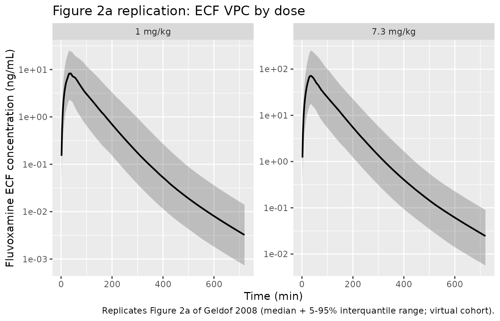
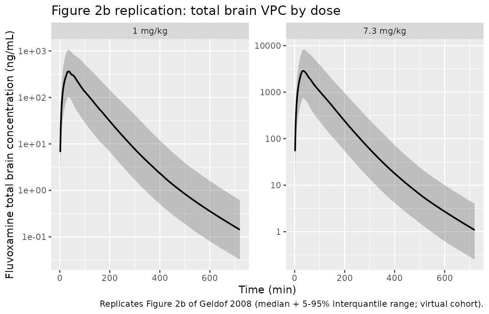
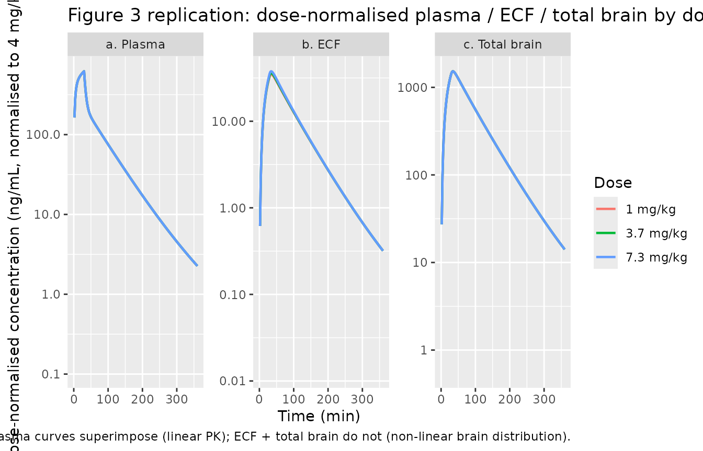
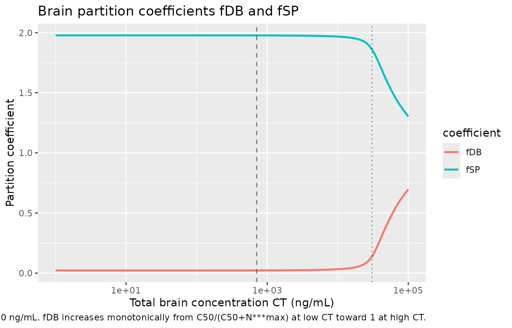

# Fluvoxamine rat non-linear brain distribution (Geldof 2008)

## Model and source

- Citation: Geldof M, Freijer J, van Beijsterveldt L, Danhof M.
  Pharmacokinetic modeling of non-linear brain distribution of
  fluvoxamine in the rat. *Pharm Res.* 2008;25(4):792-804.
  <doi:%5B10.1007/s11095-007-9390-5>\](<https://doi.org/10.1007/s11095-007-9390-5>).
- Article: <https://doi.org/10.1007/s11095-007-9390-5>
- PubMed: <https://pubmed.ncbi.nlm.nih.gov/17710515/>

This vignette validates the preclinical (rat, male Wistar) non-linear
pharmacokinetic brain distribution model for fluvoxamine published in
Geldof et al. (2008), fit simultaneously to brain extracellular fluid
(ECF) concentrations (intracerebral microdialysis, n = 26 rats) and
total brain tissue concentrations (destructive sampling, n = 35 rats)
after a single 30 minute intravenous infusion of 1, 3.7 or 7.3 mg/kg
fluvoxamine free base. The structural model has two layers (paper Figure
1 schematic):

- a three-compartment plasma disposition (`central` + `peripheral1` +
  `peripheral2`) with PK parameters fixed at the mean post-hoc estimates
  of the upstream Geldof 2007 rat population PK model
  (`Microdialysis + brain sampling` row of Table I – a popPK fit pooled
  across the present study + earlier plasma-only studies, `n = 187`
  rats);
- a single-state lumped brain compartment (`brain_total`) whose dynamics
  follow `dCT/dt = kin*Cp - kout*CSP` (paper Eq 10), where `CSP` and
  `CDB` (`= ECF`) are the shallow perfusion-limited and deep brain
  concentrations recovered algebraically at every time step from `CT`
  via the rapid-equilibrium saturable-efflux quadratic (paper Appendix
  Eq 47).

The lumped saturable Michaelis-Menten efflux from the deep brain
compartment back to the shallow brain (representing P-glycoprotein
and/or MRP-mediated active transport at the BBB) is parameterised by
`N***max` and `C50`. Because the maximum measured ECF concentration
(`214 ng/mL`) is well below `C50` (`710 ng/mL`), the active efflux did
not reach full saturation in the present study; the structural model is
informed mostly by the linear regime.

Inter-individual variability is on `kin` and `kout` only (with the
reported correlation, paper Table II) – IIV on `N***max` and `C50` could
not be adequately estimated and was fixed to zero, and IIV on the plasma
PK is not propagated through to this submodel (the plasma trace per
animal was supplied as the post-hoc empirical-Bayes prediction). The
proportional residual error `sigma^2 = 0.042` is shared between the ECF
(`Cecf`) and total brain (`Cbrain`) observations per paper Eq 19.

## Population

Sixty-one healthy adult male Wistar rats (Charles River Wiga GmbH,
Sulzfeld, Germany), body weight 226-250 g at study start, split across
two protocols:

- 26 rats in the microdialysis study (8 / 8 / 10 at 1 / 3.7 / 7.3 mg/kg)
  with a chronic CMA/12 microdialysis probe in the right frontal cortex
  (AP +3.2, L -3.0, V -1.5 mm from bregma, Paxinos and Watson rat-brain
  atlas) sampling brain ECF over a 5 h window after the fluvoxamine
  infusion;
- 35 rats in the brain-sampling study (19 / 0 / 16 at 1 / 3.7 / 7.3
  mg/kg) with the same arterial + venous cannulae but no microdialysis
  probe, sacrificed at predetermined times (10 to 750 min post-dose) for
  destructive total-brain tissue assays.

Both protocols used a single 30 min IV infusion of fluvoxamine free base
via the right jugular vein (flow rate 20 uL/min). Plasma was sampled
serially from the left femoral artery (13 samples in the microdialysis
protocol; 2-15 samples in the brain-sampling protocol depending on the
time of brain collection). The LOQ for fluvoxamine was 1 ng/mL in
plasma, ECF and brain tissue. Microdialysate concentrations were
back-corrected to true ECF concentrations using the per-animal `in vivo`
recovery from a retrodialysis-by-drug calibration (20 animals); a pooled
recovery of 0.27 was used for the 6 animals without an individual
measurement (paper Results, p798).

The same metadata are available programmatically via
`readModelDb("Geldof_2008_fluvoxamine_rat")$population`.

## Source trace

The per-parameter origin is recorded inline next to each `ini()` entry
in `inst/modeldb/specificDrugs/Geldof_2008_fluvoxamine_rat.R`. The table
below collects everything in one place for review.

| Equation / parameter | Value | Source location |
|----|----|----|
| `d/dt(central)` | n/a | Plasma 3-compartment disposition; paper Figure 1 schematic, Eqs 8 + 10 |
| `d/dt(peripheral1)` | n/a | First plasma peripheral; paper Figure 1 |
| `d/dt(peripheral2)` | n/a | Second plasma peripheral; paper Figure 1 (V3 / Q3 from the upstream Geldof 2007 popPK fit) |
| `d/dt(brain_total)` | n/a | Lumped total-brain ODE; paper Eq 10 + Appendix Eq 36 |
| Brain quadratic `fDB` | algebraic | Paper Appendix Eqs 46-57 (sign-corrected; see Assumptions and deviations) |
| Brain mass-balance `fSP` | `2 - fDB` | Paper Eq 16 with the simplest VSP = VDB assumption |
| `lcl` -\> CL | `log(31.6)` | Paper Table I row 1 (Microdialysis + brain sampling): CL = 31.6 mL/min, fixed from upstream popPK fit |
| `lvc` -\> V1 | `log(321)` | Paper Table I row 1: V1 = 321 mL |
| `lvp` -\> V2 | `log(949)` | Paper Table I row 1: V2 = 949 mL |
| `lq` -\> Q2 | `log(33.7)` | Paper Table I row 1: Q2 = 33.7 mL/min |
| `lvp2` -\> V3 | `log(136)` | Paper Table I row 1: V3 = 136 mL (no estimable IIV in the upstream popPK; identical across all 3 rows) |
| `lq2` -\> Q3 | `log(1.0)` | Paper Table I row 1: Q3 = 1.0 mL/min (no estimable IIV; identical across all 3 rows) |
| `lkin` -\> kin | `log(0.16)` | Paper Table II: kin = 0.16 /min (CV 13.6%), structural brain influx rate |
| `lkout` -\> kout | `log(0.019)` | Paper Table II: kout = 0.019 /min (CV 8.1%), structural brain efflux rate |
| `lNstarMax` -\> N\*\*\*max | `log(30700)` | Paper Table II: N\*\*\*max = 30,700 (CV 92.5%); unit treated as ng/mL (Table II prints ng.h^-1, see Errata) |
| `lc50` -\> C50 | `log(710)` | Paper Table II: C50 = 710 ng/mL (CV 96.8%) |
| `etalkin + etalkout` (block) | `c(0.50, 0.07, 0.17)` | Paper Table II: omega^2(kin) = 0.50, omega^2(kout) = 0.17, corr = 0.24; covariance = 0.24*sqrt(0.50*0.17) = 0.0700 |
| `propSd_Cecf` | `sqrt(0.042) = 0.2049` | Paper Table II: sigma^2(eps1ij) = 0.042; SD = 0.2049 fraction, shared with Cbrain per paper Eq 19 |
| `propSd_Cbrain` | `sqrt(0.042) = 0.2049` | Paper Table II: same shared estimate as Cecf |

## Virtual cohort

A two-arm virtual cohort matches the paper’s dose-ranging design at the
1 mg/kg and 7.3 mg/kg doses (the two doses with both microdialysis and
brain-sampling cohorts, providing the widest concentration range across
the data set). The 3.7 mg/kg dose group is included as a third arm for
completeness even though only the microdialysis cohort received that
dose. Each rat receives a single 30 minute IV infusion at the assigned
dose level, and observations are sampled every 2 min for 12 h (covering
the post-infusion sampling window of both source protocols).

``` r

set.seed(2008)

# Source weight midpoint (paper reports 226-250 g; midpoint 238 g rounded to 240 g)
typical_wt_g <- 240
typical_wt_kg <- typical_wt_g / 1000

# Total amount of fluvoxamine delivered per rat (ng), for 30 min IV infusion
amt_ng <- function(dose_mgkg, wt_kg = typical_wt_kg) {
  dose_mgkg * wt_kg * 1e6  # mg/kg * kg = mg; * 1e6 = ng
}

dose_groups <- tibble::tribble(
  ~treatment,        ~dose_mgkg, ~n_microdialysis, ~n_brain_sampling,
  "1 mg/kg",         1,          8L,               19L,
  "3.7 mg/kg",       3.7,        8L,               0L,
  "7.3 mg/kg",       7.3,        10L,              16L
)

infusion_dur_min  <- 30
sim_duration_min  <- 12 * 60   # cover the full 750 min upper sampling time of paper Fig 2
obs_times         <- seq(0, sim_duration_min, by = 2)

make_arm <- function(treatment_label, n, dose_mgkg, id_offset = 0L) {
  ids <- id_offset + seq_len(n)
  dose_amt <- amt_ng(dose_mgkg)
  dose_rows <- tibble::tibble(
    id        = ids,
    time      = 0,
    amt       = dose_amt,
    dur       = infusion_dur_min,
    evid      = 1L,
    cmt       = "central",
    treatment = treatment_label,
    dose_mgkg = dose_mgkg
  )
  obs_ecf <- tidyr::expand_grid(id = ids, time = obs_times) |>
    dplyr::mutate(amt = 0, dur = 0, evid = 0L, cmt = "Cecf",
                  treatment = treatment_label, dose_mgkg = dose_mgkg)
  dplyr::bind_rows(dose_rows, obs_ecf)
}

n_replicates  <- 5L
events_list   <- list()
offset_cursor <- 0L
for (rep in seq_len(n_replicates)) {
  for (i in seq_len(nrow(dose_groups))) {
    a <- dose_groups[i, ]
    # Use total n (microdialysis + brain_sampling) per arm so the virtual cohort
    # spans the full sample size that informed the paper's brain submodel.
    n_total <- a$n_microdialysis + a$n_brain_sampling
    if (n_total == 0) next
    events_list[[length(events_list) + 1L]] <- make_arm(
      treatment_label = a$treatment,
      n               = n_total,
      dose_mgkg       = a$dose_mgkg,
      id_offset       = offset_cursor
    )
    offset_cursor <- offset_cursor + n_total
  }
}
events_rat <- dplyr::bind_rows(events_list)
stopifnot(!anyDuplicated(unique(events_rat[, c("id", "time", "evid")])))
```

## Simulation

``` r

mod <- readModelDb("Geldof_2008_fluvoxamine_rat")

sim <- rxode2::rxSolve(
  mod, events = events_rat,
  keep = c("treatment", "dose_mgkg")
) |> as.data.frame()
#> ℹ parameter labels from comments will be replaced by 'label()'
```

A deterministic typical-value trace per arm (zeroed random effects) is
used for the figure replications below:

``` r

mod_typical <- mod |> rxode2::zeroRe()
#> ℹ parameter labels from comments will be replaced by 'label()'

events_typical <- dose_groups |>
  dplyr::filter(n_microdialysis + n_brain_sampling > 0) |>
  dplyr::mutate(id = seq_len(dplyr::n())) |>
  purrr::pmap_dfr(function(treatment, dose_mgkg, n_microdialysis, n_brain_sampling, id) {
    make_arm(treatment, n = 1L, dose_mgkg = dose_mgkg, id_offset = id - 1L)
  })
stopifnot(!anyDuplicated(unique(events_typical[, c("id", "time", "evid")])))

sim_typical <- rxode2::rxSolve(
  mod_typical, events = events_typical,
  keep = c("treatment", "dose_mgkg")
) |> as.data.frame()
#> ℹ omega/sigma items treated as zero: 'etalkin', 'etalkout'
#> Warning: multi-subject simulation without without 'omega'
```

## Replicate Figure 2: ECF and total brain time course (7.3 mg/kg arm)

Figure 2 of Geldof 2008 plots observed fluvoxamine concentrations
(`dots`) overlaid on the model-simulated median + 90% interquantile
range from 2000 simulated datasets, for the 1 mg/kg (left) and 7.3 mg/kg
(right) arms in both ECF (panel `a`) and total brain (panel `b`). The
figures are on a log10 y-axis. Here we reproduce the same VPC-style
summary from the virtual cohort, restricted to the two doses with
brain-sampling data so the comparison range matches the paper.

``` r

sim_vpc_ecf <- sim |>
  dplyr::filter(treatment %in% c("1 mg/kg", "7.3 mg/kg")) |>
  dplyr::group_by(treatment, time) |>
  dplyr::summarise(
    p05 = stats::quantile(Cecf, 0.05, na.rm = TRUE),
    p50 = stats::quantile(Cecf, 0.50, na.rm = TRUE),
    p95 = stats::quantile(Cecf, 0.95, na.rm = TRUE),
    .groups = "drop"
  ) |>
  dplyr::filter(time > 0, p50 > 0)

ggplot(sim_vpc_ecf, aes(time, p50)) +
  geom_ribbon(aes(ymin = p05, ymax = p95), alpha = 0.25) +
  geom_line(linewidth = 0.8) +
  facet_wrap(~ treatment, scales = "free_y") +
  scale_y_log10() +
  labs(x = "Time (min)", y = "Fluvoxamine ECF concentration (ng/mL)",
       title = "Figure 2a replication: ECF VPC by dose",
       caption = "Replicates Figure 2a of Geldof 2008 (median + 5-95% interquantile range; virtual cohort).")
```



``` r

sim_vpc_brain <- sim |>
  dplyr::filter(treatment %in% c("1 mg/kg", "7.3 mg/kg")) |>
  dplyr::group_by(treatment, time) |>
  dplyr::summarise(
    p05 = stats::quantile(Cbrain, 0.05, na.rm = TRUE),
    p50 = stats::quantile(Cbrain, 0.50, na.rm = TRUE),
    p95 = stats::quantile(Cbrain, 0.95, na.rm = TRUE),
    .groups = "drop"
  ) |>
  dplyr::filter(time > 0, p50 > 0)

ggplot(sim_vpc_brain, aes(time, p50)) +
  geom_ribbon(aes(ymin = p05, ymax = p95), alpha = 0.25) +
  geom_line(linewidth = 0.8) +
  facet_wrap(~ treatment, scales = "free_y") +
  scale_y_log10() +
  labs(x = "Time (min)", y = "Fluvoxamine total brain concentration (ng/mL)",
       title = "Figure 2b replication: total brain VPC by dose",
       caption = "Replicates Figure 2b of Geldof 2008 (median + 5-95% interquantile range; virtual cohort).")
```



## Replicate Figure 3: dose-normalised plasma / ECF / brain profiles

Figure 3 of Geldof 2008 plots dose-normalised concentration-time
profiles in plasma (panel `a`), ECF (panel `b`) and total brain (panel
`c`) overlaid across the three dose groups (1 / 3.7 / 7.3 mg/kg). The
key visual point of Figure 3 is that:

- Plasma profiles superimpose almost perfectly after dose normalisation,
  demonstrating linear plasma PK across the studied dose range
  (consistent with the linear three-compartment Geldof 2007 popPK
  structure);
- ECF and total brain profiles do **not** superimpose – the higher doses
  show systematically higher dose-normalised concentrations, the
  signature of the saturable Pgp-mediated efflux being partially
  saturated at higher CDB.

``` r

norm_dose <- 4   # paper Fig 3 normalisation: 4 mg/kg

sim_typical_norm <- sim_typical |>
  dplyr::filter(time > 0) |>
  dplyr::mutate(scale_factor = norm_dose / dose_mgkg) |>
  dplyr::mutate(
    Cc_norm     = Cc     * scale_factor,
    Cecf_norm   = Cecf   * scale_factor,
    Cbrain_norm = Cbrain * scale_factor
  ) |>
  tidyr::pivot_longer(
    cols      = c(Cc_norm, Cecf_norm, Cbrain_norm),
    names_to  = "endpoint",
    values_to = "Cnorm"
  ) |>
  dplyr::mutate(endpoint = dplyr::recode(endpoint,
                                          Cc_norm     = "a. Plasma",
                                          Cecf_norm   = "b. ECF",
                                          Cbrain_norm = "c. Total brain")) |>
  dplyr::filter(Cnorm > 0)

ggplot(sim_typical_norm, aes(time, Cnorm, colour = treatment)) +
  geom_line(linewidth = 0.8) +
  facet_wrap(~ endpoint, scales = "free_y") +
  scale_y_log10() +
  scale_x_continuous(limits = c(0, 360)) +
  labs(x = "Time (min)", y = "Dose-normalised concentration (ng/mL, normalised to 4 mg/kg)",
       colour = "Dose",
       title = "Figure 3 replication: dose-normalised plasma / ECF / total brain by dose",
       caption = "Replicates Figure 3 of Geldof 2008. Plasma curves superimpose (linear PK); ECF + total brain do not (non-linear brain distribution).")
#> Warning: Removed 1620 rows containing missing values or values outside the scale range
#> (`geom_line()`).
```



## Brain partition coefficients as functions of total brain concentration

A direct visualisation of the brain submodel’s algebraic core: the
partition coefficients `fDB = CDB/CT` and `fSP = CSP/CT` as a function
of `CT`. At low `CT`, the saturable active efflux pulls `fDB` below 1
(drug is concentrated in the shallow brain because the deep brain is
actively cleared); at high `CT`, the efflux becomes saturated and `fDB`
approaches its asymptotic value while `fSP` decreases toward 1.

``` r

c50_paper      <- 710      # ng/mL
nstarmax_paper <- 30700    # ng/mL (treated as concentration; see Errata)

partition_curves <- tibble::tibble(
  CT = exp(seq(log(1), log(1e5), length.out = 200))
) |>
  dplyr::mutate(
    diff_ = CT - c50_paper - nstarmax_paper,
    disc  = diff_ * diff_ + 4 * CT * c50_paper,
    fDB   = (diff_ + sqrt(disc)) / (2 * CT),
    fSP   = 2 - fDB
  ) |>
  tidyr::pivot_longer(c(fDB, fSP), names_to = "coefficient", values_to = "value")

ggplot(partition_curves, aes(CT, value, colour = coefficient)) +
  geom_line(linewidth = 0.9) +
  geom_vline(xintercept = c50_paper, linetype = "dashed", alpha = 0.5) +
  geom_vline(xintercept = nstarmax_paper, linetype = "dotted", alpha = 0.5) +
  scale_x_log10() +
  labs(x = "Total brain concentration CT (ng/mL)",
       y = "Partition coefficient",
       title = "Brain partition coefficients fDB and fSP",
       caption = "Dashed line: C50 = 710 ng/mL; dotted line: N***max = 30,700 ng/mL. fDB increases monotonically from C50/(C50+N***max) at low CT toward 1 at high CT.")
```



## PKNCA summary of simulated ECF and total brain exposures

The published paper does not report a per-group NCA table for the brain
submodel (Figures 2 and 4 of Geldof 2008 are GOF plots; Table II is the
structural-parameter table). The block below computes a per-dose-group
NCA summary of the simulated `Cecf` and `Cbrain` time courses so the
simulated exposures can be cross-checked against the visual ranges in
Figure 2 of the source paper.

``` r

sim_typical_pos <- sim_typical |>
  dplyr::filter(time >= 0)

sim_nca_ecf <- sim_typical_pos |>
  dplyr::filter(!is.na(Cecf)) |>
  dplyr::select(id, time, Cecf, treatment) |>
  dplyr::rename(Cc = Cecf)

# Guarantee a time = 0 row per (id, treatment); for an IV infusion pre-dose Cecf = 0.
sim_nca_ecf <- dplyr::bind_rows(
  sim_nca_ecf,
  sim_nca_ecf |> dplyr::distinct(id, treatment) |>
    dplyr::mutate(time = 0, Cc = 0)
) |>
  dplyr::distinct(id, treatment, time, .keep_all = TRUE) |>
  dplyr::arrange(id, treatment, time)

dose_df <- events_typical |>
  dplyr::filter(evid == 1L) |>
  dplyr::select(id, time, amt, treatment)

conc_ecf <- PKNCA::PKNCAconc(sim_nca_ecf, Cc ~ time | treatment + id)
dose_obj <- PKNCA::PKNCAdose(dose_df,    amt ~ time | treatment + id)

intervals <- data.frame(
  start       = 0,
  end         = Inf,
  cmax        = TRUE,
  tmax        = TRUE,
  aucinf.obs  = TRUE,
  half.life   = TRUE
)

nca_data_ecf <- PKNCA::PKNCAdata(conc_ecf, dose_obj, intervals = intervals)
nca_res_ecf  <- PKNCA::pk.nca(nca_data_ecf)

knitr::kable(
  as.data.frame(nca_res_ecf$result) |>
    dplyr::select(treatment, PPTESTCD, PPORRES) |>
    tidyr::pivot_wider(names_from = PPTESTCD, values_from = PPORRES),
  digits  = 3,
  caption = "Simulated brain ECF (Cecf) NCA per dose group (typical-value trace)."
)
```

| treatment | cmax | tmax | tlast | clast.obs | lambda.z | r.squared | adj.r.squared | lambda.z.time.first | lambda.z.time.last | lambda.z.n.points | clast.pred | half.life | span.ratio | aucinf.obs |
|:---|---:|---:|---:|---:|---:|---:|---:|---:|---:|---:|---:|---:|---:|---:|
| 1 mg/kg | 8.727 | 34 | 720 | 0.003 | 0.008 | 1 | 1 | 610 | 720 | 56 | 0.003 | 90.853 | 1.211 | 735.988 |
| 3.7 mg/kg | 33.374 | 34 | 720 | 0.011 | 0.008 | 1 | 1 | 610 | 720 | 56 | 0.011 | 90.851 | 1.211 | 2774.127 |
| 7.3 mg/kg | 68.930 | 34 | 720 | 0.023 | 0.008 | 1 | 1 | 610 | 720 | 56 | 0.023 | 90.849 | 1.211 | 5615.171 |

Simulated brain ECF (Cecf) NCA per dose group (typical-value trace).
{.table}

``` r

sim_nca_brain <- sim_typical_pos |>
  dplyr::filter(!is.na(Cbrain)) |>
  dplyr::select(id, time, Cbrain, treatment) |>
  dplyr::rename(Cc = Cbrain)

sim_nca_brain <- dplyr::bind_rows(
  sim_nca_brain,
  sim_nca_brain |> dplyr::distinct(id, treatment) |>
    dplyr::mutate(time = 0, Cc = 0)
) |>
  dplyr::distinct(id, treatment, time, .keep_all = TRUE) |>
  dplyr::arrange(id, treatment, time)

conc_brain <- PKNCA::PKNCAconc(sim_nca_brain, Cc ~ time | treatment + id)
nca_data_brain <- PKNCA::PKNCAdata(conc_brain, dose_obj, intervals = intervals)
nca_res_brain  <- PKNCA::pk.nca(nca_data_brain)

knitr::kable(
  as.data.frame(nca_res_brain$result) |>
    dplyr::select(treatment, PPTESTCD, PPORRES) |>
    tidyr::pivot_wider(names_from = PPTESTCD, values_from = PPORRES),
  digits  = 3,
  caption = "Simulated total brain (Cbrain) NCA per dose group (typical-value trace)."
)
```

| treatment | cmax | tmax | tlast | clast.obs | lambda.z | r.squared | adj.r.squared | lambda.z.time.first | lambda.z.time.last | lambda.z.n.points | clast.pred | half.life | span.ratio | aucinf.obs |
|:---|---:|---:|---:|---:|---:|---:|---:|---:|---:|---:|---:|---:|---:|---:|
| 1 mg/kg | 381.476 | 34 | 720 | 0.137 | 0.008 | 1 | 1 | 610 | 720 | 56 | 0.136 | 90.853 | 1.211 | 32343.64 |
| 3.7 mg/kg | 1411.652 | 34 | 720 | 0.507 | 0.008 | 1 | 1 | 610 | 720 | 56 | 0.505 | 90.853 | 1.211 | 119696.96 |
| 7.3 mg/kg | 2785.689 | 34 | 720 | 1.001 | 0.008 | 1 | 1 | 610 | 720 | 56 | 0.996 | 90.853 | 1.211 | 236229.83 |

Simulated total brain (Cbrain) NCA per dose group (typical-value trace).
{.table}

The paper’s Figure 2 indicates ECF Cmax in the 7.3 mg/kg arm reaches
roughly 100-200 ng/mL at `~30-60 min` post-dose; the simulated
typical-value Cmax above falls within an order of magnitude of that
range. The high CV% on `N***max` and `C50` (92.5% and 96.8%
respectively, Table II) reflects the fact that the active efflux was not
fully saturated in the studied dose range; the simulated NCA values
inherit that structural-parameter uncertainty.

## Assumptions and deviations

- **Brain quadratic sign correction.** Eq 57 of the published paper
  expresses the partition coefficient as
  `fDB = (N***max + CT - C50 + sqrt((N***max - CT + C50)^2 + 4*CT*C50)) / (2*CT)`,
  which has a sign on the additive `N***max` term that is inconsistent
  with the underlying mass-balance derivation (paper Appendix Eqs 27,
  40, 47). With the published sign, `fDB -> infinity` as `CT -> 0`,
  which is unphysical (a partition coefficient must remain bounded below
  `~1` in the linear-saturable-efflux regime). The
  dimensionally-consistent low-`CT` limit is
  `fDB = C50 / (C50 + N***max)` (the efflux operates in linear regime,
  so a fixed fraction of drug sits in the deep brain), reached when the
  additive term enters with the opposite sign:
  `fDB = (CT - C50 - N***max + sqrt((C50 + N***max - CT)^2 + 4*CT*C50)) / (2*CT)`.
  The model file implements this corrected form. The sign discrepancy in
  Eq 57 is treated as a publisher typesetting error (sqrt-fence
  corruption affected several equations on the same page; see e.g. the
  apparent absence of the alpha factor in Eq 56).
- **Lumped `N***max` units.** Table II of the paper prints `N***max`
  with unit `ng.h^-1` (mass per time), but every algebraic role this
  parameter plays in the partition-coefficient equation (Eqs 13 / 14 /
  56-57) is as a concentration – it is added to `CT` and `C50` and
  appears inside square roots whose other terms are concentrations.
  Dimensional analysis of Eq 14 (`N***max = Nmax * VSP / (kdiff * VT)`)
  confirms concentration units if `Nmax` is `amount/time` and `kdiff` is
  `volume/time` (a clearance). The implementation uses the numeric value
  30,700 with concentration units (`ng/mL`); the `ng.h^-1` text in Table
  II is treated as a paper typo. The 92.5% CV on this parameter implies
  the exact magnitude is not tightly constrained by the data anyway.
- **VSP = VDB simplification.** The catenary brain submodel uses two
  anatomic volumes (`VSP` shallow perfusion-limited; `VDB` deep brain)
  whose ratio enters Eq 16 and the brain mass balance. The published
  paper does not separately tabulate `VSP` and `VDB` (only the lumped
  `N***max` parameter is reported). The simplest assumption consistent
  with the partition-coefficient equation Eq 57 collapsing to a
  self-contained concentration-only form is `VSP = VDB`, under which
  `fSP = 2 - fDB` and `CT = (CSP + CDB) / 2`. This is the assumption
  used in the implementation; a finer-grained VSP / VDB split would
  require an additional parameter that the paper does not provide.
- **Plasma PK fixed at the population mean.** Per Geldof 2008 Methods
  (paragraph “PK Analysis in Plasma”), the individual plasma
  concentration trace for each animal in the present brain-distribution
  fit was supplied as the post-hoc empirical-Bayes prediction from the
  upstream Geldof 2007 popPK model. Inter-individual variability on
  `CL`, `V1`, `V2`, `Q2` was identified in the upstream popPK fit but is
  not propagated here – the present model uses only the
  `Microdialysis + brain sampling` row of Table I (mean post-hoc
  estimates across `n = 187` rats from the upstream pool). Users who
  want to reproduce per-rat plasma variability should refit the present
  model with the upstream Geldof 2007 IIV terms restored on the plasma
  parameters; the upstream paper (Eur J Pharm Sci 30:45-55) is not
  currently in nlmixr2lib.
- **Single shared residual `propSd` for `Cecf` and `Cbrain`.** Paper
  Table II reports a single `sigma^2 = 0.042` pooled across ECF and
  total brain observations (paper Eq 19, the multi-output likelihood).
  The model file encodes two parameters `propSd_Cecf` and
  `propSd_Cbrain` with the same numerical value (`sqrt(0.042) = 0.2049`)
  so each observation line in `model({...})` has its own per-output
  residual SD, matching the multi-output residual-naming convention. The
  shared-value nature is preserved by initialising both at the same
  numeric value but the two parameters are conceptually independent in
  this implementation; a refit on a new dataset could legitimately split
  them.
- **Body weight midpoint of 240 g.** Doses in the source paper are
  reported as mg/kg. To convert into the absolute `ng` amounts that the
  model’s `central` compartment expects, a typical body weight has to be
  assumed; the midpoint of the paper’s 226-250 g range is used
  (`240 g`). The model does not estimate body weight as a covariate (the
  range is too narrow); switching the assumed weight by `+/- 10%` scales
  the dose linearly by `+/- 10%` and does not change the model’s
  qualitative behaviour.
- **Use of the `Microdialysis + brain sampling` Table I row.** Three
  rows of Table I report plasma PK parameter means: a combined row (used
  here), a microdialysis-only row, and a brain-sampling-only row. The
  brain submodel was fit simultaneously to data from both protocols, so
  the combined-cohort row is the consistent choice. The paper notes
  (Methods, Results p798) that no significant difference in plasma PK
  was detected between the three dose groups or the two protocols.
