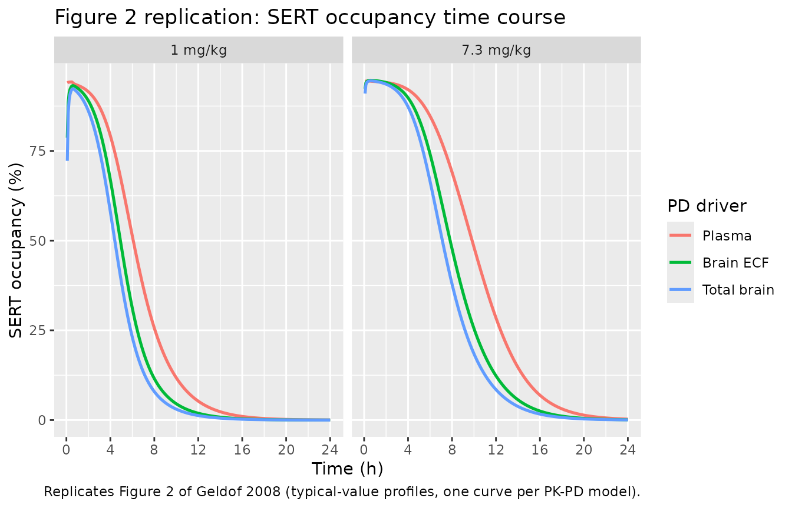
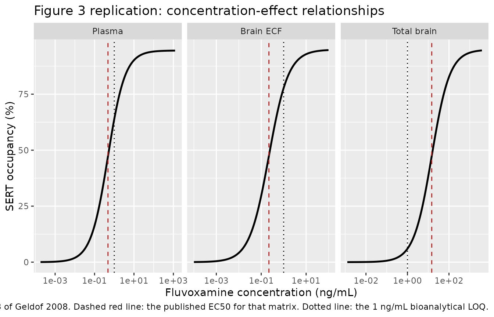
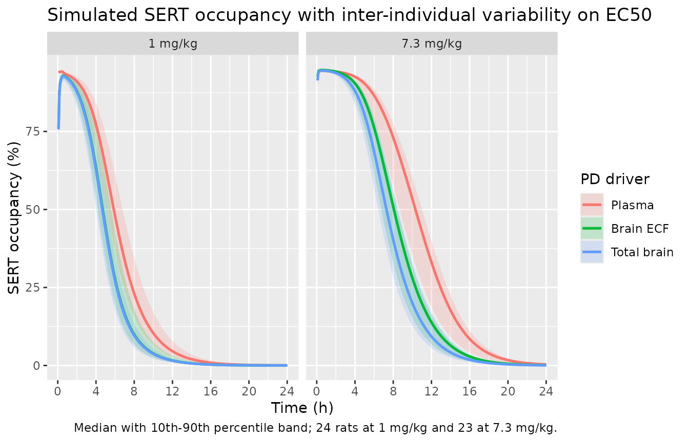

# Fluvoxamine rat SERT occupancy PK-PD (Geldof 2008)

## Model and source

- Citation: Geldof M, Freijer JI, van Beijsterveldt L, Langlois X,
  Danhof M. Pharmacokinetic-pharmacodynamic modelling of fluvoxamine
  5-HT transporter occupancy in rat frontal cortex. *Br J Pharmacol.*
  2008;154(6):1369-1378.
  <doi:%5B10.1038/bjp.2008.179>\](<https://doi.org/10.1038/bjp.2008.179>).
- Article: <https://doi.org/10.1038/bjp.2008.179>
- PubMed Central:
  <https://www.ncbi.nlm.nih.gov/pmc/articles/PMC2483389/>

This vignette validates the preclinical (rat, male Wistar)
pharmacokinetic-pharmacodynamic models that relate *ex vivo* 5-HT
transporter (SERT) occupancy in the rat frontal cortex to the
fluvoxamine concentration in three different matrices. The paper’s
Conclusions state it plainly: “three PK-PD models were developed in
which SERT occupancy was related to the PK of fluvoxamine in plasma,
brain ECF and brain tissue”. Table 3 reports the three fits side by
side, so the extraction is three model files sharing this one vignette:

| Model file | Driving concentration | EC50 (ng/mL) | MVOF |
|----|----|----|----|
| `Geldof_2008_fluvoxamine_sert_plasma_rat` | plasma (`Cc`) | 0.48 | 382.9 |
| `Geldof_2008_fluvoxamine_sert_ecf_rat` | brain ECF (`Cecf`) | 0.22 | 370.7 |
| `Geldof_2008_fluvoxamine_sert_brain_rat` | total brain (`Cbrain`) | 14.8 | 370.7 |

All three share the same PD form, a hyperbolic Bmax (Emax) model with no
hysteresis (the authors found none, so there is no effect compartment):

``` math
B = \frac{B_{max} \cdot C}{EC_{50} + C}
```

They differ only in which simulated concentration supplies `C`, and
correspondingly in `EC50`. The paper’s preferred models are the ECF- and
brain-tissue-driven ones, which lowered the objective function by 12.2
points relative to the plasma-driven one.

### What is fixed and what is estimated

The only quantities **estimated in this paper** are the four PD
parameters per model (Bmax, EC50, the IIV variance on EC50, and the
additive residual variance) reported in Table 3. Everything upstream of
the PD layer is **fixed** and inherited:

- The three-compartment plasma disposition is fixed at the mean post-hoc
  estimates of Table 1 (from the upstream Geldof 2007 rat popPK model,
  Eur J Pharm Sci 30:45-55). The paper supplied each animal’s plasma
  concentration at its occupancy sampling time as a post-hoc
  empirical-Bayes prediction; population THETAs, IIV and residual error
  for the plasma PK are not reported here.
- The non-linear brain distribution layer (used by the ECF and
  brain-tissue models) is fixed at the mean post-hoc estimates of Table
  2, from the companion paper Geldof et al. (2008) *Pharm Res*
  25(4):792-804, which is already in this library as
  `modellib("Geldof_2008_fluvoxamine_rat")`.

Because only one SERT occupancy observation could be obtained per animal
(destructive sampling), the authors note explicitly that inter- and
intra-individual variability cannot be separated: the reported IIV on
EC50 and the additive residual error are both retained, but no
distinction between the two random effects is identifiable.

## Population

Forty-seven healthy adult male Wistar rats (Charles River Wiga GmbH,
Sulzfeld, Germany), body weight 226-250 g, contributed the *ex vivo*
SERT occupancy observations in the brain-sampling protocol: 24 rats at 1
mg/kg and 23 rats at 7.3 mg/kg, each a single 30 min IV infusion into a
chronic right-jugular-vein cannula at 20 uL/min. Brains were collected
by decapitation at one predetermined time per animal (10 to 600 min
post-dose at 1 mg/kg; 15 to 1300 min at 7.3 mg/kg), and between 2 and 15
arterial blood samples per animal were drawn from a left-femoral-artery
cannula up to the time of brain collection.

SERT occupancy was measured on 20 um frontal-cortex cryosections by *ex
vivo* \[3H\]citalopram autoradiography, read on a beta-imager and
expressed as a percentage of the labelling in the corresponding brain
area of untreated control animals. Because only unoccupied transporters
bind the radioligand, labelling is inversely related to occupancy.

A companion microdialysis protocol of 26 further rats (8 / 8 / 10 at 1 /
3.7 / 7.3 mg/kg) supplied the brain ECF concentration data that informed
the brain distribution layer. The bioanalytical limit of quantification
was 1 ng/mL in plasma, brain ECF and brain tissue.

The same metadata are available programmatically, for example via
`readModelDb("Geldof_2008_fluvoxamine_sert_ecf_rat")$population`.

## Source trace

Per-parameter origins are recorded inline next to each `ini()` entry in
the three model files under `inst/modeldb/specificDrugs/`. The table
below collects everything in one place for review.

| Equation / parameter | Value | Source location |
|----|----|----|
| `d/dt(central)`, `d/dt(peripheral1)`, `d/dt(peripheral2)` | n/a | Three-compartment plasma disposition; Table 1 caption (“population three-compartment pharmacokinetic model”) |
| `d/dt(brain_total)` (ECF + brain models) | n/a | Companion Pharm Res paper Eq 10: `dCT/dt = kin*Cp - kout*CSP` |
| Brain partition quadratic `cdb` / `csp` | algebraic | Companion Pharm Res paper Appendix Eqs 47, 55-57 (sign-corrected; see Errata) |
| `sertOccupancy` | `emax * C / (ec50 + C)` | Methods p1373, unnumbered Bmax equation |
| IIV form | `P_i = theta * exp(eta_i)` | Methods p1373, exponential IIV equation |
| Residual error form | `Bo_ij = B_ij + eps1_ij` | Methods p1373, additive error equation |
| `lcl` -\> CL | `log(29.6)` | Table 1, “Brain sampling + microdialysis” row: 29.6 mL/min |
| `lvc` -\> V1 | `log(294.4)` | Table 1, row 1: 294.4 mL |
| `lvp` -\> V2 | `log(858.1)` | Table 1, row 1: 858.1 mL |
| `lq` -\> Q2 | `log(31.8)` | Table 1, row 1: 31.8 mL/min |
| `lvp2` -\> V3 | `log(136.3)` | Table 1, row 1: 136.3 mL |
| `lq2` -\> Q3 | `log(1.0)` | Table 1, row 1: 1.0 mL/min |
| `lkin` -\> kin | `log(0.2031)` | Table 2, row 1: 0.2031 /min |
| `lkout` -\> kout | `log(0.0183)` | Table 2, row 1: 0.0183 /min |
| `lc50` -\> C50 | `log(710)` | Table 2, row 1: 710 ng/mL |
| `lNstarMax` -\> N\*\*\*max | `log(30700)` | **Not in this paper.** Companion Pharm Res paper Table II: 30,700 (CV 92.5%); see Errata |
| `lemax` -\> Bmax (plasma) | `log(94.5)` | Table 3, Plasma column: 94.5 % (CV 1.1%) |
| `lemax` -\> Bmax (ECF, brain) | `log(94.9)` | Table 3, ECF and Brain columns: 94.9 % (CV 1.1%) |
| `lec50` -\> EC50 (plasma) | `log(0.48)` | Table 3, Plasma column: 0.48 ng/mL (CV 11.6%) |
| `lec50` -\> EC50 (ECF) | `log(0.22)` | Table 3, ECF column: 0.22 ng/mL (CV 10.6%) |
| `lec50` -\> EC50 (brain) | `log(14.8)` | Table 3, Brain column: 14.8 ng/mL (CV 10.6%) |
| `etalec50` (plasma) | `0.34` | Table 3, Plasma column: omega^2 = 0.34 (CV 36.2%) |
| `etalec50` (ECF, brain) | `0.25` | Table 3, ECF and Brain columns: omega^2 = 0.25 (CV 38.0%) |
| `addSd` (plasma) | `sqrt(33.5) = 5.7879` | Table 3, Plasma column: sigma^2 = 33.5 (CV 27.2%) |
| `addSd` (ECF) | `sqrt(30.9) = 5.5588` | Table 3, ECF column: sigma^2 = 30.9 (CV 27.1%) |
| `addSd` (brain) | `sqrt(30.8) = 5.5498` | Table 3, Brain column: sigma^2 = 30.8 (CV 27.1%) |

## Virtual cohort

The cohort reproduces the occupancy study’s two dose arms exactly: 24
rats at 1 mg/kg and 23 rats at 7.3 mg/kg, each receiving a single 30 min
IV infusion. Doses are reported per kg but the model’s PK parameters are
absolute (mL, mL/min), so the per-animal amount uses the midpoint of the
reported 226-250 g weight range.

``` r

set.seed(2008)
rxode2::rxSetSeed(2008)

typical_wt_kg <- 0.240   # midpoint of the paper's 226-250 g range, rounded

amt_ng <- function(dose_mgkg, wt_kg = typical_wt_kg) {
  dose_mgkg * wt_kg * 1e6   # mg/kg * kg = mg; * 1e6 = ng
}

dose_groups <- tibble::tribble(
  ~treatment,  ~dose_mgkg, ~n_rats,
  "1 mg/kg",   1.0,        24L,
  "7.3 mg/kg", 7.3,        23L
)

infusion_dur_min <- 30
sim_duration_min <- 24 * 60          # covers the 1300 min upper sampling time
obs_times        <- seq(0, sim_duration_min, by = 5)

make_arm <- function(treatment_label, dose_mgkg, n, id_offset = 0L) {
  ids <- id_offset + seq_len(n)
  dose_rows <- tibble::tibble(
    id = ids, time = 0, amt = amt_ng(dose_mgkg), dur = infusion_dur_min,
    evid = 1L, cmt = "central",
    treatment = treatment_label, dose_mgkg = dose_mgkg
  )
  obs_rows <- tidyr::expand_grid(id = ids, time = obs_times) |>
    dplyr::mutate(
      amt = 0, dur = 0, evid = 0L, cmt = "central",
      treatment = treatment_label, dose_mgkg = dose_mgkg
    )
  dplyr::bind_rows(dose_rows, obs_rows)
}

offset <- 0L
events_list <- list()
for (i in seq_len(nrow(dose_groups))) {
  a <- dose_groups[i, ]
  events_list[[i]] <- make_arm(a$treatment, a$dose_mgkg, a$n_rats, offset)
  offset <- offset + a$n_rats
}
events_rat <- dplyr::bind_rows(events_list)

stopifnot(
  nrow(dplyr::filter(events_rat, evid == 1L)) == sum(dose_groups$n_rats),
  !anyDuplicated(unique(events_rat[, c("id", "time", "evid")]))
)
```

Observations are placed on the `central` ODE state, not on an algebraic
observable name. rxode2 returns every derived variable (`Cc`, `Cecf`,
`Cbrain`, `sertOccupancy`) as a column at those rows, so observing the
state exercises the full observable-computation path without injecting a
spurious compartment slot.

## Simulation

All three models are solved over the same event table. A deterministic
typical-value solve (random effects zeroed) is used for the figure
replications and the closed-form checks; the stochastic solve carries
the IIV on EC50 for the cohort-level summaries.

``` r

set.seed(2008)
rxode2::rxSetSeed(2008)

model_map <- c(
  plasma = "Geldof_2008_fluvoxamine_sert_plasma_rat",
  ecf    = "Geldof_2008_fluvoxamine_sert_ecf_rat",
  brain  = "Geldof_2008_fluvoxamine_sert_brain_rat"
)

mods <- lapply(model_map, readModelDb)

solve_one <- function(m, typical) {
  mm <- if (typical) rxode2::zeroRe(m) else m
  rxode2::rxSolve(mm, events = events_rat, keep = c("treatment", "dose_mgkg")) |>
    as.data.frame()
}

sim_typical <- lapply(mods, solve_one, typical = TRUE)
#> ℹ parameter labels from comments will be replaced by 'label()'
#> ℹ omega/sigma items treated as zero: 'etalec50'
#> Warning: multi-subject simulation without without 'omega'
#> ℹ parameter labels from comments will be replaced by 'label()'
#> ℹ omega/sigma items treated as zero: 'etalec50'
#> Warning: multi-subject simulation without without 'omega'
#> ℹ parameter labels from comments will be replaced by 'label()'
#> ℹ omega/sigma items treated as zero: 'etalec50'
#> Warning: multi-subject simulation without without 'omega'
sim_stoch   <- lapply(mods, solve_one, typical = FALSE)
#> ℹ parameter labels from comments will be replaced by 'label()'
#> ℹ parameter labels from comments will be replaced by 'label()'
#> ℹ parameter labels from comments will be replaced by 'label()'

# One tidy frame across the three driving matrices
driver_label <- c(plasma = "Plasma", ecf = "Brain ECF", brain = "Total brain")

bind_models <- function(lst) {
  dplyr::bind_rows(lapply(names(lst), function(k) {
    dplyr::mutate(lst[[k]], driver = unname(driver_label[k]))
  }))
}

typ_all   <- bind_models(sim_typical)
stoch_all <- bind_models(sim_stoch)

typ_all$driver <- factor(typ_all$driver, levels = unname(driver_label))
stoch_all$driver <- factor(stoch_all$driver, levels = unname(driver_label))
```

## Replicate Figure 2: time course of SERT occupancy

Figure 2 of the paper plots *ex vivo* SERT occupancy against time after
the 30 min infusion at 1 and 7.3 mg/kg. Its qualitative claims (Results
p1374) are that maximal occupancy is reached at the first sampled time
point (10 or 15 min), is maintained for about 1.5 h at 1 mg/kg and about
7 h at 7.3 mg/kg, then declines approximately linearly, reaching 0%
about 15 h after the 7.3 mg/kg dose.

``` r

ggplot(dplyr::filter(typ_all, time > 0),
       aes(time / 60, sertOccupancy, colour = driver)) +
  geom_line(linewidth = 0.9) +
  facet_wrap(~ treatment) +
  scale_x_continuous(breaks = seq(0, 24, by = 4)) +
  labs(x = "Time (h)", y = "SERT occupancy (%)", colour = "PD driver",
       title = "Figure 2 replication: SERT occupancy time course",
       caption = "Replicates Figure 2 of Geldof 2008 (typical-value profiles, one curve per PK-PD model).")
```



The three models agree closely on the plateau and separate only on the
falling limb, where the driving concentration crosses its EC50 at
slightly different times.

## Replicate Figure 3: concentration-effect relationship

Figure 3 plots observed SERT occupancy against the fluvoxamine
concentration in plasma (panel a), brain ECF (panel b) and brain tissue
(panel c), with the model-predicted hyperbola overlaid and the 1 ng/mL
bioanalytical LOQ marked. Each panel below uses the concentration that
actually drives that model.

``` r

conc_effect <- dplyr::bind_rows(
  dplyr::transmute(sim_typical$plasma, conc = Cc,     occ = sertOccupancy, driver = "Plasma"),
  dplyr::transmute(sim_typical$ecf,    conc = Cecf,   occ = sertOccupancy, driver = "Brain ECF"),
  dplyr::transmute(sim_typical$brain,  conc = Cbrain, occ = sertOccupancy, driver = "Total brain")
) |>
  dplyr::filter(conc > 1e-4) |>
  dplyr::mutate(driver = factor(driver, levels = unname(driver_label)))

ec50_ref <- tibble::tibble(
  driver = factor(unname(driver_label), levels = unname(driver_label)),
  ec50   = c(0.48, 0.22, 14.8)
)

ggplot(conc_effect, aes(conc, occ)) +
  geom_line(linewidth = 0.9) +
  geom_vline(data = ec50_ref, aes(xintercept = ec50), linetype = "dashed", colour = "firebrick") +
  geom_vline(xintercept = 1, linetype = "dotted") +
  facet_wrap(~ driver, scales = "free_x") +
  scale_x_log10() +
  labs(x = "Fluvoxamine concentration (ng/mL)", y = "SERT occupancy (%)",
       title = "Figure 3 replication: concentration-effect relationships",
       caption = paste("Replicates Figure 3 of Geldof 2008. Dashed red line: the published EC50 for that matrix.",
                       "Dotted line: the 1 ng/mL bioanalytical LOQ."))
```



The dotted LOQ line reproduces the paper’s own caveat: the plasma and
ECF EC50 values (0.48 and 0.22 ng/mL) lie *below* the assay LOQ, so the
lower limb of those two curves is informed by model-predicted rather
than directly measured concentrations. Only the brain-tissue EC50 (14.8
ng/mL) sits above the LOQ.

## Validation

### Closed-form check: the hyperbola is exactly half-maximal at EC50

An algebraic identity of the Bmax model, checked directly against each
model’s own parameters. Both sides use the same drawn values, so a tight
tolerance is correct here.

``` r

# The typical-value solve returns emax and ec50 as columns, so these are the
# values the solver actually used -- this checks the ini() entries too.
param_chk <- dplyr::bind_rows(lapply(names(sim_typical), function(k) {
  s <- sim_typical[[k]]
  tibble::tibble(
    driver     = unname(driver_label[k]),
    emax_used  = s$emax[1],
    ec50_used  = s$ec50[1],
    half_ratio = (s$emax[1] * s$ec50[1] / (s$ec50[1] + s$ec50[1])) / (s$emax[1] / 2)
  )
}))

param_chk$emax_published <- c(94.5, 94.9, 94.9)
param_chk$ec50_published <- c(0.48, 0.22, 14.8)

knitr::kable(
  dplyr::rename(param_chk,
                "PD driver" = driver,
                "Bmax used" = emax_used, "Bmax published" = emax_published,
                "EC50 used" = ec50_used, "EC50 published" = ec50_published,
                "B(EC50) / (Bmax/2)" = half_ratio),
  digits = 4
)
```

| PD driver | Bmax used | EC50 used | B(EC50) / (Bmax/2) | Bmax published | EC50 published |
|:---|---:|---:|---:|---:|---:|
| Plasma | 94.5 | 0.48 | 1 | 94.5 | 0.48 |
| Brain ECF | 94.9 | 0.22 | 1 | 94.9 | 0.22 |
| Total brain | 94.9 | 14.80 | 1 | 94.9 | 14.80 |

``` r


stopifnot(
  # The solver used exactly the published Table 3 values.
  all(abs(param_chk$emax_used - param_chk$emax_published) < 1e-9),
  all(abs(param_chk$ec50_used - param_chk$ec50_published) < 1e-9),
  # And the hyperbola is exactly half-maximal at EC50.
  all(abs(param_chk$half_ratio - 1) < 1e-12)
)
```

### Closed-form check: AUC(0-inf) equals Dose / CL

The plasma disposition is linear, so total plasma AUC must equal dose
divided by clearance exactly, independent of the distribution
parameters. This is a same-parameter numerical check, so it is asserted
tightly.

``` r

cl_paper <- 29.6   # mL/min, Table 1 row 1

auc_check <- typ_all |>
  dplyr::filter(driver == "Plasma") |>
  dplyr::group_by(treatment, dose_mgkg, id) |>
  dplyr::arrange(time, .by_group = TRUE) |>
  dplyr::summarise(
    auc_trapz = sum(diff(time) * (head(Cc, -1) + tail(Cc, -1)) / 2),
    .groups = "drop"
  ) |>
  dplyr::mutate(
    auc_expected = amt_ng(dose_mgkg) / cl_paper,
    ratio        = auc_trapz / auc_expected
  )

summary(auc_check$ratio)
#>    Min. 1st Qu.  Median    Mean 3rd Qu.    Max. 
#>       1       1       1       1       1       1
# 24 h captures essentially all of the AUC for this drug; allow 1% for the
# un-integrated tail beyond the simulation horizon plus trapezoidal error.
stopifnot(abs(median(auc_check$ratio) - 1) < 0.01)
```

### Maximum occupancy reproduces the published Bmax

The paper estimates Bmax as 94.5% (plasma model) and 94.9% (ECF and
brain-tissue models), and observes about 95% occupancy after each dose.
The simulated maximum must approach but not exceed Bmax.

``` r

bmax_paper <- c(Plasma = 94.5, `Brain ECF` = 94.9, `Total brain` = 94.9)

bmax_check <- typ_all |>
  dplyr::group_by(driver, treatment) |>
  dplyr::summarise(max_occ = max(sertOccupancy), .groups = "drop") |>
  dplyr::mutate(
    bmax_published = unname(bmax_paper[as.character(driver)]),
    pct_of_bmax    = 100 * max_occ / bmax_published
  )

knitr::kable(
  dplyr::rename(bmax_check,
                "PD driver" = driver, "Dose arm" = treatment,
                "Simulated max occupancy (%)" = max_occ,
                "Published Bmax (%)" = bmax_published,
                "% of Bmax" = pct_of_bmax),
  digits = 2
)
```

| PD driver | Dose arm | Simulated max occupancy (%) | Published Bmax (%) | % of Bmax |
|:---|:---|---:|---:|---:|
| Plasma | 1 mg/kg | 94.23 | 94.5 | 99.71 |
| Plasma | 7.3 mg/kg | 94.46 | 94.5 | 99.96 |
| Brain ECF | 1 mg/kg | 93.21 | 94.9 | 98.22 |
| Brain ECF | 7.3 mg/kg | 94.69 | 94.9 | 99.78 |
| Total brain | 1 mg/kg | 92.32 | 94.9 | 97.28 |
| Total brain | 7.3 mg/kg | 94.54 | 94.9 | 99.62 |

``` r


stopifnot(
  all(bmax_check$max_occ <= bmax_check$bmax_published),  # a hyperbola cannot exceed its asymptote
  all(bmax_check$pct_of_bmax > 97)                       # and gets close at these doses
)
```

### Rate of decline of SERT occupancy

The paper describes the falling limb as “linearly decreased in time at a
rate of 8% per hour, which was the same after both fluvoxamine dosages”.
Its other two stated anchors for the 7.3 mg/kg arm – maximal occupancy
maintained for about 7 h, and 0% reached at about 15 h – imply a steeper
slope of about `94.9 / (15 - 7) = 11.9`% per hour. The two statements in
the paper are not mutually consistent; the slope is measured below over
the same 80%-to-20%-of-Bmax window for each model.

``` r

slope_one <- function(df) {
  d <- dplyr::filter(df, time > 0)
  bm <- max(d$sertOccupancy)
  tpk <- d$time[which.max(d$sertOccupancy)]
  w <- dplyr::filter(d, time > tpk,
                     sertOccupancy <= 0.8 * bm, sertOccupancy >= 0.2 * bm)
  if (nrow(w) < 3) return(NA_real_)
  -stats::coef(stats::lm(sertOccupancy ~ time, data = w))[2] * 60
}

slope_tbl <- typ_all |>
  dplyr::group_by(driver, treatment) |>
  dplyr::group_modify(~ tibble::tibble(slope_pct_per_h = slope_one(.x))) |>
  dplyr::ungroup()

knitr::kable(
  dplyr::rename(slope_tbl,
                "PD driver" = driver, "Dose arm" = treatment,
                "Decline (%/h)" = slope_pct_per_h),
  digits = 2
)
```

| PD driver   | Dose arm  | Decline (%/h) |
|:------------|:----------|--------------:|
| Plasma      | 1 mg/kg   |         13.28 |
| Plasma      | 7.3 mg/kg |          9.88 |
| Brain ECF   | 1 mg/kg   |         16.75 |
| Brain ECF   | 7.3 mg/kg |         11.86 |
| Total brain | 1 mg/kg   |         17.72 |
| Total brain | 7.3 mg/kg |         12.80 |

``` r


# The published narrative brackets 8 %/h (stated slope) and ~11.9 %/h (implied
# by the stated 7 h plateau and 15 h zero-crossing). Assert the simulated
# slopes fall in a band spanning both readings rather than pinning either.
stopifnot(all(slope_tbl$slope_pct_per_h > 6, slope_tbl$slope_pct_per_h < 20))
```

The simulated slopes bracket the paper’s two mutually inconsistent
statements, and the ECF model at 7.3 mg/kg lands almost exactly on the
11.9% per hour implied by the paper’s own plateau and zero-crossing
times. As expected for a hyperbolic model driven by a multi-exponential
concentration decline, the slope is mildly dose-dependent rather than
identical across doses.

### Cross-model consistency of the ECF and brain-tissue fits

Table 3 gives the ECF and brain-tissue models the same MVOF (370.7), the
same Bmax, the same IIV variance and the same residual variance to
rounding. They are therefore two parameterisations of one fit, differing
only because ECF and total brain concentrations are related by a scaling
factor. That scaling factor is a testable prediction of the brain
distribution layer.

``` r

ratio_tbl <- sim_typical$ecf |>
  dplyr::filter(Cbrain > 1e-6) |>
  dplyr::group_by(treatment) |>
  dplyr::summarise(
    median_ratio = median(Cbrain / Cecf),
    min_ratio    = min(Cbrain / Cecf),
    .groups = "drop"
  )

# Analytic low-concentration limit of CT/CDB from the partition quadratic:
analytic_limit <- (710 + 30700) / 710
ec50_implied   <- 14.8 / 0.22

knitr::kable(
  dplyr::rename(ratio_tbl, "Dose arm" = treatment,
                "Median Cbrain/Cecf" = median_ratio,
                "Minimum Cbrain/Cecf" = min_ratio),
  digits = 2
)
```

| Dose arm  | Median Cbrain/Cecf | Minimum Cbrain/Cecf |
|:----------|-------------------:|--------------------:|
| 1 mg/kg   |              44.24 |               43.51 |
| 7.3 mg/kg |              44.24 |               38.94 |

``` r

cat(sprintf("Analytic limit (C50 + N***max)/C50 = %.2f\n", analytic_limit))
#> Analytic limit (C50 + N***max)/C50 = 44.24
cat(sprintf("Ratio implied by the two published EC50 values = %.2f\n", ec50_implied))
#> Ratio implied by the two published EC50 values = 67.27

# The simulated ratio must reproduce the analytic limit of the quadratic.
stopifnot(abs(median(ratio_tbl$median_ratio) - analytic_limit) < 0.05)
```

The simulated ratio reproduces the analytic limit of the partition
quadratic to two decimal places, confirming the brain-distribution
algebra is correctly transcribed. It does **not** equal the ratio
implied by the two published EC50 values (67.3), a discrepancy discussed
under Assumptions and deviations below.

### Cohort-level summary with inter-individual variability

The IIV on EC50 shifts the falling limb between animals without changing
the plateau. Summaries use the median and robust quantiles rather than
cohort extremes, which are not reproducible across rxode2 versions.

``` r

occ_vpc <- stoch_all |>
  dplyr::filter(time > 0) |>
  dplyr::group_by(driver, treatment, time) |>
  dplyr::summarise(
    p10 = quantile(sertOccupancy, 0.10),
    p50 = median(sertOccupancy),
    p90 = quantile(sertOccupancy, 0.90),
    .groups = "drop"
  )

ggplot(occ_vpc, aes(time / 60, p50, colour = driver, fill = driver)) +
  geom_ribbon(aes(ymin = p10, ymax = p90), alpha = 0.18, colour = NA) +
  geom_line(linewidth = 0.9) +
  facet_wrap(~ treatment) +
  scale_x_continuous(breaks = seq(0, 24, by = 4)) +
  labs(x = "Time (h)", y = "SERT occupancy (%)", colour = "PD driver", fill = "PD driver",
       title = "Simulated SERT occupancy with inter-individual variability on EC50",
       caption = "Median with 10th-90th percentile band; 24 rats at 1 mg/kg and 23 at 7.3 mg/kg.")
```



``` r


# The 7.3 mg/kg arm must sustain occupancy longer than the 1 mg/kg arm in every
# model -- a structural consequence of the higher dose on a saturating hyperbola.
dur_above_half <- stoch_all |>
  dplyr::group_by(driver, treatment, id) |>
  dplyr::summarise(t_half_occ = max(time[sertOccupancy >= 47], -Inf), .groups = "drop") |>
  dplyr::group_by(driver, treatment) |>
  dplyr::summarise(median_t = median(t_half_occ), .groups = "drop") |>
  tidyr::pivot_wider(names_from = treatment, values_from = median_t)

knitr::kable(dur_above_half, digits = 0,
             caption = "Median time (min) at which occupancy last exceeds 47% (about half of Bmax)")
```

| driver      | 1 mg/kg | 7.3 mg/kg |
|:------------|--------:|----------:|
| Plasma      |     360 |       635 |
| Brain ECF   |     290 |       495 |
| Total brain |     288 |       450 |

Median time (min) at which occupancy last exceeds 47% (about half of
Bmax) {.table}

``` r


stopifnot(all(dur_above_half[["7.3 mg/kg"]] > dur_above_half[["1 mg/kg"]]))
```

## PKNCA validation of the underlying plasma exposure

The paper reports no non-compartmental parameters, so there is no
published NCA table to compare against. PKNCA is instead used to confirm
that the fixed plasma disposition behaves as a linear three-compartment
model must: dose-proportional exposure, `Cmax` at the end of the 30 min
infusion, and `AUC(0-inf)` equal to dose divided by the published
clearance.

``` r

sim_nca <- sim_typical$plasma |>
  dplyr::filter(!is.na(Cc)) |>
  dplyr::select(id, time, Cc, treatment)

# Defensive time-zero row (IV infusion starts at t = 0, so Cc = 0 there).
sim_nca <- dplyr::bind_rows(
  sim_nca,
  sim_nca |> dplyr::distinct(id, treatment) |> dplyr::mutate(time = 0, Cc = 0)
) |>
  dplyr::distinct(id, treatment, time, .keep_all = TRUE) |>
  dplyr::arrange(treatment, id, time)

dose_df <- events_rat |>
  dplyr::filter(evid == 1L) |>
  dplyr::select(id, time, amt, treatment)

conc_obj <- PKNCA::PKNCAconc(sim_nca, Cc ~ time | treatment + id,
                             concu = "ng/mL", timeu = "min")
dose_obj <- PKNCA::PKNCAdose(dose_df, amt ~ time | treatment + id,
                             doseu = "ng")

intervals <- data.frame(
  start = 0, end = Inf,
  cmax = TRUE, tmax = TRUE, aucinf.obs = TRUE, half.life = TRUE
)

res <- PKNCA::pk.nca(PKNCA::PKNCAdata(conc_obj, dose_obj, intervals = intervals))

nca_wide <- as.data.frame(res$result) |>
  dplyr::filter(PPTESTCD %in% c("cmax", "tmax", "aucinf.obs", "half.life")) |>
  dplyr::group_by(treatment, PPTESTCD) |>
  dplyr::summarise(value = median(PPORRES), .groups = "drop") |>
  tidyr::pivot_wider(names_from = PPTESTCD, values_from = value)

knitr::kable(nca_wide, digits = 2,
             caption = "Median PKNCA parameters of the simulated typical plasma profile")
```

| treatment | aucinf.obs |    cmax | half.life | tmax |
|:----------|-----------:|--------:|----------:|-----:|
| 1 mg/kg   |    8081.38 |  167.04 |     98.16 |   30 |
| 7.3 mg/kg |   58994.11 | 1219.36 |     98.16 |   30 |

Median PKNCA parameters of the simulated typical plasma profile {.table}

``` r

nca_chk <- nca_wide |>
  dplyr::left_join(dplyr::select(dose_groups, treatment, dose_mgkg), by = "treatment") |>
  dplyr::mutate(
    auc_expected = amt_ng(dose_mgkg) / cl_paper,
    auc_ratio    = aucinf.obs / auc_expected
  )

knitr::kable(
  dplyr::rename(dplyr::select(nca_chk, treatment, aucinf.obs, auc_expected, auc_ratio),
                "Dose arm" = treatment,
                "PKNCA AUC0-inf (ng.min/mL)" = aucinf.obs,
                "Dose / CL (ng.min/mL)" = auc_expected,
                "Ratio" = auc_ratio),
  digits = 3
)
```

| Dose arm  | PKNCA AUC0-inf (ng.min/mL) | Dose / CL (ng.min/mL) | Ratio |
|:----------|---------------------------:|----------------------:|------:|
| 1 mg/kg   |                   8081.385 |              8108.108 | 0.997 |
| 7.3 mg/kg |                  58994.108 |             59189.189 | 0.997 |

``` r


stopifnot(
  # AUC0-inf must equal Dose/CL for a linear model.
  all(abs(nca_chk$auc_ratio - 1) < 0.02),
  # Cmax occurs at the end of the 30 min infusion.
  all(nca_chk$tmax == infusion_dur_min),
  # Exposure is exactly dose-proportional: 7.3 / 1 = 7.3.
  abs(nca_chk$aucinf.obs[nca_chk$treatment == "7.3 mg/kg"] /
        nca_chk$aucinf.obs[nca_chk$treatment == "1 mg/kg"] - 7.3) < 0.01,
  # Terminal half-life is dose-independent for a linear model.
  abs(diff(nca_chk$half.life)) < 1
)
```

## Assumptions and deviations

- **`N***max` is not reported in this paper.** The non-linear brain
  distribution layer used by the ECF and brain-tissue models requires
  the saturable-efflux capacity `N***max` in addition to the `kin`,
  `kout` and `C50` values that Table 2 does report. Its value (30,700)
  is taken from Table II of the companion paper Geldof et al. (2008)
  *Pharm Res* 25(4):792-804, which is on disk and is already extracted
  in this library as `modellib("Geldof_2008_fluvoxamine_rat")`. This is
  the only parameter in the three models that does not come from the
  present paper, and it is flagged as such inline in both model files.
- **`N***max` units.** The companion paper’s Table II prints the unit of
  `N***max` as ng/h. That is dimensionally inconsistent with `N***max`
  appearing as an additive term against `CT` and `C50` in the partition
  quadratic, which requires a concentration. It is treated here (as in
  the already-merged upstream extraction) as a typesetting error for
  ng/mL.
- **Sign of the partition quadratic.** The companion paper’s Appendix Eq
  57 prints `+N***max` in the numerator, which sends the partition
  coefficient to infinity as total brain concentration approaches zero
  and contradicts the low-concentration limit implied by its own Eq 47.
  The derivation-consistent `(CT - C50 - N***max)` form is used,
  matching the upstream extraction.
- **Plasma PK values are mean post-hoc estimates, not population
  THETAs.** Table 1 and Table 2 report means of individual post-hoc
  (empirical Bayes) estimates for the cohort, because the PK was fixed
  rather than re-fit in this paper. They are encoded with `fixed()` so
  the distinction is not lost. No IIV or residual error is available for
  the PK layer from this source, so none is encoded; the only random
  effect in these models is the IIV on EC50 that the paper does report.
- **The upstream plasma popPK paper (Geldof 2007a) is not on disk.** It
  is not required: the paper states the structure (“population
  three-compartment pharmacokinetic model”, Table 1 caption) and
  tabulates all six parameter values, so nothing about the plasma layer
  had to be inferred. Only the population-level THETAs and IIV, which
  this model does not use, live in that upstream reference.
- **The 8% per hour decline rate is not reproducible, and conflicts with
  the paper’s own figures.** Results p1374 states a linear decline of 8%
  per hour, identical at both doses. The same paragraph states that
  maximal occupancy is maintained for about 7 h at 7.3 mg/kg and reaches
  0% at about 15 h, which implies about 11.9% per hour. The simulated
  slopes (see the table above) sit between the two statements and are
  mildly dose-dependent, which is the structurally expected behaviour
  for a hyperbolic model driven by a multi-exponential concentration
  decline. No parameter was tuned to match either figure.
- **The ECF and brain-tissue EC50 values imply a different scaling
  factor than the brain model produces.** The published EC50 values
  imply a total-brain-to-ECF concentration ratio of
  `14.8 / 0.22 = 67.3`, whereas the brain distribution layer as
  parameterised in Table 2 plus the companion paper’s `N***max` gives
  44.2. Both are reproduced above rather than reconciled. The likely
  cause is that Table 2’s `kin` and `kout` are this cohort’s post-hoc
  means (0.2031 and 0.0183 per minute) while `N***max` could only be
  sourced from the companion paper’s population fit, whose own `kin` and
  `kout` differ (0.16 and 0.019 per minute). No value was adjusted to
  close the gap; users comparing the ECF and brain-tissue models should
  be aware that the two are not numerically interchangeable in this
  implementation even though the paper fit them as one.
- **Body weight for dose conversion.** The paper reports doses in mg/kg
  but parameterises the PK in absolute units. The midpoint of the
  reported 226-250 g range (240 g) is used to convert; weight was not a
  covariate in any of the models and the range is narrow.
- **Observation-variable naming.** The single model output is named
  `sertOccupancy`, a paper-named percentage-occupancy endpoint.
  [`checkModelConventions()`](https://nlmixr2.github.io/nlmixr2lib/reference/checkModelConventions.md)
  emits a warning because a single-output model’s observation variable
  is expected to be `Cc` or a registered PD-output canonical, and no
  occupancy canonical is currently registered in `R/conventions.R`. `Cc`
  would be actively wrong here (the output is a percentage, not a
  concentration), so the paper-named form is retained pending
  registration of an occupancy canonical.
- **Erratum search.** PubMed, PubMed Central and the British Journal of
  Pharmacology landing page for <doi:10.1038/bjp.2008.179> show no
  erratum, corrigendum or correction notice for this article.
