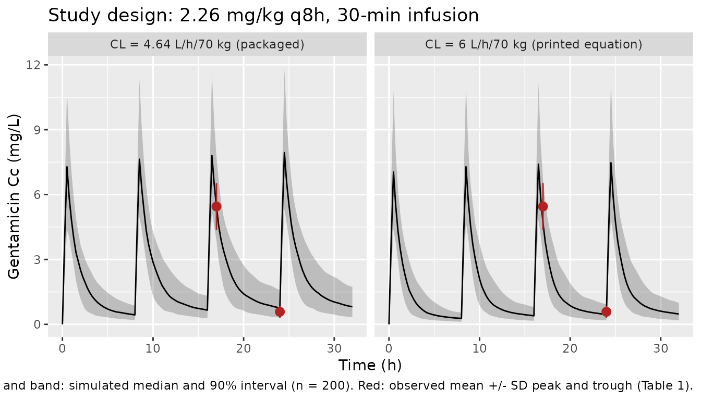
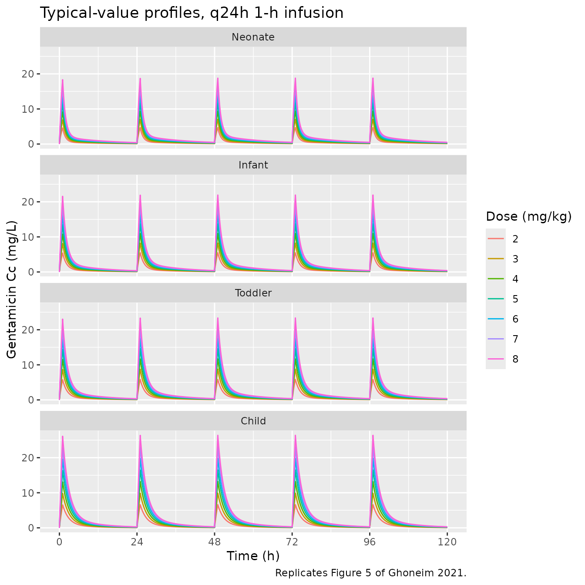
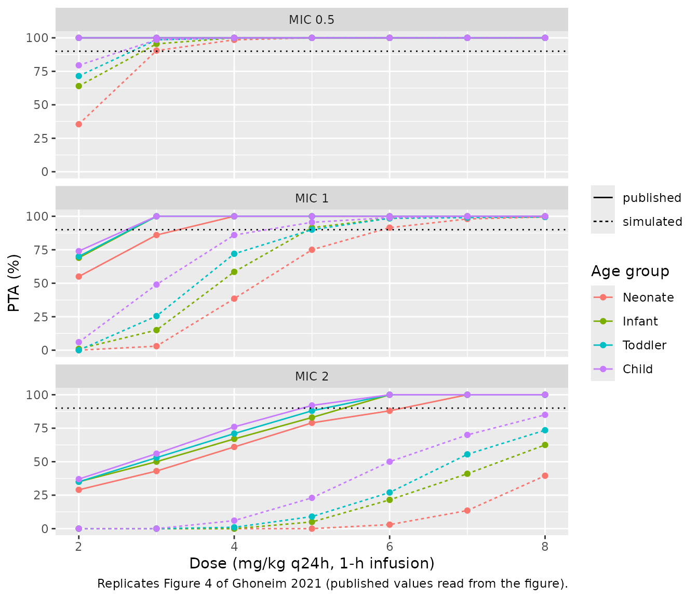

# Gentamicin (Ghoneim 2021)

## Model and source

- Citation: Ghoneim RH, Thabit AK, Lashkar MO, Ali AS. Optimizing
  gentamicin dosing in different pediatric age groups using population
  pharmacokinetics and Monte Carlo simulation. Ital J Pediatr.
  2021;47:167. <doi:10.1186/s13052-021-01114-4>
- Description: Two-compartment intravenous population PK model for
  gentamicin in non-critically ill pediatric inpatients aged 1 month to
  6 years, fitted to routine therapeutic-drug-monitoring peak and trough
  concentrations (Ghoneim 2021). Clearance and central volume scale as
  power functions of total body weight normalized to 70 kg (estimated
  exponents 0.71 and 0.93); peripheral volume and intercompartmental
  clearance carry no covariate. Between-subject variability on clearance
  and central volume; additive residual error.
- Article: <https://doi.org/10.1186/s13052-021-01114-4> (open access,
  PMC8343923)

Ghoneim et al. fitted a two-compartment intravenous model to routine
therapeutic-drug-monitoring peak and trough gentamicin concentrations
from 22 non-critically ill children at King Abdulaziz University
Hospital, Jeddah (Phoenix NLME 8.2). Total body weight, normalized to 70
kg, is the only retained covariate, acting on clearance and central
volume. The authors then used the model in a Monte Carlo analysis of
once-daily dosing (1-h infusion, 2-8 mg/kg/day) across four pediatric
age groups, with a Cmax/MIC \>= 10 efficacy target and a trough \< 1
mg/L safety target.

## Population

The analysis data came from a retrospective chart review
(February-November 2015) of 22 children given IV gentamicin for empiric
treatment of Gram-negative infection (Table 1). Inclusion allowed
neonates to 12-year-olds, but the enrolled ages were 1-72 months (mean
34.9 months, SD 31.9). Body weight was 10.13 kg (SD 5.25; range
3.98-17.7 kg) and 13 of 22 (59.1%) were male. Serum creatinine was 0.39
mg/dL (range 0.27-0.51 mg/dL). Patients in intensive care, patients on
surgical prophylaxis and patients on other nephrotoxic drugs were
excluded. The mean dose was 2.26 mg/kg per dose (Table 1; range
1.78-2.73), given as a 30-min infusion with a median dosing interval of
8 h (range 8-12 h). A peak was drawn 30 min after the end of the third
infusion and a trough just before the fourth dose. The observed mean
peak was 5.45 mg/L (SD 1.08) and the mean trough 0.58 mg/L (SD 0.28).

The same information is available programmatically via
`readModelDb("Ghoneim_2021_gentamicin")()$population`.

## Source trace

The per-parameter origin is recorded as an in-file comment next to each
`ini()` entry in `inst/modeldb/specificDrugs/Ghoneim_2021_gentamicin.R`.
The table below collects them in one place.

| Equation / parameter | Value | Source location |
|----|----|----|
| `lcl` | log(4.64) L/h for 70 kg | Table 3 (4.64 +/- 0.56; bootstrap median 4.64); Results text ‘clearance was estimated to be 4.64 L/hr./70 kg’. See the adjudication section below. |
| `lvc` | log(15.87) L for 70 kg | Table 3 (15.87 +/- 3.99; bootstrap 15.86); Results ‘The average volume of the central compartment was 15.87 L/70 kg’ |
| `lvp` | log(4.11) L | Table 3 (4.11 +/- 0.99; bootstrap 4.11) |
| `lq` | log(0.62) L/h | Table 3 (0.62 +/- 0.11; bootstrap 0.63) |
| `e_wt_cl` | 0.71 | Results CL equation, (weight in kg/70)^0.71 |
| `e_wt_vc` | 0.93 | Results Vc equation, (weight in kg/70)^0.93 |
| `etalcl` | 0.074908 = log(0.2789^2 + 1) | Table 3, BSV on CL 27.89% |
| `etalvc` | 0.133555 = log(0.378^2 + 1) | Table 3, BSV on Vc 37.80% |
| `addSd` | 0.011 mg/L | Table 3, additive error 0.011 mg/L |
| CL = CL_70 (WT/70)^0.71; Vc = Vc_70 (WT/70)^0.93 | n/a | Results, final-model equations |
| Two-compartment IV infusion, first-order elimination | n/a | Results, ‘Population pharmacokinetic model’ |
| `d/dt(central)`, `d/dt(peripheral1)` | n/a | Standard two-compartment mass balance; no equation is printed |

### Adjudicating the clearance intercept

One Results sentence gives two different clearance intercepts:

> In the final model, clearance was estimated to be 4.64 L/hr./70 kg and
> was best described by the equation: 6 x (weight in kg/70)^0.71.

The packaged model uses **4.64 L/h**. Every other place the paper states
the value agrees on it:

1.  the Table 3 point estimate, 4.64 +/- 0.56 L/h. Its asymptotic 95%
    interval (about 3.54-5.74) excludes 6;
2.  the Table 3 bootstrap median, 4.64. The bootstrap median equals the
    point estimate to two decimals on every other row as well;
3.  the value in the prose of the same sentence;
4.  the Discussion: ‘our final estimates of 4.6 L/hr. and 15 L’.

The companion central-volume equation reprints its Table 3 intercept
(15.87) unchanged, so the printed ‘6’ is treated as a typographical
error. When a printed equation and the parameter table disagree like
this, the maintainers use the table and record the equation’s value as
an erratum. The study-design simulation below also shows the model under
CL = 6 L/h, because the observed trough is closer to that value.

## Closed-form check of the ODE system

For a typical 10 kg subject given a single 30-min infusion, the ODE
solution must equal the closed-form biexponential two-compartment
infusion solution. This checks the micro-constant algebra and the
infusion handling.

``` r

mod <- readModelDb("Ghoneim_2021_gentamicin")
mod_typical <- rxode2::zeroRe(mod)
#> ℹ parameter labels from comments will be replaced by 'label()'

wt_cf <- 10
dose_cf <- 2.26 * wt_cf
tinf <- 0.5
cl_cf <- 4.64 * (wt_cf / 70)^0.71
vc_cf <- 15.87 * (wt_cf / 70)^0.93
k10 <- cl_cf / vc_cf
k12 <- 0.62 / vc_cf
k21 <- 0.62 / 4.11
s <- k10 + k12 + k21
alpha <- (s + sqrt(s^2 - 4 * k10 * k21)) / 2
beta <- (s - sqrt(s^2 - 4 * k10 * k21)) / 2
coef_a <- (alpha - k21) / (alpha - beta)
coef_b <- (k21 - beta) / (alpha - beta)

closed_form <- function(t) {
  rate <- dose_cf / tinf
  term <- function(coef, lam) {
    ifelse(
      t <= tinf,
      coef / lam * (1 - exp(-lam * t)),
      coef / lam * (1 - exp(-lam * tinf)) * exp(-lam * (t - tinf))
    )
  }
  rate / vc_cf * (term(coef_a, alpha) + term(coef_b, beta))
}

t_cf <- c(0.1, 0.25, 0.5, 1, 2, 4, 8, 12, 24, 36)
ev_cf <- rxode2::et(amt = dose_cf, dur = tinf, cmt = "central") |>
  rxode2::et(t_cf, cmt = "central")
sim_cf <- rxode2::rxSolve(
  mod_typical,
  events = ev_cf,
  params = c(WT = wt_cf),
  rtol = 1e-10,
  atol = 1e-12
) |>
  as.data.frame()
#> ℹ omega/sigma items treated as zero: 'etalcl', 'etalvc'
rel_err <- max(abs(sim_cf$Cc / closed_form(sim_cf$time) - 1))
rel_err
#> [1] 1.428511e-10
# LSODA at rtol = 1e-10 gives a relative error of order 1e-9 here; a
# mis-coded micro-constant moves it to order 1e-1.
stopifnot(rel_err < 1e-6)
```

## Study-design replication (Table 1)

### Virtual cohort

Individual weights are not published, so the cohort draws weight from a
log-normal distribution matched to the Table 1 mean and SD (10.13 +/-
5.25 kg) and truncated to the observed range (3.98-17.7 kg). Each child
receives 2.26 mg/kg (Table 1) as a 30-min infusion every 8 h (the median
interval). The peak is taken 30 min after the end of the third infusion
(17 h) and the trough just before the fourth dose (24 h), as in the
paper’s sampling scheme.

``` r

# rxSetSeed() fixes rxode2's draw for a given thread count only, so the
# assertions below are on the cohort mean with wide headroom.
set.seed(2021)
rxode2::rxSetSeed(2021)
n_sub <- 200
mu_wt <- log(10.13^2 / sqrt(10.13^2 + 5.25^2))
sd_wt <- sqrt(log(1 + (5.25 / 10.13)^2))
wt_draw <- numeric(0)
while (length(wt_draw) < n_sub) {
  x <- rlnorm(n_sub, mu_wt, sd_wt)
  wt_draw <- c(wt_draw, x[x >= 3.98 & x <= 17.7])
}
wt_draw <- wt_draw[seq_len(n_sub)]
summary(wt_draw)
#>    Min. 1st Qu.  Median    Mean 3rd Qu.    Max. 
#>   4.071   6.634   8.636   8.993  10.936  17.325

tau <- 8
t_peak <- 2 * tau + 1
t_trough <- 3 * tau
subj <- tibble(id = seq_len(n_sub), WT = wt_draw)
doses <- subj |>
  tidyr::crossing(time = (0:3) * tau) |>
  mutate(amt = 2.26 * WT, rate = amt / 0.5, evid = 1L, cmt = "central")
obs <- subj |>
  tidyr::crossing(time = c(seq(0, 4 * tau, by = 0.25), t_peak, t_trough)) |>
  distinct() |>
  mutate(amt = 0, rate = 0, evid = 0L, cmt = "central")
ev_study <- bind_rows(doses, obs) |>
  arrange(id, time, desc(evid))
stopifnot(!anyDuplicated(ev_study[, c("id", "time", "evid")]))
```

### Simulation

``` r

sim_design <- function(cl70, label) {
  m <- mod |> rxode2::ini(lcl = log(cl70))
  rxode2::rxSolve(m, events = ev_study, keep = "WT") |>
    as.data.frame() |>
    mutate(scenario = label)
}
sim_study <- bind_rows(
  sim_design(4.64, "CL = 4.64 L/h/70 kg (packaged)"),
  sim_design(6, "CL = 6 L/h/70 kg (printed equation)")
)
#> ℹ parameter labels from comments will be replaced by 'label()'
#> ℹ change initial estimate of `lcl` to `1.53471436623816`
#> ℹ parameter labels from comments will be replaced by 'label()'
#> ℹ change initial estimate of `lcl` to `1.79175946922805`

design_summary <- sim_study |>
  filter(time %in% c(t_peak, t_trough)) |>
  mutate(sample = ifelse(time == t_peak, "Peak", "Trough")) |>
  group_by(scenario, sample) |>
  summarise(mean = mean(Cc), sd = sd(Cc), .groups = "drop") |>
  left_join(
    tibble(sample = c("Peak", "Trough"), obs_mean = c(5.45, 0.58), obs_sd = c(1.08, 0.28)),
    by = "sample"
  ) |>
  mutate(pct_diff = 100 * (mean / obs_mean - 1))

design_summary |>
  dplyr::rename(
    "Scenario" = scenario,
    "Sample" = sample,
    "Simulated mean (mg/L)" = mean,
    "Simulated SD (mg/L)" = sd,
    "Observed mean (mg/L)" = obs_mean,
    "Observed SD (mg/L)" = obs_sd,
    "% difference in mean" = pct_diff
  ) |>
  knitr::kable(digits = 2, caption = "Simulated vs observed peak and trough (Table 1).")
```

| Scenario | Sample | Simulated mean (mg/L) | Simulated SD (mg/L) | Observed mean (mg/L) | Observed SD (mg/L) | % difference in mean |
|:---|:---|---:|---:|---:|---:|---:|
| CL = 4.64 L/h/70 kg (packaged) | Peak | 5.56 | 1.27 | 5.45 | 1.08 | 2.01 |
| CL = 4.64 L/h/70 kg (packaged) | Trough | 0.83 | 0.37 | 0.58 | 0.28 | 42.42 |
| CL = 6 L/h/70 kg (printed equation) | Peak | 4.78 | 1.11 | 5.45 | 1.08 | -12.22 |
| CL = 6 L/h/70 kg (printed equation) | Trough | 0.50 | 0.25 | 0.58 | 0.28 | -13.53 |

Simulated vs observed peak and trough (Table 1). {.table
style="width:100%;"}

``` r

peak_pkg <- design_summary$pct_diff[
  design_summary$sample == "Peak" & grepl("packaged", design_summary$scenario)
]
# The peak is driven mainly by Vc and the dose. A mis-transcribed volume,
# dose or weight exponent moves the mean peak by tens of percent. With 200
# subjects the Monte Carlo SE of the mean is about 2%.
stopifnot(abs(peak_pkg) < 15)
```

With the packaged clearance the simulated mean peak matches Table 1
closely. The simulated mean trough is about 40% above the observed 0.58
mg/L. With CL = 6 L/h/70 kg both the trough and the peak are about
12-14% low, within one observed SD. The trough is the more
clearance-sensitive observation, so it leans toward the printed
equation. It also depends on the unpublished weight distribution, on
nominal sample times and on the dosing interval (8-12 h in Table 1; a
12-h interval lowers the trough). Neither observation overrides the four
independent printings of 4.64. The trough mismatch is recorded as a
known deviation and is not gated.

``` r

# Study-design analogue of Figure 3 (the published VPC pools the peak and
# trough samples into single time bins).
sim_study |>
  filter(time <= 4 * tau) |>
  group_by(scenario, time) |>
  summarise(
    Q05 = quantile(Cc, 0.05),
    Q50 = quantile(Cc, 0.50),
    Q95 = quantile(Cc, 0.95),
    .groups = "drop"
  ) |>
  ggplot(aes(time, Q50)) +
  geom_ribbon(aes(ymin = Q05, ymax = Q95), alpha = 0.25) +
  geom_line() +
  geom_pointrange(
    data = tibble(
      time = c(t_peak, t_trough),
      Q50 = c(5.45, 0.58),
      lo = c(5.45 - 1.08, 0.58 - 0.28),
      hi = c(5.45 + 1.08, 0.58 + 0.28)
    ),
    aes(ymin = lo, ymax = hi),
    colour = "firebrick"
  ) +
  facet_wrap(~scenario) +
  labs(
    x = "Time (h)",
    y = "Gentamicin Cc (mg/L)",
    title = "Study design: 2.26 mg/kg q8h, 30-min infusion",
    caption = paste(
      "Line and band: simulated median and 90% interval (n = 200).",
      "Red: observed mean +/- SD peak and trough (Table 1)."
    )
  )
```



## Typical-value profiles by age group (Figure 5)

The Monte Carlo analysis simulated each age group at the 50th-percentile
weight of boys on the CDC growth charts for the group’s average age. The
paper does not print those weights. The maintainers used approximate CDC
values: 4.5 kg for a neonate (1 month), 8.4 kg for an infant (about 7
months), 11.5 kg for a toddler (about 18 months) and 24 kg for a child
(about 7.5 years). Doses of 2-8 mg/kg are given every 24 h as 1-h
infusions for 5 days.

``` r

groups <- tibble(
  group = factor(
    c("Neonate", "Infant", "Toddler", "Child"),
    levels = c("Neonate", "Infant", "Toddler", "Child")
  ),
  WT = c(4.5, 8.4, 11.5, 24)
)
regimens <- groups |>
  tidyr::crossing(dose_mgkg = 2:8) |>
  mutate(
    id = row_number(),
    treatment = paste0(group, " ", dose_mgkg, " mg/kg")
  )
fig5_doses <- regimens |>
  tidyr::crossing(time = (0:4) * 24) |>
  mutate(amt = dose_mgkg * WT, rate = amt / 1, evid = 1L, cmt = "central")
fig5_obs <- regimens |>
  tidyr::crossing(time = seq(0, 120, by = 0.1)) |>
  mutate(amt = 0, rate = 0, evid = 0L, cmt = "central")
ev_fig5 <- bind_rows(fig5_doses, fig5_obs) |>
  arrange(id, time, desc(evid))
stopifnot(!anyDuplicated(ev_fig5[, c("id", "time", "evid")]))

sim_fig5 <- rxode2::rxSolve(
  mod_typical,
  events = ev_fig5,
  keep = c("group", "dose_mgkg", "treatment", "WT"),
  rtol = 1e-10,
  atol = 1e-12
) |>
  as.data.frame()
#> ℹ omega/sigma items treated as zero: 'etalcl', 'etalvc'
#> Warning: multi-subject simulation without without 'omega'
```

``` r

sim_fig5 |>
  ggplot(aes(time, Cc, colour = factor(dose_mgkg))) +
  geom_line() +
  facet_wrap(~group, ncol = 1) +
  scale_x_continuous(breaks = seq(0, 120, 24)) +
  labs(
    x = "Time (h)",
    y = "Gentamicin Cc (mg/L)",
    colour = "Dose (mg/kg)",
    title = "Typical-value profiles, q24h 1-h infusion",
    caption = "Replicates Figure 5 of Ghoneim 2021."
  )
```



Figure 5 of the paper shows peaks of roughly 15-40 mg/L across the dose
range. The typical-value peaks here are lower (about 5-26 mg/L at the
end of a 1-h infusion), consistent with the Figure 4 discrepancy
discussed below.

## PKNCA validation

At steady state, the AUC over one dosing interval equals dose / CL. The
fifth dose interval (96-120 h) is at steady state to within 0.1% for
every group. PKNCA’s AUC over that interval is compared against dose /
CL computed from the typical clearance for each group.

``` r

nca_conc <- sim_fig5 |>
  filter(!is.na(Cc), time >= 96) |>
  mutate(Cc = pmax(Cc, 0)) |>
  select(id, time, Cc, treatment)
nca_dose <- fig5_doses |>
  filter(time == 96) |>
  select(id, time, amt, treatment)

conc_obj <- PKNCA::PKNCAconc(nca_conc, Cc ~ time | treatment + id)
dose_obj <- PKNCA::PKNCAdose(nca_dose, amt ~ time | treatment + id)
intervals <- data.frame(start = 96, end = 120, auclast = TRUE, cmax = TRUE)
nca_res <- PKNCA::pk.nca(
  PKNCA::PKNCAdata(conc_obj, dose_obj, intervals = intervals)
)

reference <- regimens |>
  mutate(auclast = dose_mgkg * WT / (4.64 * (WT / 70)^0.71)) |>
  select(treatment, auclast)

cmp <- nlmixr2lib::ncaComparisonTable(
  simulated = nca_res,
  reference = reference,
  by = "treatment",
  params = "auclast",
  units = c(auclast = "h*mg/L"),
  tolerance_pct = 1
)
knitr::kable(
  cmp,
  caption = "PKNCA AUC(96-120 h) vs dose / CL. * differs from dose / CL by >1%."
)
```

| NCA parameter     | treatment       | Reference | Simulated | % diff |
|:------------------|:----------------|:----------|:----------|:-------|
| AUClast (h\*mg/L) | Neonate 2 mg/kg | 13.6      | 13.6      | -0.0%  |
| AUClast (h\*mg/L) | Neonate 3 mg/kg | 20.4      | 20.4      | -0.0%  |
| AUClast (h\*mg/L) | Neonate 4 mg/kg | 27.2      | 27.2      | -0.0%  |
| AUClast (h\*mg/L) | Neonate 5 mg/kg | 34        | 34        | -0.0%  |
| AUClast (h\*mg/L) | Neonate 6 mg/kg | 40.8      | 40.8      | -0.0%  |
| AUClast (h\*mg/L) | Neonate 7 mg/kg | 47.6      | 47.6      | -0.0%  |
| AUClast (h\*mg/L) | Neonate 8 mg/kg | 54.5      | 54.4      | -0.0%  |
| AUClast (h\*mg/L) | Infant 2 mg/kg  | 16.3      | 16.3      | -0.0%  |
| AUClast (h\*mg/L) | Infant 3 mg/kg  | 24.5      | 24.5      | -0.0%  |
| AUClast (h\*mg/L) | Infant 4 mg/kg  | 32.6      | 32.6      | -0.0%  |
| AUClast (h\*mg/L) | Infant 5 mg/kg  | 40.8      | 40.8      | -0.0%  |
| AUClast (h\*mg/L) | Infant 6 mg/kg  | 48.9      | 48.9      | -0.0%  |
| AUClast (h\*mg/L) | Infant 7 mg/kg  | 57.1      | 57.1      | -0.0%  |
| AUClast (h\*mg/L) | Infant 8 mg/kg  | 65.3      | 65.2      | -0.0%  |
| AUClast (h\*mg/L) | Toddler 2 mg/kg | 17.9      | 17.9      | -0.0%  |
| AUClast (h\*mg/L) | Toddler 3 mg/kg | 26.8      | 26.8      | -0.0%  |
| AUClast (h\*mg/L) | Toddler 4 mg/kg | 35.7      | 35.7      | -0.0%  |
| AUClast (h\*mg/L) | Toddler 5 mg/kg | 44.7      | 44.7      | -0.0%  |
| AUClast (h\*mg/L) | Toddler 6 mg/kg | 53.6      | 53.6      | -0.0%  |
| AUClast (h\*mg/L) | Toddler 7 mg/kg | 62.5      | 62.5      | -0.0%  |
| AUClast (h\*mg/L) | Toddler 8 mg/kg | 71.5      | 71.5      | -0.0%  |
| AUClast (h\*mg/L) | Child 2 mg/kg   | 22.1      | 22.1      | -0.0%  |
| AUClast (h\*mg/L) | Child 3 mg/kg   | 33.2      | 33.2      | -0.0%  |
| AUClast (h\*mg/L) | Child 4 mg/kg   | 44.2      | 44.2      | -0.0%  |
| AUClast (h\*mg/L) | Child 5 mg/kg   | 55.3      | 55.3      | -0.0%  |
| AUClast (h\*mg/L) | Child 6 mg/kg   | 66.4      | 66.4      | -0.0%  |
| AUClast (h\*mg/L) | Child 7 mg/kg   | 77.4      | 77.4      | -0.0%  |
| AUClast (h\*mg/L) | Child 8 mg/kg   | 88.5      | 88.5      | -0.0%  |

PKNCA AUC(96-120 h) vs dose / CL. \* differs from dose / CL by \>1%.
{.table}

``` r

auc_sim <- as.data.frame(nca_res) |>
  filter(PPTESTCD == "auclast") |>
  select(treatment, auc_sim = PPORRES) |>
  left_join(reference, by = "treatment")
stopifnot(nrow(auc_sim) == nrow(regimens))
auc_err <- max(abs(auc_sim$auc_sim / auc_sim$auclast - 1))
auc_err
#> [1] 0.0003036166
# Deterministic: the residual is the pre-steady-state deficit (< 0.1%)
# plus trapezoid error on a 0.1 h grid.
stopifnot(auc_err < 0.01)
```

## Probability of target attainment (Figure 4)

Each age group and dose is simulated with 200 virtual children. Cmax is
taken at the end of the fifth 1-h infusion (97 h) and Cmin just before
the next dose (120 h). The efficacy target is Cmax/MIC \>= 10 and the
safety target is Cmin \< 1 mg/L.

``` r

rxode2::rxSetSeed(4)
n_pta <- 200
pta_subj <- regimens |>
  select(regimen = id, group, WT, dose_mgkg, treatment) |>
  tidyr::crossing(rep = seq_len(n_pta)) |>
  mutate(id = row_number())
pta_doses <- pta_subj |>
  tidyr::crossing(time = (0:4) * 24) |>
  mutate(amt = dose_mgkg * WT, rate = amt / 1, evid = 1L, cmt = "central")
pta_obs <- pta_subj |>
  tidyr::crossing(time = c(97, 120)) |>
  mutate(amt = 0, rate = 0, evid = 0L, cmt = "central")
ev_pta <- bind_rows(pta_doses, pta_obs) |>
  arrange(id, time, desc(evid))
stopifnot(!anyDuplicated(ev_pta[, c("id", "time", "evid")]))

sim_pta <- rxode2::rxSolve(
  mod,
  events = ev_pta,
  keep = c("group", "dose_mgkg")
) |>
  as.data.frame()
#> ℹ parameter labels from comments will be replaced by 'label()'

pta <- sim_pta |>
  select(id, time, Cc, group, dose_mgkg) |>
  mutate(sample = ifelse(time == 97, "cmax", "cmin")) |>
  select(-time) |>
  tidyr::pivot_wider(names_from = sample, values_from = Cc) |>
  group_by(group, dose_mgkg) |>
  summarise(
    `MIC 0.5` = 100 * mean(cmax >= 5),
    `MIC 1` = 100 * mean(cmax >= 10),
    `MIC 2` = 100 * mean(cmax >= 20),
    trough_ok = 100 * mean(cmin < 1),
    .groups = "drop"
  )
```

``` r

# Figure 4 read by the maintainers from the published panels (percent).
fig4 <- tibble::tribble(
  ~group,    ~dose_mgkg, ~`MIC 0.5`, ~`MIC 1`, ~`MIC 2`,
  "Neonate", 2,          100,        55,       29,
  "Neonate", 3,          100,        86,       43,
  "Neonate", 4,          100,        100,      61,
  "Neonate", 5,          100,        100,      79,
  "Neonate", 6,          100,        100,      88,
  "Neonate", 7,          100,        100,      100,
  "Neonate", 8,          100,        100,      100,
  "Infant",  2,          100,        69,       35,
  "Infant",  3,          100,        100,      50,
  "Infant",  4,          100,        100,      67,
  "Infant",  5,          100,        100,      83,
  "Infant",  6,          100,        100,      100,
  "Infant",  7,          100,        100,      100,
  "Infant",  8,          100,        100,      100,
  "Toddler", 2,          100,        70,       35,
  "Toddler", 3,          100,        100,      53,
  "Toddler", 4,          100,        100,      71,
  "Toddler", 5,          100,        100,      88,
  "Toddler", 6,          100,        100,      100,
  "Toddler", 7,          100,        100,      100,
  "Toddler", 8,          100,        100,      100,
  "Child",   2,          100,        74,       37,
  "Child",   3,          100,        100,      56,
  "Child",   4,          100,        100,      76,
  "Child",   5,          100,        100,      92,
  "Child",   6,          100,        100,      100,
  "Child",   7,          100,        100,      100,
  "Child",   8,          100,        100,      100
) |>
  mutate(group = factor(group, levels = levels(groups$group))) |>
  tidyr::pivot_longer(starts_with("MIC"), names_to = "MIC", values_to = "published")

pta_long <- pta |>
  select(-trough_ok) |>
  tidyr::pivot_longer(starts_with("MIC"), names_to = "MIC", values_to = "simulated") |>
  left_join(fig4, by = c("group", "dose_mgkg", "MIC"))
stopifnot(!anyNA(pta_long$published))

pta_long |>
  filter(MIC != "MIC 0.5") |>
  tidyr::pivot_wider(names_from = MIC, values_from = c(simulated, published)) |>
  dplyr::rename(
    "Age group" = group,
    "Dose (mg/kg q24h)" = dose_mgkg,
    "MIC 1: simulated PTA (%)" = `simulated_MIC 1`,
    "MIC 1: Figure 4 PTA (%)" = `published_MIC 1`,
    "MIC 2: simulated PTA (%)" = `simulated_MIC 2`,
    "MIC 2: Figure 4 PTA (%)" = `published_MIC 2`
  ) |>
  knitr::kable(digits = 0, caption = "Cmax/MIC >= 10 attainment: simulation vs Figure 4.")
```

| Age group | Dose (mg/kg q24h) | MIC 1: simulated PTA (%) | MIC 2: simulated PTA (%) | MIC 1: Figure 4 PTA (%) | MIC 2: Figure 4 PTA (%) |
|:---|---:|---:|---:|---:|---:|
| Neonate | 2 | 0 | 0 | 55 | 29 |
| Neonate | 3 | 3 | 0 | 86 | 43 |
| Neonate | 4 | 38 | 0 | 100 | 61 |
| Neonate | 5 | 75 | 0 | 100 | 79 |
| Neonate | 6 | 92 | 3 | 100 | 88 |
| Neonate | 7 | 98 | 14 | 100 | 100 |
| Neonate | 8 | 100 | 40 | 100 | 100 |
| Infant | 2 | 1 | 0 | 69 | 35 |
| Infant | 3 | 15 | 0 | 100 | 50 |
| Infant | 4 | 58 | 0 | 100 | 67 |
| Infant | 5 | 92 | 5 | 100 | 83 |
| Infant | 6 | 98 | 22 | 100 | 100 |
| Infant | 7 | 100 | 41 | 100 | 100 |
| Infant | 8 | 100 | 62 | 100 | 100 |
| Toddler | 2 | 0 | 0 | 70 | 35 |
| Toddler | 3 | 26 | 0 | 100 | 53 |
| Toddler | 4 | 72 | 1 | 100 | 71 |
| Toddler | 5 | 90 | 9 | 100 | 88 |
| Toddler | 6 | 98 | 27 | 100 | 100 |
| Toddler | 7 | 99 | 56 | 100 | 100 |
| Toddler | 8 | 100 | 74 | 100 | 100 |
| Child | 2 | 6 | 0 | 74 | 37 |
| Child | 3 | 49 | 0 | 100 | 56 |
| Child | 4 | 86 | 6 | 100 | 76 |
| Child | 5 | 96 | 23 | 100 | 92 |
| Child | 6 | 99 | 50 | 100 | 100 |
| Child | 7 | 100 | 70 | 100 | 100 |
| Child | 8 | 100 | 85 | 100 | 100 |

Cmax/MIC \>= 10 attainment: simulation vs Figure 4. {.table
style="width:100%;"}

``` r

pta_long |>
  tidyr::pivot_longer(c(simulated, published), names_to = "source", values_to = "PTA") |>
  ggplot(aes(dose_mgkg, PTA, colour = group, linetype = source)) +
  geom_line() +
  geom_point() +
  geom_hline(yintercept = 90, linetype = "dotted") +
  facet_wrap(~MIC, ncol = 1) +
  labs(
    x = "Dose (mg/kg q24h, 1-h infusion)",
    y = "PTA (%)",
    colour = "Age group",
    linetype = NULL,
    caption = "Replicates Figure 4 of Ghoneim 2021 (published values read from the figure)."
  )
```



``` r

cell <- function(tab, grp, dose, col) {
  v <- tab[[col]][tab$group == grp & tab$dose_mgkg == dose]
  if (length(v) != 1L) stop("no unique PTA row for ", grp, " ", dose, " mg/kg")
  v
}
# Dose response: raising the dose from 2 to 8 mg/kg raises MIC 1 attainment
# from under 10% to about 100% in every group (model-true values), a margin
# far beyond Monte Carlo noise at n = 200.
for (g in levels(groups$group)) {
  stopifnot(cell(pta, g, 8, "MIC 1") - cell(pta, g, 2, "MIC 1") > 50)
}
# MIC 0.5: every group reaches >= 90% at 4 mg/kg and above (model-true
# 99-100%; binomial SE at n = 200 is under 1 percentage point).
stopifnot(all(pta$`MIC 0.5`[pta$dose_mgkg >= 4] >= 90))
# Safety claim from the paper: trough < 1 mg/L is maintained. Model-true
# attainment is >= 90% in every cell; 80% leaves about 5 binomial SEs.
stopifnot(all(pta$trough_ok >= 80))
```

The safety result reproduces: at least about 90% of simulated children
have a trough below 1 mg/L at every dose and age group. The efficacy
curves do not. At MIC 1, Figure 4 reaches 90% attainment at 3 mg/kg (4
mg/kg in neonates); the simulation needs about 5 mg/kg (6 mg/kg in
neonates). At MIC 2, Figure 4 reaches 90% at 5-7 mg/kg, while the
simulation stays below 90% in every group even at 8 mg/kg, and neonates
are in single digits at 6 mg/kg. Cmax after a 1-h infusion is set almost
entirely by Vc. The published curves imply a peak about 1.5-2 times
higher than the Table 3 Vc gives. The same is true of CL = 6, so the
clearance intercept does not explain the gap. Figure 4 is therefore
documented and not gated. Possible explanations include a Cmax read at a
different time, a different parameter set in the simulation, or
different weights. The paper does not give enough detail to tell them
apart.

## Assumptions and deviations

- **Clearance intercept.** The Results print CL = 6 x (WT/70)^0.71 next
  to the stated estimate of 4.64 L/h/70 kg. The model uses 4.64 (Table 3
  point estimate and bootstrap median, the prose and the Discussion).
  The printed ‘6’ is recorded as an erratum. The study-design simulation
  shows both values.
- **Weight exponents.** The exponents 0.71 (CL) and 0.93 (Vc) appear
  only in the printed equations. They are not theoretical allometric
  values and are treated as estimated, not fixed. Table 3 gives no
  standard error for them.
- **Peripheral volume and intercompartmental clearance** carry no weight
  term, as in the paper. In a 4.5 kg neonate this makes Vp about 3.3
  times Vc. Extrapolate with care outside the 4-18 kg range of the data.
- **BSV** on CL and Vc is reported as a percentage and converted as a
  log-normal CV, omega^2 = log(CV^2 + 1). No covariance was reported, so
  the etas are independent. The model has no BSV on Vp or Q.
- **Residual error** is additive, 0.011 mg/L (Table 3), read as a
  standard deviation.
- **Table 1 inconsistencies.** The prose gives a mean dose of 2.75
  mg/kg, and Table 1 gives 2.26 mg/kg with a range of 1.78-2.73. The
  simulations use the Table 1 value, since 2.75 lies outside the Table 1
  range. The serum creatinine SD (0.82 mg/dL) cannot hold for a range of
  0.27-0.51 mg/dL. The row ‘Total daily dose (mg/kg)’ (22.75, range
  10-40) appears to be mg per dose, not mg/kg. None of these values
  enters the model.
- **Virtual-cohort weights.** Individual weights are not published. The
  study-design cohort uses a truncated log-normal matched to Table 1.
  The age groups in the Monte Carlo analysis use approximate CDC
  50th-percentile weights for boys, chosen by the maintainers because
  the paper does not print them. Vc per kg scales as WT^-0.07, so the
  Cmax-driven results are insensitive to this choice.
- **Trough over-prediction.** The simulated mean trough of the study
  design is about 40% above the observed 0.58 mg/L. This is shown above
  and not gated.
- **Figure 4 and Figure 5** show peaks about 1.5-2 times higher than the
  Table 3 parameters give. They are reproduced as documented deviations,
  not validation targets.
- No erratum or correction notice for this article was found as of
  2026-09-30.
