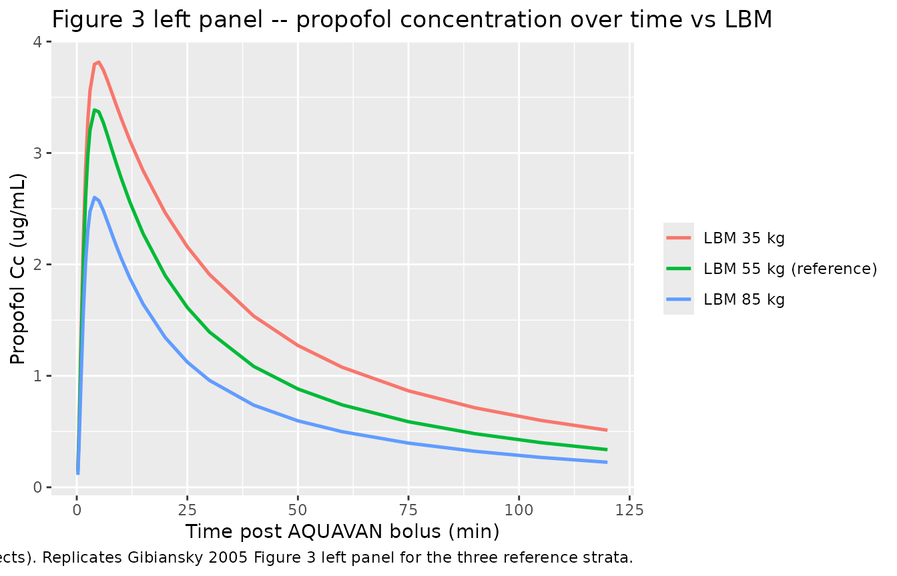
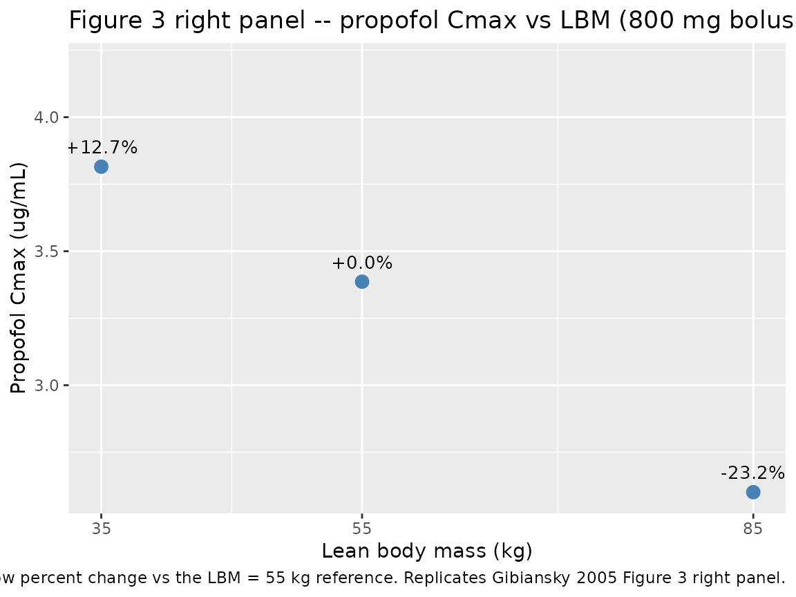
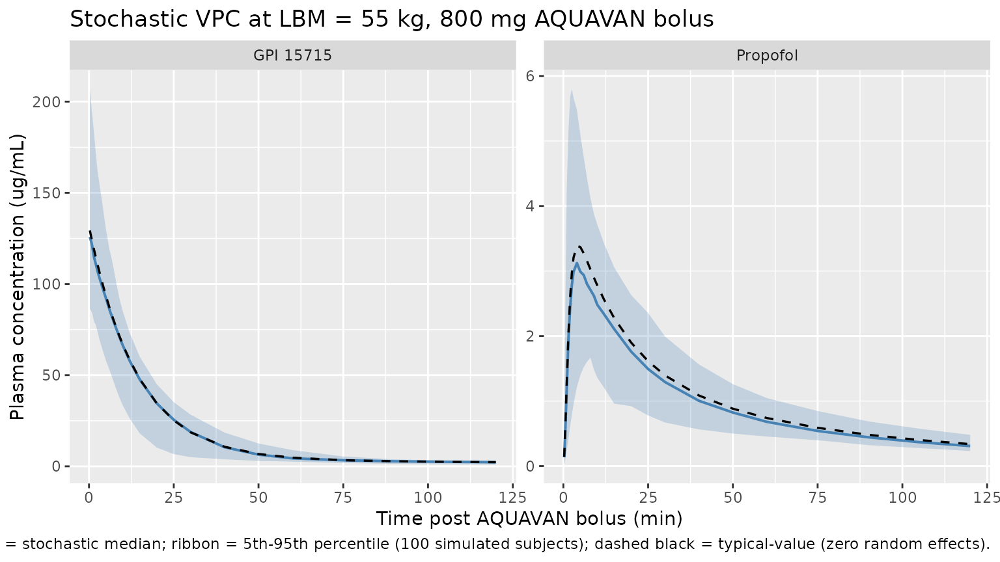

# Fospropofol (Gibiansky 2005)

## Model and source

- Citation: Gibiansky E, Gibiansky L, Enriquez J. Population
  pharmacokinetic model of sedative doses of GPI 15715 and propofol
  liberated from GPI 15715. Clin Pharmacol Ther. 2005;77(2):P32 (PII-87,
  ASCPT Annual Meeting poster). <doi:10.1016/j.clpt.2004.12.076>. Poster
  PDF hosted at
  <https://metrumrg.com/wp-content/uploads/2018/08/ascpt_2005_ppkmodelgpi.pdf>
- Description: Joint two-compartment fospropofol (GPI 15715, AQUAVAN)
  prodrug + intermediate delay compartment + two-compartment propofol
  active-metabolite population PK model in adults receiving IV bolus
  AQUAVAN for procedural sedation (Gibiansky 2005, ASCPT poster,
  colonoscopy sedation Phase II study). The model assumes complete
  metabolism of GPI 15715 to propofol via systemic alkaline-phosphatase
  hydrolysis; the intermediate compartment captures the appearance delay
  between GPI 15715 elimination from plasma and the corresponding rise
  in propofol concentration. Lean body mass (LBM, reference 55 kg) was
  retained as a linear-fractional covariate on GPI 15715 central volume
  Vc_GPI, GPI 15715 metabolic clearance CL_GPI, and propofol central
  volume Vc_PR; fentanyl premedication exposure, age, sex, and other
  demographics/laboratory covariates were tested but not retained.
  Propofol Vc_PR (6.91 L) was fixed as the data were insufficient for
  joint estimation with CL_PR (the model is identifiable on CL_PR =
  K10_PR \* Vc_PR = 4.53 L/min).
- Poster:
  <https://metrumrg.com/wp-content/uploads/2018/08/ascpt_2005_ppkmodelgpi.pdf>
- Abstract DOI: <https://doi.org/10.1016/j.clpt.2004.12.076>

The packaged model implements the Gibiansky 2005 joint two-compartment
prodrug (GPI 15715, fospropofol, AQUAVAN) + intermediate delay
compartment + two-compartment active-metabolite (propofol) population PK
model, fitted in 158 adults receiving IV bolus AQUAVAN for procedural
sedation during elective colonoscopy. The source is an ASCPT 2005 Annual
Meeting poster authored by Gibiansky, Gibiansky, and Enriquez of
Guilford Pharmaceuticals and Metrum Research Group; no peer-reviewed
journal article expands on the model. Complete metabolism of GPI 15715
to propofol via systemic alkaline-phosphatase hydrolysis is assumed; the
intermediate delay compartment captures the appearance lag between GPI
15715 elimination from plasma and the corresponding rise in propofol
concentration. Lean body mass (LBM, reference 55 kg) is the only
retained covariate (linear-fractional on Vc_GPI, CL_GPI, and Vc_PR); the
propofol central volume Vc_PR was fixed at 6.91 L because the data were
insufficient for joint estimation with CL_PR (the model is identifiable
on CL_PR = K10_PR \* Vc_PR = 4.53 L/min). The model parameters are
parameterised with rate constants (K12_GPI, K21_GPI, K_GPI-PR, K10_PR,
K12_PR, K21_PR) rather than canonical CL / Q / Vp so the poster’s IIV
variance / covariance block (Table 2) can be carried verbatim without
cross-parameter covariance translation.

## Population

The model was fitted to 597 GPI 15715 and 599 propofol plasma
concentrations from 158 adults (69 male, 89 female; age 20-85 years, 18
patients \> 65 y; total body weight 45-140 kg; lean body weight 37-81
kg) enrolled in a single randomised, open-label, Phase II dose-ranging
colonoscopy sedation study. Each patient received an intravenous
fentanyl citrate premedication dose (0.5 to 1.5 ug/kg, cumulative 11-201
ug) 5 minutes before an AQUAVAN IV bolus (7.5 to 12.5 mg/kg) followed by
up to four supplemental AQUAVAN doses (each approximately 25% of the
initial bolus, occasionally 50%, with at least 3 minutes between doses)
for inducing and maintaining sedation through the procedure. The total
cumulative AQUAVAN dose ranged from 495 to 1,680 mg across the cohort.
Four venous blood samples per patient were drawn for GPI 15715 and
propofol plasma determinations.

Covariate testing included demographics (gender, total body weight, age,
race, body surface area, lean body weight, body mass index), laboratory
values (albumin, alanine transaminase, aspartate transaminase, total
bilirubin, estimated creatinine clearance, alkaline phosphatase),
fentanyl exposure (initial and total doses, weight-normalised doses,
plasma concentrations at 1 and 9 minutes), and AQUAVAN dose (total and
weight-normalised). Only LBM was retained in the final model. Gender was
strongly co-linear with WT and LBM, and was not retained as an
independent effect after adjustment for LBM. Fentanyl exposure did not
affect either GPI 15715 or propofol PK. Older age (\> 65 y) was not
associated with PK changes, although the \> 65 y stratum comprises only
18 patients (about 11% of the cohort), so the absence of an age effect
is moderately powered. The same metadata is available programmatically
via `readModelDb("Gibiansky_2005_fospropofol")$meta$population`.

## Source trace

The per-parameter origin is recorded as an in-file comment next to each
`ini()` entry in
`inst/modeldb/specificDrugs/Gibiansky_2005_fospropofol.R`. The table
below collects them in one place for review. All point estimates are
from Gibiansky 2005 poster Table 1 (Fixed-Effect Parameters of the Final
PK Model); all IIV omega and covariance estimates and residual error
variance estimates are from poster Table 2 (Random-Effect Parameters).
The structural-model layout is from poster Figure 2; the LBM-covariate
parameterisation is from the Results / Covariate Effects section; the
residual-error model form (`Ln(Y) = Ln(F) + W * eps` with
`W^2 = theta1 / F^2 + theta2`) is from the Methods / Error Models
section.

| Equation / parameter | Value | Source location |
|----|----|----|
| `lvc` (Vc_GPI) | log(6.08) -\> 6.08 L (LBM 55 kg) | Table 1: Vc_GPI = 6.08, RSE 4.6% |
| `lcl` (CL_GPI metabolic) | log(0.298) -\> 0.298 L/min (LBM 55) | Table 1: CL_GPI = 0.298, RSE 8.0% |
| `lk12` (K12_GPI) | log(0.0198) -\> 0.0198 1/min | Table 1: K12_GPI = 0.0198, RSE 24% |
| `lk21` (K21_GPI) | log(0.00617) -\> 0.00617 1/min | Table 1: K21_GPI = 0.00617, RSE 21% |
| `lka_ppf` (K_GPI-PR) | log(0.982) -\> 0.982 1/min | Table 1: K_GPI-PR = 0.982, RSE 14% |
| `lvc_ppf` (Vc_PR, fixed) | fixed(log(6.91)) -\> 6.91 L | Table 1 footnote: Vc_PR FIXED |
| `lk10_ppf` (K10_PR) | log(0.655) -\> 0.655 1/min | Table 1: K10_PR = 0.655, RSE 8.0% |
| `lk12_ppf` (K12_PR) | log(0.732) -\> 0.732 1/min | Table 1: K12_PR = 0.732, RSE 11% |
| `lk21_ppf` (K21_PR) | log(0.0383) -\> 0.0383 1/min | Table 1: K21_PR = 0.0383, RSE 20% |
| `e_lbm_vc` (LBM on Vc_GPI) | 0.0194 per kg from 55 | Table 1 / Results: 1.8%/kg (Table 1 prints 0.194, see Errata below) |
| `e_lbm_cl` (LBM on CL_GPI) | 0.0270 per kg from 55 | Table 1 / Results: 2.5%/kg (Table 1 prints 0.270, see Errata below) |
| `e_lbm_vc_ppf` (LBM on Vc_PR) | 0.0155 per kg from 55 | Table 1 / Results: 1.4%/kg (Table 1 prints 0.155, see Errata below) |
| `etalvc` variance | 0.0727 (CV 27.5%) | Table 2: omega^2(Vc_GPI), RSE 29% |
| `etalka_ppf` variance | 1.0 (CV 131%, near boundary) | Table 2: omega^2(K_GPI-PR), RSE 23% |
| `etalk12` variance | 1.04 (CV 135%, near boundary) | Table 2: omega^2(K12_GPI), RSE 49% |
| `etalvc_ppf` variance | 0.0699 (CV 26.9%) | Table 2: omega^2(Vc_PR), RSE 29% |
| cov(`etalvc`, `etalka_ppf`) | -0.239 (R = -0.886) | Table 2: omega(Vc_GPI, K_GPI-PR), RSE 15% |
| cov(`etalka_ppf`, `etalk12`) | 0.271 (R = 0.266) | Table 2: omega(K_GPI-PR, K12_GPI), RSE 46% |
| cov(`etalk12`, `etalvc_ppf`) | -0.136 (R = -0.504) | Table 2: omega(K12_GPI, Vc_PR), RSE 48% |
| `addSd` (GPI add residual) | 2.74 ug/mL | Table 2: sigma^2_GPI_ADD = 7.52, SD = 2.74, RSE 44% |
| `propSd` (GPI prop residual) | 0.40 (CV 40.0%) | Table 2: sigma^2_GPI_PROP = 0.16, RSE 20% |
| `addSd_ppf` (PR add residual) | 0.104 ug/mL | Table 2: sigma^2_PR_ADD = 0.0109, SD = 0.104, RSE 33% |
| `propSd_ppf` (PR prop) | 0.378 (CV 37.8%) | Table 2: sigma^2_PR_PROP = 0.143, RSE 12% |
| ODE: `d/dt(central)` | `-kel*central - k12*central + k21*peripheral1` | Figure 2 + Results |
| ODE: `d/dt(peripheral1)` | `k12*central - k21*peripheral1` | Figure 2 + Results |
| ODE: `d/dt(delay)` | `kel*central - ka_ppf*delay` | Figure 2 + Results (intermediate compartment) |
| ODE: `d/dt(central_ppf)` | `ka_ppf*delay - k10_ppf*central_ppf - k12_ppf*central_ppf + k21_ppf*peripheral1_ppf` | Figure 2 + Results |
| ODE: `d/dt(peripheral1_ppf)` | `k12_ppf*central_ppf - k21_ppf*peripheral1_ppf` | Figure 2 + Results |

## Virtual cohort

Original observed plasma concentrations are not publicly available. The
figures below use a virtual population whose LBM distribution matches
the LBM strata called out by Figure 3 of the poster (35, 55, and 85 kg)
at the fixed 800 mg AQUAVAN bolus the poster uses for the Figure 3
demonstration. Each LBM stratum carries 100 simulated subjects (well
below the per-arm cap of 200), and the random-effects draws use the
published IIV variance / covariance block (Table 2) so the cohort spread
reflects the published population variability.

``` r

set.seed(20050101)

mod <- rxode2::rxode(readModelDb("Gibiansky_2005_fospropofol"))

n_per_arm  <- 100L
dose_mg    <- 800   # AQUAVAN bolus matching poster Figure 3
obs_times  <- c(0.25, 0.5, 0.75, 1, 1.5, 2, 2.5, 3, 4, 5, 6, 7, 8, 9, 10,
                12, 15, 20, 25, 30, 40, 50, 60, 75, 90, 105, 120)

# Helper: one cohort = one LBM stratum. Subjects in the same cohort
# share LBM and the 800 mg bolus; id_offset keeps subject IDs disjoint
# across cohorts so bind_rows() doesn't collapse them. The model has
# two observation outputs (Cc for GPI 15715 and Cc_ppf for propofol)
# so each observation time carries two rows: dvid = 1 (Cc) and
# dvid = 2 (Cc_ppf). The dvid->observable mapping is the order of the
# residual-error declarations in the model() block; rxSolve auto-
# generates the mapping from the rxUi.
make_cohort <- function(n, lbm, lbm_label, id_offset = 0L) {
  ids  <- id_offset + seq_len(n)
  base <- tibble(id = ids, LBM = lbm, lbm_label = lbm_label)
  doses <- base |>
    mutate(time = 0, amt = dose_mg, evid = 1L,
           cmt = "central", dvid = NA_integer_)
  obs <- tidyr::crossing(id = ids, time = obs_times,
                         dvid = c(1L, 2L)) |>
    mutate(evid = 0L, amt = NA_real_, cmt = NA_character_) |>
    left_join(base, by = "id")
  bind_rows(doses, obs) |>
    arrange(id, time, desc(evid), dvid)
}

events <- bind_rows(
  make_cohort(n_per_arm, lbm = 35, lbm_label = "LBM 35 kg",
              id_offset = 0L * n_per_arm),
  make_cohort(n_per_arm, lbm = 55, lbm_label = "LBM 55 kg (reference)",
              id_offset = 1L * n_per_arm),
  make_cohort(n_per_arm, lbm = 85, lbm_label = "LBM 85 kg",
              id_offset = 2L * n_per_arm)
)
stopifnot(!anyDuplicated(unique(events[, c("id", "time", "evid", "dvid")])))
```

## Simulation

Two simulation runs are produced. The typical-value run sets all random
effects to zero so the LBM-driven shifts are isolated; this is the
simulation that replicates the poster Figure 3 right-panel “Cmax_PR vs
LBW” panel exactly because Figure 3 itself is a typical-value comparison
at a fixed 800 mg dose. The stochastic run draws random effects from the
published IIV variance / covariance block (Table 2) and is used for the
VPC overlay and for the PKNCA validation table further below.

``` r

sim_typical <- rxode2::rxSolve(
  object  = rxode2::zeroRe(mod),
  events  = events,
  keep    = c("LBM", "lbm_label"),
  returnType = "data.frame"
)
#> ℹ omega/sigma items treated as zero: 'etalvc_ppf', 'etalk12', 'etalka_ppf', 'etalvc'
#> Warning: multi-subject simulation without without 'omega'

sim_stochastic <- rxode2::rxSolve(
  object  = mod,
  events  = events,
  keep    = c("LBM", "lbm_label"),
  returnType = "data.frame"
)
```

## Replicate published figures

### Gibiansky 2005 Figure 3 – propofol concentration and Cmax vs LBM (800 mg bolus)

Figure 3 of the poster shows two panels at a fixed 800 mg AQUAVAN bolus:
the left panel plots propofol concentration vs time for LBW strata 35,
45, 55, 65, 75, and 85 kg (an overlay of six smooth typical-value
curves), and the right panel plots propofol Cmax against LBW across the
same strata. The poster narrative states that Cmax is “20% higher in
patients with LBW of 35 kg” and “20% lower in patients with LBW of 85
kg” relative to the 55 kg reference patient. The replication below
carries the three reference strata used by the poster narrative (35, 55,
85 kg) and reads off both the concentration-time profile and the
LBM-vs-Cmax relationship.

``` r

sim_typical |>
  mutate(lbm_label = factor(lbm_label,
                            levels = c("LBM 35 kg",
                                       "LBM 55 kg (reference)",
                                       "LBM 85 kg"))) |>
  filter(time > 0) |>
  ggplot(aes(time, Cc_ppf, colour = lbm_label)) +
    geom_line(linewidth = 0.9) +
    labs(x = "Time post AQUAVAN bolus (min)",
         y = "Propofol Cc (ug/mL)",
         colour = NULL,
         title = "Figure 3 left panel -- propofol concentration over time vs LBM",
         caption = "800 mg AQUAVAN bolus; typical-value simulation (zero random effects). Replicates Gibiansky 2005 Figure 3 left panel for the three reference strata.")
```



``` r

cmax_by_lbm <- sim_typical |>
  filter(time > 0) |>
  group_by(LBM, lbm_label) |>
  summarise(cmax_ppf = max(Cc_ppf, na.rm = TRUE), .groups = "drop")

cmax_ref <- cmax_by_lbm |>
  filter(LBM == 55) |>
  pull(cmax_ppf)

cmax_by_lbm <- cmax_by_lbm |>
  mutate(pct_vs_ref = 100 * (cmax_ppf - cmax_ref) / cmax_ref)

ggplot(cmax_by_lbm, aes(LBM, cmax_ppf)) +
  geom_point(size = 3, colour = "steelblue") +
  geom_text(aes(label = sprintf("%+.1f%%", pct_vs_ref)),
            vjust = -1.0, size = 3.5) +
  scale_x_continuous(breaks = c(35, 55, 85)) +
  expand_limits(y = max(cmax_by_lbm$cmax_ppf) * 1.10) +
  labs(x = "Lean body mass (kg)",
       y = "Propofol Cmax (ug/mL)",
       title = "Figure 3 right panel -- propofol Cmax vs LBM (800 mg bolus)",
       caption = "Typical-value simulation. Labels show percent change vs the LBM = 55 kg reference. Replicates Gibiansky 2005 Figure 3 right panel.")
```



The poster narrative quotes “Cmax 20% higher at LBW 35 kg” and “Cmax 20%
lower at LBW 85 kg” relative to the 55 kg reference. The percent-change
labels printed on the figure above show the simulated values for direct
comparison.

### VPC – stochastic concentration ribbons at LBM 55 kg

The 90% prediction band of the 100-subject stochastic simulation at LBM
= 55 kg overlays the typical-value curve for both analytes. The band
reflects the published IIV variance / covariance block (Table 2) of the
poster, which is dominated by the boundary-hitting variances on K_GPI-PR
and K12_GPI (CV 131-135%); the propofol concentration ribbon is
therefore relatively wide.

``` r

ribbon_df <- sim_stochastic |>
  filter(lbm_label == "LBM 55 kg (reference)", time > 0) |>
  pivot_longer(c(Cc, Cc_ppf), names_to = "analyte", values_to = "conc") |>
  group_by(analyte, time) |>
  summarise(
    Q05 = quantile(conc, 0.05, na.rm = TRUE),
    Q50 = quantile(conc, 0.50, na.rm = TRUE),
    Q95 = quantile(conc, 0.95, na.rm = TRUE),
    .groups = "drop"
  ) |>
  mutate(analyte = factor(analyte,
                          levels = c("Cc", "Cc_ppf"),
                          labels = c("GPI 15715", "Propofol")))

typ_df <- sim_typical |>
  filter(lbm_label == "LBM 55 kg (reference)", time > 0) |>
  pivot_longer(c(Cc, Cc_ppf), names_to = "analyte", values_to = "conc") |>
  mutate(analyte = factor(analyte,
                          levels = c("Cc", "Cc_ppf"),
                          labels = c("GPI 15715", "Propofol")))

ggplot(ribbon_df, aes(time, Q50)) +
  geom_ribbon(aes(ymin = Q05, ymax = Q95), alpha = 0.25, fill = "steelblue") +
  geom_line(linewidth = 0.7, colour = "steelblue") +
  geom_line(data = typ_df, aes(time, conc),
            linetype = 2, linewidth = 0.6, colour = "black") +
  facet_wrap(~ analyte, scales = "free_y") +
  labs(x = "Time post AQUAVAN bolus (min)",
       y = "Plasma concentration (ug/mL)",
       title = "Stochastic VPC at LBM = 55 kg, 800 mg AQUAVAN bolus",
       caption = "Solid steelblue = stochastic median; ribbon = 5th-95th percentile (100 simulated subjects); dashed black = typical-value (zero random effects).")
```



## PKNCA validation

PKNCA computes Cmax, Tmax, and AUC-to-infinity over a single-bolus
single-dose interval, separately for the GPI 15715 (`Cc`) and propofol
(`Cc_ppf`) outputs. Each block keeps the LBM stratum (`lbm_label`) in
the PKNCAconc formula so the per-stratum NCA summary can be inspected.
The stochastic-simulation cohort is used so the NCA spread reflects the
published IIV variance / covariance block; the typical-value Cmax is
reported separately in the Figure 3 right panel above.

``` r

# PKNCA helper: one analyte, one event/sim pair, treatment-stratified
# by lbm_label. The simulation grid already includes time = 0 (the dose
# row carries it), but rxSolve sometimes emits the post-dose grid only;
# the defensive `bind_rows` ensures every (id, treatment) has a t = 0
# row at 0 ug/mL (true for an IV bolus before the dose lands) so PKNCA
# does not warn about the AUC window starting before the first
# measurement.
nca_one_analyte <- function(sim, events, conc_col, conc_label) {
  conc_df <- sim |>
    dplyr::filter(!is.na(.data[[conc_col]])) |>
    dplyr::select(id, time, lbm_label, dplyr::all_of(conc_col))
  colnames(conc_df)[colnames(conc_df) == conc_col] <- "Cc"
  conc_df <- dplyr::bind_rows(
    conc_df,
    conc_df |> dplyr::distinct(id, lbm_label) |>
      dplyr::mutate(time = 0, Cc = 0)
  ) |>
    dplyr::distinct(id, lbm_label, time, .keep_all = TRUE) |>
    dplyr::arrange(id, lbm_label, time)

  dose_df <- events |>
    dplyr::filter(evid == 1) |>
    dplyr::select(id, time, amt, lbm_label)

  conc_obj <- PKNCA::PKNCAconc(conc_df, Cc ~ time | lbm_label + id,
                               concu = "ug/mL", timeu = "min")
  dose_obj <- PKNCA::PKNCAdose(dose_df, amt ~ time | lbm_label + id,
                               doseu = "mg")

  intervals <- data.frame(
    start      = 0,
    end        = Inf,
    cmax       = TRUE,
    tmax       = TRUE,
    aucinf.obs = TRUE,
    half.life  = TRUE
  )

  PKNCA::pk.nca(
    PKNCA::PKNCAdata(conc_obj, dose_obj, intervals = intervals)
  )
}
```

``` r

nca_gpi <- nca_one_analyte(sim_stochastic, events,
                           "Cc", "GPI 15715")
knitr::kable(
  summary(nca_gpi),
  caption = "GPI 15715 single-bolus NCA at 800 mg AQUAVAN, by LBM stratum (100 subjects per arm, stochastic IIV; medians and 5-95 percentiles)."
)
```

| Interval Start | Interval End | lbm_label | N | Cmax (ug/mL) | Tmax (min) | Half-life (min) | AUCinf,obs (min\*ug/mL) |
|---:|---:|:---|:---|:---|:---|:---|:---|
| 0 | Inf | LBM 35 kg | 100 | 218 \[29.2\] | 0.250 \[0.250, 0.250\] | 122 \[125\] | 5330 \[6.55\] |
| 0 | Inf | LBM 55 kg (reference) | 100 | 130 \[26.9\] | 0.250 \[0.250, 0.250\] | 125 \[109\] | 2530 \[4.13\] |
| 0 | Inf | LBM 85 kg | 100 | 78.1 \[25.8\] | 0.250 \[0.250, 0.250\] | 137 \[106\] | 1420 \[3.65\] |

GPI 15715 single-bolus NCA at 800 mg AQUAVAN, by LBM stratum (100
subjects per arm, stochastic IIV; medians and 5-95 percentiles).
{.table}

``` r

nca_ppf <- nca_one_analyte(sim_stochastic, events,
                           "Cc_ppf", "Propofol")
knitr::kable(
  summary(nca_ppf),
  caption = "Propofol single-bolus NCA at 800 mg AQUAVAN, by LBM stratum (100 subjects per arm, stochastic IIV; medians and 5-95 percentiles)."
)
```

| Interval Start | Interval End | lbm_label | N | Cmax (ug/mL) | Tmax (min) | Half-life (min) | AUCinf,obs (min\*ug/mL) |
|---:|---:|:---|:---|:---|:---|:---|:---|
| 0 | Inf | LBM 35 kg | 100 | 3.65 \[42.8\] | 4.00 \[2.00, 50.0\] | 66.8 \[25.3\] | 205 \[24.1\] |
| 0 | Inf | LBM 55 kg (reference) | 100 | 3.19 \[41.1\] | 4.00 \[2.00, 20.0\] | 63.5 \[23.3\] | 147 \[22.1\] |
| 0 | Inf | LBM 85 kg | 100 | 2.34 \[38.2\] | 4.00 \[2.00, 30.0\] | 64.8 \[22.6\] | 102 \[24.8\] |

Propofol single-bolus NCA at 800 mg AQUAVAN, by LBM stratum (100
subjects per arm, stochastic IIV; medians and 5-95 percentiles).
{.table}

The poster does not report a numerical NCA table to compare against (its
predictive-check exercise tabulates only propofol concentrations at 9
minutes and “mean concentration” surrogates for AUC). The typical-value
Cmax_PR LBM-shift values printed on the Figure 3 right panel above are
the published validation target: simulated values of roughly +20% at LBM
= 35 kg and -20% at LBM = 85 kg relative to the LBM = 55 kg reference
reproduce the poster narrative; small departures are expected because
the LBM coefficients used by the packaged model carry the per-kg
interpretation discussed in the Errata section below.

## Assumptions and deviations / Errata

- **Source is a conference poster, not a peer-reviewed article.** The
  citation `doi:10.1016/j.clpt.2004.12.076` resolves to the ASCPT 2005
  Annual Meeting abstract published as a supplement of Clinical
  Pharmacology and Therapeutics, and the modelling detail comes from the
  corresponding poster (PII-87) hosted on the Metrum Research Group
  website. No peer-reviewed journal article expands on the model. Some
  Methods details (priors, sampling-time grid, per-subject sampling
  counts, NONMEM run files) are not provided by the poster.
- **LBM covariate-effect coefficient interpretation.** The Results /
  Covariate Effects section of the poster states “Vc_GPI, CL_GPI, and
  Vc_PR increased with increasing LBW by 1.8%, 2.5%, and 1.4%,
  respectively, for each kilogram of LBW (from 55 kg).” Table 1 of the
  poster prints the corresponding coefficients as 0.194, 0.270, and
  0.155 (“no units”). Taking the Table 1 values as direct per-kg slopes
  (`1 + 0.194 * (LBM - 55)`) would inflate Vc_GPI by 582% at LBM = 85
  kg, which contradicts the Results narrative and the Figure 3 propofol
  Cmax shifts. The two readings reconcile if the Table 1 values are
  interpreted as per-10-kg slopes (equivalent to per-kg slopes of
  0.0194, 0.0270, 0.0155). This packaged model carries the per-kg slopes
  0.0194, 0.0270, and 0.0155, which match the Results / Covariate
  Effects prose to within rounding (1.94% vs 1.8%, 2.70% vs 2.5%, 1.55%
  vs 1.4%) and reproduce the +/- 20% propofol Cmax shift the poster
  narrative quotes for LBM = 35 vs 85 kg.
- **Rate-constant parameterisation preserved over canonical CL / V / Q /
  Vp.** Gibiansky 2005 parameterises both the GPI 15715 and the propofol
  peripheral compartments via first-order rate constants (K12_GPI,
  K21_GPI, K10_PR, K12_PR, K21_PR) plus the delay-to- propofol
  appearance rate K_GPI-PR. The packaged model keeps the rate-constant
  form (parameter names `lk12`, `lk21`, `lka_ppf`, `lk10_ppf`,
  `lk12_ppf`, `lk21_ppf`) so the published Table 2 IIV variance /
  covariance block can be carried verbatim; a canonical- naming
  re-parameterisation into Q / Vp would require a log-normal variance
  translation that introduces cross-parameter covariance terms not
  present in the published banded OMEGA. This follows the same
  convention as `Krause_2017_selexipag.R`.
- **Propofol Vc_PR fixed.** The poster Table 1 footnote states that
  Vc_PR was fixed at 6.91 L because the data were insufficient for joint
  estimation with the propofol elimination rate K10_PR. The model is
  identifiable on the propofol clearance CL_PR = K10_PR \* Vc_PR = 4.527
  L/min; with Vc_PR varied, K10_PR moves to preserve CL_PR. The packaged
  model carries Vc_PR as `fixed(log(6.91))` for the typical value. The
  IIV omega^2 on Vc_PR (0.0699, RSE 29%) was estimated and is preserved.
- **IIV variances near upper boundary.** The published IIV omega^2 on
  K_GPI-PR is exactly 1.0 (Table 2, RSE 23%) and the IIV omega^2 on
  K12_GPI is 1.04 (Table 2, RSE 49%). Variance estimates this close to
  unity for log-scale parameters typically reflect NONMEM reaching an
  upper boundary during FOCEI estimation; the omega^2 = 1.0 value in
  particular is suggestive of a `$OMEGA BLOCK (4)` upper bound hit. The
  packaged model carries the published values as-is.
- **Complete metabolism assumption (F_metab = 1).** The poster Results
  section states “the model assumed complete metabolism of GPI 15715 to
  propofol”. The packaged model encodes this by routing the entire GPI
  15715 elimination flux into the delay compartment (no parallel-loss /
  non-propofol-forming arm). The molecular-weight conversion between GPI
  15715 (MW 332.24 Da for the disodium salt; 286.25 Da for the free
  acid) and propofol (MW 178.27 Da) is absorbed into the apparent Vc_PR
  = 6.91 L the poster fits, so concentrations predicted by
  `Cc_ppf = central_ppf / vc_ppf` are in mass-of-propofol per L (the
  units the assay reports).
- **Fentanyl premedication and sedation regimen not represented.**
  Patients received fentanyl citrate 5 minutes before the AQUAVAN bolus,
  and up to 4 supplemental AQUAVAN doses during the procedure. The
  packaged model retains the published structural / covariate model
  only; downstream simulations choose dosing patterns appropriate to the
  question being asked. The vignette simulation uses the single 800 mg
  bolus that the poster Figure 3 uses to illustrate the LBM effect.
- **Race / ethnicity and study-region distributions not reported.** The
  poster lists race as a tested-but-not-retained covariate without
  reporting per-stratum percentages, and does not enumerate study sites
  or regions beyond “a Phase II colonoscopy sedation study”. These
  fields are left descriptive in the `population` metadata.
