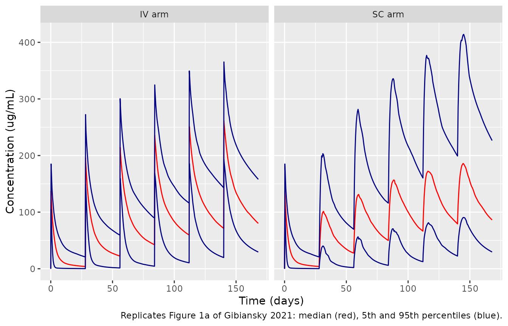
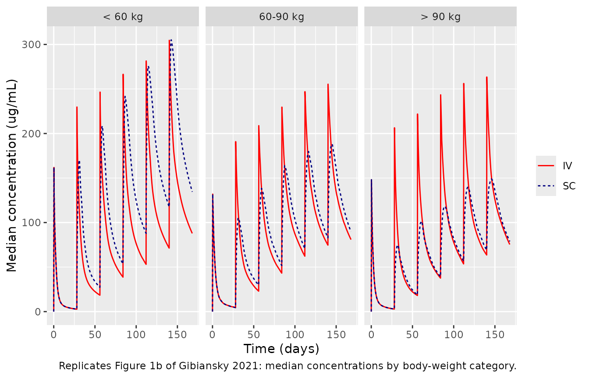

# Rituximab intravenous and subcutaneous (Gibiansky 2021)

## Model and source

- Citation: Gibiansky E, Gibiansky L, Chavanne C, Frey N, Jamois C.
  Population pharmacokinetic and exposure-response analyses of
  intravenous and subcutaneous rituximab in patients with chronic
  lymphocytic leukemia. CPT Pharmacometrics Syst Pharmacol.
  2021;10(8):914-927. <doi:10.1002/psp4.12665>
- Description: Two-compartment population PK model of intravenous and
  subcutaneous rituximab in adults with chronic lymphocytic leukemia
  (CLL); first-order subcutaneous absorption with bioavailability, and
  total clearance equal to a time-independent component cl_exp_inf plus
  a mono-exponentially decaying target-mediated component
  cl_exp_component \* exp(-cl_exp_kdes \* time). Covariates are body
  surface area on all clearances and volumes, baseline white blood cell
  count and baseline tumor size on the time-dependent clearance, body
  mass index on the absorption rate and bioavailability, and sex on the
  central volume; log-scale residual error whose SD falls with
  concentration, with study multipliers and IIV on the residual SD
  (Gibiansky 2021).
- Article: <https://doi.org/10.1002/psp4.12665> (open access; the
  supplement holds the NONMEM control stream of the final model,
  Supplementary Table S5)

Rituximab is an anti-CD20 IgG1 monoclonal antibody. Gibiansky 2021
pooled the SAWYER (intravenous and subcutaneous rituximab) and REACH
(intravenous rituximab) trials in chronic lymphocytic leukemia (CLL) to
confirm that a flat 1600 mg subcutaneous dose in cycles 2-6 gives
troughs at least as high as the 500 mg/m^2 intravenous regimen. The
model is two-compartment with first-order subcutaneous absorption. Total
clearance is a time-independent component `CL_inf` plus a
target-mediated component `CL_T` that decays exponentially with time
since the first dose, as target B cells are depleted:

`CL(t) = CL_T * exp(-k_des * t) + CL_inf`

The paper’s exposure-response and exposure-safety analyses (Cox models
of progression-free survival, B-cell counts, adverse events) use
exposure metrics derived from this PK model. They are statistical
analyses without a concentration-driven dynamic model, so the library
model covers the PK only.

## Population

The analysis included 4739 quantifiable serum samples from 255 patients:
234 previously untreated CLL patients from the two-part phase Ib SAWYER
study and 21 previously treated CLL patients from the phase III REACH
study (Table 1). All patients received rituximab with fludarabine and
cyclophosphamide in 28-day cycles. 45.1% received intravenous rituximab
only and 54.9% received both routes. Baseline demographics (Table 2):
67.5% men, 94.5% Caucasian, mean (range) age 58.4 (25-78) years, weight
79.3 (47.0-124) kg, BSA 1.91 (1.41-2.42) m^2, BMI 27.3 (16.7-41.1)
kg/m^2, white blood cell count 95.2 (4.03-436) x 10^9/L, and tumor size
6810 (100-55,500) mm^2.

The same information is available programmatically via
`readModelDb("Gibiansky_2021_rituximab")()$population`.

## Source trace

Every `ini()` value carries an in-file comment pointing to its source.
The table below collects them. Functional forms come from the NONMEM
control stream of the final model (Supplementary Table S5); values come
from Table 3. NONMEM volumes and clearances in mL and mL/day are divided
by 1000.

| Equation / parameter | Value | Source location |
|----|----|----|
| `lcl_exp_kdes` (k_des) | log(0.0399 1/day) | Table 3, theta1 |
| `lcl_exp_component` (CL_T) | log(1.55 L/day) | Table 3, theta2 (1550 mL/day) |
| `lcl_exp_inf` (CL_inf) | log(0.207 L/day) | Table 3, theta3 (207 mL/day) |
| `lvc` (VC) | log(4.99 L) | Table 3, theta4 (4990 mL) |
| `lvp` (VP) | log(3.70 L) | Table 3, theta5 (3700 mL) |
| `lq` (Q) | log(0.420 L/day) | Table 3, theta6 (420 mL/day) |
| `lka` (ka) | log(0.372 1/day) | Table 3, theta7 |
| `lfdepot` (F_SC) | log(0.633) | Table 3, theta8 |
| `e_bsa_cl_q` | 1.37 | Table 3, theta14; `(BSA/1.9)^theta14` on CL_T, CL_inf and Q (Table S5) |
| `e_bsa_vc_vp` | 0.8 | Table 3, theta15; `(BSA/1.9)^theta15` on VC and VP (Table S5) |
| `e_wbc_cl_exp_component` | 0.223 | Table 3, theta16; `(WBC/100)^theta16` on CL_T (Table S5) |
| `e_tumsz_cl_exp_component` | 0.261 | Table 3, theta20; `(BSIZ/7000)^theta20` on CL_T, reference value when BSIZ \<= 0 (Table S5) |
| `e_sexf_vc` | 0.909 | Table 3, theta17; `theta17^SEXF` on VC (Table S5) |
| `e_bmi_ka` | -1.01 | Table 3, theta18; `(BMI/27)^theta18` on ka (Table S5) |
| `e_bmi_fdepot` | -0.465 | Table 3, theta19; `(BMI/27)^theta19` on F_SC (Table S5) |
| `sdL`, `sdH`, `sd50` | 0.81, 0.134, 6.35 ug/mL | Table 3, theta9-theta11 |
| `e_study_reach_ruv`, `e_study_sawyer1_ruv` | 1.42, 0.568 | Table 3, theta12-theta13 |
| `etalcl_exp_kdes`, `etalcl_exp_component` | 0.357, 0.691 | Table 3, Omega(1,1), Omega(2,2) |
| `etalcl_exp_inf + etalvc` | 0.106, 0.0277, 0.0323 | Table 3, Omega(3,3), Omega(3,4), Omega(4,4) |
| `etalka + etalfdepot` | 0.115, 0.0265, 0.0453 | Table 3, Omega(5,5), Omega(5,6), Omega(6,6) |
| `etaRUV` | 0.0929 | Table 3, Omega(7,7), IIV on the residual SD |
| `cl <- cl_exp_component * exp(-cl_exp_kdes * time) + cl_exp_inf` | n/a | Methods equation; Table S5 `$DES` |
| `d/dt(depot)`, `d/dt(central)`, `d/dt(peripheral1)` | n/a | Table S5 `$DES` (ADVAN13, 3 compartments) |
| `f(depot) <- fdepot` | n/a | Table S5 `F1` |
| `w <- (sdL - (sdL - sdH) * Cc / (sd50 + Cc)) * ...`; `Cc ~ lnorm(w)` | n/a | Supplementary Information residual error equation; Table S5 `$ERROR` |

## Deterministic checks of the model file

### Covariate effects (Table 4)

Table 4 lists the percentage change of each parameter at low and high
covariate values relative to the reference subject (BSA 1.9 m^2, BMI 27
kg/m^2, male, WBC 100 x 10^9/L, tumor size 7000 mm^2). These follow from
the typical values alone, so the packaged model must reproduce them to
the rounding of the table.

``` r

mod <- readModelDb("Gibiansky_2021_rituximab")

ref <- data.frame(
  BSA = 1.9, BMI = 27, SEXF = 0, WBC = 100, TUMSZ = 7000,
  STUDY_REACH = 0, STUDY_SAWYER_PART1 = 0
)
scen <- tibble::tribble(
  ~parameter, ~covariate, ~value, ~published,
  "cl_exp_component", "BSA", 1.53, -25.6,
  "cl_exp_component", "BSA", 2.23, 24.5,
  "cl_exp_inf", "BSA", 1.53, -25.6,
  "q", "BSA", 2.23, 24.5,
  "vc", "BSA", 1.53, -15.9,
  "vp", "BSA", 2.23, 13.7,
  "vc", "SEXF", 1, -9.1,
  "cl_exp_component", "WBC", 11.6, -38.2,
  "cl_exp_component", "WBC", 281, 26,
  "cl_exp_component", "TUMSZ", 400, -52.7,
  "cl_exp_component", "TUMSZ", 27000, 42.3,
  "ka", "BMI", 20.7, 30.7,
  "ka", "BMI", 36.5, -26.2,
  "fdepot", "BMI", 20.7, 13.1,
  "fdepot", "BMI", 36.5, -13.1
)

# One subject per scenario (id 1 is the reference subject); a single
# observation at time 0 returns the individual parameters.
cov_rows <- ref[rep(1, nrow(scen) + 1), ]
for (i in seq_len(nrow(scen))) {
  cov_rows[i + 1, scen$covariate[i]] <- scen$value[i]
}
ev_par <- cbind(id = seq_len(nrow(cov_rows)), time = 0, evid = 0, cmt = "central", cov_rows)
par <- rxode2::rxSolve(mod, ev_par, omega = NA, returnType = "data.frame")
#> ℹ parameter labels from comments will be replaced by 'label()'
#> Warning: multi-subject simulation without without 'omega'
stopifnot(nrow(par) == nrow(scen) + 1)

scen$model <- vapply(seq_len(nrow(scen)), function(i) {
  100 * (par[[scen$parameter[i]]][i + 1] / par[[scen$parameter[i]]][1] - 1)
}, numeric(1))

scen |>
  dplyr::mutate(model = round(model, 1)) |>
  dplyr::rename(
    "Parameter" = parameter, "Covariate" = covariate, "Covariate value" = value,
    "Published change (%)" = published, "Model change (%)" = model
  ) |>
  knitr::kable(caption = "Covariate effects: model versus Table 4 of Gibiansky 2021.")
```

| Parameter | Covariate | Covariate value | Published change (%) | Model change (%) |
|:---|:---|---:|---:|---:|
| cl_exp_component | BSA | 1.53 | -25.6 | -25.7 |
| cl_exp_component | BSA | 2.23 | 24.5 | 24.5 |
| cl_exp_inf | BSA | 1.53 | -25.6 | -25.7 |
| q | BSA | 2.23 | 24.5 | 24.5 |
| vc | BSA | 1.53 | -15.9 | -15.9 |
| vp | BSA | 2.23 | 13.7 | 13.7 |
| vc | SEXF | 1.00 | -9.1 | -9.1 |
| cl_exp_component | WBC | 11.60 | -38.2 | -38.1 |
| cl_exp_component | WBC | 281.00 | 26.0 | 25.9 |
| cl_exp_component | TUMSZ | 400.00 | -52.7 | -52.6 |
| cl_exp_component | TUMSZ | 27000.00 | 42.3 | 42.2 |
| ka | BMI | 20.70 | 30.7 | 30.8 |
| ka | BMI | 36.50 | -26.2 | -26.3 |
| fdepot | BMI | 20.70 | 13.1 | 13.2 |
| fdepot | BMI | 36.50 | -13.1 | -13.1 |

Covariate effects: model versus Table 4 of Gibiansky 2021. {.table}

``` r


# Table 4 prints one decimal; the largest difference is rounding (0.13 points).
stopifnot(max(abs(scen$model - scen$published)) < 0.2)
```

### Clearance components and residual error

The Results state that the initial `CL_T` was 7.5 times `CL_inf` and
decayed with a half-life of 17.4 days. The residual SD equation gives
the stated residual variability of about 50% at `sd50`; its
low-concentration limit (81%) is the “maximum of 80% for concentrations
near the LLOQ”.

``` r

ref_par <- par[1, ]
ratio_clt_clinf <- ref_par$cl_exp_component / ref_par$cl_exp_inf
t_half_clt <- log(2) / ref_par$cl_exp_kdes

theta <- rxode2::rxode(mod)$theta
#> ℹ parameter labels from comments will be replaced by 'label()'
w_at <- function(conc) {
  theta[["sdL"]] - (theta[["sdL"]] - theta[["sdH"]]) * conc / (theta[["sd50"]] + conc)
}
knitr::kable(data.frame(
  Quantity = c(
    "CL_T / CL_inf at time 0", "Half-life of CL_T decay (day)",
    "Residual SD at sd50 = 6.35 ug/mL", "Residual SD at the LLOQ (0.5 ug/mL)",
    "Residual SD at 57 ug/mL (9 x sd50)"
  ),
  Published = c("7.5", "17.4", "~50%", "~80% (maximum)", "~13%"),
  Model = c(
    sprintf("%.2f", ratio_clt_clinf), sprintf("%.1f", t_half_clt),
    sprintf("%.1f%%", 100 * w_at(6.35)), sprintf("%.1f%%", 100 * w_at(0.5)),
    sprintf("%.1f%%", 100 * w_at(9 * 6.35))
  )
), caption = "Clearance and residual-error quantities quoted in the Results.")
```

| Quantity                            | Published      | Model |
|:------------------------------------|:---------------|:------|
| CL_T / CL_inf at time 0             | 7.5            | 7.49  |
| Half-life of CL_T decay (day)       | 17.4           | 17.4  |
| Residual SD at sd50 = 6.35 ug/mL    | ~50%           | 47.2% |
| Residual SD at the LLOQ (0.5 ug/mL) | ~80% (maximum) | 76.1% |
| Residual SD at 57 ug/mL (9 x sd50)  | ~13%           | 20.2% |

Clearance and residual-error quantities quoted in the Results. {.table}

``` r


stopifnot(
  abs(ratio_clt_clinf - 7.5) < 0.05,
  abs(t_half_clt - 17.4) < 0.05,
  abs(w_at(6.35) - 0.472) < 1e-3
)
```

The last row does not match: at 9 x `sd50` the equation gives about 20%,
and it only approaches `sdH` = 13.4% at much higher concentrations. The
equation and its parameters are taken from the control stream, so the
“~13% for concentrations above 60 ug/ml” phrase in the Results is read
as a description of the high-concentration asymptote `sdH`.

## Virtual cohort

The paper’s Figure 1 simulations used the covariates and individual
parameters of 140 SAWYER part 2 patients with subcutaneous data. Those
are not public, so the cohort below is virtual. 200 subjects are drawn
with covariate distributions matching the SAWYER column of Table 2. Each
subject is then simulated under both Figure 1 regimens with the same
covariates and random effects:

- **IV**: 375 mg/m^2 i.v. in cycle 1, then 500 mg/m^2 i.v. in cycles
  2-6.
- **SC**: 375 mg/m^2 i.v. in cycle 1, then 1600 mg s.c. in cycles 2-6.

The random effects come from R’s random number generator, not rxode2’s.
A Latin hypercube over the standard-normal marginals is mapped through
the Cholesky factor of the published covariance matrix, and the solve
uses `omega = NA`. The cohort is therefore identical on any machine or
thread count, and the IV-versus-SC contrasts are paired within subject.

``` r

set.seed(20210716)
n <- 200

sexf <- sample(as.integer(seq_len(n) <= round(0.325 * n)))
height <- ifelse(sexf == 1, rnorm(n, 162, 6.5), rnorm(n, 174, 7))
wt <- pmin(pmax(ifelse(sexf == 1, rnorm(n, 71.5, 12.5), rnorm(n, 82.8, 12.5)), 47), 124)
lognormal <- function(n, m, s, lo, hi) {
  sdlog <- sqrt(log(1 + (s / m)^2))
  pmin(pmax(exp(rnorm(n, log(m) - sdlog^2 / 2, sdlog)), lo), hi)
}
subjects <- data.frame(
  sid = seq_len(n),
  SEXF = sexf,
  WT = wt,
  BSA = sqrt(height * wt / 3600), # Mosteller
  BMI = wt / (height / 100)^2,
  WBC = lognormal(n, 93.4, 71.4, 4.03, 344), # Table 2, SAWYER
  TUMSZ = lognormal(n, 6960, 7880, 100, 55500), # Table 2, SAWYER; log-normal per Results
  STUDY_REACH = 0,
  STUDY_SAWYER_PART1 = 0
)

omega <- rxode2::rxode(mod)$omega
#> ℹ parameter labels from comments will be replaced by 'label()'
z <- vapply(seq_len(ncol(omega)), function(j) qnorm((sample.int(n) - 0.5) / n), numeric(n))
etas <- z %*% chol(omega)
colnames(etas) <- colnames(omega)
subjects <- cbind(subjects, etas)

subjects |>
  dplyr::summarise(dplyr::across(c(WT, BSA, BMI, WBC, TUMSZ), ~ sprintf("%.3g (%.3g)", mean(.x), sd(.x)))) |>
  dplyr::mutate(`Female (%)` = 100 * mean(subjects$SEXF)) |>
  knitr::kable(caption = "Virtual cohort, mean (SD). Table 2 SAWYER: WT 79.2 (13.7) kg, BSA 1.91 (0.192) m^2, BMI 27.2 (4.18) kg/m^2, WBC 93.4 (71.4) x 10^9/L, tumor size 6960 (7880) mm^2, 32.5% female.")
```

| WT          | BSA          | BMI         | WBC       | TUMSZ               | Female (%) |
|:------------|:-------------|:------------|:----------|:--------------------|-----------:|
| 79.6 (13.8) | 1.93 (0.187) | 27.5 (5.08) | 94.7 (72) | 6.56e+03 (6.08e+03) |       32.5 |

Virtual cohort, mean (SD). Table 2 SAWYER: WT 79.2 (13.7) kg, BSA 1.91
(0.192) m^2, BMI 27.2 (4.18) kg/m^2, WBC 93.4 (71.4) x 10^9/L, tumor
size 6960 (7880) mm^2, 32.5% female. {.table}

``` r

dose_times <- 28 * 0:5
# Infusion durations are not reported; 6 h in cycle 1 and 4 h thereafter.
inf_dur <- c(6, rep(4, 5)) / 24
obs_times <- sort(unique(c(seq(0, 168, by = 0.5), dose_times + inf_dur)))

make_events <- function(regimen, id_offset) {
  rows <- lapply(seq_len(n), function(i) {
    s <- subjects[i, ]
    if (regimen == "IV") {
      amt <- c(375, rep(500, 5)) * s$BSA
      cmt <- rep("central", 6)
    } else {
      amt <- c(375 * s$BSA, rep(1600, 5))
      cmt <- c("central", rep("depot", 5))
    }
    doses <- data.frame(
      time = dose_times, evid = 1L, amt = amt, cmt = cmt,
      rate = ifelse(cmt == "central", amt / inf_dur, 0)
    )
    obs <- data.frame(time = obs_times, evid = 0L, amt = 0, cmt = "central", rate = 0)
    ev <- rbind(doses, obs)
    cbind(id = id_offset + i, regimen = regimen, ev, s[rep(1, nrow(ev)), names(s) != "sid"])
  })
  dplyr::bind_rows(rows)
}

events <- dplyr::bind_rows(make_events("IV", 0L), make_events("SC", n)) |>
  dplyr::arrange(id, time, dplyr::desc(evid))
stopifnot(!anyDuplicated(unique(events[, c("id", "time", "evid")])))
```

## Simulation

``` r

sim <- rxode2::rxSolve(
  mod, events,
  omega = NA,
  keep = c("regimen", "WT", "BSA"),
  returnType = "data.frame"
)
#> Warning: multi-subject simulation without without 'omega'
sim$sid <- ((sim$id - 1) %% n) + 1
stopifnot(all(sim$Cc >= -1e-6 * max(sim$Cc)))

# The supplied random effects are applied: the realised between-subject SD of
# log(CL_inf), after removing the BSA effect, equals sqrt(Omega(3,3)).
first_row <- sim[!duplicated(sim$id), ]
sd_clinf <- sd(log(first_row$cl_exp_inf) - 1.37 * log(first_row$BSA / 1.9))
stopifnot(abs(sd_clinf - sqrt(0.106)) < 0.01)
```

## Replicate Figure 1

### Figure 1a: concentration-time course by regimen

The red median curves of Figure 1a are vector graphics in the article
PDF. The maintainers extracted their exact vertex coordinates. The table
compares the medians at the pre-dose and end-of-cycle-6 times with the
simulated cohort.

``` r

pct <- sim |>
  dplyr::group_by(regimen, time) |>
  dplyr::summarise(
    Q05 = quantile(Cc, 0.05), Q50 = median(Cc), Q95 = quantile(Cc, 0.95),
    .groups = "drop"
  )

ggplot(pct, aes(time)) +
  geom_line(aes(y = Q50), colour = "red") +
  geom_line(aes(y = Q05), colour = "navy") +
  geom_line(aes(y = Q95), colour = "navy") +
  facet_wrap(~regimen, labeller = labeller(regimen = c(IV = "IV arm", SC = "SC arm"))) +
  labs(
    x = "Time (days)", y = "Concentration (ug/mL)",
    caption = "Replicates Figure 1a of Gibiansky 2021: median (red), 5th and 95th percentiles (blue)."
  )
```



``` r

# Median curve vertices from the Figure 1a vector graphics (ug/mL).
digitised <- tibble::tribble(
  ~time, ~IV, ~SC,
  28, 6, 5,
  56, 25, 30,
  84, 44, 56,
  112, 66, 80,
  140, 86, 98,
  168, 94, 105
) |>
  tidyr::pivot_longer(c(IV, SC), names_to = "regimen", values_to = "published")

med_cmp <- pct |>
  dplyr::inner_join(digitised, by = c("regimen", "time")) |>
  dplyr::transmute(regimen, time, published, simulated = Q50, pct_diff = 100 * (Q50 / published - 1))
stopifnot(nrow(med_cmp) == nrow(digitised))

med_cmp |>
  dplyr::mutate(simulated = signif(simulated, 3), pct_diff = round(pct_diff, 1)) |>
  dplyr::rename(
    "Regimen" = regimen, "Time (day)" = time, "Figure 1a median (ug/mL)" = published,
    "Simulated median (ug/mL)" = simulated, "Difference (%)" = pct_diff
  ) |>
  knitr::kable(caption = "Median trough concentrations before each cycle and at the end of cycle 6.")
```

| Regimen | Time (day) | Figure 1a median (ug/mL) | Simulated median (ug/mL) | Difference (%) |
|:---|---:|---:|---:|---:|
| IV | 28 | 6 | 3.98 | -33.7 |
| IV | 56 | 25 | 22.30 | -10.8 |
| IV | 84 | 44 | 42.30 | -3.8 |
| IV | 112 | 66 | 59.60 | -9.7 |
| IV | 140 | 86 | 71.30 | -17.1 |
| IV | 168 | 94 | 80.10 | -14.8 |
| SC | 28 | 5 | 3.98 | -20.5 |
| SC | 56 | 30 | 27.60 | -8.1 |
| SC | 84 | 56 | 49.90 | -10.9 |
| SC | 112 | 80 | 66.40 | -17.0 |
| SC | 140 | 98 | 79.20 | -19.2 |
| SC | 168 | 105 | 86.20 | -17.9 |

Median trough concentrations before each cycle and at the end of cycle
6. {.table}

``` r


# Cycles 2-6 troughs (days 56-168): the virtual cohort sits 4-19% below the
# paper's conditional simulations; see the discussion below. The day-28 trough
# is 3-6 ug/mL on a 0-350 ug/mL axis and is excluded as not digitisable to
# relative precision.
late <- med_cmp$time >= 56
stopifnot(
  abs(median(med_cmp$pct_diff[late])) < 20,
  max(abs(med_cmp$pct_diff[late])) < 30
)
```

The simulated troughs from cycle 2 onwards are 4-19% below the Figure 1a
medians, with the largest gap before cycle 6. Figure 1a is a conditional
simulation that used each patient’s post hoc parameters. The paper’s own
prediction-corrected VPC shows the population model “slight\[ly\]
underestimat\[ing\]” concentrations in the subcutaneous arm of SAWYER
part 2 (Figure S4), and NPDEs show bias at late time points. Post hoc
parameters absorb that misfit, and a population simulation from the
typical values does not. Both arms are affected, so the IV:SC comparison
below is less sensitive to it.

### Figure 1b and 1c: exposure by body size

The tables under Figure 1b and 1c give cycle-6 `Ctrough`, `AUC_tau` and
`Cmax` by body-weight category and by BSA tertile. The IV:SC ratio
compares the two regimens within a category. The paper defines `Ctrough`
as the concentration 28 days after the last dose (Methods,
“Exposure-response”). Cycle-6 metrics are computed here with PKNCA, with
the cycle re-anchored to its own dose (day 140 = time 0).

``` r

conc_c6 <- sim |>
  dplyr::filter(!is.na(Cc), time >= 140, time <= 168) |>
  dplyr::mutate(time = time - 140) |>
  dplyr::select(id, sid, regimen, time, Cc)
dose_c6 <- events |>
  dplyr::filter(evid == 1, time == 140) |>
  dplyr::mutate(time = 0) |>
  dplyr::select(id, regimen, time, amt)
stopifnot(all(tapply(conc_c6$time, conc_c6$id, min) == 0))

nca_c6 <- PKNCA::pk.nca(PKNCA::PKNCAdata(
  PKNCA::PKNCAconc(conc_c6, Cc ~ time | regimen + id),
  PKNCA::PKNCAdose(dose_c6, amt ~ time | regimen + id),
  intervals = data.frame(start = 0, end = 28, cmax = TRUE, auclast = TRUE, ctrough = TRUE)
))

nca_wide <- as.data.frame(nca_c6$result) |>
  dplyr::select(id, regimen, PPTESTCD, PPORRES) |>
  tidyr::pivot_wider(names_from = PPTESTCD, values_from = PPORRES) |>
  dplyr::mutate(sid = ((id - 1) %% n) + 1) |>
  dplyr::left_join(subjects[, c("sid", "WT", "BSA")], by = "sid")
stopifnot(nrow(nca_wide) == 2 * n, !anyNA(nca_wide$ctrough), !anyNA(nca_wide$auclast))
```

``` r

paired <- nca_wide |>
  dplyr::select(sid, WT, BSA, regimen, ctrough, auclast, cmax) |>
  tidyr::pivot_wider(names_from = regimen, values_from = c(ctrough, auclast, cmax)) |>
  dplyr::mutate(
    wt_cat = cut(WT, c(0, 60, 90, Inf), labels = c("< 60 kg", "60-90 kg", "> 90 kg"), right = FALSE),
    bsa_cat = cut(BSA, c(0, 1.86, 2.01, Inf), labels = c("BSA low", "BSA med", "BSA hi"))
  )

ratio_by <- function(cat) {
  paired |>
    dplyr::group_by(category = .data[[cat]]) |>
    dplyr::summarise(
      n = dplyr::n(),
      ctrough = median(ctrough_IV / ctrough_SC),
      auclast = median(auclast_IV / auclast_SC),
      cmax = median(cmax_IV / cmax_SC),
      .groups = "drop"
    ) |>
    dplyr::mutate(category = as.character(category))
}
published_ratio <- tibble::tribble(
  ~category, ~ctrough_pub, ~auclast_pub, ~cmax_pub,
  "< 60 kg", 0.664, 0.701, 0.879,
  "60-90 kg", 0.843, 0.90, 1.16,
  "> 90 kg", 1.02, 1.12, 1.52,
  "BSA low", 0.746, 0.795, 1.03,
  "BSA med", 0.879, 0.934, 1.21,
  "BSA hi", 0.989, 1.08, 1.44
)
ratio_cmp <- dplyr::bind_rows(ratio_by("wt_cat"), ratio_by("bsa_cat")) |>
  dplyr::inner_join(published_ratio, by = "category")
stopifnot(nrow(ratio_cmp) == 6, all(ratio_cmp$n >= 10))

ratio_cmp |>
  dplyr::mutate(dplyr::across(c(ctrough, auclast, cmax), ~ round(.x, 3))) |>
  dplyr::select(category, n, ctrough_pub, ctrough, auclast_pub, auclast, cmax_pub, cmax) |>
  dplyr::rename(
    "Category" = category, "N" = n,
    "Ctrough IV:SC, paper" = ctrough_pub, "Ctrough IV:SC, model" = ctrough,
    "AUCtau IV:SC, paper" = auclast_pub, "AUCtau IV:SC, model" = auclast,
    "Cmax IV:SC, paper" = cmax_pub, "Cmax IV:SC, model" = cmax
  ) |>
  knitr::kable(caption = "Cycle-6 IV:SC exposure ratios by body-weight category and BSA tertile (Figure 1b and 1c tables); model value is the median of within-subject ratios.")
```

| Category | N | Ctrough IV:SC, paper | Ctrough IV:SC, model | AUCtau IV:SC, paper | AUCtau IV:SC, model | Cmax IV:SC, paper | Cmax IV:SC, model |
|:---|---:|---:|---:|---:|---:|---:|---:|
| \< 60 kg | 18 | 0.664 | 0.664 | 0.701 | 0.685 | 0.879 | 0.924 |
| 60-90 kg | 136 | 0.843 | 0.850 | 0.900 | 0.928 | 1.160 | 1.332 |
| \> 90 kg | 46 | 1.020 | 1.055 | 1.120 | 1.172 | 1.520 | 1.813 |
| BSA low | 63 | 0.746 | 0.742 | 0.795 | 0.809 | 1.030 | 1.164 |
| BSA med | 60 | 0.879 | 0.879 | 0.934 | 0.955 | 1.210 | 1.381 |
| BSA hi | 77 | 0.989 | 0.992 | 1.080 | 1.073 | 1.440 | 1.638 |

Cycle-6 IV:SC exposure ratios by body-weight category and BSA tertile
(Figure 1b and 1c tables); model value is the median of within-subject
ratios. {.table}

``` r


ratio_err <- with(ratio_cmp, c(ctrough / ctrough_pub, auclast / auclast_pub) - 1)
# Realised errors are -2.3% to +4.6%; the cohort is drawn with R's generator
# and solved with omega = NA, so it does not change with the solver thread
# count. A dose, bioavailability or BSA-exponent error moves these ratios by
# tens of percent.
stopifnot(
  abs(median(ratio_err)) < 0.05,
  max(abs(ratio_err)) < 0.1
)
```

The trough and AUC ratios agree with the paper to within 5%. That
includes the headline finding that the flat subcutaneous dose gives
higher exposure than intravenous dosing in small patients, and similar
exposure in patients over 90 kg or with BSA above 2.01 m^2. The Cmax
ratios are 13-19% higher than the paper’s in every category except
`< 60 kg` (5%). The simulated IV Cmax is the end-of-infusion value on a
fine time grid. The Figure 1 curves are evaluated on a coarse grid: the
first IV points after each dose sit about one day post-dose (for example
day 1 in cycle 1, 98 ug/mL against an end-of-infusion value near 140
ug/mL, the 375 mg/m^2 dose over the typical VC). A coarse grid misses
the IV peak but barely affects the slower subcutaneous peak, so it
depresses the paper’s IV:SC Cmax ratio. This is recorded as a known
difference and is not gated.

The between-category ratios printed with Figure 1 (for example IV
`< 60 kg / 60-90 kg` = 1.40) compare different patients, and depend on
the actual covariate mix of the 140 SAWYER patients. They are not
reproduced with a virtual cohort. The category-level comparison below
lists them for reference.

``` r

cat_medians <- nca_wide |>
  dplyr::mutate(wt_cat = cut(WT, c(0, 60, 90, Inf), labels = c("< 60 kg", "60-90 kg", "> 90 kg"), right = FALSE)) |>
  dplyr::group_by(regimen, wt_cat) |>
  dplyr::summarise(ctrough = median(ctrough), auclast = median(auclast), cmax = median(cmax), .groups = "drop")

cat_medians |>
  dplyr::mutate(dplyr::across(c(ctrough, auclast, cmax), ~ signif(.x, 3))) |>
  dplyr::rename(
    "Regimen" = regimen, "Weight category" = wt_cat, "Ctrough C6 (ug/mL)" = ctrough,
    "AUCtau C6 (ug*day/mL)" = auclast, "Cmax C6 (ug/mL)" = cmax
  ) |>
  knitr::kable(caption = "Simulated cycle-6 exposure medians by body-weight category. Paper ratios versus 60-90 kg: IV 1.40 / 1.10 (Ctrough), SC 1.77 / 0.906 (Ctrough).")
```

| Regimen | Weight category | Ctrough C6 (ug/mL) | AUCtau C6 (ug\*day/mL) | Cmax C6 (ug/mL) |
|:---|:---|---:|---:|---:|
| IV | \< 60 kg | 87.8 | 4000 | 305 |
| IV | 60-90 kg | 80.9 | 3660 | 255 |
| IV | \> 90 kg | 75.4 | 3390 | 263 |
| SC | \< 60 kg | 135.0 | 6050 | 313 |
| SC | 60-90 kg | 89.7 | 3860 | 189 |
| SC | \> 90 kg | 78.8 | 3290 | 149 |

Simulated cycle-6 exposure medians by body-weight category. Paper ratios
versus 60-90 kg: IV 1.40 / 1.10 (Ctrough), SC 1.77 / 0.906 (Ctrough).
{.table style="width:100%;"}

``` r

sim |>
  dplyr::mutate(wt_cat = cut(WT, c(0, 60, 90, Inf), labels = c("< 60 kg", "60-90 kg", "> 90 kg"), right = FALSE)) |>
  dplyr::group_by(regimen, wt_cat, time) |>
  dplyr::summarise(Q50 = median(Cc), .groups = "drop") |>
  ggplot(aes(time, Q50, colour = regimen, linetype = regimen)) +
  geom_line() +
  facet_wrap(~wt_cat) +
  scale_colour_manual(values = c(IV = "red", SC = "navy")) +
  labs(
    x = "Time (days)", y = "Median concentration (ug/mL)", colour = NULL, linetype = NULL,
    caption = "Replicates Figure 1b of Gibiansky 2021: median concentrations by body-weight category."
  )
```



### Comparison against published cycle-6 values

The paper reports no NCA table. The comparison uses the cycle-6 values
that Figure 1a gives directly: the end-of-cycle trough (day 168) for
both regimens, and the subcutaneous peak. The IV peak on the figure is
the day-141 grid point, not the end-of-infusion Cmax, so it is omitted.

``` r

reference_c6 <- data.frame(
  regimen = c("IV", "SC", "SC"),
  PPTESTCD = c("ctrough", "ctrough", "cmax"),
  PPORRES = c(94, 105, 201)
)
cmp <- nlmixr2lib::ncaComparisonTable(
  simulated = nca_c6,
  reference = reference_c6,
  by = "regimen",
  params = c("cmax", "ctrough"),
  units = c(cmax = "ug/mL", ctrough = "ug/mL"),
  tolerance_pct = 20
)
knitr::kable(cmp, caption = "Simulated cohort median versus the Figure 1a median at cycle 6. * differs by more than 20%.")
```

| NCA parameter   | regimen | Reference | Simulated | % diff |
|:----------------|:--------|:----------|:----------|:-------|
| Cmax (ug/mL)    | SC      | 201       | 187       | -7.1%  |
| Ctrough (ug/mL) | IV      | 94        | 80.1      | -14.8% |
| Ctrough (ug/mL) | SC      | 105       | 86.2      | -17.9% |

Simulated cohort median versus the Figure 1a median at cycle 6. \*
differs by more than 20%. {.table}

## Assumptions and deviations

- **Virtual cohort.** Covariates were drawn to match the SAWYER column
  of Table
  2.  Height was sex-specific normal (men 174 (SD 7) cm, women 162 (SD
      6.5) cm) and weight sex-specific normal truncated to the observed
      range. BSA was computed with the Mosteller formula; the paper does
      not name its BSA formula. White blood cell count and tumor size
      were log-normal with the Table 2 mean and SD. Covariates were
      drawn independently, although in CLL white cell count and tumor
      load are probably correlated.
- **Infusion duration.** Not reported. Six hours for the first infusion
  and four hours thereafter. An infusion lasting hours has little effect
  on troughs and AUC over a 28-day cycle.
- **Time origin.** The decay of `CL_T` runs on NONMEM `T`, the time
  since the first rituximab dose. The library model uses `time`, so
  simulations must start at the first rituximab dose. A subject switched
  from intravenous to subcutaneous dosing keeps its original time
  origin.
- **Missing covariates.** The NONMEM code sets the BSA, BMI and WBC
  ratios to 1 when a missing-value flag is set. The library model has no
  flag columns, so supply a value (for example the reference value) for
  every subject. The tumor-size rule (`BSIZ <= 0` gives the reference
  value) is kept, because the paper coded missing tumor size as -99 or
  0.
- **Residual error.** Encoded exactly as the `$ERROR` block: the
  log-scale SD falls from `sdL` to `sdH` with concentration, is
  multiplied by the REACH and SAWYER part 1 study factors, and carries
  its own random effect `etaRUV`. The study indicators default to the
  SAWYER part 2 reference (`STUDY_REACH = STUDY_SAWYER_PART1 = 0`). The
  NONMEM floor `IPRED = log(0.1)` for zero predictions is not carried,
  because the library model is not used at zero concentration.
- **Subcutaneous bioavailability** is log-normal with a BMI power term
  and is not bounded at 1, as in the control stream. The BMI range
  studied (16.7-41.1 kg/m^2) keeps the typical value between 0.52 and
  0.79.
- **Figure 1 digitisation.** The Figure 1a medians are the vertices of
  the vector paths in the article PDF, calibrated on the axis ticks. The
  curves are polylines evaluated on a coarse time grid (see the Cmax
  discussion).
- **Exposure-response.** The Cox proportional-hazards models of
  progression-free survival (Table 4, lower half) and the
  exposure-safety graphics are statistical analyses on model-derived
  exposure, not concentration-driven models, and are not part of the
  library model.
- **Errata.** No correction notice was found for this article as of
  2026-09-28 (Crossref).
