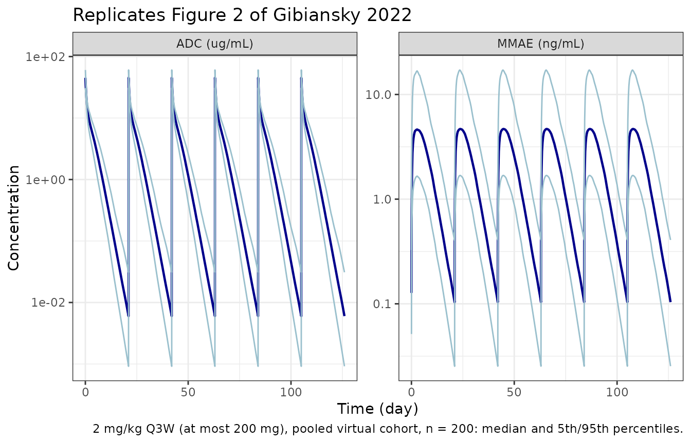

# Tisotumab vedotin ADC and MMAE (Gibiansky 2022)

## Model and source

- Citation: Gibiansky L, Passey C, Voellinger J, Gunawan R, Hanley WD,
  Gupta M, Winter H. Population pharmacokinetic analysis for tisotumab
  vedotin in patients with locally advanced and/or metastatic solid
  tumors. CPT Pharmacometrics Syst Pharmacol. 2022;11(10):1358-1370.
  <doi:10.1002/psp4.12850>. PMID 35932175; PMCID PMC9574719. Covariate
  coefficients and variance parameters, which the article does not
  print, are from the same final model as tabulated in the FDA BLA
  761208 Multi-discipline Review (2021), Tables 49 and 50.
- Description: Joint population PK model for the antibody-drug conjugate
  tisotumab vedotin (ADC) and its released payload monomethyl auristatin
  E (MMAE) in adults with locally advanced or metastatic solid tumors
  (Gibiansky 2022). The ADC is a two-compartment model with parallel
  linear and Michaelis-Menten elimination from the central compartment.
  Linear ADC elimination, multiplied by a drug-to-antibody ratio that
  decays mono-exponentially with time after dose from 4 to 1, feeds an
  amount-only MMAE delay compartment in full and the central MMAE
  compartment by an additional fraction FR1; a fraction FR2 of the
  Michaelis-Menten flux also feeds the delay compartment. The delay
  compartment drains first-order into a one-compartment MMAE model with
  apparent clearance and volume. Covariates: body weight, albumin and
  sex on ADC CL and Vc; weight on Q and Vp; weight, albumin, tumor type,
  eGFR, tumor size, ECOG performance status and hepatic impairment on
  MMAE clearance; weight, ECOG and albumin on MMAE volume; age and
  weight on the delay rate constant.
- Article: [CPT Pharmacometrics Syst Pharmacol
  2022;11:1358-1370](https://doi.org/10.1002/psp4.12850) (open access,
  PMC9574719)
- Regulatory review: [FDA BLA 761208 Multi-discipline Review, tisotumab
  vedotin
  (2021)](https://www.accessdata.fda.gov/drugsatfda_docs/nda/2021/761208Orig1s000MultidisciplineR.pdf)

Tisotumab vedotin is an antibody-drug conjugate (ADC) of a
tissue-factor-directed human IgG1 and the microtubule-disrupting payload
monomethyl auristatin E (MMAE), attached through a protease-cleavable vc
linker at an average of four MMAE per antibody. The model describes the
conjugated antibody (ADC) and the unconjugated MMAE that is released
from it.

The article prints the structural parameters (Table 2) and the model
equations (Table S1), but neither the covariate coefficients
`theta17`-`theta36` nor the variance parameters. Those come from the
sponsor’s population PK report as reproduced in the FDA BLA 761208
Multi-discipline Review (Table 49, covariate fixed effects; Table 50,
variance parameters). The review’s Table 48 matches the article’s Table
2 to every printed digit, so both describe the same final model.

## Population

Gibiansky 2022 pooled 399 adults with locally advanced or metastatic
solid tumors known to express tissue factor from four phase I/II trials:
innovaTV 201 (NCT02001623, n = 195), innovaTV 202 (NCT02552121, n = 33),
innovaTV 204 (NCT03438396, n = 101, all cervical cancer) and innovaTV
207 (NCT03485209, n = 70). Mean age was 56.1 years, 74.2% were women and
92.2% were White; 70.7% were enrolled in Europe and 29.3% in the United
States. Cervical cancer accounted for 43.1% of patients. Renal function
was normal in 53.9%, mildly impaired in 35.6% and moderately impaired in
10.5%; 14.5% had mild hepatic impairment (NCI ODWG). ECOG performance
status was 0 in 38.8% and 1 in 61.2% (article Table 1). Median (range)
body weight was 70.1 (33-148) kg, albumin 40 (27-52) g/L, tumor size 57
(0-299) mm and CKD-EPI eGFR 91 (24.1-145) mL/min/1.73 m^2 (FDA review
Table 45). Doses were 0.3-2.2 mg/kg every 3 weeks (Q3W) in innovaTV 201,
1.2 mg/kg on days 1, 8 and 15 of a 28-day cycle or 2.0 mg/kg Q3W in
innovaTV 202, and 2.0 mg/kg Q3W (at most 200 mg) in innovaTV 204 and
207. The same information is stored in the model’s `population`
metadata.

## Source trace

| Element | Value | Source |
|----|----|----|
| ADC two-compartment model with parallel linear and Michaelis-Menten elimination | ODEs for A1, A2 | Table S1; Figure 1 |
| MMAE delay compartment and one-compartment MMAE model | ODEs for A3, A4 | Table S1; Figure 1 |
| DAR = 1 + DAR0 exp(-beta tad), DAR0 = 3 | fixed | Table S1; Methods |
| MMAE output scale, MW_RATIO | 4.8 (fixed) | Table S1 |
| `lcl` CL | 1.42 L/day | Table 2 theta1 |
| `lq` Q | 4.01 L/day | Table 2 theta2 |
| `lvc` Vc | 3.10 L | Table 2 theta3 |
| `lvp` Vp | 4.47 L | Table 2 theta4 |
| `lvmax` Vmax | 3.35 ug/mL/day | Table 2 theta5 |
| `lkm` KM | 3.44 ug/mL | Table 2 theta6 |
| `propSd`, `addSd` (ADC) | 0.129, 0.0173 ug/mL | Table 2 theta7, theta8 |
| `lktr` ktr | 0.271 1/day | Table 2 theta9 |
| `lcl_mmae` CL_MMAE | 42.8 L/day | Table 2 theta10 |
| `lvc_mmae` V_MMAE | 2.09 L | Table 2 theta11 |
| `lbeta` beta (DAR decay) | 0.0189 1/day | Table 2 theta12 |
| `propSd_mmae`, `addSd_mmae` (MMAE) | 0.282, 0.0113 ng/mL | Table 2 theta13, theta14 |
| `fr1` FR1 | 0.0205 | Table 2 theta15 |
| `fr2` FR2 | 0.0508 | Table 2 theta16 |
| Covariate functional forms and reference values (75 kg, 40 g/L, 90 mL/min/1.73 m^2, 60 mm, 60 years) | – | Table S1 |
| `e_wt_cl` (CL and Q), `e_wt_vc`, `e_wt_vp` | 0.495, 0.380, 0.622 | FDA review Table 49 theta17-theta19 |
| `e_alb_cl`, `e_alb_vc` | -0.396, -0.197 | FDA review Table 49 theta20-theta21 |
| `e_sexm_cl`, `e_sexm_vc` | 1.09, 1.13 | FDA review Table 49 theta22-theta23 |
| `e_wt_cl_mmae`, `e_wt_vc_mmae` | 0.457, 0.895 | FDA review Table 49 theta24-theta25 |
| `e_alb_cl_mmae` | 0.935 | FDA review Table 49 theta26 |
| `e_tumtp_other_cl_mmae` | 1.22 | FDA review Table 49 theta27 |
| `e_tumsz_cl_mmae` | -0.147 | FDA review Table 49 theta28 |
| `e_crcl_cl_mmae` | 0.271 | FDA review Table 49 theta29 |
| `e_ecog_cl_mmae`, `e_hepimp_cl_mmae` | 0.803, 0.853 | FDA review Table 49 theta30-theta31 |
| `e_ecog_vc_mmae`, `e_alb_vc_mmae` | 0.827, 0.575 | FDA review Table 49 theta32-theta33 |
| `e_age_ktr`, `e_wt_ktr` | -0.252, -0.175 | FDA review Table 49 theta34-theta35 |
| `e_study_innovatv202_ruv` | 1.42 | FDA review Table 49 theta36 |
| IIV block CL, Vc, Vp | 0.0538; 0.0166, 0.0296; 0, 0.0145, 0.0208 | FDA review Table 50; Table S1 (CL-Vp covariance 0) |
| `etalktr` | 0.0212 | FDA review Table 50 Omega55 |
| IIV block CL_MMAE, V_MMAE | 0.299; 0.125, 0.215 | FDA review Table 50 |
| `etaRUV`, `etaRUV_mmae` (IIV on residual SD) | 0.0561, 0.0712 | FDA review Table 50 Omega44, Omega88; Table S1 |

The IIV coefficients of variation the article quotes in its Results (CL
23.2%, Vc 17.2%, Vp 14.4%, CL_MMAE 54.7%, V_MMAE 46.3%; correlations
0.415, 0.586 and 0.495) are the square roots of these variances and the
implied correlations.

``` r

mod <- readModelDb("Gibiansky_2022_tisotumab")
# Only the between-subject variability is zeroed; the exposures below use the
# individual prediction columns, which residual error does not touch.
mod_typ <- rxode2::zeroRe(rxode2::rxode2(mod), which = "omega")
#> ℹ parameter labels from comments will be replaced by 'label()'
```

## Derived quantities from the typical parameters

The article derives several secondary quantities from the Table 2
estimates. They are reproduced here in closed form for the 75-kg
reference patient.

``` r

cl <- 1.42; q <- 4.01; vc <- 3.10; vp <- 4.47
ktr <- 0.271; cl_mmae <- 42.8; vc_mmae <- 2.09
k10 <- cl / vc; k12 <- q / vc; k21 <- q / vp
a <- k10 + k12 + k21
lambda1 <- (a + sqrt(a^2 - 4 * k10 * k21)) / 2
lambda2 <- (a - sqrt(a^2 - 4 * k10 * k21)) / 2
derived <- tibble::tribble(
  ~quantity, ~published, ~computed,
  "ADC distribution half-life (day)", 0.28, log(2) / lambda1,
  "ADC terminal half-life, linear part (day)", 4.19, log(2) / lambda2,
  "MMAE delay half-life log(2)/ktr (day)", 2.56, log(2) / ktr,
  "MMAE half-life log(2)/K_MMAE (day)", 0.0339, log(2) / (cl_mmae / vc_mmae),
  "MMAE steady-state volume CL_MMAE/ktr (L)", 158, cl_mmae / ktr
) |>
  mutate(pct_diff = 100 * (computed - published) / published)
knitr::kable(derived, digits = 4,
             caption = "Derived quantities: Table 2 and Results of Gibiansky 2022; terminal half-life 4.19 days from FDA review Table 48.")
```

| quantity                                  | published | computed | pct_diff |
|:------------------------------------------|----------:|---------:|---------:|
| ADC distribution half-life (day)          |    0.2800 |   0.2791 |  -0.3100 |
| ADC terminal half-life, linear part (day) |    4.1900 |   4.1887 |  -0.0314 |
| MMAE delay half-life log(2)/ktr (day)     |    2.5600 |   2.5577 |  -0.0883 |
| MMAE half-life log(2)/K_MMAE (day)        |    0.0339 |   0.0338 |  -0.1545 |
| MMAE steady-state volume CL_MMAE/ktr (L)  |  158.0000 | 157.9336 |  -0.0420 |

Derived quantities: Table 2 and Results of Gibiansky 2022; terminal
half-life 4.19 days from FDA review Table 48. {.table}

``` r

# Pure arithmetic on printed values, so only rounding separates the two columns.
stopifnot(all(abs(derived$pct_diff) < 1))
```

The article also states that after a 2-mg/kg dose about 40% of the ADC
dose is eliminated by the Michaelis-Menten (target-mediated) route and
60% by linear clearance. The model’s own fluxes, integrated over a
single dose for the reference patient, give:

``` r

ref_cov <- data.frame(
  WT = 75, SEXF = 1, ALB = 40, TUMTP_OTHER = 0, CRCL = 90, TUMSZ = 60,
  ECOG_GE1 = 0, HEPIMP = 0, AGE = 60, STUDY_INNOVATV202 = 0
)
inf_dur <- 30 / 60 / 24 # 30-minute infusion, in days

make_events <- function(dose, n_cycles, obs_times) {
  dosing <- data.frame(
    time = 21 * (seq_len(n_cycles) - 1), evid = 1L, amt = dose,
    rate = dose / inf_dur, cmt = "central", dvid = NA_integer_
  )
  obs <- data.frame(
    time = obs_times, evid = 0L, amt = 0, rate = 0, cmt = "central", dvid = 1L
  )
  bind_rows(dosing, obs) |> arrange(time, desc(evid))
}

sd_grid <- sort(unique(c(seq(0, 1, by = 0.005), seq(1, 150, by = 0.05))))
sd_events <- make_events(150, 1, sd_grid) |> mutate(id = 1L)
sd_sim <- rxode2::rxSolve(mod_typ, sd_events, params = ref_cov,
                          returnType = "data.frame", useLinCmt = FALSE)
#> ℹ omega/sigma items treated as zero: 'etalvc_mmae', 'etalcl_mmae', 'etalvp', 'etalvc', 'etalcl', 'etaRUV_mmae', 'etaRUV', 'etalktr'
# The drug-to-antibody ratio must follow 1 + 3 exp(-beta * tad); a time after
# dose that silently evaluated to 0 would hold it at 4.
day20 <- sd_sim[which.min(abs(sd_sim$time - 20)), ]
stopifnot(abs(day20$dar - (1 + 3 * exp(-0.0189 * day20$time))) < 1e-4)

trap <- function(t, y) sum(diff(t) * (head(y, -1) + tail(y, -1)) / 2)
mm_amount <- trap(sd_sim$time, sd_sim$mm_flux)
lin_amount <- trap(sd_sim$time, sd_sim$kel * sd_sim$central)
frac_mm <- mm_amount / (mm_amount + lin_amount)
cat(sprintf("Fraction of a 2-mg/kg dose eliminated by the Michaelis-Menten route: %.1f%%\n",
            100 * frac_mm))
#> Fraction of a 2-mg/kg dose eliminated by the Michaelis-Menten route: 38.5%
# The article reports "~40%"; the model gives about 38%.
stopifnot(abs(frac_mm - 0.40) < 0.05)
```

## Typical-patient exposures (Figures 3 and 4)

Figures 3 and 4 of the article give the cycle-6 exposures of the
reference patient after 2 mg/kg Q3W: ADC Cmax 41.8 ug/mL and Cavg 2.8
ug/mL, MMAE Cmax 4.4 ng/mL and Cavg 1.8 ng/mL. The article does not list
the reference patient’s covariates. Two profiles are shown below: the
normalisation values of Table S1 (75 kg, female, cervical cancer, ECOG
0), and a median patient (70 kg, the median weight; female, the majority
sex; non-cervical tumor and ECOG 1, the majority categories; albumin 40
g/L, eGFR 91, tumor size 57 mm, age 57 years).

``` r

cyc_grid <- c(0, inf_dur, 0.05, 0.1, 0.25, 0.5, 0.75, seq(1, 4, by = 0.25),
              seq(4.5, 21, by = 0.5))
grid6 <- sort(unique(as.vector(outer(cyc_grid, 21 * (0:5), "+"))))
profiles <- bind_rows(
  ref_cov |> mutate(profile = "Table S1 reference (75 kg)"),
  data.frame(
    WT = 70, SEXF = 1, ALB = 40, TUMTP_OTHER = 1, CRCL = 91, TUMSZ = 57,
    ECOG_GE1 = 1, HEPIMP = 0, AGE = 57, STUDY_INNOVATV202 = 0,
    profile = "Median patient (70 kg)"
  )
)
typ6 <- lapply(seq_len(nrow(profiles)), function(i) {
  p <- profiles[i, ]
  ev <- make_events(2 * p$WT, 6, grid6) |> mutate(id = i)
  s <- rxode2::rxSolve(mod_typ, ev, params = p[, names(ref_cov)],
                       returnType = "data.frame", useLinCmt = FALSE)
  c6 <- s[s$time >= 105 & s$time <= 126, ]
  data.frame(
    profile = p$profile,
    adc_cmax = max(c6$Cc), adc_cavg = trap(c6$time, c6$Cc) / 21,
    mmae_cmax = max(c6$Cc_mmae), mmae_cavg = trap(c6$time, c6$Cc_mmae) / 21,
    mmae_cmax_ctrough = max(c6$Cc_mmae) / tail(c6$Cc_mmae, 1)
  )
}) |> bind_rows()
#> ℹ omega/sigma items treated as zero: 'etalvc_mmae', 'etalcl_mmae', 'etalvp', 'etalvc', 'etalcl', 'etaRUV_mmae', 'etaRUV', 'etalktr'
#> ℹ omega/sigma items treated as zero: 'etalvc_mmae', 'etalcl_mmae', 'etalvp', 'etalvc', 'etalcl', 'etaRUV_mmae', 'etaRUV', 'etalktr'
typ6 |>
  dplyr::rename(
    "Profile" = profile,
    "ADC Cmax (ug/mL)" = adc_cmax, "ADC Cavg (ug/mL)" = adc_cavg,
    "MMAE Cmax (ng/mL)" = mmae_cmax, "MMAE Cavg (ng/mL)" = mmae_cavg,
    "MMAE Cmax/Ctrough" = mmae_cmax_ctrough
  ) |>
  knitr::kable(digits = 2,
               caption = "Typical cycle-6 exposures after 2 mg/kg Q3W. Published reference-patient values: ADC Cmax 41.8, Cavg 2.8; MMAE Cmax 4.4, Cavg 1.8 (Figures 3 and 4). MMAE trough about 40 times below Cmax (Results).")
```

| Profile | ADC Cmax (ug/mL) | ADC Cavg (ug/mL) | MMAE Cmax (ng/mL) | MMAE Cavg (ng/mL) | MMAE Cmax/Ctrough |
|:---|---:|---:|---:|---:|---:|
| Table S1 reference (75 kg) | 47.47 | 3.11 | 4.79 | 2.00 | 40.39 |
| Median patient (70 kg) | 45.49 | 2.97 | 4.70 | 1.93 | 45.21 |

Typical cycle-6 exposures after 2 mg/kg Q3W. Published reference-patient
values: ADC Cmax 41.8, Cavg 2.8; MMAE Cmax 4.4, Cavg 1.8 (Figures 3 and
4). MMAE trough about 40 times below Cmax (Results). {.table}

``` r


med_pt <- typ6[typ6$profile == "Median patient (70 kg)", ]
typ_pct <- 100 * (c(med_pt$adc_cmax, med_pt$adc_cavg, med_pt$mmae_cmax, med_pt$mmae_cavg) /
  c(41.8, 2.8, 4.4, 1.8) - 1)
round(typ_pct, 1)
#> [1] 8.8 6.2 6.9 7.2
# Deterministic solves, so the bound is exact; a mis-transcribed volume,
# clearance or unit moves these by tens of percent.
stopifnot(all(abs(typ_pct) < 15))
stopifnot(all(typ6$mmae_cmax_ctrough > 30 & typ6$mmae_cmax_ctrough < 55))
```

The median-patient profile lands 6-9% above the four published
baselines, and the 75-kg profile 9-14% above. The article does not list
the reference patient’s covariates, so part of this gap may be the
choice of profile; all four exposures move together, as expected from a
shared covariate offset rather than a mis-specified parameter.

## Virtual cohorts

Two cohorts of 200 virtual patients each are simulated at 2 mg/kg Q3W
with a 200-mg dose cap for 6 cycles:

- **Pooled**: covariates drawn to match the pooled analysis population
  (article Table 1; FDA review Table 45).
- **Cervical**: covariates drawn to match innovaTV 204 (all women with
  cervical cancer; FDA review Tables 45 and 46).

Continuous covariates are drawn independently (normal or log-normal,
truncated to the observed range), and binary covariates independently by
their observed frequencies; the joint distribution of the source data is
not available.

``` r

set.seed(20221010)
rxode2::rxSetSeed(20221010)

rtnorm <- function(n, mean, sd, lo, hi) {
  pmin(pmax(rnorm(n, mean, sd), lo), hi)
}

make_cohort <- function(n, cohort, id_offset, cervical) {
  if (cervical) {
    covs <- data.frame(
      WT = pmin(pmax(rlnorm(n, log(65), 0.22), 33), 110),
      SEXF = 1L,
      ALB = rtnorm(n, 41.8, 4.18, 31, 52),
      TUMTP_OTHER = 0L,
      CRCL = rtnorm(n, 84.2, 21.4, 24.1, 129),
      TUMSZ = pmin(pmax(rlnorm(n, log(64), 0.6), 10), 221),
      ECOG_GE1 = rbinom(n, 1, 0.416),
      HEPIMP = rbinom(n, 1, 0.079),
      AGE = rtnorm(n, 50.7, 10.7, 31, 78)
    )
  } else {
    covs <- data.frame(
      WT = pmin(pmax(rlnorm(n, log(70.1), 0.24), 33), 148),
      SEXF = rbinom(n, 1, 0.742),
      ALB = rtnorm(n, 39.4, 4.66, 27, 52),
      TUMTP_OTHER = rbinom(n, 1, 0.569),
      CRCL = rtnorm(n, 87.5, 19.7, 24.1, 145),
      TUMSZ = pmin(pmax(rlnorm(n, log(57), 0.7), 5), 299),
      ECOG_GE1 = rbinom(n, 1, 0.612),
      HEPIMP = rbinom(n, 1, 0.145),
      AGE = rtnorm(n, 56.1, 11.6, 21, 81)
    )
  }
  covs$id <- id_offset + seq_len(n)
  covs$STUDY_INNOVATV202 <- 0L
  covs$cohort <- cohort
  covs$dose <- pmin(2 * covs$WT, 200)

  ev <- lapply(seq_len(n), function(i) {
    make_events(covs$dose[i], 6, grid6) |> mutate(id = covs$id[i])
  }) |> bind_rows()
  left_join(ev, covs, by = "id")
}

events <- bind_rows(
  make_cohort(200, "Pooled", 0L, cervical = FALSE),
  make_cohort(200, "Cervical", 200L, cervical = TRUE)
)
stopifnot(!anyDuplicated(unique(events[, c("id", "time", "evid")])))
```

## Simulation

``` r

sim <- rxode2::rxSolve(
  mod, events = events,
  keep = c("cohort", "WT", "dose"),
  returnType = "data.frame",
  useLinCmt = FALSE
)
#> ℹ parameter labels from comments will be replaced by 'label()'
stopifnot(!anyNA(sim$Cc), !anyNA(sim$Cc_mmae))
```

## Replicate Figure 2

Figure 2 of the article shows the median and the 5th and 95th
percentiles of predicted ADC and MMAE concentrations over time for 2
mg/kg Q3W.

``` r

pct <- sim |>
  filter(cohort == "Pooled") |>
  select(time, ADC = Cc, MMAE = Cc_mmae) |>
  pivot_longer(c(ADC, MMAE), names_to = "analyte", values_to = "conc") |>
  group_by(analyte, time) |>
  summarise(
    p05 = quantile(conc, 0.05), p50 = median(conc), p95 = quantile(conc, 0.95),
    .groups = "drop"
  ) |>
  mutate(analyte = ifelse(analyte == "ADC", "ADC (ug/mL)", "MMAE (ng/mL)"))
# Pre-dose zeros cannot be drawn on a log axis
pct <- pct[pct$p05 > 0, ]

ggplot(pct, aes(time)) +
  geom_line(aes(y = p50), colour = "darkblue", linewidth = 0.8) +
  geom_line(aes(y = p05), colour = "lightblue3") +
  geom_line(aes(y = p95), colour = "lightblue3") +
  facet_wrap(~analyte, scales = "free_y") +
  scale_y_log10() +
  labs(x = "Time (day)", y = "Concentration",
       title = "Replicates Figure 2 of Gibiansky 2022",
       caption = "2 mg/kg Q3W (at most 200 mg), pooled virtual cohort, n = 200: median and 5th/95th percentiles.") +
  theme_bw()
```



As in the article, neither ADC nor MMAE accumulates across cycles.

## PKNCA validation

Cycle 1 (days 0-21) and cycle 6 (days 105-126) are analysed separately
for each analyte. `Cc` is the ADC concentration (ug/mL) and `Cc_mmae`
the MMAE concentration (ng/mL).

``` r

sim_nca <- sim |>
  filter(!is.na(Cc)) |>
  select(id, time, Cc, Cc_mmae, cohort, WT)

dose_df <- events |>
  filter(evid == 1) |>
  distinct(id, time, amt, cohort)

intervals <- data.frame(
  start = c(0, 105), end = c(21, 126),
  cmax = TRUE, tmax = TRUE, cav = TRUE, auclast = TRUE
)

run_nca <- function(conc_col) {
  conc_df <- sim_nca |> rename(conc = all_of(conc_col))
  conc_obj <- PKNCA::PKNCAconc(conc_df, conc ~ time | cohort + id)
  dose_obj <- PKNCA::PKNCAdose(dose_df, amt ~ time | cohort + id)
  res <- PKNCA::pk.nca(PKNCA::PKNCAdata(conc_obj, dose_obj, intervals = intervals))
  as.data.frame(res) |>
    mutate(cycle = ifelse(start == 0, "Cycle 1", "Cycle 6"))
}
nca_adc <- run_nca("Cc")
nca_mmae <- run_nca("Cc_mmae")

nca_adc |>
  bind_rows(nca_mmae, .id = "analyte") |>
  mutate(analyte = ifelse(analyte == "1", "ADC", "MMAE")) |>
  filter(PPTESTCD %in% c("cmax", "cav", "auclast")) |>
  group_by(analyte, cohort, cycle, PPTESTCD) |>
  summarise(median = median(PPORRES), .groups = "drop") |>
  pivot_wider(names_from = PPTESTCD, values_from = median) |>
  dplyr::rename(
    "Analyte" = analyte, "Cohort" = cohort, "Cycle" = cycle,
    "Cmax" = cmax, "Cavg" = cav, "AUC (21 days)" = auclast
  ) |>
  knitr::kable(digits = 2,
               caption = "Median simulated NCA by cohort and cycle (ADC ug/mL, ug*day/mL; MMAE ng/mL, ng*day/mL).")
```

| Analyte | Cohort   | Cycle   | AUC (21 days) | Cavg |  Cmax |
|:--------|:---------|:--------|--------------:|-----:|------:|
| ADC     | Cervical | Cycle 1 |         59.05 | 2.81 | 42.38 |
| ADC     | Cervical | Cycle 6 |         59.07 | 2.81 | 42.39 |
| ADC     | Pooled   | Cycle 1 |         61.32 | 2.92 | 45.13 |
| ADC     | Pooled   | Cycle 6 |         61.34 | 2.92 | 45.14 |
| MMAE    | Cervical | Cycle 1 |         43.98 | 2.09 |  5.21 |
| MMAE    | Cervical | Cycle 6 |         44.40 | 2.11 |  5.25 |
| MMAE    | Pooled   | Cycle 1 |         42.27 | 2.01 |  4.64 |
| MMAE    | Pooled   | Cycle 6 |         42.81 | 2.04 |  4.71 |

Median simulated NCA by cohort and cycle (ADC ug/mL, ug*day/mL; MMAE
ng/mL, ng*day/mL). {.table}

### Comparison against published exposures

The article reports median individual exposures (empirical Bayes
estimates) for the pooled population by weight group in cycle 1 (Results
and Figure S7) and the median steady-state ADC Cmax in innovaTV 204
(Results, Japanese sub-analysis). The remaining innovaTV 204 medians
were read by the maintainers from the box plots of Figure S12 (to about
0.1 units) and are marked “(Fig S12)”.

``` r

wt_cuts <- quantile(sim_nca$WT[sim_nca$cohort == "Pooled"], c(1, 2) / 3)
wt_group <- sim_nca |>
  distinct(id, cohort, WT) |>
  mutate(group = case_when(
    cohort == "Cervical" ~ "innovaTV 204-like, cycle 6",
    WT < wt_cuts[1] ~ "Weight tertile 1, cycle 1",
    WT < wt_cuts[2] ~ "Weight tertile 2, cycle 1",
    TRUE ~ "Weight tertile 3, cycle 1"
  ))

pick <- function(nca) {
  nca |>
    left_join(wt_group, by = c("id", "cohort")) |>
    filter((cohort == "Pooled" & cycle == "Cycle 1") |
             (cohort == "Cervical" & cycle == "Cycle 6"))
}
pooled_lt100 <- function(nca) {
  nca |>
    left_join(wt_group |> select(id, WT), by = "id") |>
    filter(cohort == "Pooled", cycle == "Cycle 1", WT < 100) |>
    mutate(group = "Pooled, weight < 100 kg, cycle 1")
}

sim_adc <- bind_rows(pick(nca_adc), pooled_lt100(nca_adc)) |>
  select(group, PPTESTCD, PPORRES)
sim_mmae <- bind_rows(pick(nca_mmae), pooled_lt100(nca_mmae)) |>
  select(group, PPTESTCD, PPORRES)

ref_adc <- tibble::tribble(
  ~group, ~cmax, ~cav,
  "Weight tertile 1, cycle 1", NA, 2.34,
  "Weight tertile 2, cycle 1", NA, 2.84,
  "Weight tertile 3, cycle 1", NA, 2.99,
  "Pooled, weight < 100 kg, cycle 1", NA, 2.70,
  "innovaTV 204-like, cycle 6", 40.3, 2.8
)
ref_mmae <- tibble::tribble(
  ~group, ~cmax, ~cav,
  "Pooled, weight < 100 kg, cycle 1", NA, 1.92,
  "innovaTV 204-like, cycle 6", 4.8, 1.9
)

cmp_adc <- nlmixr2lib::ncaComparisonTable(
  simulated = sim_adc, reference = ref_adc, by = "group",
  params = c("cmax", "cav"),
  units = c(cmax = "ug/mL", cav = "ug/mL"), tolerance_pct = 20
)
cmp_mmae <- nlmixr2lib::ncaComparisonTable(
  simulated = sim_mmae, reference = ref_mmae, by = "group",
  params = c("cmax", "cav"),
  units = c(cmax = "ng/mL", cav = "ng/mL"), tolerance_pct = 20
)
cmp <- bind_rows(
  cmp_adc |> mutate(Analyte = "ADC"),
  cmp_mmae |> mutate(Analyte = "MMAE")
) |>
  relocate(Analyte) |>
  filter(!is.na(Reference), Reference != "\u2014")
knitr::kable(cmp, caption = "Simulated (median of virtual cohort) vs. published median exposures. For the innovaTV 204-like row, the ADC Cmax reference is printed in the article; the ADC Cavg and both MMAE references were read from Figure S12. * differs from the published value by more than 20%.")
```

| Analyte | NCA parameter | group | Reference | Simulated | % diff |
|:---|:---|:---|:---|:---|:---|
| ADC | Cmax (ug/mL) | innovaTV 204-like, cycle 6 | 40.3 | 42.4 | +5.2% |
| ADC | Cavg (ug/mL) | Weight tertile 1, cycle 1 | 2.34 | 2.42 | +3.4% |
| ADC | Cavg (ug/mL) | Weight tertile 2, cycle 1 | 2.84 | 2.99 | +5.2% |
| ADC | Cavg (ug/mL) | Weight tertile 3, cycle 1 | 2.99 | 3.31 | +10.8% |
| ADC | Cavg (ug/mL) | Pooled, weight \< 100 kg, cycle 1 | 2.7 | 2.83 | +4.8% |
| ADC | Cavg (ug/mL) | innovaTV 204-like, cycle 6 | 2.8 | 2.81 | +0.5% |
| MMAE | Cmax (ng/mL) | innovaTV 204-like, cycle 6 | 4.8 | 5.25 | +9.3% |
| MMAE | Cavg (ng/mL) | Pooled, weight \< 100 kg, cycle 1 | 1.92 | 2.01 | +4.8% |
| MMAE | Cavg (ng/mL) | innovaTV 204-like, cycle 6 | 1.9 | 2.11 | +11.3% |

Simulated (median of virtual cohort) vs. published median exposures. For
the innovaTV 204-like row, the ADC Cmax reference is printed in the
article; the ADC Cavg and both MMAE references were read from Figure
S12. \* differs from the published value by more than 20%. {.table}

``` r

# Medians of 200-subject cohorts: robust to which subjects land in the tails.
# A mis-transcribed clearance, volume or unit moves these by tens of percent.
gate <- bind_rows(
  sim_adc |> mutate(analyte = "ADC") |> inner_join(
    ref_adc |> pivot_longer(c(cmax, cav), names_to = "PPTESTCD", values_to = "ref") |>
      filter(!is.na(ref)) |> mutate(analyte = "ADC"),
    by = c("analyte", "group", "PPTESTCD")
  ),
  sim_mmae |> mutate(analyte = "MMAE") |> inner_join(
    ref_mmae |> pivot_longer(c(cmax, cav), names_to = "PPTESTCD", values_to = "ref") |>
      filter(!is.na(ref)) |> mutate(analyte = "MMAE"),
    by = c("analyte", "group", "PPTESTCD")
  )
) |>
  group_by(analyte, group, PPTESTCD, ref) |>
  summarise(sim = median(PPORRES), .groups = "drop") |>
  mutate(pct_diff = 100 * (sim / ref - 1))
gate$pct_diff
#> [1]  4.8214310  3.4100994  5.1702785 10.7570574  0.4552878  5.1788844  4.8120524
#> [8] 11.2720847  9.2827994
stopifnot(nrow(gate) == 9, all(abs(gate$pct_diff) < 20))

# Weight trend of cycle-1 ADC Cavg: the article reports +5% (tertile 3) and
# -18% (tertile 1) against the middle tertile. Assert the magnitude of the
# low-weight deficit, which is the effect the article calls out.
tert <- sim_adc |>
  filter(PPTESTCD == "cav", grepl("tertile", group)) |>
  group_by(group) |>
  summarise(med = median(PPORRES), .groups = "drop")
low_vs_mid <- tert$med[1] / tert$med[2] - 1
low_vs_mid
#> [1] -0.1898462
stopifnot(low_vs_mid < -0.08, low_vs_mid > -0.30)
```

The pooled cohort’s cycle-1 Cavg rises with weight (lowest tertile about
18% below the middle tertile in the article), the expected consequence
of a clearance that scales with weight to the power 0.495 under
weight-proportional dosing. The innovaTV 204-like cohort reproduces the
published median steady-state ADC Cmax of 40.3 ug/mL and the Figure S12
MMAE medians.

## Assumptions and deviations

- **Covariate coefficients and variances are from the FDA review, not
  the article.** The article’s Table S1 gives the covariate model as
  equations in `theta17`-`theta36`, and its Results give the IIV
  coefficients of variation and correlations, but no table in the
  article or its supplements prints the coefficients or the variances.
  The FDA BLA 761208 Multi-discipline Review (Tables 49 and 50, sourced
  from the sponsor’s population PK report) prints all of them for the
  same final ADC-MMAE model, and its Table 48 matches the article’s
  Table 2 exactly. The IIV CVs and correlations quoted in the article’s
  Results agree with the review’s variances.
- **Weight exponent on ADC clearance.** The article’s Results mention a
  “power of 0.487” for the dependence of clearance on weight; the
  final-model estimate in the review is 0.495 (and 0.45 in the ADC-only
  model). The model uses 0.495, the final-model value.
- **MMAE output scale factor.** Table S1 gives `MW_RATIO = 4.8`, while
  the Methods quote the molecular-weight ratio as 718/152 = 4.72. The
  equation table is used. Because CL_MMAE and V_MMAE are apparent
  parameters estimated with this constant, the choice does not change
  predicted MMAE concentrations relative to the fitted data.
- **Peripheral ODE sign.** Table S1 prints `dA2/dt = -K12 A1 - K21 A2`.
  Figure 1 and mass balance require the inflow `+K12 A1`, which the
  model uses.
- **Covariate centring.** Table S1 normalises weight to 75 kg and eGFR
  to 90; the FDA review’s covariate-effect table (Table 51) displays
  effects against 70 kg. The model follows Table S1. The typical values
  in Table 2 therefore describe a 75-kg patient.
- **MMAE additive residual SD units.** Table 2 (and the FDA review)
  print the MMAE additive residual SD 0.0113 with ug/mL units; MMAE is
  measured and modelled in ng/mL (LLOQ 0.025 ng/mL), so the value is
  taken as ng/mL.
- **Residual error with IIV.** The source model is
  `Y = IPRED + SD * eps` with `sigma^2 = 1` fixed and
  `SD = sqrt(IPRED^2 theta_prop^2 + theta_add^2) * theta36^STUDY202 * exp(eta)`.
  This is encoded as a `combined2()` additive-plus-proportional error
  whose two SDs are both multiplied by the study factor and
  `exp(etaRUV)`, which is algebraically identical. `STUDY_INNOVATV202`
  affects only this residual SD; set it to 0 when simulating a new
  population.
- **Time after dose before the first dose.** The drug-to-antibody ratio
  uses rxode2’s `tad(central)`, which is undefined before the first
  dose; it is set to 0 there, where no ADC is present.
- **Infusion duration.** The article does not state it; 30 minutes is
  used, as in the US prescribing information and the review’s
  description of the pivotal study.
- **Virtual cohorts.** Covariates are drawn independently from marginal
  summaries (article Table 1; FDA review Tables 45 and 46). Correlations
  between covariates (for example weight and sex) are not reproduced.
- **Below-quantification data.** The source fit handled BLQ records with
  the M3 method; this does not affect simulation.
- **Japanese sub-analysis.** The article re-estimated individual
  parameters for 18 Japanese patients with the final model fixed; no
  separate model was produced, so nothing further is extracted.
- No erratum or correction to Gibiansky 2022 was found as of 2026-10-09.
