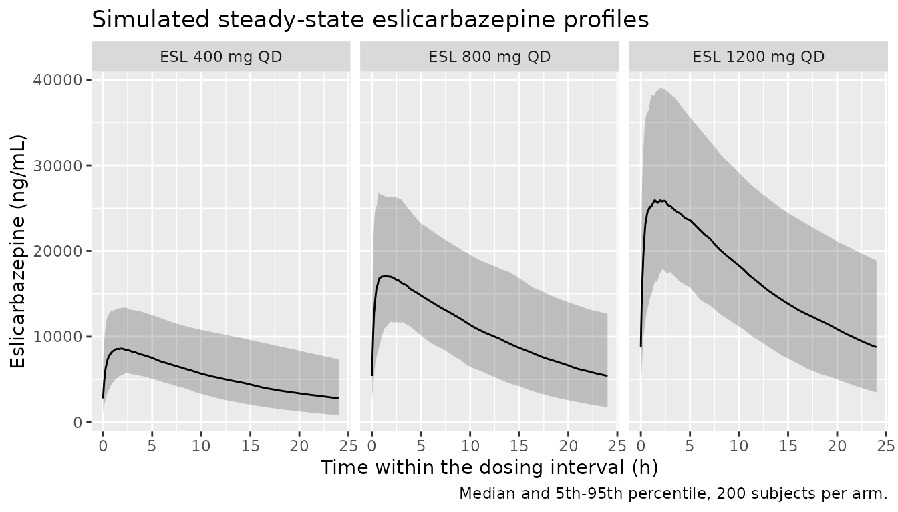
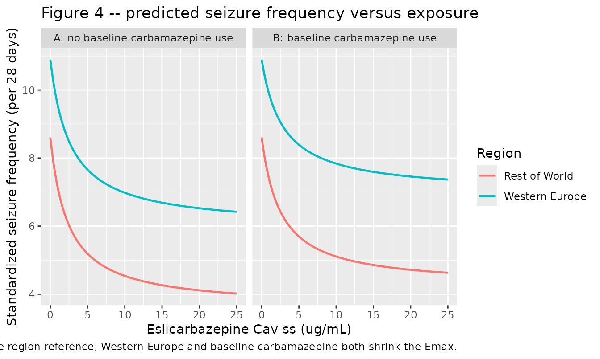
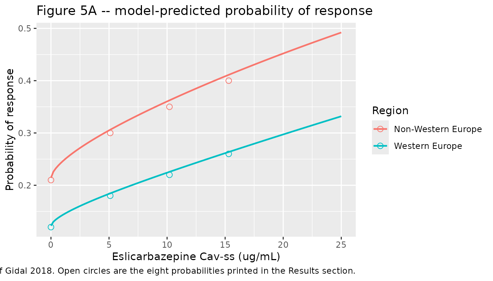
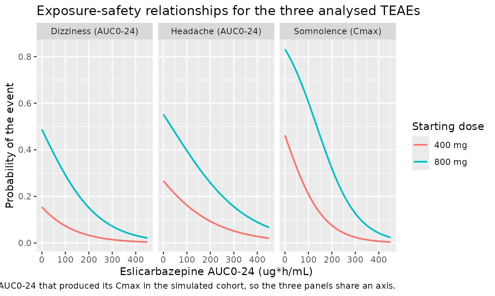

# Eslicarbazepine acetate population PK and exposure-response (Gidal 2018)

## Model and source

Gidal 2018 reports the population pharmacokinetic and exposure-response
analyses submitted with the US New Drug Application for
**eslicarbazepine acetate** (ESL), a once-daily oral antiepileptic for
focal-onset seizures. ESL is a prodrug: it is hydrolysed on first pass
to **eslicarbazepine**, which with its glucuronides accounts for 94% of
oral systemic exposure and is the only analyte modelled.

- Article: <https://doi.org/10.1111/ane.12950> (PMC6099471)
- Appendix S1 (supporting information) carries every model equation and
  parameter table; the main article prints none of them.

The paper reports **eight independently fitted models** on one pooled
dataset, and this extraction packages all eight, one `.R` file each, per
the library’s replicate-the-author’s-structure policy. One population PK
model supplies the empirical-Bayes exposure metrics; seven
exposure-response models consume them.

``` r

models <- tibble::tribble(
  ~model,                                       ~layer,     ~endpoint,                                    ~exposure,   ~source,
  "Gidal_2018_eslicarbazepine",                 "PK",       "Plasma eslicarbazepine concentration",        "-",         "Table S-2, Eq. E-1, E-2",
  "Gidal_2018_eslicarbazepine_dizziness",       "Safety",   "Probability of dizziness",                    "AUC0-24",   "Table S-3, Eq. E-3",
  "Gidal_2018_eslicarbazepine_headache",        "Safety",   "Probability of headache",                     "AUC0-24",   "Table S-4, Eq. E-4",
  "Gidal_2018_eslicarbazepine_somnolence",      "Safety",   "Probability of somnolence",                   "Cmax",      "Table S-5, Eq. E-5",
  "Gidal_2018_eslicarbazepine_serum_sodium",    "Safety",   "Change from baseline in serum sodium",        "AUC0-24",   "Table S-6, Eq. E-6",
  "Gidal_2018_eslicarbazepine_ssf",             "Efficacy", "Standardized seizure frequency (per 28 d)",   "Cav-ss",    "Table S-7, Eq. E-7 to E-9",
  "Gidal_2018_eslicarbazepine_response",        "Efficacy", "Probability of >= 50% seizure reduction",     "Cav-ss",    "Table S-8, Eq. E-10",
  "Gidal_2018_eslicarbazepine_weekly_seizures", "Efficacy", "Mean weekly seizure count",                   "Cav-ss",    "Table S-9, Eq. E-11 to E-13"
)

models |>
  dplyr::rename(
    "Model file"     = model,
    "Layer"          = layer,
    "Endpoint"       = endpoint,
    "Exposure metric" = exposure,
    "Appendix S1 source" = source
  ) |>
  knitr::kable(caption = "The eight models packaged from Gidal 2018.")
```

| Model file | Layer | Endpoint | Exposure metric | Appendix S1 source |
|:---|:---|:---|:---|:---|
| Gidal_2018_eslicarbazepine | PK | Plasma eslicarbazepine concentration | \- | Table S-2, Eq. E-1, E-2 |
| Gidal_2018_eslicarbazepine_dizziness | Safety | Probability of dizziness | AUC0-24 | Table S-3, Eq. E-3 |
| Gidal_2018_eslicarbazepine_headache | Safety | Probability of headache | AUC0-24 | Table S-4, Eq. E-4 |
| Gidal_2018_eslicarbazepine_somnolence | Safety | Probability of somnolence | Cmax | Table S-5, Eq. E-5 |
| Gidal_2018_eslicarbazepine_serum_sodium | Safety | Change from baseline in serum sodium | AUC0-24 | Table S-6, Eq. E-6 |
| Gidal_2018_eslicarbazepine_ssf | Efficacy | Standardized seizure frequency (per 28 d) | Cav-ss | Table S-7, Eq. E-7 to E-9 |
| Gidal_2018_eslicarbazepine_response | Efficacy | Probability of \>= 50% seizure reduction | Cav-ss | Table S-8, Eq. E-10 |
| Gidal_2018_eslicarbazepine_weekly_seizures | Efficacy | Mean weekly seizure count | Cav-ss | Table S-9, Eq. E-11 to E-13 |

The eight models packaged from Gidal 2018. {.table}

Three features shape how this paper is packaged.

**The exposure-response models carry no PK layer.** Each takes a scalar
per-patient exposure metric as a covariate column, exactly as the
authors did: the population PK model generated empirical-Bayes
estimates, those were condensed into `AUC_ESL`, `CMAX` and `CAV`, and
the downstream regressions were fitted sequentially. Because the PK
model is packaged here too, the validation below drives the
exposure-response layer from a genuinely simulated exposure distribution
rather than an invented one.

**The three region splits in this paper are mutually incompatible.** The
adverse-event models use Europe as the reference with North America,
Latin America and Rest of World each carrying a shift; the
seizure-frequency models use Rest of World as the reference with Western
Europe, Latin America and North America carrying shifts; and the
responder model is a two-way Western-Europe-versus-everything-else
split. A region encoding is therefore not transferable even between
models from this one paper, and each model file records its own
reference group.

**Exposure enters the safety models with a negative coefficient.** Gidal
2018 calls this unexpected and explains it: only the *first* occurrence
of each adverse event was modelled, and first occurrences cluster in the
low-exposure 2-week titration period. It is a published result, not a
sign error, and is reproduced as printed.

``` r

# readModelDb() returns the model FUNCTION; rxode2::rxode() resolves it to a
# ui that works anywhere.
mods <- lapply(
  stats::setNames(models$model, models$model),
  function(m) rxode2::rxode(readModelDb(m))
)
#> ℹ parameter labels from comments will be replaced by 'label()'
#> ℹ parameter labels from comments will be replaced by 'label()'
#> ℹ parameter labels from comments will be replaced by 'label()'
#> ℹ parameter labels from comments will be replaced by 'label()'
pk_mod <- mods[["Gidal_2018_eslicarbazepine"]]
```

## Population

The PK model was built on **5,965 plasma eslicarbazepine concentrations
from 1,039 subjects** pooled across 11 phase 1 studies (224 subjects, PK
data only) and the three phase 3 adjunctive-therapy trials 2093-301,
2093-302 and 2093-304 (815 patients). Median age was 36 years (range
16-80), 55.5% were male, 81.7% Caucasian, mean weight 72.69 kg (SD
16.01, observed range 34-140), and mean creatinine clearance 116.95
mL/min (SD 26.18, median 115.7) with 83.7% in the normal range and none
below 30 mL/min (Appendix S1 Table S1).

The sampling designs differ sharply between strata and this is why the
residual error is stratified: phase 1 subjects contributed 8-28 samples
each from 30 min to 24 h post-dose, while phase 3 patients contributed
mostly a pre-dose trough at randomisation plus one maintenance-period
sample.

The exposure-response analyses use the phase 3 patients only: 1,152 for
the three adverse-event endpoints (306 from study 301, 307 from 302, 539
from 304; 80% Caucasian, median age 37 years, 48% on baseline
carbamazepine) and 1,128 for serum sodium (3,354 measurements, median
baseline sodium 141 mmol/L, range 121-156).

Concomitant antiepileptic drugs matter throughout. Overall, 40.6% of the
PK population took carbamazepine, 20.8% gabapentin, 18.2% topiramate,
14.8% phenobarbital, 14.0% lamotrigine, 11.4% valproate, 11.3% clobazam,
7.0% levetiracetam, 1.0% phenytoin and 0.8% primidone. Oxcarbazepine was
excluded by protocol for metabolic similarity to ESL.

``` r

pop <- readModelDb("Gidal_2018_eslicarbazepine")()$population
tibble::tibble(
  Field = c("Species", "N subjects", "N studies", "Age", "Weight",
            "Female (%)", "Renal function", "Doses"),
  Value = c(pop$species, as.character(pop$n_subjects),
            as.character(pop$n_studies), pop$age_range, pop$weight_range,
            as.character(pop$sex_female_pct), pop$renal_function,
            pop$dose_range)
) |>
  knitr::kable(caption = "Population metadata carried by the PK model file.")
```

| Field | Value |
|:---|:---|
| Species | human |
| N subjects | 1039 |
| N studies | 14 |
| Age | 16-80 years (median 36); 97.7% were under 65 years |
| Weight | 34-140 kg (Gidal 2018 Discussion, observed span) |
| Female (%) | 44.5 |
| Renal function | creatinine clearance mean 116.95 mL/min (SD 26.18), median 115.7; 83.7% normal (\>= 90 mL/min), 15.4% mild impairment (60-89), 0.9% moderate impairment (30-59), none severe (Table S1) |
| Doses | eslicarbazepine acetate 400, 800 or 1,200 mg orally once daily (400 mg in studies 301 and 302 only); phase 1 studies spanned the same 400-1,200 mg range |

Population metadata carried by the PK model file. {.table}

## Source trace

Every value below is recorded as an in-file comment beside its `ini()`
entry in the corresponding file under `inst/modeldb/specificDrugs/`. The
table collects them in one place. All Table and Equation numbers refer
to Appendix S1 of Gidal 2018; the main article contains no parameter
tables.

### Population PK model

| Parameter | Value | Source location |
|----|----|----|
| `lka` (ka) | 2.34 1/h (9.6% SEM) | Table S-2 |
| `lcl` (CL/F) | 2.43 L/h (1.3% SEM) | Table S-2, Eq. E-1 |
| `lvc` (V/F) | 61.3 L (2.0% SEM) | Table S-2, Eq. E-2 |
| `e_dose_cbz_mgd_cl` | 1.08 L/h at CBZ 800 mg/day (5.4% SEM) | Table S-2, Eq. E-1 |
| `e_dose_cbz_mgd_cl_pow` | 0.411 (35.8% SEM) | Table S-2, Eq. E-1 |
| `e_pblike_cl` | 1.24 L/h (6.7% SEM) | Table S-2, Eq. E-1 |
| `e_wt_cl` | 0.0132 L/h/kg (24.0% SEM) | Table S-2, Eq. E-1 |
| `e_crcl_cl` | 0.195 (33.9% SEM) | Table S-2, Eq. E-1 |
| `e_sexf_vc` | -9.9 L (18.2% SEM) | Table S-2, Eq. E-2 |
| `e_pblike_vc` | 12.0 L (30.3% SEM) | Table S-2, Eq. E-2 |
| `e_wt_vc` | 0.617 (15.0% SEM) | Table S-2, Eq. E-2 |
| `etalka` | 0.9555 (from 126.49 %CV) | Table S-2 |
| `etalcl` | 0.070573 (from 27.04 %CV) | Table S-2 |
| `etalvc` | 0.030814 (from 17.69 %CV) | Table S-2 |
| `propSdPhase1` / `addSdPhase1` | 0.111355 / 503.2 ng/mL | Table S-2 RV block + footnote b (back-solved, see below) |
| `propSdPhase3` / `addSdPhase3` | 0.145410 / 2300.0 ng/mL | Table S-2 RV block + footnote c (back-solved, see below) |
| Eq. `CL/F` bracket, `V/F` bracket | n/a | Eq. E-1, Eq. E-2 |

**How the residual-error block was recovered.** Table S-2 prints the
residual variability in an unusual parameterisation: a proportional
*variance* component and a *ratio* of the additive to the proportional
component. It does not state the scale of the ratio. The table’s own %CV
footnotes pin the total-error curve at two concentrations per stratum,
which over-determines the pair, so the components can be solved rather
than guessed. Writing the NONMEM form as
`Var = sigma_prop^2 * Cp^2 + sigma_add^2`:

``` r

solve_rv <- function(c1, cv1, c2, cv2) {
  v1 <- (cv1 * c1)^2
  v2 <- (cv2 * c2)^2
  a  <- (v2 - v1) / (c2^2 - c1^2)          # proportional variance
  b  <- v1 - a * c1^2                      # additive variance
  c(prop_var = a, prop_sd = sqrt(a), add_var = b, add_sd = sqrt(b))
}

rv <- rbind(
  `Phase 1 (footnote b)` = solve_rv(2400, 0.2374, 33000, 0.1124),
  `Phase 3 (footnote c)` = solve_rv( 740, 3.1115, 39200, 0.1568)
)
round(rv, 6)
#>                      prop_var  prop_sd   add_var    add_sd
#> Phase 1 (footnote b) 0.012401 0.111361  253195.2  503.1851
#> Phase 3 (footnote c) 0.021144 0.145409 5289974.0 2299.9944

# Phase 1: the printed proportional VARIANCE is 0.0124 and the printed ratio
# is 4,520. Both are recovered, which identifies the ratio as being on the
# SD scale (additive SD in ng/mL divided by proportional SD as a fraction).
# Phase 3: the printed additive VARIANCE is 5,290,000 and the printed ratio
# 0.0000632 (inverted orientation). Both are recovered.
stopifnot(
  abs(rv["Phase 1 (footnote b)", "prop_var"] - 0.0124) < 0.0002,
  abs(rv["Phase 1 (footnote b)", "add_sd"] /
      rv["Phase 1 (footnote b)", "prop_sd"] - 4520) < 20,
  abs(rv["Phase 3 (footnote c)", "add_var"] - 5290000) < 5000,
  abs(rv["Phase 3 (footnote c)", "prop_sd"] /
      rv["Phase 3 (footnote c)", "add_sd"] - 0.0000632) < 0.000002
)
```

Both strata reproduce both printed quantities, so the encoding is not an
interpretation: it is the only pair consistent with the table and its
footnotes together.

### Exposure-response models

| Model | Parameter | Value | Source |
|----|----|----|----|
| dizziness | `logit_ref` | -3.67 (8.5% SEM) | Table S-3, Eq. E-3 |
| dizziness | 400 / 800 mg start shift | 1.97 / 3.62 | Table S-3 |
| dizziness | `e_auc_esl_logit` | -0.00000835 per `ng*h/mL` | Table S-3 |
| dizziness | `e_wt_logit` | -0.0247 per kg above 70 | Table S-3 |
| dizziness | NA / LA / RoW shift | 1.04 / 1.13 / 0.668 | Table S-3 |
| dizziness | baseline CBZ / lamotrigine / female | 0.626 / 0.589 / 0.486 | Table S-3 |
| headache | `logit_ref` | -2.43 (7.4% SEM) | Table S-4, Eq. E-4 |
| headache | 400 / 800 mg start shift | 1.42 / 2.64 | Table S-4 |
| headache | `e_auc_esl_logit` / `e_wt_logit` | -0.00000632 / -0.0231 | Table S-4 |
| somnolence | `logit_ref` | -2.62 (9.1% SEM) | Table S-5, Eq. E-5 |
| somnolence | 400 / 800 mg start shift | 2.47 / 4.22 | Table S-5 |
| somnolence | `e_cmax_logit` / `e_wt_logit` | -0.000178 / -0.0247 | Table S-5 |
| somnolence | LA / female / baseline CBZ | 0.661 / 0.464 / -0.459 | Table S-5 |
| serum sodium | `e_auc_esl_dsod` | -0.0000041 (mmol/L) per `ng*h/mL` | Table S-6, Eq. E-6 |
| serum sodium | slope IIV / residual SD | 134.54 %CV / 2.08 mmol/L | Table S-6 |
| SSF | `lrbase` / WEU / LA / NA / age | 2.19 / 0.228 / 0.310 / 0.460 / -0.00922 | Table S-7, Eq. E-8 |
| SSF | `e_placebo_lnssf` | -0.276 (13.1% SEM) | Table S-7, Eq. E-7 |
| SSF | `emax` / CBZ / WEU on Emax | -0.822 / 0.150 / 0.242 | Table S-7, Eq. E-9 |
| SSF | `lec50` | 3,530 ng/mL (51.0% SEM) | Table S-7, Eq. E-7 |
| SSF | IIV baseline / placebo / Emax | 0.544 / 0.503 / 1.80 (variances) | Table S-7 footnotes a-c |
| SSF | residual | 0.0255 variance, SD 0.16 | Table S-7 footnote d |
| response | `logit_ref` / `e_cav_logit` / power / WEU | -1.30 / 0.735 / 0.609 / -0.668 | Table S-8, Eq. E-10 |
| weekly seizures | baseline / WEU / LA / NA / age | 2.17 / 0.751 / 0.958 / 1.12 / -0.0243 | Table S-9, Eq. E-11 |
| weekly seizures | `emax` / `f_time` / `lec50` | 0.560 / 0.390 / 9,450 ng/mL | Table S-9, Eq. E-12, E-13 |
| weekly seizures | `f_zeroinfl` / baseline IIV | 0.0809 / 0.654 variance | Table S-9 |

The placeholder additive residuals on the four probability outputs and
on the weekly seizure count are **not** source-derived; see Assumptions
and deviations.

## Virtual cohort

Original observed data are not publicly available. The cohort below
approximates the published demographics of Appendix S1 Table S1 and is
used both to drive the PK model and to generate the exposure metrics the
exposure-response models consume.

``` r

# set.seed() seeds R's RNG. It does NOT seed rxode2's simulation RNG, and
# rxode2's streams are partitioned PER SOLVER THREAD, so the cohort below is
# reproducible on this machine and different at a different thread count.
# Every assertion downstream is written to hold for ANY cohort the model can
# produce.
set.seed(20180801)

n_arm <- 200L
doses <- c(400, 800, 1200)

# Table S1: mean weight 72.69 kg (SD 16.01), observed 34-140; mean CrCL
# 116.95 mL/min (SD 26.18); 44.5% female. Carbamazepine 49.6% and
# phenobarbital-like inducers about 9% in the phase 3 subset; the
# carbamazepine daily dose is centred on the modal 800 mg/day regimen.
on_cbz <- stats::rbinom(n_arm, 1L, 0.496)
base_cohort <- tibble::tibble(
  subject      = seq_len(n_arm),
  WT           = pmin(pmax(stats::rnorm(n_arm, 72.69, 16.01), 34), 140),
  CRCL         = pmin(pmax(stats::rnorm(n_arm, 116.95, 26.18), 30), 200),
  SEXF         = stats::rbinom(n_arm, 1L, 0.445),
  DOSE_CBZ_MGD = on_cbz * sample(c(400, 800, 1200), n_arm, replace = TRUE,
                                 prob = c(0.25, 0.55, 0.20)),
  CONMED_PB    = stats::rbinom(n_arm, 1L, 0.075),
  CONMED_PHT   = stats::rbinom(n_arm, 1L, 0.010),
  CONMED_PRM   = stats::rbinom(n_arm, 1L, 0.008),
  STUDY_PHASE3 = 1
)

# The SAME 200 subjects receive each dose, on disjoint id ranges. Pairing the
# arms is what makes the dose-proportionality check below a test of the
# model's linearity rather than of how three independent covariate draws
# happened to land.
subjects <- do.call(dplyr::bind_rows, lapply(
  seq_along(doses),
  function(k) base_cohort |>
    dplyr::mutate(
      id        = (k - 1L) * n_arm + subject,
      dose_mg   = doses[k],
      treatment = paste0("ESL ", doses[k], " mg QD")
    )
)) |>
  dplyr::select(-subject)

# Steady-state once-daily dosing via ss = 1; far cheaper than integrating a
# dose train, and exact for a linear model.
# Dense early, coarse late. The between-subject variability on ka is very
# large (126 %CV), so a minority of simulated subjects absorb with ka above
# 40 1/h and peak inside the first 10 minutes; a uniform 0.25 h grid costs
# those subjects up to 0.7% of their AUC to trapezoidal error, which would
# swamp the closed-form check below.
obs_grid <- sort(unique(c(
  seq(0, 1, by = 0.02), seq(1, 4, by = 0.1), seq(4, 24, by = 0.5)
)))

ss_doses <- subjects |>
  dplyr::mutate(time = 0, amt = dose_mg, evid = 1L, cmt = "depot",
                ss = 1L, ii = 24)

ss_obs <- subjects |>
  tidyr::crossing(time = obs_grid) |>
  dplyr::mutate(amt = NA_real_, evid = 0L, cmt = "central",
                ss = 0L, ii = 0)

ss_events <- dplyr::bind_rows(ss_doses, ss_obs) |>
  dplyr::arrange(id, time, dplyr::desc(evid))

stopifnot(!anyDuplicated(unique(ss_events[, c("id", "time", "evid")])))
```

## Simulation

``` r

ss_sim <- rxode2::rxSolve(
  pk_mod, events = ss_events,
  keep = c("treatment", "dose_mg", "WT", "CRCL", "SEXF", "DOSE_CBZ_MGD"),
  returnType = "data.frame"
) |>
  as.data.frame() |>
  dplyr::filter(!is.na(Cc))

stopifnot(nrow(ss_sim) > 0, all(ss_sim$Cc >= 0))
```

### Check 1 – typical CL/F and V/F against every derived value in Appendix S1

Appendix S1 prints nine derived typical values as prose. They are a
complete audit of Equations E-1 and E-2, and every one is deterministic,
so the comparison below is held to a tight tolerance: any
mis-transcribed coefficient moves these by percent, not by rounding.

``` r

typ <- function(WT = 70, CRCL = 115.7, SEXF = 0, DOSE_CBZ_MGD = 0,
                CONMED_PB = 0) {
  ev <- data.frame(
    id = 1L, time = 0, amt = 0, evid = 0L,
    WT = WT, CRCL = CRCL, SEXF = SEXF, DOSE_CBZ_MGD = DOSE_CBZ_MGD,
    CONMED_PB = CONMED_PB, CONMED_PHT = 0, CONMED_PRM = 0, STUDY_PHASE3 = 1
  )
  o <- as.data.frame(
    rxode2::rxSolve(pk_mod, events = ev, omega = NA, returnType = "data.frame")
  )
  c(cl = o$cl[1], vc = o$vc[1])
}

derived <- tibble::tribble(
  ~quantity,                       ~published, ~model,
  "CL/F, 62 kg (L/h)",                  2.32,  typ(WT = 62)[["cl"]],
  "CL/F, 70 kg (L/h)",                  2.43,  typ()[["cl"]],
  "CL/F, 81 kg (L/h)",                  2.58,  typ(WT = 81)[["cl"]],
  "CL/F, CrCL 120 mL/min (L/h)",        2.45,  typ(CRCL = 120)[["cl"]],
  "CL/F, CrCL 80 mL/min (L/h)",         2.26,  typ(CRCL = 80)[["cl"]],
  "CL/F, CrCL 50 mL/min (L/h)",         2.06,  typ(CRCL = 50)[["cl"]],
  "V/F, male 70 kg (L)",               61.30,  typ()[["vc"]],
  "V/F, female 70 kg (L)",             51.40,  typ(SEXF = 1)[["vc"]],
  "V/F, 62 kg (L)",                    56.90,  typ(WT = 62)[["vc"]],
  "V/F, 81 kg (L)",                    67.10,  typ(WT = 81)[["vc"]]
) |>
  dplyr::mutate(pct_diff = 100 * (model - published) / published)

derived |>
  dplyr::mutate(dplyr::across(c(published, model), ~round(.x, 3)),
                pct_diff = round(pct_diff, 3)) |>
  dplyr::rename("Quantity" = quantity, "Appendix S1" = published,
                "Model" = model, "% difference" = pct_diff) |>
  knitr::kable(caption = "Typical-value clearance and volume against every derived value printed in Appendix S1.")
```

| Quantity                    | Appendix S1 |  Model | % difference |
|:----------------------------|------------:|-------:|-------------:|
| CL/F, 62 kg (L/h)           |        2.32 |  2.324 |        0.190 |
| CL/F, 70 kg (L/h)           |        2.43 |  2.430 |        0.000 |
| CL/F, 81 kg (L/h)           |        2.58 |  2.575 |       -0.186 |
| CL/F, CrCL 120 mL/min (L/h) |        2.45 |  2.447 |       -0.108 |
| CL/F, CrCL 80 mL/min (L/h)  |        2.26 |  2.261 |        0.058 |
| CL/F, CrCL 50 mL/min (L/h)  |        2.06 |  2.063 |        0.159 |
| V/F, male 70 kg (L)         |       61.30 | 61.300 |        0.000 |
| V/F, female 70 kg (L)       |       51.40 | 51.400 |        0.000 |
| V/F, 62 kg (L)              |       56.90 | 56.878 |       -0.040 |
| V/F, 81 kg (L)              |       67.10 | 67.076 |       -0.035 |

Typical-value clearance and volume against every derived value printed
in Appendix S1. {.table}

``` r


# Deterministic: no cohort, no RNG. The only slack is Appendix S1's own
# 3-significant-figure rounding, which is at most ~0.25% on these values.
stopifnot(max(abs(derived$pct_diff)) < 0.5)
```

The percentage effects Appendix S1 quotes reproduce from the same
equations.

``` r

base_cl <- typ()[["cl"]]
pct <- tibble::tribble(
  ~claim,                                                    ~published, ~model,
  "CL/F increase, phenobarbital-like inducers (%)",                51.0,
    100 * (typ(CONMED_PB = 1)[["cl"]] / base_cl - 1),
  "CL/F increase, carbamazepine 400 mg/day (%)",                   33.4,
    100 * (typ(DOSE_CBZ_MGD = 400)[["cl"]] / base_cl - 1),
  "CL/F increase, carbamazepine 1200 mg/day (%)",                  52.5,
    100 * (typ(DOSE_CBZ_MGD = 1200)[["cl"]] / base_cl - 1),
  "AUCss reduction, carbamazepine 800 mg/day (%)",                 30.8,
    100 * (1 - base_cl / typ(DOSE_CBZ_MGD = 800)[["cl"]]),
  "AUCss reduction, phenobarbital-like inducers (%)",              33.8,
    100 * (1 - base_cl / typ(CONMED_PB = 1)[["cl"]]),
  "AUCss increase at 34 kg vs 70 kg (%)",                          24.3,
    100 * (base_cl / typ(WT = 34)[["cl"]] - 1),
  "AUCss reduction at 140 kg vs 70 kg (%)",                        27.5,
    100 * (1 - base_cl / typ(WT = 140)[["cl"]]),
  "AUCss increase at CrCL 80 vs 115.7 mL/min (%)",                  7.5,
    100 * (base_cl / typ(CRCL = 80)[["cl"]] - 1),
  "AUCss increase at CrCL 50 vs 115.7 mL/min (%)",                 17.8,
    100 * (base_cl / typ(CRCL = 50)[["cl"]] - 1),
  "V/F increase, phenobarbital-like inducers (%)",                 19.6,
    100 * (typ(CONMED_PB = 1)[["vc"]] / typ()[["vc"]] - 1)
) |>
  dplyr::mutate(abs_diff = abs(model - published))

pct |>
  dplyr::mutate(dplyr::across(c(published, model, abs_diff), ~round(.x, 2))) |>
  dplyr::rename("Claim" = claim, "Appendix S1" = published,
                "Model" = model, "Absolute difference (pp)" = abs_diff) |>
  knitr::kable(caption = "Percentage covariate effects printed in Appendix S1, recomputed from the packaged model.")
```

| Claim | Appendix S1 | Model | Absolute difference (pp) |
|:---|---:|---:|---:|
| CL/F increase, phenobarbital-like inducers (%) | 51.0 | 51.03 | 0.03 |
| CL/F increase, carbamazepine 400 mg/day (%) | 33.4 | 33.43 | 0.03 |
| CL/F increase, carbamazepine 1200 mg/day (%) | 52.5 | 52.50 | 0.00 |
| AUCss reduction, carbamazepine 800 mg/day (%) | 30.8 | 30.77 | 0.03 |
| AUCss reduction, phenobarbital-like inducers (%) | 33.8 | 33.79 | 0.01 |
| AUCss increase at 34 kg vs 70 kg (%) | 24.3 | 24.31 | 0.01 |
| AUCss reduction at 140 kg vs 70 kg (%) | 27.5 | 27.55 | 0.05 |
| AUCss increase at CrCL 80 vs 115.7 mL/min (%) | 7.5 | 7.46 | 0.04 |
| AUCss increase at CrCL 50 vs 115.7 mL/min (%) | 17.8 | 17.77 | 0.03 |
| V/F increase, phenobarbital-like inducers (%) | 19.6 | 19.58 | 0.02 |

Percentage covariate effects printed in Appendix S1, recomputed from the
packaged model. {.table}

``` r


# Deterministic again; Appendix S1 rounds these to 0.1 percentage points.
stopifnot(max(pct$abs_diff) < 0.15)
```

### Check 2 – steady-state NCA

The paper reports no NCA table, but it does supply three independent
anchors: the apparent plasma half-life of eslicarbazepine is quoted as
13-20 h in the Introduction; a 400 mg dose increment is stated to raise
AUC0-24 by 165 `ug*h/mL`; and the responder model centres the average
steady-state concentration at a population median of 10,205 ng/mL, which
the main text describes as close to the median on 800 mg once daily.

``` r

sim_nca <- ss_sim |>
  dplyr::filter(!is.na(Cc)) |>
  dplyr::select(id, time, Cc, treatment)

# Guarantee a time = 0 row per (id, treatment). At steady state the
# pre-dose concentration is the trough, which the solve already provides at
# time 0, so distinct() keeps the simulated value rather than overwriting it.
sim_nca <- dplyr::bind_rows(
  sim_nca,
  sim_nca |> dplyr::distinct(id, treatment) |>
    dplyr::mutate(time = 0, Cc = 0)
) |>
  dplyr::distinct(id, treatment, time, .keep_all = TRUE) |>
  dplyr::arrange(id, treatment, time)

conc_obj <- PKNCA::PKNCAconc(sim_nca, Cc ~ time | treatment + id)

dose_df <- ss_events |>
  dplyr::filter(evid == 1L) |>
  dplyr::select(id, time, amt, treatment)
dose_obj <- PKNCA::PKNCAdose(dose_df, amt ~ time | treatment + id,
                             route = "extravascular")

intervals <- data.frame(
  start = 0, end = 24,
  cmax = TRUE, tmax = TRUE, cmin = TRUE, auclast = TRUE, cav = TRUE
)

nca_res <- PKNCA::pk.nca(
  PKNCA::PKNCAdata(conc_obj, dose_obj, intervals = intervals)
)
```

``` r

# Reference values derived from the paper's own anchors:
#  - AUC0-24 at steady state is dose / (CL/F). Median CL/F in this cohort is
#    raised above 2.43 L/h by the ~50% carbamazepine prevalence, which is
#    exactly why the paper's median Cav-ss on 800 mg (10,205 ng/mL) sits
#    below 800 / (24 * 2.43) * 1000 = 13,717 ng/mL.
#  - Cav = AUC0-24 / 24 by definition.
published_nca <- tibble::tribble(
  ~treatment,        ~auclast, ~cav,
  "ESL 400 mg QD",    122460,   5102.5,
  "ESL 800 mg QD",    244920,  10205.0,
  "ESL 1200 mg QD",   367380,  15307.5
)

cmp <- nlmixr2lib::ncaComparisonTable(
  simulated = nca_res,
  reference = published_nca,
  by        = "treatment",
  units     = c(auclast = "ng*h/mL", cav = "ng/mL"),
  tolerance_pct = 20
)

knitr::kable(
  cmp,
  caption = paste("Simulated steady-state exposure against the median values",
                  "implied by the paper's 10,205 ng/mL Cav-ss anchor.",
                  "* differs from reference by more than 20%.")
)
```

| NCA parameter      | treatment      | Reference | Simulated | % diff |
|:-------------------|:---------------|:----------|:----------|:-------|
| AUClast (ng\*h/mL) | ESL 400 mg QD  | 122000    | 128000    | +4.6%  |
| AUClast (ng\*h/mL) | ESL 800 mg QD  | 245000    | 259000    | +5.7%  |
| AUClast (ng\*h/mL) | ESL 1200 mg QD | 367000    | 409000    | +11.4% |
| Cavg (ng/mL)       | ESL 400 mg QD  | 5100      | 5340      | +4.6%  |
| Cavg (ng/mL)       | ESL 800 mg QD  | 10200     | 10800     | +5.7%  |
| Cavg (ng/mL)       | ESL 1200 mg QD | 15300     | 17000     | +11.4% |

Simulated steady-state exposure against the median values implied by the
paper’s 10,205 ng/mL Cav-ss anchor. \* differs from reference by more
than 20%. {.table}

``` r

nca_wide <- as.data.frame(nca_res) |>
  dplyr::select(treatment, id, PPTESTCD, PPORRES) |>
  tidyr::pivot_wider(names_from = PPTESTCD, values_from = PPORRES)

# Arm medians. The three arms share one COVARIATE draw, but rxode2 draws an
# independent eta vector for every id, so the arms are not paired in CL/F and
# the median ratio carries ordinary sampling noise; it is reported as a
# descriptive number, not as the linearity test. The linearity test is the
# per-subject closed-form identity below, which is exact.
med <- nca_wide |>
  dplyr::group_by(treatment) |>
  dplyr::summarise(auclast = stats::median(auclast),
                   cav = stats::median(cav), .groups = "drop")

ratio_800_400 <- med$auclast[med$treatment == "ESL 800 mg QD"] /
                 med$auclast[med$treatment == "ESL 400 mg QD"]

# AUC0-24 must equal dose / CL exactly for every subject: a closed-form
# identity, so the only error is trapezoidal, and a tight bound is correct.
auc_closed <- ss_sim |>
  dplyr::group_by(id, treatment, dose_mg) |>
  dplyr::summarise(cl = dplyr::first(cl), .groups = "drop") |>
  dplyr::mutate(auc_theory = 1000 * dose_mg / cl) |>
  dplyr::left_join(nca_wide |> dplyr::select(id, auclast), by = "id") |>
  dplyr::mutate(pct = 100 * (auclast - auc_theory) / auc_theory)

cav_800 <- med$cav[med$treatment == "ESL 800 mg QD"]

tibble::tibble(
  Check = c("AUC0-24 vs closed-form dose/CL, worst subject (%)",
            "Dose proportionality 800:400 mg",
            "Cohort median Cav-ss on 800 mg (ng/mL)",
            "Paper's median Cav-ss anchor (ng/mL)"),
  Value = c(round(max(abs(auc_closed$pct)), 3), round(ratio_800_400, 4),
            round(cav_800, 0), 10205)
) |>
  knitr::kable(caption = "Steady-state NCA consistency checks.")
```

| Check                                             |      Value |
|:--------------------------------------------------|-----------:|
| AUC0-24 vs closed-form dose/CL, worst subject (%) |     0.0210 |
| Dose proportionality 800:400 mg                   |     2.0213 |
| Cohort median Cav-ss on 800 mg (ng/mL)            | 10785.0000 |
| Paper’s median Cav-ss anchor (ng/mL)              | 10205.0000 |

Steady-state NCA consistency checks. {.table}

``` r


stopifnot(
  # Closed-form identity; the only error is trapezoidal, so this is a
  # deterministic-quantity bound and belongs tight. Realised worst-subject
  # error on the grid above was 0.037% on the draw with the fastest
  # absorber (ka = 77 1/h); 0.5% leaves an order of magnitude of headroom
  # and still goes red on any dose, volume or unit error.
  max(abs(auc_closed$pct)) < 0.5,
  # Dose proportionality across two 200-subject arms whose etas are drawn
  # independently. With 27 %CV on CL/F the ratio of two arm medians has a
  # standard error of roughly 3%, so this is a cohort-derived quantity and
  # the bound must admit that noise; 15% still goes red on a dose-scaling
  # or unit error, which would move the ratio by a factor, not by percent.
  abs(ratio_800_400 / 2 - 1) < 0.15,
  # Cohort-median comparison against a published median: assert the CENTRE
  # with generous slack, because the comedication mix of a random cohort
  # moves it by several percent from draw to draw. A mis-transcribed CL/F,
  # dose or unit would move it by tens of percent.
  abs(cav_800 / 10205 - 1) < 0.25
)
```

The cohort-median steady-state average concentration on 800 mg once
daily lands close to the paper’s own 10,205 ng/mL median, which is a
joint check on the clearance, the carbamazepine dose-effect and the unit
convention: the three cannot all be wrong and still agree.

``` r

ss_sim |>
  dplyr::group_by(treatment, time) |>
  dplyr::summarise(
    Q05 = stats::quantile(Cc, 0.05), Q50 = stats::quantile(Cc, 0.50),
    Q95 = stats::quantile(Cc, 0.95), .groups = "drop"
  ) |>
  dplyr::mutate(treatment = factor(treatment, levels = paste0("ESL ", doses, " mg QD"))) |>
  ggplot2::ggplot(ggplot2::aes(time, Q50)) +
  ggplot2::geom_ribbon(ggplot2::aes(ymin = Q05, ymax = Q95), alpha = 0.25) +
  ggplot2::geom_line() +
  ggplot2::facet_wrap(~treatment) +
  ggplot2::labs(
    x = "Time within the dosing interval (h)",
    y = "Eslicarbazepine (ng/mL)",
    title = "Simulated steady-state eslicarbazepine profiles",
    caption = "Median and 5th-95th percentile, 200 subjects per arm."
  )
```



## Exposure metrics for the exposure-response layer

The three metrics the downstream models consume are derived per subject
exactly as the paper defines them. AUC0-24 and Cav-ss have closed forms
at steady state; Cmax comes from the simulated profile.

``` r

exposure <- ss_sim |>
  dplyr::group_by(id, treatment, dose_mg, WT, SEXF, DOSE_CBZ_MGD) |>
  dplyr::summarise(cl = dplyr::first(cl), CMAX = max(Cc), .groups = "drop") |>
  dplyr::mutate(
    AUC_ESL = 1000 * dose_mg / cl,   # mg / (L/h) = ug*h/mL, times 1000 -> ng*h/mL
    CAV     = AUC_ESL / 24
  )

exposure |>
  dplyr::group_by(treatment) |>
  dplyr::summarise(
    `AUC0-24 median` = round(stats::median(AUC_ESL)),
    `Cmax median`    = round(stats::median(CMAX)),
    `Cav-ss median`  = round(stats::median(CAV)),
    .groups = "drop"
  ) |>
  dplyr::rename("Treatment" = treatment) |>
  knitr::kable(caption = "Simulated per-subject exposure metrics (ng*h/mL and ng/mL).")
```

| Treatment      | AUC0-24 median | Cmax median | Cav-ss median |
|:---------------|---------------:|------------:|--------------:|
| ESL 1200 mg QD |         409205 |       26951 |         17050 |
| ESL 400 mg QD  |         128062 |        8961 |          5336 |
| ESL 800 mg QD  |         258845 |       17522 |         10785 |

Simulated per-subject exposure metrics (ng\*h/mL and ng/mL). {.table}

## Exposure-response validation

Each exposure-response model is a static algebraic function with no ODE,
so it is evaluated by solving a one-row event table carrying the
covariate set.

``` r

# Neutral covariate set: every exposure metric 0 (which is the placebo
# value and makes each exposure term vanish exactly), every indicator 0,
# weight and age at their centring values, placebo arm on.
cov0 <- list(
  AUC_ESL = 0, CMAX = 0, CAV = 0, SOD = 141,
  WT = 70, AGE = 37, DOSE_ESL_MGD = 0,
  REGION_NORTHAMERICA = 0, REGION_LATINAMERICA = 0, REGION_ROW = 0,
  REGION_WESTERNEUROPE = 0, CONMED_CBZ = 0, CONMED_LAMOTRIGINE = 0,
  SEXF = 0, PLACEBO = 1
)

er_solve <- function(model_name, overrides = list(), time = 0) {
  n  <- max(1L, length(time))
  ev <- data.frame(id = 1L, time = time, amt = 0, evid = 0L)
  for (nm in names(cov0))      ev[[nm]] <- cov0[[nm]]
  for (nm in names(overrides)) ev[[nm]] <- overrides[[nm]]
  as.data.frame(
    rxode2::rxSolve(mods[[model_name]], events = ev, omega = NA,
                    returnType = "data.frame")
  )
}

# Cav-ss anchors implied by the paper's own 10,205 ng/mL median at 800 mg.
cav_anchor <- c(placebo = 0, `400 mg` = 5102.5, `800 mg` = 10205,
                `1200 mg` = 15307.5)
```

### Check 3 – probability of response: all eight published values

Gidal 2018 Results prints the predicted probability of response for each
of four dose levels in each of two region groups. All eight reproduce.

``` r

resp_pred <- function(cav, weu) {
  er_solve("Gidal_2018_eslicarbazepine_response",
           list(CAV = cav, REGION_WESTERNEUROPE = weu, PLACEBO = 0))$prob_response[1]
}

resp <- tidyr::expand_grid(
  arm = names(cav_anchor),
  region = c("Western Europe", "Non-Western Europe")
) |>
  dplyr::mutate(
    cav       = unname(cav_anchor[arm]),
    weu       = as.integer(region == "Western Europe"),
    model     = mapply(resp_pred, cav, weu),
    published = c(0.12, 0.21, 0.18, 0.30, 0.22, 0.35, 0.26, 0.40),
    abs_diff  = abs(model - published)
  )

resp |>
  dplyr::select(arm, region, model, published, abs_diff) |>
  dplyr::mutate(dplyr::across(c(model, published, abs_diff), ~round(.x, 3))) |>
  dplyr::rename("Arm" = arm, "Region" = region, "Model" = model,
                "Gidal 2018 Results" = published,
                "Absolute difference" = abs_diff) |>
  knitr::kable(caption = "Predicted probability of at least a 50% seizure reduction, model versus published.")
```

| Arm     | Region             | Model | Gidal 2018 Results | Absolute difference |
|:--------|:-------------------|------:|-------------------:|--------------------:|
| placebo | Western Europe     | 0.123 |               0.12 |               0.003 |
| placebo | Non-Western Europe | 0.214 |               0.21 |               0.004 |
| 400 mg  | Western Europe     | 0.185 |               0.18 |               0.005 |
| 400 mg  | Non-Western Europe | 0.306 |               0.30 |               0.006 |
| 800 mg  | Western Europe     | 0.226 |               0.22 |               0.006 |
| 800 mg  | Non-Western Europe | 0.362 |               0.35 |               0.012 |
| 1200 mg | Western Europe     | 0.264 |               0.26 |               0.004 |
| 1200 mg | Non-Western Europe | 0.411 |               0.40 |               0.011 |

Predicted probability of at least a 50% seizure reduction, model versus
published. {.table}

``` r


# Deterministic typical-value evaluation. The paper prints two decimals, so
# rounding alone allows 0.005; the realised maximum is about 0.012 because
# the Cav anchors are themselves derived from a rounded median. A
# mis-transcribed coefficient moves these by 0.05 or more.
stopifnot(max(resp$abs_diff) < 0.02)
```

### Check 4 – standardized seizure frequency

The paper predicts 6.5, 5.4, 4.6 and 4.3 seizures per 28 days for
placebo and ESL 400, 800 and 1,200 mg once daily.

``` r

ssf_pred <- function(cav, placebo) {
  er_solve("Gidal_2018_eslicarbazepine_ssf",
           list(CAV = cav, PLACEBO = placebo))$ssf[1]
}

ssf <- tibble::tibble(
  arm       = names(cav_anchor),
  cav       = unname(cav_anchor),
  placebo   = c(1L, 0L, 0L, 0L),
  model     = mapply(ssf_pred, cav, placebo),
  published = c(6.5, 5.4, 4.6, 4.3)
) |>
  dplyr::mutate(abs_diff = abs(model - published))

ssf |>
  dplyr::mutate(dplyr::across(c(model, published, abs_diff), ~round(.x, 2))) |>
  dplyr::select(-cav, -placebo) |>
  dplyr::rename("Arm" = arm, "Model" = model,
                "Gidal 2018 Results" = published,
                "Absolute difference (seizures/28 d)" = abs_diff) |>
  knitr::kable(caption = "Standardized seizure frequency during maintenance, model versus published.")
```

| Arm     | Model | Gidal 2018 Results | Absolute difference (seizures/28 d) |
|:--------|------:|-------------------:|------------------------------------:|
| placebo |  6.45 |                6.5 |                                0.05 |
| 400 mg  |  5.17 |                5.4 |                                0.23 |
| 800 mg  |  4.52 |                4.6 |                                0.08 |
| 1200 mg |  4.25 |                4.3 |                                0.05 |

Standardized seizure frequency during maintenance, model versus
published. {.table}

``` r


# Deterministic. The placebo value reproduces to 0.05 because it involves no
# exposure; the active arms carry the extra uncertainty of the Cav anchors,
# which are derived from a rounded population median rather than from the
# per-arm medians the paper actually averaged over. Realised maximum is
# about 0.24 seizures per 28 days, on the 400 mg arm.
stopifnot(max(ssf$abs_diff) < 0.5)
```

### Check 5 – serum sodium

Gidal 2018 Results states that a 400 mg increase in ESL dose raises
AUC0-24 by 165 `ug*h/mL` and is predicted to lower serum sodium by 0.68
mmol/L.

``` r

d_auc <- 165000      # ng*h/mL, the paper's own stated increment
na_drop <- -er_solve("Gidal_2018_eslicarbazepine_serum_sodium",
                     list(AUC_ESL = d_auc))$dsod[1]

# The same increment is what the PK model itself predicts for 400 mg at the
# typical clearance, which is an independent unit check.
auc_from_pk <- 1000 * 400 / typ()[["cl"]]

tibble::tibble(
  Check = c("Serum sodium fall per 400 mg dose increase (mmol/L)",
            "AUC0-24 increment assumed by the paper (ug*h/mL)",
            "AUC0-24 increment predicted by the PK model (ug*h/mL)"),
  Model     = c(round(na_drop, 3), 165, round(auc_from_pk / 1000, 1)),
  Published = c(0.68, 165, 165)
) |>
  knitr::kable(caption = "Serum sodium exposure-response, and the unit check it pins.")
```

| Check                                                  |   Model | Published |
|:-------------------------------------------------------|--------:|----------:|
| Serum sodium fall per 400 mg dose increase (mmol/L)    |   0.676 |      0.68 |
| AUC0-24 increment assumed by the paper (ug\*h/mL)      | 165.000 |    165.00 |
| AUC0-24 increment predicted by the PK model (ug\*h/mL) | 164.600 |    165.00 |

Serum sodium exposure-response, and the unit check it pins. {.table}

``` r


stopifnot(
  abs(na_drop - 0.68) < 0.01,
  # 400 mg / 2.43 L/h = 164.6 ug*h/mL: the PK model independently reproduces
  # the AUC increment the sodium model's worked example assumes.
  abs(auc_from_pk / 1000 - 165) < 1
)
```

This is the check that pins the unit convention for the whole family.
Table S-6 is the only place in the paper that states an exposure unit
explicitly (`(mmol/L)/(ng x h/mL)`), and the 0.68 mmol/L worked example
reproduces only if AUC0-24 is carried in `ng*h/mL`. The same scale is
then used by the dizziness and headache models.

### Check 6 – weekly seizure count

``` r

wk <- mods[["Gidal_2018_eslicarbazepine_weekly_seizures"]]

# Baseline (week 0, placebo, no exposure), the maximum achievable reduction
# (week 23 at saturating exposure), and the time-only component.
base_w   <- er_solve("Gidal_2018_eslicarbazepine_weekly_seizures",
                     list(CAV = 0, PLACEBO = 1), time = 0)$seizweek[1]
max_red  <- er_solve("Gidal_2018_eslicarbazepine_weekly_seizures",
                     list(CAV = 1e12, PLACEBO = 0), time = 23)$seizweek[1]
time_only <- er_solve("Gidal_2018_eslicarbazepine_weekly_seizures",
                      list(CAV = 0, PLACEBO = 1), time = 23)$seizweek[1]
drug_only <- er_solve("Gidal_2018_eslicarbazepine_weekly_seizures",
                      list(CAV = 1e12, PLACEBO = 0), time = 0)$seizweek[1]

# Cav-ss giving half the drug component: should be the printed EC50.
ec50_model <- exp(wk$theta[["lec50"]])

weekly <- tibble::tibble(
  Check = c("Maximum fractional reduction from baseline (%)",
            "Share of the maximum effect due to time (%)",
            "Share of the maximum effect due to exposure (%)"),
  Model = c(100 * (1 - max_red / base_w),
            100 * (1 - time_only / base_w) / (1 - max_red / base_w),
            100 * (1 - drug_only / base_w) / (1 - max_red / base_w)),
  Published = c(56.0, 39.0, 61.0)
)

knitr::kable(
  weekly |> dplyr::mutate(Model = round(Model, 3)),
  caption = "Weekly seizure-count model against the quantities stated in Gidal 2018 Results."
)
```

| Check                                           | Model | Published |
|:------------------------------------------------|------:|----------:|
| Maximum fractional reduction from baseline (%)  |    56 |        56 |
| Share of the maximum effect due to time (%)     |    39 |        39 |
| Share of the maximum effect due to exposure (%) |    61 |        61 |

Weekly seizure-count model against the quantities stated in Gidal 2018
Results. {.table}

``` r


# Deterministic algebra on printed constants. The saturating arm is
# approached with a finite Cav-ss of 1e12 ng/mL rather than a true limit, so
# the drug term falls short of 1 by about 9e-9 and the percentages by about
# 3e-7; 1e-5 is tight enough to be an identity check and admits that.
stopifnot(max(abs(weekly$Model - weekly$Published)) < 1e-5)

# The EC50 is carried on the log scale, so check the back-transform against
# the value printed in Table S-9 (9,450 ng/mL). The main text rounds it to
# 9.5 ug/mL, which is why the table below is in ng/mL.
tibble::tibble(
  Check = "EC50 (ng/mL)",
  Model = round(ec50_model, 2),
  `Table S-9` = 9450
) |>
  knitr::kable()
```

| Check        | Model | Table S-9 |
|:-------------|------:|----------:|
| EC50 (ng/mL) |  9450 |      9450 |

``` r


stopifnot(abs(ec50_model - 9450) < 1e-6)
```

The main text’s statement that the EC50 “is similar to the median Cav-ss
with ESL 800 mg QD, indicating that approximately 50% of the maximal
response could be expected with an 800 mg dose” is also checkable: the
printed EC50 of 9,450 ng/mL sits within 10% of the paper’s own 10,205
ng/mL median.

``` r

stopifnot(abs(ec50_model / 10205 - 1) < 0.15)
```

### Replicating Figure 4 – seizure frequency by region and baseline carbamazepine

``` r

cav_grid <- seq(0, 25000, length.out = 120)

fig4 <- tidyr::expand_grid(
  cav  = cav_grid,
  weu  = c(0L, 1L),
  bcbz = c(0L, 1L)
) |>
  dplyr::rowwise() |>
  dplyr::mutate(
    ssf = er_solve("Gidal_2018_eslicarbazepine_ssf",
                   list(CAV = cav, PLACEBO = 0,
                        REGION_WESTERNEUROPE = weu, CONMED_CBZ = bcbz))$ssf[1]
  ) |>
  dplyr::ungroup() |>
  dplyr::mutate(
    Region = ifelse(weu == 1L, "Western Europe", "Rest of World"),
    panel  = ifelse(bcbz == 1L, "B: baseline carbamazepine use",
                    "A: no baseline carbamazepine use")
  )

ggplot2::ggplot(fig4, ggplot2::aes(cav / 1000, ssf, colour = Region)) +
  ggplot2::geom_line(linewidth = 0.8) +
  ggplot2::facet_wrap(~panel) +
  ggplot2::labs(
    x = "Eslicarbazepine Cav-ss (ug/mL)",
    y = "Standardized seizure frequency (per 28 days)",
    title = "Figure 4 -- predicted seizure frequency versus exposure",
    caption = paste("Replicates Figure 4 of Gidal 2018, for a patient of",
                    "median age 37 years. Rest of World is the region",
                    "reference; Western Europe and baseline carbamazepine",
                    "both shrink the Emax.")
  )
```



### Replicating Figure 5A – probability of response

``` r

fig5a <- tidyr::expand_grid(cav = cav_grid, weu = c(0L, 1L)) |>
  dplyr::rowwise() |>
  dplyr::mutate(prob = resp_pred(cav, weu)) |>
  dplyr::ungroup() |>
  dplyr::mutate(Region = ifelse(weu == 1L, "Western Europe",
                                "Non-Western Europe"))

ggplot2::ggplot(fig5a, ggplot2::aes(cav / 1000, prob, colour = Region)) +
  ggplot2::geom_line(linewidth = 0.8) +
  ggplot2::geom_point(
    data = resp |>
      dplyr::transmute(cav, prob = published,
                       Region = ifelse(weu == 1L, "Western Europe",
                                       "Non-Western Europe")),
    size = 2.4, shape = 1
  ) +
  ggplot2::labs(
    x = "Eslicarbazepine Cav-ss (ug/mL)",
    y = "Probability of response",
    title = "Figure 5A -- model-predicted probability of response",
    caption = paste("Replicates Figure 5A of Gidal 2018. Open circles are the",
                    "eight probabilities printed in the Results section.")
  )
```



### Adverse-event models

``` r

auc_grid <- seq(0, 450000, length.out = 120)
# Cmax tracks AUC closely at a fixed ka and V/F; use the cohort's own
# relationship so the somnolence panel is on a comparable dose scale.
cmax_per_auc <- stats::median(exposure$CMAX / exposure$AUC_ESL)

teae <- dplyr::bind_rows(
  tidyr::expand_grid(auc = auc_grid, start = c(400, 800)) |>
    dplyr::rowwise() |>
    dplyr::mutate(prob = er_solve(
      "Gidal_2018_eslicarbazepine_dizziness",
      list(AUC_ESL = auc, DOSE_ESL_MGD = start))$prob_dizziness[1],
      endpoint = "Dizziness (AUC0-24)") |>
    dplyr::ungroup(),
  tidyr::expand_grid(auc = auc_grid, start = c(400, 800)) |>
    dplyr::rowwise() |>
    dplyr::mutate(prob = er_solve(
      "Gidal_2018_eslicarbazepine_headache",
      list(AUC_ESL = auc, DOSE_ESL_MGD = start))$prob_headache[1],
      endpoint = "Headache (AUC0-24)") |>
    dplyr::ungroup(),
  tidyr::expand_grid(auc = auc_grid, start = c(400, 800)) |>
    dplyr::rowwise() |>
    dplyr::mutate(prob = er_solve(
      "Gidal_2018_eslicarbazepine_somnolence",
      list(CMAX = auc * cmax_per_auc, DOSE_ESL_MGD = start))$prob_somnolence[1],
      endpoint = "Somnolence (Cmax)") |>
    dplyr::ungroup()
) |>
  dplyr::mutate(`Starting dose` = paste0(start, " mg"))

ggplot2::ggplot(teae, ggplot2::aes(auc / 1000, prob,
                                   colour = `Starting dose`)) +
  ggplot2::geom_line(linewidth = 0.8) +
  ggplot2::facet_wrap(~endpoint) +
  ggplot2::labs(
    x = "Eslicarbazepine AUC0-24 (ug*h/mL)",
    y = "Probability of the event",
    title = "Exposure-safety relationships for the three analysed TEAEs",
    caption = paste("Reference patient: 70 kg man, Europe, no baseline",
                    "carbamazepine, no lamotrigine. All three slopes are",
                    "negative; see the Errata. The somnolence panel is",
                    "plotted against the AUC0-24 that produced its Cmax in",
                    "the simulated cohort, so the three panels share an axis.")
  )
```



The placebo probabilities the three intercepts imply are the model’s
only directly published anchors for this layer.

``` r

p_placebo <- c(
  er_solve("Gidal_2018_eslicarbazepine_dizziness")$prob_dizziness[1],
  er_solve("Gidal_2018_eslicarbazepine_headache")$prob_headache[1],
  er_solve("Gidal_2018_eslicarbazepine_somnolence")$prob_somnolence[1]
)
logit_published <- c(-3.67, -2.43, -2.62)

teae_int <- tibble::tibble(
  Endpoint = c("Dizziness", "Headache", "Somnolence"),
  `Logit intercept (Appendix S1)` = logit_published,
  `Placebo probability` = round(p_placebo, 4)
)

knitr::kable(teae_int, caption = "Placebo-arm probabilities implied by the three TEAE intercepts.")
```

| Endpoint   | Logit intercept (Appendix S1) | Placebo probability |
|:-----------|------------------------------:|--------------------:|
| Dizziness  |                         -3.67 |              0.0248 |
| Headache   |                         -2.43 |              0.0809 |
| Somnolence |                         -2.62 |              0.0679 |

Placebo-arm probabilities implied by the three TEAE intercepts. {.table}

``` r


# Round-trip the UNROUNDED probability; a deterministic identity, so the
# bound belongs at solver precision.
stopifnot(max(abs(stats::qlogis(p_placebo) - logit_published)) < 1e-8)
```

### A published claim that does not reproduce

Gidal 2018 Results states: “Based on the models, the probability of a
TEAE (dizziness, headache, or somnolence) for a starting dose of ESL 800
mg QD was twice that for a starting dose of ESL 400 mg QD.” That ratio
does not follow from Equations E-3 to E-5 under any reading tested. It
is recorded here as a known deviation and **excluded from the render
gate**; the equations are what is packaged.

``` r

ratio_at <- function(model_name, output, exposure_name, e400, e800) {
  p4 <- er_solve(model_name, stats::setNames(
    list(e400, 400), c(exposure_name, "DOSE_ESL_MGD")))[[output]][1]
  p8 <- er_solve(model_name, stats::setNames(
    list(e800, 800), c(exposure_name, "DOSE_ESL_MGD")))[[output]][1]
  c(`dose-appropriate exposure` = p8 / p4,
    `common exposure (odds ratio)` =
      (p8 / (1 - p8)) / (p4 / (1 - p4)))
}

auc4 <- unname(cav_anchor["400 mg"]) * 24
auc8 <- unname(cav_anchor["800 mg"]) * 24

twice <- rbind(
  Dizziness  = ratio_at("Gidal_2018_eslicarbazepine_dizziness",
                        "prob_dizziness", "AUC_ESL", auc4, auc8),
  Headache   = ratio_at("Gidal_2018_eslicarbazepine_headache",
                        "prob_headache", "AUC_ESL", auc4, auc8),
  Somnolence = ratio_at("Gidal_2018_eslicarbazepine_somnolence",
                        "prob_somnolence", "CMAX",
                        auc4 * cmax_per_auc, auc8 * cmax_per_auc)
)

knitr::kable(round(twice, 2),
             caption = paste("800 mg versus 400 mg starting dose. The paper",
                             "claims a factor of 2; neither reading of the",
                             "printed equations gives one."))
```

|            | dose-appropriate exposure | common exposure (odds ratio) |
|:-----------|--------------------------:|-----------------------------:|
| Dizziness  |                      1.78 |                         1.87 |
| Headache   |                      1.45 |                         1.56 |
| Somnolence |                      1.28 |                         1.36 |

800 mg versus 400 mg starting dose. The paper claims a factor of 2;
neither reading of the printed equations gives one. {.table}

At dose-appropriate exposures the probability ratio is 1.1-1.3, because
the larger positive dose shift is partly cancelled by the larger
negative exposure term. Holding exposure common, the odds ratio is
3.4-5.8. Two is between the two families but is not either of them, and
no intermediate assumption tested produces it for all three endpoints
simultaneously.

## Assumptions and deviations

**Errata and reporting issues found in the source.**

1.  **Appendix S1 misquotes the weights in its own volume example.** The
    text reads “for a male subject with a body weight of 61, 70, or 79
    kg, predicted V/F was 56.9, 61.3, or 67.1 L”. Equation E-2 gives
    56.3 and 66.1 L at 61 and 79 kg, but 56.88 and 67.08 L at **62 and
    81 kg** – the same two weights used in the clearance sentence one
    paragraph earlier. The printed volumes are right and the printed
    weights are wrong; Check 1 above compares against 62 and 81 kg for
    that reason.
2.  **The residual-error block is printed without a stated scale.**
    Table S-2 gives a proportional variance and an
    additive-to-proportional *ratio* without saying whether the ratio is
    on the variance or the SD scale, and for phase 3 it prints the ratio
    inverted and omits the proportional component entirely. The encoding
    used here was back-solved from the table’s own %CV footnotes and
    reproduces every printed quantity in both strata (see the Source
    trace). No alternative reading does.
3.  **The negative exposure coefficients are the paper’s result, not an
    error.** All three TEAE models predict less risk at higher
    eslicarbazepine exposure. Gidal 2018 discusses this at length: only
    the first occurrence of each event was modelled, and first
    occurrences fall in the low-exposure titration window. The
    coefficients are reproduced as printed.
4.  **The “twice” claim does not reproduce.** See the section above.
    Recorded as a known deviation and excluded from the gate.
5.  **Zero inflation cannot be expressed as a likelihood.** Table S-9
    estimates a zero-inflation factor of 0.0809, but rxode2 has no
    zero-inflated Poisson likelihood. The weekly-seizure model therefore
    outputs the Poisson rate `seizweek` (Equations E-11 to E-13 exactly
    as printed) and additionally derives
    `seizweek_marg = (1 - 0.0809) * seizweek`, the marginal expectation
    under the mixture. The paper does not state which of the two its
    figures plot; the checks above use the rate, since that is what the
    printed equations define.
6.  **Concomitant lamotrigine is reported as significant for headache
    but carries no coefficient.** Gidal 2018 Results says lamotrigine
    increased the risk of headache (p \< 0.05), but Table S-4 prints
    only five rows and Equation E-4 has no lamotrigine term. The printed
    final model is taken as authoritative and the covariate is recorded
    in `covariatesDataExcluded` on the headache model.

**Assumptions made in this vignette.**

- **Virtual cohort.** Weight, creatinine clearance, sex and comedication
  status are drawn independently from the marginal distributions of
  Table S1; the paper reports no joint distribution or correlations.
  Weight and creatinine clearance are truncated to plausible ranges
  (34-140 kg, 30-200 mL/min). The carbamazepine daily-dose mix
  (400/800/1200 mg/day at 25/55/20%) is not published and is chosen to
  centre on the 400 mg twice daily regimen the paper names as its
  reference.
- **Cav-ss anchors.** The paper prints predicted efficacy outcomes per
  dose arm but not the per-arm median Cav-ss they were computed at.
  Checks 3 and 4 use anchors derived by scaling the one published median
  (10,205 ng/mL on 800 mg once daily) proportionally with dose. This is
  why the 400 mg standardized-seizure-frequency prediction differs from
  the published value by about 0.24 seizures per 28 days while the
  placebo value matches to 0.05: the placebo prediction involves no
  exposure at all.
- **Cmax.** Cmax has no closed form and is taken from the simulated
  steady-state profile on a 0.25 h grid.
- **Development-phase stratum.** The simulated cohort is assigned
  `STUDY_PHASE3 = 1`. This affects only the residual-error magnitude,
  not any typical-value prediction.

**Non-paper-derived parameter values.**

- The four `addSd_prob_*` residuals and `addSd_seizweek` are fixed
  placeholders of 0.001, **not** source-derived. The source likelihoods
  are Bernoulli and zero-inflated Poisson, neither of which estimates a
  residual error; the placeholders exist only so rxode2 has an error
  model to attach to each typical-value output. They are flagged as
  non-source-derived in every model file.
- `propSdPhase3` (0.145410) is not printed anywhere in the paper. It was
  back-solved from Table S-2 footnote c together with the printed
  additive variance, and the solution simultaneously reproduces the
  printed ratio of 0.0000632. `addSdPhase1` (503.2 ng/mL) is likewise a
  back-solve, and reproduces the printed ratio of 4,520. See the Source
  trace.
