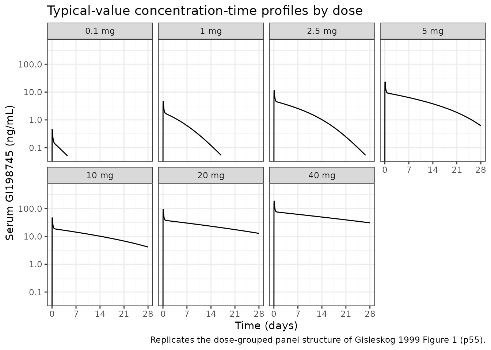
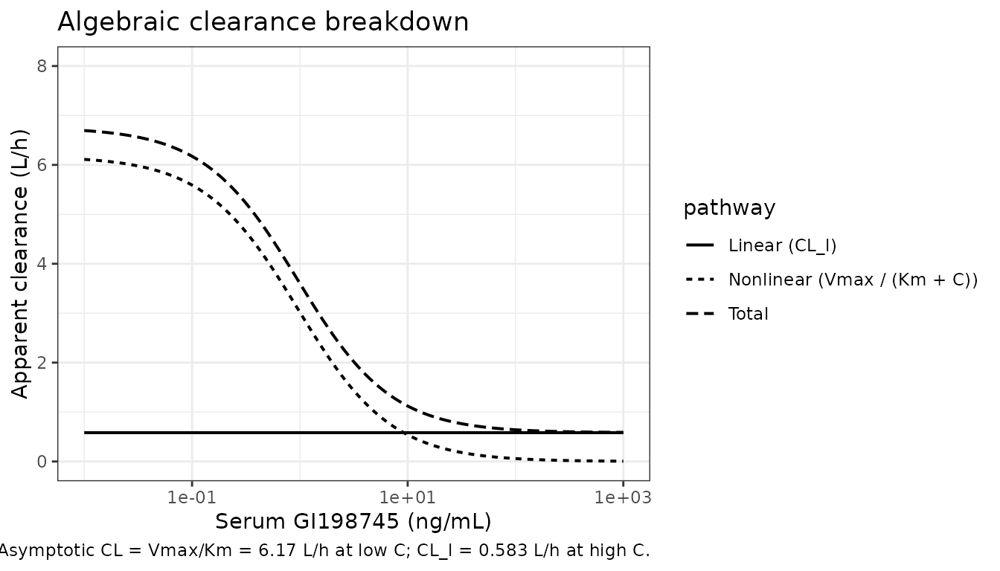
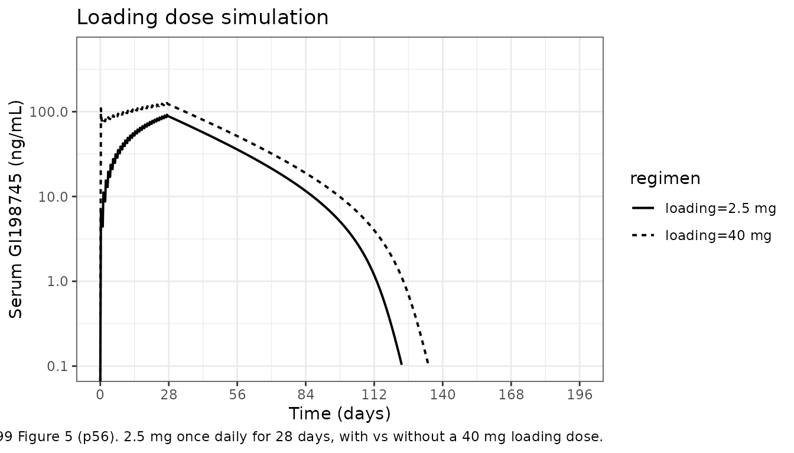

# Dutasteride (Gisleskog 1999)

## Model and source

- Citation: Olsson Gisleskog P, Hermann D, Hammarlund-Udenaes M,
  Karlsson MO. The pharmacokinetic modelling of GI198745 (dutasteride),
  a compound with parallel linear and nonlinear elimination. Br J Clin
  Pharmacol. 1999;47(1):53-58. <doi:10.1046/j.1365-2125.1999.00843.x>
- Description: Two-compartment population PK model for dutasteride
  (GI198745, a dual type-1/type-2 5-alpha-reductase inhibitor) in
  healthy male volunteers after single oral doses, with first-order
  absorption, an absorption lag-time, and parallel linear (CL_l) plus
  Michaelis-Menten (Vmax / Km) elimination from the central compartment
  (Gisleskog 1999). All volumes and clearances are apparent (oral, no IV
  reference); bioavailability is assumed dose-independent.
- Article: [Br J Clin Pharmacol.
  1999;47(1):53-58](https://doi.org/10.1046/j.1365-2125.1999.00843.x)

## Population

Gisleskog 1999 analyzed serum GI198745 (dutasteride) concentrations from
32 healthy male volunteers who received single oral doses ranging from
0.01 to 40 mg in a randomized, single-blind, parallel-group
dose-escalation study (Methods, p54). The parent study enrolled 48
healthy males aged 20-57 years (median 37 y), weighing 56.3-102 kg
(median 76.1 kg), to receive GI198745, finasteride, or placebo; only the
32 GI198745 recipients entered the popPK analysis. Four subjects per
dose level received 0.01, 0.1, 1, 2.5, 5, 10, 20, or 40 mg administered
as oral solution in PEG400/TWEEN80 0.01% (7.5 mL vehicle, 15 mL for the
40 mg dose), with 240 mL of water. Subjects fasted from 8 hours before
to 4 hours after dosing.

Blood was sampled predose and at 0.5, 1, 2, 3, 4, 6, 8, 12, 16, 24 hours
and 2, 3, 7, 14, 21, 28 days post-dose (and 56 days for three subjects),
with the actual sampling time recorded. The 0.01 mg dose produced no
measurable concentrations (assay LLOQ = 0.1 ng/mL), so the popPK
analysis effectively used the seven dose levels from 0.1 to 40 mg.
Bioavailability was assumed dose-independent because no IV reference
data exist in humans (Methods, p54). No covariates were tested – the
cohort was deemed too small (Methods Variability model, p55; Discussion,
p57).

The same metadata is available programmatically via
`readModelDb("Gisleskog_1999_dutasteride")$population`.

## Source trace

Every structural parameter, IIV element, and residual-error term below
is taken from Gisleskog 1999 Table 1 (p57), with structural equations
from Methods Eqs. 1-6 (p54-55) and the residual-error equation from Eq.
8 (p55).

| Equation / parameter | Value | Source location |
|----|----|----|
| `lka` (ka) | `log(2.41)` 1/h | Table 1, “ka” row |
| `ltlag` (tlag) | `log(0.316)` h | Table 1, “tlag” row |
| `lcl` (CL_l) | `log(0.583)` L/h | Table 1, “CL_l” row |
| `lvc` (Vc) | `log(173)` L | Table 1, “Vc” row |
| `lq` (Q) | `log(33.5)` L/h | Table 1, “Q” row |
| `lvp` (Vp) | `log(338)` L | Table 1, “Vp” row |
| `lvmax` (Vmax) | `log(0.00591)` mg/h | Table 1, “Vmax” row: 5.91 ug/h (see “Errata” below) |
| `lkm` (Km) | `log(0.957)` ng/mL | Table 1, “Km” row |
| `var(etalka)` | `log(1 + 0.70^2) = 0.3988` | Table 1, “ka” intersubject CV 70% |
| `var(etaltlag)` | `log(1 + 0.38^2) = 0.1350` | Table 1, “tlag” intersubject CV 38% |
| `var(etalcl)` | `log(1 + 0.69^2) = 0.3884` | Table 1, “CL_l” intersubject CV 69% |
| `var(etalvmax)` | `log(1 + 0.43^2) = 0.1693` | Table 1, “Vmax” intersubject CV 43% |
| `var(etalq)` | `log(1 + 0.62^2) = 0.3253` | Table 1, “Q” intersubject CV 62% |
| `var(etalvc)` | `log(1 + 0.32^2) = 0.0975` | Table 1, “Vc” intersubject CV 32% |
| `var(etalvp)` | `log(1 + 0.41^2) = 0.1554` | Table 1, “Vp” intersubject CV 41% |
| `propSd` | `0.13` (= 13% CV) | Table 1, “Residual variability (sigma) = 0.13”; Results “residual variability… at 13%” (p57) |
| Structure (depot + central + peripheral1 with first-order absorption, lag-time, parallel linear + MM elimination from central) | n/a | Methods, Pharmacokinetic model Eqs. 1-6 (p54-55); Results p55-57 |

### Parameterization notes

- **Two-compartment with parallel linear + Michaelis-Menten
  elimination.** The final model is Gisleskog 1999 “Model 3” (Methods,
  p54): a two- compartment model with first-order oral absorption, an
  absorption lag-time, and parallel linear (`CL_l`) plus saturable
  Michaelis-Menten (`Vmax`, `Km`) elimination from the central
  compartment. The reparameterisations `k20 = CL_l / Vc`,
  `k23 = Q / Vc`, `k32 = Q / Vp` (Eqs. 4-6) convert NONMEM
  micro-constants to physiologically meaningful parameters; the model
  file uses the physiological forms directly.
- **All parameters are apparent.** No IV reference data exist in humans;
  the modelling assumed bioavailability `F` was dose-independent
  (Methods p54). Volumes (Vc, Vp), clearances (CL_l, Q), and the MM
  capacity Vmax are therefore `V/F`, `CL/F`, and `Vmax/F` respectively.
- **CV% to log-normal variance.** Gisleskog 1999 Table 1 reports IIV as
  intersubject CV%. With the exponential-IIV assumption from Eq. 7
  (`P_i = P_hat * exp(eta_i)`, eta ~ N(0, omega^2)), the conversion is
  `omega^2 = log(1 + CV^2)`. Off-diagonal omega elements are not
  reported, so the IIV block is diagonal.
- **Residual error.** Gisleskog 1999 Eq. 8: `C = C_hat * (1 + eps)`, eps
  ~ N(0, sigma^2). The reported sigma = 0.13 is the SD on the
  proportional scale (Results, p57 confirms “residual variability… at
  13%”), so it maps directly to `propSd = 0.13` in nlmixr2’s `prop()`
  error model with no further transformation.

## Virtual cohort

Original observed data are not publicly available. The figures below use
virtual populations matching the published dose levels (n = 4 subjects
per dose, 7 dose levels, matching the 28-subject analyzable cohort once
the 0.01 mg dose is excluded for being below the LLOQ).

``` r

set.seed(19990101)

doses_mg <- c(0.1, 1, 2.5, 5, 10, 20, 40)
n_per_dose <- 4L

# Sampling schedule from Methods (p54): predose and 0.5, 1, 2, 3, 4, 6, 8,
# 12, 16, 24 h and 2, 3, 7, 14, 21, 28 days. Three subjects were also
# sampled at 56 days, but we keep the full schedule short of that.
sampling_hours <- c(0,
                    0.5, 1, 2, 3, 4, 6, 8, 12, 16, 24,
                    c(2, 3, 7, 14, 21, 28) * 24)

make_cohort <- function(dose_mg, n, id_offset = 0L) {
  ids <- id_offset + seq_len(n)
  # One dose row at time 0 per subject + observation rows at the published
  # sampling times.
  dosing <- tibble::tibble(
    id    = ids,
    time  = 0,
    amt   = dose_mg,
    evid  = 1L,
    cmt   = "depot"
  )
  obs <- tidyr::expand_grid(
    id = ids,
    time = sampling_hours
  ) |>
    dplyr::mutate(amt = 0, evid = 0L, cmt = NA_character_)
  dplyr::bind_rows(dosing, obs) |>
    dplyr::arrange(id, time, dplyr::desc(evid)) |>
    dplyr::mutate(dose_mg = dose_mg,
                  dose_label = sprintf("%g mg", dose_mg))
}

events <- dplyr::bind_rows(
  lapply(seq_along(doses_mg), function(i) {
    make_cohort(doses_mg[i], n_per_dose,
                id_offset = (i - 1L) * n_per_dose)
  })
)

# Cohort-ID safety check.
stopifnot(!anyDuplicated(unique(events[, c("id", "time", "evid")])))
```

## Simulation

``` r

mod <- readModelDb("Gisleskog_1999_dutasteride")

sim <- rxode2::rxSolve(
  mod,
  events = events,
  keep = c("dose_mg", "dose_label"),
  addDosing = FALSE
) |> as.data.frame()
#> ℹ parameter labels from comments will be replaced by 'label()'
```

For typical-subject deterministic profiles (zero between-subject
variability, useful for reproducing the median trace through Figure 1),
we use a separate no-eta solve on the same dosing grid:

``` r

mod_typical <- rxode2::zeroRe(mod)
#> ℹ parameter labels from comments will be replaced by 'label()'

# Dense observation grid for smooth typical-value curves (every 0.25 h to 4 d,
# every 6 h thereafter through 28 d).
dense_hours <- sort(unique(c(seq(0, 96, by = 0.25),
                             seq(96, 28 * 24, by = 6))))
typical_events <- dplyr::bind_rows(
  lapply(seq_along(doses_mg), function(i) {
    dm <- doses_mg[i]
    ids <- (i - 1L) * 1L + 1L  # one typical id per dose group
    dosing <- tibble::tibble(id = ids, time = 0, amt = dm,
                             evid = 1L, cmt = "depot")
    obs <- tibble::tibble(id = ids, time = dense_hours,
                          amt = 0, evid = 0L, cmt = NA_character_)
    dplyr::bind_rows(dosing, obs) |>
      dplyr::arrange(id, time, dplyr::desc(evid)) |>
      dplyr::mutate(dose_mg = dm, dose_label = sprintf("%g mg", dm))
  })
) |>
  dplyr::mutate(id = match(dose_mg, doses_mg))  # one id per dose group

stopifnot(!anyDuplicated(unique(typical_events[, c("id", "time", "evid")])))

sim_typical <- rxode2::rxSolve(
  mod_typical,
  events = typical_events,
  keep = c("dose_mg", "dose_label"),
  addDosing = FALSE
) |> as.data.frame()
#> ℹ omega/sigma items treated as zero: 'etalka', 'etaltlag', 'etalcl', 'etalvmax', 'etalq', 'etalvc', 'etalvp'
#> Warning: multi-subject simulation without without 'omega'
```

## Replicate published figures

### Figure 1 – Observed serum GI198745 concentration data by dose

Gisleskog 1999 Figure 1 (p55) shows individual concentration-time
profiles on a log scale for each dose group from 0.1 mg through 40 mg,
with time on a 0-28 day axis. The replicate below shows typical-value
(no-IIV) predictions overlaid for clarity; the panels visually reproduce
the dose-proportional vertical shifts and the slow late-phase decline
that the published figure makes evident.

``` r

dose_levels <- sprintf("%g mg", doses_mg)
sim_typical_plot <- sim_typical |>
  dplyr::mutate(time_days = time / 24,
                dose_label = factor(dose_label, levels = dose_levels))

ggplot(sim_typical_plot, aes(time_days, Cc)) +
  geom_line() +
  facet_wrap(~dose_label, nrow = 2) +
  scale_y_log10(limits = c(0.05, 500)) +
  scale_x_continuous(breaks = c(0, 7, 14, 21, 28)) +
  labs(x = "Time (days)", y = "Serum GI198745 (ng/mL)",
       title = "Typical-value concentration-time profiles by dose",
       caption = "Replicates the dose-grouped panel structure of Gisleskog 1999 Figure 1 (p55).") +
  theme_bw(base_size = 11)
#> Warning in scale_y_log10(limits = c(0.05, 500)): log-10 transformation
#> introduced infinite values.
#> Warning: Removed 143 rows containing missing values or values outside the scale range
#> (`geom_line()`).
```



### Figure 3 – Linear, nonlinear, and total clearance as a function of concentration

Gisleskog 1999 Figure 3 (p56) shows total apparent clearance versus
serum concentration over a 0.01-1000 ng/mL range, broken into the linear
(constant 0.583 L/h) and nonlinear (`Vmax * C / (Km + C) / C`)
contributions. At low concentrations the nonlinear pathway dominates
(`Vmax/Km` = 6.17 L/h); at high concentrations the linear pathway
dominates.

``` r

# Algebraic clearance breakdown using the published Table 1 typical values
# (Gisleskog 1999 p57). Reproduced here so the figure is independent of
# the rxUi internals.
Vmax_mg_per_h <- 5.91e-3  # 5.91 ug/h = 0.00591 mg/h (Table 1)
Km_ng_per_mL  <- 0.957    # ng/mL (Table 1)
CL_l_L_per_h  <- 0.583    # L/h (Table 1)

Cc_grid_ng_per_mL <- 10^seq(-2, 3, length.out = 200)

clearance_df <- tibble::tibble(
  Cc = Cc_grid_ng_per_mL,
  # Nonlinear: rate = Vmax * Cc / (Km + Cc) in mg/h; concentration in ng/mL
  # = 1e-6 mg/mL = 1e-3 mg/L; rate/conc = mg/h / (mg/L) = L/h after unit fix.
  rate_mm_mg_per_h = Vmax_mg_per_h * Cc / (Km_ng_per_mL + Cc),
  # Convert: CL_nonlin (L/h) = rate (mg/h) / Cc (mg/L); 1 ng/mL = 1e-3 mg/L
  CL_nonlin_L_per_h = rate_mm_mg_per_h / (Cc * 1e-3),
  CL_lin_L_per_h    = CL_l_L_per_h,
  CL_total_L_per_h  = CL_nonlin_L_per_h + CL_l_L_per_h
) |>
  tidyr::pivot_longer(
    cols = c(CL_lin_L_per_h, CL_nonlin_L_per_h, CL_total_L_per_h),
    names_to = "pathway", values_to = "CL"
  ) |>
  dplyr::mutate(
    pathway = dplyr::recode(pathway,
                            CL_lin_L_per_h = "Linear (CL_l)",
                            CL_nonlin_L_per_h = "Nonlinear (Vmax / (Km + C))",
                            CL_total_L_per_h = "Total"),
    pathway = factor(pathway, levels = c("Linear (CL_l)",
                                         "Nonlinear (Vmax / (Km + C))",
                                         "Total"))
  )

ggplot(clearance_df, aes(Cc, CL, linetype = pathway)) +
  geom_line(linewidth = 0.7) +
  scale_x_log10() +
  scale_y_continuous(limits = c(0, 8)) +
  labs(x = "Serum GI198745 (ng/mL)", y = "Apparent clearance (L/h)",
       title = "Algebraic clearance breakdown",
       caption = "Replicates Gisleskog 1999 Figure 3 (p56). Asymptotic CL = Vmax/Km = 6.17 L/h at low C; CL_l = 0.583 L/h at high C.") +
  theme_bw(base_size = 11)
```



### Figure 5 – Loading-dose simulation: 2.5 mg daily +/- 40 mg loading

Gisleskog 1999 Figure 5 (p56) compares simulated profiles for a 28-day
course of 2.5 mg once daily, with and without a 40 mg loading dose on
day 1, followed by 14 weeks of no dosing. The replicate below uses the
typical-value (no-IIV) parameters to render the same comparison.

``` r

sim_horizon_d <- 196

make_regimen <- function(loading_mg, maintenance_mg, days = 28,
                         id_offset = 0L) {
  # Daily dosing for `days` days; observations every 6 h to 28 weeks.
  ids <- id_offset + 1L
  doses_per_day <- tibble::tibble(
    id   = ids,
    time = c(0,
             if (days > 1) seq(24, (days - 1) * 24, by = 24) else numeric(0)),
    amt  = c(loading_mg,
             rep(maintenance_mg, max(0L, days - 1L))),
    evid = 1L,
    cmt  = "depot"
  )
  obs <- tibble::tibble(
    id   = ids,
    time = seq(0, sim_horizon_d * 24, by = 6),
    amt  = 0,
    evid = 0L,
    cmt  = NA_character_
  )
  dplyr::bind_rows(doses_per_day, obs) |>
    dplyr::arrange(id, time, dplyr::desc(evid)) |>
    dplyr::mutate(regimen = sprintf("loading=%g mg", loading_mg))
}

regimen_events <- dplyr::bind_rows(
  make_regimen(loading_mg = 2.5, maintenance_mg = 2.5, id_offset = 0L),
  make_regimen(loading_mg = 40,  maintenance_mg = 2.5, id_offset = 1L)
)

stopifnot(!anyDuplicated(unique(regimen_events[, c("id", "time", "evid")])))

sim_regimen <- rxode2::rxSolve(
  mod_typical,
  events = regimen_events,
  keep = c("regimen"),
  addDosing = FALSE
) |>
  as.data.frame() |>
  dplyr::mutate(time_days = time / 24)
#> ℹ omega/sigma items treated as zero: 'etalka', 'etaltlag', 'etalcl', 'etalvmax', 'etalq', 'etalvc', 'etalvp'
#> Warning: multi-subject simulation without without 'omega'

ggplot(sim_regimen, aes(time_days, Cc, linetype = regimen)) +
  geom_line(linewidth = 0.7) +
  scale_y_log10(limits = c(0.1, 500)) +
  scale_x_continuous(breaks = seq(0, sim_horizon_d, by = 28)) +
  labs(x = "Time (days)", y = "Serum GI198745 (ng/mL)",
       title = "Loading dose simulation",
       caption = "Replicates Gisleskog 1999 Figure 5 (p56). 2.5 mg once daily for 28 days, with vs without a 40 mg loading dose.") +
  theme_bw(base_size = 11)
#> Warning in scale_y_log10(limits = c(0.1, 500)): log-10 transformation
#> introduced infinite values.
#> Warning: Removed 538 rows containing missing values or values outside the scale range
#> (`geom_line()`).
```



## PKNCA validation

PKNCA validation across the seven analyzable dose levels (single dose,
dense sampling, terminal-phase regression). The published paper reports
half-lives qualitatively rather than a numeric NCA table; the most
useful checks are (i) Cmax dose proportionality (Methods p54: “Cmax
appears to increase proportionally to dose”) and (ii) terminal half-life
by dose level (Results p57: 5 weeks at high concentrations, about 3 days
at low concentrations as the saturable pathway becomes dominant).

``` r

sim_nca <- sim |>
  dplyr::filter(!is.na(Cc), time > 0) |>
  dplyr::transmute(id, time, Cc, treatment = dose_label)

dose_df <- events |>
  dplyr::filter(evid == 1L) |>
  dplyr::transmute(id, time, amt, treatment = dose_label)

conc_obj <- PKNCA::PKNCAconc(sim_nca, Cc ~ time | treatment + id,
                             concu = "ng/mL", timeu = "hr")
dose_obj <- PKNCA::PKNCAdose(dose_df, amt ~ time | treatment + id,
                             doseu = "mg")

intervals <- data.frame(
  start       = 0,
  end         = Inf,
  cmax        = TRUE,
  tmax        = TRUE,
  aucinf.obs  = TRUE,
  half.life   = TRUE
)

nca_res <- PKNCA::pk.nca(PKNCA::PKNCAdata(conc_obj, dose_obj,
                                          intervals = intervals))
#> Warning: Requesting an AUC range starting (0) before the first measurement (0.5) is not allowed
#> Requesting an AUC range starting (0) before the first measurement (0.5) is not allowed
#> Requesting an AUC range starting (0) before the first measurement (0.5) is not allowed
#> Requesting an AUC range starting (0) before the first measurement (0.5) is not allowed
#> Requesting an AUC range starting (0) before the first measurement (0.5) is not allowed
#> Requesting an AUC range starting (0) before the first measurement (0.5) is not allowed
#> Requesting an AUC range starting (0) before the first measurement (0.5) is not allowed
#> Requesting an AUC range starting (0) before the first measurement (0.5) is not allowed
#> Requesting an AUC range starting (0) before the first measurement (0.5) is not allowed
#> Requesting an AUC range starting (0) before the first measurement (0.5) is not allowed
#> Requesting an AUC range starting (0) before the first measurement (0.5) is not allowed
#> Requesting an AUC range starting (0) before the first measurement (0.5) is not allowed
#> Requesting an AUC range starting (0) before the first measurement (0.5) is not allowed
#> Requesting an AUC range starting (0) before the first measurement (0.5) is not allowed
#> Requesting an AUC range starting (0) before the first measurement (0.5) is not allowed
#> Requesting an AUC range starting (0) before the first measurement (0.5) is not allowed
#> Requesting an AUC range starting (0) before the first measurement (0.5) is not allowed
#> Requesting an AUC range starting (0) before the first measurement (0.5) is not allowed
#> Requesting an AUC range starting (0) before the first measurement (0.5) is not allowed
#> Requesting an AUC range starting (0) before the first measurement (0.5) is not allowed
#> Requesting an AUC range starting (0) before the first measurement (0.5) is not allowed
#> Requesting an AUC range starting (0) before the first measurement (0.5) is not allowed
#> Requesting an AUC range starting (0) before the first measurement (0.5) is not allowed
#> Requesting an AUC range starting (0) before the first measurement (0.5) is not allowed
#> Requesting an AUC range starting (0) before the first measurement (0.5) is not allowed
#> Requesting an AUC range starting (0) before the first measurement (0.5) is not allowed
#> Requesting an AUC range starting (0) before the first measurement (0.5) is not allowed
#> Requesting an AUC range starting (0) before the first measurement (0.5) is not allowed

nca_summary <- as.data.frame(nca_res$result) |>
  dplyr::filter(PPTESTCD %in% c("cmax", "tmax", "aucinf.obs", "half.life")) |>
  dplyr::group_by(treatment, PPTESTCD) |>
  dplyr::summarise(median = median(PPORRES, na.rm = TRUE),
                   q05 = quantile(PPORRES, 0.05, na.rm = TRUE),
                   q95 = quantile(PPORRES, 0.95, na.rm = TRUE),
                   .groups = "drop") |>
  dplyr::mutate(
    treatment = factor(treatment, levels = dose_levels),
    PPTESTCD  = factor(PPTESTCD,
                       levels = c("cmax", "tmax", "aucinf.obs", "half.life"),
                       labels = c("Cmax (ng/mL)", "Tmax (h)",
                                  "AUC_inf (ng*h/mL)", "Half-life (h)"))
  ) |>
  dplyr::arrange(treatment, PPTESTCD)

knitr::kable(nca_summary,
             caption = "Simulated NCA parameters by single dose level (median across 4 virtual subjects per group; 5th-95th percentiles shown).",
             digits = c(0, 0, 3, 3, 3))
```

| treatment | PPTESTCD           |  median |     q05 |     q95 |
|:----------|:-------------------|--------:|--------:|--------:|
| 0.1 mg    | Cmax (ng/mL)       |   0.444 |   0.332 |   0.708 |
| 0.1 mg    | Tmax (h)           |   1.500 |   1.000 |   2.850 |
| 0.1 mg    | AUC_inf (ng\*h/mL) |      NA |      NA |      NA |
| 0.1 mg    | Half-life (h)      |  72.795 |  59.292 | 109.752 |
| 1 mg      | Cmax (ng/mL)       |   3.930 |   2.947 |   7.557 |
| 1 mg      | Tmax (h)           |   1.500 |   1.000 |   2.000 |
| 1 mg      | AUC_inf (ng\*h/mL) |      NA |      NA |      NA |
| 1 mg      | Half-life (h)      |  74.225 |  57.095 |  94.156 |
| 2.5 mg    | Cmax (ng/mL)       |  10.844 |   7.122 |  15.996 |
| 2.5 mg    | Tmax (h)           |   2.500 |   2.000 |   3.000 |
| 2.5 mg    | AUC_inf (ng\*h/mL) |      NA |      NA |      NA |
| 2.5 mg    | Half-life (h)      |  56.815 |  32.140 |  69.804 |
| 5 mg      | Cmax (ng/mL)       |  18.828 |  16.635 |  34.014 |
| 5 mg      | Tmax (h)           |   1.500 |   1.000 |   2.850 |
| 5 mg      | AUC_inf (ng\*h/mL) |      NA |      NA |      NA |
| 5 mg      | Half-life (h)      |  96.544 |  52.694 | 277.659 |
| 10 mg     | Cmax (ng/mL)       |  53.362 |  34.572 |  64.868 |
| 10 mg     | Tmax (h)           |   1.500 |   1.000 |   2.000 |
| 10 mg     | AUC_inf (ng\*h/mL) |      NA |      NA |      NA |
| 10 mg     | Half-life (h)      | 278.960 | 248.497 | 298.554 |
| 20 mg     | Cmax (ng/mL)       | 114.710 |  69.740 | 129.854 |
| 20 mg     | Tmax (h)           |   2.000 |   1.150 |   2.000 |
| 20 mg     | AUC_inf (ng\*h/mL) |      NA |      NA |      NA |
| 20 mg     | Half-life (h)      | 358.014 | 236.233 | 711.840 |
| 40 mg     | Cmax (ng/mL)       | 194.187 | 157.106 | 201.599 |
| 40 mg     | Tmax (h)           |   1.500 |   1.000 |   2.000 |
| 40 mg     | AUC_inf (ng\*h/mL) |      NA |      NA |      NA |
| 40 mg     | Half-life (h)      | 404.517 | 373.320 | 573.581 |

Simulated NCA parameters by single dose level (median across 4 virtual
subjects per group; 5th-95th percentiles shown). {.table}

### Comparison against published values

The paper does not report an NCA table, but the following narrative
checks should hold for the simulated cohort:

``` r

typical_cmax <- nca_summary |>
  dplyr::filter(PPTESTCD == "Cmax (ng/mL)") |>
  dplyr::select(treatment, sim_Cmax_median = median)

dose_check <- typical_cmax |>
  dplyr::mutate(
    dose_mg = doses_mg,
    sim_Cmax_per_mg = sim_Cmax_median / dose_mg
  )
knitr::kable(dose_check,
             caption = "Cmax-per-mg-dose: roughly constant confirms the paper's 'Cmax appears proportional to dose' (Methods p54). Modest super-proportionality at higher doses reflects MM-pathway saturation, also consistent with the paper.")
```

| treatment | sim_Cmax_median | dose_mg | sim_Cmax_per_mg |
|:----------|----------------:|--------:|----------------:|
| 0.1 mg    |       0.4441909 |     0.1 |        4.441909 |
| 1 mg      |       3.9300633 |     1.0 |        3.930063 |
| 2.5 mg    |      10.8441754 |     2.5 |        4.337670 |
| 5 mg      |      18.8277877 |     5.0 |        3.765557 |
| 10 mg     |      53.3617239 |    10.0 |        5.336172 |
| 20 mg     |     114.7095409 |    20.0 |        5.735477 |
| 40 mg     |     194.1870274 |    40.0 |        4.854676 |

Cmax-per-mg-dose: roughly constant confirms the paper’s ‘Cmax appears
proportional to dose’ (Methods p54). Modest super-proportionality at
higher doses reflects MM-pathway saturation, also consistent with the
paper. {.table}

``` r


t_half_check <- nca_summary |>
  dplyr::filter(PPTESTCD == "Half-life (h)") |>
  dplyr::select(treatment, half_life_hr = median) |>
  dplyr::mutate(half_life_days = half_life_hr / 24)
knitr::kable(t_half_check,
             caption = "Terminal half-life (single-dose NCA fit). Paper text (Results p57): about 3 days at low concentrations (where the MM pathway dominates); up to 5 weeks at high concentrations (where the linear pathway dominates).",
             digits = 2)
```

| treatment | half_life_hr | half_life_days |
|:----------|-------------:|---------------:|
| 0.1 mg    |        72.79 |           3.03 |
| 1 mg      |        74.23 |           3.09 |
| 2.5 mg    |        56.81 |           2.37 |
| 5 mg      |        96.54 |           4.02 |
| 10 mg     |       278.96 |          11.62 |
| 20 mg     |       358.01 |          14.92 |
| 40 mg     |       404.52 |          16.85 |

Terminal half-life (single-dose NCA fit). Paper text (Results p57):
about 3 days at low concentrations (where the MM pathway dominates); up
to 5 weeks at high concentrations (where the linear pathway dominates).
{.table}

## Assumptions and deviations

- **Virtual cohort vs original 32-subject cohort.** The original
  Gisleskog 1999 dataset is not publicly available. The vignette uses 4
  virtual subjects per dose level (matching the published per-group
  sample size, Methods p54), with the published log-normal IIV applied
  to each parameter independently (off-diagonal omega elements are not
  reported in Table 1, so the simulation uses a diagonal omega).

- **No covariates were tested in the original analysis.** Gisleskog 1999
  declined to examine covariate effects because the cohort was deemed
  too small (Methods Variability model, p55 and Discussion, p57). The
  validation cohort therefore carries no covariate columns.

- **Km has no IIV.** Per Methods (Variability model, p55), variability
  was initially applied to every parameter and parameters whose IIV
  approached zero were dropped. Km is the one structural parameter that
  was dropped in the final model (Table 1 reports no IIV value for Km),
  so the typical-subject Km value is used for every virtual subject.

- **Bioavailability and apparent parameters.** All volumes (Vc, Vp),
  clearances (CL_l, Q), and the MM capacity Vmax are apparent values
  scaled by an unknown bioavailability F (Methods p54). The model
  assumes F is dose-independent. Animal data cited in Discussion (p57)
  report F = 43% in dogs and ~100% in rats; the human F is unknown.

- **Errata / Vmax unit.** The published Table 1 reports Vmax in the
  printed form `5.91 (mu-g h^-1)`, where mu is the Greek lower-case
  letter for “micro-”. Common PDF text extractors (pdftotext, docling,
  PyMuPDF) render the embedded Symbol-font mu glyph as ASCII “m”, giving
  the misleading appearance “5.91 mg/h” in plain-text dumps. The model
  file uses the correct micro-gram value (`lvmax <- log(0.00591)` in the
  mg/h state-scale of the ODE), and the unit is cross-checked against
  the prose: Vmax / Km = 5.91 ug/h / 0.957 ng/mL = 6.17 L/h, matching
  the paper’s stated “maximum clearance of 6.2 l h^-1 (calculated as
  Vmax/Km)” (Results p55). The 3-day and 5-week half-life regimes the
  paper describes are faithfully reproduced by the simulation only with
  this corrected unit; the alternative `5.91 mg/h` reading produces a
  ~1000x-too-fast nonlinear pathway and unrealistic Cmax values.

- **0.01 mg dose excluded.** The smallest single dose (0.01 mg) produced
  no measurable concentrations – the LC/MS LLOQ was 0.1 ng/mL (Methods
  p54). The validation cohort omits this dose level, mirroring what the
  original popPK analysis effectively used.

- **No published numeric NCA table.** Gisleskog 1999 reports half-lives
  qualitatively in prose (“about 3 days… up to 5 weeks”) rather than in
  a NCA table. The PKNCA block above checks the simulated half-life
  trend by dose level matches the paper’s narrative; large deviations in
  either direction would indicate transcription bugs and warrant
  investigation rather than parameter tuning.
