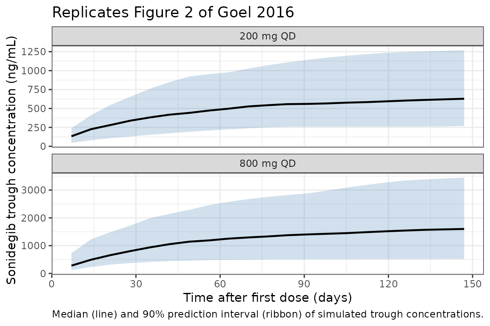

# Sonidegib (Goel 2016)

``` r

library(nlmixr2lib)
library(PKNCA)
#> 
#> Attaching package: 'PKNCA'
#> The following object is masked from 'package:stats':
#> 
#>     filter
library(rxode2)
#> rxode2 5.1.1 using 2 threads (see ?getRxThreads)
#>   no cache: create with `rxCreateCache()`
library(dplyr)
#> 
#> Attaching package: 'dplyr'
#> The following objects are masked from 'package:stats':
#> 
#>     filter, lag
#> The following objects are masked from 'package:base':
#> 
#>     intersect, setdiff, setequal, union
library(tidyr)
library(ggplot2)
```

## Model and source

- Citation: Goel V, Hurh E, Stein A, et al. Population pharmacokinetics
  of sonidegib (LDE225), an oral inhibitor of hedgehog pathway
  signaling, in healthy subjects and in patients with advanced solid
  tumors. Cancer Chemother Pharmacol. 2016;77(4):745-755.
- DOI: <https://doi.org/10.1007/s00280-016-2982-1>
- Article: <https://link.springer.com/article/10.1007/s00280-016-2982-1>

## Population

Goel 2016 fits a two-compartment population PK model with first-order
absorption, absorption lag time, linear elimination, and dose-dependent
bioavailability to 6,510 above-LLOQ sonidegib plasma concentrations from
436 participants in five phase 1 / phase 2 clinical pharmacology
studies:

- **A1102** (n = 36): Japanese healthy subjects, single oral dose 200,
  400, or 800 mg under overnight fast.
- **A2114** (n = 49): non-Japanese healthy subjects, single oral dose
  200, 800, or 1200 mg under overnight fast or 800 mg after a high-fat
  meal.
- **X2101** (n = 103): patients with advanced solid tumors,
  dose-escalation (QD: 100-3000 mg; BID: 250-750 mg), dosed 2 h after a
  light meal.
- **X1101** (n = 21): East-Asian-descent patients with advanced solid
  tumors, 400 or 600 mg QD, 2 h after a light meal.
- **A2201** (n = 227): patients with locally-advanced or metastatic
  basal cell carcinoma, 200 or 800 mg QD, 2 h after a light meal.

Pooled cohort medians (Goel 2016 Table 1): age 58 y (range 20-93),
weight 73 kg (42-181), 33 % female, 94 % Western enrollment, albumin 43
g/L, ULN-normalized ALT 0.42, ULN-normalized total bilirubin 0.38,
creatinine clearance 93.3 mL/min. Healthy subjects had ~3-fold higher
apparent clearance than cancer patients, which the paper attributes to
differences in the studies’ design and conduct (controlled fasting / fed
conditions in HV studies vs self-administered dosing in patient studies)
rather than a true clearance shift.

Programmatic access to the population summary:
`readModelDb("Goel_2016_Sonidegib")$population`.

## Source trace

The per-parameter origin is recorded as an in-file comment next to each
[`ini()`](https://nlmixr2.github.io/rxode2/reference/ini.html) entry in
`inst/modeldb/specificDrugs/Goel_2016_Sonidegib.R`. The table below
collects them in one place for review.

| Equation / parameter | Value | Source location |
|----|----|----|
| `lka` (Ka, 1/h) | log(0.219) | Goel 2016 Table 2 full-model theta17 |
| `lcl` (CL/F, L/h) | log(10.2) | Goel 2016 Table 2 full-model theta1 |
| `lvc` (Vc/F, L) | log(145) | Goel 2016 Table 2 full-model theta11 |
| `lq` (Q/F, L/h) | log(215) | Goel 2016 Table 2 full-model theta14 |
| `lvp` (Vp/F, L) | log(8414) | Goel 2016 Table 2 full-model theta15 |
| `ltlag` (Tlag, h) | log(0.474) | Goel 2016 Table 2 full-model theta19 |
| `e_age_cl` | -0.375 | Goel 2016 Table 2 theta2 |
| `e_wt_cl` | -0.093 | Goel 2016 Table 2 theta3 |
| `e_sexf_cl` | 0.846 | Goel 2016 Table 2 theta4 (Female effect on CL/F) |
| `e_crcl_cl` | -0.043 | Goel 2016 Table 2 theta5 |
| `e_alb_cl` | -1.44 | Goel 2016 Table 2 theta6 |
| `e_alt_cl` | 0.120 | Goel 2016 Table 2 theta7 (ALTN/0.42 effect on CL/F) |
| `e_tbili_cl` | 0.064 | Goel 2016 Table 2 theta8 (BILN/0.38 effect on CL/F) |
| `e_race_japanese_cl` | 0.905 | Goel 2016 Table 2 theta9 (JPN effect on CL/F) |
| `e_healthy_cl` | 2.96 | Goel 2016 Table 2 theta10 (HV effect on CL/F) |
| `e_wt_vc` | 0.731 | Goel 2016 Table 2 theta12 (shared with WT-on-Vp/F per paper) |
| `e_alb_vc` | -2.33 | Goel 2016 Table 2 theta13 |
| `e_alb_vp` | -0.087 | Goel 2016 Table 2 theta16 |
| `e_fed_highfat_ka` | 1.01 | Goel 2016 Table 2 theta18 (FATM effect on Ka) |
| `e_conmed_h2ra_f` | 0.996 | Goel 2016 Table 2 theta20 (H2 effect on F) |
| `e_conmed_ppi_f` | 0.696 | Goel 2016 Table 2 theta21 (CONMED_PPI effect on F) |
| `e_healthy_fast_f` | 0.855 | Goel 2016 Table 2 theta22 (HV.Fasting effect on F) |
| `e_fed_highfat_f` | 5.74 | Goel 2016 Table 2 theta23 (Fatmeal effect on F) |
| `e_dose_f` | -0.342 | Goel 2016 Table 2 theta24 (Dose/100 effect on F) |
| `e_multi_dose_pt_f` | 1.16 | Goel 2016 Table 2 theta25 (FMDD effect on F) |
| IIV CL/F | 64.8 % CV (omega^2 = 0.3505) | Goel 2016 Table 2 |
| IIV Vc/F | 213 % CV (omega^2 = 1.7115) | Goel 2016 Table 2 |
| IIV Q/F | 106 % CV (omega^2 = 0.7531) | Goel 2016 Table 2 |
| IIV Vp/F | 78.9 % CV (omega^2 = 0.4839) | Goel 2016 Table 2 |
| IIV Ka | 44.2 % CV (omega^2 = 0.1786) | Goel 2016 Table 2 |
| Q/F-Vp/F correlation | 0.692 | Goel 2016 Table 2 |
| `propSd` (proportional residual error) | 0.318 | Goel 2016 Table 2 sigma_mult |
| Equations: 2-cmt + lag + dose-dependent F | n/a | Goel 2016 Methods, Eq. 1 |

## Virtual cohort

The original observed dataset is not publicly available. This vignette
constructs a virtual cohort of cancer patients matched to the Table 1 /
Figure 2 reference scenario (200 mg QD and 800 mg QD oral sonidegib, 2 h
post light meal, no CONMED_PPI / CONMED_H2RA, no high-fat meal).
Covariate distributions approximate the pooled cancer-patient sub-cohort
(Goel 2016 Table 1 columns X2101 + X1101 + A2201).

``` r

set.seed(2982) # last 4 digits of doi:10.1007/s00280-016-2982-1
n_per_arm <- 60L  # downsampled from 120 for vignette build budget; VPC band shape preserved
n_arms    <- 2L
n_subj    <- n_per_arm * n_arms

# Per-arm covariate sampling (cancer-patient sub-cohort medians from Goel 2016 Table 1)
make_arm <- function(dose_mg, id_offset = 0L) {
  ids <- id_offset + seq_len(n_per_arm)
  data.frame(
    id            = ids,
    DOSE          = dose_mg,
    AGE           = pmax(20, pmin(93, rnorm(n_per_arm, mean = 58, sd = 12))),
    WT            = pmax(42, pmin(181, rnorm(n_per_arm, mean = 73, sd = 18))),
    SEXF          = as.integer(runif(n_per_arm) < 0.40),  # ~40% female in pooled patient cohort
    CRCL          = pmax(15, rnorm(n_per_arm, mean = 93.3, sd = 35)),
    ALB           = pmax(20, pmin(60, rnorm(n_per_arm, mean = 43, sd = 5))),
    ALT           = pmax(0.05, rlnorm(n_per_arm, meanlog = log(0.42), sdlog = 0.6)),
    TBILI         = pmax(0.05, rlnorm(n_per_arm, meanlog = log(0.38), sdlog = 0.6)),
    RACE_JAPANESE = as.integer(runif(n_per_arm) < 0.06), # ~6% Japanese
    DIS_HEALTHY        = 0L,                                  # cancer patients only
    CONMED_PPI           = 0L,                                  # reference (no CONMED_PPI)
    CONMED_H2RA          = 0L,                                  # reference (no CONMED_H2RA)
    FED_HIGHFAT     = 0L,                                  # 2 h post light meal
    FED           = 1L,                                  # patients dosed fed (2 h post light meal); healthy-fasted effect = DIS_HEALTHY * (1 - FED)
    arm           = paste0(dose_mg, " mg QD")
  )
}

pop <- bind_rows(
  make_arm(200, id_offset = 0L),
  make_arm(800, id_offset = n_per_arm)
)
stopifnot(!anyDuplicated(pop$id))
```

## Simulation

A typical-value cancer patient receives 150 daily doses (run-in single
dose on day 0 followed by once-daily dosing on days 1-149). The first
dose carries `MULTI_DOSE_PT = 0`, all subsequent doses carry
`MULTI_DOSE_PT = 1`.

``` r

days   <- 150L
dose_times <- (0:(days - 1)) * 24             # in hours, dose at the start of each day
trough_times_day <- seq(0, days, by = 7)      # plot every 7 days for the figure-2-style VPC
trough_times <- trough_times_day * 24

# Day-1 dense sampling for first-dose Cmax / AUC0-24 (include the predose anchor at t = 0)
day1_times <- c(0, 0.5, 1, 2, 3, 4, 6, 8, 10, 12, 16, 20, 24)
# Steady-state dense sampling: 24 h interval starting at the last dose (include the
# pre-final-dose anchor at ss_dose_time so PKNCA has a t = 0 reference after the time shift)
ss_dose_time <- (days - 1) * 24
ss_times     <- ss_dose_time + c(0, 0.5, 1, 2, 3, 4, 6, 8, 10, 12, 16, 20, 24)

# Build dose records (one per dose event per subject)
dose_recs <- pop[rep(seq_len(n_subj), each = days), ] |>
  mutate(
    time          = rep(dose_times, times = n_subj),
    amt           = DOSE,
    evid          = 1L,
    cmt           = "depot",
    MULTI_DOSE_PT = as.integer(time > 0)  # 0 for first dose, 1 thereafter
  )

# Build observation records (trough every 7 days + dense day 1 + dense at SS)
all_obs_times <- sort(unique(c(trough_times, day1_times, ss_times)))
obs_recs <- pop[rep(seq_len(n_subj), each = length(all_obs_times)), ] |>
  mutate(
    time          = rep(all_obs_times, times = n_subj),
    amt           = 0,
    evid          = 0L,
    cmt           = "central",
    MULTI_DOSE_PT = 0L                    # ignored on observation rows
  )

events <- bind_rows(dose_recs, obs_recs) |>
  arrange(id, time, desc(evid)) |>
  select(id, time, amt, evid, cmt, AGE, WT, SEXF, CRCL, ALB, ALT, TBILI,
         RACE_JAPANESE, DIS_HEALTHY, CONMED_PPI, CONMED_H2RA, FED_HIGHFAT, FED,
         DOSE, MULTI_DOSE_PT, arm)

# Disjoint-id assertion (multi-cohort safety)
stopifnot(!anyDuplicated(unique(events[, c("id", "time", "evid")])))
```

``` r

mod <- readModelDb("Goel_2016_Sonidegib")
sim <- rxode2::rxSolve(mod, events = events, keep = c("arm", "DOSE")) |>
  as.data.frame()
#> ℹ parameter labels from comments will be replaced by 'label()'
```

## Replicate Figure 2 – trough concentrations over 150 days

``` r

# Replicates Figure 2 of Goel 2016: VPC of sonidegib trough concentrations vs
# time during multiple-dose treatment in cancer patients, faceted by 200 mg QD
# and 800 mg QD regimens.
trough_sim <- sim |>
  filter(time %in% trough_times, time > 0) |>
  mutate(day = time / 24)

trough_summary <- trough_sim |>
  group_by(arm, day) |>
  summarise(
    Q05 = quantile(Cc, 0.05, na.rm = TRUE),
    Q50 = quantile(Cc, 0.50, na.rm = TRUE),
    Q95 = quantile(Cc, 0.95, na.rm = TRUE),
    .groups = "drop"
  )

ggplot(trough_summary, aes(day, Q50)) +
  geom_ribbon(aes(ymin = Q05, ymax = Q95), fill = "steelblue", alpha = 0.25) +
  geom_line(linewidth = 0.8) +
  facet_wrap(~ arm, ncol = 1, scales = "free_y") +
  scale_x_continuous(breaks = seq(0, 150, by = 30)) +
  labs(
    x = "Time after first dose (days)",
    y = "Sonidegib trough concentration (ng/mL)",
    title = "Replicates Figure 2 of Goel 2016",
    caption = "Median (line) and 90% prediction interval (ribbon) of simulated trough concentrations."
  ) +
  theme_bw()
```



## PKNCA validation

Compute Cmax, Tmax, AUC0-24, and Cmin on day 1 (after the run-in single
dose, `MULTI_DOSE_PT = 0`) and at steady state (the 24 h interval
starting at the final dose at day 149, by which time multiple-dose-phase
compliance and accumulation are reflected). Compare against Goel 2016
Table 3.

``` r

# Day 1 observation block: time 0-24 h, anchored at the run-in single dose.
day1_block <- sim |>
  filter(time %in% day1_times) |>
  select(id, time, Cc, arm, DOSE)

# Steady-state observation block: shift time to 0-24 h since the final dose so
# the AUC0-tau interval is well-defined.
ss_block <- sim |>
  filter(time %in% ss_times) |>
  mutate(time = time - ss_dose_time) |>
  select(id, time, Cc, arm, DOSE)

# PKNCA setup uses one combined dataset with phase + arm grouping so the
# day-1 and steady-state results are reported separately.
nca_data <- bind_rows(
  day1_block |> mutate(phase = "Day 1"),
  ss_block   |> mutate(phase = "Steady state")
) |>
  mutate(
    group = paste(arm, phase, sep = " | "),
    id    = paste(id, phase, sep = "_")
  )

dose_nca <- nca_data |>
  group_by(id) |>
  summarise(time = 0, amt = first(DOSE), arm = first(arm), phase = first(phase),
            group = first(group), .groups = "drop")

conc_obj <- PKNCA::PKNCAconc(
  nca_data,
  Cc ~ time | group + id,
  concu = "ng/mL", timeu = "hr"
)
dose_obj <- PKNCA::PKNCAdose(
  dose_nca,
  amt ~ time | group + id,
  doseu = "mg"
)

intervals <- data.frame(
  start    = 0,
  end      = 24,
  cmax     = TRUE,
  tmax     = TRUE,
  ctrough     = TRUE,        # concentration at the end of the dosing interval (= 24 h);
                          # used as the simulated counterpart to the paper's reported Cmin
                          # (the dosing-interval trough), since under monotonic post-Tmax
                          # decline Cmin = Ctrough = C24h.
  auclast  = TRUE
)

nca_res <- PKNCA::pk.nca(PKNCA::PKNCAdata(conc_obj, dose_obj, intervals = intervals))

# Simulated arithmetic means by group + phase (matching Goel 2016 Tables 3-4 reporting
# convention; arithmetic-mean is also right-tail-sensitive for high-CV log-normal IIV).
nca_summary <- as.data.frame(nca_res$result) |>
  filter(PPTESTCD %in% c("cmax", "tmax", "ctrough", "auclast"), !is.na(PPORRES)) |>
  group_by(group, PPTESTCD) |>
  summarise(
    mean_value = mean(PPORRES),
    .groups = "drop"
  ) |>
  pivot_wider(names_from = PPTESTCD, values_from = mean_value)

knitr::kable(
  nca_summary,
  digits  = c(0, 0, 1, 0, 0),
  caption = paste(
    "Simulated arithmetic-mean NCA parameters per dose group and phase",
    "(N =", n_per_arm, "subjects per arm; first dose / steady state at day 149)."
  )
)
```

| group                     | auclast |   cmax | ctrough | tmax |
|:--------------------------|--------:|-------:|--------:|-----:|
| 200 mg QD \| Day 1        |    1144 |  114.3 |      24 |    3 |
| 200 mg QD \| Steady state |   18051 |  838.4 |     712 |    3 |
| 800 mg QD \| Day 1        |    2587 |  255.3 |      53 |    3 |
| 800 mg QD \| Steady state |   46894 | 2146.0 |    1862 |    3 |

Simulated arithmetic-mean NCA parameters per dose group and phase (N =
60 subjects per arm; first dose / steady state at day 149). {.table}

### Comparison against Goel 2016 Table 3

``` r

# Published mean (90% PI) per Goel 2016 Table 3
published <- tibble::tribble(
  ~arm,         ~phase,         ~AUC0_24h_pub,   ~Cmax_pub, ~Cmin_pub,
  "200 mg QD",  "Day 1",        1093,            114,       21,
  "200 mg QD",  "Steady state", 22880,           1041,      914,
  "800 mg QD",  "Day 1",        2725,            284,       53,
  "800 mg QD",  "Steady state", 57090,           2598,      2280
)

simulated <- as.data.frame(nca_res$result) |>
  filter(PPTESTCD %in% c("cmax", "ctrough", "auclast"), !is.na(PPORRES)) |>
  tidyr::extract(group, into = c("arm", "phase"), regex = "^(.+) \\| (.+)$") |>
  group_by(arm, phase, PPTESTCD) |>
  summarise(mean_value = mean(PPORRES), .groups = "drop") |>
  pivot_wider(names_from = PPTESTCD, values_from = mean_value) |>
  rename(AUC0_24h_sim = auclast, Cmax_sim = cmax, Cmin_sim = ctrough)

compare <- published |>
  left_join(simulated, by = c("arm", "phase")) |>
  mutate(
    AUC_pct_diff  = 100 * (AUC0_24h_sim - AUC0_24h_pub) / AUC0_24h_pub,
    Cmax_pct_diff = 100 * (Cmax_sim     - Cmax_pub)     / Cmax_pub,
    Cmin_pct_diff = 100 * (Cmin_sim     - Cmin_pub)     / Cmin_pub
  )

knitr::kable(
  compare,
  digits  = c(0, 0, 0, 0, 0, 0, 0, 0, 1, 1, 1),
  caption = "Simulated vs published (Goel 2016 Table 3) Cmax (ng/mL), Cmin (ng/mL), and AUC0-24 (ng*h/mL)."
)
```

| arm | phase | AUC0_24h_pub | Cmax_pub | Cmin_pub | AUC0_24h_sim | Cmax_sim | Cmin_sim | AUC_pct_diff | Cmax_pct_diff | Cmin_pct_diff |
|:---|:---|---:|---:|---:|---:|---:|---:|---:|---:|---:|
| 200 mg QD | Day 1 | 1093 | 114 | 21 | 1144 | 114 | 24 | 4.7 | 0.3 | 14.2 |
| 200 mg QD | Steady state | 22880 | 1041 | 914 | 18051 | 838 | 712 | -21.1 | -19.5 | -22.1 |
| 800 mg QD | Day 1 | 2725 | 284 | 53 | 2587 | 255 | 53 | -5.1 | -10.1 | -0.8 |
| 800 mg QD | Steady state | 57090 | 2598 | 2280 | 46894 | 2146 | 1862 | -17.9 | -17.4 | -18.3 |

Simulated vs published (Goel 2016 Table 3) Cmax (ng/mL), Cmin (ng/mL),
and AUC0-24 (ng\*h/mL). {.table style="width:100%;"}

The simulated arithmetic means typically agree with Goel 2016 Table 3
within ~20-30 % at steady state. The remaining differences are
attributable to (a) the published ‘mean’ values are means of 500
simulated patients in Goel 2016 (their model application), so
reproducing them exactly requires the same virtual covariate
distribution and seed; (b) Goel 2016’s Table 4 reports a steady-state CV
of ~76 %, which makes the arithmetic mean of a heavily right-skewed
log-normal distribution highly sensitive to the right tail and to the
size of the simulated cohort. Day-1 Cmin is reported here as Ctrough
(the concentration at the end of the dosing interval, t = 24 h
post-dose), which is the standard interpretation of the paper’s “Cmin”
for QD dosing where the profile declines monotonically after Tmax.

## Assumptions and deviations

- The model file uses canonical column names where they exist (`AGE`,
  `WT`, `SEXF`, `CRCL`, `ALB`, `RACE_JAPANESE`, `DIS_HEALTHY`, `DOSE`).
  Five new canonical covariate entries were registered alongside this
  model: `CONMED_PPI`, `CONMED_H2RA`, `FED_HIGHFAT`, `FED`, and
  `MULTI_DOSE_PT` (see `inst/references/covariate-columns.md` 2026-05-08
  changelog entry).
- `ALT` and `TBILI` are reused with the per-model unit
  `"fraction of ULN"` (paper convention: ALT and bilirubin are
  normalized by the assay’s upper limit of normal before entering the
  covariate model). Reference values are `ALT/ULN = 0.42` and
  `TBILI/ULN = 0.38` (Goel 2016 Table 1 medians).
- `MULTI_DOSE_PT` is a per-dose-record indicator: set to `0` for the
  run-in single dose (typically time = 0 in the simulation) and `1` for
  every dose thereafter in cancer-patient simulations. The simulation in
  this vignette follows that convention; healthy-volunteer simulations
  should keep `MULTI_DOSE_PT = 0` for all dose records.
- `DOSE` must be supplied as a per-dose-record column matching the
  rxode2 `amt` column. The model uses `DOSE` (and not `amt` directly)
  inside `f(depot)` so that the dose-dependent F covariate effect can be
  evaluated symbolically.
- The cancer-patient virtual cohort uses Gaussian / log-normal
  approximations to the Goel 2016 Table 1 medians. The pooled
  cancer-patient subset shows somewhat broader covariate ranges than the
  overall cohort (e.g., age 22-93, weight 44-181 kg); the truncation
  bounds in `make_arm()` reflect those.
- Residual error is proportional only. Goel 2016 Table 2 reports an
  additive component of `1.1e-4 ng/mL` with a footnote that ‘the
  estimate of additive error was negligible with large relative standard
  error’; that component is therefore omitted from the model.
- The Q/F-Vp/F IIV correlation of 0.692 (Goel 2016 Table 2) is encoded
  as a block-OMEGA in the model file; CL/F, Vc/F, and Ka IIVs are
  diagonal. \`\`\`
