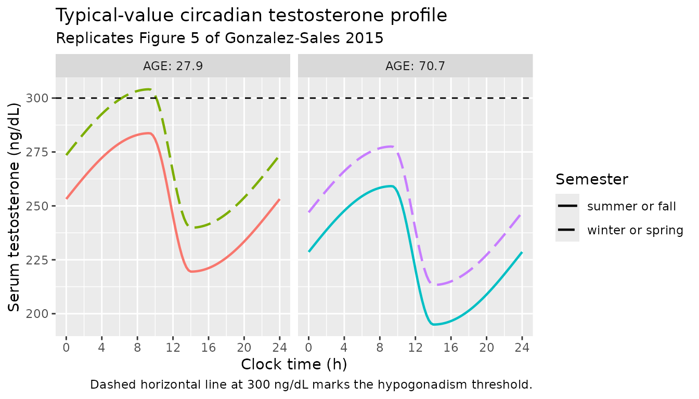
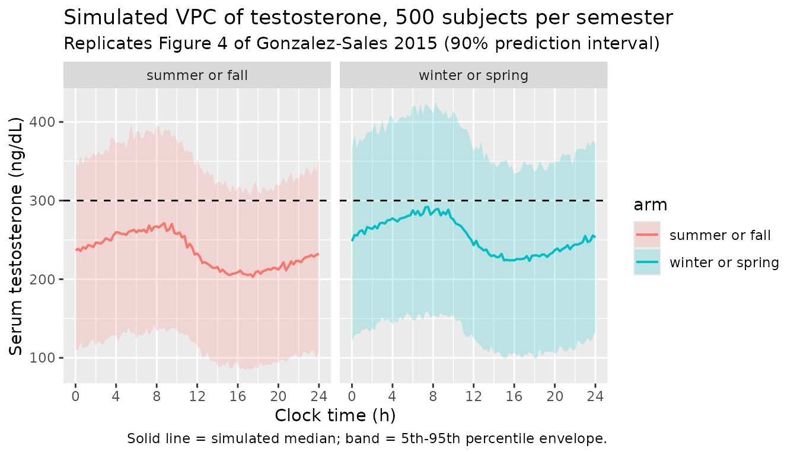

# Endogenous testosterone circadian rhythm (Gonzalez-Sales 2015)

## Model and source

- Citation: Gonzalez-Sales M, Barriere O, Tremblay PO, Nekka F,
  Desrochers J, Tanguay M. Modeling Testosterone Circadian Rhythm in
  Hypogonadal Males: Effect of Age and Circannual Variations. AAPS J.
  2016 Jan;18(1):217-227. <doi:10.1208/s12248-015-9841-6> (published
  online 2015 Nov 9).
- Description: Stretched-cosine model of the endogenous (baseline)
  circadian rhythm of serum testosterone in adult hypogonadal men
  (Gonzalez-Sales 2015 AAPS J). T(t) = Base + Amplitude \* cos(pi \*
  f(t; tacro, tnadir)) where f is the piecewise-linear phase function
  that is 0 at the peak time tacro, 1 at the nadir time tnadir, and 2 at
  the next peak; the descending arm lasts L1 = (tnadir - tacro) mod 24
  hours and the ascending arm lasts L2 = 24 - L1 hours, allowing an
  asymmetric (stretched) cycle. Baseline is reduced by 2.40% per decade
  with age (centred on the pooled median 49.9 y) and elevated by 8.09%
  during winter and spring (SEMESTER = 1) relative to summer and fall
  (SEMESTER = 0). IIV on Base enters via a Box-Cox-transformed normal
  eta (lambda = -1.93; Petersson 2009 form). Pure typical-value + IIV
  simulation model (no exogenous drug); time is clock time in hours
  after midnight.
- Article: [Gonzalez-Sales et al., AAPS J
  2016;18(1):217-227](https://doi.org/10.1208/s12248-015-9841-6) (open
  access; published online 2015 Nov 9)

This validation vignette reproduces the typical-value circadian-rhythm
behaviour of `modellib("GonzalezSales_2015_testosterone")`, the
stretched- cosine model published by Gonzalez-Sales et al. for
endogenous serum testosterone in adult hypogonadal men. The model
describes the baseline 24-hour rhythm with no exogenous drug; downstream
users couple it to a testosterone-replacement PK model to simulate the
on-treatment profile.

## Population

The model was developed from 859 hypogonadal men contributing 4556
baseline (pre-dose) serum testosterone observations across seven
internal trials at inVentiv Health (Gonzalez-Sales 2015 Table I).
Inclusion criteria were mean serum testosterone \< 300 ng/dL, individual
morning testosterone \<= 350 ng/dL, age \>= 18 y, and BMI between 18 and
37 kg/m^2. The pooled cohort had a median age of 49.9 years (range
21-76), median body weight of 87.0 kg (range 60.0-131), and was 90.6%
White, 5.8% Black, 1.2% Asian, and 2.4% other races; 22.8% identified as
Hispanic or Latino. The seven studies were conducted in Quebec,
Montreal, Toronto, North Carolina, Florida, San Antonio (TX), and
Germany. Sampling schedules covered the 24-hour clock at approximately
2-hour intervals (Gonzalez-Sales 2015 Table II); the LC/MS/MS assay had
a 59.22 pg/mL lower limit of quantification.

The same information is available programmatically via the model’s
`population` metadata:

``` r

readModelDb("GonzalezSales_2015_testosterone")()$meta$population
#> Warning: some etas defaulted to non-mu referenced, possible parsing error: etalrbase
#> as a work-around try putting the mu-referenced expression on a simple line
#> $species
#> [1] "human"
#> 
#> $n_subjects
#> [1] 859
#> 
#> $n_studies
#> [1] 7
#> 
#> $age_range
#> [1] "21-76 years (overall median 49.9)"
#> 
#> $weight_range
#> [1] "60.0-131 kg (overall median 87.0)"
#> 
#> $sex_female_pct
#> [1] 0
#> 
#> $race_ethnicity
#> White Black Asian Other 
#>  90.6   5.8   1.2   2.4 
#> 
#> $disease_state
#> [1] "Adult hypogonadal men (mean serum testosterone < 300 ng/dL; individual morning serum testosterone <= 350 ng/dL; BMI 18-37 kg/m^2). No other medical conditions."
#> 
#> $dose_range
#> [1] "n/a (endogenous baseline only; no testosterone replacement therapy was administered before the analysed samples)"
#> 
#> $regions
#> [1] "Canada (Quebec, Montreal, Toronto), United States (North Carolina, Florida, San Antonio TX), Germany"
#> 
#> $notes
#> [1] "Pooled baseline / pre-dose profiles from 7 internal hypogonadism trials at inVentiv Health (4556 testosterone observations). Sampling spanned the 24-hour clock at 2-hour intervals (Table II). 22.8% Hispanic or Latino. Race was tested as a covariate but excluded from selection because of imbalance (90.6% White). Estimation in NONMEM 7.3 via SAEM (with IMP for standard errors); 1000 non-parametric bootstrap replicates all converged."
```

## Source trace

Every `ini()` entry carries an in-file comment pointing to its source
location in the paper; the table below collects them in one place.

| Equation / parameter | Value | Source location |
|----|----|----|
| Standard cosine T(t) = Base + Amplitude \* cos(2*pi*(t - Phase)/24) | n/a | Eq. 1 + 2, p. 1 of 11 |
| Stretched cosine with piecewise phase function f(t; tmax, tmin) | n/a | Eqs. 5-9, p. 3-4 of 11 |
| Proportional residual error y_obs = y_pred \* (1 + eps), eps ~ N(0, sigma^2) | n/a | Eq. 4, p. 2 of 11 |
| Box-Cox transformation on eta_Base: eta_BC = (exp(lambda \* eta) - 1) / lambda | n/a | Eq. 10, p. 4 of 11 |
| `Base` typical value | 239 ng/dL | Table III (RSE 1.1%) |
| `Amplitude` typical value | 32.1 ng/dL | Table III (RSE 3.5%) |
| `tmax` (clock time of peak) | 9:22 = 9.3667 h | Table III (RSE 0.4%) |
| `tmin` (clock time of nadir) | 14:02 = 14.0333 h | Table III (RSE 0.4%) |
| `e_age_rbase` | -0.0240 per 10 y | Table III, Age on Base = -2.40 %/10 y (RSE 24.0%) |
| `e_semester_rbase` | 0.0809 | Table III, Season on Base = 8.09% (RSE 18.8%) |
| `boxcox_rbase` (Box-Cox lambda on eta_Base) | -1.93 | Table III (RSE 2.4%); Results paragraph 3 narrative (“close to a value of -2”) |
| `etalrbase` (var) | 0.0630 | Table III, eta_Base CV = 25.1%; var = 0.251^2 (Methods Statistical Model: “CV = sqrt(omega^2)”) |
| `etalamp` (var) | 0.2530 | Table III, eta_Amplitude CV = 50.3%; var = 0.503^2 |
| `etaltacro` (var) | 0.01124 | Table III, eta_tmax CV = 10.6%; var = 0.106^2 |
| `etaltnadir` (var) | 0.0361 | Table III, eta_tmin CV = 19.0%; var = 0.190^2 |
| `propSd` | 0.138 | Table III, sigma proportional = 13.8% CV (RSE 2.4%) |
| Reference age 49.9 y (centring for AGE-Base effect) | n/a | Table I overall median |
| SEMESTER 1 = winter or spring; 0 = summer or fall | n/a | Methods Covariate Analysis paragraph 1 |

The paper estimated correlated IIV blocks for (tmax, tmin) and
(Amplitude, Base) (Results paragraph 4) but did not publish the
numerical off-diagonal covariance values. The packaged model uses a
diagonal Omega; see “Assumptions and deviations” below.

## Units table

The model is purely algebraic in time (no ODE), so the dimensional audit
is short:

| Quantity | Units | Notes |
|----|----|----|
| `time` | hour (clock time) | `time = 0` corresponds to midnight; the model assumes the user supplies clock-hour observation times |
| `Base`, `rbase_cov`, `rbase_i` | ng/dL | testosterone concentration |
| `Amplitude`, `amp_i` | ng/dL | testosterone concentration |
| `tacro_i`, `tnadir_i`, `t24`, `L1`, `L2` | hour | clock time / interval lengths |
| `fphase`, `phase_desc`, `phase_asc` | dimensionless | piecewise-linear phase in \[0, 2\] |
| `cos(pi * fphase)` | dimensionless | the cosine argument is dimensionless because `pi * fphase` is in radians |
| `Cc = rbase_i + amp_i * cos(pi * fphase)` | ng/dL | observed serum testosterone |
| `propSd` | dimensionless (fraction) | proportional residual SD |

## Virtual cohort

Original observed data are not publicly available. The simulations below
use virtual populations whose covariate distributions approximate the
published Table I demographics.

``` r

set.seed(20150915)

make_cohort <- function(n, age, semester, id_offset = 0L) {
  tibble(
    id        = id_offset + seq_len(n),
    AGE       = age,
    SEMESTER  = semester,
    cohort    = sprintf("AGE=%.1f / SEMESTER=%d", age, semester)
  ) |>
    # 25-hour observation grid at 15-min resolution.
    tidyr::crossing(time = seq(0, 24, by = 0.25)) |>
    dplyr::mutate(evid = 0, amt = 0, cmt = "Cc") |>
    dplyr::arrange(id, time) |>
    as.data.frame()
}
```

## Replicate published figures

### Figure 5 – typical-value rhythm by age and season

Figure 5 of Gonzalez-Sales 2015 shows the model-predicted typical-value
testosterone time course for young (27.9 y) and old (70.7 y) subjects
under winter or spring vs. summer or fall season, with the 300 ng/dL
hypogonadism threshold as a horizontal reference line. We reproduce it
by zeroing out the random effects
([`rxode2::zeroRe()`](https://nlmixr2.github.io/rxode2/reference/zeroRe.html))
and simulating four typical-value cohorts.

``` r

mod <- readModelDb("GonzalezSales_2015_testosterone")
mod_typical <- rxode2::zeroRe(mod)
#> ℹ parameter labels from comments will be replaced by 'label()'
#> Warning: some etas defaulted to non-mu referenced, possible parsing error: etalrbase
#> as a work-around try putting the mu-referenced expression on a simple line
#> Warning: some etas defaulted to non-mu referenced, possible parsing error: etalrbase
#> as a work-around try putting the mu-referenced expression on a simple line

# Four typical-value cohorts (one subject each). Disjoint IDs.
events_typ <- dplyr::bind_rows(
  make_cohort(1, age = 27.9, semester = 0, id_offset =  0L),
  make_cohort(1, age = 27.9, semester = 1, id_offset =  1L),
  make_cohort(1, age = 70.7, semester = 0, id_offset =  2L),
  make_cohort(1, age = 70.7, semester = 1, id_offset =  3L)
)
stopifnot(!anyDuplicated(unique(events_typ[, c("id", "time", "evid")])))

sim_typ <- rxode2::rxSolve(mod_typical, events = events_typ,
                           keep = c("cohort", "AGE", "SEMESTER")) |>
  as.data.frame()
#> ℹ omega/sigma items treated as zero: 'etalrbase', 'etalamp', 'etaltacro', 'etaltnadir'
#> Warning: multi-subject simulation without without 'omega'

ggplot(sim_typ, aes(time, Cc, colour = cohort, linetype = factor(SEMESTER))) +
  geom_line(linewidth = 0.8) +
  geom_hline(yintercept = 300, linetype = "dashed", colour = "black") +
  scale_x_continuous("Clock time (h)", breaks = seq(0, 24, by = 4),
                     limits = c(0, 24)) +
  scale_y_continuous("Serum testosterone (ng/dL)") +
  scale_linetype_manual(values = c("0" = "solid", "1" = "longdash"),
                        labels = c("0" = "summer or fall",
                                   "1" = "winter or spring"),
                        name = "Semester") +
  guides(colour = "none") +
  facet_wrap(~ AGE, labeller = label_both) +
  labs(title = "Typical-value circadian testosterone profile",
       subtitle = "Replicates Figure 5 of Gonzalez-Sales 2015",
       caption = "Dashed horizontal line at 300 ng/dL marks the hypogonadism threshold.")
```



The paper’s qualitative claim (“the testosterone levels of a young
hypogonadal male during summer and fall will be similar to the levels of
an old hypogonadal male during winter and spring”) is checked
quantitatively below:

``` r

peak_table <- sim_typ |>
  dplyr::group_by(cohort, AGE, SEMESTER) |>
  dplyr::summarise(peak = max(Cc), nadir = min(Cc),
                   mesor = (max(Cc) + min(Cc)) / 2,
                   .groups = "drop")
knitr::kable(peak_table, digits = 1,
             caption = "Per-cohort peak, nadir, and mesor.")
```

| cohort                |  AGE | SEMESTER |  peak | nadir | mesor |
|:----------------------|-----:|---------:|------:|------:|------:|
| AGE=27.9 / SEMESTER=0 | 27.9 |        0 | 283.7 | 219.5 | 251.6 |
| AGE=27.9 / SEMESTER=1 | 27.9 |        1 | 304.1 | 239.9 | 272.0 |
| AGE=70.7 / SEMESTER=0 | 70.7 |        0 | 259.2 | 195.0 | 227.1 |
| AGE=70.7 / SEMESTER=1 | 70.7 |        1 | 277.5 | 213.3 | 245.4 |

Per-cohort peak, nadir, and mesor. {.table}

``` r


young_sf <- peak_table |>
  dplyr::filter(AGE == 27.9, SEMESTER == 0) |> dplyr::pull(mesor)
old_ws   <- peak_table |>
  dplyr::filter(AGE == 70.7, SEMESTER == 1) |> dplyr::pull(mesor)
cat(sprintf(
  paste0("Young (27.9 y) summer or fall mesor: %.2f ng/dL\n",
         "Old   (70.7 y) winter or spring mesor: %.2f ng/dL\n",
         "Difference: %.2f ng/dL (%.1f%% of typical Base 239)\n"),
  young_sf, old_ws, young_sf - old_ws, 100 * (young_sf - old_ws) / 239))
#> Young (27.9 y) summer or fall mesor: 251.62 ng/dL
#> Old   (70.7 y) winter or spring mesor: 245.44 ng/dL
#> Difference: 6.18 ng/dL (2.6% of typical Base 239)
```

### Figure 4 – VPC of testosterone with full IIV

Figure 4 of Gonzalez-Sales 2015 shows a visual predictive check of the
testosterone time course: 5th, 50th, and 95th percentiles of the model
predictions with the corresponding 90% prediction interval. We reproduce
the percentile envelope by simulating 500 virtual subjects with the
paper’s IIV (and Box-Cox-transformed eta on Base) at typical AGE = 49.9
y and a 50:50 mix of summers / falls vs winters / springs to match the
pooled-cohort distribution in Table I (42.8% winter or spring, 57.2%
summer or fall).

``` r

n_per_arm <- 500L

events_iiv <- dplyr::bind_rows(
  make_cohort(n_per_arm, age = 49.9, semester = 0L, id_offset =        0L) |>
    dplyr::mutate(arm = "summer or fall"),
  make_cohort(n_per_arm, age = 49.9, semester = 1L, id_offset = n_per_arm) |>
    dplyr::mutate(arm = "winter or spring")
)
stopifnot(!anyDuplicated(unique(events_iiv[, c("id", "time", "evid")])))

sim_iiv <- rxode2::rxSolve(mod, events = events_iiv, nSub = 1,
                           keep = c("arm", "AGE", "SEMESTER")) |>
  as.data.frame()
#> ℹ parameter labels from comments will be replaced by 'label()'
#> Warning: some etas defaulted to non-mu referenced, possible parsing error: etalrbase
#> as a work-around try putting the mu-referenced expression on a simple line

vpc_quantiles <- sim_iiv |>
  dplyr::group_by(time, arm) |>
  dplyr::summarise(
    Q05 = quantile(sim, 0.05, na.rm = TRUE),
    Q50 = quantile(sim, 0.50, na.rm = TRUE),
    Q95 = quantile(sim, 0.95, na.rm = TRUE),
    .groups = "drop"
  )

ggplot(vpc_quantiles, aes(time, Q50, fill = arm, colour = arm)) +
  geom_ribbon(aes(ymin = Q05, ymax = Q95), alpha = 0.20, colour = NA) +
  geom_line(linewidth = 0.7) +
  geom_hline(yintercept = 300, linetype = "dashed", colour = "black") +
  scale_x_continuous("Clock time (h)", breaks = seq(0, 24, by = 4),
                     limits = c(0, 24)) +
  scale_y_continuous("Serum testosterone (ng/dL)") +
  labs(title = "Simulated VPC of testosterone, 500 subjects per semester",
       subtitle = "Replicates Figure 4 of Gonzalez-Sales 2015 (90% prediction interval)",
       caption = "Solid line = simulated median; band = 5th-95th percentile envelope.") +
  facet_wrap(~ arm)
```



### Verification: paper’s quantitative claims

The paper makes three quantitative claims in the Discussion that we
verify against the typical-value simulation:

``` r

# Claim 1: typical Base = 239 ng/dL; typical Amplitude = 32.1 ng/dL.
# At t = tacro (9.367 h): Cc should equal Base + Amplitude.
ev <- et(c(9.366667, 14.033333))
ev$AGE <- 49.9; ev$SEMESTER <- 0
v <- rxode2::rxSolve(mod_typical, ev, returnType = "data.frame")
#> ℹ omega/sigma items treated as zero: 'etalrbase', 'etalamp', 'etaltacro', 'etaltnadir'
peak_predicted  <- v$Cc[1]
nadir_predicted <- v$Cc[2]

# Claim 2: "5.74 ng/dL (2.4%) every 10 years".
# Implication: Base at AGE=59.9 is 239 * (1 - 0.024) = 233.26 (Delta = 5.74).
ev2 <- et(c(0)); ev2$AGE <- 59.9; ev2$SEMESTER <- 0
v2 <- rxode2::rxSolve(mod_typical, ev2, returnType = "data.frame")
#> ℹ omega/sigma items treated as zero: 'etalrbase', 'etalamp', 'etaltacro', 'etaltnadir'
delta_per_10y <- 239 - v2$rbase_cov[1]

# Claim 3: "19.3 ng/dL (8.1%) higher during winter and spring".
# Implication: Base at SEMESTER=1 is 239 * 1.0809 = 258.34 (Delta = 19.34).
ev3 <- et(c(0)); ev3$AGE <- 49.9; ev3$SEMESTER <- 1
v3 <- rxode2::rxSolve(mod_typical, ev3, returnType = "data.frame")
#> ℹ omega/sigma items treated as zero: 'etalrbase', 'etalamp', 'etaltacro', 'etaltnadir'
delta_semester <- v3$rbase_cov[1] - 239

cat(sprintf(
  paste0("Claim 1 (peak  at typical age, summer or fall):\n",
         "  Predicted Cc at tmax = %.2f ng/dL (paper: %.1f = Base + Amplitude)\n",
         "Claim 1 (nadir at typical age, summer or fall):\n",
         "  Predicted Cc at tmin = %.2f ng/dL (paper: %.1f = Base - Amplitude)\n",
         "Claim 2 (age effect per 10 y):\n",
         "  Predicted Delta Base = %.2f ng/dL (paper: 5.74 ng/dL)\n",
         "Claim 3 (winter or spring effect):\n",
         "  Predicted Delta Base = %.2f ng/dL (paper: 19.3 ng/dL)\n"),
  peak_predicted,  239 + 32.1,
  nadir_predicted, 239 - 32.1,
  delta_per_10y,
  delta_semester))
#> Claim 1 (peak  at typical age, summer or fall):
#>   Predicted Cc at tmax = 271.10 ng/dL (paper: 271.1 = Base + Amplitude)
#> Claim 1 (nadir at typical age, summer or fall):
#>   Predicted Cc at tmin = 206.90 ng/dL (paper: 206.9 = Base - Amplitude)
#> Claim 2 (age effect per 10 y):
#>   Predicted Delta Base = 5.74 ng/dL (paper: 5.74 ng/dL)
#> Claim 3 (winter or spring effect):
#>   Predicted Delta Base = 19.34 ng/dL (paper: 19.3 ng/dL)
```

## Steady-state and continuity checks

This model is not an ODE-based turnover model, so the
`endogenous-validation.md` steady-state-hold and perturbation-recovery
checks do not directly apply (there is no state to hold or perturb). The
analogous checks for a periodic-baseline algebraic model are:

``` r

# (a) Periodicity: the rhythm should repeat exactly every 24 h.
ev_per <- et(seq(0, 72, by = 0.5))
ev_per$AGE <- 49.9; ev_per$SEMESTER <- 0
sim_per <- rxode2::rxSolve(mod_typical, ev_per, returnType = "data.frame")
#> ℹ omega/sigma items treated as zero: 'etalrbase', 'etalamp', 'etaltacro', 'etaltnadir'

T0_24  <- sim_per |> dplyr::filter(abs(time - 24) < 1e-9) |> dplyr::pull(Cc)
T24_48 <- sim_per |> dplyr::filter(abs(time - 48) < 1e-9) |> dplyr::pull(Cc)
T0_0   <- sim_per |> dplyr::filter(abs(time -  0) < 1e-9) |> dplyr::pull(Cc)

stopifnot(isTRUE(all.equal(T0_24,  T0_0,  tolerance = 1e-6)))
stopifnot(isTRUE(all.equal(T24_48, T0_0,  tolerance = 1e-6)))

# (b) Continuity across the peak/nadir transition: Cc(tmax - eps) ~= Cc(tmax + eps);
# Cc(tmin - eps) ~= Cc(tmin + eps). A discontinuity at L1 (the descending-to-ascending
# arm transition) would indicate a piecewise-phase bug.
ev_c <- et(seq(9.30, 9.42, by = 0.005))
ev_c$AGE <- 49.9; ev_c$SEMESTER <- 0
sim_c <- rxode2::rxSolve(mod_typical, ev_c, returnType = "data.frame")
#> ℹ omega/sigma items treated as zero: 'etalrbase', 'etalamp', 'etaltacro', 'etaltnadir'
cat("Continuity check across peak (tmax = 9.367 h):\n")
#> Continuity check across peak (tmax = 9.367 h):
print(sim_c[, c("time", "Cc", "fphase")])
#>     time       Cc       fphase
#> 1  9.300 271.0981 1.9965517241
#> 2  9.305 271.0984 1.9968103448
#> 3  9.310 271.0986 1.9970689655
#> 4  9.315 271.0989 1.9973275862
#> 5  9.320 271.0991 1.9975862068
#> 6  9.325 271.0993 1.9978448275
#> 7  9.330 271.0994 1.9981034482
#> 8  9.335 271.0996 1.9983620689
#> 9  9.340 271.0997 1.9986206896
#> 10 9.345 271.0998 1.9988793103
#> 11 9.350 271.0999 1.9991379310
#> 12 9.355 271.0999 1.9993965517
#> 13 9.360 271.1000 1.9996551724
#> 14 9.365 271.1000 1.9999137931
#> 15 9.370 271.0999 0.0007142857
#> 16 9.375 271.0995 0.0017857143
#> 17 9.380 271.0987 0.0028571429
#> 18 9.385 271.0976 0.0039285714
#> 19 9.390 271.0960 0.0050000000
#> 20 9.395 271.0942 0.0060714286
#> 21 9.400 271.0919 0.0071428571
#> 22 9.405 271.0893 0.0082142857
#> 23 9.410 271.0863 0.0092857143
#> 24 9.415 271.0830 0.0103571429
#> 25 9.420 271.0793 0.0114285714
```

## Assumptions and deviations

- **Correlated IIV blocks (Omega off-diagonals) reported but not
  published.** The paper estimated non-diagonal covariance entries for
  the (tmax, tmin) and (Amplitude, Base) IIV blocks (Results paragraph

  4.  but Table III reports only the diagonal CV%s. Without the off-
      diagonal numerical values we cannot reproduce the correlated
      blocks. The packaged `ini()` uses a diagonal Omega; the simulated
      VPC envelope therefore over-represents the marginal variability
      for any individual parameter pair compared with the paper’s fit.
      Users who need the correlated IIV should re-fit the model against
      their data after uncommenting the off-diagonal
      `~ c(var, cov, var)` slot or contact the paper’s authors for the
      correlation matrix.

- **CV-vs-omega convention.** The paper explicitly defines “CV =
  sqrt(omega^2)” in Methods (Statistical Model paragraph 1), so the
  reported CV% values are the standard deviations of the underlying
  normally-distributed etas themselves rather than the standard
  lognormal “sqrt(exp(omega^2) - 1)” CV form used in many popPK papers.
  This packaged model adopts the paper’s convention verbatim:
  `omega^2 = (CV / 100)^2`. Downstream users comparing this `ini()`
  against another lognormal popPK model should be aware of the
  discrepancy.

- **Box-Cox eta and mu-referenced fitting.** The IIV on Base enters as
  `eta_BC = (exp(lambda * etalrbase) - 1) / lambda` with
  `lambda = -1.93` (the paper’s “Box-Cox on Base” estimate, Table III).
  Because `etalrbase` appears inside the transformation rather than as a
  simple `exp(lrbase + etalrbase)` form, rxode2 emits a “some etas
  defaulted to non-mu referenced” warning when the UI is built. The
  warning is benign for typical-value and stochastic simulation (the
  intended use) but means SAEM / FOCEI estimation against new data will
  fall back to the non-mu-referenced path. The paper itself estimated
  this model in NONMEM 7.3 via SAEM, so the lack of mu-referencing
  matches the source’s estimation strategy.

- **Clock time convention.** The model’s `time` variable is clock time
  in hours after midnight; the event table must supply observation times
  on the 0-24 h clock (the simulation correctly wraps via the internal
  modulo for time grids spanning more than one day, as the periodicity
  check above confirms). Downstream users who couple this endogenous
  baseline to a testosterone-replacement PK model must ensure the PK
  time grid is aligned to the same clock convention.

- **SEMESTER 1 retained; SEMESTER 2 dropped.** The paper tested two
  binary indicators (Methods Covariate Analysis): `SEMESTER 1 = 1` for
  winter or spring, and `SEMESTER 2 = 1` for fall or winter. Only
  `SEMESTER 1` was retained in the final model (Results paragraph 5), so
  this is the only semester covariate in the packaged model. The
  canonical column is named `SEMESTER` (no suffix) since the second
  indicator was not retained.

- **Errata search.** No erratum file accompanies the on-disk PDF; the
  open-access AAPS Journal Crossmark record was not separately verified
  for this packaged extraction. Final parameter values match Table III
  of the main publication.

- **Race covariate excluded by the authors.** The paper explicitly did
  not test `RACE` as a covariate because the categories were unbalanced
  (90.6% White) (Results paragraph 5). The packaged model follows this
  decision and does not include race in `covariateData`.

- **Reference age 49.9 y.** Centring the AGE effect on the pooled median
  (Table I) reproduces the paper’s “-2.40 %/10 years” linear form. The
  paper’s text frames the effect as “-2.4% per decade” rather than
  naming a specific reference centring; the centring is recovered by
  anchoring the typical-value Base of 239 ng/dL to the pooled-median
  age.

- **No exogenous drug.** The packaged model has no `depot` or `central`
  compartment and no dosing events: it is a typical-value + IIV
  simulation model for the endogenous baseline only. Users who need to
  simulate a testosterone-replacement therapy profile should add the
  appropriate PK model as a separate compartment (e.g., transdermal
  testosterone gel input feeding a 1- or 2-compartment central
  compartment) and sum the exogenous contribution onto `Cc` as a
  downstream observation transformation.
