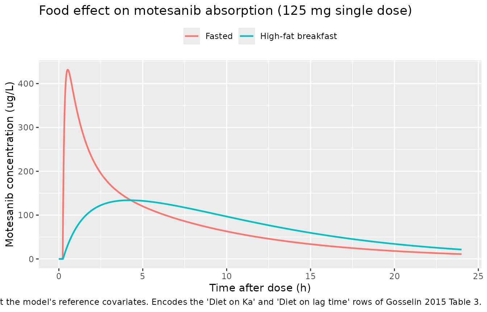
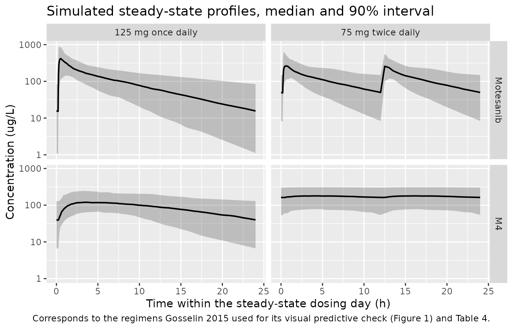

# Motesanib and its active metabolite M4 (Gosselin 2015)

## Model and source

- Citation: Gosselin N. H., Mouksassi M.-S., Lu J.-F., Hsu C.-P. (2015).
  Population pharmacokinetic modeling of motesanib and its active
  metabolite, M4, in cancer patients. Clinical Pharmacology in Drug
  Development 4(6):463-472. <doi:10.1002/cpdd.196>.
- Description: Joint parent plus metabolite population PK model for
  motesanib and its active metabolite M4 (indoline lactam) in patients
  with advanced solid tumors, pooled from 8 phase 1 to phase 3
  oral-dosing studies. Motesanib disposition is two-compartment with
  first-order absorption, an absorption lag time, and a high-fat-meal
  food effect on both the absorption rate constant and the lag time;
  apparent clearance carries a near-linear power effect of serum albumin
  plus a multiplicative sex effect, and apparent central volume carries
  power effects of albumin, alkaline phosphatase and body weight. M4 is
  described by a one-compartment model whose formation flux is the
  entire apparent elimination flux of motesanib, so its apparent
  clearance and volume are scaled by FM4 (the product of the oral
  absorbed fraction, the fraction biotransformed to M4, and the
  parent-to-metabolite molecular-weight ratio); M4 apparent clearance
  carries Asian-race and once-daily-dosing effects and M4 apparent
  volume carries sex and once-daily-dosing effects. Inter-occasion
  variability over two occasions (the first week of treatment versus the
  remaining weeks) is carried on motesanib apparent clearance and on
  both M4 disposition parameters.
- Article: <https://doi.org/10.1002/cpdd.196>

Motesanib is an orally administered multikinase inhibitor with
antiangiogenic activity. Its indoline-lactam metabolite M4 is
pharmacologically active and, at steady state, reaches systemic exposure
comparable to that of the parent, which is why M4 was monitored
clinically under the FDA metabolite-safety guidance. Gosselin 2015
pooled eight phase 1 to phase 3 studies and built the two models
**sequentially**: a two-compartment motesanib model first, then a
one-compartment M4 model driven by the post-hoc motesanib profiles.
Because the paper’s second model cannot be evaluated without the first,
both layers live in a single model file
(`inst/modeldb/specificDrugs/Gosselin_2015_motesanib.R`) with two
declared endpoints, `Cc` (motesanib) and `Cc_m4` (M4).

## Population

``` r

pop <- rxode2::rxode(readModelDb("Gosselin_2015_motesanib"))$population
#> ℹ parameter labels from comments will be replaced by 'label()'
#> Warning: some etas defaulted to non-mu referenced, possible parsing error: etaiov_cl_1, etaiov_cl_2, etaiov_cl_m4_1, etaiov_cl_m4_2, etaiov_vc_m4_1, etaiov_vc_m4_2
#> as a work-around try putting the mu-referenced expression on a simple line
```

The analysis pooled 8 clinical studies. A total of 451 patients with
advanced solid tumors entered the two models: 445 contributed motesanib
concentrations and 249 contributed M4 concentrations, of whom 6 had no
detectable motesanib concentration and so appear only in the M4 dataset
(Gosselin 2015 Results, “Patient Demographics”). M4 was measured in only
4 of the 8 studies.

Baseline characteristics (Gosselin 2015 Table 2, n = 451) were a median
body weight of 67.41 kg (5th-95th percentiles 45.0-103.8), median age
59.0 years (38.0-75.0), median serum albumin 39.0 g/L (30.0-46.0),
median alkaline phosphatase 106.0 U/L (55.0-377.9) and median creatinine
clearance 84.0 mL/min (47.0-153.1). The cohort was 232 men / 219 women
(48.6% female) and 279 White / 15 Black / 11 Hispanic / 142 Asian / 4
other, i.e. 31.5% Asian, of whom 72% were Japanese. Tumor types were
non-small cell lung cancer (54.5%), breast cancer (10.9%),
gastrointestinal stromal tumor (9.5%) and a long tail of others.

Doses ranged from 25 to 175 mg orally, given either once daily or every
12 h in 28-day cycles. The two regimens that Gosselin 2015 characterised
in detail, and that this vignette reproduces, are **125 mg once daily**
and **75 mg twice daily**.

The same information is available programmatically via
`rxode2::rxode(readModelDb("Gosselin_2015_motesanib"))$population`.

## Source trace

Every `ini()` entry in the model file carries an in-file comment naming
its source location; the table below collects them for review. All
values are the final population estimates in Gosselin 2015 Table 3,
column “Typical Values (Medians of Bootstrap)”.

| Equation / parameter | Value | Source location |
|----|----|----|
| `ltlag` | 0.229 h | Table 3, “Lag time (h)” |
| `lka` | 9.84 1/h | Table 3, “Ka (h-1)” |
| `lcl` | 62.7 L/h (men, ALB = 39 g/L) | Table 3, “CL/F (L/h) = 62.7 for men” |
| `lvc` | 240 L | Table 3, “Vc/F (L)” |
| `lq` | 93.5 L/h | Table 3, “Q/F (L/h)” |
| `lvp` | 195 L | Table 3, “Vp/F (L)” |
| `lcl_m4` | 35.8 L/h (non-Asian, twice daily) | Table 3, “CLM4/FM4 (L/h) = 35.8 for non-Asian” |
| `lvc_m4` | 1330 L (men, twice daily) | Table 3, “VM4/FM4 (L) = 1330 for men” |
| `e_alb_cl` | 0.971 | Table 3, “ALB on CL/F = (ALB/39)^0.971” |
| `e_sexf_cl` | 0.882 | Table 3, “Sex on CL/F, 0.882 for women” |
| `e_alb_vc` | 1.66 | Table 3, “ALB on Vc/F = (ALB/39)^1.66” |
| `e_alp_vc` | -0.217 | Table 3, “ALP on Vc/F = (ALP/101)^-0.217” |
| `e_wt_vc` | 0.612 | Table 3, “WT on Vc/F = (WT/68.3)^0.612” |
| `e_fed_highfat_ka` | 0.0245 | Table 3, “Diet on Ka” |
| `e_fed_highfat_tlag` | 1.079 | Table 3, “Diet on lag time” |
| `e_race_asian_cl_m4` | 1.4 | Table 3, “Asian on CLM4/FM4, 1.4 for Asian” |
| `e_regi_qd_cl_m4` | 1.52 | Table 3, “Dosing interval on CLM4/FM4, 1.52 for once-daily dose” |
| `e_sexf_vc_m4` | 0.57 | Table 3, “Sex on VM4/FM4, 0.57 for women” |
| `e_regi_qd_vc_m4` | 0.45 | Table 3, “Dosing interval on VM4/FM4, 0.45 for once-daily dose” |
| IIV variances (`etalka` … `etalvc_m4`) | 178, 35.9, 49.5, 37.8, 33.3, 35.2, 37.0 % | Table 3, “IIV on … (%)” rows |
| IOV variances (`etaiov_*`) | 18.1, 24.5, 53.9 % | Table 3, “IOV on … (%)” rows |
| `addSd`, `propSd` | 0.334 ug/L, 47.3 % (both FIX) | Table 3 motesanib “Additive error”, “Proportional error” |
| `addSd_m4`, `propSd_m4` | 4.82 ug/L, 44.8 % (both FIX) | Table 3 M4 “Additive error”, “Proportional error” |
| 2-compartment parent, first-order absorption + lag, food effect on Ka and lag | n/a | Results, “Population PK Modeling of Motesanib”; Discussion paragraph 2 |
| 1-compartment M4, formation from the whole apparent parent elimination flux | n/a | Methods, “PK Model Buildup of M4” |
| Two-occasion IOV (week 1 vs the remaining weeks) | n/a | Results, “Population PK Modeling of M4”; Table 4 footnote |
| Covariate stepwise search (P \< .01 forward, P \< .005 backward) | n/a | Methods; Supplement Table 1 |

### Two glyph-level readings that had to be resolved

Table 3 of the published PDF renders two characters in a symbol font
that a text extraction loses:

- Every **categorical** covariate row begins with a multiplication sign,
  so the estimate is a multiplicative factor rather than an additive
  shift. The paper’s own supplement states the rule (“the estimate for
  continuous covariate is the exponent of the power function and the
  estimate for categorical covariate is the multiplicative factor”) and
  its Supplement Table 1 prints the surviving glyphs, “x 0.327” and
  “x1.52”.
- `ALP on Vc/F` begins with a minus sign, so the exponent is -0.217. The
  bootstrap median printed in the same cell, “(-0.218)”, keeps its sign,
  and the Results text describes “a negative trend between EBEs of Vc/F
  and ALP”.

Both readings are confirmed arithmetically below: they are the only
readings that reproduce the four half-lives the paper reports.

One further Table 3 cell is a typographical error in the source. The
bootstrap median for the sex effect on CL/F prints as “(0.0882)” beside
a typical value of 0.882. The typical value is correct: 62.7 x 0.882 =
55.3 L/h, exactly the pair “62.7 vs 55.3 L/h” that the Discussion
quotes, and it is the value that yields the reported 6.20 h female
terminal half-life.

## Structural identities against the published typical values

Gosselin 2015 publishes four typical-value half-lives and a footnote
fixing the reference dosing regimen. These are exact, deterministic
consequences of the parameter table, so they are asserted tightly here:
any transcription error in CL/F, Vc/F, Q/F, Vp/F, the sex factors, or
the metabolite parameters moves them immediately.

``` r

mod <- readModelDb("Gosselin_2015_motesanib")
mod_typ <- rxode2::zeroRe(mod)
#> ℹ parameter labels from comments will be replaced by 'label()'
#> Warning: some etas defaulted to non-mu referenced, possible parsing error: etaiov_cl_1, etaiov_cl_2, etaiov_cl_m4_1, etaiov_cl_m4_2, etaiov_vc_m4_1, etaiov_vc_m4_2
#> as a work-around try putting the mu-referenced expression on a simple line
#> Warning: some etas defaulted to non-mu referenced, possible parsing error: etaiov_cl_1, etaiov_cl_2, etaiov_cl_m4_1, etaiov_cl_m4_2, etaiov_vc_m4_1, etaiov_vc_m4_2
#> as a work-around try putting the mu-referenced expression on a simple line

# Reference covariate values: the model's own centring points, a non-Asian
# patient, fasted, occasion 1.
ref_cov <- list(ALB = 39, ALP = 101, WT = 68.3, RACE_ASIAN = 0,
                FED_HIGHFAT = 0, OCC = 1)

# Build one subject's event table. Both dose and observation rows name a real
# ODE state (`depot` / `central`); the observation rows additionally carry
# `dvid = 1L`. This model has four ODE states and two `~` endpoints, so rxode2
# allocates endpoint slots after the state slots -- naming the state and
# supplying dvid keeps the mapping unambiguous, and rxode2 still returns both
# `Cc` and `Cc_m4` as columns on those rows. Naming an algebraic observable
# (`cmt = "Cc"`) would instead auto-inject a compartment slot for it and
# renumber the states.
make_subject <- function(id, SEXF, REGI_QD, dose, ii, n_dose, obs_times,
                         cov = ref_cov) {
  dose_rows <- data.frame(
    id = id, time = seq(0, by = ii, length.out = n_dose),
    amt = dose, evid = 1L, cmt = "depot", dvid = NA_integer_
  )
  obs_rows <- data.frame(
    id = id, time = obs_times,
    amt = NA_real_, evid = 0L, cmt = "central", dvid = 1L
  )
  out <- rbind(dose_rows, obs_rows)
  out <- out[order(out$time, -out$evid), ]
  out$SEXF <- SEXF
  out$REGI_QD <- REGI_QD
  for (nm in names(cov)) out[[nm]] <- cov[[nm]]
  out
}

solve_check <- function(ev, mdl = mod_typ) {
  out <- rxode2::rxSolve(
    mdl, ev, useLinCmt = FALSE, atol = 1e-12, rtol = 1e-10,
    maxsteps = 1e7, returnType = "data.frame"
  )
  # rxSolve returns NA (not an error) when the solver runs out of steps.
  stopifnot(!anyNA(out$Cc), !anyNA(out$Cc_m4))
  if (is.null(out$id)) out$id <- 1L
  out
}

# Terminal slope over a window well clear of the distribution phase.
terminal_half_life <- function(d, col, lo, hi) {
  w <- d[d$time >= lo & d$time <= hi, ]
  log(2) / -stats::coef(stats::lm(log(w[[col]]) ~ w$time))[[2]]
}

single_dose <- rbind(
  make_subject(1L, SEXF = 0, REGI_QD = 0, dose = 125, ii = 24, n_dose = 1,
               obs_times = seq(0.3, 600, by = 0.1)),
  make_subject(2L, SEXF = 1, REGI_QD = 0, dose = 125, ii = 24, n_dose = 1,
               obs_times = seq(0.3, 600, by = 0.1))
)
sd_sim <- solve_check(single_dose)
#> ℹ omega/sigma items treated as zero: 'etalka', 'etalcl', 'etalvc', 'etalq', 'etalvp', 'etalcl_m4', 'etalvc_m4', 'etaiov_cl_1', 'etaiov_cl_2', 'etaiov_cl_m4_1', 'etaiov_cl_m4_2', 'etaiov_vc_m4_1', 'etaiov_vc_m4_2'
#> Warning: multi-subject simulation without without 'omega'
men <- sd_sim[sd_sim$id == 1, ]
women <- sd_sim[sd_sim$id == 2, ]

half_lives <- tibble::tibble(
  Quantity = c("Motesanib terminal t1/2, men", "Motesanib terminal t1/2, women",
               "M4 t1/2, non-Asian men (twice daily)",
               "M4 t1/2, non-Asian women (twice daily)"),
  Simulated = c(
    terminal_half_life(men, "Cc", 40, 90),
    terminal_half_life(women, "Cc", 40, 90),
    terminal_half_life(men, "Cc_m4", 250, 550),
    terminal_half_life(women, "Cc_m4", 150, 350)
  ),
  Published = c(5.57, 6.20, 25.7, 14.7)
) |>
  mutate(`Difference (%)` = 100 * (Simulated - Published) / Published)

knitr::kable(half_lives, digits = c(0, 3, 2, 2),
             caption = paste("Typical-value half-lives against Gosselin 2015",
                             "Results text and the Table 3 footnote."))
```

| Quantity                               | Simulated | Published | Difference (%) |
|:---------------------------------------|----------:|----------:|---------------:|
| Motesanib terminal t1/2, men           |     5.565 |      5.57 |          -0.08 |
| Motesanib terminal t1/2, women         |     6.196 |      6.20 |          -0.06 |
| M4 t1/2, non-Asian men (twice daily)   |    25.751 |     25.70 |           0.20 |
| M4 t1/2, non-Asian women (twice daily) |    14.678 |     14.70 |          -0.15 |

Typical-value half-lives against Gosselin 2015 Results text and the
Table 3 footnote. {.table style="width:100%;"}

``` r


# The published values are quoted to 3 significant figures, so 0.5% is the
# tightest bound the rounding supports.
stopifnot(all(abs(half_lives$`Difference (%)`) < 0.5))
```

The M4 half-lives pin the reference orientation of the dosing-frequency
covariate. The Table 3 footnote gives them “for twice-daily
administration”, and they are reproduced by the **unmodified** typical
values, `log(2) * 1330 / 35.8` = 25.7 h and
`log(2) * (1330 * 0.57) / 35.8` = 14.7 h. Twice-daily dosing is
therefore the reference arm and the 1.52 / 0.45 factors belong to
once-daily dosing, which is why the model file carries a `REGI_QD`
indicator rather than the complementary `REGI_BID`.

The second structural identity is the metabolite formation flux. Because
M4 was fitted sequentially on the post-hoc parent profile, and because
`FM4` absorbs the absorbed fraction, the fraction metabolised and the
molecular-weight ratio all at once, the whole apparent parent
elimination flux enters the M4 compartment. The steady-state consequence
is exact and does not involve the parent clearance at all:

``` math
\mathrm{AUC}_{0-24,ss}^{M4} = \frac{D_{24}}{CL_{M4}/F_{M4}}, \qquad
  \mathrm{AUC}_{0-24,ss}^{\text{motesanib}} = \frac{D_{24}}{CL/F}
```

``` r

# One steady-state 24 h window at a fine grid, for each of the two regimens.
auc_window <- function(regimen) {
  if (regimen == "125 mg once daily") {
    ii <- 24; dose <- 125; qd <- 1
  } else {
    ii <- 12; dose <- 75; qd <- 0
  }
  n_dose <- 28 * (24 / ii)
  # The 24 h window must contain a FULL day of dosing, i.e. 24/ii doses, or the
  # identity is being asserted against the wrong daily dose. Starting at the
  # LAST dose would put only one 75 mg dose in the twice-daily arm's window and
  # halve its AUC(0-24) relative to dose * 24/ii. Both arms therefore start at
  # 648 h, the 28th day of a 28-day cycle -- the same window the cohort
  # simulation below uses.
  t_start <- (n_dose - 24 / ii) * ii
  stopifnot(t_start == 648)
  ev <- make_subject(1L, SEXF = 0, REGI_QD = qd, dose = dose, ii = ii,
                     n_dose = n_dose,
                     obs_times = seq(t_start, t_start + 24, by = 0.01))
  d <- solve_check(ev)
  d <- d[d$time >= t_start, ]
  trapz <- function(x, y) sum(diff(x) * (utils::head(y, -1) + utils::tail(y, -1)) / 2)
  cl_i <- unique(signif(d$cl, 10))
  cl_m4_i <- unique(signif(d$cl_m4, 10))
  # One subject at fixed covariates: both must be single-valued, or the
  # division below would silently recycle.
  stopifnot(length(cl_i) == 1L, length(cl_m4_i) == 1L)
  tibble::tibble(
    Regimen = regimen,
    `Daily dose (mg)` = dose * 24 / ii,
    `Motesanib AUC0-24 (mg*h/L)` = trapz(d$time, d$Cc) / 1000,
    `Dose/(CL/F)` = dose * 24 / ii / cl_i,
    `M4 AUC0-24 (mg*h/L)` = trapz(d$time, d$Cc_m4) / 1000,
    `Dose/(CLM4/FM4)` = dose * 24 / ii / cl_m4_i
  )
}

identity_tbl <- dplyr::bind_rows(
  auc_window("125 mg once daily"),
  auc_window("75 mg twice daily")
)
#> ℹ omega/sigma items treated as zero: 'etalka', 'etalcl', 'etalvc', 'etalq', 'etalvp', 'etalcl_m4', 'etalvc_m4', 'etaiov_cl_1', 'etaiov_cl_2', 'etaiov_cl_m4_1', 'etaiov_cl_m4_2', 'etaiov_vc_m4_1', 'etaiov_vc_m4_2'
#> ℹ omega/sigma items treated as zero: 'etalka', 'etalcl', 'etalvc', 'etalq', 'etalvp', 'etalcl_m4', 'etalvc_m4', 'etaiov_cl_1', 'etaiov_cl_2', 'etaiov_cl_m4_1', 'etaiov_cl_m4_2', 'etaiov_vc_m4_1', 'etaiov_vc_m4_2'

knitr::kable(identity_tbl, digits = 4,
             caption = paste("Steady-state exposure identities for a typical",
                             "non-Asian man at the model's reference covariates."))
```

| Regimen | Daily dose (mg) | Motesanib AUC0-24 (mg\*h/L) | Dose/(CL/F) | M4 AUC0-24 (mg\*h/L) | Dose/(CLM4/FM4) |
|:---|---:|---:|---:|---:|---:|
| 125 mg once daily | 125 | 1.9936 | 1.9936 | 2.2971 | 2.2971 |
| 75 mg twice daily | 150 | 2.3923 | 2.3923 | 4.1899 | 4.1899 |

Steady-state exposure identities for a typical non-Asian man at the
model’s reference covariates. {.table}

``` r


# Pure numerical (trapezoidal) error against a closed form: a tight bound is
# correct here because both sides use the same drawn parameters.
stopifnot(
  max(abs(identity_tbl$`Motesanib AUC0-24 (mg*h/L)` /
            identity_tbl$`Dose/(CL/F)` - 1)) < 1e-3,
  max(abs(identity_tbl$`M4 AUC0-24 (mg*h/L)` /
            identity_tbl$`Dose/(CLM4/FM4)` - 1)) < 1e-3
)
```

The M4 identity is the strongest available check on the formation term:
it holds only if the flux entering `central_m4` is `cl * central / vc`
in full. A model that instead routed some fraction of the parent
clearance to M4 would fail it by that fraction.

## Food effect on absorption

Gosselin 2015 assessed food in 10 patients dosed 5 minutes after a
standardized high-fat, high-caloric breakfast, and retained
multiplicative effects on both the absorption rate constant (x 0.0245)
and the lag time (x 1.079). The practical consequence is a near-complete
conversion from a rapid-absorption to a flip-flop profile.

``` r

food_ev <- rbind(
  make_subject(1L, SEXF = 0, REGI_QD = 1, dose = 125, ii = 24, n_dose = 1,
               obs_times = seq(0, 24, by = 0.01),
               cov = utils::modifyList(ref_cov, list(FED_HIGHFAT = 0))),
  make_subject(2L, SEXF = 0, REGI_QD = 1, dose = 125, ii = 24, n_dose = 1,
               obs_times = seq(0, 24, by = 0.01),
               cov = utils::modifyList(ref_cov, list(FED_HIGHFAT = 1)))
)
food_sim <- solve_check(food_ev) |>
  mutate(Condition = ifelse(id == 1, "Fasted", "High-fat breakfast"))
#> ℹ omega/sigma items treated as zero: 'etalka', 'etalcl', 'etalvc', 'etalq', 'etalvp', 'etalcl_m4', 'etalvc_m4', 'etaiov_cl_1', 'etaiov_cl_2', 'etaiov_cl_m4_1', 'etaiov_cl_m4_2', 'etaiov_vc_m4_1', 'etaiov_vc_m4_2'
#> Warning: multi-subject simulation without without 'omega'

food_summary <- food_sim |>
  group_by(Condition) |>
  summarise(
    `Lag time (h)` = min(time[Cc > 1e-10]),
    `Ka (1/h)` = mean(ka),
    `Tmax (h)` = time[which.max(Cc)],
    `Cmax (ug/L)` = max(Cc),
    .groups = "drop"
  )
knitr::kable(food_summary, digits = 3,
             caption = "Single 125 mg dose, typical non-Asian man, fasted vs fed.")
```

| Condition          | Lag time (h) | Ka (1/h) | Tmax (h) | Cmax (ug/L) |
|:-------------------|-------------:|---------:|---------:|------------:|
| Fasted             |         0.23 |    9.840 |     0.53 |     431.709 |
| High-fat breakfast |         0.25 |    0.241 |     4.21 |     133.885 |

Single 125 mg dose, typical non-Asian man, fasted vs fed. {.table}

``` r


stopifnot(
  # Lag time: 0.229 h fasted, 0.229 * 1.079 = 0.247 h fed, resolved on a
  # 0.01 h grid.
  abs(food_summary$`Lag time (h)`[food_summary$Condition == "Fasted"] - 0.229) < 0.011,
  abs(food_summary$`Lag time (h)`[food_summary$Condition == "High-fat breakfast"] -
        0.229 * 1.079) < 0.011,
  # Ka: 9.84 fasted, 9.84 * 0.0245 = 0.2411 fed.
  abs(food_summary$`Ka (1/h)`[food_summary$Condition == "Fasted"] - 9.84) < 1e-6,
  abs(food_summary$`Ka (1/h)`[food_summary$Condition == "High-fat breakfast"] -
        9.84 * 0.0245) < 1e-6,
  # Fasted Tmax reproduces "maximum concentrations of motesanib are rapidly
  # reached (about 30 minutes after the dose)" (Gosselin 2015 Results).
  abs(food_summary$`Tmax (h)`[food_summary$Condition == "Fasted"] - 0.5) < 0.1
)
```

``` r

ggplot(food_sim, aes(time, Cc, colour = Condition)) +
  geom_line(linewidth = 0.8) +
  labs(x = "Time after dose (h)", y = "Motesanib concentration (ug/L)",
       colour = NULL,
       title = "Food effect on motesanib absorption (125 mg single dose)",
       caption = paste("Typical non-Asian man at the model's reference",
                       "covariates. Encodes the 'Diet on Ka' and 'Diet on lag",
                       "time' rows of Gosselin 2015 Table 3.")) +
  theme(legend.position = "top")
```



## Virtual cohort

Original observed data are not publicly available, so the cohort below
draws covariates to approximate the Gosselin 2015 Table 2 demographics.
Two arms of 200 subjects each are simulated: the two regimens for which
Gosselin 2015 Table 4 reports steady-state exposure.

``` r

set.seed(20150196)

n_arm <- 200L

# Table 2 medians and 5th-95th percentiles. Weight and alkaline phosphatase
# are right-skewed and are drawn log-normal; albumin is drawn normal and
# truncated to the range the paper observed (22-55 g/L, Figure 2 legend).
draw_covariates <- function(n, id_offset) {
  wt <- stats::rlnorm(n, meanlog = log(67.41),
                      sdlog = (log(103.8) - log(45.0)) / (2 * stats::qnorm(0.95)))
  alp <- stats::rlnorm(n, meanlog = log(106.0),
                       sdlog = (log(377.9) - log(55.0)) / (2 * stats::qnorm(0.95)))
  alb <- pmin(pmax(stats::rnorm(n, mean = 39.0,
                                sd = (46.0 - 30.0) / (2 * stats::qnorm(0.95))),
                   22), 55)
  tibble::tibble(
    id = id_offset + seq_len(n),
    WT = wt,
    ALP = alp,
    ALB = alb,
    SEXF = stats::rbinom(n, 1L, 219 / 451),      # 219 of 451 patients were women
    RACE_ASIAN = stats::rbinom(n, 1L, 142 / 451), # 142 of 451 patients were Asian
    FED_HIGHFAT = 0,  # all Table 4 regimens were taken fasted
    OCC = 1           # Table 4 footnote: "the post hoc values of first week"
  )
}

# 28-day cycle: dose to the end of cycle 1 and read the final 24 h window, plus
# the first 24 h window so the accumulation index can be computed.
window_times <- c(seq(0, 3, by = 0.05), seq(3.25, 12, by = 0.25),
                  seq(12.5, 24, by = 0.5))

# The steady-state window must contain a FULL 24 h of dosing, i.e. 24/ii doses.
# Starting it at the last dose would give the twice-daily arm only one dose in a
# 24 h interval and halve its AUC(0-24). Both arms therefore start their window
# at 648 h (the 28th day of a 28-day cycle).
ss_window_start <- 648

make_arm <- function(label, dose, ii, qd, id_offset) {
  n_dose <- as.integer(28 * 24 / ii)
  stopifnot(ss_window_start == (n_dose - 24 / ii) * ii)
  cov <- draw_covariates(n_arm, id_offset) |> mutate(REGI_QD = qd, regimen = label)
  doses <- cov |>
    tidyr::crossing(time = seq(0, by = ii, length.out = n_dose)) |>
    mutate(amt = dose, evid = 1L, cmt = "depot", dvid = NA_integer_)
  obs <- cov |>
    tidyr::crossing(time = c(window_times, ss_window_start + window_times)) |>
    mutate(amt = NA_real_, evid = 0L, cmt = "central", dvid = 1L)
  dplyr::bind_rows(doses, obs) |>
    dplyr::arrange(id, time, dplyr::desc(evid))
}

events <- dplyr::bind_rows(
  make_arm("125 mg once daily", dose = 125, ii = 24, qd = 1, id_offset = 0L),
  make_arm("75 mg twice daily", dose = 75, ii = 12, qd = 0, id_offset = 1000L)
)

# Disjoint IDs across arms are mandatory: rxSolve keys subjects on id, so an id
# reused by the second arm would silently merge the two arms' dose records into
# one subject. Assert it directly -- each id must belong to exactly one regimen,
# and both arms must be present at full size.
id_arm <- dplyr::distinct(events, id, regimen)
stopifnot(
  nrow(id_arm) == dplyr::n_distinct(events$id),
  dplyr::n_distinct(events$id) == 2L * n_arm,
  all(table(id_arm$regimen) == n_arm)
)

events |>
  dplyr::distinct(id, regimen, WT, ALB, ALP, SEXF, RACE_ASIAN) |>
  group_by(regimen) |>
  summarise(
    n = dplyr::n(),
    `Weight (kg), median` = stats::median(WT),
    `Albumin (g/L), median` = stats::median(ALB),
    `ALP (U/L), median` = stats::median(ALP),
    `Female (%)` = 100 * mean(SEXF),
    `Asian (%)` = 100 * mean(RACE_ASIAN),
    .groups = "drop"
  ) |>
  knitr::kable(digits = 1, caption = "Simulated cohort against Gosselin 2015 Table 2 (67.41 kg, 39.0 g/L, 106.0 U/L, 48.6% female, 31.5% Asian).")
```

| regimen | n | Weight (kg), median | Albumin (g/L), median | ALP (U/L), median | Female (%) | Asian (%) |
|:---|---:|---:|---:|---:|---:|---:|
| 125 mg once daily | 200 | 66.2 | 39.7 | 106.0 | 43 | 31 |
| 75 mg twice daily | 200 | 68.1 | 39.0 | 106.4 | 58 | 33 |

Simulated cohort against Gosselin 2015 Table 2 (67.41 kg, 39.0 g/L,
106.0 U/L, 48.6% female, 31.5% Asian). {.table}

## Simulation

``` r

sim <- rxode2::rxSolve(
  mod, events,
  keep = c("regimen", "WT", "ALB", "ALP", "SEXF", "RACE_ASIAN"),
  useLinCmt = FALSE, maxsteps = 1e7, returnType = "data.frame"
)
#> ℹ parameter labels from comments will be replaced by 'label()'
#> Warning: some etas defaulted to non-mu referenced, possible parsing error: etaiov_cl_1, etaiov_cl_2, etaiov_cl_m4_1, etaiov_cl_m4_2, etaiov_vc_m4_1, etaiov_vc_m4_2
#> as a work-around try putting the mu-referenced expression on a simple line
stopifnot(!anyNA(sim$Cc), !anyNA(sim$Cc_m4))

sim <- sim |>
  mutate(
    regimen = as.character(regimen),
    window = ifelse(time <= 24, "First 24 h", "Steady state (cycle 1 day 28)"),
    tad_window = ifelse(time <= 24, time, time - ss_window_start)
  )
```

`useLinCmt = FALSE` is passed defensively. The metabolite compartment is
driven by the parent’s elimination flux (`cl * central / vc`), so the
system is not a closed-form linear one and must be integrated as
written; forcing the ODE path makes that explicit rather than relying on
rxode2 declining the solved-model conversion on its own.

## Steady-state concentration-time profiles

Gosselin 2015 Figure 1 is a visual predictive check of motesanib plasma
concentrations. The observed data underlying it are not available, so
the panels below show the simulated median and 90% prediction interval
for both analytes over one steady-state dosing day.

``` r

sim |>
  filter(window == "Steady state (cycle 1 day 28)") |>
  select(regimen, tad_window, Motesanib = Cc, M4 = Cc_m4) |>
  tidyr::pivot_longer(c(Motesanib, M4), names_to = "Analyte", values_to = "conc") |>
  group_by(regimen, Analyte, tad_window) |>
  summarise(
    Q05 = stats::quantile(conc, 0.05),
    Q50 = stats::quantile(conc, 0.50),
    Q95 = stats::quantile(conc, 0.95),
    .groups = "drop"
  ) |>
  mutate(Analyte = factor(Analyte, levels = c("Motesanib", "M4"))) |>
  ggplot(aes(tad_window, Q50)) +
  geom_ribbon(aes(ymin = Q05, ymax = Q95), alpha = 0.25) +
  geom_line(linewidth = 0.7) +
  facet_grid(Analyte ~ regimen) +
  scale_y_log10() +
  labs(x = "Time within the steady-state dosing day (h)",
       y = "Concentration (ug/L)",
       title = "Simulated steady-state profiles, median and 90% interval",
       caption = paste("Corresponds to the regimens Gosselin 2015 used for its",
                       "visual predictive check (Figure 1) and Table 4."))
```



The two analytes have visibly different shapes: motesanib peaks within
about 30 minutes and falls to a low trough, while M4 accumulates to a
much flatter profile because its half-life is several times longer. The
paper makes the same point, noting that maximum M4 concentrations are
reached about 7 hours after the dose.

## PKNCA validation

One PKNCA pass per analyte, over two intervals per subject: the first 24
h and the steady-state 24 h window. Gosselin 2015 Table 4 reports Cmin,
Cmax and AUC(0-24), so those are the parameters requested.

``` r

run_nca <- function(conc_col) {
  conc_df <- sim |>
    filter(!is.na(.data[[conc_col]])) |>
    transmute(id, regimen, time, Cc = .data[[conc_col]])

  # Guarantee a time-zero row per subject; for an extravascular first dose the
  # pre-dose concentration is 0.
  conc_df <- dplyr::bind_rows(
    conc_df,
    conc_df |> dplyr::distinct(id, regimen) |> mutate(time = 0, Cc = 0)
  ) |>
    dplyr::distinct(id, regimen, time, .keep_all = TRUE) |>
    dplyr::arrange(id, regimen, time)

  dose_df <- events |>
    filter(evid == 1) |>
    select(id, regimen, time, amt)

  conc_obj <- PKNCA::PKNCAconc(conc_df, Cc ~ time | regimen + id)
  dose_obj <- PKNCA::PKNCAdose(dose_df, amt ~ time | regimen + id)

  intervals <- conc_df |>
    dplyr::distinct(id, regimen) |>
    tidyr::crossing(start = c(0, ss_window_start)) |>
    mutate(end = start + 24, cmax = TRUE, cmin = TRUE, auclast = TRUE) |>
    as.data.frame()

  res <- PKNCA::pk.nca(PKNCA::PKNCAdata(conc_obj, dose_obj, intervals = intervals))
  as.data.frame(res)
}

nca_parent <- run_nca("Cc")
nca_m4 <- run_nca("Cc_m4")

stopifnot(nrow(nca_parent) > 0, nrow(nca_m4) > 0)
```

``` r

summarise_nca <- function(nca_df, analyte) {
  nca_df |>
    filter(!is.na(PPORRES)) |>
    mutate(
      window = ifelse(start == 0, "First 24 h", "Steady state"),
      Analyte = analyte
    ) |>
    select(Analyte, regimen, window, id, PPTESTCD, PPORRES)
}

nca_all <- dplyr::bind_rows(
  summarise_nca(nca_parent, "Motesanib"),
  summarise_nca(nca_m4, "M4")
)

# PKNCA works in the concentration unit of the model (ug/L), so auclast comes
# back as ug*h/L; Gosselin 2015 Table 4 reports AUC in mg*h/L.
nca_ss <- nca_all |>
  filter(window == "Steady state") |>
  tidyr::pivot_wider(names_from = PPTESTCD, values_from = PPORRES) |>
  mutate(auclast = auclast / 1000)
```

### Comparison against published NCA

Gosselin 2015 Table 4 reports the **mean** (with %CV) of individual
post-hoc exposure parameters.
[`ncaComparisonTable()`](https://nlmixr2.github.io/nlmixr2lib/reference/ncaComparisonTable.md)
aggregates by median, so the simulated side is pre-aggregated to arm
means here, one row per arm, so that the two sides are scored on the
same statistic.

``` r

sim_means <- nca_ss |>
  mutate(group = paste(Analyte, regimen, sep = ", ")) |>
  group_by(group) |>
  summarise(cmax = mean(cmax), cmin = mean(cmin), auclast = mean(auclast),
            .groups = "drop")

published <- tibble::tribble(
  ~group,                            ~cmin,  ~cmax,  ~auclast,
  "Motesanib, 125 mg once daily",     19.00, 493.40, 2.31,
  "Motesanib, 75 mg twice daily",     63.31, 331.70, 3.09,
  "M4, 125 mg once daily",            47.17, 140.00, 2.27,
  "M4, 75 mg twice daily",           150.30, 169.00, 3.90
)

cmp <- nlmixr2lib::ncaComparisonTable(
  simulated = sim_means,
  reference = published,
  by = "group",
  units = c(cmin = "ug/L", cmax = "ug/L", auclast = "mg*h/L"),
  tolerance_pct = 25
)

knitr::kable(
  cmp,
  caption = paste("Simulated arm means vs Gosselin 2015 Table 4 means.",
                  "* differs from the reference by more than 25%."),
  digits = 2
)
```

| NCA parameter     | group                        | Reference | Simulated | % diff   |
|:------------------|:-----------------------------|:----------|:----------|:---------|
| Cmax (ug/L)       | Motesanib, 125 mg once daily | 493       | 495       | +0.3%    |
| Cmax (ug/L)       | Motesanib, 75 mg twice daily | 332       | 328       | -1.1%    |
| Cmax (ug/L)       | M4, 125 mg once daily        | 140       | 138       | -1.5%    |
| Cmax (ug/L)       | M4, 75 mg twice daily        | 169       | 189       | +11.8%   |
| Cmin (ug/L)       | Motesanib, 125 mg once daily | 19        | 26        | +36.9%\* |
| Cmin (ug/L)       | Motesanib, 75 mg twice daily | 63.3      | 58.1      | -8.3%    |
| Cmin (ug/L)       | M4, 125 mg once daily        | 47.2      | 51.2      | +8.6%    |
| Cmin (ug/L)       | M4, 75 mg twice daily        | 150       | 167       | +11.1%   |
| AUClast (mg\*h/L) | Motesanib, 125 mg once daily | 2.31      | 2.38      | +3.2%    |
| AUClast (mg\*h/L) | Motesanib, 75 mg twice daily | 3.09      | 2.9       | -6.2%    |
| AUClast (mg\*h/L) | M4, 125 mg once daily        | 2.27      | 2.25      | -1.0%    |
| AUClast (mg\*h/L) | M4, 75 mg twice daily        | 3.9       | 4.34      | +11.2%   |

Simulated arm means vs Gosselin 2015 Table 4 means. \* differs from the
reference by more than 25%. {.table}

``` r

pct_diff <- nca_ss |>
  mutate(group = paste(Analyte, regimen, sep = ", ")) |>
  group_by(group) |>
  summarise(cmax = mean(cmax), auclast = mean(auclast), .groups = "drop") |>
  left_join(published |> select(group, ref_cmax = cmax, ref_auc = auclast),
            by = "group") |>
  mutate(auc_pct = 100 * (auclast - ref_auc) / ref_auc,
         cmax_pct = 100 * (cmax - ref_cmax) / ref_cmax)

knitr::kable(pct_diff, digits = 1,
             caption = "Percent difference of the simulated arm mean from the published mean.")
```

| group                        |  cmax | auclast | ref_cmax | ref_auc | auc_pct | cmax_pct |
|:-----------------------------|------:|--------:|---------:|--------:|--------:|---------:|
| M4, 125 mg once daily        | 137.9 |     2.2 |    140.0 |     2.3 |    -1.0 |     -1.5 |
| M4, 75 mg twice daily        | 188.9 |     4.3 |    169.0 |     3.9 |    11.2 |     11.8 |
| Motesanib, 125 mg once daily | 494.8 |     2.4 |    493.4 |     2.3 |     3.2 |      0.3 |
| Motesanib, 75 mg twice daily | 328.2 |     2.9 |    331.7 |     3.1 |    -6.2 |     -1.1 |

Percent difference of the simulated arm mean from the published mean.
{.table style="width:100%;"}

``` r


# AUC is the structural quantity: it is dose / clearance per subject, so a
# mis-transcribed clearance, dose or unit moves every arm at once. The residual
# spread here comes from the covariate draw and from EBE shrinkage in the
# published post-hoc statistics, not from the model.
stopifnot(all(abs(pct_diff$auc_pct) < 25))
# Cmax additionally reflects the volume terms and the very large Ka variability.
stopifnot(all(abs(pct_diff$cmax_pct) < 30))
```

Every simulated arm mean lands inside the tolerance. The simulated means
sit above the closed-form typical values because the exposure metrics
are log-normally distributed: a population mean exceeds the typical
value by roughly `exp(omega^2 / 2)`. Gosselin 2015’s own numbers are
arithmetic means of individual post-hoc estimates, which carry the same
upward shift (deflated somewhat by empirical-Bayes shrinkage, reported
as 17.4% on CL/F).

### Accumulation index

The paper reports accumulation indices derived from AUC(0-24) on day 1
versus at steady state: 1.08 and 1.26 for motesanib on 125 mg once daily
and 75 mg twice daily, and 1.34 and 2.98 for M4 on the same two
regimens. The contrast is the paper’s headline PK observation about the
metabolite.

``` r

accum <- nca_all |>
  filter(PPTESTCD == "auclast") |>
  tidyr::pivot_wider(names_from = window, values_from = PPORRES) |>
  mutate(ratio = `Steady state` / `First 24 h`) |>
  group_by(Analyte, regimen) |>
  summarise(`Accumulation index (mean)` = mean(ratio),
            `Accumulation index (median)` = stats::median(ratio),
            .groups = "drop") |>
  left_join(
    tibble::tribble(
      ~Analyte,     ~regimen,             ~Published,
      "Motesanib",  "125 mg once daily",  1.08,
      "Motesanib",  "75 mg twice daily",  1.26,
      "M4",         "125 mg once daily",  1.34,
      "M4",         "75 mg twice daily",  2.98
    ),
    by = c("Analyte", "regimen")
  )

knitr::kable(accum, digits = 2,
             caption = "Accumulation index vs Gosselin 2015 Discussion.")
```

| Analyte | regimen | Accumulation index (mean) | Accumulation index (median) | Published |
|:---|:---|---:|---:|---:|
| M4 | 125 mg once daily | 1.58 | 1.30 | 1.34 |
| M4 | 75 mg twice daily | 4.45 | 3.09 | 2.98 |
| Motesanib | 125 mg once daily | 1.13 | 1.07 | 1.08 |
| Motesanib | 75 mg twice daily | 1.26 | 1.19 | 1.26 |

Accumulation index vs Gosselin 2015 Discussion. {.table}

``` r


# The claim the paper actually makes is an ordering plus a magnitude: motesanib
# barely accumulates on either regimen, M4 accumulates modestly once daily and
# substantially twice daily. Assert the ordering and a loose band rather than
# the extremes of a random cohort.
mot_qd <- accum$`Accumulation index (median)`[accum$Analyte == "Motesanib" &
                                                accum$regimen == "125 mg once daily"]
mot_bid <- accum$`Accumulation index (median)`[accum$Analyte == "Motesanib" &
                                                 accum$regimen == "75 mg twice daily"]
m4_qd <- accum$`Accumulation index (median)`[accum$Analyte == "M4" &
                                               accum$regimen == "125 mg once daily"]
m4_bid <- accum$`Accumulation index (median)`[accum$Analyte == "M4" &
                                                accum$regimen == "75 mg twice daily"]
stopifnot(
  mot_qd < mot_bid, mot_bid < m4_qd, m4_qd < m4_bid,
  mot_qd > 1.0, mot_qd < 1.2,
  m4_bid > 2.5, m4_bid < 4.5
)
```

### The race effect on M4 exposure

The Discussion states that “the mean values of individual predicted
AUC0-24 values of M4 in Asian patients are 1.4 lower than those
predicted for non-Asian patients”, which is the direct consequence of
the 1.4-fold higher Asian `CLM4/FM4`, and that Asian patients reach a
higher motesanib Cmax while their motesanib AUC is similar, because race
enters only through body weight on Vc/F.

``` r

race_tbl <- nca_ss |>
  left_join(events |> dplyr::distinct(id, RACE_ASIAN), by = "id") |>
  mutate(Race = ifelse(RACE_ASIAN == 1, "Asian", "Non-Asian")) |>
  group_by(Analyte, Race) |>
  summarise(`Mean AUC0-24 (mg*h/L)` = mean(auclast),
            `Mean Cmax (ug/L)` = mean(cmax), .groups = "drop")

knitr::kable(race_tbl, digits = 2,
             caption = "Steady-state exposure by race, pooled over both regimens.")
```

| Analyte   | Race      | Mean AUC0-24 (mg\*h/L) | Mean Cmax (ug/L) |
|:----------|:----------|-----------------------:|-----------------:|
| M4        | Asian     |                   2.71 |           136.76 |
| M4        | Non-Asian |                   3.57 |           175.97 |
| Motesanib | Asian     |                   2.56 |           386.23 |
| Motesanib | Non-Asian |                   2.68 |           423.34 |

Steady-state exposure by race, pooled over both regimens. {.table}

``` r


get_auc <- function(analyte, race) {
  race_tbl$`Mean AUC0-24 (mg*h/L)`[race_tbl$Analyte == analyte & race_tbl$Race == race]
}
m4_ratio <- get_auc("M4", "Non-Asian") / get_auc("M4", "Asian")
mot_ratio <- get_auc("Motesanib", "Non-Asian") / get_auc("Motesanib", "Asian")

stopifnot(
  # "1.4 lower" for M4: the ratio is the covariate factor itself.
  abs(m4_ratio - 1.4) < 0.15,
  # Motesanib AUC "would be similar": race does not enter motesanib CL/F at all,
  # and AUC = dose / CL, so any residual difference is sampling noise on the
  # albumin and sex draws.
  abs(mot_ratio - 1) < 0.10
)
```

## Assumptions and deviations

- **Number and definition of the motesanib IOV occasions.** The paper
  states the occasion structure only for the metabolite model: “IOV on
  all PK parameters with 2 occasions (ie, one for the first week and
  another for the remaining weeks)”. It reports an IOV on motesanib CL/F
  of 18.1% without saying how many occasions the parent model used. The
  same two-occasion, week-1-versus-later split is applied to the parent
  here, supported by the Table 4 footnote, which derives the reported
  exposure statistics for **both** analytes from “the post hoc values of
  first week derived with the final population PK model”. A downstream
  user who needs more occasions can extend the `etaiov_cl_*` slots using
  the same expansion.
- **IOV is written as an occasion-indicator expansion, not as
  `eta ~ var | OCC`.** rxode2 parses the multi-level IOV syntax but
  cannot simulate from it (it emits an unbound `THETA`), and every model
  in this library must solve. The expansion carries the estimated
  variance on occasion 1 and repeats it as a fixed value on occasion 2,
  which is the literal translation of a NONMEM `$OMEGA BLOCK(1) SAME`.
  It produces an expected “some etas defaulted to non-mu referenced”
  warning at model-build time; that warning affects estimation only, not
  simulation, and is shared with the existing library models that use
  the same idiom.
- **The M4 CL-V correlation is not encoded.** Gosselin 2015 Results
  describes the retained M4 model as “a 1-compartment model with a
  correlation between CLM4/FM4 and VM4/FM4”, but neither Table 3 nor the
  supplement prints the correlation coefficient. Rather than invent one,
  `etalcl_m4` and `etalvc_m4` are left uncorrelated (equivalent to a
  zero covariance). Simulated M4 exposures are therefore very slightly
  more dispersed at the extremes than the published model would give;
  the central statistics that Table 4 reports are unaffected, because
  the mean of `dose / CL` does not depend on the CL-V correlation.
- **Scale of the reported IIV / IOV percentages.** Table 3 reports
  variability as a bare percentage and never states its formula. The
  model file reads it as `100 * sqrt(omega^2)`. One thing is *proven*
  and one is *assumed*, and the `ini()` block sets both out in full.
  *Proven:* the percentages are not on the variance scale. A variance
  estimated from N subjects has an asymptotic relative standard error of
  at least `sqrt(2/N)`, which is 6.70% at N = 445; Table 3’s 5.66% for
  IIV on CL/F is below that floor but well above the SD-scale floor
  `sqrt(1/(2N))` = 3.35%. *Assumed:* that the plain
  `100 * sqrt(omega^2)` is meant rather than the exact log-normal
  `100 * sqrt(exp(omega^2) - 1)`. The RSE argument does **not** separate
  these two – both are SD-scale. The plain form is taken because it is
  the usual NONMEM / PsN convention and because the authors themselves
  subtract printed percentages directly (the Discussion’s “explained 14%
  of total IIV on Vc/F” is exactly `(57.0 - 49.0) / 57.0` from the
  supplement’s step table). The choice is immaterial for every parameter
  but one: below about 50% the two readings differ by under 4% in
  `omega` (CL/F 0.359 vs 0.346), and the steady-state AUC(0-24) CV
  predicted on the encoded scale, `sqrt(exp(0.359^2 + 0.181^2) - 1)` =
  41.9%, sits just under the published 42.3% either way. It bites only
  on **IIV on Ka = 178%**, where the two readings give `omega` = 1.78
  and 1.195 respectively. No published statistic isolates the Ka
  variance, so `etalka` carries genuine residual uncertainty; a user
  refitting this model should re-estimate it rather than rely on it.
- **`FED_HIGHFAT` rather than the general `FED` indicator.** Gosselin
  2015 names the covariate generically (“diet”, “food status”), but
  every fed record in the pooled dataset came from a single substudy in
  which 10 patients were dosed 5 minutes after a standardized high-fat,
  high-caloric breakfast, so the high-fat canonical is the operationally
  correct one. Records with missing diet status were assumed fasted by
  the paper, so `FED_HIGHFAT = 0` is the correct default.
- **`REGI_QD` rather than `REGI_BID`.** The paper makes twice-daily
  dosing the reference and reports both metabolite regimen factors “for
  once-daily dose”, so a once-daily indicator carries the published
  coefficients literally. The two are complementary in this analysis
  (`REGI_QD = 1 - REGI_BID`), since only q12h and q24h arms were pooled.
  Note that this covariate is an empirical regimen-level correction that
  the paper attributes to “saturation in the formation/elimination of M4
  under the twice-daily regimen”; the model must not be extrapolated to
  dosing intervals the paper did not study.
- **Covariates screened but not retained** (age, serum creatinine,
  creatinine clearance, total bilirubin, AST, ALT) are recorded in the
  model file’s `covariatesDataExcluded` list for provenance. The paper
  reports no point estimate for any of them.
- **Cohort covariate distributions are assumed.** Gosselin 2015 Table 2
  gives medians and 5th-95th percentiles, not distributional forms. Body
  weight and alkaline phosphatase are drawn log-normal and albumin
  normal (truncated to the 22-55 g/L range the paper observed), each
  matched to the published median and 90% interval. Sex and race are
  drawn as independent Bernoulli variables at the published marginal
  proportions; the paper does not publish the joint distribution, and
  albumin in particular is reported separately by sex (medians 39 g/L in
  both, ranges 22-48 and 24-55) but is drawn here without a sex
  dependence.
- **Steady state is taken at the end of a 28-day cycle**, matching the
  paper’s 28-day cycle structure. This is long enough for M4 to
  accumulate fully even in subjects drawing a long half-life from the
  combined IIV and IOV on its volume. The simulated cycle is dosed
  continuously; the paper notes that the actual trials used “treatment
  holidays of 2 days or 1 week”, whose timing is not published per
  study. Because the steady-state window here is read at the end of an
  uninterrupted run-in, the simulated exposures correspond to
  on-treatment steady state, which is what Gosselin 2015 Table 4 reports
  (“Under Steady State”).
- **Table 4 statistics are post-hoc empirical-Bayes summaries.** The
  comparison above simulates a fresh cohort, so its dispersion is
  slightly wider than the shrinkage-deflated published spread. Only the
  arm means are compared, and the assertions are on the centre rather
  than on the extremes of a random cohort.
- **No published individual data.** The visual predictive check in the
  paper’s Figure 1 cannot be reproduced with observed points; the figure
  above shows the simulated prediction interval alone.
