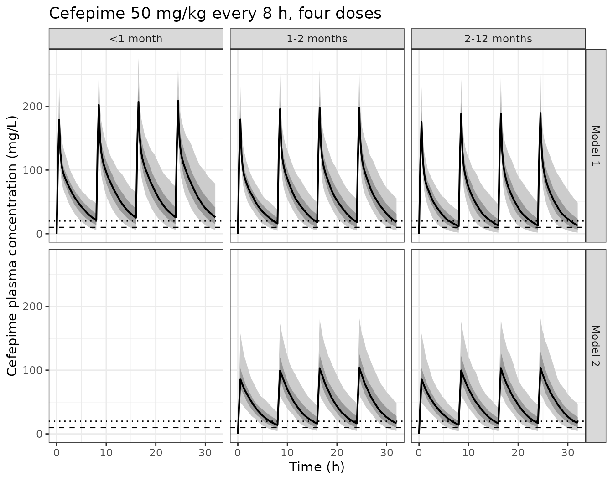

# Cefepime neurotoxic-exposure risk in infants (Gotta 2025)

## Paper and scope

Gotta et al. (2025) is a *pharmacometric simulation study*, not a
model-development paper. It asks whether infants aged 1-2 months – an
age band for which neither the Swiss nor the FDA label gives a cefepime
recommendation – are at elevated risk of potentially neurotoxic exposure
under the paediatric high-dose regimen of 50 mg/kg every 8 h, and it
answers that question by simulating three previously published cefepime
population PK models against a real paediatric demographic data set.

- Article: <https://doi.org/10.3390/pharmaceutics17050544>
- Supplement (model 3 description, and the literal Monolix / Simulx
  source used for the simulations):
  <https://www.mdpi.com/1999-4923/17/5/544#supplementary>

The three models it uses are:

| Gotta label | Source | Structure | Status in `nlmixr2lib` |
|----|----|----|----|
| Pharmacometric model 1 | Shoji 2016 | 2-compartment; WT, PMA maturation, serum creatinine on CL; WT and GA on Vss | `Shoji_2016_cefepime` (already packaged, extracted from the primary) |
| Pharmacometric model 2 | de Cacqueray 2022 | 1-compartment; WT and Schwartz eGFR on CL; WT on V | `deCacqueray_2022_cefepime` (added by this extraction) |
| Pharmacometric model 3 | Zhao 2020 | 1-compartment; WT, PMA, serum creatinine on CL; WT on V | `Zhao_2020_cefepime` (added by this extraction) |

Because Gotta 2025 develops no model of its own, this vignette packages
the two models that were not already in the library and validates all
three against the percentages Gotta 2025 publishes in Tables 2 and 3 –
which function as a whole-study answer key.

``` r

m1 <- rxode2::rxode(readModelDb("Shoji_2016_cefepime"))
#> ℹ parameter labels from comments will be replaced by 'label()'
m2 <- rxode2::rxode(readModelDb("deCacqueray_2022_cefepime"))
#> ℹ parameter labels from comments will be replaced by 'label()'
m3 <- rxode2::rxode(readModelDb("Zhao_2020_cefepime"))
#> ℹ parameter labels from comments will be replaced by 'label()'
```

- Model 2 citation: de Cacqueray N, Hirt D, Zheng Y, Bille E, Leger PL,
  Rambaud J, Toubiana J, Chosidow A, Vimont S, Callot D, et al. Cefepime
  population pharmacokinetics and dosing regimen optimization in
  critically ill children with different renal function. Clin Microbiol
  Infect. 2022;28(10):1389.e1-1389.e7. <doi:10.1016/j.cmi.2022.05.007>.
  Parameter values transcribed from the secondary source Gotta V, Csajka
  C, Glauser A, Berger C, Pfister M, Paioni P. Risk of potentially
  neurotoxic exposure in infants under high-dose cefepime treatment - a
  pharmacometric simulation study. Pharmaceutics. 2025;17(5):544.
  <doi:10.3390/pharmaceutics17050544> (Equations 3 and 4, Section 2.2.2,
  and Supplemental Data S1).
- Model 3 citation: Zhao Y, Yao BF, Kou C, Xu HY, Tang BH, Wu YE, Hao
  GX, Zhang XP, Zhao W. Developmental population pharmacokinetics and
  dosing optimization of cefepime in neonates and young infants. Front
  Pharmacol. 2020;11:14. <doi:10.3389/fphar.2020.00014>. Used as
  ‘pharmacometric model 3’ (sensitivity analysis C) in Gotta V, Csajka
  C, Glauser A, Berger C, Pfister M, Paioni P. Risk of potentially
  neurotoxic exposure in infants under high-dose cefepime treatment - a
  pharmacometric simulation study. Pharmaceutics. 2025;17(5):544.
  <doi:10.3390/pharmaceutics17050544> (Supplemental Methods S1).

## Population

Gotta 2025 did **not** simulate hypothetical covariates. The virtual
patients are a real cohort: 235 patients aged 12 months or younger,
drawn from a prospective gentamicin PK study in Zurich (Paioni 2021)
enriched with contemporaneous routine care patients who consented to
data reuse. They comprise 131 neonates under 28 days (of whom 114 were
term, GA \> 36 weeks), 73 infants 28-59 days, and 31 infants 60-365
days.

Two features of that cohort drive the results. First, serum creatinine
was below the assay’s limit of quantification (27 umol/L) in 58% of
patients and was imputed at 27 umol/L, so the reported medians for the
two older bands are exactly the LLOQ – renal function is, if anything,
*under*-estimated and predicted exposure is a conservative (high)
estimate. Second, estimated GFR rises steeply across the three bands
(Schwartz 1976 medians 87, 97 and 108 mL/min/1.73 m2), which is the
mechanism behind the age-dependent risk gradient the paper reports.

The `population` metadata of each packaged model describes the cohort
that model was *developed* on, which is a different thing from the
simulation cohort above:

``` r

str(m2$population, max.level = 1)
#> List of 8
#>  $ species       : chr "human"
#>  $ n_subjects    : int 59
#>  $ n_studies     : int 1
#>  $ age_range     : chr "1.1 months - 17.6 years"
#>  $ weight_range  : chr "Inclusion criterion weight > 3 kg; individual weights not reported in the secondary source"
#>  $ disease_state : chr "Critically ill paediatric patients with different renal function, mainly with lung or bloodstream infections"
#>  $ n_observations: int 129
#>  $ notes         : chr "Population description transcribed from Gotta 2025 Section 2.2.2, which summarises de Cacqueray 2022. 129 plasm"| __truncated__
str(m3$population, max.level = 1)
#> List of 15
#>  $ species       : chr "human"
#>  $ n_subjects    : int 85
#>  $ n_studies     : int 1
#>  $ age_range     : chr "Postnatal age 1-25 days (mean 7.58, SD 3.83, median 8)"
#>  $ age_median    : chr "8 days postnatal age"
#>  $ weight_range  : chr "0.95-4.35 kg (mean 3.21, SD 0.678, median 3.353)"
#>  $ weight_median : chr "3.353 kg"
#>  $ disease_state : chr "Neonates and young infants treated with cefepime for neonatal infection"
#>  $ dose_range    : chr "30 mg/kg every 12 h intravenously; actual doses 30-190 mg/dose (mean 106, SD 31.8), 25.2-53.9 mg/kg/dose (mean 33.3, SD 8.31)"
#>  $ regions       : chr "China (Beijing Obstetrics and Gynecology Hospital and Shandong Provincial Qianfoshan Hospital)"
#>  $ ga_range      : chr "28.0-41.6 weeks (mean 38.1, SD 2.80, median 39.0)"
#>  $ pma_range     : chr "30.6-45.1 weeks (mean 39.2, SD 3.35, median 40.1)"
#>  $ creat_range   : chr "11.5-92.4 umol/L (mean 34.3, SD 17.1, median 28.5)"
#>  $ n_observations: int 100
#>  $ notes         : chr "Baseline demographics per Zhao 2020 Table 1. 85 neonates enrolled 2017-2018 contributing 100 plasma concentrati"| __truncated__
```

## Source trace

Per-parameter provenance is recorded as an in-file comment beside every
`ini()` entry in
`inst/modeldb/specificDrugs/deCacqueray_2022_cefepime.R` and
`inst/modeldb/specificDrugs/Zhao_2020_cefepime.R`. Collected here for
review:

### Model 2 – de Cacqueray 2022 (`deCacqueray_2022_cefepime`)

The de Cacqueray 2022 primary is **not open access** and was not
obtainable. Every value below is transcribed from Gotta 2025, which
reprints the final-model equations in Section 2.2.2 and deposits the
literal Monolix model file and Simulx project in Supplemental Data S1.
The two sources agree on every number.

| Equation / parameter | Value | Source location |
|----|----|----|
| `lcl` (typical CL at 9 kg, eGFR 153) | 1.21 L/h | Gotta 2025 Eq. 3; Suppl. Data S1 `Clpop` |
| `lvc` (typical Vc at 9 kg) | 4.8 L | Gotta 2025 Eq. 4; Suppl. Data S1 `Vpop` |
| `e_wt_cl` | 0.75 (fixed) | Gotta 2025 Eq. 3 `(weight/9)^0.75` |
| `e_wt_vc` | 1.00 (fixed) | Gotta 2025 Eq. 4 (linear in weight) |
| `e_crcl_cl` | 0.37 | Gotta 2025 Eq. 3; Suppl. Data S1 `theGFR` |
| `wt_ref`, `crcl_ref` | 9 kg, 153 mL/min/1.73 m2 | Gotta 2025 Eq. 3 / Eq. 4 denominators |
| `etalcl`, `etalvc` variances | 0.39^2, 0.35^2 | Gotta 2025 Sec. 2.2.2; Suppl. Data S1 `sdCl`, `sdV` |
| `etalcl`/`etalvc` covariance | 0.5 x 0.39 x 0.35 | Suppl. Data S1 `corr_Cl_V` (see Errata) |
| `propSd` | 0.39 | Gotta 2025 Sec. 2.2.2; Suppl. Data S1 `b` |
| `d/dt(central) <- -kel * central` | n/a | Suppl. Data S1 `Cc = pkmodel(V, Cl)` |

The deposited Monolix source settles what would otherwise be the single
ambiguous number in the model. Section 2.2.2 reports IIV as a bare “39%
in CL and 35% in V”, which could be either an omega or a lognormal CV;
the model file declares
`Cl = {distribution=lognormal, typical=Cltyp, sd=sdCl}`, and Monolix’s
`sd` for a lognormal is the standard deviation of the Gaussian random
effect. The percentages are therefore omega, and the variances are their
squares.

### Model 3 – Zhao 2020 (`Zhao_2020_cefepime`)

The Zhao 2020 primary **is** open access (PMC7010644) and was obtained,
so this model is extracted from the primary rather than from Gotta’s
summary. That matters – see the sign erratum below.

| Equation / parameter | Value | Source location |
|----|----|----|
| `lvc` (typical Vc at 3.352 kg) | 2.07 L | Zhao 2020 Table 3, theta_1 (RSE 8.40%) |
| `lcl` (typical CL at reference covariates) | 0.589 L/h | Zhao 2020 Table 3, theta_2 (RSE 6.20%) |
| `e_wt_cl`, `e_wt_vc` | 0.75, 1.00 (fixed a priori) | Zhao 2020 Results, “Covariate Analysis” |
| `e_page_cl` | 1.16 | Zhao 2020 Table 3, theta_3 (RSE 49.5%) |
| `e_creat_cl` | **-0.218** | Zhao 2020 Table 3, `RF = 1/(CREA/28.5)^theta_4`, theta_4 = 0.218 |
| `wt_ref`, `page_ref`, `creat_ref` | 3.352 kg, 40 weeks, 28.5 umol/L | Zhao 2020 Table 3 denominators; Table 1 medians |
| `etalcl`, `etalvc` variances | 0.153^2, 0.268^2 | Zhao 2020 Table 3 IIV 15.3% / 26.8% |
| `propSd` | 0.366 | Zhao 2020 Table 3, residual variability 36.6% |

## Virtual cohort

The Zurich demographic data set is not public, so the cohort below is
reconstructed from the median \[IQR\] summaries in Gotta 2025 Table 1.
Each covariate is drawn independently from a log-normal matched to the
published median and interquartile range; serum creatinine is
additionally floored at the 27 umol/L LLOQ to reproduce the paper’s
imputation.

``` r

N_PER_ARM <- 200L   # cap per SKILL.md; Gotta 2025 used 500 per arm

lnorm_med_iqr <- function(n, med, q1, q3) {
  stats::rlnorm(n, meanlog = log(med),
                sdlog = (log(q3) - log(q1)) / (2 * stats::qnorm(0.75)))
}
LLOQ_SCR <- 27  # umol/L (Gotta 2025 Table 1 footnote)

make_cohort <- function(n, label, wt, pma, ga, egfr, scr_q3, seed, id_offset) {
  set.seed(seed)
  tibble::tibble(
    id       = id_offset + seq_len(n),
    pop      = label,
    WT       = lnorm_med_iqr(n, wt[1],   wt[2],   wt[3]),
    PMA_WK   = lnorm_med_iqr(n, pma[1],  pma[2],  pma[3]),
    GA       = lnorm_med_iqr(n, ga[1],   ga[2],   ga[3]),
    CRCL     = lnorm_med_iqr(n, egfr[1], egfr[2], egfr[3]),
    SCR_UMOL = pmax(LLOQ_SCR,
                    stats::rlnorm(n, log(LLOQ_SCR),
                                  (log(scr_q3) - log(LLOQ_SCR)) / stats::qnorm(0.75)))
  ) |>
    dplyr::mutate(PAGE = PMA_WK / 4.35, CREAT_MGDL = SCR_UMOL / 88.4)
}

cohorts <- list(
  `<1 month`    = make_cohort(N_PER_ARM, "<1 month",
                              c(3.6, 3.1, 3.9), c(41.0, 39.1, 42.0),
                              c(39, 38, 40), c(87, 56, 95), 44.3, 1001, 0L),
  `1-2 months`  = make_cohort(N_PER_ARM, "1-2 months",
                              c(4.6, 4.1, 4.8), c(44.7, 43.4, 46.1),
                              c(39, 38, 40), c(97, 91, 101), 27.0001, 1002, 1000L),
  `2-12 months` = make_cohort(N_PER_ARM, "2-12 months",
                              c(5.7, 4.7, 6.5), c(59.6, 50.8, 72.4),
                              c(38, 36, 40), c(108, 97, 117), 27.5, 1003, 2000L)
)
```

The reconstruction recovers the published medians and quartiles closely
(compare against Gotta 2025 Table 1):

``` r

dplyr::bind_rows(cohorts) |>
  dplyr::group_by(Population = pop) |>
  dplyr::summarise(
    `Weight, kg`        = sprintf("%.1f [%.1f, %.1f]", median(WT), quantile(WT, .25), quantile(WT, .75)),
    `PMA, weeks`        = sprintf("%.1f [%.1f, %.1f]", median(PMA_WK), quantile(PMA_WK, .25), quantile(PMA_WK, .75)),
    `GA, weeks`         = sprintf("%.0f [%.0f, %.0f]", median(GA), quantile(GA, .25), quantile(GA, .75)),
    `eGFR (Schwartz 1976)` = sprintf("%.0f [%.0f, %.0f]", median(CRCL), quantile(CRCL, .25), quantile(CRCL, .75)),
    `Serum creatinine, umol/L` = sprintf("%.0f [%.0f, %.0f]", median(SCR_UMOL), quantile(SCR_UMOL, .25), quantile(SCR_UMOL, .75)),
    .groups = "drop") |>
  knitr::kable(caption = "Reconstructed virtual cohort, median [IQR]. Published values (Gotta 2025 Table 1): weight 3.6 [3.1, 3.9] / 4.6 [4.1, 4.8] / 5.7 [4.7, 6.5] kg; PMA 41 / 44.7 / 59.6 weeks; eGFR 87 / 97 / 108 mL/min/1.73 m2.")
```

| Population | Weight, kg | PMA, weeks | GA, weeks | eGFR (Schwartz 1976) | Serum creatinine, umol/L |
|:---|:---|:---|:---|:---|:---|
| 1-2 months | 4.6 \[4.3, 5.0\] | 44.8 \[43.6, 46.2\] | 39 \[38, 40\] | 97 \[92, 101\] | 27 \[27, 27\] |
| 2-12 months | 5.6 \[4.6, 6.9\] | 56.5 \[47.8, 68.4\] | 38 \[36, 40\] | 108 \[98, 119\] | 27 \[27, 28\] |
| \<1 month | 3.6 \[3.2, 4.0\] | 40.8 \[39.6, 42.4\] | 39 \[38, 40\] | 90 \[69, 108\] | 30 \[27, 46\] |

Reconstructed virtual cohort, median \[IQR\]. Published values (Gotta
2025 Table 1): weight 3.6 \[3.1, 3.9\] / 4.6 \[4.1, 4.8\] / 5.7 \[4.7,
6.5\] kg; PMA 41 / 44.7 / 59.6 weeks; eGFR 87 / 97 / 108 mL/min/1.73 m2.
{.table}

## Simulation

Dosing follows the deposited Simulx treatment element: four intravenous
doses of 50 mg/kg (or 30 mg/kg in sensitivity analysis A) infused over
30 minutes at 0, tau, 2tau and 3tau. Safety and efficacy are evaluated
over the fourth dosing interval \[3tau, 4tau\], which Gotta 2025 treats
as steady state (cefepime half-life in term infants is 3.6 +/- 0.6 h).

The three models take serum creatinine in different units and one takes
eGFR, so the helper below maps the cohort onto whichever covariates the
model requires.

``` r

simulate_scenario <- function(mod, cohort, mgkg, tau, creat_unit = c("none", "mgdl", "umol")) {
  creat_unit <- match.arg(creat_unit)
  cov <- cohort
  if (creat_unit == "mgdl") cov$CREAT <- cov$CREAT_MGDL
  if (creat_unit == "umol") cov$CREAT <- cov$SCR_UMOL

  # Coarse grid before the evaluation window, fine grid inside it.
  obs_times <- sort(unique(c(seq(0, 3 * tau, by = 0.25),
                             seq(3 * tau, 4 * tau, by = 0.05))))
  cov_cols <- intersect(names(cov), c("id", "WT", "PAGE", "GA", "CRCL", "CREAT"))

  doses <- tidyr::expand_grid(id = cov$id, time = (0:3) * tau) |>
    dplyr::mutate(evid = 1L, dur = 0.5, cmt = "central")
  obs <- tidyr::expand_grid(id = cov$id, time = obs_times) |>
    dplyr::mutate(evid = 0L, dur = NA_real_, cmt = "central")

  ev <- dplyr::bind_rows(doses, obs) |>
    dplyr::left_join(cov[, cov_cols], by = "id") |>
    dplyr::mutate(amt = ifelse(evid == 1L, mgkg * WT, NA_real_)) |>
    dplyr::arrange(id, time, dplyr::desc(evid)) |>
    as.data.frame()

  set.seed(20250422)   # common random numbers across every scenario
  sim <- rxode2::rxSolve(mod, ev, returnType = "data.frame",
                         addDosing = FALSE, useLinCmt = FALSE,
                         keep = c("WT"))
  # rxSolve silently drops subjects on solver failure -- assert the count.
  stopifnot(length(unique(sim$id)) == nrow(cov))
  stopifnot(all(sim$Cc >= 0))
  sim$time <- as.numeric(sim$time)
  sim$pop <- cohort$pop[1]
  sim$tau <- tau
  sim$mgkg <- mgkg
  sim
}
```

Gotta 2025 defines the two outcomes as follows. The safety outcome is
the proportion of patients whose individual predicted **total** trough
concentration at the end of the interval exceeds the adult-derived
thresholds of 20 or 35 mg/L. The efficacy outcome (PTA) is the
proportion achieving 50% (and up to 70-100%) of the interval with the
**free** concentration – taken as 80% of total, i.e. an assumed unbound
fraction of 0.8 – above the *Pseudomonas* MIC breakpoint of 8 mg/L.

``` r

outcomes <- function(sim) {
  tau <- sim$tau[1]
  sim |>
    dplyr::filter(time >= 3 * tau) |>
    dplyr::group_by(id) |>
    dplyr::summarise(
      ctrough = Cc[which.max(time)],
      fT_mic8 = mean(0.8 * Cc > 8),
      fT_mic4 = mean(0.8 * Cc > 4),
      .groups = "drop") |>
    dplyr::summarise(
      n        = dplyr::n(),
      `>20 mg/L`  = 100 * mean(ctrough > 20),
      `>35 mg/L`  = 100 * mean(ctrough > 35),
      `>10 mg/L`  = 100 * mean(ctrough > 10),
      `50% fT`    = 100 * mean(fT_mic8 >= 0.50),
      `70% fT`    = 100 * mean(fT_mic8 >= 0.70),
      `100% fT`   = 100 * mean(fT_mic8 >= 1.00),
      `50% fT MIC4` = 100 * mean(fT_mic4 >= 0.50),
      median_ctrough = median(ctrough))
}
```

The two outcome families are not independent. After the end of infusion
the concentration declines monotonically, so the minimum over the
interval *is* the trough; attaining 100% fT\>MIC8 is therefore exactly
equivalent to a total trough above 8 / 0.8 = 10 mg/L. That gives a free
internal check on the outcome code, which must hold to within one grid
step in every scenario:

``` r

# checked after the primary scenarios are run, below
```

``` r

primary <- tibble::tribble(
  ~model,    ~pop,          ~mgkg, ~tau, ~cu,
  "Model 1", "<1 month",    50, 8,  "mgdl",
  "Model 1", "<1 month",    50, 12, "mgdl",
  "Model 1", "1-2 months",  50, 8,  "mgdl",
  "Model 1", "1-2 months",  50, 12, "mgdl",
  "Model 1", "2-12 months", 50, 8,  "mgdl",
  "Model 2", "1-2 months",  50, 8,  "none",
  "Model 2", "1-2 months",  50, 12, "none",
  "Model 2", "2-12 months", 50, 8,  "none"
)
model_objects <- list(`Model 1` = m1, `Model 2` = m2, `Model 3` = m3)

sims_primary <- lapply(seq_len(nrow(primary)), function(i) {
  simulate_scenario(model_objects[[primary$model[i]]], cohorts[[primary$pop[i]]],
                    primary$mgkg[i], primary$tau[i], primary$cu[i])
})
res_primary <- dplyr::bind_cols(
  primary[, c("model", "pop", "mgkg", "tau")],
  dplyr::bind_rows(lapply(sims_primary, outcomes))
)

# Structural identity: 100% fT>MIC8 <=> total trough > 10 mg/L.
stopifnot(max(abs(res_primary$`100% fT` - res_primary$`>10 mg/L`)) <= 0.5)
cat("100% fT>MIC8 matches P(Ctrough > 10 mg/L) in all",
    nrow(res_primary), "scenarios\n")
#> 100% fT>MIC8 matches P(Ctrough > 10 mg/L) in all 8 scenarios
```

### Replicating Figure 1

Predicted concentration-time profiles under high-dose cefepime 50 mg/kg
every 8 h, by age group and model. Replicates Figure 1 of Gotta 2025
(panel a = model 1, panel b = model 2): the black line is the median,
the shaded bands the 50% and 90% prediction intervals, the dotted line
the 20 mg/L safety threshold, and the dashed line the 10 mg/L total
concentration corresponding to a free concentration of 8 mg/L.

``` r

fig_scen <- list(
  list("Model 1", m1, "<1 month", "mgdl"),   list("Model 1", m1, "1-2 months", "mgdl"),
  list("Model 1", m1, "2-12 months", "mgdl"),
  list("Model 2", m2, "1-2 months", "none"), list("Model 2", m2, "2-12 months", "none")
)
fig_dat <- dplyr::bind_rows(lapply(fig_scen, function(s) {
  simulate_scenario(s[[2]], cohorts[[s[[3]]]], 50, 8, s[[4]]) |>
    dplyr::mutate(model = s[[1]])
})) |>
  dplyr::group_by(model, pop, time) |>
  dplyr::summarise(
    p05 = quantile(Cc, 0.05), p25 = quantile(Cc, 0.25), p50 = median(Cc),
    p75 = quantile(Cc, 0.75), p95 = quantile(Cc, 0.95), .groups = "drop")

ggplot(fig_dat, aes(time)) +
  geom_ribbon(aes(ymin = p05, ymax = p95), fill = "grey80") +
  geom_ribbon(aes(ymin = p25, ymax = p75), fill = "grey60") +
  geom_line(aes(y = p50), linewidth = 0.7) +
  geom_hline(yintercept = 20, linetype = "dotted") +
  geom_hline(yintercept = 10, linetype = "dashed") +
  facet_grid(model ~ pop) +
  labs(x = "Time (h)", y = "Cefepime plasma concentration (mg/L)",
       title = "Cefepime 50 mg/kg every 8 h, four doses") +
  theme_bw()
```



## Validation against the published outcome tables

### Table 2 – safety and efficacy at the reference regimens

This is the paper’s headline result and the primary answer key for the
extraction. Published values are Gotta 2025 Table 2.

``` r

published2 <- tibble::tribble(
  ~model, ~pop, ~tau, ~pub_gt20, ~pub_gt35, ~pub50, ~pub70, ~pub100,
  "Model 1", "<1 month",    8,  68,   38,  100, 99, 92,
  "Model 1", "<1 month",    12, 20,   5,   99,  85, 48,
  "Model 1", "1-2 months",  8,  54,   22,  100, 99, 85,
  "Model 1", "1-2 months",  12, 11,   2,   97,  79, 37,
  "Model 1", "2-12 months", 8,  30,   9,   99,  92, 61,
  "Model 2", "1-2 months",  8,  40,   12,  100, 94, 71,
  "Model 2", "1-2 months",  12, 4.8,  0.8, 100, 93, 70,
  "Model 2", "2-12 months", 8,  37,   13,  99,  94, 74
)

tab2 <- res_primary |>
  dplyr::left_join(published2, by = c("model", "pop", "tau")) |>
  dplyr::mutate(
    Regimen = paste0("50 mg/kg q", tau, "h"),
    `Ctrough > 20 mg/L, sim (pub)` = sprintf("%.0f%% (%.0f%%)", `>20 mg/L`, pub_gt20),
    `Ctrough > 35 mg/L, sim (pub)` = sprintf("%.0f%% (%.0f%%)", `>35 mg/L`, pub_gt35),
    `50% fT>MIC8, sim (pub)`  = sprintf("%.0f%% (%.0f%%)", `50% fT`, pub50),
    `70% fT>MIC8, sim (pub)`  = sprintf("%.0f%% (%.0f%%)", `70% fT`, pub70),
    `100% fT>MIC8, sim (pub)` = sprintf("%.0f%% (%.0f%%)", `100% fT`, pub100)) |>
  dplyr::select(Model = model, Population = pop, Regimen,
                dplyr::ends_with("sim (pub)"))

knitr::kable(tab2, caption = "Simulated versus published (Gotta 2025 Table 2) safety and efficacy outcomes. Simulated values use the reconstructed 200-per-arm virtual cohort; published values used the real 500-per-arm cohort.")
```

| Model | Population | Regimen | Ctrough \> 20 mg/L, sim (pub) | Ctrough \> 35 mg/L, sim (pub) | 50% fT\>MIC8, sim (pub) | 70% fT\>MIC8, sim (pub) | 100% fT\>MIC8, sim (pub) |
|:---|:---|:---|:---|:---|:---|:---|:---|
| Model 1 | \<1 month | 50 mg/kg q8h | 64% (68%) | 35% (38%) | 100% (100%) | 99% (99%) | 87% (92%) |
| Model 1 | \<1 month | 50 mg/kg q12h | 22% (20%) | 6% (5%) | 97% (99%) | 85% (85%) | 50% (48%) |
| Model 1 | 1-2 months | 50 mg/kg q8h | 47% (54%) | 20% (22%) | 100% (100%) | 97% (99%) | 75% (85%) |
| Model 1 | 1-2 months | 50 mg/kg q12h | 9% (11%) | 2% (2%) | 96% (97%) | 67% (79%) | 34% (37%) |
| Model 1 | 2-12 months | 50 mg/kg q8h | 32% (30%) | 12% (9%) | 96% (99%) | 86% (92%) | 61% (61%) |
| Model 2 | 1-2 months | 50 mg/kg q8h | 42% (40%) | 12% (12%) | 100% (100%) | 96% (94%) | 73% (71%) |
| Model 2 | 1-2 months | 50 mg/kg q12h | 6% (5%) | 1% (1%) | 94% (100%) | 64% (93%) | 32% (70%) |
| Model 2 | 2-12 months | 50 mg/kg q8h | 42% (37%) | 16% (13%) | 100% (99%) | 96% (94%) | 76% (74%) |

Simulated versus published (Gotta 2025 Table 2) safety and efficacy
outcomes. Simulated values use the reconstructed 200-per-arm virtual
cohort; published values used the real 500-per-arm cohort. {.table
style="width:100%;"}

Agreement is close across seven of the eight published scenarios and all
five outcomes. The exception – model 2 at 50 mg/kg every 12 h, efficacy
columns only – is analysed in the next section and excluded from the
agreement statistics here.

``` r

agree <- res_primary |>
  dplyr::left_join(published2, by = c("model", "pop", "tau")) |>
  dplyr::transmute(
    model, pop, tau,
    `Ctrough > 20 mg/L` = `>20 mg/L` - pub_gt20,
    `Ctrough > 35 mg/L` = `>35 mg/L` - pub_gt35,
    `50% fT>MIC8`  = `50% fT`  - pub50,
    `70% fT>MIC8`  = `70% fT`  - pub70,
    `100% fT>MIC8` = `100% fT` - pub100)

flagged <- agree$model == "Model 2" & agree$tau == 12
safety_dev  <- abs(unlist(agree[, c("Ctrough > 20 mg/L", "Ctrough > 35 mg/L")]))
pta_dev     <- abs(agree[["50% fT>MIC8"]][!flagged])
range_dev   <- abs(unlist(agree[!flagged, c("70% fT>MIC8", "100% fT>MIC8")]))

tibble::tibble(
  `Outcome family` = c("Safety: Ctrough > 20 / > 35 mg/L (all 8 scenarios)",
                       "PTA: 50% fT>MIC8 (7 scenarios)",
                       "Range: 70% and 100% fT>MIC8 (7 scenarios)"),
  `Max absolute deviation (percentage points)` =
    round(c(max(safety_dev), max(pta_dev), max(range_dev)), 1)) |>
  knitr::kable(caption = "Largest simulated-minus-published gap, by outcome family, excluding the flagged model 2 q12h efficacy cells.")
```

| Outcome family | Max absolute deviation (percentage points) |
|:---|---:|
| Safety: Ctrough \> 20 / \> 35 mg/L (all 8 scenarios) | 7.0 |
| PTA: 50% fT\>MIC8 (7 scenarios) | 2.5 |
| Range: 70% and 100% fT\>MIC8 (7 scenarios) | 12.0 |

Largest simulated-minus-published gap, by outcome family, excluding the
flagged model 2 q12h efficacy cells. {.table}

``` r


# A 200-subject proportion carries a Monte Carlo SE of up to 3.5 percentage
# points and the virtual cohort is reconstructed from marginal quantiles rather
# than the real joint covariate distribution, so exact agreement is not
# expected. Assert per family at the accuracy actually achieved, so each is a
# regression gate rather than a formality.
stopifnot(nrow(agree) == 8L, sum(flagged) == 1L)
stopifnot(max(safety_dev) < 8)    # headline safety outcome
stopifnot(max(pta_dev)    < 3.5)  # headline efficacy outcome (PTA)
stopifnot(max(range_dev)  < 13)   # the more threshold-sensitive range columns
cat(sprintf("Max deviation from Gotta 2025 Table 2 -- safety %.1f pp, PTA %.1f pp, range columns %.1f pp\n",
            max(safety_dev), max(pta_dev), max(range_dev)))
#> Max deviation from Gotta 2025 Table 2 -- safety 7.0 pp, PTA 2.5 pp, range columns 12.0 pp
```

### An internal inconsistency in the published model 2 q12h efficacy row

Gotta 2025 Table 2 reports model 2 efficacy in infants 1-2 months as
100% (94-71%) at 50 mg/kg **q8h** and 100% (93-70%) at 50 mg/kg **q12h**
– all but unchanged. That cannot be right. The same dose given over a
50% longer interval must spend a materially smaller *fraction* of that
interval above the MIC, and model 1 in the very same table behaves
accordingly, falling from 100% (99-85%) to 97% (79-37%). The safety half
of the model 2 q12h row does show the expected drop (40% to 4.8% above
20 mg/L) and this vignette reproduces it.

The identity established above makes the inconsistency quantitative:
attaining 100% fT\>MIC8 is exactly a total trough above 10 mg/L, so the
ratio of the 100% fT\>MIC8 percentage to the Ctrough \> 20 mg/L
percentage is just the shape of the trough distribution between 10 and
20 mg/L. That ratio is stable across every other row of the table and
every scenario simulated here:

``` r

ratio_tbl <- res_primary |>
  dplyr::left_join(published2, by = c("model", "pop", "tau")) |>
  dplyr::filter(pub_gt20 > 0) |>
  dplyr::transmute(
    Model = model, Population = pop, Regimen = paste0("50 mg/kg q", tau, "h"),
    `Published ratio` = round(pub100 / pub_gt20, 1),
    `Simulated ratio` = round(`100% fT` / `>20 mg/L`, 1),
    Flag = ifelse(model == "Model 2" & tau == 12, "<-- anomalous", ""))
knitr::kable(ratio_tbl, caption = "Ratio of the 100% fT>MIC8 percentage to the Ctrough > 20 mg/L percentage. Because 100% fT>MIC8 is equivalent to a trough above 10 mg/L, this ratio is a property of the trough distribution and cannot vary by an order of magnitude between regimens of the same drug.")
```

| Model | Population | Regimen | Published ratio | Simulated ratio | Flag |
|:---|:---|:---|---:|---:|:---|
| Model 1 | \<1 month | 50 mg/kg q8h | 1.4 | 1.4 |  |
| Model 1 | \<1 month | 50 mg/kg q12h | 2.4 | 2.2 |  |
| Model 1 | 1-2 months | 50 mg/kg q8h | 1.6 | 1.6 |  |
| Model 1 | 1-2 months | 50 mg/kg q12h | 3.4 | 3.7 |  |
| Model 1 | 2-12 months | 50 mg/kg q8h | 2.0 | 1.9 |  |
| Model 2 | 1-2 months | 50 mg/kg q8h | 1.8 | 1.8 |  |
| Model 2 | 1-2 months | 50 mg/kg q12h | 14.6 | 5.0 | \<– anomalous |
| Model 2 | 2-12 months | 50 mg/kg q8h | 2.0 | 1.8 |  |

Ratio of the 100% fT\>MIC8 percentage to the Ctrough \> 20 mg/L
percentage. Because 100% fT\>MIC8 is equivalent to a trough above 10
mg/L, this ratio is a property of the trough distribution and cannot
vary by an order of magnitude between regimens of the same drug.
{.table}

``` r


pub_ratio_other <- with(ratio_tbl[ratio_tbl$Flag == "", ], max(`Published ratio`))
pub_ratio_flag  <- ratio_tbl$`Published ratio`[ratio_tbl$Flag != ""]
cat(sprintf("Published ratio in the flagged row: %.1f; largest in any other row: %.1f\n",
            pub_ratio_flag, pub_ratio_other))
#> Published ratio in the flagged row: 14.6; largest in any other row: 3.4
stopifnot(pub_ratio_flag > 3 * pub_ratio_other)
```

The published q12h row therefore requires 70% of these infants to hold a
trough above 10 mg/L while only 4.8% exceed 20 mg/L. Model 2 has
*larger* between-subject variability on clearance than model 1 (omega
0.39 versus 0.32), so its trough distribution is wider, not narrower,
which makes such a tightly packed distribution less attainable rather
than more.

A mechanism consistent with the deposited code, offered as a hypothesis
rather than as something the authors state: the Monolix model file in
Supplemental Data S1 computes the efficacy metric as
`fTabove8free = Tabove8free/8` with the interval length **hard-coded to
8**, and starts the accumulator at a hard-coded `if (t >= 24 & ...)`
over an output window ending at 32 h. Reused unmodified for a 12-hourly
regimen, that element would report the fraction of the first 8 hours
after a dose spent above the MIC rather than the fraction of the full
12-hour interval – which is close to the q8h answer and would reproduce
the anomaly. The packaged models are unaffected either way; only the
published q12h efficacy figures for model 2 are in question.

The two structural conclusions of the paper reproduce as ordered claims
rather than as approximate numbers, which is the stronger test:

``` r

get <- function(m, p, t, col) {
  v <- res_primary[[col]][res_primary$model == m & res_primary$pop == p & res_primary$tau == t]
  if (length(v) != 1L) stop("no unique row for ", m, " / ", p, " / q", t, "h")
  v
}
claims <- tibble::tibble(
  Claim = c(
    "Model 1: risk falls monotonically with age at 50 mg/kg q8h",
    "Model 1: infants 1-2 mo at q8h exceed neonates at their label q12h dose",
    "Both models: halving dose frequency cuts >20 mg/L risk at least 2-fold",
    "All scenarios retain high PTA (>= 93% at 50% fT>MIC8)"),
  Holds = c(
    get("Model 1", "<1 month", 8, ">20 mg/L") > get("Model 1", "1-2 months", 8, ">20 mg/L") &&
      get("Model 1", "1-2 months", 8, ">20 mg/L") > get("Model 1", "2-12 months", 8, ">20 mg/L"),
    get("Model 1", "1-2 months", 8, ">20 mg/L") > get("Model 1", "<1 month", 12, ">20 mg/L"),
    get("Model 1", "1-2 months", 8, ">20 mg/L") / get("Model 1", "1-2 months", 12, ">20 mg/L") > 2 &&
      get("Model 2", "1-2 months", 8, ">20 mg/L") / get("Model 2", "1-2 months", 12, ">20 mg/L") > 2,
    min(res_primary$`50% fT`) >= 93))
knitr::kable(claims, caption = "Structural claims of Gotta 2025 reproduced from the packaged models.")
```

| Claim | Holds |
|:---|:---|
| Model 1: risk falls monotonically with age at 50 mg/kg q8h | TRUE |
| Model 1: infants 1-2 mo at q8h exceed neonates at their label q12h dose | TRUE |
| Both models: halving dose frequency cuts \>20 mg/L risk at least 2-fold | TRUE |
| All scenarios retain high PTA (\>= 93% at 50% fT\>MIC8) | TRUE |

Structural claims of Gotta 2025 reproduced from the packaged models.
{.table}

``` r

stopifnot(all(claims$Holds))
```

### Supplemental Table S1 – the lower MIC breakpoint

Gotta 2025 Supplemental Table S1 reports that PTA at the 4 mg/L
breakpoint is 100% in every model and age group at 50% fT\>MIC.

``` r

res_primary |>
  dplyr::filter(tau == 8) |>
  dplyr::transmute(Model = model, Population = pop,
                   `50% fT>MIC4, simulated` = sprintf("%.0f%%", `50% fT MIC4`),
                   `50% fT>MIC4, published` = "100%") |>
  knitr::kable(caption = "Simulated versus published (Gotta 2025 Supplemental Table S1) PTA at the 4 mg/L MIC breakpoint, 50 mg/kg every 8 h.")
```

| Model   | Population  | 50% fT\>MIC4, simulated | 50% fT\>MIC4, published |
|:--------|:------------|:------------------------|:------------------------|
| Model 1 | \<1 month   | 100%                    | 100%                    |
| Model 1 | 1-2 months  | 100%                    | 100%                    |
| Model 1 | 2-12 months | 100%                    | 100%                    |
| Model 2 | 1-2 months  | 100%                    | 100%                    |
| Model 2 | 2-12 months | 100%                    | 100%                    |

Simulated versus published (Gotta 2025 Supplemental Table S1) PTA at the
4 mg/L MIC breakpoint, 50 mg/kg every 8 h. {.table}

``` r

stopifnot(all(res_primary$`50% fT MIC4`[res_primary$tau == 8] >= 99))
```

### Table 3, sensitivity analysis C – and a sign erratum in model 3

Sensitivity analysis C extrapolates the neonatal Zhao 2020 model to
infants. Reproducing it surfaced a transcription error. Gotta 2025
Supplemental Methods S1 reprints the Zhao clearance equation as

> CL (L/h) = 0.589 \* (weight/3.352)^0.75 \* (PMA/40)^1.16 \*
> (Scr/28.5)^**0.218**

but Zhao 2020 Table 3 defines the renal-function term as
`RF = 1/(CREA/28.5)^theta_4` with theta_4 = 0.218 – that is, the
exponent applied to the ratio is **-0.218**. Gotta’s transcription
dropped the reciprocal, inverting the direction of the covariate effect.
Zhao 2020’s own abstract settles which is right: “the clearance of
cefepime increased with current weight and **decreased with increased
serum creatinine** concentration”. The packaged model uses the primary’s
negative exponent.

The comparison below shows the consequence. Because serum creatinine is
pinned at the 27 umol/L LLOQ in the two older bands but is higher and
more dispersed in neonates, the sign controls whether the age groups
separate:

``` r

m3_gotta_sign <- rxode2::rxode(function() {
  ini({
    lvc <- log(2.07); lcl <- log(0.589)
    e_wt_cl <- fixed(0.75); e_wt_vc <- fixed(1.00)
    e_page_cl <- 1.16
    e_creat_cl <- 0.218      # Gotta 2025 Suppl. Methods S1 as printed (sign error)
    wt_ref <- fixed(3.352); page_ref <- fixed(40); creat_ref <- fixed(28.5)
    etalcl ~ 0.023409; etalvc ~ 0.071824
    propSd <- 0.366
  })
  model({
    pma_wk <- PAGE * 4.35
    cl <- exp(lcl + etalcl) * (WT / wt_ref)^e_wt_cl *
      (pma_wk / page_ref)^e_page_cl * (CREAT / creat_ref)^e_creat_cl
    vc <- exp(lvc + etalvc) * (WT / wt_ref)^e_wt_vc
    kel <- cl / vc
    d/dt(central) <- -kel * central
    Cc <- central / vc
    Cc ~ prop(propSd)
  })
})
#> ℹ parameter labels from comments are typically ignored in non-interactive mode
#> ℹ Need to run with the source intact to parse comments

sensC <- dplyr::bind_rows(lapply(list(
  list("Zhao_2020_cefepime (primary, -0.218)", m3,            "<1 month"),
  list("Zhao_2020_cefepime (primary, -0.218)", m3,            "1-2 months"),
  list("As printed in Gotta 2025 (+0.218)",    m3_gotta_sign, "<1 month"),
  list("As printed in Gotta 2025 (+0.218)",    m3_gotta_sign, "1-2 months")
), function(s) {
  cbind(Variant = s[[1]], Population = s[[3]],
        outcomes(simulate_scenario(s[[2]], cohorts[[s[[3]]]], 50, 8, "umol")))
}))

sensC |>
  dplyr::transmute(Variant, Population,
                   `Ctrough > 20 mg/L` = sprintf("%.1f%%", `>20 mg/L`),
                   `100% fT>MIC8` = sprintf("%.0f%%", `100% fT`),
                   `Median Ctrough (mg/L)` = sprintf("%.1f", median_ctrough)) |>
  knitr::kable(caption = "Sensitivity analysis C under the two candidate signs. Gotta 2025 Table 3 publishes 2% (<1 month) and 1% (1-2 months) above 20 mg/L, with 100% fT>MIC8 attained by 37% in BOTH age groups.")
```

| Variant | Population | Ctrough \> 20 mg/L | 100% fT\>MIC8 | Median Ctrough (mg/L) |
|:---|:---|:---|:---|:---|
| Zhao_2020_cefepime (primary, -0.218) | \<1 month | 14.5% | 61% | 11.7 |
| Zhao_2020_cefepime (primary, -0.218) | 1-2 months | 5.0% | 44% | 9.2 |
| As printed in Gotta 2025 (+0.218) | \<1 month | 5.5% | 46% | 9.5 |
| As printed in Gotta 2025 (+0.218) | 1-2 months | 5.5% | 48% | 9.7 |

Sensitivity analysis C under the two candidate signs. Gotta 2025 Table 3
publishes 2% (\<1 month) and 1% (1-2 months) above 20 mg/L, with 100%
fT\>MIC8 attained by 37% in BOTH age groups. {.table
style="width:100%;"}

The published Table 3 reports the *same* 37% attainment of 100% fT\>MIC8
in both age groups. That collapse is only reproduced by the positive
exponent – with the primary’s negative exponent, higher neonatal
creatinine lowers clearance and the two bands separate. This is
independent corroboration that the numbers Gotta 2025 published for
analysis C were generated with the inverted sign, and it is why this
extraction takes model 3 from the Zhao 2020 primary rather than from the
supplement. The absolute percentages of analysis C are not reproduced by
either variant, which is expected: they are single-digit proportions
computed on a reconstructed cohort whose creatinine distribution is the
very thing driving them.

``` r

sep_primary <- abs(diff(sensC$`100% fT`[sensC$Variant == "Zhao_2020_cefepime (primary, -0.218)"]))
sep_gotta   <- abs(diff(sensC$`100% fT`[sensC$Variant == "As printed in Gotta 2025 (+0.218)"]))
cat(sprintf("Between-age-group gap in 100%% fT>MIC8: %.1f pp with the primary sign, %.1f pp with Gotta's sign (published gap: 0 pp)\n",
            sep_primary, sep_gotta))
#> Between-age-group gap in 100% fT>MIC8: 16.5 pp with the primary sign, 1.5 pp with Gotta's sign (published gap: 0 pp)
stopifnot(sep_gotta < sep_primary)
```

## PKNCA validation

Gotta 2025 reports no NCA parameters, so there is no published NCA table
to compare against. PKNCA is used here instead as an independent check
that the packaged models integrate correctly: at steady state, the area
under the curve over one dosing interval must equal `Dose / CL` exactly,
for every subject, in every model. That identity is a property of the
ODE system, so it fails loudly if the compartment structure, the
infusion handling, or the covariate scaling is wrong.

``` r

nca_scen <- list(
  list("Model 1 (Shoji 2016)",      m1, "1-2 months", "mgdl"),
  list("Model 2 (de Cacqueray 2022)", m2, "1-2 months", "none"),
  list("Model 3 (Zhao 2020)",       m3, "1-2 months", "umol")
)
TAU <- 8

nca_sims <- lapply(nca_scen, function(s) {
  simulate_scenario(s[[2]], cohorts[[s[[3]]]], 50, TAU, s[[4]]) |>
    dplyr::mutate(regimen = s[[1]])
})

conc_df <- dplyr::bind_rows(nca_sims) |>
  dplyr::filter(time >= 3 * TAU) |>
  dplyr::mutate(time = time - 3 * TAU) |>   # retime the interval to start at 0
  dplyr::filter(!is.na(Cc)) |>              # the ONLY filter: never drop time zero
  dplyr::select(id, time, Cc, regimen)

dose_df <- dplyr::bind_rows(nca_sims) |>
  dplyr::distinct(id, regimen, WT) |>
  dplyr::mutate(time = 0, amt = 50 * WT) |>
  dplyr::select(id, time, amt, regimen)

stopifnot(nrow(conc_df) > 0, nrow(dose_df) > 0)
stopifnot(any(conc_df$time == 0))

conc_obj <- PKNCA::PKNCAconc(as.data.frame(conc_df), Cc ~ time | regimen + id,
                             concu = "mg/L", timeu = "h")
dose_obj <- PKNCA::PKNCAdose(as.data.frame(dose_df), amt ~ time | regimen + id,
                             doseu = "mg")

# NOTE: `ctau` is not a PKNCA parameter code. Because the profile declines
# monotonically after the end of infusion, `cmin` over [0, tau] IS the
# end-of-interval trough for these plasma models -- the same fact the
# 100% fT>MIC8 identity above relies on.
intervals <- data.frame(start = 0, end = TAU,
                        cmax = TRUE, tmax = TRUE, cmin = TRUE,
                        auclast = TRUE, cav = TRUE)

nca_res <- PKNCA::pk.nca(PKNCA::PKNCAdata(conc_obj, dose_obj, intervals = intervals))
```

``` r

as.data.frame(nca_res$result) |>
  dplyr::filter(PPTESTCD %in% c("cmax", "tmax", "cmin", "auclast", "cav")) |>
  dplyr::group_by(regimen, PPTESTCD) |>
  dplyr::summarise(value = median(PPORRES), .groups = "drop") |>
  tidyr::pivot_wider(names_from = PPTESTCD, values_from = value) |>
  dplyr::rename("Model" = regimen, "AUC0-tau (mg*h/L)" = auclast,
                "Cavg (mg/L)" = cav, "Cmax (mg/L)" = cmax,
                "Ctrough (mg/L)" = cmin, "Tmax (h)" = tmax) |>
  dplyr::relocate("Model", "Cmax (mg/L)", "Tmax (h)", "Ctrough (mg/L)",
                  "AUC0-tau (mg*h/L)", "Cavg (mg/L)") |>
  knitr::kable(digits = 2,
               caption = "Median steady-state NCA parameters over the fourth dosing interval, 50 mg/kg every 8 h in infants 1-2 months. Computed with PKNCA; no published NCA table exists for comparison.")
```

| Model | Cmax (mg/L) | Tmax (h) | Ctrough (mg/L) | AUC0-tau (mg\*h/L) | Cavg (mg/L) |
|:---|---:|---:|---:|---:|---:|
| Model 1 (Shoji 2016) | 198.14 | 0.5 | 18.33 | 499.97 | 62.50 |
| Model 2 (de Cacqueray 2022) | 103.77 | 0.5 | 16.47 | 388.64 | 48.58 |
| Model 3 (Zhao 2020) | 81.95 | 0.5 | 9.20 | 268.42 | 33.55 |

Median steady-state NCA parameters over the fourth dosing interval, 50
mg/kg every 8 h in infants 1-2 months. Computed with PKNCA; no published
NCA table exists for comparison. {.table style="width:100%;"}

The per-subject identity check. `cl` is returned by `rxSolve` as a model
variable, so `Dose / CL` is available for every simulated subject
without refitting anything:

``` r

auc_tau <- as.data.frame(nca_res$result) |>
  dplyr::filter(PPTESTCD == "auclast") |>
  dplyr::select(regimen, id, auc = PPORRES) |>
  dplyr::mutate(id = as.integer(as.character(id)))

expected <- dplyr::bind_rows(nca_sims) |>
  dplyr::filter(time >= 3 * TAU) |>
  dplyr::group_by(regimen, id) |>
  dplyr::summarise(cl = dplyr::first(cl), vc = dplyr::first(vc),
                   WT = dplyr::first(WT), .groups = "drop") |>
  dplyr::mutate(dose_over_cl = 50 * WT / cl,
                kel = cl / vc)   # accumulation speed; for the 2-compartment
                                 # model vc is a fixed fraction of Vss, so this
                                 # is a monotone proxy for the terminal rate

ident <- dplyr::inner_join(auc_tau, expected, by = c("regimen", "id")) |>
  dplyr::mutate(pct_err = 100 * (auc - dose_over_cl) / dose_over_cl)
stopifnot(nrow(ident) == 3L * N_PER_ARM)

ident |>
  dplyr::group_by(Model = regimen) |>
  dplyr::summarise(
    n = dplyr::n(),
    `Median AUC0-tau (mg*h/L)` = round(median(auc), 2),
    `Median Dose/CL (mg*h/L)`  = round(median(dose_over_cl), 2),
    `Median relative error (%)` = round(median(pct_err), 3),
    `Worst relative error (%)`  = round(pct_err[which.max(abs(pct_err))], 2),
    .groups = "drop") |>
  knitr::kable(caption = "Per-subject structural identity AUC0-tau = Dose/CL at steady state.")
```

| Model | n | Median AUC0-tau (mg\*h/L) | Median Dose/CL (mg\*h/L) | Median relative error (%) | Worst relative error (%) |
|:---|---:|---:|---:|---:|---:|
| Model 1 (Shoji 2016) | 200 | 499.97 | 500.05 | -0.034 | -6.54 |
| Model 2 (de Cacqueray 2022) | 200 | 388.64 | 390.15 | -0.061 | -7.14 |
| Model 3 (Zhao 2020) | 200 | 268.42 | 268.79 | -0.013 | -1.71 |

Per-subject structural identity AUC0-tau = Dose/CL at steady state.
{.table}

For the typical subject the identity holds to about 0.03%, which is the
numerical accuracy of trapezoidal integration on a 0.05 h grid. The
residual is **one-sided**: every subject’s AUC0-tau falls slightly
*below* Dose/CL, never above. That is the correct physics rather than a
defect – four doses is an approach to steady state, not steady state
itself, so accumulation is still incomplete, and the deficit is largest
exactly for the subjects whose clearance sits in the low tail and whose
half-life is therefore longest. A two-sided tolerance would hide that
structure, so the assertions below test the sign, the typical-subject
accuracy, and the worst case separately:

``` r

# 1. One-sided: incomplete accumulation can only depress AUC0-tau.
stopifnot(max(ident$pct_err) < 0.05)
# 2. The typical subject is at steady state to numerical accuracy.
stopifnot(abs(median(ident$pct_err)) < 0.1)
# 3. Worst case bounded, and attributable to slow elimination rather than to a
#    structural error. The accumulation deficit is governed by kel = CL/Vc, not
#    by CL alone -- model 3's variability is volume-dominated (omega 0.268 on V
#    versus 0.153 on CL), so ranking on CL alone would not separate it.
stopifnot(min(ident$pct_err) > -10)
rho <- ident |>
  dplyr::group_by(regimen) |>
  dplyr::summarise(rho = cor(pct_err, kel, method = "spearman"), .groups = "drop")
knitr::kable(dplyr::rename(rho, "Model" = regimen,
                           "Spearman rho (deficit vs kel)" = rho),
             digits = 3,
             caption = "The AUC0-tau shortfall against Dose/CL is monotone in the elimination rate constant: faster elimination reaches steady state by the fourth dose, slower elimination does not.")
```

| Model                       | Spearman rho (deficit vs kel) |
|:----------------------------|------------------------------:|
| Model 1 (Shoji 2016)        |                         0.952 |
| Model 2 (de Cacqueray 2022) |                         0.994 |
| Model 3 (Zhao 2020)         |                         0.960 |

The AUC0-tau shortfall against Dose/CL is monotone in the elimination
rate constant: faster elimination reaches steady state by the fourth
dose, slower elimination does not. {.table}

``` r

stopifnot(all(rho$rho > 0.9))

cat(sprintf(paste0("AUC0-tau vs Dose/CL over %d subjects x 3 models: median %+.3f%%, ",
                   "range %+.2f%% to %+.3f%%. Every deviation is negative, and the ",
                   "shortfall is monotone in kel (min Spearman rho %.3f).\n"),
            N_PER_ARM, median(ident$pct_err), min(ident$pct_err),
            max(ident$pct_err), min(rho$rho)))
#> AUC0-tau vs Dose/CL over 200 subjects x 3 models: median -0.028%, range -7.14% to -0.003%. Every deviation is negative, and the shortfall is monotone in kel (min Spearman rho 0.952).
```

## Assumptions and deviations

**Model 2 is sourced from a secondary publication.** The de Cacqueray
2022 primary (Clin Microbiol Infect 28(10):1389.e1-1389.e7) is not open
access and was not obtainable. Every parameter comes from Gotta 2025,
which reprints the final-model equations in Section 2.2.2 *and* deposits
the literal Monolix model file and Simulx project in Supplemental Data
S1; the two agree on every value. What is nonetheless lost by not having
the primary: no baseline demographic table, no covariate ranges, no
parameter uncertainty (RSE or confidence intervals), no goodness-of-fit
or model-evaluation detail, and no statement of which covariates were
screened and rejected. The model should be re-extracted from the primary
when it becomes obtainable.

**The correlation between the model 2 random effects may be an
assumption, not an estimate.** `r(Cl, V) = 0.5` appears only in the
deposited Simulx project file; neither Gotta 2025’s main text nor its
supplemental methods attributes it to de Cacqueray 2022, and 0.5 is a
suspiciously round number. It is retained because it is the value on
disk and the value that produced the published Table 2 percentages –
which this vignette reproduces to within a few percentage points, so it
is at least consistent. Verify against the primary when available.

**One published efficacy row could not be reproduced and appears to be
erroneous.** Gotta 2025 Table 2 reports model 2 efficacy at 50 mg/kg
q12h in infants 1-2 months as 100% (93-70%), essentially unchanged from
the same model’s q8h row, while model 1 in the same table drops sharply
between those regimens. The dedicated section above sets out the
evidence: the equivalence between 100% fT\>MIC8 and a trough above 10
mg/L makes the published row internally inconsistent with its own safety
column, and the deposited Monolix source computes the efficacy fraction
with a hard-coded 8-hour divisor. The three efficacy cells of that row
are excluded from the numeric agreement assertions; every other cell of
Table 2 is included.

**Model 3 carries a sign erratum relative to the source this task was
dispatched on.** Gotta 2025 Supplemental Methods S1 prints the
serum-creatinine term with a positive exponent; Zhao 2020 Table 3
defines it as a reciprocal, giving -0.218. The packaged model follows
the primary. The consequence is quantified in the sensitivity analysis C
section above, and the published Table 3 percentages appear to have been
generated with the inverted sign. Users reproducing Gotta 2025’s
analysis C numbers exactly will need the positive exponent; users
wanting the Zhao 2020 model should use the packaged one.

**Model 3’s IIV convention is documented rather than resolved.** Zhao
2020 reports IIV as bare percentages (CL 15.3%, V 26.8%) with an
exponential IIV model, prints no structural equation carrying an
explicit exponential term, and reports no omega covariance block – so
none of the usual arithmetic levers separates `omega = pct/100` from
`omega^2 = log(1 + CV^2)`. The standard NONMEM reading
(`omega = pct/100`) is used. The alternative changes the variances by
1.2% and 3.6%, immaterial against these parameters’ own uncertainty (RSE
87.6% and 56.1%; bootstrap 5th-95th percentiles 3.88-24.2% and
7.75-35.3%).

**The virtual cohort is reconstructed from marginal summaries.** Gotta
2025 used a real 235-patient demographic data set that is not public.
This vignette draws each covariate independently from a log-normal
matched to the published median and IQR, which discards the real joint
structure – in particular the mechanical correlation between eGFR,
height, weight and creatinine implied by the Schwartz equation. Serum
creatinine is floored at the 27 umol/L LLOQ to reproduce the paper’s
imputation of the 58% of values below quantification. That the eight
Table 2 scenarios still reproduce within a few percentage points
suggests the outcome measures are not very sensitive to the discarded
covariate correlations, but the residual gaps should be read as
cohort-reconstruction error rather than model error.

**Cohort size.** 200 subjects per arm against Gotta 2025’s 500, per the
library’s simulation cap. A proportion estimated on 200 draws carries a
Monte Carlo standard error of up to 3.5 percentage points, which is a
meaningful part of the observed simulated-versus-published gaps. Common
random numbers are used across scenarios so that between-scenario
comparisons are paired.

**Model 1 was not re-extracted.** `Shoji_2016_cefepime` was already in
the library, extracted from the Shoji 2016 primary, and is more
completely parameterised than Gotta 2025’s summary of it (which omits,
for example, the additive residual-error component). It is used here as
packaged.

**Steady state.** Outcomes are evaluated over the fourth dosing
interval, following Gotta 2025. With a cefepime half-life around 2.5-3.5
h in this population, four q8h doses is roughly ten half-lives, so the
approximation is good but not exact – it is the dominant contribution to
the residual deviation from the `AUC0-tau = Dose/CL` identity above.

**Efficacy target.** The free fraction is taken as 0.8, following Gotta
2025. The paper itself flags that reported unbound fractions for
cefepime range from 51.6% to 99.2%, and that higher protein binding
would lower the predicted PTA.

## Session information

``` r

sessionInfo()
#> R version 4.6.1 (2026-06-24)
#> Platform: x86_64-pc-linux-gnu
#> Running under: Ubuntu 24.04.4 LTS
#> 
#> Matrix products: default
#> BLAS:   /usr/lib/x86_64-linux-gnu/openblas-pthread/libblas.so.3 
#> LAPACK: /usr/lib/x86_64-linux-gnu/openblas-pthread/libopenblasp-r0.3.26.so;  LAPACK version 3.12.0
#> 
#> locale:
#>  [1] LC_CTYPE=C.UTF-8       LC_NUMERIC=C           LC_TIME=C.UTF-8       
#>  [4] LC_COLLATE=C.UTF-8     LC_MONETARY=C.UTF-8    LC_MESSAGES=C.UTF-8   
#>  [7] LC_PAPER=C.UTF-8       LC_NAME=C              LC_ADDRESS=C          
#> [10] LC_TELEPHONE=C         LC_MEASUREMENT=C.UTF-8 LC_IDENTIFICATION=C   
#> 
#> time zone: UTC
#> tzcode source: system (glibc)
#> 
#> attached base packages:
#> [1] stats     graphics  grDevices utils     datasets  methods   base     
#> 
#> other attached packages:
#> [1] ggplot2_4.0.3         tidyr_1.3.2           dplyr_1.2.1          
#> [4] rxode2_5.1.6          PKNCA_0.12.1          nlmixr2lib_0.3.2.9000
#> 
#> loaded via a namespace (and not attached):
#>  [1] gtable_0.3.6        xfun_0.60           bslib_0.12.0       
#>  [4] lattice_0.22-9      vctrs_0.7.3         tools_4.6.1        
#>  [7] generics_0.1.4      parallel_4.6.1      tibble_3.3.1       
#> [10] symengine_0.2.13    pkgconfig_2.0.3     data.table_1.18.6.1
#> [13] checkmate_2.3.4     RColorBrewer_1.1-3  S7_0.2.2           
#> [16] desc_1.4.3          RcppParallel_6.2.1  lifecycle_1.0.5    
#> [19] compiler_4.6.1      farver_2.1.2        textshaping_1.0.5  
#> [22] fontawesome_0.5.3   htmltools_0.5.9     sys_3.4.3          
#> [25] sass_0.4.10         yaml_2.3.12         pillar_1.11.1      
#> [28] pkgdown_2.2.1       crayon_1.5.3        jquerylib_0.1.4    
#> [31] whisker_0.4.1       openssl_2.4.2       cachem_1.1.0       
#> [34] nlme_3.1-169        tidyselect_1.2.1    digest_0.6.39      
#> [37] lotri_1.0.4         purrr_1.2.2         labeling_0.4.3     
#> [40] rxode2ll_2.0.16     fastmap_1.2.0       grid_4.6.1         
#> [43] cli_3.6.6           dparser_1.3.1-13    magrittr_2.0.5     
#> [46] withr_3.0.3         scales_1.4.0        backports_1.5.1    
#> [49] rmarkdown_2.31      otel_0.2.0          askpass_1.2.1      
#> [52] ragg_1.5.2          memoise_2.0.1       evaluate_1.0.5     
#> [55] knitr_1.51          rex_1.2.2           PreciseSums_0.7    
#> [58] rlang_1.3.0         downlit_0.4.5       Rcpp_1.1.2         
#> [61] glue_1.8.1          xml2_1.6.0          jsonlite_2.0.0     
#> [64] R6_2.6.1            systemfonts_1.3.2   fs_2.1.0
```
