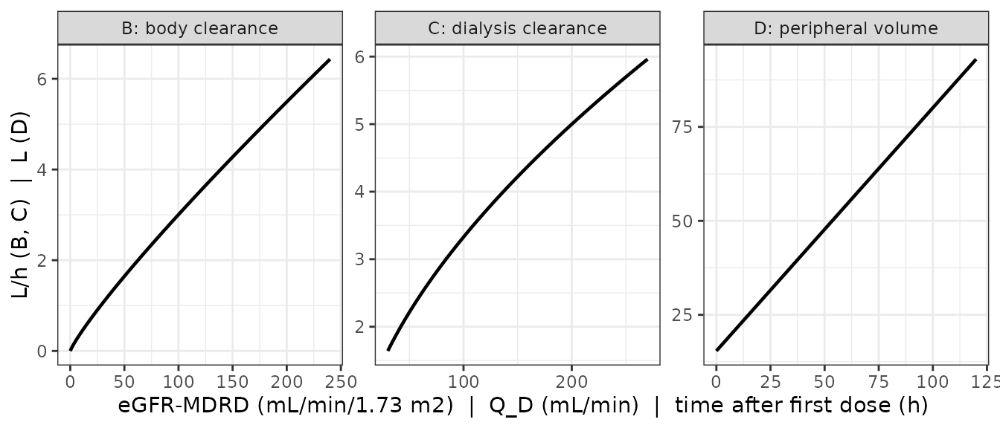
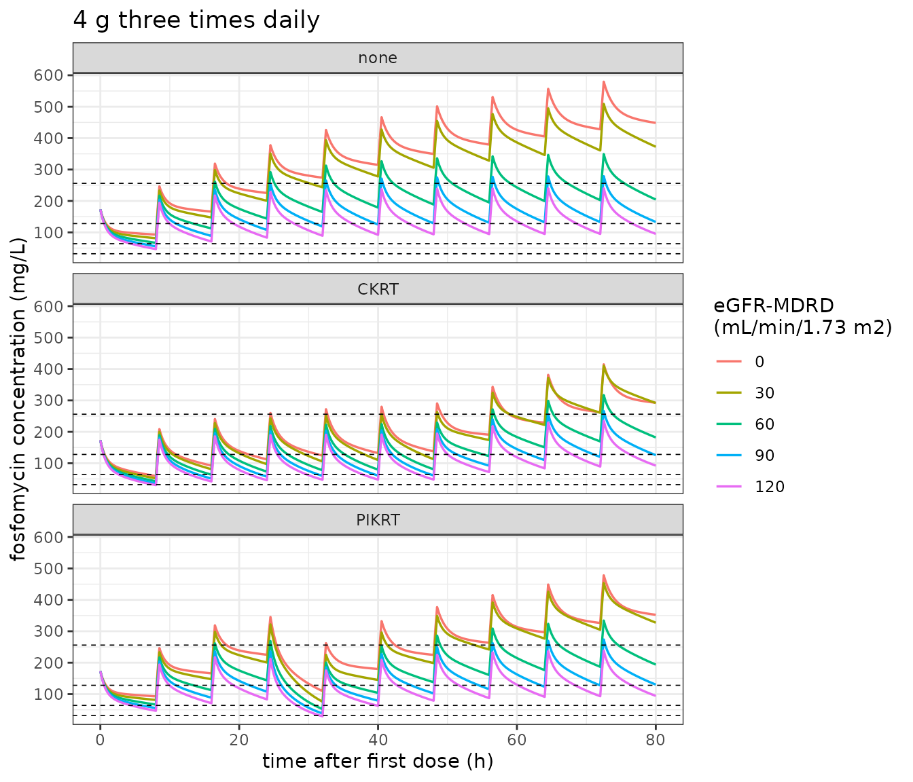

# Intravenous fosfomycin with and without kidney replacement therapy (Gotz 2025)

## Model and source

- Citation: Gotz KM, Kreuer S, Volz AK, Parker SL, Roberts JA,
  Dimopoulos G, Dimski T, Kindgen-Milles D, Beuche LKV, Kielstein JT,
  Lehr T. Population pharmacokinetics of intravenous fosfomycin: dose
  optimization for critically ill patients with and without kidney
  replacement therapy. Antimicrob Agents Chemother.
  2025;69(6):e01779-24. <doi:10.1128/aac.01779-24>
- Article: [Antimicrob Agents Chemother.
  2025;69(6):e01779-24](https://doi.org/10.1128/aac.01779-24)
- Supplement: [Table S1 and Figures S1-S8
  (AAC01779-24-S0001.pdf)](https://doi.org/10.1128/aac.01779-24)

Fosfomycin is a small (MW 138), hydrophilic, essentially
non-protein-bound antibiotic that is not metabolised and is eliminated
primarily by the kidneys, which makes it highly dialysable. Gotz 2025
pools four prospective observational studies (45 critically ill
patients, 727 concentrations) to build a single model that spans
patients on prolonged-intermittent kidney replacement therapy (PIKRT),
on continuous KRT (CKRT), and on no KRT at all.

The structural model is two-compartment with **two parallel clearance
arms** that sum to total clearance (Fig. 3A of the paper):

- a **body clearance** arm, a power function of MDRD-estimated
  glomerular filtration rate normalised to the 48.4 mL/min/1.73 m^2
  cohort median, gated off entirely in anuric patients and in the study
  B cohort; and
- a **dialysis clearance** arm, a power function of dialysate flow rate
  normalised to 42 mL/min, gated on/off by whether KRT is currently
  running.

The **peripheral** volume of distribution expands linearly with time
since the first dose, at 0.07% per minute, **restricted to anuric
patients**.

Two design choices distinguish this model from its predecessor
`Huppe_2023_fosfomycin`, which is study C of this very pool and is
therefore a proper subset of these data:

- Kidney function enters as **BSA-normalised MDRD eGFR** rather than a
  raw *measured* urinary creatinine clearance, because only two of the
  four pooled studies measured urine creatinine at all (Discussion).
- The dialysis arm is a **plain power function of dialysate flow rate**
  rather than the Michaels hemodialyzer equation. Gotz 2025 evaluated
  the Michaels equation and rejected it: its mass transfer-area
  coefficient is dialyzer-specific, the pooled studies used different
  dialyzers, and this “would have limited the generalizability of our
  model findings” (Discussion). The pay-off is that a single `DFR` value
  now indexes the KRT modality, so CKRT and PIKRT are simulated with the
  same equation at 42 and 250 mL/min.

``` r

mod <- rxode2::rxode(readModelDb("Gotz_2025_fosfomycin"))
mod
#>  ── rxode2-based free-form 2-cmt ODE model ────────────────────────────────────── 
#>  ── Initalization: ──  
#> Fixed Effects ($theta): 
#>              lcl_body        e_crcl_cl_body                   lvc 
#>             0.4700036             0.8690000             3.1398326 
#>                   lvp             e_tsfd_vp                    lq 
#>             2.7343675             0.0007000             2.4849066 
#>      lcl_hemodialysis e_dfr_cl_hemodialysis                propSd 
#>             0.6931472             0.5870000             0.1470000 
#>                 addSd 
#>            21.9000000 
#> 
#> Omega ($omega): 
#>             etalcl_body  etalvc  etalvp
#> etalcl_body     0.53983 0.00000 0.00000
#> etalvc          0.00000 0.44437 0.00000
#> etalvp          0.00000 0.00000 0.40914
#> attr(,"lotriLabels")
#> [1] "IIV on body clearance (variance; 84.6 %CV)"                   
#> [2] "IIV on central volume of distribution (variance; 74.8 %CV)"   
#> [3] "IIV on peripheral volume of distribution (variance; 71.1 %CV)"
#> attr(,"lotriFix")
#>             etalcl_body etalvc etalvp
#> etalcl_body       FALSE  FALSE  FALSE
#> etalvc            FALSE  FALSE  FALSE
#> etalvp            FALSE  FALSE  FALSE
#> 
#> States ($state or $stateDf): 
#>   Compartment Number Compartment Name
#> 1                  1          central
#> 2                  2      peripheral1
#>  ── μ-referencing ($muRefTable): ──  
#>      theta         eta level covariates
#> 1 lcl_body etalcl_body    id           
#> 2      lvc      etalvc    id           
#> 3      lvp      etalvp    id           
#> 
#>  ── Model (Normalized Syntax): ── 
#> function() {
#>     compartmentData <- list(central = list(analyte = "fosfomycin", 
#>         units = "mg", specimen = "plasma", verified = TRUE), 
#>         peripheral1 = list(analyte = "fosfomycin", units = "mg", 
#>             specimen = "plasma", verified = TRUE))
#>     covariateData <- list(CRCL = list(description = "Estimated glomerular filtration rate calculated with the MDRD equation", 
#>         units = "mL/min/1.73 m^2", type = "continuous", reference_category = NULL, 
#>         notes = "BSA-NORMALIZED, creatinine-based eGFR from the four-variable MDRD equation, which Table S1 of the supplement gives as 175 * SCr^-1.154 * age^-0.203 (* 0.742 if female) (* 1.212 if black), with SCr in mg/dL and age in years. Time-varying: recalculated from repeated serum creatinine measurements, a median (range) of 4 (0-10) per patient (Methods, Data analysis). The 48.4 mL/min/1.73 m^2 normalisation constant is the entire-cohort median in Table 1, not a rounded standard. Gotz 2025 deliberately chose eGFR_MDRD over the alternatives it also screened: Cockcroft-Gault eCrCL was rejected because the KRT patients were considerably heavier than the non-KRT patients so a weight-containing equation would overestimate their kidney function, CKD-EPI was rejected because its accuracy is best above 60 mL/min/1.73 m^2, and measured 24-hour urinary CrCL was available in only two of the four pooled studies (Discussion). Absolute (non-BSA-normalized) eGFR_MDRD in mL/min was also tested and did NOT improve the fit (Results), so the model is calibrated against the BSA-NORMALIZED value and the canonical mL/min/1.73 m^2 units are the correct ones here. This is a DIFFERENT kidney-function marker from the one in the sibling model Huppe_2023_fosfomycin.R, which uses a raw, non-normalized MEASURED urinary creatinine clearance; the two are not interchangeable.", 
#>         source_name = "eGFR_MDRD"), URINE_VOL_24H = list(description = "24-hour urine output, used as the anuria gate", 
#>         units = "mL/24h", type = "continuous", reference_category = NULL, 
#>         notes = "Gates TWO separate parts of the model, in OPPOSITE directions, and is the only covariate in this model that does so. (1) Body clearance is switched off in anuric patients: Methods, Model development, 'CL_body was fixed to 0 in patients presenting 24-hour urine output < 100 mL', printed again in Table 2 footnote b as '(x 0 if 24 - h urine output < 100 mL)'. (2) The time-dependent expansion of the peripheral volume applies ONLY to anuric patients: Results, Population pharmacokinetic model, 'As this variation in the distribution of fosfomycin may primarily occur in patients experiencing fluid retention ... the increasing V_P was restricted to patients experiencing anuria.' Table 2 footnote c omits this second gate; the restriction is confirmed against the paper's own Figure S6 simulations - see the vignette source-trace section and Errata. Ten of 45 patients (22.2%) were anuric (Results, Patients). Entire-cohort median (IQR) 24-hour urine output 410 (0-1400) mL, ranging from 25 mL in study C to 3400 mL in study D (Table 1). The 100 mL/24h cutoff is the paper's own definition of anuria (Table 1 footnote a) and coincides with the preserved-diuresis cutoff already used by the sibling model Huppe_2023_fosfomycin.R. The bare ANURIA canonical is deliberately NOT used: the source ascertains anuria from a urine VOLUME against a stated cutoff rather than tabulating a yes/no flag, and the sibling fosfomycin model encodes the identical cutoff from the identical column.", 
#>         source_name = "24-hour urine output"), RRT_CRRT_ACTIVE = list(description = "Kidney-replacement-therapy-active indicator (1 while KRT is running, 0 otherwise)", 
#>         units = "(binary)", type = "binary", reference_category = "0 (no KRT running)", 
#>         notes = "Time-varying WITHIN subject. Methods, Model development: 'CL_KRT was fixed to 0 for patients not receiving KRT or time periods between KRT sessions.' The pooled data set supports this because blood samples were available between KRT sessions (study B) and on non-dialysis days (study C) - the Discussion identifies this as what makes CL_body and CL_KRT separately identifiable. Covers BOTH modalities in this model. Gotz 2025 fits ONE dialysis-clearance equation to continuous KRT (CKRT, study C, CVVHD) and to prolonged-intermittent KRT (PIKRT, studies A-B, Genius batch dialysis); the modalities are distinguished only by their dialysate flow rate DFR and by how long the KRT period lasts, not by a separate parameter. The canonical's own definition spans 'a continuous or extended extracorporeal renal-replacement-therapy modality', explicitly including sustained low-efficiency dialysis and extended daily diafiltration, which is the class PIKRT belongs to; so the single RRT_CRRT_ACTIVE column is the right gate for both and RRT_HEMODIAL_ACTIVE is not additionally needed. Simulation settings (Methods, Simulations): CKRT for 48 h from the start of treatment, PIKRT for 8 h on the second day of treatment. 33 of 45 patients (73.3%) underwent KRT - 18 PIKRT and 15 CKRT.", 
#>         source_name = "KRT"), DFR = list(description = "Dialysate flow rate through the extracorporeal circuit", 
#>         units = "mL/min", type = "continuous", reference_category = NULL, 
#>         notes = "Time-varying within subject; the single driver of the dialysis clearance arm, which enters as a power function normalised to 42 mL/min (the entire-cohort median in Table 1). Entire-cohort median (IQR) 42 (33-50) mL/min, with a very wide between- modality spread: 190 (28-190) mL/min in study A and 250 (240-250) mL/min in study B (both PIKRT) against 33 (33-42) mL/min in study C (CKRT), P < 0.001 (Table 1). The paper's Q_D-vs-CL_KRT figure (Fig. 3C) is labelled 'Q_D (L/h)' but is in fact plotted in mL/min: CL_KRT = 2.0 * (Q_D/42)^0.587 evaluates to 1.64 L/h at Q_D = 30 and 5.96 L/h at Q_D = 270, which reproduces that panel's endpoints exactly, whereas the same values read as L/h do not. The canonical mL/min is therefore correct and the axis label is a publication erratum - see the vignette Errata. Gotz 2025 deliberately did NOT use the Michaels equation that the sibling model Huppe_2023_fosfomycin.R uses, even though it evaluated it: the mass transfer-area coefficient K0A is dialyzer-specific and varies with Q_D for small molecules, and the pooled studies used different dialyzers, 'which would have limited the generalizability of our model findings' (Discussion). Blood flow rate Q_B was screened alongside Q_D and not retained, so BFR is not a covariate of this model. Meaningful only while RRT_CRRT_ACTIVE = 1; the arm is gated off otherwise.", 
#>         source_name = "Q_D"), STUDY_GERECKE = list(description = "Study B (Gerecke 2021 PIKRT cohort) membership indicator", 
#>         units = "(binary)", type = "binary", reference_category = "0 (any of studies A, C, D, or a new patient being simulated)", 
#>         notes = "A hard, non-estimated 0/1 gate that zeroes the body-clearance arm, exactly as printed in Table 2 footnote b: '(x 0 if study B)'. Results, Population pharmacokinetic model: 'CL_body was fixed to 0 for study B since these patients presented no fosfomycin elimination without KRT (Fig. 2), which led to individual CL_body estimates close to zero.' Study B is Gerecke LKV et al., J Antimicrob Chemother 2021;77:169-173, doi:10.1093/jac/dkab357 (reference 24 of Gotz 2025; reference 2 of the supplement): eight patients on prolonged-intermittent KRT with a Genius 90 batch dialysis system. It contributed 8 of the 45 patients (17.8%). This gate is NOT the same as, and is not implied by, the anuria gate: study B's median (IQR) 24-hour urine output was 700 (500-1000) mL, so none of its patients meets the < 100 mL anuria criterion, and both gates must be carried separately. Set to 0 when simulating a new patient - the paper's own Monte Carlo simulations (Methods, Simulations; Fig. S6) do not invoke it. Its purpose here is to reproduce the published fit faithfully, and it is the reason the paper also reports a reduced data set (n = 37) without study B, whose estimates Table 2 shows to be consistent.", 
#>         source_name = "study B"))
#>     covariatesDataExcluded <- list(BFR = list(description = "Blood flow rate through the extracorporeal circuit", 
#>         units = "mL/min", type = "continuous", notes = "Screened on CL_KRT together with Q_D (Methods, Model development: 'we examined the effects of the dialyzate flow rate (Q_D) and Q_B on CL_KRT') and not retained; Q_D was 'the key variable for CL_KRT' (Discussion). Entire-cohort median (IQR) 100 (100-150) mL/min (Table 1). Retained by the sibling model Huppe_2023_fosfomycin.R, which uses the Michaels equation and therefore needs both flow rates."), 
#>         WT = list(description = "Body weight", units = "kg", 
#>             type = "continuous", notes = "Screened on all model parameters (Methods, Model development) and not retained. Entire-cohort median (IQR) 80 (70-90) kg (Table 1). Enters the model only indirectly, through the BSA used to compute eGFR_MDRD."), 
#>         AGE = list(description = "Age", units = "years", type = "continuous", 
#>             notes = "Screened on all model parameters and not retained. Entire-cohort median (IQR) 63 (57-75) years (Table 1). Enters the model only indirectly, as a term of the MDRD equation."), 
#>         SEXF = list(description = "Female sex indicator", units = "(binary)", 
#>             type = "binary", notes = "Screened on all model parameters and not retained. 11 of 45 patients (24%) were female (Table 1). Enters the model only indirectly, as the 0.742 female factor of the MDRD equation."), 
#>         BSA = list(description = "Body surface area, Mosteller equation", 
#>             units = "m^2", type = "continuous", notes = "Screened on all model parameters and not retained. Entire-cohort median (IQR) 1.96 (1.83-2.05) m^2 (Table 1). Used only to convert relative eGFR_MDRD to absolute eGFR_MDRD, a substitution that did not significantly improve the model (Results)."), 
#>         CREAT = list(description = "Serum creatinine", units = "mg/dL", 
#>             type = "continuous", notes = "Screened on all model parameters and not retained as a direct covariate. Entire-cohort median (IQR) 1.3 (0.94-2.1) mg/dL (Table 1). Enters the model only indirectly, as the principal term of the MDRD equation."), 
#>         POTASSIUM = list(description = "Serum potassium", units = "mmol/L", 
#>             type = "continuous", notes = "Screened on all model parameters and not retained. Entire-cohort median (IQR) 4.3 (4-4.5) mmol/L, missing for 44.4% of patients (studies B and D), which also prevented any evaluation of hypokalemia as an adverse effect (Methods, Data analysis)."), 
#>         SODIUM = list(description = "Serum sodium", units = "mmol/L", 
#>             type = "continuous", notes = "Screened on all model parameters and not retained. Entire-cohort median (IQR) 140 (140-150) mmol/L, missing for 44.4% of patients. Of clinical interest because intravenous fosfomycin is given as the disodium salt (Discussion)."))
#>     description <- "Two-compartment population PK model for intravenous fosfomycin in critically ill adults with and without kidney replacement therapy (KRT), pooled from four prospective observational studies (45 patients, 727 concentrations). Total clearance is the sum of two parallel arms. The body clearance arm is a power function of MDRD-estimated glomerular filtration rate normalised to the 48.4 mL/min/1.73 m^2 cohort median, switched off entirely in anuric patients (24-hour urine output < 100 mL) and in the study B cohort, which showed no fosfomycin elimination between KRT sessions. The dialysis clearance arm is a power function of the dialysate flow rate normalised to 42 mL/min and is gated to periods when KRT is actually running; the same term covers continuous KRT (Q_D = 42 mL/min) and prolonged-intermittent KRT (Q_D = 250 mL/min), which differ only in Q_D and in the duration of the KRT period. The peripheral volume of distribution expands linearly with time since the first dose, by 0.07% per minute, and this expansion is restricted to anuric patients. Interindividual variability is diagonal on body clearance and on both volumes; residual error is combined proportional plus additive (Gotz 2025)."
#>     population <- list(species = "human", n_subjects = 45L, n_studies = 4L, 
#>         n_observations = 727L, age_range = "median (IQR) 63 (57-75) years", 
#>         weight_range = "median (IQR) 80 (70-90) kg", sex_female_pct = 24, 
#>         race_ethnicity = "Not reported.", disease_state = "Critically ill adults with acute kidney injury or chronic kidney disease. 33 of 45 (73.3%) underwent kidney replacement therapy: 18 prolonged-intermittent KRT (studies A and B) and 15 continuous KRT (study C). Twelve patients (study D) required no KRT. Ten patients (22.2%) were anuric, defined as 24-hour urine output < 100 mL.", 
#>         renal_function = "Entire cohort median (IQR): eGFR_MDRD 48.4 (33.3-77.2) mL/min/1.73 m^2; eGFR_CKD-EPI 51.3 (33.9-80.4) mL/min/1.73 m^2; Cockcroft-Gault eCrCL 56.3 (45.3-89.5) mL/min; measured 24-hour urinary CrCL 0 (0-31.1) mL/min; serum creatinine 1.3 (0.94-2.1) mg/dL; 24-hour urine output 410 (0-1400) mL. eGFR_MDRD category counts at first dose (number anuric in parentheses): >= 90, 7 (1); 60-89, 8 (2); 45-59, 6 (3); 30-44, 12 (1); 15-29, 4 (3); < 15, 0 (0).", 
#>         rrt_settings = "Entire cohort median (IQR) blood flow rate 100 (100-150) mL/min and dialysate flow rate 42 (33-50) mL/min, differing sharply by modality (P < 0.001): study A 190 (28-190) mL/min for both, study B 250 (240-250) mL/min for both, study C 100 (100-100) mL/min blood flow and 33 (33-42) mL/min dialysate flow. Study A used the Genius system with a Polyflux140H polyamix hemofilter and 8-hour PIKRT episodes; study B used the GENIUS 90 batch dialysis system with Polyflux 17L, FX 60 or Polyflux 170H dialysers and 6-hour PIKRT episodes; study C used the multiFiltrate Ci-Ca with Ultraflux AV 1000S polysulfone hemofilters for CVVHD of physician-determined duration (Supplement, Kidney replacement therapy modalities).", 
#>         dose_range = "5 g three times daily intravenously in patients with KRT; 4 g four times daily or 6 g three times daily in patients without KRT. Infusion duration 30-60 min in studies A, B and D and 120 min in study C. The Monte Carlo simulations additionally explored 4, 5 and 8 g three times daily, 8 g twice daily and 4 g four times daily.", 
#>         regions = "Germany (studies A, B, C), Greece (study D).", 
#>         notes = "Pooled analysis of four prospective observational studies: A = Dimski 2021 (doi:10.1038/s41598-021-91423-9, n = 10, PIKRT), B = Gerecke 2021 (doi:10.1093/jac/dkab357, n = 8, PIKRT), C = Huppe 2023 (doi:10.1038/s41598-023-45084-5, n = 15, CVVHD), D = Parker 2015 (doi:10.1128/AAC.01321-15, n = 12, no KRT). Study C is the source of the sibling model Huppe_2023_fosfomycin.R already in this library, so that model is a proper subset of this one's data. Missing data were handled by median imputation for entirely missing patient characteristics and by last-observation-carried-forward for continuous laboratory data (Methods, Data analysis). Study B contributed no height, BMI, BSA or laboratory markers; serum potassium and sodium were missing for 44.4% of patients and measured 24-hour urinary CrCL for 40.0%. Estimation was by FOCE with interaction in NONMEM 7.4. The final model was evaluated by a prediction-corrected VPC on 1000 replicates (Fig. S4, S5). All final estimates had RSE <= 32% (Table 2), and a sensitivity re-fit excluding study B (n = 37) gave consistent estimates.")
#>     reference <- "Gotz KM, Kreuer S, Volz AK, Parker SL, Roberts JA, Dimopoulos G, Dimski T, Kindgen-Milles D, Beuche LKV, Kielstein JT, Lehr T. Population pharmacokinetics of intravenous fosfomycin: dose optimization for critically ill patients with and without kidney replacement therapy. Antimicrob Agents Chemother. 2025;69(6):e01779-24. doi:10.1128/aac.01779-24"
#>     units <- list(time = "h", dosing = "mg", concentration = "mg/L")
#>     vignette <- "Gotz_2025_fosfomycin"
#>     ini({
#>         lcl_body <- 0.470003629245736
#>         label("Typical body clearance CL_body at the cohort-median eGFR_MDRD (L/h)")
#>         e_crcl_cl_body <- 0.869
#>         label("Power exponent on (CRCL/48.4) for body clearance (unitless)")
#>         lvc <- 3.13983261752775
#>         label("Typical central volume of distribution Vc (L)")
#>         lvp <- 2.73436750941958
#>         label("Typical peripheral volume of distribution Vp at time of first dose (L)")
#>         e_tsfd_vp <- 7e-04
#>         label("Linear slope on peripheral volume per minute since the first dose (1/min)")
#>         lq <- 2.484906649788
#>         label("Typical intercompartmental clearance Q (L/h)")
#>         lcl_hemodialysis <- 0.693147180559945
#>         label("Typical dialysis clearance CL_KRT at a dialysate flow rate of 42 mL/min (L/h)")
#>         e_dfr_cl_hemodialysis <- 0.587
#>         label("Power exponent on (DFR/42) for dialysis clearance (unitless)")
#>         propSd <- c(0, 0.147)
#>         label("Proportional residual error (fraction, i.e. 14.7 %CV)")
#>         addSd <- c(0, 21.9)
#>         label("Additive residual error (mg/L)")
#>         etalcl_body ~ 0.53983
#>         label("IIV on body clearance (variance; 84.6 %CV)")
#>         etalvc ~ 0.44437
#>         label("IIV on central volume of distribution (variance; 74.8 %CV)")
#>         etalvp ~ 0.40914
#>         label("IIV on peripheral volume of distribution (variance; 71.1 %CV)")
#>     })
#>     model({
#>         anuric <- (URINE_VOL_24H < 100)
#>         diuresis <- 1 - anuric
#>         tsfd_min <- t * 60
#>         cl_body <- diuresis * (1 - STUDY_GERECKE) * exp(lcl_body + 
#>             etalcl_body) * (CRCL/48.4)^e_crcl_cl_body
#>         cl_hemodialysis <- RRT_CRRT_ACTIVE * exp(lcl_hemodialysis) * 
#>             (DFR/42)^e_dfr_cl_hemodialysis
#>         cl_total <- cl_body + cl_hemodialysis
#>         vc <- exp(lvc + etalvc)
#>         vp <- exp(lvp + etalvp) * (1 + anuric * e_tsfd_vp * tsfd_min)
#>         q <- exp(lq)
#>         kel <- cl_total/vc
#>         k12 <- q/vc
#>         k21 <- q/vp
#>         d/dt(central) <- -kel * central - k12 * central + k21 * 
#>             peripheral1
#>         d/dt(peripheral1) <- k12 * central - k21 * peripheral1
#>         Cc <- central/vc
#>         Cc ~ prop(propSd) + add(addSd)
#>     })
#> }
```

## Population

Forty-five critically ill adults with acute kidney injury or chronic
kidney disease, pooled from four prospective observational studies (Gotz
2025 Table 1 and Fig. 1):

| Study | Source | n | KRT modality |
|----|----|----|----|
| A | Dimski 2021, [doi:10.1038/s41598-021-91423-9](https://doi.org/10.1038/s41598-021-91423-9) | 10 | PIKRT (Genius, 8 h episodes) |
| B | Gerecke 2021, [doi:10.1093/jac/dkab357](https://doi.org/10.1093/jac/dkab357) | 8 | PIKRT (GENIUS 90, 6 h episodes) |
| C | Huppe 2023, [doi:10.1038/s41598-023-45084-5](https://doi.org/10.1038/s41598-023-45084-5) | 15 | CKRT (CVVHD) |
| D | Parker 2015, [doi:10.1128/AAC.01321-15](https://doi.org/10.1128/AAC.01321-15) | 12 | none |

Median (IQR) age 63 (57-75) years and weight 80 (70-90) kg; 11 of 45
(24%) were female. Median (IQR) eGFR-MDRD was 48.4 (33.3-77.2)
mL/min/1.73 m^2 and 24-hour urine output 410 (0-1400) mL. **Ten patients
(22.2%) were anuric**, the paper’s definition being a 24-hour urine
output below 100 mL; this subgroup carries both of the model’s
`URINE_VOL_24H` gates. Median (IQR) dialysate flow rate was 42 (33-50)
mL/min overall but differed sharply by modality (P \< 0.001): 190 and
250 mL/min in the two PIKRT studies against 33 mL/min in the CKRT study.

Dosing was 5 g three times daily with KRT, and 4 g four times daily or 6
g three times daily without. Estimation was FOCE with interaction in
NONMEM 7.4; all final estimates had RSE \<= 32%, and a sensitivity
re-fit excluding study B (n = 37) gave consistent estimates (Table 2).

## Source trace

Every value in `ini()` comes from the **“Final model / Full data set (n
= 45)”** column of Gotz 2025 Table 2. The structural equations come from
that table’s footnotes b, c and d.

| Model quantity | Parameter | Value | Source |
|----|----|----|----|
| Body clearance intercept | `lcl_body` | 1.6 L/h | Table 2, `theta_CL` (RSE 20%) |
| eGFR effect on body clearance | `e_crcl_cl_body` | 0.869 | Table 2, `theta_KF` (RSE 25%) |
| Central volume | `lvc` | 23.1 L | Table 2, `theta_VC` (RSE 10%) |
| Peripheral volume at first dose | `lvp` | 15.4 L | Table 2, `theta_VP` (RSE 18%) |
| Time effect on peripheral volume | `e_tsfd_vp` | 0.0007 min^-1 | Table 2, `theta_T` (RSE 28%) |
| Intercompartmental clearance | `lq` | 12.0 L/h | Table 2, `theta_Q` (RSE 17%) |
| Dialysis clearance intercept | `lcl_hemodialysis` | 2.0 L/h | Table 2, `theta_KRT` (RSE 15%) |
| Dialysate-flow effect | `e_dfr_cl_hemodialysis` | 0.587 | Table 2, `theta_QD` (RSE 16%) |
| IIV on body clearance | `etalcl_body` | 84.6 %CV | Table 2, `eta_CL` (RSE 14%) |
| IIV on central volume | `etalvc` | 74.8 %CV | Table 2, `eta_VC` (RSE 12%) |
| IIV on peripheral volume | `etalvp` | 71.1 %CV | Table 2, `eta_VP` (RSE 32%) |
| Proportional residual error | `propSd` | 14.7 %CV | Table 2, residual variability |
| Additive residual error | `addSd` | 21.9 mg/L | Table 2, residual variability |
| `CL_body = theta_CL (eGFR/48.4)^theta_KF exp(eta_CL) x 0 if study B x 0 if urine < 100 mL` |  |  | Table 2 footnote b |
| `V_peripheral = theta_VP (1 + TSFD x theta_T) exp(eta_VP)` |  |  | Table 2 footnote c |
| `CL_KRT = theta_DIAL (Q_D/42)^theta_QD` |  |  | Table 2 footnote d |
| `%CV = sqrt(exp(omega^2) - 1)` |  |  | Table 2 footnote e |

Two of those rows needed work to recover, and both are recorded in the
Errata below: the **IIV scale** (footnote e’s radical sign and
superscript survive only in the publisher’s equation artwork) and the
**anuria restriction on `e_tsfd_vp`** (stated in Results but absent from
footnote c).

## Covariate relationships reproduce Figures 3B-3D

Figure 3 of the paper plots each covariate relationship over its
simulated range. Reproducing those three panels is a closed-form check
on the parameter values and, for panel C, on the units of `DFR`.

``` r

theta <- list(cl = 1.6, kf = 0.869, vp = 15.4, tt = 7e-4, krt = 2.0, qd = 0.587)

fig3 <- dplyr::bind_rows(
  data.frame(panel = "B: body clearance", x = seq(0, 240, 1)) |>
    dplyr::mutate(y = theta$cl * (x / 48.4)^theta$kf),
  data.frame(panel = "C: dialysis clearance", x = seq(30, 270, 1)) |>
    dplyr::mutate(y = theta$krt * (x / 42)^theta$qd),
  data.frame(panel = "D: peripheral volume", x = seq(0, 120, 1)) |>
    dplyr::mutate(y = theta$vp * (1 + x * 60 * theta$tt))
)

ggplot2::ggplot(fig3, ggplot2::aes(x, y)) +
  ggplot2::geom_line(linewidth = 0.8) +
  ggplot2::facet_wrap(~panel, scales = "free") +
  ggplot2::labs(
    x = "eGFR-MDRD (mL/min/1.73 m2)  |  Q_D (mL/min)  |  time after first dose (h)",
    y = "L/h (B, C)  |  L (D)"
  ) +
  ggplot2::theme_bw()
```



Replicates Figure 3B-3D of Gotz 2025. The published panels are read at
their endpoints and must be matched exactly, since these are algebraic
identities and carry no simulation noise:

``` r

fig3_chk <- data.frame(
  panel     = c("3B @ 30", "3B @ 240", "3C @ 30", "3C @ 270", "3D @ 0 h", "3D @ 120 h"),
  model     = c(
    theta$cl * (30 / 48.4)^theta$kf,  theta$cl * (240 / 48.4)^theta$kf,
    theta$krt * (30 / 42)^theta$qd,   theta$krt * (270 / 42)^theta$qd,
    theta$vp,                          theta$vp * (1 + 120 * 60 * theta$tt)
  ),
  published = c(1.06, 6.43, 1.64, 5.96, 15.4, 93.0)
)
fig3_chk$pct_diff <- 100 * (fig3_chk$model / fig3_chk$published - 1)
knitr::kable(fig3_chk, digits = 2)
```

| panel      | model | published | pct_diff |
|:-----------|------:|----------:|---------:|
| 3B @ 30    |  1.06 |      1.06 |    -0.39 |
| 3B @ 240   |  6.43 |      6.43 |     0.04 |
| 3C @ 30    |  1.64 |      1.64 |     0.09 |
| 3C @ 270   |  5.96 |      5.96 |     0.03 |
| 3D @ 0 h   | 15.40 |     15.40 |     0.00 |
| 3D @ 120 h | 93.02 |     93.00 |     0.02 |

``` r


# Algebraic identities against digitised endpoints: no simulation, no cohort,
# no random draw, so a tight bound is the correct assertion here.
stopifnot(all(abs(fig3_chk$pct_diff) < 1))
```

Panel C carries a **publication erratum**: its x-axis is labelled
`Q_D (L/h)`, but `CL_KRT = 2.0 (Q_D/42)^0.587` reproduces the plotted
curve only when the axis is read in **mL/min** – 1.64 L/h at 30 and 5.96
L/h at 270, matching the panel’s endpoints to better than 1%. Read as
L/h the same abscissae give 8.7 and 30 L/h, off the plotted ordinate
entirely. The canonical `DFR` units of mL/min are therefore correct, and
are also what the paper’s own simulation settings use (CKRT 42 mL/min,
PIKRT 250 mL/min).

## Simulation setup

Gotz 2025’s simulations (Methods, Simulations; Fig. S6) dose over 72
hours with **the first dose as an intravenous bolus and every later dose
as a 30-minute infusion**, and place KRT as follows:

- **no KRT** – `RRT_CRRT_ACTIVE = 0` throughout;
- **CKRT** – `Q_D = 42` mL/min for the first 48 hours;
- **PIKRT** – `Q_D = 250` mL/min for 8 hours on the second day (24-32
  h).

``` r

# Time-varying covariates must be materialised as data-frame columns: assigning
# to an rxEt object is silently dropped by rxode2.
build_events <- function(dose_mg, interval_h, egfr, krt = c("none", "CKRT", "PIKRT"),
                         anuric = FALSE, horizon = 80, last_dose = 72,
                         obs = NULL) {
  krt <- match.arg(krt)
  if (is.null(obs)) obs <- seq(0, horizon, by = 0.25)
  dose_times <- seq(0, last_dose, by = interval_h)
  ev <- rxode2::et(amt = dose_mg, time = 0)                                   # first dose: bolus
  ev <- rxode2::et(ev, amt = dose_mg, time = dose_times[-1], dur = 0.5)       # rest: 30-min infusions
  ev <- rxode2::et(ev, obs, cmt = "central")
  df <- as.data.frame(ev)
  on_krt <- switch(krt,
    none  = rep(FALSE, nrow(df)),
    CKRT  = df$time <= 48,
    PIKRT = df$time >= 24 & df$time <= 32
  )
  df$RRT_CRRT_ACTIVE <- as.numeric(on_krt)
  df$DFR             <- switch(krt, none = 42, CKRT = 42, PIKRT = 250)
  df$CRCL            <- egfr
  df$URINE_VOL_24H   <- if (anuric) 0 else 1500
  df$STUDY_GERECKE   <- 0        # never set for a newly simulated patient
  df
}

scenarios <- tidyr::expand_grid(
  krt  = c("none", "CKRT", "PIKRT"),
  egfr = c(0, 30, 60, 90, 120)
)
```

An eGFR of 0 mL/min/1.73 m^2 is the paper’s own anuria scenario, so
those rows are simulated with `URINE_VOL_24H = 0`: they lose the
body-clearance arm and gain the expanding peripheral volume.

## Typical-value profiles reproduce Figure S6

``` r

mod0 <- rxode2::zeroRe(mod)

profiles <- dplyr::bind_rows(lapply(seq_len(nrow(scenarios)), function(i) {
  krt  <- scenarios$krt[i]
  egfr <- scenarios$egfr[i]
  ev   <- build_events(4000, 8, egfr, krt, anuric = egfr == 0)
  rxode2::rxSolve(mod0, ev, returnType = "data.frame") |>
    dplyr::mutate(krt = krt, egfr = factor(egfr))
}))
#> ℹ omega/sigma items treated as zero: 'etalcl_body', 'etalvc', 'etalvp'
#> ℹ omega/sigma items treated as zero: 'etalcl_body', 'etalvc', 'etalvp'
#> ℹ omega/sigma items treated as zero: 'etalcl_body', 'etalvc', 'etalvp'
#> ℹ omega/sigma items treated as zero: 'etalcl_body', 'etalvc', 'etalvp'
#> ℹ omega/sigma items treated as zero: 'etalcl_body', 'etalvc', 'etalvp'
#> ℹ omega/sigma items treated as zero: 'etalcl_body', 'etalvc', 'etalvp'
#> ℹ omega/sigma items treated as zero: 'etalcl_body', 'etalvc', 'etalvp'
#> ℹ omega/sigma items treated as zero: 'etalcl_body', 'etalvc', 'etalvp'
#> ℹ omega/sigma items treated as zero: 'etalcl_body', 'etalvc', 'etalvp'
#> ℹ omega/sigma items treated as zero: 'etalcl_body', 'etalvc', 'etalvp'
#> ℹ omega/sigma items treated as zero: 'etalcl_body', 'etalvc', 'etalvp'
#> ℹ omega/sigma items treated as zero: 'etalcl_body', 'etalvc', 'etalvp'
#> ℹ omega/sigma items treated as zero: 'etalcl_body', 'etalvc', 'etalvp'
#> ℹ omega/sigma items treated as zero: 'etalcl_body', 'etalvc', 'etalvp'
#> ℹ omega/sigma items treated as zero: 'etalcl_body', 'etalvc', 'etalvp'

ggplot2::ggplot(profiles, ggplot2::aes(time, Cc, colour = egfr)) +
  ggplot2::geom_line(linewidth = 0.6) +
  ggplot2::geom_hline(yintercept = c(32, 64, 128, 256), linetype = "dashed",
                      linewidth = 0.3) +
  ggplot2::facet_wrap(~factor(krt, c("none", "CKRT", "PIKRT")), ncol = 1) +
  ggplot2::labs(
    x = "time after first dose (h)", y = "fosfomycin concentration (mg/L)",
    colour = "eGFR-MDRD\n(mL/min/1.73 m2)",
    title = "4 g three times daily"
  ) +
  ggplot2::theme_bw()
```



Replicates the “4 g TID” row of Figure S6 of Gotz 2025. The published
panels carry dashed MIC lines at 32, 64, 128 and 256 mg/L, which are
used here to calibrate the peak concentrations read off the “no KRT”
panel at the last (72 h) dose:

``` r

figS6 <- profiles |>
  dplyr::filter(krt == "none", time >= 72) |>
  dplyr::group_by(egfr) |>
  dplyr::summarise(model = max(Cc), .groups = "drop") |>
  dplyr::mutate(published = c(551, 500, 345, 285, 266),
                pct_diff  = 100 * (model / published - 1))
knitr::kable(figS6, digits = 1)
```

| egfr | model | published | pct_diff |
|:-----|------:|----------:|---------:|
| 0    | 579.6 |       551 |      5.2 |
| 30   | 509.0 |       500 |      1.8 |
| 60   | 349.4 |       345 |      1.3 |
| 90   | 278.8 |       285 |     -2.2 |
| 120  | 240.3 |       266 |     -9.7 |

``` r


# These are TYPICAL-VALUE solves -- no cohort, no random draw -- so the number is
# reproducible across rxode2 versions and a fixed bound is safe. The tolerance is
# set by the two approximations on the OTHER side of the comparison: the published
# line is the median of 2000 subjects rather than the typical-value profile, and
# the reference values are digitised off a small multiple panel.
stopifnot(all(abs(figS6$pct_diff) < 15))
```

This panel is the single most informative check in this vignette,
because it is what settles the **anuria restriction on the
peripheral-volume expansion** (see Errata). Removing that restriction
leaves the eGFR = 0 trace untouched but drives the eGFR = 30 peak from
509 down to 377 mg/L against a published 500, a 25% error that this
table would catch immediately.

## Structural gate: the ODEs are actually integrated

A two-compartment model that names a clearance and a volume can be
silently replaced by rxode2’s analytic solution, discarding the written
`d/dt()` block. Perturbing parameters that only the ODE system can see
confirms that has not happened here: `lq` enters only through the
micro-constants, and `lcl_hemodialysis` only through a gated arm.

``` r

ev_gate <- build_events(4000, 8, 60, "CKRT")
base    <- rxode2::rxSolve(mod0, ev_gate, returnType = "data.frame")
#> ℹ omega/sigma items treated as zero: 'etalcl_body', 'etalvc', 'etalvp'

# NOTE: perturb via `params =`. Assigning to `mod0$theta[[param]]` looks like it
# works and is a SILENT no-op -- the solve comes back bit-identical, which would
# make this gate vacuous rather than loud.
perturb <- function(param, factor) {
  newval <- stats::setNames(log(exp(mod0$theta[[param]]) * factor), param)
  perturbed <- rxode2::rxSolve(mod0, ev_gate, params = newval,
                               returnType = "data.frame")
  max(abs(perturbed$Cc - base$Cc))
}

ode_gate <- data.frame(
  parameter    = c("lq", "lcl_hemodialysis"),
  max_abs_diff = c(perturb("lq", 2), perturb("lcl_hemodialysis", 2))
)
#> ℹ omega/sigma items treated as zero: 'etalcl_body', 'etalvc', 'etalvp'
#> ℹ omega/sigma items treated as zero: 'etalcl_body', 'etalvc', 'etalvp'
knitr::kable(ode_gate, digits = 2)
```

| parameter        | max_abs_diff |
|:-----------------|-------------:|
| lq               |        15.54 |
| lcl_hemodialysis |        44.17 |

``` r


# Doubling either parameter must move the profile. A zero here would mean the
# written ODE system was discarded in favour of an analytic solution.
stopifnot(all(ode_gate$max_abs_diff > 1))
```

## Virtual cohort and PKNCA validation

The paper’s PK/PD analysis is driven by `AUC(24-48)/MIC`, so the NCA
interval is 24-48 hours. Dosing and concentration records are therefore
kept to what that interval needs: doses through 48 h, and observations
on a 30-minute grid from 24 to 48 h with records sitting exactly on both
interval boundaries.

``` r

n_sub <- 100
rxode2::rxSetSeed(1234)

arms <- tidyr::expand_grid(
  dose_g = c(4, 5, 8),
  egfr   = c(0, 30, 60, 90)
) |>
  dplyr::mutate(arm = sprintf("%g g TID, eGFR %g", dose_g, egfr))

nca_grid <- seq(24, 48, by = 0.5)

cohort <- dplyr::bind_rows(lapply(seq_len(nrow(arms)), function(i) {
  dose_g <- arms$dose_g[i]
  egfr   <- arms$egfr[i]
  ev <- build_events(dose_g * 1000, 8, egfr, "CKRT", anuric = egfr == 0,
                     last_dose = 48, obs = nca_grid)
  rxode2::rxSolve(mod, ev, nSub = n_sub, returnType = "data.frame") |>
    dplyr::rename(id = sim.id) |>
    dplyr::mutate(arm = arms$arm[i], dose_mg = dose_g * 1000)
}))

dose_records <- cohort |>
  dplyr::distinct(arm, id, dose_mg) |>
  tidyr::expand_grid(time = seq(0, 48, by = 8))
```

``` r

conc_obj <- PKNCA::PKNCAconc(
  dplyr::filter(cohort, !is.na(Cc)),
  Cc ~ time | arm + id
)
dose_obj <- PKNCA::PKNCAdose(dose_records, dose_mg ~ time | arm + id)

intervals <- data.frame(
  start = 24, end = 48,
  auclast = TRUE, cmax = TRUE, cmin = TRUE
)

nca <- PKNCA::pk.nca(PKNCA::PKNCAdata(conc_obj, dose_obj, intervals = intervals))

nca_wide <- as.data.frame(nca) |>
  dplyr::select(arm, id, PPTESTCD, PPORRES) |>
  tidyr::pivot_wider(names_from = PPTESTCD, values_from = PPORRES)
head(nca_wide)
#> # A tibble: 6 × 5
#>   arm                id auclast  cmax  cmin
#>   <chr>           <int>   <dbl> <dbl> <dbl>
#> 1 4 g TID, eGFR 0     1   3978.  322. 107. 
#> 2 4 g TID, eGFR 0     2   1967.  120.  50.1
#> 3 4 g TID, eGFR 0     3   4536.  257. 129. 
#> 4 4 g TID, eGFR 0     4   4384.  277. 123. 
#> 5 4 g TID, eGFR 0     5   2657.  148.  72.6
#> 6 4 g TID, eGFR 0     6   3412.  313.  87.3
```

### Reading the IIV back out of the simulation

This is the check that validates the `%CV = sqrt(exp(omega^2) - 1)`
back-transformation described in Errata 1. The individual parameters are
pulled straight out of a simulated cohort and summarised **the way Table
2 defines them**, so the three numbers below should reproduce that
table’s `Random effects: IIV` column. Had the published %CV values been
entered as variances, or the radical sign been missed, they would be
wrong by tens of percent.

The primary check is deterministic: take the variances actually encoded
in the model object and push them back through the paper’s own formula.
This is an exact round trip, with no cohort and no random draw, so it is
the assertion that carries the tight bound.

``` r

omega_diag <- diag(mod$omega)

readback <- data.frame(
  Parameter          = c("CL_body", "Vc", "Vp"),
  `omega encoded`    = as.numeric(omega_diag),
  `%CV round trip`   = 100 * sqrt(exp(as.numeric(omega_diag)) - 1),
  `%CV Table 2`      = c(84.6, 74.8, 71.1),
  check.names        = FALSE
)
knitr::kable(readback, digits = c(0, 5, 1, 1))
```

| Parameter | omega encoded | %CV round trip | %CV Table 2 |
|:----------|--------------:|---------------:|------------:|
| CL_body   |       0.53983 |           84.6 |        84.6 |
| Vc        |       0.44437 |           74.8 |        74.8 |
| Vp        |       0.40914 |           71.1 |        71.1 |

``` r


# Exact algebraic round trip of Table 2's "Random effects: IIV" column. Entering
# the published 0.846 as a variance would print 116 %CV here, and dropping
# footnote e's radical sign would print 108 %CV; both miss by far more than this
# bound.
stopifnot(all(abs(readback$`%CV round trip` - readback$`%CV Table 2`) < 0.05))
```

The second check confirms the *simulator* actually draws from those
variances, rather than the model merely storing them.

``` r

ev_draw <- rxode2::et(amt = 4000, time = 0) |>
  rxode2::et(c(0, 1, 2), cmt = "central") |>
  as.data.frame() |>
  dplyr::mutate(CRCL = 48.4, DFR = 42, RRT_CRRT_ACTIVE = 0,
                URINE_VOL_24H = 1500, STUDY_GERECKE = 0)

draws <- rxode2::rxSolve(mod, ev_draw, nSub = n_sub, returnType = "data.frame") |>
  dplyr::filter(time == 0)

drawn <- data.frame(
  Parameter        = c("CL_body", "Vc", "Vp"),
  `omega drawn`    = c(sd(log(draws$cl_body)), sd(log(draws$vc)), sd(log(draws$vp))),
  `omega encoded`  = sqrt(as.numeric(omega_diag)),
  check.names      = FALSE
)
knitr::kable(drawn, digits = 3)
```

| Parameter | omega drawn | omega encoded |
|:----------|------------:|--------------:|
| CL_body   |       0.710 |         0.735 |
| Vc        |       0.705 |         0.667 |
| Vp        |       0.605 |         0.640 |

``` r


# A 100-subject sample estimates omega with a standard error of
# omega/sqrt(2n) = 0.05, so the sampling scatter here is real and expected; the
# band is deliberately loose because rxSetSeed does not fix the draw across
# rxode2 versions or thread counts. The tight statement about the variance
# convention is the deterministic round trip above, not this table.
stopifnot(all(abs(drawn$`omega drawn` - drawn$`omega encoded`) < 0.25))
```

### Probability of target attainment against Table 3

Table 3 of Gotz 2025 lists the lowest dosage reaching a given PTA for
the `AUC(24-48)/MIC` targets of 83.3 (bactericidal) and 22.7
(bacteriostatic). The CKRT arms simulated above are compared against the
`MIC = 32 mg/L` bactericidal column.

``` r

pta <- nca_wide |>
  dplyr::left_join(dplyr::select(arms, arm, dose_g, egfr), by = "arm") |>
  dplyr::group_by(dose_g, egfr) |>
  dplyr::summarise(
    median_auc  = median(auclast),
    pta_cidal   = 100 * mean(auclast / 32 >= 83.3),
    pta_static  = 100 * mean(auclast / 32 >= 22.7),
    .groups = "drop"
  ) |>
  dplyr::rename(
    "Dose (g TID)"                = dose_g,
    "eGFR-MDRD"                   = egfr,
    "Median AUC(24-48) (mg*h/L)"  = median_auc,
    "PTA bactericidal (%)"        = pta_cidal,
    "PTA bacteriostatic (%)"      = pta_static
  )
knitr::kable(pta, digits = 1)
```

| Dose (g TID) | eGFR-MDRD | Median AUC(24-48) (mg\*h/L) | PTA bactericidal (%) | PTA bacteriostatic (%) |
|---:|---:|---:|---:|---:|
| 4 | 0 | 3877.5 | 90 | 100 |
| 4 | 30 | 3480.6 | 92 | 100 |
| 4 | 60 | 2885.7 | 60 | 100 |
| 4 | 90 | 2301.3 | 29 | 99 |
| 5 | 0 | 4891.7 | 99 | 100 |
| 5 | 30 | 4280.1 | 91 | 100 |
| 5 | 60 | 3392.3 | 75 | 99 |
| 5 | 90 | 2962.3 | 58 | 98 |
| 8 | 0 | 7982.7 | 100 | 100 |
| 8 | 30 | 6949.2 | 100 | 100 |
| 8 | 60 | 5582.2 | 97 | 100 |
| 8 | 90 | 5114.5 | 91 | 100 |

Table 3’s `MIC = 32 mg/L` bactericidal recommendations during KRT are 4
g TID at anuria, 5 g TID at eGFR \<= 30, and 8 g TID at eGFR \<= 90. The
three corresponding cells above are the gate; every one of them is a
dose the paper declares sufficient, so each must clear the PTA target.

``` r

pta_gate <- pta |>
  dplyr::filter(
    (`Dose (g TID)` == 4 & `eGFR-MDRD` == 0) |
    (`Dose (g TID)` == 5 & `eGFR-MDRD` == 30) |
    (`Dose (g TID)` == 8 & `eGFR-MDRD` %in% c(60, 90))
  )
knitr::kable(pta_gate, digits = 1)
```

| Dose (g TID) | eGFR-MDRD | Median AUC(24-48) (mg\*h/L) | PTA bactericidal (%) | PTA bacteriostatic (%) |
|---:|---:|---:|---:|---:|
| 4 | 0 | 3877.5 | 90 | 100 |
| 5 | 30 | 4280.1 | 91 | 100 |
| 8 | 60 | 5582.2 | 97 | 100 |
| 8 | 90 | 5114.5 | 91 | 100 |

``` r


# PTA is a proportion over 100 subjects, so its standard error near 90% is about
# 3%. The bound is set at 80 rather than 90 to stay off the knife edge: the point
# of this gate is to catch a structurally broken exposure (which would miss by
# tens of percent), not to re-derive the paper's rounding.
stopifnot(all(pta_gate$`PTA bactericidal (%)` >= 80))
```

The bacteriostatic column is a wider margin and is expected to be
saturated: Table 3 gives 4 g TID as bacteriostatic at `MIC = 32 mg/L` in
**every** scenario.

``` r

stopifnot(all(pta$`PTA bacteriostatic (%)`[pta$`Dose (g TID)` == 4] >= 90))
```

### Steady-state consistency for a non-anuric patient

For a non-anuric patient the peripheral volume is constant, so the model
reaches a genuine steady state and average concentration over a dosing
interval must equal `dose / (CL x tau)` exactly. An anuric patient never
reaches steady state, because the peripheral volume keeps growing – a
qualitative contrast worth recording.

``` r

ss_check <- function(egfr, anuric) {
  ev <- build_events(4000, 8, egfr, "none", anuric = anuric, horizon = 240)
  s  <- rxode2::rxSolve(mod0, ev, returnType = "data.frame")
  win <- s[s$time >= 64 & s$time <= 72, ]
  cavg <- sum(diff(win$time) * (head(win$Cc, -1) + tail(win$Cc, -1)) / 2) / 8
  cl   <- 1.6 * (egfr / 48.4)^0.869 * (!anuric)
  c(cavg = cavg, predicted = if (cl > 0) 4000 / (cl * 8) else NA_real_)
}

ss <- rbind(
  `eGFR 60, diuresis` = ss_check(60, FALSE),
  `eGFR 90, diuresis` = ss_check(90, FALSE)
) |> as.data.frame()
#> ℹ omega/sigma items treated as zero: 'etalcl_body', 'etalvc', 'etalvp'
#> ℹ omega/sigma items treated as zero: 'etalcl_body', 'etalvc', 'etalvp'
ss$pct_diff <- 100 * (ss$cavg / ss$predicted - 1)
knitr::kable(ss, digits = 2)
```

|                   |   cavg | predicted | pct_diff |
|:------------------|-------:|----------:|---------:|
| eGFR 60, diuresis | 251.62 |    259.28 |    -2.95 |
| eGFR 90, diuresis | 180.99 |    182.28 |    -0.71 |

``` r


# Both sides use the SAME typical parameters, so the only difference is how
# close the 64-72 h interval is to true steady state (terminal half-life is
# 10-17 h here). This is numerical, not stochastic, so a tight bound is right.
stopifnot(all(abs(ss$pct_diff) < 10))
```

## Assumptions and deviations (Errata)

1.  **The IIV scale is recovered from the publisher’s equation artwork,
    not from the text.** Table 2 footnote e reads, in both `pdftotext`
    output and the markdown conversion of the PDF,
    `IIV calculated from exp(omega^2) - 1. omega = variance` – with no
    radical sign. The footnote is typeset as an inline image
    (`aac.01779-24.im004.jpg` in the article’s media bundle), and that
    image reads `sqrt(exp(omega^2) - 1)`. The radical is dropped by
    every text extractor. The variances in `ini()` are therefore
    `log(CV^2 + 1)`. The trailing `omega = variance` is a typo for
    `omega^2 = variance`: as printed it contradicts the formula it
    annotates, which squares `omega` inside the exponential. Note that
    both readings of that clause yield the *same* number, because the
    quantity inside [`exp()`](https://rdrr.io/r/base/Log.html) is the
    variance either way; only the perverse `exp(variance^2)` reading
    differs, and it is excluded both by the standard NONMEM convention
    and by the omega read-back above.
2.  **The anuria restriction on `e_tsfd_vp` is taken from Results,
    against a table footnote that omits it.** Results states plainly
    that “the increasing V_P was restricted to patients experiencing
    anuria”, but Table 2 footnote c prints
    `V_peripheral = theta_VP (1 + TSFD x theta_T) exp(eta_VP)` with no
    gate – and footnote b *does* print its two gates, so the omission is
    not the table’s house style. The restriction was adjudicated against
    the paper’s own Figure S6: with the gate, the model reproduces the
    published 72-hour peaks at eGFR 0/30/60/90/120 to +5/+2/+1/-2/-10%;
    without it, eGFR 30 and 60 land 25% and 13% low. The gate is
    implemented.
3.  **Figure 3C’s x-axis label is wrong.** It reads `Q_D (L/h)` but is
    plotted in mL/min; see the Figure 3 section above for the
    arithmetic. This affects only the figure, not the parameter: `DFR`
    is carried in the canonical mL/min, the units the 42 mL/min
    normalisation constant and the paper’s own simulation settings both
    use.
4.  **`TSFD` is the model’s own clock.** `theta_T` was estimated per
    minute, so the model computes `tsfd_min <- t * 60`. Any event table
    used with this model **must** place the first dose at `time = 0`, or
    the peripheral-volume trajectory is wrong.
5.  **`STUDY_GERECKE` is set to 0 for all simulation here**, as the
    paper’s own Monte Carlo scenarios do. It exists to reproduce the
    published fit, in which study B’s body clearance was fixed to zero.
6.  **No published NCA table exists to compare against.** Gotz 2025
    reports no Cmax / Tmax / AUC / half-life summary, so
    [`ncaComparisonTable()`](https://nlmixr2.github.io/nlmixr2lib/reference/ncaComparisonTable.md)
    has no reference column. The PKNCA output is instead validated
    against the paper’s own PK/PD currency, `AUC(24-48)/MIC` versus the
    Table 3 dosing recommendations, and against the closed-form
    steady-state and omega read-back identities above.
7.  **The cohort covariates are held fixed within an arm.** The paper’s
    simulations do the same – Fig. S6 and Table 3 stratify by discrete
    eGFR values rather than sampling a demographic distribution – so no
    virtual covariate distribution is constructed here. Interindividual
    variability enters through the three etas only.
8.  **`Huppe_2023_fosfomycin` is study C of this pool.** The two models
    are not independent, and their kidney-function covariates are not
    interchangeable: Huppe uses a raw *measured* urinary creatinine
    clearance in mL/min, Gotz uses a BSA-normalised MDRD eGFR in
    mL/min/1.73 m^2.
