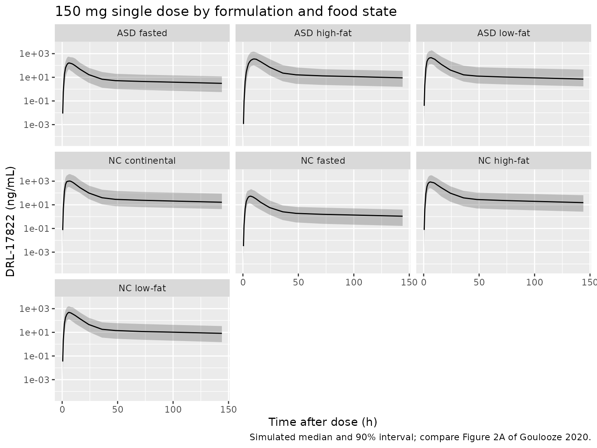
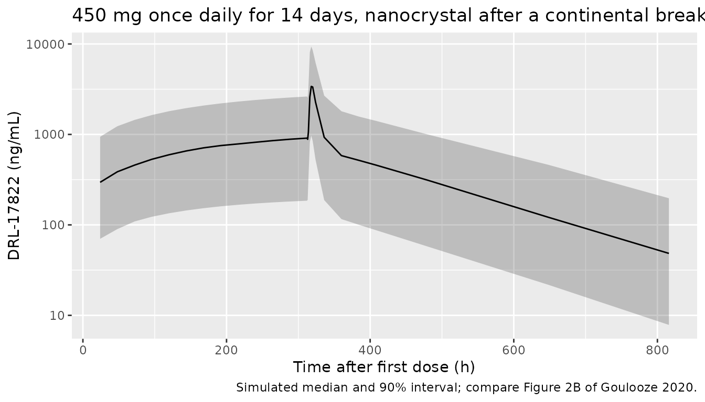

# DRL-17822 (Goulooze 2020)

## Model and source

- Citation: Goulooze SC, Kruithof AC, Alikunju S, Gautam A, Burggraaf J,
  Kamerling IMC, Stevens J. The effect of food and formulation on the
  population pharmacokinetics of cholesteryl ester transferase protein
  inhibitor DRL-17822 in healthy male volunteers. Br J Clin Pharmacol.
  2020;86(10):2095-2101. <doi:10.1111/bcp.14297>
- Description: Two-compartment population PK model with a
  six-transit-compartment absorption chain for the oral cholesteryl
  ester transfer protein (CETP) inhibitor DRL-17822 in healthy male
  volunteers, with the food-by-formulation interaction on relative
  bioavailability binned into four levels (nanocrystal vs amorphous
  solid dispersion; fasted, low-fat, high-fat or continental breakfast),
  a slower absorption rate for the amorphous solid dispersion after a
  high-fat breakfast, BMI on central volume, and correlated
  inter-individual and inter-occasion variability on relative
  bioavailability and absorption rate
- Article: <https://doi.org/10.1111/bcp.14297> (open access, PMC7495284)

DRL-17822 is an oral cholesteryl ester transfer protein (CETP) inhibitor
without an INN; the model file uses the development code. The supporting
information of the article includes the final NONMEM control stream,
which fixes several details not printed in the main text: the BMI
centring value (23.3 kg/m^2), the linear form of the BMI effect, the
transit-chain topology, which food and formulation combinations fall
into each bin, and the order of the random effects in the `$OMEGA`
blocks.

## Population

Four phase I studies in healthy male volunteers in the Netherlands
(study 4 in parts A and B; Table S1 and S2 of the supplement): a single
ascending dose study (5-1000 mg nanocrystal, fasted), a single-dose food
interaction study (150 mg nanocrystal, fasted vs high-fat breakfast), a
two-week once-daily multiple ascending dose study (50-450 mg nanocrystal
after a continental breakfast), and a four-way crossover
food-by-formulation study (150 mg nanocrystal or amorphous solid
dispersion, fasted or after a low-fat or high-fat breakfast). In total,
2816 plasma concentrations from 95 drug-treated subjects were analysed.
Mean age by study was 25-32 years (range 18-53), mean weight 75-84 kg
(range 59.4-116.7) and mean BMI 21.6-25.0 kg/m^2 (range 18.8-29.9).

The same information is available programmatically via
`readModelDb("Goulooze_2020_DRL17822")()$population`.

## Source trace

| Equation / parameter | Value | Source location |
|----|----|----|
| `lka` | log(1.74) 1/h | Table 1 ‘ka’ |
| `lvc` | log(86.7) L | Table 1 ‘Vc’ |
| `lkel` | log(0.100) 1/h | Table 1 ‘kel’ |
| `lvp` | log(599) L | Table 1 ‘Vp’ |
| `lq` | log(5.11) L/h | Table 1 ‘Qc/p’ |
| `lfdepot` | fixed(log(1)) | Table 1 ‘F reference’ (fixed) |
| `e_fed_medium_fdepot` | 0.532 | Table 1 ‘F medium’ |
| `e_fasted_asd_fdepot` | 0.151 | Table 1 ‘F medium-low’ |
| `e_fasted_nc_fdepot` | 0.056 | Table 1 ‘F low’ |
| `e_bmi_vc` | 0.041 per kg/m^2 | Table 1 ‘COV BMI, Vc’; linear form, centre 23.3 from control stream `$PK` |
| `e_asd_highfat_ka` | 0.599 | Table 1 ‘k a,asd,HF’ |
| IIV Vc, ka, F (variances) | 0.0689, 0.0625, 0.391 | Table 1 IIV 26.7%, 25.4%, 69.2%; omega^2 = log(1 + CV^2) per Table 1 footnote a |
| IIV Vc-ka, F-ka (covariances) | 0.0464, -0.0438 | Table 1 ‘Cor. IIV Vc-ka’ 0.707, ‘Cor. IIV F-ka’ -0.280 |
| IIV kel | 0.0551 | Table 1 IIV 23.8% |
| IOV F, ka (variances), covariance | 0.183, 0.0428, -0.00787 | Table 1 IOV 44.8%, 20.9%; ‘Cor. IOV F-ka’ -0.089; `$OMEGA BLOCK(2) SAME` x3 |
| `propSd` | 0.338 | Table 1 ‘Proportional error (sigma^2)’ 0.114; SD = sqrt(0.114) |
| Depot + 6 transit compartments, all at rate ka | n/a | Results 3.1; control stream `$DES` |
| Two-compartment disposition with first-order elimination kel | n/a | Results 3.1; control stream `$DES` |
| Food-by-formulation bins on F | n/a | Results 3.1; control stream `$PK` `FM` assignments |
| `Cc = 1000 * central / vc` (ng/mL) | n/a | control stream `S2 = V2/1000`; dose in mg |

## Virtual cohort

The seven food-by-formulation combinations studied are simulated as
separate arms of 100 subjects each, all at the 150 mg single dose used
in studies 2 and 4, plus the 450 mg once-daily arm of the multiple
ascending dose study (nanocrystal after a continental breakfast). BMI is
drawn from a normal distribution around the pooled mean (about 23.5
kg/m^2, SD 2.5) and redrawn when outside the observed 18.8-29.9 kg/m^2
range.

``` r

set.seed(2020)

arms <- tribble(
  ~arm,             ~FORM_DRL17822_ASD, ~FED, ~FED_LOWFAT, ~FED_HIGHFAT,
  "NC fasted",      0,                  0,    0,           0,
  "NC low-fat",     0,                  1,    1,           0,
  "NC high-fat",    0,                  1,    0,           1,
  "NC continental", 0,                  1,    0,           0,
  "ASD fasted",     1,                  0,    0,           0,
  "ASD low-fat",    1,                  1,    1,           0,
  "ASD high-fat",   1,                  1,    0,           1
)

draw_bmi <- function(n) {
  out <- rnorm(n, 23.5, 2.5)
  bad <- out < 18.8 | out > 29.9
  while (any(bad)) {
    out[bad] <- rnorm(sum(bad), 23.5, 2.5)
    bad <- out < 18.8 | out > 29.9
  }
  out
}

n_per_arm <- 100
obs_sd <- c(0, 0.5, 1, 2, 3, 4, 5, 6, 7, 8, 9, 10, 12, 16, 24, 36, 48, 72, 96, 144)

subjects_sd <- arms[rep(seq_len(nrow(arms)), each = n_per_arm), ] |>
  mutate(id = row_number(), BMI = draw_bmi(n()), OCC = 1)

events_sd <- bind_rows(
  subjects_sd |> mutate(time = 0, amt = 150, evid = 1, cmt = "depot"),
  subjects_sd |>
    tidyr::crossing(time = obs_sd) |>
    mutate(amt = 0, evid = 0, cmt = "central")
) |>
  arrange(id, time, desc(evid))

# Study 3: 450 mg once daily for 14 days after a continental breakfast
subjects_md <- tibble(
  id = nrow(subjects_sd) + seq_len(n_per_arm),
  arm = "NC continental 450 mg QD",
  FORM_DRL17822_ASD = 0, FED = 1, FED_LOWFAT = 0, FED_HIGHFAT = 0,
  BMI = draw_bmi(n_per_arm), OCC = 1
)
obs_md <- sort(unique(c(seq(0, 312, by = 24), 312 + c(1, 2, 4, 6, 8, 12, 24, 48, 72, 96, 168, 336, 504))))
events_md <- bind_rows(
  subjects_md |> tidyr::crossing(time = seq(0, 312, by = 24)) |>
    mutate(amt = 450, evid = 1, cmt = "depot"),
  subjects_md |> tidyr::crossing(time = obs_md) |>
    mutate(amt = 0, evid = 0, cmt = "central")
) |>
  arrange(id, time, desc(evid))

stopifnot(!anyDuplicated(c(unique(events_sd$id), unique(events_md$id))))
```

## Simulation

``` r

mod <- readModelDb("Goulooze_2020_DRL17822")
keep_cols <- c("arm", "BMI")
sim_sd <- rxode2::rxSolve(mod, events = events_sd, keep = keep_cols)
#> ℹ parameter labels from comments will be replaced by 'label()'
#> Warning: some etas defaulted to non-mu referenced, possible parsing error: etaiov_lka_4, etaiov_lfdepot_4, etaiov_lka_3, etaiov_lfdepot_3, etaiov_lka_2, etaiov_lfdepot_2, etaiov_lka_1, etaiov_lfdepot_1
#> as a work-around try putting the mu-referenced expression on a simple line
sim_md <- rxode2::rxSolve(mod, events = events_md, keep = keep_cols)
```

## Concentration-time profiles

Figure 2 of the paper is a prediction-corrected VPC of the observed
data, which cannot be reproduced without those data. The plots below
show the simulated 5th, 50th and 95th percentiles for each arm; the
order of the arms and the spacing between them reflect the four
bioavailability bins and the slower absorption of the ASD after a
high-fat breakfast.

``` r

sim_sd |>
  filter(time > 0) |>
  group_by(arm, time) |>
  summarise(
    Q05 = quantile(Cc, 0.05), Q50 = median(Cc), Q95 = quantile(Cc, 0.95),
    .groups = "drop"
  ) |>
  ggplot(aes(time, Q50)) +
  geom_ribbon(aes(ymin = Q05, ymax = Q95), alpha = 0.25) +
  geom_line() +
  facet_wrap(~arm) +
  scale_y_log10() +
  labs(
    x = "Time after dose (h)", y = "DRL-17822 (ng/mL)",
    title = "150 mg single dose by formulation and food state",
    caption = "Simulated median and 90% interval; compare Figure 2A of Goulooze 2020."
  )
```



``` r

sim_md |>
  filter(time > 0) |>
  group_by(time) |>
  summarise(
    Q05 = quantile(Cc, 0.05), Q50 = median(Cc), Q95 = quantile(Cc, 0.95),
    .groups = "drop"
  ) |>
  ggplot(aes(time, Q50)) +
  geom_ribbon(aes(ymin = Q05, ymax = Q95), alpha = 0.25) +
  geom_line() +
  scale_y_log10() +
  labs(
    x = "Time after first dose (h)", y = "DRL-17822 (ng/mL)",
    title = "450 mg once daily for 14 days, nanocrystal after a continental breakfast",
    caption = "Simulated median and 90% interval; compare Figure 2B of Goulooze 2020."
  )
```



## Typical-value checks against the published bioavailability ratios

The paper prints no NCA table. It does state the fold differences
implied by the bioavailability bins (Results 3.1): an 18-fold increase
for the nanocrystal from fasted to a high-fat or continental breakfast,
a 2-fold lower bioavailability after a low-fat than after a high-fat
breakfast for the nanocrystal, and a 3.5-fold difference for the ASD
between fasted and high-fat dosing. Because the model is linear, these
ratios must hold for AUC(0-inf) of the typical subject, and AUC(0-inf)
times the apparent clearance `kel * Vc` must equal `F * Dose`. Both are
checked with PKNCA on a dense, long typical-value simulation (terminal
half-life is about 130 h).

``` r

mod_typical <- rxode2::zeroRe(mod)
#> ℹ parameter labels from comments will be replaced by 'label()'
#> Warning: some etas defaulted to non-mu referenced, possible parsing error: etaiov_lka_4, etaiov_lfdepot_4, etaiov_lka_3, etaiov_lfdepot_3, etaiov_lka_2, etaiov_lfdepot_2, etaiov_lka_1, etaiov_lfdepot_1
#> as a work-around try putting the mu-referenced expression on a simple line
#> Warning: some etas defaulted to non-mu referenced, possible parsing error: etaiov_lka_4, etaiov_lfdepot_4, etaiov_lka_3, etaiov_lfdepot_3, etaiov_lka_2, etaiov_lfdepot_2, etaiov_lka_1, etaiov_lfdepot_1
#> as a work-around try putting the mu-referenced expression on a simple line
obs_long <- sort(unique(c(seq(0, 24, by = 0.25), seq(25, 3000, by = 5))))
events_typ <- bind_rows(
  arms |> mutate(id = row_number(), BMI = 23.3, OCC = 1, time = 0, amt = 150, evid = 1, cmt = "depot"),
  arms |> mutate(id = row_number(), BMI = 23.3, OCC = 1) |>
    tidyr::crossing(time = obs_long) |>
    mutate(amt = 0, evid = 0, cmt = "central")
) |>
  arrange(id, time, desc(evid))
sim_typ <- rxode2::rxSolve(mod_typical, events = events_typ, keep = "arm")
#> ℹ omega/sigma items treated as zero: 'etaiov_lka_4', 'etaiov_lfdepot_4', 'etaiov_lka_3', 'etaiov_lfdepot_3', 'etaiov_lka_2', 'etaiov_lfdepot_2', 'etaiov_lka_1', 'etaiov_lfdepot_1', 'etalfdepot', 'etalka', 'etalvc', 'etalkel'
#> Warning: multi-subject simulation without without 'omega'

conc_typ <- as.data.frame(sim_typ) |>
  filter(!is.na(Cc)) |>
  select(id, time, Cc, arm) |>
  mutate(treatment = arm)
dose_typ <- events_typ |>
  filter(evid == 1) |>
  select(id, time, amt, arm) |>
  mutate(treatment = arm)

o_conc <- PKNCA::PKNCAconc(conc_typ, Cc ~ time | treatment + id)
o_dose <- PKNCA::PKNCAdose(dose_typ, amt ~ time | treatment + id)
o_data <- PKNCA::PKNCAdata(
  o_conc, o_dose,
  intervals = data.frame(
    start = 0, end = Inf, cmax = TRUE, tmax = TRUE,
    aucinf.obs = TRUE, half.life = TRUE
  )
)
nca_typ <- as.data.frame(PKNCA::pk.nca(o_data))

nca_wide <- nca_typ |>
  filter(PPTESTCD %in% c("cmax", "tmax", "aucinf.obs", "half.life")) |>
  select(treatment, PPTESTCD, PPORRES) |>
  tidyr::pivot_wider(names_from = PPTESTCD, values_from = PPORRES)

f_expected <- c(
  "NC fasted" = 0.056, "NC low-fat" = 0.532, "NC high-fat" = 1,
  "NC continental" = 1, "ASD fasted" = 0.151, "ASD low-fat" = 0.532,
  "ASD high-fat" = 0.532
)
cl_typ <- 0.100 * 86.7
nca_wide <- nca_wide |>
  mutate(
    F_expected = f_expected[treatment],
    AUC_expected = F_expected * 150 * 1000 / cl_typ,
    pct_diff = 100 * (aucinf.obs / AUC_expected - 1)
  )

nca_wide |>
  mutate(across(c(cmax, aucinf.obs, AUC_expected, half.life), ~ signif(.x, 4))) |>
  select(treatment, F_expected, cmax, tmax, aucinf.obs, AUC_expected, pct_diff, half.life) |>
  rename(
    "Arm" = treatment, "F (Table 1)" = F_expected, "Cmax (ng/mL)" = cmax,
    "Tmax (h)" = tmax, "AUC0-inf PKNCA (ng h/mL)" = aucinf.obs,
    "F x Dose / CL (ng h/mL)" = AUC_expected, "% difference" = pct_diff,
    "t1/2 (h)" = half.life
  ) |>
  knitr::kable(digits = 2)
```

| Arm | F (Table 1) | Cmax (ng/mL) | Tmax (h) | AUC0-inf PKNCA (ng h/mL) | F x Dose / CL (ng h/mL) | % difference | t1/2 (h) |
|:---|---:|---:|---:|---:|---:|---:|---:|
| ASD fasted | 0.15 | 164.40 | 6 | 2614.0 | 2612.0 | 0.06 | 131.7 |
| ASD high-fat | 0.53 | 478.60 | 9 | 9211.0 | 9204.0 | 0.08 | 131.6 |
| ASD low-fat | 0.53 | 579.40 | 6 | 9209.0 | 9204.0 | 0.06 | 131.7 |
| NC continental | 1.00 | 1089.00 | 6 | 17310.0 | 17300.0 | 0.06 | 131.7 |
| NC fasted | 0.06 | 60.98 | 6 | 969.4 | 968.9 | 0.06 | 131.7 |
| NC high-fat | 1.00 | 1089.00 | 6 | 17310.0 | 17300.0 | 0.06 | 131.7 |
| NC low-fat | 0.53 | 579.40 | 6 | 9209.0 | 9204.0 | 0.06 | 131.7 |

``` r


auc <- setNames(nca_wide$aucinf.obs, nca_wide$treatment)
ratios <- c(
  "NC high-fat / NC fasted (paper: 18-fold)" = auc[["NC high-fat"]] / auc[["NC fasted"]],
  "NC high-fat / NC low-fat (paper: 2-fold)" = auc[["NC high-fat"]] / auc[["NC low-fat"]],
  "ASD high-fat / ASD fasted (paper: 3.5-fold)" = auc[["ASD high-fat"]] / auc[["ASD fasted"]]
)
knitr::kable(data.frame(Comparison = names(ratios), `AUC ratio` = round(ratios, 2), check.names = FALSE), row.names = FALSE)
```

| Comparison                                  | AUC ratio |
|:--------------------------------------------|----------:|
| NC high-fat / NC fasted (paper: 18-fold)    |     17.86 |
| NC high-fat / NC low-fat (paper: 2-fold)    |      1.88 |
| ASD high-fat / ASD fasted (paper: 3.5-fold) |      3.52 |

``` r


stopifnot(
  # Typical-value solve against its own closed form: pure numerical error.
  all(abs(nca_wide$pct_diff) < 1),
  abs(ratios[[1]] - 18) / 18 < 0.02,
  abs(ratios[[2]] - 2) / 2 < 0.07,
  abs(ratios[[3]] - 3.5) / 3.5 < 0.02,
  # The ASD after a high-fat breakfast absorbs more slowly (ka * 0.599)
  nca_wide$tmax[nca_wide$treatment == "ASD high-fat"] >
    nca_wide$tmax[nca_wide$treatment == "ASD low-fat"]
)
```

The 2-fold statement is the rounded value of 1 / 0.532 = 1.88.

## Stochastic cohort NCA

``` r

conc_sd <- as.data.frame(sim_sd) |>
  filter(!is.na(Cc)) |>
  select(id, time, Cc, arm) |>
  mutate(treatment = arm)
dose_sd <- events_sd |>
  filter(evid == 1) |>
  select(id, time, amt, arm) |>
  mutate(treatment = arm)
o_data_sd <- PKNCA::PKNCAdata(
  PKNCA::PKNCAconc(conc_sd, Cc ~ time | treatment + id),
  PKNCA::PKNCAdose(dose_sd, amt ~ time | treatment + id),
  intervals = data.frame(start = 0, end = 144, cmax = TRUE, tmax = TRUE, auclast = TRUE)
)
nca_sd <- as.data.frame(PKNCA::pk.nca(o_data_sd))
nca_sd |>
  filter(PPTESTCD %in% c("cmax", "tmax", "auclast")) |>
  group_by(treatment, PPTESTCD) |>
  summarise(median = signif(median(PPORRES), 3), .groups = "drop") |>
  tidyr::pivot_wider(names_from = PPTESTCD, values_from = median) |>
  rename(
    "Arm" = treatment, "Cmax (ng/mL)" = cmax, "Tmax (h)" = tmax,
    "AUC0-144 (ng h/mL)" = auclast
  ) |>
  knitr::kable()
```

| Arm            | AUC0-144 (ng h/mL) | Cmax (ng/mL) | Tmax (h) |
|:---------------|-------------------:|-------------:|---------:|
| ASD fasted     |               2310 |        168.0 |        6 |
| ASD high-fat   |               6730 |        388.0 |        9 |
| ASD low-fat    |               6450 |        514.0 |        6 |
| NC continental |              14300 |       1130.0 |        6 |
| NC fasted      |                790 |         60.2 |        6 |
| NC high-fat    |              13100 |       1010.0 |        6 |
| NC low-fat     |               6460 |        534.0 |        6 |

## Assumptions and deviations

- **Drug name.** DRL-17822 has no INN; the file name uses the
  development code without the hyphen.
- **IIV and IOV variances.** Table 1 reports CV% computed as
  sqrt(exp(omega^2) - 1) (footnote a); the variances were recovered as
  log(1 + CV^2). The footnote is attached to the IIV column; the same
  conversion was assumed for the IOV column.
- **Vc-F IIV covariance.** The control stream’s `$OMEGA BLOCK(3)` over
  Vc, ka and F starts the Vc-F element at 0, and the paper reports only
  the Vc-ka and F-ka correlations (Results 3.1 lists three correlated
  pairs in total, the third being IOV F-ka). The Vc-F covariance is
  therefore set to
  0.  
- **Inter-occasion variability.** The control stream applies IOV only to
  studies 2-4 (subjects with ID \> 200); the single-occasion study 1
  subjects carry none. Here this is reproduced with `OCC = 0` (no IOV)
  and `OCC = 1` to `4` (occasions of the crossover studies). The
  simulations above use `OCC = 1`. How occasions were defined in the
  two-week multiple dose study is not stated.
- **Continental breakfast with the ASD.** This combination was not
  studied. The control stream falls through to the reference bin (F =
  1), and the model reproduces that, but it is an extrapolation.
- **Absorption lag.** The control stream carries `ALAG1 = THETA(2)` with
  `THETA(2)` fixed to 0, so no lag is included.
- **Residual error.** The control stream uses
  `Y = F * (1 + ERR(1)) + ERR(2)` with the additive `$SIGMA` element
  fixed to 0, which is a proportional error model.
- **Dose range.** The abstract states doses of 2-1000 mg, but Table S2
  lists 5-1000 mg in the single ascending dose study; the population
  metadata follows Table S2.
