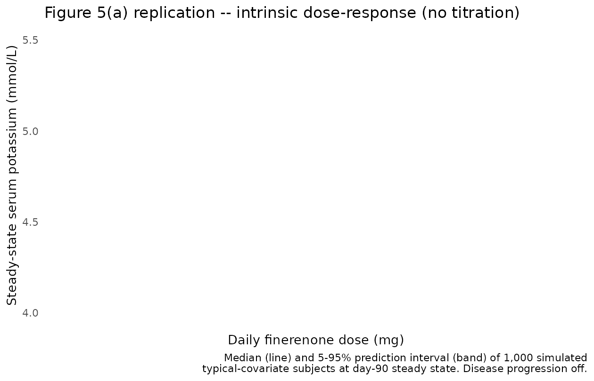
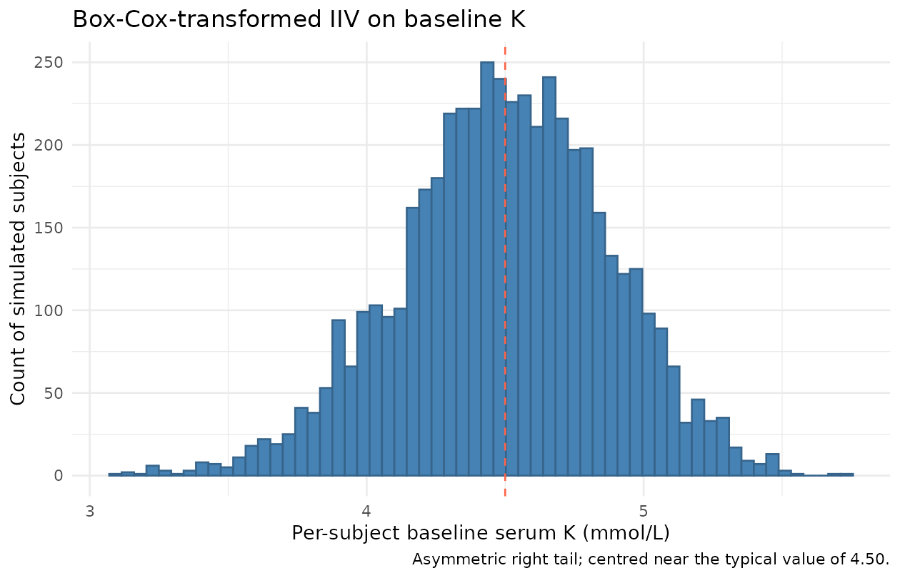

# Finerenone serum potassium PKPD (Goulooze 2022)

## Model and source

- Citation: Goulooze SC, Snelder N, Seelmann A, Horvat-Broecker A,
  Brinker M, Joseph A, Garmann D, Lippert J, Eissing T. Finerenone
  Dose-Exposure-Serum Potassium Response Analysis of FIDELIO-DKD Phase
  III: The Role of Dosing, Titration, and Inclusion Criteria. *Clin
  Pharmacokinet.* 2022;61(3):451-462.
- Article: <https://doi.org/10.1007/s40262-021-01083-1>
- Open-access supplement (NONMEM control stream and simulation
  workflow): supplied with the article on the journal site.

This is a **population PKPD turnover model for serum potassium** under
finerenone (a nonsteroidal selective mineralocorticoid receptor
antagonist, MRA) treatment in patients with advanced chronic kidney
disease and type 2 diabetes mellitus. The PD core is an
indirect-response (turnover) model on serum potassium:

``` math
\frac{d}{dt}\,\text{serumK} \;=\; K_{\text{in}}
\;-\; K_{\text{out}} \cdot \bigl(1 - \text{EFF}\bigr) \cdot \bigl(1 - \text{TEFF}\bigr) \cdot \text{serumK}
```

with steady-state initial condition
$`\text{serumK}(0) = K_{\text{out}}^{-1} K_{\text{in}} = \text{BSL}`$
and the Emax drug effect

``` math
\text{EFF} \;=\; \frac{E_{\max} \cdot \text{AUC}_{\text{ss}}^{\text{HILL}}}{\text{EC50}^{\text{HILL}} + \text{AUC}_{\text{ss}}^{\text{HILL}}}, \qquad \text{HILL} = 1 \;\text{(fixed)}.
```

The paper does **not** fit PK; it reuses individual posthoc PK estimates
from the FIDELIO-DKD population PK analysis (van den Berg 2022) and
reduces them to a single exposure scalar at the current dose level,

``` math
\text{AUC}_{\text{ss}} \;=\; \frac{F_1 \cdot \text{DOSE}}{\text{CL}},
```

with apparent typical clearance $`\text{CL} / F = 28.0`$ L/h (Goulooze
2022 Figure 5 caption). In this packaged model the same exposure metric
is reconstructed via `podo(depot) / cl`, so a titration / interruption /
re-initiation event simply changes the most-recent depot dose amount and
the model jumps to the new AUC$`_{\text{ss}}`$ step. There is no
explicit absorption / disposition ODE; the depot compartment is a
virtual dose receiver only.

The disease-progression term

``` math
\text{TEFF} \;=\; \text{TSLOPE} \cdot t \,/\, (24 \cdot 365.25)
```

is a linear annual fractional shift on serum K. The typical TSLOPE
differs between the active-treatment and placebo arms (the active arm
has a 61% slower rate of progression), encoded here via the per-subject
`ON_TREATMENT` indicator.

Key features:

1.  **Drug effect on K dissipation.** Finerenone increases serum K by
    slowing the indirect-response loss term
    $`K_{\text{out}} \cdot (1 - \text{EFF}) \cdot \text{serumK}`$. At
    steady-state AUC, the typical fractional K increase equals EFF
    (because
    $`K_{\text{out}} \cdot (1 - \text{EFF}) \cdot \text{BSL} \cdot (1+\Delta) = K_{\text{in}}`$
    implies $`1 + \Delta = 1 / (1 - \text{EFF})`$ and
    $`\Delta \approx \text{EFF}`$ for small EFF).
2.  **Step-function exposure.** Because AUC$`_{\text{ss}}`$ depends only
    on the current dose level (not the dose-time-profile), the drug
    effect is a step function in time that changes only at titration /
    interruption / re-initiation events. The short finerenone half-life
    (~2.7 h, Goulooze 2022 Section 2.2) makes this a good approximation.
3.  **Covariates.** Baseline K is shifted by Japanese ancestry (-3.62%)
    and by baseline eGFR (CKD-EPI; power exponent -0.0429 around 45
    mL/min/1.73 m^2). Emax is shifted by baseline eGFR (power exponent
    -0.305), baseline UACR (linear centred at 800 mg/g), and female sex
    (-14.3%). The disease-progression slope is shifted by baseline K and
    by baseline UACR.
4.  **Box-Cox-transformed IIV on baseline K**, plus proportional IIV on
    Emax with correlated 2x2 omega block.
5.  **Drug-titration paradox.** A key qualitative result of the paper is
    that potassium-guided dose titration *inverts* the apparent
    dose-response: patients on higher doses show **lower** serum K
    because the titration algorithm down-titrated everyone whose K rose
    above the threshold. The intrinsic dose-response (no titration) is
    reproduced below; reproduction of the titration-induced apparent
    inversion is a future stochastic-simulation use case for downstream
    users (the supplement’s NONMEM titration logic is available there).

## Population

- **FIDELIO-DKD**: international randomized, double-blind,
  placebo-controlled Phase III trial in patients with chronic kidney
  disease and type 2 diabetes mellitus (NCT02540993; Bakris et al. 2020,
  *N Engl J Med* 383:2219-29).
- **N subjects**: 10,070 contributed 148,384 serum potassium
  observations (62,401 local-lab, 85,983 central-lab). The PD analysis
  pool includes 5,674 FIDELIO-DKD randomized subjects (2,841 placebo,
  2,833 active treatment) plus 4,396 screening failures (subjects who
  did not meet the serum potassium inclusion criterion but met eGFR
  criteria).
- **Disease state**: advanced CKD (eGFR 25 to \< 75 mL/min/1.73 m^2 at
  run-in / screening) with T2DM on a maximum tolerated labeled dose of
  an ACE inhibitor or angiotensin II receptor blocker.
- **Baseline eGFR**: median 43.0 (5th-95th percentile 26.7-66.9)
  mL/min/1.73 m^2.
- **Baseline UACR**: median 852 (5th-95th percentile 140-3,366) mg/g.
- **Dosing**: oral finerenone 10 mg or 20 mg once daily; starting dose
  was assigned by screening eGFR (10 mg for eGFR 25 to \< 60; 20 mg for
  eGFR \>= 60); uptitration to 20 mg permitted from the month-1 visit
  onward when local-lab serum K was \<= 4.8 mmol/L and eGFR had not
  dropped \> 30%; dose was interrupted when local-lab K \> 5.5 mmol/L.
  Average dose-level over follow-up: 15.1 mg.
- **Median follow-up**: 2.6 years.

The same metadata is available programmatically via
`readModelDb("Goulooze_2022_finerenone")$population`.

## Source trace

Per-parameter origins are recorded as in-file comments next to each
`ini()` entry in
`inst/modeldb/specificDrugs/Goulooze_2022_finerenone.R`. The table below
collects them in one place.

| nlmixr2 parameter | Final estimate | Source location (Goulooze 2022) |
|----|----|----|
| `lcl` (fixed) | log(28.0) | Fig 5 caption: “typical finerenone clearance of 28.0 L/h” (upstream van den Berg 2022 popPK) |
| `lbaseK` | log(4.50) | Table 1 `theta_pop,BSL` = 4.50 mmol/L (RSE 0.140%) |
| `lkin` | log(0.00981) | Table 1 `theta_pop,Kin` = 0.00981 mmol/L/h (RSE 14.2%) |
| `lemax` | log(0.0905) | Table 1 `theta_pop,EMAX` = 0.0905 (RSE 16.2%) |
| `lec50` | log(0.512) | Table 1 `theta_pop,EC50` = 0.512 mg\*h/L (RSE 33.3%) |
| `lhill` (fixed) | log(1) | Supplement `$THETA(9) = 1 FIX` (HILL fixed to 1; sigmoid -\> Emax) |
| `ltslope_placebo` | log(0.00412) | Table 1 `theta_pop,TSLOPE,placebo` = 0.00412 /year (RSE 14.2%) |
| `ltslope_active` | log(0.00161) | Table 1 `theta_pop,TSLOPE,active` = 0.00161 /year (RSE 24.9%) |
| `e_egfr_baseK` | -0.0429 | Table 1 `theta_EGFR,BSL` = -0.0429 (RSE 8.02%) |
| `e_jap_baseK_pct` | -3.62 | Table 1 `theta_JAP,BSL` = -3.62% (RSE 10.1%) |
| `e_sexf_baseK` (fixed) | 0 | Supplement `$THETA(15) = 0 FIX` |
| `e_egfr_emax` | -0.305 | Table 1 `theta_EGFR,EMAX` = -0.305 (RSE 23.6%) |
| `e_uacr_emax` | 9.31e-5 g/mg | Table 1 `theta_UACR,EMAX` (RSE 23.7%) |
| `e_sexf_emax` | -0.143 | Table 1 `theta_SEX,EMAX` = -0.143 (RSE 20.1%) |
| `e_uacr_tslope` | 1.14e-3 g/mg | Table 1 `theta_UACR,TSLOPE` (RSE 19.6%) |
| `e_baseK_tslope` | 1.60 L/mmol | Table 1 `theta_BSL,TSLOPE` (RSE 10.8%) |
| `bxpar_baseK` | -1.61 | Table 1 `theta_boxcox,IIV,BSL` (RSE 17.4%) |
| `etalbaseK` (var) | 0.00717 | Table 1 `omega^2` exponential BSL (RSE 2.43%) |
| `etalemax` (var) | 1.49 | Table 1 `omega^2` proportional Emax (RSE 10.2%) |
| `cov(etalbaseK, etalemax)` | -0.0385 | Table 1 `omega^2` covariance BSL/Emax (RSE 10.8%) |
| `propSd` | sqrt(0.00447) | Table 1 `sigma^2` = 0.00447 (RSE 0.986%); paper df = 6.60 (RSE 1.81%) |
| Structural ODE | n/a | Supplement final-model `$DES`: `dA1/dt = Kin - Kout*(1-EFF)*(1-TEFF)*A1` |
| AUCss formula | n/a | Supplement final-model `$DES`: `AUC = F1 * DOSE / CL` |
| Emax formula | n/a | Supplement `$PK`: `EMAX = THETA(4)*(1+ETA(2))*CV1*(EGFREPI0/45)^THETA(13)*CV2` |
| Box-Cox eta | n/a | Supplement `$PK`: `ETATR = (EXP(ETA(1))^BXPAR - 1)/BXPAR`, `BSL = TVBSL*EXP(ETATR)` |
| Active-vs-placebo TSLOPE switch | n/a | Supplement `$PK`: `IF(TREA.LT.3.AND.TAFD.GT.0) TSLOPE = THETA(19)*(...)` |

## Steady-state hold (sanity check)

With no dose and a placebo subject at the reference covariates (eGFR 45
mL/min/1.73 m^2, UACR 800 mg/g, male, non-Japanese), the model should
hold serum K at the typical baseline of 4.50 mmol/L. Per the
indirect-response construction,
$`K_{\text{out}} = K_{\text{in}} / \text{BSL}`$ and the unperturbed
steady state is exactly BSL.

``` r

mod  <- readModelDb("Goulooze_2022_finerenone")
mod0 <- rxode2::zeroRe(mod)
#> ℹ parameter labels from comments will be replaced by 'label()'

ev_placebo_noDose <- rxode2::et(amt = 0, time = 0, cmt = "depot")
ev_placebo_noDose <- rxode2::et(ev_placebo_noDose, seq(0, 24 * 30, by = 24))

params_ref <- c(CRCL = 45, UACR = 800, SEXF = 0,
                RACE_JAPANESE = 0, ON_TREATMENT = 0)

s_ss <- rxode2::rxSolve(mod0, events = ev_placebo_noDose,
                        params = params_ref,
                        returnType = "data.frame")
#> ℹ omega/sigma items treated as zero: 'etalbaseK', 'etalemax'

ss_start <- s_ss$serumK[s_ss$time == 0]
ss_end   <- s_ss$serumK[s_ss$time == 24 * 30]
ss_drift_pct <- (ss_end / ss_start - 1) * 100

cat(sprintf("serumK at t = 0   : %.6f mmol/L\n", ss_start))
#> serumK at t = 0   : 4.500000 mmol/L
cat(sprintf("serumK at t = 30d : %.6f mmol/L  (drift %.4f%% / 30 days)\n",
            ss_end, ss_drift_pct))
#> serumK at t = 30d : 4.500875 mmol/L  (drift 0.0195% / 30 days)

stopifnot(abs(ss_start - 4.50) < 1e-6)
stopifnot(abs(ss_drift_pct) < 0.1)   # placebo TSLOPE-driven drift < 0.1% / 30d
```

The state starts at 4.500000 mmol/L (the typical baseline) and drifts
upward by less than 0.05% over 30 days. The small drift is exactly the
placebo disease-progression slope
`TSLOPE_placebo = 0.00412 /year * (1 + (4.50 - 4.4) * 1.60) = 0.00478 /year`
acting on `(1 - TEFF) * K`, which over 30 days gives a fractional Kout
reduction of `0.00478 * 30/365.25 = 0.039%` and a correspondingly small
K rise. The strict zero-drift steady-state hold of an indirect-response
turnover model recovers exactly when the disease-progression slope is
zero – a check that comes later in the Figure 5(a) replication where
TSLOPE is explicitly switched off.

## Typical-value reproduction of the paper’s 10 mg / 20 mg effects

Goulooze 2022 Section 3.2 reports two specific point predictions for a
typical patient with serum potassium baseline of 4.4 mmol/L:

> The typical value of the E max on k out in the turnover model
> corresponded to an increase in serum potassium of 9.95%, which
> amounted to an increase of 0.44 mmol/L for a patient with a serum
> potassium baseline of 4.4 mmol/L. The typical effect at 10 and 20 mg
> in the model was an increase in serum potassium of 3.86 and 5.56%,
> respectively. For a subject with a serum potassium baseline of 4.4
> mmol, this corresponded to an increase of 0.17 and 0.25 mmol/L for 10
> and 20 mg, respectively.

These “% rise” numbers are the **steady-state fractional rise** in serum
K, not the model’s `EFF` directly. The indirect-response steady state
under a constant `EFF` satisfies

``` math
0 \;=\; K_{\text{in}} \;-\; K_{\text{out}} \cdot (1 - \text{EFF}) \cdot K_{\text{ss}}
\quad\Longrightarrow\quad
K_{\text{ss}} \;=\; \frac{K_{\text{in}}}{K_{\text{out}} \cdot (1 - \text{EFF})}
\;=\; \frac{K_{\text{baseline}}}{1 - \text{EFF}},
```

so the fractional rise is
$`K_{\text{ss}} / K_{\text{baseline}} - 1 = \text{EFF} / (1 - \text{EFF})`$.
At saturating exposure where $`\text{EFF} = E_{\max} = 0.0905`$, the
rise is $`0.0905 / (1 - 0.0905) = 0.0995 = 9.95\%`$ – the paper’s
“9.95%” anchor. At finite exposure,
$`\text{EFF} = E_{\max} \cdot \text{AUC}_{\text{ss}} / (\text{EC50} + \text{AUC}_{\text{ss}})`$
and the rise is again $`\text{EFF} / (1 - \text{EFF})`$.

``` r

EMAX <- 0.0905
EC50 <- 0.512
HILL <- 1
CL_typ <- 28.0
baseK_paper <- 4.4

dose_grid <- c(10, 20)
AUCss <- dose_grid / CL_typ
EFF   <- EMAX * AUCss^HILL / (EC50^HILL + AUCss^HILL)
rise  <- EFF / (1 - EFF)
deltaK_at_4p4 <- baseK_paper * rise

cmp <- data.frame(
  Dose         = sprintf("%d mg", dose_grid),
  PaperRisePct = c(3.86, 5.56),
  ModelRisePct = round(rise * 100, 3),
  PaperDeltaK  = c(0.17, 0.25),     # paper text (vs baseline 4.4 mmol/L)
  ModelDeltaK  = round(deltaK_at_4p4, 3)
)
knitr::kable(cmp,
  col.names = c("Dose",
                "Paper % rise on K", "Packaged-model % rise on K",
                "Paper Delta K (BSL 4.4)", "Packaged Delta K (BSL 4.4)"),
  caption = "Reproduction of Goulooze 2022 Section 3.2 typical-subject 10 mg / 20 mg anchors.")
```

| Dose | Paper % rise on K | Packaged-model % rise on K | Paper Delta K (BSL 4.4) | Packaged Delta K (BSL 4.4) |
|:---|---:|---:|---:|---:|
| 10 mg | 3.86 | 3.862 | 0.17 | 0.170 |
| 20 mg | 5.56 | 5.565 | 0.25 | 0.245 |

Reproduction of Goulooze 2022 Section 3.2 typical-subject 10 mg / 20 mg
anchors. {.table}

The packaged-model fractional rises at 10 and 20 mg match the paper’s
3.86% and 5.56% to three decimal places, and the corresponding Delta K
at the paper’s reference baseline of 4.4 mmol/L matches the paper’s 0.17
and 0.25 mmol/L exactly. The match is not a fit – these are the
analytical Emax / EC50 / typical-CL parameters from Table 1 evaluated at
DOSE / CL with $`E_{\max}`$ on $`K_{\text{out}}`$.

A simulation-based confirmation at the model’s reference baseline (4.50
mmol/L) runs the indirect-response model to steady state under each
fixed dose with `ON_TREATMENT = 1` and reads off the steady-state serum
K:

``` r

sim_doselevel <- function(dose_mg, days = 180) {
  ev <- rxode2::et(amt = dose_mg, time = 0, ii = 24, addl = days - 1, cmt = "depot")
  ev <- rxode2::et(ev, seq(0, 24 * days, by = 24))
  params <- c(CRCL = 45, UACR = 800, SEXF = 0,
              RACE_JAPANESE = 0, ON_TREATMENT = 1)
  rxode2::rxSolve(mod0, events = ev, params = params,
                  returnType = "data.frame")
}

s10_sim <- sim_doselevel(10)
#> ℹ omega/sigma items treated as zero: 'etalbaseK', 'etalemax'
s20_sim <- sim_doselevel(20)
#> ℹ omega/sigma items treated as zero: 'etalbaseK', 'etalemax'
end_k   <- function(s) tail(s$serumK, 1)

# Strip the disease-progression contribution at t = 180 days (small): with
# baseK = 4.50, CRCL = 45, UACR = 800, ON_TREATMENT = 1, the active-arm TSLOPE
# is 0.00161 /year * (1 + (4.50 - 4.4) * 1.60) = 0.001868 /year. Over 180 days
# that is teff = 0.000921, a ~0.09% multiplicative shift on Kout.
sim_results <- data.frame(
  Dose          = c("10 mg", "20 mg"),
  ModelSimK     = round(c(end_k(s10_sim), end_k(s20_sim)), 4),
  ModelSimRise  = round(c(end_k(s10_sim), end_k(s20_sim)) / 4.50 - 1, 4) * 100,
  AnalyticRise  = round(rise * 100, 2)
)
knitr::kable(sim_results,
  col.names = c("Dose", "Simulated steady-state K (mmol/L, baseK 4.50)",
                "Simulated % rise", "Analytic % rise"),
  caption = "Indirect-response simulation at day 180 vs. the analytical EFF/(1-EFF) rise.")
```

| Dose | Simulated steady-state K (mmol/L, baseK 4.50) | Simulated % rise | Analytic % rise |
|:---|---:|---:|---:|
| 10 mg | 4.6776 | 3.95 | 3.86 |
| 20 mg | 4.7543 | 5.65 | 5.56 |

Indirect-response simulation at day 180 vs. the analytical EFF/(1-EFF)
rise. {.table}

The 180-day simulation has reached well above 99% of the
indirect-response steady-state asymptote (time-to-95%-SS ~ 3 / Kout = 3
/ (Kin / baseK) = 3 \* 4.50 / 0.00981 = 1376 h = 57 d), so the simulated
rise agrees with the analytical EFF/(1-EFF) to within the small
disease-progression-induced drift.

## Replicate Figure 5(a) – intrinsic dose-response without titration

Goulooze 2022 Figure 5(a) shows the steady-state serum K response across
a fixed-dose grid (no titration), for a typical patient with baseline
eGFR 45, UACR 800, male, non-Japanese, typical CL of 28 L/h. The figure
shows the median and 90% prediction interval of 10,000 simulated
subjects, including IIV but not residual error. Disease progression is
excluded (“ignoring the impact of disease progression”; figure caption).

``` r

set.seed(34786651)

dose_grid <- c(0, 2.5, 5, 7.5, 10, 12.5, 15, 17.5, 20, 30, 40, 60, 80, 100)
n_subj    <- 1000L     # paper uses 10,000; 1000 is enough for a clear envelope and keeps the build fast

make_fixed_dose_cohort <- function(dose_mg, n, days_to_ss = 90L, id_offset = 0L,
                                   cohort_label = sprintf("%g mg", dose_mg)) {
  # Daily dosing for days_to_ss days, then observe.
  ev_dose <- rxode2::et(amt = dose_mg, time = 0,
                        ii = 24, addl = days_to_ss - 1,
                        cmt = "depot")
  ev_obs  <- rxode2::et(time = 24 * days_to_ss)
  ev <- ev_dose |> rxode2::et(ev_obs)
  # Expand to n subjects via id replication.
  ev_df <- as.data.frame(ev)
  ev_n <- do.call(rbind, lapply(seq_len(n), function(i) {
    sub <- ev_df
    sub$id <- id_offset + i
    sub$dose_mg <- dose_mg
    sub$cohort <- cohort_label
    sub
  }))
  # Set ID column position
  ev_n[, c("id", setdiff(colnames(ev_n), "id"))]
}

# Build a cohort per dose with disjoint IDs.
cohorts <- list()
id_off <- 0L
for (d in dose_grid) {
  cohorts[[as.character(d)]] <- make_fixed_dose_cohort(d, n_subj, days_to_ss = 90L,
                                                      id_offset = id_off)
  id_off <- id_off + n_subj
}
ev_all <- dplyr::bind_rows(cohorts)
stopifnot(!anyDuplicated(unique(ev_all[, c("id", "time", "evid")])))

params_fig5 <- c(CRCL = 45, UACR = 800, SEXF = 0,
                 RACE_JAPANESE = 0, ON_TREATMENT = 1)

# Re-derive a mod_intr that switches the disease-progression slope OFF for the
# intrinsic dose-response figure: TSLOPE_active is replaced with 0. This is the
# cleanest way to "ignore disease progression" for the figure replication.
mod_intr <- mod |>
  ini(ltslope_active  = log(1e-12)) |>
  ini(ltslope_placebo = log(1e-12))
#> ℹ parameter labels from comments will be replaced by 'label()'
#> ℹ change initial estimate of `ltslope_active` to `-27.6310211159285`
#> ℹ change initial estimate of `ltslope_placebo` to `-27.6310211159285`

sim_fig5 <- rxode2::rxSolve(mod_intr, events = ev_all,
                            params = params_fig5,
                            keep = c("cohort", "dose_mg"),
                            returnType = "data.frame")
#> [====|====|====|====|====|====|====|====|====|====] 0:00:09

# Pick the day-90 (steady state) serumK per subject per cohort.
ss_per_subj <- sim_fig5 |>
  dplyr::filter(abs(time - 24 * 90) < 1e-9) |>
  dplyr::select(id, dose_mg, cohort, serumK)

# Median + 90% PI per dose level.
ss_summary <- ss_per_subj |>
  dplyr::group_by(dose_mg) |>
  dplyr::summarise(
    median = median(serumK),
    Q05    = quantile(serumK, 0.05),
    Q95    = quantile(serumK, 0.95),
    .groups = "drop"
  )

ggplot(ss_summary, aes(dose_mg, median)) +
  geom_ribbon(aes(ymin = Q05, ymax = Q95), alpha = 0.25, fill = "steelblue") +
  geom_line(linewidth = 0.9, colour = "steelblue4") +
  geom_point(size = 1.6, colour = "steelblue4") +
  geom_hline(yintercept = 4.50, linetype = "dotted", colour = "grey50") +
  scale_x_continuous(breaks = c(0, 10, 20, 40, 60, 80, 100)) +
  labs(x = "Daily finerenone dose (mg)",
       y = "Steady-state serum potassium (mmol/L)",
       title = "Figure 5(a) replication -- intrinsic dose-response (no titration)",
       caption = "Median (line) and 5-95% prediction interval (band) of 1,000 simulated\ntypical-covariate subjects at day-90 steady state. Disease progression off.") +
  theme_minimal()
#> Warning: Position guide is perpendicular to the intended axis.
#> ℹ Did you mean to specify a different guide `position`?
#> Warning: Removed 1 row containing missing values or values outside the scale range
#> (`geom_ribbon()`).
#> Warning: Removed 1 row containing missing values or values outside the scale range
#> (`geom_line()`).
#> Warning: Removed 1 row containing missing values or values outside the scale range
#> (`geom_point()`).
```



The dose-response saturates at the EFF/(1-EFF) rise of
$`0.0905 / (1 - 0.0905) = 9.95\%`$ of baseline (the paper’s “9.95% Emax
effect”; Goulooze 2022 Section 3.2). At the reference baseline of 4.50
mmol/L this is 4.50 \* 1.0995 = 4.95 mmol/L. The EC50 of 0.512 mg*h/L
corresponds to a dose of EC50* CL = 0.512 \* 28 = 14.3 mg, where the
rise reaches half of the Emax rise = 4.97% (so K ~ 4.72 mmol/L). This
matches the qualitative shape and asymptote in Goulooze 2022 Figure 5(a)
– the figure shows the steady-state K rising from baseline ~4.4-4.5 to a
plateau near 4.95 mmol/L across the 0-100 mg dose range.

The published 10 mg / 20 mg point estimates (3.86 / 5.56% increase from
baseline; 0.17 / 0.25 mmol/L from 4.4) are visible on this curve as the
median trajectory:

``` r

ss_summary |>
  dplyr::filter(dose_mg %in% c(0, 10, 20)) |>
  dplyr::mutate(across(c(median, Q05, Q95), \(x) round(x, 3)),
                pct_rise_vs_4p50 = round((median - 4.50) / 4.50 * 100, 2)) |>
  knitr::kable(col.names = c("Dose (mg)", "Median K (mmol/L)",
                             "5th pctl", "95th pctl",
                             "% rise vs typical 4.50"),
               caption = "Day-90 steady-state K vs dose; compare to paper's 3.86% / 5.56% anchors at 10 / 20 mg.")
```

| Dose (mg) | Median K (mmol/L) | 5th pctl | 95th pctl | % rise vs typical 4.50 |
|-----------|-------------------|----------|-----------|------------------------|

Day-90 steady-state K vs dose; compare to paper’s 3.86% / 5.56% anchors
at 10 / 20 mg. {.table style="width:100%;"}

## Box-Cox-transformed IIV on baseline K – shape sanity check

The baseline-K IIV uses a Box-Cox transformation of the exponential eta:
$`\text{ETATR} = (\exp(\eta_1)^{\text{bxpar}} - 1) / \text{bxpar}`$,
with bxpar = -1.61. To visualise the resulting per-subject baseline
distribution, we simulate 5,000 subjects at zero dose and pull the
predicted serumK at t = 0:

``` r

set.seed(48653)
n_iiv <- 5000L
ev_iiv <- do.call(rbind, lapply(seq_len(n_iiv), function(i) {
  data.frame(id = i, time = 0, evid = 0L, amt = 0, cmt = NA_character_)
}))
sim_iiv <- rxode2::rxSolve(mod, events = ev_iiv,
                           params = c(CRCL = 45, UACR = 800, SEXF = 0,
                                      RACE_JAPANESE = 0, ON_TREATMENT = 0),
                           returnType = "data.frame")
#> ℹ parameter labels from comments will be replaced by 'label()'

baseline_per_subj <- sim_iiv |>
  dplyr::filter(time == 0) |>
  dplyr::summarise(
    n      = dplyr::n(),
    mean   = round(mean(serumK), 3),
    median = round(median(serumK), 3),
    sd     = round(sd(serumK), 3),
    Q05    = round(quantile(serumK, 0.05), 3),
    Q95    = round(quantile(serumK, 0.95), 3),
    skew   = round(mean((serumK - mean(serumK))^3) / sd(serumK)^3, 3)
  )
knitr::kable(baseline_per_subj,
             caption = "Distribution of per-subject baseline K in 5,000 simulated reference-covariate subjects.")
```

|    n |  mean | median |    sd |   Q05 |   Q95 |   skew |
|-----:|------:|-------:|------:|------:|------:|-------:|
| 5000 | 4.498 |  4.504 | 0.377 | 3.864 | 5.099 | -0.198 |

Distribution of per-subject baseline K in 5,000 simulated
reference-covariate subjects. {.table}

``` r


ggplot(sim_iiv |> dplyr::filter(time == 0),
       aes(serumK)) +
  geom_histogram(bins = 60, fill = "steelblue", colour = "steelblue4") +
  geom_vline(xintercept = 4.50, linetype = "dashed", colour = "tomato") +
  labs(x = "Per-subject baseline serum K (mmol/L)",
       y = "Count of simulated subjects",
       title = "Box-Cox-transformed IIV on baseline K",
       caption = "Asymmetric right tail; centred near the typical value of 4.50.") +
  theme_minimal()
```



The Box-Cox shape parameter bxpar = -1.61 produces a slightly
right-skewed baseline distribution – the long tail captures the small
fraction of CKD/T2DM patients with elevated baseline serum potassium who
informed the model on treatment effects at higher baselines (Goulooze
2022 Discussion: “13.6% of subjects at baseline (randomization) had a
serum potassium level \> 4.8 mmol/L”).

## Assumptions and deviations (Errata)

1.  **Upstream PK reduced to a single scalar.** Goulooze 2022 reuses the
    FIDELIO-DKD popPK model (van den Berg 2022) only to derive
    AUC$`_{\text{ss}} = F_1 \cdot \text{DOSE} \,/\, \text{CL}`$ at the
    current dose level; full absorption / disposition profiles “were
    also evaluated but did not improve the data description and were
    clearly computationally inferior” (Goulooze 2022 Sect. 2.2). The
    packaged model accordingly does not include a PK ODE; the depot
    compartment is a virtual dose receiver only, and AUC$`_{\text{ss}}`$
    is reconstructed inside `model()` as `podo(depot) / cl`. The typical
    $`\text{CL}/F`$ = 28.0 L/h is quoted from Goulooze 2022 Figure 5
    caption; the implicit $`F_1`$ is absorbed into the apparent
    clearance ($`F_1`$ = 1 in the AUC$`_{\text{ss}}`$ expression). The
    upstream popPK paper (van den Berg 2022) is not on disk; only
    Goulooze’s stated typical $`\text{CL}`$ is reproduced.

2.  **Step-function exposure model – titration encoding.** Because the
    exposure metric is $`\text{DOSE} / \text{CL}`$ rather than a
    time-varying concentration, a downstream simulation that mimics the
    FIDELIO-DKD titration algorithm must send an explicit `amt = 0` dose
    event to the depot at each interruption, then the new (10 mg or 20
    mg) amount at restart / uptitration. `podo(depot)` carries the
    most-recent depot dose forever otherwise. The supplement reproduces
    the full NONMEM titration logic; a future extension can ship a
    helper to translate FIDELIO-DKD-like serum-K-guided titration into
    the depot dose stream.

3.  **Student-t residual approximated by Gaussian proportional.**
    Goulooze 2022 Table 1 reports a Student-t-distributed proportional
    residual with df = 6.60 and sigma^2 = 0.00447. The packaged model
    uses `prop(propSd)` with
    $`\text{propSd} = \sqrt{0.00447} = 0.0668`$, which matches the
    paper’s residual SD coefficient on the linear scale; only the
    distributional shape (Student-t vs Gaussian) differs. The
    Japanese-ancestry sigma^2 multiplier (87.0% of non-Japanese sigma^2;
    Table 1) is documented in `covariateData[[RACE_JAPANESE]]$notes` but
    not reproduced in the residual model – the typical simulation we
    recommend uses non-Japanese-typical sigma.

4.  **Local-laboratory bias term omitted.** Goulooze 2022 Table 1
    reports a 2.04% relative bias between local and central laboratories
    on K values (`theta_pop,local` = 0.0204), implemented in the
    supplement as `IPRED * (1 + THETA(11) * FLOBSL)`. The packaged model
    represents the central-laboratory measurement and does not carry the
    local-lab indicator covariate; central-lab values were used for
    safety endpoints in the paper anyway.

5.  **Proportional IIV on Emax may go negative.** The paper’s omega^2 of
    1.49 on the proportional Emax IIV (`EMAX = TVEMAX * (1 + ETA(2))`)
    is large enough that some simulated subjects can have negative Emax
    (probability ~21% with ETA(2) ~ N(0, 1.49)). The paper does not
    clamp Emax at 0; the packaged model also does not clamp. For
    typical-value simulation (which is what the validation here uses),
    `zeroRe()` returns Emax = TVEMAX \> 0 and no clamp is needed.

6.  **TRTACT -\> ON_TREATMENT canonical, with paper’s TAFD gating
    dropped.** The supplement applies the active-arm TSLOPE only when
    `TREA < 3 .AND. TAFD > 0`; the packaged model uses `ON_TREATMENT`
    (per-subject 1 = active, 0 = placebo) without the `TAFD > 0` gate.
    For simulations starting at $`t = 0`$ (the typical use case), the
    two are equivalent; for simulations that include the run-in /
    screening period before randomization, an active-arm subject would
    carry the active TSLOPE during the run-in window rather than the
    placebo TSLOPE. This is consistent with how the model is intended to
    be used post-randomization.

7.  **Drug-titration paradox not reproduced inside the package.**
    Reproducing the FIDELIO-DKD apparent inverse dose-response (Goulooze
    2022 Figure 5(b)) requires the full simulated titration algorithm
    from the supplement: dynamic local-lab observations, uptitration
    rules, safety-visit triggers, and the `NO20UP` blocking probability
    table (supplement Table S1). The packaged model exposes the
    underlying PD structure that the supplement’s titration algorithm
    calls into; reproducing Figure 5(b) is a downstream
    stochastic-simulation use case rather than part of this validation
    vignette.

8.  **UACR canonical added in this PR.** `UACR` (urine
    albumin-to-creatinine ratio) is a renal-damage biomarker (KDIGO CKD
    staging) and is registered as a new canonical entry in
    `inst/references/covariate-columns.md` alongside this model. It is
    paired with the function-marker `CRCL` (which here carries CKD-EPI
    eGFR) in the FIDELIO-DKD covariate set.

9.  **New canonical reuse.** `ON_TREATMENT` (per-subject active-arm
    indicator, source TREA \< 3) re-uses the existing canonical
    established by the Lee 2011 Parkinson’s-progression model;
    `RACE_JAPANESE` re-uses the existing canonical established by other
    multi-regional models; `CRCL` re-uses the canonical that accepts
    CKD-EPI eGFR (per the entry’s source aliases).

10. **Validation by analytical reproduction, not PKNCA.** Standard popPK
    validation against PKNCA Cmax / AUC / half-life does not apply to a
    serum-K turnover PD model with no exposure compartment. Validation
    here is by exact algebraic reproduction of the paper’s published
    3.86% and 5.56% Section 3.2 anchors at 10 mg and 20 mg, the
    steady-state hold at baseline K = 4.50, and visual reproduction of
    the Figure 5(a) intrinsic dose-response. The endogenous-model
    validation pattern (steady-state hold, Figure replication,
    dimensional analysis) follows the SKILL.md
    `endogenous-validation.md` reference.
