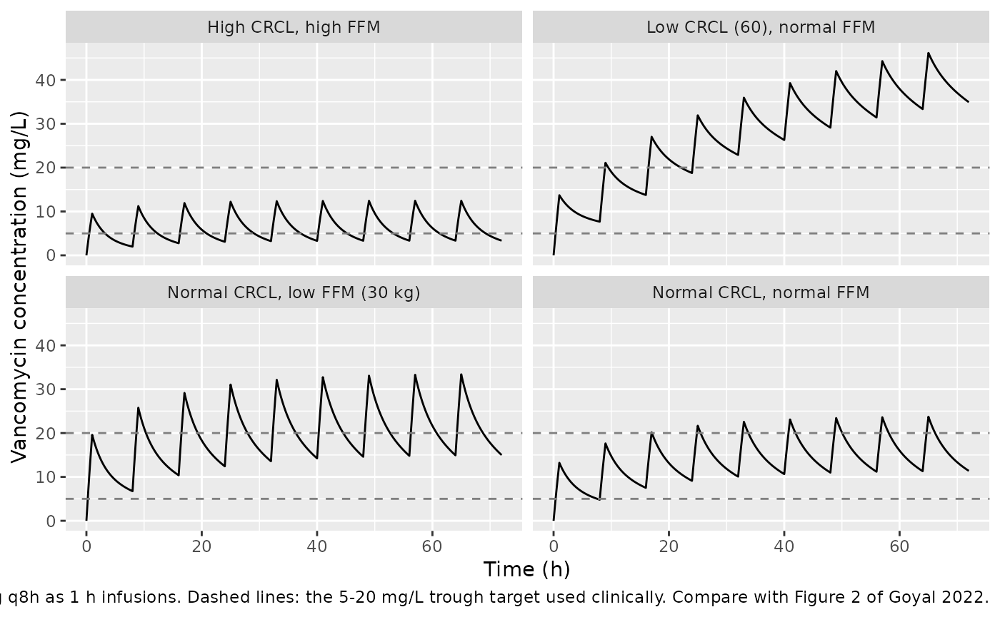
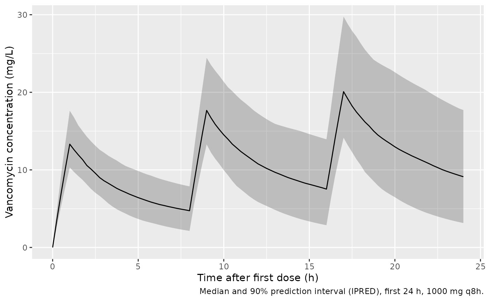

# Vancomycin in pregnancy (Goyal 2022)

## Model and source

- Citation: Goyal RK, Moffett BS, Gobburu JVS, Al Mohajer M. Population
  Pharmacokinetics of Vancomycin in Pregnant Women. Front Pharmacol.
  2022;13:873439. <doi:10.3389/fphar.2022.873439>
- Description: Two-compartment IV population PK model for vancomycin in
  34 hospitalized pregnant women (Goyal 2022), fitted to routine
  therapeutic-drug-monitoring (mostly trough) concentrations. Clearance
  scales linearly with uncapped creatinine clearance (reference 175
  mL/min, exponent fixed at 1) and with fat-free mass to the 0.75 power
  (reference 45 kg); Vc and Vp scale linearly and Q to the 0.75 power
  with fat-free mass. Vp, Q and the creatinine-clearance exponent were
  fixed at the non-pregnant literature-based base model values; IIV is
  estimated on CL only.
- Article: <https://doi.org/10.3389/fphar.2022.873439> (open access, CC
  BY 4.0)
- Supplement (Supplementary Table S1, Figures S1-S3 and the Pumas code
  of the final model, Supplementary Code S1):
  <https://www.frontiersin.org/articles/10.3389/fphar.2022.873439/full#supplementary-material>

## Population

Goyal 2022 is a retrospective therapeutic-drug-monitoring (TDM) study of
34 pregnant women admitted to Texas Children’s Hospital (Houston, TX)
between January 2011 and May 2019 who received intravenous vancomycin.
Patients on any form of renal replacement therapy were excluded. Table 1
of the paper gives the baseline characteristics as median (range): age
28 (17-38) years, height 163 (147-173) cm, total body weight 74 (43-157)
kg, body mass index 28 (19-70) kg/m^2, gestational age 27 (7-40) weeks,
serum creatinine 0.56 (0.27-1.97) mg/dL, creatinine clearance 176
(43-389) mL/min and fat-free mass 45 (30-60) kg. Two patients were in
the first trimester, 15 in the second and 17 in the third. The median
(IQR) total daily dose was 3000 mg (2000-4000 mg).

Of 91 samples, 9 were below the 5 mg/L limit of quantification and were
excluded, leaving 82 concentrations. Most were troughs, at least half of
them drawn within 2 h before a dose. With so few post-infusion samples,
the peripheral parameters could not be estimated: Q, Vp and the
creatinine-clearance exponent were fixed at the values of the
non-pregnant base model (Supplementary Table S1) evaluated at the
pregnant reference patient, and IIV could be estimated only on CL.

Creatinine clearance is the Cockcroft-Gault estimate for patients aged
19 years or older and the modified Schwartz estimate below 19 years, in
raw mL/min. It is deliberately **not capped** at the 120-150 mL/min
often used in adults, because glomerular filtration rises in pregnancy;
capping raised the objective function and biased clearance upward
(Discussion). Fat-free mass uses the Janmahasatian et al. formula for
patients aged 18 years or older and the Al-Sallami et al. formula below
18 years.

The same information is available programmatically via the model’s
`population` metadata
(`readModelDb("Goyal_2022_vancomycin")()$population`).

## Source trace

The per-parameter origin is recorded as an in-file comment next to each
`ini()` entry in `inst/modeldb/specificDrugs/Goyal_2022_vancomycin.R`.
The table below collects them in one place for review.

| Equation / parameter | Value | Source location |
|----|----|----|
| `lcl` (CL at CRCL 175 mL/min, FFM 45 kg) | log(7.64) L/h | Table 2 |
| `lvc` (Vc at FFM 45 kg) | log(67.35) L | Table 2 |
| `lq` (Q at FFM 45 kg) | fixed(log(9.064)) L/h | Table 2 (‘9.06 (Fixed)’); Supplementary Code S1 `constantcoef` `tvq = 9.064` |
| `lvp` (Vp at FFM 45 kg) | fixed(log(37.5)) L | Table 2 (‘37.5 (Fixed)’); Supplementary Code S1 `tvvp = 37.5` |
| `e_crcl_cl` | fixed(1) | Table 2 theta_CRCL ‘1.0 (Fixed)’; Supplementary Code S1 `exp_crcl = 1.0` |
| `e_ffm_cl_q` | fixed(0.75) | Table 2 formulas for CL and Q; Supplementary Code S1 `(FFM/45)^0.75` |
| `e_ffm_vc_vp` | fixed(1) | Table 2 formulas for Vc and Vp; Supplementary Code S1 `(FFM/45)` |
| `etalcl` | 0.0969 | Table 2 IIV on CL 31.9 CV%, `log(1 + 0.319^2)` |
| `propSd` | 0.321 | Table 2 proportional error 32.1% |
| `cl <- exp(lcl + etalcl) * (CRCL/175)^e_crcl_cl * (FFM/45)^e_ffm_cl_q` | n/a | Table 2; Supplementary Code S1 `@pre` |
| `vc`, `vp` linear in FFM/45; `q` with exponent 0.75 | n/a | Table 2; Supplementary Code S1 `@pre` |
| Two-compartment ODEs, IV input into `central` | n/a | Supplementary Code S1 `@dynamics Central1Periph1` |
| `Cc ~ prop(propSd)` | n/a | Supplementary Code S1 `@derived` (proportional, truncated at the LLOQ during fitting) |

## Typical-value checks against the paper

### Reference-patient parameters

At the reference covariates (CRCL 175 mL/min, FFM 45 kg) the model must
return the Table 2 estimates exactly.

``` r

mod <- readModelDb("Goyal_2022_vancomycin")
mod_typ <- rxode2::zeroRe(mod)
#> ℹ parameter labels from comments will be replaced by 'label()'

typ_ev <- data.frame(
  id = 1L, time = 0, evid = 0, amt = 0, cmt = "central",
  CRCL = 175, FFM = 45
)
typ_par <- rxode2::rxSolve(mod_typ, typ_ev, returnType = "data.frame")
#> ℹ omega/sigma items treated as zero: 'etalcl'
typ_tab <- tibble::tibble(
  Parameter = c("CL (L/h)", "Vc (L)", "Q (L/h)", "Vp (L)"),
  Model = c(typ_par$cl, typ_par$vc, typ_par$q, typ_par$vp),
  `Table 2` = c(7.64, 67.35, 9.06, 37.5)
)
knitr::kable(typ_tab, digits = 3, caption = "Typical parameters at CRCL = 175 mL/min, FFM = 45 kg.")
```

| Parameter |  Model | Table 2 |
|:----------|-------:|--------:|
| CL (L/h)  |  7.640 |    7.64 |
| Vc (L)    | 67.350 |   67.35 |
| Q (L/h)   |  9.064 |    9.06 |
| Vp (L)    | 37.500 |   37.50 |

Typical parameters at CRCL = 175 mL/min, FFM = 45 kg. {.table}

``` r


# Deterministic: same parameters on both sides, so the bound is tight.
stopifnot(
  abs(typ_par$cl / 7.64 - 1) < 1e-8,
  abs(typ_par$vc / 67.35 - 1) < 1e-8,
  abs(typ_par$q / 9.064 - 1) < 1e-8,
  abs(typ_par$vp / 37.5 - 1) < 1e-8
)
```

### The fixed values come from the non-pregnant base model

Supplementary Table S1 gives the non-pregnant base model the authors
started from: CL = 1.0 L/h at CRCL 80 mL/min and FFM 6 kg (exponents 1
and 0.75), Vc = 5.0 L, Q = 2.0 L/h (exponent 0.75) and Vp = 5.0 L, all
at FFM 6 kg. Evaluated at the pregnant reference patient, it gives the Q
and Vp the final model fixes, and the typical non-pregnant CL (9.9 L/h)
and Vc (37.5 L) the Discussion quotes.

``` r

ffm_ratio <- 45 / 6
base_at_ref <- c(
  cl = 1.0 * (175 / 80)^1 * ffm_ratio^0.75,
  vc = 5.0 * ffm_ratio,
  q = 2.0 * ffm_ratio^0.75,
  vp = 5.0 * ffm_ratio
)
knitr::kable(
  tibble::tibble(
    Parameter = c("CL (L/h)", "Vc (L)", "Q (L/h)", "Vp (L)"),
    `Non-pregnant base model at reference` = unname(base_at_ref),
    `Paper` = c("9.9 (Discussion)", "37.5 (Discussion)", "9.06 (Table 2, fixed)", "37.5 (Table 2, fixed)"),
    `Pregnant final model` = c(typ_par$cl, typ_par$vc, typ_par$q, typ_par$vp)
  ),
  digits = 2,
  caption = "Supplementary Table S1 base model at CRCL = 175 mL/min, FFM = 45 kg."
)
```

| Parameter | Non-pregnant base model at reference | Paper | Pregnant final model |
|:---|---:|:---|---:|
| CL (L/h) | 9.91 | 9.9 (Discussion) | 7.64 |
| Vc (L) | 37.50 | 37.5 (Discussion) | 67.35 |
| Q (L/h) | 9.06 | 9.06 (Table 2, fixed) | 9.06 |
| Vp (L) | 37.50 | 37.5 (Table 2, fixed) | 37.50 |

Supplementary Table S1 base model at CRCL = 175 mL/min, FFM = 45 kg.
{.table}

``` r

stopifnot(
  abs(base_at_ref[["q"]] / typ_par$q - 1) < 1e-3,
  abs(base_at_ref[["vp"]] / typ_par$vp - 1) < 1e-8,
  abs(round(base_at_ref[["cl"]], 1) - 9.9) < 1e-8,
  abs(base_at_ref[["vc"]] - 37.5) < 1e-8
)
```

The pregnant Vc (67.35 L) is about 80% larger than the non-pregnant one
(37.5 L), which the authors attribute to the larger total body water and
blood volume of pregnancy and to distribution into the placenta and
amniotic fluid. CL is slightly lower (7.64 vs 9.9 L/h).

## Typical profiles by renal function and body size

Figure 2 of the paper shows individual fits for patients with low,
normal and high creatinine clearance and fat-free mass. The individual
dosing histories are not published, so the figure below shows
typical-value profiles for 1000 mg every 8 h (the median 3000 mg/day) as
1 h infusions, over the covariate combinations Figure 2 illustrates.

``` r

strata <- tibble::tribble(
  ~label,                          ~CRCL, ~FFM,
  "Normal CRCL, low FFM (30 kg)",   175,   30,
  "High CRCL, high FFM",            350,   60,
  "Normal CRCL, normal FFM",        175,   45,
  "Low CRCL (60), normal FFM",       60,   45
)
obs_times <- seq(0, 72, by = 0.25)
make_profile <- function(i) {
  doses <- data.frame(
    time = seq(0, 64, by = 8), evid = 1, amt = 1000, dur = 1,
    cmt = "central"
  )
  obs <- data.frame(time = obs_times, evid = 0, amt = 0, dur = 0, cmt = "central")
  dplyr::bind_rows(doses, obs) |>
    dplyr::arrange(time, dplyr::desc(evid)) |>
    dplyr::mutate(
      id = i, CRCL = strata$CRCL[i], FFM = strata$FFM[i],
      label = strata$label[i]
    )
}
prof_ev <- dplyr::bind_rows(lapply(seq_len(nrow(strata)), make_profile))
prof <- rxode2::rxSolve(mod_typ, prof_ev, keep = "label", returnType = "data.frame")
#> ℹ omega/sigma items treated as zero: 'etalcl'
#> Warning: multi-subject simulation without without 'omega'

ggplot(prof, aes(time, Cc)) +
  geom_line() +
  geom_hline(yintercept = c(5, 20), linetype = "dashed", colour = "grey50") +
  facet_wrap(~label) +
  labs(
    x = "Time (h)", y = "Vancomycin concentration (mg/L)",
    caption = paste(
      "Typical-value profiles, 1000 mg q8h as 1 h infusions.",
      "Dashed lines: the 5-20 mg/L trough target used clinically.",
      "Compare with Figure 2 of Goyal 2022."
    )
  )
```



## Virtual cohort

The individual patient data are not public. The virtual cohort draws
fat-free mass and creatinine clearance independently from log-normal
distributions centred on the Table 1 medians (45 kg and 176 mL/min) and
truncated to the Table 1 ranges. All subjects receive 1000 mg every 8 h
as 1 h infusions. Two event tables share the same subjects: one starting
from the first dose (for the paper’s AUC0-24), and one at steady state
(`ss = 1` on the first record).

``` r

# set.seed() seeds R's RNG for the covariate draws. rxode2's own RNG (the eta
# and residual draws) is partitioned per solver thread, so the cohort differs
# across machines; every assertion below is written to hold for any cohort.
set.seed(20220606)
n_sub <- 200L
cov <- tibble::tibble(
  id = seq_len(n_sub),
  FFM = pmin(pmax(exp(rnorm(n_sub, log(45), 0.17)), 30), 60),
  CRCL = pmin(pmax(exp(rnorm(n_sub, log(176), 0.4)), 43), 389),
  treatment = "1000 mg q8h"
)
dose_times <- c(0, 8, 16)
obs_grid <- seq(0, 24, by = 0.25)
events <- dplyr::bind_rows(
  tidyr::crossing(cov, time = dose_times) |>
    dplyr::mutate(evid = 1L, amt = 1000, dur = 1, cmt = "central"),
  tidyr::crossing(cov, time = obs_grid) |>
    dplyr::mutate(evid = 0L, amt = 0, dur = 0, cmt = "central")
) |>
  dplyr::arrange(id, time, dplyr::desc(evid))
stopifnot(!anyDuplicated(unique(events[, c("id", "time", "evid")])))

# Steady state: the first dose record carries ss = 1, so the 0-24 h window is a
# steady-state dosing day.
events_ss <- events |>
  dplyr::mutate(
    ss = dplyr::if_else(evid == 1L & time == 0, 1L, 0L),
    ii = dplyr::if_else(evid == 1L & time == 0, 8, 0)
  )
```

## Simulation

``` r

sim <- rxode2::rxSolve(
  mod, events = events, keep = c("treatment", "CRCL", "FFM"),
  returnType = "data.frame"
)
#> ℹ parameter labels from comments will be replaced by 'label()'
# Same seed for the steady-state solve. The eta draws need not match the first
# solve: the steady-state checks below compare each subject with its own CL.
rxode2::rxSetSeed(20220606)
sim_ss <- rxode2::rxSolve(
  mod, events = events_ss, keep = c("treatment", "CRCL", "FFM"),
  returnType = "data.frame", maxsteps = 1e6, rtol = 1e-10, atol = 1e-12,
  ssRtol = 1e-10, ssAtol = 1e-12
)
```

``` r

sim |>
  dplyr::filter(time <= 24) |>
  dplyr::group_by(time) |>
  dplyr::summarise(
    Q05 = quantile(Cc, 0.05), Q50 = median(Cc), Q95 = quantile(Cc, 0.95),
    .groups = "drop"
  ) |>
  ggplot(aes(time, Q50)) +
  geom_ribbon(aes(ymin = Q05, ymax = Q95), alpha = 0.25) +
  geom_line() +
  labs(
    x = "Time after first dose (h)", y = "Vancomycin concentration (mg/L)",
    caption = "Median and 90% prediction interval (IPRED), first 24 h, 1000 mg q8h."
  )
```



## PKNCA validation

AUC over the first 24 h (the paper’s AUC0-24) and over a steady-state
dosing day.

``` r

run_nca <- function(sim_df) {
  conc <- sim_df |>
    dplyr::filter(!is.na(Cc)) |>
    dplyr::select(id, time, Cc, treatment)
  dose_df <- events |>
    dplyr::filter(evid == 1) |>
    dplyr::select(id, time, amt, treatment)
  conc_obj <- PKNCA::PKNCAconc(conc, Cc ~ time | treatment + id)
  dose_obj <- PKNCA::PKNCAdose(
    dose_df, amt ~ time | treatment + id,
    route = "intravascular", duration = 1
  )
  intervals <- data.frame(start = 0, end = 24, auclast = TRUE, cmax = TRUE, cmin = TRUE)
  as.data.frame(PKNCA::pk.nca(PKNCA::PKNCAdata(conc_obj, dose_obj, intervals = intervals)))
}
nca_day1 <- run_nca(sim)
nca_ss <- run_nca(sim_ss)
auc_day1 <- nca_day1 |> dplyr::filter(PPTESTCD == "auclast")
auc_ss <- nca_ss |> dplyr::filter(PPTESTCD == "auclast")
stopifnot(nrow(auc_day1) == n_sub, nrow(auc_ss) == n_sub)
```

### Steady-state mass balance

At steady state the AUC over one day equals the daily dose divided by
each subject’s clearance. Both sides use the same simulated parameters,
so the only difference is trapezoidal error on the 0.25 h grid.

``` r

cl_by_id <- sim_ss |> dplyr::distinct(id, cl)
ss_chk <- auc_ss |>
  dplyr::inner_join(cl_by_id, by = "id") |>
  dplyr::mutate(expected = 3000 / cl, pct_diff = 100 * (PPORRES / expected - 1))
stopifnot(nrow(ss_chk) == n_sub)
summary(ss_chk$pct_diff)
#>       Min.    1st Qu.     Median       Mean    3rd Qu.       Max. 
#> -0.0962543 -0.0094055 -0.0055305 -0.0087260 -0.0031763 -0.0007461
# Measured max |difference| about 0.1% on the 0.25 h grid. A wrong dose, unit
# or ss handling moves this by tens of percent.
stopifnot(max(abs(ss_chk$pct_diff)) < 0.5)
```

### Comparison against the published exposure

The paper reports a geometric mean (IQR) AUC0-24 of 223 (170-273)
ug*h/mL for the 34 patients simulated on their own dosing histories, and
a median (IQR) individual-predicted trough of 10.1 (7.0-14.5) mg/L
across patients and occasions. Neither the regimens nor the AUC window
are published beyond that, so the comparison below (1000 mg q8h, first
24 h; troughs at steady state) is a plausibility check, not a
reproduction. The paper’s method section says only that AUC0-24 was
computed by NCA on the simulated profiles. The first-day window is the
reading that matches: a steady-state dosing day gives a geometric mean
far above 223 ug*h/mL (shown below), and 223 ug*h/mL is also well below
the typical steady-state value of 3000 / 7.64 = 393 ug*h/mL.

``` r

gm <- function(x) exp(mean(log(x)))
troughs_ss <- sim_ss |> dplyr::filter(time == 24) |> dplyr::pull(Cc)
simulated <- tibble::tibble(
  treatment = "1000 mg q8h",
  auclast = gm(auc_day1$PPORRES)
)
reference <- tibble::tibble(treatment = "1000 mg q8h", auclast = 223)
cmp <- nlmixr2lib::ncaComparisonTable(
  simulated = simulated, reference = reference, by = "treatment",
  units = c(auclast = "ug*h/mL"), tolerance_pct = 20
)
knitr::kable(
  cmp,
  caption = "Geometric mean AUC0-24 (first 24 h): simulated cohort vs Goyal 2022 Results. * differs by >20%."
)
```

| NCA parameter      | treatment   | Reference | Simulated | % diff |
|:-------------------|:------------|:----------|:----------|:-------|
| AUClast (ug\*h/mL) | 1000 mg q8h | 223       | 247       | +10.9% |

Geometric mean AUC0-24 (first 24 h): simulated cohort vs Goyal 2022
Results. \* differs by \>20%. {.table}

``` r


gm_day1 <- gm(auc_day1$PPORRES)
gm_ss <- gm(auc_ss$PPORRES)
# Centre-of-cohort check. The assumed regimen, not sampling noise, dominates
# the difference (the geometric mean of 200 subjects has an SE near 2%). The
# first-day reading sits about 10% above 223; a steady-state reading sits
# about 80% above it, which is why the paper's AUC0-24 is read as the first
# 24 h. A 2-fold error in CL or Vc pushes the first-day value outside 30%.
stopifnot(
  abs(gm_day1 / 223 - 1) < 0.3,
  gm_ss / 223 - 1 > 0.4
)

cat(sprintf("Geometric mean AUC0-24: first day %.0f, steady-state day %.0f ug*h/mL\n", gm_day1, gm_ss))
#> Geometric mean AUC0-24: first day 247, steady-state day 399 ug*h/mL

knitr::kable(
  tibble::tibble(
    Quantity = c("AUC0-24 (first day), ug*h/mL", "AUC over a steady-state day, ug*h/mL", "Trough at steady state, mg/L"),
    `Simulated median (IQR)` = c(
      sprintf("%.0f (%.0f-%.0f)", median(auc_day1$PPORRES), quantile(auc_day1$PPORRES, 0.25), quantile(auc_day1$PPORRES, 0.75)),
      sprintf("%.0f (%.0f-%.0f)", median(auc_ss$PPORRES), quantile(auc_ss$PPORRES, 0.25), quantile(auc_ss$PPORRES, 0.75)),
      sprintf("%.1f (%.1f-%.1f)", median(troughs_ss), quantile(troughs_ss, 0.25), quantile(troughs_ss, 0.75))
    ),
    `Goyal 2022` = c("geometric mean 223 (IQR 170-273)", "not reported", "median 10.1 (IQR 7.0-14.5), all occasions")
  ),
  caption = "Simulated exposure summaries and the values the paper reports."
)
```

| Quantity | Simulated median (IQR) | Goyal 2022 |
|:---|:---|:---|
| AUC0-24 (first day), ug\*h/mL | 251 (209-298) | geometric mean 223 (IQR 170-273) |
| AUC over a steady-state day, ug\*h/mL | 406 (292-535) | not reported |
| Trough at steady state, mg/L | 12.3 (7.5-17.1) | median 10.1 (IQR 7.0-14.5), all occasions |

Simulated exposure summaries and the values the paper reports. {.table}

## Assumptions and deviations

- **Dosing regimen and infusion duration.** The paper reports only the
  median (IQR) daily dose, 3000 mg (2000-4000 mg), and no infusion
  duration. The simulations use 1000 mg every 8 h as 1 h infusions. The
  published AUC0-24 and trough summaries came from each patient’s own
  dosing history, so the comparison table is a plausibility check rather
  than a reproduction.
- **AUC0-24 window.** The paper does not state which 24 h its AUC0-24
  covers. The maintainers read it as the first 24 h after the first
  dose: that reading lands within about 10% of the published geometric
  mean, while a steady-state day lands about 80% above it. The simulated
  steady-state trough (median about 12 mg/L) is close to the paper’s
  median individual-predicted trough of 10.1 mg/L, which pools all
  dosing occasions, including those before steady state.
- **Covariate distributions.** Fat-free mass and creatinine clearance
  are drawn independently from log-normal distributions on the Table 1
  medians and truncated at the Table 1 ranges; the spreads (log-SD 0.17
  and 0.4) were chosen by the maintainers to roughly match those ranges.
  In real patients the two are correlated through the Cockcroft-Gault
  weight term.
- **IIV scale.** Table 2 reports IIV on CL as 31.9 CV%. The Pumas code
  declares `etaCL ~ Normal(0, OmegaCL)`, so the estimated quantity is a
  standard deviation; the variance used here is
  `log(1 + 0.319^2) = 0.0969`. Reading the 31.9% as the SD itself would
  give `0.319^2 = 0.102`, a 5% difference in variance that does not
  materially change any simulation.
- **Truncated residual error.** The model was fitted with a normal
  residual truncated below at the 5 mg/L LLOQ (Beal’s M2 method;
  Supplementary Code S1
  `truncated(Normal(cp, abs(cp) * sigma_prop), 4.99999, Inf)`). The
  truncation is a fitting device for the below-LLOQ exclusions and is
  not reproduced in simulation: `Cc ~ prop(propSd)` simulates the
  untruncated proportional error. To refit with comparable handling,
  censor or exclude the below-LLOQ records in the data.
- **Fixed parameters.** Q, Vp and the creatinine-clearance exponent are
  encoded as `fixed()` because the authors held them at the non-pregnant
  base-model values. Q uses 9.064 L/h from the published code; Table 2
  rounds it to 9.06.
- **Non-pregnant base model not packaged.** Supplementary Table S1 is
  the starting model, taken from the literature and modified by the
  authors, and was used only for the pregnant/non-pregnant AUC
  comparison. Its parameters are shown above for reference; it is not
  packaged as a separate model.
- **Pregnancy-related body composition.** Fat-free mass in the source
  comes from the Janmahasatian formula on total body weight, which in
  pregnancy includes the fetus, placenta and amniotic fluid. The paper
  makes no adjustment, and neither does this model; users should compute
  FFM the same way.
- No erratum or correction notice for the paper was found in Europe PMC
  as of 2026-10-01.
