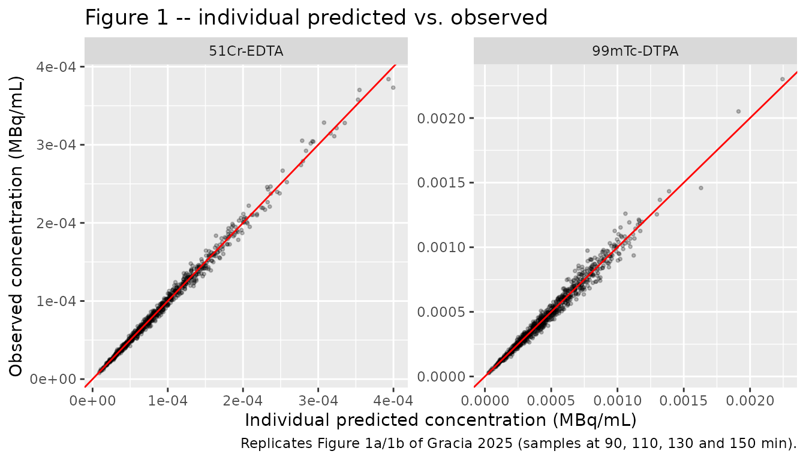
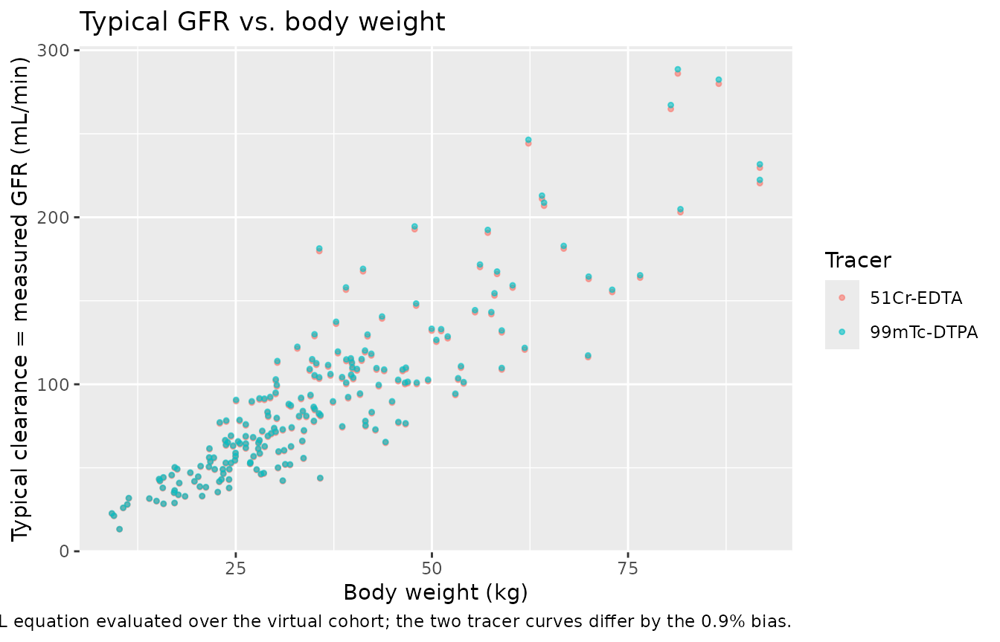

# 51Cr-EDTA and 99mTc-DTPA GFR tracers (Gracia 2025)

## Model and source

    #> ℹ parameter labels from comments will be replaced by 'label()'
    #> Warning: some etas defaulted to non-mu referenced, possible parsing error: etaiov_cl_1, etaiov_cl_2, etaiov_cl_3, etaiov_cl_4, etaiov_cl_5
    #> as a work-around try putting the mu-referenced expression on a simple line

- Citation: Gracia M, Ankaoua V, Alonso M, Pasquet M, Chatelut E (2025).
  A population pharmacokinetic approach to compare 51Cr-EDTA and
  99mTc-DTPA clearances in measuring renal glomerular filtration rate in
  oncopediatrics. Pediatric Nephrology 40(10):3163-3168.
  <doi:10.1007/s00467-025-06828-9>.

- Description: One-compartment IV-bolus population PK model fitted
  simultaneously to 51Cr-EDTA and 99mTc-DTPA plasma concentrations in 59
  oncopediatric children (40 51Cr-EDTA / 19 99mTc-DTPA) receiving
  cisplatin and/or ifosfamide (Gracia 2025). Clearance is the measured
  glomerular filtration rate and follows the CYSPED power equation on
  serum creatinine, plasma cystatin C and body weight; volume is
  proportional to body weight. A binary per-record tracer indicator
  (TRACER_TC99M_DTPA; the paper’s MES covariate) enters both CL and V
  multiplicatively as (1 - theta \* TRACER_TC99M_DTPA) and carries the
  paper’s estimand, the inter-tracer bias of -0.9% (95% CI +/- 11.4%) on
  clearance. Inter-occasion variability is carried on CL, and the
  proportional residual error is tracer-specific.

- Article: <https://doi.org/10.1007/s00467-025-06828-9> (Pediatric
  Nephrology 2025;40:3163-3168; PMC12401762, open access)

Gracia 2025 asks whether the two reference radioisotopic methods for
measuring glomerular filtration rate in children – chromium-51 EDTA and
technetium-99m DTPA – give the same answer. In adults the question has
been settled by giving both tracers to the same volunteer
simultaneously, but that design is not ethically available in children.
The authors instead fit a **single population PK model jointly to both
tracers’ plasma concentrations**, with a binary per-record tracer
indicator (`MES` in the paper, `TRACER_TC99M_DTPA` here) carried on both
clearance and volume. The coefficient on that indicator *is* the
inter-tracer bias, and the covariate model absorbs the demographic
differences between the two non-overlapping patient groups.

Clearance in this model is the measured GFR, so the packaged model
doubles as an implementation of the CYSPED paediatric GFR equation
re-estimated on 59 children.

## Population

| Field | Value |
|:---|:---|
| species | human |
| n_subjects | 59 |
| n_studies | 2 |
| age_range | 1.4-17.8 years (51Cr-EDTA group); 2.0-16.3 years (99mTc-DTPA group) |
| age_mean | 10.6 years (51Cr-EDTA group); 10.1 years (99mTc-DTPA group) |
| weight_range | 9.07-72.0 kg (51Cr-EDTA group); 10.0-91.8 kg (99mTc-DTPA group) |
| weight_mean | 34.3 kg (51Cr-EDTA group); 42.9 kg (99mTc-DTPA group) |
| sex_female_pct | 55.9 |
| disease_state | Pediatric malignancy (osteosarcoma 33, neuroblastoma 9, germinal tumor 7, rhabdomyosarcoma 3, other 7) treated with cisplatin and/or ifosfamide and requiring GFR monitoring for chemotherapy nephrotoxicity |
| dose_range | 2.072 MBq 51Cr-EDTA IV bolus; 6, 9 or 12 MBq 99mTc-DTPA IV bolus for body weight \< 10 kg, 10-20 kg and \> 20 kg respectively |
| regions | France (Toulouse University Hospital) |
| renal_function | Not restricted at inclusion; GFR monitored for nephrotoxicity of cisplatin and/or ifosfamide |
| notes | Baseline demographics from Gracia 2025 Table 1 (characteristics before the first GFR measurement). 40 children from the Cysped clinical trial (NCT02822404, 51Cr-EDTA, February 2012 to September 2015) and 19 from the CysPedVal analysis (RnIPH 2020-101, 99mTc-DTPA, December 2020 to June 2022). Inclusion criteria: age 0-18 years and body weight over 4 kg. Sex 26 male / 33 female overall (18/22 and 8/11 by group). Each tracer was given as an IV bolus twice per patient (before chemotherapy and at end of treatment) with four blood samples drawn from the contralateral arm at 90, 110, 130 and 150 min. Between one and five (median three) GFR measurements per patient. No patient received both tracers. |

Population metadata carried by the packaged model. {.table}

Fifty-nine oncopediatric children contributed data: 40 from the Cysped
trial (NCT02822404, 51Cr-EDTA, February 2012 to September 2015) and 19
from the CysPedVal analysis (RnIPH 2020-101, 99mTc-DTPA, December 2020
to June 2022). All were treated with cisplatin and/or ifosfamide and
required GFR monitoring for chemotherapy nephrotoxicity. Baseline
characteristics are Gracia 2025 Table 1; the two groups differed
significantly in body weight (34.3 vs 42.9 kg, p = 1e-4) and plasma
cystatin C (0.76 vs 0.82 mg/L, p = 8e-6) but not in age, sex, height or
serum creatinine. **No patient received both tracers**, so tracer
identity is perfectly confounded with source study in the observed data;
the covariate model is what makes the two groups comparable.

Each tracer was given as an IV bolus twice per patient (before
chemotherapy and at the end of treatment), with four blood samples drawn
from the contralateral arm at 90, 110, 130 and 150 min. Between one and
five (median three) GFR measurements were taken per patient. The dose
was 2.072 MBq for 51Cr-EDTA, and 6, 9 or 12 MBq for 99mTc-DTPA at body
weights below 10 kg, 10-20 kg and above 20 kg respectively.

## Source trace

Every `ini()` entry in
`inst/modeldb/specificDrugs/Gracia_2025_cr51edta_tc99mdtpa.R` carries an
in-file comment naming its source location. They are collected here for
review.

| Equation / parameter | Value | Source location |
|----|----|----|
| `TVCL = theta1 * (Scr/42.25)^theta3 * (PcysC/0.7738)^theta4 * (BW/35.70)^theta5 * (1 - theta6 * MES)` | n/a | Table 2, “Clearance (CL) (mL/min)” row |
| `TVV = theta7 * BW * (1 - theta8 * MES)` | n/a | Table 2, “Volume of distribution (V) (mL)” row |
| `lcl` (theta1) | 80.8 mL/min (+/- 3.1) | Table 2 |
| `e_creat_cl` (theta3) | -0.568 (+/- 0.156) | Table 2 |
| `e_cysc_cl` (theta4) | -0.295 (+/- 0.168) | Table 2 |
| `e_wt_cl` (theta5) | +1.06 (+/- 0.145) | Table 2 |
| `e_tracer_tc99m_dtpa_cl` (theta6) | -0.009 (+/- 0.114) | Table 2; restated in Results and in Table 3 row 1 |
| `lvc` (theta7) | 256 mL/kg (+/- 20) | Table 2 |
| `e_tracer_tc99m_dtpa_vc` (theta8) | +0.017 (+/- 0.143) | Table 2; restated in Results |
| `etalcl` | 11% CV -\> variance log(0.11^2 + 1) | Table 2, “Interindividual variability (CV%)” under the CL block; Table 3 row 1 |
| `etalvc` | 20.9% CV -\> variance log(0.209^2 + 1) | Table 2, “Interindividual variability (CV%)” under the V block |
| `etaiov_cl_1` .. `etaiov_cl_5` | 14.5% CV -\> variance log(0.145^2 + 1) | Table 2, “Interoccasion variability (CV%)”; Methods “Interoccasion variability of CL was included” |
| `propSd_cr51edta` | 4.99% CV | Table 2, “51Cr-EDTA plasma concentrations” |
| `propSd_tc99mdtpa` | 7.18% CV | Table 2, “99mTc-DTPA plasma concentrations” |
| Centering constants 42.25 umol/L, 0.7738 mg/L, 35.70 kg | n/a | Table 2 CL equation as printed |
| One-compartment structure, IV bolus, FOCEI | n/a | Methods, “Pharmacokinetic analysis” |
| Dose amounts and sampling times | n/a | Methods, “Patients and data” |
| Number of occasions (1 to 5 per patient) | n/a | Methods, “Patients and data” |

## Virtual cohort

Individual patient data are not public (Gracia 2025 Data availability:
“Data are available on request from the corresponding author”), so the
checks below use virtual children whose covariate marginals follow
Gracia 2025 Table 1.

The design is deliberately **paired**: every virtual child is simulated
twice, once with each tracer, holding body weight, serum creatinine,
cystatin C and the random effects fixed. That is the
simultaneous-administration design the paper calls the gold standard and
could not run in children, so it isolates the tracer effect exactly.

``` r

set.seed(20250529)
n_child <- 200  # per tracer arm (cap: 200/arm)

# Table 2 parameters, read back from the packaged model so this vignette can
# never drift from inst/modeldb/.
p <- list(
  cl_ref   = exp(theta[["lcl"]]),
  v_per_kg = exp(theta[["lvc"]]),
  e_creat  = theta[["e_creat_cl"]],
  e_cysc   = theta[["e_cysc_cl"]],
  e_wt     = theta[["e_wt_cl"]],
  e_tr_cl  = theta[["e_tracer_tc99m_dtpa_cl"]],
  e_tr_v   = theta[["e_tracer_tc99m_dtpa_vc"]]
)
# Centering constants as printed in the Table 2 equation.
ref <- list(creat = 42.25, cysc = 0.7738, wt = 35.70)

# Independent re-implementation of the Table 2 typical-value equations. Used
# below as a cross-check on the packaged model() block.
tvcl <- function(CREAT, CYSC, WT, MES) {
  p$cl_ref * (CREAT / ref$creat)^p$e_creat * (CYSC / ref$cysc)^p$e_cysc *
    (WT / ref$wt)^p$e_wt * (1 - p$e_tr_cl * MES)
}
tvv <- function(WT, MES) p$v_per_kg * WT * (1 - p$e_tr_v * MES)

# 99mTc-DTPA bolus, Methods "Patients and data": 6 / 9 / 12 MBq for body
# weight < 10 / 10-20 / > 20 kg. 51Cr-EDTA is 2.072 MBq at every weight.
dtpa_dose <- function(WT) ifelse(WT < 10, 6, ifelse(WT <= 20, 9, 12))
edta_dose <- function(WT) rep(2.072, length(WT))

# Truncated log-normal draws matched to the Table 1 pooled marginals.
rtrunc_lnorm <- function(n, med, cv, lo, hi) {
  sdlog <- sqrt(log(cv^2 + 1))
  x <- rlnorm(n, log(med), sdlog)
  pmin(pmax(x, lo), hi)
}

subjects <- tibble::tibble(
  child = seq_len(n_child),
  # Table 1 pooled body weight: means 34.3 (EDTA) and 42.9 kg (DTPA),
  # observed range 9.07-91.8 kg.
  WT    = rtrunc_lnorm(n_child, med = 33, cv = 0.50, lo = 9.07, hi = 91.8),
  # Table 1 serum creatinine: mean 42 umol/L both groups, range 8-102.
  CREAT = rtrunc_lnorm(n_child, med = 40, cv = 0.40, lo = 8, hi = 102),
  # Table 1 plasma cystatin C: means 0.76 / 0.82 mg/L, range 0.26-1.36.
  CYSC  = rtrunc_lnorm(n_child, med = 0.77, cv = 0.25, lo = 0.26, hi = 1.36)
)

# The study's four sampling times (Methods, "Patients and data").
obs_times <- c(90, 110, 130, 150)

# Observation grid for NCA. Terminal half-life runs about 55-120 min across the
# cohort's covariate range, so 720 min is 6-13 half-lives -- long enough for a
# small AUC extrapolation without decaying into solver noise. PKNCA's default
# lin-up/log-down trapezoid is exact for a mono-exponential decay, so a 5-min
# grid is as accurate as a much finer one and far cheaper to solve.
grid_nca <- seq(0, 720, by = 5)

# Sparse grid reproducing the study's own design, used for the stochastic runs.
grid_obs <- c(0, obs_times)

make_arm <- function(subj, tracer, id_offset, grid = grid_nca) {
  mes  <- as.integer(tracer == "99mTc-DTPA")
  dose <- if (mes == 1L) dtpa_dose(subj$WT) else edta_dose(subj$WT)
  base <- subj |>
    dplyr::mutate(
      id = id_offset + child,
      TRACER_TC99M_DTPA = mes,
      OCC = 1L,
      tracer = tracer,
      dose = dose
    )
  dosing <- base |>
    dplyr::mutate(time = 0, amt = dose, evid = 1L, cmt = "central")
  obs <- base |>
    tidyr::crossing(time = grid) |>
    dplyr::mutate(amt = NA_real_, evid = 0L, cmt = "central")
  dplyr::bind_rows(dosing, obs) |>
    dplyr::arrange(id, time, dplyr::desc(evid)) |>
    dplyr::select(id, time, amt, evid, cmt, WT, CREAT, CYSC,
                  TRACER_TC99M_DTPA, OCC, tracer, dose)
}

# Rich-grid event table for the typical-value / NCA work.
events <- dplyr::bind_rows(
  make_arm(subjects, "51Cr-EDTA",  id_offset = 0L),
  make_arm(subjects, "99mTc-DTPA", id_offset = as.integer(n_child))
)

# Same children and same IDs, sampled only at the study's four times, for the
# stochastic runs (Figure 1 and the residual-error check).
events_obs <- dplyr::bind_rows(
  make_arm(subjects, "51Cr-EDTA",  id_offset = 0L,                  grid = grid_obs),
  make_arm(subjects, "99mTc-DTPA", id_offset = as.integer(n_child), grid = grid_obs)
)

# Disjoint IDs across arms (rxSolve silently merges duplicated ids).
for (ev_tbl in list(events, events_obs)) {
  stopifnot(!anyDuplicated(unique(ev_tbl[, c("id", "time", "evid")])))
  stopifnot(length(intersect(
    unique(ev_tbl$id[ev_tbl$tracer == "51Cr-EDTA"]),
    unique(ev_tbl$id[ev_tbl$tracer == "99mTc-DTPA"])
  )) == 0L)
}
```

## Simulation

The typical-value simulation (`zeroRe()`) is used for the structural
checks and the NCA comparison; the stochastic simulation is used to
reproduce Figure 1 and to recover the published variance components.

`omega` is passed explicitly on **every** solve. rxode2 caches the
previous solve’s `omega` against the compiled model, so a `zeroRe()`
model can silently re-sample etas and a population model can silently
lose its IIV; `omega = NA` and `omega = ui$omega` pin each direction.

``` r

sim_typ <- rxode2::rxSolve(
  rxode2::zeroRe(ui), events = events, omega = NA,
  keep = c("tracer", "dose"), returnType = "data.frame"
)
#> Warning: No sigma parameters in the model
#> Warning: some etas defaulted to non-mu referenced, possible parsing error: etaiov_cl_1, etaiov_cl_2, etaiov_cl_3, etaiov_cl_4, etaiov_cl_5
#> as a work-around try putting the mu-referenced expression on a simple line
#> Warning: some etas defaulted to non-mu referenced, possible parsing error: etaiov_cl_1, etaiov_cl_2, etaiov_cl_3, etaiov_cl_4, etaiov_cl_5
#> as a work-around try putting the mu-referenced expression on a simple line
#> Warning: multi-subject simulation without without 'omega'

# With the random effects zeroed, each subject must have exactly one CL and one
# V, and they must equal the independent re-implementation of Table 2 above.
chk <- sim_typ |>
  dplyr::filter(!is.na(Cc)) |>
  dplyr::group_by(id, tracer) |>
  dplyr::summarise(cl = dplyr::first(cl), vc = dplyr::first(vc),
                   n_cl = dplyr::n_distinct(round(cl, 10)),
                   n_vc = dplyr::n_distinct(round(vc, 10)), .groups = "drop") |>
  dplyr::left_join(
    events |> dplyr::distinct(id, WT, CREAT, CYSC, TRACER_TC99M_DTPA),
    by = "id"
  )
stopifnot(all(chk$n_cl == 1L), all(chk$n_vc == 1L))
stopifnot(isTRUE(all.equal(
  chk$cl, tvcl(chk$CREAT, chk$CYSC, chk$WT, chk$TRACER_TC99M_DTPA),
  tolerance = 1e-8
)))
stopifnot(isTRUE(all.equal(
  chk$vc, tvv(chk$WT, chk$TRACER_TC99M_DTPA), tolerance = 1e-8
)))
```

``` r

set.seed(6828)
sim_iiv <- rxode2::rxSolve(
  ui$simulationModel, events = events_obs, omega = ui$omega,
  keep = c("tracer", "dose"), returnType = "data.frame"
)
# Guard the reverse direction of the same rxode2 cache bug: the population run
# must actually vary between subjects.
stopifnot(dplyr::n_distinct(round(sim_iiv$cl, 8)) > 1L)
stopifnot(dplyr::n_distinct(round(sim_iiv$vc, 8)) > 1L)
# rxode2 returns Cc == ipredSim (no residual error); `sim` carries the
# proportional residual error. Pin the distinction so it cannot regress.
stopifnot(isTRUE(all.equal(sim_iiv$Cc, sim_iiv$ipredSim)))
stopifnot(!isTRUE(all.equal(sim_iiv$Cc, sim_iiv$sim)))
sim_iiv <- dplyr::rename(sim_iiv, Cc_assay = sim)
```

## The inter-tracer bias (the paper’s primary result)

Gracia 2025 Abstract: *“Analysis revealed a non-significant bias (+/-
95% CI) of -0.9% +/- 11.4% between the two measurements (with 99mTc-DTPA
clearance overestimated).”* In the model that bias is `theta6` entering
as `(1 - theta6 * MES)`, so the ratio of the 99mTc-DTPA clearance to the
51Cr-EDTA clearance in the same child is `1 - theta6`.

``` r

ratio_tab <- chk |>
  dplyr::select(id, tracer, cl, vc, WT, CREAT, CYSC) |>
  dplyr::mutate(child = ifelse(tracer == "51Cr-EDTA", id, id - n_child)) |>
  dplyr::select(-id) |>
  tidyr::pivot_wider(names_from = tracer, values_from = c(cl, vc)) |>
  dplyr::mutate(
    cl_ratio = `cl_99mTc-DTPA` / `cl_51Cr-EDTA`,
    v_ratio  = `vc_99mTc-DTPA` / `vc_51Cr-EDTA`
  )

# Every child must show exactly the published bias, on both CL and V.
stopifnot(isTRUE(all.equal(ratio_tab$cl_ratio,
                           rep(1 - p$e_tr_cl, nrow(ratio_tab)), tolerance = 1e-10)))
stopifnot(isTRUE(all.equal(ratio_tab$v_ratio,
                           rep(1 - p$e_tr_v, nrow(ratio_tab)), tolerance = 1e-10)))

bias_cl_pct <- 100 * (mean(ratio_tab$cl_ratio) - 1)
bias_v_pct  <- 100 * (mean(ratio_tab$v_ratio) - 1)
```

Across all 200 virtual children the model gives a +0.9% difference in
clearance and a -1.7% difference in volume for 99mTc-DTPA relative to
51Cr-EDTA.

Mind the sign convention, which is easy to invert. The paper quotes the
bias as the **coefficient** `theta6 = -0.009` (“a non-significant bias
of -0.9%”), but the coefficient enters as `(1 - theta6 * MES)`, so a
*negative* coefficient makes the 99mTc-DTPA clearance 0.9% **higher**.
That is exactly what the abstract’s parenthetical says – “with
99mTc-DTPA clearance overestimated” – and it is the direction Biggi,
Fleming and McMeekin all reported in adults (Discussion). The same
inversion applies to volume: the published coefficient theta8 is +0.017,
so the 99mTc-DTPA volume is 1.7% **lower**. Both 95% confidence
intervals (+/- 0.114 on CL, +/- 0.143 on V) span zero, which is the
paper’s conclusion: the two tracers are equivalent.

| Quantity                                | Published                | Packaged |
|:----------------------------------------|:-------------------------|:---------|
| Bias coefficient theta6 (CL)            | -0.009 (95% CI +/- 0.11) | -0.009   |
| Interindividual variability on CL (CV%) | 11.0                     | 11.0     |

Gracia 2025 Table 3, final covariate model row (the only row with a
published parameter set), against the packaged model. {.table}

## Replicate published figures

### Figure 1 – individual predicted vs. observed plasma concentrations

Gracia 2025 Figure 1 plots individual predicted against observed plasma
concentrations for 51Cr-EDTA (1a) and 99mTc-DTPA (1b). Here the
individual prediction is `Cc` and the “observation” is `Cc_assay`,
i.e. `Cc` with the tracer-specific proportional residual error applied,
evaluated at the study’s four sampling times.

``` r

fig1 <- sim_iiv |>
  dplyr::filter(!is.na(Cc), time %in% obs_times)

ggplot(fig1, aes(Cc, Cc_assay)) +
  geom_point(alpha = 0.25, size = 0.7) +
  geom_abline(slope = 1, intercept = 0, colour = "red") +
  facet_wrap(~tracer, scales = "free") +
  labs(
    x = "Individual predicted concentration (MBq/mL)",
    y = "Observed concentration (MBq/mL)",
    title = "Figure 1 -- individual predicted vs. observed",
    caption = "Replicates Figure 1a/1b of Gracia 2025 (samples at 90, 110, 130 and 150 min)."
  )
```



The scatter around the identity line is the tracer-specific residual
error, and it should reproduce the two published magnitudes.

``` r

ruv <- fig1 |>
  dplyr::group_by(tracer) |>
  dplyr::summarise(cv_pct = 100 * sd(Cc_assay / Cc - 1), n = dplyr::n(),
                   .groups = "drop") |>
  dplyr::mutate(published_pct = ifelse(tracer == "51Cr-EDTA",
                                       100 * theta[["propSd_cr51edta"]],
                                       100 * theta[["propSd_tc99mdtpa"]]))
ruv |>
  dplyr::rename("Tracer" = tracer, "Simulated residual CV (%)" = cv_pct,
                "n samples" = n, "Published residual CV (%)" = published_pct) |>
  knitr::kable(digits = 2, caption = "Residual error recovered from the simulation vs. Gracia 2025 Table 2.")
```

| Tracer     | Simulated residual CV (%) | n samples | Published residual CV (%) |
|:-----------|--------------------------:|----------:|--------------------------:|
| 51Cr-EDTA  |                      4.80 |       800 |                      4.99 |
| 99mTc-DTPA |                      7.36 |       800 |                      7.18 |

Residual error recovered from the simulation vs. Gracia 2025 Table 2.
{.table}

``` r


# Monte-Carlo tolerance for an SD from n samples is roughly 1/sqrt(2n); with
# n in the thousands, 10% relative is a comfortably strict bound.
stopifnot(all(abs(ruv$cv_pct / ruv$published_pct - 1) < 0.10))
```

### Typical GFR across the paediatric weight range

The CL equation *is* the CYSPED GFR equation, so the typical-value
simulation is a direct rendering of it over the cohort’s covariate
range.

``` r

chk |>
  ggplot(aes(WT, cl, colour = tracer)) +
  geom_point(alpha = 0.6, size = 0.9) +
  labs(
    x = "Body weight (kg)", y = "Typical clearance = measured GFR (mL/min)",
    colour = "Tracer",
    title = "Typical GFR vs. body weight",
    caption = "Table 2 CL equation evaluated over the virtual cohort; the two tracer curves differ by the 0.9% bias."
  )
```



## PKNCA validation

For a one-compartment IV bolus, `Dose / AUC0-inf` recovers clearance
exactly and `CL / lambda_z` recovers the volume of distribution. Both
are computed with PKNCA from the typical-value simulation and compared
against the Table 2 equations, per subject.

``` r

sim_nca <- sim_typ |>
  dplyr::filter(!is.na(Cc)) |>
  dplyr::select(id, time, Cc, tracer)

# Guarantee a time = 0 row per (id, tracer). The rich grid already contains
# time = 0 (the post-bolus concentration), so .keep_all keeps the real value.
sim_nca <- dplyr::bind_rows(
  sim_nca,
  sim_nca |> dplyr::distinct(id, tracer) |> dplyr::mutate(time = 0, Cc = 0)
) |>
  dplyr::distinct(id, tracer, time, .keep_all = TRUE) |>
  dplyr::arrange(id, tracer, time)

stopifnot(all(sim_nca$Cc >= 0))

conc_obj <- PKNCA::PKNCAconc(sim_nca, Cc ~ time | tracer + id)

dose_df <- events |>
  dplyr::filter(evid == 1) |>
  dplyr::select(id, time, amt, tracer) |>
  dplyr::mutate(route = "intravascular", duration = 0)

dose_obj <- PKNCA::PKNCAdose(dose_df, amt ~ time | tracer + id)
#> Found column named route, using it for the attribute of the same name.
#> Found column named duration, using it for the attribute of the same name.

intervals <- data.frame(
  start = 0, end = Inf,
  cmax = TRUE, aucinf.obs = TRUE, half.life = TRUE,
  cl.obs = TRUE, vz.obs = TRUE
)

nca_res <- PKNCA::pk.nca(PKNCA::PKNCAdata(conc_obj, dose_obj, intervals = intervals))
```

``` r

nca_wide <- as.data.frame(nca_res) |>
  dplyr::select(tracer, id, PPTESTCD, PPORRES) |>
  tidyr::pivot_wider(names_from = PPTESTCD, values_from = PPORRES) |>
  dplyr::left_join(
    events |> dplyr::distinct(id, WT, CREAT, CYSC, TRACER_TC99M_DTPA),
    by = "id"
  ) |>
  dplyr::mutate(
    cl_model = tvcl(CREAT, CYSC, WT, TRACER_TC99M_DTPA),
    v_model  = tvv(WT, TRACER_TC99M_DTPA),
    cl_err   = cl.obs / cl_model - 1,
    v_err    = vz.obs / v_model - 1
  )

# Per-subject structural identities. The residual disagreement is pure
# trapezoidal / extrapolation error from the finite observation grid.
stopifnot(nrow(nca_wide) == 2L * n_child)
# PKNCA reproduces both to machine precision for this mono-exponential system,
# so the bound is tight enough to catch any structural regression.
stopifnot(max(abs(nca_wide$cl_err)) < 1e-8)
stopifnot(max(abs(nca_wide$v_err))  < 1e-8)

tibble::tibble(
  Identity = c("Dose / AUC0-inf vs. Table 2 CL equation",
               "CL / lambda_z vs. Table 2 V equation"),
  `Max |relative error|` = sprintf("%.3f%%", 100 * c(max(abs(nca_wide$cl_err)),
                                                     max(abs(nca_wide$v_err)))),
  `Subjects checked` = nrow(nca_wide)
) |>
  knitr::kable(caption = "Per-subject NCA identities across both tracer arms.")
```

| Identity | Max \|relative error\| | Subjects checked |
|:---|:---|---:|
| Dose / AUC0-inf vs. Table 2 CL equation | 0.000% | 400 |
| CL / lambda_z vs. Table 2 V equation | 0.000% | 400 |

Per-subject NCA identities across both tracer arms. {.table}

### Comparison against published values

Gracia 2025 reports no NCA table, so the reference column below is built
from the Table 2 equations evaluated at the model’s own reference
covariate set (serum creatinine 42.25 umol/L, cystatin C 0.7738 mg/L,
body weight 35.70 kg) – the covariate set at which `theta1` and `theta7`
are the typical values. A reference child is simulated at exactly that
covariate set for each tracer.

``` r

ref_subj <- tibble::tibble(child = 1L, WT = ref$wt, CREAT = ref$creat, CYSC = ref$cysc)
ref_events <- dplyr::bind_rows(
  make_arm(ref_subj, "51Cr-EDTA",  id_offset = 0L),
  make_arm(ref_subj, "99mTc-DTPA", id_offset = 1L)
)
ref_sim <- rxode2::rxSolve(
  rxode2::zeroRe(ui), events = ref_events, omega = NA,
  keep = c("tracer", "dose"), returnType = "data.frame"
)
#> Warning: No sigma parameters in the model
#> Warning: some etas defaulted to non-mu referenced, possible parsing error: etaiov_cl_1, etaiov_cl_2, etaiov_cl_3, etaiov_cl_4, etaiov_cl_5
#> as a work-around try putting the mu-referenced expression on a simple line
#> Warning: multi-subject simulation without without 'omega'

ref_nca_in <- ref_sim |>
  dplyr::filter(!is.na(Cc)) |>
  dplyr::select(id, time, Cc, tracer) |>
  dplyr::arrange(id, time)
ref_dose <- ref_events |>
  dplyr::filter(evid == 1) |>
  dplyr::select(id, time, amt, tracer) |>
  dplyr::mutate(route = "intravascular", duration = 0)

ref_res <- PKNCA::pk.nca(PKNCA::PKNCAdata(
  PKNCA::PKNCAconc(ref_nca_in, Cc ~ time | tracer + id),
  PKNCA::PKNCAdose(ref_dose, amt ~ time | tracer + id),
  intervals = intervals
))
#> Found column named route, using it for the attribute of the same name.
#> Found column named duration, using it for the attribute of the same name.
```

``` r

# Table 2 predictions for the reference child, computed from the packaged
# thetas rather than transcribed, so they cannot drift.
ref_dose_amt <- c(`51Cr-EDTA` = edta_dose(ref$wt), `99mTc-DTPA` = dtpa_dose(ref$wt))
published <- tibble::tibble(
  tracer     = c("51Cr-EDTA", "99mTc-DTPA"),
  mes        = c(0, 1)
) |>
  dplyr::mutate(
    cl.obs     = tvcl(ref$creat, ref$cysc, ref$wt, mes),
    vz.obs     = tvv(ref$wt, mes),
    half.life  = log(2) * vz.obs / cl.obs,
    cmax       = unname(ref_dose_amt[tracer]) / vz.obs,
    aucinf.obs = unname(ref_dose_amt[tracer]) / cl.obs
  ) |>
  dplyr::select(-mes)

cmp <- nlmixr2lib::ncaComparisonTable(
  simulated = ref_res,
  reference = published,
  by        = "tracer",
  units     = c(cmax = "MBq/mL", aucinf.obs = "MBq*min/mL", half.life = "min",
                cl.obs = "mL/min", vz.obs = "mL"),
  tolerance_pct = 20
)

knitr::kable(
  cmp,
  digits  = 4,
  caption = "Reference child (Scr 42.25 umol/L, PcysC 0.7738 mg/L, BW 35.70 kg): PKNCA on the simulated profile vs. the Gracia 2025 Table 2 equations. * marks a >20% difference. CL/F and Vz/F are the PKNCA labels; the dose is an IV bolus, so F = 1 and they are CL and Vz.",
  align   = c("l", "l", "r", "r", "r")
)
```

| NCA parameter              | tracer     | Reference | Simulated | % diff |
|:---------------------------|:-----------|----------:|----------:|-------:|
| Cmax (MBq/mL)              | 51Cr-EDTA  |  0.000227 |  0.000227 |  +0.0% |
| Cmax (MBq/mL)              | 99mTc-DTPA |   0.00134 |   0.00134 |  +0.0% |
| AUC0-∞ (obs) (MBq\*min/mL) | 51Cr-EDTA  |    0.0256 |    0.0256 |  +0.0% |
| AUC0-∞ (obs) (MBq\*min/mL) | 99mTc-DTPA |     0.147 |     0.147 |  -0.0% |
| t½ (min)                   | 51Cr-EDTA  |      78.4 |      78.4 |  -0.0% |
| t½ (min)                   | 99mTc-DTPA |      76.4 |      76.4 |  -0.0% |
| CL/F (mL/min)              | 51Cr-EDTA  |      80.8 |      80.8 |  -0.0% |
| CL/F (mL/min)              | 99mTc-DTPA |      81.5 |      81.5 |  +0.0% |
| Vz/F (mL)                  | 51Cr-EDTA  |      9140 |      9140 |  -0.0% |
| Vz/F (mL)                  | 99mTc-DTPA |      8980 |      8980 |  -0.0% |

Reference child (Scr 42.25 umol/L, PcysC 0.7738 mg/L, BW 35.70 kg):
PKNCA on the simulated profile vs. the Gracia 2025 Table 2 equations. \*
marks a \>20% difference. CL/F and Vz/F are the PKNCA labels; the dose
is an IV bolus, so F = 1 and they are CL and Vz. {.table}

``` r


# These are exact structural identities, so every row must agree to well
# within the 20% starring threshold. Parse the "% diff" column numerically
# rather than grepping for the star: the AUC unit string itself contains a
# literal "*" (MBq*min/mL), which a naive grep would match.
pct_diff <- as.numeric(gsub("[^0-9.eE+-]", "", cmp[["% diff"]]))
stopifnot(!anyNA(pct_diff), max(abs(pct_diff)) < 0.1)
```

## Variance components

The last published quantities to check are the three random effects. A
three-occasion simulation on the study’s own sparse design separates
them: the within-child spread of clearance across occasions is the
inter-occasion variability, and the between-child spread at a fixed
occasion is the inter-individual variability.

``` r

set.seed(99143)
# Three GFR measurement occasions (the published median), 21 days apart, on the
# study's own four-sample design.
n_occ   <- 3L
occ_gap <- 21 * 24 * 60  # minutes

iov_events <- lapply(seq_len(n_occ), function(k) {
  make_arm(subjects, "51Cr-EDTA", id_offset = 0L, grid = grid_obs) |>
    dplyr::filter(evid == 1L | time %in% obs_times) |>
    dplyr::mutate(OCC = as.integer(k), time = time + (k - 1) * occ_gap)
}) |>
  dplyr::bind_rows() |>
  dplyr::arrange(id, time, dplyr::desc(evid))

sim_occ <- rxode2::rxSolve(
  ui$simulationModel, events = iov_events, omega = ui$omega,
  keep = "tracer", returnType = "data.frame"
)

# Recover the occasion from the observation time rather than from `keep`, since
# OCC is also a model variable and a kept column of the same name would be
# ambiguous.
cl_occ <- sim_occ |>
  dplyr::filter(!is.na(Cc)) |>
  dplyr::mutate(occ = floor(time / occ_gap) + 1L) |>
  dplyr::group_by(id, occ) |>
  dplyr::summarise(cl = dplyr::first(cl), .groups = "drop") |>
  dplyr::left_join(events |> dplyr::distinct(id, WT, CREAT, CYSC), by = "id") |>
  # log(cl / TVCL) = etalcl + etaiov_cl_occ, so the covariate model divides out.
  dplyr::mutate(dev = log(cl / tvcl(CREAT, CYSC, WT, 0)))

stopifnot(sort(unique(cl_occ$occ)) == seq_len(n_occ))

# Within-child variance across occasions estimates the IOV variance; the
# between-child variance of the per-child mean is var_iiv + var_iov / n_occ.
var_iov <- mean(tapply(cl_occ$dev, cl_occ$id, var))
child_mean <- tapply(cl_occ$dev, cl_occ$id, mean)
var_iiv <- var(child_mean) - var_iov / n_occ

cv_from_var <- function(v) 100 * sqrt(exp(pmax(v, 0)) - 1)
iov_cv <- cv_from_var(var_iov)
iiv_cv <- cv_from_var(var_iiv)

iiv_v <- sim_iiv |>
  dplyr::filter(!is.na(Cc), tracer == "51Cr-EDTA") |>
  dplyr::group_by(id) |>
  dplyr::summarise(vc = dplyr::first(vc), .groups = "drop") |>
  dplyr::left_join(events |> dplyr::distinct(id, WT), by = "id") |>
  dplyr::summarise(cv_pct = 100 * sqrt(exp(var(log(vc / (p$v_per_kg * WT)))) - 1)) |>
  dplyr::pull(cv_pct)

var_tab <- tibble::tibble(
  Component = c("Inter-occasion variability on CL",
                "Inter-individual variability on CL",
                "Inter-individual variability on V"),
  `Published CV (%)` = c(14.5, 11.0, 20.9),
  `Recovered CV (%)` = c(iov_cv, iiv_cv, iiv_v)
)
var_tab |> knitr::kable(digits = 2, caption = "Variance components recovered from simulation vs. Gracia 2025 Table 2.")
```

| Component                          | Published CV (%) | Recovered CV (%) |
|:-----------------------------------|-----------------:|-----------------:|
| Inter-occasion variability on CL   |             14.5 |            15.36 |
| Inter-individual variability on CL |             11.0 |             9.89 |
| Inter-individual variability on V  |             20.9 |            20.36 |

Variance components recovered from simulation vs. Gracia 2025 Table 2.
{.table}

``` r


# n = 200 children x 3 occasions; 20% relative is a strict bound for a
# variance-component estimate at this sample size.
stopifnot(all(abs(var_tab$`Recovered CV (%)` / var_tab$`Published CV (%)` - 1) < 0.20))
```

## Assumptions and deviations

- **Centering constants: Table 2 wins over the Discussion.** Table 2
  prints the final-model CL equation with `PcysC/0.7738` and `BW/35.70`;
  the Discussion restates the same 59-patient equation with the
  *original 40-patient CYSPED* constants `PcysC/0.76` and `BW/34.3` so
  it can be shown side by side with the 40-patient equation. The two
  forms cannot both be right with the same `theta1 = 80.8` – they differ
  by about 3.6% in typical CL. Table 2 is the final-model parameter
  table, and its cystatin C constant matches the pooled 59-patient mean
  implied by Table 1 ((40 x 0.76 + 19 x 0.82) / 59 = 0.779 mg/L), so
  Table 2’s constants are used here and the Discussion form is treated
  as a presentational reuse of the older centering.
- **Concentration units are not stated by the paper.** Doses are in MBq
  and V in mL, so `MBq/mL` follows. Any consistent radioactivity unit
  gives the same clearance, because `CL = Dose / AUC` is invariant to
  the tracer amount unit; nothing in the validation depends on the
  choice.
- **Random-effect scale.** The paper reports CV% for the random effects
  and states that “a proportional error model for residual and
  interpatient variabilities” was used. The packaged model follows the
  nlmixr2lib convention of log-scale structural parameters with additive
  etas (i.e. log-normal IIV), with each variance set to `log(CV^2 + 1)`
  so the simulated CV equals the published CV exactly. At these
  magnitudes (11-20.9%) the log-normal and proportional forms are
  numerically indistinguishable.
- **Inter-occasion variability is expanded into per-occasion etas.**
  NONMEM shares one IOV variance across occasions with
  `$OMEGA BLOCK(1) SAME`; nlmixr2 has no `SAME` shortcut, so
  `etaiov_cl_1` is estimated and `etaiov_cl_2` to `etaiov_cl_5` are
  fixed to the same variance. Five slots cover the published maximum of
  five GFR measurements per patient. Simulations that use fewer
  occasions simply leave the unused slots inactive.
- **Tracer-specific residual error.** The model carries
  `propSd_cr51edta` and `propSd_tc99mdtpa` as separate `ini()` entries
  and selects between them inside `model()` with the binary tracer
  indicator, so the observation statement is `Cc ~ prop(propSd_eff)`.
  The registered precedents for a covariate-switched residual error
  (`Abrantes_2017_moroctocog.R`, `Valke_2024_factorviii.R`) keep a bare
  `propSd` for the reference stratum and carry the contrast as a
  multiplier, because in those papers the multiplier is what was
  published. Gracia 2025 publishes two *absolute* residual SDs instead,
  so both are encoded as literals with a stratum suffix; a multiplier
  form would require hard-coding a derived ratio that appears nowhere in
  the paper.
- **Covariate distributions are assumed.** Gracia 2025 Table 1 gives
  marginal means and ranges for body weight, serum creatinine and
  cystatin C but not their joint distribution, so the virtual cohort
  draws the three independently from truncated log-normals matched to
  those marginals. The validation results do not depend on the joint
  distribution: every check above is either a per-subject identity or a
  paired within-child ratio.
- **theta2 is absent from Table 2.** The published table numbers the
  final model’s parameters `theta1`, `theta3`, `theta4`, `theta5`,
  `theta6`, `theta7`, `theta8`; there is no `theta2` row. The Methods
  CYSPED equation uses `theta1`..`theta4` for the same four CL terms, so
  the Table 2 numbering carries over from a larger NONMEM control
  stream. No parameter is missing – every term in both printed equations
  has a published estimate.
- **Table 3’s reduced covariate models are not extracted.** Gracia 2025
  Table 3 reports the bias coefficient and the IIV on CL for eight
  covariate models, but publishes the full parameter set for only the
  final one (the model packaged here). The other seven rows cannot be
  reconstructed as models from bias and IIV alone, so only the final
  model is extracted.
- **Erratum search.** No erratum, corrigendum or author correction was
  found for <doi:10.1007/s00467-025-06828-9>. The supplementary material
  (`467_2025_6828_MOESM2_ESM.docx`) contains trial-registration prose
  and two references only – no additional parameters or equations.
