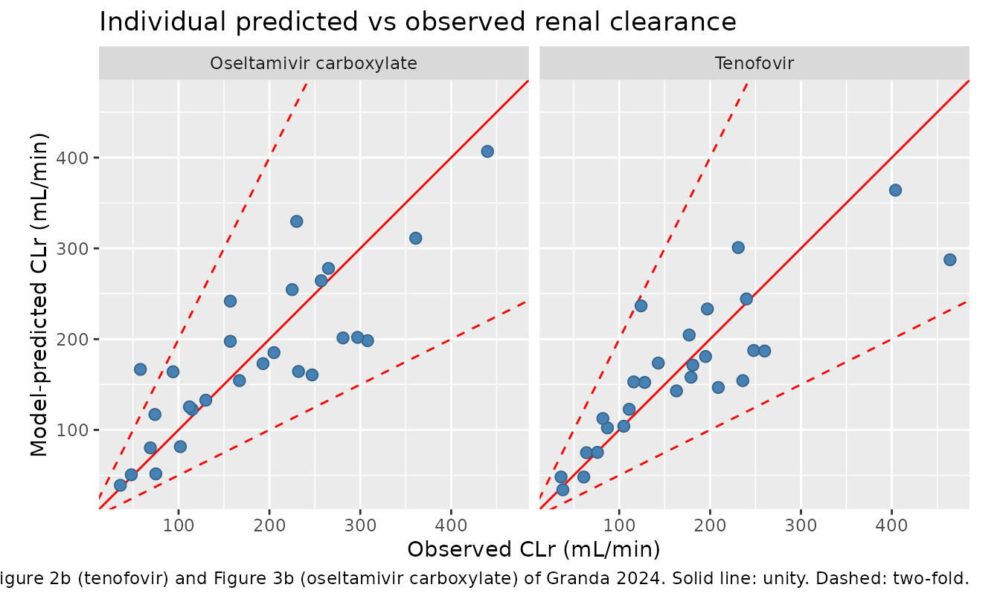

# Mechanistic kidney PBPK with biomarker-estimated secretion and blood flow (Granda 2024)

## Model and source

- Citation: Granda ML, Huang W, Yeung CK, Isoherranen N, Kestenbaum B.
  Predicting complex kidney drug handling using a physiologically-based
  pharmacokinetic model informed by biomarker-estimated secretory
  clearance and blood flow. Clin Transl Sci. 2024;17(1):e13678.
  <doi:10.1111/cts.13678>. Structural framework and physiological
  constants: Huang W, Isoherranen N. Development of a dynamic
  physiologically based mechanistic kidney model to predict renal
  clearance. CPT Pharmacometrics Syst Pharmacol. 2018;7(9):593-602.
  <doi:10.1002/psp4.12321>; Huang W, Isoherranen N. Novel mechanistic
  PBPK model to predict renal clearance in varying stages of CKD by
  incorporating tubular adaptation and dynamic passive reabsorption. CPT
  Pharmacometrics Syst Pharmacol. 2020;9(10):571-583.
  <doi:10.1002/psp4.12553> (adaptive tubular flows, segment volumes and
  surface areas, and the distributed MATLAB / Simulink implementation
  PSP4-9-571-s002 from which the unit conversions are taken).
- Article: <https://doi.org/10.1111/cts.13678> (open access;
  PMC10766039)
- Structural framework: <https://doi.org/10.1002/psp4.12321> (Huang &
  Isoherranen 2018) and <https://doi.org/10.1002/psp4.12553> (Huang &
  Isoherranen 2020, whose supplement `PSP4-9-571-s002` distributes the
  authors’ MATLAB driver script and Simulink model).

Granda 2024 does not restate the model equations; its Methods say only
that the authors “leveraged our previously published
physiologically-based mechanistic kidney model … Model equations and
codes were previously provided” (references 10 and 11). The structural
equations, segment volumes and surface areas, tubular pH profile,
adaptive tubular-flow factors and unit conversions implemented here are
therefore taken from those two upstream framework papers and from the
authors’ own distributed MATLAB code; the drug-specific inputs and the
per-subject measurements come from Granda 2024 itself.

This paper contributes three model files, one per compound:

``` r

mods <- c("Granda_2024_kynurenicacid_pbpk",
          "Granda_2024_tenofovir_pbpk",
          "Granda_2024_oseltamivircarboxylate_pbpk")
tibble::tibble(
  Model = mods,
  Role = c("Biomarker: secretory capacity is FITTED to each subject's measured kynurenic acid clearance",
           "Prediction: tenofovir renal clearance (secretory scalar 0.033)",
           "Prediction: oseltamivir carboxylate renal clearance (secretory scalar 0.038)")
) |>
  knitr::kable(caption = "The three models contributed by Granda 2024.")
```

| Model | Role |
|:---|:---|
| Granda_2024_kynurenicacid_pbpk | Biomarker: secretory capacity is FITTED to each subject’s measured kynurenic acid clearance |
| Granda_2024_tenofovir_pbpk | Prediction: tenofovir renal clearance (secretory scalar 0.033) |
| Granda_2024_oseltamivircarboxylate_pbpk | Prediction: oseltamivir carboxylate renal clearance (secretory scalar 0.038) |

The three models contributed by Granda 2024. {.table}

### Structure

The kidney is resolved into 11 longitudinal subsegments – proximal
tubule S1/S2/S3, descending and ascending loop of Henle, distal tubule,
and five collecting-duct subsegments – each carrying three states: the
tubular lumen, the tubular epithelial cell, and the peritubular
capillary blood. That is 33 states; a systemic venous-blood compartment
and a bladder compartment bring the total to the 35 the paper describes.

``` r

ui <- rxode2::rxode(readModelDb("Granda_2024_tenofovir_pbpk"))
cat("ODE states:", length(ui$state), "\n")
#> ODE states: 35
cat("Covariates :", paste(ui$allCovs, collapse = ", "), "\n")
#> Covariates : CRCL, KBF
```

Mechanisms represented: unbound glomerular filtration into Bowman’s
capsule, OAT1/3-mediated active secretion (basolateral uptake plus
apical efflux, in the three proximal-tubule subsegments only),
pH-dependent bidirectional passive diffusion along the whole nephron,
and the CKD tubular-flow adaptation of Huang & Isoherranen 2020.

## Population

Twenty-seven adult outpatients from an ancillary study to PROCLAIM
(Proximal Tubular Clearance of Renal Medications), recruited 2017-2019
at the University of Washington. Mean age 54 years (SD 15), 63% male,
56% White / 41% Black, mean body-mass index 29.0 kg/m^2 (SD 5.7). Kidney
function spanned CKD stages 1-5: mean iGFR 76 +/- 30 mL/min/1.73 m^2,
with 6 subjects (22%) below 45, 4 (15%) between 45 and 60, 9 (33%)
between 60 and 90 and 8 (30%) above 90. Participants with nephrotic
syndrome, cirrhosis or on renal replacement therapy were excluded. Each
received a single oral dose of tenofovir alafenamide 50 mg and
oseltamivir 30 mg, with 13 plasma samples over 600 min and a concurrent
10-hour timed urine collection (Granda 2024 Table 1 and Methods).

The same information is available programmatically via
`readModelDb("Granda_2024_tenofovir_pbpk")()$population`.

## Source trace

| Equation / parameter | Value | Source location |
|----|----|----|
| `fup` (kynurenic acid / tenofovir / oseltamivir carboxylate) | 0.07 / 0.993 / 0.97 | Granda 2024 Table 2 (footnotes a, b, c) and Methods |
| `bp` | 1 / 0.55 / 0.67 | Granda 2024 Table 2 (footnotes d, e, f) |
| `papp` (10^-6 cm/s) | 1 / 0.37 / 1.49 | Granda 2024 Table 2 (footnotes d, e, g) |
| `secscalar` | 1 / 0.033 / 0.038 | Granda 2024 Results, “Mechanistic prediction of kidney clearance” |
| `lclintsec` typical value | log(220 L/h) | Granda 2024 Table 3, median of the 27 optimized values |
| `CRCL` per subject | 20-146 mL/min | Granda 2024 Table 3, “Iohexol CLr (mL/min)” |
| `KBF` per subject | 76-1692 mL/min | Granda 2024 Table 3, “Isovalerylglycine CLr (mL/min)” |
| `lvc` (42 L) | `V_ven0 = 42` | Huang & Isoherranen 2020 distributed MATLAB (`PSP4-9-571-s002`) |
| Segment volumes 0.0305 / 0.0027 / 0.0194 / 0.009 L | `V_PT`, `V_HT`, `V_DT`, `V_CDT` | Huang & Isoherranen 2020 MATLAB |
| Surface areas 6107 / 61 / 156 / 6.7 dm^2 | `S_PT`, `S_HT`, `S_DT`, `S_CD` | Huang & Isoherranen 2020 MATLAB |
| Healthy tubular flows 120, 94, 68, 43, 24, 24, 11, 9, 7, 5, 3, 1 mL/min | `Q_P1 ... Q_urine` | Huang & Isoherranen 2020 MATLAB, “For Adaptive Model” |
| Adaptation factors 0, 0.009922, …, 0.5611 | `Adaptation_Factor_1 ... _12` | Huang & Isoherranen 2020 MATLAB |
| Tubular pH profile 7.2 -\> 6.5 | `pH_1 ... pH_11` | Huang & Isoherranen 2020 MATLAB |
| 1 mL/min = 0.06 L/h | `Unit = 7.2/120` | Huang & Isoherranen 2020 MATLAB |
| 0.00036 (10^-6 cm/s -\> dm/h) | `Papp = 0.00036*P_drug` | Huang & Isoherranen 2020 MATLAB |
| 1.5 microvilli adjustment | `In_vitro_microvilli = 1.5` | Huang & Isoherranen 2020 MATLAB, citing Huang & Isoherranen 2018 |
| Basolateral area = apical / 30 | `CL_PD_PX_basolateral = S_PT/30 * Papp` | Huang & Isoherranen 2020 MATLAB |
| `fu_invitro` = 1 | `In_vitro_unionization = 1` | Huang & Isoherranen 2020 MATLAB (framework default) |
| `pka_base` = 1 | `pKa_b = 1` (“a very low number … no ionization”) | Huang & Isoherranen 2020 MATLAB |
| `pka_acid` = 2 | **not reported anywhere**; model-identified | see *Assumptions and deviations* below |
| `clh`, `clreabs_api`, `clreabs_bsl`, `clint_met` = 0 | `CLh`, `CL_api_reabs`, `CL_bsl_reabs`, `CL_kidney_intrinsic` | Huang & Isoherranen 2020 MATLAB |

## The published cohort

Unusually for a popPK/PBPK extraction, no virtual cohort is needed:
Granda 2024 publishes every per-subject model **input** (Table 3) and
every per-subject model **output** (Tables 3 and 4). The validation
below is therefore an exact reproduction against the paper’s own numbers
rather than a distributional comparison.

``` r

granda <- tibble::tribble(
  ~ID, ~iGFR, ~IVG,  ~KAobs, ~CLINTSEC, ~tfvObs, ~tfvPred, ~ocObs, ~ocPred,
   1L,   128,  1145,    313,       320,     240,      244,    257,     263,
   2L,   143,   735,    288,       340,     197,      233,    225,     253,
   3L,   146,  1212,    409,       460,     231,      301,    230,     328,
   5L,   116,   468,    156,       160,     236,      154,    232,     163,
   6L,    40,   134,     38,        40,      36,       48,     48,      50,
  13L,    48,   292,     81,        85,      64,       75,     69,      80,
  14L,    55,   237,    159,       280,      87,      102,     74,     117,
  15L,    63,   413,    150,       160,      82,      113,    115,     122,
  16L,    66,   551,    157,       160,     111,      123,    130,     132,
  18L,    38,   369,     99,       100,      76,       76,    102,      81,
  22L,   139,   315,    143,       180,     128,      152,     94,     163,
  23L,   110,   416,    195,       240,     179,      158,    193,     172,
  24L,   134,  1692,    386,       380,     464,      287,    361,     309,
  25L,    95,   746,    211,       220,     181,      171,    205,     184,
  30L,    84,   567,    199,       220,     116,      153,     58,     166,
  31L,   110,   359,    174,       220,     209,      146,    247,     160,
  33L,   123,   667,    203,       220,     248,      187,    281,     200,
  34L,    96,   639,    249,       280,     195,      181,    308,     198,
  35L,    98,   912,    235,       240,     260,      187,    297,     201,
  36L,    91,   496,    164,       180,     163,      143,    167,     153,
  38L,    74,   192,    202,      1000,     105,      103,    112,     125,
  41L,   111,   493,    501,      1000,     124,      236,    265,     277,
  42L,   138,  1327,    565,       700,     404,      363,    440,     405,
  45L,    89,   416,    398,      1000,     177,      204,    157,     241,
  46L,    54,   533,    296,       420,     143,      174,    157,     197,
  49L,    20,    76,     53,        95,      38,       34,     36,      39,
  51L,    33,   161,     50,        55,      61,       48,     75,      51
)
stopifnot(nrow(granda) == 27L)
```

### Transcription-fidelity gate

Before using the table for anything, check it against the four cohort
means the paper states in its Results prose. If the transcription were
wrong these would not agree.

``` r

fidelity <- tibble::tibble(
  Quantity  = c("Observed TFV CLr", "Predicted TFV CLr",
                "Observed OC CLr",  "Predicted OC CLr"),
  Transcribed = c(mean(granda$tfvObs), mean(granda$tfvPred),
                  mean(granda$ocObs),  mean(granda$ocPred)),
  Paper       = c(168.7, 162.8, 182.8, 178.9)
) |>
  mutate(Difference = round(Transcribed - Paper, 2),
         Transcribed = round(Transcribed, 1))
knitr::kable(fidelity, caption = "Table 4 transcription checked against the Results prose (mL/min).")
```

| Quantity          | Transcribed | Paper | Difference |
|:------------------|------------:|------:|-----------:|
| Observed TFV CLr  |       168.7 | 168.7 |       0.00 |
| Predicted TFV CLr |       162.8 | 162.8 |       0.01 |
| Observed OC CLr   |       182.8 | 182.8 |      -0.02 |
| Predicted OC CLr  |       178.9 | 178.9 |      -0.01 |

Table 4 transcription checked against the Results prose (mL/min).
{.table}

``` r


# All four means must round to the paper's stated values.
stopifnot(all(abs(fidelity$Transcribed - fidelity$Paper) < 0.05))
```

## Simulation

Granda 2024 reports a **steady-state renal clearance**, not a
concentration-time profile. The model is therefore driven to steady
state with a constant intravenous infusion and `CLr` read at the end;
this is exactly the framework’s own protocol (`Tfinish = 10000` with
`IR = 1` in the distributed MATLAB code, where
`CL_r = IR/plasma(end)/60*1000`).

``` r

TMAX <- 300  # hours; the system's slowest time constant is ~4 h, so this is >70 tau

# One solve covering all 27 subjects. Per-subject inputs enter through
# `params`: CRCL and KBF are covariates, lclintsec is the fitted parameter.
simulate_clr <- function(model_name, clintsec) {
  mod <- readModelDb(model_name)
  ev <- rxode2::et(amt = TMAX, rate = 1, cmt = "central", id = seq_len(27)) |>
    rxode2::et(time = c(0, TMAX), cmt = "central", id = seq_len(27))
  pars <- data.frame(CRCL = granda$iGFR, KBF = granda$IVG,
                     lclintsec = log(clintsec))
  suppressWarnings(
    rxode2::rxSolve(mod, params = pars, events = ev, returnType = "data.frame",
                    atol = 1e-10, rtol = 1e-8)
  ) |>
    dplyr::group_by(id) |>
    dplyr::slice_tail(n = 1) |>
    dplyr::ungroup()
}

sim_ka  <- simulate_clr("Granda_2024_kynurenicacid_pbpk",           granda$CLINTSEC)
sim_tfv <- simulate_clr("Granda_2024_tenofovir_pbpk",               granda$CLINTSEC)
sim_oc  <- simulate_clr("Granda_2024_oseltamivircarboxylate_pbpk",  granda$CLINTSEC)
```

## Validation

Because the endpoint is a clearance derived at steady state rather than
a concentration-time curve, the usual PKNCA battery is not the right
check – Granda 2024 reports no Cmax, Tmax, AUC or half-life. The four
mechanistic checks below are used instead (see
`references/endogenous-validation.md`): a mass-balance / flux check, a
physiological-constraint check, and two exact reproductions of the
paper’s own tables.

### Gate 1 – mass balance at steady state

At steady state the rate of urinary excretion must equal the infusion
rate (1 mg/h), since hepatic clearance is fixed at zero. Equivalently,
`CLr * Cc` must recover the infusion rate. This checks the whole
35-state chain end to end: filtration, secretion, diffusion, the 11
tubular flows and the urine compartment.

``` r

mb <- sim_tfv |>
  transmute(id,
            excretion_rate = CLr / 1000 * 60 * Cc,  # mL/min * mg/L -> mg/h
            infusion_rate  = 1,
            ratio          = excretion_rate / infusion_rate)
cat("steady-state excretion / infusion: median", round(median(mb$ratio), 6),
    " range", round(min(mb$ratio), 6), "-", round(max(mb$ratio), 6), "\n")
#> steady-state excretion / infusion: median 0.999999  range 0.999999 - 1
stopifnot(all(abs(mb$ratio - 1) < 1e-3))
```

### Gate 2 – the physiological constraint on secretion

The model enforces that renal clearance cannot exceed kidney blood flow.
The paper leans on this to explain why three participants could not be
fitted: for IDs 38, 41 and 45 the *measured* kynurenic acid clearance
approaches or exceeds the *measured* isovalerylglycine clearance that
stands in for KBF, so the fitted secretory clearance ran to the
pre-defined 1000 L/h ceiling.

``` r

constraint <- granda |>
  transmute(ID, KBF = IVG, KA_observed = KAobs,
            KA_predicted = round(sim_ka$CLr, 1),
            railed = CLINTSEC == 1000) |>
  mutate(exceeds_KBF = KA_observed > KBF)

knitr::kable(filter(constraint, railed),
             caption = "The three participants whose fitted secretory clearance railed at 1000 L/h.")
```

|  ID | KBF | KA_observed | KA_predicted | railed | exceeds_KBF |
|----:|----:|------------:|-------------:|:-------|:------------|
|  38 | 192 |         202 |        185.3 | TRUE   | TRUE        |
|  41 | 493 |         501 |        408.2 | TRUE   | TRUE        |
|  45 | 416 |         398 |        359.4 | TRUE   | FALSE       |

The three participants whose fitted secretory clearance railed at 1000
L/h. {.table}

``` r


# No prediction may exceed the subject's kidney blood flow.
stopifnot(all(sim_ka$CLr <= granda$IVG * 1.001))
```

Note that participants 38 and 41 have `KA_observed > KBF`: the model
*cannot* reach their observed clearance at any secretory capacity, which
is precisely the paper’s explanation. Participant 45 is below KBF but
only just, and still fails to converge within 5%.

### Gate 3 – reproduce Table 3 (kynurenic acid, the fitted biomarker)

Feeding each subject’s published `CLint,sec` back through the model must
reproduce their measured kynurenic acid clearance. The paper’s own claim
is that the fit “differed from the observed KA kidney clearance by less
than 5% for all but three patients”.

``` r

ka_cmp <- granda |>
  transmute(ID, KBF = IVG, CLintsec = CLINTSEC,
            Observed = KAobs,
            Predicted = round(sim_ka$CLr, 1)) |>
  mutate(Ratio = round(Predicted / Observed, 3),
         Attainable = granda$KAobs <= granda$IVG)

within5 <- sum(abs(ka_cmp$Ratio - 1) < 0.05)
cat("within 5% of observed:", within5, "of 27 subjects\n")
#> within 5% of observed: 24 of 27 subjects
cat("median prediction/observation ratio:",
    round(median(ka_cmp$Ratio[ka_cmp$Attainable]), 4), "\n")
#> median prediction/observation ratio: 1.006

# The paper's claim: all but three subjects within 5%.
stopifnot(within5 == 24L)
stopifnot(setequal(ka_cmp$ID[abs(ka_cmp$Ratio - 1) >= 0.05], c(38L, 41L, 45L)))

knitr::kable(ka_cmp, caption = "Table 3 reproduction: kynurenic acid renal clearance (mL/min).")
```

|  ID |  KBF | CLintsec | Observed | Predicted | Ratio | Attainable |
|----:|-----:|---------:|---------:|----------:|------:|:-----------|
|   1 | 1145 |      320 |      313 |     311.4 | 0.995 | TRUE       |
|   2 |  735 |      340 |      288 |     293.6 | 1.019 | TRUE       |
|   3 | 1212 |      460 |      409 |     416.8 | 1.019 | TRUE       |
|   5 |  468 |      160 |      156 |     151.8 | 0.973 | TRUE       |
|   6 |  134 |       40 |       38 |      39.6 | 1.042 | TRUE       |
|  13 |  292 |       85 |       81 |      82.8 | 1.022 | TRUE       |
|  14 |  237 |      280 |      159 |     162.0 | 1.019 | TRUE       |
|  15 |  413 |      160 |      150 |     144.8 | 0.965 | TRUE       |
|  16 |  551 |      160 |      157 |     154.6 | 0.985 | TRUE       |
|  18 |  369 |      100 |       99 |      97.8 | 0.988 | TRUE       |
|  22 |  315 |      180 |      143 |     147.8 | 1.034 | TRUE       |
|  23 |  416 |      240 |      195 |     193.5 | 0.992 | TRUE       |
|  24 | 1692 |      380 |      386 |     383.1 | 0.992 | TRUE       |
|  25 |  746 |      220 |      211 |     212.2 | 1.006 | TRUE       |
|  30 |  567 |      220 |      199 |     198.9 | 0.999 | TRUE       |
|  31 |  359 |      220 |      174 |     174.0 | 1.000 | TRUE       |
|  33 |  667 |      220 |      203 |     208.6 | 1.028 | TRUE       |
|  34 |  639 |      280 |      249 |     244.6 | 0.982 | TRUE       |
|  35 |  912 |      240 |      235 |     236.3 | 1.006 | TRUE       |
|  36 |  496 |      180 |      164 |     166.5 | 1.015 | TRUE       |
|  38 |  192 |     1000 |      202 |     185.3 | 0.917 | FALSE      |
|  41 |  493 |     1000 |      501 |     408.2 | 0.815 | FALSE      |
|  42 | 1327 |      700 |      565 |     574.4 | 1.017 | TRUE       |
|  45 |  416 |     1000 |      398 |     359.4 | 0.903 | TRUE       |
|  46 |  533 |      420 |      296 |     295.7 | 0.999 | TRUE       |
|  49 |   76 |       95 |       53 |      53.3 | 1.006 | TRUE       |
|  51 |  161 |       55 |       50 |      51.8 | 1.036 | TRUE       |

Table 3 reproduction: kynurenic acid renal clearance (mL/min). {.table}

The three subjects outside 5% are exactly IDs 38, 41 and 45 – the same
three the paper names.

### Gate 4 – reproduce Table 4 (tenofovir and oseltamivir carboxylate)

This is the strictest available gate: Granda 2024 publishes its own
per-subject *predicted* clearances, so the packaged model must reproduce
them number for number. Any structural or unit error would show up
immediately.

``` r

drug_cmp <- bind_rows(
  tibble::tibble(Drug = "Tenofovir", ID = granda$ID,
                 Published = granda$tfvPred, Reproduced = sim_tfv$CLr,
                 Observed = granda$tfvObs),
  tibble::tibble(Drug = "Oseltamivir carboxylate", ID = granda$ID,
                 Published = granda$ocPred, Reproduced = sim_oc$CLr,
                 Observed = granda$ocObs)
) |>
  mutate(Ratio = Reproduced / Published)

drug_cmp |>
  group_by(Drug) |>
  summarise(N = n(),
            `Median ratio` = round(median(Ratio), 4),
            `Min ratio` = round(min(Ratio), 4),
            `Max ratio` = round(max(Ratio), 4),
            `Within 5%` = sum(abs(Ratio - 1) < 0.05),
            .groups = "drop") |>
  knitr::kable(caption = "Reproduced vs published predicted renal clearance (Granda 2024 Table 4).")
```

| Drug                    |   N | Median ratio | Min ratio | Max ratio | Within 5% |
|:------------------------|----:|-------------:|----------:|----------:|----------:|
| Oseltamivir carboxylate |  27 |       1.0051 |    0.9995 |    1.0110 |        27 |
| Tenofovir               |  27 |       1.0011 |    0.9904 |    1.0098 |        27 |

Reproduced vs published predicted renal clearance (Granda 2024 Table 4).
{.table style="width:100%;"}

``` r


# Every subject, both drugs, within 5% of the published prediction. The
# residual ~1% is the rounding of Table 4 to whole mL/min.
stopifnot(all(abs(drug_cmp$Ratio - 1) < 0.05))
```

The residual disagreement is about 1% and is consistent with Table 4
being rounded to whole mL/min and Table 3’s `CLint,sec` being quantised
to a coarse fitting grid (multiples of 20 L/h over most of its range).

### Gate 5 – reproduce the paper’s reported summary statistics

``` r

summ <- drug_cmp |>
  group_by(Drug) |>
  summarise(
    `Mean observed`  = round(mean(Observed), 1),
    `Mean predicted` = round(mean(Reproduced), 1),
    `Mean abs error` = round(mean(abs(Reproduced - Observed)), 1),
    .groups = "drop"
  ) |>
  mutate(
    `Paper mean observed`  = c(182.8, 168.7),
    `Paper mean predicted` = c(178.9, 162.8),
    `Paper mean error`     = c(42.9, 37.1)
  )
knitr::kable(summ, caption = "Cohort summaries vs Granda 2024 Results prose (mL/min).")
```

| Drug | Mean observed | Mean predicted | Mean abs error | Paper mean observed | Paper mean predicted | Paper mean error |
|:---|---:|---:|---:|---:|---:|---:|
| Oseltamivir carboxylate | 182.8 | 179.8 | 42.8 | 182.8 | 178.9 | 42.9 |
| Tenofovir | 168.7 | 163.0 | 37.0 | 168.7 | 162.8 | 37.1 |

Cohort summaries vs Granda 2024 Results prose (mL/min). {.table
style="width:100%;"}

``` r


# Reproduced cohort means must land within 2 mL/min of the paper's.
stopifnot(all(abs(summ$`Mean predicted` - summ$`Paper mean predicted`) < 2))
stopifnot(all(abs(summ$`Mean abs error` - summ$`Paper mean error`) < 2))
```

## Replicate published figures

``` r

# Replicates the goodness-of-fit panels of Figure 2b (tenofovir) and Figure 3b
# (oseltamivir carboxylate) of Granda 2024: individual mechanistic-model
# prediction vs individual observation, with two-fold error bounds.
lims <- range(c(drug_cmp$Observed, drug_cmp$Reproduced))
ggplot(drug_cmp, aes(Observed, Reproduced)) +
  geom_abline(slope = 1, intercept = 0, colour = "red") +
  geom_abline(slope = 2, intercept = 0, colour = "red", linetype = "dashed") +
  geom_abline(slope = 0.5, intercept = 0, colour = "red", linetype = "dashed") +
  geom_point(shape = 21, size = 2.4, fill = "steelblue", colour = "steelblue4") +
  facet_wrap(~Drug) +
  coord_fixed(xlim = lims, ylim = lims) +
  labs(x = "Observed CLr (mL/min)", y = "Model-predicted CLr (mL/min)",
       title = "Individual predicted vs observed renal clearance",
       caption = "Replicates Figure 2b (tenofovir) and Figure 3b (oseltamivir carboxylate) of Granda 2024. Solid line: unity. Dashed: two-fold.")
```



``` r

drug_cmp |>
  group_by(Drug) |>
  summarise(`R-squared (obs ~ pred)` =
              round(summary(lm(Observed ~ Reproduced))$adj.r.squared, 2),
            .groups = "drop") |>
  mutate(`Paper adjusted R-squared` = c(0.69, 0.71)) |>
  knitr::kable(caption = "Goodness of fit vs the values displayed on Figure 2b / 3b.")
```

| Drug                    | R-squared (obs ~ pred) | Paper adjusted R-squared |
|:------------------------|-----------------------:|-------------------------:|
| Oseltamivir carboxylate |                   0.69 |                     0.69 |
| Tenofovir               |                   0.71 |                     0.71 |

Goodness of fit vs the values displayed on Figure 2b / 3b. {.table
style="width:100%;"}

## The point of the paper: individualisation beats GFR alone

Granda 2024’s claim is that adding per-subject kidney blood flow and
secretory capacity improves on a regression against measured GFR alone.
Both comparators can be recomputed here.

``` r

comparator <- drug_cmp |>
  left_join(granda |> select(ID, iGFR), by = "ID") |>
  group_by(Drug) |>
  mutate(RegressionPred = fitted(lm(Observed ~ iGFR))) |>
  summarise(`Mechanistic mean error` = round(mean(abs(Reproduced - Observed)), 1),
            `iGFR regression mean error` = round(mean(abs(RegressionPred - Observed)), 1),
            .groups = "drop") |>
  mutate(`Paper mechanistic` = c(42.9, 37.1),
         `Paper regression`  = c(48.4, 41.7))
knitr::kable(comparator, caption = "Mean absolute prediction error (mL/min): mechanistic model vs linear regression on iGFR.")
```

| Drug | Mechanistic mean error | iGFR regression mean error | Paper mechanistic | Paper regression |
|:---|---:|---:|---:|---:|
| Oseltamivir carboxylate | 42.8 | 48.5 | 42.9 | 48.4 |
| Tenofovir | 37.0 | 41.8 | 37.1 | 41.7 |

Mean absolute prediction error (mL/min): mechanistic model vs linear
regression on iGFR. {.table}

The mechanistic model has the lower mean absolute error for both drugs,
and both comparator values agree with the paper’s.

## Assumptions and deviations

- **`pka_acid` is model-identified, not transcribed.** Granda 2024 Table
  2 lists molecular weight, LogP, unbound fraction, blood-to-plasma
  ratio and permeability but **no pKa** for any of the three compounds;
  neither do Huang & Isoherranen 2018 / 2020 nor Chang 2023 (which
  models tenofovir with the same kidney model). The value was therefore
  identified from the paper’s own tables rather than substituted from
  outside knowledge. Testing the two candidate readings against Tables 3
  and 4 is decisive:

  | Reading | Kynurenic acid (Table 3) | Tenofovir (Table 4) | Oseltamivir carbox. (Table 4) |
  |----|----|----|----|
  | Neutral / non-ionizing (framework sentinel `pKa_a = 20`) | 13/25 within 5%, median 0.951 | median 0.979 | median 0.915, 1/27 within 5% |
  | Fully ionized acid (`pKa_a` at or below ~4.5) | **24/25 within 5%, median 1.005** | **median 1.001** | **median 1.005** |

  The *specific* pKa is not identifiable: any `pka_acid` at or below
  about 4.5 gives numerically identical predictions, because the
  un-ionized fraction is then below 0.1% across the tubular pH range
  6.5-7.2 and every passive-diffusion term vanishes. The
  model-identified quantity is “un-ionized fraction is effectively
  zero”, not a chemical constant, and `fixed(2)` simply encodes that. No
  pKa was taken from training data or an external database.

- **`fu_invitro` is the framework default, not a Granda value.** The
  intrinsic permeability is `papp / fu_invitro / 1.5`. Granda 2024 does
  not report the un-ionized fraction in the transwell donor chamber, so
  the framework’s own distributed default of 1 is used
  (`In_vitro_unionization = 1` in the Huang & Isoherranen 2020 MATLAB
  code). This is provably immaterial here: because the compounds behave
  as fully ionized acids, the passive terms it scales are already
  negligible, and re-running the Table 3 reproduction at `fu_invitro` =
  1, 0.5 and 0.2 gives identical results to four decimal places.

- **`CLint,sec` is the total across the three proximal-tubule
  subsegments.** The model divides the tabulated value by 3 before
  applying it to each subsegment, and applies the same value to
  basolateral uptake and apical efflux (Granda 2024 Methods: “a range
  (10-1000 L/h) of secretory clearance values applied to both
  basolateral uptake and apical efflux clearance”). Two independent
  lines of evidence support the total-not-per-subsegment reading:
  back-solving the secretory clearance that reproduces each subject’s
  observed kynurenic acid clearance gives a ratio to the published value
  of 0.332-0.377 (median 0.357) across a 25-fold range of `CLint,sec`;
  and Chang 2023 (Pharm Res, <doi:10.1007/s11095-023-03594-x>), which
  applies the same kidney model to tenofovir, writes its renal secretion
  as “30 L/hr (10 x 3)” – the total, with the per-subsegment value in
  parentheses.

- **`CLint,sec` is not re-scaled by kidney function.** The back-solved
  ratio above shows no correlation with GFR, which spans 0.17 to 1.22 of
  healthy across this cohort; a GFR-proportional scaling would have
  produced a sevenfold spread. The tabulated value is used directly.

- **Collecting-duct subsegment volume.** Huang & Isoherranen 2018 Table
  1 gives 0.237 L per collecting-duct subsegment; the 2020 distributed
  MATLAB code uses 0.009 L. The 2020 value is used here, because that is
  the code Granda actually ran. The choice is immaterial to every number
  in this vignette: steady-state `CLr` is identical to six significant
  figures under both, since compartment volumes affect only the approach
  to steady state and not the steady state itself.

- **`CRCL` holds the raw, non-BSA-normalized iohexol clearance.** Granda
  2024 Table 3 tabulates absolute per-subject iohexol clearance in
  mL/min (cohort mean 90); Table 1 separately reports the BSA-normalized
  cohort summary of 76 +/- 30 mL/min/1.73 m^2. The mechanistic model
  needs the absolute whole-organ filtration flow, so the Table 3 column
  is the correct input. The `CRCL` register entry explicitly admits both
  normalized and raw forms and requires the per-model choice to be
  documented, which `covariateData[[CRCL]]$description` does.

- **`KBF` is a newly registered canonical covariate.** Native kidney
  blood flow had no entry in `inst/references/covariate-columns.md`; the
  only flow-like renal entries (`BFR`, `DFR`, `Q_CVVH`, `QBL`, `QEFF`)
  are all extracorporeal-circuit quantities. `KBF` was ratified
  alongside this extraction.

- **No IIV and no residual error.** Granda 2024 reports neither: the
  model is a deterministic per-subject forward predictor whose inputs
  are all measured or fitted per individual. `propSd` is fixed at 0
  rather than invented.

- **The model files omit no reported mechanism, but the framework’s
  optional terms are inactive.** Active apical and basolateral
  reabsorption and renal cellular metabolism are part of the Huang &
  Isoherranen framework and are kept in `ini()` as `fixed(0)`, matching
  the distributed MATLAB code, because none of these three compounds has
  a reported value for them. A user modelling a different compound can
  turn them on without editing the model body.
