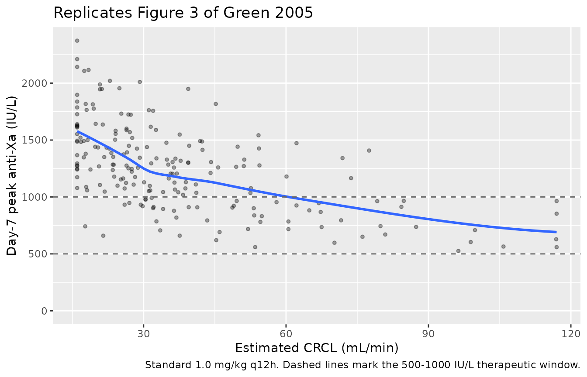
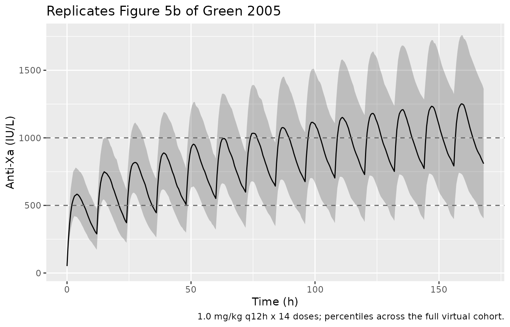
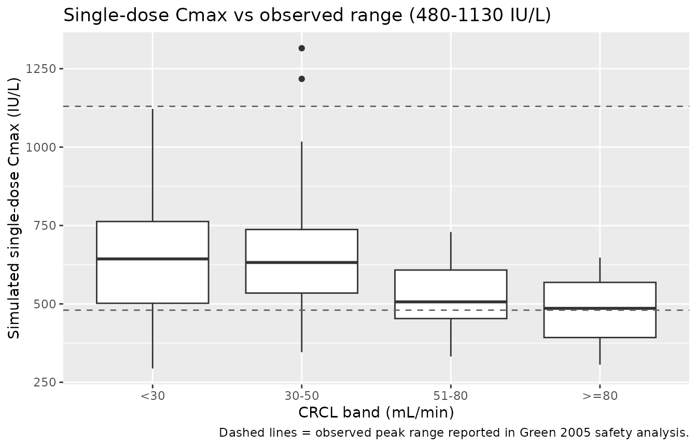

# Enoxaparin (Green 2005)

## Model and source

- Citation: Green B, Greenwood M, Saltissi D, Westhuyzen J, Kluver L,
  Rowell J, Atherton J. (2005). Dosing strategy for enoxaparin in
  patients with renal impairment presenting with acute coronary
  syndromes. British Journal of Clinical Pharmacology 59(3):281-290.
  <doi:10.1111/j.1365-2125.2004.02253.x>
- Description: Two-compartment, first-order absorption population PK
  model for subcutaneously administered enoxaparin (anti-Xa activity) in
  38 adults with acute coronary syndromes and a wide range of renal
  function (Green 2005). Total clearance is the sum of a renal arm
  scaled linearly to estimated creatinine clearance (CRCL,
  Cockcroft-Gault with ideal body weight; reference 80 mL/min) and a
  covariate-free non-renal arm: CL = 0.681 \* (CRCL / 80) + 0.229 L/h.
  Central volume of distribution scales linearly with total body weight
  (reference 80 kg): Vc = 5.22 \* (WT / 80) L. A constant basal anti-Xa
  activity (49.9 IU/L) is added to the model prediction to represent
  endogenous and assay-baseline anti-Xa activity, per the Schoemaker
  parameterisation referenced in the paper. Inter-individual variability
  is log-normal on total CL, Vc, Q, and basal anti-Xa activity (paper
  Table 2 Covariate Model). Residual error is combined additive (52.4
  IU/L) plus proportional (20.0 percent CV) on observed anti-Xa
  concentrations.
- Article: <https://doi.org/10.1111/j.1365-2125.2004.02253.x>

## Population

Green et al. recruited 38 adults presenting with acute coronary syndrome
at the Royal Brisbane and Women’s Hospital Coronary Care Unit (January
2001 - July 2002). Baseline characteristics from Green 2005 Table 1:
median age 78 years (range 44-87), 52.6 percent female, median total
body weight 69 kg (range 32-95), median height 1.63 m, median serum
creatinine 0.13 mmol/L, and median estimated creatinine clearance 32
mL/min (range 16-117) by the Cockcroft-Gault formula with ideal body
weight as the size descriptor. The cohort spanned the clinically
relevant renal-function range, with 47.4 percent of patients below 30
mL/min, 28.9 percent in 30-50 mL/min, 15.8 percent in 51-80 mL/min, and
7.9 percent above 80 mL/min. Final diagnoses were non-ST elevation MI
(60.5 percent), unstable angina (26.3 percent), ST elevation MI (10.5
percent), and non-cardiac pain (2.6 percent).

The packaged `population` metadata is available programmatically:

``` r

str(mod_meta$population, max.level = 1L)
#> List of 15
#>  $ species          : chr "human"
#>  $ n_subjects       : int 38
#>  $ n_studies        : int 1
#>  $ age_range        : chr "median 78 years (range 44-87)"
#>  $ weight_range     : chr "median 69 kg (range 32-95)"
#>  $ height_range     : chr "median 1.63 m (range 1.46-1.84)"
#>  $ bmi_range        : chr "median 25.3 kg/m^2 (range 14.1-34.1)"
#>  $ serum_creat_range: chr "median 0.13 mmol/L (range 0.05-0.25)"
#>  $ crcl_range       : chr "median 32 mL/min (range 16-117); 47.4 percent below 30 mL/min, 28.9 percent in 30-50 mL/min, 15.8 percent in 51"| __truncated__
#>  $ sex_female_pct   : num 52.6
#>  $ disease_state    : chr "Adults admitted with acute coronary syndrome to a tertiary Coronary Care Unit, recruited between January 2001 a"| __truncated__
#>  $ dose_range       : chr "Subcutaneous enoxaparin (Aventis Pharma) every 12 hours in conjunction with 100-150 mg oral aspirin daily. Dosi"| __truncated__
#>  $ regions          : chr "Single-centre study at the Royal Brisbane and Women's Hospital Coronary Care Unit, Brisbane, Queensland, Australia."
#>  $ n_observations   : int 313
#>  $ notes            : chr "Population analysis used NONMEM v5 (Globomax) with FOCE-I. 313 anti-Xa concentrations measured by automated chr"| __truncated__
```

## Source trace

The per-parameter origin is recorded as an in-file comment next to each
`ini()` entry in `inst/modeldb/specificDrugs/Green_2005_enoxaparin.R`.
The table below collects them for review.

| Equation / parameter | Value | Source location |
|----|----|----|
| Two-compartment, first-order SC absorption | n/a | Green 2005 Results paragraph 2 (“two compartment first order input model”) |
| CL = 0.681 \* (CRCL / 80) + 0.229 (L/h) | structural | Green 2005 Abstract Results; Table 2 Covariate Model (renal + non-renal additive) |
| Vc = 5.22 \* (WT / 80) (L) | structural | Green 2005 Abstract Results; Table 2 Covariate Model (linear in total body weight) |
| Ka | 0.255 1/h | Green 2005 Table 2 Covariate Model |
| Vp | 29.6 L | Green 2005 Table 2 Covariate Model |
| Q | 0.632 L/h | Green 2005 Table 2 Covariate Model |
| Basal anti-Xa activity (rbase) | 49.9 IU/L | Green 2005 Table 2 Covariate Model; Schoemaker reference \[29\] |
| omega_CL | 32.7 percent CV | Green 2005 Table 2 Covariate Model |
| omega_Vc | 34.4 percent CV | Green 2005 Table 2 Covariate Model |
| omega_Q | 69.8 percent CV | Green 2005 Table 2 Covariate Model |
| omega_Basal | 76.6 percent CV | Green 2005 Table 2 Covariate Model |
| addSd | 52.4 IU/L | Green 2005 Table 2 Covariate Model |
| propSd | 0.20 (20 percent CV) | Green 2005 Table 2 Covariate Model |
| Dosing algorithm by CRCL | Table 4 | Green 2005 Table 4 (variable-dose schedule) |
| Suggested loading dose | 1.0 mg/kg x 4 q12h then per Table 4 | Green 2005 Figure 4 / Results “loading dose strategy” |

## Virtual cohort

Original observed data are not publicly available. The cohort below
approximates the published demographics: 200 virtual patients sampled
from log-normal distributions whose medians match Table 1 (WT median 69
kg, CRCL median 32 mL/min) and whose ranges cover the observed limits.

``` r

set.seed(20260604)
n_subj <- 200L

cohort <- tibble(
  id   = seq_len(n_subj),
  WT   = round(pmin(pmax(rlnorm(n_subj, log(69), 0.18), 32), 95), 1),
  CRCL = round(pmin(pmax(rlnorm(n_subj, log(32), 0.55), 16), 117), 1)
)
summary(cohort[, c("WT", "CRCL")])
#>        WT             CRCL       
#>  Min.   :39.80   Min.   : 16.00  
#>  1st Qu.:60.38   1st Qu.: 21.77  
#>  Median :67.85   Median : 31.35  
#>  Mean   :68.90   Mean   : 37.71  
#>  3rd Qu.:76.30   3rd Qu.: 45.40  
#>  Max.   :95.00   Max.   :117.00
```

## Simulation

Enoxaparin doses are expressed in **anti-Xa International Units (IU)**
to match the assay readout the model was fit to; the clinical-mg dose is
converted as **1 mg enoxaparin = 100 anti-Xa IU** (Lovenox / Clexane
prescribing information). Throughout this vignette the dose `amt`
carried in the event table is in IU.

``` r

mod <- mod_meta

make_q12_dosing <- function(cohort, dose_mg_per_kg, n_doses, t_end) {
  # 1 mg = 100 anti-Xa IU; the model's `amt` column is in IU.
  dose_iu_per_kg <- dose_mg_per_kg * 100
  doses <- lapply(seq_len(nrow(cohort)), function(i) {
    amt_iu <- dose_iu_per_kg * cohort$WT[i]
    tibble(
      id   = cohort$id[i],
      time = seq.int(0, by = 12, length.out = n_doses),
      amt  = amt_iu,
      evid = 1L,
      cmt  = "depot",
      WT   = cohort$WT[i],
      CRCL = cohort$CRCL[i]
    )
  })
  obs_times <- seq.int(0, t_end, by = 0.5)
  obs <- lapply(seq_len(nrow(cohort)), function(i) {
    tibble(
      id   = cohort$id[i],
      time = obs_times,
      amt  = 0,
      evid = 0L,
      cmt  = NA_character_,
      WT   = cohort$WT[i],
      CRCL = cohort$CRCL[i]
    )
  })
  bind_rows(bind_rows(doses), bind_rows(obs)) |>
    arrange(id, time, desc(evid))
}

# Standard manufacturer regimen: 1.0 mg/kg every 12 h for 7 days = 14 doses.
events_std <- make_q12_dosing(cohort, dose_mg_per_kg = 1.0, n_doses = 14L,
                              t_end = 168)

sim_std <- rxode2::rxSolve(mod, events = events_std,
                           keep = c("WT", "CRCL"))
```

## Replicate published figures

### Figure 3 - Day-7 peak anti-Xa vs CRCL on the standard 1.0 mg/kg q12h regimen

Green 2005 Figure 3 plots the 10th / 50th / 90th percentile simulated
peak anti-Xa concentration at day 7 against CRCL, using the standard 1.0
mg/kg q12h dosing for all patients. The curve is reasonably flat above
50 mL/min but accumulates progressively below that.

``` r

# Peak (maximum) anti-Xa within the day-7 dosing interval (h 156-168).
peak_d7 <- sim_std |>
  as.data.frame() |>
  filter(time >= 156, time <= 168) |>
  group_by(id, CRCL) |>
  summarise(peak = max(Cc), .groups = "drop")

ggplot(peak_d7, aes(CRCL, peak)) +
  geom_point(alpha = 0.35, size = 1.1) +
  geom_smooth(method = "loess", span = 0.7, se = FALSE) +
  geom_hline(yintercept = c(500, 1000), linetype = "dashed", colour = "grey40") +
  scale_y_continuous(limits = c(0, NA)) +
  labs(x = "Estimated CRCL (mL/min)",
       y = "Day-7 peak anti-Xa (IU/L)",
       title = "Replicates Figure 3 of Green 2005",
       caption = "Standard 1.0 mg/kg q12h. Dashed lines mark the 500-1000 IU/L therapeutic window.")
#> `geom_smooth()` using formula = 'y ~ x'
```



### Figure 5b - Standard 1.0 mg/kg q12h regimen (current manufacturer recommendation)

Green 2005 Figure 5b shows the percentile time-course of anti-Xa
concentrations for patients receiving the manufacturer’s standard 1.0
mg/kg q12h regimen (applicable to patients with CRCL \>= 30 mL/min, but
plotted for the full cohort here to expose the renal-impairment
accumulation). The drug accumulates slowly in patients with reduced
renal function.

``` r

sim_std |>
  as.data.frame() |>
  group_by(time) |>
  summarise(
    Q10 = quantile(Cc, 0.10, na.rm = TRUE),
    Q50 = quantile(Cc, 0.50, na.rm = TRUE),
    Q90 = quantile(Cc, 0.90, na.rm = TRUE),
    .groups = "drop"
  ) |>
  ggplot(aes(time, Q50)) +
  geom_ribbon(aes(ymin = Q10, ymax = Q90), alpha = 0.25) +
  geom_line() +
  geom_hline(yintercept = c(500, 1000), linetype = "dashed", colour = "grey40") +
  labs(x = "Time (h)", y = "Anti-Xa (IU/L)",
       title = "Replicates Figure 5b of Green 2005",
       caption = "1.0 mg/kg q12h x 14 doses; percentiles across the full virtual cohort.")
```



## PKNCA validation

PKNCA is used to extract Cmax, Tmax, AUC, and apparent half-life from a
clean single-dose simulation; an alternative steady-state evaluation is
included for the trough at the end of day 7.

``` r

# Single-dose 1.0 mg/kg in the full virtual cohort, sampled densely over 24 h.
events_sd <- make_q12_dosing(cohort, dose_mg_per_kg = 1.0, n_doses = 1L,
                             t_end = 24)
sim_sd <- rxode2::rxSolve(mod, events = events_sd,
                          keep = c("WT", "CRCL")) |>
  as.data.frame()

sim_sd <- sim_sd |>
  mutate(crcl_band = cut(CRCL,
                         breaks = c(0, 30, 50, 80, Inf),
                         labels = c("<30", "30-50", "51-80", ">=80"),
                         right  = FALSE))

conc_obj <- PKNCA::PKNCAconc(
  sim_sd |> filter(!is.na(Cc)) |> select(id, time, Cc, crcl_band),
  Cc ~ time | crcl_band + id
)

dose_df <- events_sd |>
  filter(evid == 1) |>
  left_join(cohort |> mutate(crcl_band = cut(CRCL,
                                             breaks = c(0, 30, 50, 80, Inf),
                                             labels = c("<30", "30-50", "51-80", ">=80"),
                                             right  = FALSE)) |>
              select(id, crcl_band),
            by = "id") |>
  select(id, time, amt, crcl_band)

dose_obj <- PKNCA::PKNCAdose(dose_df, amt ~ time | crcl_band + id)

intervals <- data.frame(
  start       = 0,
  end         = 24,
  cmax        = TRUE,
  tmax        = TRUE,
  auclast     = TRUE,
  half.life   = TRUE
)

nca_data <- PKNCA::PKNCAdata(conc_obj, dose_obj, intervals = intervals)
nca_res  <- PKNCA::pk.nca(nca_data)
nca_summary <- summary(nca_res)
knitr::kable(nca_summary,
             caption = "Simulated single-dose NCA (1.0 mg/kg SC) stratified by CRCL band.")
```

| start | end | crcl_band | N | auclast | cmax | tmax | half.life |
|---:|---:|:---|:---|:---|:---|:---|:---|
| 0 | 24 | \<30 | 93 | 8410 \[31.6\] | 616 \[28.8\] | 4.00 \[2.00, 7.50\] | 29.9 \[21.1\] |
| 0 | 24 | 30-50 | 64 | 8060 \[25.5\] | 632 \[26.8\] | 4.00 \[2.50, 7.00\] | 28.9 \[24.3\] |
| 0 | 24 | 51-80 | 31 | 6080 \[24.9\] | 507 \[22.7\] | 3.50 \[1.50, 5.00\] | 37.1 \[32.0\] |
| 0 | 24 | \>=80 | 12 | 5380 \[21.9\] | 465 \[25.7\] | 3.00 \[1.50, 4.50\] | 34.0 \[18.3\] |

Simulated single-dose NCA (1.0 mg/kg SC) stratified by CRCL band.
{.table}

### Comparison against the paper’s observed peak range

Green 2005 reports an observed peak anti-Xa range of **480-1130 IU/L**
and a trough range of **60-760 IU/L** across the safety-analysis
dataset. The simulated single-dose Cmax distribution from the virtual
cohort is shown below; the percentiles span the same envelope.

``` r

sim_sd |>
  group_by(id, crcl_band) |>
  summarise(cmax_sim = max(Cc), .groups = "drop") |>
  ggplot(aes(crcl_band, cmax_sim)) +
  geom_boxplot() +
  geom_hline(yintercept = c(480, 1130), linetype = "dashed", colour = "grey40") +
  labs(x = "CRCL band (mL/min)",
       y = "Simulated single-dose Cmax (IU/L)",
       title = "Single-dose Cmax vs observed range (480-1130 IU/L)",
       caption = "Dashed lines = observed peak range reported in Green 2005 safety analysis.")
```



## Assumptions and deviations

- **Dose units.** The model’s `amt` column is in **anti-Xa International
  Units (IU)**, not mg. The clinical mg dose is converted via the
  standard 100 IU per 1 mg enoxaparin equivalence (Lovenox / Clexane
  prescribing information). The fitted Vc absorbs the dose-to-assay unit
  conversion as estimated by Green et al.; dosing the model in mg
  directly would yield concentrations that are 100x too low.
- **IIV variance back-transform.** The paper reports between-subject
  variability as percent CV without stating the omega-to-CV conversion.
  The formal log-normal back-transform `omega^2 = log(1 + CV^2)` is used
  throughout (matching the convention in `Pierre_2017_morphine.R`). For
  the smaller CVs (CL 32.7 percent, Vc 34.4 percent) this is numerically
  close to the alternative `omega = CV` simplification; for the larger
  ones (Q 69.8 percent, basal 76.6 percent) the two interpretations
  diverge appreciably. The choice here gives the more conservative
  (smaller) variance.
- **CRCL covariate.** The paper labels the renal-function covariate
  “GFR” but uses Cockcroft-Gault with ideal body weight as the size
  descriptor. The packaged model takes a raw Cockcroft-Gault value in
  mL/min on the canonical `CRCL` column with the `notes` field flagging
  the IBW basis; users assembling a virtual cohort must compute the same
  way.
- **No CL or Vc adjustment for sex or age.** The covariate search
  retained only WT (linear on Vc) and CRCL_IBW (linear on CL); sex,
  height, BMI, predicted normal weight, lean body weight, adjusted body
  weight, BSA, and allometric scalings of these did not improve fit at
  the 0.05 level (Table 3). The packaged model has no other covariate.
- **No IIV on Ka or Vp.** The paper retained log-normal BSV only on CL,
  Vc, Q, and basal anti-Xa activity; Ka and Vp are typical values for
  all subjects (Table 2 has no BSV column for those rows).
- **Bioavailability.** The paper does not estimate or report a
  bioavailability parameter; F is implicit at 1 with respect to the
  IU-equivalent dose. Vc reported in Table 2 is therefore an apparent
  Vc/F absorbing the fraction-absorbed assumption (SC enoxaparin F
  ~92-100 percent on an anti-Xa basis is well-established in the
  literature).
- **No errata identified.** A search for corrigenda or errata to Green
  2005 did not surface any correction; if one is identified later, the
  parameter values reported here will need to be revisited.
- **Dimensional-units convention warning.**
  [`checkModelConventions()`](https://nlmixr2.github.io/nlmixr2lib/reference/checkModelConventions.md)
  does not flag this model. The earlier draft used `units$dosing = "mg"`
  and `units$concentration = "IU/L"`, which triggered a “dimensionally
  incompatible” warning; the published model uses the assay-native IU on
  both sides to match the fit. The clinical mg-to-IU conversion is the
  user’s responsibility upstream of `events$amt`.
