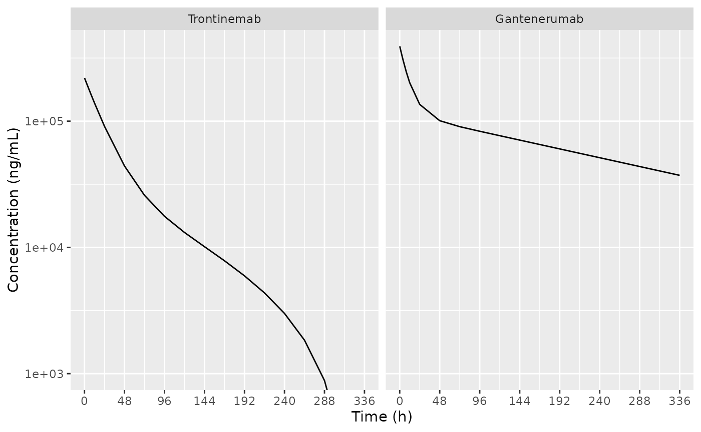
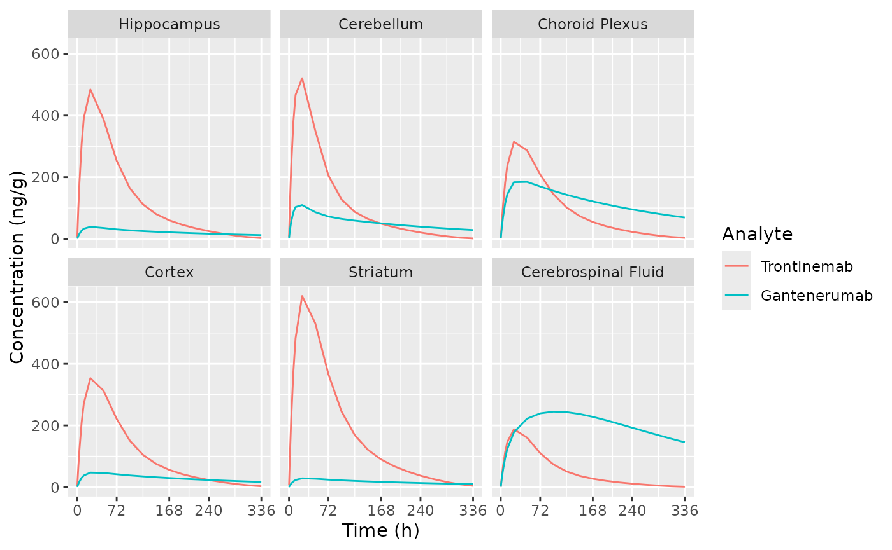

# Trontinemab and gantenerumab PK in plasma and brain (Grimm 2023)

``` r
library(nlmixr2lib)
library(dplyr)
#> 
#> Attaching package: 'dplyr'
#> The following objects are masked from 'package:stats':
#> 
#>     filter, lag
#> The following objects are masked from 'package:base':
#> 
#>     intersect, setdiff, setequal, union
library(ggplot2)
```

## Trontinemab replication

### Simulate trontinemab PK in plasma and brain

Replicate figures 2 and 3 in the publication with a single 10 mg/kg dose
to a cynomolgus monkey.

``` r
dSimDose <-
  data.frame(
    ID = 1,
    AMT = 10, # mg/kg
    WT = 5, # cynomologus monkey body weight according to the paper
    TIME = 0,
    EVID = 1,
    CMT = "central"
  )
dSimObs <-
  data.frame(
    ID = 1,
    AMT = 0,
    WT = 5,
    TIME = c(5/60, 1, 2, 4, 8, 12, seq(24, 336, by = 24)),
    EVID = 0,
    CMT = "central"
  )
dSimPrep <- dplyr::bind_rows(dSimDose, dSimObs)
Grimm2023Tront <- readModelDb("Grimm_2023_trontinemab")
# Set BSV to zero for simulation to get a reproducible result
dSimTront <- rxode2::rxSolve(Grimm2023Tront |> rxode2::zeroRe(), events = dSimPrep)
#> ℹ omega/sigma items treated as zero: 'bsv_fpla_cerebellum', 'bsv_fpla_hippocampus', 'bsv_fpla_striatum', 'bsv_fpla_cortex', 'bsv_fpla_choroid_plexus'
dSimTront$Analyte <- "Trontinemab"
```

### Simulate gantenerumab PK in plasma and brain

Replicate figures 2 and 3 in the publication with a single 20 mg/kg dose
to a cynomolgus monkey.

``` r
dSimDose <-
  data.frame(
    ID = 1,
    AMT = 20, # mg/kg
    WT = 5, # cynomologus monkey body weight according to the paper
    TIME = 0,
    EVID = 1,
    CMT = "central"
  )
dSimObs <-
  data.frame(
    ID = 1,
    AMT = 0,
    WT = 5,
    TIME = c(5/60, 1, 2, 4, 8, 12, seq(24, 336, by = 24)),
    EVID = 0,
    CMT = "central"
  )
dSimPrep <- dplyr::bind_rows(dSimDose, dSimObs)
Grimm2023Gant <- readModelDb("Grimm_2023_gantenerumab")
# Set BSV to zero for simulation to get a reproducible result
dSimGant <- rxode2::rxSolve(Grimm2023Gant |> rxode2::zeroRe(), events = dSimPrep)
#> ℹ omega/sigma items treated as zero: 'bsv_fpla_cerebellum', 'bsv_fpla_hippocampus', 'bsv_fpla_striatum', 'bsv_fpla_cortex', 'bsv_fpla_choroid_plexus'
dSimGant$Analyte <- "Gantenerumab"
```

### Plot plasma PK

Replicate figure 2 from the paper.

``` r
dSim <- bind_rows(dSimTront, dSimGant)
dSim$Analyte <- factor(dSim$Analyte, levels = c("Trontinemab", "Gantenerumab"))

ggplot(dSim, aes(x = time, y = sim)) +
  geom_line() +
  labs(
    x = "Time (h)",
    y = "Concentration (ng/mL)"
  ) +
  scale_y_log10() +
  scale_x_continuous(breaks = seq(0, 336, by = 48)) +
  coord_cartesian(ylim = c(1e3, NA)) +
  facet_grid(~Analyte)
```



### Plot brain PK

Replicate figure 3 from the paper.

``` r
d_plot_brain <-
  dSim |>
  select(time, Analyte, starts_with("C", ignore.case = FALSE)) |>
  select(-starts_with("Cbrain"), -Cc) |>
  tidyr::pivot_longer(cols = -c("time", "Analyte"), names_to = "ASPEC", values_to = "AVAL") |>
  mutate(
    ASPEC =
      factor(
        gsub(x = ASPEC, pattern = "^C", replacement = ""),
        levels = c("hippocampus", "cerebellum", "choroid_plexus", "cortex", "striatum", "csf"),
        labels = c("Hippocampus", "Cerebellum", "Choroid Plexus", "Cortex", "Striatum", "Cerebrospinal Fluid")
      )
  )

ggplot(d_plot_brain, aes(x = time, y = AVAL, colour = Analyte)) +
  geom_line() +
  labs(
    x = "Time (h)",
    y = "Concentration (ng/g)"
  ) +
  scale_x_continuous(breaks = c(0, 72, 168, 240, 336)) +
  facet_wrap(~ASPEC)
```


