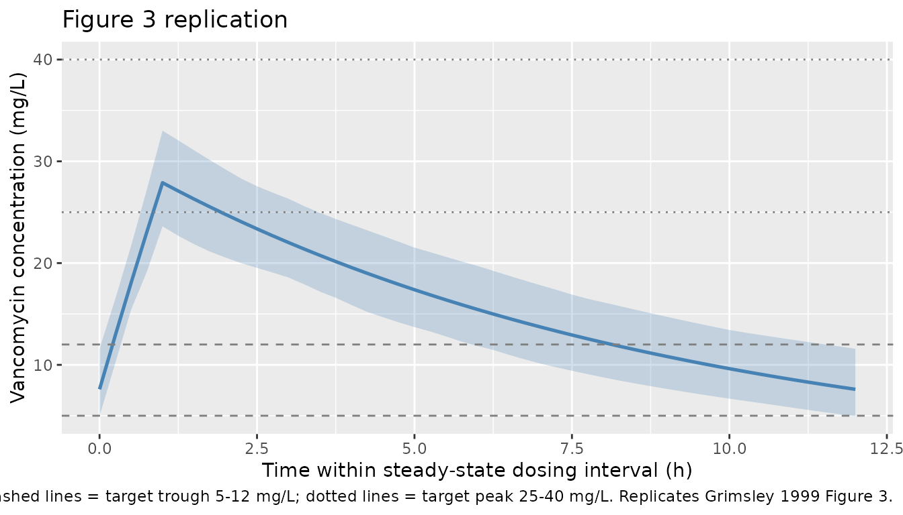

# Vancomycin (Grimsley 1999)

## Model and source

- Citation: Grimsley C, Thomson AH. Pharmacokinetics and dose
  requirements of vancomycin in neonates. Arch Dis Child Fetal Neonatal
  Ed. 1999;81(3):F221-F227. <doi:10.1136/fn.81.3.f221>
- Description: One-compartment IV-infusion population PK model for
  vancomycin in neonates and young infants (Grimsley 1999). Developed
  from routine therapeutic-drug-monitoring data in 59 neonates (347
  concentrations). Clearance scales linearly with body weight and
  inversely with serum creatinine concentration (CL = 3.56 \* WT /
  CREAT, L/h, WT in kg, CREAT in umol/L); central volume scales linearly
  with body weight (V = 0.669 \* WT, L/kg). The covariate-coupled CL
  form (no separately estimated exponents) is reported by the paper as
  the entire structural model.
- Article: [Arch Dis Child Fetal Neonatal Ed
  1999;81(3):F221-F227](https://doi.org/10.1136/fn.81.3.f221)

## Population

The model was developed from 347 routine therapeutic-drug-monitoring
vancomycin concentrations in 59 neonates and young infants at Yorkhill
Hospitals’ neonatal intensive care wards (Glasgow) over 64 courses of
treatment (Grimsley 1999 Table 2). Postconceptual age ranged from 26-45
weeks (median 32), postnatal age 2-76 days (median 19), body weight
0.57-4.23 kg (median 1.52), and serum creatinine 18-172 umol/L (median
49). 36% of subjects were female; 85% had confirmed infection; 20% had a
cardiac defect; 61% required oxygen or active ventilation. Starting
doses were 15 mg/kg every 24, 12 or 8 hours given as 1-hour infusions
per the Guy’s, St Thomas’s and Lewisham Hospitals Paediatric Formulary;
of 347 measured concentrations, 153 were peaks (1 hour after end of
infusion), 183 were troughs (end of dose interval), and 11 were mid-dose
samples. The same information is available programmatically via
`readModelDb("Grimsley_1999_vancomycin")$population`.

## Source trace

Every numeric value in `ini()` carries an in-file comment pointing to
the Grimsley 1999 source location. The table below collects them in one
place for review.

| Equation / parameter | Value | Source location |
|----|----|----|
| `lcl` (CL coefficient) | 3.56 | Table 4, row “Clearance (l/h)” final-model column: CL = 3.56 \* WT / CREAT (SE 3.8%) |
| `lvc` (V per kg) | 0.669 L/kg | Table 4, row “Volume (l)” final-model column: V = 0.669 \* WT (SE 4.7%) |
| `etalcl` (22% CV) | 0.04729 | Table 4, row “Interpatient variability on clearance” final-model column (SE 28%) |
| `etalvc` (18% CV) | 0.03188 | Table 4, row “Interpatient variability on volume” final-model column (SE 46%) |
| `addSd` | 4.53 mg/L | Table 4, row “Residual error on concentration (mg/l)” final-model column (SE 13%) |
| 1-cmt IV-infusion structure | n/a | Results paragraph “When the basic structural models were compared”; Methods |
| Additive residual error | n/a | Results: “Residual error was best described by an additive structure” |
| CL = 3.56 \* WT / CREAT | n/a | Results equation just before Figure 3; Table 4 footnote |
| V = 0.669 \* WT | n/a | Results equation just before Figure 3; Table 4 footnote |
| Cohort medians (WT, CREAT) | 1.52 kg, 49 umol/L | Table 2 “Median (range)” column |

## Virtual cohort

Original observed data are not publicly available. The cohort below
covers the four scenarios highlighted by Grimsley 1999 Table 5 (the
final dosing nomogram). The reference scenario uses the typical neonate
at the cohort median weight (1.52 kg) with serum creatinine held at 45
umol/L, dosed at 15 mg/kg every 12 hours – the exact patient described
in Figure 3. Three additional scenarios sweep the nomogram-relevant
creatinine range (20, 80, 120 umol/L) so the steady-state peak / trough
behaviour can be compared against the target ranges Grimsley 1999
Results used to construct Table 5.

``` r

set.seed(19990901)

n_sub <- 60L

make_cohort <- function(label, wt_kg, creat_umol, dose_mg_kg, tau_h, id_offset) {
  ids <- id_offset + seq_len(n_sub)

  dose_amt_mg <- dose_mg_kg * wt_kg
  infusion_h  <- 1
  n_doses     <- 12  # 6 days of q12h dosing -- enough for steady state given t1/2 ~ 6 h

  dose_times <- seq(0, by = tau_h, length.out = n_doses)
  dose_rows <- tidyr::expand_grid(id = ids, time = dose_times) |>
    mutate(
      evid   = 1L,
      amt    = dose_amt_mg,
      cmt    = "central",
      rate   = dose_amt_mg / infusion_h,
      cohort = label,
      WT     = wt_kg,
      CREAT  = creat_umol
    )

  # Coarse buildup grid + dense final-interval grid for Cmax / Cmin resolution.
  obs_times <- sort(unique(c(
    seq(0, infusion_h * 2, by = 0.25),
    seq(0, max(dose_times), by = 1),
    seq(max(dose_times), max(dose_times) + tau_h, by = 0.25)
  )))
  obs_rows <- tidyr::expand_grid(id = ids, time = obs_times) |>
    mutate(
      evid   = 0L,
      amt    = 0,
      cmt    = NA_character_,
      rate   = 0,
      cohort = label,
      WT     = wt_kg,
      CREAT  = creat_umol
    )

  bind_rows(dose_rows, obs_rows) |> arrange(id, time, desc(evid))
}

events <- bind_rows(
  make_cohort("creat_20_q12",  1.52, 20,  15, 12, id_offset =    0L),
  make_cohort("creat_45_q12",  1.52, 45,  15, 12, id_offset = 1000L),
  make_cohort("creat_80_q12",  1.52, 80,  15, 24, id_offset = 2000L),
  make_cohort("creat_120_q12", 1.52, 120, 15, 24, id_offset = 3000L)
)

stopifnot(!anyDuplicated(unique(events[, c("id", "time", "evid")])))
```

## Simulation

``` r

mod <- readModelDb("Grimsley_1999_vancomycin")

sim <- rxode2::rxSolve(
  mod,
  events = events,
  keep   = c("cohort", "WT", "CREAT")
) |> as.data.frame()
#> ℹ parameter labels from comments will be replaced by 'label()'
```

For the Figure 3 typical-value replication, also simulate with the
random effects zeroed:

``` r

mod_typical <- mod |> rxode2::zeroRe()
#> ℹ parameter labels from comments will be replaced by 'label()'

sim_typical <- rxode2::rxSolve(
  mod_typical,
  events = events,
  keep   = c("cohort", "WT", "CREAT")
) |> as.data.frame()
#> ℹ omega/sigma items treated as zero: 'etalcl', 'etalvc'
#> Warning: multi-subject simulation without without 'omega'
```

## Replicate published figures

### Figure 3 - typical profile with 67% interval, CREAT = 45 umol/L

Grimsley 1999 Figure 3 shows the typical population profile and 67%
confidence intervals for a patient with serum creatinine 45 umol/L given
vancomycin 15 mg/kg every 12 hours. The replication below shows the
final dosing interval (a steady-state q12h window) with the
typical-value line overlaid on the inter-individual 67% interval
(16.5th-83.5th percentiles) computed from the stochastic simulation.

``` r

ss_window_start <- max(events$time[events$evid == 1 & events$cohort == "creat_45_q12"])
ss_window_end   <- ss_window_start + 12

stochastic_ribbon <- sim |>
  filter(cohort == "creat_45_q12",
         time >= ss_window_start, time <= ss_window_end) |>
  mutate(time_in_tau = time - ss_window_start) |>
  group_by(time_in_tau) |>
  summarise(
    q165 = quantile(Cc, 0.165, na.rm = TRUE),
    q500 = quantile(Cc, 0.500, na.rm = TRUE),
    q835 = quantile(Cc, 0.835, na.rm = TRUE),
    .groups = "drop"
  )

typical_line <- sim_typical |>
  filter(cohort == "creat_45_q12",
         time >= ss_window_start, time <= ss_window_end) |>
  mutate(time_in_tau = time - ss_window_start)

ggplot() +
  geom_ribbon(data = stochastic_ribbon,
              aes(x = time_in_tau, ymin = q165, ymax = q835),
              alpha = 0.25, fill = "steelblue") +
  geom_line(data = typical_line,
            aes(x = time_in_tau, y = Cc), colour = "steelblue", size = 0.9) +
  geom_hline(yintercept = 5,  linetype = "dashed", colour = "grey50") +
  geom_hline(yintercept = 12, linetype = "dashed", colour = "grey50") +
  geom_hline(yintercept = 25, linetype = "dotted",  colour = "grey50") +
  geom_hline(yintercept = 40, linetype = "dotted",  colour = "grey50") +
  labs(
    x = "Time within steady-state dosing interval (h)",
    y = "Vancomycin concentration (mg/L)",
    title = "Figure 3 replication",
    caption = "Typical 1.52-kg neonate, CREAT = 45 umol/L, 15 mg/kg q12h IV (1 h infusion). Ribbon = 67% inter-individual interval (16.5-83.5%). Dashed lines = target trough 5-12 mg/L; dotted lines = target peak 25-40 mg/L. Replicates Grimsley 1999 Figure 3."
  )
#> Warning: Using `size` aesthetic for lines was deprecated in ggplot2 3.4.0.
#> ℹ Please use `linewidth` instead.
#> This warning is displayed once per session.
#> Call `lifecycle::last_lifecycle_warnings()` to see where this warning was
#> generated.
```



## PKNCA validation

The block below computes steady-state peak, trough and AUC0-tau over the
final dosing interval and compares against the trough target range 5-12
mg/L and peak target range 25-40 mg/L that Grimsley 1999 used to define
the dose nomogram in Table 5. The treatment grouping is `cohort`, with
one cohort per Table 5 creatinine band tested.

``` r

# Per-cohort steady-state interval (final dose to final dose + tau).
# tau is the spacing between the last two dose times within each cohort.
ss_windows <- events |>
  filter(evid == 1) |>
  group_by(cohort) |>
  summarise(
    start_ss = max(time),
    tau      = max(time) - sort(unique(time), decreasing = TRUE)[2],
    .groups  = "drop"
  ) |>
  mutate(end_ss = start_ss + tau)

sim_nca <- sim |>
  filter(!is.na(Cc)) |>
  inner_join(ss_windows |> select(cohort, start_ss, end_ss), by = "cohort") |>
  filter(time >= start_ss, time <= end_ss) |>
  select(id, time, Cc, cohort)

dose_df <- events |>
  filter(evid == 1) |>
  inner_join(ss_windows |> select(cohort, start_ss, end_ss), by = "cohort") |>
  filter(time == start_ss) |>
  select(id, time, amt, cohort)

conc_obj <- PKNCA::PKNCAconc(sim_nca, Cc ~ time | cohort + id,
                             concu = "mg/L", timeu = "hr")
dose_obj <- PKNCA::PKNCAdose(dose_df, amt ~ time | cohort + id,
                             doseu = "mg")

# Per-cohort intervals (start, end vary by cohort because tau differs)
intervals <- ss_windows |>
  mutate(start = start_ss, end = end_ss,
         cmax = TRUE, tmax = TRUE, cmin = TRUE,
         auclast = TRUE, cav = TRUE) |>
  select(start, end, cmax, tmax, cmin, auclast, cav)

nca_data <- PKNCA::PKNCAdata(conc_obj, dose_obj, intervals = as.data.frame(intervals))
nca_res  <- PKNCA::pk.nca(nca_data)
#> Warning in .f(data_conc = .l[[1L]][[i]], data_dose = .l[[2L]][[i]],
#> data_intervals = .l[[3L]][[i]], : Error with interval start=132, end=144: No
#> data for interval
#> Warning in .f(data_conc = .l[[1L]][[i]], data_dose = .l[[2L]][[i]],
#> data_intervals = .l[[3L]][[i]], : Error with interval start=132, end=144: No
#> data for interval
#> Warning in .f(data_conc = .l[[1L]][[i]], data_dose = .l[[2L]][[i]],
#> data_intervals = .l[[3L]][[i]], : Error with interval start=132, end=144: No
#> data for interval
#> Warning in .f(data_conc = .l[[1L]][[i]], data_dose = .l[[2L]][[i]],
#> data_intervals = .l[[3L]][[i]], : Error with interval start=132, end=144: No
#> data for interval
#> Warning in .f(data_conc = .l[[1L]][[i]], data_dose = .l[[2L]][[i]],
#> data_intervals = .l[[3L]][[i]], : Error with interval start=132, end=144: No
#> data for interval
#> Warning in .f(data_conc = .l[[1L]][[i]], data_dose = .l[[2L]][[i]],
#> data_intervals = .l[[3L]][[i]], : Error with interval start=132, end=144: No
#> data for interval
#> Warning in .f(data_conc = .l[[1L]][[i]], data_dose = .l[[2L]][[i]],
#> data_intervals = .l[[3L]][[i]], : Error with interval start=132, end=144: No
#> data for interval
#> Warning in .f(data_conc = .l[[1L]][[i]], data_dose = .l[[2L]][[i]],
#> data_intervals = .l[[3L]][[i]], : Error with interval start=132, end=144: No
#> data for interval
#> Warning in .f(data_conc = .l[[1L]][[i]], data_dose = .l[[2L]][[i]],
#> data_intervals = .l[[3L]][[i]], : Error with interval start=132, end=144: No
#> data for interval
#> Warning in .f(data_conc = .l[[1L]][[i]], data_dose = .l[[2L]][[i]],
#> data_intervals = .l[[3L]][[i]], : Error with interval start=132, end=144: No
#> data for interval
#> Warning in .f(data_conc = .l[[1L]][[i]], data_dose = .l[[2L]][[i]],
#> data_intervals = .l[[3L]][[i]], : Error with interval start=132, end=144: No
#> data for interval
#> Warning in .f(data_conc = .l[[1L]][[i]], data_dose = .l[[2L]][[i]],
#> data_intervals = .l[[3L]][[i]], : Error with interval start=132, end=144: No
#> data for interval
#> Warning in .f(data_conc = .l[[1L]][[i]], data_dose = .l[[2L]][[i]],
#> data_intervals = .l[[3L]][[i]], : Error with interval start=132, end=144: No
#> data for interval
#> Warning in .f(data_conc = .l[[1L]][[i]], data_dose = .l[[2L]][[i]],
#> data_intervals = .l[[3L]][[i]], : Error with interval start=132, end=144: No
#> data for interval
#> Warning in .f(data_conc = .l[[1L]][[i]], data_dose = .l[[2L]][[i]],
#> data_intervals = .l[[3L]][[i]], : Error with interval start=132, end=144: No
#> data for interval
#> Warning in .f(data_conc = .l[[1L]][[i]], data_dose = .l[[2L]][[i]],
#> data_intervals = .l[[3L]][[i]], : Error with interval start=132, end=144: No
#> data for interval
#> Warning in .f(data_conc = .l[[1L]][[i]], data_dose = .l[[2L]][[i]],
#> data_intervals = .l[[3L]][[i]], : Error with interval start=132, end=144: No
#> data for interval
#> Warning in .f(data_conc = .l[[1L]][[i]], data_dose = .l[[2L]][[i]],
#> data_intervals = .l[[3L]][[i]], : Error with interval start=132, end=144: No
#> data for interval
#> Warning in .f(data_conc = .l[[1L]][[i]], data_dose = .l[[2L]][[i]],
#> data_intervals = .l[[3L]][[i]], : Error with interval start=132, end=144: No
#> data for interval
#> Warning in .f(data_conc = .l[[1L]][[i]], data_dose = .l[[2L]][[i]],
#> data_intervals = .l[[3L]][[i]], : Error with interval start=132, end=144: No
#> data for interval
#> Warning in .f(data_conc = .l[[1L]][[i]], data_dose = .l[[2L]][[i]],
#> data_intervals = .l[[3L]][[i]], : Error with interval start=132, end=144: No
#> data for interval
#> Warning in .f(data_conc = .l[[1L]][[i]], data_dose = .l[[2L]][[i]],
#> data_intervals = .l[[3L]][[i]], : Error with interval start=132, end=144: No
#> data for interval
#> Warning in .f(data_conc = .l[[1L]][[i]], data_dose = .l[[2L]][[i]],
#> data_intervals = .l[[3L]][[i]], : Error with interval start=132, end=144: No
#> data for interval
#> Warning in .f(data_conc = .l[[1L]][[i]], data_dose = .l[[2L]][[i]],
#> data_intervals = .l[[3L]][[i]], : Error with interval start=132, end=144: No
#> data for interval
#> Warning in .f(data_conc = .l[[1L]][[i]], data_dose = .l[[2L]][[i]],
#> data_intervals = .l[[3L]][[i]], : Error with interval start=132, end=144: No
#> data for interval
#> Warning in .f(data_conc = .l[[1L]][[i]], data_dose = .l[[2L]][[i]],
#> data_intervals = .l[[3L]][[i]], : Error with interval start=132, end=144: No
#> data for interval
#> Warning in .f(data_conc = .l[[1L]][[i]], data_dose = .l[[2L]][[i]],
#> data_intervals = .l[[3L]][[i]], : Error with interval start=132, end=144: No
#> data for interval
#> Warning in .f(data_conc = .l[[1L]][[i]], data_dose = .l[[2L]][[i]],
#> data_intervals = .l[[3L]][[i]], : Error with interval start=132, end=144: No
#> data for interval
#> Warning in .f(data_conc = .l[[1L]][[i]], data_dose = .l[[2L]][[i]],
#> data_intervals = .l[[3L]][[i]], : Error with interval start=132, end=144: No
#> data for interval
#> Warning in .f(data_conc = .l[[1L]][[i]], data_dose = .l[[2L]][[i]],
#> data_intervals = .l[[3L]][[i]], : Error with interval start=132, end=144: No
#> data for interval
#> Warning in .f(data_conc = .l[[1L]][[i]], data_dose = .l[[2L]][[i]],
#> data_intervals = .l[[3L]][[i]], : Error with interval start=132, end=144: No
#> data for interval
#> Warning in .f(data_conc = .l[[1L]][[i]], data_dose = .l[[2L]][[i]],
#> data_intervals = .l[[3L]][[i]], : Error with interval start=132, end=144: No
#> data for interval
#> Warning in .f(data_conc = .l[[1L]][[i]], data_dose = .l[[2L]][[i]],
#> data_intervals = .l[[3L]][[i]], : Error with interval start=132, end=144: No
#> data for interval
#> Warning in .f(data_conc = .l[[1L]][[i]], data_dose = .l[[2L]][[i]],
#> data_intervals = .l[[3L]][[i]], : Error with interval start=132, end=144: No
#> data for interval
#> Warning in .f(data_conc = .l[[1L]][[i]], data_dose = .l[[2L]][[i]],
#> data_intervals = .l[[3L]][[i]], : Error with interval start=132, end=144: No
#> data for interval
#> Warning in .f(data_conc = .l[[1L]][[i]], data_dose = .l[[2L]][[i]],
#> data_intervals = .l[[3L]][[i]], : Error with interval start=132, end=144: No
#> data for interval
#> Warning in .f(data_conc = .l[[1L]][[i]], data_dose = .l[[2L]][[i]],
#> data_intervals = .l[[3L]][[i]], : Error with interval start=132, end=144: No
#> data for interval
#> Warning in .f(data_conc = .l[[1L]][[i]], data_dose = .l[[2L]][[i]],
#> data_intervals = .l[[3L]][[i]], : Error with interval start=132, end=144: No
#> data for interval
#> Warning in .f(data_conc = .l[[1L]][[i]], data_dose = .l[[2L]][[i]],
#> data_intervals = .l[[3L]][[i]], : Error with interval start=132, end=144: No
#> data for interval
#> Warning in .f(data_conc = .l[[1L]][[i]], data_dose = .l[[2L]][[i]],
#> data_intervals = .l[[3L]][[i]], : Error with interval start=132, end=144: No
#> data for interval
#> Warning in .f(data_conc = .l[[1L]][[i]], data_dose = .l[[2L]][[i]],
#> data_intervals = .l[[3L]][[i]], : Error with interval start=132, end=144: No
#> data for interval
#> Warning in .f(data_conc = .l[[1L]][[i]], data_dose = .l[[2L]][[i]],
#> data_intervals = .l[[3L]][[i]], : Error with interval start=132, end=144: No
#> data for interval
#> Warning in .f(data_conc = .l[[1L]][[i]], data_dose = .l[[2L]][[i]],
#> data_intervals = .l[[3L]][[i]], : Error with interval start=132, end=144: No
#> data for interval
#> Warning in .f(data_conc = .l[[1L]][[i]], data_dose = .l[[2L]][[i]],
#> data_intervals = .l[[3L]][[i]], : Error with interval start=132, end=144: No
#> data for interval
#> Warning in .f(data_conc = .l[[1L]][[i]], data_dose = .l[[2L]][[i]],
#> data_intervals = .l[[3L]][[i]], : Error with interval start=132, end=144: No
#> data for interval
#> Warning in .f(data_conc = .l[[1L]][[i]], data_dose = .l[[2L]][[i]],
#> data_intervals = .l[[3L]][[i]], : Error with interval start=132, end=144: No
#> data for interval
#> Warning in .f(data_conc = .l[[1L]][[i]], data_dose = .l[[2L]][[i]],
#> data_intervals = .l[[3L]][[i]], : Error with interval start=132, end=144: No
#> data for interval
#> Warning in .f(data_conc = .l[[1L]][[i]], data_dose = .l[[2L]][[i]],
#> data_intervals = .l[[3L]][[i]], : Error with interval start=132, end=144: No
#> data for interval
#> Warning in .f(data_conc = .l[[1L]][[i]], data_dose = .l[[2L]][[i]],
#> data_intervals = .l[[3L]][[i]], : Error with interval start=132, end=144: No
#> data for interval
#> Warning in .f(data_conc = .l[[1L]][[i]], data_dose = .l[[2L]][[i]],
#> data_intervals = .l[[3L]][[i]], : Error with interval start=132, end=144: No
#> data for interval
#> Warning in .f(data_conc = .l[[1L]][[i]], data_dose = .l[[2L]][[i]],
#> data_intervals = .l[[3L]][[i]], : Error with interval start=132, end=144: No
#> data for interval
#> Warning in .f(data_conc = .l[[1L]][[i]], data_dose = .l[[2L]][[i]],
#> data_intervals = .l[[3L]][[i]], : Error with interval start=132, end=144: No
#> data for interval
#> Warning in .f(data_conc = .l[[1L]][[i]], data_dose = .l[[2L]][[i]],
#> data_intervals = .l[[3L]][[i]], : Error with interval start=132, end=144: No
#> data for interval
#> Warning in .f(data_conc = .l[[1L]][[i]], data_dose = .l[[2L]][[i]],
#> data_intervals = .l[[3L]][[i]], : Error with interval start=132, end=144: No
#> data for interval
#> Warning in .f(data_conc = .l[[1L]][[i]], data_dose = .l[[2L]][[i]],
#> data_intervals = .l[[3L]][[i]], : Error with interval start=132, end=144: No
#> data for interval
#> Warning in .f(data_conc = .l[[1L]][[i]], data_dose = .l[[2L]][[i]],
#> data_intervals = .l[[3L]][[i]], : Error with interval start=132, end=144: No
#> data for interval
#> Warning in .f(data_conc = .l[[1L]][[i]], data_dose = .l[[2L]][[i]],
#> data_intervals = .l[[3L]][[i]], : Error with interval start=132, end=144: No
#> data for interval
#> Warning in .f(data_conc = .l[[1L]][[i]], data_dose = .l[[2L]][[i]],
#> data_intervals = .l[[3L]][[i]], : Error with interval start=132, end=144: No
#> data for interval
#> Warning in .f(data_conc = .l[[1L]][[i]], data_dose = .l[[2L]][[i]],
#> data_intervals = .l[[3L]][[i]], : Error with interval start=132, end=144: No
#> data for interval
#> Warning in .f(data_conc = .l[[1L]][[i]], data_dose = .l[[2L]][[i]],
#> data_intervals = .l[[3L]][[i]], : Error with interval start=132, end=144: No
#> data for interval
#> Warning in .f(data_conc = .l[[1L]][[i]], data_dose = .l[[2L]][[i]],
#> data_intervals = .l[[3L]][[i]], : Error with interval start=132, end=144: No
#> data for interval
#> Warning in .f(data_conc = .l[[1L]][[i]], data_dose = .l[[2L]][[i]],
#> data_intervals = .l[[3L]][[i]], : Error with interval start=132, end=144: No
#> data for interval
#> Warning in .f(data_conc = .l[[1L]][[i]], data_dose = .l[[2L]][[i]],
#> data_intervals = .l[[3L]][[i]], : Error with interval start=132, end=144: No
#> data for interval
#> Warning in .f(data_conc = .l[[1L]][[i]], data_dose = .l[[2L]][[i]],
#> data_intervals = .l[[3L]][[i]], : Error with interval start=132, end=144: No
#> data for interval
#> Warning in .f(data_conc = .l[[1L]][[i]], data_dose = .l[[2L]][[i]],
#> data_intervals = .l[[3L]][[i]], : Error with interval start=132, end=144: No
#> data for interval
#> Warning in .f(data_conc = .l[[1L]][[i]], data_dose = .l[[2L]][[i]],
#> data_intervals = .l[[3L]][[i]], : Error with interval start=132, end=144: No
#> data for interval
#> Warning in .f(data_conc = .l[[1L]][[i]], data_dose = .l[[2L]][[i]],
#> data_intervals = .l[[3L]][[i]], : Error with interval start=132, end=144: No
#> data for interval
#> Warning in .f(data_conc = .l[[1L]][[i]], data_dose = .l[[2L]][[i]],
#> data_intervals = .l[[3L]][[i]], : Error with interval start=132, end=144: No
#> data for interval
#> Warning in .f(data_conc = .l[[1L]][[i]], data_dose = .l[[2L]][[i]],
#> data_intervals = .l[[3L]][[i]], : Error with interval start=132, end=144: No
#> data for interval
#> Warning in .f(data_conc = .l[[1L]][[i]], data_dose = .l[[2L]][[i]],
#> data_intervals = .l[[3L]][[i]], : Error with interval start=132, end=144: No
#> data for interval
#> Warning in .f(data_conc = .l[[1L]][[i]], data_dose = .l[[2L]][[i]],
#> data_intervals = .l[[3L]][[i]], : Error with interval start=132, end=144: No
#> data for interval
#> Warning in .f(data_conc = .l[[1L]][[i]], data_dose = .l[[2L]][[i]],
#> data_intervals = .l[[3L]][[i]], : Error with interval start=132, end=144: No
#> data for interval
#> Warning in .f(data_conc = .l[[1L]][[i]], data_dose = .l[[2L]][[i]],
#> data_intervals = .l[[3L]][[i]], : Error with interval start=132, end=144: No
#> data for interval
#> Warning in .f(data_conc = .l[[1L]][[i]], data_dose = .l[[2L]][[i]],
#> data_intervals = .l[[3L]][[i]], : Error with interval start=132, end=144: No
#> data for interval
#> Warning in .f(data_conc = .l[[1L]][[i]], data_dose = .l[[2L]][[i]],
#> data_intervals = .l[[3L]][[i]], : Error with interval start=132, end=144: No
#> data for interval
#> Warning in .f(data_conc = .l[[1L]][[i]], data_dose = .l[[2L]][[i]],
#> data_intervals = .l[[3L]][[i]], : Error with interval start=132, end=144: No
#> data for interval
#> Warning in .f(data_conc = .l[[1L]][[i]], data_dose = .l[[2L]][[i]],
#> data_intervals = .l[[3L]][[i]], : Error with interval start=132, end=144: No
#> data for interval
#> Warning in .f(data_conc = .l[[1L]][[i]], data_dose = .l[[2L]][[i]],
#> data_intervals = .l[[3L]][[i]], : Error with interval start=132, end=144: No
#> data for interval
#> Warning in .f(data_conc = .l[[1L]][[i]], data_dose = .l[[2L]][[i]],
#> data_intervals = .l[[3L]][[i]], : Error with interval start=132, end=144: No
#> data for interval
#> Warning in .f(data_conc = .l[[1L]][[i]], data_dose = .l[[2L]][[i]],
#> data_intervals = .l[[3L]][[i]], : Error with interval start=132, end=144: No
#> data for interval
#> Warning in .f(data_conc = .l[[1L]][[i]], data_dose = .l[[2L]][[i]],
#> data_intervals = .l[[3L]][[i]], : Error with interval start=132, end=144: No
#> data for interval
#> Warning in .f(data_conc = .l[[1L]][[i]], data_dose = .l[[2L]][[i]],
#> data_intervals = .l[[3L]][[i]], : Error with interval start=132, end=144: No
#> data for interval
#> Warning in .f(data_conc = .l[[1L]][[i]], data_dose = .l[[2L]][[i]],
#> data_intervals = .l[[3L]][[i]], : Error with interval start=132, end=144: No
#> data for interval
#> Warning in .f(data_conc = .l[[1L]][[i]], data_dose = .l[[2L]][[i]],
#> data_intervals = .l[[3L]][[i]], : Error with interval start=132, end=144: No
#> data for interval
#> Warning in .f(data_conc = .l[[1L]][[i]], data_dose = .l[[2L]][[i]],
#> data_intervals = .l[[3L]][[i]], : Error with interval start=132, end=144: No
#> data for interval
#> Warning in .f(data_conc = .l[[1L]][[i]], data_dose = .l[[2L]][[i]],
#> data_intervals = .l[[3L]][[i]], : Error with interval start=132, end=144: No
#> data for interval
#> Warning in .f(data_conc = .l[[1L]][[i]], data_dose = .l[[2L]][[i]],
#> data_intervals = .l[[3L]][[i]], : Error with interval start=132, end=144: No
#> data for interval
#> Warning in .f(data_conc = .l[[1L]][[i]], data_dose = .l[[2L]][[i]],
#> data_intervals = .l[[3L]][[i]], : Error with interval start=132, end=144: No
#> data for interval
#> Warning in .f(data_conc = .l[[1L]][[i]], data_dose = .l[[2L]][[i]],
#> data_intervals = .l[[3L]][[i]], : Error with interval start=132, end=144: No
#> data for interval
#> Warning in .f(data_conc = .l[[1L]][[i]], data_dose = .l[[2L]][[i]],
#> data_intervals = .l[[3L]][[i]], : Error with interval start=132, end=144: No
#> data for interval
#> Warning in .f(data_conc = .l[[1L]][[i]], data_dose = .l[[2L]][[i]],
#> data_intervals = .l[[3L]][[i]], : Error with interval start=132, end=144: No
#> data for interval
#> Warning in .f(data_conc = .l[[1L]][[i]], data_dose = .l[[2L]][[i]],
#> data_intervals = .l[[3L]][[i]], : Error with interval start=132, end=144: No
#> data for interval
#> Warning in .f(data_conc = .l[[1L]][[i]], data_dose = .l[[2L]][[i]],
#> data_intervals = .l[[3L]][[i]], : Error with interval start=132, end=144: No
#> data for interval
#> Warning in .f(data_conc = .l[[1L]][[i]], data_dose = .l[[2L]][[i]],
#> data_intervals = .l[[3L]][[i]], : Error with interval start=132, end=144: No
#> data for interval
#> Warning in .f(data_conc = .l[[1L]][[i]], data_dose = .l[[2L]][[i]],
#> data_intervals = .l[[3L]][[i]], : Error with interval start=132, end=144: No
#> data for interval
#> Warning in .f(data_conc = .l[[1L]][[i]], data_dose = .l[[2L]][[i]],
#> data_intervals = .l[[3L]][[i]], : Error with interval start=132, end=144: No
#> data for interval
#> Warning in .f(data_conc = .l[[1L]][[i]], data_dose = .l[[2L]][[i]],
#> data_intervals = .l[[3L]][[i]], : Error with interval start=132, end=144: No
#> data for interval
#> Warning in .f(data_conc = .l[[1L]][[i]], data_dose = .l[[2L]][[i]],
#> data_intervals = .l[[3L]][[i]], : Error with interval start=132, end=144: No
#> data for interval
#> Warning in .f(data_conc = .l[[1L]][[i]], data_dose = .l[[2L]][[i]],
#> data_intervals = .l[[3L]][[i]], : Error with interval start=132, end=144: No
#> data for interval
#> Warning in .f(data_conc = .l[[1L]][[i]], data_dose = .l[[2L]][[i]],
#> data_intervals = .l[[3L]][[i]], : Error with interval start=132, end=144: No
#> data for interval
#> Warning in .f(data_conc = .l[[1L]][[i]], data_dose = .l[[2L]][[i]],
#> data_intervals = .l[[3L]][[i]], : Error with interval start=132, end=144: No
#> data for interval
#> Warning in .f(data_conc = .l[[1L]][[i]], data_dose = .l[[2L]][[i]],
#> data_intervals = .l[[3L]][[i]], : Error with interval start=132, end=144: No
#> data for interval
#> Warning in .f(data_conc = .l[[1L]][[i]], data_dose = .l[[2L]][[i]],
#> data_intervals = .l[[3L]][[i]], : Error with interval start=132, end=144: No
#> data for interval
#> Warning in .f(data_conc = .l[[1L]][[i]], data_dose = .l[[2L]][[i]],
#> data_intervals = .l[[3L]][[i]], : Error with interval start=132, end=144: No
#> data for interval
#> Warning in .f(data_conc = .l[[1L]][[i]], data_dose = .l[[2L]][[i]],
#> data_intervals = .l[[3L]][[i]], : Error with interval start=132, end=144: No
#> data for interval
#> Warning in .f(data_conc = .l[[1L]][[i]], data_dose = .l[[2L]][[i]],
#> data_intervals = .l[[3L]][[i]], : Error with interval start=132, end=144: No
#> data for interval
#> Warning in .f(data_conc = .l[[1L]][[i]], data_dose = .l[[2L]][[i]],
#> data_intervals = .l[[3L]][[i]], : Error with interval start=132, end=144: No
#> data for interval
#> Warning in .f(data_conc = .l[[1L]][[i]], data_dose = .l[[2L]][[i]],
#> data_intervals = .l[[3L]][[i]], : Error with interval start=132, end=144: No
#> data for interval
#> Warning in .f(data_conc = .l[[1L]][[i]], data_dose = .l[[2L]][[i]],
#> data_intervals = .l[[3L]][[i]], : Error with interval start=132, end=144: No
#> data for interval
#> Warning in .f(data_conc = .l[[1L]][[i]], data_dose = .l[[2L]][[i]],
#> data_intervals = .l[[3L]][[i]], : Error with interval start=132, end=144: No
#> data for interval
#> Warning in .f(data_conc = .l[[1L]][[i]], data_dose = .l[[2L]][[i]],
#> data_intervals = .l[[3L]][[i]], : Error with interval start=132, end=144: No
#> data for interval
#> Warning in .f(data_conc = .l[[1L]][[i]], data_dose = .l[[2L]][[i]],
#> data_intervals = .l[[3L]][[i]], : Error with interval start=132, end=144: No
#> data for interval
#> Warning in .f(data_conc = .l[[1L]][[i]], data_dose = .l[[2L]][[i]],
#> data_intervals = .l[[3L]][[i]], : Error with interval start=132, end=144: No
#> data for interval
#> Warning in .f(data_conc = .l[[1L]][[i]], data_dose = .l[[2L]][[i]],
#> data_intervals = .l[[3L]][[i]], : Error with interval start=132, end=144: No
#> data for interval
#> Warning in .f(data_conc = .l[[1L]][[i]], data_dose = .l[[2L]][[i]],
#> data_intervals = .l[[3L]][[i]], : Error with interval start=132, end=144: No
#> data for interval
#> Warning in .f(data_conc = .l[[1L]][[i]], data_dose = .l[[2L]][[i]],
#> data_intervals = .l[[3L]][[i]], : Error with interval start=132, end=144: No
#> data for interval
#> Warning in .f(data_conc = .l[[1L]][[i]], data_dose = .l[[2L]][[i]],
#> data_intervals = .l[[3L]][[i]], : Error with interval start=132, end=144: No
#> data for interval
#> Warning in .f(data_conc = .l[[1L]][[i]], data_dose = .l[[2L]][[i]],
#> data_intervals = .l[[3L]][[i]], : Error with interval start=132, end=144: No
#> data for interval
#> Warning in .f(data_conc = .l[[1L]][[i]], data_dose = .l[[2L]][[i]],
#> data_intervals = .l[[3L]][[i]], : Error with interval start=132, end=144: No
#> data for interval
#> Warning in .f(data_conc = .l[[1L]][[i]], data_dose = .l[[2L]][[i]],
#> data_intervals = .l[[3L]][[i]], : Error with interval start=132, end=144: No
#> data for interval
#> Warning in .f(data_conc = .l[[1L]][[i]], data_dose = .l[[2L]][[i]],
#> data_intervals = .l[[3L]][[i]], : Error with interval start=264, end=288: No
#> data for interval
#> Warning in .f(data_conc = .l[[1L]][[i]], data_dose = .l[[2L]][[i]],
#> data_intervals = .l[[3L]][[i]], : Error with interval start=264, end=288: No
#> data for interval
#> Warning in .f(data_conc = .l[[1L]][[i]], data_dose = .l[[2L]][[i]],
#> data_intervals = .l[[3L]][[i]], : Error with interval start=264, end=288: No
#> data for interval
#> Warning in .f(data_conc = .l[[1L]][[i]], data_dose = .l[[2L]][[i]],
#> data_intervals = .l[[3L]][[i]], : Error with interval start=264, end=288: No
#> data for interval
#> Warning in .f(data_conc = .l[[1L]][[i]], data_dose = .l[[2L]][[i]],
#> data_intervals = .l[[3L]][[i]], : Error with interval start=264, end=288: No
#> data for interval
#> Warning in .f(data_conc = .l[[1L]][[i]], data_dose = .l[[2L]][[i]],
#> data_intervals = .l[[3L]][[i]], : Error with interval start=264, end=288: No
#> data for interval
#> Warning in .f(data_conc = .l[[1L]][[i]], data_dose = .l[[2L]][[i]],
#> data_intervals = .l[[3L]][[i]], : Error with interval start=264, end=288: No
#> data for interval
#> Warning in .f(data_conc = .l[[1L]][[i]], data_dose = .l[[2L]][[i]],
#> data_intervals = .l[[3L]][[i]], : Error with interval start=264, end=288: No
#> data for interval
#> Warning in .f(data_conc = .l[[1L]][[i]], data_dose = .l[[2L]][[i]],
#> data_intervals = .l[[3L]][[i]], : Error with interval start=264, end=288: No
#> data for interval
#> Warning in .f(data_conc = .l[[1L]][[i]], data_dose = .l[[2L]][[i]],
#> data_intervals = .l[[3L]][[i]], : Error with interval start=264, end=288: No
#> data for interval
#> Warning in .f(data_conc = .l[[1L]][[i]], data_dose = .l[[2L]][[i]],
#> data_intervals = .l[[3L]][[i]], : Error with interval start=264, end=288: No
#> data for interval
#> Warning in .f(data_conc = .l[[1L]][[i]], data_dose = .l[[2L]][[i]],
#> data_intervals = .l[[3L]][[i]], : Error with interval start=264, end=288: No
#> data for interval
#> Warning in .f(data_conc = .l[[1L]][[i]], data_dose = .l[[2L]][[i]],
#> data_intervals = .l[[3L]][[i]], : Error with interval start=264, end=288: No
#> data for interval
#> Warning in .f(data_conc = .l[[1L]][[i]], data_dose = .l[[2L]][[i]],
#> data_intervals = .l[[3L]][[i]], : Error with interval start=264, end=288: No
#> data for interval
#> Warning in .f(data_conc = .l[[1L]][[i]], data_dose = .l[[2L]][[i]],
#> data_intervals = .l[[3L]][[i]], : Error with interval start=264, end=288: No
#> data for interval
#> Warning in .f(data_conc = .l[[1L]][[i]], data_dose = .l[[2L]][[i]],
#> data_intervals = .l[[3L]][[i]], : Error with interval start=264, end=288: No
#> data for interval
#> Warning in .f(data_conc = .l[[1L]][[i]], data_dose = .l[[2L]][[i]],
#> data_intervals = .l[[3L]][[i]], : Error with interval start=264, end=288: No
#> data for interval
#> Warning in .f(data_conc = .l[[1L]][[i]], data_dose = .l[[2L]][[i]],
#> data_intervals = .l[[3L]][[i]], : Error with interval start=264, end=288: No
#> data for interval
#> Warning in .f(data_conc = .l[[1L]][[i]], data_dose = .l[[2L]][[i]],
#> data_intervals = .l[[3L]][[i]], : Error with interval start=264, end=288: No
#> data for interval
#> Warning in .f(data_conc = .l[[1L]][[i]], data_dose = .l[[2L]][[i]],
#> data_intervals = .l[[3L]][[i]], : Error with interval start=264, end=288: No
#> data for interval
#> Warning in .f(data_conc = .l[[1L]][[i]], data_dose = .l[[2L]][[i]],
#> data_intervals = .l[[3L]][[i]], : Error with interval start=264, end=288: No
#> data for interval
#> Warning in .f(data_conc = .l[[1L]][[i]], data_dose = .l[[2L]][[i]],
#> data_intervals = .l[[3L]][[i]], : Error with interval start=264, end=288: No
#> data for interval
#> Warning in .f(data_conc = .l[[1L]][[i]], data_dose = .l[[2L]][[i]],
#> data_intervals = .l[[3L]][[i]], : Error with interval start=264, end=288: No
#> data for interval
#> Warning in .f(data_conc = .l[[1L]][[i]], data_dose = .l[[2L]][[i]],
#> data_intervals = .l[[3L]][[i]], : Error with interval start=264, end=288: No
#> data for interval
#> Warning in .f(data_conc = .l[[1L]][[i]], data_dose = .l[[2L]][[i]],
#> data_intervals = .l[[3L]][[i]], : Error with interval start=264, end=288: No
#> data for interval
#> Warning in .f(data_conc = .l[[1L]][[i]], data_dose = .l[[2L]][[i]],
#> data_intervals = .l[[3L]][[i]], : Error with interval start=264, end=288: No
#> data for interval
#> Warning in .f(data_conc = .l[[1L]][[i]], data_dose = .l[[2L]][[i]],
#> data_intervals = .l[[3L]][[i]], : Error with interval start=264, end=288: No
#> data for interval
#> Warning in .f(data_conc = .l[[1L]][[i]], data_dose = .l[[2L]][[i]],
#> data_intervals = .l[[3L]][[i]], : Error with interval start=264, end=288: No
#> data for interval
#> Warning in .f(data_conc = .l[[1L]][[i]], data_dose = .l[[2L]][[i]],
#> data_intervals = .l[[3L]][[i]], : Error with interval start=264, end=288: No
#> data for interval
#> Warning in .f(data_conc = .l[[1L]][[i]], data_dose = .l[[2L]][[i]],
#> data_intervals = .l[[3L]][[i]], : Error with interval start=264, end=288: No
#> data for interval
#> Warning in .f(data_conc = .l[[1L]][[i]], data_dose = .l[[2L]][[i]],
#> data_intervals = .l[[3L]][[i]], : Error with interval start=264, end=288: No
#> data for interval
#> Warning in .f(data_conc = .l[[1L]][[i]], data_dose = .l[[2L]][[i]],
#> data_intervals = .l[[3L]][[i]], : Error with interval start=264, end=288: No
#> data for interval
#> Warning in .f(data_conc = .l[[1L]][[i]], data_dose = .l[[2L]][[i]],
#> data_intervals = .l[[3L]][[i]], : Error with interval start=264, end=288: No
#> data for interval
#> Warning in .f(data_conc = .l[[1L]][[i]], data_dose = .l[[2L]][[i]],
#> data_intervals = .l[[3L]][[i]], : Error with interval start=264, end=288: No
#> data for interval
#> Warning in .f(data_conc = .l[[1L]][[i]], data_dose = .l[[2L]][[i]],
#> data_intervals = .l[[3L]][[i]], : Error with interval start=264, end=288: No
#> data for interval
#> Warning in .f(data_conc = .l[[1L]][[i]], data_dose = .l[[2L]][[i]],
#> data_intervals = .l[[3L]][[i]], : Error with interval start=264, end=288: No
#> data for interval
#> Warning in .f(data_conc = .l[[1L]][[i]], data_dose = .l[[2L]][[i]],
#> data_intervals = .l[[3L]][[i]], : Error with interval start=264, end=288: No
#> data for interval
#> Warning in .f(data_conc = .l[[1L]][[i]], data_dose = .l[[2L]][[i]],
#> data_intervals = .l[[3L]][[i]], : Error with interval start=264, end=288: No
#> data for interval
#> Warning in .f(data_conc = .l[[1L]][[i]], data_dose = .l[[2L]][[i]],
#> data_intervals = .l[[3L]][[i]], : Error with interval start=264, end=288: No
#> data for interval
#> Warning in .f(data_conc = .l[[1L]][[i]], data_dose = .l[[2L]][[i]],
#> data_intervals = .l[[3L]][[i]], : Error with interval start=264, end=288: No
#> data for interval
#> Warning in .f(data_conc = .l[[1L]][[i]], data_dose = .l[[2L]][[i]],
#> data_intervals = .l[[3L]][[i]], : Error with interval start=264, end=288: No
#> data for interval
#> Warning in .f(data_conc = .l[[1L]][[i]], data_dose = .l[[2L]][[i]],
#> data_intervals = .l[[3L]][[i]], : Error with interval start=264, end=288: No
#> data for interval
#> Warning in .f(data_conc = .l[[1L]][[i]], data_dose = .l[[2L]][[i]],
#> data_intervals = .l[[3L]][[i]], : Error with interval start=264, end=288: No
#> data for interval
#> Warning in .f(data_conc = .l[[1L]][[i]], data_dose = .l[[2L]][[i]],
#> data_intervals = .l[[3L]][[i]], : Error with interval start=264, end=288: No
#> data for interval
#> Warning in .f(data_conc = .l[[1L]][[i]], data_dose = .l[[2L]][[i]],
#> data_intervals = .l[[3L]][[i]], : Error with interval start=264, end=288: No
#> data for interval
#> Warning in .f(data_conc = .l[[1L]][[i]], data_dose = .l[[2L]][[i]],
#> data_intervals = .l[[3L]][[i]], : Error with interval start=264, end=288: No
#> data for interval
#> Warning in .f(data_conc = .l[[1L]][[i]], data_dose = .l[[2L]][[i]],
#> data_intervals = .l[[3L]][[i]], : Error with interval start=264, end=288: No
#> data for interval
#> Warning in .f(data_conc = .l[[1L]][[i]], data_dose = .l[[2L]][[i]],
#> data_intervals = .l[[3L]][[i]], : Error with interval start=264, end=288: No
#> data for interval
#> Warning in .f(data_conc = .l[[1L]][[i]], data_dose = .l[[2L]][[i]],
#> data_intervals = .l[[3L]][[i]], : Error with interval start=264, end=288: No
#> data for interval
#> Warning in .f(data_conc = .l[[1L]][[i]], data_dose = .l[[2L]][[i]],
#> data_intervals = .l[[3L]][[i]], : Error with interval start=264, end=288: No
#> data for interval
#> Warning in .f(data_conc = .l[[1L]][[i]], data_dose = .l[[2L]][[i]],
#> data_intervals = .l[[3L]][[i]], : Error with interval start=264, end=288: No
#> data for interval
#> Warning in .f(data_conc = .l[[1L]][[i]], data_dose = .l[[2L]][[i]],
#> data_intervals = .l[[3L]][[i]], : Error with interval start=264, end=288: No
#> data for interval
#> Warning in .f(data_conc = .l[[1L]][[i]], data_dose = .l[[2L]][[i]],
#> data_intervals = .l[[3L]][[i]], : Error with interval start=264, end=288: No
#> data for interval
#> Warning in .f(data_conc = .l[[1L]][[i]], data_dose = .l[[2L]][[i]],
#> data_intervals = .l[[3L]][[i]], : Error with interval start=264, end=288: No
#> data for interval
#> Warning in .f(data_conc = .l[[1L]][[i]], data_dose = .l[[2L]][[i]],
#> data_intervals = .l[[3L]][[i]], : Error with interval start=264, end=288: No
#> data for interval
#> Warning in .f(data_conc = .l[[1L]][[i]], data_dose = .l[[2L]][[i]],
#> data_intervals = .l[[3L]][[i]], : Error with interval start=264, end=288: No
#> data for interval
#> Warning in .f(data_conc = .l[[1L]][[i]], data_dose = .l[[2L]][[i]],
#> data_intervals = .l[[3L]][[i]], : Error with interval start=264, end=288: No
#> data for interval
#> Warning in .f(data_conc = .l[[1L]][[i]], data_dose = .l[[2L]][[i]],
#> data_intervals = .l[[3L]][[i]], : Error with interval start=264, end=288: No
#> data for interval
#> Warning in .f(data_conc = .l[[1L]][[i]], data_dose = .l[[2L]][[i]],
#> data_intervals = .l[[3L]][[i]], : Error with interval start=264, end=288: No
#> data for interval
#> Warning in .f(data_conc = .l[[1L]][[i]], data_dose = .l[[2L]][[i]],
#> data_intervals = .l[[3L]][[i]], : Error with interval start=264, end=288: No
#> data for interval
#> Warning in .f(data_conc = .l[[1L]][[i]], data_dose = .l[[2L]][[i]],
#> data_intervals = .l[[3L]][[i]], : Error with interval start=264, end=288: No
#> data for interval
#> Warning in .f(data_conc = .l[[1L]][[i]], data_dose = .l[[2L]][[i]],
#> data_intervals = .l[[3L]][[i]], : Error with interval start=264, end=288: No
#> data for interval
#> Warning in .f(data_conc = .l[[1L]][[i]], data_dose = .l[[2L]][[i]],
#> data_intervals = .l[[3L]][[i]], : Error with interval start=264, end=288: No
#> data for interval
#> Warning in .f(data_conc = .l[[1L]][[i]], data_dose = .l[[2L]][[i]],
#> data_intervals = .l[[3L]][[i]], : Error with interval start=264, end=288: No
#> data for interval
#> Warning in .f(data_conc = .l[[1L]][[i]], data_dose = .l[[2L]][[i]],
#> data_intervals = .l[[3L]][[i]], : Error with interval start=264, end=288: No
#> data for interval
#> Warning in .f(data_conc = .l[[1L]][[i]], data_dose = .l[[2L]][[i]],
#> data_intervals = .l[[3L]][[i]], : Error with interval start=264, end=288: No
#> data for interval
#> Warning in .f(data_conc = .l[[1L]][[i]], data_dose = .l[[2L]][[i]],
#> data_intervals = .l[[3L]][[i]], : Error with interval start=264, end=288: No
#> data for interval
#> Warning in .f(data_conc = .l[[1L]][[i]], data_dose = .l[[2L]][[i]],
#> data_intervals = .l[[3L]][[i]], : Error with interval start=264, end=288: No
#> data for interval
#> Warning in .f(data_conc = .l[[1L]][[i]], data_dose = .l[[2L]][[i]],
#> data_intervals = .l[[3L]][[i]], : Error with interval start=264, end=288: No
#> data for interval
#> Warning in .f(data_conc = .l[[1L]][[i]], data_dose = .l[[2L]][[i]],
#> data_intervals = .l[[3L]][[i]], : Error with interval start=264, end=288: No
#> data for interval
#> Warning in .f(data_conc = .l[[1L]][[i]], data_dose = .l[[2L]][[i]],
#> data_intervals = .l[[3L]][[i]], : Error with interval start=264, end=288: No
#> data for interval
#> Warning in .f(data_conc = .l[[1L]][[i]], data_dose = .l[[2L]][[i]],
#> data_intervals = .l[[3L]][[i]], : Error with interval start=264, end=288: No
#> data for interval
#> Warning in .f(data_conc = .l[[1L]][[i]], data_dose = .l[[2L]][[i]],
#> data_intervals = .l[[3L]][[i]], : Error with interval start=264, end=288: No
#> data for interval
#> Warning in .f(data_conc = .l[[1L]][[i]], data_dose = .l[[2L]][[i]],
#> data_intervals = .l[[3L]][[i]], : Error with interval start=264, end=288: No
#> data for interval
#> Warning in .f(data_conc = .l[[1L]][[i]], data_dose = .l[[2L]][[i]],
#> data_intervals = .l[[3L]][[i]], : Error with interval start=264, end=288: No
#> data for interval
#> Warning in .f(data_conc = .l[[1L]][[i]], data_dose = .l[[2L]][[i]],
#> data_intervals = .l[[3L]][[i]], : Error with interval start=264, end=288: No
#> data for interval
#> Warning in .f(data_conc = .l[[1L]][[i]], data_dose = .l[[2L]][[i]],
#> data_intervals = .l[[3L]][[i]], : Error with interval start=264, end=288: No
#> data for interval
#> Warning in .f(data_conc = .l[[1L]][[i]], data_dose = .l[[2L]][[i]],
#> data_intervals = .l[[3L]][[i]], : Error with interval start=264, end=288: No
#> data for interval
#> Warning in .f(data_conc = .l[[1L]][[i]], data_dose = .l[[2L]][[i]],
#> data_intervals = .l[[3L]][[i]], : Error with interval start=264, end=288: No
#> data for interval
#> Warning in .f(data_conc = .l[[1L]][[i]], data_dose = .l[[2L]][[i]],
#> data_intervals = .l[[3L]][[i]], : Error with interval start=264, end=288: No
#> data for interval
#> Warning in .f(data_conc = .l[[1L]][[i]], data_dose = .l[[2L]][[i]],
#> data_intervals = .l[[3L]][[i]], : Error with interval start=264, end=288: No
#> data for interval
#> Warning in .f(data_conc = .l[[1L]][[i]], data_dose = .l[[2L]][[i]],
#> data_intervals = .l[[3L]][[i]], : Error with interval start=264, end=288: No
#> data for interval
#> Warning in .f(data_conc = .l[[1L]][[i]], data_dose = .l[[2L]][[i]],
#> data_intervals = .l[[3L]][[i]], : Error with interval start=264, end=288: No
#> data for interval
#> Warning in .f(data_conc = .l[[1L]][[i]], data_dose = .l[[2L]][[i]],
#> data_intervals = .l[[3L]][[i]], : Error with interval start=264, end=288: No
#> data for interval
#> Warning in .f(data_conc = .l[[1L]][[i]], data_dose = .l[[2L]][[i]],
#> data_intervals = .l[[3L]][[i]], : Error with interval start=264, end=288: No
#> data for interval
#> Warning in .f(data_conc = .l[[1L]][[i]], data_dose = .l[[2L]][[i]],
#> data_intervals = .l[[3L]][[i]], : Error with interval start=264, end=288: No
#> data for interval
#> Warning in .f(data_conc = .l[[1L]][[i]], data_dose = .l[[2L]][[i]],
#> data_intervals = .l[[3L]][[i]], : Error with interval start=264, end=288: No
#> data for interval
#> Warning in .f(data_conc = .l[[1L]][[i]], data_dose = .l[[2L]][[i]],
#> data_intervals = .l[[3L]][[i]], : Error with interval start=264, end=288: No
#> data for interval
#> Warning in .f(data_conc = .l[[1L]][[i]], data_dose = .l[[2L]][[i]],
#> data_intervals = .l[[3L]][[i]], : Error with interval start=264, end=288: No
#> data for interval
#> Warning in .f(data_conc = .l[[1L]][[i]], data_dose = .l[[2L]][[i]],
#> data_intervals = .l[[3L]][[i]], : Error with interval start=264, end=288: No
#> data for interval
#> Warning in .f(data_conc = .l[[1L]][[i]], data_dose = .l[[2L]][[i]],
#> data_intervals = .l[[3L]][[i]], : Error with interval start=264, end=288: No
#> data for interval
#> Warning in .f(data_conc = .l[[1L]][[i]], data_dose = .l[[2L]][[i]],
#> data_intervals = .l[[3L]][[i]], : Error with interval start=264, end=288: No
#> data for interval
#> Warning in .f(data_conc = .l[[1L]][[i]], data_dose = .l[[2L]][[i]],
#> data_intervals = .l[[3L]][[i]], : Error with interval start=264, end=288: No
#> data for interval
#> Warning in .f(data_conc = .l[[1L]][[i]], data_dose = .l[[2L]][[i]],
#> data_intervals = .l[[3L]][[i]], : Error with interval start=264, end=288: No
#> data for interval
#> Warning in .f(data_conc = .l[[1L]][[i]], data_dose = .l[[2L]][[i]],
#> data_intervals = .l[[3L]][[i]], : Error with interval start=264, end=288: No
#> data for interval
#> Warning in .f(data_conc = .l[[1L]][[i]], data_dose = .l[[2L]][[i]],
#> data_intervals = .l[[3L]][[i]], : Error with interval start=264, end=288: No
#> data for interval
#> Warning in .f(data_conc = .l[[1L]][[i]], data_dose = .l[[2L]][[i]],
#> data_intervals = .l[[3L]][[i]], : Error with interval start=264, end=288: No
#> data for interval
#> Warning in .f(data_conc = .l[[1L]][[i]], data_dose = .l[[2L]][[i]],
#> data_intervals = .l[[3L]][[i]], : Error with interval start=264, end=288: No
#> data for interval
#> Warning in .f(data_conc = .l[[1L]][[i]], data_dose = .l[[2L]][[i]],
#> data_intervals = .l[[3L]][[i]], : Error with interval start=264, end=288: No
#> data for interval
#> Warning in .f(data_conc = .l[[1L]][[i]], data_dose = .l[[2L]][[i]],
#> data_intervals = .l[[3L]][[i]], : Error with interval start=264, end=288: No
#> data for interval
#> Warning in .f(data_conc = .l[[1L]][[i]], data_dose = .l[[2L]][[i]],
#> data_intervals = .l[[3L]][[i]], : Error with interval start=264, end=288: No
#> data for interval
#> Warning in .f(data_conc = .l[[1L]][[i]], data_dose = .l[[2L]][[i]],
#> data_intervals = .l[[3L]][[i]], : Error with interval start=264, end=288: No
#> data for interval
#> Warning in .f(data_conc = .l[[1L]][[i]], data_dose = .l[[2L]][[i]],
#> data_intervals = .l[[3L]][[i]], : Error with interval start=264, end=288: No
#> data for interval
#> Warning in .f(data_conc = .l[[1L]][[i]], data_dose = .l[[2L]][[i]],
#> data_intervals = .l[[3L]][[i]], : Error with interval start=264, end=288: No
#> data for interval
#> Warning in .f(data_conc = .l[[1L]][[i]], data_dose = .l[[2L]][[i]],
#> data_intervals = .l[[3L]][[i]], : Error with interval start=264, end=288: No
#> data for interval
#> Warning in .f(data_conc = .l[[1L]][[i]], data_dose = .l[[2L]][[i]],
#> data_intervals = .l[[3L]][[i]], : Error with interval start=264, end=288: No
#> data for interval
#> Warning in .f(data_conc = .l[[1L]][[i]], data_dose = .l[[2L]][[i]],
#> data_intervals = .l[[3L]][[i]], : Error with interval start=264, end=288: No
#> data for interval
#> Warning in .f(data_conc = .l[[1L]][[i]], data_dose = .l[[2L]][[i]],
#> data_intervals = .l[[3L]][[i]], : Error with interval start=264, end=288: No
#> data for interval
#> Warning in .f(data_conc = .l[[1L]][[i]], data_dose = .l[[2L]][[i]],
#> data_intervals = .l[[3L]][[i]], : Error with interval start=264, end=288: No
#> data for interval
#> Warning in .f(data_conc = .l[[1L]][[i]], data_dose = .l[[2L]][[i]],
#> data_intervals = .l[[3L]][[i]], : Error with interval start=264, end=288: No
#> data for interval
#> Warning in .f(data_conc = .l[[1L]][[i]], data_dose = .l[[2L]][[i]],
#> data_intervals = .l[[3L]][[i]], : Error with interval start=264, end=288: No
#> data for interval
#> Warning in .f(data_conc = .l[[1L]][[i]], data_dose = .l[[2L]][[i]],
#> data_intervals = .l[[3L]][[i]], : Error with interval start=264, end=288: No
#> data for interval
#> Warning in .f(data_conc = .l[[1L]][[i]], data_dose = .l[[2L]][[i]],
#> data_intervals = .l[[3L]][[i]], : Error with interval start=264, end=288: No
#> data for interval
#> Warning in .f(data_conc = .l[[1L]][[i]], data_dose = .l[[2L]][[i]],
#> data_intervals = .l[[3L]][[i]], : Error with interval start=264, end=288: No
#> data for interval
#> Warning in .f(data_conc = .l[[1L]][[i]], data_dose = .l[[2L]][[i]],
#> data_intervals = .l[[3L]][[i]], : Error with interval start=264, end=288: No
#> data for interval
#> Warning in .f(data_conc = .l[[1L]][[i]], data_dose = .l[[2L]][[i]],
#> data_intervals = .l[[3L]][[i]], : Error with interval start=264, end=288: No
#> data for interval
#> Warning in .f(data_conc = .l[[1L]][[i]], data_dose = .l[[2L]][[i]],
#> data_intervals = .l[[3L]][[i]], : Error with interval start=264, end=288: No
#> data for interval
#> Warning in .f(data_conc = .l[[1L]][[i]], data_dose = .l[[2L]][[i]],
#> data_intervals = .l[[3L]][[i]], : Error with interval start=264, end=288: No
#> data for interval
#> Warning in .f(data_conc = .l[[1L]][[i]], data_dose = .l[[2L]][[i]],
#> data_intervals = .l[[3L]][[i]], : Error with interval start=264, end=288: No
#> data for interval
#> Warning in .f(data_conc = .l[[1L]][[i]], data_dose = .l[[2L]][[i]],
#> data_intervals = .l[[3L]][[i]], : Error with interval start=264, end=288: No
#> data for interval
#> Warning in .f(data_conc = .l[[1L]][[i]], data_dose = .l[[2L]][[i]],
#> data_intervals = .l[[3L]][[i]], : Error with interval start=264, end=288: No
#> data for interval
#> Warning in .f(data_conc = .l[[1L]][[i]], data_dose = .l[[2L]][[i]],
#> data_intervals = .l[[3L]][[i]], : Error with interval start=264, end=288: No
#> data for interval
#> Warning in .f(data_conc = .l[[1L]][[i]], data_dose = .l[[2L]][[i]],
#> data_intervals = .l[[3L]][[i]], : Error with interval start=264, end=288: No
#> data for interval
#> Warning in .f(data_conc = .l[[1L]][[i]], data_dose = .l[[2L]][[i]],
#> data_intervals = .l[[3L]][[i]], : Error with interval start=264, end=288: No
#> data for interval
#> Warning in .f(data_conc = .l[[1L]][[i]], data_dose = .l[[2L]][[i]],
#> data_intervals = .l[[3L]][[i]], : Error with interval start=264, end=288: No
#> data for interval
#> Warning in .f(data_conc = .l[[1L]][[i]], data_dose = .l[[2L]][[i]],
#> data_intervals = .l[[3L]][[i]], : Error with interval start=264, end=288: No
#> data for interval
#> Warning in .f(data_conc = .l[[1L]][[i]], data_dose = .l[[2L]][[i]],
#> data_intervals = .l[[3L]][[i]], : Error with interval start=264, end=288: No
#> data for interval
#> Warning in .f(data_conc = .l[[1L]][[i]], data_dose = .l[[2L]][[i]],
#> data_intervals = .l[[3L]][[i]], : Error with interval start=264, end=288: No
#> data for interval
#> Warning in .f(data_conc = .l[[1L]][[i]], data_dose = .l[[2L]][[i]],
#> data_intervals = .l[[3L]][[i]], : Error with interval start=264, end=288: No
#> data for interval
#> Warning in .f(data_conc = .l[[1L]][[i]], data_dose = .l[[2L]][[i]],
#> data_intervals = .l[[3L]][[i]], : Error with interval start=264, end=288: No
#> data for interval
#> Warning in .f(data_conc = .l[[1L]][[i]], data_dose = .l[[2L]][[i]],
#> data_intervals = .l[[3L]][[i]], : Error with interval start=264, end=288: No
#> data for interval
#> Warning in .f(data_conc = .l[[1L]][[i]], data_dose = .l[[2L]][[i]],
#> data_intervals = .l[[3L]][[i]], : Error with interval start=264, end=288: No
#> data for interval
#> Warning in .f(data_conc = .l[[1L]][[i]], data_dose = .l[[2L]][[i]],
#> data_intervals = .l[[3L]][[i]], : Error with interval start=264, end=288: No
#> data for interval
#> Warning in .f(data_conc = .l[[1L]][[i]], data_dose = .l[[2L]][[i]],
#> data_intervals = .l[[3L]][[i]], : Error with interval start=264, end=288: No
#> data for interval
#> Warning in .f(data_conc = .l[[1L]][[i]], data_dose = .l[[2L]][[i]],
#> data_intervals = .l[[3L]][[i]], : Error with interval start=264, end=288: No
#> data for interval
#> Warning in .f(data_conc = .l[[1L]][[i]], data_dose = .l[[2L]][[i]],
#> data_intervals = .l[[3L]][[i]], : Error with interval start=264, end=288: No
#> data for interval
#> Warning in .f(data_conc = .l[[1L]][[i]], data_dose = .l[[2L]][[i]],
#> data_intervals = .l[[3L]][[i]], : Error with interval start=264, end=288: No
#> data for interval
#> Warning in .f(data_conc = .l[[1L]][[i]], data_dose = .l[[2L]][[i]],
#> data_intervals = .l[[3L]][[i]], : Error with interval start=264, end=288: No
#> data for interval
#> Warning in .f(data_conc = .l[[1L]][[i]], data_dose = .l[[2L]][[i]],
#> data_intervals = .l[[3L]][[i]], : Error with interval start=264, end=288: No
#> data for interval
#> Warning in .f(data_conc = .l[[1L]][[i]], data_dose = .l[[2L]][[i]],
#> data_intervals = .l[[3L]][[i]], : Error with interval start=264, end=288: No
#> data for interval
#> Warning in .f(data_conc = .l[[1L]][[i]], data_dose = .l[[2L]][[i]],
#> data_intervals = .l[[3L]][[i]], : Error with interval start=264, end=288: No
#> data for interval
#> Warning in .f(data_conc = .l[[1L]][[i]], data_dose = .l[[2L]][[i]],
#> data_intervals = .l[[3L]][[i]], : Error with interval start=264, end=288: No
#> data for interval
#> Warning in .f(data_conc = .l[[1L]][[i]], data_dose = .l[[2L]][[i]],
#> data_intervals = .l[[3L]][[i]], : Error with interval start=264, end=288: No
#> data for interval
#> Warning in .f(data_conc = .l[[1L]][[i]], data_dose = .l[[2L]][[i]],
#> data_intervals = .l[[3L]][[i]], : Error with interval start=264, end=288: No
#> data for interval
#> Warning in .f(data_conc = .l[[1L]][[i]], data_dose = .l[[2L]][[i]],
#> data_intervals = .l[[3L]][[i]], : Error with interval start=264, end=288: No
#> data for interval
#> Warning in .f(data_conc = .l[[1L]][[i]], data_dose = .l[[2L]][[i]],
#> data_intervals = .l[[3L]][[i]], : Error with interval start=264, end=288: No
#> data for interval
#> Warning in .f(data_conc = .l[[1L]][[i]], data_dose = .l[[2L]][[i]],
#> data_intervals = .l[[3L]][[i]], : Error with interval start=264, end=288: No
#> data for interval
#> Warning in .f(data_conc = .l[[1L]][[i]], data_dose = .l[[2L]][[i]],
#> data_intervals = .l[[3L]][[i]], : Error with interval start=264, end=288: No
#> data for interval
#> Warning in .f(data_conc = .l[[1L]][[i]], data_dose = .l[[2L]][[i]],
#> data_intervals = .l[[3L]][[i]], : Error with interval start=264, end=288: No
#> data for interval
#> Warning in .f(data_conc = .l[[1L]][[i]], data_dose = .l[[2L]][[i]],
#> data_intervals = .l[[3L]][[i]], : Error with interval start=264, end=288: No
#> data for interval
#> Warning in .f(data_conc = .l[[1L]][[i]], data_dose = .l[[2L]][[i]],
#> data_intervals = .l[[3L]][[i]], : Error with interval start=264, end=288: No
#> data for interval
#> Warning in .f(data_conc = .l[[1L]][[i]], data_dose = .l[[2L]][[i]],
#> data_intervals = .l[[3L]][[i]], : Error with interval start=264, end=288: No
#> data for interval
#> Warning in .f(data_conc = .l[[1L]][[i]], data_dose = .l[[2L]][[i]],
#> data_intervals = .l[[3L]][[i]], : Error with interval start=264, end=288: No
#> data for interval
#> Warning in .f(data_conc = .l[[1L]][[i]], data_dose = .l[[2L]][[i]],
#> data_intervals = .l[[3L]][[i]], : Error with interval start=264, end=288: No
#> data for interval
#> Warning in .f(data_conc = .l[[1L]][[i]], data_dose = .l[[2L]][[i]],
#> data_intervals = .l[[3L]][[i]], : Error with interval start=264, end=288: No
#> data for interval
#> Warning in .f(data_conc = .l[[1L]][[i]], data_dose = .l[[2L]][[i]],
#> data_intervals = .l[[3L]][[i]], : Error with interval start=264, end=288: No
#> data for interval
#> Warning in .f(data_conc = .l[[1L]][[i]], data_dose = .l[[2L]][[i]],
#> data_intervals = .l[[3L]][[i]], : Error with interval start=264, end=288: No
#> data for interval
#> Warning in .f(data_conc = .l[[1L]][[i]], data_dose = .l[[2L]][[i]],
#> data_intervals = .l[[3L]][[i]], : Error with interval start=264, end=288: No
#> data for interval
#> Warning in .f(data_conc = .l[[1L]][[i]], data_dose = .l[[2L]][[i]],
#> data_intervals = .l[[3L]][[i]], : Error with interval start=264, end=288: No
#> data for interval
#> Warning in .f(data_conc = .l[[1L]][[i]], data_dose = .l[[2L]][[i]],
#> data_intervals = .l[[3L]][[i]], : Error with interval start=264, end=288: No
#> data for interval
#> Warning in .f(data_conc = .l[[1L]][[i]], data_dose = .l[[2L]][[i]],
#> data_intervals = .l[[3L]][[i]], : Error with interval start=264, end=288: No
#> data for interval
#> Warning in .f(data_conc = .l[[1L]][[i]], data_dose = .l[[2L]][[i]],
#> data_intervals = .l[[3L]][[i]], : Error with interval start=264, end=288: No
#> data for interval
#> Warning in .f(data_conc = .l[[1L]][[i]], data_dose = .l[[2L]][[i]],
#> data_intervals = .l[[3L]][[i]], : Error with interval start=264, end=288: No
#> data for interval
#> Warning in .f(data_conc = .l[[1L]][[i]], data_dose = .l[[2L]][[i]],
#> data_intervals = .l[[3L]][[i]], : Error with interval start=264, end=288: No
#> data for interval
#> Warning in .f(data_conc = .l[[1L]][[i]], data_dose = .l[[2L]][[i]],
#> data_intervals = .l[[3L]][[i]], : Error with interval start=264, end=288: No
#> data for interval
#> Warning in .f(data_conc = .l[[1L]][[i]], data_dose = .l[[2L]][[i]],
#> data_intervals = .l[[3L]][[i]], : Error with interval start=264, end=288: No
#> data for interval
#> Warning in .f(data_conc = .l[[1L]][[i]], data_dose = .l[[2L]][[i]],
#> data_intervals = .l[[3L]][[i]], : Error with interval start=264, end=288: No
#> data for interval
#> Warning in .f(data_conc = .l[[1L]][[i]], data_dose = .l[[2L]][[i]],
#> data_intervals = .l[[3L]][[i]], : Error with interval start=264, end=288: No
#> data for interval
#> Warning in .f(data_conc = .l[[1L]][[i]], data_dose = .l[[2L]][[i]],
#> data_intervals = .l[[3L]][[i]], : Error with interval start=264, end=288: No
#> data for interval
#> Warning in .f(data_conc = .l[[1L]][[i]], data_dose = .l[[2L]][[i]],
#> data_intervals = .l[[3L]][[i]], : Error with interval start=264, end=288: No
#> data for interval
#> Warning in .f(data_conc = .l[[1L]][[i]], data_dose = .l[[2L]][[i]],
#> data_intervals = .l[[3L]][[i]], : Error with interval start=264, end=288: No
#> data for interval
#> Warning in .f(data_conc = .l[[1L]][[i]], data_dose = .l[[2L]][[i]],
#> data_intervals = .l[[3L]][[i]], : Error with interval start=264, end=288: No
#> data for interval
#> Warning in .f(data_conc = .l[[1L]][[i]], data_dose = .l[[2L]][[i]],
#> data_intervals = .l[[3L]][[i]], : Error with interval start=264, end=288: No
#> data for interval
#> Warning in .f(data_conc = .l[[1L]][[i]], data_dose = .l[[2L]][[i]],
#> data_intervals = .l[[3L]][[i]], : Error with interval start=264, end=288: No
#> data for interval
#> Warning in .f(data_conc = .l[[1L]][[i]], data_dose = .l[[2L]][[i]],
#> data_intervals = .l[[3L]][[i]], : Error with interval start=264, end=288: No
#> data for interval
#> Warning in .f(data_conc = .l[[1L]][[i]], data_dose = .l[[2L]][[i]],
#> data_intervals = .l[[3L]][[i]], : Error with interval start=264, end=288: No
#> data for interval
#> Warning in .f(data_conc = .l[[1L]][[i]], data_dose = .l[[2L]][[i]],
#> data_intervals = .l[[3L]][[i]], : Error with interval start=264, end=288: No
#> data for interval
#> Warning in .f(data_conc = .l[[1L]][[i]], data_dose = .l[[2L]][[i]],
#> data_intervals = .l[[3L]][[i]], : Error with interval start=264, end=288: No
#> data for interval
#> Warning in .f(data_conc = .l[[1L]][[i]], data_dose = .l[[2L]][[i]],
#> data_intervals = .l[[3L]][[i]], : Error with interval start=264, end=288: No
#> data for interval
#> Warning in .f(data_conc = .l[[1L]][[i]], data_dose = .l[[2L]][[i]],
#> data_intervals = .l[[3L]][[i]], : Error with interval start=264, end=288: No
#> data for interval
#> Warning in .f(data_conc = .l[[1L]][[i]], data_dose = .l[[2L]][[i]],
#> data_intervals = .l[[3L]][[i]], : Error with interval start=264, end=288: No
#> data for interval
#> Warning in .f(data_conc = .l[[1L]][[i]], data_dose = .l[[2L]][[i]],
#> data_intervals = .l[[3L]][[i]], : Error with interval start=264, end=288: No
#> data for interval
#> Warning in .f(data_conc = .l[[1L]][[i]], data_dose = .l[[2L]][[i]],
#> data_intervals = .l[[3L]][[i]], : Error with interval start=264, end=288: No
#> data for interval
#> Warning in .f(data_conc = .l[[1L]][[i]], data_dose = .l[[2L]][[i]],
#> data_intervals = .l[[3L]][[i]], : Error with interval start=264, end=288: No
#> data for interval
#> Warning in .f(data_conc = .l[[1L]][[i]], data_dose = .l[[2L]][[i]],
#> data_intervals = .l[[3L]][[i]], : Error with interval start=264, end=288: No
#> data for interval
#> Warning in .f(data_conc = .l[[1L]][[i]], data_dose = .l[[2L]][[i]],
#> data_intervals = .l[[3L]][[i]], : Error with interval start=264, end=288: No
#> data for interval
#> Warning in .f(data_conc = .l[[1L]][[i]], data_dose = .l[[2L]][[i]],
#> data_intervals = .l[[3L]][[i]], : Error with interval start=264, end=288: No
#> data for interval
#> Warning in .f(data_conc = .l[[1L]][[i]], data_dose = .l[[2L]][[i]],
#> data_intervals = .l[[3L]][[i]], : Error with interval start=264, end=288: No
#> data for interval
#> Warning in .f(data_conc = .l[[1L]][[i]], data_dose = .l[[2L]][[i]],
#> data_intervals = .l[[3L]][[i]], : Error with interval start=264, end=288: No
#> data for interval
#> Warning in .f(data_conc = .l[[1L]][[i]], data_dose = .l[[2L]][[i]],
#> data_intervals = .l[[3L]][[i]], : Error with interval start=264, end=288: No
#> data for interval
#> Warning in .f(data_conc = .l[[1L]][[i]], data_dose = .l[[2L]][[i]],
#> data_intervals = .l[[3L]][[i]], : Error with interval start=264, end=288: No
#> data for interval
#> Warning in .f(data_conc = .l[[1L]][[i]], data_dose = .l[[2L]][[i]],
#> data_intervals = .l[[3L]][[i]], : Error with interval start=264, end=288: No
#> data for interval
#> Warning in .f(data_conc = .l[[1L]][[i]], data_dose = .l[[2L]][[i]],
#> data_intervals = .l[[3L]][[i]], : Error with interval start=264, end=288: No
#> data for interval
#> Warning in .f(data_conc = .l[[1L]][[i]], data_dose = .l[[2L]][[i]],
#> data_intervals = .l[[3L]][[i]], : Error with interval start=264, end=288: No
#> data for interval
#> Warning in .f(data_conc = .l[[1L]][[i]], data_dose = .l[[2L]][[i]],
#> data_intervals = .l[[3L]][[i]], : Error with interval start=264, end=288: No
#> data for interval
#> Warning in .f(data_conc = .l[[1L]][[i]], data_dose = .l[[2L]][[i]],
#> data_intervals = .l[[3L]][[i]], : Error with interval start=264, end=288: No
#> data for interval
#> Warning in .f(data_conc = .l[[1L]][[i]], data_dose = .l[[2L]][[i]],
#> data_intervals = .l[[3L]][[i]], : Error with interval start=264, end=288: No
#> data for interval
#> Warning in .f(data_conc = .l[[1L]][[i]], data_dose = .l[[2L]][[i]],
#> data_intervals = .l[[3L]][[i]], : Error with interval start=264, end=288: No
#> data for interval
#> Warning in .f(data_conc = .l[[1L]][[i]], data_dose = .l[[2L]][[i]],
#> data_intervals = .l[[3L]][[i]], : Error with interval start=264, end=288: No
#> data for interval
#> Warning in .f(data_conc = .l[[1L]][[i]], data_dose = .l[[2L]][[i]],
#> data_intervals = .l[[3L]][[i]], : Error with interval start=264, end=288: No
#> data for interval
#> Warning in .f(data_conc = .l[[1L]][[i]], data_dose = .l[[2L]][[i]],
#> data_intervals = .l[[3L]][[i]], : Error with interval start=264, end=288: No
#> data for interval
#> Warning in .f(data_conc = .l[[1L]][[i]], data_dose = .l[[2L]][[i]],
#> data_intervals = .l[[3L]][[i]], : Error with interval start=264, end=288: No
#> data for interval
#> Warning in .f(data_conc = .l[[1L]][[i]], data_dose = .l[[2L]][[i]],
#> data_intervals = .l[[3L]][[i]], : Error with interval start=264, end=288: No
#> data for interval
#> Warning in .f(data_conc = .l[[1L]][[i]], data_dose = .l[[2L]][[i]],
#> data_intervals = .l[[3L]][[i]], : Error with interval start=264, end=288: No
#> data for interval
#> Warning in .f(data_conc = .l[[1L]][[i]], data_dose = .l[[2L]][[i]],
#> data_intervals = .l[[3L]][[i]], : Error with interval start=264, end=288: No
#> data for interval
#> Warning in .f(data_conc = .l[[1L]][[i]], data_dose = .l[[2L]][[i]],
#> data_intervals = .l[[3L]][[i]], : Error with interval start=264, end=288: No
#> data for interval
#> Warning in .f(data_conc = .l[[1L]][[i]], data_dose = .l[[2L]][[i]],
#> data_intervals = .l[[3L]][[i]], : Error with interval start=264, end=288: No
#> data for interval
#> Warning in .f(data_conc = .l[[1L]][[i]], data_dose = .l[[2L]][[i]],
#> data_intervals = .l[[3L]][[i]], : Error with interval start=264, end=288: No
#> data for interval
#> Warning in .f(data_conc = .l[[1L]][[i]], data_dose = .l[[2L]][[i]],
#> data_intervals = .l[[3L]][[i]], : Error with interval start=264, end=288: No
#> data for interval
#> Warning in .f(data_conc = .l[[1L]][[i]], data_dose = .l[[2L]][[i]],
#> data_intervals = .l[[3L]][[i]], : Error with interval start=264, end=288: No
#> data for interval
#> Warning in .f(data_conc = .l[[1L]][[i]], data_dose = .l[[2L]][[i]],
#> data_intervals = .l[[3L]][[i]], : Error with interval start=264, end=288: No
#> data for interval
#> Warning in .f(data_conc = .l[[1L]][[i]], data_dose = .l[[2L]][[i]],
#> data_intervals = .l[[3L]][[i]], : Error with interval start=264, end=288: No
#> data for interval
#> Warning in .f(data_conc = .l[[1L]][[i]], data_dose = .l[[2L]][[i]],
#> data_intervals = .l[[3L]][[i]], : Error with interval start=264, end=288: No
#> data for interval
#> Warning in .f(data_conc = .l[[1L]][[i]], data_dose = .l[[2L]][[i]],
#> data_intervals = .l[[3L]][[i]], : Error with interval start=264, end=288: No
#> data for interval
#> Warning in .f(data_conc = .l[[1L]][[i]], data_dose = .l[[2L]][[i]],
#> data_intervals = .l[[3L]][[i]], : Error with interval start=264, end=288: No
#> data for interval
#> Warning in .f(data_conc = .l[[1L]][[i]], data_dose = .l[[2L]][[i]],
#> data_intervals = .l[[3L]][[i]], : Error with interval start=264, end=288: No
#> data for interval
#> Warning in .f(data_conc = .l[[1L]][[i]], data_dose = .l[[2L]][[i]],
#> data_intervals = .l[[3L]][[i]], : Error with interval start=264, end=288: No
#> data for interval
#> Warning in .f(data_conc = .l[[1L]][[i]], data_dose = .l[[2L]][[i]],
#> data_intervals = .l[[3L]][[i]], : Error with interval start=264, end=288: No
#> data for interval
#> Warning in .f(data_conc = .l[[1L]][[i]], data_dose = .l[[2L]][[i]],
#> data_intervals = .l[[3L]][[i]], : Error with interval start=264, end=288: No
#> data for interval
#> Warning in .f(data_conc = .l[[1L]][[i]], data_dose = .l[[2L]][[i]],
#> data_intervals = .l[[3L]][[i]], : Error with interval start=264, end=288: No
#> data for interval
#> Warning in .f(data_conc = .l[[1L]][[i]], data_dose = .l[[2L]][[i]],
#> data_intervals = .l[[3L]][[i]], : Error with interval start=264, end=288: No
#> data for interval
#> Warning in .f(data_conc = .l[[1L]][[i]], data_dose = .l[[2L]][[i]],
#> data_intervals = .l[[3L]][[i]], : Error with interval start=264, end=288: No
#> data for interval
#> Warning in .f(data_conc = .l[[1L]][[i]], data_dose = .l[[2L]][[i]],
#> data_intervals = .l[[3L]][[i]], : Error with interval start=264, end=288: No
#> data for interval
#> Warning in .f(data_conc = .l[[1L]][[i]], data_dose = .l[[2L]][[i]],
#> data_intervals = .l[[3L]][[i]], : Error with interval start=264, end=288: No
#> data for interval
#> Warning in .f(data_conc = .l[[1L]][[i]], data_dose = .l[[2L]][[i]],
#> data_intervals = .l[[3L]][[i]], : Error with interval start=264, end=288: No
#> data for interval
#> Warning in .f(data_conc = .l[[1L]][[i]], data_dose = .l[[2L]][[i]],
#> data_intervals = .l[[3L]][[i]], : Error with interval start=264, end=288: No
#> data for interval
#> Warning in .f(data_conc = .l[[1L]][[i]], data_dose = .l[[2L]][[i]],
#> data_intervals = .l[[3L]][[i]], : Error with interval start=264, end=288: No
#> data for interval
#> Warning in .f(data_conc = .l[[1L]][[i]], data_dose = .l[[2L]][[i]],
#> data_intervals = .l[[3L]][[i]], : Error with interval start=264, end=288: No
#> data for interval
#> Warning in .f(data_conc = .l[[1L]][[i]], data_dose = .l[[2L]][[i]],
#> data_intervals = .l[[3L]][[i]], : Error with interval start=264, end=288: No
#> data for interval
#> Warning in .f(data_conc = .l[[1L]][[i]], data_dose = .l[[2L]][[i]],
#> data_intervals = .l[[3L]][[i]], : Error with interval start=264, end=288: No
#> data for interval
#> Warning in .f(data_conc = .l[[1L]][[i]], data_dose = .l[[2L]][[i]],
#> data_intervals = .l[[3L]][[i]], : Error with interval start=264, end=288: No
#> data for interval
#> Warning in .f(data_conc = .l[[1L]][[i]], data_dose = .l[[2L]][[i]],
#> data_intervals = .l[[3L]][[i]], : Error with interval start=264, end=288: No
#> data for interval
#> Warning in .f(data_conc = .l[[1L]][[i]], data_dose = .l[[2L]][[i]],
#> data_intervals = .l[[3L]][[i]], : Error with interval start=264, end=288: No
#> data for interval
#> Warning in .f(data_conc = .l[[1L]][[i]], data_dose = .l[[2L]][[i]],
#> data_intervals = .l[[3L]][[i]], : Error with interval start=264, end=288: No
#> data for interval
#> Warning in .f(data_conc = .l[[1L]][[i]], data_dose = .l[[2L]][[i]],
#> data_intervals = .l[[3L]][[i]], : Error with interval start=264, end=288: No
#> data for interval
#> Warning in .f(data_conc = .l[[1L]][[i]], data_dose = .l[[2L]][[i]],
#> data_intervals = .l[[3L]][[i]], : Error with interval start=264, end=288: No
#> data for interval
#> Warning in .f(data_conc = .l[[1L]][[i]], data_dose = .l[[2L]][[i]],
#> data_intervals = .l[[3L]][[i]], : Error with interval start=264, end=288: No
#> data for interval
#> Warning in .f(data_conc = .l[[1L]][[i]], data_dose = .l[[2L]][[i]],
#> data_intervals = .l[[3L]][[i]], : Error with interval start=264, end=288: No
#> data for interval
#> Warning in .f(data_conc = .l[[1L]][[i]], data_dose = .l[[2L]][[i]],
#> data_intervals = .l[[3L]][[i]], : Error with interval start=264, end=288: No
#> data for interval
#> Warning in .f(data_conc = .l[[1L]][[i]], data_dose = .l[[2L]][[i]],
#> data_intervals = .l[[3L]][[i]], : Error with interval start=264, end=288: No
#> data for interval
#> Warning in .f(data_conc = .l[[1L]][[i]], data_dose = .l[[2L]][[i]],
#> data_intervals = .l[[3L]][[i]], : Error with interval start=132, end=144: No
#> data for interval
#> Warning in .f(data_conc = .l[[1L]][[i]], data_dose = .l[[2L]][[i]],
#> data_intervals = .l[[3L]][[i]], : Error with interval start=132, end=144: No
#> data for interval
#> Warning in .f(data_conc = .l[[1L]][[i]], data_dose = .l[[2L]][[i]],
#> data_intervals = .l[[3L]][[i]], : Error with interval start=132, end=144: No
#> data for interval
#> Warning in .f(data_conc = .l[[1L]][[i]], data_dose = .l[[2L]][[i]],
#> data_intervals = .l[[3L]][[i]], : Error with interval start=132, end=144: No
#> data for interval
#> Warning in .f(data_conc = .l[[1L]][[i]], data_dose = .l[[2L]][[i]],
#> data_intervals = .l[[3L]][[i]], : Error with interval start=132, end=144: No
#> data for interval
#> Warning in .f(data_conc = .l[[1L]][[i]], data_dose = .l[[2L]][[i]],
#> data_intervals = .l[[3L]][[i]], : Error with interval start=132, end=144: No
#> data for interval
#> Warning in .f(data_conc = .l[[1L]][[i]], data_dose = .l[[2L]][[i]],
#> data_intervals = .l[[3L]][[i]], : Error with interval start=132, end=144: No
#> data for interval
#> Warning in .f(data_conc = .l[[1L]][[i]], data_dose = .l[[2L]][[i]],
#> data_intervals = .l[[3L]][[i]], : Error with interval start=132, end=144: No
#> data for interval
#> Warning in .f(data_conc = .l[[1L]][[i]], data_dose = .l[[2L]][[i]],
#> data_intervals = .l[[3L]][[i]], : Error with interval start=132, end=144: No
#> data for interval
#> Warning in .f(data_conc = .l[[1L]][[i]], data_dose = .l[[2L]][[i]],
#> data_intervals = .l[[3L]][[i]], : Error with interval start=132, end=144: No
#> data for interval
#> Warning in .f(data_conc = .l[[1L]][[i]], data_dose = .l[[2L]][[i]],
#> data_intervals = .l[[3L]][[i]], : Error with interval start=132, end=144: No
#> data for interval
#> Warning in .f(data_conc = .l[[1L]][[i]], data_dose = .l[[2L]][[i]],
#> data_intervals = .l[[3L]][[i]], : Error with interval start=132, end=144: No
#> data for interval
#> Warning in .f(data_conc = .l[[1L]][[i]], data_dose = .l[[2L]][[i]],
#> data_intervals = .l[[3L]][[i]], : Error with interval start=132, end=144: No
#> data for interval
#> Warning in .f(data_conc = .l[[1L]][[i]], data_dose = .l[[2L]][[i]],
#> data_intervals = .l[[3L]][[i]], : Error with interval start=132, end=144: No
#> data for interval
#> Warning in .f(data_conc = .l[[1L]][[i]], data_dose = .l[[2L]][[i]],
#> data_intervals = .l[[3L]][[i]], : Error with interval start=132, end=144: No
#> data for interval
#> Warning in .f(data_conc = .l[[1L]][[i]], data_dose = .l[[2L]][[i]],
#> data_intervals = .l[[3L]][[i]], : Error with interval start=132, end=144: No
#> data for interval
#> Warning in .f(data_conc = .l[[1L]][[i]], data_dose = .l[[2L]][[i]],
#> data_intervals = .l[[3L]][[i]], : Error with interval start=132, end=144: No
#> data for interval
#> Warning in .f(data_conc = .l[[1L]][[i]], data_dose = .l[[2L]][[i]],
#> data_intervals = .l[[3L]][[i]], : Error with interval start=132, end=144: No
#> data for interval
#> Warning in .f(data_conc = .l[[1L]][[i]], data_dose = .l[[2L]][[i]],
#> data_intervals = .l[[3L]][[i]], : Error with interval start=132, end=144: No
#> data for interval
#> Warning in .f(data_conc = .l[[1L]][[i]], data_dose = .l[[2L]][[i]],
#> data_intervals = .l[[3L]][[i]], : Error with interval start=132, end=144: No
#> data for interval
#> Warning in .f(data_conc = .l[[1L]][[i]], data_dose = .l[[2L]][[i]],
#> data_intervals = .l[[3L]][[i]], : Error with interval start=132, end=144: No
#> data for interval
#> Warning in .f(data_conc = .l[[1L]][[i]], data_dose = .l[[2L]][[i]],
#> data_intervals = .l[[3L]][[i]], : Error with interval start=132, end=144: No
#> data for interval
#> Warning in .f(data_conc = .l[[1L]][[i]], data_dose = .l[[2L]][[i]],
#> data_intervals = .l[[3L]][[i]], : Error with interval start=132, end=144: No
#> data for interval
#> Warning in .f(data_conc = .l[[1L]][[i]], data_dose = .l[[2L]][[i]],
#> data_intervals = .l[[3L]][[i]], : Error with interval start=132, end=144: No
#> data for interval
#> Warning in .f(data_conc = .l[[1L]][[i]], data_dose = .l[[2L]][[i]],
#> data_intervals = .l[[3L]][[i]], : Error with interval start=132, end=144: No
#> data for interval
#> Warning in .f(data_conc = .l[[1L]][[i]], data_dose = .l[[2L]][[i]],
#> data_intervals = .l[[3L]][[i]], : Error with interval start=132, end=144: No
#> data for interval
#> Warning in .f(data_conc = .l[[1L]][[i]], data_dose = .l[[2L]][[i]],
#> data_intervals = .l[[3L]][[i]], : Error with interval start=132, end=144: No
#> data for interval
#> Warning in .f(data_conc = .l[[1L]][[i]], data_dose = .l[[2L]][[i]],
#> data_intervals = .l[[3L]][[i]], : Error with interval start=132, end=144: No
#> data for interval
#> Warning in .f(data_conc = .l[[1L]][[i]], data_dose = .l[[2L]][[i]],
#> data_intervals = .l[[3L]][[i]], : Error with interval start=132, end=144: No
#> data for interval
#> Warning in .f(data_conc = .l[[1L]][[i]], data_dose = .l[[2L]][[i]],
#> data_intervals = .l[[3L]][[i]], : Error with interval start=132, end=144: No
#> data for interval
#> Warning in .f(data_conc = .l[[1L]][[i]], data_dose = .l[[2L]][[i]],
#> data_intervals = .l[[3L]][[i]], : Error with interval start=132, end=144: No
#> data for interval
#> Warning in .f(data_conc = .l[[1L]][[i]], data_dose = .l[[2L]][[i]],
#> data_intervals = .l[[3L]][[i]], : Error with interval start=132, end=144: No
#> data for interval
#> Warning in .f(data_conc = .l[[1L]][[i]], data_dose = .l[[2L]][[i]],
#> data_intervals = .l[[3L]][[i]], : Error with interval start=132, end=144: No
#> data for interval
#> Warning in .f(data_conc = .l[[1L]][[i]], data_dose = .l[[2L]][[i]],
#> data_intervals = .l[[3L]][[i]], : Error with interval start=132, end=144: No
#> data for interval
#> Warning in .f(data_conc = .l[[1L]][[i]], data_dose = .l[[2L]][[i]],
#> data_intervals = .l[[3L]][[i]], : Error with interval start=132, end=144: No
#> data for interval
#> Warning in .f(data_conc = .l[[1L]][[i]], data_dose = .l[[2L]][[i]],
#> data_intervals = .l[[3L]][[i]], : Error with interval start=132, end=144: No
#> data for interval
#> Warning in .f(data_conc = .l[[1L]][[i]], data_dose = .l[[2L]][[i]],
#> data_intervals = .l[[3L]][[i]], : Error with interval start=132, end=144: No
#> data for interval
#> Warning in .f(data_conc = .l[[1L]][[i]], data_dose = .l[[2L]][[i]],
#> data_intervals = .l[[3L]][[i]], : Error with interval start=132, end=144: No
#> data for interval
#> Warning in .f(data_conc = .l[[1L]][[i]], data_dose = .l[[2L]][[i]],
#> data_intervals = .l[[3L]][[i]], : Error with interval start=132, end=144: No
#> data for interval
#> Warning in .f(data_conc = .l[[1L]][[i]], data_dose = .l[[2L]][[i]],
#> data_intervals = .l[[3L]][[i]], : Error with interval start=132, end=144: No
#> data for interval
#> Warning in .f(data_conc = .l[[1L]][[i]], data_dose = .l[[2L]][[i]],
#> data_intervals = .l[[3L]][[i]], : Error with interval start=132, end=144: No
#> data for interval
#> Warning in .f(data_conc = .l[[1L]][[i]], data_dose = .l[[2L]][[i]],
#> data_intervals = .l[[3L]][[i]], : Error with interval start=132, end=144: No
#> data for interval
#> Warning in .f(data_conc = .l[[1L]][[i]], data_dose = .l[[2L]][[i]],
#> data_intervals = .l[[3L]][[i]], : Error with interval start=132, end=144: No
#> data for interval
#> Warning in .f(data_conc = .l[[1L]][[i]], data_dose = .l[[2L]][[i]],
#> data_intervals = .l[[3L]][[i]], : Error with interval start=132, end=144: No
#> data for interval
#> Warning in .f(data_conc = .l[[1L]][[i]], data_dose = .l[[2L]][[i]],
#> data_intervals = .l[[3L]][[i]], : Error with interval start=132, end=144: No
#> data for interval
#> Warning in .f(data_conc = .l[[1L]][[i]], data_dose = .l[[2L]][[i]],
#> data_intervals = .l[[3L]][[i]], : Error with interval start=132, end=144: No
#> data for interval
#> Warning in .f(data_conc = .l[[1L]][[i]], data_dose = .l[[2L]][[i]],
#> data_intervals = .l[[3L]][[i]], : Error with interval start=132, end=144: No
#> data for interval
#> Warning in .f(data_conc = .l[[1L]][[i]], data_dose = .l[[2L]][[i]],
#> data_intervals = .l[[3L]][[i]], : Error with interval start=132, end=144: No
#> data for interval
#> Warning in .f(data_conc = .l[[1L]][[i]], data_dose = .l[[2L]][[i]],
#> data_intervals = .l[[3L]][[i]], : Error with interval start=132, end=144: No
#> data for interval
#> Warning in .f(data_conc = .l[[1L]][[i]], data_dose = .l[[2L]][[i]],
#> data_intervals = .l[[3L]][[i]], : Error with interval start=132, end=144: No
#> data for interval
#> Warning in .f(data_conc = .l[[1L]][[i]], data_dose = .l[[2L]][[i]],
#> data_intervals = .l[[3L]][[i]], : Error with interval start=132, end=144: No
#> data for interval
#> Warning in .f(data_conc = .l[[1L]][[i]], data_dose = .l[[2L]][[i]],
#> data_intervals = .l[[3L]][[i]], : Error with interval start=132, end=144: No
#> data for interval
#> Warning in .f(data_conc = .l[[1L]][[i]], data_dose = .l[[2L]][[i]],
#> data_intervals = .l[[3L]][[i]], : Error with interval start=132, end=144: No
#> data for interval
#> Warning in .f(data_conc = .l[[1L]][[i]], data_dose = .l[[2L]][[i]],
#> data_intervals = .l[[3L]][[i]], : Error with interval start=132, end=144: No
#> data for interval
#> Warning in .f(data_conc = .l[[1L]][[i]], data_dose = .l[[2L]][[i]],
#> data_intervals = .l[[3L]][[i]], : Error with interval start=132, end=144: No
#> data for interval
#> Warning in .f(data_conc = .l[[1L]][[i]], data_dose = .l[[2L]][[i]],
#> data_intervals = .l[[3L]][[i]], : Error with interval start=132, end=144: No
#> data for interval
#> Warning in .f(data_conc = .l[[1L]][[i]], data_dose = .l[[2L]][[i]],
#> data_intervals = .l[[3L]][[i]], : Error with interval start=132, end=144: No
#> data for interval
#> Warning in .f(data_conc = .l[[1L]][[i]], data_dose = .l[[2L]][[i]],
#> data_intervals = .l[[3L]][[i]], : Error with interval start=132, end=144: No
#> data for interval
#> Warning in .f(data_conc = .l[[1L]][[i]], data_dose = .l[[2L]][[i]],
#> data_intervals = .l[[3L]][[i]], : Error with interval start=132, end=144: No
#> data for interval
#> Warning in .f(data_conc = .l[[1L]][[i]], data_dose = .l[[2L]][[i]],
#> data_intervals = .l[[3L]][[i]], : Error with interval start=132, end=144: No
#> data for interval
#> Warning in .f(data_conc = .l[[1L]][[i]], data_dose = .l[[2L]][[i]],
#> data_intervals = .l[[3L]][[i]], : Error with interval start=132, end=144: No
#> data for interval
#> Warning in .f(data_conc = .l[[1L]][[i]], data_dose = .l[[2L]][[i]],
#> data_intervals = .l[[3L]][[i]], : Error with interval start=132, end=144: No
#> data for interval
#> Warning in .f(data_conc = .l[[1L]][[i]], data_dose = .l[[2L]][[i]],
#> data_intervals = .l[[3L]][[i]], : Error with interval start=132, end=144: No
#> data for interval
#> Warning in .f(data_conc = .l[[1L]][[i]], data_dose = .l[[2L]][[i]],
#> data_intervals = .l[[3L]][[i]], : Error with interval start=132, end=144: No
#> data for interval
#> Warning in .f(data_conc = .l[[1L]][[i]], data_dose = .l[[2L]][[i]],
#> data_intervals = .l[[3L]][[i]], : Error with interval start=132, end=144: No
#> data for interval
#> Warning in .f(data_conc = .l[[1L]][[i]], data_dose = .l[[2L]][[i]],
#> data_intervals = .l[[3L]][[i]], : Error with interval start=132, end=144: No
#> data for interval
#> Warning in .f(data_conc = .l[[1L]][[i]], data_dose = .l[[2L]][[i]],
#> data_intervals = .l[[3L]][[i]], : Error with interval start=132, end=144: No
#> data for interval
#> Warning in .f(data_conc = .l[[1L]][[i]], data_dose = .l[[2L]][[i]],
#> data_intervals = .l[[3L]][[i]], : Error with interval start=132, end=144: No
#> data for interval
#> Warning in .f(data_conc = .l[[1L]][[i]], data_dose = .l[[2L]][[i]],
#> data_intervals = .l[[3L]][[i]], : Error with interval start=132, end=144: No
#> data for interval
#> Warning in .f(data_conc = .l[[1L]][[i]], data_dose = .l[[2L]][[i]],
#> data_intervals = .l[[3L]][[i]], : Error with interval start=132, end=144: No
#> data for interval
#> Warning in .f(data_conc = .l[[1L]][[i]], data_dose = .l[[2L]][[i]],
#> data_intervals = .l[[3L]][[i]], : Error with interval start=132, end=144: No
#> data for interval
#> Warning in .f(data_conc = .l[[1L]][[i]], data_dose = .l[[2L]][[i]],
#> data_intervals = .l[[3L]][[i]], : Error with interval start=132, end=144: No
#> data for interval
#> Warning in .f(data_conc = .l[[1L]][[i]], data_dose = .l[[2L]][[i]],
#> data_intervals = .l[[3L]][[i]], : Error with interval start=132, end=144: No
#> data for interval
#> Warning in .f(data_conc = .l[[1L]][[i]], data_dose = .l[[2L]][[i]],
#> data_intervals = .l[[3L]][[i]], : Error with interval start=132, end=144: No
#> data for interval
#> Warning in .f(data_conc = .l[[1L]][[i]], data_dose = .l[[2L]][[i]],
#> data_intervals = .l[[3L]][[i]], : Error with interval start=132, end=144: No
#> data for interval
#> Warning in .f(data_conc = .l[[1L]][[i]], data_dose = .l[[2L]][[i]],
#> data_intervals = .l[[3L]][[i]], : Error with interval start=132, end=144: No
#> data for interval
#> Warning in .f(data_conc = .l[[1L]][[i]], data_dose = .l[[2L]][[i]],
#> data_intervals = .l[[3L]][[i]], : Error with interval start=132, end=144: No
#> data for interval
#> Warning in .f(data_conc = .l[[1L]][[i]], data_dose = .l[[2L]][[i]],
#> data_intervals = .l[[3L]][[i]], : Error with interval start=132, end=144: No
#> data for interval
#> Warning in .f(data_conc = .l[[1L]][[i]], data_dose = .l[[2L]][[i]],
#> data_intervals = .l[[3L]][[i]], : Error with interval start=132, end=144: No
#> data for interval
#> Warning in .f(data_conc = .l[[1L]][[i]], data_dose = .l[[2L]][[i]],
#> data_intervals = .l[[3L]][[i]], : Error with interval start=132, end=144: No
#> data for interval
#> Warning in .f(data_conc = .l[[1L]][[i]], data_dose = .l[[2L]][[i]],
#> data_intervals = .l[[3L]][[i]], : Error with interval start=132, end=144: No
#> data for interval
#> Warning in .f(data_conc = .l[[1L]][[i]], data_dose = .l[[2L]][[i]],
#> data_intervals = .l[[3L]][[i]], : Error with interval start=132, end=144: No
#> data for interval
#> Warning in .f(data_conc = .l[[1L]][[i]], data_dose = .l[[2L]][[i]],
#> data_intervals = .l[[3L]][[i]], : Error with interval start=132, end=144: No
#> data for interval
#> Warning in .f(data_conc = .l[[1L]][[i]], data_dose = .l[[2L]][[i]],
#> data_intervals = .l[[3L]][[i]], : Error with interval start=132, end=144: No
#> data for interval
#> Warning in .f(data_conc = .l[[1L]][[i]], data_dose = .l[[2L]][[i]],
#> data_intervals = .l[[3L]][[i]], : Error with interval start=132, end=144: No
#> data for interval
#> Warning in .f(data_conc = .l[[1L]][[i]], data_dose = .l[[2L]][[i]],
#> data_intervals = .l[[3L]][[i]], : Error with interval start=132, end=144: No
#> data for interval
#> Warning in .f(data_conc = .l[[1L]][[i]], data_dose = .l[[2L]][[i]],
#> data_intervals = .l[[3L]][[i]], : Error with interval start=132, end=144: No
#> data for interval
#> Warning in .f(data_conc = .l[[1L]][[i]], data_dose = .l[[2L]][[i]],
#> data_intervals = .l[[3L]][[i]], : Error with interval start=132, end=144: No
#> data for interval
#> Warning in .f(data_conc = .l[[1L]][[i]], data_dose = .l[[2L]][[i]],
#> data_intervals = .l[[3L]][[i]], : Error with interval start=132, end=144: No
#> data for interval
#> Warning in .f(data_conc = .l[[1L]][[i]], data_dose = .l[[2L]][[i]],
#> data_intervals = .l[[3L]][[i]], : Error with interval start=132, end=144: No
#> data for interval
#> Warning in .f(data_conc = .l[[1L]][[i]], data_dose = .l[[2L]][[i]],
#> data_intervals = .l[[3L]][[i]], : Error with interval start=132, end=144: No
#> data for interval
#> Warning in .f(data_conc = .l[[1L]][[i]], data_dose = .l[[2L]][[i]],
#> data_intervals = .l[[3L]][[i]], : Error with interval start=132, end=144: No
#> data for interval
#> Warning in .f(data_conc = .l[[1L]][[i]], data_dose = .l[[2L]][[i]],
#> data_intervals = .l[[3L]][[i]], : Error with interval start=132, end=144: No
#> data for interval
#> Warning in .f(data_conc = .l[[1L]][[i]], data_dose = .l[[2L]][[i]],
#> data_intervals = .l[[3L]][[i]], : Error with interval start=132, end=144: No
#> data for interval
#> Warning in .f(data_conc = .l[[1L]][[i]], data_dose = .l[[2L]][[i]],
#> data_intervals = .l[[3L]][[i]], : Error with interval start=132, end=144: No
#> data for interval
#> Warning in .f(data_conc = .l[[1L]][[i]], data_dose = .l[[2L]][[i]],
#> data_intervals = .l[[3L]][[i]], : Error with interval start=132, end=144: No
#> data for interval
#> Warning in .f(data_conc = .l[[1L]][[i]], data_dose = .l[[2L]][[i]],
#> data_intervals = .l[[3L]][[i]], : Error with interval start=132, end=144: No
#> data for interval
#> Warning in .f(data_conc = .l[[1L]][[i]], data_dose = .l[[2L]][[i]],
#> data_intervals = .l[[3L]][[i]], : Error with interval start=132, end=144: No
#> data for interval
#> Warning in .f(data_conc = .l[[1L]][[i]], data_dose = .l[[2L]][[i]],
#> data_intervals = .l[[3L]][[i]], : Error with interval start=132, end=144: No
#> data for interval
#> Warning in .f(data_conc = .l[[1L]][[i]], data_dose = .l[[2L]][[i]],
#> data_intervals = .l[[3L]][[i]], : Error with interval start=132, end=144: No
#> data for interval
#> Warning in .f(data_conc = .l[[1L]][[i]], data_dose = .l[[2L]][[i]],
#> data_intervals = .l[[3L]][[i]], : Error with interval start=132, end=144: No
#> data for interval
#> Warning in .f(data_conc = .l[[1L]][[i]], data_dose = .l[[2L]][[i]],
#> data_intervals = .l[[3L]][[i]], : Error with interval start=132, end=144: No
#> data for interval
#> Warning in .f(data_conc = .l[[1L]][[i]], data_dose = .l[[2L]][[i]],
#> data_intervals = .l[[3L]][[i]], : Error with interval start=132, end=144: No
#> data for interval
#> Warning in .f(data_conc = .l[[1L]][[i]], data_dose = .l[[2L]][[i]],
#> data_intervals = .l[[3L]][[i]], : Error with interval start=132, end=144: No
#> data for interval
#> Warning in .f(data_conc = .l[[1L]][[i]], data_dose = .l[[2L]][[i]],
#> data_intervals = .l[[3L]][[i]], : Error with interval start=132, end=144: No
#> data for interval
#> Warning in .f(data_conc = .l[[1L]][[i]], data_dose = .l[[2L]][[i]],
#> data_intervals = .l[[3L]][[i]], : Error with interval start=132, end=144: No
#> data for interval
#> Warning in .f(data_conc = .l[[1L]][[i]], data_dose = .l[[2L]][[i]],
#> data_intervals = .l[[3L]][[i]], : Error with interval start=132, end=144: No
#> data for interval
#> Warning in .f(data_conc = .l[[1L]][[i]], data_dose = .l[[2L]][[i]],
#> data_intervals = .l[[3L]][[i]], : Error with interval start=132, end=144: No
#> data for interval
#> Warning in .f(data_conc = .l[[1L]][[i]], data_dose = .l[[2L]][[i]],
#> data_intervals = .l[[3L]][[i]], : Error with interval start=132, end=144: No
#> data for interval
#> Warning in .f(data_conc = .l[[1L]][[i]], data_dose = .l[[2L]][[i]],
#> data_intervals = .l[[3L]][[i]], : Error with interval start=132, end=144: No
#> data for interval
#> Warning in .f(data_conc = .l[[1L]][[i]], data_dose = .l[[2L]][[i]],
#> data_intervals = .l[[3L]][[i]], : Error with interval start=132, end=144: No
#> data for interval
#> Warning in .f(data_conc = .l[[1L]][[i]], data_dose = .l[[2L]][[i]],
#> data_intervals = .l[[3L]][[i]], : Error with interval start=132, end=144: No
#> data for interval
#> Warning in .f(data_conc = .l[[1L]][[i]], data_dose = .l[[2L]][[i]],
#> data_intervals = .l[[3L]][[i]], : Error with interval start=132, end=144: No
#> data for interval
#> Warning in .f(data_conc = .l[[1L]][[i]], data_dose = .l[[2L]][[i]],
#> data_intervals = .l[[3L]][[i]], : Error with interval start=132, end=144: No
#> data for interval
#> Warning in .f(data_conc = .l[[1L]][[i]], data_dose = .l[[2L]][[i]],
#> data_intervals = .l[[3L]][[i]], : Error with interval start=132, end=144: No
#> data for interval
#> Warning in .f(data_conc = .l[[1L]][[i]], data_dose = .l[[2L]][[i]],
#> data_intervals = .l[[3L]][[i]], : Error with interval start=132, end=144: No
#> data for interval
#> Warning in .f(data_conc = .l[[1L]][[i]], data_dose = .l[[2L]][[i]],
#> data_intervals = .l[[3L]][[i]], : Error with interval start=132, end=144: No
#> data for interval
#> Warning in .f(data_conc = .l[[1L]][[i]], data_dose = .l[[2L]][[i]],
#> data_intervals = .l[[3L]][[i]], : Error with interval start=132, end=144: No
#> data for interval
#> Warning in .f(data_conc = .l[[1L]][[i]], data_dose = .l[[2L]][[i]],
#> data_intervals = .l[[3L]][[i]], : Error with interval start=132, end=144: No
#> data for interval
#> Warning in .f(data_conc = .l[[1L]][[i]], data_dose = .l[[2L]][[i]],
#> data_intervals = .l[[3L]][[i]], : Error with interval start=132, end=144: No
#> data for interval
nca_summary <- summary(nca_res)
#> Warning in summarize_PKNCAresults_parameter(data = current_data, subject_col =
#> subject_col, : Some subjects may have more than one result for auclast
#> Warning in summarize_PKNCAresults_parameter(data = current_data, subject_col =
#> subject_col, : Some subjects may have more than one result for cmax
#> Warning in summarize_PKNCAresults_parameter(data = current_data, subject_col =
#> subject_col, : Some subjects may have more than one result for cmin
#> Warning in summarize_PKNCAresults_parameter(data = current_data, subject_col =
#> subject_col, : Some subjects may have more than one result for tmax
#> Warning in summarize_PKNCAresults_parameter(data = current_data, subject_col =
#> subject_col, : Some subjects may have more than one result for cav
#> Warning in summarize_PKNCAresults_parameter(data = current_data, subject_col =
#> subject_col, : Some subjects may have more than one result for auclast
#> Warning in summarize_PKNCAresults_parameter(data = current_data, subject_col =
#> subject_col, : Some subjects may have more than one result for cmax
#> Warning in summarize_PKNCAresults_parameter(data = current_data, subject_col =
#> subject_col, : Some subjects may have more than one result for cmin
#> Warning in summarize_PKNCAresults_parameter(data = current_data, subject_col =
#> subject_col, : Some subjects may have more than one result for tmax
#> Warning in summarize_PKNCAresults_parameter(data = current_data, subject_col =
#> subject_col, : Some subjects may have more than one result for cav
#> Warning in summarize_PKNCAresults_parameter(data = current_data, subject_col =
#> subject_col, : Some subjects may have more than one result for auclast
#> Warning in summarize_PKNCAresults_parameter(data = current_data, subject_col =
#> subject_col, : Some subjects may have more than one result for cmax
#> Warning in summarize_PKNCAresults_parameter(data = current_data, subject_col =
#> subject_col, : Some subjects may have more than one result for cmin
#> Warning in summarize_PKNCAresults_parameter(data = current_data, subject_col =
#> subject_col, : Some subjects may have more than one result for tmax
#> Warning in summarize_PKNCAresults_parameter(data = current_data, subject_col =
#> subject_col, : Some subjects may have more than one result for cav
#> Warning in summarize_PKNCAresults_parameter(data = current_data, subject_col =
#> subject_col, : Some subjects may have more than one result for auclast
#> Warning in summarize_PKNCAresults_parameter(data = current_data, subject_col =
#> subject_col, : Some subjects may have more than one result for cmax
#> Warning in summarize_PKNCAresults_parameter(data = current_data, subject_col =
#> subject_col, : Some subjects may have more than one result for cmin
#> Warning in summarize_PKNCAresults_parameter(data = current_data, subject_col =
#> subject_col, : Some subjects may have more than one result for tmax
#> Warning in summarize_PKNCAresults_parameter(data = current_data, subject_col =
#> subject_col, : Some subjects may have more than one result for cav
knitr::kable(nca_summary,
             caption = "Simulated steady-state NCA parameters by Grimsley 1999 Table 5 creatinine cohort.")
```

| Interval Start | Interval End | cohort | N | AUClast (hr\*mg/L) | Cmax (mg/L) | Cmin (mg/L) | Tmax (hr) | Cav (mg/L) |
|---:|---:|:---|:---|:---|:---|:---|:---|:---|
| 264 | 288 | creat_120_q12 | 60 | 529 \[23.2\], n=120 | 34.8 \[15.5\], n=120 | 12.6 \[39.3\], n=120 | 1.00 \[1.00, 1.00\], n=120 | 22.0 \[23.2\], n=120 |
| 132 | 144 | creat_20_q12 | 60 | 87.0 \[19.7\], n=120 | 21.2 \[15.2\], n=120 | 1.06 \[82.0\], n=120 | 1.00 \[1.00, 1.00\], n=120 | 7.25 \[19.7\], n=120 |
| 132 | 144 | creat_45_q12 | 60 | 188 \[22.1\], n=120 | 28.4 \[15.2\], n=120 | 7.13 \[44.8\], n=120 | 1.00 \[1.00, 1.00\], n=120 | 15.7 \[22.1\], n=120 |
| 264 | 288 | creat_80_q12 | 60 | 323 \[23.3\], n=120 | 27.3 \[16.4\], n=120 | 5.09 \[52.3\], n=120 | 1.00 \[1.00, 1.00\], n=120 | 13.5 \[23.3\], n=120 |

Simulated steady-state NCA parameters by Grimsley 1999 Table 5
creatinine cohort. {.table style="width:100%;"}

### Comparison against published target ranges

Grimsley 1999 designed Table 5 by simulating expected steady-state
concentrations and selecting doses that produced troughs of 5-12 mg/L
and a 1-hour-post-dose peak of 20-30 mg/L. The packaged model’s
typical-value steady-state Cmax and Cmin for each cohort are compared
below against those Table 5 targets.

``` r

typ_lookup <- sim_typical |>
  inner_join(ss_windows |> select(cohort, start_ss, end_ss), by = "cohort") |>
  filter(time >= start_ss, time <= end_ss) |>
  group_by(cohort) |>
  summarise(
    Cmin_simulated_mg_L = round(min(Cc, na.rm = TRUE), 2),
    Cmax_simulated_mg_L = round(max(Cc, na.rm = TRUE), 2),
    .groups = "drop"
  )

published <- tibble::tribble(
  ~cohort,            ~Table5_dose_mg_kg, ~Table5_interval_h, ~Target_trough_5_12, ~Target_peak_20_30,
  "creat_20_q12",     "20 mg/kg",         "8 h",              "yes",               "yes",
  "creat_45_q12",     "20 mg/kg",         "12 h",             "yes",               "yes",
  "creat_80_q12",     "15 mg/kg",         "24 h",             "yes",               "yes",
  "creat_120_q12",    "15 mg/kg",         "24 h",             "yes (with monitoring)", "yes (with monitoring)"
)

comparison <- typ_lookup |>
  left_join(published, by = "cohort")

knitr::kable(comparison,
             caption = "Simulated typical-value steady-state Cmin / Cmax (this vignette's regimen of 15 mg/kg, q12h for CREAT 20 and 45; q24h for CREAT 80 and 120) alongside the Grimsley 1999 Table 5 nomogram entry for each creatinine band.")
```

| cohort | Cmin_simulated_mg_L | Cmax_simulated_mg_L | Table5_dose_mg_kg | Table5_interval_h | Target_trough_5_12 | Target_peak_20_30 |
|:---|---:|---:|:---|:---|:---|:---|
| creat_120_q12 | 12.07 | 33.48 | 15 mg/kg | 24 h | yes (with monitoring) | yes (with monitoring) |
| creat_20_q12 | 1.10 | 20.53 | 20 mg/kg | 8 h | yes | yes |
| creat_45_q12 | 7.60 | 27.90 | 20 mg/kg | 12 h | yes | yes |
| creat_80_q12 | 5.89 | 27.20 | 15 mg/kg | 24 h | yes | yes |

Simulated typical-value steady-state Cmin / Cmax (this vignette’s
regimen of 15 mg/kg, q12h for CREAT 20 and 45; q24h for CREAT 80 and
120) alongside the Grimsley 1999 Table 5 nomogram entry for each
creatinine band. {.table}

## Assumptions and deviations

- **Direct coefficient form for CL and V.** Grimsley 1999 publishes the
  structural model as `CL = 3.56 * WT / CREAT` and `V = 0.669 * WT` with
  no separately estimated covariate exponents. The packaged `ini()`
  retains the published coefficients (3.56 and 0.669) verbatim, and
  `model()` applies `WT` and `CREAT` linearly to reproduce Table 4.
  Encoding this with explicit `fixed()` exponents (`e_wt_cl = fixed(1)`,
  `e_creat_cl = fixed(-1)`, `e_wt_vc = fixed(1)`) would add machinery
  the paper never estimates; the literal-equation form is faithful to
  the source.
- **Power-vs-1/CREAT for clearance.** Grimsley 1999 Table 3 compared a
  power-law `CL = theta1 * creatinine^theta2` form against the simpler
  `CL = theta1 / creatinine` form and found the simpler form had a
  delta-OFV of -4.9 versus the estimated-exponent model. The paper
  retained the simpler form on grounds of parsimony; the packaged model
  follows that choice.
- **No PCA / GA / PNA / IV-feeding effect.** Postconceptual age,
  gestational age, postnatal age, IV nutrition, dopamine, sex, Apgar
  score, cardiac status, infection status, and ventilation status were
  all screened (Grimsley 1999 Results) and not retained in the final
  model – the paper documents that some achieved borderline significance
  (IV feeding +21% CL; GA \< 35 weeks +27% CL) but were judged
  confounded or spurious and omitted. The packaged
  `covariatesDataExcluded` list preserves the provenance of every
  screened-but-rejected covariate so downstream users can see what was
  tested.
- **1-cmt vs 2-cmt choice.** Grimsley 1999 Results note that the
  2-compartment model gave a lower OFV than the 1-compartment model
  (delta = -56.5) under the basic structural model, but the full-
  covariate 1-compartment model recovered most of the fit (delta = +32.2
  vs full 2-cmt) with no apparent advantage of the 2-compartment form on
  residual plots. The authors chose the 1-compartment model for the
  dosing nomogram, and the packaged model follows that choice.
  Downstream users who specifically need to characterise the
  distribution phase (e.g., for peak modelling during the infusion)
  should be aware that this is a 1-compartment simplification.
- **Outlier exclusion.** One patient with rapidly resolving acute renal
  injury (serum creatinine 459 -\> 316 umol/L over 3 days) was excluded
  from the development dataset because the rapid covariate change
  compromised the analysis. Downstream users should treat CREAT as a
  slowly-varying covariate within the model’s domain of applicability;
  applying the model when serum creatinine is changing rapidly will give
  predictions that the authors explicitly judged unreliable.
- **NONMEM Version IV.** The model was fit with NONMEM Version IV. The
  point estimates Table 4 reports were accepted without remark in the
  paper (no minimization warnings noted), so the packaged values are
  treated as standard final-model estimates.
- **67% interval interpretation.** Grimsley 1999 Figure 3 labels the
  ribbon “67% confidence intervals”. In the context of a typical
  population profile from a routine TDM analysis, this is interpreted as
  the 16.5-83.5 percentile range of the inter-individual distribution at
  each time point (a one-SD spread) rather than a confidence interval on
  the typical-value parameter. The vignette’s Figure 3 replication uses
  the inter-individual percentile interpretation.
- **Race / ethnicity.** Grimsley 1999 enrolled patients at a single-site
  UK NICU and did not report race or ethnicity. The model does not
  include race as a covariate; the population metadata records the
  cohort as “Not reported (single-center cohort at Yorkhill NHS Trust,
  Glasgow)”.
