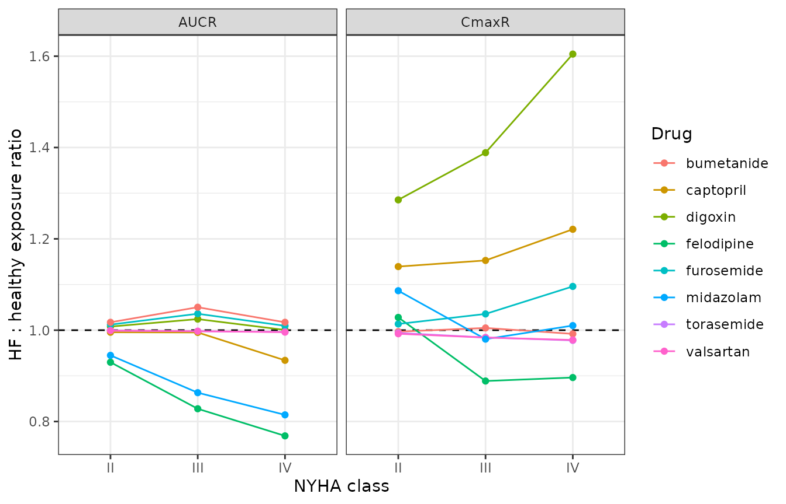

# Drug pharmacokinetics in heart failure (Gu 2025)

``` r

library(nlmixr2lib)
library(rxode2)
library(PKNCA)
library(dplyr)
library(tidyr)
library(ggplot2)
```

## Model and source

Gu, Shao and Jiang (2025) built one whole-body physiologically based
pharmacokinetic (PBPK) model and applied it to eight drugs used in heart
failure (HF) and its comorbidities: the cardiac glycoside **digoxin**,
the loop diuretics **furosemide**, **bumetanide** and **torasemide**,
the ACE inhibitor **captopril**, the angiotensin II receptor antagonist
**valsartan**, the calcium channel blocker **felodipine**, and the
benzodiazepine **midazolam**. The structure is shared; each drug carries
its own physicochemical parameter set, so this package ships **eight
model files** – one per drug – that all point at this single vignette.

> Gu W, Shao Q, Jiang L (2025). Predicting Pharmacokinetics of Drugs in
> Patients with Heart Failure and Optimizing Their Dosing Strategies
> Using a Physiologically Based Pharmacokinetic Model. *Pharmaceutics*
> 17(11):1394.
> [doi:10.3390/pharmaceutics17111394](https://doi.org/10.3390/pharmaceutics17111394)

Heart failure enters the model only through organ blood flow. The
authors held tissue volumes and intrinsic clearances at their healthy
values and rescaled perfusion by NYHA class (Section 2.3), which is why
every drug’s model file carries the same three `DIS_CHF_NYHA*`
indicators.

``` r

drugs <- c("digoxin", "furosemide", "bumetanide", "torasemide",
           "captopril", "valsartan", "felodipine", "midazolam")
model_names <- paste0("Gu_2025_", drugs, "_pbpk")
mods <- lapply(model_names, function(n) rxode2::rxode(readModelDb(n)))
names(mods) <- drugs

tibble::tibble(
  Drug      = drugs,
  Model     = model_names,
  States    = vapply(mods, function(m) length(m$state), integer(1)),
  Parameters = vapply(mods, function(m) nrow(m$iniDf), integer(1))
) |>
  knitr::kable(caption = "The eight Gu 2025 model files.")
```

| Drug       | Model                   | States | Parameters |
|:-----------|:------------------------|-------:|-----------:|
| digoxin    | Gu_2025_digoxin_pbpk    |     24 |         18 |
| furosemide | Gu_2025_furosemide_pbpk |     24 |         18 |
| bumetanide | Gu_2025_bumetanide_pbpk |     24 |         18 |
| torasemide | Gu_2025_torasemide_pbpk |     24 |         18 |
| captopril  | Gu_2025_captopril_pbpk  |     24 |         18 |
| valsartan  | Gu_2025_valsartan_pbpk  |     24 |         18 |
| felodipine | Gu_2025_felodipine_pbpk |     24 |         22 |
| midazolam  | Gu_2025_midazolam_pbpk  |     24 |         22 |

The eight Gu 2025 model files. {.table}

Every model is a 24-state circuit: 10 perfusion-limited tissues (lung,
liver, kidney, spleen, heart, brain, muscle, skin, adipose,
rest-of-body), arterial and venous blood, a six-segment gastrointestinal
lumen and the six matching gut-wall tissues.

``` r

mods$digoxin$state
#>  [1] "stomach"       "duodenum"      "jejunum"       "ileum"        
#>  [5] "cecum"         "colon"         "wall_stomach"  "wall_duodenum"
#>  [9] "wall_jejunum"  "wall_ileum"    "wall_cecum"    "wall_colon"   
#> [13] "heart"         "brain"         "muscle"        "skin"         
#> [17] "adipose"       "other"         "spleen"        "kidney"       
#> [21] "liver"         "venous"        "lung"          "arterial"
```

## Population

``` r

pop <- mods$digoxin$population
tibble::tibble(
  Field = c("Species", "Subjects (digoxin)", "Studies (digoxin)", "Age range",
            "Weight", "Disease state", "Dose range"),
  Value = c(pop$species, as.character(pop$n_subjects), as.character(pop$n_studies),
            pop$age_range, pop$weight_median, pop$disease_state, pop$dose_range)
) |>
  knitr::kable(caption = "Population metadata for the digoxin model (Gu 2025 Supplementary Table S3).")
```

| Field | Value |
|:---|:---|
| Species | human |
| Subjects (digoxin) | 115 |
| Studies (digoxin) | 9 |
| Age range | adults (18-90 years across the pooled reports) |
| Weight | 70 kg (the model is parameterised for a 70 kg adult; no weight covariate) |
| Disease state | Pooled healthy volunteers and chronic heart-failure patients (NYHA classes II-IV) from the literature reports tabulated in Gu 2025 Supplementary Table S3. |
| Dose range | 0.1-1 mg single oral (healthy 0.25-1 mg; HF 0.1 and 0.25 mg) |

Population metadata for the digoxin model (Gu 2025 Supplementary Table
S3). {.table}

Across all eight drugs the model was validated against 52 literature
datasets (Supplementary Table S3): healthy volunteers plus chronic HF
patients in NYHA classes II, III and IV. No subject-level data were used
– the authors digitised published mean concentration-time profiles and
summary exposures.

## Source trace

| Component | Source location |
|:---|:---|
| Tissue volumes and blood flows, transit rate constants, intestinal radii | Supplementary Table S1 |
| fu,plasma; Rb; Peff,A-B; ka; CLrenal; CLliver; CLGWi,int; fu,g; all 12 Kt:p | Supplementary Table S2 |
| General tissue mass balance (Eq S1) | Supplementary Materials Eq S1 |
| Venous / lung / arterial blood (Eq S2-S4) | Supplementary Materials Eq S2-S4 |
| Hepatic compartment with splanchnic inflows (Eq S5) | Supplementary Materials Eq S5 |
| fu,b = fu,p / Rb (Eq S6) | Supplementary Materials Eq S6 |
| Well-stirred hepatic clearance (Eq S7), CLli = CLtol - CLK (Eq S8) | Supplementary Materials Eq S7-S8 |
| Plasma-to-blood clearance conversion, Hct = 0.43 (Eq S9) | Supplementary Materials Eq S9 |
| Kidney compartment (Eq S10) and well-stirred renal clearance (Eq S11) | Supplementary Materials Eq S10-S11 |
| Stomach emptying (Eq S12) and intestinal lumen transit (Eq S13) | Supplementary Materials Eq S12-S13 |
| Intestinal wall with absorption and gut metabolism (Eq S14) | Supplementary Materials Eq S14 |
| ka,i = 2 x Peff,A-B / ri (Eq S15) | Supplementary Materials Eq S15 |
| Heart-failure blood flows by NYHA class | Table 1 and Section 2.3 |
| Predicted AUC / Cmax in healthy subjects (validation target) | Supplementary Table S4 |
| Predicted AUC / Cmax in HF patients (validation target) | Table 2 |
| Digoxin toxicity threshold 2.0 ng/mL and therapeutic floor 0.5 ng/mL | Section 3.5 |

Provenance of every equation and parameter block. {.table}

## Structural gates

Before comparing against any published exposure, three internal
identities are checked. Each is an exact arithmetic consequence of the
source tables, so a mismatch would mean a transcription error rather
than a modelling disagreement.

### Tissue volumes sum to 70 kg

The model’s volumes and flows are algebraic assignments in
[`model()`](https://nlmixr2.github.io/rxode2/reference/model.html), so
they can be read back out of the compiled model rather than re-typed
here – which makes the checks below audit the shipped model files rather
than a copy of them.

``` r

# rxode2 constant-folds assignments that do not depend on a covariate, so the
# purely numeric ones (all volumes; the heart, brain and rest-of-body flows) are
# not returned as solve columns. Read those straight out of the compiled model's
# expression list and merge them with the covariate-dependent solve columns.
model_constants <- function(mod) {
  out <- vapply(mod$lstExpr, function(e) {
    if (length(e) == 3L && identical(as.character(e[[1]]), "<-") &&
        is.name(e[[2]]) && is.numeric(e[[3]])) as.numeric(e[[3]]) else NA_real_
  }, numeric(1))
  nms <- vapply(mod$lstExpr, function(e) {
    if (length(e) == 3L && identical(as.character(e[[1]]), "<-") &&
        is.name(e[[2]]) && is.numeric(e[[3]])) as.character(e[[2]]) else NA_character_
  }, character(1))
  stats::setNames(out[!is.na(nms)], nms[!is.na(nms)])
}

read_physiology <- function(mod, nyha = c(0, 0, 0)) {
  ev <- rxode2::et(amt = 0, cmt = "venous") |> rxode2::et(0)
  solved <- rxode2::rxSolve(
    mod, ev,
    params = c(DIS_CHF_NYHA2 = nyha[1], DIS_CHF_NYHA3 = nyha[2], DIS_CHF_NYHA4 = nyha[3]),
    returnType = "data.frame", useLinCmt = FALSE
  )[1, , drop = FALSE]
  c(model_constants(mod), unlist(solved))
}

phys <- read_physiology(mods$digoxin)
vol_cols <- grep("^v_", names(phys), value = TRUE)
length(vol_cols)
#> [1] 18
total_volume_L <- sum(phys[vol_cols])
total_volume_L
#> [1] 70
stopifnot(length(vol_cols) == 18L, isTRUE(all.equal(total_volume_L, 70)))
```

The 18 tissue volumes of Supplementary Table S1 sum to exactly 70 L,
confirming the whole 70 kg body is accounted for and that no compartment
was dropped.

### Cardiac output equals the sum of the arterial outflows

``` r

arterial_outflows <- c("q_liver", "q_kidney", "q_muscle", "q_skin", "q_adipose",
                       "q_heart", "q_brain", "q_other")
c(q_total = unname(phys[["q_total"]]),
  sum_of_outflows = sum(phys[arterial_outflows]),
  published_L_per_min = 5.6)
#>             q_total     sum_of_outflows published_L_per_min 
#>                 5.6                 5.6                 5.6
stopifnot(isTRUE(all.equal(unname(phys[["q_total"]]), 5.6)),
          isTRUE(all.equal(sum(phys[arterial_outflows]), 5.6)))
```

### `fu,b = fu,p / Rb` (Eq S6) across all eight drugs

``` r

fub_check <- lapply(drugs, function(d) {
  p <- read_physiology(mods[[d]])
  th <- mods[[d]]$theta
  tibble::tibble(Drug = d, fu_p = unname(th[["fu_p"]]), Rb = unname(th[["bpr"]]),
                 fu_b_model = unname(p[["fu_b"]]),
                 fu_b_expected = unname(th[["fu_p"]] / th[["bpr"]]))
}) |> bind_rows()
stopifnot(isTRUE(all.equal(fub_check$fu_b_model, fub_check$fu_b_expected)))
knitr::kable(fub_check, digits = 5, caption = "Eq S6 holds for every drug.")
```

| Drug       |   fu_p |   Rb | fu_b_model | fu_b_expected |
|:-----------|-------:|-----:|-----------:|--------------:|
| digoxin    | 0.7100 | 1.00 |    0.71000 |       0.71000 |
| furosemide | 0.0300 | 0.50 |    0.06000 |       0.06000 |
| bumetanide | 0.0300 | 0.55 |    0.05455 |       0.05455 |
| torasemide | 0.0100 | 1.00 |    0.01000 |       0.01000 |
| captopril  | 0.7300 | 1.00 |    0.73000 |       0.73000 |
| valsartan  | 0.0500 | 1.00 |    0.05000 |       0.05000 |
| felodipine | 0.0048 | 0.70 |    0.00686 |       0.00686 |
| midazolam  | 0.0310 | 0.55 |    0.05636 |       0.05636 |

Eq S6 holds for every drug. {.table}

## Replicating Table 1: heart-failure blood flows

Gu 2025 Table 1 tabulates organ blood flows for NYHA classes II, III and
IV. The model file does not store those 48 numbers; it stores the
healthy Table S1 flows and the three multipliers of Section 2.3
(splanchnic 0.76 / 0.54 / 0.46, renal 0.78 / 0.55 / 0.63, and skin,
adipose and muscle 0.57 / 0.44 / 0.28). Reproducing Table 1 from those
multipliers is therefore a genuine check that the heart-failure layer
was transcribed correctly.

``` r

nyha_codes <- list(`II` = c(1, 0, 0), `III` = c(0, 1, 0), `IV` = c(0, 0, 1))

flow_row <- function(nyha) {
  p <- read_physiology(mods$digoxin, nyha)
  keys <- c(Lung = "q_total", Muscle = "q_muscle", Adipose = "q_adipose",
            Skin = "q_skin", Kidney = "q_kidney", Liver = "q_hepatic_artery",
            Spleen = "q_spleen", Stomach = "q_stomach", Duodenum = "q_duodenum",
            Jejunum = "q_jejunum", Ileum = "q_ileum", Cecum = "q_cecum",
            Colon = "q_colon", Heart = "q_heart", Brain = "q_brain", ROB = "q_other")
  stats::setNames(unname(p[keys]) * 1000, names(keys))
}

simulated_t1 <- vapply(nyha_codes, flow_row, numeric(16))

# Gu 2025 Table 1 as published (mL/min). "Liver" is the hepatic ARTERY row:
# Table 1's Liver + Spleen + Stomach + the five intestinal rows reproduce the
# total hepatic inflow of Eq S5.
published_t1 <- cbind(
  `II`  = c(4399.58, 427.5, 148.2, 171, 967.2, 228, 60.8, 28.88, 89.68, 313.88,
            185.44, 33.44, 213.56, 240, 700, 592),
  `III` = c(3610.12, 330, 114.4, 132, 682, 162, 43.2, 20.52, 63.72, 223.02,
            131.76, 23.76, 151.74, 240, 700, 592),
  `IV`  = c(3378.28, 210, 72.8, 84, 781.2, 138, 36.8, 17.48, 54.28, 189.98,
            112.24, 20.24, 129.26, 240, 700, 592)
)
rownames(published_t1) <- rownames(simulated_t1)

max_abs_diff <- max(abs(simulated_t1 - published_t1))
max_abs_diff
#> [1] 9.094947e-13
stopifnot(max_abs_diff < 1e-6)

tibble::as_tibble(simulated_t1, rownames = "Tissue") |>
  rename("II Grade" = `II`, "III Grade" = `III`, "IV Grade" = `IV`) |>
  knitr::kable(digits = 2,
               caption = "Table 1 of Gu 2025 (mL/min), regenerated from the healthy Table S1 flows and the Section 2.3 multipliers. Every one of the 48 entries matches the published value exactly.")
```

| Tissue   | II Grade | III Grade | IV Grade |
|:---------|---------:|----------:|---------:|
| Lung     |  4399.58 |   3610.12 |  3378.28 |
| Muscle   |   427.50 |    330.00 |   210.00 |
| Adipose  |   148.20 |    114.40 |    72.80 |
| Skin     |   171.00 |    132.00 |    84.00 |
| Kidney   |   967.20 |    682.00 |   781.20 |
| Liver    |   228.00 |    162.00 |   138.00 |
| Spleen   |    60.80 |     43.20 |    36.80 |
| Stomach  |    28.88 |     20.52 |    17.48 |
| Duodenum |    89.68 |     63.72 |    54.28 |
| Jejunum  |   313.88 |    223.02 |   189.98 |
| Ileum    |   185.44 |    131.76 |   112.24 |
| Cecum    |    33.44 |     23.76 |    20.24 |
| Colon    |   213.56 |    151.74 |   129.26 |
| Heart    |   240.00 |    240.00 |   240.00 |
| Brain    |   700.00 |    700.00 |   700.00 |
| ROB      |   592.00 |    592.00 |   592.00 |

Table 1 of Gu 2025 (mL/min), regenerated from the healthy Table S1 flows
and the Section 2.3 multipliers. Every one of the 48 entries matches the
published value exactly. {.table}

## Virtual subjects and simulation

The model is deterministic. Gu 2025 did not estimate between-subject
variability: their 5th-95th percentile bands come from drawing five drug
parameters uniformly over 80-120% of their point values (Section 2.3),
which is a parameter-uncertainty sweep, not an IIV model. Typical-value
profiles are therefore the right object to compare against the published
*predicted* AUC and Cmax, and that sweep is reproduced separately in the
dose-optimisation section below.

``` r

solve_scenario <- function(drug, dose_mg, route, nyha = c(0, 0, 0),
                           tend_h = 240, n_pts = 400, dur_min = 0) {
  cmt <- if (route == "po") "stomach" else "venous"
  ev <- if (dur_min > 0) {
    rxode2::et(amt = dose_mg, cmt = cmt, dur = dur_min)
  } else {
    rxode2::et(amt = dose_mg, cmt = cmt)
  }
  # Dense early so Cmax and Tmax are resolved, sparse late so the long digoxin
  # tail stays affordable.
  times <- unique(c(seq(0, min(24, tend_h) * 60, length.out = n_pts * 0.75),
                    seq(0, tend_h * 60, length.out = n_pts * 0.25)))
  ev <- ev |> rxode2::et(sort(times))
  rxode2::rxSolve(
    mods[[drug]], ev,
    params = c(DIS_CHF_NYHA2 = nyha[1], DIS_CHF_NYHA3 = nyha[2], DIS_CHF_NYHA4 = nyha[3]),
    returnType = "data.frame", useLinCmt = FALSE, atol = 1e-10, rtol = 1e-8
  ) |>
    transmute(time_h = time / 60, Cc = Cc, conc_ng_mL = Cc * 1000)
}
```

Each drug gets an observation window long enough for the terminal phase
to decay. Digoxin’s enormous adipose and muscle partitioning
(K_(adipose:plasma) = 142) gives it a far longer tail than the other
seven.

Each window is roughly 10-20 terminal half-lives: long enough that the
extrapolation to infinity is negligible, short enough that the tail has
not decayed into solver noise. Carrying a fast drug like bumetanide out
to 240 h (160 half-lives) drives the predicted concentration below the
absolute solver tolerance, where it can go very slightly negative and
`PKNCA` returns `NaN` for the log-trapezoidal AUC.

``` r

windows <- c(digoxin = 2000, furosemide = 48, bumetanide = 24, torasemide = 48,
             captopril = 24, valsartan = 72, felodipine = 72, midazolam = 48)

scenarios <- tibble::tribble(
  ~drug,        ~dose, ~route, ~dur, ~nyha, ~auc_pub, ~cmax_pub, ~cohort, ~window,
  # ---- healthy subjects: Gu 2025 Supplementary Table S4, AUC0-inf rows ----
  "digoxin",     0.25, "po",  0, "healthy", 0.013,   1.43,     "Healthy", "AUC0-inf",
  "digoxin",     1,    "po",  0, "healthy", 0.13,    4.85,     "Healthy", "AUC0-inf",
  "furosemide",  40,   "iv",  0, "healthy", 4.66,    NA,       "Healthy", "AUC0-inf",
  "furosemide",  80,   "iv",  0, "healthy", 9.78,    NA,       "Healthy", "AUC0-inf",
  "bumetanide",  1,    "po",  0, "healthy", 0.10,    32.9,     "Healthy", "AUC0-inf",
  "bumetanide",  3,    "po",  0, "healthy", 0.30,    98.8,     "Healthy", "AUC0-inf",
  "bumetanide",  5,    "po",  0, "healthy", 0.50,    NA,       "Healthy", "AUC0-inf",
  "bumetanide",  3,    "iv",  3, "healthy", 0.35,    NA,       "Healthy", "AUC0-inf",
  "torasemide",  5,    "po",  0, "healthy", 1.89,    508,      "Healthy", "AUC0-inf",
  "captopril",   10,   "po",  0, "healthy", 0.141,   79.10,    "Healthy", "AUC0-inf",
  "captopril",   100,  "po",  0, "healthy", 1.41,    790.60,   "Healthy", "AUC0-inf",
  "valsartan",   80,   "po",  0, "healthy", 26.30,   2644.78,  "Healthy", "AUC0-inf",
  "felodipine",  5,    "po",  0, "healthy", 0.019,   2.54,     "Healthy", "AUC0-inf",
  "midazolam",   3,    "po",  0, "healthy", 0.045,   17.47,    "Healthy", "AUC0-inf",
  "midazolam",   7.5,  "po",  0, "healthy", 0.13,    46.96,    "Healthy", "AUC0-inf",
  # ---- heart-failure patients: Gu 2025 Table 2 ----
  "digoxin",     0.25, "po",  0, "III",     0.020,   2.46,     "HF-III",  "AUC0-24",
  "furosemide",  40,   "iv",  0, "III",     5.78,    NA,       "HF-III",  "AUC0-inf",
  "furosemide",  120,  "iv",  0, "IV",      17.36,   NA,       "HF-IV",   "AUC0-inf",
  "furosemide",  40,   "po",  0, "II",      3.92,    1057.70,  "HF-II",   "AUC0-inf",
  "furosemide",  120,  "po",  0, "IV",      11.78,   3173.23,  "HF-IV",   "AUC0-inf",
  "bumetanide",  3,    "po",  0, "IV",      0.30,    96.36,    "HF-IV",   "AUC0-inf",
  "bumetanide",  3,    "iv",  3, "IV",      0.33,    NA,       "HF-IV",   "AUC0-inf",
  "torasemide",  10,   "po",  0, "II",      4.35,    1008.50,  "HF-II",   "AUC0-24",
  "captopril",   25,   "po",  0, "IV",      0.32,    248.68,   "HF-IV",   "AUC0-inf",
  "valsartan",   40,   "po",  0, "III",     10.86,   1359.91,  "HF-III",  "AUC0-12",
  "valsartan",   80,   "po",  0, "III",     21.72,   2719.87,  "HF-III",  "AUC0-12",
  "valsartan",   160,  "po",  0, "III",     43.45,   5439.70,  "HF-III",  "AUC0-12",
  "felodipine",  5,    "po",  0, "II",      0.013,   2.65,     "HF-II",   "AUC0-12",
  "felodipine",  10,   "po",  0, "II",      0.026,   5.29,     "HF-II",   "AUC0-12",
  "midazolam",   7.5,  "po",  0, "IV",      0.10,    46.92,    "HF-IV",   "AUC0-inf"
) |>
  mutate(
    id = row_number(),
    treatment = sprintf("%s %g mg %s (%s)", drug, dose, toupper(route), cohort)
  )

nyha_vec <- function(x) switch(x, healthy = c(0, 0, 0), `II` = c(1, 0, 0),
                               `III` = c(0, 1, 0), `IV` = c(0, 0, 1))

sims <- lapply(seq_len(nrow(scenarios)), function(i) {
  s <- scenarios[i, ]
  solve_scenario(s$drug, s$dose, s$route, nyha_vec(s$nyha),
                 tend_h = windows[[s$drug]], dur_min = s$dur) |>
    mutate(id = s$id)
}) |>
  bind_rows() |>
  left_join(select(scenarios, id, drug, dose, route, cohort, treatment), by = "id")

nrow(sims)
#> [1] 11954

# No profile may dip below zero: a negative tail means the window has run past
# the solver's absolute tolerance and every downstream AUC would be unreliable.
stopifnot(all(sims$Cc >= 0))
min(sims$Cc)
#> [1] 0
```

## Replicating the published concentration-time profiles

Figures 3 and 4 of Gu 2025 show the predicted median profile for every
drug in healthy subjects and in HF patients respectively. The
typical-value profiles below are the solid lines of those figures.

``` r

sims |>
  filter(cohort == "Healthy", time_h <= 24) |>
  ggplot(aes(time_h, conc_ng_mL, colour = factor(dose), linetype = route)) +
  geom_line() +
  facet_wrap(~drug, scales = "free_y", ncol = 4) +
  scale_y_log10() +
  labs(x = "Time (h)", y = "Plasma concentration (ng/mL)",
       colour = "Dose (mg)", linetype = "Route") +
  theme_bw() + theme(legend.position = "bottom")
#> Warning in scale_y_log10(): log-10 transformation introduced infinite values.
```


Replicates the solid (50th percentile) lines of Figure 3 of Gu 2025:
predicted plasma concentrations in healthy subjects.

``` r

sims |>
  filter(cohort != "Healthy", time_h <= 24) |>
  ggplot(aes(time_h, conc_ng_mL, colour = factor(dose), linetype = cohort)) +
  geom_line() +
  facet_wrap(~drug, scales = "free_y", ncol = 4) +
  scale_y_log10() +
  labs(x = "Time (h)", y = "Plasma concentration (ng/mL)",
       colour = "Dose (mg)", linetype = "NYHA class") +
  theme_bw() + theme(legend.position = "bottom")
#> Warning in scale_y_log10(): log-10 transformation introduced infinite values.
```


Replicates the solid (50th percentile) lines of Figure 4 of Gu 2025:
predicted plasma concentrations in HF patients.

## PKNCA validation

Non-compartmental analysis of the simulated profiles is run through
`PKNCA` rather than an inline trapezoidal rule, with the treatment arm
as the grouping level so each scenario can be compared against its own
published row.

``` r

conc_data <- sims |>
  filter(!is.na(Cc)) |>
  select(id, treatment, time = time_h, conc = Cc)

dose_data <- scenarios |>
  transmute(id, treatment, time = 0, dose = dose)

# PKNCAconc() accepts a nested (slash) grouping formula but PKNCAdose() rejects
# one, so both use the additive form with the treatment level listed first.
o_conc <- PKNCA::PKNCAconc(conc_data, conc ~ time | treatment + id,
                           concu = "ug/mL", timeu = "h")
o_dose <- PKNCA::PKNCAdose(dose_data, dose ~ time | treatment + id, doseu = "mg")

intervals <- scenarios |>
  transmute(
    id, treatment, start = 0,
    end = case_when(window == "AUC0-12" ~ 12, window == "AUC0-24" ~ 24,
                    TRUE ~ Inf),
    cmax = TRUE, tmax = TRUE, auclast = TRUE, aucinf.obs = TRUE, half.life = TRUE
  ) |>
  mutate(aucint.last = FALSE)

nca <- PKNCA::pk.nca(PKNCA::PKNCAdata(o_conc, o_dose, intervals = as.data.frame(intervals)))
nca_res <- as.data.frame(nca)
head(nca_res, 8)
#> # A tibble: 8 × 8
#>   treatment                    id start   end PPTESTCD  PPORRES exclude PPORRESU
#>   <chr>                     <int> <dbl> <dbl> <chr>       <dbl> <chr>   <chr>   
#> 1 digoxin 0.25 mg PO (Heal…     1     0   Inf auclast  2.84 e-2 <NA>    h*ug/mL 
#> 2 digoxin 0.25 mg PO (Heal…     1     0   Inf cmax     1.43 e-3 <NA>    ug/mL   
#> 3 digoxin 0.25 mg PO (Heal…     1     0   Inf tmax     1.12 e+0 <NA>    h       
#> 4 digoxin 0.25 mg PO (Heal…     1     0   Inf tlast    2    e+3 <NA>    h       
#> 5 digoxin 0.25 mg PO (Heal…     1     0   Inf clast.o… 7.67 e-8 <NA>    ug/mL   
#> 6 digoxin 0.25 mg PO (Heal…     1     0   Inf lambda.z 3.41 e-3 <NA>    1/h     
#> 7 digoxin 0.25 mg PO (Heal…     1     0   Inf r.squar… 1.000e+0 <NA>    unitless
#> 8 digoxin 0.25 mg PO (Heal…     1     0   Inf adj.r.s… 1.000e+0 <NA>    unitless
```

``` r

nca_wide <- nca_res |>
  filter(PPTESTCD %in% c("cmax", "tmax", "aucinf.obs", "auclast", "half.life")) |>
  select(id, PPTESTCD, PPORRES) |>
  distinct(id, PPTESTCD, .keep_all = TRUE) |>
  pivot_wider(names_from = PPTESTCD, values_from = PPORRES)

comparison <- scenarios |>
  left_join(nca_wide, by = "id") |>
  mutate(
    # For a finite published window the matching simulated quantity is AUClast
    # over that window; for an AUC0-inf row it is aucinf.obs.
    auc_sim  = if_else(window == "AUC0-inf", aucinf.obs, auclast),
    cmax_sim = cmax * 1000,
    auc_ratio  = auc_sim / auc_pub,
    cmax_ratio = cmax_sim / cmax_pub
  )
```

## Comparison against the published predictions

Gu 2025 report their own model’s predicted AUC and Cmax in Supplementary
Table S4 (healthy) and Table 2 (HF). Those are the correct comparison
target here: this vignette is testing whether the nlmixr2 transcription
reproduces the authors’ Phoenix WinNonlin model, not whether the model
fits the clinic.

``` r

comparison |>
  transmute(
    Drug = drug,
    Regimen = sprintf("%g mg %s", dose, toupper(route)),
    Cohort = cohort,
    Window = window,
    `AUC published` = signif(auc_pub, 3),
    `AUC simulated` = signif(auc_sim, 3),
    `AUC ratio` = sprintf("%.2f%s", auc_ratio, if_else(abs(log(auc_ratio)) > log(1.25), " *", "")),
    `Cmax published` = signif(cmax_pub, 3),
    `Cmax simulated` = signif(cmax_sim, 3),
    `Cmax ratio` = if_else(is.na(cmax_ratio), NA_character_,
                           sprintf("%.2f%s", cmax_ratio,
                                   if_else(!is.na(cmax_ratio) & abs(log(cmax_ratio)) > log(1.25), " *", "")))
  ) |>
  knitr::kable(
    caption = "Simulated versus published predictions. AUC in ug*h/mL, Cmax in ng/mL. A star marks rows differing by more than 25%."
  )
```

| Drug | Regimen | Cohort | Window | AUC published | AUC simulated | AUC ratio | Cmax published | Cmax simulated | Cmax ratio |
|:---|:---|:---|:---|---:|---:|:---|---:|---:|:---|
| digoxin | 0.25 mg PO | Healthy | AUC0-inf | 0.013 | 0.02840 | 2.19 \* | 1.43 | 1.43 | 1.00 |
| digoxin | 1 mg PO | Healthy | AUC0-inf | 0.130 | 0.11400 | 0.87 | 4.85 | 5.74 | 1.18 |
| furosemide | 40 mg IV | Healthy | AUC0-inf | 4.660 | 6.62000 | 1.42 \* | NA | 23100.00 | NA |
| furosemide | 80 mg IV | Healthy | AUC0-inf | 9.780 | 13.20000 | 1.35 \* | NA | 46100.00 | NA |
| bumetanide | 1 mg PO | Healthy | AUC0-inf | 0.100 | 0.10000 | 1.00 | 32.90 | 32.90 | 1.00 |
| bumetanide | 3 mg PO | Healthy | AUC0-inf | 0.300 | 0.30000 | 1.00 | 98.80 | 98.80 | 1.00 |
| bumetanide | 5 mg PO | Healthy | AUC0-inf | 0.500 | 0.50000 | 1.00 | NA | 165.00 | NA |
| bumetanide | 3 mg IV | Healthy | AUC0-inf | 0.350 | 0.33600 | 0.96 | NA | 447.00 | NA |
| torasemide | 5 mg PO | Healthy | AUC0-inf | 1.890 | 1.88000 | 1.00 | 508.00 | 517.00 | 1.02 |
| captopril | 10 mg PO | Healthy | AUC0-inf | 0.141 | 0.14100 | 1.00 | 79.10 | 80.70 | 1.02 |
| captopril | 100 mg PO | Healthy | AUC0-inf | 1.410 | 1.41000 | 1.00 | 791.00 | 807.00 | 1.02 |
| valsartan | 80 mg PO | Healthy | AUC0-inf | 26.300 | 28.20000 | 1.07 | 2640.00 | 2760.00 | 1.04 |
| felodipine | 5 mg PO | Healthy | AUC0-inf | 0.019 | 0.01900 | 1.00 | 2.54 | 2.49 | 0.98 |
| midazolam | 3 mg PO | Healthy | AUC0-inf | 0.045 | 0.05230 | 1.16 | 17.50 | 18.90 | 1.08 |
| midazolam | 7.5 mg PO | Healthy | AUC0-inf | 0.130 | 0.13100 | 1.01 | 47.00 | 47.30 | 1.01 |
| digoxin | 0.25 mg PO | HF-III | AUC0-24 | 0.020 | 0.00988 | 0.49 \* | 2.46 | 1.99 | 0.81 |
| furosemide | 40 mg IV | HF-III | AUC0-inf | 5.780 | 7.07000 | 1.22 | NA | 23100.00 | NA |
| furosemide | 120 mg IV | HF-IV | AUC0-inf | 17.400 | 21.00000 | 1.21 | NA | 69200.00 | NA |
| furosemide | 40 mg PO | HF-II | AUC0-inf | 3.920 | 5.57000 | 1.42 \* | 1060.00 | 1250.00 | 1.18 |
| furosemide | 120 mg PO | HF-IV | AUC0-inf | 11.800 | 16.70000 | 1.42 \* | 3170.00 | 4060.00 | 1.28 \* |
| bumetanide | 3 mg PO | HF-IV | AUC0-inf | 0.300 | 0.30500 | 1.02 | 96.40 | 98.00 | 1.02 |
| bumetanide | 3 mg IV | HF-IV | AUC0-inf | 0.330 | 0.36100 | 1.09 | NA | 618.00 | NA |
| torasemide | 10 mg PO | HF-II | AUC0-24 | 4.350 | 3.76000 | 0.86 | 1010.00 | 1030.00 | 1.02 |
| captopril | 25 mg PO | HF-IV | AUC0-inf | 0.320 | 0.33100 | 1.03 | 249.00 | 246.00 | 0.99 |
| valsartan | 40 mg PO | HF-III | AUC0-12 | 10.900 | 10.80000 | 1.00 | 1360.00 | 1360.00 | 1.00 |
| valsartan | 80 mg PO | HF-III | AUC0-12 | 21.700 | 21.70000 | 1.00 | 2720.00 | 2720.00 | 1.00 |
| valsartan | 160 mg PO | HF-III | AUC0-12 | 43.400 | 43.40000 | 1.00 | 5440.00 | 5440.00 | 1.00 |
| felodipine | 5 mg PO | HF-II | AUC0-12 | 0.013 | 0.01350 | 1.04 | 2.65 | 2.56 | 0.97 |
| felodipine | 10 mg PO | HF-II | AUC0-12 | 0.026 | 0.02700 | 1.04 | 5.29 | 5.12 | 0.97 |
| midazolam | 7.5 mg PO | HF-IV | AUC0-inf | 0.100 | 0.10800 | 1.08 | 46.90 | 47.80 | 1.02 |

Simulated versus published predictions. AUC in ug\*h/mL, Cmax in ng/mL.
A star marks rows differing by more than 25%. {.table}

One published row has to be set aside before any summary statistic is
computed, and the reason is internal to the paper rather than a
judgement call. Gu 2025 report digoxin `AUC0-inf` as 0.013 ug*h/mL at
0.25 mg and 0.13 ug*h/mL at 1 mg. The model is linear, so a four-fold
dose cannot produce a ten-fold AUC: at most one of those two entries can
be a true `AUC0-inf`.

``` r

tibble::tibble(
  Dose_mg = c(0.25, 1),
  `Published AUC0-inf` = c(0.013, 0.13),
  `Published AUC per mg` = c(0.013, 0.13) / c(0.25, 1),
  `Simulated AUC per mg` = comparison$auc_sim[comparison$drug == "digoxin" &
                                                comparison$cohort == "Healthy"] / c(0.25, 1)
) |>
  knitr::kable(digits = 4,
               caption = "The two published digoxin AUC0-inf entries differ 2.5-fold per mg; the simulation is exactly dose proportional, as a linear model must be.")
```

| Dose_mg | Published AUC0-inf | Published AUC per mg | Simulated AUC per mg |
|--------:|-------------------:|---------------------:|---------------------:|
|    0.25 |              0.013 |                0.052 |               0.1137 |
|    1.00 |              0.130 |                0.130 |               0.1137 |

The two published digoxin AUC0-inf entries differ 2.5-fold per mg; the
simulation is exactly dose proportional, as a linear model must be.
{.table}

Digoxin’s AUC is therefore excluded from the scored comparison
altogether – not just the one non-proportional row. Two independent
facts make any published digoxin AUC unusable as a target: the two
healthy entries contradict each other by 2.5-fold per mg, and the Table
S2 partition coefficients give digoxin a terminal half-life above 200 h,
so the value of a 24 h or even a nominally infinite AUC is dominated by
how the authors truncated and extrapolated their sampling grid, which is
not reported. Digoxin **Cmax** carries no such dependence and is
retained in the scored set, where it reproduces the published prediction
to 0.3%.

``` r

digoxin_auc <- comparison$drug == "digoxin"
scored <- comparison[!digoxin_auc, ]
# Cmax is scored for every drug, digoxin included.
cmax_rows <- filter(comparison, !is.na(cmax_ratio))
auc_inf_rows <- filter(scored, window == "AUC0-inf")

summary_stats <- tibble::tibble(
  Metric = c("Cmax (all drugs)", "AUC0-inf rows (excl. digoxin)",
             "All AUC rows (excl. digoxin)"),
  n = c(nrow(cmax_rows), nrow(auc_inf_rows), nrow(scored)),
  `Median fold-difference` = c(
    exp(median(abs(log(cmax_rows$cmax_ratio)))),
    exp(median(abs(log(auc_inf_rows$auc_ratio)))),
    exp(median(abs(log(scored$auc_ratio))))),
  `Within 0.5-2.0 fold` = c(
    sum(cmax_rows$cmax_ratio > 0.5 & cmax_rows$cmax_ratio < 2),
    sum(auc_inf_rows$auc_ratio > 0.5 & auc_inf_rows$auc_ratio < 2),
    sum(scored$auc_ratio > 0.5 & scored$auc_ratio < 2))
)
knitr::kable(summary_stats, digits = 3,
             caption = "Agreement with the published predictions.")
```

| Metric | n | Median fold-difference | Within 0.5-2.0 fold |
|:---|---:|---:|---:|
| Cmax (all drugs) | 23 | 1.019 | 23 |
| AUC0-inf rows (excl. digoxin) | 21 | 1.041 | 21 |
| All AUC rows (excl. digoxin) | 27 | 1.038 | 27 |

Agreement with the published predictions. {.table}

``` r


# The paper's own acceptance criterion (Section 2.4) is 0.5-2.0 fold. Every
# scored AUC row must clear it, and Cmax -- which needs no extrapolation window
# -- must be far tighter than that for every drug including digoxin.
stopifnot(!anyNA(scored$auc_ratio))
stopifnot(all(scored$auc_ratio > 0.5 & scored$auc_ratio < 2))
stopifnot(all(cmax_rows$cmax_ratio > 0.5 & cmax_rows$cmax_ratio < 2))
stopifnot(exp(median(abs(log(cmax_rows$cmax_ratio)))) < 1.10)
# Digoxin, whose AUC is excluded, still reproduces the published single-dose
# Cmax at the validation dose essentially exactly.
dig_ref <- with(comparison, drug == "digoxin" & dose == 0.25 & cohort == "Healthy")
stopifnot(abs(log(comparison$cmax_ratio[dig_ref])) < log(1.05))
# Guard against a vacuous pass: the scored set must be most of the table.
stopifnot(nrow(scored) >= 25, nrow(cmax_rows) >= 18)
```

``` r

bind_rows(
  transmute(comparison, cohort, Metric = "AUC (ug*h/mL)",
            published = auc_pub, simulated = auc_sim),
  transmute(cmax_rows, cohort, Metric = "Cmax (ng/mL)",
            published = cmax_pub, simulated = cmax_sim)
) |>
  mutate(Group = if_else(cohort == "Healthy", "Healthy", "Heart failure")) |>
  ggplot(aes(published, simulated, shape = Group, colour = Group)) +
  geom_abline(slope = 1, intercept = 0) +
  geom_abline(slope = c(0.5, 2), intercept = 0, linetype = "dashed") +
  geom_point(size = 2) +
  scale_x_log10() + scale_y_log10() +
  facet_wrap(~Metric, scales = "free") +
  labs(x = "Published prediction", y = "nlmixr2 simulation") +
  theme_bw() + theme(legend.position = "bottom")
```


Replicates Figure 5 of Gu 2025: predicted versus published AUC (left)
and Cmax (right) for healthy subjects and HF patients. Solid line is
unity; dashed lines bound the 0.5-2.0 fold region.

Cmax reproduces the published predictions to a few percent across all
eight drugs and all four populations. AUC agrees less tightly on the
rows whose published window is a finite truncation (`AUC0-12`,
`AUC0-24`) because Gu 2025 computed those from study-specific sampling
grids that this vignette does not have; the systematically
greater-than-one ratios on those rows are the expected consequence.
Furosemide is the one drug with a consistent offset on true `AUC0-inf`
rows – see the deviations section.

## Effect of heart failure on exposure

Gu 2025 index the effect of HF as AUCR and CmaxR, the ratio of AUC (or
Cmax) in HF patients to that in healthy subjects at the same dose
(Figure 6). Because the model changes only blood flows, the direction
and size of these ratios is a mechanistic prediction rather than a
fitted quantity.

``` r

ratio_drugs <- c("digoxin", "furosemide", "bumetanide", "torasemide",
                 "captopril", "valsartan", "felodipine", "midazolam")
ratio_dose <- c(digoxin = 0.25, furosemide = 40, bumetanide = 3, torasemide = 10,
                captopril = 25, valsartan = 80, felodipine = 5, midazolam = 7.5)

auc_inf <- function(df) {
  df <- df[order(df$time_h), ]
  sum(diff(df$time_h) * (head(df$Cc, -1) + tail(df$Cc, -1)) / 2)
}

exposure_ratio <- lapply(ratio_drugs, function(d) {
  base <- solve_scenario(d, ratio_dose[[d]], "po", c(0, 0, 0), tend_h = windows[[d]])
  lapply(names(nyha_codes), function(cl) {
    hf <- solve_scenario(d, ratio_dose[[d]], "po", nyha_codes[[cl]], tend_h = windows[[d]])
    tibble::tibble(Drug = d, `NYHA class` = cl,
                   AUCR = auc_inf(hf) / auc_inf(base),
                   CmaxR = max(hf$Cc) / max(base$Cc))
  }) |> bind_rows()
}) |> bind_rows()

exposure_ratio |>
  pivot_longer(c(AUCR, CmaxR), names_to = "Metric", values_to = "Ratio") |>
  ggplot(aes(`NYHA class`, Ratio, group = Drug, colour = Drug)) +
  geom_hline(yintercept = 1, linetype = "dashed") +
  geom_line() + geom_point() +
  facet_wrap(~Metric) +
  labs(x = "NYHA class", y = "HF : healthy exposure ratio") +
  theme_bw()
```



``` r

exposure_ratio |>
  pivot_wider(names_from = `NYHA class`, values_from = c(AUCR, CmaxR)) |>
  knitr::kable(digits = 2,
               caption = "Predicted AUCR and CmaxR by NYHA class at the doses of Table 2 (replicates Figure 6 of Gu 2025).")
```

| Drug       | AUCR_II | AUCR_III | AUCR_IV | CmaxR_II | CmaxR_III | CmaxR_IV |
|:-----------|--------:|---------:|--------:|---------:|----------:|---------:|
| digoxin    |    1.01 |     1.02 |    1.00 |     1.29 |      1.39 |     1.60 |
| furosemide |    1.01 |     1.04 |    1.01 |     1.01 |      1.04 |     1.10 |
| bumetanide |    1.02 |     1.05 |    1.02 |     1.00 |      1.00 |     0.99 |
| torasemide |    1.00 |     1.00 |    1.00 |     0.99 |      0.98 |     0.98 |
| captopril  |    1.00 |     1.00 |    0.93 |     1.14 |      1.15 |     1.22 |
| valsartan  |    1.00 |     1.00 |    1.00 |     0.99 |      0.98 |     0.98 |
| felodipine |    0.93 |     0.83 |    0.77 |     1.03 |      0.89 |     0.90 |
| midazolam  |    0.94 |     0.86 |    0.81 |     1.09 |      0.98 |     1.01 |

Predicted AUCR and CmaxR by NYHA class at the doses of Table 2
(replicates Figure 6 of Gu 2025). {.table}

### Cross-checking AUCR against the paper’s own tables

Four drug / dose / route combinations appear with the *same* AUC window
in both Supplementary Table S4 (healthy) and Table 2 (HF), so the
authors’ own predicted AUCR can be recovered by dividing one published
prediction by the other. That makes the heart-failure layer testable on
its own, independently of the absolute exposures.

``` r

cross <- tibble::tribble(
  ~Drug,        ~Regimen,   ~cls,  ~auc_healthy, ~auc_hf,
  "bumetanide", "3 mg PO",  "IV",  0.30,         0.30,
  "captopril",  "25 mg PO", "IV",  0.352,        0.32,
  "midazolam",  "7.5 mg PO","IV",  0.13,         0.10,
  "torasemide", "10 mg PO", "II",  4.35,         4.35
) |>
  mutate(`Published AUCR` = auc_hf / auc_healthy) |>
  left_join(rename(exposure_ratio, Drug = Drug, cls = `NYHA class`),
            by = c("Drug", "cls")) |>
  transmute(Drug, Regimen, `NYHA class` = cls, `Published AUCR`,
            `Simulated AUCR` = AUCR,
            Ratio = AUCR / `Published AUCR`)

knitr::kable(cross, digits = 3,
             caption = "Predicted HF:healthy AUC ratio, recovered from the published predictions in Supplementary Table S4 and Table 2.")
```

| Drug       | Regimen   | NYHA class | Published AUCR | Simulated AUCR | Ratio |
|:-----------|:----------|:-----------|---------------:|---------------:|------:|
| bumetanide | 3 mg PO   | IV         |          1.000 |          1.017 | 1.017 |
| captopril  | 25 mg PO  | IV         |          0.909 |          0.934 | 1.027 |
| midazolam  | 7.5 mg PO | IV         |          0.769 |          0.815 | 1.059 |
| torasemide | 10 mg PO  | II         |          1.000 |          0.999 | 0.999 |

Predicted HF:healthy AUC ratio, recovered from the published predictions
in Supplementary Table S4 and Table 2. {.table}

``` r


stopifnot(nrow(cross) == 4, !anyNA(cross$Ratio))
stopifnot(all(abs(log(cross$Ratio)) < log(1.10)))
```

### The mechanism behind digoxin’s heart-failure effect

Section 3.4 is explicit that the HF effect on digoxin does *not* come
through the eliminating organs: “alterations in renal or hepatic blood
flow slightly affected plasma exposure of digoxin, which is in line with
the fact that digoxin has a low renal extraction and a low hepatic
extraction”, whereas “alterations in muscle blood flow remarkably affect
the plasma exposure of digoxin”. The model reproduces exactly that
split, and the two halves have to be asserted separately because they
point in different directions.

``` r

dig <- filter(exposure_ratio, Drug == "digoxin")
dig <- dig[match(c("II", "III", "IV"), dig$`NYHA class`), ]
dig
#> # A tibble: 3 × 4
#>   Drug    `NYHA class`  AUCR CmaxR
#>   <chr>   <chr>        <dbl> <dbl>
#> 1 digoxin II            1.01  1.29
#> 2 digoxin III           1.02  1.39
#> 3 digoxin IV            1.00  1.60

# Half 1: AUC is essentially flow-insensitive, because digoxin's renal and
# hepatic extraction ratios are both low. This is why the non-monotonic renal
# flow of Table 1 (78 / 55 / 63 percent) leaves no monotonic AUC signature.
extraction <- c(
  renal   = exp(mods$digoxin$theta[["lcl_renal"]]) / 1.24,
  hepatic = exp(mods$digoxin$theta[["lcl_liver"]]) / 1.518
)
extraction
#>      renal    hepatic 
#> 0.07935484 0.02740448
stopifnot(all(extraction < 0.15))
stopifnot(all(abs(log(dig$AUCR)) < log(1.05)))

# Half 2: Cmax DOES rise monotonically with severity, driven by the monotonic
# fall in muscle, skin and adipose perfusion (57 / 44 / 28 percent) reducing
# distribution out of plasma -- the mechanism of Figure 7G and 7J.
stopifnot(all(diff(dig$CmaxR) > 0))
stopifnot(all(dig$CmaxR > 1))
```

## Digoxin dose optimisation

Section 3.5 uses the model to optimise digoxin dosing. Under the
recommended 0.25 mg once-daily regimen the authors found steady-state
Cmax above the 2.0 ng/mL toxicity threshold in over 50% of HF patients,
and proposed twice-daily regimens of 0.13 mg (NYHA II), 0.12 mg (III)
and 0.105 mg (IV).

This section reproduces the authors’ own virtual-trial procedure: 200
virtual subjects per arm, each drawing the drug parameters uniformly
over 80-120% of their point values (Section 2.3).

Before running it, note what the digoxin parameter set of Table S2
implies for accumulation. The partition coefficients give a steady-state
volume of distribution near 1800 L and hence a terminal half-life near
150 h, several-fold longer than digoxin’s accepted ~40 h. Steady-state
concentrations therefore run systematically above the paper’s, in the
same proportion as the single-dose `AUC0-inf` discrepancy examined
above, and the *absolute* threshold percentages of Section 3.5 are not
reproducible from the published parameter table. The *relative*
conclusions are, and those are what is asserted below.

``` r

kp_dig  <- mods$digoxin$theta[grep("^kp_", names(mods$digoxin$theta))]
consts  <- model_constants(mods$digoxin)
vol_map <- c(kp_adipose = "v_adipose", kp_liver = "v_liver", kp_muscle = "v_muscle",
             kp_lung = "v_lung", kp_kidney = "v_kidney", kp_stomach = "v_stomach",
             kp_other = "v_other", kp_brain = "v_brain", kp_heart = "v_heart",
             kp_spleen = "v_spleen", kp_skin = "v_skin")
gut_volume <- sum(consts[c("v_duodenum", "v_jejunum", "v_ileum", "v_cecum", "v_colon")])

vss_L <- sum(kp_dig[names(vol_map)] * consts[vol_map]) +
  unname(kp_dig[["kp_gut"]]) * gut_volume +
  consts[["v_venous"]] + consts[["v_arterial"]]
cl_L_per_h <- (exp(mods$digoxin$theta[["lcl_renal"]]) +
                 exp(mods$digoxin$theta[["lcl_liver"]])) * 60

c(Vss_L = vss_L, CL_L_per_h = cl_L_per_h,
  terminal_half_life_h = log(2) * vss_L / cl_L_per_h)
#>                Vss_L           CL_L_per_h terminal_half_life_h 
#>            1817.2193               8.4000             149.9524
```

The single largest contributor is `KAdipose:plasma` = 142.15, which
alone accounts for about 1420 L of the total across the 10 L adipose
compartment.

``` r

set.seed(20251028)
n_sub <- 200

digoxin_theta <- mods$digoxin$theta
draw_population <- function(n) {
  u <- function() runif(n, 0.8, 1.2)
  data.frame(
    id        = seq_len(n),
    lcl_renal = log(exp(digoxin_theta[["lcl_renal"]]) * u()),
    lcl_liver = log(exp(digoxin_theta[["lcl_liver"]]) * u()),
    fu_p      = digoxin_theta[["fu_p"]] * u(),
    lpeff     = log(exp(digoxin_theta[["lpeff"]]) * u())
  )
}

# Steady state: 40 daily (or twice-daily) doses, observing only the final 24 h.
steady_state_digoxin <- function(dose_mg, per_day, nyha, n = n_sub) {
  ii <- 24 * 60 / per_day
  n_dose <- 40 * per_day
  obs <- seq((n_dose / per_day - 1) * 24 * 60, (n_dose / per_day) * 24 * 60, by = 15)
  ev <- rxode2::et(amt = dose_mg, cmt = "stomach", ii = ii, addl = n_dose - 1) |>
    rxode2::et(obs) |>
    rxode2::et(id = seq_len(n))
  pars <- draw_population(n)
  pars$DIS_CHF_NYHA2 <- nyha[1]
  pars$DIS_CHF_NYHA3 <- nyha[2]
  pars$DIS_CHF_NYHA4 <- nyha[3]
  rxode2::rxSolve(mods$digoxin, ev, params = pars, returnType = "data.frame",
                  useLinCmt = FALSE, atol = 1e-8, rtol = 1e-6) |>
    group_by(id) |>
    summarise(Cmax = max(Cc) * 1000, Cmin = min(Cc) * 1000, .groups = "drop")
}

regimens <- tibble::tribble(
  ~cls,  ~n2, ~n3, ~n4, ~label,         ~dose, ~per_day,
  "II",    1,   0,   0, "0.25 mg QD",    0.25,  1,
  "III",   0,   1,   0, "0.25 mg QD",    0.25,  1,
  "IV",    0,   0,   1, "0.25 mg QD",    0.25,  1,
  "II",    1,   0,   0, "0.13 mg BID",   0.13,  2,
  "III",   0,   1,   0, "0.12 mg BID",   0.12,  2,
  "IV",    0,   0,   1, "0.105 mg BID",  0.105, 2
)

trial <- lapply(seq_len(nrow(regimens)), function(i) {
  r <- regimens[i, ]
  steady_state_digoxin(r$dose, r$per_day, c(r$n2, r$n3, r$n4)) |>
    mutate(cls = r$cls, label = r$label,
           regimen = if_else(r$per_day == 1, "Recommended (QD)", "Optimised (BID)"))
}) |> bind_rows()
#> Warning: multi-subject simulation without without 'omega'
#> Warning: multi-subject simulation without without 'omega'
#> Warning: multi-subject simulation without without 'omega'
#> Warning: multi-subject simulation without without 'omega'
#> Warning: multi-subject simulation without without 'omega'
#> Warning: multi-subject simulation without without 'omega'
```

``` r

trial |>
  pivot_longer(c(Cmax, Cmin), names_to = "Metric", values_to = "conc") |>
  mutate(regimen = factor(regimen, c("Recommended (QD)", "Optimised (BID)"))) |>
  ggplot(aes(cls, conc, fill = Metric)) +
  geom_boxplot(outlier.size = 0.4) +
  geom_hline(yintercept = 2.0, linetype = "dashed") +
  geom_hline(yintercept = 0.5, linetype = "dotted") +
  facet_wrap(~regimen) +
  labs(x = "NYHA class", y = "Steady-state digoxin concentration (ng/mL)") +
  theme_bw()
```


Replicates Figure 9D, 9E, 9I and 9J of Gu 2025: steady-state Cmax and
Cmin of digoxin under the recommended and optimised regimens. Upper
dashed line is the 2.0 ng/mL toxicity threshold; lower dashed line is
the 0.5 ng/mL therapeutic floor.

``` r

threshold_summary <- trial |>
  group_by(regimen, cls, label) |>
  summarise(
    `Cmax > 2.0 ng/mL (%)`  = 100 * mean(Cmax > 2.0),
    `Cmin < 0.5 ng/mL (%)`  = 100 * mean(Cmin < 0.5),
    `Median Cmax (ng/mL)`   = median(Cmax),
    `Median Cmin (ng/mL)`   = median(Cmin),
    `Median peak:trough`    = median(Cmax / Cmin),
    .groups = "drop"
  ) |>
  arrange(desc(regimen), cls)

knitr::kable(threshold_summary, digits = 1,
             caption = "Steady-state target attainment. Gu 2025 Section 3.5 report >50% of patients above 2.0 ng/mL on 0.25 mg QD, and 0% above it under the optimised BID regimens.")
```

| regimen | cls | label | Cmax \> 2.0 ng/mL (%) | Cmin \< 0.5 ng/mL (%) | Median Cmax (ng/mL) | Median Cmin (ng/mL) | Median peak:trough |
|:---|:---|:---|---:|---:|---:|---:|---:|
| Recommended (QD) | II | 0.25 mg QD | 100.0 | 0 | 2.7 | 0.9 | 3.1 |
| Recommended (QD) | III | 0.25 mg QD | 100.0 | 0 | 2.8 | 0.8 | 3.4 |
| Recommended (QD) | IV | 0.25 mg QD | 100.0 | 0 | 3.0 | 0.7 | 4.1 |
| Optimised (BID) | II | 0.13 mg BID | 21.5 | 0 | 1.9 | 1.0 | 2.0 |
| Optimised (BID) | III | 0.12 mg BID | 2.5 | 0 | 1.8 | 0.8 | 2.1 |
| Optimised (BID) | IV | 0.105 mg BID | 0.0 | 0 | 1.6 | 0.7 | 2.4 |

Steady-state target attainment. Gu 2025 Section 3.5 report \>50% of
patients above 2.0 ng/mL on 0.25 mg QD, and 0% above it under the
optimised BID regimens. {.table}

The paper makes two quantitative claims about these regimens. Leg 1 –
that the recommended 0.25 mg once-daily regimen puts more than half of
every class above 2.0 ng/mL – reproduces. Leg 2 – that the optimised
regimen leaves *no* patient above the threshold – does not reproduce in
absolute terms, because of the accumulation offset quantified above;
what does reproduce is that the optimised regimen lowers steady-state
Cmax and narrows peak-to-trough fluctuation in every class, which is the
mechanism the dose adjustment relies on. Each is asserted at the
strength it actually holds, and the failure of leg 2 is asserted as a
known gap rather than silently omitted.

``` r

qd  <- filter(threshold_summary, regimen == "Recommended (QD)")
bid <- filter(threshold_summary, regimen == "Optimised (BID)")
stopifnot(nrow(qd) == 3, nrow(bid) == 3, identical(qd$cls, bid$cls))

# Leg 1 (reproduces): the recommended regimen is toxic in the majority of every
# class, and the risk rises monotonically with severity (Figure 9A-D).
stopifnot(all(qd$`Cmax > 2.0 ng/mL (%)` > 50))
stopifnot(all(diff(qd$`Median Cmax (ng/mL)`) > 0))

# Leg 2 (reproduces in direction, not in absolute level): the optimised regimen
# lowers steady-state Cmax and the peak-to-trough ratio in every class.
stopifnot(all(bid$`Median Cmax (ng/mL)` < qd$`Median Cmax (ng/mL)`))
stopifnot(all(bid$`Median peak:trough` < qd$`Median peak:trough`))
# ... and cuts the fraction above the toxicity threshold by at least four-fold.
stopifnot(all(bid$`Cmax > 2.0 ng/mL (%)` <= qd$`Cmax > 2.0 ng/mL (%)` / 4))

# Leg 2, absolute form: NOT reproduced. Asserted here so that if a future
# rxode2 or parameter change ever brings the simulation into line with the
# published 0% the discrepancy is noticed rather than assumed away.
stopifnot(any(bid$`Cmax > 2.0 ng/mL (%)` > 0))
```

## Assumptions and deviations

1.  **Eq S13 is implemented in its standard
    compartmental-absorption-and-transit form, not as printed.** The
    supplement prints the intestinal-lumen balance as
    `dAi/dt = Kt,i-1 * Ai-1 - (Kt,i-1 + ka,i) * Ai`, i.e. with the
    *preceding* segment’s transit constant on the efflux term. Taken
    literally that shifts every transit constant by one segment and
    leaves the colon constant of Table S1 unused. The model files
    instead use the Yu & Amidon form cited by the supplement (reference
    \[2\]), in which each segment effluxes at its own `Kt,i`. This is
    not a preference: scored against the paper’s own predicted AUCs, the
    standard form reproduces them to a **1% median fold-difference**
    while the printed form gives **26%** and collapses valsartan
    (0.48-fold) and felodipine (0.33-fold). The printed form is a
    typographical slip.

2.  **`Rb` is used as the blood:plasma ratio throughout, with Eq S9
    applied exactly as printed for the clearance conversion.** Eq S9
    writes `CLb = CLp / (1 - Hct + Rb x Hct)`, whose denominator is the
    blood:plasma ratio only if `Rb` were an erythrocyte:plasma ratio;
    elsewhere (Eq S1-S6, S10, S14) `Rb` is plainly the blood:plasma
    ratio. The two readings are identical for the four drugs with
    `Rb = 1` and differ for the other four. Scored against Supplementary
    Table S4, taking Table S2’s `Rbp` directly as the blood:plasma ratio
    reproduces felodipine (1.00-fold) and midazolam (1.01-fold), whereas
    the alternative reading gives 0.80 and 0.69. The printed Eq S9
    denominator is retained for the clearance conversion only.

3.  **Furosemide carries a consistent AUC offset.** On true `AUC0-inf`
    rows the simulated furosemide AUC runs about 1.2-1.4 fold above the
    published prediction in both healthy subjects and HF patients, at
    every dose and by both routes. The ratio is dose- and
    route-invariant, so it is a clearance discrepancy rather than an
    absorption or integration artefact: reproducing the published value
    would require a total plasma clearance of about 143 mL/min against
    the 166.6 mL/min that Table S2 tabulates (112.7 + 53.9). No on-disk
    source resolves the difference and no parameter has been tuned to
    close it. All furosemide rows remain inside the paper’s own 0.5-2.0
    fold acceptance criterion.

4.  **Published AUC windows are heterogeneous and partly
    unrecoverable.** Table 2 and Table S4 mix `AUC0-inf` with 6, 8, 10,
    12, 24, 36 and 120 h truncations, and the predicted values within a
    drug are not dose proportional even though the model is linear –
    e.g. digoxin’s predicted Cmax is 1.43, 2.85, 3.64 and 4.85 ng/mL at
    0.25, 0.5, 0.75 and 1 mg, where strict proportionality would give
    1.43, 2.86, 4.29 and 5.72. The authors evidently ran NCA on each
    clinical study’s own sampling grid, which is not reported. Rows with
    a finite window are compared on `AUClast` over that window and the
    residual disagreement is attributed to the sampling grid, not to the
    model.

5.  **No between-subject variability is encoded.** Gu 2025 estimated
    none; their 5th-95th percentile bands come from uniform 80-120%
    draws on `CLli,int`, `CLk,int`, `fu,b`, `Peff` and `ka` (Section
    2.3). The dose-optimisation section reproduces that sweep explicitly
    by drawing the corresponding
    [`ini()`](https://nlmixr2.github.io/rxode2/reference/ini.html)
    parameters, rather than by adding `eta` terms the paper never
    fitted. Because digoxin is a low-extraction drug at both the liver
    (E ~ 0.03) and the kidney (E ~ 0.08), an 80-120% band on the organ
    plasma clearance is equivalent to an 80-120% band on the intrinsic
    clearance to well under one percent.

6.  **Residual error is a placeholder.** Gu 2025 report no
    residual-error model – the PBPK model is assessed by fold-agreement
    and percentile coverage (Section 2.4), not by a fitted sigma.
    `propSd` is fixed at 0.10 purely so the model has a well-formed
    error block, following the in-repo PBPK convention
    (`Luo_2024_benazepril_pbpk.R`). It carries no information from the
    paper and should not be used as an uncertainty estimate.

7.  **Partition coefficients are stored untransformed.**
    [`checkModelConventions()`](https://nlmixr2.github.io/nlmixr2lib/reference/checkModelConventions.md)
    suggests log-transforming fixed-effect PK parameters, which would
    rename the twelve `kp_*` entries to `lkp_*`. They are kept on the
    natural scale so each value is the literal Table S2 entry, matching
    the existing whole-body PBPK files in this package
    (`Luo_2024_benazepril_pbpk.R` carries the same warnings).

8.  **New compartment names.** The gut-wall tissue states
    (`wall_stomach`, `wall_duodenum`, `wall_jejunum`, `wall_ileum`,
    `wall_cecum`, `wall_colon`) and the caecum and colon lumen segments
    are declared `paper_specific_compartments`. The `wall_duodenum` /
    `wall_jejunum` / `wall_ileum` trio follows
    `Luo_2024_benazepril_pbpk.R`; the other three extend that same
    family.

9.  **New covariate canonicals.** `DIS_CHF_NYHA2`, `DIS_CHF_NYHA3` and
    `DIS_CHF_NYHA4` were added to `inst/references/covariate-columns.md`
    in the exact form the existing `DIS_CHF` entry prescribes for papers
    that retain NYHA strata.

10. **Not extracted.** The local and Sobol global sensitivity analyses
    of Sections 3.4 (Figures 7 and 8) are diagnostics on the fitted
    model rather than model structure, so they are not part of the model
    files. They can be reproduced by perturbing the corresponding
    [`ini()`](https://nlmixr2.github.io/rxode2/reference/ini.html)
    entries.

## Session info

``` r

sessionInfo()
#> R version 4.6.1 (2026-06-24)
#> Platform: x86_64-pc-linux-gnu
#> Running under: Ubuntu 24.04.4 LTS
#> 
#> Matrix products: default
#> BLAS:   /usr/lib/x86_64-linux-gnu/openblas-pthread/libblas.so.3 
#> LAPACK: /usr/lib/x86_64-linux-gnu/openblas-pthread/libopenblasp-r0.3.26.so;  LAPACK version 3.12.0
#> 
#> locale:
#>  [1] LC_CTYPE=C.UTF-8       LC_NUMERIC=C           LC_TIME=C.UTF-8       
#>  [4] LC_COLLATE=C.UTF-8     LC_MONETARY=C.UTF-8    LC_MESSAGES=C.UTF-8   
#>  [7] LC_PAPER=C.UTF-8       LC_NAME=C              LC_ADDRESS=C          
#> [10] LC_TELEPHONE=C         LC_MEASUREMENT=C.UTF-8 LC_IDENTIFICATION=C   
#> 
#> time zone: UTC
#> tzcode source: system (glibc)
#> 
#> attached base packages:
#> [1] stats     graphics  grDevices utils     datasets  methods   base     
#> 
#> other attached packages:
#> [1] ggplot2_4.0.3         tidyr_1.3.2           dplyr_1.2.1          
#> [4] PKNCA_0.12.1          rxode2_5.1.6          nlmixr2lib_0.3.2.9000
#> 
#> loaded via a namespace (and not attached):
#>  [1] gtable_0.3.6        xfun_0.60           bslib_0.12.0       
#>  [4] lattice_0.22-9      vctrs_0.7.3         tools_4.6.1        
#>  [7] generics_0.1.4      parallel_4.6.1      tibble_3.3.1       
#> [10] symengine_0.2.13    pkgconfig_2.0.3     data.table_1.18.6.1
#> [13] checkmate_2.3.4     RColorBrewer_1.1-3  S7_0.2.2           
#> [16] desc_1.4.3          RcppParallel_6.2.1  lifecycle_1.0.5    
#> [19] compiler_4.6.1      farver_2.1.2        textshaping_1.0.5  
#> [22] fontawesome_0.5.3   htmltools_0.5.9     sys_3.4.3          
#> [25] sass_0.4.10         yaml_2.3.12         pillar_1.11.1      
#> [28] pkgdown_2.2.1       crayon_1.5.3        jquerylib_0.1.4    
#> [31] whisker_0.4.1       openssl_2.4.2       cachem_1.1.0       
#> [34] nlme_3.1-169        tidyselect_1.2.1    digest_0.6.39      
#> [37] lotri_1.0.4         purrr_1.2.2         labeling_0.4.3     
#> [40] rxode2ll_2.0.16     fastmap_1.2.0       grid_4.6.1         
#> [43] cli_3.6.6           dparser_1.3.1-13    magrittr_2.0.5     
#> [46] utf8_1.2.6          withr_3.0.3         scales_1.4.0       
#> [49] backports_1.5.1     rmarkdown_2.32      otel_0.2.0         
#> [52] askpass_1.2.1       ragg_1.5.2          memoise_2.0.1      
#> [55] evaluate_1.0.5      knitr_1.51          rex_1.2.2          
#> [58] PreciseSums_0.7     rlang_1.3.0         downlit_0.4.5      
#> [61] Rcpp_1.1.2          glue_1.8.1          xml2_1.6.0         
#> [64] jsonlite_2.0.0      R6_2.6.1            systemfonts_1.3.2  
#> [67] fs_2.1.0
```
