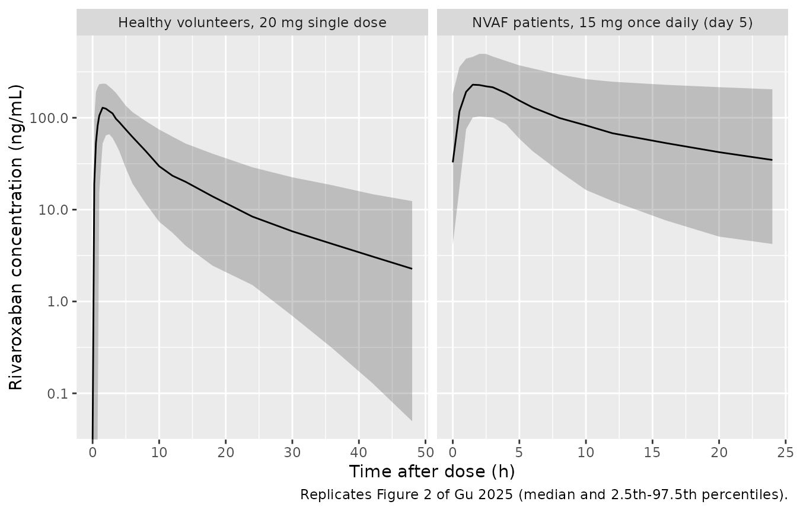

# Rivaroxaban (Gu 2025)

## Model and source

- Citation: Gu F, Tang K, Zhang C, Hu M, Sun J, Yu X, Tian M, Zhang C,
  Chen Y. Population pharmacokinetic analysis of rivaroxaban in healthy
  volunteers and patients with radiofrequency ablation of non-valvular
  atrial fibrillation in China. Front Pharmacol. 2025;16:1562259.
  <doi:10.3389/fphar.2025.1562259>
- Description: Two-compartment oral population PK model with first-order
  absorption, an absorption lag time, and dose-level-dependent relative
  bioavailability for rivaroxaban in Chinese healthy volunteers and
  patients treated with radiofrequency ablation for non-valvular atrial
  fibrillation (Gu 2025)
- Article: <https://doi.org/10.3389/fphar.2025.1562259>
- Supplementary material (Supplementary Table S1, Sanger-sequencing
  primers only – no model parameters):
  <https://www.frontiersin.org/articles/10.3389/fphar.2025.1562259/full#supplementary-material>

Rivaroxaban is an oral direct factor Xa inhibitor. Gu 2025 pooled a
bioequivalence study in healthy Chinese volunteers with a real-world
cohort of Chinese patients treated by radiofrequency ablation (RFA) for
non-valvular atrial fibrillation (NVAF), and fitted a two-compartment
model with first-order absorption, an absorption lag time,
dose-level-dependent relative bioavailability, and first-order
elimination.

## Population

Two studies contributed 1,506 rivaroxaban plasma concentrations from 141
Chinese participants (Gu 2025 Table 1, Results section 3.1):

- **Study 1** (CTR20202135) – a single-centre, single-dose, randomized,
  two-formulation, four-period crossover bioequivalence study in **36
  healthy volunteers** (32 male / 4 female; age 31.6 +/- 8.9 years,
  range 18-48; weight 64.2 +/- 5.8 kg; Cockcroft-Gault creatinine
  clearance 125 +/- 17.8 mL/min, range 91.3-161). Each participant
  received a single fasted oral 20 mg dose per period, with 18 samples
  over 48 h; only the reference-formulation (Xarelto) periods
  contributed the 1,296 modelled concentrations.
- **Study 2** (ChiCTR2500095918) – a real-world single-centre study of
  **105 hospitalized NVAF patients** after RFA (60 male / 45 female; age
  64.1 +/- 8.4 years, range 34-82; weight 67.4 +/- 11.4 kg, range
  42.0-107.0; creatinine clearance 86.7 +/- 24.3 mL/min, range
  33.6-158). Patients took 10 mg (n = 2), 15 mg (n = 101), or 20 mg (n
  = 2) once daily for at least 2 days and contributed one trough (30 min
  pre-dose) and one peak (2-4 h post-dose) sample each, i.e. 210
  concentrations. P-glycoprotein inhibitors (amiodarone, propafenone,
  felodipine) were co-administered in 56 patients (53.3%) and CYP3A4
  inhibitors in 6 (5.7%).

Ten SNPs across *CYP3A4*, *CYP3A5*, *ABCB1* and *ABCG2* were genotyped
in every participant (Gu 2025 Table 2). The whole analysis population is
Chinese.

The same information is available programmatically via the model’s
`population` metadata
(`readModelDb("Gu_2025_rivaroxaban")()$population`).

## Source trace

Every `ini()` entry in
`inst/modeldb/specificDrugs/Gu_2025_rivaroxaban.R` carries an in-file
comment naming its source location; the table below collects them.

| Equation / parameter | Value | Source location |
|----|----|----|
| `lcl` (patient reference) | 8.35 L/h | Table 3, row `CL/F (L/h)`, “Clearance of patient” (%RSE 15.8) |
| `e_dis_healthy_cl` | log(6.48 / 8.35) = -0.2535 | Table 3, “Clearance of healthy volunteer” = 6.48 L/h; Results 3.2 equation legend `TVCL = 6.48 for healthy volunteer, TVCL = 8.35 for patient` |
| `lvc` | 19.7 L | Table 3, row `V2/F (L)` |
| `lka` | 0.46 1/h | Table 3, row `Ka (1/h)` |
| `lq` | 7.64 L/h | Table 3, row `Q/F (L/h)` |
| `lvp` | 71.8 L | Table 3, row `V3/F (L)` |
| `ltlag` | 0.168 h | Table 3, row `ALAG (h)` |
| `lfdepot` | fixed(log(1)) | Table 3, row `F 15mg` = 1 FIX |
| `e_dose_10mg_fdepot` | fixed(log(1.363)) | Table 3, row `F 10mg` = 1.363 FIX; Results 3.2 (“fixed and not estimated in the subsequent models”) |
| `e_dose_20mg_fdepot` | log(0.537) = -0.6218 | Table 3, row `F 20mg` (%RSE 15.6) |
| `e_crcl_cl` | 1.53 | Table 3, row `CL_crcl`; reference 97.7 mL/min from the Results 3.2 equation |
| `e_snp_abcb1_rs1045642_hom_cl` | -0.204 | Results 3.2 equation (`- AA x 0.204`); cross-checks Table 3 row `CL_A642` = 0.815 = exp(-0.204) |
| `etalcl`, `etalvc`, `etalka`, `etalq`, `etalvp`, `etaltlag` | 0.126, 0.350, 0.0773, 0.410, 0.434, 0.602 | Table 3 rows `IIV_CL` 35.5%, `IIV_V2` 59.2%, `IIV_Ka` 27.8%, `IIV_Q` 64%, `IIV_V3` 65.9%, `IIV_ALAG` 77.6%; variance = (pct/100)^2 |
| `propSd` | 0.263 | Table 3, row `delta` (proportional residual error) = 26.3% |
| CL covariate equation `CL_i = TVCL x exp(1.53 x ln(CRCL_i / 97.7) - AA x 0.204 + eta_CL)` | n/a | Results section 3.2, printed final-model equation block |
| Two-compartment ODE structure, first-order absorption + lag | n/a | Results section 3.2 first paragraph; Methods section 2.2 |
| Cockcroft-Gault CRCL definition | n/a | Table 1 footnote a |

Note that the display equations are lost by PDF-to-markdown
preprocessing (they appear as `formula-not-decoded`); the covariate
equation above was read from the PDF page directly.

## Virtual cohort

The original observed data are not public. The cohorts below reproduce
the covariate distributions of Gu 2025 Table 1 and the genotype
frequencies of Table 2 (AA at *ABCB1* rs1045642: 7/36 = 19.4% of healthy
volunteers, 20/105 = 19.0% of patients), and use the two studies’ actual
dosing and sampling designs.

``` r

set.seed(20250529)

n_per_arm <- 100L

# Truncated-normal draw matching a published mean +/- SD and range.
rtrunc_norm <- function(n, mean, sd, lower, upper) {
  out <- numeric(0)
  while (length(out) < n) {
    x <- stats::rnorm(2 * n, mean, sd)
    out <- c(out, x[x >= lower & x <= upper])
  }
  out[seq_len(n)]
}

make_subjects <- function(n, id_offset, healthy, crcl_mean, crcl_sd,
                          crcl_lo, crcl_hi, p_aa) {
  tibble(
    id                      = id_offset + seq_len(n),
    CRCL                    = rtrunc_norm(n, crcl_mean, crcl_sd, crcl_lo, crcl_hi),
    DIS_HEALTHY             = as.numeric(healthy),
    SNP_ABCB1_RS1045642_HOM = stats::rbinom(n, 1L, p_aa)
  )
}

# Study 1: 36 healthy volunteers, single 20 mg oral dose, sampled to 48 h.
hv_subj <- make_subjects(
  n_per_arm, id_offset = 0L, healthy = TRUE,
  crcl_mean = 125, crcl_sd = 17.8, crcl_lo = 91.3, crcl_hi = 161, p_aa = 7 / 36
)
hv_times <- c(0, 0.25, 0.5, 0.75, 1, 1.5, 2, 2.5, 3, 3.5, 4, 5, 6, 8, 10,
              12, 14, 18, 24, 30, 36, 42, 48)

# Study 2: NVAF patients, 15 mg once daily; the trough / peak samples were drawn
# after at least 2 days of dosing, so the profile below is day 5 (steady state).
pt_subj <- make_subjects(
  n_per_arm, id_offset = 1000L, healthy = FALSE,
  crcl_mean = 86.7, crcl_sd = 24.3, crcl_lo = 33.6, crcl_hi = 158, p_aa = 20 / 105
)
pt_dose_times <- seq(0, 96, by = 24)
pt_times <- 96 + c(0, 0.5, 1, 1.5, 2, 2.5, 3, 4, 5, 6, 8, 10, 12, 16, 20, 24)

build_events <- function(subj, dose_mg, dose_times, obs_times, cohort,
                         dose_10mg = 0, dose_20mg = 0) {
  doses <- subj |>
    tidyr::crossing(time = dose_times) |>
    mutate(amt = dose_mg, evid = 1L, cmt = "depot")
  obs <- subj |>
    tidyr::crossing(time = obs_times) |>
    mutate(amt = NA_real_, evid = 0L, cmt = "central")
  bind_rows(doses, obs) |>
    mutate(
      DOSE_10MG = dose_10mg,
      DOSE_20MG = dose_20mg,
      cohort    = cohort
    ) |>
    arrange(id, time, desc(evid)) |>
    as.data.frame()
}

events <- bind_rows(
  build_events(hv_subj, 20, 0, hv_times, "Healthy volunteers, 20 mg single dose",
               dose_20mg = 1),
  build_events(pt_subj, 15, pt_dose_times, pt_times,
               "NVAF patients, 15 mg once daily (day 5)")
)

stopifnot(!anyDuplicated(events[events$evid == 0, c("id", "time")]))
c(subjects = dplyr::n_distinct(events$id), rows = nrow(events))
#> subjects     rows 
#>      200     4500
```

## Simulation

``` r

mod <- readModelDb("Gu_2025_rivaroxaban")

sim <- rxode2::rxSolve(
  mod, events = events,
  keep = c("cohort", "CRCL", "DIS_HEALTHY", "SNP_ABCB1_RS1045642_HOM")
) |>
  as.data.frame()
#> ℹ parameter labels from comments will be replaced by 'label()'

# rxSolve silently drops subjects whose event records are unusable; assert.
stopifnot(dplyr::n_distinct(sim$id) == 2L * n_per_arm)
```

## Replicate published figures

### Figure 2 – concentration-time profiles by cohort

Gu 2025 Figure 2 is a prediction-corrected VPC with the median and 2.5th
/ 97.5th percentiles, on a log concentration axis: 0-48 h after the
single 20 mg dose for healthy volunteers, and 0-24 h after dose for the
sparsely sampled patients. The panels below show the same summary
statistics from the packaged model.

``` r

vpc <- sim |>
  filter(!is.na(Cc)) |>
  mutate(tad = ifelse(cohort == "NVAF patients, 15 mg once daily (day 5)",
                      time - 96, time)) |>
  group_by(cohort, tad) |>
  summarise(
    lo  = quantile(Cc, 0.025),
    mid = quantile(Cc, 0.5),
    hi  = quantile(Cc, 0.975),
    .groups = "drop"
  )

ggplot(vpc, aes(tad, mid)) +
  geom_ribbon(aes(ymin = lo, ymax = hi), alpha = 0.25) +
  geom_line() +
  facet_wrap(~cohort, scales = "free_x") +
  scale_y_log10() +
  labs(x = "Time after dose (h)", y = "Rivaroxaban concentration (ng/mL)",
       caption = "Replicates Figure 2 of Gu 2025 (median and 2.5th-97.5th percentiles).")
#> Warning in scale_y_log10(): log-10 transformation introduced infinite values.
#> log-10 transformation introduced infinite values.
#> log-10 transformation introduced infinite values.
#> log-10 transformation introduced infinite values.
```



The simulated healthy-volunteer median peaks near 2 h and then falls
away faster than the observed median in Gu 2025 Figure 2. The block
below quantifies that: the observed median of the healthy-volunteer
panel was digitised against the figure’s own log gridlines (1, 10, 100,
1000 ng/mL) and time axis, and is compared with the typical-value
profile evaluated at two creatinine clearances – the cohort mean of 125
mL/min (Table 1), and the covariate reference of 97.7 mL/min at which
the CRCL term equals 1 and CL/F is exactly the 6.48 L/h that Table 3
reports as the healthy-volunteer typical clearance.

``` r

hv_scen <- tibble::tibble(id = 1:2, CRCL = c(125, 97.7))
hv_t <- c(seq(0, 6, by = 0.05), seq(6.25, 48, by = 0.25))

hv_events <- bind_rows(
  hv_scen |> mutate(time = 0, amt = 20, evid = 1L, cmt = "depot"),
  hv_scen |> tidyr::crossing(time = hv_t) |>
    mutate(amt = NA_real_, evid = 0L, cmt = "central")
) |>
  mutate(DIS_HEALTHY = 1, SNP_ABCB1_RS1045642_HOM = 0,
         DOSE_10MG = 0, DOSE_20MG = 1) |>
  arrange(id, time, desc(evid)) |>
  as.data.frame()

hv_typ <- rxode2::rxSolve(rxode2::zeroRe(mod), events = hv_events, omega = NA,
                          keep = "CRCL") |>
  as.data.frame()
#> ℹ parameter labels from comments will be replaced by 'label()'
#> Warning: multi-subject simulation without without 'omega'
hv_typ <- hv_typ[, !duplicated(names(hv_typ))]
stopifnot(dplyr::n_distinct(hv_typ$id) == 2L)

digitised <- tibble::tribble(
  ~tad, ~observed_median,
  2.8,  153,
  14,   24,
  24,   17,
  36,   8.2,
  48,   4.7
)

hv_lab <- function(crcl) {
  ifelse(crcl > 100, "CL/F at CRCL 125 (cohort mean)",
         "CL/F at CRCL 97.7 (covariate reference)")
}

hv_peak <- hv_typ |>
  group_by(crcl_label = hv_lab(CRCL)) |>
  summarise(tad = 2.8, Cc = max(Cc), .groups = "drop")

bind_rows(
  hv_peak,
  hv_typ |>
    filter(time %in% c(14, 24, 36, 48)) |>
    transmute(crcl_label = hv_lab(CRCL), tad = time, Cc)
) |>
  tidyr::pivot_wider(names_from = crcl_label, values_from = Cc) |>
  left_join(digitised, by = "tad") |>
  mutate(across(where(is.numeric), ~ round(.x, 1))) |>
  rename(
    "Time after dose (h)"                      = tad,
    "Gu 2025 Figure 2 observed median (ng/mL)" = observed_median
  ) |>
  knitr::kable(caption = "Healthy-volunteer typical-value profile at two creatinine clearances vs the observed median digitised from Gu 2025 Figure 2. The first row compares the peak of each simulated curve (Tmax 1.8-2.0 h) with the peak of the published median (about 2.8 h).")
```

| Time after dose (h) | CL/F at CRCL 125 (cohort mean) | CL/F at CRCL 97.7 (covariate reference) | Gu 2025 Figure 2 observed median (ng/mL) |
|---:|---:|---:|---:|
| 2.8 | 144.1 | 162.2 | 153.0 |
| 14.0 | 17.8 | 28.3 | 24.0 |
| 24.0 | 9.7 | 17.3 | 17.0 |
| 36.0 | 5.0 | 10.1 | 8.2 |
| 48.0 | 2.6 | 5.9 | 4.7 |

Healthy-volunteer typical-value profile at two creatinine clearances vs
the observed median digitised from Gu 2025 Figure 2. The first row
compares the peak of each simulated curve (Tmax 1.8-2.0 h) with the peak
of the published median (about 2.8 h). {.table}

At the covariate reference the model tracks the published median closely
(within about 25% at every time, and within 5% at 2.8 and 24 h). At the
cohort’s actual creatinine clearance the printed exponent of 1.53 raises
CL/F from 6.48 to 9.45 L/h and the predicted terminal concentrations
fall to about half of the published median. This is the first of three
internal inconsistencies in Gu 2025 that all point the same way; see
“Assumptions and deviations”.

### Figure 3 – covariate effects on AUC(0-inf)

Gu 2025 Figure 3 is a forest plot of AUC(0-inf) geometric-mean ratios
computed as `dose / CL` from the **post hoc individual** clearances of
the 105 patients, all evaluated at a 15 mg dose (Methods section 2.4):
1.11 for mild and 1.58 for moderate renal impairment versus normal renal
function, and 1.25 for the AA genotype of *ABCB1* rs1045642 versus the
other genotypes.

The genotype contrast is reproducible from the printed covariate
equation because it is a single multiplicative factor. The renal
contrasts are not: the paper does not publish the creatinine clearance
of each renal subgroup, and the typical-value prediction from the
exponent 1.53 is far steeper than the published ratios (see “Assumptions
and deviations”).

``` r

# Typical-value clearance from the printed Gu 2025 covariate equation.
cl_typical <- function(crcl, aa = 0, healthy = 0) {
  8.35 * (crcl / 97.7)^1.53 * exp(-0.204 * aa) * exp(log(6.48 / 8.35) * healthy)
}

# Genotype contrast: AUC ratio is the inverse clearance ratio at fixed CRCL.
geno_ratio <- cl_typical(97.7, aa = 0) / cl_typical(97.7, aa = 1)

# Renal contrast at the midpoints of the usual clinical bands, and the CRCL
# ratio that the published AUC ratios imply under the exponent 1.53.
renal <- tibble::tribble(
  ~group,                ~crcl_midpoint, ~published_ratio,
  "Normal (>= 90)",      105,            1.00,
  "Mild (60-89)",        75,             1.11,
  "Moderate (30-59)",    45,             1.58
) |>
  mutate(
    model_ratio  = cl_typical(105) / cl_typical(crcl_midpoint),
    implied_crcl = 105 / published_ratio^(1 / 1.53)
  )

renal |>
  mutate(across(c(model_ratio, implied_crcl), ~ round(.x, 2))) |>
  rename(
    "Renal group (mL/min)"                      = group,
    "Assumed group CRCL (mL/min)"               = crcl_midpoint,
    "Gu 2025 Figure 3 AUC ratio"                = published_ratio,
    "Typical-value AUC ratio from the equation" = model_ratio,
    "CRCL implied by the published ratio"       = implied_crcl
  ) |>
  knitr::kable(caption = "Gu 2025 Figure 3 renal subgroups vs the typical-value prediction of the printed CL equation.")
```

| Renal group (mL/min) | Assumed group CRCL (mL/min) | Gu 2025 Figure 3 AUC ratio | Typical-value AUC ratio from the equation | CRCL implied by the published ratio |
|:---|---:|---:|---:|---:|
| Normal (\>= 90) | 105 | 1.00 | 1.00 | 105.00 |
| Mild (60-89) | 75 | 1.11 | 1.67 | 98.08 |
| Moderate (30-59) | 45 | 1.58 | 3.66 | 77.87 |

Gu 2025 Figure 3 renal subgroups vs the typical-value prediction of the
printed CL equation. {.table style="width:100%;"}

``` r


tibble::tibble(
  contrast   = "ABCB1 rs1045642 AA vs non-AA",
  model      = round(geno_ratio, 3),
  published  = 1.25
) |>
  rename(
    "Contrast"                             = contrast,
    "Typical-value AUC ratio (model)"       = model,
    "Gu 2025 Figure 3 geometric-mean ratio" = published
  ) |>
  knitr::kable(caption = "Genotype effect on AUC(0-inf): typical value vs Gu 2025 Figure 3.")
```

| Contrast | Typical-value AUC ratio (model) | Gu 2025 Figure 3 geometric-mean ratio |
|:---|---:|---:|
| ABCB1 rs1045642 AA vs non-AA | 1.226 | 1.25 |

Genotype effect on AUC(0-inf): typical value vs Gu 2025 Figure 3.
{.table}

### Figure 4 – patient clearance distribution

Gu 2025 Figure 4 plots the post hoc individual clearances of the 105
patients against concomitant CYP3A4 and P-gp inhibitor use. The boxplot
medians sit at roughly 9 L/h in every panel. The typical-value clearance
implied by the covariate model over the same cohort’s creatinine
clearance distribution is lower, because the patients’ mean CRCL of 86.7
mL/min sits below the 97.7 mL/min reference and the exponent 1.53
amplifies that gap.

``` r

pt_cl <- pt_subj |>
  mutate(cl_typ = cl_typical(CRCL, aa = SNP_ABCB1_RS1045642_HOM, healthy = 0))

tibble::tibble(
  quantity = c("Typical CL/F at the covariate reference (Table 3)",
               "Median typical CL/F over the simulated patient cohort",
               "Median post hoc individual CL/F read from Gu 2025 Figure 4"),
  value    = c(8.35, round(median(pt_cl$cl_typ), 2), 9.2)
) |>
  rename("Quantity" = quantity, "CL/F (L/h)" = value) |>
  knitr::kable(caption = "Patient clearance: covariate-model typical values vs Gu 2025 Figure 4.")
```

| Quantity                                                   | CL/F (L/h) |
|:-----------------------------------------------------------|-----------:|
| Typical CL/F at the covariate reference (Table 3)          |       8.35 |
| Median typical CL/F over the simulated patient cohort      |       6.63 |
| Median post hoc individual CL/F read from Gu 2025 Figure 4 |       9.20 |

Patient clearance: covariate-model typical values vs Gu 2025 Figure 4.
{.table}

## PKNCA validation

The paper reports AUC(0-inf) for the three patient dose levels, computed
as `dose / CL` at the typical patient clearance (Gu 2025 Discussion).
The scenarios below reproduce those conditions deterministically: a
typical NVAF patient (`DIS_HEALTHY = 0`, `CRCL = 97.7` mL/min, non-AA
genotype) receiving a single 10, 15, or 20 mg dose, plus the typical
healthy volunteer of Study 1 (20 mg, `CRCL = 125` mL/min).

``` r

scenarios <- tibble::tribble(
  ~scenario,                  ~amt, ~healthy, ~crcl, ~d10, ~d20,
  "Patient, 10 mg",           10,   0,        97.7,  1,    0,
  "Patient, 15 mg",           15,   0,        97.7,  0,    0,
  "Patient, 20 mg",           20,   0,        97.7,  0,    1,
  "Healthy volunteer, 20 mg", 20,   1,        125,   0,    1
) |>
  mutate(id = seq_len(n()))

nca_times <- c(seq(0, 6, by = 0.1), seq(6.25, 24, by = 0.25), seq(25, 168, by = 1))

nca_events <- bind_rows(
  scenarios |> mutate(time = 0, evid = 1L, cmt = "depot"),
  scenarios |> select(-amt) |> tidyr::crossing(time = nca_times) |>
    mutate(amt = NA_real_, evid = 0L, cmt = "central")
) |>
  transmute(
    id, time, amt, evid, cmt, scenario,
    CRCL = crcl, DIS_HEALTHY = healthy,
    SNP_ABCB1_RS1045642_HOM = 0,
    DOSE_10MG = d10, DOSE_20MG = d20
  ) |>
  arrange(id, time, desc(evid)) |>
  as.data.frame()

sim_typical <- rxode2::rxSolve(
  rxode2::zeroRe(mod), events = nca_events, omega = NA,
  keep = c("scenario", "CRCL", "DIS_HEALTHY", "DOSE_10MG", "DOSE_20MG")
) |>
  as.data.frame()
#> ℹ parameter labels from comments will be replaced by 'label()'
#> Warning: multi-subject simulation without without 'omega'

stopifnot(dplyr::n_distinct(sim_typical$id) == nrow(scenarios))
stopifnot(all(sim_typical$Cc >= 0, na.rm = TRUE))
```

``` r

sim_nca <- sim_typical |>
  filter(!is.na(Cc)) |>
  select(id, time, Cc, scenario)

# Guarantee a time = 0 record per subject (Cc = 0 pre-dose, extravascular).
sim_nca <- bind_rows(
  sim_nca,
  sim_nca |> distinct(id, scenario) |> mutate(time = 0, Cc = 0)
) |>
  distinct(id, scenario, time, .keep_all = TRUE) |>
  arrange(id, scenario, time)

conc_obj <- PKNCA::PKNCAconc(sim_nca, Cc ~ time | scenario + id)

dose_df <- nca_events |>
  filter(evid == 1L) |>
  select(id, time, amt, scenario)
dose_obj <- PKNCA::PKNCAdose(dose_df, amt ~ time | scenario + id)

intervals <- data.frame(
  start      = 0,
  end        = Inf,
  cmax       = TRUE,
  tmax       = TRUE,
  aucinf.obs = TRUE,
  half.life  = TRUE
)

nca_res <- PKNCA::pk.nca(PKNCA::PKNCAdata(conc_obj, dose_obj, intervals = intervals))
```

### Structural identity: AUC(0-inf) = F x dose / CL

For a linear model the NCA AUC(0-inf) must equal the relative
bioavailability times dose divided by apparent clearance. This is a
per-scenario identity, so it is asserted exactly rather than compared by
eye.

``` r

f_rel <- function(d10, d20) 1.363^d10 * 0.537^d20

identity_tbl <- scenarios |>
  mutate(
    cl_pred    = cl_typical(crcl, aa = 0, healthy = healthy),
    auc_theory = f_rel(d10, d20) * amt / cl_pred * 1000
  ) |>
  left_join(
    as.data.frame(nca_res) |>
      filter(PPTESTCD == "aucinf.obs") |>
      select(scenario, auc_nca = PPORRES),
    by = "scenario"
  ) |>
  mutate(pct_diff = 100 * (auc_nca - auc_theory) / auc_theory)

stopifnot(max(abs(identity_tbl$pct_diff)) < 1)

identity_tbl |>
  transmute(
    scenario,
    cl_pred    = round(cl_pred, 2),
    auc_theory = round(auc_theory),
    auc_nca    = round(auc_nca),
    pct_diff   = round(pct_diff, 3)
  ) |>
  rename(
    "Scenario"                        = scenario,
    "CL/F (L/h)"                      = cl_pred,
    "F x dose / CL (ng*h/mL)"         = auc_theory,
    "PKNCA AUC(0-inf) (ng*h/mL)"      = auc_nca,
    "Difference (%)"                  = pct_diff
  ) |>
  knitr::kable(caption = "Per-scenario AUC identity check (all within 1%).")
```

| Scenario | CL/F (L/h) | F x dose / CL (ng\*h/mL) | PKNCA AUC(0-inf) (ng\*h/mL) | Difference (%) |
|:---|---:|---:|---:|---:|
| Patient, 10 mg | 8.35 | 1632 | 1632 | 0.006 |
| Patient, 15 mg | 8.35 | 1796 | 1797 | 0.006 |
| Patient, 20 mg | 8.35 | 1286 | 1286 | 0.006 |
| Healthy volunteer, 20 mg | 9.45 | 1137 | 1137 | 0.006 |

Per-scenario AUC identity check (all within 1%). {.table
style="width:100%;"}

### Comparison against the published exposures

Gu 2025 reports AUC(0-inf) of 1,198 / 1,796 / 2,395 ng\*h/mL for the 10
/ 15 / 20 mg patient doses (Discussion), obtained from the formula
`dose / CL` with CL = 8.35 L/h. That formula omits the dose-level
relative bioavailability the same paper estimates (1.363 at 10 mg, 0.537
at 20 mg), so the packaged model agrees exactly at the 15 mg reference
dose – where F is fixed to 1 by definition and the paper’s own covariate
analysis was anchored (“all subjects receiving a consistent dose of 15
mg”, Methods 2.4) – and differs at the other two dose levels by exactly
the relative-bioavailability factor.

``` r

published <- tibble::tribble(
  ~scenario,        ~aucinf.obs,
  "Patient, 10 mg", 1198,
  "Patient, 15 mg", 1796,
  "Patient, 20 mg", 2395
)

cmp <- nlmixr2lib::ncaComparisonTable(
  simulated     = nca_res,
  reference     = published,
  by            = "scenario",
  params        = "aucinf.obs",
  units         = c(aucinf.obs = "ng*h/mL"),
  tolerance_pct = 20
)

knitr::kable(
  cmp,
  caption = "Simulated vs published AUC(0-inf). * differs from the published value by >20%; the 10 mg and 20 mg rows differ by exactly the relative bioavailability factor (1.363 and 0.537) that the paper's dose/CL formula omits."
)
```

| NCA parameter           | scenario       | Reference | Simulated | % diff   |
|:------------------------|:---------------|:----------|:----------|:---------|
| AUC0-∞ (obs) (ng\*h/mL) | Patient, 10 mg | 1200      | 1630      | +36.3%\* |
| AUC0-∞ (obs) (ng\*h/mL) | Patient, 15 mg | 1800      | 1800      | +0.0%    |
| AUC0-∞ (obs) (ng\*h/mL) | Patient, 20 mg | 2400      | 1290      | -46.3%\* |

Simulated vs published AUC(0-inf). \* differs from the published value
by \>20%; the 10 mg and 20 mg rows differ by exactly the relative
bioavailability factor (1.363 and 0.537) that the paper’s dose/CL
formula omits. {.table}

``` r

as.data.frame(nca_res) |>
  filter(PPTESTCD %in% c("cmax", "tmax", "half.life")) |>
  select(scenario, PPTESTCD, PPORRES) |>
  tidyr::pivot_wider(names_from = PPTESTCD, values_from = PPORRES) |>
  mutate(across(where(is.numeric), ~ round(.x, 2))) |>
  rename(
    "Scenario"                 = scenario,
    "Cmax (ng/mL)"             = cmax,
    "Tmax (h)"                 = tmax,
    "Terminal half-life (h)"   = half.life
  ) |>
  knitr::kable(caption = "Typical-value NCA summary from the packaged model.")
```

| Scenario                 | Cmax (ng/mL) | Tmax (h) | Terminal half-life (h) |
|:-------------------------|-------------:|---------:|-----------------------:|
| Healthy volunteer, 20 mg |       144.15 |      1.8 |                  12.42 |
| Patient, 10 mg           |       190.66 |      1.9 |                  13.25 |
| Patient, 15 mg           |       209.82 |      1.9 |                  13.25 |
| Patient, 20 mg           |       150.23 |      1.9 |                  13.25 |

Typical-value NCA summary from the packaged model. {.table}

The typical-value Cmax of the 20 mg healthy volunteer (144 ng/mL at 1.8
h) is close to the peak of the observed median in Gu 2025 Figure 2
(about 153 ng/mL near 2.8 h), and the terminal half-life sits just above
the 5-13 h range quoted for rivaroxaban in the Gu 2025 Introduction.

## Assumptions and deviations

- **IIV reporting scale.** Gu 2025 Table 3 reports each IIV as a bare
  percentage with no stated convention. The percentages are read as
  `omega = pct / 100` (so `omega^2 = (pct/100)^2`) rather than as
  lognormal CVs (`omega^2 = log(1 + CV^2)`), for two reasons: the same
  “(%)” column of the same table reports the proportional residual error
  as 26.3%, where the only sensible computation is
  `sqrt(sigma^2) x 100`; and propagating each row’s own %RSE on the
  printed percentage scale reproduces the published bootstrap intervals
  better than the lognormal-CV transform does (for the largest IIV,
  `IIV_ALAG` 77.6% with %RSE 13.7, the printed-scale propagation gives
  56.8-98.4 against a published bootstrap interval of 52.2-95.4, versus
  55.4-108.7 under the lognormal-CV reading). The choice changes omega
  by at most 12% (on `IIV_ALAG`) and by 3% on `IIV_CL`.

- **The published creatinine-clearance exponent of 1.53 is not
  consistent with three of the paper’s own figures.** The exponent is
  encoded exactly as published, but users simulating renally-impaired or
  supranormal-CRCL subjects should know that it produces a much steeper
  renal gradient than Gu 2025’s own results imply:

  1.  *Figure 2 (VPC).* The healthy-volunteer cohort has a mean
      creatinine clearance of 125 mL/min, where the exponent inflates
      CL/F from 6.48 to 9.45 L/h. The resulting typical profile falls to
      roughly half the observed median from 24 h onward. Setting the
      CRCL term to 1 (CL/F = 6.48 L/h, the healthy-volunteer typical of
      Table 3) reproduces the published median within about 25% at every
      digitised time point.
  2.  *Figure 3 (covariate forest plot).* At the midpoints of the
      conventional renal bands the typical-value AUC ratios are about
      1.7 (mild) and 3.7 (moderate) versus normal renal function,
      against the published 1.11 and 1.58. Inverting the published
      ratios under the exponent 1.53 implies subgroup creatinine
      clearances of about 98 and 78 mL/min, which fall in the “normal”
      and “mild” bands rather than in the mild and moderate bands they
      are supposed to represent.
  3.  *Figure 4 (patient clearance distribution).* The post hoc
      individual clearances of the 105 patients have a median near 9
      L/h, whereas the covariate model evaluated over the same cohort’s
      creatinine clearances gives a typical value near 6.5 L/h.

  Checks 1 and 3 pull in opposite directions (the model is too fast for
  the high-CRCL healthy cohort and too slow for the lower-CRCL patient
  cohort), which is the signature of a covariate slope steeper than the
  data support – plausibly because creatinine clearance is strongly
  confounded with study and age here (healthy volunteers: 31.6 years,
  125 mL/min; patients: 64.1 years, 86.7 mL/min). An exponent near 0.5
  would reconcile all three figures, but no such value appears anywhere
  in the paper, so none is used: the value 1.53 is printed twice, in
  Table 3 (`CL_crcl`, %RSE 11.9, bootstrap median 1.53, interval 1-1.97)
  and in the Results section 3.2 equation, and parameters are never
  tuned to a validation target. Figures 3 and 4 aggregate **post hoc
  individual** clearances (Methods section 2.4), which shrink toward
  each subject’s own sparse data and can therefore look flatter than the
  typical value model; that explanation does not cover check 1, which
  compares against the paper’s own model-simulated VPC band. The paper
  publishes neither the per-subgroup creatinine clearances nor the
  individual parameter table needed to settle it, so the discrepancy is
  documented rather than resolved.

- **Genotype nomenclature.** The Gu 2025 Discussion calls the AA stratum
  of *ABCB1* rs1045642 the “wild genotype”, which conflicts with the
  standard dbSNP orientation (A is the c.3435T variant allele) and with
  the paper’s own allele frequencies (G = 0.60, A = 0.40 in the patient
  cohort). The model file encodes the covariate exactly as the printed
  equation defines it (`AA = 1` for the AA genotype, 0 otherwise) under
  the canonical name `SNP_ABCB1_RS1045642_HOM`, and does not depend on
  the prose label.

- **Residual error.** Methods section 2.2 describes a combined
  proportional plus additive residual model, but Table 3 of the final
  model reports only the proportional term (26.3%), so only `propSd` is
  encoded.

- **Covariates screened but not retained.** Sex, age, height, weight,
  WBC, RBC, platelets, glucose, creatinine, ALT, AST, calcium,
  potassium, creatine kinase, and nine of the ten genotyped SNPs were
  screened and not retained; weight entered the full model on the
  peripheral volume but was removed in backward elimination and no point
  estimate is published for it. Concomitant P-gp inhibitor use was
  associated with lower post hoc clearance (Figure 4, p = 0.046) but was
  not carried into the final model. All of these are recorded in the
  model file’s `covariatesDataExcluded` list so the screen is documented
  without adding unused covariates.

- **Steady-state patient panel.** Gu 2025 Figure 2 plots the patient
  observations against time after dose without stating the dosing day;
  the patient panel here uses day 5 of 15 mg once daily, consistent with
  the “minimum of 2 days of rivaroxaban administration” enrollment rule
  in Methods section 2.1.2.

- **Virtual cohort.** Creatinine clearance is drawn from a normal
  distribution truncated at the published range, matching the Table 1
  mean and SD per study; the *ABCB1* rs1045642 AA indicator is drawn as
  a Bernoulli variable at the Table 2 genotype frequency. Weight, age
  and sex are not needed by the model (they enter only through the
  Cockcroft-Gault creatinine clearance, which is simulated directly), so
  they are not carried in the cohort.

- **Supplementary material.** The Gu 2025 electronic supplementary
  material (Supplementary Table S1) contains only the Sanger-sequencing
  primer sequences; it holds no model parameters. No erratum or
  corrigendum exists for this article (Europe PMC comment/correction
  list checked 2026-08-16).
