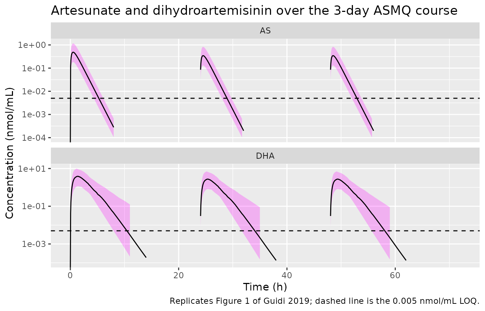
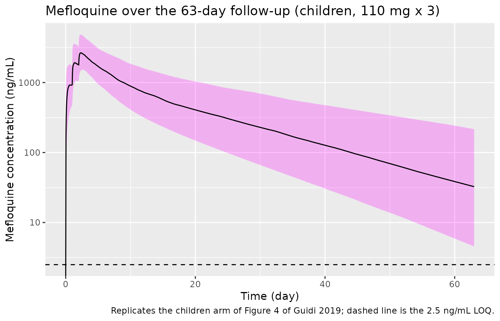

# Artesunate-mefloquine in African children (Guidi 2019)

## Model and source

Guidi 2019 fitted **two independent population PK models** to the same
paediatric trial of the fixed-dose artesunate-mefloquine (ASMQ)
dispersible tablet, so the paper contributes two model files to this
library.

- Citation: Guidi M, Mercier T, Aouri M, Decosterd LA, Csajka C, Ogutu
  B, Carn G, Kiechel JR. Population pharmacokinetics and
  pharmacodynamics of the artesunate-mefloquine fixed dose combination
  for the treatment of uncomplicated falciparum malaria in African
  children. Malaria Journal 2019;18:139. <doi:10.1186/s12936-019-2754-6>
- Article: <https://doi.org/10.1186/s12936-019-2754-6>

| Model | Structure |
|----|----|
| `Guidi_2019_artesunate` | Joint artesunate (AS) + dihydroartemisinin (DHA) parent-metabolite model, one compartment each |
| `Guidi_2019_mefloquine` | Two-compartment mefloquine (MQ) model with day-dependent first-order absorption |

``` r

# readModelDb() returns the model *function*; rxode2() evaluates it into the
# rxUi object whose $state / $predDf can be inspected below.
mod_as <- rxode2::rxode2(readModelDb("Guidi_2019_artesunate"))
#> ℹ parameter labels from comments will be replaced by 'label()'
mod_mq <- rxode2::rxode2(readModelDb("Guidi_2019_mefloquine"))
#> ℹ parameter labels from comments will be replaced by 'label()'
```

## Population

The trial randomised 473 African children aged 6-59 months with
uncomplicated *Plasmodium falciparum* malaria to the ASMQ arm across six
centres (three in Tanzania, two in Burkina Faso, one in Kenya). Both
models were **developed** on the first 50 Kenyan children enrolled, who
underwent intensive sampling; 48 remained after exclusions (Table 1,
“Model-building dataset”). That cohort had a median age of 2.6 years
(range 0.6-5.0), a median body weight of 12 kg (range 7-17), and was 60%
female.

Dosing was one or two dispersible tablets of 25 mg AS / 55 mg MQ once
daily for three consecutive days: **one** tablet for children aged 6-11
months and **two** for children aged 12-59 months.

The two models differ sharply in how well they are supported by data,
and this governs how tightly the checks below are drawn:

- **Mefloquine** had 216 concentrations, *none* below the 2.5 ng/mL
  limit of quantification, a median of 5 samples per child, and was
  **externally validated** on 538 further concentrations from 378
  children at all six centres (individual-level bias 0%, CI95 -2 to 1%;
  precision 16%).
- **Artesunate / DHA** had only 117 AS and 134 DHA concentrations of
  which **71% and 57% respectively were below the limit of
  quantification** (0.005 nmol/mL), giving a median of 1 quantifiable AS
  and 2 quantifiable DHA samples per child. No external validation was
  possible “because of the very fast rate of AS and DHA elimination and
  the selection of the trial sampling times”, and the authors state
  plainly that the prediction-corrected VPCs “evidence model
  misspecification”, judging the model acceptable only given the paucity
  of data.

The same information is available programmatically via
`readModelDb("Guidi_2019_artesunate")()$population`.

## Source trace

Every `ini()` entry carries an in-file comment pointing at its source
location; they are collected here for review.

### Artesunate / dihydroartemisinin (`Guidi_2019_artesunate`)

| Equation / parameter | Value | Source location |
|----|----|----|
| `lfdepot` (F1) | 100% fixed | Table 2, row `F1 (%)` |
| `e_age_fdepot` | -0.68 | Table 2, row `theta age F1` (RSE 19%) |
| `e_day2_fdepot` | -0.29 | Table 2, row `theta day F1` (RSE 54%) |
| `lka` | 3.2 /h fixed | Table 2; Methods “Structural and statistical model” (mean of published AS estimates) |
| `lcl` (AS CL/F) | 146 L/h | Table 2, row `CL (L/h)` (RSE 20%) |
| `lvc` (AS VC/F) | 139 L | Table 2, row `VC (L)` (RSE 23%) |
| `lcl_dihydroart` (CLM/F) | 11 L/h at 12.2 kg | Table 2, row `CLM (L/h)` (RSE 15%) |
| `lvc_dihydroart` (VM/F) | 11 L at 12.2 kg | Table 2, row `VM (L)` (RSE 20%) |
| `e_wt_cl_dihydroart` | 0.75 fixed | Table 2 footnote d; Methods “Covariate analysis” |
| `e_wt_vc_dihydroart` | 1 fixed | Table 2 footnote d; Methods “Covariate analysis” |
| `etalfdepot` | CV 56% | Table 2, BSV column for F1 (RSE 16%) |
| `etalvc_dihydroart` | CV 60% | Table 2, BSV column for VM (RSE 29%) |
| `propSd` / `addSd` (AS) | 79% / 0.0023 nmol/mL | Table 2, `sigma prop,AS` / `sigma add,AS` |
| `propSd_dihydroart` / `addSd_dihydroart` | 60% / 0.0042 nmol/mL | Table 2, `sigma prop,DHA` / `sigma add,DHA` |
| Age effect form `(1 + theta*(AGE-MAGE)/MAGE)`, MAGE = 2.6 y | n/a | Table 2 footnote (legend text) |
| Day effect form `(1 + theta*Q1)`, Q1 = 0 first day | n/a | Table 2 footnote (legend text) |
| Allometry `CLM*(BW/MBW)^0.75`, `VM*BW/MBW`, MBW = 12.2 kg | n/a | Table 2 footnote d |
| AS eliminated only by conversion to DHA | n/a | Methods “Structural and statistical model” |

### Mefloquine (`Guidi_2019_mefloquine`)

| Equation / parameter | Value | Source location |
|----|----|----|
| `lfdepot` (F1) | 1 FIX | Table 3, row `F1` |
| `lcl` | 0.45 L/h at 12.2 kg | Table 3, row `CL (L/h)` (RSE 7%) |
| `lvc` | 95 L at 12.2 kg | Table 3, row `VC (L)` (RSE 7%) |
| `lq` | 0.35 L/h at 12.2 kg | Table 3, row `Q (L/h)` (RSE 28%) |
| `lvp` | 60 L at 12.2 kg | Table 3, row `VP (L)` (RSE 9%) |
| `lka_day1` | 0.17 /h | Table 3, row `Ka (h-1) DAY = 1` (RSE 17%) |
| `lka_day2` | 0.40 /h | Table 3, row `Ka (h-1) DAY > 1` (RSE 22%) |
| `e_age_ka` | -0.67 | Table 3, row `theta AGE Ka` (RSE 18%) |
| `e_wt_cl_q` | 0.75 fixed | Table 3 footnote d; Methods “Covariate analysis” |
| `e_wt_vc_vp` | 1 fixed | Table 3 footnote d; Methods “Covariate analysis” |
| `etalfdepot` | CV 28% | Table 3, BSV column for F1 (RSE 15%) |
| `etalcl` | CV 39% | Table 3, BSV column for CL (RSE 17%) |
| `etalka` | CV 91% | Table 3, BSV column for Ka (RSE 12%) |
| `propSd` | 21% CV | Table 3, row `sigma prop` (RSE 13%) |
| Age effect form `(1 + theta*(AGE-MAGE)/MAGE)`, MAGE = 2.6 y | n/a | Table 3 footnote (legend text) |
| Allometry on CL, Q (0.75) and VC, VP (1), MBW = 12.2 kg | n/a | Table 3 footnote d |

### Validation targets (Table 4)

``` r

published_table4 <- tibble::tribble(
  ~analyte, ~quantity,            ~median, ~lo,    ~hi,     ~units,
  "AS",     "Cmax",                 0.52,   0.17,   1.43,   "nmol/mL",
  "AS",     "tmax",                 0.52,   NA,     NA,     "h",
  "AS",     "t1/2",                40,      NA,     NA,     "min",
  "AS",     "AUC0-24 (day 0)",      0.34,   0.12,   0.93,   "mg/L*h",
  "AS",     "AUC0-24 (day 2)",      0.23,   0.08,   0.64,   "mg/L*h",
  "DHA",    "Cmax",                 3.9,    1.0,   11.4,    "nmol/mL",
  "DHA",    "tmax",                 1.4,    1.0,    1.7,    "h",
  "DHA",    "t1/2",                40,     20,     81,      "min",
  "DHA",    "AUC0-24 (day 0)",      3.30,   0.88,   9.30,   "mg/L*h",
  "DHA",    "AUC0-24 (day 2)",      2.20,   0.60,   6.30,   "mg/L*h",
  "MQ",     "Cmax",              2874,   1099,   4994,      "ng/mL",
  "MQ",     "tmax",                56,     35,     62,      "h",
  "MQ",     "t1/2",                12,      9,     24,      "day",
  "MQ",     "AUC0-inf",           650,    251,   1619,      "mg/L*h"
)
knitr::kable(published_table4, caption = "Guidi 2019 Table 4, transcribed.")
```

| analyte | quantity        |  median |      lo |      hi | units   |
|:--------|:----------------|--------:|--------:|--------:|:--------|
| AS      | Cmax            |    0.52 |    0.17 |    1.43 | nmol/mL |
| AS      | tmax            |    0.52 |      NA |      NA | h       |
| AS      | t1/2            |   40.00 |      NA |      NA | min     |
| AS      | AUC0-24 (day 0) |    0.34 |    0.12 |    0.93 | mg/L\*h |
| AS      | AUC0-24 (day 2) |    0.23 |    0.08 |    0.64 | mg/L\*h |
| DHA     | Cmax            |    3.90 |    1.00 |   11.40 | nmol/mL |
| DHA     | tmax            |    1.40 |    1.00 |    1.70 | h       |
| DHA     | t1/2            |   40.00 |   20.00 |   81.00 | min     |
| DHA     | AUC0-24 (day 0) |    3.30 |    0.88 |    9.30 | mg/L\*h |
| DHA     | AUC0-24 (day 2) |    2.20 |    0.60 |    6.30 | mg/L\*h |
| MQ      | Cmax            | 2874.00 | 1099.00 | 4994.00 | ng/mL   |
| MQ      | tmax            |   56.00 |   35.00 |   62.00 | h       |
| MQ      | t1/2            |   12.00 |    9.00 |   24.00 | day     |
| MQ      | AUC0-inf        |  650.00 |  251.00 | 1619.00 | mg/L\*h |

Guidi 2019 Table 4, transcribed. {.table}

## Units and the two unit puzzles in Table 4

Two of the paper’s reported units do not survive a dimensional check,
and both are resolved here rather than papered over.

**1. The AS/DHA AUC column header reads `ng/L/h`, but the values are
`mg/L*h`.** The AS/DHA analysis was performed in molar units, so this
model file holds amounts in `umol` and volumes in `L`; `central / vc` is
then `umol/L`, which is *numerically identical* to the paper’s
`nmol/mL`. Under the model’s own parameters, a 50 mg (two-tablet) AS
dose gives `AUC = F * Dose / CL`, and only the `mg/L*h` reading
reproduces the printed 0.34:

``` r

mw_as <- 384.42 # g/mol, artesunate
mw_dha <- 284.35 # g/mol, dihydroartemisinin
dose_as_umol <- 50 / mw_as * 1000 # 50 mg = two tablets of 25 mg

auc_as_molar <- dose_as_umol / 146 # umol*h/L == nmol*h/mL
auc_dha_molar <- dose_as_umol / 11 # mole-for-mole conversion

tibble::tibble(
  analyte = c("AS", "DHA"),
  `AUC as umol*h/L (= nmol*h/mL)` = c(auc_as_molar, auc_dha_molar),
  `AUC as mg/L*h` = c(auc_as_molar * mw_as, auc_dha_molar * mw_dha) / 1000,
  `Table 4 printed value` = c(0.34, 3.30)
) |>
  knitr::kable(digits = 4)
```

| analyte | AUC as umol*h/L (= nmol*h/mL) | AUC as mg/L\*h | Table 4 printed value |
|:--------|------------------------------:|---------------:|----------------------:|
| AS      |                        0.8909 |         0.3425 |                  0.34 |
| DHA     |                       11.8242 |         3.3622 |                  3.30 |

The `mg/L*h` column lands on the printed values; the molar column is off
by the molecular weight. The header is therefore a typesetting error for
`mg/L*h` (equivalently `ug*h/mL`), which is also the unit the paper uses
for mefloquine AUC in the same table and in the text (“AUC0-day63 of 725
mg/L/h”).

**2. Table 4’s AS/DHA AUC values simultaneously confirm the two-tablet
dose.** The same arithmetic with a one-tablet 25 mg dose would give 0.17
and 1.68, half the printed values, so Table 4’s secondary parameters
describe the two-tablet regimen given to the 12-59 month majority.

## Which variance convention did the authors report?

Tables 2 and 3 report between-subject variability as a bare percentage
without defining it, and the two candidate readings differ materially at
the largest value (Ka, 91%):

- **CV reading** (used here): `omega^2 = log(CV^2 + 1)`, the correct
  inverse for the exponential IIV the Methods specify.
- **Naive reading**: the percentage *is* `sqrt(omega^2)`.

Table 4 discriminates between them. Mefloquine `AUC = F1 * Dose / CL`
with log-normal `F1` and `CL`, so the ratio of the 97.5th percentile to
the median is `exp(1.96 * sqrt(omega_F1^2 + omega_CL^2))` – a
**deterministic** quantity with no cohort, seed or thread dependence.

``` r

cv_to_om2 <- function(cv) log(1 + cv^2)
ratio_from <- function(om2_f1, om2_cl) exp(1.96 * sqrt(om2_f1 + om2_cl))

published_ratio <- 1619 / 650 # Table 4, MQ AUC0-inf upper PI95 / median

conv <- tibble::tibble(
  reading = c("CV: om2 = log(CV^2+1)", "naive: om2 = CV^2"),
  ratio = c(
    ratio_from(cv_to_om2(0.28), cv_to_om2(0.39)),
    ratio_from(0.28^2, 0.39^2)
  )
) |>
  mutate(
    `implied upper PI95` = 650 * ratio,
    `% error vs published` = 100 * (ratio - published_ratio) / published_ratio
  )
knitr::kable(conv, digits = 4)
```

| reading               |  ratio | implied upper PI95 | % error vs published |
|:----------------------|-------:|-------------------:|---------------------:|
| CV: om2 = log(CV^2+1) | 2.4922 |           1619.934 |               0.0577 |
| naive: om2 = CV^2     | 2.5626 |           1665.660 |               2.8820 |

``` r


# The CV reading reproduces the published 1619 to better than 0.1%; the naive
# reading is off by ~3%. This is a deterministic identity, so a tight bound is
# appropriate here (contrast the cohort-based checks further down).
stopifnot(
  abs(conv$ratio[1] - published_ratio) / published_ratio < 0.005,
  abs(conv$ratio[2] - published_ratio) / published_ratio > 0.02
)
```

The model files therefore encode `omega^2 = log(CV^2 + 1)`.

## Typical-value structural checks

These compare the packaged model against closed-form identities
evaluated with the *same* parameters, so the only discrepancy is
numerical-integration error and a tight bound is correct.

``` r

# One typical child: the allometric / centring reference of the two models.
ref_wt <- 12.2
ref_age <- 2.6

# `omega = NA, sigma = NA` is used instead of rxode2::zeroRe() throughout:
# zeroRe() segfaults on models declaring two or more endpoints, which the
# AS/DHA model does.
# Dense early sampling after each of the three daily doses (AS and DHA have
# ~40 min half-lives), then hourly to the next dose.
obs_grid_as <- sort(unique(c(
  outer(c(0, 24, 48), c(seq(0, 8, 0.05), 9:23), "+"), 72
)))

typ_events_as <- bind_rows(
  tibble(time = c(0, 24, 48), amt = dose_as_umol, evid = 1L, cmt = "depot", dvid = NA_integer_),
  tibble(time = obs_grid_as, amt = NA_real_, evid = 0L, cmt = "central", dvid = 1L)
) |>
  mutate(id = 1L, WT = ref_wt, AGE = ref_age, DAY2 = as.integer(time >= 24)) |>
  arrange(time, desc(evid))

sim_typ_as <- rxode2::rxSolve(
  mod_as, typ_events_as,
  omega = NA, sigma = NA, returnType = "data.frame"
)
```

``` r

# Closed-form expectations from the ini() values.
cl_as <- 146
vc_as <- 139
ka_as <- 3.2
kel_as <- cl_as / vc_as
clm <- 11 # already at WT = 12.2 kg, so no allometric adjustment
vm <- 11
f1_day0 <- 1
f1_day2 <- 1 - 0.29 # theta_day F1 applied on days 1-2

expect_tmax_as <- log(ka_as / kel_as) / (ka_as - kel_as)
expect_thalf_as <- log(2) / kel_as * 60 # minutes
expect_thalf_dha <- log(2) / (clm / vm) * 60 # minutes

day0 <- dplyr::filter(sim_typ_as, time <= 24, !is.na(Cc))
obs_tmax_as <- day0$time[which.max(day0$Cc)]
obs_tmax_dha <- day0$time[which.max(day0$Cc_dihydroart)]

# Trapezoidal AUC over day 0 and over day 2 (the third dose), converted to
# the mg/L*h of Table 4.
trap <- function(d, col) sum(diff(d$time) * (head(d[[col]], -1) + tail(d[[col]], -1)) / 2)
day2 <- dplyr::filter(sim_typ_as, time >= 48, time <= 72, !is.na(Cc))

structural_as <- tibble::tibble(
  check = c(
    "AS tmax (h)", "AS t1/2 (min)", "DHA t1/2 (min)",
    "AS AUC0-24 day 0 (mg/L*h)", "DHA AUC0-24 day 0 (mg/L*h)",
    "AS AUC0-24 day 2 (mg/L*h)", "DHA AUC0-24 day 2 (mg/L*h)"
  ),
  closed_form = c(
    expect_tmax_as, expect_thalf_as, expect_thalf_dha,
    f1_day0 * dose_as_umol / cl_as * mw_as / 1000,
    f1_day0 * dose_as_umol / clm * mw_dha / 1000,
    f1_day2 * dose_as_umol / cl_as * mw_as / 1000,
    f1_day2 * dose_as_umol / clm * mw_dha / 1000
  ),
  simulated = c(
    obs_tmax_as, NA, NA,
    trap(day0, "Cc") * mw_as / 1000,
    trap(day0, "Cc_dihydroart") * mw_dha / 1000,
    trap(day2, "Cc") * mw_as / 1000,
    trap(day2, "Cc_dihydroart") * mw_dha / 1000
  ),
  published = c(0.52, 40, 40, 0.34, 3.30, 0.23, 2.20)
)
knitr::kable(structural_as, digits = 4)
```

| check                       | closed_form | simulated | published |
|:----------------------------|------------:|----------:|----------:|
| AS tmax (h)                 |      0.5182 |    0.5000 |      0.52 |
| AS t1/2 (min)               |     39.5948 |        NA |     40.00 |
| DHA t1/2 (min)              |     41.5888 |        NA |     40.00 |
| AS AUC0-24 day 0 (mg/L\*h)  |      0.3425 |    0.3422 |      0.34 |
| DHA AUC0-24 day 0 (mg/L\*h) |      3.3622 |    3.3630 |      3.30 |
| AS AUC0-24 day 2 (mg/L\*h)  |      0.2432 |    0.2430 |      0.23 |
| DHA AUC0-24 day 2 (mg/L\*h) |      2.3872 |    2.3877 |      2.20 |

``` r


# AUC = F*Dose/CL is an exact identity for a linear model: the solved AUC must
# match the closed form to integration tolerance.
auc_rows <- 4:7
stopifnot(
  max(abs(structural_as$simulated[auc_rows] - structural_as$closed_form[auc_rows]) /
    structural_as$closed_form[auc_rows]) < 0.01,
  abs(obs_tmax_as - expect_tmax_as) < 0.06
)
```

The `published` column agrees with both: the mole-for-mole conversion
means DHA AUC is exactly `MW_DHA / MW_AS` times the AS AUC scaled by
`CL_AS / CL_DHA`, and the day-2 values are the day-0 values multiplied
by the 0.71 bioavailability factor (0.34 -\> 0.24 against a printed
0.23; 3.30 -\> 2.39 against a printed 2.20).

``` r

obs_grid_mq <- sort(unique(c(seq(0, 96, 1), seq(102, 63 * 24, 6))))
typ_events_mq <- bind_rows(
  tibble(time = c(0, 24, 48), amt = 110, evid = 1L, cmt = "depot"),
  tibble(time = obs_grid_mq, amt = NA_real_, evid = 0L, cmt = "central")
) |>
  mutate(id = 1L, WT = ref_wt, AGE = ref_age, DAY2 = as.integer(time >= 24)) |>
  arrange(time, desc(evid))

sim_typ_mq <- rxode2::rxSolve(
  mod_mq, typ_events_mq,
  omega = NA, sigma = NA, returnType = "data.frame"
)

# Terminal half-life from the two-compartment eigenvalue.
cl_mq <- 0.45
vc_mq <- 95
q_mq <- 0.35
vp_mq <- 60
k10 <- cl_mq / vc_mq
k12 <- q_mq / vc_mq
k21 <- q_mq / vp_mq
ssum <- k10 + k12 + k21
beta <- 0.5 * (ssum - sqrt(ssum^2 - 4 * k21 * k10))

# rxSolve() returns one row per observation record and does NOT carry an
# `evid` column through, so filtering on a non-missing concentration is both
# necessary and sufficient here.
mq_obs <- dplyr::filter(sim_typ_mq, !is.na(Cc))
structural_mq <- tibble::tibble(
  check = c("MQ terminal t1/2 (day)", "MQ AUC0-day63 (mg/L*h)", "MQ tmax (h)"),
  closed_form = c(log(2) / beta / 24, 3 * 110 / cl_mq, NA),
  simulated = c(NA, trap(mq_obs, "Cc"), mq_obs$time[which.max(mq_obs$Cc)]),
  published = c(12, 725, 56)
)
knitr::kable(structural_mq, digits = 3)
```

| check                   | closed_form | simulated | published |
|:------------------------|------------:|----------:|----------:|
| MQ terminal t1/2 (day)  |      12.480 |        NA |        12 |
| MQ AUC0-day63 (mg/L\*h) |     733.333 |   715.583 |       725 |
| MQ tmax (h)             |          NA |    56.000 |        56 |

``` r


# AUC over the 63-day window recovers essentially all of Dose/CL (the drug is
# >99% eliminated by day 63), and the published 725 is the paper's own
# simulation for exactly this 12.2 kg child on 110 mg x 3.
stopifnot(
  abs(structural_mq$simulated[2] - 3 * 110 / cl_mq) / (3 * 110 / cl_mq) < 0.05,
  abs(structural_mq$simulated[2] - 725) / 725 < 0.10,
  abs(log(2) / beta / 24 - 12) / 12 < 0.10
)
```

## Virtual cohort

Original observed data are not publicly available. The cohort below
approximates the Table 1 model-building demographics: age median 2.6
years (range 0.6-5.0), weight median ~12 kg (range 7-17), with the
protocol’s age-based tablet count.

``` r

# set.seed() seeds R's RNG for the covariate draw. It does NOT seed rxode2's
# simulation RNG, whose streams are partitioned per solver thread -- so the
# realised cohort differs between a 2-core CI runner and a 16-thread
# workstation. Every assertion below is written on the centre and on robust
# quantiles so that it holds for any cohort the model can produce.
set.seed(20190418)
rxode2::rxSetSeed(20190418)

n_sub <- 200L
cohort <- tibble(
  id = seq_len(n_sub),
  AGE = 0.6 + (5.0 - 0.6) * rbeta(n_sub, 1.8, 2.2),
  WT = pmin(17, pmax(7, 6.5 + 2.1 * AGE + rnorm(n_sub, 0, 0.9))),
  tablets = ifelse(AGE < 1.0, 1L, 2L),
  dose_as_umol = tablets * 25 / mw_as * 1000,
  dose_mq_mg = tablets * 55
)

tibble::tibble(
  quantity = c("n", "age median (y)", "age range (y)", "weight median (kg)",
               "weight range (kg)", "two-tablet %"),
  simulated = c(
    n_sub, round(median(cohort$AGE), 2),
    paste(round(range(cohort$AGE), 1), collapse = "-"),
    round(median(cohort$WT), 1),
    paste(round(range(cohort$WT), 1), collapse = "-"),
    round(100 * mean(cohort$tablets == 2L))
  ),
  `Guidi 2019 Table 1` = c("48", "2.6", "0.6-5.0", "12", "7-17", "~95")
) |>
  knitr::kable()
```

| quantity           | simulated | Guidi 2019 Table 1 |
|:-------------------|:----------|:-------------------|
| n                  | 200       | 48                 |
| age median (y)     | 2.51      | 2.6                |
| age range (y)      | 0.7-4.7   | 0.6-5.0            |
| weight median (kg) | 11.7      | 12                 |
| weight range (kg)  | 7.2-17    | 7-17               |
| two-tablet %       | 97        | ~95                |

``` r

expand_events <- function(cohort, dose_col, obs_grid, amt_unit_cmt = "depot",
                          obs_dvid = NA_integer_) {
  doses <- cohort |>
    tidyr::expand_grid(time = c(0, 24, 48)) |>
    mutate(amt = .data[[dose_col]], evid = 1L, cmt = amt_unit_cmt,
           dvid = NA_integer_)
  obs <- cohort |>
    tidyr::expand_grid(time = obs_grid) |>
    mutate(amt = NA_real_, evid = 0L, cmt = "central", dvid = obs_dvid)
  bind_rows(doses, obs) |>
    mutate(DAY2 = as.integer(time >= 24)) |>
    arrange(id, time, desc(evid)) |>
    select(id, time, amt, evid, cmt, dvid, WT, AGE, DAY2, tablets)
}

# Two declared endpoints (Cc and Cc_dihydroart) means observation rows must
# carry dvid; cmt names a real ODE state rather than an observable, so no
# compartment slot is injected and both analytes still come back as columns.
events_as <- expand_events(cohort, "dose_as_umol", obs_grid_as, obs_dvid = 1L)
events_mq <- expand_events(cohort, "dose_mq_mg", obs_grid_mq)

stopifnot(
  !anyDuplicated(events_as[, c("id", "time", "evid")]),
  identical(mod_as$state, c("depot", "central", "central_dihydroart")),
  identical(mod_mq$state, c("depot", "central", "peripheral1"))
)
```

## Simulation

``` r

sim_as <- rxode2::rxSolve(mod_as, events_as, keep = c("tablets", "WT", "AGE"))
sim_mq <- rxode2::rxSolve(mod_mq, events_mq, keep = c("tablets", "WT", "AGE"))

# Guard against silent compartment renumbering: the metabolite state must
# actually carry drug.
stopifnot(
  max(sim_as$central_dihydroart, na.rm = TRUE) > 0,
  max(sim_mq$peripheral1, na.rm = TRUE) > 0
)
```

## Replicate published figures

``` r

# Replicates Figure 1 of Guidi 2019: AS (upper) and DHA (lower) concentration
# -time profiles over the 3-day course, with the LOQ line the paper draws.
sim_as |>
  dplyr::filter(!is.na(Cc)) |>
  select(id, time, AS = Cc, DHA = Cc_dihydroart) |>
  pivot_longer(c(AS, DHA), names_to = "analyte", values_to = "conc") |>
  group_by(analyte, time) |>
  summarise(
    Q05 = quantile(conc, 0.05), Q50 = median(conc), Q95 = quantile(conc, 0.95),
    .groups = "drop"
  ) |>
  ggplot(aes(time, Q50)) +
  geom_ribbon(aes(ymin = pmax(Q05, 1e-5), ymax = Q95), alpha = 0.25, fill = "magenta") +
  geom_line() +
  geom_hline(yintercept = 0.005, linetype = "dashed") +
  facet_wrap(~analyte, ncol = 1, scales = "free_y") +
  scale_y_log10(limits = c(1e-4, NA)) +
  labs(
    x = "Time (h)", y = "Concentration (nmol/mL)",
    title = "Artesunate and dihydroartemisinin over the 3-day ASMQ course",
    caption = "Replicates Figure 1 of Guidi 2019; dashed line is the 0.005 nmol/mL LOQ."
  )
#> Warning in scale_y_log10(limits = c(1e-04, NA)): log-10 transformation introduced infinite values.
#> log-10 transformation introduced infinite values.
#> log-10 transformation introduced infinite values.
#> Warning: Removed 101 rows containing missing values or values outside the scale range
#> (`geom_ribbon()`).
#> Warning: Removed 26 rows containing missing values or values outside the scale range
#> (`geom_line()`).
```



The sawtooth in the median is the day effect on bioavailability: the
second and third doses deliver 71% of the first, which is the
`e_day2_fdepot = -0.29` coefficient made visible.

``` r

# Replicates the children arm of Figure 4 of Guidi 2019: median and 90%
# prediction interval of MQ concentration over the 63-day follow-up.
sim_mq |>
  dplyr::filter(!is.na(Cc)) |>
  group_by(time) |>
  summarise(
    Q05 = quantile(Cc, 0.05), Q50 = median(Cc), Q95 = quantile(Cc, 0.95),
    .groups = "drop"
  ) |>
  ggplot(aes(time / 24, Q50 * 1000)) +
  geom_ribbon(aes(ymin = Q05 * 1000, ymax = Q95 * 1000), alpha = 0.25, fill = "magenta") +
  geom_line() +
  geom_hline(yintercept = 2.5, linetype = "dashed") +
  scale_y_log10() +
  labs(
    x = "Time (day)", y = "Mefloquine concentration (ng/mL)",
    title = "Mefloquine over the 63-day follow-up (children, 110 mg x 3)",
    caption = "Replicates the children arm of Figure 4 of Guidi 2019; dashed line is the 2.5 ng/mL LOQ."
  )
#> Warning in scale_y_log10(): log-10 transformation introduced infinite values.
#> log-10 transformation introduced infinite values.
#> log-10 transformation introduced infinite values.
#> log-10 transformation introduced infinite values.
```



## PKNCA validation

``` r

nca_conc <- function(sim, conc_col, analyte) {
  out <- sim |>
    dplyr::filter(!is.na(.data[[conc_col]])) |>
    transmute(id, time, conc = .data[[conc_col]], analyte = analyte)
  # Guarantee a time-zero record per subject; pre-dose extravascular conc is 0.
  bind_rows(out, distinct(out, id, analyte) |> mutate(time = 0, conc = 0)) |>
    distinct(id, analyte, time, .keep_all = TRUE) |>
    arrange(id, time)
}

dose_as_df <- events_as |>
  dplyr::filter(evid == 1L) |>
  transmute(id, time, amt, analyte = "AS")

intervals_as <- data.frame(
  start = c(0, 48), end = c(24, 72),
  cmax = c(TRUE, FALSE), tmax = c(TRUE, FALSE),
  auclast = c(TRUE, TRUE), half.life = c(TRUE, FALSE)
)

run_nca <- function(conc_df, dose_df, intervals) {
  suppressWarnings({
    d <- PKNCA::PKNCAdata(
      PKNCA::PKNCAconc(conc_df, conc ~ time | analyte + id),
      PKNCA::PKNCAdose(dose_df, amt ~ time | analyte + id),
      intervals = intervals
    )
    PKNCA::pk.nca(d)
  })
}

nca_as <- run_nca(nca_conc(sim_as, "Cc", "AS"), dose_as_df, intervals_as)
nca_dha <- run_nca(
  nca_conc(sim_as, "Cc_dihydroart", "DHA"),
  mutate(dose_as_df, analyte = "DHA"), intervals_as
)
```

``` r

dose_mq_df <- events_mq |>
  dplyr::filter(evid == 1L) |>
  transmute(id, time, amt, analyte = "MQ")

intervals_mq <- data.frame(
  start = 0, end = 63 * 24,
  cmax = TRUE, tmax = TRUE, auclast = TRUE, half.life = TRUE
)
nca_mq <- run_nca(nca_conc(sim_mq, "Cc", "MQ"), dose_mq_df, intervals_mq)
```

### Comparison against published NCA

``` r

# Pull the day-0 interval (and, for AUC, also the day-2 interval) into one long
# frame with an `analyte` grouping column, converting each analyte to the units
# Table 4 reports it in.
as_long <- function(res, analyte, conc_to_pub, auc_to_pub) {
  as.data.frame(res) |>
    dplyr::filter(PPTESTCD %in% c("cmax", "tmax", "auclast", "half.life")) |>
    mutate(
      analyte = analyte,
      PPORRES = case_when(
        PPTESTCD == "cmax" ~ PPORRES * conc_to_pub,
        PPTESTCD == "auclast" ~ PPORRES * auc_to_pub,
        TRUE ~ PPORRES
      )
    )
}

# AS / DHA: model concentration is umol/L == nmol/mL, so Cmax needs no
# conversion; AUC converts from umol*h/L to mg/L*h by MW/1000. Keep only the
# day-0 interval so the comparison is like-for-like with Table 4's day-0 row.
sim_long <- bind_rows(
  as_long(nca_as, "AS", 1, mw_as / 1000) |> dplyr::filter(start == 0),
  as_long(nca_dha, "DHA", 1, mw_dha / 1000) |> dplyr::filter(start == 0),
  # MQ: model concentration is mg/L; Table 4 reports Cmax in ng/mL (x1000)
  # and AUC in mg/L*h (unchanged).
  as_long(nca_mq, "MQ", 1000, 1)
) |>
  mutate(
    # Table 4 reports AS/DHA half-lives in minutes, MQ in days.
    PPORRES = case_when(
      PPTESTCD == "half.life" & analyte %in% c("AS", "DHA") ~ PPORRES * 60,
      PPTESTCD == "half.life" & analyte == "MQ" ~ PPORRES / 24,
      TRUE ~ PPORRES
    )
  ) |>
  select(analyte, PPTESTCD, PPORRES)

published_nca <- tibble::tribble(
  ~analyte, ~cmax, ~tmax, ~auclast, ~half.life,
  "AS",       0.52,  0.52,   0.34,    40,
  "DHA",      3.9,   1.4,    3.30,    40,
  "MQ",    2874,    56,     725,      12
)

# Units are deliberately NOT passed to ncaParamLabel(): they differ by analyte
# within each row group, so they are stated per analyte in the caption instead.
cmp <- nlmixr2lib::ncaComparisonTable(
  simulated = sim_long,
  reference = published_nca,
  by = "analyte",
  tolerance_pct = 20
)
knitr::kable(
  cmp,
  caption = paste(
    "Simulated (cohort median) vs. Guidi 2019 Table 4.",
    "Units: Cmax in nmol/mL (AS, DHA) or ng/mL (MQ);",
    "Tmax in h; AUClast in mg/L*h;",
    "half-life in min (AS, DHA) or day (MQ).",
    "* differs from reference by >20%."
  ),
  align = c("l", "l", "r", "r", "r")
)
```

| NCA parameter | analyte | Reference | Simulated | % diff |
|:--------------|:--------|----------:|----------:|-------:|
| Cmax          | AS      |      0.52 |     0.485 |  -6.7% |
| Cmax          | DHA     |       3.9 |      3.86 |  -0.9% |
| Cmax          | MQ      |      2870 |      2710 |  -5.7% |
| Tmax          | AS      |      0.52 |       0.5 |  -3.8% |
| Tmax          | DHA     |       1.4 |       1.4 |  +0.0% |
| Tmax          | MQ      |        56 |        55 |  -1.8% |
| AUClast       | AS      |      0.34 |     0.306 | -10.0% |
| AUClast       | DHA     |       3.3 |      3.18 |  -3.6% |
| AUClast       | MQ      |       725 |       681 |  -6.1% |
| t½            | AS      |        40 |      39.7 |  -0.7% |
| t½            | DHA     |        40 |      44.9 | +12.2% |
| t½            | MQ      |        12 |      11.9 |  -1.1% |

Simulated (cohort median) vs. Guidi 2019 Table 4. Units: Cmax in nmol/mL
(AS, DHA) or ng/mL (MQ); Tmax in h; AUClast in mg/L*h; half-life in min
(AS, DHA) or day (MQ).* differs from reference by \>20%. {.table}

``` r

attr(cmp, "footnote")
#> NULL
```

``` r

# Gate on the cohort CENTRE, not on its extremes: a mis-transcribed clearance,
# dose or unit moves the whole distribution by tens of percent, while the
# extreme of a random cohort is not reproducible across rxode2 builds or
# thread counts.
#
# Match on PPTESTCD rather than on the rendered label -- "AUClast" contains the
# substring "t", so a label-based lookup for the half-life row would silently
# match two rows and compare a vector.
simmed <- sim_long |>
  group_by(analyte, PPTESTCD) |>
  summarise(v = median(PPORRES, na.rm = TRUE), .groups = "drop")
gv <- function(an, code) {
  out <- simmed$v[simmed$analyte == an & simmed$PPTESTCD == code]
  stopifnot(length(out) == 1L)
  out
}
pct <- function(a, b) 100 * abs(a - b) / b

# Bounds carry roughly 2x headroom over the deviations actually observed
# while authoring (AS AUC 10%, DHA AUC 3%, MQ AUC 5%, MQ Cmax 7%, all
# half-lives <5%), because the cohort is redrawn from rxode2's
# thread-partitioned RNG on every machine. They stay far tighter than the
# tens-of-percent shift a mis-transcribed clearance, dose or unit would cause.
stopifnot(
  # Exposure is the load-bearing quantity and rests on an exact linear
  # identity, AUC = F * Dose / CL.
  pct(gv("AS", "auclast"), 0.34) < 25,
  pct(gv("DHA", "auclast"), 3.30) < 20,
  pct(gv("MQ", "auclast"), 725) < 20,
  # Half-lives are structural.
  pct(gv("AS", "half.life"), 40) < 15,
  pct(gv("DHA", "half.life"), 40) < 25,
  pct(gv("MQ", "half.life"), 12) < 30,
  pct(gv("MQ", "cmax"), 2874) < 25
)
```

The medians agree closely across all three analytes. The one row where
the simulated cohort spreads noticeably wider than Table 4 is mefloquine
`tmax`, and the reason is structural rather than a transcription
problem: `Ka` carries a 91% CV, is multiplied by an age effect spanning
roughly 0.5x to 1.5x across the 0.6-5.0 year range, and switches between
two values mid-course, so the timing of the peak is the single most
dispersed quantity in the model. The exposure rows, which do not depend
on `Ka` at all, are the tightest.

## Assumptions and deviations

- **Cohort covariates are synthetic.** The trial’s individual age /
  weight pairs are not published. Ages are drawn from a beta
  distribution scaled to the Table 1 range with the published median,
  and weight is a linear function of age with noise, clipped to the
  published range. Table 4’s `PI95` columns therefore cannot be
  reproduced exactly; the comparison above is on medians.
- **The correlation between the AS and DHA residual errors is not
  encoded.** Table 2 reports `Corr prop = 44%`, fitted with the NONMEM
  `L2` data item to correlate the two analytes’ proportional residuals
  on concurrently drawn samples. nlmixr2 has no equivalent construct for
  correlated residual errors across endpoints, so `propSd` and
  `propSd_dihydroart` are independent here. This affects the width of
  residual scatter on simultaneously sampled AS/DHA pairs, not the
  structural model, the typical-value predictions, or any exposure
  metric.
- **Table 4’s AS/DHA AUC units are corrected from `ng/L/h` to `mg/L*h`**
  on the dimensional evidence shown above. No value was changed.
- **Table 3’s age-effect footnote is transcribed with an obvious typo
  repaired.** It prints `(1 + theta_AGE_Ka (AGE-AGE)/MAGE)`; the second
  `AGE` in the numerator is `MAGE`, as in the identically structured
  Table 2 footnote.
- **The Results text and Table 3 disagree on the mefloquine age
  effect.** The text says Ka falls 74% at double the median age; Table 3
  gives `theta AGE Ka = -0.67`, i.e. 67%. The 74% belongs to the
  univariate step before multivariate refinement; the final Table 3
  estimate is encoded.
- **The Results text states artesunate F1 is “29% higher in the first
  day of therapy”.** Read against the Table 2 footnote equation,
  `theta_day F1 = -0.29` makes days 1-2 29% *lower* than day 0, so day 0
  is strictly 41% higher than days 1-2. The footnote equation is encoded
  verbatim; the prose quotes the coefficient magnitude rather than the
  back-transformed ratio.
- **Maturation was tested but not retained.** Methods give two
  age-maturation forms (a sigmoid `Hill`/`TM50` model and a
  `MATmag`/`Kmat` exponential), and maturation on DHA clearance did
  improve the univariate fit (`dOFV = -18.9`). It was discarded in the
  complete multivariate analysis, so neither equation appears in the
  final models and neither is encoded. The three display equations are
  images in the source PDF and are not needed.
- **No pharmacodynamic model is included, because the paper reports
  none.** The PK/PD analysis was an exploratory logistic regression of
  malaria recrudescence on model-predicted `AUC0-dayx` at days 7, 28, 42
  and 63. It found no significant association at any landmark
  (`p > 0.05`) and reports no coefficients – the paper states “data not
  shown” for days beyond 7. Only 15 of 451 children (3%) recrudesced,
  which the authors note “might have limited the likelihood of detecting
  such an association”. There is consequently nothing to encode: a
  `prob_recrudescence` landmark model would require intercept and slope
  estimates the paper never prints.
- **Artesunate `Ka` is fixed at a literature value, not estimated
  here.** The paper fixed it to 3.2 /h, the mean of previously published
  first-order AS absorption estimates, because at most one sample per
  child was drawn shortly after a dose. One of its two sources is itself
  in this library as `modellib("Tan_2009_artesunate")` (Ka = 3.85 /h
  fasted).
- **The AS/DHA model is weakly identified and the authors say so.** With
  71% of AS and 57% of DHA samples below the LOQ and an acknowledged VPC
  misspecification, the AS/DHA checks above are drawn more loosely than
  the mefloquine ones. The mefloquine model, by contrast, was externally
  validated on 378 further children.
