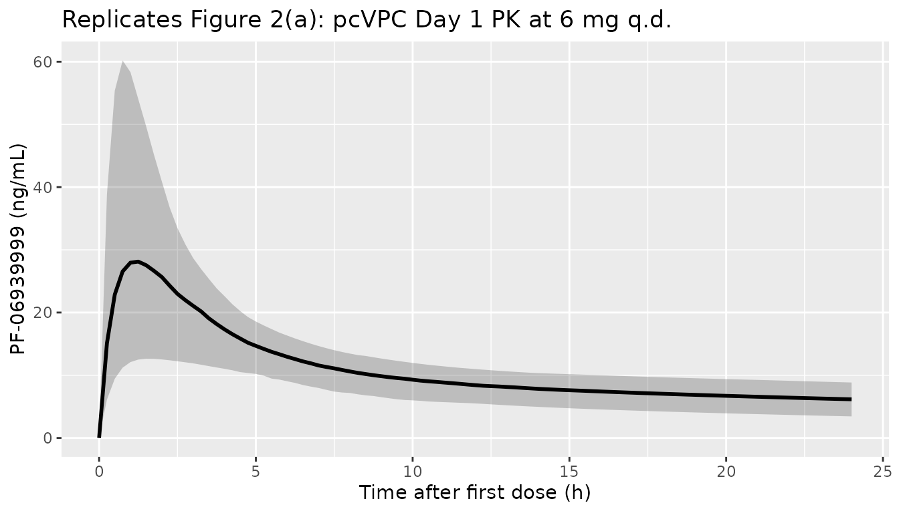
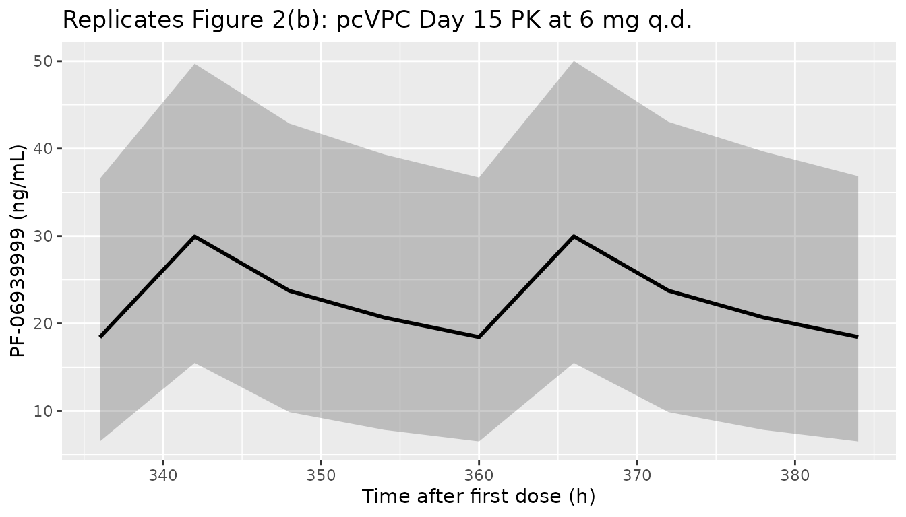
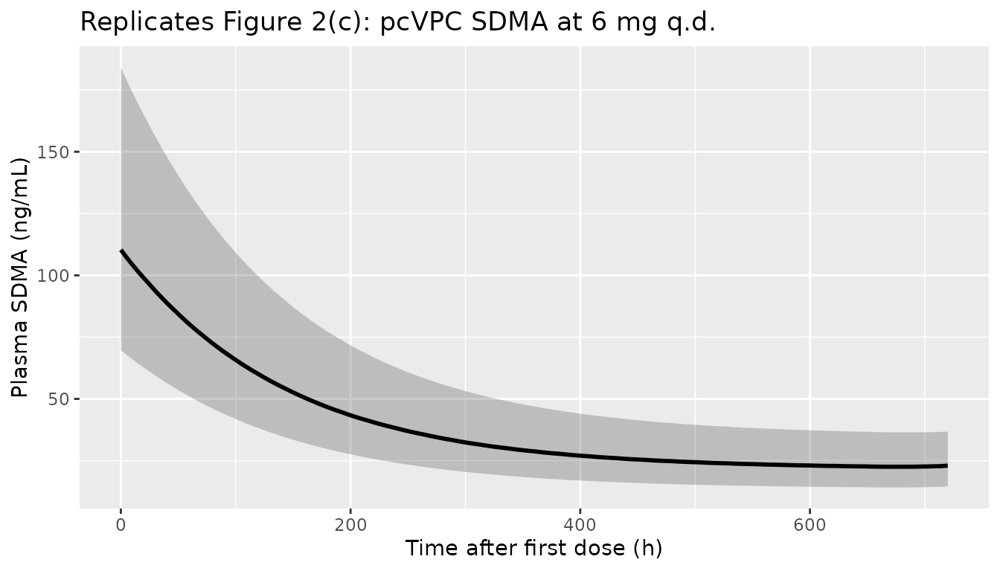
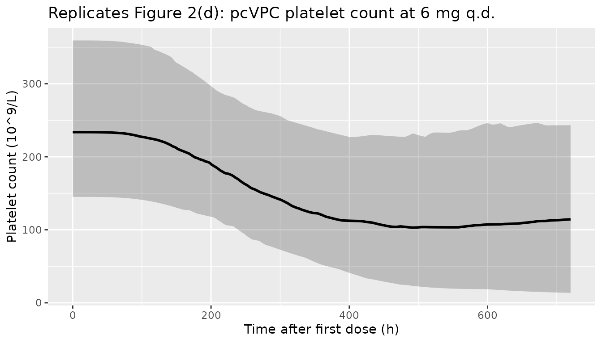
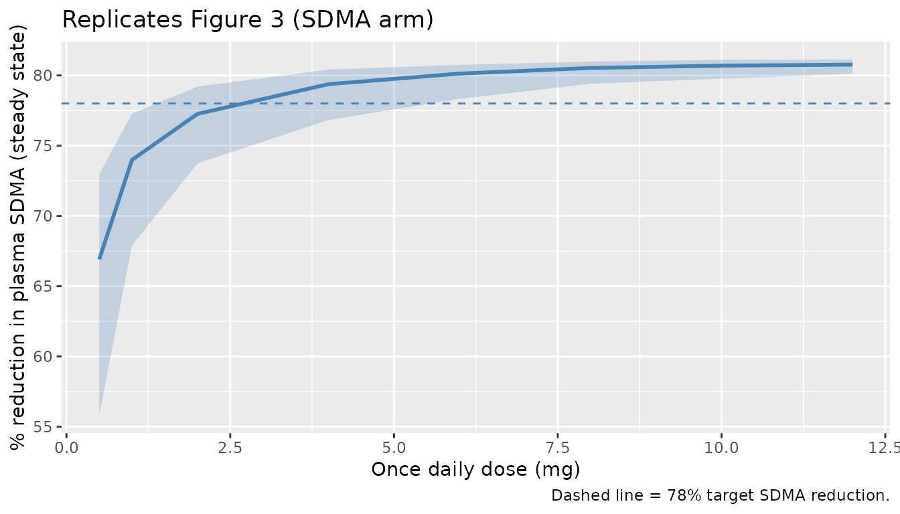
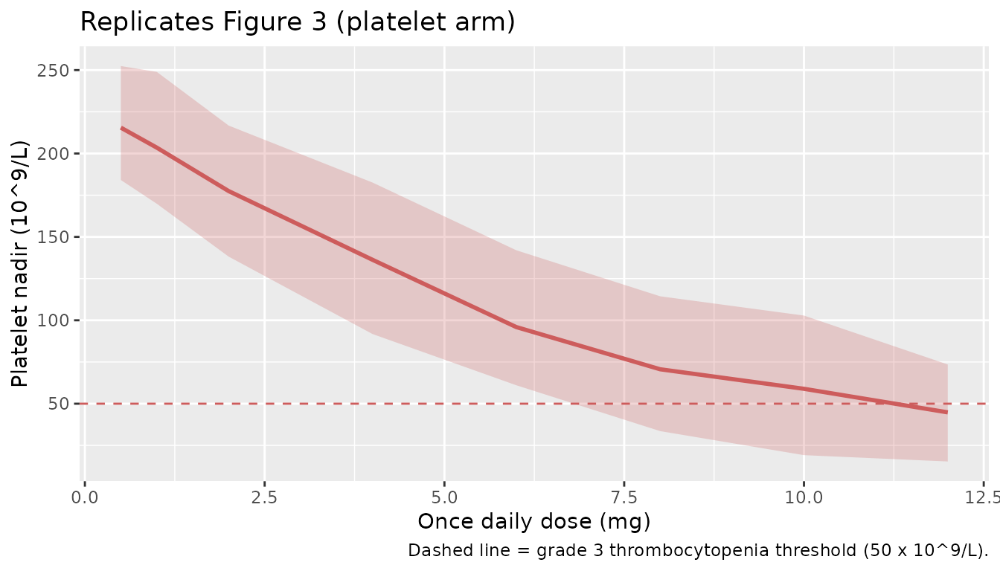

# PF 06939999 (Guo 2022)

## Model and source

- Citation: Guo C, Liao KH, Li M, Wang I-M, Shaik N, Yin D. PK/PD
  model-informed dose selection for oncology phase I expansion: Case
  study based on PF-06939999, a PRMT5 inhibitor. CPT Pharmacometrics
  Syst Pharmacol. 2023;12:1619-1625. <doi:10.1002/psp4.12882>.
- Description: Population PK/PD model for PF-06939999 (a small-molecule
  PRMT5 inhibitor) in 28 adults with advanced solid tumors enrolled in
  the dose-escalation part of NCT03854227. PK is a two-compartment model
  with first-order absorption (CL/F, V1/F, Q/F, V2/F, Ka). Plasma SDMA
  (the PD biomarker for PRMT5 inhibition) is modelled by an
  indirect-response model with saturable Imax inhibition on zero-order
  SDMA production (Kin/Kout), the log-transformed SDMA observation
  taking an additive (log-normal) residual error. Platelet count is
  described by the Friberg semi-mechanistic myelosuppression model
  (proliferating cells plus three transit compartments feeding a
  circulating compartment) with a linear drug effect Slope\*Cc on the
  proliferation rate and feedback (Circ0/circ)^gamma.
- Article (open access): <https://doi.org/10.1002/psp4.12882>

PF-06939999 is an orally-available, small-molecule, SAM-competitive
inhibitor of protein arginine methyltransferase 5 (PRMT5). The
first-in-patient (FIP) study NCT03854227 was a Phase I dose-escalation
in 28 adults with advanced solid tumors. The PK/PD analysis described by
Guo et al. (2022) was used to support the recommended dose for expansion
(RDE), which was selected as 6 mg once daily.

The structural model has three layers (Figure 1 of the source):

- **PK** – two-compartment model with first-order oral absorption (Ka,
  CL/F, V1/F, Q/F, V2/F).
- **Plasma SDMA (PD biomarker)** – indirect-response model with
  saturable Imax inhibition on the zero-order SDMA production rate Kin
  and first-order elimination Kout. Symmetrical dimethyl-arginine (SDMA)
  is a stable catabolic product of PRMT5 enzymatic activity used as a
  peripheral pharmacodynamic marker.
- **Platelet count** – the Friberg et al. (2002) semi-mechanistic
  myelosuppression model: a self-renewing proliferating compartment plus
  three transit compartments feeding the circulating compartment, with a
  linear Slope\*Cc effect on the proliferation rate and feedback
  (Circ0/circ)^gamma.

## Population

The PK/PD analysis pooled 28 patients with advanced or metastatic solid
tumors who received PF-06939999 in Part 1 of NCT03854227. Doses were 0.5
mg q.d. (n = 1), 4 mg q.d. (n = 5), 6 mg q.d. (n = 6), or 8 mg q.d. (n =
3); or 0.5 mg b.i.d. (n = 1), 1 mg b.i.d. (n = 2), 2 mg b.i.d. (n = 3),
4 mg b.i.d. (n = 3), or 6 mg b.i.d. (n = 4) – 24 evaluable for
dose-limiting toxicity. Two confirmed partial responses were observed
(one each in the 2 mg b.i.d. and 4 mg b.i.d. cohorts). Four subjects
experienced dose-limiting toxicities (thrombocytopenia n = 2 in 6 mg
b.i.d.; anemia n = 1 in 8 mg q.d.; neutropenia n = 1 in 6 mg q.d.).

Baseline body weight, age, and hepatic function were tested as PK
covariates and were not retained in the final model (drop in objective
function value \< 3.84; Results, page 1621). The full per-cohort
baseline demographics are summarised in Appendix Table S1 of the source,
which is not on disk in this worktree.

The population metadata can be inspected programmatically:

``` r

mod_meta$meta$population
#> $n_subjects
#> [1] 28
#> 
#> $n_studies
#> [1] 1
#> 
#> $age_range
#> [1] NA
#> 
#> $weight_range
#> [1] NA
#> 
#> $sex_female_pct
#> [1] NA
#> 
#> $disease_state
#> [1] "Adults with advanced or metastatic solid tumors enrolled in the dose-escalation part (Part 1) of the first-in-patient study NCT03854227 of PF-06939999, a PRMT5 inhibitor. Two confirmed partial responses were observed (one each in the 2 mg b.i.d. and 4 mg b.i.d. cohorts). Four subjects experienced dose-limiting toxicities: thrombocytopenia (n = 2) in the 6 mg b.i.d. cohort, anemia (n = 1) in the 8 mg q.d. cohort, and neutropenia (n = 1) in the 6 mg q.d. cohort."
#> 
#> $dose_range
#> [1] "Oral PF-06939999 once daily (q.d.) at 0.5 mg (n = 1), 4 mg (n = 5), 6 mg (n = 6), or 8 mg (n = 3); or twice daily (b.i.d.) at 0.5 mg (n = 1), 1 mg (n = 2), 2 mg (n = 3), 4 mg (n = 3), or 6 mg (n = 4). Recommended dose for expansion (RDE) selected from the simulations is 6 mg q.d."
#> 
#> $regions
#> [1] NA
#> 
#> $notes
#> [1] "Baseline body weight, age, and hepatic function were tested as PK covariates and were not retained in the final model (drop in objective function value < 3.84). Demographic detail (age, weight, sex, race) is summarised in Appendix Table S1, which is not on disk in this worktree; the population fields above therefore record disease state, dosing, and dose-limiting toxicities verbatim from the main text (Analysis Plan and Results). Trial registration: NCT03854227."
```

## Source trace

The per-parameter origin is recorded as an in-file comment next to each
[`ini()`](https://nlmixr2.github.io/rxode2/reference/ini.html) entry.
Every numeric value below was taken from Table 1 of Guo et al. (2022,
“PF-06939999 PK and PD (SDMA and platelet count) model parameters”, page
1623). The IIV %CV values from Table 1 were converted to log-scale
variances via the exact log-normal relationship omega^2 = log(1 + CV^2);
the residual error variances were converted to SDs via sqrt.

| Equation / parameter | Value | Source location |
|----|----|----|
| `lka` (Ka) | log(2.31) 1/h | Table 1, PK model row Ka |
| `lcl` (CL/F) | log(9.53) L/h | Table 1, PK model row CL/F |
| `lvc` (V1/F) | log(160) L | Table 1, PK model row V1/F |
| `lq` (Q/F) | log(26.2) L/h | Table 1, PK model row Q/F |
| `lvp` (V2/F) | log(285) L | Table 1, PK model row V2/F |
| `imax` | 0.823 (unitless) | Table 1, SDMA PD row Imax |
| `lic50` (IC50) | log(0.425) ng/mL | Table 1, SDMA PD row IC50 |
| `lkout` (Kout) | log(0.00708) 1/h | Table 1, SDMA PD row Kout |
| `lblsdma` (Baseline) | log(113) ng/mL | Table 1, SDMA PD row Baseline SDMA |
| `lmtt` (MTT) | log(134) h | Table 1, Platelet PD row MTT |
| `lslope` (Slope) | log(0.00496) per ng/mL | Table 1, Platelet PD row Slope |
| `lgamma` (gamma) | log(0.217) | Table 1, Platelet PD row Feedback |
| `lblplt` (Baseline) | log(232) 10^9/L | Table 1, Platelet PD row Baseline PLT |
| `etalcl` | log(1+0.389^2) = 0.141 | Table 1, IIV(%) for CL/F = 38.9% |
| `etalvc` | log(1+0.611^2) = 0.317 | Table 1, IIV(%) for V1/F = 61.1% |
| `etalblsdma` | log(1+0.291^2) = 0.0812 | Table 1, IIV(%) for Baseline SDMA = 29.1% |
| `etalslope` | log(1+0.522^2) = 0.241 | Table 1, IIV(%) for Slope = 52.2% |
| `etalgamma` | log(1+0.469^2) = 0.199 | Table 1, IIV(%) for Feedback = 46.9% |
| `etalblplt` | log(1+0.283^2) = 0.0771 | Table 1, IIV(%) for Baseline PLT = 28.3% |
| `propSd` | sqrt(0.112) = 0.335 | Table 1, PK residual error |
| `propSd_SDMA` | sqrt(0.0146) = 0.121 | Table 1, SDMA residual error |
| `propSd_PLT` | sqrt(0.0235) = 0.153 | Table 1, PLT residual error |
| 2-cmt PK ODEs | n/a | Figure 1, PK for PF-06939999 |
| Indirect-response Imax/IC50 on Kin | n/a | Figure 1, PK/PD for plasma SDMA |
| Friberg 4-stage chain w/ Slope\*Cc + (Circ0/circ)^gamma | n/a | Figure 1, PK/PD for platelet (cites Friberg 2002) |

## Virtual cohort

The Guo 2022 patient-level data are not publicly available. The
simulations below construct virtual cohorts at q.d. dose levels covering
the observed FIP escalation range (0.5, 1, 2, 4, 6, 8, 10, 12 mg/day) so
that we can reproduce both the pcVPC-style trajectories at the RDE
(Figure 2) and the steady-state dose-response sweep (Figure 3) of the
source paper.

``` r

set.seed(20221210)

n_per_dose <- 200L

dose_levels <- c(0.5, 1, 2, 4, 6, 8, 10, 12)
n_doses     <- length(dose_levels)

# Dose interval and follow-up
tau          <- 24       # h, q.d.
n_dose_days  <- 28L      # 28 daily doses
follow_up_h  <- 24 * 30  # 30 days observation window

obs_grid <- sort(unique(c(
  seq(0, 24, by = 0.25),                  # dense day-1 sampling
  seq(24, 24 * 14, by = 1),               # daily sampling through day 14
  seq(24 * 14, follow_up_h, by = 6)       # sparser to day 30 to keep render time low
)))

# Helper: build one cohort as a self-contained event table.
make_cohort <- function(n, dose_mg, id_offset = 0L) {
  ids <- id_offset + seq_len(n)

  # Multi-dose event table per subject -- q.d. dosing for n_dose_days
  ev_dose <- expand.grid(
    id   = ids,
    time = seq(0, by = tau, length.out = n_dose_days)
  )
  ev_dose$evid <- 1L
  ev_dose$amt  <- dose_mg
  ev_dose$cmt  <- "depot"

  # Observation rows on three outputs (Cc, SDMA, PLT)
  ev_obs_Cc   <- expand.grid(id = ids, time = obs_grid)
  ev_obs_Cc$evid <- 0L; ev_obs_Cc$amt <- 0; ev_obs_Cc$cmt <- "Cc"
  ev_obs_SD   <- expand.grid(id = ids, time = obs_grid)
  ev_obs_SD$evid <- 0L; ev_obs_SD$amt <- 0; ev_obs_SD$cmt <- "SDMA"
  ev_obs_PLT  <- expand.grid(id = ids, time = obs_grid)
  ev_obs_PLT$evid <- 0L; ev_obs_PLT$amt <- 0; ev_obs_PLT$cmt <- "PLT"

  out <- dplyr::bind_rows(ev_dose, ev_obs_Cc, ev_obs_SD, ev_obs_PLT)
  out$treatment <- sprintf("%g mg q.d.", dose_mg)
  out$dose_mg   <- dose_mg
  out
}

# Build all cohorts with disjoint id ranges
events <- dplyr::bind_rows(lapply(seq_along(dose_levels), function(i) {
  make_cohort(
    n         = n_per_dose,
    dose_mg   = dose_levels[i],
    id_offset = (i - 1L) * n_per_dose
  )
}))

stopifnot(!anyDuplicated(unique(events[, c("id", "time", "evid")])))
nrow(events); length(unique(events$id))
#> [1] 2315200
#> [1] 1600
```

## Simulation

``` r

mod <- mod_meta

sim <- rxode2::rxSolve(
  mod,
  events = events,
  keep   = c("treatment", "dose_mg")
) |>
  as.data.frame()

sim_obs <- sim |> dplyr::filter(time <= follow_up_h)

dim(sim_obs)
#> [1] 2270400      36
unique(sim_obs$treatment)
#> [1] "0.5 mg q.d." "1 mg q.d."   "2 mg q.d."   "4 mg q.d."   "6 mg q.d."  
#> [6] "8 mg q.d."   "10 mg q.d."  "12 mg q.d."
```

For typical-value reproductions of Figure 2 (pcVPC central tendency at
the RDE), we also generate a deterministic prediction with random
effects zeroed out.

``` r

mod_typical <- mod |> rxode2::zeroRe()
rde_first_id <- min(events$id[events$treatment == "6 mg q.d."])
sim_typical <- rxode2::rxSolve(
  mod_typical,
  events = events |> dplyr::filter(treatment == "6 mg q.d.", id == rde_first_id)
) |>
  as.data.frame()
#> ℹ omega/sigma items treated as zero: 'etalcl', 'etalvc', 'etalblsdma', 'etalslope', 'etalgamma', 'etalblplt'
```

## Replicate published figures

### Figure 2 – pcVPC of PK, SDMA, and platelet count at the RDE (6 mg q.d.)

The source Figure 2 panels (a, b, c, d) display pcVPCs across all dose
levels (median + 5th / 95th percentiles of the simulated distribution).
Below we plot the simulated central tendency at the RDE (6 mg q.d.) for
each output as a qualitative replication of those panels; absolute peaks
differ from the pooled-cohort observed scatter because the source pcVPC
was prediction-and- variance-corrected over the heterogeneous
dose-escalation cohort.

``` r

sim_rde <- sim_obs |> dplyr::filter(treatment == "6 mg q.d.")

quants <- sim_rde |>
  dplyr::group_by(time) |>
  dplyr::summarise(
    Cc05 = stats::quantile(Cc,   0.05, na.rm = TRUE),
    Cc50 = stats::quantile(Cc,   0.50, na.rm = TRUE),
    Cc95 = stats::quantile(Cc,   0.95, na.rm = TRUE),
    SD05 = stats::quantile(SDMA, 0.05, na.rm = TRUE),
    SD50 = stats::quantile(SDMA, 0.50, na.rm = TRUE),
    SD95 = stats::quantile(SDMA, 0.95, na.rm = TRUE),
    PL05 = stats::quantile(PLT,  0.05, na.rm = TRUE),
    PL50 = stats::quantile(PLT,  0.50, na.rm = TRUE),
    PL95 = stats::quantile(PLT,  0.95, na.rm = TRUE),
    .groups = "drop"
  )

# Panel (a) -- PK profile on cycle 1 day 1
ggplot(quants |> dplyr::filter(time <= 24), aes(time, Cc50)) +
  geom_ribbon(aes(ymin = Cc05, ymax = Cc95), alpha = 0.25) +
  geom_line(linewidth = 1) +
  labs(x = "Time after first dose (h)", y = "PF-06939999 (ng/mL)",
       title = "Replicates Figure 2(a): pcVPC Day 1 PK at 6 mg q.d.")
```



``` r


# Panel (b) -- PK profile on cycle 1 day 15 (around steady state)
ggplot(quants |> dplyr::filter(time >= 24 * 14, time <= 24 * 15 + 24), aes(time, Cc50)) +
  geom_ribbon(aes(ymin = Cc05, ymax = Cc95), alpha = 0.25) +
  geom_line(linewidth = 1) +
  labs(x = "Time after first dose (h)", y = "PF-06939999 (ng/mL)",
       title = "Replicates Figure 2(b): pcVPC Day 15 PK at 6 mg q.d.")
```



``` r


# Panel (c) -- SDMA time course
ggplot(quants, aes(time, SD50)) +
  geom_ribbon(aes(ymin = SD05, ymax = SD95), alpha = 0.25) +
  geom_line(linewidth = 1) +
  labs(x = "Time after first dose (h)", y = "Plasma SDMA (ng/mL)",
       title = "Replicates Figure 2(c): pcVPC SDMA at 6 mg q.d.")
```



``` r


# Panel (d) -- Platelet time course
ggplot(quants, aes(time, PL50)) +
  geom_ribbon(aes(ymin = PL05, ymax = PL95), alpha = 0.25) +
  geom_line(linewidth = 1) +
  labs(x = "Time after first dose (h)", y = "Platelet count (10^9/L)",
       title = "Replicates Figure 2(d): pcVPC platelet count at 6 mg q.d.")
```



### Figure 3 – Steady-state SDMA reduction and platelet nadir vs daily dose

Source Figure 3 plots, for q.d. doses up to ~12 mg, the simulated
steady-state percentage SDMA reduction from baseline (median + 90% PI)
and the platelet nadir at steady state (median + 50% PI). Two horizontal
references are drawn: the target 78% SDMA reduction (PD) and the grade 3
thrombocytopenia threshold of 50 x 10^9/L (safety). The accompanying
table reports the simulation-derived probability of (i) achieving the
target PD and (ii) developing grade \>=3 thrombocytopenia at 4, 6, and 8
mg q.d.

``` r

# Steady-state SDMA reduction (use last dosing interval as a proxy)
ss_window  <- c(24 * (n_dose_days - 1), 24 * n_dose_days)
nadir_window <- c(0, 24 * n_dose_days)  # nadir over the full treatment course

ss_sdma <- sim_obs |>
  dplyr::filter(time >= ss_window[1], time <= ss_window[2]) |>
  dplyr::group_by(id, treatment, dose_mg) |>
  dplyr::summarise(
    sdma_avg = mean(SDMA, na.rm = TRUE),
    .groups = "drop"
  )

# Per-subject baseline SDMA at time = 0 (covers the random etalblsdma)
baseline_sdma <- sim_obs |>
  dplyr::filter(time == 0) |>
  dplyr::select(id, treatment, dose_mg, sdma_baseline = SDMA)

ss_red <- ss_sdma |>
  dplyr::left_join(baseline_sdma, by = c("id", "treatment", "dose_mg")) |>
  dplyr::mutate(pct_reduction = 100 * (1 - sdma_avg / sdma_baseline))

plt_nadir <- sim_obs |>
  dplyr::filter(time >= nadir_window[1], time <= nadir_window[2]) |>
  dplyr::group_by(id, treatment, dose_mg) |>
  dplyr::summarise(plt_nadir = min(PLT, na.rm = TRUE), .groups = "drop")

dose_response <- ss_red |>
  dplyr::group_by(dose_mg) |>
  dplyr::summarise(
    sdma_red_05 = stats::quantile(pct_reduction, 0.05),
    sdma_red_50 = stats::quantile(pct_reduction, 0.50),
    sdma_red_95 = stats::quantile(pct_reduction, 0.95),
    .groups = "drop"
  ) |>
  dplyr::left_join(
    plt_nadir |> dplyr::group_by(dose_mg) |> dplyr::summarise(
      plt_25 = stats::quantile(plt_nadir, 0.25),
      plt_50 = stats::quantile(plt_nadir, 0.50),
      plt_75 = stats::quantile(plt_nadir, 0.75),
      .groups = "drop"
    ),
    by = "dose_mg"
  )

ggplot(dose_response, aes(dose_mg)) +
  geom_ribbon(aes(ymin = sdma_red_05, ymax = sdma_red_95),
              fill = "steelblue", alpha = 0.25) +
  geom_line(aes(y = sdma_red_50), colour = "steelblue", linewidth = 1) +
  geom_hline(yintercept = 78, linetype = 2, colour = "steelblue") +
  labs(x = "Once daily dose (mg)", y = "% reduction in plasma SDMA (steady state)",
       title = "Replicates Figure 3 (SDMA arm)",
       caption = "Dashed line = 78% target SDMA reduction.")
```



``` r


ggplot(dose_response, aes(dose_mg)) +
  geom_ribbon(aes(ymin = plt_25, ymax = plt_75),
              fill = "indianred", alpha = 0.25) +
  geom_line(aes(y = plt_50), colour = "indianred", linewidth = 1) +
  geom_hline(yintercept = 50, linetype = 2, colour = "indianred") +
  labs(x = "Once daily dose (mg)", y = "Platelet nadir (10^9/L)",
       title = "Replicates Figure 3 (platelet arm)",
       caption = "Dashed line = grade 3 thrombocytopenia threshold (50 x 10^9/L).")
```



``` r

target_pd_thresh <- 78        # % SDMA reduction target
grade3_plt       <- 50        # 10^9/L grade >=3 thrombocytopenia

probs <- ss_red |>
  dplyr::left_join(plt_nadir, by = c("id", "treatment", "dose_mg")) |>
  dplyr::filter(dose_mg %in% c(4, 6, 8)) |>
  dplyr::group_by(treatment, dose_mg) |>
  dplyr::summarise(
    `P(target PD)`              = mean(pct_reduction >= target_pd_thresh),
    `P(grade >=3 thrombocyt.)`  = mean(plt_nadir <= grade3_plt),
    .groups = "drop"
  ) |>
  dplyr::arrange(dose_mg)

knitr::kable(
  probs,
  digits = 2,
  caption = paste(
    "Simulated probabilities at 4, 6, and 8 mg q.d. (cf. Source Figure 3 table:",
    "P(target PD) = 64% / 76% / 81%; P(G>=3 thrombocytopenia) = 17% / 30% / 43%)."
  )
)
```

| treatment | dose_mg | P(target PD) | P(grade \>=3 thrombocyt.) |
|:----------|--------:|-------------:|--------------------------:|
| 4 mg q.d. |       4 |         0.87 |                      0.08 |
| 6 mg q.d. |       6 |         0.98 |                      0.17 |
| 8 mg q.d. |       8 |         1.00 |                      0.38 |

Simulated probabilities at 4, 6, and 8 mg q.d. (cf. Source Figure 3
table: P(target PD) = 64% / 76% / 81%; P(G\>=3 thrombocytopenia) = 17% /
30% / 43%). {.table}

## PKNCA validation

The source paper does not report a published NCA table to compare
against directly (the analysis was conducted on the popPK fit, with no
separate non-compartmental summary), so the PKNCA block below produces
simulated NCA parameters at the RDE and at the bracketing 4 and 8 mg
q.d. cohorts as a quantitative summary of the typical exposure that the
model predicts.

``` r

pkn_cohorts <- c("4 mg q.d.", "6 mg q.d.", "8 mg q.d.")

# Steady-state NCA on the last (28th) dose interval
last_dose_time <- 24 * (n_dose_days - 1L)
end_ss         <- last_dose_time + tau

sim_nca <- sim |>
  dplyr::filter(treatment %in% pkn_cohorts,
                time >= last_dose_time, time <= end_ss,
                !is.na(Cc)) |>
  dplyr::select(id, time, Cc, treatment) |>
  dplyr::distinct(id, time, treatment, .keep_all = TRUE)

dose_df <- events |>
  dplyr::filter(treatment %in% pkn_cohorts,
                evid == 1, time == last_dose_time) |>
  dplyr::select(id, time, amt, treatment)

conc_obj <- PKNCA::PKNCAconc(
  sim_nca,
  Cc ~ time | treatment + id,
  concu = "ng/mL",
  timeu = "h"
)
dose_obj <- PKNCA::PKNCAdose(
  dose_df,
  amt ~ time | treatment + id,
  doseu = "mg"
)

intervals <- data.frame(
  start    = last_dose_time,
  end      = end_ss,
  cmax     = TRUE,
  tmax     = TRUE,
  cmin     = TRUE,
  cav      = TRUE,
  auclast  = TRUE
)

nca_res <- PKNCA::pk.nca(
  PKNCA::PKNCAdata(conc_obj, dose_obj, intervals = intervals)
)
#>  ■■■■■■■■■■■■■■■■■■■■■■■■■         82% |  ETA:  1s

knitr::kable(summary(nca_res),
             caption = "Steady-state NCA over the 28th dosing interval at 4, 6, and 8 mg q.d.")
```

| Interval Start | Interval End | treatment | N | AUClast (h\*ng/mL) | Cmax (ng/mL) | Cmin (ng/mL) | Tmax (h) | Cav (ng/mL) |
|---:|---:|:---|:---|:---|:---|:---|:---|:---|
| 648 | 672 | 4 mg q.d. | 200 | 355 \[46.1\] | 19.3 \[37.2\] | 11.6 \[56.0\] | 6.00 \[6.00, 6.00\] | 14.8 \[46.1\] |
| 648 | 672 | 6 mg q.d. | 200 | 551 \[44.5\] | 29.9 \[36.4\] | 18.2 \[53.3\] | 6.00 \[6.00, 6.00\] | 23.0 \[44.5\] |
| 648 | 672 | 8 mg q.d. | 200 | 766 \[44.3\] | 41.2 \[36.4\] | 25.4 \[53.1\] | 6.00 \[6.00, 6.00\] | 31.9 \[44.3\] |

Steady-state NCA over the 28th dosing interval at 4, 6, and 8 mg q.d.
{.table}

## Assumptions and deviations

- **Day-1 low-dose bioavailability scaling factor (Table 1, “Scaling
  factor for F = 0.647”, IIV 53.6%) is not implemented in this
  typical-value model.** The source applied a multiplicative F scaling
  on day 1 only for doses \<= 6 mg/day to capture an apparent lower
  bioavailability at low doses on the first dose (Table 1 footnote: “A
  scaling factor for F was introduced to account for the apparently
  lower bioavailability for doses \<=6 mg/day (dose-dependent F) in day
  1 (time-varying F)”). Implementing this faithfully requires a per-dose
  covariate flag (a binary indicator that the user must populate as 1
  for the cycle 1 day 1 record at any q.d. or b.i.d. dose \<= 6 mg, 0
  otherwise). To keep the model usable for the typical case
  (steady-state dose-response simulation at the RDE), the simplification
  was made to leave F = 1 at all dose events. The PK estimates carried
  in [`ini()`](https://nlmixr2.github.io/rxode2/reference/ini.html) are
  the published values, which were fit *with* the F scaling in place;
  consequently this model will **over-predict cycle 1 day 1 Cmax / AUC
  for low-dose cohorts** (the bias is ~1/0.647 ~ 1.55x for cycle 1 day 1
  only). Steady-state predictions and predictions for any dose \> 6 mg
  are unaffected. Users wanting cycle-1-day-1 fidelity should multiply F
  by 0.647 manually for the qualifying dose events.
- **Imax (= 0.823) is carried as a bare typical-value parameter**
  without a logit transform. The source did not report IIV on Imax
  (Table 1), so the typical-value model does not need a transform to
  keep Imax in (0, 1) at simulation time.
- **IIV in %CV interpreted as omega^2 = log(1 + CV^2).** The source
  paper reports IIV in the “IIV (%)” column of Table 1 without
  specifying which CV convention (sqrt(omega^2) approximation vs the
  exact log-normal relationship). The exact form was used here; for the
  largest IIV (V1/F at 61.1% CV) the two interpretations differ by less
  than 0.05 in omega^2 (0.317 exact vs 0.373 approximate).
- **Residual error variances vs SDs.** Table 1 reports “PK / SDMA /
  Platelet residual error” as 0.112, 0.0146, and 0.0235 – these are
  NONMEM SIGMA values (variances on the proportional or log-additive
  scale), not SDs. Interpreting them as variances gives plausible CV /
  log-SD magnitudes (PK 33%, SDMA 12% on log, platelet 15%);
  interpreting them as SDs would give 11%, 1.5%, and 2.4%, the latter
  two of which are too low to be biologically credible. The model
  carries `sqrt(value)` in
  [`ini()`](https://nlmixr2.github.io/rxode2/reference/ini.html).
- **Compartment names `sdma` and `circ` deviate from the canonical
  compartment register** (`depot`, `central`, `peripheral1`,
  `precursor<n>`, …). They are retained because they directly mirror the
  paper’s notation (`SDMA` and `Circ` in Figure 1) and the
  Friberg-precedent file `inst/modeldb/ddmore/Friberg_2002_paclitaxel.R`
  uses `circ` for the same Friberg circulating compartment.
  [`checkModelConventions()`](https://nlmixr2.github.io/nlmixr2lib/reference/checkModelConventions.md)
  flags both as warnings (info severity) – the deviation is intentional.
- **Unit conversion ng/mL \<-\> mg/L.** The model accepts dose in mg and
  computes central / vc in mg/L (== ug/mL); the observation
  `Cc <- (central / vc) * 1000` rescales to ng/mL so the published IC50
  (0.425 ng/mL) and Slope (0.00496 per ng/mL) parameter values can be
  entered verbatim from Table 1. `units$dosing = "mg"`,
  `units$concentration = "ng/mL"`.
- **Population demographics (age, weight, sex, race, region)** are
  reported in the source’s Appendix Table S1, which is not on disk in
  this worktree; the `population` field in the model file therefore
  records dosing, disease state, and DLT counts verbatim from the main
  text (Analysis Plan and Results sections) and leaves the demographic
  numerics as `NA_*_`.
- **Steady-state SDMA reduction proxy.** Source Figure 3 reports
  “steady-state plasma SDMA reduction from baseline (%)” simulated from
  the fit. The vignette computes this by averaging SDMA over the 28th
  (last) dosing interval and contrasting against the per-subject t = 0
  SDMA value. The 28-day daily-dose horizon is well beyond ~5 SDMA
  half-lives (Kout = 0.00708 1/h gives SDMA t1/2 ~ 4 days, so 28 days ~=
  7 t1/2) – adequate for a steady-state proxy.
- **Platelet nadir window.** Source Figure 3 evaluates platelet nadir
  “at steady state” using 5000 simulated participants. We evaluate it as
  the per-subject minimum platelet count over the full 28-day treatment
  course (the platelet system has MTT = 134 h ~ 5.6 days; 28 days covers
  the nadir). Cohort sizes are 200 per dose level here to keep render
  time within the pkgdown 5-minute gate.
