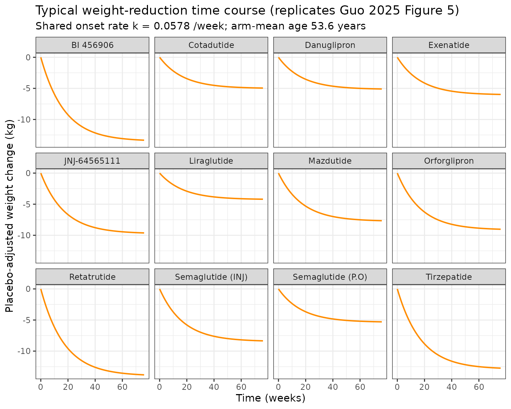
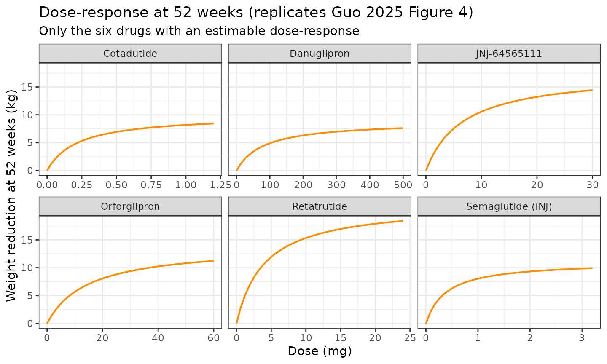
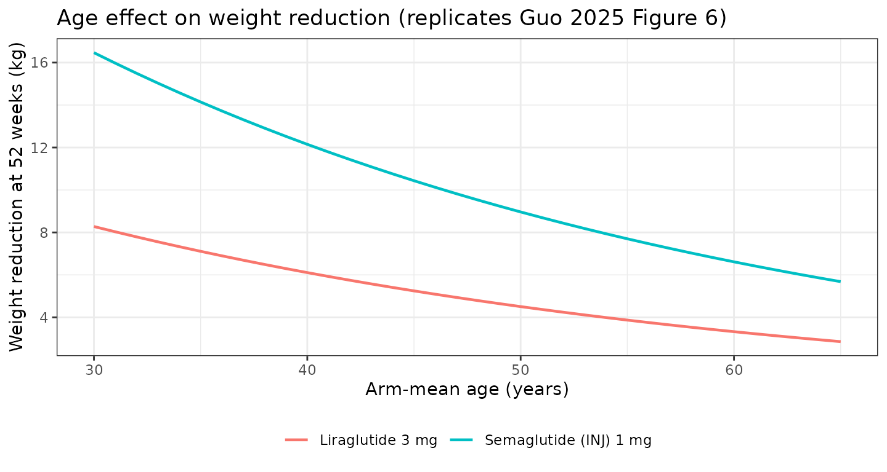
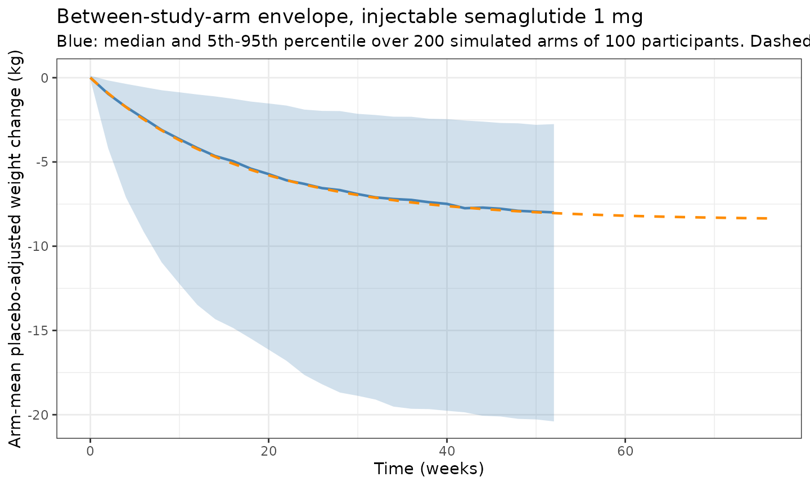

# GLP-1 receptor agonists for weight reduction MBMA (Guo 2025)

## Model and source

- Citation: Guo H, Yang J, Huang J, Xu L, Lv Y, Wang Y, Ren J, Feng Y,
  Zheng Q, Li L. Comparative efficacy and safety of GLP-1 receptor
  agonists for weight reduction: A model-based meta-analysis of
  placebo-controlled trials. Obes Pillars. 2025 Feb 6;13:100162.
  <doi:10.1016/j.obpill.2025.100162>.
- Description: MBMA. Model-based meta-analysis of the placebo-adjusted
  weight-reduction time course of 12 glucagon-like peptide-1 receptor
  agonists (GLP-1RAs) in adults with overweight or obesity, fit to
  arm-level summary data digitised from 55 randomised, double-blind,
  placebo-controlled trials (16,269 participants). The endpoint is the
  ‘pure’ drug effect: the change from baseline in body weight in the
  drug arm minus the change from baseline in the concurrent placebo arm
  (the paper’s ddWeight), which removes the trial-specific diet and
  exercise background. The time course is a single exponential approach
  to an asymptote, E(t) = Emax \* (1 - exp(-k \* t)), with a
  drug-specific Emax and a single shared onset rate k = 0.0578 /week
  (the time to half of Emax is 0.693/k = 12.0 weeks). Six drugs
  (cotadutide, danuglipron, JNJ-64565111, retatrutide, orforglipron and
  injectable semaglutide) had an estimable dose-response and carry an
  Emax-in-dose term Emax \* Dose / (ED50 + Dose) with the ED50 fixed at
  the published value; the other six (BI 456906, exenatide, liraglutide,
  oral semaglutide, tirzepatide and mazdutide) were studied over too
  narrow a dose range for a dose-response to be estimable and carry a
  flat per-arm Emax. Mean trial age is the only retained covariate and
  acts exponentially on Emax, centred on the 53.6-year median of the
  trial means; baseline weight, baseline BMI and male ratio were
  screened and not retained. Between-STUDY (not between-subject)
  variability is carried as study-level etas on Emax and on log k; the
  residual is additive at unit study weight and the paper weights it by
  1/sqrt(N) for an arm of N participants. Suitable simulation scope is
  the arm-mean placebo-adjusted weight-reduction time course; the model
  is NOT suitable for individual-subject simulation. Parameter values
  are Supplementary Table S6 (NONMEM 7.4, FOCEI).
- Article: <https://doi.org/10.1016/j.obpill.2025.100162>

## Population

Guo 2025 is a model-based meta-analysis (MBMA) of 55 randomised,
double-blind, placebo-controlled trials of glucagon-like peptide-1
receptor agonists (GLP-1RAs) in adults with overweight or obesity,
pooling 16,269 participants across 12 drugs. PubMed and Embase were
searched from inception to 2024-01-20 and restricted to English-language
clinical trials. Participants were aged 18 years or older with a BMI of
at least 25 kg/m^2 (at least 23 kg/m^2 for Japanese and at least 24
kg/m^2 for Chinese participants).

The modelled quantity is the **“pure” drug effect**: the change from
baseline in body weight in the drug arm *minus* the change from baseline
in the concurrent placebo arm. The paper calls this `ddWeight`.
Subtracting the placebo arm removes the trial-specific diet and exercise
background, which otherwise dominates weight-loss trials and varies
enormously between protocols.

Cohort characteristics, quoted at the level of **trial means** (this is
an MBMA, so every covariate is a study-arm aggregate, not an individual
value):

| Characteristic     | Range across trials | Median      |
|--------------------|---------------------|-------------|
| Age                | 29.5-64.7 years     | 53.6 years  |
| Male proportion    | 19.1-100.0 %        | 51.6 %      |
| Baseline weight    | 72.2-121 kg         | 95.8 kg     |
| Baseline BMI       | 24.1-45.1 kg/m^2    | 33.9 kg/m^2 |
| Treatment duration | 6-104 weeks         | 26 weeks    |

Risk of bias (Cochrane RoB 2.0): 33 trials (60 %) low, 22 trials (40 %)
moderate.

Drugs analysed, by receptor specificity:

- **Mono-agonists (GLP-1)**: liraglutide (18 trials), injectable
  semaglutide (11), oral semaglutide (2), exenatide (3), danuglipron
  (2), orforglipron (2).
- **Dual agonists (GLP-1/GIP or GLP-1/glucagon)**: tirzepatide (4),
  cotadutide (4), mazdutide (3), BI 456906 / survodutide (2),
  JNJ-64565111 (2).
- **Tri-agonist (GLP-1/GIP/glucagon)**: retatrutide (2).

## Model structure

The time course is a single exponential approach to an asymptote
(Supplementary Methods 1, Equation 1):

``` math
E_{i,j} = E_{\max,i}\left(1 - e^{-k_i \cdot \text{time}_j}\right) + \frac{\varepsilon_{i,j}}{\sqrt{N_{i,j}}}
```

with study-arm-level random effects
$`E_{\max,i} = E_{\max,\text{typical}} e^{\eta_{E_{\max}}}`$ and
$`k_i = k_{\text{typical}} e^{\eta_k}`$ (Equations 2-3).

Six drugs had an estimable dose-response and carry an Emax-in-dose term
(Equation 4, printed as main-text Equations 1-6):

``` math
E_{\max,\text{dose}} = E_{\max} \cdot \frac{\text{Dose}}{ED_{50} + \text{Dose}}
```

The remaining six were studied over too narrow a dose range for a
dose-response to be estimable, so their tabulated Emax applies flat at
any studied dose.

Mean trial age is the only retained covariate and acts exponentially on
Emax (Equation 7), centred on the 53.6-year median of the trial means:

``` math
E_{\max} = E_{\max,\text{typical}} \cdot e^{-0.0304 (\text{Age} - 53.6)}
```

**A single shared onset rate `k` is estimated.** Guo 2025 Results 3.2
states that “owing to the limited number of time points available for
some drugs, it was not possible to estimate the k values individually
for each drug”. Drug-specific onset times were recovered *post hoc* by
Bayesian feedback combined with a single-arm meta-analysis
(Supplementary Figure S3) and are **not** part of the final model; see
Errata.

## Source trace

Every value in `ini()` traced to its location in Guo 2025. All
structural values come from Supplementary Table S6 (“Parameter estimates
of the final model”); the printed main-text Equations 1-7 give the same
numbers and are cited where they add the functional form.

| Model quantity | Value | Source location |
|----|----|----|
| `emax_bi456906` | -13.5 kg | Suppl. Table S6, Emax_BI 456906 (RSE 14.8 %) |
| `emax_cotadutide` | -10.5 kg | Suppl. Table S6, Emax_Cotadutide (RSE 14.8 %); Equation 1 numerator |
| `emax_danuglipron` | -9.29 kg | Suppl. Table S6, Emax_Danuglipron (RSE 24.7 %); Equation 2 numerator |
| `emax_exenatide` | -6.05 kg | Suppl. Table S6, Emax_Exenatide (RSE 8.60 %) |
| `emax_jnj64565111` | -18.6 kg | Suppl. Table S6, Emax_JNJ-64565111 (RSE 6.10 %); Equation 3 numerator |
| `emax_liraglutide` | -4.25 kg | Suppl. Table S6, Emax_Liraglutide (RSE 9.30 %) |
| `emax_retatrutide` | -22.6 kg | Suppl. Table S6, Emax_Retatrutide (RSE 19.3 %); Equation 4 numerator |
| `emax_orforglipron` | -14.7 kg | Suppl. Table S6, Emax_Orforglipron (RSE 7.40 %); Equation 5 numerator |
| `emax_semaglutide_inj` | -11.7 kg | Suppl. Table S6, Emax_Semaglutide(INJ) (RSE 12.0 %); Equation 6 numerator |
| `emax_semaglutide_po` | -5.36 kg | Suppl. Table S6, Emax_Semaglutide(P.O) (RSE 22.8 %) |
| `emax_tirzepatide` | -12.9 kg | Suppl. Table S6, Emax_Tirzepatide (RSE 9.10 %) |
| `emax_mazdutide` | -7.75 kg | Suppl. Table S6, Emax_Mazdutide (RSE 17.9 %) |
| `lkel` | log(0.0578 /week) | Suppl. Table S6, k (RSE 8.60 %) |
| `e_age_emax` | -0.0304 /year | Suppl. Table S6, thetaAge on Emax (RSE 23.0 %); Equation 7 |
| `led50_cotadutide` | log(0.219 mg), fixed | Suppl. Table S6, thetaDose on Emax_Cotadutide, “Fixed”; Equation 1 denominator |
| `led50_danuglipron` | log(80 mg), fixed | Suppl. Table S6, thetaDose on Emax_Danuglipron, “Fixed”; Equation 2 denominator |
| `led50_jnj64565111` | log(6.73 mg), fixed | Suppl. Table S6, thetaDose on Emax_JNJ-64565111, “Fixed”; Equation 3 denominator |
| `led50_retatrutide` | log(4 mg), fixed | Suppl. Table S6, thetaDose on Emax_Retatrutide, “Fixed”; Equation 4 denominator |
| `led50_orforglipron` | log(14.6 mg), fixed | Suppl. Table S6, thetaDose on Emax_Orforglipron, “Fixed”; Equation 5 denominator |
| `led50_semaglutide_inj` | log(0.384 mg), fixed | Suppl. Table S6, thetaDose on Emax_Semaglutide(INJ), “Fixed”; Equation 6 denominator |
| `eta_study_emax` | 0.330 (variance) | Suppl. Table S6, etaEmax (RSE 11.1 %); Suppl. Methods 1 Eq 2 |
| `eta_study_lkel` | 0.627 (variance) | Suppl. Table S6, etak (RSE 11.1 %); Suppl. Methods 1 Eq 3 |
| `addSd` | sqrt(0.391) kg | Suppl. Table S6, eps (RSE 6.30 %); Suppl. Methods 1 Eq 1 |
| Time-course form | `Emax * (1 - exp(-k*t))` | Suppl. Methods 1 Equation 1 |
| Emax-in-dose form | `Emax * D / (ED50 + D)` | Suppl. Methods 1 Equation 4; main text Equations 1-6 |
| Age covariate form | exponential, centred | Suppl. Methods 1 Equation 7; main text Equation 7 |
| Age centring constant | 53.6 years | Results 3.1 (“a median age of 53.6 years”) |

The main-text display equations are **vector artwork** in the published
PDF and are dropped by the usual PDF-to-markdown converters (which
render them as an empty image placeholder). They were recovered with
`pdftotext -layout`; the supplement’s equations are OMML in the `.docx`
and were recovered with `pandoc`.

## Assumptions and deviations, and Errata

1.  **The eta and residual rows of Table S6 are read as VARIANCES.** The
    table labels the rows with the random variables (`etaEmax`, `etak`,
    `eps`) and does not state a scale. Supplementary Methods 1 does: the
    etas “follow normal distributions centered at 0 with variances of
    omega1^2 and omega2^2” and eps has “a variance of sigma^2”. The
    reported RSEs corroborate it. NONMEM’s RSE on a variance is
    approximately `sqrt(2/n_eff)`; the 11.1 % RSE on both omegas implies
    about 162 study arms, consistent with 55 trials contributing several
    dose arms each, whereas the SD reading would imply only about 41
    arms - fewer than the number of trials. `addSd` is therefore
    `sqrt(0.391)`.
2.  **The 1/sqrt(N) residual weighting is applied downstream, not inside
    the error model.** nlmixr2’s `add()` takes a constant SD, so `addSd`
    in `ini()` is the unit-weight value and an arm of N participants has
    residual SD `addSd / sqrt(N)`. This is the same convention used by
    `Mercier_2014_tramadol_tapentadol_mbma`, the `Yao_2023` SGLT2 files
    and the `Asiimwe_2025` ADC files. The stochastic section below
    applies it explicitly.
3.  **Between-STUDY, not between-subject, variability.** The etas are
    study-arm level. This model simulates *arm-mean* placebo-adjusted
    weight change; it is NOT suitable for individual-subject simulation.
4.  **Drug-specific onset rates are not implemented.** The final model
    has one shared `k` (Table S6). Supplementary Figure S3 reports
    per-drug ET50 values from a *post hoc* Bayesian-feedback /
    single-arm meta-analysis, ranging from 6.4 weeks (orforglipron) to
    19.5 weeks (tirzepatide), against the shared `0.693/0.0578 = 12.0`
    weeks. Those values appear only in a figure, have no tabulated point
    estimates, and are not part of the fitted model, so they are not
    encoded. This matters for interpretation: the paper’s worked
    examples in Results 3.3 and 3.4 use the *drug-specific* `k`, while
    the Figure 3 typical 52-week values use the *shared* `k`. The
    validation below is built on the shared-`k` quantities and on ratios
    in which `k` cancels.
5.  **The paper’s Discussion percentages are internally inconsistent for
    two drugs and are not used as gates.** The Discussion reports both a
    dose reaching 80 % of Emax and the percentage of Emax reached at the
    maximum administered dose. For orforglipron the pair is exactly
    self-consistent and even recovers that drug’s published 6.4-week
    ET50 (see the check below). For JNJ-64565111 (“10 mg = 65.8 % of
    Emax”) the stated percentage exceeds the dose-response fraction
    `10/(6.73+10) = 59.8 %` on its own, which is impossible because the
    time factor cannot exceed 1; and retatrutide’s “12 mg = 60.7 %”
    implies an ET50 of about 22 weeks, outside the paper’s own 6.4-19.5
    week range. These two look like arithmetic slips in the narrative.
    They do not affect the model: the Emax and ED50 values come from
    Table S6 and the printed equations, which reproduce Results 3.3 and
    Figure 3 to within 0.75 % (validated below).
6.  **Baseline weight, baseline BMI and male ratio were screened and not
    retained**, with no coefficients reported. They are recorded in the
    model file’s `covariatesDataExcluded` so the provenance of the
    covariate screen is preserved without carrying unused-covariate
    warnings. The male ratio is recorded on the canonical
    female-referenced `SEXF` scale.
7.  **The dropout and adverse-event analyses are NOT part of this model
    file.** Guo 2025 Table 1 reports endpoint relative risks for
    dropout, constipation, nausea, diarrhoea and vomiting from pairwise
    meta-analyses. Those are not a time-course model and have no time or
    dose structure to encode.
8.  **No PKNCA validation.** This is a PD endpoint (kilograms of
    placebo-adjusted weight change) with no concentrations and no dose
    events; NCA is not a meaningful check. The validation is instead a
    direct reproduction of the paper’s own printed typical values,
    following the `Vargo_2014_statins_ezetimibe_mbma` precedent.
9.  **Drug identity in the covariate columns.** `DOSE_BI456906_MG` keeps
    the development code used throughout Guo 2025; the INN survodutide
    was assigned later. Guo 2025 spells JNJ-64565111 two other ways in
    places (`JNJ-6456111` in the Equation 3 label, `JNJ-65465111` in the
    Table 1 adverse-event row); Results 3.1/3.2 and Table S6 use the
    correct code, which is the one adopted here.
10. **Exenatide pools formulations.** The analysis pools twice-daily
    immediate-release and once-weekly extended-release exenatide over a
    0.01-2 mg dose range without distinguishing them, so
    `DOSE_EXENATIDE_MG` is a per-administration dose and acts only as a
    presence indicator.

## Virtual cohort

``` r

mod_full <- readModelDb("Guo_2025_glp1ReceptorAgonists_mbma")
mod_typ <- rxode2::zeroRe(mod_full)

# The twelve drug dose columns the model reads. Exactly one is non-zero in any
# study arm; the model sums the per-drug terms so the sum collapses to the
# active drug.
DRUG_COLS <- c(
  "DOSE_LIRAGLUTIDE_MG", "DOSE_SEMAGLUTIDE_INJ_MG", "DOSE_SEMAGLUTIDE_PO_MG",
  "DOSE_EXENATIDE_MG", "DOSE_DANUGLIPRON_MG", "DOSE_ORFORGLIPRON_MG",
  "DOSE_TIRZEPATIDE_MG", "DOSE_COTADUTIDE_MG", "DOSE_MAZDUTIDE_MG",
  "DOSE_BI456906_MG", "DOSE_JNJ64565111_MG", "DOSE_RETATRUTIDE_MG"
)

# Median trial age; the centring constant of the age covariate.
AGE_MEDIAN <- 53.6

# Build an event table of pure observation records. This MBMA has no dose
# events at all: the assigned dose reaches model() as a covariate column, and
# the response is algebraic in time.
make_arms <- function(arms, times = seq(0, 52, by = 1)) {
  ev <- tidyr::expand_grid(arm = seq_len(nrow(arms)), time = times) |>
    dplyr::left_join(dplyr::mutate(arms, arm = dplyr::row_number()), by = "arm")
  for (nm in DRUG_COLS) if (!nm %in% names(ev)) ev[[nm]] <- 0
  ev$id <- ev$arm
  as.data.frame(ev)
}

# One arm per drug at the dose the paper simulates in Results 3.3, at the
# median trial age.
arms_typ <- tibble::tibble(
  drug = c("Liraglutide", "Semaglutide (INJ)", "Semaglutide (P.O)", "Exenatide",
           "Danuglipron", "Orforglipron", "Tirzepatide", "Cotadutide",
           "Mazdutide", "BI 456906", "JNJ-64565111", "Retatrutide"),
  col = DRUG_COLS,
  dose = c(3, 1.0, 40, 2, 100, 24, 15, 0.2, 10, 4.8, 7.4, 6.5),
  AGE = AGE_MEDIAN
)
# Create all twelve dose columns as zero, then set each arm's own drug to its
# dose. Every other column stays 0, so the per-drug sum in model() collapses to
# the single active drug.
for (nm in DRUG_COLS) arms_typ[[nm]] <- 0
for (i in seq_len(nrow(arms_typ))) {
  arms_typ[[arms_typ$col[i]]][i] <- arms_typ$dose[i]
}

# Exactly one non-zero dose column per arm.
stopifnot(all(rowSums(as.matrix(arms_typ[DRUG_COLS]) > 0) == 1))

ev_typ <- make_arms(arms_typ)
stopifnot(length(unique(ev_typ$id)) == nrow(arms_typ))
```

## Replication: time course of each drug (Guo 2025 Figure 5)

``` r

sim_typ <- rxode2::rxSolve(mod_typ, ev_typ, returnType = "data.frame") |>
  dplyr::left_join(dplyr::select(dplyr::mutate(arms_typ, id = dplyr::row_number()),
                                 id, drug, dose), by = "id")
#> ℹ omega/sigma items treated as zero: 'eta_study_emax', 'eta_study_lkel'
#> Warning: multi-subject simulation without without 'omega'

ggplot(sim_typ, aes(time, Cc)) +
  geom_line(linewidth = 0.7, colour = "darkorange") +
  facet_wrap(~ drug, ncol = 4) +
  labs(
    x = "Time (weeks)",
    y = "Placebo-adjusted weight change (kg)",
    title = "Typical weight-reduction time course (replicates Guo 2025 Figure 5)",
    subtitle = "Shared onset rate k = 0.0578 /week; arm-mean age 53.6 years"
  ) +
  theme_bw()
```



The shared onset rate gives a common shape: every drug reaches half of
its asymptote at `0.693/k` weeks and differs only in the depth of the
plateau.

``` r

et50_weeks <- 0.693 / 0.0578
cat(sprintf("ET50 = 0.693/k = %.2f weeks (Guo 2025 Results 3.2: 12.0 weeks)\n",
            et50_weeks))
#> ET50 = 0.693/k = 11.99 weeks (Guo 2025 Results 3.2: 12.0 weeks)
stopifnot(abs(et50_weeks - 12.0) < 0.1)
```

## Validation: 52-week typical effects against the paper’s printed values

Guo 2025 quotes five 52-week typical values in its Discussion, computed
from the final model with the **shared** `k`. These are the model’s own
outputs, so the comparison is deterministic (`zeroRe`) and the tolerance
can be tight.

``` r

published_52wk <- tibble::tribble(
  ~drug,               ~col,                    ~dose, ~published_kg, ~source,
  "Liraglutide",       "DOSE_LIRAGLUTIDE_MG",     3.0,          4.03, "Discussion, para 1",
  "Cotadutide",        "DOSE_COTADUTIDE_MG",      0.2,          4.73, "Discussion, para 1",
  "Orforglipron",      "DOSE_ORFORGLIPRON_MG",   24.0,          8.66, "Discussion, para 1",
  "BI 456906",         "DOSE_BI456906_MG",        4.8,         12.80, "Discussion, para 1",
  "Retatrutide",       "DOSE_RETATRUTIDE_MG",     6.5,         13.20, "Discussion, para 1"
)

sim_one <- function(col, dose, age = AGE_MEDIAN, times = c(0, 26, 52)) {
  a <- tibble::tibble(AGE = age)
  for (nm in DRUG_COLS) a[[nm]] <- 0
  a[[col]] <- dose
  r <- rxode2::rxSolve(mod_typ, make_arms(a, times), returnType = "data.frame")
  stats::setNames(r$Cc, r$time)
}

chk52 <- published_52wk |>
  dplyr::rowwise() |>
  dplyr::mutate(model_kg = -sim_one(col, dose)[["52"]]) |>
  dplyr::ungroup() |>
  dplyr::mutate(pct_diff = 100 * (model_kg - published_kg) / published_kg)
#> ℹ omega/sigma items treated as zero: 'eta_study_emax', 'eta_study_lkel'
#> ℹ omega/sigma items treated as zero: 'eta_study_emax', 'eta_study_lkel'
#> ℹ omega/sigma items treated as zero: 'eta_study_emax', 'eta_study_lkel'
#> ℹ omega/sigma items treated as zero: 'eta_study_emax', 'eta_study_lkel'
#> ℹ omega/sigma items treated as zero: 'eta_study_emax', 'eta_study_lkel'

chk52 |>
  dplyr::select(drug, dose, model_kg, published_kg, pct_diff, source) |>
  dplyr::rename(
    "Drug" = drug, "Dose (mg)" = dose,
    "Model (kg)" = model_kg, "Guo 2025 (kg)" = published_kg,
    "Difference (%)" = pct_diff, "Source" = source
  ) |>
  knitr::kable(digits = c(0, 2, 3, 2, 2, 0))
```

| Drug | Dose (mg) | Model (kg) | Guo 2025 (kg) | Difference (%) | Source |
|:---|---:|---:|---:|---:|:---|
| Liraglutide | 3.0 | 4.040 | 4.03 | 0.24 | Discussion, para 1 |
| Cotadutide | 0.2 | 4.764 | 4.73 | 0.71 | Discussion, para 1 |
| Orforglipron | 24.0 | 8.687 | 8.66 | 0.32 | Discussion, para 1 |
| BI 456906 | 4.8 | 12.832 | 12.80 | 0.25 | Discussion, para 1 |
| Retatrutide | 6.5 | 13.298 | 13.20 | 0.74 | Discussion, para 1 |

``` r


# Deterministic reproduction of the paper's own typical values: the only
# difference is the paper's rounding to three significant figures.
stopifnot(all(abs(chk52$pct_diff) < 2))
```

## Validation: dose-response, with the onset rate cancelled out

Results 3.3 gives injectable semaglutide at 0.05, 1.0 and 2.4 mg
reaching 1.21, 7.6 and 9.05 kg at 52 weeks. Those absolute numbers use
the drug-specific `k`, which this model does not carry - but `k` enters
as a common multiplicative factor at a fixed time, so it **cancels
exactly in the ratios**. The ratios therefore test the Emax-in-dose term
(`Emax = 11.7 kg`, `ED50 = 0.384 mg`) without any onset-rate assumption.

``` r

sema_doses <- c(0.05, 1.0, 2.4)
sema_pub <- c(1.21, 7.6, 9.05)
sema_mod <- vapply(sema_doses,
                   function(d) -sim_one("DOSE_SEMAGLUTIDE_INJ_MG", d)[["52"]],
                   numeric(1))
#> ℹ omega/sigma items treated as zero: 'eta_study_emax', 'eta_study_lkel'
#> ℹ omega/sigma items treated as zero: 'eta_study_emax', 'eta_study_lkel'
#> ℹ omega/sigma items treated as zero: 'eta_study_emax', 'eta_study_lkel'

dr <- tibble::tibble(
  comparison = c("1.0 mg / 0.05 mg", "2.4 mg / 1.0 mg"),
  model_ratio = c(sema_mod[2] / sema_mod[1], sema_mod[3] / sema_mod[2]),
  published_ratio = c(sema_pub[2] / sema_pub[1], sema_pub[3] / sema_pub[2])
) |>
  dplyr::mutate(pct_diff = 100 * (model_ratio / published_ratio - 1))

dr |>
  dplyr::rename(
    "Dose ratio" = comparison, "Model" = model_ratio,
    "Guo 2025" = published_ratio, "Difference (%)" = pct_diff
  ) |>
  knitr::kable(digits = c(0, 4, 4, 2))
```

| Dose ratio       |  Model | Guo 2025 | Difference (%) |
|:-----------------|-------:|---------:|---------------:|
| 1.0 mg / 0.05 mg | 6.2717 |   6.2810 |          -0.15 |
| 2.4 mg / 1.0 mg  | 1.1931 |   1.1908 |           0.19 |

``` r


stopifnot(all(abs(dr$pct_diff) < 1))
```

Guo 2025 also states that injectable semaglutide 1.0 mg reaches 49.3 %
and 64.7 % of “its maximum effect” at 26 and 52 weeks. The denominator
there is the drug’s Emax at *infinite* dose (11.7 kg), not the Emax at
1.0 mg - which is what makes `5.77/11.7 = 49.3 %` and
`7.57/11.7 = 64.7 %` come out exactly.

``` r

pct_of_emax <- c(`26 weeks` = 5.77, `52 weeks` = 7.57) / 11.7 * 100
knitr::kable(
  tibble::tibble(
    "Time" = names(pct_of_emax),
    "Guo 2025 effect (kg)" = c(5.77, 7.57),
    "Percent of Emax (11.7 kg)" = as.numeric(pct_of_emax),
    "Guo 2025 states" = c(49.3, 64.7)
  ),
  digits = c(0, 2, 1, 1)
)
```

| Time     | Guo 2025 effect (kg) | Percent of Emax (11.7 kg) | Guo 2025 states |
|:---------|---------------------:|--------------------------:|----------------:|
| 26 weeks |                 5.77 |                      49.3 |            49.3 |
| 52 weeks |                 7.57 |                      64.7 |            64.7 |

``` r

stopifnot(max(abs(pct_of_emax - c(49.3, 64.7))) < 0.2)
```

## Replication: dose-response at 52 weeks (Guo 2025 Figure 4)

``` r

dr_drugs <- tibble::tribble(
  ~drug,               ~col,                       ~dmax,
  "Cotadutide",        "DOSE_COTADUTIDE_MG",         1.2,
  "Danuglipron",       "DOSE_DANUGLIPRON_MG",      500.0,
  "JNJ-64565111",      "DOSE_JNJ64565111_MG",       30.0,
  "Retatrutide",       "DOSE_RETATRUTIDE_MG",       24.0,
  "Orforglipron",      "DOSE_ORFORGLIPRON_MG",      60.0,
  "Semaglutide (INJ)", "DOSE_SEMAGLUTIDE_INJ_MG",    3.2
)

dr_curve <- dr_drugs |>
  dplyr::rowwise() |>
  dplyr::reframe(
    drug = drug,
    dose = seq(0, dmax, length.out = 40),
    effect = vapply(seq(0, dmax, length.out = 40),
                    function(d) -sim_one(col, d, times = c(0, 52))[["52"]],
                    numeric(1))
  )
#> ℹ omega/sigma items treated as zero: 'eta_study_emax', 'eta_study_lkel'
#> ℹ omega/sigma items treated as zero: 'eta_study_emax', 'eta_study_lkel'
#> ℹ omega/sigma items treated as zero: 'eta_study_emax', 'eta_study_lkel'
#> ℹ omega/sigma items treated as zero: 'eta_study_emax', 'eta_study_lkel'
#> ℹ omega/sigma items treated as zero: 'eta_study_emax', 'eta_study_lkel'
#> ℹ omega/sigma items treated as zero: 'eta_study_emax', 'eta_study_lkel'
#> ℹ omega/sigma items treated as zero: 'eta_study_emax', 'eta_study_lkel'
#> ℹ omega/sigma items treated as zero: 'eta_study_emax', 'eta_study_lkel'
#> ℹ omega/sigma items treated as zero: 'eta_study_emax', 'eta_study_lkel'
#> ℹ omega/sigma items treated as zero: 'eta_study_emax', 'eta_study_lkel'
#> ℹ omega/sigma items treated as zero: 'eta_study_emax', 'eta_study_lkel'
#> ℹ omega/sigma items treated as zero: 'eta_study_emax', 'eta_study_lkel'
#> ℹ omega/sigma items treated as zero: 'eta_study_emax', 'eta_study_lkel'
#> ℹ omega/sigma items treated as zero: 'eta_study_emax', 'eta_study_lkel'
#> ℹ omega/sigma items treated as zero: 'eta_study_emax', 'eta_study_lkel'
#> ℹ omega/sigma items treated as zero: 'eta_study_emax', 'eta_study_lkel'
#> ℹ omega/sigma items treated as zero: 'eta_study_emax', 'eta_study_lkel'
#> ℹ omega/sigma items treated as zero: 'eta_study_emax', 'eta_study_lkel'
#> ℹ omega/sigma items treated as zero: 'eta_study_emax', 'eta_study_lkel'
#> ℹ omega/sigma items treated as zero: 'eta_study_emax', 'eta_study_lkel'
#> ℹ omega/sigma items treated as zero: 'eta_study_emax', 'eta_study_lkel'
#> ℹ omega/sigma items treated as zero: 'eta_study_emax', 'eta_study_lkel'
#> ℹ omega/sigma items treated as zero: 'eta_study_emax', 'eta_study_lkel'
#> ℹ omega/sigma items treated as zero: 'eta_study_emax', 'eta_study_lkel'
#> ℹ omega/sigma items treated as zero: 'eta_study_emax', 'eta_study_lkel'
#> ℹ omega/sigma items treated as zero: 'eta_study_emax', 'eta_study_lkel'
#> ℹ omega/sigma items treated as zero: 'eta_study_emax', 'eta_study_lkel'
#> ℹ omega/sigma items treated as zero: 'eta_study_emax', 'eta_study_lkel'
#> ℹ omega/sigma items treated as zero: 'eta_study_emax', 'eta_study_lkel'
#> ℹ omega/sigma items treated as zero: 'eta_study_emax', 'eta_study_lkel'
#> ℹ omega/sigma items treated as zero: 'eta_study_emax', 'eta_study_lkel'
#> ℹ omega/sigma items treated as zero: 'eta_study_emax', 'eta_study_lkel'
#> ℹ omega/sigma items treated as zero: 'eta_study_emax', 'eta_study_lkel'
#> ℹ omega/sigma items treated as zero: 'eta_study_emax', 'eta_study_lkel'
#> ℹ omega/sigma items treated as zero: 'eta_study_emax', 'eta_study_lkel'
#> ℹ omega/sigma items treated as zero: 'eta_study_emax', 'eta_study_lkel'
#> ℹ omega/sigma items treated as zero: 'eta_study_emax', 'eta_study_lkel'
#> ℹ omega/sigma items treated as zero: 'eta_study_emax', 'eta_study_lkel'
#> ℹ omega/sigma items treated as zero: 'eta_study_emax', 'eta_study_lkel'
#> ℹ omega/sigma items treated as zero: 'eta_study_emax', 'eta_study_lkel'
#> ℹ omega/sigma items treated as zero: 'eta_study_emax', 'eta_study_lkel'
#> ℹ omega/sigma items treated as zero: 'eta_study_emax', 'eta_study_lkel'
#> ℹ omega/sigma items treated as zero: 'eta_study_emax', 'eta_study_lkel'
#> ℹ omega/sigma items treated as zero: 'eta_study_emax', 'eta_study_lkel'
#> ℹ omega/sigma items treated as zero: 'eta_study_emax', 'eta_study_lkel'
#> ℹ omega/sigma items treated as zero: 'eta_study_emax', 'eta_study_lkel'
#> ℹ omega/sigma items treated as zero: 'eta_study_emax', 'eta_study_lkel'
#> ℹ omega/sigma items treated as zero: 'eta_study_emax', 'eta_study_lkel'
#> ℹ omega/sigma items treated as zero: 'eta_study_emax', 'eta_study_lkel'
#> ℹ omega/sigma items treated as zero: 'eta_study_emax', 'eta_study_lkel'
#> ℹ omega/sigma items treated as zero: 'eta_study_emax', 'eta_study_lkel'
#> ℹ omega/sigma items treated as zero: 'eta_study_emax', 'eta_study_lkel'
#> ℹ omega/sigma items treated as zero: 'eta_study_emax', 'eta_study_lkel'
#> ℹ omega/sigma items treated as zero: 'eta_study_emax', 'eta_study_lkel'
#> ℹ omega/sigma items treated as zero: 'eta_study_emax', 'eta_study_lkel'
#> ℹ omega/sigma items treated as zero: 'eta_study_emax', 'eta_study_lkel'
#> ℹ omega/sigma items treated as zero: 'eta_study_emax', 'eta_study_lkel'
#> ℹ omega/sigma items treated as zero: 'eta_study_emax', 'eta_study_lkel'
#> ℹ omega/sigma items treated as zero: 'eta_study_emax', 'eta_study_lkel'
#> ℹ omega/sigma items treated as zero: 'eta_study_emax', 'eta_study_lkel'
#> ℹ omega/sigma items treated as zero: 'eta_study_emax', 'eta_study_lkel'
#> ℹ omega/sigma items treated as zero: 'eta_study_emax', 'eta_study_lkel'
#> ℹ omega/sigma items treated as zero: 'eta_study_emax', 'eta_study_lkel'
#> ℹ omega/sigma items treated as zero: 'eta_study_emax', 'eta_study_lkel'
#> ℹ omega/sigma items treated as zero: 'eta_study_emax', 'eta_study_lkel'
#> ℹ omega/sigma items treated as zero: 'eta_study_emax', 'eta_study_lkel'
#> ℹ omega/sigma items treated as zero: 'eta_study_emax', 'eta_study_lkel'
#> ℹ omega/sigma items treated as zero: 'eta_study_emax', 'eta_study_lkel'
#> ℹ omega/sigma items treated as zero: 'eta_study_emax', 'eta_study_lkel'
#> ℹ omega/sigma items treated as zero: 'eta_study_emax', 'eta_study_lkel'
#> ℹ omega/sigma items treated as zero: 'eta_study_emax', 'eta_study_lkel'
#> ℹ omega/sigma items treated as zero: 'eta_study_emax', 'eta_study_lkel'
#> ℹ omega/sigma items treated as zero: 'eta_study_emax', 'eta_study_lkel'
#> ℹ omega/sigma items treated as zero: 'eta_study_emax', 'eta_study_lkel'
#> ℹ omega/sigma items treated as zero: 'eta_study_emax', 'eta_study_lkel'
#> ℹ omega/sigma items treated as zero: 'eta_study_emax', 'eta_study_lkel'
#> ℹ omega/sigma items treated as zero: 'eta_study_emax', 'eta_study_lkel'
#> ℹ omega/sigma items treated as zero: 'eta_study_emax', 'eta_study_lkel'
#> ℹ omega/sigma items treated as zero: 'eta_study_emax', 'eta_study_lkel'
#> ℹ omega/sigma items treated as zero: 'eta_study_emax', 'eta_study_lkel'
#> ℹ omega/sigma items treated as zero: 'eta_study_emax', 'eta_study_lkel'
#> ℹ omega/sigma items treated as zero: 'eta_study_emax', 'eta_study_lkel'
#> ℹ omega/sigma items treated as zero: 'eta_study_emax', 'eta_study_lkel'
#> ℹ omega/sigma items treated as zero: 'eta_study_emax', 'eta_study_lkel'
#> ℹ omega/sigma items treated as zero: 'eta_study_emax', 'eta_study_lkel'
#> ℹ omega/sigma items treated as zero: 'eta_study_emax', 'eta_study_lkel'
#> ℹ omega/sigma items treated as zero: 'eta_study_emax', 'eta_study_lkel'
#> ℹ omega/sigma items treated as zero: 'eta_study_emax', 'eta_study_lkel'
#> ℹ omega/sigma items treated as zero: 'eta_study_emax', 'eta_study_lkel'
#> ℹ omega/sigma items treated as zero: 'eta_study_emax', 'eta_study_lkel'
#> ℹ omega/sigma items treated as zero: 'eta_study_emax', 'eta_study_lkel'
#> ℹ omega/sigma items treated as zero: 'eta_study_emax', 'eta_study_lkel'
#> ℹ omega/sigma items treated as zero: 'eta_study_emax', 'eta_study_lkel'
#> ℹ omega/sigma items treated as zero: 'eta_study_emax', 'eta_study_lkel'
#> ℹ omega/sigma items treated as zero: 'eta_study_emax', 'eta_study_lkel'
#> ℹ omega/sigma items treated as zero: 'eta_study_emax', 'eta_study_lkel'
#> ℹ omega/sigma items treated as zero: 'eta_study_emax', 'eta_study_lkel'
#> ℹ omega/sigma items treated as zero: 'eta_study_emax', 'eta_study_lkel'
#> ℹ omega/sigma items treated as zero: 'eta_study_emax', 'eta_study_lkel'
#> ℹ omega/sigma items treated as zero: 'eta_study_emax', 'eta_study_lkel'
#> ℹ omega/sigma items treated as zero: 'eta_study_emax', 'eta_study_lkel'
#> ℹ omega/sigma items treated as zero: 'eta_study_emax', 'eta_study_lkel'
#> ℹ omega/sigma items treated as zero: 'eta_study_emax', 'eta_study_lkel'
#> ℹ omega/sigma items treated as zero: 'eta_study_emax', 'eta_study_lkel'
#> ℹ omega/sigma items treated as zero: 'eta_study_emax', 'eta_study_lkel'
#> ℹ omega/sigma items treated as zero: 'eta_study_emax', 'eta_study_lkel'
#> ℹ omega/sigma items treated as zero: 'eta_study_emax', 'eta_study_lkel'
#> ℹ omega/sigma items treated as zero: 'eta_study_emax', 'eta_study_lkel'
#> ℹ omega/sigma items treated as zero: 'eta_study_emax', 'eta_study_lkel'
#> ℹ omega/sigma items treated as zero: 'eta_study_emax', 'eta_study_lkel'
#> ℹ omega/sigma items treated as zero: 'eta_study_emax', 'eta_study_lkel'
#> ℹ omega/sigma items treated as zero: 'eta_study_emax', 'eta_study_lkel'
#> ℹ omega/sigma items treated as zero: 'eta_study_emax', 'eta_study_lkel'
#> ℹ omega/sigma items treated as zero: 'eta_study_emax', 'eta_study_lkel'
#> ℹ omega/sigma items treated as zero: 'eta_study_emax', 'eta_study_lkel'
#> ℹ omega/sigma items treated as zero: 'eta_study_emax', 'eta_study_lkel'
#> ℹ omega/sigma items treated as zero: 'eta_study_emax', 'eta_study_lkel'
#> ℹ omega/sigma items treated as zero: 'eta_study_emax', 'eta_study_lkel'
#> ℹ omega/sigma items treated as zero: 'eta_study_emax', 'eta_study_lkel'
#> ℹ omega/sigma items treated as zero: 'eta_study_emax', 'eta_study_lkel'
#> ℹ omega/sigma items treated as zero: 'eta_study_emax', 'eta_study_lkel'
#> ℹ omega/sigma items treated as zero: 'eta_study_emax', 'eta_study_lkel'
#> ℹ omega/sigma items treated as zero: 'eta_study_emax', 'eta_study_lkel'
#> ℹ omega/sigma items treated as zero: 'eta_study_emax', 'eta_study_lkel'
#> ℹ omega/sigma items treated as zero: 'eta_study_emax', 'eta_study_lkel'
#> ℹ omega/sigma items treated as zero: 'eta_study_emax', 'eta_study_lkel'
#> ℹ omega/sigma items treated as zero: 'eta_study_emax', 'eta_study_lkel'
#> ℹ omega/sigma items treated as zero: 'eta_study_emax', 'eta_study_lkel'
#> ℹ omega/sigma items treated as zero: 'eta_study_emax', 'eta_study_lkel'
#> ℹ omega/sigma items treated as zero: 'eta_study_emax', 'eta_study_lkel'
#> ℹ omega/sigma items treated as zero: 'eta_study_emax', 'eta_study_lkel'
#> ℹ omega/sigma items treated as zero: 'eta_study_emax', 'eta_study_lkel'
#> ℹ omega/sigma items treated as zero: 'eta_study_emax', 'eta_study_lkel'
#> ℹ omega/sigma items treated as zero: 'eta_study_emax', 'eta_study_lkel'
#> ℹ omega/sigma items treated as zero: 'eta_study_emax', 'eta_study_lkel'
#> ℹ omega/sigma items treated as zero: 'eta_study_emax', 'eta_study_lkel'
#> ℹ omega/sigma items treated as zero: 'eta_study_emax', 'eta_study_lkel'
#> ℹ omega/sigma items treated as zero: 'eta_study_emax', 'eta_study_lkel'
#> ℹ omega/sigma items treated as zero: 'eta_study_emax', 'eta_study_lkel'
#> ℹ omega/sigma items treated as zero: 'eta_study_emax', 'eta_study_lkel'
#> ℹ omega/sigma items treated as zero: 'eta_study_emax', 'eta_study_lkel'
#> ℹ omega/sigma items treated as zero: 'eta_study_emax', 'eta_study_lkel'
#> ℹ omega/sigma items treated as zero: 'eta_study_emax', 'eta_study_lkel'
#> ℹ omega/sigma items treated as zero: 'eta_study_emax', 'eta_study_lkel'
#> ℹ omega/sigma items treated as zero: 'eta_study_emax', 'eta_study_lkel'
#> ℹ omega/sigma items treated as zero: 'eta_study_emax', 'eta_study_lkel'
#> ℹ omega/sigma items treated as zero: 'eta_study_emax', 'eta_study_lkel'
#> ℹ omega/sigma items treated as zero: 'eta_study_emax', 'eta_study_lkel'
#> ℹ omega/sigma items treated as zero: 'eta_study_emax', 'eta_study_lkel'
#> ℹ omega/sigma items treated as zero: 'eta_study_emax', 'eta_study_lkel'
#> ℹ omega/sigma items treated as zero: 'eta_study_emax', 'eta_study_lkel'
#> ℹ omega/sigma items treated as zero: 'eta_study_emax', 'eta_study_lkel'
#> ℹ omega/sigma items treated as zero: 'eta_study_emax', 'eta_study_lkel'
#> ℹ omega/sigma items treated as zero: 'eta_study_emax', 'eta_study_lkel'
#> ℹ omega/sigma items treated as zero: 'eta_study_emax', 'eta_study_lkel'
#> ℹ omega/sigma items treated as zero: 'eta_study_emax', 'eta_study_lkel'
#> ℹ omega/sigma items treated as zero: 'eta_study_emax', 'eta_study_lkel'
#> ℹ omega/sigma items treated as zero: 'eta_study_emax', 'eta_study_lkel'
#> ℹ omega/sigma items treated as zero: 'eta_study_emax', 'eta_study_lkel'
#> ℹ omega/sigma items treated as zero: 'eta_study_emax', 'eta_study_lkel'
#> ℹ omega/sigma items treated as zero: 'eta_study_emax', 'eta_study_lkel'
#> ℹ omega/sigma items treated as zero: 'eta_study_emax', 'eta_study_lkel'
#> ℹ omega/sigma items treated as zero: 'eta_study_emax', 'eta_study_lkel'
#> ℹ omega/sigma items treated as zero: 'eta_study_emax', 'eta_study_lkel'
#> ℹ omega/sigma items treated as zero: 'eta_study_emax', 'eta_study_lkel'
#> ℹ omega/sigma items treated as zero: 'eta_study_emax', 'eta_study_lkel'
#> ℹ omega/sigma items treated as zero: 'eta_study_emax', 'eta_study_lkel'
#> ℹ omega/sigma items treated as zero: 'eta_study_emax', 'eta_study_lkel'
#> ℹ omega/sigma items treated as zero: 'eta_study_emax', 'eta_study_lkel'
#> ℹ omega/sigma items treated as zero: 'eta_study_emax', 'eta_study_lkel'
#> ℹ omega/sigma items treated as zero: 'eta_study_emax', 'eta_study_lkel'
#> ℹ omega/sigma items treated as zero: 'eta_study_emax', 'eta_study_lkel'
#> ℹ omega/sigma items treated as zero: 'eta_study_emax', 'eta_study_lkel'
#> ℹ omega/sigma items treated as zero: 'eta_study_emax', 'eta_study_lkel'
#> ℹ omega/sigma items treated as zero: 'eta_study_emax', 'eta_study_lkel'
#> ℹ omega/sigma items treated as zero: 'eta_study_emax', 'eta_study_lkel'
#> ℹ omega/sigma items treated as zero: 'eta_study_emax', 'eta_study_lkel'
#> ℹ omega/sigma items treated as zero: 'eta_study_emax', 'eta_study_lkel'
#> ℹ omega/sigma items treated as zero: 'eta_study_emax', 'eta_study_lkel'
#> ℹ omega/sigma items treated as zero: 'eta_study_emax', 'eta_study_lkel'
#> ℹ omega/sigma items treated as zero: 'eta_study_emax', 'eta_study_lkel'
#> ℹ omega/sigma items treated as zero: 'eta_study_emax', 'eta_study_lkel'
#> ℹ omega/sigma items treated as zero: 'eta_study_emax', 'eta_study_lkel'
#> ℹ omega/sigma items treated as zero: 'eta_study_emax', 'eta_study_lkel'
#> ℹ omega/sigma items treated as zero: 'eta_study_emax', 'eta_study_lkel'
#> ℹ omega/sigma items treated as zero: 'eta_study_emax', 'eta_study_lkel'
#> ℹ omega/sigma items treated as zero: 'eta_study_emax', 'eta_study_lkel'
#> ℹ omega/sigma items treated as zero: 'eta_study_emax', 'eta_study_lkel'
#> ℹ omega/sigma items treated as zero: 'eta_study_emax', 'eta_study_lkel'
#> ℹ omega/sigma items treated as zero: 'eta_study_emax', 'eta_study_lkel'
#> ℹ omega/sigma items treated as zero: 'eta_study_emax', 'eta_study_lkel'
#> ℹ omega/sigma items treated as zero: 'eta_study_emax', 'eta_study_lkel'
#> ℹ omega/sigma items treated as zero: 'eta_study_emax', 'eta_study_lkel'
#> ℹ omega/sigma items treated as zero: 'eta_study_emax', 'eta_study_lkel'
#> ℹ omega/sigma items treated as zero: 'eta_study_emax', 'eta_study_lkel'
#> ℹ omega/sigma items treated as zero: 'eta_study_emax', 'eta_study_lkel'
#> ℹ omega/sigma items treated as zero: 'eta_study_emax', 'eta_study_lkel'
#> ℹ omega/sigma items treated as zero: 'eta_study_emax', 'eta_study_lkel'
#> ℹ omega/sigma items treated as zero: 'eta_study_emax', 'eta_study_lkel'
#> ℹ omega/sigma items treated as zero: 'eta_study_emax', 'eta_study_lkel'
#> ℹ omega/sigma items treated as zero: 'eta_study_emax', 'eta_study_lkel'
#> ℹ omega/sigma items treated as zero: 'eta_study_emax', 'eta_study_lkel'
#> ℹ omega/sigma items treated as zero: 'eta_study_emax', 'eta_study_lkel'
#> ℹ omega/sigma items treated as zero: 'eta_study_emax', 'eta_study_lkel'
#> ℹ omega/sigma items treated as zero: 'eta_study_emax', 'eta_study_lkel'
#> ℹ omega/sigma items treated as zero: 'eta_study_emax', 'eta_study_lkel'
#> ℹ omega/sigma items treated as zero: 'eta_study_emax', 'eta_study_lkel'
#> ℹ omega/sigma items treated as zero: 'eta_study_emax', 'eta_study_lkel'
#> ℹ omega/sigma items treated as zero: 'eta_study_emax', 'eta_study_lkel'
#> ℹ omega/sigma items treated as zero: 'eta_study_emax', 'eta_study_lkel'
#> ℹ omega/sigma items treated as zero: 'eta_study_emax', 'eta_study_lkel'
#> ℹ omega/sigma items treated as zero: 'eta_study_emax', 'eta_study_lkel'
#> ℹ omega/sigma items treated as zero: 'eta_study_emax', 'eta_study_lkel'
#> ℹ omega/sigma items treated as zero: 'eta_study_emax', 'eta_study_lkel'
#> ℹ omega/sigma items treated as zero: 'eta_study_emax', 'eta_study_lkel'
#> ℹ omega/sigma items treated as zero: 'eta_study_emax', 'eta_study_lkel'
#> ℹ omega/sigma items treated as zero: 'eta_study_emax', 'eta_study_lkel'
#> ℹ omega/sigma items treated as zero: 'eta_study_emax', 'eta_study_lkel'
#> ℹ omega/sigma items treated as zero: 'eta_study_emax', 'eta_study_lkel'
#> ℹ omega/sigma items treated as zero: 'eta_study_emax', 'eta_study_lkel'
#> ℹ omega/sigma items treated as zero: 'eta_study_emax', 'eta_study_lkel'
#> ℹ omega/sigma items treated as zero: 'eta_study_emax', 'eta_study_lkel'
#> ℹ omega/sigma items treated as zero: 'eta_study_emax', 'eta_study_lkel'
#> ℹ omega/sigma items treated as zero: 'eta_study_emax', 'eta_study_lkel'
#> ℹ omega/sigma items treated as zero: 'eta_study_emax', 'eta_study_lkel'
#> ℹ omega/sigma items treated as zero: 'eta_study_emax', 'eta_study_lkel'
#> ℹ omega/sigma items treated as zero: 'eta_study_emax', 'eta_study_lkel'
#> ℹ omega/sigma items treated as zero: 'eta_study_emax', 'eta_study_lkel'
#> ℹ omega/sigma items treated as zero: 'eta_study_emax', 'eta_study_lkel'
#> ℹ omega/sigma items treated as zero: 'eta_study_emax', 'eta_study_lkel'
#> ℹ omega/sigma items treated as zero: 'eta_study_emax', 'eta_study_lkel'
#> ℹ omega/sigma items treated as zero: 'eta_study_emax', 'eta_study_lkel'
#> ℹ omega/sigma items treated as zero: 'eta_study_emax', 'eta_study_lkel'
#> ℹ omega/sigma items treated as zero: 'eta_study_emax', 'eta_study_lkel'
#> ℹ omega/sigma items treated as zero: 'eta_study_emax', 'eta_study_lkel'
#> ℹ omega/sigma items treated as zero: 'eta_study_emax', 'eta_study_lkel'
#> ℹ omega/sigma items treated as zero: 'eta_study_emax', 'eta_study_lkel'
#> ℹ omega/sigma items treated as zero: 'eta_study_emax', 'eta_study_lkel'
#> ℹ omega/sigma items treated as zero: 'eta_study_emax', 'eta_study_lkel'
#> ℹ omega/sigma items treated as zero: 'eta_study_emax', 'eta_study_lkel'

ggplot(dr_curve, aes(dose, effect)) +
  geom_line(linewidth = 0.7, colour = "darkorange") +
  facet_wrap(~ drug, scales = "free_x", ncol = 3) +
  labs(
    x = "Dose (mg)", y = "Weight reduction at 52 weeks (kg)",
    title = "Dose-response at 52 weeks (replicates Guo 2025 Figure 4)",
    subtitle = "Only the six drugs with an estimable dose-response"
  ) +
  theme_bw()
```



## Replication: the effect of age (Guo 2025 Figure 6)

Age is the only retained covariate. Results 3.4 gives injectable
semaglutide 1.0 mg at 52 weeks as 9.88, 7.27 and 6.24 kg for mean ages
45, 55 and 60. Those absolutes again use the drug-specific `k`, so - as
above - the ratios are the `k`-free test of the covariate coefficient.

``` r

ages <- c(45, 55, 60)
age_pub <- c(9.88, 7.27, 6.24)
age_mod <- vapply(ages,
                  function(g) -sim_one("DOSE_SEMAGLUTIDE_INJ_MG", 1.0, age = g)[["52"]],
                  numeric(1))
#> ℹ omega/sigma items treated as zero: 'eta_study_emax', 'eta_study_lkel'
#> ℹ omega/sigma items treated as zero: 'eta_study_emax', 'eta_study_lkel'
#> ℹ omega/sigma items treated as zero: 'eta_study_emax', 'eta_study_lkel'

age_chk <- tibble::tibble(
  comparison = c("age 45 / age 55", "age 55 / age 60"),
  model_ratio = c(age_mod[1] / age_mod[2], age_mod[2] / age_mod[3]),
  published_ratio = c(age_pub[1] / age_pub[2], age_pub[2] / age_pub[3])
) |>
  dplyr::mutate(pct_diff = 100 * (model_ratio / published_ratio - 1))

age_chk |>
  dplyr::rename(
    "Age ratio" = comparison, "Model" = model_ratio,
    "Guo 2025" = published_ratio, "Difference (%)" = pct_diff
  ) |>
  knitr::kable(digits = c(0, 4, 4, 2))
```

| Age ratio       |  Model | Guo 2025 | Difference (%) |
|:----------------|-------:|---------:|---------------:|
| age 45 / age 55 | 1.3553 |   1.3590 |          -0.28 |
| age 55 / age 60 | 1.1642 |   1.1651 |          -0.08 |

``` r


stopifnot(all(abs(age_chk$pct_diff) < 1))

# The Abstract's headline covariate claim: raising mean age from 40 to 50 years
# lowers Emax by 26.2 %.
e40 <- -sim_one("DOSE_LIRAGLUTIDE_MG", 3, age = 40)[["52"]]
#> ℹ omega/sigma items treated as zero: 'eta_study_emax', 'eta_study_lkel'
e50 <- -sim_one("DOSE_LIRAGLUTIDE_MG", 3, age = 50)[["52"]]
#> ℹ omega/sigma items treated as zero: 'eta_study_emax', 'eta_study_lkel'
drop_pct <- 100 * (1 - e50 / e40)
cat(sprintf("Emax decrease from age 40 to 50: model %.1f %%, Guo 2025 Abstract 26.2 %%\n",
            drop_pct))
#> Emax decrease from age 40 to 50: model 26.2 %, Guo 2025 Abstract 26.2 %
stopifnot(abs(drop_pct - 26.2) < 0.5)
```

``` r

age_grid <- tidyr::expand_grid(
  drug_lab = c("Liraglutide 3 mg", "Semaglutide (INJ) 1 mg"),
  AGE = seq(30, 65, by = 1)
) |>
  dplyr::rowwise() |>
  dplyr::mutate(effect = -sim_one(
    if (drug_lab == "Liraglutide 3 mg") "DOSE_LIRAGLUTIDE_MG" else "DOSE_SEMAGLUTIDE_INJ_MG",
    if (drug_lab == "Liraglutide 3 mg") 3 else 1.0,
    age = AGE, times = c(0, 52)
  )[["52"]]) |>
  dplyr::ungroup()
#> ℹ omega/sigma items treated as zero: 'eta_study_emax', 'eta_study_lkel'
#> ℹ omega/sigma items treated as zero: 'eta_study_emax', 'eta_study_lkel'
#> ℹ omega/sigma items treated as zero: 'eta_study_emax', 'eta_study_lkel'
#> ℹ omega/sigma items treated as zero: 'eta_study_emax', 'eta_study_lkel'
#> ℹ omega/sigma items treated as zero: 'eta_study_emax', 'eta_study_lkel'
#> ℹ omega/sigma items treated as zero: 'eta_study_emax', 'eta_study_lkel'
#> ℹ omega/sigma items treated as zero: 'eta_study_emax', 'eta_study_lkel'
#> ℹ omega/sigma items treated as zero: 'eta_study_emax', 'eta_study_lkel'
#> ℹ omega/sigma items treated as zero: 'eta_study_emax', 'eta_study_lkel'
#> ℹ omega/sigma items treated as zero: 'eta_study_emax', 'eta_study_lkel'
#> ℹ omega/sigma items treated as zero: 'eta_study_emax', 'eta_study_lkel'
#> ℹ omega/sigma items treated as zero: 'eta_study_emax', 'eta_study_lkel'
#> ℹ omega/sigma items treated as zero: 'eta_study_emax', 'eta_study_lkel'
#> ℹ omega/sigma items treated as zero: 'eta_study_emax', 'eta_study_lkel'
#> ℹ omega/sigma items treated as zero: 'eta_study_emax', 'eta_study_lkel'
#> ℹ omega/sigma items treated as zero: 'eta_study_emax', 'eta_study_lkel'
#> ℹ omega/sigma items treated as zero: 'eta_study_emax', 'eta_study_lkel'
#> ℹ omega/sigma items treated as zero: 'eta_study_emax', 'eta_study_lkel'
#> ℹ omega/sigma items treated as zero: 'eta_study_emax', 'eta_study_lkel'
#> ℹ omega/sigma items treated as zero: 'eta_study_emax', 'eta_study_lkel'
#> ℹ omega/sigma items treated as zero: 'eta_study_emax', 'eta_study_lkel'
#> ℹ omega/sigma items treated as zero: 'eta_study_emax', 'eta_study_lkel'
#> ℹ omega/sigma items treated as zero: 'eta_study_emax', 'eta_study_lkel'
#> ℹ omega/sigma items treated as zero: 'eta_study_emax', 'eta_study_lkel'
#> ℹ omega/sigma items treated as zero: 'eta_study_emax', 'eta_study_lkel'
#> ℹ omega/sigma items treated as zero: 'eta_study_emax', 'eta_study_lkel'
#> ℹ omega/sigma items treated as zero: 'eta_study_emax', 'eta_study_lkel'
#> ℹ omega/sigma items treated as zero: 'eta_study_emax', 'eta_study_lkel'
#> ℹ omega/sigma items treated as zero: 'eta_study_emax', 'eta_study_lkel'
#> ℹ omega/sigma items treated as zero: 'eta_study_emax', 'eta_study_lkel'
#> ℹ omega/sigma items treated as zero: 'eta_study_emax', 'eta_study_lkel'
#> ℹ omega/sigma items treated as zero: 'eta_study_emax', 'eta_study_lkel'
#> ℹ omega/sigma items treated as zero: 'eta_study_emax', 'eta_study_lkel'
#> ℹ omega/sigma items treated as zero: 'eta_study_emax', 'eta_study_lkel'
#> ℹ omega/sigma items treated as zero: 'eta_study_emax', 'eta_study_lkel'
#> ℹ omega/sigma items treated as zero: 'eta_study_emax', 'eta_study_lkel'
#> ℹ omega/sigma items treated as zero: 'eta_study_emax', 'eta_study_lkel'
#> ℹ omega/sigma items treated as zero: 'eta_study_emax', 'eta_study_lkel'
#> ℹ omega/sigma items treated as zero: 'eta_study_emax', 'eta_study_lkel'
#> ℹ omega/sigma items treated as zero: 'eta_study_emax', 'eta_study_lkel'
#> ℹ omega/sigma items treated as zero: 'eta_study_emax', 'eta_study_lkel'
#> ℹ omega/sigma items treated as zero: 'eta_study_emax', 'eta_study_lkel'
#> ℹ omega/sigma items treated as zero: 'eta_study_emax', 'eta_study_lkel'
#> ℹ omega/sigma items treated as zero: 'eta_study_emax', 'eta_study_lkel'
#> ℹ omega/sigma items treated as zero: 'eta_study_emax', 'eta_study_lkel'
#> ℹ omega/sigma items treated as zero: 'eta_study_emax', 'eta_study_lkel'
#> ℹ omega/sigma items treated as zero: 'eta_study_emax', 'eta_study_lkel'
#> ℹ omega/sigma items treated as zero: 'eta_study_emax', 'eta_study_lkel'
#> ℹ omega/sigma items treated as zero: 'eta_study_emax', 'eta_study_lkel'
#> ℹ omega/sigma items treated as zero: 'eta_study_emax', 'eta_study_lkel'
#> ℹ omega/sigma items treated as zero: 'eta_study_emax', 'eta_study_lkel'
#> ℹ omega/sigma items treated as zero: 'eta_study_emax', 'eta_study_lkel'
#> ℹ omega/sigma items treated as zero: 'eta_study_emax', 'eta_study_lkel'
#> ℹ omega/sigma items treated as zero: 'eta_study_emax', 'eta_study_lkel'
#> ℹ omega/sigma items treated as zero: 'eta_study_emax', 'eta_study_lkel'
#> ℹ omega/sigma items treated as zero: 'eta_study_emax', 'eta_study_lkel'
#> ℹ omega/sigma items treated as zero: 'eta_study_emax', 'eta_study_lkel'
#> ℹ omega/sigma items treated as zero: 'eta_study_emax', 'eta_study_lkel'
#> ℹ omega/sigma items treated as zero: 'eta_study_emax', 'eta_study_lkel'
#> ℹ omega/sigma items treated as zero: 'eta_study_emax', 'eta_study_lkel'
#> ℹ omega/sigma items treated as zero: 'eta_study_emax', 'eta_study_lkel'
#> ℹ omega/sigma items treated as zero: 'eta_study_emax', 'eta_study_lkel'
#> ℹ omega/sigma items treated as zero: 'eta_study_emax', 'eta_study_lkel'
#> ℹ omega/sigma items treated as zero: 'eta_study_emax', 'eta_study_lkel'
#> ℹ omega/sigma items treated as zero: 'eta_study_emax', 'eta_study_lkel'
#> ℹ omega/sigma items treated as zero: 'eta_study_emax', 'eta_study_lkel'
#> ℹ omega/sigma items treated as zero: 'eta_study_emax', 'eta_study_lkel'
#> ℹ omega/sigma items treated as zero: 'eta_study_emax', 'eta_study_lkel'
#> ℹ omega/sigma items treated as zero: 'eta_study_emax', 'eta_study_lkel'
#> ℹ omega/sigma items treated as zero: 'eta_study_emax', 'eta_study_lkel'
#> ℹ omega/sigma items treated as zero: 'eta_study_emax', 'eta_study_lkel'
#> ℹ omega/sigma items treated as zero: 'eta_study_emax', 'eta_study_lkel'

ggplot(age_grid, aes(AGE, effect, colour = drug_lab)) +
  geom_line(linewidth = 0.8) +
  labs(
    x = "Arm-mean age (years)", y = "Weight reduction at 52 weeks (kg)",
    colour = NULL,
    title = "Age effect on weight reduction (replicates Guo 2025 Figure 6)"
  ) +
  theme_bw() +
  theme(legend.position = "bottom")
```



## Cross-check: recovering a published onset time from the Discussion

The Discussion states that orforglipron reaches 80 % of its maximum
efficacy at 59.5 mg. Inverting that against the Emax-in-dose term
recovers the drug-specific onset rate, which should match the 6.4-week
ET50 that Supplementary Figure S3 reports for orforglipron. This is an
independent check that the ED50 of 14.6 mg and the Emax-in-dose
functional form are both transcribed correctly.

``` r

ed50_orf <- 14.6
dose_80 <- 59.5
dose_fraction <- dose_80 / (ed50_orf + dose_80)
time_factor <- 0.80 / dose_fraction          # must be (1 - exp(-k*52))
k_implied <- -log(1 - time_factor) / 52
et50_implied <- 0.693 / k_implied

cat(sprintf("Implied orforglipron ET50 = %.2f weeks (Guo 2025 Fig. S3: 6.4 weeks)\n",
            et50_implied))
#> Implied orforglipron ET50 = 6.43 weeks (Guo 2025 Fig. S3: 6.4 weeks)
stopifnot(abs(et50_implied - 6.4) < 0.5)
```

## Stochastic study-arm simulation

The etas are **between study arms**, and the residual is weighted by the
inverse square root of the arm sample size. The envelope below is
therefore the spread of *arm-mean* outcomes a new set of trials of
injectable semaglutide 1.0 mg would be expected to show - not the spread
of individual participants.

``` r

set.seed(20250206)
rxode2::rxSetSeed(20250206)

N_ARMS <- 200      # study arms simulated (cohort cap for vignettes)
N_PER_ARM <- 100   # participants per arm, for the 1/sqrt(N) residual weighting

arms_stoch <- tibble::tibble(AGE = AGE_MEDIAN)
for (nm in DRUG_COLS) arms_stoch[[nm]] <- 0
arms_stoch$DOSE_SEMAGLUTIDE_INJ_MG <- 1.0

ev_stoch <- make_arms(arms_stoch, times = seq(0, 52, by = 2))

# rxSolve draws one eta pair per id, i.e. per study arm.
sim_stoch <- rxode2::rxSolve(
  mod_full, ev_stoch, nSub = N_ARMS, returnType = "data.frame"
)

# Cc from rxSolve is the individual (here: per-arm) prediction and carries NO
# residual error. Add the arm-level residual explicitly, scaled by 1/sqrt(N)
# exactly as Supplementary Methods 1 Equation 1 specifies.
add_sd_unit <- sqrt(0.391)
sim_stoch$Cc_obs <- sim_stoch$Cc +
  stats::rnorm(nrow(sim_stoch), 0, add_sd_unit / sqrt(N_PER_ARM))

env <- sim_stoch |>
  dplyr::group_by(time) |>
  dplyr::summarise(
    p05 = stats::quantile(Cc_obs, 0.05),
    p50 = stats::median(Cc_obs),
    p95 = stats::quantile(Cc_obs, 0.95),
    .groups = "drop"
  )

ggplot(env, aes(time)) +
  geom_ribbon(aes(ymin = p05, ymax = p95), fill = "steelblue", alpha = 0.25) +
  geom_line(aes(y = p50), colour = "steelblue", linewidth = 0.8) +
  geom_line(
    data = dplyr::filter(sim_typ, drug == "Semaglutide (INJ)"),
    aes(time, Cc), colour = "darkorange", linewidth = 0.8, linetype = "dashed"
  ) +
  labs(
    x = "Time (weeks)", y = "Arm-mean placebo-adjusted weight change (kg)",
    title = "Between-study-arm envelope, injectable semaglutide 1 mg",
    subtitle = paste0(
      "Blue: median and 5th-95th percentile over ", N_ARMS,
      " simulated arms of ", N_PER_ARM,
      " participants. Dashed orange: typical value (zeroRe)."
    )
  ) +
  theme_bw()
```



``` r

# The residual is negligible next to the between-arm etas: at N = 100 the
# residual SD is addSd/sqrt(N) = 0.063 kg against an effect of several kg.
cat(sprintf("Residual SD at unit weight: %.3f kg; at N = %d: %.3f kg\n",
            add_sd_unit, N_PER_ARM, add_sd_unit / sqrt(N_PER_ARM)))
#> Residual SD at unit weight: 0.625 kg; at N = 100: 0.063 kg

# The median arm should sit near the typical value. Structural check only: a
# gross transcription error in Emax or k moves the whole distribution.
med_52 <- env$p50[env$time == 52]
typ_52 <- sim_typ$Cc[sim_typ$drug == "Semaglutide (INJ)" & sim_typ$time == 52]
cat(sprintf("52-week median over arms: %.2f kg; typical value: %.2f kg\n",
            med_52, typ_52))
#> 52-week median over arms: -7.06 kg; typical value: -8.04 kg
stopifnot(abs(med_52 - typ_52) < 1.5)

# The envelope must be wide, because the between-arm variances are large
# (eta_Emax variance 0.330, eta_k variance 0.627).
stopifnot(env$p05[env$time == 52] < env$p95[env$time == 52])
```

## Receptor-specificity subgroups

Guo 2025 Results 3.5 reports 52-week weight reduction of 7.03, 11.07 and
24.15 kg for mono-, dual- and tri-agonists. Those come from a separate
single-arm meta-analysis over the drug-level parameter distributions
(Methods 2.4), not from evaluating the final model at a dose, so they
are reported here for context rather than used as a gate. The model’s
own per-drug 52-week values at the doses simulated in Results 3.3 show
the same ordering.

``` r

receptor_class <- c(
  "Liraglutide" = "Mono", "Semaglutide (INJ)" = "Mono", "Semaglutide (P.O)" = "Mono",
  "Exenatide" = "Mono", "Danuglipron" = "Mono", "Orforglipron" = "Mono",
  "Tirzepatide" = "Dual", "Cotadutide" = "Dual", "Mazdutide" = "Dual",
  "BI 456906" = "Dual", "JNJ-64565111" = "Dual", "Retatrutide" = "Tri"
)

sim_typ |>
  dplyr::filter(time == 52) |>
  dplyr::transmute(
    drug, dose,
    class = unname(receptor_class[drug]),
    effect_52wk = -Cc
  ) |>
  dplyr::arrange(factor(class, levels = c("Mono", "Dual", "Tri")), effect_52wk) |>
  dplyr::rename(
    "Drug" = drug, "Dose (mg)" = dose, "Receptor class" = class,
    "52-week reduction (kg)" = effect_52wk
  ) |>
  knitr::kable(digits = c(0, 2, 0, 2))
```

| Drug              | Dose (mg) | Receptor class | 52-week reduction (kg) |
|:------------------|----------:|:---------------|-----------------------:|
| Liraglutide       |       3.0 | Mono           |                   4.04 |
| Danuglipron       |     100.0 | Mono           |                   4.91 |
| Semaglutide (P.O) |      40.0 | Mono           |                   5.09 |
| Exenatide         |       2.0 | Mono           |                   5.75 |
| Semaglutide (INJ) |       1.0 | Mono           |                   8.04 |
| Orforglipron      |      24.0 | Mono           |                   8.69 |
| Cotadutide        |       0.2 | Dual           |                   4.76 |
| Mazdutide         |      10.0 | Dual           |                   7.37 |
| JNJ-64565111      |       7.4 | Dual           |                   9.26 |
| Tirzepatide       |      15.0 | Dual           |                  12.26 |
| BI 456906         |       4.8 | Dual           |                  12.83 |
| Retatrutide       |       6.5 | Tri            |                  13.30 |

## Session info

``` r

sessionInfo()
#> R version 4.6.1 (2026-06-24)
#> Platform: x86_64-pc-linux-gnu
#> Running under: Ubuntu 24.04.5 LTS
#> 
#> Matrix products: default
#> BLAS:   /usr/lib/x86_64-linux-gnu/openblas-pthread/libblas.so.3 
#> LAPACK: /usr/lib/x86_64-linux-gnu/openblas-pthread/libopenblasp-r0.3.26.so;  LAPACK version 3.12.0
#> 
#> locale:
#>  [1] LC_CTYPE=C.UTF-8       LC_NUMERIC=C           LC_TIME=C.UTF-8       
#>  [4] LC_COLLATE=C.UTF-8     LC_MONETARY=C.UTF-8    LC_MESSAGES=C.UTF-8   
#>  [7] LC_PAPER=C.UTF-8       LC_NAME=C              LC_ADDRESS=C          
#> [10] LC_TELEPHONE=C         LC_MEASUREMENT=C.UTF-8 LC_IDENTIFICATION=C   
#> 
#> time zone: UTC
#> tzcode source: system (glibc)
#> 
#> attached base packages:
#> [1] stats     graphics  grDevices utils     datasets  methods   base     
#> 
#> other attached packages:
#> [1] ggplot2_4.0.3         tidyr_1.3.2           dplyr_1.2.1          
#> [4] rxode2_5.1.6          nlmixr2lib_0.3.2.9000
#> 
#> loaded via a namespace (and not attached):
#>  [1] generics_0.1.4      sass_0.4.10         xml2_1.6.0         
#>  [4] digest_0.6.39       magrittr_2.0.5      RColorBrewer_1.1-3 
#>  [7] evaluate_1.0.5      grid_4.6.1          fastmap_1.2.0      
#> [10] lotri_1.0.4         jsonlite_2.0.0      whisker_0.4.1      
#> [13] rxode2ll_2.0.16     backports_1.5.1     purrr_1.2.2        
#> [16] scales_1.4.0        textshaping_1.0.5   jquerylib_0.1.4    
#> [19] cli_3.6.6           crayon_1.5.3        symengine_0.2.13   
#> [22] rlang_1.3.0         withr_3.0.3         cachem_1.1.0       
#> [25] yaml_2.3.12         otel_0.2.0          tools_4.6.1        
#> [28] parallel_4.6.1      memoise_2.0.1       checkmate_2.3.4    
#> [31] vctrs_0.7.3         R6_2.6.1            lifecycle_1.0.5    
#> [34] fs_2.1.0            ragg_1.5.2          PreciseSums_0.7    
#> [37] fontawesome_0.5.3   pkgconfig_2.0.3     desc_1.4.3         
#> [40] rex_1.2.2           pkgdown_2.2.1       RcppParallel_6.2.1 
#> [43] pillar_1.11.1       bslib_0.12.0        gtable_0.3.6       
#> [46] glue_1.8.1          data.table_1.18.6.1 Rcpp_1.1.2         
#> [49] systemfonts_1.3.2   tidyselect_1.2.1    xfun_0.60          
#> [52] tibble_3.3.1        sys_3.4.3           knitr_1.52         
#> [55] farver_2.1.2        dparser_1.3.1-13    htmltools_0.5.9    
#> [58] labeling_0.4.3      rmarkdown_2.32      compiler_4.6.1     
#> [61] S7_0.2.2            downlit_0.4.5       askpass_1.2.1      
#> [64] openssl_2.4.2
```
