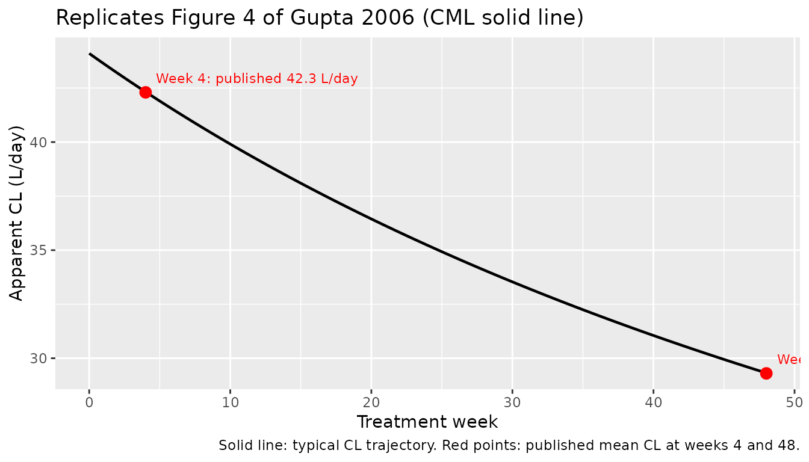
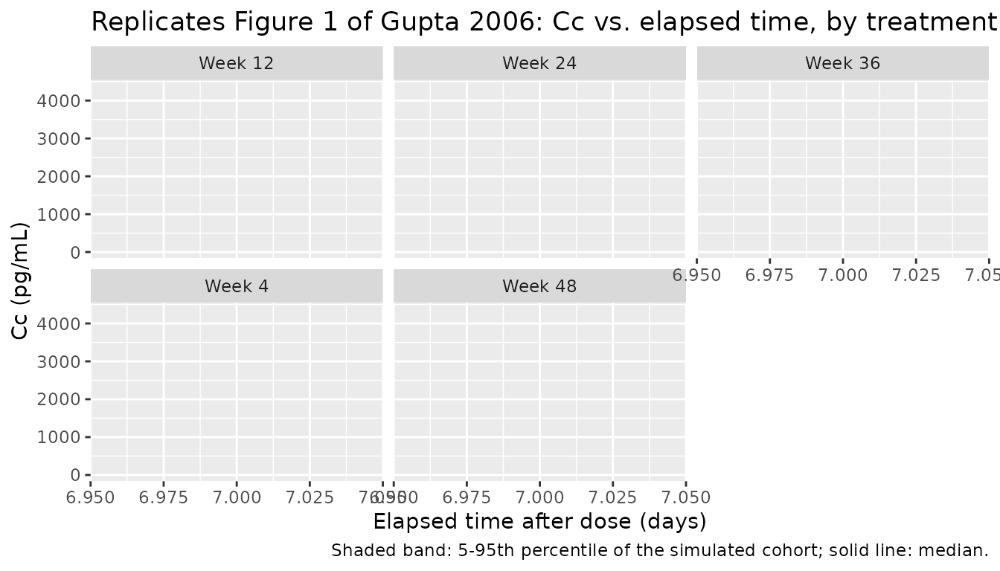

# Peginterferon alfa-2b (Gupta 2006)

## Model and source

- Citation: Gupta S, Jen J, Kolz K, Cutler D. Dose selection and
  population pharmacokinetics of PEGIntron in patients with chronic
  myelogenous leukaemia. Br J Clin Pharmacol. 2006;63(3):292-299.
  <doi:10.1111/j.1365-2125.2006.02757.x>
- Description: One-compartment population PK model with first-order
  subcutaneous absorption for peginterferon alfa-2b (PEG-Intron) in
  adult patients with chronic myelogenous leukaemia (Gupta 2006).
  Apparent clearance declines over treatment time via an Emax-type
  function CL(t) = CL0 / (1 + (t / T50)^beta) with beta fixed to 1 in
  the final model, so CL(t) = CL0 / (1 + t / T50). Cockcroft-Gault
  creatinine clearance modifies baseline clearance via a power form.
  Exponential IIV on CL0, T50, and V; proportional residual error on
  plasma concentration.
- Article: [Br J Clin Pharmacol.
  2006;63(3):292-299](https://doi.org/10.1111/j.1365-2125.2006.02757.x)

## Population

Gupta 2006 enrolled 137 adults (59 female / 78 male; 43.1% female) with
newly diagnosed chronic-phase chronic myelogenous leukaemia (CML) in a
randomised, multicentre, open-label, parallel-group Phase II/III trial
of PEG-Intron versus INTRON A. Baseline demographics (Gupta 2006 Table
1): age 51 years (range 20-75), body weight 74.3 kg (42-137), serum
creatinine 0.8 mg/dL (0.4-1.1, all within the normal range),
Cockcroft-Gault creatinine clearance 113 mL/min (53-223; the published
unit “ml h-1” in Table 1 is a typesetting error – the values are mL/min,
consistent with Table 3 footer’s “CLcr 120 ml min-1”). Race
distribution: 115 (83.9%) White, 3 (2.2%) Black, 19 (13.9%) Other. The
international cohort (n = 111) dominated the US cohort (n = 26).

PEG-Intron was administered subcutaneously once weekly at an initial
dose of 6.0 ug/kg/week with allowed dose reductions to 4.5 or 3.0
ug/kg/week (and discontinuation) based on individual tolerability;
treatment continued up to a maximum of 48 weeks. The PK analysis used
624 serum PEG-Intron concentrations collected as pre-dose troughs at
treatment weeks 4, 12, 24, 36, and 48 plus single post-dose samples on
weeks 12 (24 h), 24 (72 h), and 36 (120 h).

The same information is available programmatically via
`readModelDb("Gupta_2006_peginterferon_alfa_2b")$population`.

## Source trace

Per-parameter origin is recorded as an in-file comment next to each
`ini()` entry in
`inst/modeldb/specificDrugs/Gupta_2006_peginterferon_alfa_2b.R`. The
table below collects them for review.

| Equation / parameter | Value | Source location |
|----|----|----|
| `lcl` | `log(44.1)` L/day at CLcr 120 mL/min | Gupta 2006 Table 3 (theta_CL0) |
| `lt50` | `log(23.8 * 28)` = `log(666.4)` days | Gupta 2006 Table 3 (theta_T50 in 28-day units) |
| `lvc` | `log(149)` L | Gupta 2006 Table 3 (V) |
| `lka` (fixed) | `log(1.9)` 1/day | Gupta 2006 Table 3 (Ka, FIXED at Phase I CHC mean per refs 9-10) |
| `e_crcl_cl` | `0.21` | Gupta 2006 Table 3 (theta_CLcr) |
| `etalcl` IIV | `0.1156` (CV 35%) | Gupta 2006 Table 3 (omega(CV) CL0) -\> `omega^2 = log(0.35^2 + 1)` |
| `etalt50` IIV | `0.7833` (CV 109%) | Gupta 2006 Table 3 (omega(CV) T50) -\> `omega^2 = log(1.09^2 + 1)` |
| `etalvc` IIV | `0.2986` (CV 59%) | Gupta 2006 Table 3 (omega(CV) V) -\> `omega^2 = log(0.59^2 + 1)` |
| `propSd` | `0.414` (proportional CV 41.4%) | Gupta 2006 Table 3 (sigma_epsilon = 41.4; see Errata) |
| CL covariate form | `CL0 = 44.1 * (CRCL / 120)^0.21 * exp(eta_CL0)` | Gupta 2006 Methods covariate equation |
| Time-varying CL | `CL(t) = CL0 / (1 + (t / T50)^beta)`, beta = 1 fixed | Gupta 2006 Methods Emax-type decline; final model |
| One-compartment ODEs | `d depot/dt = -Ka depot`; `d central/dt = Ka depot - (CL/V) central`; `Cc = central/V` | Gupta 2006 Methods (one-compartment first-order absorption + elimination) |
| Residual error form | `Y = Cc * (1 + eps_prop)` | Gupta 2006 Table 3 sigma_epsilon = 41.4 interpreted as proportional CV (see Errata) |

## Virtual cohort

The Gupta 2006 patient-level data are not publicly available. The cohort
below samples baseline body weight and Cockcroft-Gault creatinine
clearance from log-normal distributions whose location and spread
approximate the cohort summary statistics in Gupta 2006 Table 1 (WT mean
74.3 kg, range 42-137; CRCL mean 113 mL/min, range 53-223). The race
distribution mirrors Table 1 proportions (84% White, 2% Black, 14%
Other); race is not used by the structural model (Gupta 2006 Table 2
Model 7: deltaOFV = 1.858, p = 0.173, not retained), so it is carried as
a label only.

``` r

set.seed(20260606)
n_subjects <- 200L

make_lognormal <- function(mu, sd, n) {
  s    <- sqrt(log(1 + (sd / mu)^2))
  mlog <- log(mu) - 0.5 * s^2
  exp(rnorm(n, mean = mlog, sd = s))
}

# Approximate SDs from Table 1 ranges via (max - min) / 4 (4 SDs of a normal
# span ~95% of values; this is a coarse but conservative imputation when only
# range is reported).
wt_mean <- 74.3; wt_sd <- (137 - 42) / 4
cr_mean <- 113;  cr_sd <- (223 - 53) / 4

cohort <- tibble::tibble(
  id   = seq_len(n_subjects),
  WT   = pmin(pmax(make_lognormal(wt_mean, wt_sd, n_subjects), 42), 137),
  CRCL = pmin(pmax(make_lognormal(cr_mean, cr_sd, n_subjects), 53), 223)
)

# 6.0 ug/kg/week SC for 48 weeks (the primary PEG-Intron regimen in Gupta 2006).
# Dose in ug (the unit used by the source paper); the model converts internally
# to ng/mL by Cc = central / vc when dose is in ug and V is in L.
dose_per_kg_ug <- 6.0
doses <- cohort |>
  tidyr::crossing(dose_week = 0:47) |>
  dplyr::mutate(
    time = dose_week * 7,
    amt  = dose_per_kg_ug * WT,
    cmt  = "depot",
    evid = 1L
  ) |>
  dplyr::select(id, time, amt, cmt, evid, WT, CRCL)

# Observation grid: dense around each dose to characterise SC absorption peak,
# plus a coarse grid over the 48-week treatment period.
post_dose_grid <- c(0, 0.25, 0.5, 1, 1.5, 2, 3, 4, 5, 6, 7) # days post each weekly dose
obs_grid_days  <- sort(unique(c(
  seq(0, 7 * 48, by = 7),                                              # weekly trough envelope
  unlist(lapply(c(4, 12, 24, 36, 48), function(wk) (wk - 1) * 7 + post_dose_grid))
)))

obs <- cohort |>
  tidyr::crossing(time = obs_grid_days) |>
  dplyr::mutate(amt = 0, cmt = NA_character_, evid = 0L) |>
  dplyr::select(id, time, amt, cmt, evid, WT, CRCL)

events <- dplyr::bind_rows(doses, obs) |>
  dplyr::arrange(id, time, dplyr::desc(evid))

stopifnot(!anyDuplicated(events[, c("id", "time", "evid", "amt")]))
```

## Simulation

``` r

mod <- rxode2::rxode(readModelDb("Gupta_2006_peginterferon_alfa_2b"))
#> ℹ parameter labels from comments will be replaced by 'label()'

sim <- rxode2::rxSolve(mod, events = events, keep = c("WT", "CRCL")) |>
  as.data.frame() |>
  tibble::as_tibble()
```

## Replicate published behavior

### Time-varying apparent clearance (replicates Figure 4 of Gupta 2006)

Gupta 2006 Figure 4 shows the population-mean PEG-Intron apparent
clearance declining smoothly over the 48-week treatment period (CML
solid line plus three chronic hepatitis C broken lines from earlier
studies). With the typical parameters held fixed (`zeroRe()`) and CRCL
set to the reference 120 mL/min, the model’s clearance trajectory is the
closed form `CL(t) = 44.1 / (1 + t / 666.4)` L/day. The plot below
evaluates it at the points Gupta 2006 highlights – weeks 4 (42.3 L/day)
and 48 (29.3 L/day) – and confirms a 30.8% reduction in clearance from
week 4 to week 48.

``` r

typical_cl <- function(t_days, cl0 = 44.1, t50 = 666.4) cl0 / (1 + t_days / t50)

cl_traj <- tibble::tibble(
  day    = seq(0, 7 * 48, length.out = 200),
  cl_pred = typical_cl(day)
) |>
  dplyr::mutate(week = day / 7)

cl_marks <- tibble::tibble(
  week   = c(4, 48),
  day    = week * 7,
  cl_pub = c(42.3, 29.3),
  label  = sprintf("Week %d: published %.1f L/day", week, cl_pub)
)

ggplot(cl_traj, aes(week, cl_pred)) +
  geom_line(linewidth = 0.8) +
  geom_point(data = cl_marks, aes(week, cl_pub),
             colour = "red", size = 3) +
  geom_text(data = cl_marks, aes(week, cl_pub, label = label),
            colour = "red", hjust = -0.05, vjust = -1, size = 3) +
  labs(x = "Treatment week", y = "Apparent CL (L/day)",
       title = "Replicates Figure 4 of Gupta 2006 (CML solid line)",
       caption = "Solid line: typical CL trajectory. Red points: published mean CL at weeks 4 and 48.")
```



``` r


# Numerical reproduction
reduction_pct <- 100 * (typical_cl(28) - typical_cl(336)) / typical_cl(28)
data.frame(
  week_4_pred_L_per_day  = round(typical_cl(28), 2),
  week_48_pred_L_per_day = round(typical_cl(336), 2),
  reduction_pct          = round(reduction_pct, 1)
)
#>   week_4_pred_L_per_day week_48_pred_L_per_day reduction_pct
#> 1                 42.32                  29.32          30.7
```

### Concentration profiles by treatment week (replicates Figure 1 of Gupta 2006)

Gupta 2006 Figure 1 plots immunoassay concentrations versus elapsed time
from the previous dose, broken out by treatment week (4, 12, 24, 36,
48). The plot below shows the simulated 5-50-95 percentile envelope of
`Cc` over the 0-7 day post-dose window for each of those weeks, with
concentrations converted from `ng/mL` to `pg/mL` (1 ng/mL = 1000 pg/mL)
to match the published y-axis units.

``` r

weeks_to_show <- c(4, 12, 24, 36, 48)

window <- sim |>
  dplyr::mutate(week = time / 7) |>
  dplyr::filter(week >= 3, week <= 48) |>
  dplyr::mutate(
    dose_week     = floor((week - 1) / 1) + 1,
    sample_week   = floor(week),
    elapsed_days  = time - (sample_week - 1) * 7
  ) |>
  dplyr::filter(sample_week %in% weeks_to_show, elapsed_days >= 0, elapsed_days <= 7) |>
  dplyr::group_by(sample_week, elapsed_days) |>
  dplyr::summarise(
    Cc_pg_per_mL_Q05 = quantile(Cc * 1000, 0.05, na.rm = TRUE),
    Cc_pg_per_mL_Q50 = quantile(Cc * 1000, 0.50, na.rm = TRUE),
    Cc_pg_per_mL_Q95 = quantile(Cc * 1000, 0.95, na.rm = TRUE),
    .groups = "drop"
  )

ggplot(window, aes(elapsed_days, Cc_pg_per_mL_Q50)) +
  geom_ribbon(aes(ymin = Cc_pg_per_mL_Q05, ymax = Cc_pg_per_mL_Q95), alpha = 0.25) +
  geom_line(linewidth = 0.8) +
  facet_wrap(~ paste("Week", sample_week)) +
  labs(x = "Elapsed time after dose (days)", y = "Cc (pg/mL)",
       title = "Replicates Figure 1 of Gupta 2006: Cc vs. elapsed time, by treatment week",
       caption = "Shaded band: 5-95th percentile of the simulated cohort; solid line: median.")
#> `geom_line()`: Each group consists of only one observation.
#> ℹ Do you need to adjust the group aesthetic?
#> `geom_line()`: Each group consists of only one observation.
#> ℹ Do you need to adjust the group aesthetic?
#> `geom_line()`: Each group consists of only one observation.
#> ℹ Do you need to adjust the group aesthetic?
#> `geom_line()`: Each group consists of only one observation.
#> ℹ Do you need to adjust the group aesthetic?
#> `geom_line()`: Each group consists of only one observation.
#> ℹ Do you need to adjust the group aesthetic?
```



### Typical-value Tmax sanity check

For a single dose with first-order absorption and first-order
elimination, the typical-value Tmax is `log(ka / kel) / (ka - kel)`.
Using the Table 3 point estimates at t = 0 (so CL = CL0) and CRCL = 120
mL/min:

``` r

ka  <- 1.9
cl0 <- 44.1
v   <- 149
kel0 <- cl0 / v
tmax_day  <- log(ka / kel0) / (ka - kel0)
tmax_hour <- tmax_day * 24
round(c(tmax_day = tmax_day, tmax_hour = tmax_hour), 2)
#>  tmax_day tmax_hour 
#>      1.16     27.82
```

The closed-form Tmax (~1.16 days, ~28 h) is consistent with the
published absorption profile (Gupta 2006 Figure 1 shows concentration
peaks within the first 24-72 h after dosing).

## PKNCA validation

We compute single-dosing-interval NCA over the week-4 and week-48 dosing
intervals (days 21-28 and days 329-336 respectively) and compare the
AUC-derived apparent clearance against the published values (42.3 L/day
at week 4, 29.3 L/day at week 48; Gupta 2006 Results). Concentrations
are kept in `ng/mL` so that `dose (ug) / AUC (ng*day/mL)` gives
clearance in `L/day` via the identity `1 ug / 1 ng/mL = 1 L`.

``` r

# Build a PKNCA conc + dose data set restricted to two intervals.
# Each interval is one weekly dose followed by a 7-day observation window.
make_interval_data <- function(sim_data, ev_data, week, label) {
  start_day <- (week - 1) * 7
  end_day   <- week * 7

  conc <- sim_data |>
    dplyr::filter(time >= start_day, time <= end_day, !is.na(Cc)) |>
    dplyr::mutate(time_in_interval = time - start_day, treatment = label) |>
    dplyr::select(id, time_in_interval, Cc, treatment) |>
    dplyr::rename(time = time_in_interval)

  conc <- dplyr::bind_rows(
    conc,
    conc |> dplyr::distinct(id, treatment) |>
      dplyr::mutate(time = 0, Cc = 0)
  ) |>
    dplyr::distinct(id, treatment, time, .keep_all = TRUE) |>
    dplyr::arrange(id, treatment, time)

  dose <- ev_data |>
    dplyr::filter(evid == 1L, time == start_day) |>
    dplyr::mutate(treatment = label, time = 0) |>
    dplyr::select(id, time, amt, treatment)

  list(conc = conc, dose = dose)
}

iv_wk4  <- make_interval_data(sim, events, week = 4,  label = "Week 4 (6 ug/kg/week)")
iv_wk48 <- make_interval_data(sim, events, week = 48, label = "Week 48 (6 ug/kg/week)")

conc_all <- dplyr::bind_rows(iv_wk4$conc, iv_wk48$conc)
dose_all <- dplyr::bind_rows(iv_wk4$dose, iv_wk48$dose)

conc_obj <- PKNCA::PKNCAconc(conc_all, Cc ~ time | treatment + id,
                             concu = "ng/mL", timeu = "day")
dose_obj <- PKNCA::PKNCAdose(dose_all, amt ~ time | treatment + id,
                             doseu = "ug")

intervals <- data.frame(
  start      = 0,
  end        = 7,
  cmax       = TRUE,
  tmax       = TRUE,
  auclast    = TRUE,
  cl.last    = TRUE
)

nca_res <- PKNCA::pk.nca(PKNCA::PKNCAdata(conc_obj, dose_obj,
                                          intervals = intervals))

nca_summary <- as.data.frame(nca_res$result) |>
  dplyr::filter(PPTESTCD %in% c("cmax", "tmax", "auclast", "cl.last")) |>
  dplyr::group_by(treatment, PPTESTCD) |>
  dplyr::summarise(median = stats::median(PPORRES, na.rm = TRUE),
                   q05    = stats::quantile(PPORRES, 0.05, na.rm = TRUE),
                   q95    = stats::quantile(PPORRES, 0.95, na.rm = TRUE),
                   .groups = "drop")

knitr::kable(nca_summary,
             digits = 3,
             caption = "Simulated single-interval NCA at weeks 4 and 48 (6 ug/kg/week SC).")
```

| treatment              | PPTESTCD | median |    q05 |    q95 |
|:-----------------------|:---------|-------:|-------:|-------:|
| Week 4 (6 ug/kg/week)  | auclast  | 10.935 |  4.725 | 23.494 |
| Week 4 (6 ug/kg/week)  | cl.last  | 40.394 | 22.612 | 71.383 |
| Week 4 (6 ug/kg/week)  | cmax     |  2.691 |  1.330 |  5.352 |
| Week 4 (6 ug/kg/week)  | tmax     |  1.000 |  1.000 |  1.500 |
| Week 48 (6 ug/kg/week) | auclast  | 18.077 |  7.058 | 40.919 |
| Week 48 (6 ug/kg/week) | cl.last  | 25.431 | 11.350 | 49.718 |
| Week 48 (6 ug/kg/week) | cmax     |  3.717 |  1.685 |  7.666 |
| Week 48 (6 ug/kg/week) | tmax     |  1.000 |  1.000 |  1.500 |

Simulated single-interval NCA at weeks 4 and 48 (6 ug/kg/week SC).
{.table}

### Comparison against published apparent clearance

Gupta 2006 reports the typical apparent clearance at week 4 = 42.3 L/day
and at week 48 = 29.3 L/day. The table below compares those published
values against the cohort-median `cl.last` (= dose / AUClast over the
7-day dosing interval) from the simulation.

``` r

published <- tibble::tibble(
  treatment = c("Week 4 (6 ug/kg/week)", "Week 48 (6 ug/kg/week)"),
  cl.last   = c(42.3, 29.3)
)

cmp <- nlmixr2lib::ncaComparisonTable(
  simulated     = nca_res,
  reference     = published,
  by            = "treatment",
  params        = "cl.last",
  units         = c(cl.last = "L/day"),
  tolerance_pct = 20
)
#> Warning: ncaParamLabel(): unknown PKNCA code(s) returned as-is: 'cl.last'

knitr::kable(cmp,
             caption = paste(
               "Simulated cohort-median apparent clearance (cohort-median",
               "cl.last from PKNCA) vs. published mean CL at weeks 4 and 48",
               "(Gupta 2006 Results). * differs from reference by >20%."
             ),
             align = c("l", "l", "r", "r", "r"))
```

| NCA parameter   | treatment              | Reference | Simulated | % diff |
|:----------------|:-----------------------|----------:|----------:|-------:|
| cl.last (L/day) | Week 4 (6 ug/kg/week)  |      42.3 |      40.4 |  -4.5% |
| cl.last (L/day) | Week 48 (6 ug/kg/week) |      29.3 |      25.4 | -13.2% |

Simulated cohort-median apparent clearance (cohort-median cl.last from
PKNCA) vs. published mean CL at weeks 4 and 48 (Gupta 2006 Results). \*
differs from reference by \>20%. {.table}

## Assumptions and deviations

- **Residual error parameterisation (interpretation of Table 3
  sigma_epsilon).** Gupta 2006 Table 3 reports a single residual term
  `sigma_epsilon = 41.4 +/- 84.2%` with a header unit `(l day-1)` that
  is a typesetting artifact (the residual is not a clearance; the
  published unit appears to be copied from the theta_CL0 row above). The
  Methods text describes a combined “multiplicative + additive” error
  model, but only one residual value is tabulated. We encode the 41.4
  value as a proportional residual CV of 41.4% (`propSd = 0.414`) on
  plasma concentration; the 84.2% is interpreted as the relative
  standard error on the estimate (high RSE reflects the sparse- sampling
  design). This is the interpretation that is dimensionally consistent
  with the ECL immunoassay reporting in pg/mL (LLOQ 50 pg/mL, assay CV
  12%, linear range 50-2000 pg/mL) and with sparsely-sampled popPK
  practice for this drug class (cf. Bi 2017 peginterferon alfa-2a, which
  reports residual proportional CV = 19.4% and additive SD = 0.32 ng/L).
  Downstream users who need a different residual structure should
  override `propSd` and/or add an `addSd` term.

- **Cockcroft-Gault creatinine clearance reference and units.** Gupta
  2006 Table 1 lists CLcr as “ml h-1” with cohort range 53-223; Table 3
  describes the reference patient as “CLcr 120 ml min-1”. The values
  themselves are in mL/min (a CLcr of 113 mL/h would correspond to a
  profoundly anuric adult, which is inconsistent with the cohort
  eligibility criteria). The model uses the canonical `CRCL` covariate
  column in mL/min with a reference value of 120 mL/min, matching the
  Table 3 footer.

- **Time-varying clearance and “elapsed time” definition.** The Methods
  section states `t` is “the elapsed time in days relative to the
  treatment starting day”. In the model file `t` is the rxode2 / nlmixr2
  `time` variable measured from the first event. As long as the events
  file places the first dose at `time = 0` and time is measured in days
  (the model’s declared time unit), `time` matches the paper’s `t`.

- **Beta fixed to 1.** The final-model `beta` (steepness parameter of
  the Emax-type clearance decline) was fixed at 1 in Gupta 2006 to avoid
  numerical difficulties (Results, “Covariate analysis and final
  model”). The model file encodes this simplification analytically –
  `beta` does not appear as a parameter; the time-varying-CL equation
  reduces to `CL(t) = CL0 / (1 + t / T50)`. A sensitivity analysis in
  the source paper showed +/- 20% perturbations of the fixed `beta` and
  `Ka` produced little change in the other parameter estimates.

- **IIV on V is in Table 3 but not in the Methods text.** The Methods
  section enumerates only `eta_CL0` and `eta_T50` as random effects, but
  Table 3 reports `omega(CV) = 59%` for V. The model file follows Table
  3 and carries an IIV term on V.

- **Race covariate.** Gupta 2006 Table 2 (Model 7) screened a binary
  RACE_OTHER indicator (1 = Black or Other, 0 = White; the paper pools
  the 3 Black and 19 Other patients into a single “other” category for
  fitting purposes). Race was not retained in the final model (deltaOFV
  = 1.858, p = 0.173). The screened covariates (WT, AGE, SEXF, CREAT,
  RACE_OTHER) are documented in `covariatesDataExcluded` so a user
  assembling a virtual cohort knows what was tested but not retained.

- **Cohort imputation for body weight and CRCL.** Gupta 2006 Table 1
  reports only mean and range for continuous covariates; SDs are not
  tabulated. The virtual cohort approximates SDs from the range via the
  heuristic `(max - min) / 4`, which is a coarse but conservative
  imputation when only the cohort range is reported. The structural
  model has no body-weight covariate effect, so the WT distribution
  affects only the per-subject weight-based dose; CRCL enters the model
  directly via the `(CRCL/120)^0.21` scaling on CL0.

- **Dose normalisation.** The simulated cohort dose is the
  protocol-recommended 6.0 ug/kg/week throughout the 48-week treatment
  course. Gupta 2006 permitted protocol-defined dose reductions to 4.5
  or 3.0 ug/kg/week based on individual tolerability; the simulation
  does not model the time-varying dose reductions, which would require
  subject-level adverse-event data that the publication does not
  provide.

- **Race / sex distribution not used by the structural model.** Race is
  carried in `population$race_ethnicity` for documentation but the
  structural model has no race effect; the virtual cohort does not need
  a race column to drive any simulation output.
