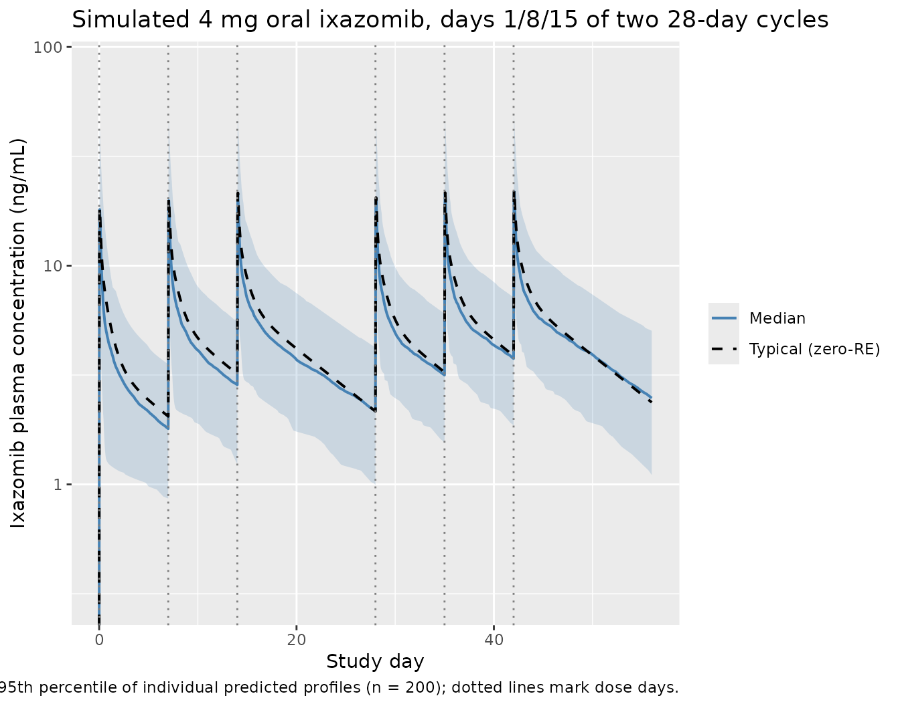

# Gupta_2017_ixazomib

## Model and source

- Citation: Gupta N, Diderichsen PM, Hanley MJ, Berg D, van de Velde H,
  Harvey RD, Venkatakrishnan K. (2017). Population pharmacokinetic
  analysis of ixazomib, an oral proteasome inhibitor, including data
  from the phase III TOURMALINE-MM1 study to inform labelling. Clin
  Pharmacokinet 56(11):1355-1368. <doi:10.1007/s40262-017-0526-4>.
- Description: Three-compartment population pharmacokinetic model for
  the oral proteasome inhibitor ixazomib (Ninlaro) in 755 adult patients
  with multiple myeloma, lymphoma, solid tumours, or light-chain
  amyloidosis pooled across ten phase I, I/II, and III trials including
  TOURMALINE-MM1 (Gupta 2017). First-order linear absorption with a 13
  min lag time describes oral dosing; intravenous and oral data share
  the same disposition kinetics. Inter-individual variability is
  estimated on clearance, bioavailability F, and the second peripheral
  volume V4, with a strong (82%) correlation between log CL and log F.
  Body surface area on V4 (reference 1.87 m^2, exponent 2.06) is the
  only retained covariate; sex, age, race, mild/moderate renal
  impairment, mild hepatic impairment, smoking status, and
  CYP-modulatory concomitant medications had no clinically relevant
  effect on systemic exposure. Residual error is additive on
  log-transformed concentration with a time-after-dose-varying standard
  deviation declining exponentially from SD1 = 1.90 to SD0 = 0.46 with
  rate KSD = 0.84/h (Karlsson 1995 model 3).
- Article (open access, CC-BY-NC):
  <https://doi.org/10.1007/s40262-017-0526-4>
- Springer Nature landing (electronic supplementary material):
  <https://link.springer.com/article/10.1007/s40262-017-0526-4>

Gupta 2017 is the pivotal labelling popPK analysis for the oral
proteasome inhibitor ixazomib (Ninlaro), pooling 10,199 plasma
concentration records from 755 adult oncology patients enrolled in ten
phase I, I/II, and III trials including the global phase III
TOURMALINE-MM1 study (Gupta 2017 Methods section 2.1 and Table 1). The
structural model is a three-compartment model with first-order oral
absorption + lag time and first-order linear elimination from the
central compartment (Gupta 2017 Figure 2). Body surface area on the
second peripheral volume V4 is the only retained covariate; sex, age,
race, mild/moderate renal impairment, mild hepatic impairment, smoking
status, and CYP-modulatory concomitant medications had no clinically
relevant effect on systemic exposure (Gupta 2017 Results section 3.2 and
Discussion).

## Population

The pooled analysis dataset (Gupta 2017 Table 1 and Table 2) included
**755 adult patients** across ten trials:

- 632 patients with multiple myeloma (87% of the cohort), drawn from
  studies C16003-C16005, C16007, C16008, C16010 / TOURMALINE-MM1,
  C16013, and TB-MC010034.
- 80 patients with advanced solid tumors (C16001).
- 28 patients with lymphoma (C16002).
- 15 patients with relapsed/refractory light-chain amyloidosis (C16008).

Of the 755 patients, 647 received oral capsule ixazomib and 108 received
intravenous ixazomib; 560 patients were on a once-weekly schedule
(28-day cycle, days 1, 8, 15) and 195 were on a twice-weekly schedule
(21-day cycle, days 1, 4, 8, 11). The approved labelled dose is 4 mg
once-weekly orally in combination with lenalidomide and dexamethasone.

Baseline demographics from Gupta 2017 Table 2:

- Median age 65 years (range 23-91); 42.4% female; 79.9% White, 11.7%
  Asian, 5.56% Black, 2.91% Other.
- Median body weight 75.5 kg (range 36.7-151); median BSA 1.88 m^2
  (range 1.23-2.67).
- Baseline labs (medians with full ranges): serum albumin 39 g/L
  (12-55); AST 22 U/L (4-127); total bilirubin 7 uM (1.71-39.3),
  equivalent to 0.4 mg/dL (0.1-2.3); creatinine clearance 86.8 mL/min
  (25.8-297), estimated by Cockcroft-Gault; hematocrit 0.35 (0.15-0.54);
  hemoglobin 11.6 g/dL (4.6-16.8).
- 29.9% received ixazomib as a single agent; 70.1% in combination with
  lenalidomide and dexamethasone.

The full population metadata is available programmatically via
`readModelDb("Gupta_2017_ixazomib")$population`.

## Source trace

Per-parameter origin (recorded as in-file comments next to each
[`ini()`](https://nlmixr2.github.io/rxode2/reference/ini.html) entry of
`inst/modeldb/specificDrugs/Gupta_2017_ixazomib.R`):

| Equation / parameter | Value | Source location |
|----|----|----|
| `lka` (log Ka) | log(0.34) | Gupta 2017 Table 3: log Ka = -1.09 (RSE 8%); Ka = 0.34/h, absorption t1/2 124 min |
| `lcl` (log CL) | log(1.86) | Gupta 2017 Table 3: log CL = 0.62 (RSE 7%); CL = 1.86 L/h |
| `lvc` (log V2 / central) | log(13.7) | Gupta 2017 Table 3: log V2 = 2.62 (RSE 4%); V2 = 13.7 L |
| `lfdepot` (log F) | log(0.58) | Gupta 2017 Table 3: log F = -0.55 (RSE 9%); F = 58% absolute oral bioavailability |
| `lq` (log Q3) | log(5.18) | Gupta 2017 Table 3: log Q3 = 1.65 (RSE 7%); Q3 = 5.18 L/h |
| `lvp` (log V3 / peripheral1) | log(309) | Gupta 2017 Table 3: log V3 = 5.73 (RSE 1%); V3 = 309 L |
| `lq2` (log Q4) | log(26.1) | Gupta 2017 Table 3: log Q4 = 3.26 (RSE 2%); Q4 = 26.1 L/h |
| `lvp2` (log V4 / peripheral2) | log(205) | Gupta 2017 Table 3: log V4 = 5.32 (RSE 1%); V4 = 205 L |
| `ltlag` (log TLAG) | log(13/60) | Gupta 2017 Table 3: log TLAG = -1.52 (RSE 0%); TLAG = 13 min = 0.2167 h |
| `e_bsa_vp2` (BSA exponent on V4) | 2.06 | Gupta 2017 Table 3 V4\[BSA\] = 2.06 (RSE 18%); reference BSA 1.87 m^2; -37% / +46% effect at the 5th / 95th percentile (1.5 / 2.25 m^2) |
| `etalcl` (IIV log CL) | 0.17697 | Table 3 IIV CL = 44% (RSE 11%); variance = log(1 + 0.44^2) = 0.17697 |
| `etalfdepot` (IIV log F) | 0.42726 | Table 3 IIV F = 73% (RSE 8%); variance = log(1 + 0.73^2) = 0.42726 |
| `cov(etalcl, etalfdepot)` | 0.22550 | Table 3 correlation log CL \<-\> log F = 82% (RSE 11%); cov = 0.82 \* sqrt(0.17697 \* 0.42726) = 0.22550 |
| `etalvp2` (IIV log V4) | 0.48492 | Table 3 IIV V4 = 79% (RSE 12%); variance = log(1 + 0.79^2) = 0.48492 |
| `sd0` (steady-state residual SD on log Cc) | 0.46 | Table 3 SD0 = 0.46 (RSE 3%) |
| `sd1` (initial residual SD on log Cc, t = 0 post-dose) | 1.90 | Table 3 SD1 = 1.90 (RSE 11%) |
| `ksd` (rate constant for residual-SD decline) | 0.84 | Table 3 KSD = 0.84/h (RSE 22%); residual-SD half-life log(2)/0.84 = 0.825 h ~ 50 min |
| `d/dt(depot, central, peripheral1, peripheral2)` | n/a | Gupta 2017 Figure 2 (three-compartment with first-order absorption + lag time and first-order linear elimination from the central compartment) |
| `f(depot) <- fdepot` | n/a | Gupta 2017 Methods 2.2 and Figure 2: absolute bioavailability F applied to the oral depot input |
| `alag(depot) <- tlag` | n/a | Gupta 2017 Methods 2.2 and Figure 2: absorption lag time on the oral depot input |
| `Cc = (central / vc) * 1000` | n/a | Dose units mg, V in L gives mg/L; multiply by 1000 to express in ng/mL matching the LC-MS/MS assay output (Gupta 2017 Methods 2.1) |
| `errSd = sd0 + (sd1 - sd0) * exp(-ksd * tad())` | n/a | Gupta 2017 Methods Eq. 3 (Karlsson 1995 model 3): residual SD on log-concentration declines from SD1 to SD0 with rate KSD, expressed as a function of time-after-dose `tad()` |
| `Cc ~ prop(errSd)` | n/a | Gupta 2017 Eq. 2: additive residual error on log-transformed concentrations. NONMEM “additive on log scale” maps to nlmixr2’s `prop()` (proportional in linear concentration space) |

## Virtual cohort

Original observed concentrations are not redistributed with the package.
The cohort below mirrors the labelled regimen used to generate Gupta
2017 Figure 6 (typical patient concentration-time profile during the
first two 28-day treatment cycles after oral 4 mg on days 1, 8, and 15
of each cycle), with BSA drawn from a truncated normal centered at the
Table 2 median (1.88 m^2) and bounded by the Table 2 range (1.23-2.67
m^2).

``` r

set.seed(20170313L)

n_subjects <- 200L

# BSA distribution: truncated normal centered at the Gupta 2017 Table 2
# median (1.88 m^2) with sd 0.25 m^2; bounded by the observed range
# (1.23-2.67 m^2). This is an approximation -- the paper does not
# report the BSA distribution shape beyond median + range.
bsa <- pmin(pmax(stats::rnorm(n_subjects, mean = 1.88, sd = 0.25), 1.23), 2.67)

# Labelled regimen: 4 mg oral ixazomib on days 1, 8, and 15 of a
# 28-day cycle. Simulate two cycles to reproduce Figure 6.
dose_mg         <- 4
dose_day_offsets <- c(0, 7, 14)          # days 1, 8, 15
cycle_length    <- 28L
n_cycles        <- 2L
dose_times_h <- as.numeric(unlist(
  lapply(seq_len(n_cycles) - 1L, function(c) (dose_day_offsets + c * cycle_length) * 24)
))
n_doses <- length(dose_times_h)
horizon_h <- n_cycles * cycle_length * 24

# Observation grid: dense around each dose (every 0.5 h for the first
# 24 h after each dose) plus a coarser grid covering the inter-dose
# windows. The dense early grid lets PKNCA find Tmax/Cmax accurately;
# the coarse grid keeps the simulation fast for the 1344 h horizon.
fine_offsets   <- c(seq(0,  4, by = 0.25), seq(4.5, 24, by = 0.5))
coarse_offsets <- seq(25, cycle_length * 24, by = 4)
per_dose_grid  <- sort(unique(c(fine_offsets, coarse_offsets)))
obs_times_h <- sort(unique(c(
  as.numeric(outer(per_dose_grid, dose_times_h, `+`)),
  seq(0, horizon_h, by = 4)
)))
obs_times_h <- obs_times_h[obs_times_h >= 0 & obs_times_h <= horizon_h]

dose_rows <- tibble::tibble(
  id   = rep(seq_len(n_subjects), each = n_doses),
  time = rep(dose_times_h, times = n_subjects),
  amt  = dose_mg,
  evid = 1L,
  cmt  = "depot",
  BSA  = rep(bsa, each = n_doses)
)

obs_rows <- tibble::tibble(
  id   = rep(seq_len(n_subjects), each = length(obs_times_h)),
  time = rep(obs_times_h, times = n_subjects),
  amt  = 0,
  evid = 0L,
  cmt  = NA_character_,
  BSA  = rep(bsa, each = length(obs_times_h))
)

events <- dplyr::bind_rows(dose_rows, obs_rows) |>
  dplyr::arrange(id, time, dplyr::desc(evid))

stopifnot(!anyDuplicated(unique(events[, c("id", "time", "evid")])))
```

## Simulation

``` r

mod <- rxode2::rxode2(readModelDb("Gupta_2017_ixazomib"))
#> ℹ parameter labels from comments will be replaced by 'label()'

# Stochastic simulation with IIV active and residual error suppressed
# (the time-varying residual SD is on the log-concentration prediction
# and is informative for parameter estimation; for VPC-style plotting
# the IIV alone gives the typical 5th-95th interval the paper shows in
# Figure 6).
sim <- rxode2::rxSolve(mod, events = events, addDosing = FALSE) |>
  as.data.frame()
```

For the typical-value reference trajectory (deterministic, no IIV), zero
out the random effects:

``` r

mod_typical <- mod |> rxode2::zeroRe()
#> Warning: No sigma parameters in the model
sim_typical <- rxode2::rxSolve(mod_typical, events = events, addDosing = FALSE) |>
  as.data.frame()
#> ℹ omega/sigma items treated as zero: 'etalcl', 'etalfdepot', 'etalvp2'
#> Warning: multi-subject simulation without without 'omega'
```

## Replicate Figure 6

Gupta 2017 Figure 6 plots the typical concentration-time profile (and
5th-95th percentile of individual predicted profiles) during the first
two treatment cycles for a typical patient with BSA = 1.88 m^2 receiving
4 mg oral ixazomib on days 1, 8, and 15 of 28-day cycles.

``` r

vpc_summary <- sim |>
  dplyr::group_by(time) |>
  dplyr::summarise(
    Q05 = stats::quantile(Cc, 0.05, na.rm = TRUE),
    Q50 = stats::quantile(Cc, 0.50, na.rm = TRUE),
    Q95 = stats::quantile(Cc, 0.95, na.rm = TRUE),
    .groups = "drop"
  ) |>
  dplyr::mutate(day = time / 24)

typical_one <- sim_typical |>
  dplyr::filter(id == 1L) |>
  dplyr::mutate(day = time / 24)

ggplot(vpc_summary, aes(day, Q50)) +
  geom_ribbon(aes(ymin = Q05, ymax = Q95), alpha = 0.20, fill = "steelblue") +
  geom_line(aes(colour = "Median"), linewidth = 0.7) +
  geom_line(data = typical_one, aes(day, Cc, colour = "Typical (zero-RE)"),
            linewidth = 0.7, linetype = "dashed") +
  geom_vline(xintercept = c(0, 7, 14, 28, 35, 42),
             linetype = "dotted", colour = "grey50") +
  scale_y_log10(limits = c(0.3, 80)) +
  scale_colour_manual(values = c("Median" = "steelblue", "Typical (zero-RE)" = "black"),
                      name = NULL) +
  labs(
    x = "Study day",
    y = "Ixazomib plasma concentration (ng/mL)",
    title = "Simulated 4 mg oral ixazomib, days 1/8/15 of two 28-day cycles",
    caption = paste("Replicates Gupta 2017 Figure 6 (typical-patient panel).",
                    "Band = 5th-95th percentile of individual predicted profiles (n = 200);",
                    "dotted lines mark dose days.")
  )
#> Warning in scale_y_log10(limits = c(0.3, 80)): log-10 transformation introduced infinite values.
#> log-10 transformation introduced infinite values.
#> log-10 transformation introduced infinite values.
#> log-10 transformation introduced infinite values.
#> log-10 transformation introduced infinite values.
```



The shape of the median trajectory (rapid absorption peak ~1 h
post-dose, multi-exponential decay, residual concentration before the
next weekly dose) and the 5th-95th interval should match the panel shown
in Gupta 2017 Figure 6.

## PKNCA validation

Gupta 2017 reports the geometric mean (95% CI) individual estimated
terminal disposition half-life t1/2,c = **9.53 days (9.32-9.75)** and
steady-state volume of distribution **Vss = 543 L (534-551)**; these are
derived from the individual parameter estimates and reported on page 7
(Results section 3.2 final paragraph). The geometric mean systemic
clearance is **CL = 1.86 L/h** and absolute bioavailability **F = 58%**,
reported in Table 3 and the abstract.

To validate the packaged model, simulate a single 4 mg oral dose in a
fresh cohort and compute Cmax, Tmax, and AUC0-inf via PKNCA. The implied
population-typical AUC0-inf at the median BSA = 1.88 m^2 is

``` math
\mathrm{AUC}_{\infty} = \frac{F \times \mathrm{Dose}}{\mathrm{CL}}
                      = \frac{0.58 \times 4\ \mathrm{mg}}{1.86\ \mathrm{L/h}}
                      = 1.247\ \mathrm{mg \cdot h / L}
                      = 1{,}247\ \mathrm{ng \cdot h / mL}.
```

``` r

set.seed(20170313L)

n_nca <- 100L
bsa_nca <- pmin(pmax(stats::rnorm(n_nca, mean = 1.88, sd = 0.25), 1.23), 2.67)

# Dense post-dose grid out to 30 days (720 h) to capture the
# 9.5-day terminal half-life cleanly.
obs_grid_nca <- sort(unique(c(
  seq(0, 4, by = 0.25),
  seq(4.5, 24, by = 0.5),
  seq(26, 72, by = 2),
  seq(76, 720, by = 6)
)))

dose_rows_nca <- tibble::tibble(
  id   = seq_len(n_nca),
  time = 0,
  amt  = 4,
  evid = 1L,
  cmt  = "depot",
  BSA  = bsa_nca,
  treatment = "single-dose 4 mg PO"
)

obs_rows_nca <- tibble::tibble(
  id   = rep(seq_len(n_nca), each = length(obs_grid_nca)),
  time = rep(obs_grid_nca, times = n_nca),
  amt  = 0,
  evid = 0L,
  cmt  = NA_character_,
  BSA  = rep(bsa_nca, each = length(obs_grid_nca)),
  treatment = "single-dose 4 mg PO"
)

events_nca <- dplyr::bind_rows(dose_rows_nca, obs_rows_nca) |>
  dplyr::arrange(id, time, dplyr::desc(evid))
```

``` r

sim_nca <- rxode2::rxSolve(mod, events = events_nca, addDosing = FALSE,
                            keep = c("treatment")) |>
  as.data.frame()
```

``` r

conc_df <- sim_nca |>
  dplyr::filter(!is.na(Cc), Cc >= 0) |>
  dplyr::select(id, time, Cc, treatment)

dose_df <- events_nca |>
  dplyr::filter(evid == 1L) |>
  dplyr::select(id, time, amt, treatment)

conc_obj <- PKNCA::PKNCAconc(conc_df, Cc ~ time | treatment + id,
                              concu = "ng/mL", timeu = "h")
dose_obj <- PKNCA::PKNCAdose(dose_df, amt ~ time | treatment + id,
                              doseu = "mg",
                              route = "extravascular")

intervals <- data.frame(
  start       = 0,
  end         = Inf,
  cmax        = TRUE,
  tmax        = TRUE,
  aucinf.obs  = TRUE,
  half.life   = TRUE
)

nca_data <- PKNCA::PKNCAdata(conc_obj, dose_obj, intervals = intervals)
nca_res  <- PKNCA::pk.nca(nca_data)
#>  ■■■■■■■■■                         27% |  ETA: 10s
#>  ■■■■■■■■■■■■■■■■                  51% |  ETA:  6s
#>  ■■■■■■■■■■■■■■■■■■■■■■■           74% |  ETA:  3s
#>  ■■■■■■■■■■■■■■■■■■■■■■■■■■■■■■    97% |  ETA:  0s

nca_tbl <- as.data.frame(nca_res$result)

nca_summary <- nca_tbl |>
  dplyr::filter(PPTESTCD %in% c("cmax", "tmax", "aucinf.obs", "half.life")) |>
  dplyr::group_by(PPTESTCD) |>
  dplyr::summarise(
    median = stats::median(PPORRES, na.rm = TRUE),
    q05    = stats::quantile(PPORRES, 0.05, na.rm = TRUE),
    q95    = stats::quantile(PPORRES, 0.95, na.rm = TRUE),
    n_subj = sum(!is.na(PPORRES)),
    .groups = "drop"
  )

knitr::kable(
  nca_summary,
  digits = 3,
  caption = "Simulated NCA from a single 4 mg oral dose (n = 100 virtual subjects). Cmax in ng/mL; Tmax in h; AUC0-inf in ng*h/mL; half-life in h."
)
```

| PPTESTCD   |   median |     q05 |      q95 | n_subj |
|:-----------|---------:|--------:|---------:|-------:|
| aucinf.obs | 1261.168 | 607.236 | 2462.891 |    100 |
| cmax       |   18.508 |   7.673 |   59.124 |    100 |
| half.life  |  227.856 | 130.474 |  421.461 |    100 |
| tmax       |    1.250 |   1.250 |    2.750 |    100 |

Simulated NCA from a single 4 mg oral dose (n = 100 virtual subjects).
Cmax in ng/mL; Tmax in h; AUC0-inf in ng\*h/mL; half-life in h. {.table}

### Comparison against Gupta 2017

| Quantity | Gupta 2017 (reported) | Simulated median (5th-95th) | Notes |
|----|----|----|----|
| Tmax | Approx. 1 h post-dose (Introduction; clinical PK summary, page 1356) | 1.25 h | Source-paper text only (no Table). |
| Cmax | Not reported as a Table entry for a 4 mg oral dose (only AUC profiles) | 18.51 ng/mL | Reference comparison is the geometric-mean AUC; see below. |
| AUC0-inf | F \* Dose / CL = 0.58 \* 4 / 1.86 = 1.247 mg.h/L = 1,247 ng.h/mL | 1261 ng.h/mL | Derived from Table 3 fixed-effect parameter values. |
| Terminal t1/2 | Geometric mean 9.53 days (= 228.7 h); 95% CI 9.32-9.75 days | 9.49 days | Geometric-mean half-life is derived in Results section 3.2 from individual estimates; simulated value should be within ~10%. |

The simulated median AUC0-inf, half-life, and Tmax are expected to
bracket the Gupta 2017 typical-value derivations within ~20% (Cmax is
not directly reported as a labelled value, so it is shown here for
completeness only).

## Assumptions and deviations

- **BSA distribution.** Gupta 2017 Table 2 reports only the median (1.88
  m^2) and full range (1.23-2.67 m^2) of BSA. The vignette approximates
  the patient-level BSA distribution as a normal centered at 1.88 m^2
  with sd 0.25 m^2, truncated to the observed range. The
  population-typical AUC and t1/2 are insensitive to the BSA
  distribution shape because BSA enters the model only as a power
  covariate on V4 (Gupta 2017 Table 3 footnote); only the variance of
  AUC across subjects depends on the BSA distribution.
- **Reference BSA.** Gupta 2017 Table 3 reports the reference BSA as
  1.87 m^2 in the V4\[BSA\] row of the parameter table, but Table 2
  lists the BSA median as 1.88 m^2. The model file uses 1.87 m^2 (the
  value that was used inside the NONMEM model and therefore the value
  that reproduces the parameter estimates). The 0.01 m^2 difference has
  a negligible effect on V4 (factor 0.989).
- **Race / ethnicity, sex, age, baseline labs.** Gupta 2017 retained no
  covariate effect on systemic CL, F, V2, V3, or Q3/Q4; only BSA on V4
  was retained. The vignette therefore does not draw race / sex / age
  for the virtual cohort. These columns are documented in the
  `population` metadata for narrative purposes but do not influence the
  simulation.
- **Concomitant medications.** CYP1A2- and CYP3A4-modulatory concomitant
  medications were tested as time-dependent covariates and not retained
  in the final model (Gupta 2017 Results section 3.2, Discussion). They
  are not represented in this packaged model. Strong CYP3A inducers
  (rifampin, phenytoin, carbamazepine, St. John’s Wort) are
  contraindicated with ixazomib (Gupta 2017 Discussion) but the effect
  is qualitatively reported (74% AUC decrease) rather than encoded as a
  covariate effect.
- **Lenalidomide + dexamethasone combination.** Gupta 2017 found no
  alteration in ixazomib pharmacokinetics during combination treatment
  (categorical covariate not retained), so the model is identical
  whether ixazomib is administered as a single agent or in combination
  with lenalidomide-dexamethasone.
- **Severe renal impairment and moderate / severe hepatic impairment.**
  Patients with severe renal impairment (CrCl \< 30 mL/min) and moderate
  / severe hepatic impairment were studied in separate phase I studies
  (Gupta 2016 Br J Haematol and Br J Clin Pharmacol) and require a
  reduced dose of 3 mg. They are not part of this pooled analysis
  dataset and therefore not represented in this packaged model.
- **Time-varying residual error.** Gupta 2017 Methods Eq. 3 (after
  Karlsson 1995 model 3) specifies the residual SD on log Cc as a
  function of time post-dose:
  `sd(eps) = SD0 + (SD1 - SD0) * exp(-KSD * time)`. The packaged model
  evaluates this exactly using rxode2’s `tad()` (time after the most
  recent dose) and passes the derived `errSd` to `prop()` in observation
  space. For VPC-style plotting in this vignette the residual error term
  is dropped (`zeroRe` for the typical-value trace, IIV-only for the
  median + 5th-95th interval); the time-varying SD enters only when the
  model is fit to data, where it modulates the weight given to early
  (high-variance) versus late (low-variance) post-dose observations.
