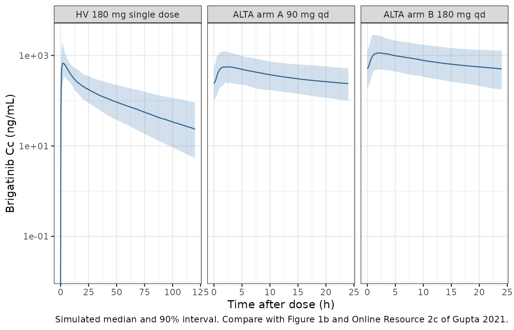

# Brigatinib (Gupta 2021)

## Model and source

- Citation: Gupta N, Wang X, Offman E, Prohn M, Narasimhan N, Kerstein
  D, Hanley MJ, Venkatakrishnan K. (2021). Population Pharmacokinetics
  of Brigatinib in Healthy Volunteers and Patients With Cancer. Clin
  Pharmacokinet 60:235-247. <doi:10.1007/s40262-020-00929-4>.
- Description: Three-compartment population PK model for oral brigatinib
  in healthy volunteers and patients with cancer (mostly ALK-positive
  non-small cell lung cancer) (Gupta 2021). Absorption follows the Savic
  transit compartment model (a non-integer number of transit
  compartments with inter-individual variability, and a mean transit
  time) feeding the central compartment directly, with no separate
  first-order absorption step. Elimination is linear from the central
  compartment. Apparent clearance carries a power effect of serum
  albumin centred on 38 g/L; inter-individual variability is on CL/F and
  V1/F (correlated), on the first peripheral volume, and on both transit
  parameters, with a proportional residual error.
- Article: <https://doi.org/10.1007/s40262-020-00929-4> (open access)

Brigatinib is an oral ALK tyrosine kinase inhibitor. Gupta et al. pooled
plasma concentrations from three phase I healthy-volunteer studies, a
phase I/II dose-escalation study in advanced malignancies and the phase
II ALTA trial in crizotinib-refractory ALK-positive NSCLC, and fitted a
three-compartment model with Savic transit-compartment absorption in
NONMEM 7.3 (FOCE). Serum albumin on apparent clearance was the only
covariate kept in the final model.

## Population

The analysis included 442 participants (105 healthy volunteers and 337
patients with cancer, 201 of them with ALK-positive NSCLC) from five
studies (Gupta 2021 Table 1). Median (range) age was 52 (18-83) years,
body weight 73 (41-172) kg and albumin 38 (20-56) g/L; 48.6% were
female; 68.8% were White, 23.3% Asian, 5.9% Black and 2.0% other (Table
2). Healthy volunteers received single 90, 120 or 180 mg doses; patients
received 30-300 mg once daily or 60-120 mg twice daily (phase I/II) or
90 mg once daily or 180 mg once daily after a 7-day 90 mg lead-in
(ALTA). 6086 samples were available, of which 355 were excluded (Section
3.1).

The same information is available programmatically:

``` r

str(rxode2::rxode(readModelDb("Gupta_2021_brigatinib"))$population)
#> ℹ parameter labels from comments will be replaced by 'label()'
#> List of 14
#>  $ species       : chr "human"
#>  $ n_subjects    : int 442
#>  $ n_studies     : int 5
#>  $ age_range     : chr "18-83 years"
#>  $ age_median    : chr "52 years"
#>  $ weight_range  : chr "41-172 kg"
#>  $ weight_median : chr "73 kg"
#>  $ sex_female_pct: num 48.6
#>  $ race_ethnicity: Named num [1:4] 68.8 23.3 5.9 2
#>   ..- attr(*, "names")= chr [1:4] "White" "Asian" "Black" "Other"
#>  $ disease_state : chr "105 healthy volunteers and 337 patients with cancer (201 with ALK-positive NSCLC from the phase II ALTA trial; "| __truncated__
#>  $ dose_range    : chr "Single oral doses of 90, 120 or 180 mg (healthy volunteers); 30-300 mg qd or 60-120 mg bid (phase I/II); 90 mg "| __truncated__
#>  $ albumin       : chr "38 (20-56) g/L, median (range)"
#>  $ egfr          : chr "85.6 (32.7-277.5) mL/min/1.73 m^2, median (range)"
#>  $ notes         : chr "Demographics from Gupta 2021 Table 2; studies from Table 1. 6086 PK samples, of which 247 below the LLOQ, 80 wi"| __truncated__
```

## Source trace

| Equation / parameter | Value | Source location |
|----|----|----|
| `lcl` (CL/F) | log(10.6) L/h | Table 3 |
| `lvc` (V1/F) | log(207) L | Table 3 |
| `lq` (Q1/F) | log(12.6) L/h | Table 3 |
| `lvp` (V2/F) | log(114) L | Table 3 |
| `lq2` (Q2/F) | log(2.7) L/h | Table 3 |
| `lvp2` (V3/F) | log(78.5) L | Table 3 |
| `lntr` (number of transit compartments) | fixed(log(2.35)) | Table 3 and footnote c; Section 3.2 |
| `lmtt` (mean transit time) | log(0.9) h | Table 3 |
| `e_alb_cl` | 0.661 | Table 3, `x (albumin/38)^0.661`; Figure 1a |
| `etalcl`, `etalvc` | 0.484^2, 0.556^2 | Table 3 (IIV = sqrt(omega^2) x 100%, footnote a) |
| CL/F-V1/F covariance | 0.228 | Table 3 |
| `etalvp` | 0.952^2 | Table 3 (IIV on V2/F) |
| `etalntr` | 1.03^2 | Table 3 |
| `etalmtt` | 0.59^2 | Table 3 |
| `propSd` | 0.269 | Table 3 (SD scale; see Assumptions) |
| IIV form `theta_i = theta_TV * exp(eta_i)` | n/a | Section 2.2, Equation 1 |
| Covariate form `theta_TV * (Cov / Cov_ref)^theta_eff` | n/a | Section 2.3, Equation 3 |
| Structure: transit chain -\> central; central \<-\> two peripherals; CL/F from central | n/a | Figure 1a |
| Transit rate `ktr = (ntr + 1) / mtt` and gamma-density input | n/a | Savic transit model cited in Section 2.2 and Figure 1a |

## Deterministic checks against the paper

``` r

mod <- readModelDb("Gupta_2021_brigatinib")
ui <- rxode2::rxode(mod)
#> ℹ parameter labels from comments will be replaced by 'label()'
mod_typical <- rxode2::zeroRe(ui)
theta <- setNames(ui$iniDf$est, ui$iniDf$name)
```

### Albumin effect (Section 3.2 and Figure 4)

Section 3.2 states that patients at the 5th and 95th percentiles of
albumin have approximately 22% lower and 20% higher CL/F than a patient
at the median. Figure 4 prints those percentiles as 38 (26, 50). The
model’s albumin term is solved at those three values and the resulting
steady-state AUC ratios are shown against the Figure 4 “influence of
baseline albumin” bar.

``` r

# 180 mg once daily for 30 days; AUC over the last dosing interval.
# A fine grid over the absorption phase keeps the trapezoidal AUC exact to
# well under 0.1%.
tau <- 24
n_doses <- 30
t_last <- (n_doses - 1) * tau
obs_times <- sort(unique(c(
  seq(0, t_last, by = 2),
  t_last + c(seq(0, 6, by = 0.02), seq(6.25, tau, by = 0.25))
)))
ev_ss <- rxode2::et(amt = 180, cmt = "depot", ii = tau, addl = n_doses - 1) |>
  rxode2::et(obs_times, cmt = "central") |>
  as.data.frame()
alb_levels <- c(26, 38, 50)
ev_alb <- dplyr::bind_rows(lapply(seq_along(alb_levels), function(i) {
  dplyr::mutate(ev_ss, id = i, ALB = alb_levels[i])
}))
```

``` r

trap_auc <- function(time, conc) {
  sum(diff(time) * (head(conc, -1) + tail(conc, -1)) / 2)
}
sim_alb <- rxode2::rxSolve(
  mod_typical, events = ev_alb, rtol = 1e-10, atol = 1e-12,
  returnType = "data.frame"
)
#> ℹ omega/sigma items treated as zero: 'etalcl', 'etalvc', 'etalvp', 'etalntr', 'etalmtt'
#> Warning: multi-subject simulation without without 'omega'
alb_tab <- sim_alb |>
  dplyr::filter(time >= t_last) |>
  dplyr::group_by(id) |>
  dplyr::summarise(
    cl = cl[1],
    auc_tau = trap_auc(time, Cc),
    .groups = "drop"
  ) |>
  dplyr::mutate(ALB = alb_levels[id])
cl_med <- alb_tab$cl[alb_tab$ALB == 38]
auc_med <- alb_tab$auc_tau[alb_tab$ALB == 38]
alb_tab <- alb_tab |>
  dplyr::mutate(
    cl_pct_vs_median = 100 * (cl / cl_med - 1),
    auc_fold_vs_median = auc_tau / auc_med,
    paper_cl_pct = c(-22, 0, 20)
  )
alb_tab |>
  dplyr::select(ALB, cl, cl_pct_vs_median, paper_cl_pct, auc_fold_vs_median) |>
  dplyr::rename(
    "Albumin (g/L)" = ALB,
    "CL/F (L/h)" = cl,
    "CL/F change vs median, model (%)" = cl_pct_vs_median,
    "CL/F change vs median, Section 3.2 (%)" = paper_cl_pct,
    "AUCss fold vs median" = auc_fold_vs_median
  ) |>
  knitr::kable(digits = 3, caption = "Albumin effect at the Figure 4 percentiles.")
```

| Albumin (g/L) | CL/F (L/h) | CL/F change vs median, model (%) | CL/F change vs median, Section 3.2 (%) | AUCss fold vs median |
|---:|---:|---:|---:|---:|
| 26 | 8.248 | -22.186 | -22 | 1.285 |
| 38 | 10.600 | 0.000 | 0 | 1.000 |
| 50 | 12.708 | 19.890 | 20 | 0.834 |

Albumin effect at the Figure 4 percentiles. {.table}

``` r


stopifnot(
  nrow(alb_tab) == 3,
  # Section 3.2 rounds to whole percent; the model gives -22.2% and +19.9%.
  abs(alb_tab$cl_pct_vs_median[1] - (-22)) < 0.6,
  abs(alb_tab$cl_pct_vs_median[3] - 20) < 0.6
)
```

The AUC fold-changes (about 0.83 and 1.29) match the span of the hatched
albumin bar in Figure 4.

### Inter-individual variability (Section 3.3)

Section 3.3 translates the IIV into 90% ranges: CL/F 4.8 to 24.0 L/h and
V1/F 83 to 520 L. These follow directly from the variances in `ini()`.

``` r

omega <- ui$omega
z95 <- qnorm(0.95)
iiv_tab <- data.frame(
  parameter = c("CL/F (L/h)", "V1/F (L)"),
  typical = exp(c(theta[["lcl"]], theta[["lvc"]])),
  sd_eta = sqrt(c(omega["etalcl", "etalcl"], omega["etalvc", "etalvc"])),
  paper_p05 = c(4.8, 83),
  paper_p95 = c(24.0, 520)
) |>
  dplyr::mutate(
    model_p05 = typical * exp(-z95 * sd_eta),
    model_p95 = typical * exp(z95 * sd_eta)
  )
iiv_tab |>
  dplyr::select(parameter, typical, model_p05, paper_p05, model_p95, paper_p95) |>
  dplyr::rename(
    "Parameter" = parameter,
    "Typical" = typical,
    "5th pct, model" = model_p05,
    "5th pct, Section 3.3" = paper_p05,
    "95th pct, model" = model_p95,
    "95th pct, Section 3.3" = paper_p95
  ) |>
  knitr::kable(digits = 1, caption = "IIV 90% ranges.")
```

| Parameter | Typical | 5th pct, model | 5th pct, Section 3.3 | 95th pct, model | 95th pct, Section 3.3 |
|:---|---:|---:|---:|---:|---:|
| CL/F (L/h) | 10.6 | 4.8 | 4.8 | 23.5 | 24 |
| V1/F (L) | 207.0 | 82.9 | 83.0 | 516.6 | 520 |

IIV 90% ranges. {.table}

``` r

cat(
  "CL/F-V1/F correlation:",
  round(omega["etalcl", "etalvc"] /
    sqrt(omega["etalcl", "etalcl"] * omega["etalvc", "etalvc"]), 3), "\n"
)
#> CL/F-V1/F correlation: 0.847
stopifnot(
  all(abs(iiv_tab$model_p05 / iiv_tab$paper_p05 - 1) < 0.03),
  all(abs(iiv_tab$model_p95 / iiv_tab$paper_p95 - 1) < 0.03)
)
```

The 95th-percentile CL/F comes out at 23.5 L/h against the printed 24.0
(2%). The variance-scale reading of the IIV column is confirmed: reading
0.484 as a variance would give a 90% range of 3.4 to 33.3 L/h.

### Steady-state mass balance

For a linear model with complete bioavailability (all parameters are
apparent, i.e. relative to F), `CL/F x AUCtau = Dose` at steady state.
The check uses each solve’s own `cl`, and it fails if the closed-form
transit input is lost (zero AUC) or doubled.

``` r

mb <- alb_tab |>
  dplyr::mutate(ratio = cl * auc_tau / 1000 / 180)
knitr::kable(
  dplyr::rename(mb |> dplyr::select(ALB, ratio),
    "Albumin (g/L)" = ALB, "CL/F x AUCtau / Dose" = ratio),
  digits = 6
)
```

| Albumin (g/L) | CL/F x AUCtau / Dose |
|--------------:|---------------------:|
|            26 |             1.000005 |
|            38 |             1.000013 |
|            50 |             1.000016 |

``` r

# Measured |ratio - 1| < 1e-5 with this grid; bound 1e-3.
stopifnot(all(abs(mb$ratio - 1) < 1e-3))
```

### Average steady-state concentration at 180 mg once daily (Section 4)

The Discussion reports the 5th to 95th percentiles of Cav (AUC/24) at
180 mg once daily as 359 to 1606 ng/mL. The simulated patient population
had a median albumin of 36 g/L (Section 2.4). Because Cav depends only
on CL/F, the typical Cav at albumin 36 g/L combined with the log-normal
CL/F IIV gives the percentiles directly.

``` r

cl_36 <- exp(theta[["lcl"]]) * (36 / 38)^theta[["e_alb_cl"]]
cav_typ <- 180 / (cl_36 * 24) * 1000
sd_cl <- sqrt(omega["etalcl", "etalcl"])
cav_tab <- data.frame(
  quantity = c("5th percentile", "95th percentile", "Geometric centre"),
  model = c(
    cav_typ * exp(-z95 * sd_cl),
    cav_typ * exp(z95 * sd_cl),
    cav_typ
  ),
  paper = c(359, 1606, sqrt(359 * 1606))
) |>
  dplyr::mutate(pct_diff = 100 * (model / paper - 1))
cav_tab |>
  dplyr::rename(
    "Cav (ng/mL)" = quantity, "Model" = model,
    "Gupta 2021 Section 4" = paper, "Difference (%)" = pct_diff
  ) |>
  knitr::kable(digits = 1)
```

| Cav (ng/mL)      |  Model | Gupta 2021 Section 4 | Difference (%) |
|:-----------------|-------:|---------------------:|---------------:|
| 5th percentile   |  330.8 |                359.0 |           -7.9 |
| 95th percentile  | 1625.6 |               1606.0 |            1.2 |
| Geometric centre |  733.3 |                759.3 |           -3.4 |

``` r

stopifnot(
  # Centre: a wrong CL/F, dose or unit moves this by tens of percent.
  abs(cav_tab$pct_diff[3]) < 5,
  # Each percentile: measured -7.9% and +1.2%.
  all(abs(cav_tab$pct_diff[1:2]) < 10)
)
```

The model’s interval is about 10% wider than the published one. The
paper computed its percentiles from a simulation whose albumin
distribution is given only as a median and range, so the albumin spread
cannot be reproduced here. The centre of the interval agrees to within
4%.

## Virtual cohort

Observed data are not public. Three arms of 200 subjects each are
simulated: a healthy-volunteer single 180 mg dose sampled to 120 h (the
longest healthy-volunteer sampling in Table 1), and the two ALTA
regimens (arm A 90 mg once daily; arm B 180 mg once daily after a 7-day
90 mg lead-in). Albumin for the ALTA arms is drawn from a normal
distribution with mean 36 g/L and SD 5 g/L. Draws outside the 20-47 g/L
range reported for the simulated patient population (Section 2.4) are
rejected and redrawn. Healthy volunteers are assigned the dataset median
of 38 g/L.

``` r

set.seed(20210821)
n_per_arm <- 200

draw_alb <- function(n, mean = 36, sd = 5, lower = 20, upper = 47) {
  out <- numeric(0)
  while (length(out) < n) {
    x <- rnorm(n, mean, sd)
    out <- c(out, x[x >= lower & x <= upper])
  }
  out[seq_len(n)]
}

sd_times <- c(seq(0, 8, by = 0.25), seq(9, 24, by = 1), seq(26, 120, by = 2))
ss_window <- function(t0) t0 + c(seq(0, 8, by = 0.25), seq(9, 24, by = 1))

make_arm <- function(n, arm, dose_rows, obs_times, alb, id_offset) {
  ids <- id_offset + seq_len(n)
  doses <- dplyr::bind_rows(lapply(ids, function(i) {
    dplyr::mutate(dose_rows, id = i)
  }))
  obs <- expand.grid(id = ids, time = obs_times) |>
    dplyr::mutate(evid = 0L, amt = 0, cmt = "central", ii = 0, addl = 0L)
  dplyr::bind_rows(doses, obs) |>
    dplyr::mutate(treatment = arm, ALB = alb[id - id_offset]) |>
    dplyr::arrange(id, time, dplyr::desc(evid))
}

hv_dose <- data.frame(time = 0, amt = 180, evid = 1L, cmt = "depot", ii = 0, addl = 0L)
armA_dose <- data.frame(time = 0, amt = 90, evid = 1L, cmt = "depot", ii = 24, addl = 27L)
armB_dose <- data.frame(
  time = c(0, 168), amt = c(90, 180), evid = 1L, cmt = "depot",
  ii = 24, addl = c(6L, 20L)
)

events <- dplyr::bind_rows(
  make_arm(n_per_arm, "HV 180 mg single dose", hv_dose, sd_times,
    rep(38, n_per_arm), id_offset = 0L),
  make_arm(n_per_arm, "ALTA arm A 90 mg qd", armA_dose,
    c(0, ss_window(27 * 24)), draw_alb(n_per_arm), id_offset = n_per_arm),
  make_arm(n_per_arm, "ALTA arm B 180 mg qd", armB_dose,
    c(0, ss_window(27 * 24)), draw_alb(n_per_arm), id_offset = 2L * n_per_arm)
)
stopifnot(!anyDuplicated(unique(events[, c("id", "time", "evid")])))
```

## Simulation

``` r

rxode2::rxSetSeed(20210821)
sim <- rxode2::rxSolve(mod, events = events, keep = c("treatment"),
  returnType = "data.frame")
#> ℹ parameter labels from comments will be replaced by 'label()'
sim$treatment <- factor(sim$treatment, levels = unique(events$treatment))
```

## Replicate published figures

``` r

# In the spirit of Figure 1b (single-dose tail) and Online Resource 2c
# (steady-state dosing interval): simulated 5th / 50th / 95th percentiles.
sim_plot <- sim |>
  dplyr::filter(!is.na(Cc)) |>
  dplyr::mutate(tad = ifelse(treatment == "HV 180 mg single dose", time, time - 27 * 24)) |>
  dplyr::filter(tad >= 0)
sim_plot |>
  dplyr::group_by(treatment, tad) |>
  dplyr::summarise(
    Q05 = quantile(Cc, 0.05), Q50 = median(Cc), Q95 = quantile(Cc, 0.95),
    .groups = "drop"
  ) |>
  ggplot(aes(tad, Q50)) +
  geom_ribbon(aes(ymin = Q05, ymax = Q95), alpha = 0.25, fill = "steelblue") +
  geom_line(colour = "steelblue4") +
  facet_wrap(~treatment, scales = "free_x") +
  scale_y_log10() +
  labs(
    x = "Time after dose (h)", y = "Brigatinib Cc (ng/mL)",
    caption = paste(
      "Simulated median and 90% interval. Compare with Figure 1b and",
      "Online Resource 2c of Gupta 2021."
    )
  ) +
  theme_bw()
#> Warning in scale_y_log10(): log-10 transformation introduced infinite values.
#> log-10 transformation introduced infinite values.
#> log-10 transformation introduced infinite values.
#> log-10 transformation introduced infinite values.
```



In Online Resource 2c the median over a dosing interval runs from about
280 ng/mL at trough to about 500-600 ng/mL at the peak. The simulated
ALTA arm A (90 mg) median is similar (see the PKNCA table below: Cmin
about 240, Cmax about 600 ng/mL); arm B (180 mg) is about twice as high,
as dose proportionality requires. The Online Resource plot is
prediction-corrected and pools patients across doses, so the comparison
is visual only.

## PKNCA validation

``` r

floor_tail <- max(sim$Cc, na.rm = TRUE)
stopifnot(all(sim$Cc >= -1e-6 * floor_tail, na.rm = TRUE))
sim_nca <- sim |>
  dplyr::filter(!is.na(Cc)) |>
  dplyr::mutate(Cc = pmax(Cc, 0), treatment = as.character(treatment)) |>
  dplyr::select(id, time, Cc, treatment)
sim_nca <- dplyr::bind_rows(
  sim_nca,
  sim_nca |> dplyr::distinct(id, treatment) |> dplyr::mutate(time = 0, Cc = 0)
) |>
  dplyr::distinct(id, treatment, time, .keep_all = TRUE) |>
  dplyr::arrange(id, treatment, time)

dose_df <- dplyr::bind_rows(lapply(split(events, events$id), function(d) {
  d <- d[d$evid == 1, ]
  data.frame(
    id = rep(d$id, d$addl + 1),
    treatment = rep(d$treatment, d$addl + 1),
    time = unlist(Map(function(t, ii, n) t + ii * seq(0, n), d$time, d$ii, d$addl)),
    amt = rep(d$amt, d$addl + 1)
  )
}))

conc_obj <- PKNCA::PKNCAconc(sim_nca, Cc ~ time | treatment + id)
dose_obj <- PKNCA::PKNCAdose(dose_df, amt ~ time | treatment + id)
t_ss <- 27 * 24
intervals <- dplyr::bind_rows(
  data.frame(
    treatment = "HV 180 mg single dose", start = 0, end = 120,
    cmax = TRUE, tmax = TRUE, auclast = TRUE, half.life = TRUE
  ),
  data.frame(
    treatment = c("ALTA arm A 90 mg qd", "ALTA arm B 180 mg qd"),
    start = t_ss, end = t_ss + 24,
    cmax = TRUE, tmax = TRUE, cmin = TRUE, auclast = TRUE, cav = TRUE
  )
) |>
  dplyr::mutate(dplyr::across(where(is.logical), ~ dplyr::coalesce(.x, FALSE)))
nca_data <- PKNCA::PKNCAdata(conc_obj, dose_obj, intervals = intervals)
nca_res <- PKNCA::pk.nca(nca_data)
nca_tab <- as.data.frame(nca_res) |>
  dplyr::filter(PPTESTCD %in% c("cmax", "tmax", "cmin", "auclast", "cav", "half.life"))
nca_tab |>
  dplyr::group_by(treatment, PPTESTCD) |>
  dplyr::summarise(
    median = median(PPORRES, na.rm = TRUE),
    p05 = quantile(PPORRES, 0.05, na.rm = TRUE),
    p95 = quantile(PPORRES, 0.95, na.rm = TRUE),
    .groups = "drop"
  ) |>
  dplyr::rename(
    "Arm" = treatment, "NCA parameter" = PPTESTCD,
    "Median" = median, "5th pct" = p05, "95th pct" = p95
  ) |>
  knitr::kable(digits = 1, caption = "Simulated NCA (ng/mL, h, ng*h/mL).")
```

| Arm                   | NCA parameter |  Median | 5th pct | 95th pct |
|:----------------------|:--------------|--------:|--------:|---------:|
| ALTA arm A 90 mg qd   | auclast       |  8966.9 |  3806.1 |  17969.3 |
| ALTA arm A 90 mg qd   | cav           |   373.6 |   158.6 |    748.7 |
| ALTA arm A 90 mg qd   | cmax          |   600.3 |   264.8 |   1292.1 |
| ALTA arm A 90 mg qd   | cmin          |   238.2 |   100.0 |    515.9 |
| ALTA arm A 90 mg qd   | tmax          |     1.8 |     0.8 |      4.2 |
| ALTA arm B 180 mg qd  | auclast       | 18145.9 |  7953.4 |  41116.0 |
| ALTA arm B 180 mg qd  | cav           |   756.1 |   331.4 |   1713.2 |
| ALTA arm B 180 mg qd  | cmax          |  1200.5 |   504.7 |   2928.2 |
| ALTA arm B 180 mg qd  | cmin          |   505.2 |   177.2 |   1274.2 |
| ALTA arm B 180 mg qd  | tmax          |     1.8 |     0.8 |      4.0 |
| HV 180 mg single dose | auclast       | 15683.5 |  7948.3 |  32044.2 |
| HV 180 mg single dose | cmax          |   734.5 |   366.8 |   2122.4 |
| HV 180 mg single dose | half.life     |    35.2 |    25.5 |     91.8 |
| HV 180 mg single dose | tmax          |     1.8 |     0.8 |      4.0 |

Simulated NCA (ng/mL, h, ng\*h/mL). {.table}

Gupta 2021 prints no NCA table, so there is no side-by-side comparison.
The only published exposure summary is the Cav interval at 180 mg once
daily, which is checked deterministically above. The ALTA arm B cohort
median is checked against the centre of that interval as a cross-check
of the simulation pipeline.

``` r

cav_B <- nca_tab$PPORRES[nca_tab$treatment == "ALTA arm B 180 mg qd" &
  nca_tab$PPTESTCD == "cav"]
stopifnot(length(cav_B) == n_per_arm)
cat("Arm B median Cav:", round(median(cav_B)), "ng/mL; published centre",
  round(sqrt(359 * 1606)), "ng/mL\n")
#> Arm B median Cav: 756 ng/mL; published centre 759 ng/mL
# Model-true median is about 3.5% below the centre (albumin median 36 g/L);
# the sampling SE of a 200-subject median of a log-normal with SD 0.48 is
# about 4%, so 18% keeps the bound more than 3 SE away.
stopifnot(abs(median(cav_B) / sqrt(359 * 1606) - 1) < 0.18)
```

The Introduction cites a mean plasma elimination half-life of 25 h for
brigatinib from the prescribing information. The simulated single-dose
PKNCA half-life over 0-120 h has a median of about 35 h, which is also
the terminal-phase half-life of the typical-value model. The 25 h value
is a noncompartmental mean from separate clinical-pharmacology studies,
not a quantity this model was fitted to. The difference is recorded here
and is not gated.

## Assumptions and deviations

- **Units of albumin.** Table 2 and the Figure 4 legend give the median
  albumin as “38 g/dL”, which is physiologically impossible. Section 2.4
  gives the simulated patients’ albumin as 36 (20-47) g/L, and the
  successor ALTA-1L analysis (Gupta 2022, <doi:10.1111/cts.13231>),
  which reuses this model unchanged, tabulates albumin in g/L. The
  covariate is therefore encoded in g/L with reference 38 g/L, the
  package’s canonical `ALB` unit.
- **IIV on the peripheral volumes.** Figure 1a draws an exponential
  random effect on both V2/F and V3/F. Table 3 gives a single peripheral
  IIV (95.2%) on V2/F and none on V3/F. The Gupta 2022 post-hoc table
  has V2/F varying across patients (5th-95th percentile 46.5-283 L) and
  V3/F constant at 78.5 L, so IIV is on V2/F only, as in Table 3. The
  V3/F exponent in Figure 1a is treated as a drawing error.
- **Residual-error scale.** Table 3 reports the proportional error as
  0.269 without saying whether this is a variance or an SD. It is
  encoded as an SD (26.9%). In the Online Resource 2a plot of observed
  against individual predictions, the points hug the identity line and
  only a handful of the roughly 5,700 observations fall below 0.2 x
  IPRED. An SD of 0.519 (the variance reading) would put several hundred
  observations there and many more above 1.5 x IPRED.
- **Absorption structure.** Figure 1a and Table 3 show the transit chain
  emptying directly into the central compartment, with no first-order
  absorption rate constant. The Gupta 2022 summary describes
  “first-order absorption preceded by a set of transit compartments”,
  but neither paper reports a ka. The model follows Figure 1a. The chain
  is collapsed into the Savic closed-form input (ktr = (ntr + 1) / MTT),
  which permits the non-integer `ntr` and its IIV. As in the NONMEM
  Savic implementation, the input is driven by the most recent dose
  only.
- **Q2/F.** Table 3 prints 2.7 L/h; the Gupta 2022 post-hoc table shows
  the unrounded fixed value 2.67 L/h. The Table 3 value is used; the
  difference is about 1%.
- **Number of transit compartments.** Fixed at its estimate of 2.35 in
  the final model (Table 3 footnote c), while its IIV (103%) was
  estimated.
- **Not reproduced.** Figure 1b and Online Resource 2c are
  prediction-corrected VPCs of the pooled observed data, which are not
  public, and Figures 2-4 are post-hoc covariate stratifications. They
  are compared visually only. The regulatory (NDA 208772) population PK
  model that preceded this publication had weight and age covariates and
  different estimates; it is a different model and is not used here.
- **Errata.** No correction notice was found for this article as of
  2026-09-27.
