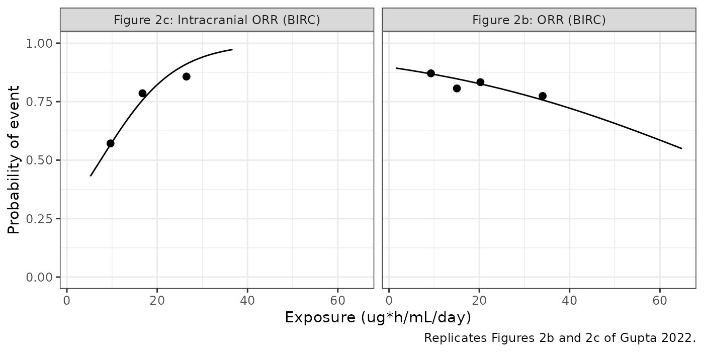
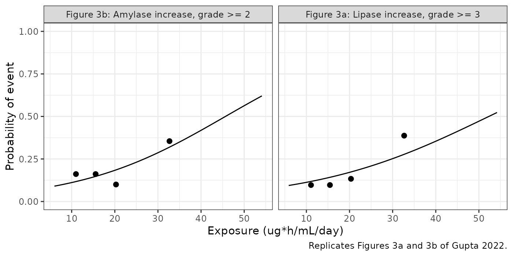
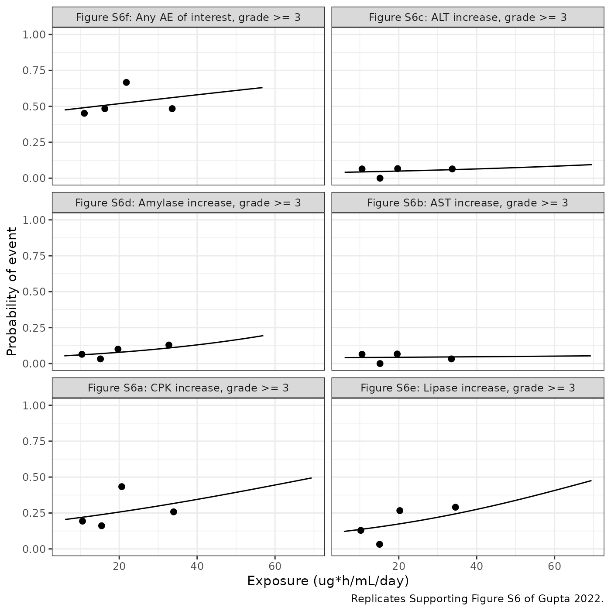
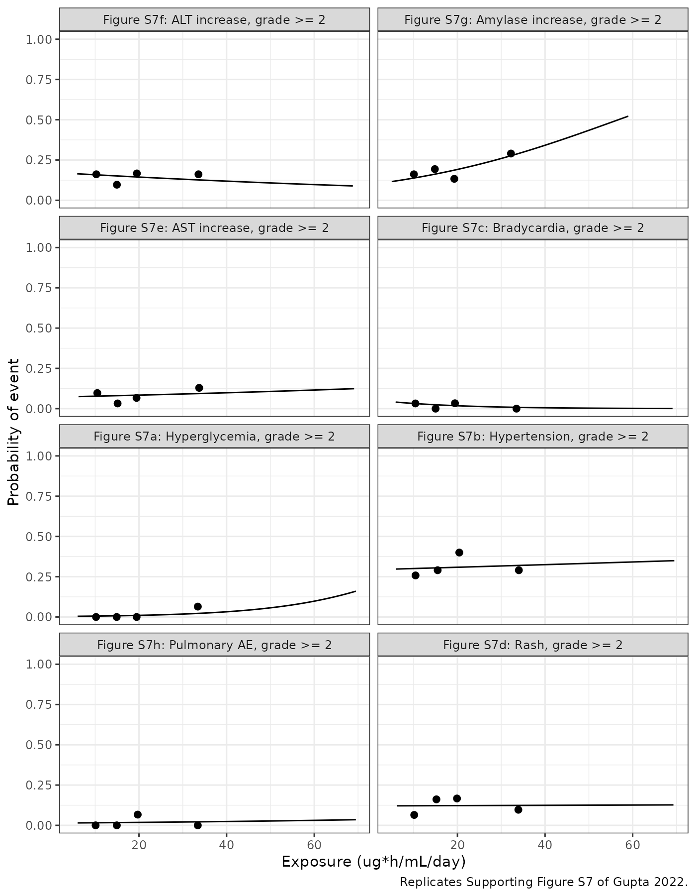

# Brigatinib exposure-response in first-line ALK-positive NSCLC (Gupta 2022)

``` r

library(nlmixr2lib)
library(rxode2)
library(PKNCA)
library(dplyr)
library(ggplot2)
```

Gupta N, Reckamp KL, Camidge DR, Kleijn HJ, Ouerdani A, Bellanti F,
Maringwa J, Hanley MJ, Wang S, Zhang P, Venkatakrishnan K. *Population
pharmacokinetic and exposure-response analyses from ALTA-1L: Model-based
analyses supporting the brigatinib dose in ALK-positive NSCLC.* Clin
Transl Sci. 2022;15:1143-1154.
[doi:10.1111/cts.13231](https://doi.org/10.1111/cts.13231)

ALTA-1L compared the ALK tyrosine kinase inhibitor brigatinib (180 mg
once daily after a 7-day lead-in at 90 mg) with crizotinib in
ALK-inhibitor-naive ALK-positive non-small cell lung cancer. Gupta 2022
did **not** fit a new pharmacokinetic model: it applied the previously
published brigatinib population PK model “without modification” by
Bayesian re-estimation to derive individual CL/F, and then related
exposure metrics computed from that CL/F and the actual dosing history
to efficacy and safety. That PK model is already in the library as
`Gupta_2021_brigatinib`; the new content of this paper is the
exposure-response layer, packaged here as 21 independent models.

``` r

er_models <- tibble::tribble(
  ~model, ~output, ~exposure, ~figure, ~endpoint,
  "orr", "prob_orr_central", "AUC_BRIG_SCAN", "Figure 2b", "ORR (BIRC)",
  "iorr", "prob_icorr", "AUC_BRIG_SCAN", "Figure 2c", "Intracranial ORR (BIRC)",
  "lipase_grade3_d8_14", "prob_lipase_increase_grade3", "AUC_BRIG_D8_14", "Figure 3a", "Lipase increase, grade >= 3",
  "amylase_grade2_d8_14", "prob_amylase_increase_grade2", "AUC_BRIG_D8_14", "Figure 3b", "Amylase increase, grade >= 2",
  "cpk_grade3", "prob_cpk_increase_grade3", "AUC_BRIG_EVT", "Figure S6a", "CPK increase, grade >= 3",
  "ast_grade3", "prob_ast_increase_grade3", "AUC_BRIG_EVT", "Figure S6b", "AST increase, grade >= 3",
  "alt_grade3", "prob_alt_increase_grade3", "AUC_BRIG_EVT", "Figure S6c", "ALT increase, grade >= 3",
  "amylase_grade3", "prob_amylase_increase_grade3", "AUC_BRIG_EVT", "Figure S6d", "Amylase increase, grade >= 3",
  "lipase_grade3", "prob_lipase_increase_grade3", "AUC_BRIG_EVT", "Figure S6e", "Lipase increase, grade >= 3",
  "aesi_grade3", "prob_aesi_grade3", "AUC_BRIG_EVT", "Figure S6f", "Any AE of interest, grade >= 3",
  "hyperglycemia_grade2", "prob_hyperglycemia_grade2", "AUC_BRIG_EVT", "Figure S7a", "Hyperglycemia, grade >= 2",
  "hypertension_grade2", "prob_hypertension_grade2", "AUC_BRIG_EVT", "Figure S7b", "Hypertension, grade >= 2",
  "bradycardia_grade2", "prob_bradycardia_grade2", "AUC_BRIG_EVT", "Figure S7c", "Bradycardia, grade >= 2",
  "rash_grade2", "prob_rash_grade2", "AUC_BRIG_EVT", "Figure S7d", "Rash, grade >= 2",
  "ast_grade2", "prob_ast_increase_grade2", "AUC_BRIG_EVT", "Figure S7e", "AST increase, grade >= 2",
  "alt_grade2", "prob_alt_increase_grade2", "AUC_BRIG_EVT", "Figure S7f", "ALT increase, grade >= 2",
  "amylase_grade2", "prob_amylase_increase_grade2", "AUC_BRIG_EVT", "Figure S7g", "Amylase increase, grade >= 2",
  "pulmonary_grade2", "prob_pulmonary_ae_grade2", "AUC_BRIG_EVT", "Figure S7h", "Pulmonary AE, grade >= 2",
  "pfs", "hr", "AUC_BRIG_SCAN (static)", "Results", "PFS (BIRC), Cox",
  "pfs_scan_tv", "hr", "AUC_BRIG_SCAN (time-varying)", "Results", "PFS (BIRC), Cox",
  "pfs_daily_tv", "hr", "AUC_BRIG_DAY (time-varying)", "Results", "PFS (BIRC), Cox"
) |>
  dplyr::mutate(model = paste0("Gupta_2022_brigatinib_", model))

mods <- lapply(setNames(er_models$model, er_models$model), function(m) {
  rxode2::rxode(readModelDb(m))
})

er_models |>
  dplyr::rename(
    "Model" = model, "Output" = output, "Exposure column" = exposure,
    "Source" = figure, "Endpoint" = endpoint
  ) |>
  knitr::kable(caption = "The 21 exposure-response models from Gupta 2022.")
```

| Model | Output | Exposure column | Source | Endpoint |
|:---|:---|:---|:---|:---|
| Gupta_2022_brigatinib_orr | prob_orr_central | AUC_BRIG_SCAN | Figure 2b | ORR (BIRC) |
| Gupta_2022_brigatinib_iorr | prob_icorr | AUC_BRIG_SCAN | Figure 2c | Intracranial ORR (BIRC) |
| Gupta_2022_brigatinib_lipase_grade3_d8_14 | prob_lipase_increase_grade3 | AUC_BRIG_D8_14 | Figure 3a | Lipase increase, grade \>= 3 |
| Gupta_2022_brigatinib_amylase_grade2_d8_14 | prob_amylase_increase_grade2 | AUC_BRIG_D8_14 | Figure 3b | Amylase increase, grade \>= 2 |
| Gupta_2022_brigatinib_cpk_grade3 | prob_cpk_increase_grade3 | AUC_BRIG_EVT | Figure S6a | CPK increase, grade \>= 3 |
| Gupta_2022_brigatinib_ast_grade3 | prob_ast_increase_grade3 | AUC_BRIG_EVT | Figure S6b | AST increase, grade \>= 3 |
| Gupta_2022_brigatinib_alt_grade3 | prob_alt_increase_grade3 | AUC_BRIG_EVT | Figure S6c | ALT increase, grade \>= 3 |
| Gupta_2022_brigatinib_amylase_grade3 | prob_amylase_increase_grade3 | AUC_BRIG_EVT | Figure S6d | Amylase increase, grade \>= 3 |
| Gupta_2022_brigatinib_lipase_grade3 | prob_lipase_increase_grade3 | AUC_BRIG_EVT | Figure S6e | Lipase increase, grade \>= 3 |
| Gupta_2022_brigatinib_aesi_grade3 | prob_aesi_grade3 | AUC_BRIG_EVT | Figure S6f | Any AE of interest, grade \>= 3 |
| Gupta_2022_brigatinib_hyperglycemia_grade2 | prob_hyperglycemia_grade2 | AUC_BRIG_EVT | Figure S7a | Hyperglycemia, grade \>= 2 |
| Gupta_2022_brigatinib_hypertension_grade2 | prob_hypertension_grade2 | AUC_BRIG_EVT | Figure S7b | Hypertension, grade \>= 2 |
| Gupta_2022_brigatinib_bradycardia_grade2 | prob_bradycardia_grade2 | AUC_BRIG_EVT | Figure S7c | Bradycardia, grade \>= 2 |
| Gupta_2022_brigatinib_rash_grade2 | prob_rash_grade2 | AUC_BRIG_EVT | Figure S7d | Rash, grade \>= 2 |
| Gupta_2022_brigatinib_ast_grade2 | prob_ast_increase_grade2 | AUC_BRIG_EVT | Figure S7e | AST increase, grade \>= 2 |
| Gupta_2022_brigatinib_alt_grade2 | prob_alt_increase_grade2 | AUC_BRIG_EVT | Figure S7f | ALT increase, grade \>= 2 |
| Gupta_2022_brigatinib_amylase_grade2 | prob_amylase_increase_grade2 | AUC_BRIG_EVT | Figure S7g | Amylase increase, grade \>= 2 |
| Gupta_2022_brigatinib_pulmonary_grade2 | prob_pulmonary_ae_grade2 | AUC_BRIG_EVT | Figure S7h | Pulmonary AE, grade \>= 2 |
| Gupta_2022_brigatinib_pfs | hr | AUC_BRIG_SCAN (static) | Results | PFS (BIRC), Cox |
| Gupta_2022_brigatinib_pfs_scan_tv | hr | AUC_BRIG_SCAN (time-varying) | Results | PFS (BIRC), Cox |
| Gupta_2022_brigatinib_pfs_daily_tv | hr | AUC_BRIG_DAY (time-varying) | Results | PFS (BIRC), Cox |

The 21 exposure-response models from Gupta 2022. {.table
style="width:100%;"}

Four exposure definitions are used, each a daily AUC in ug\*h/mL/day
computed from the individual CL/F and the doses actually taken (Methods
S1), and they are not interchangeable:

- `AUC_BRIG_SCAN` – mean daily AUC over a disease-assessment scan
  interval (static models: the interval before the event, best response
  or censoring).
- `AUC_BRIG_EVT` – daily AUC averaged from the first dose to the first
  occurrence of the adverse event, or to the end of treatment.
- `AUC_BRIG_D8_14` – daily AUC averaged over days 8 to 14 of cycle 1,
  the week after the step-up from 90 mg to 180 mg.
- `AUC_BRIG_DAY` – daily AUC on each treatment day (time-varying).

## Population

The exposure-response analysis set is the 123 PK-evaluable patients of
the ALTA-1L brigatinib arm (137 intent-to-treat; 13 without quantifiable
concentrations, one not dosed), contributing 1069 PK samples (Gupta 2022
Results, Datasets; Table 1): median age 57 years (27-85), median body
weight 67 kg (43-111), 48.8% female, 55.3% White / 43.1% Asian / 1.6%
other, median albumin 41 g/L (24-48), ECOG 0 / 1 / 2 in 39.8 / 56.1 /
4.1%, 28.5% with prior chemotherapy and 29.3% with brain metastases at
baseline. The intracranial response set is the 42 of 47 patients with
CNS metastases by blinded independent review at baseline who had
concentration data. Adverse events were counted from the first dose to
30 days after the last dose and graded by CTCAE v4.03; their incidences
are in Table 3.

## Source trace

Every logistic model is `logit(p) = logit_ref + e_auc_logit * AUC`, and
every Cox model is `hr = exp(e_auc_haz * AUC)`, with the exposure
entering linearly and uncentred. The table below reads the coefficients
back out of the packaged models.

``` r

coef_of <- function(m, nm) {
  d <- mods[[m]]$iniDf
  d$est[d$name == nm]
}
printed <- tibble::tribble(
  ~model, ~printed_ratio, ~where,
  "orr", 0.97, "Results: OR 0.97 (0.93-1.01), p = 0.108",
  "iorr", 1.13, "Results: OR 1.13 (1.01-1.28), p = 0.049",
  "lipase_grade3_d8_14", 1.05, "Results: OR 1.05 (1.00-1.10), p = 0.039",
  "amylase_grade2_d8_14", 1.06, "Results: OR 1.06 (1.01-1.11), p = 0.016",
  "lipase_grade3", 1.03, "Results: OR 1.03 (0.99-1.07), p = 0.146",
  "amylase_grade2", 1.04, "Results: OR 1.04 (0.99-1.09), p = 0.094",
  "pfs", 1.03, "Results: HR 1.03 (1.01-1.05), p = 0.01",
  "pfs_scan_tv", 1.02, "Results: HR 1.02 (1.00-1.05), p = 0.08",
  "pfs_daily_tv", 1.01, "Results: HR 1.01 (0.98-1.03), p = 0.69"
) |>
  dplyr::mutate(model = paste0("Gupta_2022_brigatinib_", model))

trace <- er_models |>
  dplyr::select(model, figure) |>
  dplyr::left_join(printed, by = "model") |>
  dplyr::rowwise() |>
  dplyr::mutate(
    is_cox = grepl("_pfs", model),
    intercept = if (is_cox) NA_real_ else coef_of(model, "logit_ref"),
    slope = if (is_cox) coef_of(model, "e_auc_haz") else coef_of(model, "e_auc_logit"),
    ratio = exp(slope),
    slope_source = if (is.na(printed_ratio)) {
      paste(figure, "fitted curve (vector paths)")
    } else {
      where
    },
    intercept_source = if (is_cox) {
      "none (Cox; no baseline hazard)"
    } else {
      paste(figure, "fitted curve, slope held at the model value")
    }
  ) |>
  dplyr::ungroup()

trace |>
  dplyr::select(model, intercept, intercept_source, slope, ratio, slope_source) |>
  dplyr::rename(
    "Model" = model, "logit_ref" = intercept, "Intercept source" = intercept_source,
    "Slope (per ug*h/mL/day)" = slope, "OR or HR" = ratio,
    "Slope source" = slope_source
  ) |>
  knitr::kable(digits = 4, caption = "Coefficients and their source in Gupta 2022.")
```

| Model | logit_ref | Intercept source | Slope (per ug\*h/mL/day) | OR or HR | Slope source |
|:---|---:|:---|---:|---:|:---|
| Gupta_2022_brigatinib_orr | 2.173 | Figure 2b fitted curve, slope held at the model value | -0.0305 | 0.9700 | Results: OR 0.97 (0.93-1.01), p = 0.108 |
| Gupta_2022_brigatinib_iorr | -0.913 | Figure 2c fitted curve, slope held at the model value | 0.1222 | 1.1300 | Results: OR 1.13 (1.01-1.28), p = 0.049 |
| Gupta_2022_brigatinib_lipase_grade3_d8_14 | -2.552 | Figure 3a fitted curve, slope held at the model value | 0.0488 | 1.0500 | Results: OR 1.05 (1.00-1.10), p = 0.039 |
| Gupta_2022_brigatinib_amylase_grade2_d8_14 | -2.660 | Figure 3b fitted curve, slope held at the model value | 0.0583 | 1.0600 | Results: OR 1.06 (1.01-1.11), p = 0.016 |
| Gupta_2022_brigatinib_cpk_grade3 | -1.485 | Figure S6a fitted curve, slope held at the model value | 0.0211 | 1.0213 | Figure S6a fitted curve (vector paths) |
| Gupta_2022_brigatinib_ast_grade3 | -3.178 | Figure S6b fitted curve, slope held at the model value | 0.0045 | 1.0045 | Figure S6b fitted curve (vector paths) |
| Gupta_2022_brigatinib_alt_grade3 | -3.234 | Figure S6c fitted curve, slope held at the model value | 0.0140 | 1.0141 | Figure S6c fitted curve (vector paths) |
| Gupta_2022_brigatinib_amylase_grade3 | -3.029 | Figure S6d fitted curve, slope held at the model value | 0.0282 | 1.0286 | Figure S6d fitted curve (vector paths) |
| Gupta_2022_brigatinib_lipase_grade3 | -2.151 | Figure S6e fitted curve, slope held at the model value | 0.0296 | 1.0300 | Results: OR 1.03 (0.99-1.07), p = 0.146 |
| Gupta_2022_brigatinib_aesi_grade3 | -0.175 | Figure S6f fitted curve, slope held at the model value | 0.0125 | 1.0126 | Figure S6f fitted curve (vector paths) |
| Gupta_2022_brigatinib_hyperglycemia_grade2 | -5.756 | Figure S7a fitted curve, slope held at the model value | 0.0590 | 1.0607 | Figure S7a fitted curve (vector paths) |
| Gupta_2022_brigatinib_hypertension_grade2 | -0.881 | Figure S7b fitted curve, slope held at the model value | 0.0037 | 1.0037 | Figure S7b fitted curve (vector paths) |
| Gupta_2022_brigatinib_bradycardia_grade2 | -2.807 | Figure S7c fitted curve, slope held at the model value | -0.0596 | 0.9421 | Figure S7c fitted curve (vector paths) |
| Gupta_2022_brigatinib_rash_grade2 | -1.987 | Figure S7d fitted curve, slope held at the model value | 0.0008 | 1.0008 | Figure S7d fitted curve (vector paths) |
| Gupta_2022_brigatinib_ast_grade2 | -2.568 | Figure S7e fitted curve, slope held at the model value | 0.0089 | 1.0089 | Figure S7e fitted curve (vector paths) |
| Gupta_2022_brigatinib_alt_grade2 | -1.559 | Figure S7f fitted curve, slope held at the model value | -0.0111 | 0.9890 | Figure S7f fitted curve (vector paths) |
| Gupta_2022_brigatinib_amylase_grade2 | -2.225 | Figure S7g fitted curve, slope held at the model value | 0.0392 | 1.0400 | Results: OR 1.04 (0.99-1.09), p = 0.094 |
| Gupta_2022_brigatinib_pulmonary_grade2 | -4.257 | Figure S7h fitted curve, slope held at the model value | 0.0136 | 1.0136 | Figure S7h fitted curve (vector paths) |
| Gupta_2022_brigatinib_pfs | NA | none (Cox; no baseline hazard) | 0.0296 | 1.0300 | Results: HR 1.03 (1.01-1.05), p = 0.01 |
| Gupta_2022_brigatinib_pfs_scan_tv | NA | none (Cox; no baseline hazard) | 0.0198 | 1.0200 | Results: HR 1.02 (1.00-1.05), p = 0.08 |
| Gupta_2022_brigatinib_pfs_daily_tv | NA | none (Cox; no baseline hazard) | 0.0100 | 1.0100 | Results: HR 1.01 (0.98-1.03), p = 0.69 |

Coefficients and their source in Gupta 2022. {.table}

``` r


# The printed ratios must come back out of the models exactly.
chk_printed <- trace |> dplyr::filter(!is.na(printed_ratio))
stopifnot(all(abs(chk_printed$ratio - chk_printed$printed_ratio) < 1e-12))
```

How the figure-derived values were obtained. The fitted curves of
Figures 2b, 2c, 3a, 3b, S6 and S7 are vector paths in the publisher
PDFs, so the curve nodes were read directly, without pixel measurement,
and mapped to data units through the printed tick labels. For the six
regressions whose odds ratio is printed, the curve alone recovers that
odds ratio before anything is held to it, which is what licenses reading
the intercept off the same curve:

``` r

tibble::tibble(
  Model = printed$model[1:6],
  "Printed OR" = printed$printed_ratio[1:6],
  # Free two-parameter fit to the curve nodes, before the slope was held.
  "OR read from the curve" = c(0.9681, 1.1278, 1.0481, 1.0563, 1.0291, 1.0378)
) |>
  dplyr::mutate(`Difference (%)` = 100 * (`OR read from the curve` / `Printed OR` - 1)) |>
  knitr::kable(digits = 4, caption = "Odds ratios recovered from the fitted curves against the printed values.")
```

| Model | Printed OR | OR read from the curve | Difference (%) |
|:---|---:|---:|---:|
| Gupta_2022_brigatinib_orr | 0.97 | 0.9681 | -0.1959 |
| Gupta_2022_brigatinib_iorr | 1.13 | 1.1278 | -0.1947 |
| Gupta_2022_brigatinib_lipase_grade3_d8_14 | 1.05 | 1.0481 | -0.1810 |
| Gupta_2022_brigatinib_amylase_grade2_d8_14 | 1.06 | 1.0563 | -0.3491 |
| Gupta_2022_brigatinib_lipase_grade3 | 1.03 | 1.0291 | -0.0874 |
| Gupta_2022_brigatinib_amylase_grade2 | 1.04 | 1.0378 | -0.2115 |

Odds ratios recovered from the fitted curves against the printed values.
{.table}

All six agree within the two-decimal rounding of the printed values. The
other twelve logistic models have no printed coefficient; both their
coefficients come from the curve.

## Exposure: the PK model behind the covariates

The exposure columns are computed from the individual CL/F of
`Gupta_2021_brigatinib`. Methods S1 defines the daily AUC as
`AUCD(i) = CAUC(i + 1) - CAUC(i)` with `CAUC(i)` the cumulative dose to
day i divided by CL/F, so for a day on 180 mg it is `180 / CL/F`
exactly. A typical patient (albumin 41 g/L, the ALTA-1L median) on the
ALTA-1L regimen is simulated below, and PKNCA confirms that the ODE
gives the same daily AUC at steady state.

``` r

pk <- rxode2::rxode(readModelDb("Gupta_2021_brigatinib")) |> rxode2::zeroRe()
#> ℹ parameter labels from comments will be replaced by 'label()'
d_lead <- 90
d_main <- 180
dose_times <- 24 * (0:27)
dose_amts <- ifelse(dose_times < 7 * 24, d_lead, d_main)
obs_times <- sort(unique(c(seq(0, 28 * 24, by = 0.25))))
ev <- dplyr::bind_rows(
  data.frame(time = dose_times, amt = dose_amts, evid = 1L, cmt = "depot"),
  data.frame(time = obs_times, amt = 0, evid = 0L, cmt = "central")
) |>
  dplyr::mutate(id = 1L, ALB = 41, treatment = "90 mg x 7 d then 180 mg QD") |>
  dplyr::arrange(time, dplyr::desc(evid))
sim_pk <- rxode2::rxSolve(pk, events = ev, keep = "treatment", returnType = "data.frame")
#> ℹ omega/sigma items treated as zero: 'etalcl', 'etalvc', 'etalvp', 'etalntr', 'etalmtt'
cl_typ <- sim_pk$cl[1]
```

``` r

conc <- sim_pk |>
  dplyr::filter(!is.na(Cc)) |>
  dplyr::mutate(id = 1L, Cc = Cc / 1000) # ug/mL
conc <- dplyr::bind_rows(
  data.frame(id = 1L, time = 0, Cc = 0, treatment = conc$treatment[1]),
  conc
) |>
  dplyr::distinct(id, time, .keep_all = TRUE)
doses <- ev |>
  dplyr::filter(evid == 1) |>
  dplyr::select(id, time, amt, treatment)
o_conc <- PKNCA::PKNCAconc(conc, Cc ~ time | treatment + id)
o_dose <- PKNCA::PKNCAdose(doses, amt ~ time | treatment + id)
ints <- data.frame(
  start = c(27 * 24, 7 * 24),
  end = c(28 * 24, 14 * 24),
  auclast = TRUE,
  cmax = c(TRUE, FALSE)
)
nca <- PKNCA::pk.nca(PKNCA::PKNCAdata(o_conc, o_dose, intervals = ints))
nca_res <- as.data.frame(nca$result)
auc_d28 <- nca_res$PPORRES[nca_res$PPTESTCD == "auclast" & nca_res$start == 27 * 24]
auc_d8_14 <- nca_res$PPORRES[nca_res$PPTESTCD == "auclast" & nca_res$start == 7 * 24] / 7

pk_tab <- tibble::tibble(
  Quantity = c(
    "CL/F at albumin 41 g/L (L/h)",
    "Day-28 AUC(0-24), PKNCA (ug*h/mL)",
    "180 mg / CL/F, Methods S1 daily AUC (ug*h/mL/day)",
    "Days 8-14 mean daily AUC, PKNCA (ug*h/mL/day)",
    "AUC_BRIG_D8_14 by the Methods S1 definition (ug*h/mL/day)"
  ),
  Value = c(cl_typ, auc_d28, d_main / cl_typ, auc_d8_14, d_main / cl_typ)
)
knitr::kable(pk_tab, digits = 3, caption = "Typical-patient exposure under the ALTA-1L regimen.")
```

| Quantity                                                   |  Value |
|:-----------------------------------------------------------|-------:|
| CL/F at albumin 41 g/L (L/h)                               | 11.146 |
| Day-28 AUC(0-24), PKNCA (ug\*h/mL)                         | 16.149 |
| 180 mg / CL/F, Methods S1 daily AUC (ug\*h/mL/day)         | 16.149 |
| Days 8-14 mean daily AUC, PKNCA (ug\*h/mL/day)             | 14.872 |
| AUC_BRIG_D8_14 by the Methods S1 definition (ug\*h/mL/day) | 16.149 |

Typical-patient exposure under the ALTA-1L regimen. {.table}

``` r


stopifnot(
  # Linear PK at steady state: AUC(0-tau) = Dose / CL. Same drawn parameters
  # on both sides, so the tolerance only covers trapezoidal error.
  abs(auc_d28 / (d_main / cl_typ) - 1) < 0.01,
  # Days 8-14 still carry the accumulation from the 90 mg lead-in, so the
  # ODE daily AUC is a little below the dose/CL definition, never above.
  auc_d8_14 < d_main / cl_typ,
  auc_d8_14 > 0.9 * d_main / cl_typ
)
```

The typical-value daily AUC of 16.1 ug\*h/mL/day is below the ALTA-1L
post hoc geometric mean of 21.3 (5th-95th percentile 10.1, 44.6)
ug\*h/mL (Gupta 2022 Results): the Bayesian re-estimation found a lower
CL/F in the first-line population (geometric mean 8.45 L/h, Table 2)
than the model’s typical value of 11.15 L/h, and the paper’s own
prediction-corrected VPC shows the population predictions running
slightly under the ALTA-1L data. To reproduce the ALTA-1L
exposure-response figures, supply the patients’ exposure (or the
published 21.3 (10.1, 44.6) distribution), not the population
prediction. For days 8-14 the paper’s dose/CL definition does not
include the accumulation lag after the 90 mg lead-in, so compute
`AUC_BRIG_D8_14` as dose/CL as Methods S1 does.

## Virtual cohort

The exposure-response models need only an exposure value per patient.
The cohort is the ALTA-1L steady-state exposure distribution as
published – a log-normal with geometric mean 21.3 and 5th / 95th
percentiles 10.1 / 44.6 ug\*h/mL (the two tails give the same log-SD,
0.454 and 0.448) – laid out as 123 deterministic quantiles, so there is
no random draw.

``` r

gm <- 21.3
lsd <- (log(44.6) - log(10.1)) / (2 * qnorm(0.95))
cohort <- data.frame(id = 1:123, auc_ss = exp(log(gm) + lsd * qnorm(((1:123) - 0.5) / 123)))
stopifnot(abs(quantile(cohort$auc_ss, c(0.05, 0.95)) / c(10.1, 44.6) - 1) < 0.03)
```

## Simulation

The models have no ODE and no dose, so the exposure is supplied as a
column of the event table, one observation row per value.

``` r

er_eval <- function(model, output, cov_name, grid) {
  ev <- data.frame(id = 1L, time = seq_along(grid), amt = 0, evid = 0L)
  ev[[cov_name]] <- grid
  s <- as.data.frame(rxode2::rxSolve(model, events = ev, returnType = "data.frame"))
  stopifnot(nrow(s) == length(grid))
  s[[output]]
}
cov_col <- function(m) sub(" .*", "", er_models$exposure[er_models$model == m])
out_col <- function(m) er_models$output[er_models$model == m]
logistic <- er_models$model[!grepl("_pfs", er_models$model)]

# Predicted probability at the 5th percentile, geometric mean and 95th
# percentile of ALTA-1L steady-state exposure.
p_ss <- dplyr::bind_rows(lapply(logistic, function(m) {
  p <- er_eval(mods[[m]], out_col(m), cov_col(m), c(10.1, 21.3, 44.6))
  tibble::tibble(model = m, p05 = p[1], pgm = p[2], p95 = p[3],
                 cohort_mean = mean(er_eval(mods[[m]], out_col(m), cov_col(m), cohort$auc_ss)))
}))
p_ss |>
  dplyr::rename(
    "Model" = model, "AUC 10.1" = p05, "AUC 21.3" = pgm, "AUC 44.6" = p95,
    "Mean over the cohort" = cohort_mean
  ) |>
  knitr::kable(digits = 3, caption = "Predicted probabilities across the ALTA-1L steady-state exposure range.")
```

| Model | AUC 10.1 | AUC 21.3 | AUC 44.6 | Mean over the cohort |
|:---|---:|---:|---:|---:|
| Gupta_2022_brigatinib_orr | 0.866 | 0.821 | 0.693 | 0.806 |
| Gupta_2022_brigatinib_iorr | 0.580 | 0.844 | 0.989 | 0.822 |
| Gupta_2022_brigatinib_lipase_grade3_d8_14 | 0.113 | 0.181 | 0.407 | 0.210 |
| Gupta_2022_brigatinib_amylase_grade2_d8_14 | 0.112 | 0.195 | 0.485 | 0.232 |
| Gupta_2022_brigatinib_cpk_grade3 | 0.219 | 0.262 | 0.367 | 0.273 |
| Gupta_2022_brigatinib_ast_grade3 | 0.042 | 0.044 | 0.048 | 0.044 |
| Gupta_2022_brigatinib_alt_grade3 | 0.043 | 0.050 | 0.068 | 0.052 |
| Gupta_2022_brigatinib_amylase_grade3 | 0.060 | 0.081 | 0.145 | 0.089 |
| Gupta_2022_brigatinib_lipase_grade3 | 0.136 | 0.179 | 0.303 | 0.194 |
| Gupta_2022_brigatinib_aesi_grade3 | 0.488 | 0.523 | 0.594 | 0.529 |
| Gupta_2022_brigatinib_hyperglycemia_grade2 | 0.006 | 0.011 | 0.042 | 0.016 |
| Gupta_2022_brigatinib_hypertension_grade2 | 0.301 | 0.310 | 0.329 | 0.312 |
| Gupta_2022_brigatinib_bradycardia_grade2 | 0.032 | 0.017 | 0.004 | 0.017 |
| Gupta_2022_brigatinib_rash_grade2 | 0.121 | 0.122 | 0.125 | 0.123 |
| Gupta_2022_brigatinib_ast_grade2 | 0.077 | 0.085 | 0.102 | 0.087 |
| Gupta_2022_brigatinib_alt_grade2 | 0.158 | 0.142 | 0.114 | 0.140 |
| Gupta_2022_brigatinib_amylase_grade2 | 0.138 | 0.199 | 0.383 | 0.222 |
| Gupta_2022_brigatinib_pulmonary_grade2 | 0.016 | 0.019 | 0.025 | 0.019 |

Predicted probabilities across the ALTA-1L steady-state exposure range.
{.table}

The safety exposures in the source are time-averaged to the event and
include the 90 mg lead-in, so they run lower than the steady-state
values used in this table; the table shows the shape of each
relationship over the clinically relevant range rather than predicted
incidences.

## Replicate published figures

The observed-proportion points below are the per-quartile (or
per-tertile) event counts printed in each figure panel, plotted at the
quartile positions read from the same panel.

``` r

obs <- tibble::tribble(
  ~model, ~x, ~nN, ~xmin, ~xmax,
  "orr", "9.29 15.04 20.25 34.03", "27/31 25/31 25/30 24/31", 1.6, 64.9,
  "iorr", "9.66 16.75 26.48", "8/14 11/14 12/14", 5.2, 36.7,
  "lipase_grade3_d8_14", "11.07 15.46 20.34 32.67", "3/31 3/31 4/30 12/31", 5.9, 54.2,
  "amylase_grade2_d8_14", "10.99 15.55 20.28 32.68", "5/31 5/31 3/30 11/31", 6.0, 54.1,
  "cpk_grade3", "10.57 15.48 20.65 33.97", "6/31 5/31 13/30 8/31", 6.1, 69.4,
  "ast_grade3", "10.57 15.18 19.60 33.52", "2/31 0/31 2/30 1/31", 6.1, 69.3,
  "alt_grade3", "10.57 15.18 19.71 33.73", "2/31 0/31 2/30 2/31", 6.1, 69.6,
  "amylase_grade3", "10.42 15.18 19.68 32.75", "2/31 1/31 3/30 4/31", 5.9, 57.0,
  "lipase_grade3", "10.25 15.08 20.27 34.56", "4/31 1/31 8/30 9/31", 5.9, 69.5,
  "aesi_grade3", "11.04 16.30 21.84 33.60", "14/31 15/31 20/30 15/31", 6.0, 56.8,
  "hyperglycemia_grade2", "10.20 14.91 19.46 33.43", "0/31 0/31 0/30 2/31", 6.0, 69.5,
  "hypertension_grade2", "10.44 15.49 20.43 34.02", "8/31 9/31 12/30 9/31", 6.0, 69.5,
  "bradycardia_grade2", "10.41 15.02 19.44 33.48", "1/31 0/31 1/30 0/31", 5.9, 69.1,
  "rash_grade2", "10.14 15.21 19.90 33.91", "2/31 5/31 5/30 3/31", 6.2, 69.3,
  "ast_grade2", "10.49 15.12 19.44 33.74", "3/31 1/31 2/30 4/31", 6.2, 69.1,
  "alt_grade2", "10.26 14.96 19.52 33.58", "5/31 3/31 5/30 5/31", 5.9, 68.8,
  "amylase_grade2", "10.07 14.85 19.29 32.22", "5/31 6/31 4/30 9/31", 5.0, 59.0,
  "pulmonary_grade2", "10.10 14.94 19.71 33.42", "0/31 0/31 2/30 0/31", 6.0, 69.5
) |>
  dplyr::mutate(model = paste0("Gupta_2022_brigatinib_", model))

obs_long <- dplyr::bind_rows(lapply(seq_len(nrow(obs)), function(i) {
  fr <- strsplit(strsplit(obs$nN[i], " ")[[1]], "/")
  tibble::tibble(
    model = obs$model[i],
    x = as.numeric(strsplit(obs$x[i], " ")[[1]]),
    events = as.integer(vapply(fr, `[`, "", 1)),
    n = as.integer(vapply(fr, `[`, "", 2))
  )
})) |>
  dplyr::mutate(p_obs = events / n)

curves <- dplyr::bind_rows(lapply(seq_len(nrow(obs)), function(i) {
  m <- obs$model[i]
  grid <- seq(obs$xmin[i], obs$xmax[i], length.out = 100)
  tibble::tibble(model = m, x = grid, p = er_eval(mods[[m]], out_col(m), cov_col(m), grid))
}))
label_of <- setNames(paste0(er_models$figure, ": ", er_models$endpoint), er_models$model)

plot_panels <- function(ms, caption) {
  ggplot(dplyr::filter(curves, model %in% ms), aes(x, p)) +
    geom_line() +
    geom_point(data = dplyr::filter(obs_long, model %in% ms), aes(x, p_obs), size = 2) +
    facet_wrap(~model, labeller = labeller(model = label_of), ncol = 2) +
    coord_cartesian(ylim = c(0, 1)) +
    labs(x = "Exposure (ug*h/mL/day)", y = "Probability of event", caption = caption) +
    theme_bw()
}
```

``` r

plot_panels(logistic[1:2], "Replicates Figures 2b and 2c of Gupta 2022.")
```



``` r

plot_panels(logistic[3:4], "Replicates Figures 3a and 3b of Gupta 2022.")
```



``` r

plot_panels(logistic[5:10], "Replicates Supporting Figure S6 of Gupta 2022.")
```



``` r

plot_panels(logistic[11:18], "Replicates Supporting Figure S7 of Gupta 2022.")
```



## Validation

### Event totals

A logistic regression fitted by maximum likelihood with an intercept
reproduces the observed number of events exactly: the sum of the fitted
probabilities over the patients equals the event count. Evaluating each
model at the quartile positions and weighting by the quartile sizes
approximates that sum, which checks the figure-derived intercepts
against counts the paper prints.

``` r

totals <- obs_long |>
  dplyr::rowwise() |>
  dplyr::mutate(p_model = er_eval(mods[[model]], out_col(model), cov_col(model), x)) |>
  dplyr::ungroup() |>
  dplyr::group_by(model) |>
  dplyr::summarise(observed = sum(events), predicted = sum(n * p_model), .groups = "drop") |>
  dplyr::mutate(difference = predicted - observed)
totals |>
  dplyr::rename(
    "Model" = model, "Observed events" = observed,
    "Predicted events" = predicted, "Difference" = difference
  ) |>
  knitr::kable(digits = 2, caption = "Observed and model-predicted event totals.")
```

| Model | Observed events | Predicted events | Difference |
|:---|---:|---:|---:|
| Gupta_2022_brigatinib_aesi_grade3 | 64 | 64.05 | 0.05 |
| Gupta_2022_brigatinib_alt_grade2 | 18 | 17.86 | -0.14 |
| Gupta_2022_brigatinib_alt_grade3 | 6 | 6.11 | 0.11 |
| Gupta_2022_brigatinib_amylase_grade2 | 24 | 23.50 | -0.50 |
| Gupta_2022_brigatinib_amylase_grade2_d8_14 | 24 | 23.68 | -0.32 |
| Gupta_2022_brigatinib_amylase_grade3 | 10 | 9.73 | -0.27 |
| Gupta_2022_brigatinib_ast_grade2 | 10 | 10.32 | 0.32 |
| Gupta_2022_brigatinib_ast_grade3 | 5 | 5.36 | 0.36 |
| Gupta_2022_brigatinib_bradycardia_grade2 | 2 | 2.53 | 0.53 |
| Gupta_2022_brigatinib_cpk_grade3 | 32 | 31.83 | -0.17 |
| Gupta_2022_brigatinib_hyperglycemia_grade2 | 2 | 1.40 | -0.60 |
| Gupta_2022_brigatinib_hypertension_grade2 | 38 | 37.99 | -0.01 |
| Gupta_2022_brigatinib_iorr | 31 | 31.27 | 0.27 |
| Gupta_2022_brigatinib_lipase_grade3 | 22 | 21.80 | -0.20 |
| Gupta_2022_brigatinib_lipase_grade3_d8_14 | 22 | 21.87 | -0.13 |
| Gupta_2022_brigatinib_orr | 101 | 101.45 | 0.45 |
| Gupta_2022_brigatinib_pulmonary_grade2 | 2 | 2.24 | 0.24 |
| Gupta_2022_brigatinib_rash_grade2 | 15 | 15.05 | 0.05 |

Observed and model-predicted event totals. {.table}

``` r


# Table 3 incidences and the Figure 2 response counts.
stopifnot(
  totals$observed[totals$model == "Gupta_2022_brigatinib_orr"] == 101,
  totals$observed[totals$model == "Gupta_2022_brigatinib_iorr"] == 31,
  totals$observed[totals$model == "Gupta_2022_brigatinib_cpk_grade3"] == 32,
  totals$observed[totals$model == "Gupta_2022_brigatinib_aesi_grade3"] == 64,
  totals$observed[totals$model == "Gupta_2022_brigatinib_hypertension_grade2"] == 38,
  # Deterministic: a mis-read intercept moves the predicted total by several
  # events on the larger endpoints.
  all(abs(totals$difference) < 1)
)
```

Evaluating at the quartile positions rather than at every patient’s
exposure is an approximation, so differences of either sign up to about
half an event are expected; none reaches one event.

### Intracranial response at the steady-state percentiles

Gupta 2022 reports predicted intracranial response probabilities of
0.58, 0.83 and 0.99 at the 5th, 50th and 95th percentiles of
steady-state exposure after 180 mg once daily. The 5th and 95th
percentiles are 10.1 and 44.6 ug\*h/mL; the median is not printed, so it
is checked through the exposure at which the model gives 0.83.

``` r

p_iorr <- er_eval(mods$Gupta_2022_brigatinib_iorr, "prob_icorr", "AUC_BRIG_SCAN", c(10.1, 44.6))
b_iorr <- coef_of("Gupta_2022_brigatinib_iorr", "e_auc_logit")
a_iorr <- coef_of("Gupta_2022_brigatinib_iorr", "logit_ref")
auc_at_083 <- (qlogis(0.83) - a_iorr) / b_iorr
tibble::tibble(
  Quantity = c("P(iORR) at AUC 10.1", "P(iORR) at AUC 44.6", "AUC giving P(iORR) = 0.83"),
  Model = c(p_iorr, auc_at_083),
  Published = c(0.58, 0.99, NA)
) |>
  knitr::kable(digits = 3)
```

| Quantity                  |  Model | Published |
|:--------------------------|-------:|----------:|
| P(iORR) at AUC 10.1       |  0.580 |      0.58 |
| P(iORR) at AUC 44.6       |  0.989 |      0.99 |
| AUC giving P(iORR) = 0.83 | 20.444 |        NA |

``` r

stopifnot(
  abs(p_iorr[1] - 0.58) < 0.01,
  abs(p_iorr[2] - 0.99) < 0.01,
  # Must lie between the 5th and 95th percentiles, close to the geometric
  # mean of 21.3 (a median of a log-normal equals its geometric mean).
  abs(auc_at_083 / 21.3 - 1) < 0.1
)
```

### Cox relative hazards

``` r

cox <- c("Gupta_2022_brigatinib_pfs", "Gupta_2022_brigatinib_pfs_scan_tv", "Gupta_2022_brigatinib_pfs_daily_tv")
cox_tab <- dplyr::bind_rows(lapply(cox, function(m) {
  h <- er_eval(mods[[m]], "hr", cov_col(m), c(0, 1, 9.7, 28.3))
  tibble::tibble(
    model = m,
    hr_per_unit = h[2] / h[1],
    hr_q4_vs_q1 = h[4] / h[3]
  )
}))
cox_tab |>
  dplyr::rename(
    "Model" = model, "HR per 1 ug*h/mL/day" = hr_per_unit,
    "HR, 4th vs 1st quartile median" = hr_q4_vs_q1
  ) |>
  knitr::kable(digits = 3, caption = "Relative hazards; quartile medians 9.7 and 28.3 ug*h/mL/day from Figure 2a.")
```

| Model | HR per 1 ug\*h/mL/day | HR, 4th vs 1st quartile median |
|:---|---:|---:|
| Gupta_2022_brigatinib_pfs | 1.03 | 1.733 |
| Gupta_2022_brigatinib_pfs_scan_tv | 1.02 | 1.445 |
| Gupta_2022_brigatinib_pfs_daily_tv | 1.01 | 1.203 |

Relative hazards; quartile medians 9.7 and 28.3 ug\*h/mL/day from Figure
2a. {.table}

``` r

stopifnot(abs(cox_tab$hr_per_unit - c(1.03, 1.02, 1.01)) < 1e-12)
```

Only the static model is significant, and it points the wrong way: a
1.7-fold higher hazard between the first- and fourth-quartile medians.
Figure 2a shows the same direction in the Kaplan-Meier curves (hazard
ratios against crizotinib of 0.37 in the first and 0.83 in the fourth
exposure quartile). Gupta 2022 attributes it to the static metric:
patients who stay on treatment longer accumulate dose reductions, so a
long PFS is attached to a low last-interval exposure. The two
time-varying models, which follow the dose changes, are not significant
(p = 0.08 and 0.69).

## Assumptions and deviations

**Figure-derived coefficients.** Gupta 2022 prints no intercept for any
of its 18 logistic regressions and no coefficient at all for 12 of them.
The intercepts of all 18, and both coefficients of the 12, were read
from the fitted curves of Figures 2b, 2c, 3a, 3b, S6 and S7. These are
vector graphics in the publisher PDFs, so every node of each curve lies
exactly on it and was read without pixel measurement; axes were mapped
through the printed tick labels. Where the paper prints an odds ratio,
the model uses it and the intercept was refitted with the slope held
there. Each model’s annotated panel P value matches the P value in the
text wherever both exist (0.108, 0.0486, 0.0389, 0.016, 0.146, 0.0943),
so the plotted curves are the reported models and not unadjusted
variants.

**Two low-incidence panels.** In Supporting Figure S7a (hyperglycemia, 2
events) the three curve nodes are not collinear on the logit scale
against the tick marks, and the observed-proportion markers of the 0/31
quartiles sit about 0.01 above the drawn zero line, so the panel’s zero
is offset; an offset of 0.0074 makes the nodes exactly collinear and was
removed. In Supporting Figure S7c (bradycardia, 2 events) the curve
flattens onto the zero line above about 40 ug\*h/mL/day, where plotting
precision is a large relative error, so only the four nodes above a
probability of 0.006 were used. Both models rest on 2 events in 123
patients and their coefficients are poorly determined; neither
relationship is significant (P = 0.192 and 0.522).

**Exposure-only PFS model.** In the static PFS analysis the stepwise
covariate search retained ECOG performance status (p \< 0.001) and the
exposure effect stayed significant, but the paper prints neither the
ECOG coefficient nor the adjusted hazard ratio.
`Gupta_2022_brigatinib_pfs` encodes the reported exposure-only hazard
ratio and records ECOG in `covariatesDataExcluded`.

**Not encoded.** The static PFS model on time-averaged AUC until
progression (“similar exposure-PFS relationships”) prints no hazard
ratio. The ORR and iORR models on time-averaged AUC until the best
response print an odds ratio (0.97 and 1.09) but no figure, so their
intercepts cannot be recovered. Time to first dose reduction was
analysed by Kaplan-Meier only. No model file exists for these.

**Hazard ratios to two decimals.** The three Cox coefficients are the
natural logs of hazard ratios printed to two decimals; no standard error
or coefficient is printed, so that is the only precision available. No
baseline hazard is encoded because a Cox regression does not estimate
one.

**Deterministic probability outputs.** The logistic models emit a
probability with a placeholder additive residual of 0.001, because
rxode2 requires an observation declaration; the source likelihood is
Bernoulli and has no residual. Sample outcomes with `rbinom(n, 1, p)`.

**Typical CL/F versus the first-line post hoc values.** The PK model’s
typical CL/F at the ALTA-1L median albumin is higher than the geometric
mean of the ALTA-1L post hoc estimates (8.45 L/h); Gupta 2022 reports
that population predictions slightly under-predicted the first-line
data. The exposure-response coefficients were estimated on the post hoc
exposures.

## Errata

**Figure 1 caption units.** The Figure 1 caption refers to “baseline
albumin of 41 g/dL”; Table 1 and the Results give 41 g/L, which is the
physiologically possible value.

**Fold-change range in the Results.** The Results describe the 5th-95th
percentile of post hoc AUC as “-60% to +263%” relative to a typical
patient. As fold changes of 0.60 and 2.63 these reproduce the printed
10.1 and 44.6 ug\*h/mL from a typical AUC of about 16.9 ug\*h/mL (10.1 /
0.60 and 44.6 / 2.63); read as percentage changes they do not. The text
most likely meant fold changes of 0.60 and 2.63.
