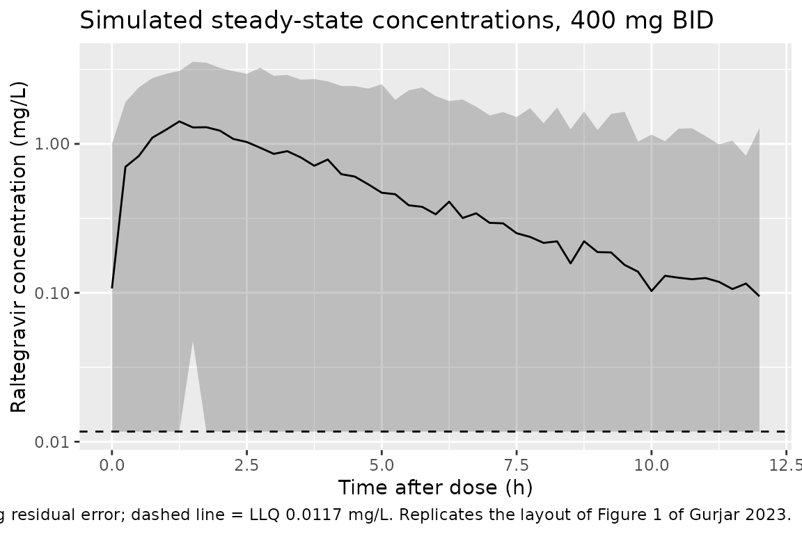

# Raltegravir (Gurjar 2023)

## Model and source

- Citation: Gurjar R, Dickinson L, Carr D, Stohr W, Bonora S, Owen A,
  D’Avolio A, Cursley A, De Castro N, Fatkenheuer G, Vandekerckhove L,
  Di Perri G, Pozniak A, Schwimmer C, Raffi F, Boffito M, and the
  NEAT001/ANRS143 Study Group. Influence of UGT1A1 and SLC22A6
  polymorphisms on the population pharmacokinetics and pharmacodynamics
  of raltegravir in HIV-infected adults: a NEAT001/ANRS143 substudy.
  Pharmacogenomics J. 2023;23:14-20. <doi:10.1038/s41397-022-00293-5>
- Description: Two-compartment first-order-absorption population PK
  model for oral raltegravir 400 mg twice daily in treatment-naive
  HIV-1-infected adults of the NEAT001/ANRS143 trial
  (darunavir/ritonavir background), estimated from sparse single samples
  at weeks 4 and 24 with NONMEM \$PRIOR (NWPRI) informative priors on
  Q/F, Vp/F, ka and Vc/F from Arab-Alameddine 2012; interindividual
  variability on CL/F only, proportional residual error, and no retained
  covariates (weight, age, sex, ethnicity, UGT1A1\*28 and SLC22A6
  genotypes all screened and rejected) (Gurjar 2023).
- Article: <https://doi.org/10.1038/s41397-022-00293-5> (open access;
  the Supplementary Information holds the univariable covariate screen
  in Table S1 and the final NONMEM control stream)

Gurjar et al. fitted a two-compartment, first-order-absorption model to
sparse raltegravir concentrations from the NEAT001/ANRS143 trial: one
sample per patient at each of weeks 4 and 24. Because one sample per
dosing interval cannot separate between-subject from residual
variability, the authors used NONMEM’s `$PRIOR NWPRI` subroutine with
informative priors on Q/F, Vp/F, ka and Vc/F taken from Arab-Alameddine
2012 (packaged as `ArabAlameddine_2012_raltegravir`). CL/F was estimated
without a prior. Weight, age, sex, ethnicity, UGT1A1\*28 activity group
and two SLC22A6 (OAT1) polymorphisms were screened on CL/F, and none was
retained, so the final model has no covariates.

## Population

The analysis used 602 concentrations from 349 treatment-naive
HIV-1-infected adults randomised to raltegravir 400 mg twice daily plus
darunavir/ritonavir (Table 1). Of these, 87.7% were male; median age was
37 (20-71) years and median weight 72 (41-135) kg. Ethnicity was 82.5%
Caucasian, 12.6% Black, 2.3% Asian and 2.6% other. Median baseline CD4
count was 340 (5-780) cells/mm^3 and median HIV RNA 4.82 (3.11-6.31)
log10 copies/mL. Concentrations ranged from 0.012 to 17.3 mg/L, sampled
0.17-16.0 h post-dose. Patients came from 78 European sites in 15
countries.

The same information is available programmatically via
`readModelDb("Gurjar_2023_raltegravir")()$population`.

## Source trace

| Equation / parameter | Value | Source location |
|----|----|----|
| `lcl` (CL/F) | log(55.8 L/h) | Table 2 (RSE 4.1%) |
| `lvc` (Vc/F) | log(194 L) | Table 2 (RSE 6.5%) |
| `lq` (Q/F) | log(13.0 L/h) | Table 2 (RSE 4.0%) |
| `lvp` (Vp/F) | log(117 L) | Table 2 (RSE 0.6%) |
| `lka` (ka) | log(1.12 1/h) | Table 2 (RSE 13.0%) |
| `etalcl` | 0.33156 = log(1 + 0.627^2) | Table 2, IIV CL/F 62.7% (RSE 12.1%) |
| `propSd` | 0.699 | Table 2, proportional residual error 69.9% (RSE 7.0%) |
| Structure: `d/dt(depot)`, `d/dt(central)`, `d/dt(peripheral1)` | n/a | Results “Population pharmacokinetic modelling”; control stream `$SUBROUTINE ADVAN4 TRANS4` |
| `cl <- exp(lcl + etalcl)`, no IIV on other parameters | n/a | Control stream `CL=TVCL*EXP(ETA(1))`; `$OMEGA 0 FIX` for ETA(2)-ETA(5) |
| `Cc ~ prop(propSd)` | n/a | Control stream `Y=F*(1+ERR(1))` |

## Virtual cohort and simulation

The paper’s predicted exposures are steady-state values for 400 mg twice
daily. The simulation gives 200 virtual patients 20 doses of 400 mg
every 12 h and samples the final dosing interval (228-240 h) every 0.25
h. The model has no covariates, so the cohort needs no demographic
columns.

``` r

mod <- readModelDb("Gurjar_2023_raltegravir")

n_sub <- 200
t_last_dose <- 228
obs_times <- seq(t_last_dose, t_last_dose + 12, by = 0.25)

events <- rxode2::et(amt = 400, ii = 12, addl = 19, cmt = "depot") |>
  rxode2::et(obs_times, cmt = "central") |>
  rxode2::et(id = seq_len(n_sub)) |>
  as.data.frame() |>
  dplyr::mutate(treatment = "400 mg BID")

rxode2::rxSetSeed(2023)
sim <- rxode2::rxSolve(mod, events = events, keep = "treatment") |>
  as.data.frame() |>
  dplyr::mutate(tad = time - t_last_dose)
```

## Replicate published figures

### Figure 1: visual predictive check

``` r

sim |>
  dplyr::group_by(tad) |>
  dplyr::summarise(
    Q05 = quantile(sim, 0.05),
    Q50 = quantile(sim, 0.50),
    Q95 = quantile(sim, 0.95),
    .groups = "drop"
  ) |>
  ggplot(aes(tad, Q50)) +
  geom_ribbon(aes(ymin = pmax(Q05, 0.0117), ymax = Q95), alpha = 0.25) +
  geom_line() +
  geom_hline(yintercept = 0.0117, linetype = "dashed") +
  scale_y_log10() +
  labs(
    x = "Time after dose (h)",
    y = "Raltegravir concentration (mg/L)",
    title = "Simulated steady-state concentrations, 400 mg BID",
    caption = paste(
      "Median and 5th-95th percentiles including residual error;",
      "dashed line = LLQ 0.0117 mg/L. Replicates the layout of Figure 1 of Gurjar 2023."
    )
  )
```



Figure 1 of the paper plots 602 observations between about 0.01 and 17
mg/L. With a 69.9% proportional residual error drawn on the linear
scale, the simulated 5th percentile falls below the LLQ (and can be
negative) at every time after dose, so the band is drawn from the LLQ
upward. The simulated 95th percentile is about 3.5 mg/L near the peak
and 0.8 mg/L at 12 h.

### Figure 2A: CL/F distribution

Figure 2A plots individual CL/F values by UGT1A1 activity group. UGT1A1
was not retained in the final model, so a single simulated distribution
is shown here.

``` r

cl_ind <- sim |>
  dplyr::distinct(id, cl)
summary(cl_ind$cl)
#>    Min. 1st Qu.  Median    Mean 3rd Qu.    Max. 
#>   13.65   37.10   58.26   66.73   85.72  309.61
```

## PKNCA validation

The paper reports the model-predicted mean (SD; CV%) of AUC0-12, Cmax
and C12, and the median Tmax, over its 349 patients (Results,
“Population pharmacokinetic modelling”). The simulation is compared with
those values using PKNCA on the final steady-state dosing interval.

``` r

sim_nca <- sim |>
  dplyr::filter(!is.na(Cc)) |>
  dplyr::select(id, time, Cc, treatment)

dose_df <- events |>
  dplyr::filter(evid == 1) |>
  dplyr::select(id, time, amt, treatment)

conc_obj <- PKNCA::PKNCAconc(sim_nca, Cc ~ time | treatment + id)
dose_obj <- PKNCA::PKNCAdose(dose_df, amt ~ time | treatment + id)

intervals <- data.frame(
  start = t_last_dose,
  end = t_last_dose + 12,
  cmax = TRUE,
  tmax = TRUE,
  auclast = TRUE,
  clast.obs = TRUE
)

nca_res <- PKNCA::pk.nca(PKNCA::PKNCAdata(conc_obj, dose_obj, intervals = intervals))
nca_ind <- as.data.frame(nca_res) |>
  dplyr::select(id, treatment, PPTESTCD, PPORRES) |>
  tidyr::pivot_wider(names_from = PPTESTCD, values_from = PPORRES)
```

The paper’s half-life is the terminal (beta) half-life computed in `$PK`
from each patient’s CL, V2, Q and V3. It is computed here the same way,
because PKNCA cannot estimate a terminal slope inside one 12-h interval.

``` r

hl_ind <- sim |>
  dplyr::distinct(id, cl, vc, q, vp) |>
  dplyr::mutate(
    k10 = cl / vc,
    k12 = q / vc,
    k21 = q / vp,
    s = k10 + k12 + k21,
    beta = 0.5 * (s - sqrt(s^2 - 4 * k21 * k10)),
    half.life = log(2) / beta
  ) |>
  dplyr::select(id, half.life)

nca_ind <- dplyr::left_join(nca_ind, hl_ind, by = "id")
```

### Comparison against published values

The paper reports means for every parameter except Tmax, which it
reports as a median. The simulated summary therefore uses the same
statistics.

``` r

sim_summary <- nca_ind |>
  dplyr::group_by(treatment) |>
  dplyr::summarise(
    auclast = mean(auclast),
    cmax = mean(cmax),
    clast.obs = mean(clast.obs),
    half.life = mean(half.life),
    tmax = median(tmax),
    .groups = "drop"
  )

published <- tibble::tribble(
  ~treatment, ~auclast, ~cmax, ~clast.obs, ~half.life, ~tmax,
  "400 mg BID", 8.70, 1.44, 0.29, 9.13, 1.50
)

cmp <- nlmixr2lib::ncaComparisonTable(
  simulated = sim_summary,
  reference = published,
  by = "treatment",
  units = c(
    auclast = "mg*h/L", cmax = "mg/L", clast.obs = "mg/L",
    half.life = "h", tmax = "h"
  ),
  tolerance_pct = 20
)
knitr::kable(
  cmp,
  caption = paste(
    "Simulated (n = 200) vs. published model-predicted values at steady state.",
    "AUC0-12, Cmax, C12 (Clast) and half-life are means; Tmax is a median.",
    "* differs from reference by >20%."
  )
)
```

| NCA parameter     | treatment  | Reference | Simulated | % diff |
|:------------------|:-----------|:----------|:----------|:-------|
| Cmax (mg/L)       | 400 mg BID | 1.44      | 1.42      | -1.7%  |
| Tmax (h)          | 400 mg BID | 1.5       | 1.5       | +0.0%  |
| Clast (mg/L)      | 400 mg BID | 0.29      | 0.259     | -10.8% |
| AUClast (mg\*h/L) | 400 mg BID | 8.7       | 8.34      | -4.1%  |
| t½ (h)            | 400 mg BID | 9.13      | 8.92      | -2.3%  |

Simulated (n = 200) vs. published model-predicted values at steady
state. AUC0-12, Cmax, C12 (Clast) and half-life are means; Tmax is a
median. \* differs from reference by \>20%. {.table}

``` r

pct <- function(sim, ref) 100 * (sim / ref - 1)
# At steady state AUC0-12 = F * Dose / CL for each subject; the two sides use
# the same drawn CL, so only trapezoidal error separates them.
auc_closed <- sim |>
  dplyr::distinct(id, cl) |>
  dplyr::mutate(auc_cf = 400 / cl) |>
  dplyr::left_join(nca_ind, by = "id")
auc_err <- abs(pct(auc_closed$auclast, auc_closed$auc_cf))
stopifnot(
  median(auc_err) < 1,
  quantile(auc_err, 0.9) < 2
)

# Cohort means against the paper's model-predicted means. The Monte-Carlo SE of
# the AUC mean with a 64% CV and 200 subjects is about 4.5%; a mis-transcribed
# CL/F, volume, dose or unit moves these by tens of percent.
stopifnot(
  abs(pct(sim_summary$auclast, 8.70)) < 15,
  abs(pct(sim_summary$cmax, 1.44)) < 15,
  abs(pct(sim_summary$half.life, 9.13)) < 15,
  # C12 has a CV above 100%, so its mean is noisier.
  abs(pct(sim_summary$clast.obs, 0.29)) < 30,
  sim_summary$tmax >= 1,
  sim_summary$tmax <= 2
)
```

The simulated means of AUC0-12, Cmax and half-life fall close to the
paper’s values, and the median Tmax lies inside the published range of
1.00-2.00 h. The simulated spreads are narrower than the paper’s
(published CVs: AUC0-12 94%, Cmax 47%, C12 205%). The paper summarises
empirical-Bayes estimates for 349 real patients. Those carry the
skewness of a sparse-data fit, while the packaged model draws CL/F from
a lognormal with no variability on the other parameters.

## Assumptions and deviations

- **IIV scale.** Table 2 reports IIV on CL/F as “62.7%” with no
  definition. It is read as a coefficient of variation, so omega^2 =
  log(1 + 0.627^2) = 0.3316. That matches the convention in the same
  group’s other packaged models (`Dickinson_2009_atazanavir`,
  `Dickinson_2021_dolutegravir`, `Schipani_2012_lopinavir`). The
  alternative reading, omega x 100 (omega^2 = 0.393), changes the
  expected mean AUC0-12 from 8.46 to 8.73 mg\*h/L. The sampling noise of
  the comparison above cannot tell these apart, and the paper reports no
  confidence interval that could decide it.
- **Residual error.** “Proportional (%) 69.9” is read as the standard
  deviation of the proportional error `ERR(1)` in `Y = F*(1 + ERR(1))`,
  i.e. `propSd = 0.699`.
- **Random effects fixed to zero.** The control stream declares etas on
  Vc, Q, Vp and ka with `$OMEGA 0 FIX`. Those etas are omitted from the
  packaged model because a zero variance has no effect.
- **Priors.** The `$PRIOR NWPRI` prior means (Q 8.5 L/h, V3 113 L, ka
  0.21 1/h, V2 223 L) and prior variances (4.6, 46.3, 0.033, 117) only
  shaped the estimation. The packaged model uses the posterior final
  estimates from Table 2. Note that the estimated ka (1.12 1/h) moved
  well away from its prior (0.21 1/h).
- **Bioavailability.** All parameters are apparent (divided by F), so
  `f(depot)` is left at 1.
- **Screened covariates.** Weight, age, sex, ethnicity, UGT1A1 activity
  group and the SLC22A6 rs4149170 and rs11568626 genotypes were screened
  on CL/F and rejected (Supplementary Table S1). They are recorded under
  `covariatesDataExcluded`. The non-significant 21% lower CL/F in UGT1A1
  low activity (*28/*28) patients is not in the model.
- **Dosing.** Steady state is approximated by 20 consecutive 400 mg
  doses every 12 h. Darunavir/ritonavir co-administration is implicit in
  the parameter values (all patients received it) and is not a
  covariate.
- **No correction notice** was found for the article (Europe PMC search,
  2026-10-09).
