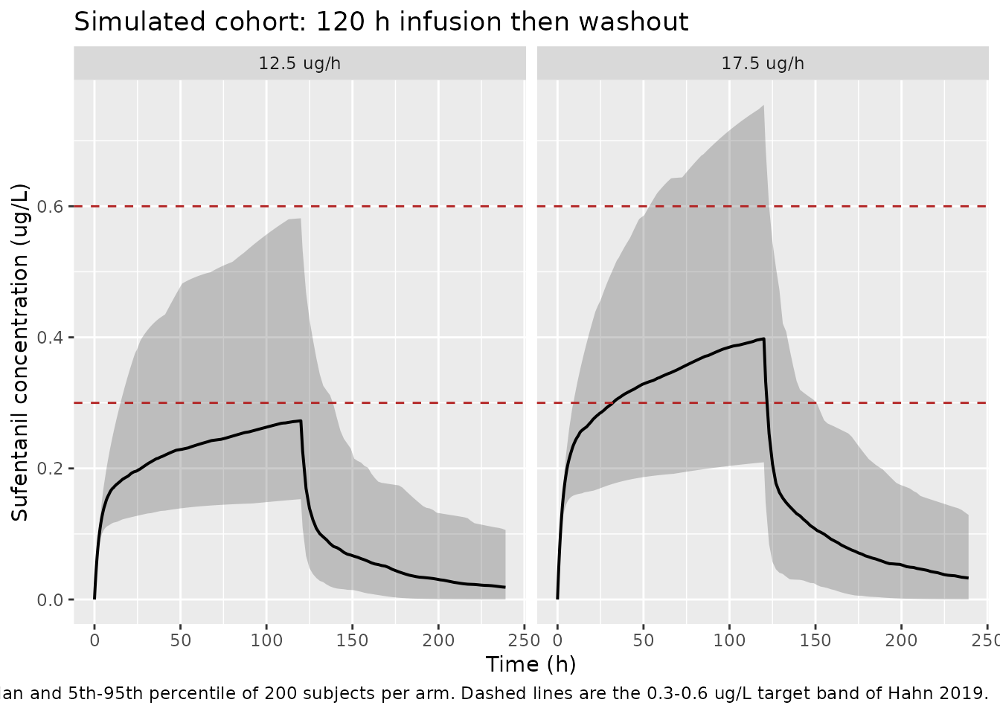
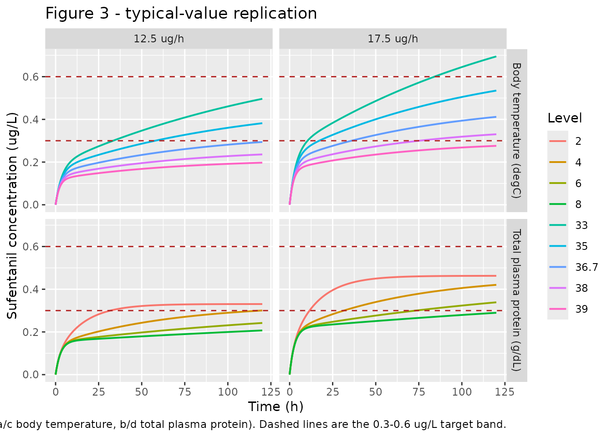

# Sufentanil (Hahn 2019)

## Model and source

- Citation: Hahn J, Yang S, Min KL, Kim D, Jin BH, Park C, Park MS, Wi
  J, Chang MJ. Population pharmacokinetics of intravenous sufentanil in
  critically ill patients supported with extracorporeal membrane
  oxygenation therapy. Critical Care 2019;23:248.
  <doi:10.1186/s13054-019-2508-4>.
- Description: Two-compartment IV population PK model for sufentanil in
  critically ill adults supported with venoarterial extracorporeal
  membrane oxygenation (VA-ECMO) after myocardial infarction.
  First-order elimination, no absorption (continuous IV infusion into
  the central compartment). Two covariates were retained after forward
  selection and backward elimination: an exponential effect of tympanic
  body temperature on clearance (+23.0% per degC, centered at the cohort
  median 36.9 degC) and a power effect of total plasma protein on the
  peripheral volume (exponent 2.46, centered at the cohort median 4.5
  g/dL = 45 g/L). Inter-individual variability was estimated on CL and
  V2 only. Proportional residual error 29.0%. Relative to non-ECMO
  reference data the volumes are markedly increased and clearance
  decreased, consistent with circuit sequestration of this lipophilic,
  highly protein-bound drug and with reduced hepatic blood flow in
  critical illness. Parameter values from Hahn 2019 Table 2 (final model
  column).
- Article: <https://doi.org/10.1186/s13054-019-2508-4> (open access,
  Critical Care 2019;23:248)

## Population

Hahn 2019 is a prospective, single-centre cohort PK study run at the
cardiac intensive care unit of Severance Cardiovascular Hospital, Seoul,
between January 2016 and June 2017 (IRB 4-20140919; ClinicalTrials.gov
NCT02581280). Twenty critically ill Korean adults receiving
sufentanil-based analgesia and sedation during venoarterial ECMO for
myocardial infarction contributed 106 plasma samples. Median (range) age
was 55 (23-88) years, body weight 69.4 (52.9-92.5) kg, lean body weight
55.3 (36.8-58.6) kg, and APACHE II score 29 (15-36); 16 of 20 were male.
All received mechanical ventilation and started ECMO within 12 h of
infarct onset; nine also received continuous venovenous
hemodiafiltration. Median VA-ECMO duration was 138 (52.9-263) h and
median sufentanil infusion duration 110 (34-260) h (Table 1).

The two covariates retained in the final model had cohort medians
(ranges) of 36.9 (33-38.7) degC for tympanic body temperature and 4.5
(2.1-6) g/dL for total plasma protein (Table 1). Sufentanil was infused
continuously at an initial 12.5 ug/h for patients under 60 kg (5 of 20)
or 17.5 ug/h at or above 60 kg (15 of 20), titrated to a target Richmond
Agitation Sedation Scale score.

The same information is available programmatically via the model’s
`population` metadata
(`readModelDb("Hahn_2019_sufentanil")()$population`).

## Source trace

The per-parameter origin is recorded as an in-file comment next to each
`ini()` entry in `inst/modeldb/specificDrugs/Hahn_2019_sufentanil.R`.
The table below collects them in one place for review. All values are
from the **final model** column of Table 2; the structural-model column
is not used.

| Equation / parameter | Value | Source location |
|----|----|----|
| `lcl` (CL) | 37.8 L/h | Table 2, `Theta CL` row, final model (RSE 3%) |
| `lvc` (V1) | 229 L | Table 2, `Theta V1` row, final model (RSE 10%) |
| `lq` (Q) | 41 L/h | Table 2, `Theta Q` row, final model (RSE 12%) |
| `lvp` (V2) | 1640 L | Table 2, `Theta V2` row, final model (RSE 9%) |
| `e_bodytemp_cl` | 0.207 per degC | Table 2, `Theta Temp` row (RSE 5%); Results final-model equation |
| `e_tpro_vp` | 2.46 | Table 2, `Theta T.Prot` row (RSE 7%); Results final-model equation |
| `etalcl` | 0.167 (variance) | Table 2, `omega CL 2` row, final model (RSE 57%, shrinkage 20%) |
| `etalvp` | 1.13 (variance) | Table 2, `omega V2 2` row, final model (RSE 48%, shrinkage 22%) |
| `propSd` | 0.29 = sqrt(0.0841) | Table 2, `sigma 2 proportional` row, final model = 0.0841 |
| BODYTEMP reference 36.9 degC | n/a | Results final-model equation; Table 1 cohort median |
| TPRO reference 45 g/L (4.5 g/dL) | n/a | Results final-model equation; Table 1 cohort median |
| `CL = 37.8 * exp(0.207 * (temperature - 36.9))` | n/a | Results, “Population PK model building” |
| `V2 = 1640 * (total plasma protein / 4.5)^2.46` | n/a | Results, “Population PK model building” |
| Two-compartment IV disposition, first-order elimination | n/a | Results, “Population PK model building”; Discussion para. 1 |
| Proportional residual error `c = cp * (1 + eps)` | n/a | Methods, “Population PK model development” |
| Log-normal IIV `theta_i = theta_pop * exp(eta_i)` | n/a | Methods, “Population PK model development” |

Parameter scales worth stating explicitly, because they are the two
places a transcription of this table can go wrong:

- The IIV rows are labelled **`omega^2`**, so 0.167 and 1.13 are NONMEM
  log-normal **variances** and are carried into `ini()` unchanged
  (`etalcl ~ 0.167`), not squared or square-rooted.
- The residual row is labelled **`sigma^2`**, so 0.0841 is a
  **variance** while `nlmixr2`’s `prop()` expects a standard deviation.
  `sqrt(0.0841) = 0.29` exactly, which is itself a check that the
  variance reading is the right one.

``` r

# The exact square root is the evidence that Table 2's sigma^2 row is a
# variance rather than a CV: a 0.0841 CV would not be a round 0.29 when
# squared.
stopifnot(isTRUE(all.equal(sqrt(0.0841), 0.29, tolerance = 1e-12)))
```

## Model structure

``` r

mod <- readModelDb("Hahn_2019_sufentanil")
mod_typical <- rxode2::zeroRe(mod)
#> ℹ parameter labels from comments will be replaced by 'label()'

# Reference covariate values (both cohort medians; the model centres on them).
ref_covs <- c(BODYTEMP = 36.9, TPRO = 45)

# Published typical values at the reference point.
pub <- c(CL = 37.8, V1 = 229, Q = 41, V2 = 1640)
```

The model is solved from explicit ODEs rather than `rxode2`’s analytic
linear solver. That matters for every check below, so it is asserted
rather than assumed.

``` r

ui <- rxode2::rxode2(readModelDb("Hahn_2019_sufentanil"))
#> ℹ parameter labels from comments will be replaced by 'label()'
stopifnot(is.null(ui$linCmt))
stopifnot(identical(ui$state, c("central", "peripheral1")))
```

## Structural verification

These checks are deterministic: they use `zeroRe()` typical-value solves
with no random draw at all, so they reproduce bit-for-bit on any
machine, any thread count and any `rxode2` build. The stochastic cohort
further down is used for display, not for tight numeric bounds.

### Covariate multipliers reproduce the published equations

``` r

cov_mult <- function(BODYTEMP, TPRO) {
  s <- rxode2::rxSolve(
    mod_typical,
    rxode2::et(amt = 100, cmt = "central") |> rxode2::et(c(0, 1)),
    params = c(BODYTEMP = BODYTEMP, TPRO = TPRO),
    returnType = "data.frame"
  )
  c(cl = s$cl[1], vp = s$vp[1])
}

# Published: CL = 37.8 * EXP(0.207 * (temperature - 36.9))
#            V2 = 1640 * (total plasma protein / 4.5)^2.46
chk_cl <- vapply(
  c(33, 35, 36.7, 36.9, 38, 39),
  function(tt) cov_mult(tt, 45)[["cl"]] / (37.8 * exp(0.207 * (tt - 36.9))),
  numeric(1)
)
#> ℹ omega/sigma items treated as zero: 'etalcl', 'etalvp'
#> ℹ omega/sigma items treated as zero: 'etalcl', 'etalvp'
#> ℹ omega/sigma items treated as zero: 'etalcl', 'etalvp'
#> ℹ omega/sigma items treated as zero: 'etalcl', 'etalvp'
#> ℹ omega/sigma items treated as zero: 'etalcl', 'etalvp'
#> ℹ omega/sigma items treated as zero: 'etalcl', 'etalvp'
chk_vp <- vapply(
  c(2, 4, 4.5, 6, 8),
  function(tp) cov_mult(36.9, tp * 10)[["vp"]] / (1640 * (tp / 4.5)^2.46),
  numeric(1)
)
#> ℹ omega/sigma items treated as zero: 'etalcl', 'etalvp'
#> ℹ omega/sigma items treated as zero: 'etalcl', 'etalvp'
#> ℹ omega/sigma items treated as zero: 'etalcl', 'etalvp'
#> ℹ omega/sigma items treated as zero: 'etalcl', 'etalvp'
#> ℹ omega/sigma items treated as zero: 'etalcl', 'etalvp'

stopifnot(
  max(abs(chk_cl - 1)) < 1e-10,
  max(abs(chk_vp - 1)) < 1e-10
)

# At the reference covariates the individual parameters must be the published
# typical values exactly.
ref <- rxode2::rxSolve(
  mod_typical,
  rxode2::et(amt = 100, cmt = "central") |> rxode2::et(c(0, 1)),
  params = ref_covs, returnType = "data.frame"
)
#> ℹ omega/sigma items treated as zero: 'etalcl', 'etalvp'
stopifnot(
  isTRUE(all.equal(ref$cl[1], pub[["CL"]], tolerance = 1e-10)),
  isTRUE(all.equal(ref$vc[1], pub[["V1"]], tolerance = 1e-10)),
  isTRUE(all.equal(ref$q[1],  pub[["Q"]],  tolerance = 1e-10)),
  isTRUE(all.equal(ref$vp[1], pub[["V2"]], tolerance = 1e-10))
)
```

The realised covariate effects, stated as fold-changes so they can be
read against the paper’s Discussion:

``` r

tibble(
  Covariate = c(rep("Body temperature (degC)", 5), rep("Total plasma protein (g/dL)", 4)),
  Level = c(33, 35, 36.7, 38, 39, 2, 4, 6, 8),
  `Fold change vs reference` = c(
    exp(0.207 * (c(33, 35, 36.7, 38, 39) - 36.9)),
    (c(2, 4, 6, 8) / 4.5)^2.46
  ),
  `Affected parameter` = c(rep("CL", 5), rep("V2", 4))
) |>
  mutate(`Fold change vs reference` = round(`Fold change vs reference`, 3)) |>
  knitr::kable(
    caption = paste(
      "Covariate multipliers from the Hahn 2019 final-model equations, at the",
      "levels used in the paper's Monte Carlo simulations. Reference:",
      "36.9 degC and 4.5 g/dL."
    )
  )
```

| Covariate | Level | Fold change vs reference | Affected parameter |
|:---|---:|---:|:---|
| Body temperature (degC) | 33.0 | 0.446 | CL |
| Body temperature (degC) | 35.0 | 0.675 | CL |
| Body temperature (degC) | 36.7 | 0.959 | CL |
| Body temperature (degC) | 38.0 | 1.256 | CL |
| Body temperature (degC) | 39.0 | 1.544 | CL |
| Total plasma protein (g/dL) | 2.0 | 0.136 | V2 |
| Total plasma protein (g/dL) | 4.0 | 0.748 | V2 |
| Total plasma protein (g/dL) | 6.0 | 2.029 | V2 |
| Total plasma protein (g/dL) | 8.0 | 4.118 | V2 |

Covariate multipliers from the Hahn 2019 final-model equations, at the
levels used in the paper’s Monte Carlo simulations. Reference: 36.9 degC
and 4.5 g/dL. {.table}

Clearance falls to 0.446 of its reference value at 33 degC and rises to
1.48 at 39 degC, matching the Discussion’s account of reduced hepatic
blood flow and slowed CYP3A4 activity in hypothermia. The protein
exponent is steep: V2 at 2 g/dL is only 0.136 of its reference value.

### Steady-state identity: Css = infusion rate / CL

During a constant infusion long enough to reach steady state, the
central concentration must equal `Rate / CL` exactly, whatever the
distribution parameters are. This isolates CL and the temperature effect
from V1, V2 and Q.

``` r

# The infusion must run long enough for the SLOWEST stratum to converge. At
# TPRO = 80 g/L, V2 = 1640 * (8/4.5)^2.46 = 7430 L and the terminal half-life
# is about 264 h, so 10000 h is roughly 38 terminal half-lives -- the residual
# approach-to-steady-state error is then far below the 1e-6 tolerance and the
# gate tests the identity rather than the simulation length.
css_check <- function(rate_ugh, BODYTEMP, TPRO, dur = 10000) {
  ev <- rxode2::et(amt = rate_ugh * dur, rate = rate_ugh, cmt = "central") |>
    rxode2::et(seq(0, dur, by = 25))
  s <- rxode2::rxSolve(
    mod_typical, ev,
    params = c(BODYTEMP = BODYTEMP, TPRO = TPRO), returnType = "data.frame"
  )
  tibble(
    rate_ugh = rate_ugh, BODYTEMP = BODYTEMP, TPRO = TPRO,
    Css_sim = s$Cc[nrow(s)], Css_closed = rate_ugh / s$cl[1]
  )
}

css <- bind_rows(
  css_check(12.5, 36.9, 45), css_check(17.5, 36.9, 45),
  css_check(17.5, 33.0, 45), css_check(17.5, 39.0, 45),
  css_check(17.5, 36.9, 20), css_check(17.5, 36.9, 80)
) |>
  mutate(ratio = Css_sim / Css_closed)
#> ℹ omega/sigma items treated as zero: 'etalcl', 'etalvp'
#> ℹ omega/sigma items treated as zero: 'etalcl', 'etalvp'
#> ℹ omega/sigma items treated as zero: 'etalcl', 'etalvp'
#> ℹ omega/sigma items treated as zero: 'etalcl', 'etalvp'
#> ℹ omega/sigma items treated as zero: 'etalcl', 'etalvp'
#> ℹ omega/sigma items treated as zero: 'etalcl', 'etalvp'

stopifnot(max(abs(css$ratio - 1)) < 1e-6)

css |>
  mutate(across(c(Css_sim, Css_closed), ~ round(.x, 4)), ratio = round(ratio, 8)) |>
  rename(
    "Rate (ug/h)" = rate_ugh, "Body temp (degC)" = BODYTEMP,
    "TPRO (g/L)" = TPRO, "Css simulated (ug/L)" = Css_sim,
    "Rate/CL (ug/L)" = Css_closed, "Ratio" = ratio
  ) |>
  knitr::kable(
    caption = paste(
      "Steady-state identity after a 3000 h infusion. Css depends only on",
      "CL, so the protein covariate (which acts on V2) leaves it unchanged."
    )
  )
```

| Rate (ug/h) | Body temp (degC) | TPRO (g/L) | Css simulated (ug/L) | Rate/CL (ug/L) | Ratio |
|---:|---:|---:|---:|---:|---:|
| 12.5 | 36.9 | 45 | 0.3307 | 0.3307 | 1 |
| 17.5 | 36.9 | 45 | 0.4630 | 0.4630 | 1 |
| 17.5 | 33.0 | 45 | 1.0379 | 1.0379 | 1 |
| 17.5 | 39.0 | 45 | 0.2997 | 0.2997 | 1 |
| 17.5 | 36.9 | 20 | 0.4630 | 0.4630 | 1 |
| 17.5 | 36.9 | 80 | 0.4630 | 0.4630 | 1 |

Steady-state identity after a 3000 h infusion. Css depends only on CL,
so the protein covariate (which acts on V2) leaves it unchanged. {.table
style="width:100%;"}

Note that the two total-protein rows give identical Css: total plasma
protein acts only on V2, so it changes how fast the steady state is
approached, not where it lies. That distinction drives the
interpretation of Figure 3b/3d below.

### Terminal half-life matches the two-compartment eigenvalue

``` r

# Closed-form beta (terminal) rate constant of a two-compartment IV model.
beta_closed <- function(cl, vc, q, vp) {
  kel <- cl / vc; k12 <- q / vc; k21 <- q / vp
  s <- kel + k12 + k21
  0.5 * (s - sqrt(s^2 - 4 * kel * k21))
}
t_half_closed <- log(2) / beta_closed(pub[["CL"]], pub[["V1"]], pub[["Q"]], pub[["V2"]])

# Empirical terminal slope from a long washout after a short infusion.
ev_wash <- rxode2::et(amt = 100, rate = 100, cmt = "central") |>
  rxode2::et(seq(0, 1500, by = 1))
wash <- rxode2::rxSolve(mod_typical, ev_wash, params = ref_covs, returnType = "data.frame") |>
  filter(time >= 1000)
#> ℹ omega/sigma items treated as zero: 'etalcl', 'etalvp'
# Concentrations must still be strictly positive this far out, else the
# log-linear fit below would be silently dropping records.
stopifnot(all(wash$Cc > 0))
t_half_fit <- log(2) / -stats::coef(stats::lm(log(Cc) ~ time, data = wash))[["time"]]

stopifnot(abs(t_half_fit / t_half_closed - 1) < 1e-3)
c(closed_form_h = t_half_closed, regression_h = t_half_fit) |> round(3)
#> closed_form_h  regression_h 
#>         60.06         60.06
```

The terminal half-life of about 60 h is long relative to the paper’s 120
h simulation window, which is exactly why the Figure 3 profiles are
still rising at 120 h rather than flat.

## Virtual cohort

Original observed data are not publicly available (the paper states the
dataset is available from the corresponding author on request). The
cohort below draws covariates to approximate the Table 1 marginal
distributions: body temperature and total plasma protein are drawn
around their cohort medians and truncated to the reported ranges. The
paper does not report a correlation between the two, so they are drawn
independently.

``` r

# `set.seed()` seeds R's RNG but NOT rxode2's per-thread simulation streams, so
# this cohort is reproducible here and will differ on a machine with a
# different thread count. Every assertion in this vignette that carries a tight
# numeric bound is run against the deterministic `zeroRe()` solves above; the
# cohort is used for display and for the mass-balance gate, whose tolerance is
# a numerical-integration bound and not a property of the draw.
set.seed(20190701)

n_per_arm <- 200L
obs_grid <- c(seq(0, 12, by = 0.25), seq(12.5, 120, by = 0.5), seq(121, 600, by = 2))

make_arm <- function(n, rate_ugh, id_offset) {
  covs <- tibble(
    id = id_offset + seq_len(n),
    # Table 1: tympanic body temperature 36.9 (33-38.7) degC.
    BODYTEMP = pmin(pmax(stats::rnorm(n, 36.9, 1.2), 33), 38.7),
    # Table 1: total plasma protein 4.5 (2.1-6) g/dL, carried in SI g/L.
    TPRO = pmin(pmax(stats::rnorm(n, 45, 9), 21), 60),
    arm = paste0(rate_ugh, " ug/h"),
    rate_ugh = rate_ugh
  )
  dosing <- covs |>
    mutate(time = 0, evid = 1L, amt = rate_ugh * 120, rate = rate_ugh, cmt = "central")
  obs <- covs |>
    tidyr::expand_grid(time = obs_grid) |>
    mutate(evid = 0L, amt = 0, rate = 0, cmt = "central")
  bind_rows(dosing, obs) |> arrange(id, time, desc(evid))
}

# Two arms: the paper's 12.5 ug/h (< 60 kg) and 17.5 ug/h (>= 60 kg) starting
# infusions, each run for 120 h then followed to 600 h to capture the washout.
events <- bind_rows(
  make_arm(n_per_arm, 12.5, 0L),
  make_arm(n_per_arm, 17.5, 1000L)
) |>
  as.data.frame()

stopifnot(!anyDuplicated(unique(events[, c("id", "time", "evid")])))
```

``` r

sim <- rxode2::rxSolve(
  mod, events = events,
  keep = c("arm", "rate_ugh"), returnType = "data.frame"
) |>
  group_by(id) |>
  mutate(cl_i = first(cl), vp_i = first(vp)) |>
  ungroup()
#> ℹ parameter labels from comments will be replaced by 'label()'
```

``` r

sim |>
  filter(time <= 240) |>
  group_by(arm, time) |>
  summarise(
    Q05 = quantile(Cc, 0.05), Q50 = median(Cc), Q95 = quantile(Cc, 0.95),
    .groups = "drop"
  ) |>
  ggplot(aes(time, Q50)) +
  geom_ribbon(aes(ymin = Q05, ymax = Q95), alpha = 0.25) +
  geom_line(linewidth = 0.7) +
  geom_hline(yintercept = c(0.3, 0.6), linetype = "dashed", colour = "firebrick") +
  facet_wrap(~arm) +
  labs(
    x = "Time (h)", y = "Sufentanil concentration (ug/L)",
    title = "Simulated cohort: 120 h infusion then washout",
    caption = paste(
      "Median and 5th-95th percentile of 200 subjects per arm. Dashed lines",
      "are the 0.3-0.6 ug/L target band of Hahn 2019."
    )
  )
```



## Replicate Figure 3

Figure 3 of Hahn 2019 shows Monte Carlo concentrations over a 120 h
infusion at 12.5 and 17.5 ug/h, stratified by body temperature (panels a
and c) and by total plasma protein (panels b and d). The panels below
use the deterministic typical-value solve so that the numeric assertions
are exactly reproducible; the stochastic version of the same strata
follows for comparison against the paper’s simulated spread.

``` r

strata_temp <- tidyr::expand_grid(
  rate_ugh = c(12.5, 17.5),
  BODYTEMP = c(33, 35, 36.7, 38, 39)
) |>
  mutate(TPRO = 45, panel = "Body temperature (degC)", level = BODYTEMP)

strata_prot <- tidyr::expand_grid(
  rate_ugh = c(12.5, 17.5),
  tp_gdl = c(2, 4, 6, 8)
) |>
  mutate(BODYTEMP = 36.9, TPRO = tp_gdl * 10,
         panel = "Total plasma protein (g/dL)", level = tp_gdl) |>
  select(-tp_gdl)

solve_stratum <- function(rate_ugh, BODYTEMP, TPRO, panel, level) {
  ev <- rxode2::et(amt = rate_ugh * 120, rate = rate_ugh, cmt = "central") |>
    rxode2::et(seq(0, 120, by = 0.5))
  rxode2::rxSolve(
    mod_typical, ev,
    params = c(BODYTEMP = BODYTEMP, TPRO = TPRO), returnType = "data.frame"
  ) |>
    transmute(time, Cc, rate_ugh = rate_ugh, panel = panel, level = level)
}

strata <- bind_rows(strata_temp, strata_prot)
fig3 <- bind_rows(Map(
  solve_stratum,
  strata$rate_ugh, strata$BODYTEMP, strata$TPRO, strata$panel, strata$level
)) |>
  mutate(arm = paste0(rate_ugh, " ug/h"))
#> ℹ omega/sigma items treated as zero: 'etalcl', 'etalvp'
#> ℹ omega/sigma items treated as zero: 'etalcl', 'etalvp'
#> ℹ omega/sigma items treated as zero: 'etalcl', 'etalvp'
#> ℹ omega/sigma items treated as zero: 'etalcl', 'etalvp'
#> ℹ omega/sigma items treated as zero: 'etalcl', 'etalvp'
#> ℹ omega/sigma items treated as zero: 'etalcl', 'etalvp'
#> ℹ omega/sigma items treated as zero: 'etalcl', 'etalvp'
#> ℹ omega/sigma items treated as zero: 'etalcl', 'etalvp'
#> ℹ omega/sigma items treated as zero: 'etalcl', 'etalvp'
#> ℹ omega/sigma items treated as zero: 'etalcl', 'etalvp'
#> ℹ omega/sigma items treated as zero: 'etalcl', 'etalvp'
#> ℹ omega/sigma items treated as zero: 'etalcl', 'etalvp'
#> ℹ omega/sigma items treated as zero: 'etalcl', 'etalvp'
#> ℹ omega/sigma items treated as zero: 'etalcl', 'etalvp'
#> ℹ omega/sigma items treated as zero: 'etalcl', 'etalvp'
#> ℹ omega/sigma items treated as zero: 'etalcl', 'etalvp'
#> ℹ omega/sigma items treated as zero: 'etalcl', 'etalvp'
#> ℹ omega/sigma items treated as zero: 'etalcl', 'etalvp'

fig3 |>
  ggplot(aes(time, Cc, colour = factor(level), group = level)) +
  geom_line(linewidth = 0.7) +
  geom_hline(yintercept = c(0.3, 0.6), linetype = "dashed", colour = "firebrick") +
  facet_grid(panel ~ arm) +
  labs(
    x = "Time (h)", y = "Sufentanil concentration (ug/L)", colour = "Level",
    title = "Figure 3 - typical-value replication",
    caption = paste(
      "Replicates Figure 3 of Hahn 2019 (a/c body temperature, b/d total",
      "plasma protein). Dashed lines are the 0.3-0.6 ug/L target band."
    )
  )
```



### Assertions against the paper’s stated conclusions

The paper makes four quantitative claims about Figure 3. Each is
asserted below over the 24-120 h window it refers to.

``` r

window <- fig3 |> filter(time >= 24)

summ <- window |>
  group_by(panel, arm, level) |>
  summarise(min_Cc = min(Cc), mean_Cc = mean(Cc), max_Cc = max(Cc), .groups = "drop")

temp175 <- summ |> filter(panel == "Body temperature (degC)", arm == "17.5 ug/h")
prot125 <- summ |> filter(panel == "Total plasma protein (g/dL)", arm == "12.5 ug/h")

stopifnot(
  # Claim 1 (Results/Discussion): at 17.5 ug/h, hypothermic patients (33 degC)
  # run ABOVE the 0.6 ug/L upper target bound.
  temp175$max_Cc[temp175$level == 33] > 0.6,

  # Claim 2: at 17.5 ug/h, febrile patients (39 degC) run BELOW the 0.3 ug/L
  # lower target bound across the whole window.
  temp175$max_Cc[temp175$level == 39] < 0.3,

  # Claim 3: at 17.5 ug/h, 35 degC sits entirely WITHIN the target band.
  temp175$min_Cc[temp175$level == 35] > 0.3,
  temp175$max_Cc[temp175$level == 35] < 0.6,

  # Claim 4 ("a dose of 12.5 ug/h was low for patients with total plasma
  # protein levels of 4-8 g/dL"): the window-average stays below the lower
  # target bound at every one of those three strata.
  all(prot125$mean_Cc[prot125$level %in% c(4, 6, 8)] < 0.3),

  # Monotonicity implied by the sign of both covariate effects: concentration
  # falls as temperature rises (CL up) and as total protein rises (V2 up, so
  # the approach to steady state is slower).
  !is.unsorted(rev(temp175$mean_Cc[order(temp175$level)])),
  !is.unsorted(rev(prot125$mean_Cc[order(prot125$level)]))
)

summ |>
  mutate(across(c(min_Cc, mean_Cc, max_Cc), ~ round(.x, 3))) |>
  rename(
    "Panel" = panel, "Infusion rate" = arm, "Level" = level,
    "Min Cc (ug/L)" = min_Cc, "Mean Cc (ug/L)" = mean_Cc, "Max Cc (ug/L)" = max_Cc
  ) |>
  knitr::kable(
    caption = paste(
      "Typical-value concentrations over the 24-120 h window of Figure 3.",
      "Target band 0.3-0.6 ug/L."
    )
  )
```

| Panel | Infusion rate | Level | Min Cc (ug/L) | Mean Cc (ug/L) | Max Cc (ug/L) |
|:---|:---|---:|---:|---:|---:|
| Body temperature (degC) | 12.5 ug/h | 33.0 | 0.271 | 0.396 | 0.496 |
| Body temperature (degC) | 12.5 ug/h | 35.0 | 0.232 | 0.318 | 0.382 |
| Body temperature (degC) | 12.5 ug/h | 36.7 | 0.195 | 0.254 | 0.294 |
| Body temperature (degC) | 12.5 ug/h | 38.0 | 0.168 | 0.209 | 0.236 |
| Body temperature (degC) | 12.5 ug/h | 39.0 | 0.147 | 0.178 | 0.197 |
| Body temperature (degC) | 17.5 ug/h | 33.0 | 0.379 | 0.554 | 0.695 |
| Body temperature (degC) | 17.5 ug/h | 35.0 | 0.324 | 0.445 | 0.535 |
| Body temperature (degC) | 17.5 ug/h | 36.7 | 0.274 | 0.355 | 0.412 |
| Body temperature (degC) | 17.5 ug/h | 38.0 | 0.235 | 0.292 | 0.330 |
| Body temperature (degC) | 17.5 ug/h | 39.0 | 0.206 | 0.249 | 0.276 |
| Total plasma protein (g/dL) | 12.5 ug/h | 2.0 | 0.279 | 0.322 | 0.331 |
| Total plasma protein (g/dL) | 12.5 ug/h | 4.0 | 0.200 | 0.262 | 0.300 |
| Total plasma protein (g/dL) | 12.5 ug/h | 6.0 | 0.176 | 0.212 | 0.242 |
| Total plasma protein (g/dL) | 12.5 ug/h | 8.0 | 0.167 | 0.188 | 0.207 |
| Total plasma protein (g/dL) | 17.5 ug/h | 2.0 | 0.391 | 0.451 | 0.463 |
| Total plasma protein (g/dL) | 17.5 ug/h | 4.0 | 0.280 | 0.367 | 0.421 |
| Total plasma protein (g/dL) | 17.5 ug/h | 6.0 | 0.246 | 0.297 | 0.339 |
| Total plasma protein (g/dL) | 17.5 ug/h | 8.0 | 0.234 | 0.263 | 0.290 |

Typical-value concentrations over the 24-120 h window of Figure 3.
Target band 0.3-0.6 ug/L. {.table}

## PKNCA validation

The paper reports no NCA table, so there is no published Cmax / AUC /
half-life to compare against. PKNCA is instead used to carry a
**mass-balance gate** that the model must satisfy for every simulated
subject: over any window, the amount eliminated equals `CL_i` times the
AUC, and that must equal the dose infused minus the drug still in the
body.

``` r

sim_nca <- sim |>
  filter(!is.na(Cc)) |>
  select(id, time, Cc, arm)

# Guarantee a time = 0 anchor per (id, arm); the infusion starts at t = 0 so
# the pre-dose concentration is 0.
sim_nca <- bind_rows(
  sim_nca,
  sim_nca |> distinct(id, arm) |> mutate(time = 0, Cc = 0)
) |>
  distinct(id, arm, time, .keep_all = TRUE) |>
  arrange(id, arm, time)

conc_obj <- PKNCA::PKNCAconc(sim_nca, Cc ~ time | arm + id)

dose_df <- events |>
  filter(evid == 1) |>
  select(id, time, amt, arm)
dose_obj <- PKNCA::PKNCAdose(dose_df, amt ~ time | arm + id)

intervals <- data.frame(
  start = 0, end = 600,
  auclast = TRUE, cmax = TRUE, tmax = TRUE, half.life = TRUE
)

nca_res <- PKNCA::pk.nca(PKNCA::PKNCAdata(conc_obj, dose_obj, intervals = intervals))
nca_wide <- as.data.frame(nca_res) |>
  select(arm, id, PPTESTCD, PPORRES) |>
  tidyr::pivot_wider(names_from = PPTESTCD, values_from = PPORRES)
```

``` r

# Amount still in the body at the end of the observation window.
remaining <- sim |>
  group_by(id, arm, cl_i, rate_ugh) |>
  summarise(
    in_body = last(central) + last(peripheral1),
    .groups = "drop"
  ) |>
  mutate(dose_given = rate_ugh * 120)

mb <- nca_wide |>
  inner_join(remaining, by = c("id", "arm")) |>
  mutate(
    eliminated_nca = cl_i * auclast,
    eliminated_bal = dose_given - in_body,
    rel_err = (eliminated_nca - eliminated_bal) / eliminated_bal
  )

stopifnot(
  nrow(mb) == 2L * n_per_arm,
  # Strict per-subject gate. The residual is trapezoidal-integration error on
  # the observation grid, not a property of the random draw, so this bound is
  # machine- and thread-count-independent.
  max(abs(mb$rel_err)) < 5e-3
)

c(
  median_abs_rel_err = median(abs(mb$rel_err)),
  q95_abs_rel_err = unname(quantile(abs(mb$rel_err), 0.95)),
  max_abs_rel_err = max(abs(mb$rel_err))
) |> signif(3)
#> median_abs_rel_err    q95_abs_rel_err    max_abs_rel_err 
#>           0.000186           0.000326           0.000436
```

A mutation control confirms the gate is not vacuous: perturbing the
clearance used in the balance by 2% must break it.

``` r

mb_mut <- mb |> mutate(rel_err = (1.02 * cl_i * auclast - eliminated_bal) / eliminated_bal)
stopifnot(max(abs(mb_mut$rel_err)) > 5e-3)
```

### Simulated NCA summary

``` r

nca_wide |>
  group_by(arm) |>
  summarise(
    across(c(cmax, tmax, auclast, half.life),
           list(median = ~ median(.x, na.rm = TRUE),
                p05 = ~ quantile(.x, 0.05, na.rm = TRUE),
                p95 = ~ quantile(.x, 0.95, na.rm = TRUE)),
           .names = "{.col}__{.fn}"),
    .groups = "drop"
  ) |>
  tidyr::pivot_longer(-arm, names_to = c("param", "stat"), names_sep = "__") |>
  tidyr::pivot_wider(names_from = stat, values_from = value) |>
  mutate(
    param = recode(param,
      cmax = "Cmax (ug/L)", tmax = "Tmax (h)",
      auclast = "AUClast (ug*h/L)", `half.life` = "t-half (h)"
    ),
    across(c(median, p05, p95), ~ signif(.x, 3))
  ) |>
  rename(
    "Infusion rate" = arm, "NCA parameter" = param,
    "Median" = median, "5th pctile" = p05, "95th pctile" = p95
  ) |>
  knitr::kable(
    caption = paste(
      "Simulated NCA over 0-600 h (120 h infusion then washout). No published",
      "NCA table exists in Hahn 2019, so these are reported for reference",
      "rather than compared."
    )
  )
```

| Infusion rate | NCA parameter     |  Median | 5th pctile | 95th pctile |
|:--------------|:------------------|--------:|-----------:|------------:|
| 12.5 ug/h     | Cmax (ug/L)       |   0.273 |      0.153 |       0.582 |
| 12.5 ug/h     | Tmax (h)          | 120.000 |    120.000 |     120.000 |
| 12.5 ug/h     | AUClast (ug\*h/L) |  38.100 |     20.600 |      86.500 |
| 12.5 ug/h     | t-half (h)        |  45.100 |      8.600 |     358.000 |
| 17.5 ug/h     | Cmax (ug/L)       |   0.398 |      0.209 |       0.755 |
| 17.5 ug/h     | Tmax (h)          | 120.000 |    120.000 |     120.000 |
| 17.5 ug/h     | AUClast (ug\*h/L) |  55.600 |     28.600 |     107.000 |
| 17.5 ug/h     | t-half (h)        |  49.400 |      9.980 |     378.000 |

Simulated NCA over 0-600 h (120 h infusion then washout). No published
NCA table exists in Hahn 2019, so these are reported for reference
rather than compared. {.table}

Cmax occurs at the end of infusion (Tmax near 120 h), as expected for a
constant infusion with no bolus loading dose. The simulated median
terminal half-life is longer than the 60 h typical value because the V2
variance of 1.13 is large and a long peripheral half-life is a
right-tailed quantity.

## Assumptions and deviations

- **Covariate distributions are reconstructed, not observed.** Table 1
  reports only medians and ranges, with no standard deviations and no
  correlation structure. Body temperature and total plasma protein are
  drawn as independent truncated normals centred on the reported medians
  and clipped to the reported ranges. This affects the displayed cohort
  spread only; every tight numeric assertion in this vignette runs
  against deterministic `zeroRe()` solves.
- **Total plasma protein is carried in SI g/L, not the paper’s g/dL.**
  The canonical `TPRO` column is g/L, so the model uses a reference of
  45 g/L where the paper writes 4.5 g/dL. Because the covariate enters
  as a ratio to its reference, `(TPRO/45)` in g/L is numerically
  identical to the paper’s `(total plasma protein/4.5)` in g/dL and no
  inline conversion is needed. Users must supply `TPRO` in g/L.
- **Body temperature is implemented as a plain covariate column and may
  be time-varying.** Temperature was collected from the electronic
  medical record as an ICU vital sign, and the paper does not state
  whether the fitted covariate was an admission value or a per-record
  value. The model reads whatever `BODYTEMP` the user’s data supplies at
  each record, so either interpretation is expressible; the vignette
  holds it constant per subject.
- **The protein panels use 36.9 degC, not the 36.7 degC of the paper’s
  simulation list.** Methods lists temperature levels of 33, 35, 36.7,
  38 and 39 degC while Table 1 and the final-model equation both centre
  on 36.9 degC. The 36.7 level is retained in the temperature panel as
  published; the protein panels use the model’s own reference of 36.9
  degC so that the protein effect is isolated. The difference is a
  0.04-fold change in CL and is visually indistinguishable.
- **The paper’s “35-38 degC stays within target” claim reproduces only
  at its lower edge.** Results states that at 17.5 ug/h “the
  concentrations of sufentanil from 24 to 120 h were within the target
  concentrations in patients with a body temperature of 35-38 degC”. In
  this replication the 35 degC stratum is indeed within 0.3-0.6 ug/L
  across the whole window (0.324-0.535 ug/L), but the 36.7 and 38 degC
  strata run *below* the 0.3 ug/L lower bound over part of it (36.7 degC
  reaches 0.3 only at about 40 h; 38 degC peaks at 0.330 ug/L and is
  below 0.3 until about 90 h). The bracketing claims reproduce exactly:
  33 degC exceeds 0.6 ug/L and 39 degC never reaches 0.3 ug/L. The most
  likely reading is that Figure 3 plots a simulated *distribution* over
  1000 individuals and that “within the target concentrations” describes
  the band rather than its median - the simulated 5th-95th percentile
  band here does span the target across all three strata. The paper’s
  own Discussion is consistent with the narrower reading, noting
  separately that “optimal levels of analgesia and sedation could not be
  induced with commonly used doses in hyperthermic patients”. No
  parameter was adjusted to close this gap.
- **No published NCA table exists**, so the PKNCA section carries an
  internal mass-balance gate instead of a side-by-side comparison
  against reported Cmax / AUC / half-life values.
- **Covariates screened but not retained** are recorded in the model
  file’s `covariatesDataExcluded` list rather than `covariateData`:
  total bilirubin (significant on CL univariately, dropped in backward
  elimination) and lean body weight (significant on V2 univariately,
  dropped). The paper reports no point estimate for either, so neither
  can be implemented.
- **All parameter values come from the paper’s own text and tables.** No
  value was taken from a figure, from correspondence, or from an
  upstream model. No supplement or erratum was located for this article.
