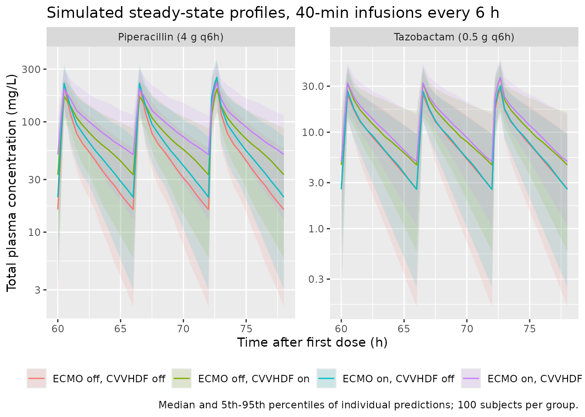
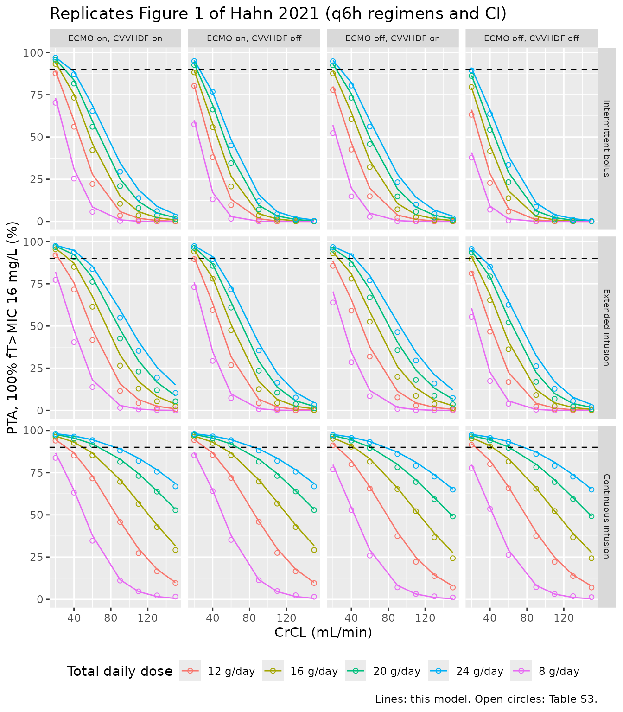
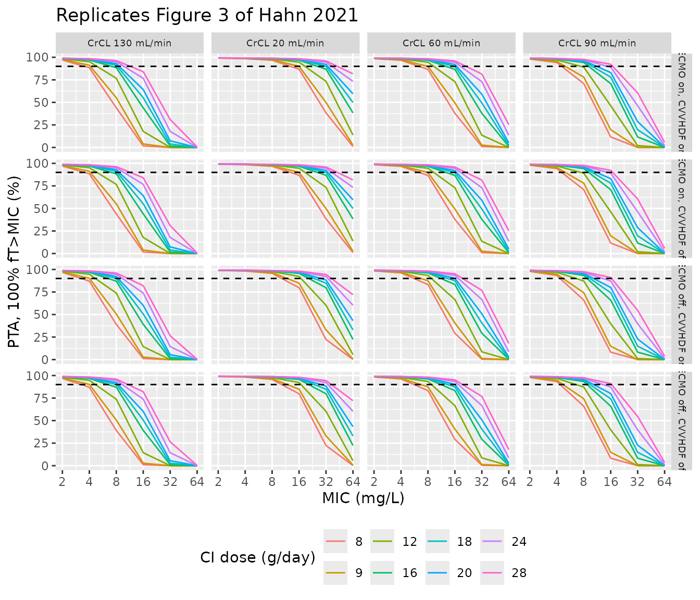
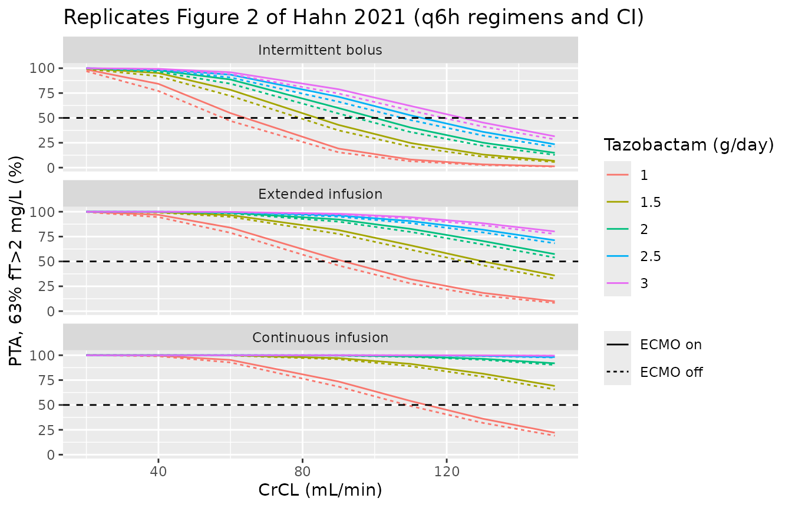

# Piperacillin + tazobactam in ECMO patients (Hahn 2021)

## Model and source

Hahn 2021 fitted piperacillin and tazobactam **separately** in the same
cohort, reporting one final-model equation set per drug (Results,
“Population PK analysis”) and one parameter table per drug (Table 2
piperacillin, Table 3 tazobactam). The two fits are packaged as two
independent model files and described together here.

``` r

mod_pip <- readModelDb("Hahn_2021_piperacillin")
mod_taz <- readModelDb("Hahn_2021_tazobactam")
ui_pip <- rxode2::rxode(mod_pip)
#> ℹ parameter labels from comments will be replaced by 'label()'
ui_taz <- rxode2::rxode(mod_taz)
#> ℹ parameter labels from comments will be replaced by 'label()'

# Typical-value solves with eta columns supplied as data use zeroRe(); rxode2
# then notes that there is no omega, which is intended here.
quiet_solve <- function(mod, ev, ...) {
  withCallingHandlers(
    suppressMessages(rxode2::rxSolve(rxode2::zeroRe(mod), ev, returnType = "data.frame", ...)),
    warning = function(w) {
      if (grepl("omega", conditionMessage(w))) invokeRestart("muffleWarning")
    }
  )
}
```

- Citation: Hahn J, Min KL, Kang S, Yang S, Park MS, Wi J, Chang MJ.
  Population Pharmacokinetics and Dosing Optimization of
  Piperacillin-Tazobactam in Critically Ill Patients on Extracorporeal
  Membrane Oxygenation and the Influence of Concomitant Renal
  Replacement Therapy. Microbiol Spectr. 2021;9(3):e00633-21.
  <doi:10.1128/spectrum.00633-21>. Structural and covariate equations:
  Results, ‘Population PK analysis’ (final piperacillin model equations
  for CL, V1, V2 and Q). All parameter estimates: Table 2, ‘Final model’
  column. The tazobactam counterpart fitted in the same paper is
  modellib(‘Hahn_2021_tazobactam’).
- Piperacillin model: Two-compartment population PK model for
  piperacillin in 26 critically ill Korean adults on venoarterial
  extracorporeal membrane oxygenation (VA-ECMO), 13 of whom also
  received continuous venovenous hemodiafiltration (CVVHDF) (Hahn 2021).
  Zero-order IV input into the central compartment and first-order
  elimination. Clearance is a fractional ECMO reduction of the typical
  value plus an additive term linear in Cockcroft-Gault creatinine
  clearance centred on 54.7 mL/min; the central volume is increased
  2.46-fold during CVVHDF. Log-normal IIV on CL, V1 and V2 and a
  proportional residual error.
- Tazobactam model: Two-compartment population PK model for tazobactam
  in 26 critically ill Korean adults on venoarterial extracorporeal
  membrane oxygenation (VA-ECMO), 13 of whom also received continuous
  venovenous hemodiafiltration (CVVHDF) (Hahn 2021). Zero-order IV input
  into the central compartment and first-order elimination. Clearance is
  an exponential ECMO reduction of the typical value plus an additive
  term linear in Cockcroft-Gault creatinine clearance centred on 54.7
  mL/min. Log-normal IIV on CL and V1 and a combined proportional +
  additive residual error.
- Article: <https://doi.org/10.1128/spectrum.00633-21> (open access)

## Population

Twenty-six critically ill adults on venoarterial extracorporeal membrane
oxygenation (VA-ECMO) in the cardiac intensive care unit of Severance
Cardiovascular Hospital, Seoul, were enrolled between November 2015 and
January 2019 (Methods; NCT02581280). Nineteen (73.1%) were men; median
age 57 years (range 20-89), median weight 70 kg (40.8-92.5), median
APACHE II 32 (6-46). The ECMO indications were ST-elevation myocardial
infarction (16), valvular heart disease (4), cardiomyopathy (3) and
non-ST-elevation myocardial infarction (3). Thirteen patients (50%) also
received continuous venovenous hemodiafiltration (CVVHDF). Median
Cockcroft-Gault creatinine clearance was 54.7 mL/min (16.2-157): 40.5
mL/min while on CVVHDF and 63.2 mL/min while not (Table 1).

Piperacillin-tazobactam was infused over 40 min at 2/0.25 g q6h (9
patients), 3/0.375 g q6h (4), 4/0.5 g q6h (9) or 4/0.5 g q8h (4).
Samples were drawn pre-dose and over 0-8 h after a dose on ECMO days
2-4, and again on day 2 after ECMO weaning in the 14 patients who were
weaned: 244 concentrations in all, 67 on ECMO + CVVHDF, 96 on ECMO only,
27 off ECMO on CVVHDF and 54 off both (Results, “Study population”).
ECMO and CVVHDF status therefore change within a subject, and both
models read them per record.

## Source trace

| Element | Value | Source |
|----|----|----|
| Piperacillin structure | 2-cmt, first-order elimination, proportional error | Results, “Population PK analysis” |
| Piperacillin CL | `9.4 * (1 - 0.092 * ECMO) + 0.115 * (CrCL - 54.7)` L/h | Results equation; Table 2 |
| Piperacillin V1 | `6.56 * (1 + 1.46 * CVVHDF)` L | Results equation; Table 2 |
| Piperacillin V2, Q | 14.2 L, 17.2 L/h | Results equation; Table 2 |
| Piperacillin IIV (omega^2) | CL 0.0523, V1 0.291, V2 0.138 | Table 2 |
| Piperacillin sigma^2 proportional | 0.0979 (SD 0.3129) | Table 2 |
| Tazobactam structure | 2-cmt, first-order elimination, combined error | Results, “Population PK analysis” |
| Tazobactam CL | `7.93 * exp(-0.0723 * ECMO) + 0.104 * (CrCL - 54.7)` L/h | Results equation; Table 3 |
| Tazobactam V1, V2, Q | 8.58 L, 10.5 L, 17.1 L/h | Results equation; Table 3 |
| Tazobactam IIV (omega^2) | CL 0.0724, V1 0.705 | Table 3 |
| Tazobactam sigma^2 | proportional 0.0675 (SD 0.2598); additive 0.517 mg^(2/L)2 (SD 0.7190 mg/L) | Table 3 |
| CrCL centring | 54.7 mL/min, the cohort median | Methods; Table 1 |
| Unbound fraction for PTA | 0.7 (30% protein binding) | Methods, “Monte Carlo simulations” |
| PTA table | 4 groups x 7 CrCL levels x 22 regimens | Table S3 |

## Typical values quoted in the Discussion

The Discussion restates the piperacillin typical values at the median
CrCL: CL 8.54 L/h on ECMO and 9.4 L/h after weaning, V1 16.14 L on
CVVHDF and 6.56 L off. Solving the typical-value model for the four
ECMO/CVVHDF combinations at CrCL = 54.7 mL/min recovers them.

``` r

groups <- tibble::tibble(
  group = 1:4,
  label = c(
    "ECMO on, CVVHDF on", "ECMO on, CVVHDF off",
    "ECMO off, CVVHDF on", "ECMO off, CVVHDF off"
  ),
  ECMO_STATUS = c(1L, 1L, 0L, 0L),
  RRT_CRRT_STATUS = c(1L, 0L, 1L, 0L)
)

typ_ev <- groups |>
  dplyr::transmute(id = group, time = 0, evid = 0, cmt = "central", ECMO_STATUS, RRT_CRRT_STATUS, CRCL = 54.7)
typ_pip <- quiet_solve(mod_pip, typ_ev)
typ_taz <- quiet_solve(mod_taz, typ_ev)

typ_tab <- groups |>
  dplyr::mutate(
    pip_cl = typ_pip$cl, pip_vc = typ_pip$vc,
    taz_cl = typ_taz$cl, taz_vc = typ_taz$vc
  )
typ_tab |>
  dplyr::select(label, pip_cl, pip_vc, taz_cl, taz_vc) |>
  dplyr::rename(
    "Group" = label, "Piperacillin CL (L/h)" = pip_cl, "Piperacillin V1 (L)" = pip_vc,
    "Tazobactam CL (L/h)" = taz_cl, "Tazobactam V1 (L)" = taz_vc
  ) |>
  knitr::kable(digits = 3)
```

| Group | Piperacillin CL (L/h) | Piperacillin V1 (L) | Tazobactam CL (L/h) | Tazobactam V1 (L) |
|:---|---:|---:|---:|---:|
| ECMO on, CVVHDF on | 8.535 | 16.138 | 7.377 | 8.58 |
| ECMO on, CVVHDF off | 8.535 | 6.560 | 7.377 | 8.58 |
| ECMO off, CVVHDF on | 9.400 | 16.138 | 7.930 | 8.58 |
| ECMO off, CVVHDF off | 9.400 | 6.560 | 7.930 | 8.58 |

``` r


# Discussion: 8.54 / 9.4 L/h and 16.14 / 6.56 L, printed to 2-3 significant
# figures. The model computes these exactly from the Table 2 estimates, so a
# rounding-width bound is the right tolerance.
stopifnot(
  all(abs(typ_tab$pip_cl[typ_tab$ECMO_STATUS == 1] - 8.54) < 0.005),
  all(abs(typ_tab$pip_cl[typ_tab$ECMO_STATUS == 0] - 9.4) < 0.005),
  all(abs(typ_tab$pip_vc[typ_tab$RRT_CRRT_STATUS == 1] - 16.14) < 0.005),
  all(abs(typ_tab$pip_vc[typ_tab$RRT_CRRT_STATUS == 0] - 6.56) < 0.005),
  # Tazobactam: exp(-0.0723) = 0.9303 on ECMO, no CVVHDF effect on V1.
  all(abs(typ_tab$taz_cl[typ_tab$ECMO_STATUS == 1] - 7.93 * exp(-0.0723)) < 1e-6),
  all(abs(typ_tab$taz_vc - 8.58) < 1e-6)
)
```

## Virtual cohort and simulated profiles

A stochastic cohort of 100 subjects per ECMO/CVVHDF group receives the
institutional standard regimen, 4/0.5 g piperacillin/tazobactam every 6
h infused over 40 min (Methods, “Dosing and sampling procedure”). CrCL
is drawn log-normally around the group-appropriate Table 1 median (40.5
mL/min on CVVHDF, 63.2 mL/min off) and redrawn until it lies within the
observed range; the spread (SD 0.5 on the log scale) is an assumption,
since Table 1 gives only medians and ranges.

``` r

set.seed(2021)
n_per_group <- 100

draw_crcl <- function(n, median, lo, hi) {
  out <- numeric(0)
  while (length(out) < n) {
    x <- exp(rnorm(n, log(median), 0.5))
    out <- c(out, x[x >= lo & x <= hi])
  }
  out[seq_len(n)]
}

cohort <- groups |>
  dplyr::slice(rep(1:4, each = n_per_group)) |>
  dplyr::mutate(id = dplyr::row_number())
cohort$CRCL <- NA_real_
for (g in 1:4) {
  on_crrt <- groups$RRT_CRRT_STATUS[g] == 1
  cohort$CRCL[cohort$group == g] <- if (on_crrt) {
    draw_crcl(n_per_group, 40.5, 18.0, 111)
  } else {
    draw_crcl(n_per_group, 63.2, 16.2, 157)
  }
}
stopifnot(!anyDuplicated(cohort$id), all(table(cohort$group) == n_per_group))

make_events <- function(cohort, amt_mg,
                        obs_times = sort(unique(c(seq(0, 78, by = 0.5), 72 + c(0.25, 0.667))))) {
  dose <- cohort |>
    dplyr::mutate(
      time = 0, evid = 1, cmt = "central", amt = amt_mg,
      rate = amt_mg / (40 / 60), ii = 6, addl = 12
    )
  obs <- cohort |>
    dplyr::slice(rep(seq_len(dplyr::n()), each = length(obs_times))) |>
    dplyr::mutate(time = rep(obs_times, nrow(cohort)), evid = 0, cmt = "central", amt = 0, rate = 0, ii = 0, addl = 0)
  dplyr::bind_rows(dose, obs) |> dplyr::arrange(id, time, dplyr::desc(evid))
}

rxode2::rxSetSeed(2021)
sim_pip <- rxode2::rxSolve(mod_pip, make_events(cohort, 4000), keep = c("group", "label"), returnType = "data.frame")
#> ℹ parameter labels from comments will be replaced by 'label()'
sim_taz <- rxode2::rxSolve(mod_taz, make_events(cohort, 500), keep = c("group", "label"), returnType = "data.frame")
#> ℹ parameter labels from comments will be replaced by 'label()'
sim_both <- dplyr::bind_rows(
  dplyr::mutate(sim_pip, drug = "Piperacillin (4 g q6h)"),
  dplyr::mutate(sim_taz, drug = "Tazobactam (0.5 g q6h)")
)
```

``` r

sim_both |>
  dplyr::filter(time >= 60) |>
  dplyr::group_by(drug, label, time) |>
  dplyr::summarise(
    q05 = quantile(ipredSim, 0.05), q50 = median(ipredSim), q95 = quantile(ipredSim, 0.95),
    .groups = "drop"
  ) |>
  ggplot(aes(time, q50, colour = label, fill = label)) +
  geom_ribbon(aes(ymin = q05, ymax = q95), alpha = 0.12, colour = NA) +
  geom_line() +
  facet_wrap(~drug, scales = "free_y") +
  scale_y_log10() +
  labs(
    x = "Time after first dose (h)", y = "Total plasma concentration (mg/L)",
    colour = NULL, fill = NULL,
    title = "Simulated steady-state profiles, 40-min infusions every 6 h",
    caption = "Median and 5th-95th percentiles of individual predictions; 100 subjects per group."
  ) +
  theme(legend.position = "bottom")
```



## PKNCA validation

Non-compartmental analysis over the steady-state dosing interval 72-78
h, by drug and ECMO/CVVHDF group. The paper reports no NCA, so the
numeric check is the identity `AUCtau x CL = Dose` at steady state,
applied to the typical subject of each group (the stochastic cohort is
summarised for orientation).

``` r

run_nca <- function(sim, dose_mg) {
  conc <- sim |>
    dplyr::filter(time >= 72, !is.na(Cc)) |>
    dplyr::mutate(Cc = ipredSim, time = time - 72) |>
    dplyr::select(id, time, Cc, group)
  dose <- sim |>
    dplyr::distinct(id, group) |>
    dplyr::mutate(time = 0, amt = dose_mg)
  o_conc <- PKNCA::PKNCAconc(conc, Cc ~ time | group + id)
  o_dose <- PKNCA::PKNCAdose(dose, amt ~ time | group + id)
  intervals <- data.frame(start = 0, end = 6, cmax = TRUE, cmin = TRUE, auclast = TRUE)
  res <- PKNCA::pk.nca(PKNCA::PKNCAdata(o_conc, o_dose, intervals = intervals))
  as.data.frame(res$result)
}

nca_pip <- run_nca(sim_pip, 4000) |> dplyr::mutate(drug = "Piperacillin")
nca_taz <- run_nca(sim_taz, 500) |> dplyr::mutate(drug = "Tazobactam")

dplyr::bind_rows(nca_pip, nca_taz) |>
  dplyr::group_by(drug, group, PPTESTCD) |>
  dplyr::summarise(median = signif(median(PPORRES), 3), .groups = "drop") |>
  tidyr::pivot_wider(names_from = PPTESTCD, values_from = median) |>
  dplyr::left_join(dplyr::select(groups, group, label), by = "group") |>
  dplyr::select(drug, label, cmax, cmin, auclast) |>
  dplyr::rename(
    "Drug" = drug, "Group" = label, "Cmax (mg/L)" = cmax,
    "Cmin (mg/L)" = cmin, "AUCtau (mg*h/L)" = auclast
  ) |>
  knitr::kable(caption = "Median steady-state NCA (72-78 h) of the simulated cohort.")
```

| Drug         | Group                | Cmax (mg/L) | Cmin (mg/L) | AUCtau (mg\*h/L) |
|:-------------|:---------------------|------------:|------------:|-----------------:|
| Piperacillin | ECMO on, CVVHDF on   |       225.0 |       50.50 |            593.0 |
| Piperacillin | ECMO on, CVVHDF off  |       253.0 |       20.70 |            446.0 |
| Piperacillin | ECMO off, CVVHDF on  |       199.0 |       33.10 |            477.0 |
| Piperacillin | ECMO off, CVVHDF off |       239.0 |       16.00 |            382.0 |
| Tazobactam   | ECMO on, CVVHDF on   |        37.0 |        4.97 |             86.3 |
| Tazobactam   | ECMO on, CVVHDF off  |        30.2 |        2.55 |             56.7 |
| Tazobactam   | ECMO off, CVVHDF on  |        36.8 |        4.58 |             75.3 |
| Tazobactam   | ECMO off, CVVHDF off |        28.1 |        2.58 |             54.9 |

Median steady-state NCA (72-78 h) of the simulated cohort. {.table}

``` r

typ_cohort <- groups |> dplyr::mutate(id = group, CRCL = 54.7)
typ_times <- sort(unique(c(seq(0, 72, by = 0.5), seq(72, 78, by = 0.05))))

check_auc <- function(mod, amt_mg) {
  ev <- make_events(typ_cohort, amt_mg, obs_times = typ_times)
  sim <- quiet_solve(mod, ev, keep = "group", rtol = 1e-10, atol = 1e-12)
  nca <- run_nca(sim |> dplyr::mutate(ipredSim = Cc), amt_mg) |>
    dplyr::filter(PPTESTCD == "auclast")
  cl <- sim |> dplyr::distinct(group, cl)
  dplyr::left_join(nca, cl, by = "group") |>
    dplyr::mutate(ratio = PPORRES * cl / amt_mg)
}
auc_chk <- dplyr::bind_rows(
  check_auc(mod_pip, 4000) |> dplyr::mutate(drug = "Piperacillin"),
  check_auc(mod_taz, 500) |> dplyr::mutate(drug = "Tazobactam")
)
auc_chk |>
  dplyr::select(drug, group, PPORRES, cl, ratio) |>
  dplyr::rename("Drug" = drug, "Group" = group, "AUCtau (mg*h/L)" = PPORRES, "CL (L/h)" = cl, "AUCtau x CL / Dose" = ratio) |>
  knitr::kable(digits = 4)
```

| Drug         | Group | AUCtau (mg\*h/L) | CL (L/h) | AUCtau x CL / Dose |
|:-------------|------:|-----------------:|---------:|-------------------:|
| Piperacillin |     1 |         468.5277 |   8.5352 |             0.9997 |
| Piperacillin |     2 |         468.3321 |   8.5352 |             0.9993 |
| Piperacillin |     3 |         425.4108 |   9.4000 |             0.9997 |
| Piperacillin |     4 |         425.2132 |   9.4000 |             0.9993 |
| Tazobactam   |     1 |          67.7503 |   7.3769 |             0.9996 |
| Tazobactam   |     2 |          67.7503 |   7.3769 |             0.9996 |
| Tazobactam   |     3 |          63.0226 |   7.9300 |             0.9995 |
| Tazobactam   |     4 |          63.0226 |   7.9300 |             0.9995 |

``` r


# 13 doses at a 6-h interval with a terminal half-life of a few hours leave
# the system at steady state by 72 h; the residual is trapezoidal error on the
# 0.05-h grid (linear-up / log-down), measured at 3e-4 to 7e-4. The solve is
# deterministic (no random effects), so the bound does not depend on a seed.
stopifnot(all(abs(auc_chk$ratio - 1) < 2e-3))
```

## Probability of target attainment (Figure 1, Table S3)

The paper’s Monte Carlo simulation (Methods, “Monte Carlo simulations”;
1,000 subjects, mlxR) evaluated the piperacillin PTA for 100% fT\>MIC of
16 mg/L at steady state (72 h), with unbound concentration = 0.7 x
total, for four ECMO/CVVHDF groups at fixed CrCL levels and 22 regimens
(Table S3). The PTA here is computed deterministically: 200 subjects’
etas are drawn once with base R, passed as data to the typical-value
model, and the proportional residual error is integrated analytically. A
subject attains the target when every simulated observation in the
evaluation window is at or above the MIC. The window is 72-80 h with
hourly observations (9 points) for every regimen, matching the study’s
own 0-8 h post-dose sampling window. The paper does not state its
evaluation grid. Three candidates were compared against Table S3: hourly
points to the end of each dosing interval (7 points for q6h, 9 for q8h),
72-79 h, and 72-80 h. Only the 72-80 h window matched both the q6h and
the q8h rows. With the interval-length window, every q6h row ran several
points high while the q8h rows matched. The grid matters because each
point carries an independent residual draw, so the PTA falls as points
are added. Regimen types follow the paper: IB = 0.5-h infusion, EI =
infusion over half the interval, CI = continuous infusion of the same
daily dose. Because the model is linear, each regimen is solved once at
unit dose and scaled.

``` r

# Table S3 as printed (columns = CrCL in mL/min; groups 1-4 = ECMO on/CVVHDF on,
# ECMO on/CVVHDF off, ECMO off/CVVHDF on, ECMO off/CVVHDF off). The 6 g q6h CI
# row is absent from the published table.
table_s3 <- read.csv(text = "
regimen,group,crcl20,crcl40,crcl60,crcl90,crcl110,crcl130,crcl150
2g q6h IB,1,70.3,25.4,5.7,0.3,0,0,0
2g q6h IB,2,57.5,13.1,1.6,0,0,0,0
2g q6h EI,1,77.3,40.4,13.8,1.5,0.6,0.2,0
2g q6h EI,2,73,29.3,7.3,0.8,0.1,0,0
2g q6h CI,1,83.8,63.2,34.7,11.1,4.7,2.3,1.6
2g q6h CI,2,85.3,64.1,35.2,11.3,4.9,2.4,1.5
3g q8h IB,1,66.4,20.7,4.4,0.4,0,0,0
3g q8h IB,2,50.5,9.2,1,0.1,0,0,0
3g q8h EI,1,78.7,41.4,13.1,1.7,0.4,0.2,0
3g q8h EI,2,71.6,26.4,6.1,0.3,0.1,0,0
3g q8h CI,1,88.6,71.5,48.7,18.5,7.8,3.6,2.3
3g q8h CI,2,89.1,72,49.1,18.7,7.9,3.6,2.3
3g q6h IB,1,87.7,56.1,22.2,3.5,0.9,0.2,0
3g q6h IB,2,80.3,38,9.7,1,0,0.1,0
3g q6h EI,1,91.9,71.6,41.7,11.5,4.3,1.3,0.7
3g q6h EI,2,89.6,59.4,26.8,4.3,0.9,0.1,0.1
4g q8h IB,1,81,40.6,12.2,1.2,0.2,0.1,0
4g q8h IB,2,66.1,19.6,4,0.2,0.1,0,0
4g q8h EI,1,89.2,60.7,29.8,5.7,1.9,0.9,0.1
4g q8h EI,2,84.2,47.1,14.9,1.5,0.1,0,0.1
4g q8h CI,1,94,85.2,71.6,45.8,27.3,16.6,9.6
4g q8h CI,2,94.3,85.5,71.9,45.9,27.5,16.6,9.6
4g q6h IB,1,93.3,73.3,42.2,10.5,3.6,1.1,0.4
4g q6h IB,2,88.3,55.9,20.7,3.6,1.1,0.1,0.1
4g q6h EI,1,95.4,85,61.4,26.5,12.9,5.4,2.4
4g q6h EI,2,94.1,78,47.5,12.6,4.4,1.2,0.2
4g q6h CI,1,96.3,92.6,85.3,69.6,56.5,42.8,29.2
4g q6h CI,2,96.4,92.6,85.4,69.7,56.7,42.8,29.2
5g q6h IB,1,95.8,81.7,56.1,20.9,7.9,3.5,1.3
5g q6h IB,2,92.7,66.3,34.5,7.1,2.3,0.8,0.1
5g q6h EI,1,96.7,90.9,76.2,42.6,23,12,5.4
5g q6h EI,2,96.2,85.6,60.9,23.5,10.5,3.7,1.2
5g q6h CI,1,97.1,95.1,91.4,81.4,73.1,63.8,52.8
5g q6h CI,2,97.3,95.2,91.4,81.5,73.1,63.9,52.9
6g q6h IB,1,97,87.1,65.3,29.5,13.8,6.1,2.9
6g q6h IB,2,95,76.8,45,12,4.4,1.5,0.4
6g q6h EI,1,97.5,93.6,83.6,54.9,35.3,19.4,10.3
6g q6h EI,2,97.3,89.5,71.7,35.5,16.4,7.6,3.3
8g q8h IB,1,94.9,77.4,47.6,13.6,5.6,2,0.8
8g q8h IB,2,89.2,57.4,23.7,4.8,1.2,0.3,0.1
8g q8h EI,1,97.3,90.6,73.5,40,20.9,10,4.5
8g q8h EI,2,96.1,83.7,55.9,18.7,8.1,2.9,1
8g q8h CI,1,98,96.4,94.3,88.1,82,75.6,66.9
8g q8h CI,2,98,96.5,94.3,88.1,82,75.6,66.9
2g q6h IB,3,52.3,14.8,2.8,0.1,0,0,0
2g q6h IB,4,37.8,7,0.6,0,0,0,0
2g q6h EI,3,63.9,28.5,8.4,0.9,0.1,0.1,0
2g q6h EI,4,55.3,17.4,3.9,0.4,0,0,0
2g q6h CI,3,76.9,52.9,25.9,7.1,3.2,1.8,1.1
2g q6h CI,4,77.8,53.6,26.3,7.2,3.2,1.9,1.3
3g q8h IB,3,48.4,12.2,2.1,0,0,0,0
3g q8h IB,4,28.5,4.6,0.3,0.1,0,0,0
3g q8h EI,3,65.4,27.4,8.1,0.9,0.2,0,0
3g q8h EI,4,53.2,14.3,3,0,0.1,0,0
3g q8h CI,3,81.8,63.6,38,13.7,5.7,3.3,1.9
3g q8h CI,4,82.6,64.1,38.1,13.9,5.7,3.3,1.9
3g q6h IB,3,77.9,42.6,14.9,2.2,0.5,0.1,0
3g q6h IB,4,63.2,22.8,5.9,0.4,0,0.1,0
3g q6h EI,3,85.6,59.1,31.9,7.7,2.8,1.3,0.5
3g q6h EI,4,81.1,46.7,16.8,2.2,0.6,0.1,0.1
4g q8h IB,3,66.2,26.8,6.8,0.8,0,0.1,0
4g q8h IB,4,47.9,11.1,2.2,0.1,0.1,0,0
4g q8h EI,3,80.4,49.6,20.6,3.9,0.9,0.4,0.2
4g q8h EI,4,73,31.8,9.8,0.9,0.1,0.1,0
4g q8h CI,3,91.2,79.9,65.6,37.4,22.2,13.7,7
4g q8h CI,4,91.5,80.1,65.8,37.5,22.2,13.7,7
4g q6h IB,3,87.7,60.6,32.2,7.2,2.6,0.8,0.2
4g q6h IB,4,79.6,41.6,13.8,2.1,0.4,0.1,0
4g q6h EI,3,93,78,52.5,19.9,8.6,3.8,1.3
4g q6h EI,4,89.8,65.3,36.2,9.1,2.5,0.6,0.1
4g q6h CI,3,95.1,90.4,81.5,65.3,52.2,36.7,24.3
4g q6h CI,4,95.2,90.5,81.6,65.5,52.3,36.7,24.3
5g q6h IB,3,92.5,73.3,45.8,14.8,5.7,2.3,0.9
5g q6h IB,4,86.2,54.3,23.3,5.1,1.2,0.3,0.1
5g q6h EI,3,95.2,86.5,66.9,35.7,18,8.7,3.6
5g q6h EI,4,93.4,79.3,52,16.9,6.9,2.3,0.7
5g q6h CI,3,96.4,94,89.6,78.2,69.5,59.3,49.1
5g q6h CI,4,96.5,94.1,89.7,78.2,69.5,59.4,49.2
6g q6h IB,3,94.9,80.5,56.2,23.2,10,4.5,1.8
6g q6h IB,4,89.5,63.7,33.5,8.7,3,1,0.3
6g q6h EI,3,96.7,91.4,77,46.4,29.5,15.9,7.4
6g q6h EI,4,95.6,85.1,62.5,26.2,12.8,5.6,2
8g q8h IB,3,90.7,66,37.2,9.9,3.9,1.6,0.8
8g q8h IB,4,80.9,43.5,15.8,2.9,0.9,0.2,0.1
8g q8h EI,3,95.3,85.9,64.7,31.8,16.4,7.5,3.4
8g q8h EI,4,92.8,74.5,46,13.9,5.5,1.9,0.6
8g q8h CI,3,97.3,95.6,93.2,86.1,79.1,72.7,65
8g q8h CI,4,97.4,95.6,93.3,86.1,79.1,72.7,65", check.names = FALSE) |>
  tidyr::pivot_longer(dplyr::starts_with("crcl"), names_to = "crcl", values_to = "pta_paper") |>
  dplyr::mutate(
    CRCL = as.numeric(sub("crcl", "", crcl)),
    amt_g = as.numeric(sub("g .*", "", regimen)),
    tau = as.numeric(sub(".*q([0-9])h.*", "\\1", regimen)),
    method = sub(".* ", "", regimen)
  ) |>
  dplyr::select(-crcl)
stopifnot(nrow(table_s3) == 22 * 4 * 7)
```

``` r

set.seed(20211222)
n_pta <- 200
eta_pip <- data.frame(
  etalcl = rnorm(n_pta, 0, sqrt(0.0523)),
  etalvc = rnorm(n_pta, 0, sqrt(0.291)),
  etalvp = rnorm(n_pta, 0, sqrt(0.138))
)
eta_taz <- data.frame(
  etalcl = rnorm(n_pta, 0, sqrt(0.0724)),
  etalvc = rnorm(n_pta, 0, sqrt(0.705))
)
# shape = c(interval h, infusion duration h); CI is a 1 g/day infusion.
shapes <- list(IB6 = c(6, 0.5), EI6 = c(6, 3), IB8 = c(8, 0.5), EI8 = c(8, 4), CI = c(24, 96))
crcl_levels <- c(20, 40, 60, 90, 110, 130, 150)

pta_events <- function(etas, covs) {
  keys <- tidyr::expand_grid(shape = names(shapes), grp = covs$grp, CRCLlev = crcl_levels, sub = seq_len(nrow(etas))) |>
    dplyr::mutate(id = dplyr::row_number()) |>
    dplyr::left_join(covs, by = "grp") |>
    dplyr::mutate(CRCL = CRCLlev)
  keys <- dplyr::bind_cols(keys, etas[keys$sub, , drop = FALSE])
  tau <- vapply(shapes, `[`, numeric(1), 1)[keys$shape]
  dur <- vapply(shapes, `[`, numeric(1), 2)[keys$shape]
  dose <- keys |>
    dplyr::mutate(
      time = 0, evid = 1, cmt = "central",
      amt = ifelse(shape == "CI", 1000 * 96 / 24, 1000),
      rate = ifelse(shape == "CI", 1000 / 24, 1000 / unname(dur)),
      ii = ifelse(shape == "CI", 0, unname(tau)),
      addl = ifelse(shape == "CI", 0, floor(80 / unname(tau)))
    )
  obs <- keys |>
    dplyr::slice(rep(seq_len(dplyr::n()), each = 9)) |>
    dplyr::mutate(time = rep(72:80, nrow(keys)), evid = 0, cmt = "central", amt = 0, rate = 0, ii = 0, addl = 0)
  dplyr::bind_rows(dose, obs) |> dplyr::arrange(id, time, dplyr::desc(evid))
}

cov_pip <- groups |> dplyr::transmute(grp = group, ECMO_STATUS, RRT_CRRT_STATUS)
unit_pip <- quiet_solve(mod_pip, pta_events(eta_pip, cov_pip), keep = c("shape", "grp", "CRCLlev"))
#> [====|====|====|====|====|====|====|====|====|====] 0:00:20
unit_pip <- split(unit_pip, paste(unit_pip$shape, unit_pip$grp, unit_pip$CRCLlev))
```

``` r

# Probability that one observation Cobs = C * (1 + eps), eps ~ N(0, propSd),
# gives an unbound concentration at or above the MIC.
p_above_prop <- function(pred, mic, fu, sd) 1 - pnorm((mic / (fu * pred) - 1) / sd)

pta_pip <- function(amt_g, tau, method, grp, crcl, mic = 16, resid = TRUE) {
  shape <- if (method == "CI") "CI" else paste0(method, tau)
  scale <- if (method == "CI") amt_g * 24 / tau else amt_g
  d <- unit_pip[[paste(shape, grp, crcl)]] # hourly, 72-80 h
  pred <- d$Cc * scale
  p <- if (resid) p_above_prop(pred, mic, 0.7, 0.3129) else as.numeric(0.7 * pred >= mic)
  100 * mean(tapply(p, d$id, prod))
}

cmp <- table_s3 |>
  dplyr::rowwise() |>
  dplyr::mutate(
    pta_sim = pta_pip(amt_g, tau, method, group, CRCL),
    pta_ipred = pta_pip(amt_g, tau, method, group, CRCL, resid = FALSE)
  ) |>
  dplyr::ungroup() |>
  dplyr::mutate(diff = pta_sim - pta_paper, diff_ipred = pta_ipred - pta_paper)

cmp |>
  dplyr::group_by(method) |>
  dplyr::summarise(
    n = dplyr::n(), median_abs_diff = median(abs(diff)),
    p90_abs_diff = quantile(abs(diff), 0.9), max_abs_diff = max(abs(diff)), .groups = "drop"
  ) |>
  dplyr::rename(
    "Infusion method" = method, "Cells" = n, "Median |diff|" = median_abs_diff,
    "90th pct |diff|" = p90_abs_diff, "Max |diff|" = max_abs_diff
  ) |>
  knitr::kable(digits = 1, caption = "Simulated minus published PTA (percentage points), Table S3.")
```

| Infusion method | Cells | Median \|diff\| | 90th pct \|diff\| | Max \|diff\| |
|:----------------|------:|----------------:|------------------:|-------------:|
| CI              |   168 |             0.9 |               2.4 |          3.4 |
| EI              |   224 |             2.0 |               5.8 |          7.1 |
| IB              |   224 |             1.0 |               4.4 |          6.0 |

Simulated minus published PTA (percentage points), Table S3. {.table}

``` r

# Assert on the centre and a robust quantile of the 616 cells, not on the
# extremes (see the vignette-assertion notes for this package). A wrong
# clearance, volume, ECMO/CVVHDF coding or residual SD moves hundreds of
# cells by tens of points; the paper's own 1,000-subject Monte Carlo error is
# up to ~1.6 points per cell.
stopifnot(
  median(abs(cmp$diff)) < 2,
  quantile(abs(cmp$diff), 0.9) < 6,
  abs(median(cmp$diff)) < 2
)
# The same calculation without residual error (individual predictions only)
# misses badly and in one direction, which is how the residual-inclusive
# reading of the published PTA is established.
c(
  with_residual_median_abs = median(abs(cmp$diff)),
  ipred_only_median_abs = median(abs(cmp$diff_ipred)),
  ipred_only_median_signed = median(cmp$diff_ipred)
)
#> with_residual_median_abs    ipred_only_median_abs ipred_only_median_signed 
#>                 1.137893                12.750000                12.750000
stopifnot(median(cmp$diff_ipred) > 5 * median(abs(cmp$diff)))
```

``` r

cmp |>
  dplyr::mutate(
    td = paste0(amt_g * 24 / tau, " g/day"),
    method = factor(method, c("IB", "EI", "CI"), c("Intermittent bolus", "Extended infusion", "Continuous infusion")),
    grp = factor(group, 1:4, groups$label)
  ) |>
  dplyr::filter(regimen %in% c("2g q6h IB", "3g q6h IB", "4g q6h IB", "5g q6h IB", "6g q6h IB",
                               "2g q6h EI", "3g q6h EI", "4g q6h EI", "5g q6h EI", "6g q6h EI",
                               "2g q6h CI", "4g q8h CI", "4g q6h CI", "5g q6h CI", "8g q8h CI")) |>
  ggplot(aes(CRCL, colour = td)) +
  geom_line(aes(y = pta_sim)) +
  geom_point(aes(y = pta_paper), shape = 1) +
  geom_hline(yintercept = 90, linetype = "dashed") +
  facet_grid(method ~ grp) +
  labs(
    x = "CrCL (mL/min)", y = "PTA, 100% fT>MIC 16 mg/L (%)", colour = "Total daily dose",
    title = "Replicates Figure 1 of Hahn 2021 (q6h regimens and CI)",
    caption = "Lines: this model. Open circles: Table S3."
  ) +
  theme(legend.position = "bottom", strip.text = element_text(size = 7))
```



The quoted headline, 4/0.5 g every 6 h over 30 min at CrCL 60 mL/min
(Results: 42.2%, 20.7%, 32.2% and 13.8% in groups 1-4), is part of the
comparison above:

``` r

headline <- cmp |>
  dplyr::filter(regimen == "4g q6h IB", CRCL == 60)
# Group ordering (paper: 42.2 > 32.2 > 20.7 > 13.8), gaps of 4+ points.
stopifnot(identical(order(headline$pta_sim), order(headline$pta_paper)))
headline |>
  dplyr::left_join(dplyr::select(groups, group, label), by = "group") |>
  dplyr::select(label, pta_paper, pta_sim) |>
  dplyr::rename("Group" = label, "Published PTA (%)" = pta_paper, "Simulated PTA (%)" = pta_sim) |>
  knitr::kable(digits = 1)
```

| Group                | Published PTA (%) | Simulated PTA (%) |
|:---------------------|------------------:|------------------:|
| ECMO on, CVVHDF on   |              42.2 |              46.2 |
| ECMO on, CVVHDF off  |              20.7 |              26.7 |
| ECMO off, CVVHDF on  |              32.2 |              36.1 |
| ECMO off, CVVHDF off |              13.8 |              18.2 |

At this regimen the simulated PTA runs a few points above the published
values, with the group ordering preserved.

## PTA against MIC for continuous infusion (Figure 3)

``` r

mics <- c(2, 4, 8, 16, 32, 64)
fig3 <- tidyr::expand_grid(grp = 1:4, CRCL = c(20, 60, 90, 130), td = c(8, 9, 12, 16, 18, 20, 24, 28), mic = mics) |>
  dplyr::rowwise() |>
  dplyr::mutate(pta = pta_pip(td / 4, 6, "CI", grp, CRCL, mic)) |>
  dplyr::ungroup()
fig3 |>
  dplyr::mutate(grp = factor(grp, 1:4, groups$label), CRCL = paste("CrCL", CRCL, "mL/min")) |>
  ggplot(aes(mic, pta, colour = factor(td))) +
  geom_line() +
  geom_hline(yintercept = 90, linetype = "dashed") +
  scale_x_log10(breaks = mics) +
  facet_grid(grp ~ CRCL) +
  labs(
    x = "MIC (mg/L)", y = "PTA, 100% fT>MIC (%)", colour = "CI dose (g/day)",
    title = "Replicates Figure 3 of Hahn 2021"
  ) +
  theme(legend.position = "bottom", strip.text = element_text(size = 7))
```



## Tazobactam PTA (Figure 2)

The tazobactam target is 63% of the interval with an unbound
concentration above 2 mg/L. With the same 72-80 h hourly grid, a subject
attains it when at least 6 of the 9 points are above the threshold; the
count is Poisson-binomial across points with per-point probabilities
from the combined residual error. The paper states that a continuous
infusion of 1.5 g/day tazobactam (12 g/day piperacillin) gives a PTA
above 50% “regardless of ECMO and CrCL level”.

``` r

cov_taz <- tibble::tibble(grp = 1:2, ECMO_STATUS = c(1L, 0L), RRT_CRRT_STATUS = 0L)
unit_taz <- quiet_solve(mod_taz, pta_events(eta_taz, cov_taz), keep = c("shape", "grp", "CRCLlev"))
#> [====|====|====|====|====|====|====|====|====|====] 0:00:11
unit_taz <- split(unit_taz, paste(unit_taz$shape, unit_taz$grp, unit_taz$CRCLlev))

p_above_comb <- function(pred, thr, fu, prop_sd, add_sd) {
  sd <- sqrt(add_sd^2 + (prop_sd * pred)^2)
  1 - pnorm((thr / fu - pred) / sd)
}
# P(at least k successes) for independent Bernoulli probabilities p.
p_at_least <- function(p, k) {
  dist <- 1
  for (pi in p) dist <- c(dist * (1 - pi), 0) + c(0, dist * pi)
  sum(dist[(k + 1):length(dist)])
}
pta_taz <- function(amt_g, tau, method, grp, crcl) {
  shape <- if (method == "CI") "CI" else paste0(method, tau)
  scale <- if (method == "CI") amt_g * 24 / tau else amt_g
  d <- unit_taz[[paste(shape, grp, crcl)]] # hourly, 72-80 h
  p <- p_above_comb(d$Cc * scale, 2, 0.7, 0.2598, 0.7190)
  k <- ceiling(0.63 * 9)
  100 * mean(vapply(split(p, d$id), p_at_least, numeric(1), k = k))
}

taz_grid <- tidyr::expand_grid(
  method = c("IB", "EI", "CI"), td = c(1, 1.5, 2, 2.5, 3), grp = 1:2, CRCL = crcl_levels
) |>
  dplyr::rowwise() |>
  dplyr::mutate(pta = pta_taz(td / 4, 6, method, grp, CRCL)) |>
  dplyr::ungroup()

taz_grid |>
  dplyr::mutate(
    method = factor(method, c("IB", "EI", "CI"), c("Intermittent bolus", "Extended infusion", "Continuous infusion")),
    ecmo = factor(grp, 1:2, c("ECMO on", "ECMO off"))
  ) |>
  ggplot(aes(CRCL, pta, colour = factor(td), linetype = ecmo)) +
  geom_line() +
  geom_hline(yintercept = 50, linetype = "dashed") +
  facet_wrap(~method, ncol = 1) +
  labs(
    x = "CrCL (mL/min)", y = "PTA, 63% fT>2 mg/L (%)", colour = "Tazobactam (g/day)", linetype = NULL,
    title = "Replicates Figure 2 of Hahn 2021 (q6h regimens and CI)"
  )
```



``` r


ci15 <- taz_grid |> dplyr::filter(method == "CI", td == 1.5)
knitr::kable(
  ci15 |>
    dplyr::mutate(ecmo = ifelse(grp == 1, "ECMO on", "ECMO off")) |>
    dplyr::select(ecmo, CRCL, pta) |>
    dplyr::rename("ECMO" = ecmo, "CrCL (mL/min)" = CRCL, "PTA (%)" = pta),
  digits = 1, caption = "Tazobactam continuous infusion 1.5 g/day."
)
```

| ECMO     | CrCL (mL/min) | PTA (%) |
|:---------|--------------:|--------:|
| ECMO on  |            20 |   100.0 |
| ECMO on  |            40 |   100.0 |
| ECMO on  |            60 |    99.8 |
| ECMO on  |            90 |    97.1 |
| ECMO on  |           110 |    91.3 |
| ECMO on  |           130 |    81.5 |
| ECMO on  |           150 |    69.1 |
| ECMO off |            20 |   100.0 |
| ECMO off |            40 |   100.0 |
| ECMO off |            60 |    99.7 |
| ECMO off |            90 |    96.0 |
| ECMO off |           110 |    89.0 |
| ECMO off |           130 |    78.4 |
| ECMO off |           150 |    65.6 |

Tazobactam continuous infusion 1.5 g/day. {.table}

``` r

# The paper's claim: PTA above 50% at every CrCL level, with or without ECMO.
# The etas are drawn with base R and the residual is integrated analytically,
# so this value does not change between machines.
stopifnot(min(ci15$pta) > 50)
```

## Assumptions and deviations

- **Two independent models.** The paper fitted piperacillin and
  tazobactam separately (Tables 2 and 3, separate equation sets), so
  they are packaged as `Hahn_2021_piperacillin` and
  `Hahn_2021_tazobactam`; neither model depends on the other.
- **Form of the ECMO effect differs by drug, as printed.** The
  piperacillin equation is linear, `9.4 * (1 - 0.092 * ECMO)`, and the
  tazobactam equation is exponential, `7.93 * e^(-0.0723 * ECMO)`. Both
  are encoded exactly as printed (confirmed against the typeset equation
  images of the article).
- **Placement of the CL eta.** IIV was “modeled exponentially”
  (Methods). The typical CL is a sum of an ECMO-scaled intercept and an
  additive CrCL term, so the eta is applied to the whole typical value,
  `CL = TVCL * exp(eta)`.
- **Variance scale.** Tables 2 and 3 label the IIV and residual rows
  `omega^2` and `sigma^2`, so the printed values are variances; the SDs
  in the models are their square roots.
- **Tazobactam combined error.** “Combined residual variability” with
  separately printed proportional and additive variances is encoded as
  independent proportional and additive components (nlmixr2
  `add() + prop()`), the usual NONMEM `Y = F*(1 + EPS(1)) + EPS(2)` with
  a diagonal `$SIGMA`. No control stream was published to confirm it.
- **Covariate handling.** Cockcroft-Gault CrCL is in absolute mL/min
  (not BSA-normalised). ECMO and CVVHDF status change within subjects
  (sampling on and after ECMO), and the models read them per record.
- **PTA evaluation grid.** The PTA definition (100% fT\>MIC with
  residual error) needs a set of evaluation times, which the paper does
  not give. An hourly grid over 72-80 h, the study’s 0-8 h sampling
  window placed at the paper’s 72-h steady state, reproduces Table S3
  (median absolute difference below 2 points over 616 cells). Without
  residual error the simulated PTA sits systematically above the
  published values (the signed median is printed and asserted in the PTA
  section), so the published PTA includes residual error. The grid is
  part of the validation calculation and not of either model.
- **Simulated cohort covariates.** Table 1 gives CrCL only as medians
  and ranges, so the profile and NCA cohort uses a log-normal CrCL
  spread chosen here; no published result depends on it.
- **Tazobactam Figure 2** is reproduced qualitatively; the paper gives
  no numeric tazobactam PTA table.
