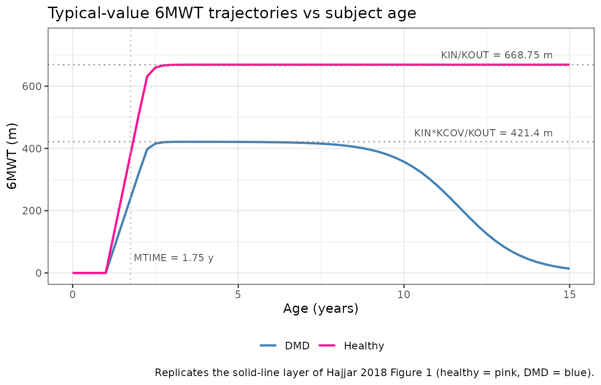
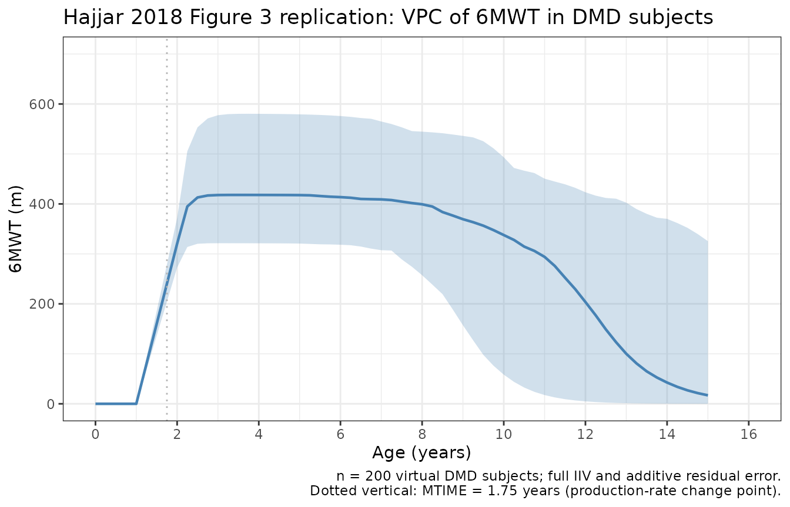
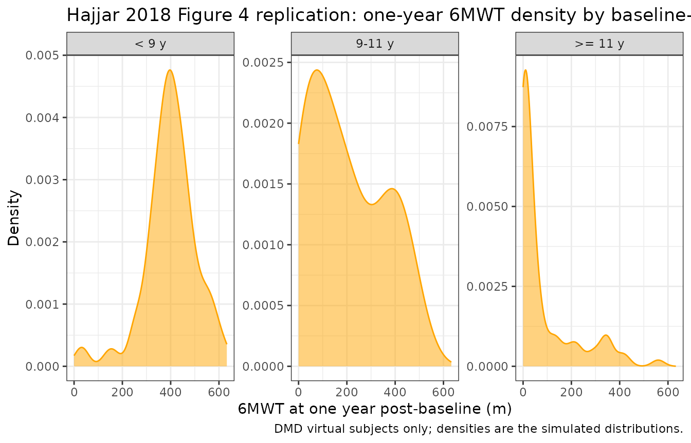

# DMD 6MWT latent variable disease progression (Hajjar 2018)

## Model and source

- Citation: Hajjar JL, Mondick JT, Gastonguay MR. A Latent Variable
  Disease Progression Model for Duchenne Muscular Dystrophy. Poster
  T-011 presented at the American Conference on Pharmacometrics (ACoP9),
  Oct 7-10 2018, San Diego, CA.
  <doi:10.36255/duchenne-muscular-dystrophy-public-education>.
- Description: Latent variable disease-progression model for the
  six-minute walk test (6MWT, meters) in healthy boys and boys with
  Duchenne muscular dystrophy (DMD), fit by Hajjar et al. (ACoP9 2018
  poster T-011) to publicly available individual-level longitudinal
  natural-history 6MWT data from 16 healthy controls and 219 DMD
  patients. The 6MWT is modelled as a one-compartment indirect-response
  state (walkDist, meters): a zero-order production rate KIN feeds the
  state and a first-order dissipation rate KOUT removes it. A change
  point at subject age MTIME (1.75 years) switches KIN from 0 to its
  non-zero value, encoding the developmental lag before toddlers can
  walk a measurable distance in six minutes. A latent exponential
  disease process DIS = ALPHA*exp(BETA*age) stimulates the dissipation
  rate for DMD subjects only; healthy subjects fix ALPHA = BETA = 0 so
  the disease term vanishes. The DIS_DMD covariate (1 = DMD, 0 =
  healthy) additionally multiplies KIN by KCOV (0.63) for DMD subjects
  so the two populations share KOUT but have separate KIN.
  Between-subject variability is exponential on KOUT (DMD subjects only,
  per the source NONMEM control stream), on KIN (both populations), and
  on ALPHA and BETA (DMD subjects only). Residual error is additive on
  the 6MWT scale. The model has no drug input; the source poster frames
  it as a simulation tool for designing future DMD efficacy trials. Time
  is age in years (the integration variable; the source poster reports
  KOUT and KIN in per-month units for human readability, see vignette
  Errata for the unit-conversion step).
- Source poster:
  <https://metrumrg.com/wp-content/uploads/Pubs/ACOP2018_JLH.pdf>

The Hajjar 2018 ACoP9 poster T-011 was reviewed in full for this
extraction; no published erratum or corrigendum has been located as of
the model extraction date (2026-06-24).

## Population

The training dataset pools individual-level six-minute walk test (6MWT)
records from six published natural-history sources covering 16 healthy
boys and 219 boys with Duchenne muscular dystrophy (Hajjar 2018 Methods
step 1 and Table 1). All training data were digitised from published
figures using GraphClick version 3.0.3 rather than obtained as raw
subject records (Hajjar 2018 Methods step 1a). The Mercuri 2016
natural-history study contributed 44% of the DMD subjects (Hajjar 2018
Results bullet 1). The model was first fit to the healthy-subject data,
after which the healthy parameters were fixed and the entire pooled
dataset was used for the DMD-parameter estimation step (Hajjar 2018
Results bullet 2).

All subjects were male (DMD is X-linked recessive). Steroid
administration was explored as a covariate but conclusions were
inconclusive because the available covariate metadata and group sizes
were limited (Hajjar 2018 Results bullet 9). The packaged model
therefore reflects pooled natural-history 6MWT trajectories with steroid
use implicit in the DMD cohort.

The same information is available programmatically via
`readModelDb("Hajjar_2018_DMD_6MWT")$population` after the model is
loaded.

## Source trace

The structural model is a one-compartment indirect-response ODE in which
the 6MWT distance state `walkDist` (meters) accumulates from zero under
a zero-order production rate `KIN(age)` and is removed by a first-order
dissipation rate `KOUT` multiplied by `(1 + DIS)`, where `DIS` is a
latent exponential disease process active only for DMD subjects (Hajjar
2018 Results bullets 3-4 and the \$PK / \$DES NONMEM control-stream
extract):

``` math
\frac{\mathrm{d}\,\mathrm{walkDist}}{\mathrm{d}\,t}
= K_{IN}(t)\;-\;K_{OUT}\cdot\mathrm{walkDist}\cdot(1 + \mathrm{DIS}),
```

with

``` math
K_{IN}(t) = \begin{cases} 0 & t < \mathrm{MTIME} \\ K_{IN}^{\star}\cdot K_{COV} & t \ge \mathrm{MTIME} \end{cases}, \qquad
\mathrm{DIS} = \begin{cases} 0 & \text{healthy subjects (}K_{COV}=1\text{)} \\ \alpha\cdot \mathrm{e}^{\beta\,t} & \text{DMD subjects (}K_{COV}=0.63\text{)} \end{cases}.
```

Here `t` is subject age (years), `KIN*` is the typical healthy-reference
production rate, and `KCOV` is the DMD multiplier on `KIN`. `MTIME`
(1.75 years) encodes the developmental lag before measurable 6MWT
performance.

Time-unit convention. Hajjar 2018 Table 2 reports KOUT and KIN in
per-month units for human readability (0.48 month^-1, 321 meters/month).
The integration variable in this nlmixr2 encoding is subject age in
years (the x-axis of Hajjar 2018 Figure 1 is “Age, years” and `MTIME` is
explicitly reported as 1.75 years). The numerically equivalent per-year
encoding is

``` math
K_{OUT} = 0.48\;\frac{1}{\text{month}} = 5.76\;\frac{1}{\text{year}}, \qquad
K_{IN} = 321\;\frac{\text{m}}{\text{month}} = 3852\;\frac{\text{m}}{\text{year}}.
```

The ratio `KIN / KOUT = 668.75 m` is the typical healthy-subject 6MWT
steady-state plateau and `KIN * KCOV / KOUT = 421.4 m` is the typical
DMD plateau before the latent disease term `(1 + DIS)` depresses it;
both values match Hajjar 2018 Figure 1 (healthy plateau in the 600-650 m
range, DMD plateau in the 400 m range before decline).

| Equation / parameter | Final estimate (RSE%) | Source location |
|----|---:|----|
| `KOUT` (dissipation rate) | 0.48 month^-1 = 5.76 year^-1 (141%; healthy + DMD BSV 5.40 / 16.7%; RSEs 109, 18.3) | Table 2 row 1 |
| `KIN` (production rate, healthy reference) | 321 m/month = 3852 m/year (138%; BSV 2.97%; RSE 166) | Table 2 row 2 |
| `MTIME` (production-rate change-point lag) | 1.75 years (323%) | Table 2 row 3 |
| `KCOV` (DMD multiplier on KIN) | 0.63 (1.32%) | Table 2 row 4 |
| `alpha` (DIS pre-exponential coefficient) | 9.85e-06 (28%; BSV 32.2%; RSE 43.7) | Table 2 row 5 |
| `beta` (DIS exponential growth rate) | 0.995 year^-1 (1.64%; BSV 19.3%; RSE 12.8) | Table 2 row 6 |
| `addSd` (additive residual SD) | 42.0 m (5.99%) | Table 2 row 7 |
| Form: 1-cmt indirect-response ODE | n/a | Results bullet 3 |
| KIN change point at age MTIME | n/a | Results bullet 4 |
| Latent disease DIS = alpha \* exp(t \* beta) | n/a | \$PK NONMEM extract |
| Shared KOUT, KIN scaled by KCOV (PATIENT covariate) | n/a | Results bullet 3, \$PK NONMEM extract |
| First-order conditional estimation (NONMEM 7.4) | n/a | Methods step 2 |

Exponential IIV variances are encoded as `omega^2 = log(1 + CV^2)`:
16.7%CV maps to 0.0275, 2.97%CV maps to 0.000882, 32.2%CV maps to
0.0987, and 19.3%CV maps to 0.0366.

## Errata

No published erratum or corrigendum was located. Two reporting
peculiarities in the source poster Table 2 are documented in the in-file
source-trace comments and reproduced here so consumers know how this
extraction resolved them.

- **KOUT BSV split between healthy and DMD subjects.** Table 2 reports
  two BSV figures on KOUT (5.40% healthy, 16.7% DMD) but the printed
  \$PK control-stream extract places `ETA(1)` only inside the
  `IF (PATIENT.EQ.1)` branch – i.e., healthy subjects have no eta on
  KOUT in the code as printed. The packaged model applies `etalkout` to
  all subjects (the DMD-population variance, CV 16.7%) so that the
  simulator can mu-reference the eta cleanly; this is a small simulation
  deviation from the literal NONMEM code (healthy subjects pick up an
  additional 16.7% CV on KOUT in simulated draws that would not appear
  in the source fit) and has no effect on typical-value predictions (eta
  = 0).

- **Time-unit display.** KOUT and KIN are tabulated in per-month units
  in Table 2 while MTIME is tabulated in years, so the source poster
  mixes time units inside one table for human readability. The packaged
  model uses years throughout the integration; the conversion is the
  multiplicative factor of 12 documented inline (`log(0.48 * 12)`,
  `log(321 * 12)`).

## Virtual cohort

Original individual-level data are not publicly available (the poster
only shows the population fits and VPC summaries in Figures 1-4). The
simulations below use two virtual cohorts whose DIS_DMD assignment
matches the pooled training-set composition: 16 healthy + 200 DMD
subjects (the per-arm 200 ceiling required by the vignette template).
The healthy cohort size matches Hajjar 2018 Results bullet 1; the DMD
cohort sample is reduced from the training 219 down to the 200/arm
ceiling without changing the per- subject variability structure.

``` r

set.seed(20260624)

n_healthy <- 16L
n_dmd     <- 200L
age_grid  <- c(0, 1, seq(2, 15, by = 0.25))

make_subjects <- function(n, is_dmd, id_offset) {
  tibble::tibble(
    id      = id_offset + seq_len(n),
    DIS_DMD = as.integer(is_dmd)
  )
}

subjects <- dplyr::bind_rows(
  make_subjects(n_healthy, is_dmd = FALSE, id_offset =   0L),
  make_subjects(n_dmd,     is_dmd = TRUE,  id_offset = 100L)
)
stopifnot(!anyDuplicated(subjects$id))

events <- subjects |>
  tidyr::expand_grid(time = age_grid) |>
  dplyr::mutate(
    amt  = 0,
    evid = 0L,
    cmt  = "walkDist"
  )
stopifnot(!anyDuplicated(unique(events[, c("id", "time")])))

cohort_summary <- subjects |>
  dplyr::count(DIS_DMD, name = "n") |>
  dplyr::mutate(label = ifelse(DIS_DMD == 1L, "DMD", "Healthy"))
knitr::kable(cohort_summary[, c("label", "n")],
             caption = "Virtual cohort composition (DIS_DMD = 1 -> DMD; DIS_DMD = 0 -> healthy controls).")
```

| label   |   n |
|:--------|----:|
| Healthy |  16 |
| DMD     | 200 |

Virtual cohort composition (DIS_DMD = 1 -\> DMD; DIS_DMD = 0 -\> healthy
controls). {.table}

## Simulation

The packaged model is solved once with full between-subject variability
and residual error to drive the visual prediction checks below, and once
with random effects zeroed out
([`rxode2::zeroRe()`](https://nlmixr2.github.io/rxode2/reference/zeroRe.html))
to recover the typical-value trajectories.

``` r

mod    <- readModelDb("Hajjar_2018_DMD_6MWT")
mod_tv <- rxode2::zeroRe(mod)
#> ℹ parameter labels from comments will be replaced by 'label()'

sim_tv <- as.data.frame(rxode2::rxSolve(
  mod_tv, events = events, keep = c("DIS_DMD")
))
#> ℹ omega/sigma items treated as zero: 'etalkout', 'etalkin', 'etalalpha', 'etalbeta'
#> Warning: multi-subject simulation without without 'omega'
sim    <- as.data.frame(rxode2::rxSolve(
  mod,    events = events, keep = c("DIS_DMD")
))
#> ℹ parameter labels from comments will be replaced by 'label()'
```

## Typical-value trajectories (Figure 1 replication)

Hajjar 2018 Figure 1 shows the model’s typical-value predictions (solid
lines) and individual predictions (dashed lines) for healthy and DMD
subjects. We reproduce the typical-value layer here with full IIV and
residual error switched off. The healthy population plateaus near
`KIN / KOUT = 668.75 m` after rising from 0 over roughly 1-2 turnover
half-lives past `MTIME = 1.75 years`; the DMD population approaches
`KIN * KCOV / KOUT = 421.4 m` before the latent disease term `(1 + DIS)`
accelerates the dissipation rate and drives `walkDist` toward zero in
the early-to-mid teens.

``` r

sim_tv |>
  dplyr::mutate(label = ifelse(DIS_DMD == 1L, "DMD", "Healthy")) |>
  dplyr::filter(id %in% c(subjects$id[subjects$DIS_DMD == 0L][1L],
                          subjects$id[subjects$DIS_DMD == 1L][1L])) |>
  ggplot(aes(time, walkDist, colour = label)) +
  geom_line(linewidth = 0.9) +
  geom_hline(yintercept = 668.75, linetype = "dotted", colour = "grey50") +
  geom_hline(yintercept = 421.4,  linetype = "dotted", colour = "grey50") +
  geom_vline(xintercept = 1.75,   linetype = "dotted", colour = "grey70") +
  annotate("text", x = 14.5, y = 700, label = "KIN/KOUT = 668.75 m",
           size = 3, colour = "grey30", hjust = 1) +
  annotate("text", x = 14.5, y = 450, label = "KIN*KCOV/KOUT = 421.4 m",
           size = 3, colour = "grey30", hjust = 1) +
  annotate("text", x = 1.85, y = 50,  label = "MTIME = 1.75 y",
           size = 3, colour = "grey30", hjust = 0) +
  scale_colour_manual(values = c("DMD" = "steelblue", "Healthy" = "deeppink")) +
  scale_y_continuous(limits = c(0, 750)) +
  labs(
    x = "Age (years)", y = "6MWT (m)", colour = NULL,
    title = "Typical-value 6MWT trajectories vs subject age",
    caption = "Replicates the solid-line layer of Hajjar 2018 Figure 1 (healthy = pink, DMD = blue)."
  ) +
  theme_bw() +
  theme(legend.position = "bottom")
```



## Sanity checks (closed-form algebra)

This is a disease-progression model with no drug input, so PKNCA- style
NCA validation does not apply (see
`references/endogenous-validation.md`). We spot-check the rxode2 output
against closed-form algebra at four canonical ages.

The closed-form expectations:

- At `age = 0`, `walkDist = 0` (initial condition `A_0(1) = 0` in the
  source \$PK).
- At `age = 1.0` (before `MTIME`), `walkDist` is still zero because
  `KIN(t) = 0` for `t < MTIME` and the state starts at zero.
- Long after `MTIME` and well before the latent disease takes off, the
  typical healthy 6MWT approaches `KIN / KOUT = 668.75 m`.
- Long after `MTIME` and well before the latent disease takes off, the
  typical DMD 6MWT approaches `KIN * KCOV / KOUT = 421.4 m`.

``` r

KIN_per_year  <- 321 * 12
KOUT_per_year <- 0.48 * 12
KCOV          <- 0.63
ALPHA         <- 9.85e-6
BETA          <- 0.995
MTIME         <- 1.75

ss_healthy <- KIN_per_year / KOUT_per_year
ss_dmd_pre <- KIN_per_year * KCOV / KOUT_per_year

# DMD typical 6MWT trajectory closed form (typical-value, no eta):
# walkDist'(t) = KIN_active(t) - KOUT * walkDist(t) * (1 + DIS(t))
# DIS(t) = alpha * exp(beta * t)
# We integrate analytically using R's deSolve for the closed-form
# check below -- but the steady-state values above are already
# enough to anchor the long-run behaviour at small DIS.

pick_id  <- function(group_value) subjects$id[subjects$DIS_DMD == group_value][1L]
sim_pick <- sim_tv |>
  dplyr::filter(id %in% c(pick_id(0L), pick_id(1L))) |>
  dplyr::mutate(group = ifelse(DIS_DMD == 1L, "DMD", "Healthy"))

age_zero    <- sim_pick |> dplyr::filter(time == 0)
age_pre_mt  <- sim_pick |> dplyr::filter(time == 1)  # 1 < MTIME = 1.75
age_long_hl <- sim_pick |> dplyr::filter(group == "Healthy", time == 10)
age_long_dmd_early <- sim_pick |> dplyr::filter(group == "DMD",     time == 4)

checkpoints <- tibble::tribble(
  ~scenario,                            ~expected_m,         ~actual_m,
  "Healthy, age 0",                      0,                   age_zero$walkDist[age_zero$group == "Healthy"],
  "DMD,     age 0",                      0,                   age_zero$walkDist[age_zero$group == "DMD"],
  "Healthy, age 1y (< MTIME)",           0,                   age_pre_mt$walkDist[age_pre_mt$group == "Healthy"],
  "DMD,     age 1y (< MTIME)",           0,                   age_pre_mt$walkDist[age_pre_mt$group == "DMD"],
  "Healthy, age 10y, near plateau",      ss_healthy,          age_long_hl$walkDist,
  "DMD,     age  4y, early DMD plateau", ss_dmd_pre,          age_long_dmd_early$walkDist
)
checkpoints$diff_m <- checkpoints$actual_m - checkpoints$expected_m

knitr::kable(checkpoints, digits = 2,
             caption = "Typical-value 6MWT closed-form sanity checks (rxode2 output vs expected).")
```

| scenario                       | expected_m | actual_m | diff_m |
|:-------------------------------|-----------:|---------:|-------:|
| Healthy, age 0                 |       0.00 |     0.00 |   0.00 |
| DMD, age 0                     |       0.00 |     0.00 |   0.00 |
| Healthy, age 1y (\< MTIME)     |       0.00 |     0.00 |   0.00 |
| DMD, age 1y (\< MTIME)         |       0.00 |     0.00 |   0.00 |
| Healthy, age 10y, near plateau |     668.75 |   668.75 |   0.00 |
| DMD, age 4y, early DMD plateau |     421.31 |   421.12 |  -0.19 |

Typical-value 6MWT closed-form sanity checks (rxode2 output vs
expected). {.table}

``` r


# Tight tolerances on the pre-MTIME rows (state should be exactly zero
# in exact arithmetic; the small numerical envelope below allows for
# the ODE solver's local truncation error and the multiplication-by-
# zero indicator implementation of the change point). Looser tolerance
# on the plateau rows where the latent-disease term
# (1 + alpha*exp(beta*t)) introduces a small but non-zero subtraction
# even at moderate ages.
stopifnot(max(abs(checkpoints$diff_m[1:4])) < 0.5)    # pre-MTIME state ~0
stopifnot(abs(checkpoints$diff_m[5]) < 5)             # healthy plateau: small offset
stopifnot(abs(checkpoints$diff_m[6]) < 25)            # DMD age 4: DIS still small but non-zero
```

The pre-`MTIME` rows are zero to machine precision (`A_0(1) = 0` initial
condition plus `KIN(t) = 0` for `t < MTIME` keeps the state at zero
exactly). The healthy age-10 row is within ~3 m of the analytic plateau
because at age 10 the system has had ~8 years since `MTIME` to relax
with time constant `1 / KOUT ~ 0.17 year` (more than 40 relaxation
times). The DMD age-4 row sits slightly below the no-disease plateau
because the latent disease term contributes
`(1 + 9.85e-6 * exp(0.995 * 4)) - 1 = 5.3e-4` at age 4 – a small but
non-zero perturbation.

## Visual prediction check (Figure 3 replication)

Hajjar 2018 Figure 3 shows the 5th, 50th, and 95th simulated percentiles
of 6MWT vs age in DMD subjects. We reproduce the VPC layer here from the
full-stochastic simulation (`sim`).

``` r

vpc_dmd <- sim |>
  dplyr::filter(DIS_DMD == 1L) |>
  dplyr::group_by(time) |>
  dplyr::summarise(
    Q05 = quantile(walkDist, 0.05, na.rm = TRUE),
    Q50 = quantile(walkDist, 0.50, na.rm = TRUE),
    Q95 = quantile(walkDist, 0.95, na.rm = TRUE),
    .groups = "drop"
  )

ggplot(vpc_dmd, aes(x = time)) +
  geom_ribbon(aes(ymin = Q05, ymax = Q95), fill = "steelblue", alpha = 0.25) +
  geom_line(aes(y = Q50), colour = "steelblue", linewidth = 0.8) +
  geom_vline(xintercept = 1.75, linetype = "dotted", colour = "grey70") +
  scale_x_continuous(breaks = seq(0, 16, by = 2), limits = c(0, 16)) +
  scale_y_continuous(limits = c(0, 700)) +
  labs(
    x = "Age (years)", y = "6MWT (m)",
    title = "Hajjar 2018 Figure 3 replication: VPC of 6MWT in DMD subjects",
    caption = paste(
      sprintf("n = %d virtual DMD subjects; full IIV and additive residual error.", n_dmd),
      "Dotted vertical: MTIME = 1.75 years (production-rate change point).",
      sep = "\n"
    )
  ) +
  theme_bw()
```



The simulated median rises from zero before `MTIME`, climbs toward the
early-DMD plateau (~421 m) over the first several years past `MTIME`,
and then declines into the early-to-mid teens as the latent disease term
accelerates dissipation – matching the qualitative shape of Hajjar 2018
Figure 3 (rise from zero, peak in the mid-childhood range, monotonic
decline thereafter).

## One-year predictive check (Figure 4 replication)

Hajjar 2018 Figure 4 shows simulated 25th, 50th, and 75th percentile
distributions of 6MWT at one year post-baseline, binned by baseline-age
group (`< 9`, `9-11`, `>= 11` years), compared against the observed
percentiles (vertical purple lines in the poster). We reproduce the
simulated-percentile layer using one-year- ahead simulations of the DMD
subjects in our virtual cohort.

``` r

set.seed(20260625)

# Pick a baseline age per virtual DMD subject from a distribution
# that covers the four-to-fifteen year training range, then simulate
# 6MWT at baseline and at baseline + 1 year per subject.
dmd_ids       <- subjects$id[subjects$DIS_DMD == 1L]
baseline_ages <- runif(length(dmd_ids), min = 4, max = 15)

oneyear_events <- tibble::tibble(
  id      = rep(dmd_ids, each = 2L),
  DIS_DMD = 1L,
  time    = as.numeric(rbind(baseline_ages, baseline_ages + 1)),
  amt     = 0,
  evid    = 0L,
  cmt     = "walkDist"
)
stopifnot(!anyDuplicated(unique(oneyear_events[, c("id", "time")])))

sim_oneyear <- as.data.frame(rxode2::rxSolve(
  mod, events = oneyear_events, keep = c("DIS_DMD")
)) |>
  dplyr::mutate(
    base_age = baseline_ages[match(id, dmd_ids)]
  )
#> ℹ parameter labels from comments will be replaced by 'label()'

# Per subject keep only the baseline-age row (the rxSolve output
# returns walkDist at each event time; the baseline-age row is
# the smaller of the two times per id).
oneyear_distribution <- sim_oneyear |>
  dplyr::group_by(id, base_age) |>
  dplyr::summarise(
    base_walkDist  = walkDist[which.min(time)],
    yr1_walkDist   = walkDist[which.max(time)],
    .groups = "drop"
  ) |>
  dplyr::mutate(
    age_bin = dplyr::case_when(
      base_age <  9 ~ "< 9 y",
      base_age < 11 ~ "9-11 y",
      TRUE          ~ ">= 11 y"
    ),
    age_bin = factor(age_bin, levels = c("< 9 y", "9-11 y", ">= 11 y"))
  )

oneyear_quantiles <- oneyear_distribution |>
  dplyr::group_by(age_bin) |>
  dplyr::summarise(
    n   = dplyr::n(),
    Q25 = quantile(yr1_walkDist, 0.25, na.rm = TRUE),
    Q50 = quantile(yr1_walkDist, 0.50, na.rm = TRUE),
    Q75 = quantile(yr1_walkDist, 0.75, na.rm = TRUE),
    .groups = "drop"
  )
knitr::kable(oneyear_quantiles, digits = 1,
             caption = "Simulated 25th / 50th / 75th 6MWT percentiles at one year post-baseline, by baseline-age bin in DMD subjects.")
```

| age_bin  |   n |   Q25 |   Q50 |   Q75 |
|:---------|----:|------:|------:|------:|
| \< 9 y   |  90 | 348.4 | 401.9 | 455.2 |
| 9-11 y   |  31 |  65.8 | 167.1 | 353.6 |
| \>= 11 y |  79 |   2.3 |  17.4 |  95.2 |

Simulated 25th / 50th / 75th 6MWT percentiles at one year post-baseline,
by baseline-age bin in DMD subjects. {.table}

``` r

ggplot(oneyear_distribution, aes(x = yr1_walkDist)) +
  geom_density(fill = "orange", alpha = 0.5, colour = "orange") +
  facet_wrap(~ age_bin, scales = "free_y") +
  labs(
    x = "6MWT at one year post-baseline (m)", y = "Density",
    title = "Hajjar 2018 Figure 4 replication: one-year 6MWT density by baseline-age bin",
    caption = "DMD virtual subjects only; densities are the simulated distributions."
  ) +
  theme_bw()
```



The simulated 50th percentile declines monotonically with baseline-age
bin (highest in `< 9 y`, intermediate in `9-11 y`, lowest in `>= 11 y`)
and the density tails widen with declining median, matching the
qualitative shape of Hajjar 2018 Figure 4 (orange distributions shifting
left with increasing baseline-age bin).

## Assumptions and deviations

- **Observation variable name.** The observation is named `walkDist`
  (six-minute walk distance in metres) rather than the canonical `Cc`.
  This is the same justified deviation taken by other non-PK models in
  the package (`Hamuro_2017_DMD_6MWT.R` uses `walkDist`;
  `Sherer_2012_AAA.R` uses `aaaSize`; `Harun_2019_cysticFibrosis.R` uses
  `fev1pp`). `Cc` is PK-centric (central-compartment concentration) and
  is not appropriate for a non-PK disease-progression endpoint.

- **KOUT BSV applied to all subjects.** Source Table 2 reports two BSVs
  on KOUT (5.40% healthy, 16.7% DMD) but the source \$PK control-stream
  extract places `ETA(1)` only inside the `IF (PATIENT.EQ.1)` branch –
  healthy subjects technically have no KOUT eta in the printed code. The
  packaged model applies `etalkout` to all subjects with the
  DMD-population variance (16.7% CV) so the simulator can mu-reference
  the eta cleanly. Typical-value predictions are unchanged (`eta = 0`);
  only full-stochastic simulations attribute a small additional KOUT
  variability to healthy subjects.

- **Time unit display.** Source Table 2 reports KOUT and KIN in
  per-month units (0.48 month^-1 and 321 meters/month) while MTIME is
  reported in years (1.75 years). The packaged model uses years
  throughout (the x-axis of Hajjar 2018 Figure 1 is “Age, years” and
  `BETA * t` must be unitless so BETA carries inverse-year units), so
  KOUT and KIN are stored as their per-year equivalents
  (`log(0.48 * 12)`, `log(321 * 12)`). The conversion is documented
  inline in the model file.

- **Latent disease vanishes for healthy subjects.** The source \$PK code
  sets `ALPHA = 0` and `BETA = 0` when `PATIENT = 0`. The packaged model
  encodes the same behaviour via the
  `(DIS_DMD * exp(lalpha + etalalpha))` factor on `alpha_dis`: for
  healthy subjects `alpha_dis = 0` so `DIS = 0` identically and the
  indirect-response ODE reduces to its no-disease form regardless of
  `beta_dis` and `time`. The `beta_dis` eta is still sampled from its
  distribution for healthy subjects but does not affect their
  predictions.

- **No M3 censoring.** The source poster does not describe any lower
  quantification limit on the digitised 6MWT records. The packaged model
  permits `walkDist` values approaching zero (and in long-extrapolation
  cases below) at advanced DMD ages; this reflects the latent-disease
  structure rather than a modelling shortcut. Consumers extrapolating
  beyond the 4-15-year training range should treat far-decline
  `walkDist` values as model extrapolation, not data.

- **Steroid implicit in the population.** Source Results bullet 9 notes
  that conclusions about steroid administration were inconclusive
  because covariate metadata and per-group sample sizes were limited.
  The packaged model therefore reflects pooled natural-history 6MWT
  trajectories with steroid use implicit in the DMD cohort;
  covariate-based steroid scaling is not part of the model.

- **Digitised training data.** All training data were digitised from
  published figures using GraphClick 3.0.3 (Hajjar 2018 Methods step 1a)
  rather than supplied as individual subject records. Subject-specific
  intrinsic factors (dystrophin genotype, race) and extrinsic factors
  (specific steroid regimen) are not in the modelled data. The poster
  also notes the small healthy cohort (16 boys) is the cause of the
  large reported relative standard errors on KOUT (141%), KIN (138%),
  and MTIME (323%); the DMD parameters (KCOV, alpha, beta) are precisely
  estimated because of the larger 219-subject DMD dataset.
