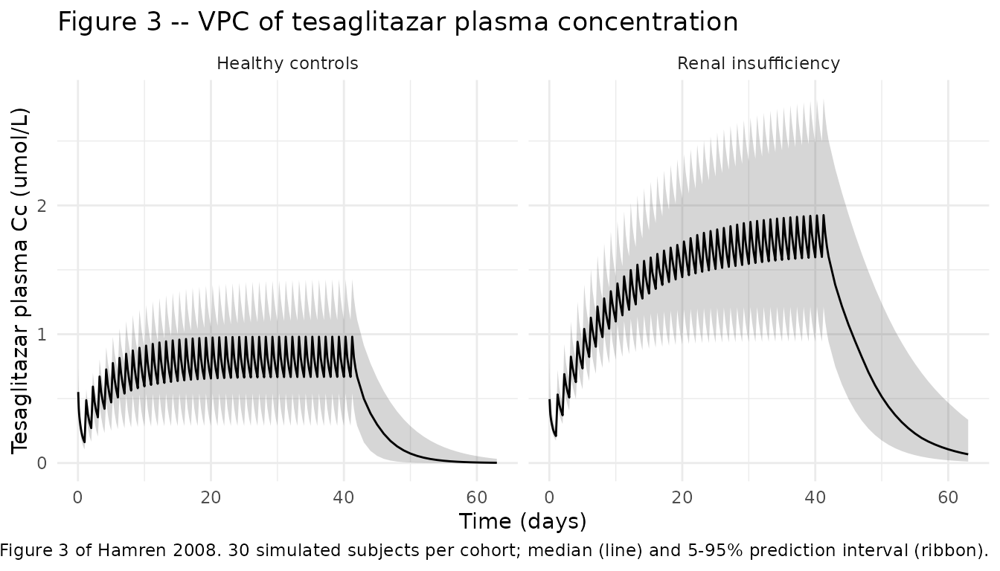
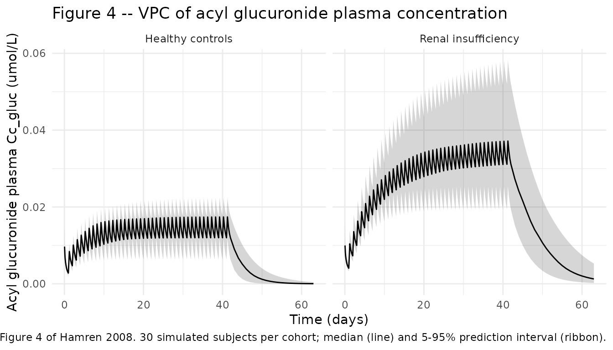
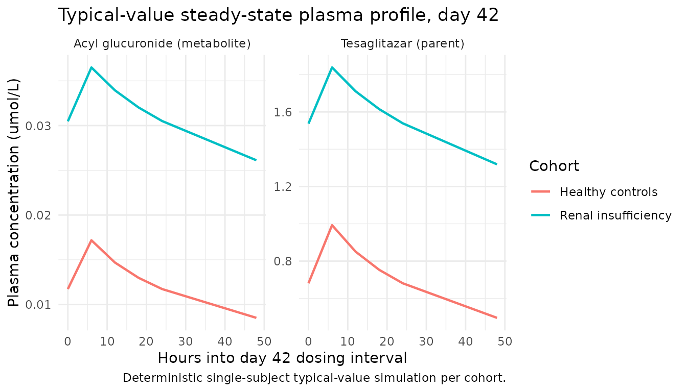

# Tesaglitazar (Hamren 2008)

## Model and source

``` r

mod_meta <- rxode2::rxode2(readModelDb("Hamren_2008_tesaglitazar"))
#> ℹ parameter labels from comments will be replaced by 'label()'
```

- Citation: Hamren B, Ericsson H, Samuelsson O, Karlsson MO. Mechanistic
  modelling of tesaglitazar pharmacokinetic data in subjects with
  various degrees of renal function – evidence of interconversion. Br J
  Clin Pharmacol. 2008;65(6):855-863.
  <doi:10.1111/j.1365-2125.2008.03110.x>.
- Description: Mechanistic parent + acyl-glucuronide population PK model
  for tesaglitazar (a dual PPAR alpha/gamma agonist) in 41 adult
  subjects with varying degrees of renal function (Hamren 2008). Parent
  tesaglitazar follows a two-compartment disposition with first-order
  oral absorption (ka fixed at 1.5 1/h, F fixed at 1); renal clearance
  CLrt = 0.027 L/h directs parent to a cumulative urine compartment, and
  metabolic clearance CLmt = 1.91 L/h generates the acyl glucuronide
  metabolite. The metabolite follows a one-compartment disposition (Vcm
  = 8.5 L) with saturable Michaelis-Menten renal clearance (Vmax = 0.188
  umol/h, Km = 0.041 umol/L) routing to a cumulative urine compartment,
  linear non-renal clearance (CLnrm = 1.2 L/h), and biliary excretion
  (kbm = 11.7 1/h) into a paper-specific gut compartment. The gut
  compartment releases interconverted parent tesaglitazar back into the
  parent central compartment at rate kicv = 0.79 1/h, completing the
  futile-cycle interconversion loop that the source paper proposes as
  the mechanism for increased tesaglitazar exposure in renal-impairment
  subjects. Covariates: BSA-normalized renal function CRCL
  (iohexol-clearance-measured GFR, mL/min/1.73 m^2; linear centered
  slope on CLrt and direct linear normalised scaling on metabolite
  Vmax), per-subject free fraction FU (% by ultrafiltration; linear
  centered slope on CLmt), sex SEXF (women have 31% lower CLrt than
  men), concomitant probenecid CONMED_PROBENECID (75% reduction of both
  CLrt and metabolite Vmax), and body weight WT (shared centered linear
  slope on Vct and Vpt). Concentrations are molar (umol/L) and amounts
  are molar (umol) throughout to match the Michaelis-Menten
  parameterisation of the acyl-glucuronide renal elimination; the user
  converts mg-of-tesaglitazar doses to umol using the molecular weight
  of 408.45 g/mol (1 mg = 2.45 umol).
- Article: <https://doi.org/10.1111/j.1365-2125.2008.03110.x>

## Population

Hamren et al. (2008) enrolled 41 adults at AstraZeneca R&D Molndal and
Sahlgrenska University Hospital (Gothenburg, Sweden) in the open,
stratified two-centre study SHSBC-0007. The cohort split into 23
subjects with mild, moderate, or severe renal insufficiency (GFR 16-94
mL/min/1.73 m^2 by plasma iohexol clearance) and 18 healthy controls
matched for age and sex with the renal-insufficiency subjects (GFR
75-120 mL/min/1.73 m^2). The renal-insufficiency cohort had a median age
of 55 years and median body weight 84 kg; the control cohort had median
age 53 years and median body weight 75 kg (Table 1 of the source). All
subjects received tesaglitazar 1 mg orally once daily for 42 +/- 3 days
(Part II); a Part I pilot of six subjects with moderate or severe renal
insufficiency received 0.5 mg daily for 7 days and was pooled into the
analysis. Four healthy-control subjects also received oral probenecid
(500 mg x 3 doses) around the first tesaglitazar dose as a
probenecid-tesaglitazar drug-drug-interaction probe.

The same information is available programmatically via
`readModelDb("Hamren_2008_tesaglitazar")$population`.

## Source trace

The per-parameter origin is recorded as an in-file comment next to each
`ini()` entry in
`inst/modeldb/specificDrugs/Hamren_2008_tesaglitazar.R`. The table below
collects them in one place for review.

| Equation / parameter | Value (typical) | Source location |
|----|----|----|
| `lka` (parent) | `log(1.5)` (fixed) | Table 2 ka = 1.5 1/h (fixed); Discussion p. 859 |
| `lfdepot` (parent F) | `log(1)` (fixed) | Methods ‘Pharmacokinetic modelling’ (F = 1 fixed) |
| `lcl_renal` (CLrt) | `log(0.027)` L/h | Table 2 CLrt = 0.027 L/h (RSE 4.8%) |
| `lcl_met` (CLmt) | `log(1.91)` L/h | Table 2 CLmt = 1.91 L/h (RSE 8.2%) |
| `lq` (Qt) | `log(0.22)` L/h | Table 2 Qt = 0.22 L/h (RSE 13%) |
| `lvc` (Vct) | `log(2.1)` L | Table 2 Vct = 2.1 L (RSE 8.1%) at WT 80 kg |
| `lvp` (Vpt) | `log(5.1)` L | Table 2 Vpt = 5.1 L (RSE 3.2%) at WT 80 kg |
| `lvmax_gluc` (metabolite Vmax) | `log(0.188)` umol/h | Table 2 Vmax = 0.188 umol/h (RSE 23%) at CRCL 76 |
| `lkm_gluc` (metabolite Km) | `log(0.041)` umol/L | Table 2 Km = 0.041 umol/L (RSE 29%) |
| `lcl_nonren_gluc` (CLnrm) | `log(1.2)` L/h | Table 2 CLnrm = 1.2 L/h (RSE 11%) |
| `lkbm` (biliary) | `log(11.7)` 1/h | Table 2 kbm = 11.7 1/h (RSE 5.9%) |
| `lkicv` (interconversion) | `log(0.79)` 1/h | Table 2 kint = 0.79 1/h (RSE 7.3%); renamed to kicv |
| `lvc_gluc` (Vcm) | `log(8.5)` L | Table 2 Vcm = 8.5 L (RSE 17%) |
| `e_fu_cl_met` | `5.55` per unit fu (%) | Table 2 fu on CLmt 555 %/unit fu (RSE 23%) |
| `e_crcl_cl_renal` | `0.0099` per mL/min/m2 | Table 2 GFR on CLrt 0.99 %/(mL/min/1.73 m^2) (RSE 7.7%) |
| `e_sexf_cl_renal` | `-0.31` | Table 2 Gender on CLrt -31% (RSE 17%) |
| `e_probenecid_cl_renal` | `-0.75` | Table 2 Probenecid on CLrt and Vmax -75% (RSE 3.9%) |
| `e_probenecid_vmax_gluc` | `-0.75` | Table 2 (same shared estimate as above) |
| `e_wt_vc_vp` | `0.0094` per kg | Table 2 Body weight on Vct and Vpt 0.94 %/kg (RSE 33%) |
| `etalcl_met` (CV%) | `0.0319` (18% CV) | Table 2 parametric CLmt 18% CV |
| `etalcl_renal` (CV%) | `0.0392` (20% CV) | Table 2 parametric CLrt 20% CV |
| `etalvc` (CV%) | `0.1416` (39% CV) | Table 2 parametric Vct 39% CV |
| `etalvp` (CV%) | `0.0253` (16% CV) | Table 2 parametric Vpt 16% CV |
| `etalkm_gluc` (CV%) | `0.1283` (37% CV) | Table 2 parametric Km 37% CV |
| `etalcl_nonren_gluc` (CV%) | `0.2561` (54% CV) | Table 2 parametric CLnrm 54% CV |
| `propSd` (plasma tesaglitazar) | `0.097` (9.7%) | Table 2 tesaglitazar plasma 9.7% (RSE 7.9%) |
| `propSd_urineTesa` | `0.37` (37%) | Table 2 tesaglitazar urine 37% (RSE 6.1%) |
| `propSd_gluc` (plasma metabolite) | `0.18` (18%) | Table 2 metabolite plasma 18% (RSE 5.9%) |
| `propSd_urineGluc` | `0.26` (26%) | Table 2 metabolite urine 26% (RSE 9.8%) |
| Model structure (Figure 2) | n/a | Figure 2 schematic + Methods ‘Pharmacokinetic modelling’ |
| Vmax CRCL scaling | `(CRCL / 76)` | Results ‘Pharmacokinetic analysis’ p. 858 (linear normalised) |
| CLrt linear centered slope | `1 + 0.0099*(CRCL - 76)` | Table 2 + Discussion p. 859 |

## Virtual cohort

The virtual cohort below reproduces the two analysis-population strata
Hamren et al. (2008) compare in Figures 3 and 4: a renal-insufficiency
stratum and a healthy-control stratum. Demographics are drawn from the
published cohort medians (Table 1).

| Stratum | n (per cohort) | CRCL (mL/min/1.73 m^2) | WT (kg) | SEXF | FU (%) | CONMED_PROBENECID |
|----|----|----|----|----|----|----|
| Renal insufficiency (IRF) | 30 | 32 (median, Table 1) | 84 | 0.30 | 0.11 | 0 (none) |
| Healthy controls | 30 | 90 (median, Table 1) | 75 | 0.40 | 0.09 | 0 (none) |

SEXF and FU are encoded as the cohort medians of binary indicator and
per-subject fraction unbound; both are held at single typical values per
cohort because the source paper does not provide the joint distribution
and reports the cohort medians of SEXF (Table 1: 17/6 male/female for
IRF -\> SEXF approx 26%; 10/8 for controls -\> SEXF approx 44%; here we
use round-number cohort fractions for deterministic typical-value
plots).

``` r

set.seed(2008L)

n_per_cohort <- 30L

# Tesaglitazar molecular weight 408.45 g/mol -> 1 mg = 2.4483 umol.
dose_umol     <- 1.0 / 0.40845 * 1000 / 1000     # = 2.4483 umol per 1 mg tablet
n_doses       <- 42L                              # daily x 42 days
dose_interval <- 24                               # h
dose_times    <- (seq_len(n_doses) - 1L) * dose_interval

# Observation grid covers days 0-63 (= 1512 h) to mirror the x-axis of
# Hamren 2008 Figures 3-4. Hourly observations for the first dose,
# 6-hourly through the rest of the dosing period, daily after the last
# dose.
obs_times <- sort(unique(c(
  seq(0,    24,   by = 1),
  seq(24,   1008, by = 6),
  seq(1008, 1512, by = 24)
)))

cohorts <- tibble::tibble(
  cohort_label      = c("Renal insufficiency", "Healthy controls"),
  cohort_id_offset  = c(0L, 1000L),
  CRCL              = c(32, 90),
  WT                = c(84, 75),
  SEXF              = c(0.30, 0.40),
  FU                = c(0.11, 0.09),
  CONMED_PROBENECID = c(0L, 0L)
)

make_cohort <- function(row, n_per_cohort) {
  ids   <- row$cohort_id_offset + seq_len(n_per_cohort)
  doses <- tidyr::expand_grid(id = ids, time = dose_times) |>
    dplyr::mutate(
      cmt = "depot", amt = dose_umol, evid = 1L
    )
  obs <- tidyr::expand_grid(id = ids, time = obs_times) |>
    dplyr::mutate(
      cmt = "Cc", amt = NA_real_, evid = 0L
    )
  dplyr::bind_rows(doses, obs) |>
    dplyr::mutate(
      cohort_label      = row$cohort_label,
      CRCL              = row$CRCL,
      WT                = row$WT,
      SEXF              = row$SEXF,
      FU                = row$FU,
      CONMED_PROBENECID = row$CONMED_PROBENECID
    ) |>
    dplyr::arrange(id, time, dplyr::desc(evid))
}

events <- dplyr::bind_rows(lapply(seq_len(nrow(cohorts)), function(i) {
  make_cohort(cohorts[i, ], n_per_cohort = n_per_cohort)
}))

stopifnot(!anyDuplicated(unique(events[, c("id", "time", "evid")])))
```

## Simulation

``` r

mod <- readModelDb("Hamren_2008_tesaglitazar")

sim <- rxode2::rxSolve(
  mod,
  events = events,
  keep   = c("cohort_label", "CRCL", "WT", "SEXF", "FU", "CONMED_PROBENECID")
) |>
  as.data.frame()
#> ℹ parameter labels from comments will be replaced by 'label()'
```

For deterministic typical-value trajectories (matching Figure 3 and
Figure 4 of the paper, which plot model-predicted medians, not
subject-level VPCs):

``` r

mod_typical <- rxode2::zeroRe(mod)
#> ℹ parameter labels from comments will be replaced by 'label()'

events_typical <- cohorts |>
  dplyr::mutate(id = dplyr::row_number()) |>
  tidyr::expand_grid(time = obs_times) |>
  dplyr::mutate(cmt = "Cc", amt = NA_real_, evid = 0L) |>
  dplyr::bind_rows(
    cohorts |>
      dplyr::mutate(id = dplyr::row_number()) |>
      tidyr::expand_grid(time = dose_times) |>
      dplyr::mutate(cmt = "depot", amt = dose_umol, evid = 1L)
  ) |>
  dplyr::arrange(id, time, dplyr::desc(evid))

sim_typical <- rxode2::rxSolve(
  mod_typical,
  events = events_typical,
  keep   = c("cohort_label", "CRCL", "WT", "SEXF", "FU", "CONMED_PROBENECID")
) |>
  as.data.frame()
#> ℹ omega/sigma items treated as zero: 'etalcl_met', 'etalcl_renal', 'etalvc', 'etalvp', 'etalkm_gluc', 'etalcl_nonren_gluc'
#> Warning: multi-subject simulation without without 'omega'
```

## Replicate Figure 3 – tesaglitazar plasma profile by cohort

Hamren 2008 Figure 3 shows the visual predictive check (median + 95% PI)
of plasma tesaglitazar versus time for the renal-insufficiency (Panel A)
and healthy-control (Panel B) cohorts. The packaged model reproduces
both panels below (50% / 5-95% bands across 30 simulated subjects per
cohort with parametric IIV from Table 2):

``` r

sim |>
  dplyr::filter(time > 0) |>
  dplyr::group_by(time, cohort_label) |>
  dplyr::summarise(
    Q05 = quantile(Cc, 0.05, na.rm = TRUE),
    Q50 = quantile(Cc, 0.50, na.rm = TRUE),
    Q95 = quantile(Cc, 0.95, na.rm = TRUE),
    .groups = "drop"
  ) |>
  dplyr::mutate(time_days = time / 24) |>
  ggplot(aes(time_days, Q50)) +
  geom_ribbon(aes(ymin = Q05, ymax = Q95), alpha = 0.20) +
  geom_line() +
  facet_wrap(~ cohort_label) +
  scale_y_continuous(limits = c(0, NA)) +
  labs(
    x = "Time (days)",
    y = "Tesaglitazar plasma Cc (umol/L)",
    title = "Figure 3 -- VPC of tesaglitazar plasma concentration",
    caption = paste0(
      "Replicates Figure 3 of Hamren 2008. ",
      n_per_cohort, " simulated subjects per cohort; median (line) and ",
      "5-95% prediction interval (ribbon)."
    )
  ) +
  theme_minimal()
```



## Replicate Figure 4 – acyl glucuronide plasma profile by cohort

Hamren 2008 Figure 4 shows the corresponding VPC for plasma acyl
glucuronide. The renal-insufficiency cohort shows the
saturable-renal-elimination feature (higher SS metabolite concentration
than controls because Vmax is scaled by CRCL/76 = 32/76 = 0.42 in the
IRF cohort vs 90/76 = 1.18 in controls):

``` r

sim |>
  dplyr::filter(time > 0) |>
  dplyr::group_by(time, cohort_label) |>
  dplyr::summarise(
    Q05 = quantile(Cc_gluc, 0.05, na.rm = TRUE),
    Q50 = quantile(Cc_gluc, 0.50, na.rm = TRUE),
    Q95 = quantile(Cc_gluc, 0.95, na.rm = TRUE),
    .groups = "drop"
  ) |>
  dplyr::mutate(time_days = time / 24) |>
  ggplot(aes(time_days, Q50)) +
  geom_ribbon(aes(ymin = Q05, ymax = Q95), alpha = 0.20) +
  geom_line() +
  facet_wrap(~ cohort_label) +
  scale_y_continuous(limits = c(0, NA)) +
  labs(
    x = "Time (days)",
    y = "Acyl glucuronide plasma Cc_gluc (umol/L)",
    title = "Figure 4 -- VPC of acyl glucuronide plasma concentration",
    caption = paste0(
      "Replicates Figure 4 of Hamren 2008. ",
      n_per_cohort, " simulated subjects per cohort; median (line) and ",
      "5-95% prediction interval (ribbon)."
    )
  ) +
  theme_minimal()
```



## Typical-value steady-state trajectories

Typical-value (deterministic) plasma trajectories during the day-42
dosing interval highlight the renal-impairment-driven exposure increase
the paper proposes as evidence for the interconversion mechanism:

``` r

ss_start <- 41 * 24
ss_end   <- 43 * 24

sim_typical |>
  dplyr::filter(time >= ss_start, time <= ss_end) |>
  dplyr::mutate(time_h = time - ss_start) |>
  tidyr::pivot_longer(c(Cc, Cc_gluc),
                      names_to = "analyte", values_to = "conc_umolL") |>
  dplyr::mutate(analyte = dplyr::recode(analyte,
    Cc      = "Tesaglitazar (parent)",
    Cc_gluc = "Acyl glucuronide (metabolite)"
  )) |>
  ggplot(aes(time_h, conc_umolL, colour = cohort_label)) +
  geom_line(linewidth = 0.8) +
  facet_wrap(~ analyte, scales = "free_y") +
  labs(
    x = "Hours into day 42 dosing interval",
    y = "Plasma concentration (umol/L)",
    colour = "Cohort",
    title = "Typical-value steady-state plasma profile, day 42",
    caption = "Deterministic single-subject typical-value simulation per cohort."
  ) +
  theme_minimal()
```



## Replicate Table 3 – 24-hour urine amounts at steady state

Hamren 2008 Table 3 reports the 24-hour urine amounts of tesaglitazar
and the acyl glucuronide at steady state (day 42), in umol, separately
for the renal-insufficiency and healthy-control cohorts. The packaged
model reproduces each cohort median below.

``` r

# Day 42 = the 42nd dose; the 42nd dose lands at time = 41*24 = 984 h.
# Urine accumulated between t = 984 (just before 42nd dose) and t = 1008
# is the 24-hour urine sample.
t_pre  <- 984
t_post <- 1008

# Extract cumulative urine state values bracketing the 24-h SS interval.
urine_ss <- sim |>
  dplyr::filter(time %in% c(t_pre, t_post)) |>
  dplyr::select(id, cohort_label, time, urine, urine_gluc) |>
  tidyr::pivot_wider(
    id_cols     = c(id, cohort_label),
    names_from  = time,
    values_from = c(urine, urine_gluc)
  ) |>
  dplyr::mutate(
    tesa_ss_umol = .data[[paste0("urine_",      t_post)]] -
                   .data[[paste0("urine_",      t_pre)]],
    gluc_ss_umol = .data[[paste0("urine_gluc_", t_post)]] -
                   .data[[paste0("urine_gluc_", t_pre)]]
  )

urine_summary <- urine_ss |>
  dplyr::group_by(cohort_label) |>
  dplyr::summarise(
    tesa_median = median(tesa_ss_umol),
    tesa_q025   = quantile(tesa_ss_umol, 0.025),
    tesa_q975   = quantile(tesa_ss_umol, 0.975),
    gluc_median = median(gluc_ss_umol),
    gluc_q025   = quantile(gluc_ss_umol, 0.025),
    gluc_q975   = quantile(gluc_ss_umol, 0.975),
    .groups = "drop"
  )

knitr::kable(
  urine_summary,
  caption = paste0(
    "Simulated 24-hour urine amounts at steady state (day 42), umol. ",
    "Median (Q50) and 2.5-97.5% prediction interval across ", n_per_cohort,
    " subjects per cohort."
  ),
  digits  = 2
)
```

| cohort_label | tesa_median | tesa_q025 | tesa_q975 | gluc_median | gluc_q025 | gluc_q975 |
|:---|---:|---:|---:|---:|---:|---:|
| Healthy controls | 0.56 | 0.28 | 1.10 | 1.41 | 0.92 | 1.93 |
| Renal insufficiency | 0.61 | 0.30 | 1.07 | 0.91 | 0.60 | 1.10 |

Simulated 24-hour urine amounts at steady state (day 42), umol. Median
(Q50) and 2.5-97.5% prediction interval across 30 subjects per cohort.
{.table}

The published Table 3 values for comparison (observed median, observed
range, simulated median, simulated 95% PI):

``` r

published <- tibble::tribble(
  ~cohort_label,           ~analyte,           ~observed_median, ~observed_range, ~simulated_median_paper, ~simulated_95pi_paper,
  "Renal insufficiency",   "Tesaglitazar",     0.42,             "0.18-0.97",     0.52,                     "0.13-1.4",
  "Healthy controls",      "Tesaglitazar",     0.54,             "0.38-0.79",     0.54,                     "0.13-1.2",
  "Renal insufficiency",   "Acyl glucuronide", 0.82,             "0.21-1.8",      0.80,                     "0.26-1.9",
  "Healthy controls",      "Acyl glucuronide", 1.4,              "0.54-1.7",      1.4,                      "0.62-2.4"
)

knitr::kable(
  published,
  caption = paste0(
    "Hamren 2008 Table 3 reference values: observed cohort medians + ranges, ",
    "and the published model's simulated medians + 95% prediction intervals ",
    "from the 1000-replicate posterior predictive check."
  )
)
```

| cohort_label | analyte | observed_median | observed_range | simulated_median_paper | simulated_95pi_paper |
|:---|:---|---:|:---|---:|:---|
| Renal insufficiency | Tesaglitazar | 0.42 | 0.18-0.97 | 0.52 | 0.13-1.4 |
| Healthy controls | Tesaglitazar | 0.54 | 0.38-0.79 | 0.54 | 0.13-1.2 |
| Renal insufficiency | Acyl glucuronide | 0.82 | 0.21-1.8 | 0.80 | 0.26-1.9 |
| Healthy controls | Acyl glucuronide | 1.40 | 0.54-1.7 | 1.40 | 0.62-2.4 |

Hamren 2008 Table 3 reference values: observed cohort medians + ranges,
and the published model’s simulated medians + 95% prediction intervals
from the 1000-replicate posterior predictive check. {.table}

## PKNCA validation – steady-state Cmax / Cmin / AUC over the day-42 dosing interval

The source paper does not report a tabulated NCA summary (Cmax,
AUC0-tau, half-life) per cohort; the model is validated against VPCs
(Figures 3-4) and Table 3 urine amounts above. The PKNCA computation
below derives steady-state Cmax, Cmin, AUC0-tau, and average
concentration over the day-42 dose interval \[t = 984, t = 1008\] for
both cohorts as a descriptive supplement.

``` r

sim_nca <- sim |>
  dplyr::filter(!is.na(Cc)) |>
  dplyr::select(id, time, Cc, cohort_label)

# Defensive time-zero record (per pknca-recipes.md): guarantee a Cc = 0
# row at t = 0 per (id, cohort_label) so PKNCA can anchor AUC.
sim_nca <- dplyr::bind_rows(
  sim_nca,
  sim_nca |>
    dplyr::distinct(id, cohort_label) |>
    dplyr::mutate(time = 0, Cc = 0)
) |>
  dplyr::distinct(id, cohort_label, time, .keep_all = TRUE) |>
  dplyr::arrange(id, cohort_label, time)

conc_obj <- PKNCA::PKNCAconc(
  sim_nca,
  Cc ~ time | cohort_label + id,
  concu = "umol/L",
  timeu = "h"
)

dose_df <- events |>
  dplyr::filter(evid == 1L) |>
  dplyr::select(id, time, amt, cohort_label)

dose_obj <- PKNCA::PKNCAdose(
  dose_df,
  amt ~ time | cohort_label + id,
  doseu = "umol"
)

intervals <- data.frame(
  start    = 984,
  end      = 1008,
  cmax     = TRUE,
  cmin     = TRUE,
  tmax     = TRUE,
  auclast  = TRUE,
  cav      = TRUE
)

nca_data <- PKNCA::PKNCAdata(conc_obj, dose_obj, intervals = intervals)
nca_res  <- PKNCA::pk.nca(nca_data)

nca_tbl <- as.data.frame(nca_res$result) |>
  dplyr::select(cohort_label, id, PPTESTCD, PPORRES) |>
  tidyr::pivot_wider(names_from = PPTESTCD, values_from = PPORRES) |>
  dplyr::group_by(cohort_label) |>
  dplyr::summarise(
    cmax_median    = median(cmax,    na.rm = TRUE),
    cmin_median    = median(cmin,    na.rm = TRUE),
    tmax_median    = median(tmax,    na.rm = TRUE),
    auclast_median = median(auclast, na.rm = TRUE),
    cav_median     = median(cav,     na.rm = TRUE),
    .groups = "drop"
  )

knitr::kable(
  nca_tbl,
  caption = paste0(
    "PKNCA-derived steady-state (day 42) tesaglitazar plasma NCA parameters ",
    "per cohort; medians across ", n_per_cohort, " simulated subjects per ",
    "cohort. Cmax / Cmin in umol/L, AUClast in umol*h/L, tmax in hours."
  ),
  digits = 3
)
```

| cohort_label | cmax_median | cmin_median | tmax_median | auclast_median | cav_median |
|:---|---:|---:|---:|---:|---:|
| Healthy controls | 0.981 | 0.669 | 6 | 18.997 | 0.792 |
| Renal insufficiency | 1.925 | 1.600 | 6 | 41.934 | 1.747 |

PKNCA-derived steady-state (day 42) tesaglitazar plasma NCA parameters
per cohort; medians across 30 simulated subjects per cohort. Cmax / Cmin
in umol/L, AUClast in umol\*h/L, tmax in hours. {.table}

The renal-insufficiency cohort shows higher SS Cmax / AUC than the
controls, reproducing the increased tesaglitazar exposure in IRF that
the source paper attributes to the interconversion mechanism.

## Assumptions and deviations

- **Parametric IIV diagonal carried; nonparametric covariance not
  portable.** The source paper’s final published fit used a
  NONPARAMETRIC variance-covariance matrix (Results ‘Pharmacokinetic
  analysis’) with non-zero off-diagonal correlations (Table 2 footnote:
  CLmt-Vpt = 0.68, CLmt-Vct = -0.43, CLmt-CLnrm = -0.63, CLrt-Vct =
  -0.44, Km-Vct = -0.46, CLnrm-Vpt = 0.47). This packaged model uses the
  parametric diagonal CV% values from Table 2 (CLmt 18%, CLrt 20%, Vct
  39%, Vpt 16%, Km 37%, CLnrm 54%) as a log-normal IIV diagonal
  because (a) the nonparametric matrix is not a Gaussian parameter set
  that nlmixr2 / rxode2 can encode directly and (b) the parametric form
  is the standard portable shape for a packaged model. Hamren 2008
  reports that the nonparametric method improved predictive performance
  over the parametric matrix (modest overestimation of IIV variability
  in plasma); virtual cohorts simulated from this packaged model are
  therefore expected to show slightly wider 95% PIs than the source
  paper’s Figures 3-4. Users wanting the nonparametric matrix can
  approximate it by sampling etas from a multivariate normal with the
  parametric variances on the diagonal and the Table 2 footnote
  correlations on the off-diagonals.

- **Probenecid effect encoded as two separate parameters with the same
  value.** Hamren 2008 Table 2 reports a single shared theta for the
  probenecid effect that was applied jointly to CLrt and Vmax during
  NONMEM estimation (Methods ‘Pharmacokinetic modelling’). The packaged
  model carries `e_probenecid_cl_renal` and `e_probenecid_vmax_gluc` as
  two separate parameters initialised to the same -0.75 value so that
  each covariate-parameter pair follows the canonical `e_<cov>_<param>`
  naming. Numerically identical to the source paper’s encoding for any
  simulation use case; the deviation is structural only.

- **`kint` (paper) -\> `kicv` (canonical) rename for the interconversion
  rate constant.** Hamren 2008 names the gut-hydrolysis-and-parent-
  reabsorption rate constant `kint = 0.79 1/h`. nlmixr2lib already has a
  canonical `kint` for TMDD complex internalisation, which is a
  mechanistically distinct concept. The interconversion rate is renamed
  to the canonical `kicv` (registered alongside this extraction in
  `inst/references/parameter-names.md`) so the two roles are kept
  semantically distinct. The packaged value of `kicv` is unchanged from
  Hamren’s `kint = 0.79 1/h`.

- **CLiohexol encoded under CRCL with broadened scope.** The Hamren 2008
  Methods describes renal function assessment by plasma iohexol
  clearance, the clinical gold-standard tracer-measured glomerular
  filtration rate. The CRCL canonical was originally limited to
  creatinine-based renal function (MDRD / CKD-EPI eGFR or measured CrCl
  BSA-normalised) and was extended in
  `inst/references/covariate-columns.md` to cover both creatinine-based
  and tracer-measured GFR (iohexol, inulin, 99mTc-DTPA, 51Cr-EDTA), per
  the standing decision recorded in this task’s sidecar response 001
  (2026-06-17). The packaged covariateData entry records
  `source_name = 'CLiohexol'` and flags the iohexol-tracer assay in
  `notes`.

- **FU registered as a new canonical covariate column.** Per-subject
  fraction unbound of the parent drug in plasma (measured by
  ultrafiltration) was not in the covariate register before this
  extraction. The `FU` canonical was added to
  `inst/references/covariate-columns.md` (in the protein-binding cluster
  after `TPRO`) with Hamren 2008 as the founding example, per the
  operator decision in sidecar response 001.

- **`kbm` and `kicv` registered as new canonical paper-mechanistic
  parameters.** Hamren 2008’s biliary-excretion rate constant `kbm` and
  interconversion rate constant (renamed `kicv` to avoid the TMDD `kint`
  clash) were not in `inst/references/parameter-names.md` before this
  extraction. Both were registered as new canonical paper-named
  parameters (under the `kint` cluster) with Hamren 2008 as the founding
  example, per the operator decision in sidecar response 001.

- **Per-subject FU and SEXF replaced with cohort-typical values in the
  virtual cohort.** The source paper records subject-level FU
  measurements (range 0.06-0.2%; cohort median 0.1% imputed for three
  subjects with missing values) and subject-level SEXF (cohort medians
  reported in Table 1). The virtual-cohort tables above hold FU at the
  per-cohort median (0.11% IRF, 0.09% controls) and SEXF at a per-cohort
  fraction (0.30 IRF, 0.40 controls) – so the simulated SEXF column is a
  real-valued probability rather than a hard 0/1 indicator, which the
  linear `(1 + e_sexf_cl_renal * SEXF)` form accepts because the
  coefficient is small (-0.31). For a hard 0/1 cohort, redefine SEXF
  per-subject (binomial draw with the cohort median p) rather than
  per-cohort.

- **WT held constant per cohort at Table 1 median.** Body weight is
  time-fixed at the per-cohort median (84 kg IRF, 75 kg controls).
  Subject-level variability across the published WT range (62-107 kg
  IRF, 60-97 kg controls) is not simulated here because the WT covariate
  effect on Vct and Vpt is small (`e_wt_vc_vp = 0.0094` per kg over 80
  kg, so the realised effect is approximately +/-25% across the cohort
  range and contributes a minor share of the plasma variability seen in
  Figures 3-4 relative to the IIV on CLmt, CLrt, Vct, Vpt, Km, and
  CLnrm).

- **Tesaglitazar molecular weight assumed at 408.45 g/mol.** The source
  paper expresses metabolite parameters in molar units (Vmax in umol/h,
  Km in umol/L) without stating the parent’s molecular weight
  explicitly. The dose-to-amount conversion in the virtual cohort
  (`dose_umol = 1.0 mg / 408.45 g/mol * 1000` = 2.4483 umol per 1 mg
  tablet) uses 408.45 g/mol, derived from the published structural
  formula C20H22O7S (Figure 1 of the source). Users with a different
  tesaglitazar MW reference can rescale `dose_umol` accordingly.

- **No errata identified.** A PubMed search for
  `Hamren 2008 tesaglitazar erratum` and a BJCP corrections-feed scan
  returned no corrections as of the extraction date (2026-06-20).

- **No NONMEM control stream on disk.** The source PDF + its trimmed
  markdown companion are the only artefacts available; no `.mod` /
  `.ctl` / `.lst` is supplied. All parameter values are sourced from
  Table 2 of the main publication. The ADVAN6 (general nonlinear
  kinetics) subroutine was used in the original NONMEM VI fit (Methods
  ‘Data analysis’).
