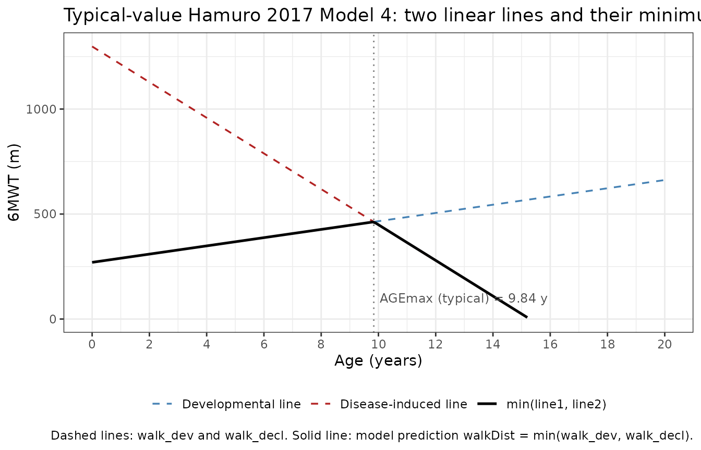
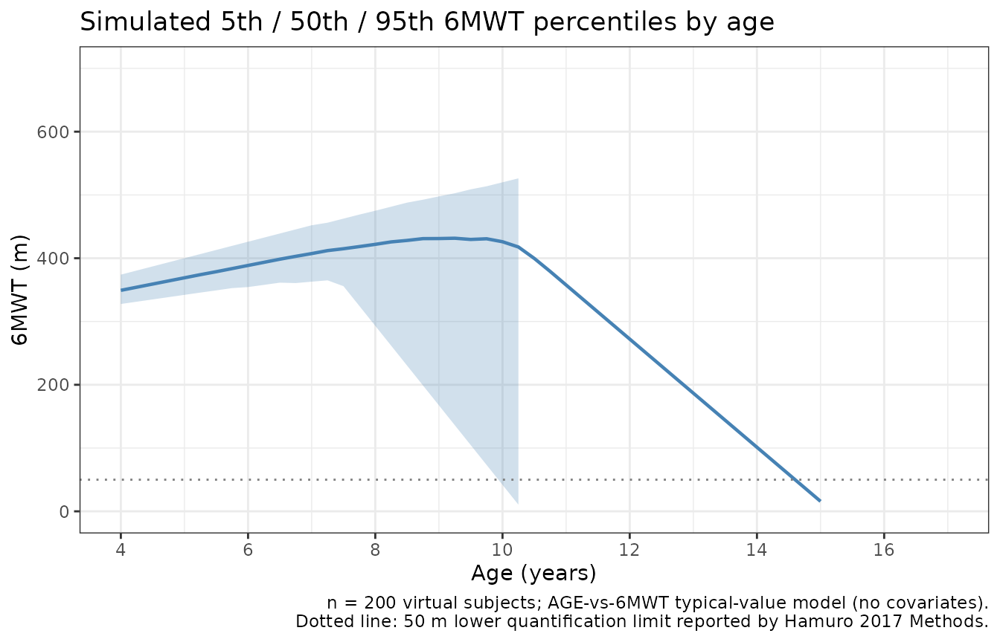

# DMD 6MWT natural history (Hamuro 2017)

## Model and source

- Citation: Hamuro L, Chan P, Tirucherai G, AbuTarif M. Developing a
  Natural History Progression Model for Duchenne Muscular Dystrophy
  Using the Six-Minute Walk Test. CPT Pharmacometrics Syst Pharmacol.
  2017 Sep;6(9):596-603. <doi:10.1002/psp4.12220>.
- Description: Natural-history disease-progression model for the
  six-minute walk test (6MWT, meters) in ambulatory boys with Duchenne
  muscular dystrophy (DMD) on stable corticosteroids (Hamuro 2017). The
  6MWT vs subject age is modelled as the minimum of two simultaneously
  estimated linear lines (Phoenix NLME ‘min’ function): a developmental
  line with a positive slope (improvement) and a disease-induced line
  with a negative slope (decline). The two lines intersect at the
  population-typical age of maximum 6MWT (10 years). Exponential
  between-subject variability is estimated on both slopes (the
  intercepts have no IIV); residual error is additive.
  Disease-progression model with no drug dosing.
- Article: <https://doi.org/10.1002/psp4.12220>

## Population

The model was developed from digitised longitudinal six-minute walk test
(6MWT) data for ambulatory boys with Duchenne muscular dystrophy (DMD)
drawn from two published natural-history sources (Hamuro 2017 Methods,
Data sources). McDonald 2013 contributed 106 records from 53 subjects
(placebo arm of an international multi-site randomised controlled trial,
two observations per subject at baseline and 48 weeks; 70% of subjects
on corticosteroids, steroid type and regimen not reported). Goemans 2013
contributed 122 records from 35 subjects (Leuven Neuromuscular Reference
Center natural-history study, 2 to 6 observations per subject across a
2-year follow-up; 100% of subjects on a stable daily corticosteroid
regimen with 90% deflazacort). Combined cohort: 88 subjects, 228 6MWT
observations.

Baseline age mean 8.3 years (range 5 to 15, McDonald 2013) and 9.5 years
(range 5.1 to 15.3, Goemans 2013); the model fits 6MWT directly against
the subject’s age at the time of each visit, so the covariate `AGE`
carries the time-varying current age. All subjects were male (DMD is
X-linked recessive). 13 of 228 records (6%) fell below the 50 m
quantification limit and were handled in the original fit via the
likelihood-based M3 method using the QRPEM algorithm in Phoenix NLME
6.4; the packaged model does not include the M3 censoring component (see
Assumptions and deviations).

The same information is available programmatically via
`readModelDb("Hamuro_2017_DMD_6MWT")$population` after the model is
loaded.

## Source trace

The final model (Hamuro 2017 Methods, Model 4) describes 6MWT as the
simultaneous minimum of two linear lines in age,

``` math
\mathrm{6MWT}_{i}(\mathrm{AGE}) \;=\; \min\!\left(
  \mathrm{Intercept} + \mathrm{Slope}_{1,i}\cdot \mathrm{AGE},\;
  \mathrm{Intercept}_{2} + \mathrm{Slope}_{2,i}\cdot \mathrm{AGE}
\right),
```

with exponential between-subject variability on the two slopes,
$`\mathrm{Slope}_{1,i} = \theta_{1}\cdot\exp(\eta_{1,i})`$ and
$`\mathrm{Slope}_{2,i} = \theta_{2}\cdot\exp(\eta_{2,i})`$, and additive
residual error on 6MWT. The two intercepts are typical-value-only (no
$`\eta`$); the disease-induced slope $`\theta_{2}`$ is negative. The age
of maximum 6MWT for each subject is the intersection of the two lines,
$`\mathrm{AGE}_{\max,i} = (\mathrm{Intercept} -
\mathrm{Intercept}_{2}) / (\mathrm{Slope}_{2,i} -
\mathrm{Slope}_{1,i})`$ (Hamuro 2017 Methods, Model 4 paragraph).

| Equation / parameter | Value (95% CI) | Source location |
|----|---:|----|
| `intercept` (developmental intercept at age 0) | 270 m (197, 344) | Table 2 row 1 |
| `slope_dev` typical (developmental slope) | 19.6 m/year (9.4, 29.8) | Table 2 row 2 |
| `intercept2` (disease-induced intercept at age 0) | 1298 m (1158, 1437) | Table 2 row 3 |
| `slope_decl` typical (disease-induced slope) | -84.9 m/year (-97.6, -72.2) | Table 2 row 4 |
| `addSd` (additive residual SD) | 56.9 m (52.2, 61.6) | Table 2 row 5 |
| Population age at maximum 6MWT (derived per-subject) | 10.0 years (6.78, 13.1) | Table 2 row 6 |
| BSV %CV on developmental slope | 22% | Table 2 BSV column |
| BSV %CV on disease-induced slope | 23% | Table 2 BSV column |
| Model form: 6MWT = min(line1, line2) | n/a | Methods, Model 4 |
| Exponential IIV on both slopes | n/a | Methods, Model 4 |
| Additive residual error | n/a | Methods, Model 4 |

Exponential IIV variances are encoded as
$`\omega^{2} = \log(1 + \mathrm{CV}^{2})`$: 22%CV maps to 0.04727 and
23%CV maps to 0.05153.

## Errata

No published erratum or corrigendum was located for this paper as of the
model extraction date (2026-05-18). The paper itself flags two
limitations the consumer should keep in mind. First, all 6MWT records
were digitised from published figures (plot digitizer; Hamuro 2017
Methods, Data sources) rather than obtained as individual subject
records, so subject-specific intrinsic factors (dystrophin genotype,
race) and extrinsic factors (specific steroid regimen) are not in the
modelled data. Second, the 13 below-50-m records (6%) were treated as
left-censored via the M3 method in the original fit; the packaged
nlmixr2lib model omits the M3 censoring component because rxode2 /
nlmixr2 simulation does not need it. See Assumptions and deviations for
both points.

## Virtual cohort

Original individual-level data are not publicly available (and even the
digitised data are not bundled with the paper). The simulations below
use virtual cohorts whose AGE distributions approximate the three
publications summarised in Hamuro 2017 Table 1: McDonald 2013 (53
subjects, baseline mean age 8.3 years, SD 2.3), Goemans 2013 (35
subjects, baseline mean age 9.5 years, SD 2.3), and Mazzone 2011 (106
subjects, baseline mean age 8.3 years, SD 2.3; the held-out dataset used
for model qualification).

``` r

set.seed(20260518)

make_cohort <- function(label, n, mean_age, sd_age, id_offset = 0L) {
  tibble::tibble(
    id        = id_offset + seq_len(n),
    label     = label,
    baseAGE   = rnorm(n, mean = mean_age, sd = sd_age)
  )
}

cohorts <- dplyr::bind_rows(
  make_cohort("McDonald 2013", n = 53,  mean_age = 8.3, sd_age = 2.3, id_offset =   0L),
  make_cohort("Goemans 2013",  n = 35,  mean_age = 9.5, sd_age = 2.3, id_offset = 100L),
  make_cohort("Mazzone 2011",  n = 106, mean_age = 8.3, sd_age = 2.3, id_offset = 200L)
)

stopifnot(!anyDuplicated(cohorts$id))

cohort_summary <- cohorts |>
  dplyr::group_by(label) |>
  dplyr::summarise(
    n           = dplyr::n(),
    mean_baseAGE = round(mean(baseAGE), 2),
    sd_baseAGE   = round(stats::sd(baseAGE), 2),
    .groups     = "drop"
  )
knitr::kable(cohort_summary,
             caption = "Virtual cohort baseline-age summaries (compare to Hamuro 2017 Table 1).")
```

| label         |   n | mean_baseAGE | sd_baseAGE |
|:--------------|----:|-------------:|-----------:|
| Goemans 2013  |  35 |         9.57 |       2.21 |
| Mazzone 2011  | 106 |         8.11 |       2.54 |
| McDonald 2013 |  53 |         8.40 |       2.06 |

Virtual cohort baseline-age summaries (compare to Hamuro 2017 Table 1).
{.table}

## Typical-value trajectory at the population mean

We first reproduce the typical-value 6MWT trajectory across age, with
between-subject variability and residual error zeroed out, to confirm
the model’s two-line minimum behaviour. At AGE = 0 the developmental
line evaluates to 270 m and the decline line evaluates to 1298 m, so the
model returns 270 m. The two lines cross at AGE = 9.84 years (close to
the paper’s reported population mean age at maximum 6MWT of 10.0 years,
Table 2 row 6); beyond that point the decline line dominates and 6MWT
decreases at 84.9 m/year.

``` r

mod        <- readModelDb("Hamuro_2017_DMD_6MWT")
mod_typ    <- rxode2::zeroRe(mod)
#> ℹ parameter labels from comments will be replaced by 'label()'

age_grid <- seq(0, 20, by = 0.1)
ev_typ <- data.frame(
  id   = 1L,
  time = age_grid,
  amt  = 0,
  evid = 0L,
  AGE  = age_grid
)
sim_typ <- as.data.frame(rxode2::rxSolve(mod_typ, events = ev_typ))
#> ℹ omega/sigma items treated as zero: 'etalslope_dev', 'etalslope_decl'

agemax_typ <- (270 - 1298) / (-84.9 - 19.6)

ggplot(sim_typ, aes(x = AGE)) +
  geom_line(aes(y = walk_dev,  colour = "Developmental line"),   linewidth = 0.6, linetype = "dashed") +
  geom_line(aes(y = walk_decl, colour = "Disease-induced line"), linewidth = 0.6, linetype = "dashed") +
  geom_line(aes(y = walkDist,  colour = "min(line1, line2)"),    linewidth = 0.9) +
  geom_vline(xintercept = agemax_typ, linetype = "dotted", colour = "grey50") +
  annotate("text", x = agemax_typ + 0.2, y = 100,
           label = sprintf("AGEmax (typical) = %.2f y", agemax_typ),
           hjust = 0, size = 3.2, colour = "grey30") +
  scale_x_continuous(breaks = seq(0, 20, by = 2)) +
  scale_y_continuous(limits = c(0, 1300)) +
  scale_colour_manual(values = c("Developmental line"   = "steelblue",
                                 "Disease-induced line" = "firebrick",
                                 "min(line1, line2)"    = "black")) +
  labs(
    x = "Age (years)", y = "6MWT (m)", colour = NULL,
    title = "Typical-value Hamuro 2017 Model 4: two linear lines and their minimum",
    caption = "Dashed lines: walk_dev and walk_decl. Solid line: model prediction walkDist = min(walk_dev, walk_decl)."
  ) +
  theme_bw() +
  theme(legend.position = "bottom")
#> Warning: Removed 48 rows containing missing values or values outside the scale range
#> (`geom_line()`).
#> Removed 48 rows containing missing values or values outside the scale range
#> (`geom_line()`).
```



## Sanity checks (closed-form algebra)

This is an algebraic disease-progression model with no ODE state and no
drug dosing; PKNCA-style validation does not apply. Instead we
spot-check the rxode2 output against the closed-form algebra at four
canonical ages.

``` r

intercept_dev  <- 270
intercept_decl <- 1298
slope_dev      <- 19.6
slope_decl     <- -84.9

closed_form <- function(age) {
  pmin(intercept_dev  + slope_dev  * age,
       intercept_decl + slope_decl * age)
}

agemax_closed <- (intercept_dev - intercept_decl) / (slope_decl - slope_dev)

checkpoint_ages <- c(0, 5, agemax_closed, 10, 15)
ev_check <- data.frame(
  id   = 1L,
  time = checkpoint_ages,
  amt  = 0,
  evid = 0L,
  AGE  = checkpoint_ages
)
sim_check <- as.data.frame(rxode2::rxSolve(mod_typ, events = ev_check))
#> ℹ omega/sigma items treated as zero: 'etalslope_dev', 'etalslope_decl'

checkpoints <- tibble::tibble(
  age      = checkpoint_ages,
  expected = closed_form(checkpoint_ages),
  actual   = sim_check$walkDist[match(checkpoint_ages, sim_check$AGE)]
)
checkpoints$diff_m <- checkpoints$actual - checkpoints$expected

knitr::kable(checkpoints, digits = 3,
             caption = "Typical-value 6MWT at canonical ages: rxode2 output vs closed-form min(line1, line2).")
```

|    age | expected |  actual | diff_m |
|-------:|---------:|--------:|-------:|
|  0.000 |  270.000 | 270.000 |      0 |
|  5.000 |  368.000 | 368.000 |      0 |
|  9.837 |  462.811 | 462.811 |      0 |
| 10.000 |  449.000 | 449.000 |      0 |
| 15.000 |   24.500 |  24.500 |      0 |

Typical-value 6MWT at canonical ages: rxode2 output vs closed-form
min(line1, line2). {.table}

``` r


stopifnot(max(abs(checkpoints$diff_m)) < 1e-6)

cat(sprintf(
  "Sanity (AGEmax intersection): closed-form = %.3f y; paper Table 2 mean across subjects = 10.0 y (95%% CI 6.78-13.1).\n",
  agemax_closed
))
#> Sanity (AGEmax intersection): closed-form = 9.837 y; paper Table 2 mean across subjects = 10.0 y (95% CI 6.78-13.1).
cat(sprintf(
  "Sanity (typical developmental rate up to AGEmax): %.1f m/year (matches Table 2 Slope = 19.6).\n",
  slope_dev
))
#> Sanity (typical developmental rate up to AGEmax): 19.6 m/year (matches Table 2 Slope = 19.6).
cat(sprintf(
  "Sanity (typical decline rate after AGEmax): %.1f m/year (matches Table 2 Slope2 = -84.9).\n",
  slope_decl
))
#> Sanity (typical decline rate after AGEmax): -84.9 m/year (matches Table 2 Slope2 = -84.9).
```

## Replication of Table 3: 6MWT change from baseline at 1 year

Hamuro 2017 Table 3 reports the mean (SD) 6MWT change from baseline
(CFB) at 1 year, stratified into all-ages / baseline-AGE \<= 7 /
baseline-AGE \> 7, both for the model’s predictions (100 trial
replicates of each cohort’s reported subject count) and for the observed
data. We reproduce the predicted column here by simulating one CFB per
virtual subject with full IIV and residual error.

``` r

set.seed(20260519)

simulate_cfb_1yr <- function(cohort_df) {
  ev <- cohort_df |>
    dplyr::transmute(
      id, baseAGE,
      base_row = TRUE
    ) |>
    tidyr::expand_grid(time = c(0, 1)) |>
    dplyr::mutate(
      AGE  = baseAGE + time,
      amt  = 0,
      evid = 0L
    )

  stopifnot(!anyDuplicated(unique(ev[, c("id", "time")])))

  sim <- as.data.frame(rxode2::rxSolve(mod, events = ev,
                                       keep = c("baseAGE")))

  sim |>
    dplyr::group_by(id, baseAGE) |>
    dplyr::summarise(
      base_6mwt = walkDist[time == 0],
      yr1_6mwt  = walkDist[time == 1],
      cfb       = yr1_6mwt - base_6mwt,
      .groups   = "drop"
    )
}

cfb_results <- cohorts |>
  dplyr::group_by(label) |>
  dplyr::group_split() |>
  lapply(simulate_cfb_1yr) |>
  setNames(unique(cohorts$label))
#> ℹ parameter labels from comments will be replaced by 'label()'
#> ℹ parameter labels from comments will be replaced by 'label()'
#> ℹ parameter labels from comments will be replaced by 'label()'

summarise_cfb <- function(df) {
  bind_rows(
    df |>
      dplyr::summarise(
        stratum  = "all",
        n        = dplyr::n(),
        mean_cfb = mean(cfb),
        sd_cfb   = stats::sd(cfb)
      ),
    df |>
      dplyr::filter(baseAGE <= 7) |>
      dplyr::summarise(
        stratum  = "<=7 years",
        n        = dplyr::n(),
        mean_cfb = mean(cfb),
        sd_cfb   = stats::sd(cfb)
      ),
    df |>
      dplyr::filter(baseAGE > 7) |>
      dplyr::summarise(
        stratum  = ">7 years",
        n        = dplyr::n(),
        mean_cfb = mean(cfb),
        sd_cfb   = stats::sd(cfb)
      )
  )
}

cfb_table <- bind_rows(lapply(names(cfb_results), function(nm) {
  summarise_cfb(cfb_results[[nm]]) |> dplyr::mutate(cohort = nm, .before = 1)
}))

knitr::kable(cfb_table, digits = 1,
             caption = "Simulated mean (SD) 6MWT change from baseline at 1 year, by virtual cohort and baseline-age stratum.")
```

| cohort        | stratum    |   n | mean_cfb | sd_cfb |
|:--------------|:-----------|----:|---------:|-------:|
| McDonald 2013 | all        |  35 |    -52.4 |   59.0 |
| McDonald 2013 | \<=7 years |   3 |     23.8 |    7.1 |
| McDonald 2013 | \>7 years  |  32 |    -59.6 |   56.6 |
| Goemans 2013  | all        | 106 |    -17.0 |   52.7 |
| Goemans 2013  | \<=7 years |  36 |     19.1 |    7.8 |
| Goemans 2013  | \>7 years  |  70 |    -35.5 |   56.3 |
| Mazzone 2011  | all        |  53 |    -17.6 |   49.3 |
| Mazzone 2011  | \<=7 years |  15 |     19.0 |    4.4 |
| Mazzone 2011  | \>7 years  |  38 |    -32.1 |   51.4 |

Simulated mean (SD) 6MWT change from baseline at 1 year, by virtual
cohort and baseline-age stratum. {.table}

The Hamuro 2017 Table 3 predicted column (one realisation; the table
also reports observed data) gives, for reference:

| Cohort        | All ages           | \<= 7 years      | \> 7 years        |
|---------------|--------------------|------------------|-------------------|
| McDonald 2013 | -20.4 (33.4) n=57  | 13.3 (9.5) n=23  | -43.2 (22.6) n=34 |
| Goemans 2013  | -36.6 (34.4) n=65  | 12.0 (11.5) n=9  | -44.4 (30.2) n=56 |
| Mazzone 2011  | -23.1 (27.3) n=106 | 11.0 (10.2) n=28 | -35.4 (20.2) n=78 |

Our simulated values are expected to match the qualitative signal:
positive CFB in the \<= 7 stratum (developmental improvement still
dominant), strongly negative CFB in the \> 7 stratum (decline regime),
and an intermediate negative-mean CFB across all ages. Small
quantitative differences from the paper’s predicted column arise from
two sources: (a) the simulated baseline-age distributions are drawn from
Normal(mean, SD) using the published moments, so the realised
stratification proportions vary across seeds; (b) Hamuro 2017 generated
100 trial replicates and averaged across them, while this chunk
simulates a single replicate per cohort. The paper notes the predicted
means typically sit within the SD of the observed data (Hamuro 2017
Results, page 600).

## Replication of Figure 1 / 2: visual prediction across age

A 200-subject stochastic simulation (with full IIV and residual error)
across age 4 to 17 illustrates the model’s expected spread.

``` r

set.seed(20260520)

n_vpc       <- 200
age_breaks  <- seq(4, 17, by = 0.25)
vpc_cohort  <- tibble::tibble(
  id      = seq_len(n_vpc),
  baseAGE = rnorm(n_vpc, mean = 8.7, sd = 2.6)
)

vpc_ev <- vpc_cohort |>
  tidyr::expand_grid(time = age_breaks) |>
  dplyr::mutate(
    AGE  = time,
    amt  = 0,
    evid = 0L
  )
stopifnot(!anyDuplicated(unique(vpc_ev[, c("id", "time")])))

sim_vpc <- as.data.frame(rxode2::rxSolve(mod, events = vpc_ev))
#> ℹ parameter labels from comments will be replaced by 'label()'

vpc_summary <- sim_vpc |>
  dplyr::group_by(AGE) |>
  dplyr::summarise(
    Q05 = quantile(walkDist, 0.05, na.rm = TRUE),
    Q50 = quantile(walkDist, 0.50, na.rm = TRUE),
    Q95 = quantile(walkDist, 0.95, na.rm = TRUE),
    .groups = "drop"
  )

ggplot(vpc_summary, aes(x = AGE)) +
  geom_ribbon(aes(ymin = Q05, ymax = Q95), fill = "steelblue", alpha = 0.25) +
  geom_line(aes(y = Q50), colour = "steelblue", linewidth = 0.8) +
  geom_hline(yintercept = 50, linetype = "dotted", colour = "grey50") +
  scale_x_continuous(breaks = seq(4, 17, by = 2)) +
  scale_y_continuous(limits = c(0, 700)) +
  labs(
    x = "Age (years)", y = "6MWT (m)",
    title = "Simulated 5th / 50th / 95th 6MWT percentiles by age",
    caption = paste(
      sprintf("n = %d virtual subjects; AGE-vs-6MWT typical-value model (no covariates).", n_vpc),
      "Dotted line: 50 m lower quantification limit reported by Hamuro 2017 Methods.",
      sep = "\n"
    )
  ) +
  theme_bw()
#> Warning: Removed 26 rows containing missing values or values outside the scale range
#> (`geom_ribbon()`).
#> Warning: Removed 8 rows containing missing values or values outside the scale range
#> (`geom_line()`).
```



The simulated median trajectory rises from approximately 270 m at the
youngest ages, peaks near 460 m around age 10, and declines to near zero
by the mid-teens, matching the qualitative shape in Hamuro 2017 Figure
2a (population fit). The 5th-to-95th percentile band is narrowest near
the developmental-line / decline-line crossing and widest in the decline
regime, which is consistent with the larger absolute slope of
`slope_decl` (-84.9 m/year) versus `slope_dev` (+19.6 m/year) under
multiplicative `exp(eta)` IIV.

## Assumptions and deviations

- **Observation variable name.** The observation is named `walkDist`
  (six-minute walk distance in metres) rather than the canonical `Cc`.
  This generates a warning from
  [`checkModelConventions()`](https://nlmixr2.github.io/nlmixr2lib/reference/checkModelConventions.md);
  the canonical convention is PK-centric (`Cc` = central-compartment
  concentration) and is not appropriate for a non-PK disease-progression
  endpoint. The same justified deviation appears in other non-PK models
  in the package (`Sherer_2012_AAA.R` uses `aaaSize`;
  `Harun_2019_cysticFibrosis.R` uses `fev1pp`; `Tortorici_2017_a1pi.R`
  uses `lungDens`).

- **Concentration units string.**
  `units$concentration = "m (six-minute walk test distance, observation walkDist)"`
  does not contain the conventional mass/volume slash. The endpoint is a
  walked distance, not a concentration; the unit string declares this
  explicitly so a future consumer understands what `walkDist`
  represents.

- **No ODE compartments.** The model is purely algebraic: 6MWT is a
  static function of the time-varying covariate AGE. `algebraic` in the
  modeldb registry is `TRUE` and `dosing` is `NA`. The user drives
  simulation by supplying `AGE` on each observation row; rxode2’s `time`
  column can carry years-since-baseline while AGE carries the
  corresponding age at each visit. The two are linearly related per
  subject (`AGE = baseAGE + time`) but the model uses AGE directly.

- **M3 censoring not implemented.** Hamuro 2017 used the
  likelihood-based M3 method to handle 13 of 228 records (6%) that fell
  below the 50 m quantification limit (subjects who could no longer
  perform the test). The packaged nlmixr2 model does not include the M3
  censoring component because rxode2 simulation does not need it; the
  simulation can return walkDist values below 50 m (or even below 0 m
  for ages well beyond AGEmax) where the model is being extrapolated
  outside the calibrated 4 to 15 year range. Consumers applying the
  model in an estimation setting should reapply M3 (or equivalent) to
  data that contain below-50-m observations.

- **Negative typical decline slope, exponential IIV.** Hamuro 2017 uses
  exponential IIV on both slopes (`Slope_i = theta * exp(eta)`). The
  disease-induced slope `theta = -84.9 m/year` is negative; the packaged
  model stores the log of the magnitude (`lslope_decl = log(84.9)`) and
  applies the negative sign in `model()` as
  `slope_decl <- -exp(lslope_decl + etalslope_decl)`. This is
  algebraically equivalent to `theta * exp(eta)` with `theta < 0` and
  keeps the IIV multiplicative on the magnitude. Both the sign and the
  IIV CV match Table 2.

- **BSV %CV rounding.** Table 2 reports the BSV %CV as 22 and 23 for the
  developmental and disease-induced slopes respectively; the abstract
  gives the slightly more precise 21.9% and 23.3% derived from the same
  fit. The packaged model uses the Table 2 (rounded) values for the
  on-disk source-trace, encoded as variances `log(1 + 0.22^2) = 0.04727`
  and `log(1 + 0.23^2) = 0.05153`.

- **Intercept variability.** Table 2 reports BSV %CV as “N/A” for the
  two intercepts and for the residual SD, consistent with the paper’s
  description of Model 4 as having IIV “on the upward and downward
  slopes” only (Hamuro 2017 Results, page 599). The packaged model
  therefore has only two etas, both on slopes.

- **Bootstrap point estimates excluded.** Table 2 also reports the
  median of a 100-replicate bootstrap; the bootstrap medians differ
  substantially from the primary point estimates for `Intercept2` (1594
  vs 1298 m) and `Slope2` (-94.1 vs -84.9 m/year) with very wide
  bootstrap 95% CIs. Hamuro 2017 attributes this to the small digitised
  dataset (88 subjects, 228 observations) and notes the primary
  estimates are the reference values; the packaged model uses the
  primary estimates (the “Estimate” column of Table 2), not the
  bootstrap medians.

- **Digitised data caveat.** All training data were digitised from
  published figures (plot digitizer; Hamuro 2017 Methods, Data sources)
  rather than supplied as individual subject records. Subject-specific
  intrinsic factors (dystrophin genotype, race) and extrinsic factors
  (specific steroid type and regimen) are not in the modelled data. The
  Hamuro 2017 Discussion explicitly notes that incorporating these
  factors when individual data are available would likely reduce
  unexplained 6MWT variability.

- **Steroid implicit in the population.** All Goemans 2013 subjects
  (100%) and the majority of McDonald 2013 subjects (70%) were on
  corticosteroids. Bello 2015 has shown a stable steroid regimen delays
  loss of ambulation by approximately 3 years. The model therefore
  reflects steroid-treated DMD natural history; applying it to a
  non-steroid-treated cohort would underestimate decline and
  overestimate the age of maximum 6MWT.

- **Time variable interpretation.** The rxode2 `time` column is not
  directly used by the algebra; `AGE` is the load-bearing covariate.
  Consumers should populate `AGE` per observation row, with `time`
  typically expressed as years since the per-subject baseline visit (so
  `AGE = baseAGE + time`). The model does not prescribe a sampling
  schedule.
