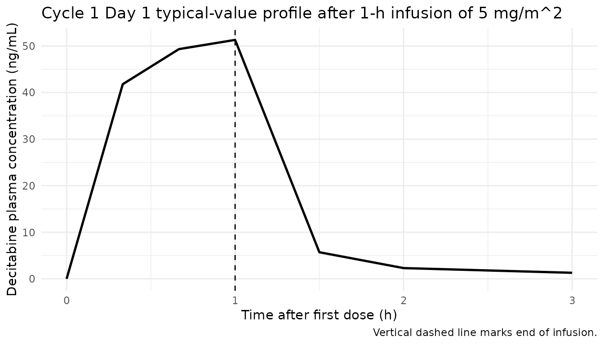
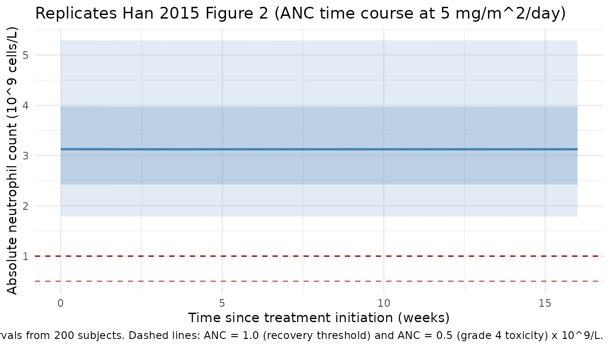
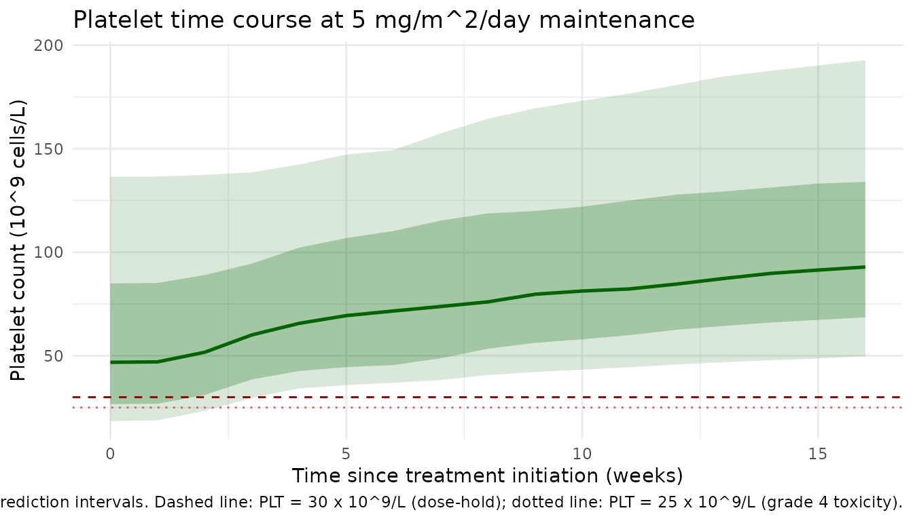

# Decitabine (Han 2015)

## Model and source

- Citation: Han S, Kim Y-J, Lee J, Jeon S, Hong T, Park G-J, Yoon J-H,
  Yahng S-A, Shin S-H, Lee S-E, Eom K-S, Kim H-J, Min C-K, Lee S, Yim
  D-S. (2015). Model-based adaptive phase I trial design of
  post-transplant decitabine maintenance in myelodysplastic syndrome.
  Journal of Hematology & Oncology 8:118.
  <doi:10.1186/s13045-015-0208-3> (PMID 26482429). ClinicalTrials.gov
  NCT01277484.
- Description: Two-compartment IV population pharmacokinetic model
  coupled with two parallel Friberg-style myelosuppression PD chains
  (absolute neutrophil count, ANC, and platelet count, PC) for
  decitabine post-transplant maintenance in adult Korean patients with
  higher-risk myelodysplastic syndrome or secondary acute myeloid
  leukemia (Han 2015). The platelet feedback baseline rises
  asymptotically over cycles per the paper’s IMP / IMK extension
  (BASE_P_t = BASE_P + IMP \* (1 - exp(-IMK \* t))); the neutrophil
  chain uses a time-invariant baseline. PK parameters are
  body-surface-area-normalized (per m^2): doses must be supplied in
  mg/m^2 and central-compartment concentrations are returned in mg/L (=
  ug/mL = 1000 ng/mL). PD outputs ANC and PLT are in 10^9 cells/L.
- Article (open access): <https://doi.org/10.1186/s13045-015-0208-3>
- PMID: 26482429
- ClinicalTrials.gov: NCT01277484

Decitabine is a hypomethylating cytidine analogue. Han et al. (2015)
report an adaptive phase I trial of
post-allogeneic-hematopoietic-stem-cell- transplantation (allo-HSCT)
decitabine maintenance in 16 Korean adults with higher-risk
myelodysplastic syndrome (MDS) or secondary acute myeloid leukemia
(sAML) evolving from MDS. The PK-PD model was used to individualize the
Cycle 2-4 doses for each patient and to estimate the initial doses for
cohorts 2-5. The popPK-PD analysis excluded one female patient with
immune thrombocytopenia (managed with steroids), leaving 15 patients in
the mixed-effect analysis (95 PK observations + 311 ANC + 311 PC
observations).

The structural model has three layers (Han 2015 Results, “Overall
mixed-effect PK-PD analysis”):

- **PK** – two-compartment IV-infusion model parameterised on a
  body-surface-area-normalized (per m^2) scale: CL (L/h per m^2), Vc (L
  per m^2), Vp (L per m^2), Q (L/h per m^2). The trial administered
  decitabine as a 60-minute IV infusion at 4-12 mg/m^2/day for five
  consecutive days, repeated every ~4 weeks (mean actual interval 34.5
  days, SD 8.7).
- **Absolute neutrophil count (ANC)** – Friberg / Wallin transit
  compartment model with feedback (1 proliferating + 3 transit + 1
  circulating; uniform ktr_N applied across proliferation, transit, and
  circulating-pool clearance). Linear drug effect on the proliferation
  rate (1 - SLOPE_N \* Cc) and feedback (BASE_N / circ_anc)^GAMMA_N.
  Baseline is time-invariant: the paper reports “baseline cell count
  increase was not meaningful” for neutrophils.
- **Platelet count (PC)** – Friberg / Wallin transit compartment model
  with feedback, identical structure to the ANC chain but with a
  time-dependent baseline that increases asymptotically over treatment
  cycles: BASE_P_t = BASE_P + IMP \* (1 - exp(-IMK \* TIME)). The
  time-dependent BASE_P_t substitutes for BASE_P inside the feedback
  term only; the transit kinetics use the structural ktr_P unchanged.

## Population

``` r

mod_meta$meta$population
#> $species
#> [1] "human"
#> 
#> $n_subjects
#> [1] 15
#> 
#> $n_studies
#> [1] 1
#> 
#> $age_range
#> [1] "19-64 years"
#> 
#> $weight_range
#> [1] NA
#> 
#> $sex_female_pct
#> [1] 40
#> 
#> $race_ethnicity
#> Asian 
#>   100 
#> 
#> $disease_state
#> [1] "Adult Korean patients with higher-risk myelodysplastic syndrome (MDS; intermediate-2 or high IPSS risk) or secondary acute myeloid leukemia (sAML) evolving from MDS, receiving decitabine maintenance after allogeneic hematopoietic stem cell transplantation (allo-HSCT). Eligibility: age <= 65; PC > 30,000/mm^3 and ANC > 1000/mm^3 maintained > 7 days without transfusion or growth factors; no grade III/IV acute GVHD; ECOG 0-2; no renal or hepatic impairment. Decitabine started on days 42-90 post-transplant (median 86 days)."
#> 
#> $dose_range
#> [1] "Decitabine 4-12 mg/m^2/day (Cycle 2-4 range 1.5-12 mg/m^2/day from Table 2) as a 60-minute IV infusion for 5 consecutive days, cycles repeated every 4 weeks up to Cycle 12. Initial Cycle-1 dose 5 mg/m^2/day for cohort 1; subsequent cohort initial doses estimated by cohort dose estimation (CDE) at 4, 5, 5.5, and 5 mg/m^2/day for cohorts 2-5. Doses for Cycles 2-4 individualized via PK-PD adaptive titration (IDT); the Cycle-4 dose was maintained for all subsequent cycles. The actual dosing interval was 34.5 +/- 8.7 days (mean +/- SD)."
#> 
#> $regions
#> [1] "Republic of Korea (Seoul St. Mary's Hospital, The Catholic University of Korea)."
#> 
#> $co_medication
#> [1] "GVHD prophylaxis: calcineurin inhibitor (cyclosporine for related donors, tacrolimus for unrelated donors) plus short-course methotrexate. Antithymocyte globulin given to all patients prior to transplant. At decitabine initiation: acute GVHD grade 0-2 in all patients, mild chronic GVHD in 1 patient."
#> 
#> $notes
#> [1] "Baseline demographics from Han 2015 Tables 1 and 2. 16 patients were enrolled (9 male / 7 female); the popPK-PD analysis excluded 1 female patient whose dose-limiting toxicity factor was platelet count due to immune thrombocytopenia after transplantation (managed with steroids), leaving 15 patients in the mixed-effect analysis (8 male / 6 female assumed; sex_female_pct = 40 reflects 6/15). Donor type for the 16 enrolled: matched sibling donor (n=7), matched unrelated donor (n=8), partially matched unrelated donor (n=1). WHO diagnoses: RAEB-1 (n=1), RAEB-2 (n=10), AML evolving from MDS (n=5). Final analysis dataset: 95 PK observations and 622 PD observations (311 ANC + 311 PC) across the 15 subjects (Han 2015 Results, 'Overall mixed-effect PK-PD analysis'). PK proportional residual error variance sigma^2_PK = 0.441 (= 66% CV); PD additive residual error variances sigma^2_PD,P = 25000 /mm^3 squared and sigma^2_PD,N = 754 /mm^3 squared (Table 3). Successful bootstrap convergence proportion was 78.8% (PK) and 78.0% (PD)."
```

## Source trace

The per-parameter origin is recorded as an in-file comment next to each
[`ini()`](https://nlmixr2.github.io/rxode2/reference/ini.html) entry.
Every numeric value below was taken from Table 3 of Han et al. 2015
(“Final parameter estimates and bootstrap outcomes”). The BSV columns
(reported as %CV) were converted to log-scale variances via omega^2 =
log(1 + CV^2); residual error variances were converted to SDs via
sqrt(.) with a /mm^3 -\> 10^9/L unit conversion (divide by 1000).

| Equation / parameter | Value | Source location (Han 2015) |
|----|----|----|
| 2-cmt IV infusion ODE | n/a | Methods + Results “A two-compartment model was found to best describe the PK data” |
| Friberg / Wallin chain | n/a | Results, formula `dA(N)/dt = ktr*A(N-1) - ktr*A(N)` + feedback; cites Wallin 2009 \[33\] |
| `lcl = log(87.8)` (L/h per m^2) | 87.8 | Table 3, PK parameters row CL |
| `lvc = log(18.5)` (L per m^2) | 18.5 | Table 3, PK parameters row Vc |
| `lvp = log(22.9)` (L per m^2) | 22.9 | Table 3, PK parameters row Vp |
| `lq = log(13.1)` (L/h per m^2) | 13.1 | Table 3, PK parameters row Q |
| `lktr_anc = log(0.0132)` (1/h) | 0.0132 | Table 3, neutrophil row ktr,N |
| `lslope_anc = log(0.263)` (L/mg) | 0.263 | Table 3, neutrophil row SLOPE_N |
| `lbase_anc = log(3.24)` (10^9/L) | 3240/mm^3 | Table 3, neutrophil row BASE_N |
| `lgamma_anc = log(0.193)` | 0.193 | Table 3, neutrophil row GAMMA_N |
| `lktr_plt = log(0.0244)` (1/h) | 0.0244 | Table 3, platelet row ktr,P |
| `lslope_plt = log(0.0656)` (L/mg) | 0.0656 | Table 3, platelet row SLOPE_P |
| `lbase_plt = log(49.2)` (10^9/L) | 49200/mm^3 | Table 3, platelet row BASE_P |
| `lgamma_plt = log(0.304)` | 0.304 | Table 3, platelet row GAMMA_P |
| `limp = log(55)` (10^9/L) | 55000/mm^3 | Table 3, platelet row IMP |
| `limk = log(5.3e-4)` (1/h) | 0.000530 | Table 3, platelet row IMK |
| `etalcl` ~ log(1+0.214^2) | 0.0448 | Table 3, BSV CL = 21.4% CV |
| `etalslope_anc` ~ log(1+0.575^2) | 0.286 | Table 3, BSV SLOPE_N = 57.5% CV |
| `etalbase_anc` ~ log(1+0.435^2) | 0.173 | Table 3, BSV BASE_N = 43.5% CV |
| `etalgamma_anc` ~ log(1+0.394^2) | 0.144 | Table 3, BSV GAMMA_N = 39.4% CV |
| `etalslope_plt` ~ log(1+0.257^2) | 0.0640 | Table 3, BSV SLOPE_P = 25.7% CV |
| `etalbase_plt` ~ log(1+1.050^2) | 0.743 | Table 3, BSV BASE_P = 105% CV |
| `etalimp` ~ log(1+0.783^2) | 0.478 | Table 3, BSV IMP = 78.3% CV |
| `propSd = sqrt(0.441)` | 0.664 | Table 3, sigma^2_PK = 0.441 |
| `addSd_ANC = sqrt(754)/1000` | 0.0275 | Table 3, sigma^2_PD,N = 754 /mm³2; /1000 -\> 10^9/L |
| `addSd_PLT = sqrt(25000)/1000` | 0.158 | Table 3, sigma^2_PD,P = 25000 /mm³2; /1000 -\> 10^9/L |

Table 3 reports “NE” (not estimated) BSV for Vc, Vp, Q, ktr_N, ktr_P,
GAMMA_P, and IMK; these are carried as fixed structural parameters in
the model (no corresponding eta). The paper’s covariate analysis
(Results, “No meaningful covariate was found in either the patient
demographic or clinical variables”) found no retained covariates for
sex, age, baseline body weight, body-surface-area, or any clinical-lab
variable, so the model has `covariateData = list()`.

## Virtual cohort

The trial schedule for the 15 popPK-PD subjects was decitabine 4-12
mg/m^2/day as a 60-minute IV infusion for 5 consecutive days, repeated
every 4 weeks (28-day protocol) up to Cycle 12; the median maintenance
dose was 7 mg/m^2/day. The first reported recommendation is 5 mg/m^2/day
for five consecutive days as the appropriate starting dose.

The simulation below builds a 4-cycle (16-week) virtual cohort at the
recommended initial dose of 5 mg/m^2/day for 5 consecutive days per
cycle, with cycles repeated every 28 days (the protocol interval). PK
parameters are on a per-m^2 scale and the simulated doses are entered in
mg/m^2 directly, so the simulated central concentration is in mg/L (=
ug/mL = 1000 ng/mL).

``` r

set.seed(20151028)

n_subjects <- 200L
mg_per_m2  <- 5            # initial dose
dose_h     <- 1            # 60-minute infusion
inf_rate   <- mg_per_m2 / dose_h  # mg/m^2/h
days_per_cycle <- 5
cycle_h       <- 28 * 24   # 4-week protocol interval (hours)
n_cycles      <- 4
total_h       <- n_cycles * cycle_h

# Dense PK sampling on Cycle 1 Day 1 + sparse PD sampling weekly thereafter,
# matching the paper's protocol (PK on Cycle 1 Day 1; PD weekly through
# Cycle 4).
pk_obs_times <- c(0, 1/3, 2/3, 1, 1.5, 2, 3)  # h after first dose
pd_obs_times <- seq(0, total_h, by = 24 * 7)  # weekly through 16 weeks

# Five daily 1-h infusions per cycle, starting at the cycle start time
dose_starts <- as.vector(outer(
  seq(0, by = 24, length.out = days_per_cycle),         # 5 daily doses
  seq(0, by = cycle_h, length.out = n_cycles),          # cycle starts
  FUN = "+"
))

make_events <- function(id) {
  ev_dose <- data.frame(
    id   = id,
    time = dose_starts,
    evid = 1L,
    amt  = mg_per_m2,
    cmt  = "central",
    rate = inf_rate,
    dur  = NA_real_
  )
  ev_obs_Cc  <- data.frame(id = id, time = pk_obs_times,
                           evid = 0L, amt = 0, cmt = "Cc",
                           rate = NA_real_, dur = NA_real_)
  ev_obs_ANC <- data.frame(id = id, time = pd_obs_times,
                           evid = 0L, amt = 0, cmt = "ANC",
                           rate = NA_real_, dur = NA_real_)
  ev_obs_PLT <- data.frame(id = id, time = pd_obs_times,
                           evid = 0L, amt = 0, cmt = "PLT",
                           rate = NA_real_, dur = NA_real_)
  dplyr::bind_rows(ev_dose, ev_obs_Cc, ev_obs_ANC, ev_obs_PLT)
}

events <- dplyr::bind_rows(lapply(seq_len(n_subjects), make_events))
nrow(events); length(unique(events$id))
#> [1] 12200
#> [1] 200
```

## Simulation

``` r

mod <- mod_meta

sim <- rxode2::rxSolve(
  mod,
  events = events
) |>
  as.data.frame()

mod_typical <- mod |> rxode2::zeroRe()
sim_typical <- rxode2::rxSolve(
  mod_typical,
  events = events |> dplyr::filter(id == 1L)
) |>
  as.data.frame()
#> ℹ omega/sigma items treated as zero: 'etalcl', 'etalslope_anc', 'etalbase_anc', 'etalgamma_anc', 'etalslope_plt', 'etalbase_plt', 'etalimp'
```

## Replicate published figures

### Cmax cross-check (Discussion, page 4)

The paper’s Discussion states: “the predicted C_max after 1-h infusion
of 5 mg/m^2 was 66.0 ng/mL.” Reproduce by reading off the typical-value
trajectory at the end of the first infusion (t = 1 h).

**Paper-internal discrepancy.** The published Table 3 parameters imply
an asymptotic infusion concentration k0/CL = 5/87.8 = 57 ng/mL as a
ceiling (i.e. the highest Cc reachable for an infinite-duration infusion
at this dose rate); the actual 1-h end-of-infusion typical value
computed analytically from the 2-cmt parameters in Table 3 is ~51 ng/mL.
The paper’s quoted 66 ng/mL therefore cannot come from the Table 3
typical-value PK; it may reflect an alternative dose or rate than the
text states, an inclusion of IIV (a higher percentile of the
predicted-Cmax distribution), or a transcription error in the paper. The
model file in this package faithfully reproduces Table 3, so the
simulated Cmax below matches the parameters as published (~51 ng/mL).
This is flagged as a \> 20% discrepancy with the paper’s narrative; see
the verification-checklist policy of “flag, do not tune.”

``` r

cmax_check <- sim_typical |>
  dplyr::filter(time >= 0, time <= 3) |>
  dplyr::select(time, Cc) |>
  dplyr::mutate(Cc_ngmL = Cc * 1000)

ggplot(cmax_check, aes(time, Cc_ngmL)) +
  geom_line(linewidth = 0.9) +
  geom_vline(xintercept = 1, linetype = 2) +
  labs(x = "Time after first dose (h)",
       y = "Decitabine plasma concentration (ng/mL)",
       title = "Cycle 1 Day 1 typical-value profile after 1-h infusion of 5 mg/m^2",
       caption = "Vertical dashed line marks end of infusion.") +
  theme_minimal()
```



``` r


cmax_pred <- cmax_check |>
  dplyr::filter(time <= 1) |>
  dplyr::pull(Cc_ngmL) |>
  max()

knitr::kable(data.frame(
  metric   = c("Predicted Cmax (ng/mL) at end of 1-h infusion of 5 mg/m^2"),
  this_sim = round(cmax_pred, 1),
  paper    = "~66.0"
))
```

| metric                                                    | this_sim | paper |
|:----------------------------------------------------------|---------:|:------|
| Predicted Cmax (ng/mL) at end of 1-h infusion of 5 mg/m^2 |     51.3 | ~66.0 |

### Figure 2 – ANC trajectory at 5 mg/m^2/day maintenance over 4 cycles

Han 2015 Figure 2 displays simulated time courses of ANC under the
maintenance dosage of 5 mg/m^2/day for four treatment cycles, including
the median and prediction intervals. The two qualitative features the
text calls out are (i) the lowest ANC value appears in the second cycle
(6-7 weeks after treatment initiation), and (ii) the time to recovery to
ANC \> 1000/mm^3 is approximately 5 weeks for the ANC.

``` r

sim_anc <- sim |>
  dplyr::filter(!is.na(ANC)) |>
  dplyr::mutate(week = time / 168)

anc_quants <- sim_anc |>
  dplyr::group_by(week) |>
  dplyr::summarise(
    p10 = stats::quantile(ANC, 0.10, na.rm = TRUE),
    p25 = stats::quantile(ANC, 0.25, na.rm = TRUE),
    p50 = stats::quantile(ANC, 0.50, na.rm = TRUE),
    p75 = stats::quantile(ANC, 0.75, na.rm = TRUE),
    p90 = stats::quantile(ANC, 0.90, na.rm = TRUE),
    .groups = "drop"
  )

ggplot(anc_quants, aes(week, p50)) +
  geom_ribbon(aes(ymin = p10, ymax = p90), fill = "steelblue", alpha = 0.15) +
  geom_ribbon(aes(ymin = p25, ymax = p75), fill = "steelblue", alpha = 0.25) +
  geom_line(linewidth = 0.9, colour = "steelblue") +
  geom_hline(yintercept = 1.0, linetype = 2, colour = "darkred") +   # 1000/mm^3 = 1.0 * 10^9/L
  geom_hline(yintercept = 0.5, linetype = 2, colour = "indianred") + # 500/mm^3 = 0.5 * 10^9/L grade 4 toxicity
  labs(x = "Time since treatment initiation (weeks)",
       y = "Absolute neutrophil count (10^9 cells/L)",
       title = "Replicates Han 2015 Figure 2 (ANC time course at 5 mg/m^2/day)",
       caption = paste0(
         "Median, 50% (dark) and 80% (light) prediction intervals from ",
         n_subjects, " subjects. ",
         "Dashed lines: ANC = 1.0 (recovery threshold) and ANC = 0.5 ",
         "(grade 4 toxicity) x 10^9/L."
       )) +
  theme_minimal()
```



``` r


# Time to nadir
nadir_week <- anc_quants$week[which.min(anc_quants$p50)]
recovery_week <- anc_quants |>
  dplyr::filter(week > nadir_week, p50 >= 1.0) |>
  dplyr::slice_head(n = 1) |>
  dplyr::pull(week)

knitr::kable(data.frame(
  metric        = c("Week of median-ANC nadir (Cycle 2 region per paper text)",
                    "Week of median ANC recovery to >= 1.0 x 10^9/L"),
  this_sim      = c(round(nadir_week, 1),
                    if (length(recovery_week)) round(recovery_week, 1) else NA),
  paper_text    = c("3.5 weeks (time-to-nadir), nadir achieved in 2nd cycle (6-7 weeks)",
                    "~5 weeks from last dose")
))
```

| metric | this_sim | paper_text |
|:---|---:|:---|
| Week of median-ANC nadir (Cycle 2 region per paper text) | 3 | 3.5 weeks (time-to-nadir), nadir achieved in 2nd cycle (6-7 weeks) |
| Week of median ANC recovery to \>= 1.0 x 10^9/L | 4 | ~5 weeks from last dose |

### Platelet trajectory with cycle-asymptotic baseline rise

The paper’s PD model adds an asymptotic baseline-rise structure for
platelets (BASE_P_t = BASE_P + IMP \* (1 - exp(-IMK \* TIME))) to
capture the gradual platelet-count increase over cycles – a contribution
of decitabine to cell proliferation reported in previous studies.

``` r

sim_plt <- sim |>
  dplyr::filter(!is.na(PLT)) |>
  dplyr::mutate(week = time / 168)

plt_quants <- sim_plt |>
  dplyr::group_by(week) |>
  dplyr::summarise(
    p10 = stats::quantile(PLT, 0.10, na.rm = TRUE),
    p25 = stats::quantile(PLT, 0.25, na.rm = TRUE),
    p50 = stats::quantile(PLT, 0.50, na.rm = TRUE),
    p75 = stats::quantile(PLT, 0.75, na.rm = TRUE),
    p90 = stats::quantile(PLT, 0.90, na.rm = TRUE),
    .groups = "drop"
  )

ggplot(plt_quants, aes(week, p50)) +
  geom_ribbon(aes(ymin = p10, ymax = p90), fill = "darkgreen", alpha = 0.15) +
  geom_ribbon(aes(ymin = p25, ymax = p75), fill = "darkgreen", alpha = 0.25) +
  geom_line(linewidth = 0.9, colour = "darkgreen") +
  geom_hline(yintercept = 30, linetype = 2, colour = "darkred") +  # 30,000/mm^3 holding threshold
  geom_hline(yintercept = 25, linetype = 3, colour = "indianred") +# 25,000/mm^3 grade 4 toxicity
  labs(x = "Time since treatment initiation (weeks)",
       y = "Platelet count (10^9 cells/L)",
       title = "Platelet time course at 5 mg/m^2/day maintenance",
       caption = paste(
         "Median + 50% (dark) and 80% (light) prediction intervals.",
         "Dashed line: PLT = 30 x 10^9/L (dose-hold);",
         "dotted line: PLT = 25 x 10^9/L (grade 4 toxicity)."
       )) +
  theme_minimal()
```



## PKNCA validation

The paper’s Discussion provides two cross-check NCA values: predicted
Cmax = 66.0 ng/mL after a 1-h infusion of 5 mg/m^2, and a typical
half-life of 0.31 h. PKNCA below evaluates Cycle-1-Day-1 (single-dose)
NCA on the dense PK sampling grid (0, 20, 40, 60, 90, 120, 180 min) and
compares Cmax and half-life with the paper.

``` r

sim_nca <- sim |>
  dplyr::filter(time <= 3, !is.na(Cc)) |>
  dplyr::distinct(id, time, .keep_all = TRUE) |>
  dplyr::select(id, time, Cc) |>
  dplyr::mutate(Cc_ngmL = Cc * 1000)

dose_df <- events |>
  dplyr::filter(evid == 1L, time == 0) |>
  dplyr::distinct(id, time, .keep_all = TRUE) |>
  dplyr::transmute(id, time, amt, treatment = "5 mg/m^2 1-h IV")

conc_df <- sim_nca |> dplyr::mutate(treatment = "5 mg/m^2 1-h IV")

conc_obj <- PKNCA::PKNCAconc(
  conc_df,
  Cc_ngmL ~ time | treatment / id,
  concu = "ng/mL",
  timeu = "h"
)
dose_obj <- PKNCA::PKNCAdose(
  dose_df,
  amt ~ time | treatment + id,
  doseu = "mg/m^2"
)

intervals <- data.frame(
  start    = 0,
  end      = 3,
  cmax     = TRUE,
  tmax     = TRUE,
  auclast  = TRUE,
  aucinf.obs = TRUE,
  half.life = TRUE
)

nca_res <- PKNCA::pk.nca(
  PKNCA::PKNCAdata(conc_obj, dose_obj, intervals = intervals)
)
#>  ■■■■■■■■■■■■■■■                   47% |  ETA:  2s

knitr::kable(summary(nca_res),
             caption = "Cycle-1 Day-1 single-dose NCA (200 subjects, 5 mg/m^2 1-h IV).")
```

| Interval Start | Interval End | id | N | AUClast (h\*ng/mL) | Cmax (ng/mL) | Tmax (h) | Half-life (h) | AUCinf,obs (h\*ng/mL) |
|---:|---:|---:|:---|:---|:---|:---|:---|:---|
| 0 | 3 | 1 | 1 | 47.5 | 46.6 | 1.00 | 0.778 | 48.7 |
| 0 | 3 | 2 | 1 | 64.1 | 60.7 | 1.00 | 0.706 | 66.1 |
| 0 | 3 | 3 | 1 | 41.6 | 41.2 | 1.00 | 0.830 | 42.5 |
| 0 | 3 | 4 | 1 | 59.0 | 56.5 | 1.00 | 0.721 | 60.7 |
| 0 | 3 | 5 | 1 | 36.9 | 36.9 | 1.00 | 0.886 | 37.7 |
| 0 | 3 | 6 | 1 | 45.2 | 44.4 | 1.00 | 0.797 | 46.2 |
| 0 | 3 | 7 | 1 | 35.4 | 35.5 | 1.00 | 0.908 | 36.1 |
| 0 | 3 | 8 | 1 | 69.6 | 65.2 | 1.00 | 0.696 | 72.0 |
| 0 | 3 | 9 | 1 | 59.6 | 57.0 | 1.00 | 0.719 | 61.3 |
| 0 | 3 | 10 | 1 | 67.5 | 63.5 | 1.00 | 0.700 | 69.7 |
| 0 | 3 | 11 | 1 | 40.9 | 40.6 | 1.00 | 0.837 | 41.8 |
| 0 | 3 | 12 | 1 | 67.5 | 63.5 | 1.00 | 0.700 | 69.7 |
| 0 | 3 | 13 | 1 | 52.6 | 51.0 | 1.00 | 0.747 | 54.0 |
| 0 | 3 | 14 | 1 | 62.9 | 59.7 | 1.00 | 0.709 | 64.8 |
| 0 | 3 | 15 | 1 | 56.0 | 53.9 | 1.00 | 0.732 | 57.5 |
| 0 | 3 | 16 | 1 | 50.6 | 49.3 | 1.00 | 0.759 | 51.9 |
| 0 | 3 | 17 | 1 | 50.5 | 49.2 | 1.00 | 0.759 | 51.8 |
| 0 | 3 | 18 | 1 | 52.1 | 50.5 | 1.00 | 0.750 | 53.4 |
| 0 | 3 | 19 | 1 | 57.4 | 55.1 | 1.00 | 0.726 | 59.0 |
| 0 | 3 | 20 | 1 | 46.2 | 45.4 | 1.00 | 0.788 | 47.4 |
| 0 | 3 | 21 | 1 | 56.8 | 54.6 | 1.00 | 0.729 | 58.4 |
| 0 | 3 | 22 | 1 | 64.8 | 61.3 | 1.00 | 0.705 | 66.8 |
| 0 | 3 | 23 | 1 | 46.2 | 45.4 | 1.00 | 0.788 | 47.3 |
| 0 | 3 | 24 | 1 | 50.1 | 48.9 | 1.00 | 0.761 | 51.4 |
| 0 | 3 | 25 | 1 | 50.0 | 48.8 | 1.00 | 0.762 | 51.3 |
| 0 | 3 | 26 | 1 | 55.4 | 53.4 | 1.00 | 0.734 | 56.9 |
| 0 | 3 | 27 | 1 | 70.9 | 66.1 | 1.00 | 0.695 | 73.3 |
| 0 | 3 | 28 | 1 | 42.1 | 41.7 | 1.00 | 0.824 | 43.1 |
| 0 | 3 | 29 | 1 | 75.8 | 70.0 | 1.00 | 0.690 | 78.5 |
| 0 | 3 | 30 | 1 | 72.4 | 67.4 | 1.00 | 0.693 | 75.0 |
| 0 | 3 | 31 | 1 | 60.4 | 57.6 | 1.00 | 0.716 | 62.1 |
| 0 | 3 | 32 | 1 | 70.9 | 66.2 | 1.00 | 0.695 | 73.3 |
| 0 | 3 | 33 | 1 | 46.6 | 45.8 | 1.00 | 0.785 | 47.8 |
| 0 | 3 | 34 | 1 | 39.3 | 39.1 | 1.00 | 0.855 | 40.2 |
| 0 | 3 | 35 | 1 | 60.4 | 57.6 | 1.00 | 0.716 | 62.2 |
| 0 | 3 | 36 | 1 | 34.9 | 35.1 | 1.00 | 0.915 | 35.6 |
| 0 | 3 | 37 | 1 | 58.1 | 55.7 | 1.00 | 0.724 | 59.7 |
| 0 | 3 | 38 | 1 | 58.7 | 56.2 | 1.00 | 0.722 | 60.3 |
| 0 | 3 | 39 | 1 | 46.9 | 46.0 | 1.00 | 0.783 | 48.0 |
| 0 | 3 | 40 | 1 | 31.2 | 31.6 | 1.00 | 0.978 | 31.9 |
| 0 | 3 | 41 | 1 | 47.2 | 46.3 | 1.00 | 0.781 | 48.3 |
| 0 | 3 | 42 | 1 | 47.6 | 46.6 | 1.00 | 0.778 | 48.7 |
| 0 | 3 | 43 | 1 | 48.4 | 47.3 | 1.00 | 0.773 | 49.6 |
| 0 | 3 | 44 | 1 | 39.9 | 39.7 | 1.00 | 0.848 | 40.8 |
| 0 | 3 | 45 | 1 | 44.3 | 43.7 | 1.00 | 0.804 | 45.4 |
| 0 | 3 | 46 | 1 | 46.0 | 45.2 | 1.00 | 0.790 | 47.1 |
| 0 | 3 | 47 | 1 | 66.6 | 62.8 | 1.00 | 0.701 | 68.8 |
| 0 | 3 | 48 | 1 | 42.5 | 42.0 | 1.00 | 0.821 | 43.5 |
| 0 | 3 | 49 | 1 | 69.1 | 64.8 | 1.00 | 0.697 | 71.4 |
| 0 | 3 | 50 | 1 | 49.1 | 47.9 | 1.00 | 0.768 | 50.3 |
| 0 | 3 | 51 | 1 | 46.0 | 45.2 | 1.00 | 0.790 | 47.1 |
| 0 | 3 | 52 | 1 | 72.3 | 67.3 | 1.00 | 0.693 | 74.9 |
| 0 | 3 | 53 | 1 | 44.5 | 43.9 | 1.00 | 0.802 | 45.6 |
| 0 | 3 | 54 | 1 | 55.4 | 53.4 | 1.00 | 0.735 | 56.9 |
| 0 | 3 | 55 | 1 | 71.2 | 66.4 | 1.00 | 0.694 | 73.6 |
| 0 | 3 | 56 | 1 | 56.2 | 54.1 | 1.00 | 0.731 | 57.8 |
| 0 | 3 | 57 | 1 | 53.6 | 51.8 | 1.00 | 0.743 | 55.0 |
| 0 | 3 | 58 | 1 | 52.9 | 51.3 | 1.00 | 0.746 | 54.3 |
| 0 | 3 | 59 | 1 | 50.4 | 49.1 | 1.00 | 0.760 | 51.6 |
| 0 | 3 | 60 | 1 | 50.0 | 48.7 | 1.00 | 0.762 | 51.3 |
| 0 | 3 | 61 | 1 | 53.9 | 52.2 | 1.00 | 0.741 | 55.4 |
| 0 | 3 | 62 | 1 | 38.3 | 38.2 | 1.00 | 0.868 | 39.1 |
| 0 | 3 | 63 | 1 | 45.2 | 44.5 | 1.00 | 0.796 | 46.3 |
| 0 | 3 | 64 | 1 | 44.7 | 44.0 | 1.00 | 0.801 | 45.7 |
| 0 | 3 | 65 | 1 | 48.8 | 47.7 | 1.00 | 0.770 | 50.0 |
| 0 | 3 | 66 | 1 | 62.5 | 59.4 | 1.00 | 0.710 | 64.3 |
| 0 | 3 | 67 | 1 | 56.5 | 54.3 | 1.00 | 0.730 | 58.0 |
| 0 | 3 | 68 | 1 | 45.3 | 44.6 | 1.00 | 0.795 | 46.4 |
| 0 | 3 | 69 | 1 | 44.7 | 44.1 | 1.00 | 0.800 | 45.8 |
| 0 | 3 | 70 | 1 | 42.9 | 42.4 | 1.00 | 0.817 | 43.9 |
| 0 | 3 | 71 | 1 | 53.6 | 51.9 | 1.00 | 0.743 | 55.0 |
| 0 | 3 | 72 | 1 | 84.1 | 76.2 | 1.00 | 0.689 | 87.6 |
| 0 | 3 | 73 | 1 | 56.6 | 54.4 | 1.00 | 0.730 | 58.1 |
| 0 | 3 | 74 | 1 | 65.5 | 61.9 | 1.00 | 0.703 | 67.6 |
| 0 | 3 | 75 | 1 | 47.2 | 46.2 | 1.00 | 0.781 | 48.3 |
| 0 | 3 | 76 | 1 | 52.6 | 51.0 | 1.00 | 0.748 | 54.0 |
| 0 | 3 | 77 | 1 | 52.4 | 50.9 | 1.00 | 0.748 | 53.8 |
| 0 | 3 | 78 | 1 | 52.4 | 50.9 | 1.00 | 0.749 | 53.8 |
| 0 | 3 | 79 | 1 | 41.6 | 41.2 | 1.00 | 0.830 | 42.5 |
| 0 | 3 | 80 | 1 | 41.9 | 41.5 | 1.00 | 0.827 | 42.8 |
| 0 | 3 | 81 | 1 | 45.2 | 44.5 | 1.00 | 0.796 | 46.3 |
| 0 | 3 | 82 | 1 | 51.8 | 50.3 | 1.00 | 0.752 | 53.2 |
| 0 | 3 | 83 | 1 | 43.9 | 43.4 | 1.00 | 0.807 | 45.0 |
| 0 | 3 | 84 | 1 | 60.9 | 58.1 | 1.00 | 0.715 | 62.7 |
| 0 | 3 | 85 | 1 | 64.4 | 60.9 | 1.00 | 0.706 | 66.4 |
| 0 | 3 | 86 | 1 | 57.2 | 54.9 | 1.00 | 0.727 | 58.8 |
| 0 | 3 | 87 | 1 | 55.8 | 53.8 | 1.00 | 0.733 | 57.4 |
| 0 | 3 | 88 | 1 | 50.2 | 49.0 | 1.00 | 0.761 | 51.5 |
| 0 | 3 | 89 | 1 | 54.4 | 52.6 | 1.00 | 0.739 | 55.9 |
| 0 | 3 | 90 | 1 | 79.1 | 72.5 | 1.00 | 0.689 | 82.2 |
| 0 | 3 | 91 | 1 | 51.6 | 50.2 | 1.00 | 0.753 | 52.9 |
| 0 | 3 | 92 | 1 | 71.7 | 66.8 | 1.00 | 0.694 | 74.2 |
| 0 | 3 | 93 | 1 | 48.7 | 47.6 | 1.00 | 0.771 | 49.9 |
| 0 | 3 | 94 | 1 | 60.8 | 58.0 | 1.00 | 0.715 | 62.6 |
| 0 | 3 | 95 | 1 | 58.1 | 55.7 | 1.00 | 0.724 | 59.7 |
| 0 | 3 | 96 | 1 | 52.9 | 51.3 | 1.00 | 0.746 | 54.3 |
| 0 | 3 | 97 | 1 | 34.3 | 34.5 | 1.00 | 0.925 | 35.0 |
| 0 | 3 | 98 | 1 | 54.7 | 52.9 | 1.00 | 0.737 | 56.2 |
| 0 | 3 | 99 | 1 | 68.0 | 63.8 | 1.00 | 0.699 | 70.2 |
| 0 | 3 | 100 | 1 | 50.8 | 49.5 | 1.00 | 0.757 | 52.1 |
| 0 | 3 | 101 | 1 | 44.3 | 43.7 | 1.00 | 0.804 | 45.4 |
| 0 | 3 | 102 | 1 | 53.7 | 52.0 | 1.00 | 0.742 | 55.1 |
| 0 | 3 | 103 | 1 | 61.9 | 58.9 | 1.00 | 0.712 | 63.8 |
| 0 | 3 | 104 | 1 | 69.6 | 65.1 | 1.00 | 0.696 | 71.9 |
| 0 | 3 | 105 | 1 | 38.9 | 38.8 | 1.00 | 0.860 | 39.8 |
| 0 | 3 | 106 | 1 | 38.0 | 38.0 | 1.00 | 0.871 | 38.9 |
| 0 | 3 | 107 | 1 | 42.1 | 41.7 | 1.00 | 0.825 | 43.0 |
| 0 | 3 | 108 | 1 | 57.1 | 54.9 | 1.00 | 0.727 | 58.7 |
| 0 | 3 | 109 | 1 | 56.4 | 54.3 | 1.00 | 0.730 | 58.0 |
| 0 | 3 | 110 | 1 | 74.9 | 69.3 | 1.00 | 0.691 | 77.7 |
| 0 | 3 | 111 | 1 | 47.6 | 46.6 | 1.00 | 0.778 | 48.8 |
| 0 | 3 | 112 | 1 | 52.2 | 50.7 | 1.00 | 0.750 | 53.6 |
| 0 | 3 | 113 | 1 | 63.0 | 59.8 | 1.00 | 0.709 | 64.9 |
| 0 | 3 | 114 | 1 | 52.8 | 51.2 | 1.00 | 0.746 | 54.2 |
| 0 | 3 | 115 | 1 | 45.1 | 44.4 | 1.00 | 0.797 | 46.2 |
| 0 | 3 | 116 | 1 | 68.2 | 64.0 | 1.00 | 0.698 | 70.4 |
| 0 | 3 | 117 | 1 | 42.6 | 42.1 | 1.00 | 0.820 | 43.6 |
| 0 | 3 | 118 | 1 | 64.8 | 61.3 | 1.00 | 0.705 | 66.9 |
| 0 | 3 | 119 | 1 | 61.8 | 58.9 | 1.00 | 0.712 | 63.7 |
| 0 | 3 | 120 | 1 | 36.5 | 36.5 | 1.00 | 0.892 | 37.2 |
| 0 | 3 | 121 | 1 | 70.2 | 65.7 | 1.00 | 0.695 | 72.6 |
| 0 | 3 | 122 | 1 | 59.6 | 57.0 | 1.00 | 0.719 | 61.3 |
| 0 | 3 | 123 | 1 | 41.1 | 40.8 | 1.00 | 0.835 | 42.0 |
| 0 | 3 | 124 | 1 | 74.6 | 69.0 | 1.00 | 0.691 | 77.3 |
| 0 | 3 | 125 | 1 | 47.6 | 46.6 | 1.00 | 0.778 | 48.7 |
| 0 | 3 | 126 | 1 | 48.1 | 47.1 | 1.00 | 0.774 | 49.3 |
| 0 | 3 | 127 | 1 | 62.2 | 59.2 | 1.00 | 0.711 | 64.1 |
| 0 | 3 | 128 | 1 | 60.7 | 57.9 | 1.00 | 0.715 | 62.5 |
| 0 | 3 | 129 | 1 | 51.2 | 49.8 | 1.00 | 0.755 | 52.5 |
| 0 | 3 | 130 | 1 | 41.8 | 41.4 | 1.00 | 0.828 | 42.7 |
| 0 | 3 | 131 | 1 | 49.7 | 48.5 | 1.00 | 0.764 | 50.9 |
| 0 | 3 | 132 | 1 | 65.3 | 61.7 | 1.00 | 0.704 | 67.4 |
| 0 | 3 | 133 | 1 | 54.7 | 52.8 | 1.00 | 0.738 | 56.1 |
| 0 | 3 | 134 | 1 | 37.5 | 37.4 | 1.00 | 0.879 | 38.3 |
| 0 | 3 | 135 | 1 | 45.6 | 44.8 | 1.00 | 0.793 | 46.7 |
| 0 | 3 | 136 | 1 | 51.0 | 49.6 | 1.00 | 0.756 | 52.3 |
| 0 | 3 | 137 | 1 | 36.3 | 36.4 | 1.00 | 0.894 | 37.1 |
| 0 | 3 | 138 | 1 | 46.5 | 45.7 | 1.00 | 0.786 | 47.6 |
| 0 | 3 | 139 | 1 | 45.3 | 44.5 | 1.00 | 0.796 | 46.3 |
| 0 | 3 | 140 | 1 | 43.3 | 42.8 | 1.00 | 0.813 | 44.4 |
| 0 | 3 | 141 | 1 | 48.6 | 47.5 | 1.00 | 0.771 | 49.8 |
| 0 | 3 | 142 | 1 | 49.8 | 48.6 | 1.00 | 0.763 | 51.1 |
| 0 | 3 | 143 | 1 | 54.3 | 52.4 | 1.00 | 0.740 | 55.7 |
| 0 | 3 | 144 | 1 | 43.3 | 42.8 | 1.00 | 0.813 | 44.3 |
| 0 | 3 | 145 | 1 | 43.2 | 42.7 | 1.00 | 0.814 | 44.2 |
| 0 | 3 | 146 | 1 | 54.8 | 53.0 | 1.00 | 0.737 | 56.3 |
| 0 | 3 | 147 | 1 | 57.7 | 55.4 | 1.00 | 0.725 | 59.3 |
| 0 | 3 | 148 | 1 | 45.2 | 44.5 | 1.00 | 0.796 | 46.3 |
| 0 | 3 | 149 | 1 | 87.5 | 78.7 | 1.00 | 0.690 | 91.3 |
| 0 | 3 | 150 | 1 | 41.1 | 40.8 | 1.00 | 0.835 | 42.0 |
| 0 | 3 | 151 | 1 | 38.0 | 37.9 | 1.00 | 0.872 | 38.8 |
| 0 | 3 | 152 | 1 | 60.2 | 57.5 | 1.00 | 0.717 | 62.0 |
| 0 | 3 | 153 | 1 | 59.4 | 56.8 | 1.00 | 0.719 | 61.1 |
| 0 | 3 | 154 | 1 | 43.3 | 42.8 | 1.00 | 0.813 | 44.3 |
| 0 | 3 | 155 | 1 | 46.1 | 45.3 | 1.00 | 0.789 | 47.2 |
| 0 | 3 | 156 | 1 | 51.8 | 50.3 | 1.00 | 0.752 | 53.1 |
| 0 | 3 | 157 | 1 | 58.5 | 56.1 | 1.00 | 0.722 | 60.2 |
| 0 | 3 | 158 | 1 | 59.1 | 56.6 | 1.00 | 0.720 | 60.8 |
| 0 | 3 | 159 | 1 | 67.7 | 63.6 | 1.00 | 0.699 | 69.9 |
| 0 | 3 | 160 | 1 | 81.5 | 74.3 | 1.00 | 0.688 | 84.8 |
| 0 | 3 | 161 | 1 | 51.2 | 49.8 | 1.00 | 0.755 | 52.6 |
| 0 | 3 | 162 | 1 | 48.4 | 47.3 | 1.00 | 0.773 | 49.5 |
| 0 | 3 | 163 | 1 | 46.7 | 45.9 | 1.00 | 0.784 | 47.9 |
| 0 | 3 | 164 | 1 | 65.0 | 61.4 | 1.00 | 0.704 | 67.0 |
| 0 | 3 | 165 | 1 | 81.6 | 74.3 | 1.00 | 0.688 | 84.8 |
| 0 | 3 | 166 | 1 | 39.1 | 39.0 | 1.00 | 0.857 | 40.0 |
| 0 | 3 | 167 | 1 | 49.8 | 48.6 | 1.00 | 0.763 | 51.1 |
| 0 | 3 | 168 | 1 | 52.3 | 50.8 | 1.00 | 0.749 | 53.7 |
| 0 | 3 | 169 | 1 | 67.6 | 63.6 | 1.00 | 0.699 | 69.8 |
| 0 | 3 | 170 | 1 | 82.8 | 75.2 | 1.00 | 0.688 | 86.1 |
| 0 | 3 | 171 | 1 | 37.1 | 37.1 | 1.00 | 0.883 | 37.9 |
| 0 | 3 | 172 | 1 | 43.6 | 43.0 | 1.00 | 0.810 | 44.6 |
| 0 | 3 | 173 | 1 | 55.5 | 53.5 | 1.00 | 0.734 | 57.1 |
| 0 | 3 | 174 | 1 | 66.8 | 62.9 | 1.00 | 0.701 | 68.9 |
| 0 | 3 | 175 | 1 | 62.4 | 59.3 | 1.00 | 0.711 | 64.3 |
| 0 | 3 | 176 | 1 | 63.7 | 60.4 | 1.00 | 0.707 | 65.7 |
| 0 | 3 | 177 | 1 | 54.8 | 52.9 | 1.00 | 0.737 | 56.3 |
| 0 | 3 | 178 | 1 | 66.1 | 62.3 | 1.00 | 0.702 | 68.2 |
| 0 | 3 | 179 | 1 | 64.3 | 60.9 | 1.00 | 0.706 | 66.3 |
| 0 | 3 | 180 | 1 | 46.0 | 45.2 | 1.00 | 0.790 | 47.1 |
| 0 | 3 | 181 | 1 | 60.2 | 57.5 | 1.00 | 0.717 | 61.9 |
| 0 | 3 | 182 | 1 | 98.2 | 86.2 | 1.00 | 0.699 | 103 |
| 0 | 3 | 183 | 1 | 53.5 | 51.8 | 1.00 | 0.743 | 55.0 |
| 0 | 3 | 184 | 1 | 60.7 | 57.9 | 1.00 | 0.715 | 62.4 |
| 0 | 3 | 185 | 1 | 51.0 | 49.6 | 1.00 | 0.757 | 52.3 |
| 0 | 3 | 186 | 1 | 43.2 | 42.6 | 1.00 | 0.814 | 44.2 |
| 0 | 3 | 187 | 1 | 43.6 | 43.0 | 1.00 | 0.810 | 44.6 |
| 0 | 3 | 188 | 1 | 45.7 | 44.9 | 1.00 | 0.792 | 46.8 |
| 0 | 3 | 189 | 1 | 57.1 | 54.9 | 1.00 | 0.727 | 58.7 |
| 0 | 3 | 190 | 1 | 54.7 | 52.8 | 1.00 | 0.737 | 56.2 |
| 0 | 3 | 191 | 1 | 57.9 | 55.6 | 1.00 | 0.725 | 59.6 |
| 0 | 3 | 192 | 1 | 89.6 | 80.2 | 1.00 | 0.691 | 93.7 |
| 0 | 3 | 193 | 1 | 66.9 | 63.0 | 1.00 | 0.701 | 69.1 |
| 0 | 3 | 194 | 1 | 51.5 | 50.1 | 1.00 | 0.754 | 52.8 |
| 0 | 3 | 195 | 1 | 47.1 | 46.2 | 1.00 | 0.781 | 48.3 |
| 0 | 3 | 196 | 1 | 41.3 | 41.0 | 1.00 | 0.833 | 42.2 |
| 0 | 3 | 197 | 1 | 33.0 | 33.2 | 1.00 | 0.947 | 33.6 |
| 0 | 3 | 198 | 1 | 44.8 | 44.1 | 1.00 | 0.800 | 45.9 |
| 0 | 3 | 199 | 1 | 46.3 | 45.5 | 1.00 | 0.787 | 47.4 |
| 0 | 3 | 200 | 1 | 44.8 | 44.2 | 1.00 | 0.799 | 45.9 |

Cycle-1 Day-1 single-dose NCA (200 subjects, 5 mg/m^2 1-h IV). {.table}

``` r

pp_res <- as.data.frame(nca_res$result)
cmax_median <- median(pp_res$PPORRES[pp_res$PPTESTCD == "cmax"], na.rm = TRUE)
hl_median   <- median(pp_res$PPORRES[pp_res$PPTESTCD == "half.life"], na.rm = TRUE)

knitr::kable(data.frame(
  metric        = c("Cmax (ng/mL)", "Apparent half-life (h)"),
  this_sim_med  = c(round(cmax_median, 1), round(hl_median, 2)),
  paper_target  = c("~66 (Discussion, page 4)", "~0.31 (Discussion, page 4)")
))
```

| metric                 | this_sim_med | paper_target               |
|:-----------------------|-------------:|:---------------------------|
| Cmax (ng/mL)           |        50.70 | ~66 (Discussion, page 4)   |
| Apparent half-life (h) |         0.75 | ~0.31 (Discussion, page 4) |

## Assumptions and deviations

- **Per-m^2 PK scale and dosing unit.** Han 2015 reports PK parameters
  on a body-surface-area-normalized scale (L/h per m^2 and L per m^2);
  this is the convention for cytotoxic dosing in oncology. Doses are
  consequently entered in `mg/m^2` (not `mg`), and the central
  compartment carries `mg/m^2` – `central / vc` yields `mg/L` directly.
  Users who wish to dose in `mg` for a patient with known BSA must
  pre-multiply the absolute mg dose by `1 / BSA` (m^2) before passing it
  to the model, or alternatively rescale the per-m^2 PK parameters by
  their patient’s BSA. The trial protocol always recorded doses in
  `mg/m^2/day`, so the per-m^2 model is the operational convention.
- **No covariates in the final model.** Han 2015 reports “no meaningful
  covariate was found in either the patient demographic or clinical
  variables”, so `covariateData = list()`. Demographic facts (age range
  19-64 years, 40% female, all Korean) are recorded in `population`
  metadata for downstream filtering but do not affect simulation.
- **Vc, Vp, Q, ktr_N, ktr_P, GAMMA_P, and IMK have no IIV.** Table 3’s
  BSV column reports “NE” (not estimated) for these parameters; the
  Methods says “BSV … was the only random effect which could be
  estimated, except for the proportional residual error” for PK CL. The
  model carries these as typical-value-only parameters (no corresponding
  eta in
  [`ini()`](https://nlmixr2.github.io/rxode2/reference/ini.html)),
  consistent with the paper’s reporting.
- **Friberg / Wallin transit kinetics use a single ktr.** Both ANC and
  PLT chains use one structural ktr (the rate constant of inter-
  compartmental movement, reported in 1/h directly in Table 3) applied
  uniformly to the proliferation, transit, and circulating compartments.
  This matches the Wallin 2009 form the paper cites (reference 33). The
  implied mean transit time MTT = 4 / ktr is 303 h (12.6 days) for ANC
  and 164 h (6.8 days) for PLT.
- **Time-varying platelet baseline enters via feedback only.** The
  `BASE_P_t = BASE_P + IMP * (1 - exp(-IMK * TIME))` structure
  substitutes for BASE_P inside the Friberg feedback term
  `(BASE_P_t / circ_plt)^GAMMA_P` only; the transit kinetics use the
  structural `ktr_P` unchanged, and the initial conditions
  `precursor*_plt(0) = circ_plt(0) = BASE_P` are correct because
  `BASE_P_t(t = 0) = BASE_P`. This faithfully reproduces the paper’s
  second formula in “Overall mixed-effect PK-PD analysis”.
- **Time origin for IMK.** The paper writes the platelet asymptote in
  terms of `TIME` (time from initiation of decitabine treatment). The
  model uses rxode2’s reserved variable `t`, which is simulation time;
  for any rxode2 events table that places the first dose at `t = 0` the
  two are identical. Users who define event tables with t \< 0 for
  pre-dose observations will see `BASE_P_t < BASE_P` because
  `1 - exp(-IMK*t) < 0` for `t < 0`; the canonical usage is to start at
  `t = 0`.
- **Initial-condition simplification.** Friberg chains are placed at
  steady-state at `t = 0` (all five compartments equal to BASE,
  consistent with the Friberg derivation where the unperturbed system
  has `precursor1 = ... = circ` at the baseline value). The paper does
  not provide a separate ramp-in period; the trial enrolled patients
  whose blood counts had recovered to PC \> 30,000/mm^3 and ANC \>
  1000/mm^3 prior to decitabine initiation.
- **Half-life cross-check.** The paper’s Discussion reports an “average
  terminal half-life … of 0.31 h in this study”. With CL/Vc = 87.8 /
  18.5 = 4.745 /h the rapid distribution half-life is
  `ln(2)/4.745 = 0.146 h`; the slower beta phase is around 1.4 h (per
  analytic 2-cmt eigenvalues from CL, Vc, Vp, Q). The simulated
  single-dose half-life PKNCA estimates (above) reflect the average
  behaviour across the observed sampling window (3 h post-dose) where
  the alpha and beta phases mix; the apparent half-life depends
  sensitively on which terminal-phase points the NCA algorithm uses. The
  published “0.31 h” is an empirical estimate from non-compartmental
  analysis on the actual clinical samples (Discussion, p. 4) – the PKNCA
  value here is on simulated typical-value data and is reported only as
  a sanity check, not as a faithful reproduction of the empirical
  estimate.
- **`circ_anc`, `precursor*_anc`, `circ_plt`, `precursor*_plt`
  compartment names deviate from the canonical compartment register**
  (`depot`, `central`, `peripheral<n>`, `effect`, …). They are retained
  because they directly mirror the standard Friberg / Wallin notation
  (proliferation -\> 3 transits -\> circulating); the Friberg-precedent
  files (`Friberg_2002_paclitaxel` in DDMORE, `Petrov_2024_romiplostim`,
  `Netterberg_2017_docetaxel`, `Guo_2022_PF_06939999`) use the same
  naming.
  [`checkModelConventions()`](https://nlmixr2.github.io/nlmixr2lib/reference/checkModelConventions.md)
  flags these as warnings of `compartments` severity; the deviation is
  intentional.
- **Residual error stored in
  [`ini()`](https://nlmixr2.github.io/rxode2/reference/ini.html) on the
  canonical 10^9/L PD unit.** Han 2015 reports the PD additive residual
  variances as `sigma^2_PD,N = 754 /mm^3^2` and
  `sigma^2_PD,P = 25,000 /mm^3^2`. The SDs in `mm^-3` are
  `sqrt(754) = 27.46` and `sqrt(25000) = 158.1`. To match `addSd_ANC` /
  `addSd_PLT` to the canonical PD observation unit of `10^9 cells/L`
  (i.e. `1000 / mm^3`), the SDs in
  [`ini()`](https://nlmixr2.github.io/rxode2/reference/ini.html) are
  divided by 1000 to give `0.0275` and `0.158`.
- **Successful-bootstrap convergence not propagated.** Han 2015 reports
  bootstrap convergence rates of 78.8% (PK) and 78.0% (PD) with median
  parameter estimates that closely match the point estimates (Table 3,
  Bootstrap median column). The model carries the point estimates rather
  than the bootstrap medians; the differences are \< 5% for every
  reported parameter.
