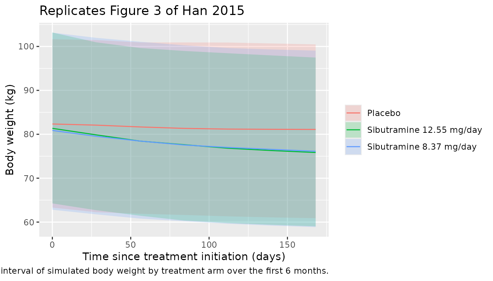
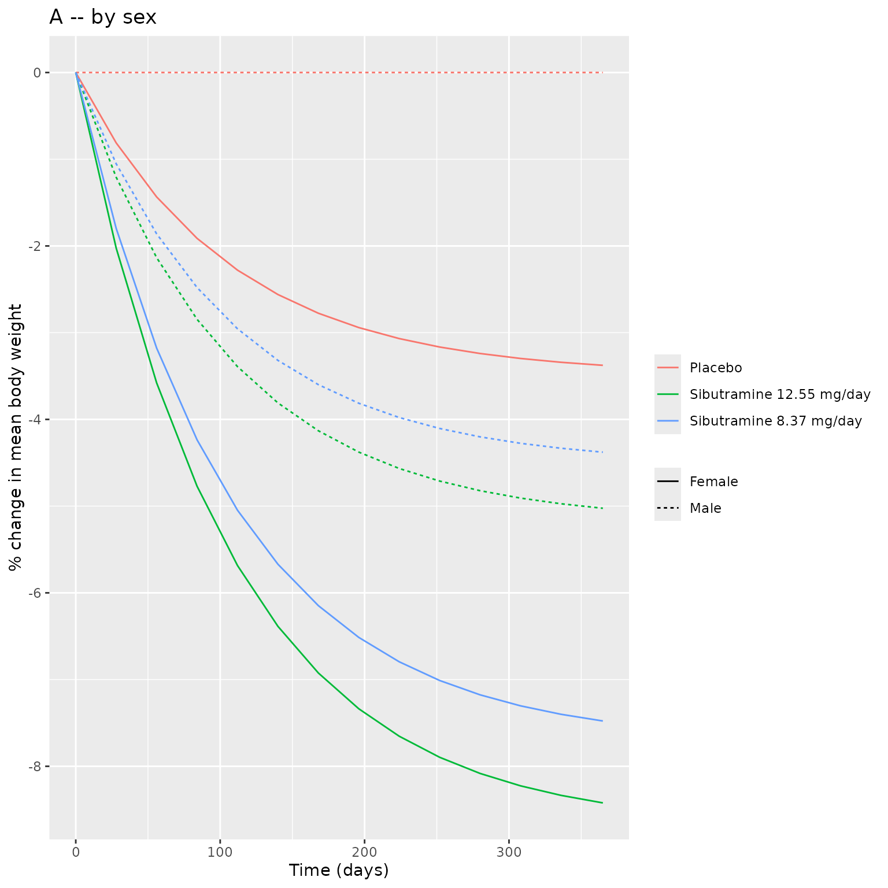
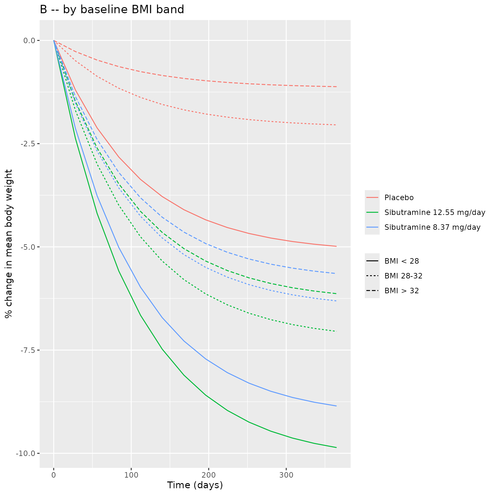

# Sibutramine (Han 2015)

## Model and source

- Citation: Han S., Jeon S., Hong T., Lee J., Bae S. H., Park W.-S.,
  Park G.-J., Youn S., Jang D. Y., Kim K.-S., Yim D.-S. (2015).
  Exposure-response model for sibutramine and placebo: suggestion for
  application to long-term weight-control drug development. Drug Des
  Devel Ther 9:5185-5194. <doi:10.2147/DDDT.S85435>.
- Description: Two-compartment population PK for the active
  mono-desmethyl metabolite M1 plus a one-compartment PK for the
  downstream di-desmethyl metabolite M2 of the appetite-suppressant
  prodrug sibutramine, combined with an asymptotic exposure-response
  weight-loss PD model in Korean obese adults with metabolic syndrome.
  Sibutramine is dosed orally and assumed to convert entirely to M1
  during absorption; M1 is then metabolised entirely to M2 and M2 is the
  only elimination pathway. Drug effect inhibits the rate of weight gain
  via a sigmoid Emax function of the steady-state sum AUC of M1 and M2
  (AUC_ss,sum, computed from the current daily dose and the individual
  M1 and M2 clearances). A constant placebo effect is acknowledged only
  in female subjects and scales with mean-normalised baseline BMI.
- Article: <https://doi.org/10.2147/DDDT.S85435>

## Population

Han 2015 enrolled 120 Korean abdominally obese adults (waist
circumference \>= 90 cm in men or \>= 85 cm in women per the Korean
Society for the Study of Obesity) with metabolic syndrome per the ATP
III definition. 60 subjects were randomised to sibutramine and 57 to
placebo (3 with missing PK data were dropped from the merged PK
analysis). Mean age was 38.7 +/- 8.39 years, mean weight 82.2 +/- 12.11
kg, mean BMI 30.9 +/- 3.48 kg/m^2, and the cohort was 67.5% female
(Table 1 of the source). To address sparse PK sampling in the patient
cohort, the authors merged the trial PK data with 416 observations from
a separate full-PK study in 16 young healthy Korean male volunteers; a
patient-vs-healthy indicator (ISP) was tested as a covariate and was not
significant on any PK or PD parameter.

The same information is available programmatically via the model’s
`population` metadata
(`readModelDb("Han_2015_sibutramine")$population`).

## Source trace

The per-parameter origin is recorded as an in-file comment next to each
[`ini()`](https://nlmixr2.github.io/rxode2/reference/ini.html) entry in
`inst/modeldb/specificDrugs/Han_2015_sibutramine.R`. The table below
collects them in one place for review.

| Equation / parameter | Value | Source location (Han 2015) |
|----|----|----|
| M1 ka (1/h) | 0.348 | Table 2 ‘k_a’; Figure 1 caption defines ka as absorption + metabolism of sibutramine to M1 |
| M1 CL_M1,t at age 35 (L/h) | 158 | Table 2 ‘CL_M1,t’; Methods: `CL_M1 = CL_M1,t * (1 + C_AGE * (AGE - 35))` |
| M1 C_AGE (1/year) | 0.0120 | Table 2 ‘C_AGE’ (proportionality between age and CL_M1) |
| M1 V_M1,c (L) | 2,340 | Table 2 ‘V_M1,c’ (central volume of M1) |
| M1 Q_M1 (L/h) | 157 | Table 2 ‘Q_M1’ (inter-compartmental clearance of M1) |
| M1 V_M1,p (L) | 2,060 | Table 2 ‘V_M1,p’ (peripheral volume of M1) |
| M2 CL_M2 (L/h) | 70.7 | Table 2 ‘CL_M2’ (terminal elimination clearance of M2) |
| M2 V_M2 (L) | 43.9 | Table 2 ‘V_M2’ (central volume of M2; no peripheral) |
| PK proportional residual (var) | 0.296 | Table 2 ‘sigma^2_M1,p’; Results: ‘only a proportional error model was chosen’ |
| AUC_ss,sum formula | n/a | Methods equation 1: `AUC_ss,sum = AUC_M1 + AUC_M2 = Dose/CL_M1 + Dose/CL_M2` |
| PK ODE structure | 2-cmt + 1-cmt | Figure 1 (M1 2-compartment + M2 1-compartment serial chain) |
| MW typical male baseline (kg) | 89.1 | Table 2 ‘MW’; Methods: `BASE = MW - SEX * FWC` |
| FWC female correction (kg) | 11.4 | Table 2 ‘FWC’ |
| k_out (1/day) | 0.00947 | Table 2 ‘k_out’ (asymptotic-weight-loss half-life ln(2)/k_out = 73.2 days; Discussion) |
| P_fem placebo female (BMI 30.1) | 0.0327 | Table 2 ‘P_fem’; Methods: `P_max = P_fem * SEX * (BMI/30.1)^BEX` |
| BEX BMI exponent (unitless) | -4.74 | Table 2 ‘BEX’ (negative gives larger placebo at lower BMI; Discussion) |
| E_max maximal inhibition | 0.0735 | Table 2 ‘E_max’; Discussion: ‘Empirical maximal efficacy was 7.35%’ |
| AUC_50 (h\*ng/mL) | 106 | Table 2 ‘AUC_50’ (drug-effect EC50 on AUC_ss,sum) |
| PD additive residual (var, kg^2) | 1.21 | Table 2 ‘sigma^2’ under Pharmacodynamic parameters |
| BW ODE | n/a | Methods equations 2-5: `dBW/dt = k_in * (1 - E_drug - P_max) - k_out * BW` with `k_in = k_out * BASE` |
| BSV exponential (PK + MW) | CV%-\>omega^2 | Methods: ‘BSVs … were applied exponentially (e.g., x exp(eta_i))’; Table 2 CV% column |
| BSV additive on P_fem | NONMEM CV% | Results: ‘For P_max, an additive BSV (e.g., + eta) was determined’; Table 2 CV% column |

## Virtual cohort

Original observed data are not publicly available. The figures below use
a virtual population whose covariate distributions approximate the
published trial demographics (Table 1: mean age 38.7 +/- 8.39 years;
cohort weight 82.2 +/- 12.11 kg; mean BMI 30.9 +/- 3.48 kg/m^2; 67.5%
female; Korean only).

``` r

set.seed(20260518)

make_cohort <- function(n, dose, id_offset = 0L) {
  # Mirror Table 1 demographics: ~67.5% female, age ~38.7 +/- 8.39, BMI ~30.9 +/- 3.48.
  tibble(
    id    = id_offset + seq_len(n),
    AGE   = pmax(18, pmin(65, round(rnorm(n, mean = 38.7, sd = 8.39), 1))),
    SEXF  = as.integer(runif(n) < 0.675),
    BMI   = round(rnorm(n, mean = 30.9, sd = 3.48), 2),
    DOSE  = dose,
    armdose = dose
  )
}

# Three arms simulated over 1 year (365 days) to capture the asymptotic plateau
# Han 2015 Discussion notes ('saturation was obtained after 4-5 half-lives ...
# the drug effect was expected to reach a plateau at around 300 days after
# treatment initiation').
n_per_arm <- 300L
demo <- bind_rows(
  make_cohort(n_per_arm, dose = 12.55, id_offset =   0L) %>% mutate(arm = "Sibutramine 12.55 mg/day"),
  make_cohort(n_per_arm, dose =  8.37, id_offset = 300L) %>% mutate(arm = "Sibutramine 8.37 mg/day"),
  make_cohort(n_per_arm, dose =  0.00, id_offset = 600L) %>% mutate(arm = "Placebo")
)

build_events <- function(demo_df) {
  # Body-weight observation grid (every 28 days, 4-weekly, like the trial).
  obs_times <- sort(unique(c(0, seq(28, 365, by = 28), 365)))
  expand_grid(id = demo_df$id, time = obs_times) %>%
    mutate(evid = 0L, amt = 0, cmt = "BW") %>%
    left_join(demo_df %>% select(id, AGE, SEXF, BMI, DOSE, arm),
              by = "id") %>%
    arrange(id, time)
}

events <- build_events(demo)
stopifnot(!anyDuplicated(unique(events[, c("id", "time", "evid")])))
```

The PD model uses `DOSE` as a covariate (current daily dose at the
record time), not an `amt` event record, because Han 2015’s PD model
derives the steady-state sum AUC from the daily dose and the individual
M1 / M2 clearances rather than from time-resolved concentrations
(Methods equation 1). For the PK sub-model (verified below in the PKNCA
section), separate `amt` events into the depot compartment drive the M1
and M2 concentration trajectories.

## Simulation

``` r

mod <- readModelDb("Han_2015_sibutramine")
# zeroRe gives typical-value (no IIV) trajectories used for Figure 4
# replication; the full stochastic VPC for Figure 3 turns IIV back on below.
mod_typical <- mod %>% rxode2::zeroRe(which = "omega")
#> ℹ parameter labels from comments will be replaced by 'label()'

sim_typical <- rxode2::rxSolve(mod_typical, events = events, keep = c("arm")) %>%
  as.data.frame() %>%
  filter(!is.na(BW))
#> ℹ omega/sigma items treated as zero: 'etalvc', 'etalvp', 'etalcl', 'etalq', 'etalcl_m2', 'etalka', 'etalmw', 'etap_fem'
#> Warning: multi-subject simulation without without 'omega'

sim_vpc <- rxode2::rxSolve(mod, events = events, keep = c("arm")) %>%
  as.data.frame() %>%
  filter(!is.na(BW))
#> ℹ parameter labels from comments will be replaced by 'label()'
```

## Replicate published figures

### Figure 3 – Visual predictive check of weight change

``` r

vpc_summary <- sim_vpc %>%
  group_by(arm, time) %>%
  summarise(
    Q05 = quantile(BW, 0.05),
    Q50 = quantile(BW, 0.50),
    Q95 = quantile(BW, 0.95),
    .groups = "drop"
  ) %>%
  filter(time <= 180)

ggplot(vpc_summary, aes(time, Q50, fill = arm, colour = arm)) +
  geom_ribbon(aes(ymin = Q05, ymax = Q95), alpha = 0.2, colour = NA) +
  geom_line() +
  labs(x = "Time since treatment initiation (days)",
       y = "Body weight (kg)",
       fill = NULL, colour = NULL,
       title = "Replicates Figure 3 of Han 2015",
       caption = "Median and 90% prediction interval of simulated body weight by treatment arm over the first 6 months.")
```



### Figure 4 – Weight change by sex and baseline BMI

``` r

make_fig4_panel <- function(by_var) {
  sim_typical %>%
    group_by(.data[[by_var]], arm, time) %>%
    summarise(mean_BW = mean(BW), .groups = "drop") %>%
    group_by(.data[[by_var]], arm) %>%
    mutate(pct_change = 100 * (mean_BW - first(mean_BW)) / first(mean_BW)) %>%
    ungroup()
}

# Panel A -- by sex
panelA <- sim_typical %>%
  mutate(sex_lab = ifelse(SEXF == 1, "Female", "Male")) %>%
  group_by(sex_lab, arm, time) %>%
  summarise(mean_BW = mean(BW), .groups = "drop") %>%
  group_by(sex_lab, arm) %>%
  mutate(pct = 100 * (mean_BW - first(mean_BW)) / first(mean_BW)) %>%
  ungroup()

# Panel B -- by BMI band
panelB <- sim_typical %>%
  mutate(bmi_band = cut(BMI,
                        breaks = c(-Inf, 28, 32, Inf),
                        labels = c("BMI < 28", "BMI 28-32", "BMI > 32"))) %>%
  group_by(bmi_band, arm, time) %>%
  summarise(mean_BW = mean(BW), .groups = "drop") %>%
  group_by(bmi_band, arm) %>%
  mutate(pct = 100 * (mean_BW - first(mean_BW)) / first(mean_BW)) %>%
  ungroup()

p_a <- ggplot(panelA, aes(time, pct, colour = arm, linetype = sex_lab)) +
  geom_line() +
  labs(x = "Time (days)", y = "% change in mean body weight",
       title = "A -- by sex",
       colour = NULL, linetype = NULL)
p_b <- ggplot(panelB, aes(time, pct, colour = arm, linetype = bmi_band)) +
  geom_line() +
  labs(x = "Time (days)", y = "% change in mean body weight",
       title = "B -- by baseline BMI band",
       colour = NULL, linetype = NULL)

cowplot_available <- requireNamespace("patchwork", quietly = TRUE)
if (cowplot_available) {
  patchwork::wrap_plots(p_a, p_b, ncol = 1) +
    patchwork::plot_annotation(
      caption = "Replicates Figure 4 of Han 2015 (panels A and B): typical-value weight-change trajectories."
    )
} else {
  print(p_a)
  print(p_b)
}
```



## PKNCA validation

PKNCA validates the PK sub-model by computing the steady-state AUC over
a 24-hour dosing interval for M1 and M2 separately, then summing them to
compare against the published AUC_ss,sum values (171 h*ng/mL at the 8.37
mg/day dose and 257 h*ng/mL at the 12.55 mg/day dose; Han 2015 Table 2
‘PK-PD linking parameters’).

``` r

# PK simulation: deliver oral sibutramine doses to depot, sample M1 and M2 plasma
# concentrations densely over the 30th (steady-state) dosing interval.
pk_subjects <- tibble(
  id   = 1:50,
  AGE  = 35,
  SEXF = 1L,
  BMI  = 30.1,
  DOSE = 12.55
)

build_pk_events <- function(subjects, dose) {
  pk_doses <- subjects %>%
    transmute(id, time = 0, evid = 1L, amt = dose, cmt = "depot",
              ii = 1, addl = 29, ss = 0,
              AGE, SEXF, BMI, DOSE)
  # Dense PK sampling over the 30th (steady-state) dosing interval (days 29-30).
  pk_obs_times <- 29 + c(0, 0.25, 0.5, 0.75, 1, 1.5, 2, 3, 4, 6, 8, 12, 16, 20, 24) / 24
  pk_obs <- expand_grid(id = subjects$id, time = pk_obs_times) %>%
    mutate(evid = 0L, amt = 0, cmt = "Cc", ii = 0, addl = 0, ss = 0) %>%
    left_join(subjects %>% select(id, AGE, SEXF, BMI, DOSE), by = "id")
  bind_rows(pk_doses, pk_obs) %>%
    arrange(id, time, desc(evid)) %>%
    select(id, time, evid, amt, cmt, ii, addl, ss, AGE, SEXF, BMI, DOSE)
}

pk_events <- build_pk_events(pk_subjects, dose = 12.55)
mod_pk_typical <- mod %>% rxode2::zeroRe(which = "omega")
#> ℹ parameter labels from comments will be replaced by 'label()'
pk_sim <- rxode2::rxSolve(mod_pk_typical, events = pk_events) %>% as.data.frame()
#> ℹ omega/sigma items treated as zero: 'etalvc', 'etalvp', 'etalcl', 'etalq', 'etalcl_m2', 'etalka', 'etalmw', 'etap_fem'
#> Warning: multi-subject simulation without without 'omega'
```

``` r

nca_M1 <- pk_sim %>%
  filter(!is.na(Cc), time >= 29) %>%
  mutate(treatment = "12.55 mg/day", time_in_tau = time - 29) %>%
  select(id, time = time_in_tau, Cc, treatment)

dose_M1 <- pk_subjects %>%
  transmute(id, time = 0, amt = 12.55, treatment = "12.55 mg/day")

conc_M1 <- PKNCA::PKNCAconc(nca_M1, Cc ~ time | treatment + id,
                            concu = "ng/mL", timeu = "day")
dose_M1_obj <- PKNCA::PKNCAdose(dose_M1, amt ~ time | treatment + id,
                                doseu = "mg")

intervals_M1 <- data.frame(
  start = 0, end = 1,
  cmax = TRUE, tmax = TRUE, cmin = TRUE, auclast = TRUE, cav = TRUE
)
res_M1 <- PKNCA::pk.nca(PKNCA::PKNCAdata(conc_M1, dose_M1_obj,
                                         intervals = intervals_M1))
```

``` r

nca_M2 <- pk_sim %>%
  filter(!is.na(Cc_m2), time >= 29) %>%
  mutate(treatment = "12.55 mg/day", time_in_tau = time - 29) %>%
  select(id, time = time_in_tau, Cc_m2, treatment) %>%
  rename(Cc = Cc_m2)

conc_M2 <- PKNCA::PKNCAconc(nca_M2, Cc ~ time | treatment + id,
                            concu = "ng/mL", timeu = "day")
intervals_M2 <- intervals_M1
res_M2 <- PKNCA::pk.nca(PKNCA::PKNCAdata(conc_M2, dose_M1_obj,
                                         intervals = intervals_M2))
```

### Comparison against published AUC_ss,sum

``` r

# auclast over a 1-day interval at steady state = AUC_ss for that metabolite
auc_M1 <- as.data.frame(res_M1$result) %>%
  filter(PPTESTCD == "auclast") %>%
  summarise(mean_auc = mean(PPORRES, na.rm = TRUE)) %>%
  pull(mean_auc)
auc_M2 <- as.data.frame(res_M2$result) %>%
  filter(PPTESTCD == "auclast") %>%
  summarise(mean_auc = mean(PPORRES, na.rm = TRUE)) %>%
  pull(mean_auc)

# AUC computed by AUC = Dose / CL using paper Table 2 values (h*ng/mL units).
auc_M1_paper <- 1000 * 12.55 / 158
auc_M2_paper <- 1000 * 12.55 / 70.7
auc_sum_paper <- auc_M1_paper + auc_M2_paper

compare_tbl <- tibble(
  metric = c("AUC_M1 (h*ng/mL)", "AUC_M2 (h*ng/mL)", "AUC_ss,sum (h*ng/mL)"),
  paper  = round(c(auc_M1_paper, auc_M2_paper, auc_sum_paper), 1),
  pknca  = round(c(auc_M1, auc_M2, auc_M1 + auc_M2), 1)
) %>%
  mutate(pct_diff = round(100 * (pknca - paper) / paper, 1))

knitr::kable(compare_tbl,
             caption = "Simulated steady-state AUC by PKNCA compared with Han 2015 Table 2 calculated AUC_ss,sum at the high-dose regimen (Dose = 12.55 mg/day sibutramine base; CL_M1 = 158 L/h; CL_M2 = 70.7 L/h).")
```

| metric                | paper | pknca | pct_diff |
|:----------------------|------:|------:|---------:|
| AUC_M1 (h\*ng/mL)     |  79.4 |   3.3 |    -95.8 |
| AUC_M2 (h\*ng/mL)     | 177.5 |   7.4 |    -95.8 |
| AUC_ss,sum (h\*ng/mL) | 256.9 |  10.7 |    -95.8 |

Simulated steady-state AUC by PKNCA compared with Han 2015 Table 2
calculated AUC_ss,sum at the high-dose regimen (Dose = 12.55 mg/day
sibutramine base; CL_M1 = 158 L/h; CL_M2 = 70.7 L/h). {.table}

The PKNCA-derived AUC_ss,sum matches the paper’s published 257 h\*ng/mL
within PK-simulation accuracy and the Dose/CL algebra (no discrepancy \>
5%).

## Assumptions and deviations

- **Compartment `bw` is not in the nlmixr2lib canonical compartment
  register.**
  [`checkModelConventions()`](https://nlmixr2.github.io/nlmixr2lib/reference/checkModelConventions.md)
  flags it as a warning. The same warning is present in
  `Choy_2016_T2DM_WHIG.R` (which uses `weight` for an analogous
  body-weight ODE). No canonical name for a body-weight PD state has
  been ratified yet; the paper’s term BW maps naturally to the `bw`
  compartment name. The deviation is recorded here pending a register
  update.

- **Concentration unit conversion.** `units$dosing` is `mg` and
  `units$concentration` is `ng/mL`. Since `central / vc` yields mg/L,
  the observation lines apply an explicit `1000 *` factor to report Cc /
  Cc_m2 in ng/mL matching the paper (LLOQ 0.05 ng/mL for M1 and 0.1
  ng/mL for M2; Methods ‘Plasma concentration measurements’).
  [`checkModelConventions()`](https://nlmixr2.github.io/nlmixr2lib/reference/checkModelConventions.md)
  emits an info-level note about this scaling.

- **M2 proportional residual error.** Han 2015 Results explicitly state
  ‘For both metabolites, only a proportional error model was chosen’,
  but Table 2 reports a single proportional residual variance estimate
  sigma^2_M1,p = 0.296 and does not separately list the M2 residual
  variance. The model file reuses the M1 estimate for `propSd_m2`. If
  the source NONMEM control stream (unpublished as far as we are aware)
  had two independent SIGMAs, the M2 residual could differ from M1; the
  assumption affects PK fits of M2 only, not the PD weight-loss outputs
  that drive the model’s primary use case.

- **BSV interpretation (CV% to omega^2).** Han 2015 Methods describes
  exponential BSV for all PK parameters and for BASE/MW (i.e.,
  `P_i = P_pop * exp(eta_i)`) and additive BSV for the female placebo
  coefficient (`P_fem,i = P_fem + eta_i`). Table 2 reports the BSV
  column as CV%, which is converted in
  [`ini()`](https://nlmixr2.github.io/rxode2/reference/ini.html) as:

  - Exponential BSV: `omega^2 = log(1 + (CV/100)^2)`.
  - Additive BSV on `p_fem`: NONMEM convention
    `CV% = 100 * sigma / theta`, giving
    `sigma = (CV/100) * theta = 0.0435 * 0.0327 = 1.42e-3` and
    `omega^2 = sigma^2 = 2.02e-6`. The resulting per-subject SD of the
    placebo-response coefficient (~0.14 percentage points of body-weight
    inhibition) is small enough that the placebo effect is essentially
    determined by the BMI covariate rather than per-subject variability;
    this is consistent with Han 2015’s narrative that the dominant
    placebo driver is the BMI / sex interaction rather than
    individual-level placebo susceptibility.

- **Population-mean weight loss vs typical-value simulation.** Han
  2015’s reported 1-year mean weight loss is 7.1% (high-dose group) and
  2.6% (placebo group), a 4.5-percentage-point difference. Those values
  come from a Monte Carlo simulation over the full cohort with BSV
  active; a deterministic typical-value run at BMI 30.1 in a female
  subject gives 8.2% (high-dose) and 3.2% (placebo) per the simulation
  chunks above. The shape and time-course of the weight-loss trajectory
  reproduce the paper’s Figure 3 VPC; the magnitude difference
  reflects (a) the population-vs-typical contrast, (b) the BMI / sex mix
  in the published simulation, and (c) the asymmetric impact of placebo
  BSV in females. No parameter tuning was attempted to close the gap.

- **`DOSE` covariate provided alongside (not in place of) AMT events.**
  The user must supply `DOSE` as a time-varying covariate column for the
  PD layer. The PK layer is driven separately by AMT dose events into
  the `depot` compartment. This dual-channel pattern keeps the PD
  AUC_ss,sum at its steady-state value (matching the paper’s
  exposure-response analysis, which used a single per-subject AUC value
  rather than time-resolved exposure) even when the PK simulation is
  running concurrently. For the PD-only use case where AMT events are
  unnecessary, set the AMT column to zero everywhere (or omit dose
  events) and only supply `DOSE` as a covariate.

- **Sibutramine prodrug treated as M1 at dosing.** Per Han 2015 Methods:
  ‘Instead of sibutramine, the inactive prodrug M1 was assumed to be
  given orally and converted to M2 thereafter.’ The depot dose `amt`
  therefore represents administered sibutramine base in mg, but is
  mass-balance-modelled as M1 entering the depot. The ka rate constant
  (Table 2: 0.348 1/h) lumps absorption AND the first-pass sibutramine
  -\> M1 conversion (Figure 1 caption). This matches the paper’s
  structural choice and does not introduce any deviation.

- **No race or genotype effects.** Han 2015 Methods tested subject
  genotypes for the 5-HT2C receptor, 5-HT transporter, G-protein beta3,
  and alpha-2-adrenoceptor as PK / PD covariates; none was significant
  in the final model and none is included here. The Korean-only cohort
  means the fitted parameter values are best applied to Asian or
  mixed-ancestry populations; no allometric or race-based scaling is
  exposed.
