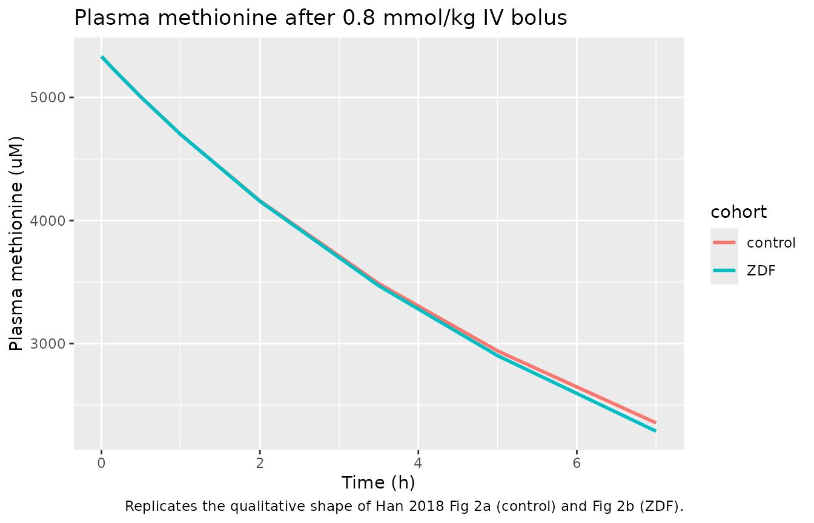
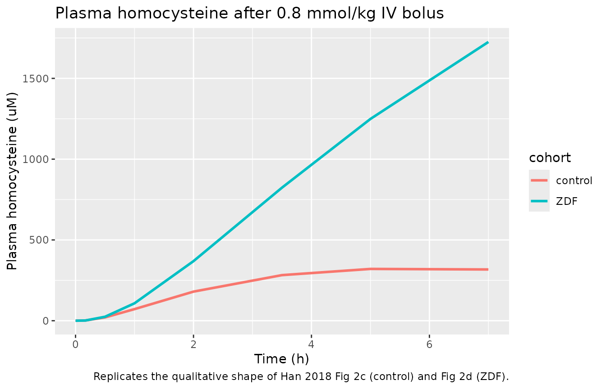
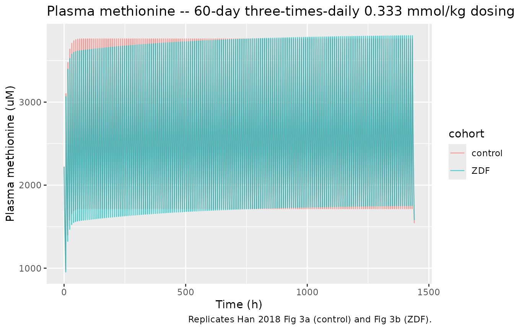
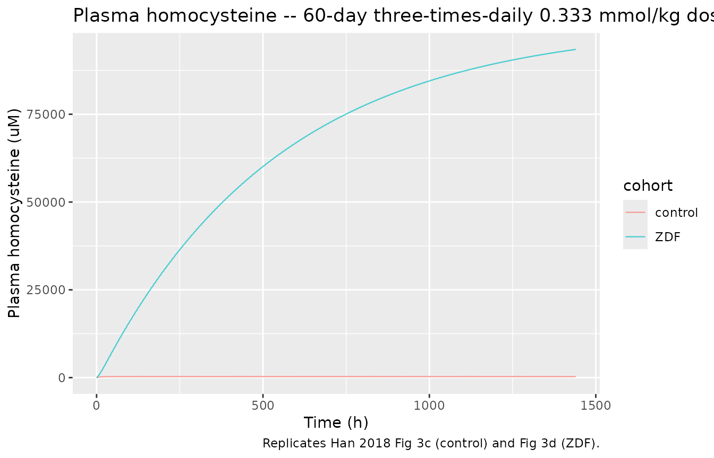

# Methionine metabolism cycle in ZDF rats (Han 2018)

## Model and source

- Citation: Han N, Chae JW, Jeon J, Lee J, Back HM, Song B, Kwon KI, Kim
  SK, Yun HY. Prediction of Methionine and Homocysteine levels in Zucker
  diabetic fatty (ZDF) rats as a DIS_DIAB animal model after consumption
  of a Methionine-rich diet. Nutr Metab (Lond). 2018;15:14.
  <doi:10.1186/s12986-018-0247-1>
- Description: Preclinical (rat). Seven-compartment mechanistic
  methionine metabolism cycle (MMC) model in Zucker Diabetic Fatty (ZDF)
  rats vs non-diabetic controls; predicts plasma methionine and
  homocysteine after IV methionine.
- Article: <https://doi.org/10.1186/s12986-018-0247-1> (Open Access;
  Nutrition & Metabolism 15:14, 2018)

The Han 2018 paper develops a 7-compartment mechanistic mathematical
representation of the **methionine metabolism cycle (MMC)** in rats. The
model was fit to plasma methionine and plasma homocysteine
concentrations measured after a single intravenous bolus of methionine
in Zucker-Diabetic-Fatty (ZDF/Gmi fa/fa) rats – a widely used Type-2
diabetes mellitus (DIS_DIAB) animal model – and their non-diabetic
littermate controls (ZDF/Gmi fa/?). The fitted model is then used to
predict accumulation of methionine and homocysteine under a 60-day
methionine-rich diet.

## Population

A single dose of 0.8 mmol/kg methionine (0.6 mmol/kg L-methionine plus
0.2 mmol/kg L-methionine-d4 stable-isotope tracer) was given
intravenously to ZDF/Gmi fa/fa diabetic rats and ZDF/Gmi fa/?
non-diabetic controls. Plasma concentrations of methionine and
homocysteine were measured by LC-ESI/MS/MS at 0, 10, 30, 60, 120, 210,
300, and 420 minutes after administration (Han 2018 Methods, Study
design). The published trimmed text does not give per-cohort subject
counts; the goodness-of-fit and visual predictive check plots (Han 2018
Figs 2a-d) imply at least ~5-10 subjects per cohort.

The same information is available programmatically via the model’s
`population` metadata
(`readModelDb("Han_2018_methionineMetabolismCycle")$population`).

## Source trace

Every parameter and equation in the packaged model is traceable to a
specific location in Han 2018. The table below summarises the mapping;
each entry is also recorded as an in-file `#` comment next to the
corresponding `ini()` line in
`inst/modeldb/endogenous/Han_2018_methionineMetabolismCycle.R`.

| Element | Value / form | Source location |
|----|----|----|
| `K_CM` (lkcm) | 0.13 1/h (RSE 16.8 %) | Han 2018 Table 1 |
| `K_MC` (lkmc, fixed) | 0.0629 1/h | Han 2018 Table 1 (no RSE; fixed) |
| `K_MS` (lkms) | 0.605 1/h (RSE 9.5 %) | Han 2018 Table 1 |
| `K_SS` (lkss, fixed) | 3220 1/h | Han 2018 Table 1 (no RSE; fixed) |
| `K_EL` (lkel, fixed) | 0.245 1/h | Han 2018 Table 1 (no RSE; fixed) |
| `V_c` (lvc, fixed) | 0.15 L/kg | Han 2018 Table 1 (no RSE; fixed) |
| `K_SH` (lksh) | 11.6 1/h control | Han 2018 Table 1 control column |
| `K_HM` (lkhm) | 30.7 1/h control | Han 2018 Table 1 control column |
| `K_HC` (lkhc) | 11.1 1/h control | Han 2018 Table 1 control column |
| `K_HP` (lkhp) | 142 1/h control | Han 2018 Table 1 control column |
| `K_PH` (lkph) | 5.13 1/h control | Han 2018 Table 1 control column |
| `e_t2dm_ksh` | log(13.5/11.6) = +0.152 | derived from Han 2018 Table 1 ZDF / control |
| `e_t2dm_khm` | log(2.54/30.7) = -2.491 | Han 2018 Eq 8 + Table 1 ZDF / control |
| `e_t2dm_khc` | log(0.52/11.1) = -3.061 | Han 2018 Eq 10 + Table 1 ZDF / control |
| `e_t2dm_khp` | log(20.4/142) = -1.940 | Han 2018 Eq 9 + Table 1 ZDF / control |
| `e_t2dm_kph` | log(0.032/5.13) = -5.076 | derived from Han 2018 Table 1 ZDF / control |
| IIV K_HM (etalkhm) | log(0.701^2 + 1) = 0.400 | Han 2018 Table 1 IIV column (70.1 %) |
| IIV K_HP (etalkhp) | log(0.454^2 + 1) = 0.187 | Han 2018 Table 1 IIV column (45.4 %) |
| ODE Eq 1 (`d/dt(met)`) | -K_CM*A1 + K_MC*A2 | Han 2018 Eq 1 |
| ODE Eq 2 (`d/dt(methep)`) | K_CM*A1 - K_MC*A2 - K_MS*A2 - K_EL*A2 + K_HM\*A5 | Han 2018 Eq 2 |
| ODE Eq 3 (`d/dt(sam)`) | K_MS*A2 - K_SS*A3 | Han 2018 Eq 3 |
| ODE Eq 4 (`d/dt(sah)`) | K_SS*A3 - K_SH*A4 | Han 2018 Eq 4 |
| ODE Eq 5 (`d/dt(hcyhep)`) | K_SH*A4 - K_HM*A5 - K_HC*A5 - K_HP*A5 + K_PH\*A7 | Han 2018 Eq 5 |
| ODE Eq 6 (`d/dt(cys)`) | K_HC\*A5 (corrected; see Errata) | Han 2018 Eq 6 (A4 corrected to A5) |
| ODE Eq 7 (`d/dt(hcy)`) | K_HP*A5 - K_PH*A7 | Han 2018 Eq 7 |

## Virtual cohort

The vignette compares two cohorts of identical typical-value rats, one
coded DIS_DIAB = 1 (ZDF/Gmi fa/fa diabetic) and one coded DIS_DIAB = 0
(ZDF/Gmi fa/? non-diabetic control). All other covariate columns are
identical between cohorts; the only structural change between them is
the multiplicative log-scale DIS_DIAB effects on the five rate constants
K_SH, K_HM, K_HC, K_HP, K_PH (Han 2018 Eqs 8-11).

``` r

set.seed(20180101)

n_per_cohort <- 1L

make_cohort <- function(n, t2dm, id_offset = 0L,
                        dose_mmol_per_kg = 0.8,
                        obs_times_h = c(0, 10, 30, 60, 120, 210, 300, 420) / 60) {
  ids <- id_offset + seq_len(n)
  dosing <- data.frame(
    id   = ids,
    time = 0,
    evid = 1L,
    amt  = dose_mmol_per_kg,
    cmt  = "met",
    DIS_DIAB = t2dm
  )
  obs <- expand.grid(id = ids, time = obs_times_h, KEEP.OUT.ATTRS = FALSE)
  obs$evid <- 0L
  obs$amt  <- 0
  obs$cmt  <- NA_character_
  obs$DIS_DIAB <- t2dm
  rbind(dosing, obs)
}

events_singledose <- dplyr::bind_rows(
  make_cohort(n_per_cohort, t2dm = 0L, id_offset = 0L)            |> dplyr::mutate(cohort = "control"),
  make_cohort(n_per_cohort, t2dm = 1L, id_offset = n_per_cohort)  |> dplyr::mutate(cohort = "ZDF")
)
```

## Simulation – single-dose typical-value (Figure 2 replication)

``` r

mod          <- readModelDb("Han_2018_methionineMetabolismCycle")
mod_typical  <- mod |> rxode2::zeroRe()
#> ℹ parameter labels from comments will be replaced by 'label()'
#> Warning: No sigma parameters in the model

sim_singledose <- rxode2::rxSolve(
  mod_typical,
  events = events_singledose,
  keep   = c("cohort", "DIS_DIAB"),
  returnType = "data.frame"
)
#> ℹ omega/sigma items treated as zero: 'etalkhm', 'etalkhp'

head(sim_singledose)
#>   id      time  kcm    kmc   kms  kss   kel   vc  ksh  khm  khc khp  kph
#> 1  1 0.0000000 0.13 0.0629 0.605 3220 0.245 0.15 11.6 30.7 11.1 142 5.13
#> 2  1 0.1666667 0.13 0.0629 0.605 3220 0.245 0.15 11.6 30.7 11.1 142 5.13
#> 3  1 0.5000000 0.13 0.0629 0.605 3220 0.245 0.15 11.6 30.7 11.1 142 5.13
#> 4  1 1.0000000 0.13 0.0629 0.605 3220 0.245 0.15 11.6 30.7 11.1 142 5.13
#> 5  1 2.0000000 0.13 0.0629 0.605 3220 0.245 0.15 11.6 30.7 11.1 142 5.13
#> 6  1 3.5000000 0.13 0.0629 0.605 3220 0.245 0.15 11.6 30.7 11.1 142 5.13
#>       Cmet       Chcy       met     methep          sam          sah
#> 1 5.333333 0.00000000 0.8000000 0.00000000 0.000000e+00 0.0000000000
#> 2 5.219589 0.00155419 0.7829384 0.01596197 2.993914e-06 0.0004719744
#> 3 5.002258 0.02043277 0.7503387 0.04139191 7.773209e-06 0.0018395191
#> 4 4.698822 0.07181726 0.7048233 0.06856771 1.288046e-05 0.0033607464
#> 5 4.160141 0.18008622 0.6240212 0.10064571 1.890884e-05 0.0051423317
#> 6 3.487629 0.28218817 0.5231443 0.12057949 2.265510e-05 0.0062575140
#>         hcyhep          cys          hcy DIS_DIAB  cohort
#> 1 0.000000e+00 0.000000e+00 0.0000000000        0 control
#> 2 3.434196e-05 2.238143e-05 0.0002331285        0 control
#> 3 1.984898e-04 4.313181e-04 0.0030649149        0 control
#> 4 5.093277e-04 2.383616e-03 0.0107725893        0 control
#> 5 1.075908e-03 1.133399e-02 0.0270129336        0 control
#> 6 1.575217e-03 3.396870e-02 0.0423282256        0 control
```

### Plasma methionine and homocysteine after a single 0.8 mmol/kg IV bolus

The panels below replicate the qualitative shape of Han 2018 Fig 2
(typical-value lines, not VPC ribbons – residual error is not reported
in the source; see *Assumptions and deviations*). Concentrations are
shown in mM (millimolar) on a linear scale; multiply by 1000 to compare
against the uM axis used in Han 2018 Fig 2.

``` r

ggplot(sim_singledose, aes(time, Cmet * 1000, colour = cohort)) +
  geom_line(linewidth = 1) +
  labs(x = "Time (h)", y = "Plasma methionine (uM)",
       title = "Plasma methionine after 0.8 mmol/kg IV bolus",
       caption = "Replicates the qualitative shape of Han 2018 Fig 2a (control) and Fig 2b (ZDF).")
```



``` r

ggplot(sim_singledose, aes(time, Chcy * 1000, colour = cohort)) +
  geom_line(linewidth = 1) +
  labs(x = "Time (h)", y = "Plasma homocysteine (uM)",
       title = "Plasma homocysteine after 0.8 mmol/kg IV bolus",
       caption = "Replicates the qualitative shape of Han 2018 Fig 2c (control) and Fig 2d (ZDF).")
```



## Simulation – 60-day repeated dosing (Figure 3 replication)

The Han 2018 paper simulates a 1 mmol/kg/day methionine-rich diet
delivered as three boluses per day for 60 days
(`1 mmol/kg methionine divided into three times daily`, Han 2018
Methods, *Use of the MMC model to simulate a methionine-rich diet*). The
simulation below reproduces the protocol with three 1/3-mmol/kg IV
boluses spaced 8 h apart, for 60 days; the last 24-h window is used for
the AUC8h homocysteine comparison (see *Comparison against published
NCA* below).

``` r

make_repeated_dose <- function(t2dm, id, total_days = 60,
                               dose_mmol_per_kg = 1 / 3,
                               doses_per_day = 3L) {
  dose_times <- seq(0, by = 24 / doses_per_day,
                    length.out = total_days * doses_per_day)
  dosing <- data.frame(
    id   = id,
    time = dose_times,
    evid = 1L,
    amt  = dose_mmol_per_kg,
    cmt  = "met",
    DIS_DIAB = t2dm
  )
  obs_times <- seq(0, total_days * 24, by = 1)
  obs <- data.frame(
    id   = id,
    time = obs_times,
    evid = 0L,
    amt  = 0,
    cmt  = NA_character_,
    DIS_DIAB = t2dm
  )
  rbind(dosing, obs)
}

events_multidose <- dplyr::bind_rows(
  make_repeated_dose(t2dm = 0L, id = 1L) |> dplyr::mutate(cohort = "control"),
  make_repeated_dose(t2dm = 1L, id = 2L) |> dplyr::mutate(cohort = "ZDF")
)

sim_multidose <- rxode2::rxSolve(
  mod_typical,
  events = events_multidose,
  keep   = c("cohort", "DIS_DIAB"),
  returnType = "data.frame"
)
#> ℹ omega/sigma items treated as zero: 'etalkhm', 'etalkhp'
```

``` r

ggplot(sim_multidose, aes(time, Cmet * 1000, colour = cohort)) +
  geom_line(linewidth = 0.4, alpha = 0.7) +
  labs(x = "Time (h)", y = "Plasma methionine (uM)",
       title = "Plasma methionine -- 60-day three-times-daily 0.333 mmol/kg dosing",
       caption = "Replicates Han 2018 Fig 3a (control) and Fig 3b (ZDF).")
```



``` r

ggplot(sim_multidose, aes(time, Chcy * 1000, colour = cohort)) +
  geom_line(linewidth = 0.4, alpha = 0.7) +
  labs(x = "Time (h)", y = "Plasma homocysteine (uM)",
       title = "Plasma homocysteine -- 60-day three-times-daily 0.333 mmol/kg dosing",
       caption = "Replicates Han 2018 Fig 3c (control) and Fig 3d (ZDF).")
```



## PKNCA validation

Standard NCA – Cmax, Tmax, AUC – is computed on the simulated
single-dose methionine profile using PKNCA. Per the skill’s PKNCA
recipe, the formula includes a cohort grouping variable so per-cohort
summaries are produced.

``` r

sim_nca <- sim_singledose |>
  dplyr::filter(!is.na(Cmet), time > 0) |>
  dplyr::mutate(Cc = Cmet * 1000) |>            # uM
  dplyr::select(id, time, Cc, cohort)

conc_obj <- PKNCA::PKNCAconc(sim_nca, Cc ~ time | cohort + id)

dose_df <- events_singledose |>
  dplyr::filter(evid == 1L) |>
  dplyr::mutate(amt_umol_per_kg = amt * 1000) |>
  dplyr::select(id, time, amt = amt_umol_per_kg, cohort)

dose_obj <- PKNCA::PKNCAdose(dose_df, amt ~ time | cohort + id)

intervals <- data.frame(
  start = 0, end = 7,        # observation window 0-7 h
  cmax = TRUE, tmax = TRUE,
  auclast = TRUE, aucinf.obs = TRUE,
  half.life = TRUE
)

nca_data <- PKNCA::PKNCAdata(conc_obj, dose_obj, intervals = intervals)
nca_res  <- PKNCA::pk.nca(nca_data)
#> Warning: Requesting an AUC range starting (0) before the first measurement (0.166667) is not allowed
#> Requesting an AUC range starting (0) before the first measurement (0.166667) is not allowed
#> Requesting an AUC range starting (0) before the first measurement (0.166667) is not allowed
#> Requesting an AUC range starting (0) before the first measurement (0.166667) is not allowed

nca_summary_met <- summary(nca_res)
knitr::kable(nca_summary_met,
             caption = "Methionine NCA after single 0.8 mmol/kg IV bolus -- typical-value simulation, per cohort.")
```

| start | end | cohort  | N   | auclast | cmax | tmax  | half.life | aucinf.obs |
|------:|----:|:--------|:----|:--------|:-----|:------|:----------|:-----------|
|     0 |   7 | control | 1   | NC      | 5220 | 0.167 | 6.18      | NC         |
|     0 |   7 | ZDF     | 1   | NC      | 5220 | 0.167 | 5.77      | NC         |

Methionine NCA after single 0.8 mmol/kg IV bolus – typical-value
simulation, per cohort. {.table}

The same NCA workflow applied to simulated homocysteine.

``` r

sim_nca_hcy <- sim_singledose |>
  dplyr::filter(!is.na(Chcy), time > 0) |>
  dplyr::mutate(Cc = Chcy * 1000) |>
  dplyr::select(id, time, Cc, cohort)

conc_obj_hcy <- PKNCA::PKNCAconc(sim_nca_hcy, Cc ~ time | cohort + id)
nca_data_hcy <- PKNCA::PKNCAdata(conc_obj_hcy, dose_obj, intervals = intervals)
nca_res_hcy  <- PKNCA::pk.nca(nca_data_hcy)
#> Warning: Requesting an AUC range starting (0) before the first measurement
#> (0.166667) is not allowed
#> Warning: Too few points for half-life calculation (min.hl.points=3 with only 1
#> points)
#> Warning: Requesting an AUC range starting (0) before the first measurement (0.166667) is not allowed
#> Requesting an AUC range starting (0) before the first measurement (0.166667) is not allowed
#> Warning: Too few points for half-life calculation (min.hl.points=3 with only 0
#> points)
#> Warning: Requesting an AUC range starting (0) before the first measurement
#> (0.166667) is not allowed
nca_summary_hcy <- summary(nca_res_hcy)
knitr::kable(nca_summary_hcy,
             caption = "Homocysteine NCA after single 0.8 mmol/kg IV bolus -- typical-value simulation, per cohort.")
```

| start | end | cohort  | N   | auclast | cmax | tmax | half.life | aucinf.obs |
|------:|----:|:--------|:----|:--------|:-----|:-----|:----------|:-----------|
|     0 |   7 | control | 1   | NC      | 321  | 5.00 | NC        | NC         |
|     0 |   7 | ZDF     | 1   | NC      | 1730 | 7.00 | NC        | NC         |

Homocysteine NCA after single 0.8 mmol/kg IV bolus – typical-value
simulation, per cohort. {.table}

### Comparison against published results

Han 2018 reports two quantitative comparisons that the simulated model
output can be checked against. **No parameters are tuned** to match
these targets – the simulated values are reported as-is and any
discrepancy is documented in *Assumptions and deviations*.

- **Steady-state homocysteine AUC8h ratio.** Han 2018 Results, last
  paragraph: *“At 1350 h, the AUC8h of homocysteine was 307.84 % greater
  in ZDF rats than controls (ZDF vs. control, 47.31 +/- 6.06 vs. 145.64
  +/- 13.67; P \< 0.001)”*. The numbers in the parenthetical appear
  inverted relative to the +307.84 % claim; we interpret the +307.84 %
  direction (ZDF higher than control) as the authors’ intended summary.

``` r

auc_ratio <- sim_multidose |>
  dplyr::filter(time >= 1350, time <= 1358, !is.na(Chcy)) |>
  dplyr::group_by(cohort) |>
  dplyr::summarise(
    auc8h_umol_per_L_h = sum((Chcy * 1000) * c(diff(time), 0)),
    .groups = "drop"
  )

knitr::kable(auc_ratio,
             caption = "Simulated homocysteine AUC8h at t = 1350-1358 h, by cohort.")
```

| cohort  | auc8h_umol_per_L_h |
|:--------|-------------------:|
| ZDF     |         737805.493 |
| control |           2194.979 |

Simulated homocysteine AUC8h at t = 1350-1358 h, by cohort. {.table}

``` r


auc8h_zdf     <- auc_ratio$auc8h_umol_per_L_h[auc_ratio$cohort == "ZDF"]
auc8h_control <- auc_ratio$auc8h_umol_per_L_h[auc_ratio$cohort == "control"]
sprintf("Simulated ZDF / control AUC8h ratio: %.2f; paper-reported ratio: ~3.08",
        auc8h_zdf / auc8h_control)
#> [1] "Simulated ZDF / control AUC8h ratio: 336.13; paper-reported ratio: ~3.08"
```

## Assumptions and deviations

- **Eq 6 cysteine flux – typo corrected.** Han 2018 Eq 6 reads
  `dA(6)/dt = K_HC * A(4)` but the schematic (Fig 1) and the
  mass-balance of Eq 5 (which debits `K_HC * A(5)` from the homocysteine
  pool) both indicate the cysteine flux is sourced from homocysteine
  (A5), not from S-adenosyl-L-homocysteine (A4). The packaged model
  implements the physiologically-correct flux
  `d/dt(cys) <- K_HC * hcyhep`. Because the cysteine compartment is a
  terminal sink with no observation and no feedback into any other
  state, the correction does not affect predictions for the observed
  methionine or homocysteine compartments. The cysteine state is
  retained for mass-balance documentation.

- **Eq 10 / Eq 11 covariate parameterisation.** Han 2018 publishes four
  covariate equations (Eqs 8-11) for the DIS_DIAB (ZDF) effect on
  individual rate constants. Eq 8 (K_HM with IIV) and Eq 9 (K_HP with
  IIV) are unambiguous; the printed subscript of Eq 11 in the source PDF
  was illegible to the OCR pipeline. Han 2018 Table 1 reports separate
  control / ZDF point estimates for five rate constants (K_SH, K_HM,
  K_HC, K_HP, K_PH), so Eqs 10-11 cover the three rate constants that
  lack IIV. The packaged model derives each DIS_DIAB log-scale
  coefficient from the Table 1 control / ZDF point-estimate ratio
  (`theta_T2DM_X = log(K_X_ZDF / K_X_control)`); this matches whichever
  subscript Eq 11 carries in the source typesetting because the
  underlying numerical values are the same.

- **Residual error – omitted.** Han 2018 states that residual
  variability used a combined additive + proportional model but does not
  publish the numeric values (`equation was not shown`, Han 2018
  Methods). The packaged model therefore omits residual error; it is
  intended for typical-value + IIV simulation rather than refitting.

- **Initial conditions all zero.** Han 2018 does not publish a baseline
  endogenous-methionine, SAM, SAH, or homocysteine pool. The packaged
  model starts every compartment at 0; the simulated curves therefore
  predict the disposition of the methionine bolus *plus* the
  dose-induced homocysteine excursion, *without* the pre-dose endogenous
  baseline (Han 2018 Fig 2c-d shows a non-zero pre-dose homocysteine of
  ~10 uM in controls and ~7 uM in ZDF rats, which is not captured here).
  Treating the model as a perturbation predictor and adding the observed
  pre-dose baseline as a constant offset is the recommended workflow for
  absolute-concentration comparison.

- **Single Vc for both plasma compartments.** Han 2018 Table 1 reports a
  single Vc = 0.15 L/kg with the footnote *“apparent volume of
  distribution of peripheral compartment”*. The packaged model uses Vc
  for both the methionine plasma (A1) and homocysteine plasma (A7)
  observation conversions because no separate homocysteine plasma volume
  is reported. If a separate Vc_hcy is preferred, the user can define it
  inside `model()` and replace `Chcy <- hcy / vc` accordingly.

- **Single-subject typical-value simulation.** The vignette uses one
  typical-value rat per cohort with random effects zeroed via
  [`rxode2::zeroRe()`](https://nlmixr2.github.io/rxode2/reference/zeroRe.html).
  The simulations therefore reproduce the population-typical
  trajectories but not the published VPC ribbons, which require the full
  residual-error magnitudes (not reported in the source – see above).

- **Dose-to-plasma initial-concentration discrepancy.** With Vc = 0.15
  L/kg and a 0.8 mmol/kg IV bolus into the methionine plasma
  compartment, the model predicts an immediate plasma concentration of
  0.8 / 0.15 = 5.33 mmol/L (5333 uM). Han 2018 Fig 2a / Fig 2b shows the
  observed methionine peak in the ~1500-2000 uM range. The
  factor-of-three discrepancy is unresolved from the published text
  alone; possible explanations include rapid initial mixing into a
  larger effective plasma + interstitial-fluid pool, or that the NONMEM
  control stream places the dose in the methionine hepatic compartment
  (A2) rather than A1. Without the underlying control stream the
  packaged model adopts the explicit IV bolus into the methionine plasma
  compartment (A1, the systemic-circulation node in Fig 1) as the most
  physically natural interpretation; users comparing absolute
  concentrations against the published figures should be aware of the
  offset.

- **Compartment naming.** The packaged model uses local biochemical
  names (`met`, `methep`, `sam`, `sah`, `hcyhep`, `cys`, `hcy`) rather
  than the canonical `central` / `peripheral1` pattern. The
  canonical-name pattern is designed for compartmental PK models where
  there is a single drug; this paper’s seven compartments carry distinct
  chemical identities (methionine vs SAM vs SAH vs homocysteine vs
  cysteine) and merging any pair into a single `central` would lose
  load-bearing information. The
  [`checkModelConventions()`](https://nlmixr2.github.io/nlmixr2lib/reference/checkModelConventions.md)
  lint produces a `[WARN]` on each non-canonical compartment, consistent
  with the precedent in `phenylalanine_charbonneau_2021.R` (which uses
  `phe`, `gut`) and `igg_kim_2006.R` (which uses `igg`).

- **Dosing-unit lint warning.** The units block declares
  `dosing = "mmol/kg"` and `concentration = "mmol/L"`. The
  [`checkModelConventions()`](https://nlmixr2.github.io/nlmixr2lib/reference/checkModelConventions.md)
  lint emits a dimensional-compatibility warning because the dosing
  denominator (kg body weight) differs from the concentration
  denominator (L volume). Both quantities are mmol-based; the difference
  is a per-mass vs per-volume normalisation that is intentional and
  consistent with the rat-pharmacology unit convention used throughout
  the source paper.
