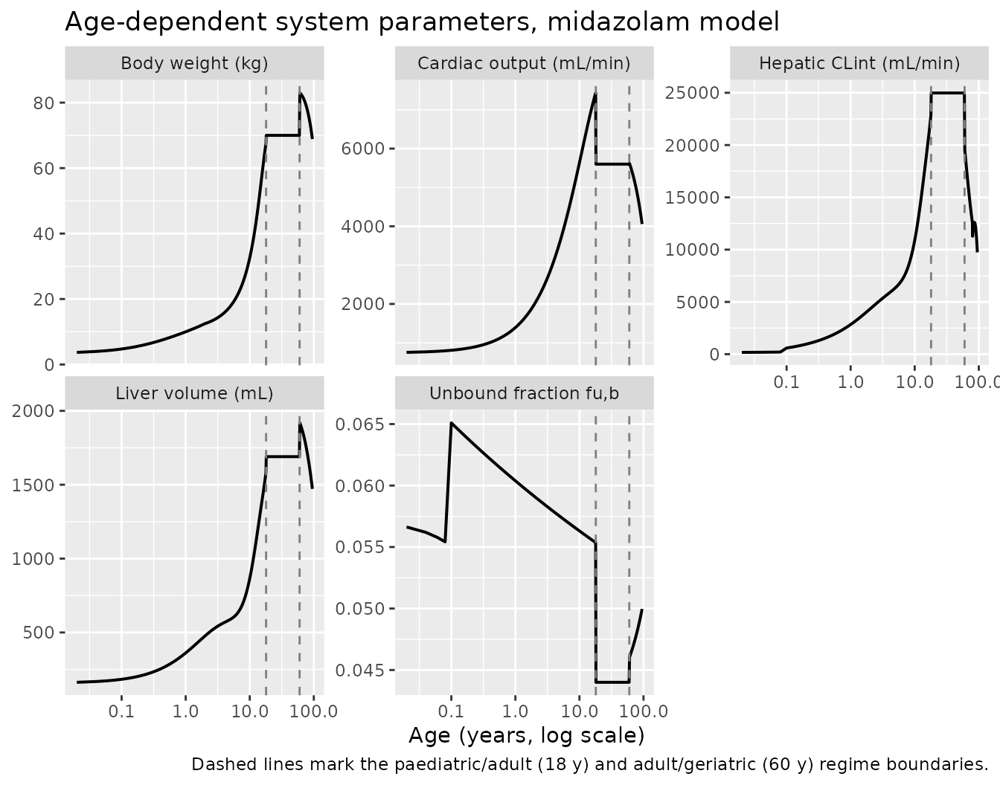
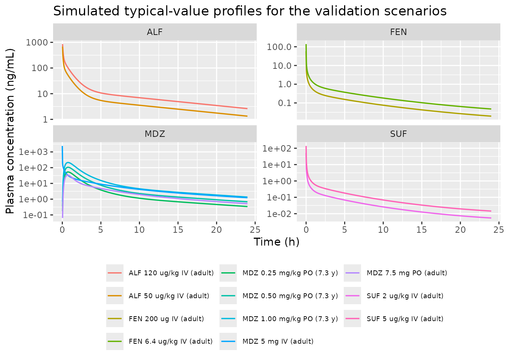
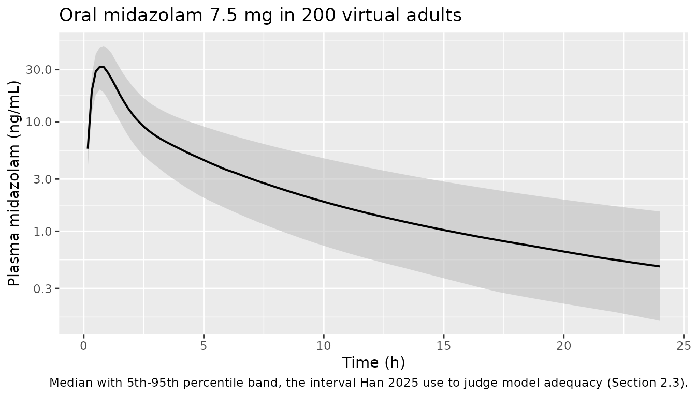
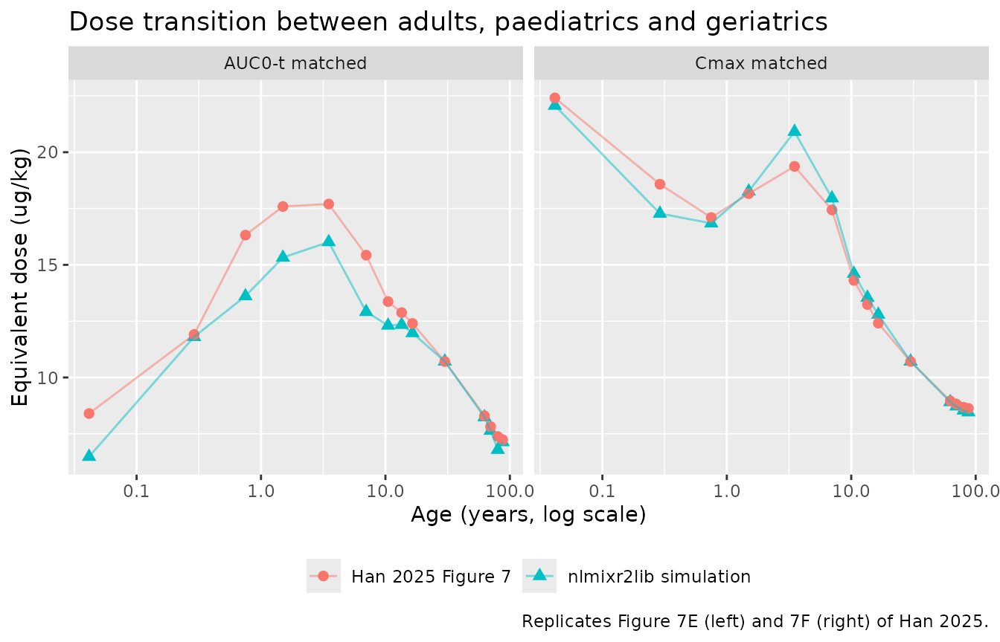

# Age-dependent CYP3A4 PBPK: midazolam, fentanyl, alfentanil, sufentanil (Han 2025)

## Model and source

Han 2025 build a single whole-body PBPK structure whose system
parameters are all functions of age, and parameterise it for four CYP3A4
substrates. This paper therefore contributes **four model files**, one
per drug, all sharing the same ODE core:

``` r

model_names <- c("Han_2025_midazolam_pbpk", "Han_2025_fentanyl_pbpk",
                 "Han_2025_alfentanil_pbpk", "Han_2025_sufentanil_pbpk")
mods <- lapply(model_names, function(n) rxode2::rxode(readModelDb(n)))
names(mods) <- model_names
```

- Citation: Han J, Zhang Z, Liu X, Yang H, Liu L (2025). Prediction of
  Pharmacokinetics for CYP3A4-Metabolized Drugs in Pediatrics and
  Geriatrics Using Dynamic Age-Dependent Physiologically Based
  Pharmacokinetic Models. Pharmaceutics 17(2):214.
  <doi:10.3390/pharmaceutics17020214>. ODE system from Supplementary
  Information Eq S1-S10; drug parameters from Table S1; adult system
  physiology from Table S2; paediatric scaling from Tables S3-S5 and Eq
  3-17; geriatric scaling from Tables S6-S7 and Eq 18-22; validation
  targets from Table S12. The deposited Supplementary File S2 (Sobol
  global-sensitivity R script, rxode2) is the authors’ own executable
  encoding of the adult midazolam ODEs and is used here as a second
  source for the equation forms.
- Article: <https://doi.org/10.3390/pharmaceutics17020214>
- Supplement (equations S1-S10, Tables S1-S16):
  <https://www.mdpi.com/article/10.3390/pharmaceutics17020214/s1>

The four models differ only in the drug-specific block of `ini()`:

``` r

# Full-join on the parameter name rather than cbind: the midazolam file has one
# more entry than its siblings (`lpeff` / `etalpeff` against a flat `peff = 0`),
# so the ini() vectors are not the same length or in the same order.
drug_par <- lapply(model_names, function(n) {
  d <- mods[[n]]$iniDf
  d <- d[!is.na(d$name) & is.na(d$neta2), c("name", "est")]  # fixed effects only
  names(d)[2] <- sub("^Han_2025_|_pbpk$", "", n)
  d
}) |>
  Reduce(f = function(a, b) dplyr::full_join(a, b, by = "name"))

drug_par |>
  dplyr::mutate(dplyr::across(-name, ~ signif(.x, 4))) |>
  dplyr::rename("parameter" = name) |>
  knitr::kable(caption = paste(
    "Drug-specific fixed effects (Han 2025 Table S1). Names beginning `l` are",
    "on the log scale. All eight random effects carry the same variance;",
    "see Between-subject variability."))
```

| parameter  | midazolam_pbpk | fentanyl_pbpk | alfentanil_pbpk | sufentanil_pbpk |
|:-----------|---------------:|--------------:|----------------:|----------------:|
| kp_lung    |         4.6100 |         5.450 |           0.320 |         3.57000 |
| kp_kidney  |         4.7200 |         4.140 |           0.260 |         2.69000 |
| kp_heart   |         4.3100 |         3.750 |           0.240 |         2.43000 |
| kp_liver   |         4.1000 |         4.550 |           0.280 |         2.95000 |
| kp_muscle  |         1.3300 |         2.760 |           0.190 |         1.75000 |
| kp_skin    |         1.4400 |        12.460 |           0.650 |         8.31000 |
| kp_adipose |         9.2300 |       170.400 |           8.220 |       114.60000 |
| kp_brain   |         3.3800 |         8.220 |           0.460 |         5.41000 |
| kp_spleen  |         3.3800 |         2.540 |           0.180 |         1.60000 |
| kp_stomach |         7.7900 |         8.630 |           0.470 |         5.70000 |
| kp_gut     |         4.9200 |         8.630 |           0.470 |         5.70000 |
| kp_other   |         0.0010 |         0.001 |           0.001 |         0.00100 |
| lbpr       |        -0.5108 |         0.000 |          -0.462 |        -0.30110 |
| lfu_p      |        -3.1240 |        -1.568 |          -2.453 |        -2.59000 |
| lcl_int_h  |        -0.9442 |        -2.547 |          -2.343 |        -0.06828 |
| lpeff      |        -3.6340 |            NA |              NA |              NA |
| lpbsf      |        11.0700 |        11.070 |          11.070 |        11.07000 |
| lcl_gw1    |         3.5260 |         1.923 |           2.127 |         4.40200 |
| lcl_gw2    |         4.9020 |         3.299 |           3.503 |         5.77800 |
| lcl_gw3    |         4.3630 |         2.760 |           2.964 |         5.23900 |
| propSd     |         0.1000 |         0.100 |           0.100 |         0.10000 |
| peff       |             NA |         0.000 |           0.000 |         0.00000 |

Drug-specific fixed effects (Han 2025 Table S1). Names beginning `l` are
on the log scale. All eight random effects carry the same variance; see
Between-subject variability. {.table}

Note `peff` is `0` for fentanyl, alfentanil and sufentanil: Table S1
reports `/` for their effective permeability and every clinical data set
for those three drugs is intravenous, so the luminal absorption path is
inert rather than invented. **Do not dose those three models into
`stomach`.**

## Population

The model was built on 166 literature data sets across the four drugs
(Tables S8-S11): 85 midazolam, 54 fentanyl, 15 alfentanil and 12
sufentanil; 43 paediatric, 102 adult and 21 geriatric. Subjects span
gestational age 24 weeks in preterm neonates through to 91 years, and
body weights from 0.571 kg to about 85 kg. They comprise healthy
volunteers plus surgical and intensive-care patients receiving these
drugs for sedation, premedication or analgesia. Midazolam is the only
drug given orally; the three opioids are intravenous throughout.

The paper’s own predictions are the 50th percentile of 1000 *virtual*
individuals per age stage, generated by varying `Peff`, `fu,b`,
`CLint,l`, `CLint,i`, `Rb` and `PBSF` uniformly over 0.67-1.5 times the
ideal value (Section 2.1). That sweep is carried in the packaged models
as exponential IIV on the same parameters – see [Between-subject
variability](#between-subject-variability) for the magnitude and how it
was chosen.
[`rxode2::zeroRe()`](https://nlmixr2.github.io/rxode2/reference/zeroRe.html)
recovers the typical-value predictor, which is what every replication
below uses. Overall model performance is reported in Table S16: AFE 1.1
/ 0.9 / 1.1 and PE 24.0 / 15.1 / 24.2 % for paediatrics / adults /
geriatrics.

``` r

str(mods[[1]]$population, max.level = 1)
#> List of 9
#>  $ species      : chr "human"
#>  $ n_subjects   : int 1000
#>  $ n_studies    : int 85
#>  $ age_range    : chr "gestational age 24 weeks (preterm neonates) to 91 years"
#>  $ weight_range : chr "0.571 kg (preterm neonates) to 85 kg (adults)"
#>  $ disease_state: chr "Healthy volunteers plus surgical / intensive-care patients receiving midazolam for sedation or premedication. H"| __truncated__
#>  $ dose_range   : chr "0.075-1 mg/kg oral, 5-7.5 mg oral fixed dose, 5 ug/kg to 0.5 mg/kg intravenous, and a 259 ug/kg/h 148.8 h neonatal infusion"
#>  $ regions      : chr "Multinational literature compilation"
#>  $ notes        : chr "The 1000 'subjects' are virtual individuals, not real patients: Han 2025 Section 2.1 constructs them by varying"| __truncated__
```

## Source trace

Every `ini()` entry carries an in-file comment naming its source cell.
The table below collects the structural provenance in one place.

| Equation / parameter | Source location |
|----|----|
| Perfusion-limited tissue mass balance | Supplementary Eq S1 |
| Stomach lumen (gastric emptying only) | Supplementary Eq S2 |
| Intestinal lumen transit + absorption | Supplementary Eq S3 |
| `ka,i = 2 * Peff / r_i` | Supplementary Eq S4 |
| Intestinal wall with CYP3A4 extraction | Supplementary Eq S5 |
| Liver (portal + arterial in, CYP3A4 out) | Supplementary Eq S6 |
| Well-stirred `CLl` used to back-calculate `CLint` for fentanyl / sufentanil | Supplementary Eq S7 |
| Arterial blood / mixed venous blood / lung | Supplementary Eq S8 / S9 / S10 |
| `Kt:p`, `Rb`, `fu,p`, `CLint,l`, `Peff` per drug | Table S1 |
| Adult organ volumes, blood flows, transit constants, radii, `PBSF` | Table S2 |
| Paediatric organ masses | Table S3 |
| Paediatric blood flows | Table S4 |
| Paediatric weight / height coefficients | Table S5 (with Eq 3) |
| Geriatric organ masses | Table S6 |
| Geriatric blood flows | Table S7 |
| Intestinal radius, BSA | Eq 4, Eq 5, Eq 6 |
| Hepatic CYP3A4 ontogeny (infants onward / neonates) | Eq 7 / Eq 8 |
| Paediatric MPPGL, `CLint`, intestinal CYP3A4 | Eq 9, Eq 10, Eq 11 |
| Albumin (preterm / paediatric), AAG, unbound fraction | Eq 13, Eq 14, Eq 15-16, Eq 17 |
| Geriatric MPPGL (\< 80 y / \> 80 y), CYP3A4 decline, `CLint`, albumin | Eq 18, Eq 19, Eq 20, Eq 21, Eq 22 |
| Adult validation targets | Tables S12-S15 |
| Dose-optimisation answer key | Figure 7E / 7F |
| Adult ODE forms cross-checked against the authors’ own code | Supplementary File S2 (Sobol GSA rxode2 script) |

## Simulation helper

All four models take the same five covariates: `AGE` (years), `SEXF`,
`PAGE` (postmenstrual age, months), `PNA` (postnatal age, months) and
`ROUTE_IV`. Observations are placed on the `venous` ODE state; `Cc`
(plasma, ng/mL) is returned as a column at those rows.

``` r

# Build a one-subject event table. `dose_mg` is the amount; `dur_min` > 0 gives
# a constant-rate infusion. Oral doses go into `stomach`, IV into `venous`.
make_events <- function(id, age, dose_mg, iv, dur_min = 0, sexf = 0,
                        tmax = 1440, by = 2, pna = NULL, page = NULL) {
  if (is.null(pna))  pna  <- age * 12
  # postmenstrual age assumes a 40-week gestation unless the caller overrides it
  if (is.null(page)) page <- pna + 40 / 4.348
  dose <- data.frame(id = id, time = 0, amt = dose_mg, evid = 1L,
                     cmt = if (iv) "venous" else "stomach", dur = dur_min)
  obs  <- data.frame(id = id, time = seq(0, tmax, by = by), amt = NA_real_,
                     evid = 0L, cmt = "venous", dur = 0)
  out <- dplyr::bind_rows(dose, obs)
  out$AGE <- age; out$SEXF <- sexf; out$PAGE <- page; out$PNA <- pna
  out$ROUTE_IV <- as.integer(iv)
  out[order(out$id, out$time, -out$evid), ]
}

# Typical-value twins. Every replication of a published prediction below uses
# these: Han 2025 report the 50th percentile of their virtual population, and
# stripping the random effects is the cleanest way to hit it reproducibly.
mods0 <- lapply(mods, rxode2::zeroRe)

# Solve one scenario and return the concentration-time profile. rxSolve drops
# the `id` column when the event table holds a single subject, so it is put
# back explicitly -- the PKNCA grouping below needs it.
solve_scn <- function(mod, ...) {
  ev <- make_events(...)
  out <- rxode2::rxSolve(mod, ev, atol = 1e-10, rtol = 1e-8) |>
    as.data.frame() |>
    dplyr::filter(!is.na(Cc))
  if (!"id" %in% names(out)) out$id <- ev$id[1]
  out
}
```

## How the physiology moves with age

The paper’s central claim is that a single structure covers the whole
age range once the system parameters are made age-dependent. Extracting
those derived quantities straight out of the solved model shows the
three regimes and the discontinuities at their boundaries.

``` r

ages <- c(seq(0.02, 2, by = 0.02), seq(2.2, 17.9, by = 0.1),
          seq(18.1, 60, by = 0.5), seq(60.5, 95, by = 0.5))
phys <- lapply(seq_along(ages), function(i) {
  s <- solve_scn(mods0[[1]], id = i, age = ages[i], dose_mg = 1, iv = TRUE,
                 tmax = 0, by = 1)
  s[1, c("bw", "co", "cl_int_h", "fu_b", "v_liver")]
}) |> dplyr::bind_rows()
#> ℹ omega/sigma items treated as zero: 'etalbpr', 'etalfu_p', 'etalcl_int_h', 'etalpeff', 'etalpbsf', 'etalcl_gw1', 'etalcl_gw2', 'etalcl_gw3'
#> ℹ omega/sigma items treated as zero: 'etalbpr', 'etalfu_p', 'etalcl_int_h', 'etalpeff', 'etalpbsf', 'etalcl_gw1', 'etalcl_gw2', 'etalcl_gw3'
#> ℹ omega/sigma items treated as zero: 'etalbpr', 'etalfu_p', 'etalcl_int_h', 'etalpeff', 'etalpbsf', 'etalcl_gw1', 'etalcl_gw2', 'etalcl_gw3'
#> ℹ omega/sigma items treated as zero: 'etalbpr', 'etalfu_p', 'etalcl_int_h', 'etalpeff', 'etalpbsf', 'etalcl_gw1', 'etalcl_gw2', 'etalcl_gw3'
#> ℹ omega/sigma items treated as zero: 'etalbpr', 'etalfu_p', 'etalcl_int_h', 'etalpeff', 'etalpbsf', 'etalcl_gw1', 'etalcl_gw2', 'etalcl_gw3'
#> ℹ omega/sigma items treated as zero: 'etalbpr', 'etalfu_p', 'etalcl_int_h', 'etalpeff', 'etalpbsf', 'etalcl_gw1', 'etalcl_gw2', 'etalcl_gw3'
#> ℹ omega/sigma items treated as zero: 'etalbpr', 'etalfu_p', 'etalcl_int_h', 'etalpeff', 'etalpbsf', 'etalcl_gw1', 'etalcl_gw2', 'etalcl_gw3'
#> ℹ omega/sigma items treated as zero: 'etalbpr', 'etalfu_p', 'etalcl_int_h', 'etalpeff', 'etalpbsf', 'etalcl_gw1', 'etalcl_gw2', 'etalcl_gw3'
#> ℹ omega/sigma items treated as zero: 'etalbpr', 'etalfu_p', 'etalcl_int_h', 'etalpeff', 'etalpbsf', 'etalcl_gw1', 'etalcl_gw2', 'etalcl_gw3'
#> ℹ omega/sigma items treated as zero: 'etalbpr', 'etalfu_p', 'etalcl_int_h', 'etalpeff', 'etalpbsf', 'etalcl_gw1', 'etalcl_gw2', 'etalcl_gw3'
#> ℹ omega/sigma items treated as zero: 'etalbpr', 'etalfu_p', 'etalcl_int_h', 'etalpeff', 'etalpbsf', 'etalcl_gw1', 'etalcl_gw2', 'etalcl_gw3'
#> ℹ omega/sigma items treated as zero: 'etalbpr', 'etalfu_p', 'etalcl_int_h', 'etalpeff', 'etalpbsf', 'etalcl_gw1', 'etalcl_gw2', 'etalcl_gw3'
#> ℹ omega/sigma items treated as zero: 'etalbpr', 'etalfu_p', 'etalcl_int_h', 'etalpeff', 'etalpbsf', 'etalcl_gw1', 'etalcl_gw2', 'etalcl_gw3'
#> ℹ omega/sigma items treated as zero: 'etalbpr', 'etalfu_p', 'etalcl_int_h', 'etalpeff', 'etalpbsf', 'etalcl_gw1', 'etalcl_gw2', 'etalcl_gw3'
#> ℹ omega/sigma items treated as zero: 'etalbpr', 'etalfu_p', 'etalcl_int_h', 'etalpeff', 'etalpbsf', 'etalcl_gw1', 'etalcl_gw2', 'etalcl_gw3'
#> ℹ omega/sigma items treated as zero: 'etalbpr', 'etalfu_p', 'etalcl_int_h', 'etalpeff', 'etalpbsf', 'etalcl_gw1', 'etalcl_gw2', 'etalcl_gw3'
#> ℹ omega/sigma items treated as zero: 'etalbpr', 'etalfu_p', 'etalcl_int_h', 'etalpeff', 'etalpbsf', 'etalcl_gw1', 'etalcl_gw2', 'etalcl_gw3'
#> ℹ omega/sigma items treated as zero: 'etalbpr', 'etalfu_p', 'etalcl_int_h', 'etalpeff', 'etalpbsf', 'etalcl_gw1', 'etalcl_gw2', 'etalcl_gw3'
#> ℹ omega/sigma items treated as zero: 'etalbpr', 'etalfu_p', 'etalcl_int_h', 'etalpeff', 'etalpbsf', 'etalcl_gw1', 'etalcl_gw2', 'etalcl_gw3'
#> ℹ omega/sigma items treated as zero: 'etalbpr', 'etalfu_p', 'etalcl_int_h', 'etalpeff', 'etalpbsf', 'etalcl_gw1', 'etalcl_gw2', 'etalcl_gw3'
#> ℹ omega/sigma items treated as zero: 'etalbpr', 'etalfu_p', 'etalcl_int_h', 'etalpeff', 'etalpbsf', 'etalcl_gw1', 'etalcl_gw2', 'etalcl_gw3'
#> ℹ omega/sigma items treated as zero: 'etalbpr', 'etalfu_p', 'etalcl_int_h', 'etalpeff', 'etalpbsf', 'etalcl_gw1', 'etalcl_gw2', 'etalcl_gw3'
#> ℹ omega/sigma items treated as zero: 'etalbpr', 'etalfu_p', 'etalcl_int_h', 'etalpeff', 'etalpbsf', 'etalcl_gw1', 'etalcl_gw2', 'etalcl_gw3'
#> ℹ omega/sigma items treated as zero: 'etalbpr', 'etalfu_p', 'etalcl_int_h', 'etalpeff', 'etalpbsf', 'etalcl_gw1', 'etalcl_gw2', 'etalcl_gw3'
#> ℹ omega/sigma items treated as zero: 'etalbpr', 'etalfu_p', 'etalcl_int_h', 'etalpeff', 'etalpbsf', 'etalcl_gw1', 'etalcl_gw2', 'etalcl_gw3'
#> ℹ omega/sigma items treated as zero: 'etalbpr', 'etalfu_p', 'etalcl_int_h', 'etalpeff', 'etalpbsf', 'etalcl_gw1', 'etalcl_gw2', 'etalcl_gw3'
#> ℹ omega/sigma items treated as zero: 'etalbpr', 'etalfu_p', 'etalcl_int_h', 'etalpeff', 'etalpbsf', 'etalcl_gw1', 'etalcl_gw2', 'etalcl_gw3'
#> ℹ omega/sigma items treated as zero: 'etalbpr', 'etalfu_p', 'etalcl_int_h', 'etalpeff', 'etalpbsf', 'etalcl_gw1', 'etalcl_gw2', 'etalcl_gw3'
#> ℹ omega/sigma items treated as zero: 'etalbpr', 'etalfu_p', 'etalcl_int_h', 'etalpeff', 'etalpbsf', 'etalcl_gw1', 'etalcl_gw2', 'etalcl_gw3'
#> ℹ omega/sigma items treated as zero: 'etalbpr', 'etalfu_p', 'etalcl_int_h', 'etalpeff', 'etalpbsf', 'etalcl_gw1', 'etalcl_gw2', 'etalcl_gw3'
#> ℹ omega/sigma items treated as zero: 'etalbpr', 'etalfu_p', 'etalcl_int_h', 'etalpeff', 'etalpbsf', 'etalcl_gw1', 'etalcl_gw2', 'etalcl_gw3'
#> ℹ omega/sigma items treated as zero: 'etalbpr', 'etalfu_p', 'etalcl_int_h', 'etalpeff', 'etalpbsf', 'etalcl_gw1', 'etalcl_gw2', 'etalcl_gw3'
#> ℹ omega/sigma items treated as zero: 'etalbpr', 'etalfu_p', 'etalcl_int_h', 'etalpeff', 'etalpbsf', 'etalcl_gw1', 'etalcl_gw2', 'etalcl_gw3'
#> ℹ omega/sigma items treated as zero: 'etalbpr', 'etalfu_p', 'etalcl_int_h', 'etalpeff', 'etalpbsf', 'etalcl_gw1', 'etalcl_gw2', 'etalcl_gw3'
#> ℹ omega/sigma items treated as zero: 'etalbpr', 'etalfu_p', 'etalcl_int_h', 'etalpeff', 'etalpbsf', 'etalcl_gw1', 'etalcl_gw2', 'etalcl_gw3'
#> ℹ omega/sigma items treated as zero: 'etalbpr', 'etalfu_p', 'etalcl_int_h', 'etalpeff', 'etalpbsf', 'etalcl_gw1', 'etalcl_gw2', 'etalcl_gw3'
#> ℹ omega/sigma items treated as zero: 'etalbpr', 'etalfu_p', 'etalcl_int_h', 'etalpeff', 'etalpbsf', 'etalcl_gw1', 'etalcl_gw2', 'etalcl_gw3'
#> ℹ omega/sigma items treated as zero: 'etalbpr', 'etalfu_p', 'etalcl_int_h', 'etalpeff', 'etalpbsf', 'etalcl_gw1', 'etalcl_gw2', 'etalcl_gw3'
#> ℹ omega/sigma items treated as zero: 'etalbpr', 'etalfu_p', 'etalcl_int_h', 'etalpeff', 'etalpbsf', 'etalcl_gw1', 'etalcl_gw2', 'etalcl_gw3'
#> ℹ omega/sigma items treated as zero: 'etalbpr', 'etalfu_p', 'etalcl_int_h', 'etalpeff', 'etalpbsf', 'etalcl_gw1', 'etalcl_gw2', 'etalcl_gw3'
#> ℹ omega/sigma items treated as zero: 'etalbpr', 'etalfu_p', 'etalcl_int_h', 'etalpeff', 'etalpbsf', 'etalcl_gw1', 'etalcl_gw2', 'etalcl_gw3'
#> ℹ omega/sigma items treated as zero: 'etalbpr', 'etalfu_p', 'etalcl_int_h', 'etalpeff', 'etalpbsf', 'etalcl_gw1', 'etalcl_gw2', 'etalcl_gw3'
#> ℹ omega/sigma items treated as zero: 'etalbpr', 'etalfu_p', 'etalcl_int_h', 'etalpeff', 'etalpbsf', 'etalcl_gw1', 'etalcl_gw2', 'etalcl_gw3'
#> ℹ omega/sigma items treated as zero: 'etalbpr', 'etalfu_p', 'etalcl_int_h', 'etalpeff', 'etalpbsf', 'etalcl_gw1', 'etalcl_gw2', 'etalcl_gw3'
#> ℹ omega/sigma items treated as zero: 'etalbpr', 'etalfu_p', 'etalcl_int_h', 'etalpeff', 'etalpbsf', 'etalcl_gw1', 'etalcl_gw2', 'etalcl_gw3'
#> ℹ omega/sigma items treated as zero: 'etalbpr', 'etalfu_p', 'etalcl_int_h', 'etalpeff', 'etalpbsf', 'etalcl_gw1', 'etalcl_gw2', 'etalcl_gw3'
#> ℹ omega/sigma items treated as zero: 'etalbpr', 'etalfu_p', 'etalcl_int_h', 'etalpeff', 'etalpbsf', 'etalcl_gw1', 'etalcl_gw2', 'etalcl_gw3'
#> ℹ omega/sigma items treated as zero: 'etalbpr', 'etalfu_p', 'etalcl_int_h', 'etalpeff', 'etalpbsf', 'etalcl_gw1', 'etalcl_gw2', 'etalcl_gw3'
#> ℹ omega/sigma items treated as zero: 'etalbpr', 'etalfu_p', 'etalcl_int_h', 'etalpeff', 'etalpbsf', 'etalcl_gw1', 'etalcl_gw2', 'etalcl_gw3'
#> ℹ omega/sigma items treated as zero: 'etalbpr', 'etalfu_p', 'etalcl_int_h', 'etalpeff', 'etalpbsf', 'etalcl_gw1', 'etalcl_gw2', 'etalcl_gw3'
#> ℹ omega/sigma items treated as zero: 'etalbpr', 'etalfu_p', 'etalcl_int_h', 'etalpeff', 'etalpbsf', 'etalcl_gw1', 'etalcl_gw2', 'etalcl_gw3'
#> ℹ omega/sigma items treated as zero: 'etalbpr', 'etalfu_p', 'etalcl_int_h', 'etalpeff', 'etalpbsf', 'etalcl_gw1', 'etalcl_gw2', 'etalcl_gw3'
#> ℹ omega/sigma items treated as zero: 'etalbpr', 'etalfu_p', 'etalcl_int_h', 'etalpeff', 'etalpbsf', 'etalcl_gw1', 'etalcl_gw2', 'etalcl_gw3'
#> ℹ omega/sigma items treated as zero: 'etalbpr', 'etalfu_p', 'etalcl_int_h', 'etalpeff', 'etalpbsf', 'etalcl_gw1', 'etalcl_gw2', 'etalcl_gw3'
#> ℹ omega/sigma items treated as zero: 'etalbpr', 'etalfu_p', 'etalcl_int_h', 'etalpeff', 'etalpbsf', 'etalcl_gw1', 'etalcl_gw2', 'etalcl_gw3'
#> ℹ omega/sigma items treated as zero: 'etalbpr', 'etalfu_p', 'etalcl_int_h', 'etalpeff', 'etalpbsf', 'etalcl_gw1', 'etalcl_gw2', 'etalcl_gw3'
#> ℹ omega/sigma items treated as zero: 'etalbpr', 'etalfu_p', 'etalcl_int_h', 'etalpeff', 'etalpbsf', 'etalcl_gw1', 'etalcl_gw2', 'etalcl_gw3'
#> ℹ omega/sigma items treated as zero: 'etalbpr', 'etalfu_p', 'etalcl_int_h', 'etalpeff', 'etalpbsf', 'etalcl_gw1', 'etalcl_gw2', 'etalcl_gw3'
#> ℹ omega/sigma items treated as zero: 'etalbpr', 'etalfu_p', 'etalcl_int_h', 'etalpeff', 'etalpbsf', 'etalcl_gw1', 'etalcl_gw2', 'etalcl_gw3'
#> ℹ omega/sigma items treated as zero: 'etalbpr', 'etalfu_p', 'etalcl_int_h', 'etalpeff', 'etalpbsf', 'etalcl_gw1', 'etalcl_gw2', 'etalcl_gw3'
#> ℹ omega/sigma items treated as zero: 'etalbpr', 'etalfu_p', 'etalcl_int_h', 'etalpeff', 'etalpbsf', 'etalcl_gw1', 'etalcl_gw2', 'etalcl_gw3'
#> ℹ omega/sigma items treated as zero: 'etalbpr', 'etalfu_p', 'etalcl_int_h', 'etalpeff', 'etalpbsf', 'etalcl_gw1', 'etalcl_gw2', 'etalcl_gw3'
#> ℹ omega/sigma items treated as zero: 'etalbpr', 'etalfu_p', 'etalcl_int_h', 'etalpeff', 'etalpbsf', 'etalcl_gw1', 'etalcl_gw2', 'etalcl_gw3'
#> ℹ omega/sigma items treated as zero: 'etalbpr', 'etalfu_p', 'etalcl_int_h', 'etalpeff', 'etalpbsf', 'etalcl_gw1', 'etalcl_gw2', 'etalcl_gw3'
#> ℹ omega/sigma items treated as zero: 'etalbpr', 'etalfu_p', 'etalcl_int_h', 'etalpeff', 'etalpbsf', 'etalcl_gw1', 'etalcl_gw2', 'etalcl_gw3'
#> ℹ omega/sigma items treated as zero: 'etalbpr', 'etalfu_p', 'etalcl_int_h', 'etalpeff', 'etalpbsf', 'etalcl_gw1', 'etalcl_gw2', 'etalcl_gw3'
#> ℹ omega/sigma items treated as zero: 'etalbpr', 'etalfu_p', 'etalcl_int_h', 'etalpeff', 'etalpbsf', 'etalcl_gw1', 'etalcl_gw2', 'etalcl_gw3'
#> ℹ omega/sigma items treated as zero: 'etalbpr', 'etalfu_p', 'etalcl_int_h', 'etalpeff', 'etalpbsf', 'etalcl_gw1', 'etalcl_gw2', 'etalcl_gw3'
#> ℹ omega/sigma items treated as zero: 'etalbpr', 'etalfu_p', 'etalcl_int_h', 'etalpeff', 'etalpbsf', 'etalcl_gw1', 'etalcl_gw2', 'etalcl_gw3'
#> ℹ omega/sigma items treated as zero: 'etalbpr', 'etalfu_p', 'etalcl_int_h', 'etalpeff', 'etalpbsf', 'etalcl_gw1', 'etalcl_gw2', 'etalcl_gw3'
#> ℹ omega/sigma items treated as zero: 'etalbpr', 'etalfu_p', 'etalcl_int_h', 'etalpeff', 'etalpbsf', 'etalcl_gw1', 'etalcl_gw2', 'etalcl_gw3'
#> ℹ omega/sigma items treated as zero: 'etalbpr', 'etalfu_p', 'etalcl_int_h', 'etalpeff', 'etalpbsf', 'etalcl_gw1', 'etalcl_gw2', 'etalcl_gw3'
#> ℹ omega/sigma items treated as zero: 'etalbpr', 'etalfu_p', 'etalcl_int_h', 'etalpeff', 'etalpbsf', 'etalcl_gw1', 'etalcl_gw2', 'etalcl_gw3'
#> ℹ omega/sigma items treated as zero: 'etalbpr', 'etalfu_p', 'etalcl_int_h', 'etalpeff', 'etalpbsf', 'etalcl_gw1', 'etalcl_gw2', 'etalcl_gw3'
#> ℹ omega/sigma items treated as zero: 'etalbpr', 'etalfu_p', 'etalcl_int_h', 'etalpeff', 'etalpbsf', 'etalcl_gw1', 'etalcl_gw2', 'etalcl_gw3'
#> ℹ omega/sigma items treated as zero: 'etalbpr', 'etalfu_p', 'etalcl_int_h', 'etalpeff', 'etalpbsf', 'etalcl_gw1', 'etalcl_gw2', 'etalcl_gw3'
#> ℹ omega/sigma items treated as zero: 'etalbpr', 'etalfu_p', 'etalcl_int_h', 'etalpeff', 'etalpbsf', 'etalcl_gw1', 'etalcl_gw2', 'etalcl_gw3'
#> ℹ omega/sigma items treated as zero: 'etalbpr', 'etalfu_p', 'etalcl_int_h', 'etalpeff', 'etalpbsf', 'etalcl_gw1', 'etalcl_gw2', 'etalcl_gw3'
#> ℹ omega/sigma items treated as zero: 'etalbpr', 'etalfu_p', 'etalcl_int_h', 'etalpeff', 'etalpbsf', 'etalcl_gw1', 'etalcl_gw2', 'etalcl_gw3'
#> ℹ omega/sigma items treated as zero: 'etalbpr', 'etalfu_p', 'etalcl_int_h', 'etalpeff', 'etalpbsf', 'etalcl_gw1', 'etalcl_gw2', 'etalcl_gw3'
#> ℹ omega/sigma items treated as zero: 'etalbpr', 'etalfu_p', 'etalcl_int_h', 'etalpeff', 'etalpbsf', 'etalcl_gw1', 'etalcl_gw2', 'etalcl_gw3'
#> ℹ omega/sigma items treated as zero: 'etalbpr', 'etalfu_p', 'etalcl_int_h', 'etalpeff', 'etalpbsf', 'etalcl_gw1', 'etalcl_gw2', 'etalcl_gw3'
#> ℹ omega/sigma items treated as zero: 'etalbpr', 'etalfu_p', 'etalcl_int_h', 'etalpeff', 'etalpbsf', 'etalcl_gw1', 'etalcl_gw2', 'etalcl_gw3'
#> ℹ omega/sigma items treated as zero: 'etalbpr', 'etalfu_p', 'etalcl_int_h', 'etalpeff', 'etalpbsf', 'etalcl_gw1', 'etalcl_gw2', 'etalcl_gw3'
#> ℹ omega/sigma items treated as zero: 'etalbpr', 'etalfu_p', 'etalcl_int_h', 'etalpeff', 'etalpbsf', 'etalcl_gw1', 'etalcl_gw2', 'etalcl_gw3'
#> ℹ omega/sigma items treated as zero: 'etalbpr', 'etalfu_p', 'etalcl_int_h', 'etalpeff', 'etalpbsf', 'etalcl_gw1', 'etalcl_gw2', 'etalcl_gw3'
#> ℹ omega/sigma items treated as zero: 'etalbpr', 'etalfu_p', 'etalcl_int_h', 'etalpeff', 'etalpbsf', 'etalcl_gw1', 'etalcl_gw2', 'etalcl_gw3'
#> ℹ omega/sigma items treated as zero: 'etalbpr', 'etalfu_p', 'etalcl_int_h', 'etalpeff', 'etalpbsf', 'etalcl_gw1', 'etalcl_gw2', 'etalcl_gw3'
#> ℹ omega/sigma items treated as zero: 'etalbpr', 'etalfu_p', 'etalcl_int_h', 'etalpeff', 'etalpbsf', 'etalcl_gw1', 'etalcl_gw2', 'etalcl_gw3'
#> ℹ omega/sigma items treated as zero: 'etalbpr', 'etalfu_p', 'etalcl_int_h', 'etalpeff', 'etalpbsf', 'etalcl_gw1', 'etalcl_gw2', 'etalcl_gw3'
#> ℹ omega/sigma items treated as zero: 'etalbpr', 'etalfu_p', 'etalcl_int_h', 'etalpeff', 'etalpbsf', 'etalcl_gw1', 'etalcl_gw2', 'etalcl_gw3'
#> ℹ omega/sigma items treated as zero: 'etalbpr', 'etalfu_p', 'etalcl_int_h', 'etalpeff', 'etalpbsf', 'etalcl_gw1', 'etalcl_gw2', 'etalcl_gw3'
#> ℹ omega/sigma items treated as zero: 'etalbpr', 'etalfu_p', 'etalcl_int_h', 'etalpeff', 'etalpbsf', 'etalcl_gw1', 'etalcl_gw2', 'etalcl_gw3'
#> ℹ omega/sigma items treated as zero: 'etalbpr', 'etalfu_p', 'etalcl_int_h', 'etalpeff', 'etalpbsf', 'etalcl_gw1', 'etalcl_gw2', 'etalcl_gw3'
#> ℹ omega/sigma items treated as zero: 'etalbpr', 'etalfu_p', 'etalcl_int_h', 'etalpeff', 'etalpbsf', 'etalcl_gw1', 'etalcl_gw2', 'etalcl_gw3'
#> ℹ omega/sigma items treated as zero: 'etalbpr', 'etalfu_p', 'etalcl_int_h', 'etalpeff', 'etalpbsf', 'etalcl_gw1', 'etalcl_gw2', 'etalcl_gw3'
#> ℹ omega/sigma items treated as zero: 'etalbpr', 'etalfu_p', 'etalcl_int_h', 'etalpeff', 'etalpbsf', 'etalcl_gw1', 'etalcl_gw2', 'etalcl_gw3'
#> ℹ omega/sigma items treated as zero: 'etalbpr', 'etalfu_p', 'etalcl_int_h', 'etalpeff', 'etalpbsf', 'etalcl_gw1', 'etalcl_gw2', 'etalcl_gw3'
#> ℹ omega/sigma items treated as zero: 'etalbpr', 'etalfu_p', 'etalcl_int_h', 'etalpeff', 'etalpbsf', 'etalcl_gw1', 'etalcl_gw2', 'etalcl_gw3'
#> ℹ omega/sigma items treated as zero: 'etalbpr', 'etalfu_p', 'etalcl_int_h', 'etalpeff', 'etalpbsf', 'etalcl_gw1', 'etalcl_gw2', 'etalcl_gw3'
#> ℹ omega/sigma items treated as zero: 'etalbpr', 'etalfu_p', 'etalcl_int_h', 'etalpeff', 'etalpbsf', 'etalcl_gw1', 'etalcl_gw2', 'etalcl_gw3'
#> ℹ omega/sigma items treated as zero: 'etalbpr', 'etalfu_p', 'etalcl_int_h', 'etalpeff', 'etalpbsf', 'etalcl_gw1', 'etalcl_gw2', 'etalcl_gw3'
#> ℹ omega/sigma items treated as zero: 'etalbpr', 'etalfu_p', 'etalcl_int_h', 'etalpeff', 'etalpbsf', 'etalcl_gw1', 'etalcl_gw2', 'etalcl_gw3'
#> ℹ omega/sigma items treated as zero: 'etalbpr', 'etalfu_p', 'etalcl_int_h', 'etalpeff', 'etalpbsf', 'etalcl_gw1', 'etalcl_gw2', 'etalcl_gw3'
#> ℹ omega/sigma items treated as zero: 'etalbpr', 'etalfu_p', 'etalcl_int_h', 'etalpeff', 'etalpbsf', 'etalcl_gw1', 'etalcl_gw2', 'etalcl_gw3'
#> ℹ omega/sigma items treated as zero: 'etalbpr', 'etalfu_p', 'etalcl_int_h', 'etalpeff', 'etalpbsf', 'etalcl_gw1', 'etalcl_gw2', 'etalcl_gw3'
#> ℹ omega/sigma items treated as zero: 'etalbpr', 'etalfu_p', 'etalcl_int_h', 'etalpeff', 'etalpbsf', 'etalcl_gw1', 'etalcl_gw2', 'etalcl_gw3'
#> ℹ omega/sigma items treated as zero: 'etalbpr', 'etalfu_p', 'etalcl_int_h', 'etalpeff', 'etalpbsf', 'etalcl_gw1', 'etalcl_gw2', 'etalcl_gw3'
#> ℹ omega/sigma items treated as zero: 'etalbpr', 'etalfu_p', 'etalcl_int_h', 'etalpeff', 'etalpbsf', 'etalcl_gw1', 'etalcl_gw2', 'etalcl_gw3'
#> ℹ omega/sigma items treated as zero: 'etalbpr', 'etalfu_p', 'etalcl_int_h', 'etalpeff', 'etalpbsf', 'etalcl_gw1', 'etalcl_gw2', 'etalcl_gw3'
#> ℹ omega/sigma items treated as zero: 'etalbpr', 'etalfu_p', 'etalcl_int_h', 'etalpeff', 'etalpbsf', 'etalcl_gw1', 'etalcl_gw2', 'etalcl_gw3'
#> ℹ omega/sigma items treated as zero: 'etalbpr', 'etalfu_p', 'etalcl_int_h', 'etalpeff', 'etalpbsf', 'etalcl_gw1', 'etalcl_gw2', 'etalcl_gw3'
#> ℹ omega/sigma items treated as zero: 'etalbpr', 'etalfu_p', 'etalcl_int_h', 'etalpeff', 'etalpbsf', 'etalcl_gw1', 'etalcl_gw2', 'etalcl_gw3'
#> ℹ omega/sigma items treated as zero: 'etalbpr', 'etalfu_p', 'etalcl_int_h', 'etalpeff', 'etalpbsf', 'etalcl_gw1', 'etalcl_gw2', 'etalcl_gw3'
#> ℹ omega/sigma items treated as zero: 'etalbpr', 'etalfu_p', 'etalcl_int_h', 'etalpeff', 'etalpbsf', 'etalcl_gw1', 'etalcl_gw2', 'etalcl_gw3'
#> ℹ omega/sigma items treated as zero: 'etalbpr', 'etalfu_p', 'etalcl_int_h', 'etalpeff', 'etalpbsf', 'etalcl_gw1', 'etalcl_gw2', 'etalcl_gw3'
#> ℹ omega/sigma items treated as zero: 'etalbpr', 'etalfu_p', 'etalcl_int_h', 'etalpeff', 'etalpbsf', 'etalcl_gw1', 'etalcl_gw2', 'etalcl_gw3'
#> ℹ omega/sigma items treated as zero: 'etalbpr', 'etalfu_p', 'etalcl_int_h', 'etalpeff', 'etalpbsf', 'etalcl_gw1', 'etalcl_gw2', 'etalcl_gw3'
#> ℹ omega/sigma items treated as zero: 'etalbpr', 'etalfu_p', 'etalcl_int_h', 'etalpeff', 'etalpbsf', 'etalcl_gw1', 'etalcl_gw2', 'etalcl_gw3'
#> ℹ omega/sigma items treated as zero: 'etalbpr', 'etalfu_p', 'etalcl_int_h', 'etalpeff', 'etalpbsf', 'etalcl_gw1', 'etalcl_gw2', 'etalcl_gw3'
#> ℹ omega/sigma items treated as zero: 'etalbpr', 'etalfu_p', 'etalcl_int_h', 'etalpeff', 'etalpbsf', 'etalcl_gw1', 'etalcl_gw2', 'etalcl_gw3'
#> ℹ omega/sigma items treated as zero: 'etalbpr', 'etalfu_p', 'etalcl_int_h', 'etalpeff', 'etalpbsf', 'etalcl_gw1', 'etalcl_gw2', 'etalcl_gw3'
#> ℹ omega/sigma items treated as zero: 'etalbpr', 'etalfu_p', 'etalcl_int_h', 'etalpeff', 'etalpbsf', 'etalcl_gw1', 'etalcl_gw2', 'etalcl_gw3'
#> ℹ omega/sigma items treated as zero: 'etalbpr', 'etalfu_p', 'etalcl_int_h', 'etalpeff', 'etalpbsf', 'etalcl_gw1', 'etalcl_gw2', 'etalcl_gw3'
#> ℹ omega/sigma items treated as zero: 'etalbpr', 'etalfu_p', 'etalcl_int_h', 'etalpeff', 'etalpbsf', 'etalcl_gw1', 'etalcl_gw2', 'etalcl_gw3'
#> ℹ omega/sigma items treated as zero: 'etalbpr', 'etalfu_p', 'etalcl_int_h', 'etalpeff', 'etalpbsf', 'etalcl_gw1', 'etalcl_gw2', 'etalcl_gw3'
#> ℹ omega/sigma items treated as zero: 'etalbpr', 'etalfu_p', 'etalcl_int_h', 'etalpeff', 'etalpbsf', 'etalcl_gw1', 'etalcl_gw2', 'etalcl_gw3'
#> ℹ omega/sigma items treated as zero: 'etalbpr', 'etalfu_p', 'etalcl_int_h', 'etalpeff', 'etalpbsf', 'etalcl_gw1', 'etalcl_gw2', 'etalcl_gw3'
#> ℹ omega/sigma items treated as zero: 'etalbpr', 'etalfu_p', 'etalcl_int_h', 'etalpeff', 'etalpbsf', 'etalcl_gw1', 'etalcl_gw2', 'etalcl_gw3'
#> ℹ omega/sigma items treated as zero: 'etalbpr', 'etalfu_p', 'etalcl_int_h', 'etalpeff', 'etalpbsf', 'etalcl_gw1', 'etalcl_gw2', 'etalcl_gw3'
#> ℹ omega/sigma items treated as zero: 'etalbpr', 'etalfu_p', 'etalcl_int_h', 'etalpeff', 'etalpbsf', 'etalcl_gw1', 'etalcl_gw2', 'etalcl_gw3'
#> ℹ omega/sigma items treated as zero: 'etalbpr', 'etalfu_p', 'etalcl_int_h', 'etalpeff', 'etalpbsf', 'etalcl_gw1', 'etalcl_gw2', 'etalcl_gw3'
#> ℹ omega/sigma items treated as zero: 'etalbpr', 'etalfu_p', 'etalcl_int_h', 'etalpeff', 'etalpbsf', 'etalcl_gw1', 'etalcl_gw2', 'etalcl_gw3'
#> ℹ omega/sigma items treated as zero: 'etalbpr', 'etalfu_p', 'etalcl_int_h', 'etalpeff', 'etalpbsf', 'etalcl_gw1', 'etalcl_gw2', 'etalcl_gw3'
#> ℹ omega/sigma items treated as zero: 'etalbpr', 'etalfu_p', 'etalcl_int_h', 'etalpeff', 'etalpbsf', 'etalcl_gw1', 'etalcl_gw2', 'etalcl_gw3'
#> ℹ omega/sigma items treated as zero: 'etalbpr', 'etalfu_p', 'etalcl_int_h', 'etalpeff', 'etalpbsf', 'etalcl_gw1', 'etalcl_gw2', 'etalcl_gw3'
#> ℹ omega/sigma items treated as zero: 'etalbpr', 'etalfu_p', 'etalcl_int_h', 'etalpeff', 'etalpbsf', 'etalcl_gw1', 'etalcl_gw2', 'etalcl_gw3'
#> ℹ omega/sigma items treated as zero: 'etalbpr', 'etalfu_p', 'etalcl_int_h', 'etalpeff', 'etalpbsf', 'etalcl_gw1', 'etalcl_gw2', 'etalcl_gw3'
#> ℹ omega/sigma items treated as zero: 'etalbpr', 'etalfu_p', 'etalcl_int_h', 'etalpeff', 'etalpbsf', 'etalcl_gw1', 'etalcl_gw2', 'etalcl_gw3'
#> ℹ omega/sigma items treated as zero: 'etalbpr', 'etalfu_p', 'etalcl_int_h', 'etalpeff', 'etalpbsf', 'etalcl_gw1', 'etalcl_gw2', 'etalcl_gw3'
#> ℹ omega/sigma items treated as zero: 'etalbpr', 'etalfu_p', 'etalcl_int_h', 'etalpeff', 'etalpbsf', 'etalcl_gw1', 'etalcl_gw2', 'etalcl_gw3'
#> ℹ omega/sigma items treated as zero: 'etalbpr', 'etalfu_p', 'etalcl_int_h', 'etalpeff', 'etalpbsf', 'etalcl_gw1', 'etalcl_gw2', 'etalcl_gw3'
#> ℹ omega/sigma items treated as zero: 'etalbpr', 'etalfu_p', 'etalcl_int_h', 'etalpeff', 'etalpbsf', 'etalcl_gw1', 'etalcl_gw2', 'etalcl_gw3'
#> ℹ omega/sigma items treated as zero: 'etalbpr', 'etalfu_p', 'etalcl_int_h', 'etalpeff', 'etalpbsf', 'etalcl_gw1', 'etalcl_gw2', 'etalcl_gw3'
#> ℹ omega/sigma items treated as zero: 'etalbpr', 'etalfu_p', 'etalcl_int_h', 'etalpeff', 'etalpbsf', 'etalcl_gw1', 'etalcl_gw2', 'etalcl_gw3'
#> ℹ omega/sigma items treated as zero: 'etalbpr', 'etalfu_p', 'etalcl_int_h', 'etalpeff', 'etalpbsf', 'etalcl_gw1', 'etalcl_gw2', 'etalcl_gw3'
#> ℹ omega/sigma items treated as zero: 'etalbpr', 'etalfu_p', 'etalcl_int_h', 'etalpeff', 'etalpbsf', 'etalcl_gw1', 'etalcl_gw2', 'etalcl_gw3'
#> ℹ omega/sigma items treated as zero: 'etalbpr', 'etalfu_p', 'etalcl_int_h', 'etalpeff', 'etalpbsf', 'etalcl_gw1', 'etalcl_gw2', 'etalcl_gw3'
#> ℹ omega/sigma items treated as zero: 'etalbpr', 'etalfu_p', 'etalcl_int_h', 'etalpeff', 'etalpbsf', 'etalcl_gw1', 'etalcl_gw2', 'etalcl_gw3'
#> ℹ omega/sigma items treated as zero: 'etalbpr', 'etalfu_p', 'etalcl_int_h', 'etalpeff', 'etalpbsf', 'etalcl_gw1', 'etalcl_gw2', 'etalcl_gw3'
#> ℹ omega/sigma items treated as zero: 'etalbpr', 'etalfu_p', 'etalcl_int_h', 'etalpeff', 'etalpbsf', 'etalcl_gw1', 'etalcl_gw2', 'etalcl_gw3'
#> ℹ omega/sigma items treated as zero: 'etalbpr', 'etalfu_p', 'etalcl_int_h', 'etalpeff', 'etalpbsf', 'etalcl_gw1', 'etalcl_gw2', 'etalcl_gw3'
#> ℹ omega/sigma items treated as zero: 'etalbpr', 'etalfu_p', 'etalcl_int_h', 'etalpeff', 'etalpbsf', 'etalcl_gw1', 'etalcl_gw2', 'etalcl_gw3'
#> ℹ omega/sigma items treated as zero: 'etalbpr', 'etalfu_p', 'etalcl_int_h', 'etalpeff', 'etalpbsf', 'etalcl_gw1', 'etalcl_gw2', 'etalcl_gw3'
#> ℹ omega/sigma items treated as zero: 'etalbpr', 'etalfu_p', 'etalcl_int_h', 'etalpeff', 'etalpbsf', 'etalcl_gw1', 'etalcl_gw2', 'etalcl_gw3'
#> ℹ omega/sigma items treated as zero: 'etalbpr', 'etalfu_p', 'etalcl_int_h', 'etalpeff', 'etalpbsf', 'etalcl_gw1', 'etalcl_gw2', 'etalcl_gw3'
#> ℹ omega/sigma items treated as zero: 'etalbpr', 'etalfu_p', 'etalcl_int_h', 'etalpeff', 'etalpbsf', 'etalcl_gw1', 'etalcl_gw2', 'etalcl_gw3'
#> ℹ omega/sigma items treated as zero: 'etalbpr', 'etalfu_p', 'etalcl_int_h', 'etalpeff', 'etalpbsf', 'etalcl_gw1', 'etalcl_gw2', 'etalcl_gw3'
#> ℹ omega/sigma items treated as zero: 'etalbpr', 'etalfu_p', 'etalcl_int_h', 'etalpeff', 'etalpbsf', 'etalcl_gw1', 'etalcl_gw2', 'etalcl_gw3'
#> ℹ omega/sigma items treated as zero: 'etalbpr', 'etalfu_p', 'etalcl_int_h', 'etalpeff', 'etalpbsf', 'etalcl_gw1', 'etalcl_gw2', 'etalcl_gw3'
#> ℹ omega/sigma items treated as zero: 'etalbpr', 'etalfu_p', 'etalcl_int_h', 'etalpeff', 'etalpbsf', 'etalcl_gw1', 'etalcl_gw2', 'etalcl_gw3'
#> ℹ omega/sigma items treated as zero: 'etalbpr', 'etalfu_p', 'etalcl_int_h', 'etalpeff', 'etalpbsf', 'etalcl_gw1', 'etalcl_gw2', 'etalcl_gw3'
#> ℹ omega/sigma items treated as zero: 'etalbpr', 'etalfu_p', 'etalcl_int_h', 'etalpeff', 'etalpbsf', 'etalcl_gw1', 'etalcl_gw2', 'etalcl_gw3'
#> ℹ omega/sigma items treated as zero: 'etalbpr', 'etalfu_p', 'etalcl_int_h', 'etalpeff', 'etalpbsf', 'etalcl_gw1', 'etalcl_gw2', 'etalcl_gw3'
#> ℹ omega/sigma items treated as zero: 'etalbpr', 'etalfu_p', 'etalcl_int_h', 'etalpeff', 'etalpbsf', 'etalcl_gw1', 'etalcl_gw2', 'etalcl_gw3'
#> ℹ omega/sigma items treated as zero: 'etalbpr', 'etalfu_p', 'etalcl_int_h', 'etalpeff', 'etalpbsf', 'etalcl_gw1', 'etalcl_gw2', 'etalcl_gw3'
#> ℹ omega/sigma items treated as zero: 'etalbpr', 'etalfu_p', 'etalcl_int_h', 'etalpeff', 'etalpbsf', 'etalcl_gw1', 'etalcl_gw2', 'etalcl_gw3'
#> ℹ omega/sigma items treated as zero: 'etalbpr', 'etalfu_p', 'etalcl_int_h', 'etalpeff', 'etalpbsf', 'etalcl_gw1', 'etalcl_gw2', 'etalcl_gw3'
#> ℹ omega/sigma items treated as zero: 'etalbpr', 'etalfu_p', 'etalcl_int_h', 'etalpeff', 'etalpbsf', 'etalcl_gw1', 'etalcl_gw2', 'etalcl_gw3'
#> ℹ omega/sigma items treated as zero: 'etalbpr', 'etalfu_p', 'etalcl_int_h', 'etalpeff', 'etalpbsf', 'etalcl_gw1', 'etalcl_gw2', 'etalcl_gw3'
#> ℹ omega/sigma items treated as zero: 'etalbpr', 'etalfu_p', 'etalcl_int_h', 'etalpeff', 'etalpbsf', 'etalcl_gw1', 'etalcl_gw2', 'etalcl_gw3'
#> ℹ omega/sigma items treated as zero: 'etalbpr', 'etalfu_p', 'etalcl_int_h', 'etalpeff', 'etalpbsf', 'etalcl_gw1', 'etalcl_gw2', 'etalcl_gw3'
#> ℹ omega/sigma items treated as zero: 'etalbpr', 'etalfu_p', 'etalcl_int_h', 'etalpeff', 'etalpbsf', 'etalcl_gw1', 'etalcl_gw2', 'etalcl_gw3'
#> ℹ omega/sigma items treated as zero: 'etalbpr', 'etalfu_p', 'etalcl_int_h', 'etalpeff', 'etalpbsf', 'etalcl_gw1', 'etalcl_gw2', 'etalcl_gw3'
#> ℹ omega/sigma items treated as zero: 'etalbpr', 'etalfu_p', 'etalcl_int_h', 'etalpeff', 'etalpbsf', 'etalcl_gw1', 'etalcl_gw2', 'etalcl_gw3'
#> ℹ omega/sigma items treated as zero: 'etalbpr', 'etalfu_p', 'etalcl_int_h', 'etalpeff', 'etalpbsf', 'etalcl_gw1', 'etalcl_gw2', 'etalcl_gw3'
#> ℹ omega/sigma items treated as zero: 'etalbpr', 'etalfu_p', 'etalcl_int_h', 'etalpeff', 'etalpbsf', 'etalcl_gw1', 'etalcl_gw2', 'etalcl_gw3'
#> ℹ omega/sigma items treated as zero: 'etalbpr', 'etalfu_p', 'etalcl_int_h', 'etalpeff', 'etalpbsf', 'etalcl_gw1', 'etalcl_gw2', 'etalcl_gw3'
#> ℹ omega/sigma items treated as zero: 'etalbpr', 'etalfu_p', 'etalcl_int_h', 'etalpeff', 'etalpbsf', 'etalcl_gw1', 'etalcl_gw2', 'etalcl_gw3'
#> ℹ omega/sigma items treated as zero: 'etalbpr', 'etalfu_p', 'etalcl_int_h', 'etalpeff', 'etalpbsf', 'etalcl_gw1', 'etalcl_gw2', 'etalcl_gw3'
#> ℹ omega/sigma items treated as zero: 'etalbpr', 'etalfu_p', 'etalcl_int_h', 'etalpeff', 'etalpbsf', 'etalcl_gw1', 'etalcl_gw2', 'etalcl_gw3'
#> ℹ omega/sigma items treated as zero: 'etalbpr', 'etalfu_p', 'etalcl_int_h', 'etalpeff', 'etalpbsf', 'etalcl_gw1', 'etalcl_gw2', 'etalcl_gw3'
#> ℹ omega/sigma items treated as zero: 'etalbpr', 'etalfu_p', 'etalcl_int_h', 'etalpeff', 'etalpbsf', 'etalcl_gw1', 'etalcl_gw2', 'etalcl_gw3'
#> ℹ omega/sigma items treated as zero: 'etalbpr', 'etalfu_p', 'etalcl_int_h', 'etalpeff', 'etalpbsf', 'etalcl_gw1', 'etalcl_gw2', 'etalcl_gw3'
#> ℹ omega/sigma items treated as zero: 'etalbpr', 'etalfu_p', 'etalcl_int_h', 'etalpeff', 'etalpbsf', 'etalcl_gw1', 'etalcl_gw2', 'etalcl_gw3'
#> ℹ omega/sigma items treated as zero: 'etalbpr', 'etalfu_p', 'etalcl_int_h', 'etalpeff', 'etalpbsf', 'etalcl_gw1', 'etalcl_gw2', 'etalcl_gw3'
#> ℹ omega/sigma items treated as zero: 'etalbpr', 'etalfu_p', 'etalcl_int_h', 'etalpeff', 'etalpbsf', 'etalcl_gw1', 'etalcl_gw2', 'etalcl_gw3'
#> ℹ omega/sigma items treated as zero: 'etalbpr', 'etalfu_p', 'etalcl_int_h', 'etalpeff', 'etalpbsf', 'etalcl_gw1', 'etalcl_gw2', 'etalcl_gw3'
#> ℹ omega/sigma items treated as zero: 'etalbpr', 'etalfu_p', 'etalcl_int_h', 'etalpeff', 'etalpbsf', 'etalcl_gw1', 'etalcl_gw2', 'etalcl_gw3'
#> ℹ omega/sigma items treated as zero: 'etalbpr', 'etalfu_p', 'etalcl_int_h', 'etalpeff', 'etalpbsf', 'etalcl_gw1', 'etalcl_gw2', 'etalcl_gw3'
#> ℹ omega/sigma items treated as zero: 'etalbpr', 'etalfu_p', 'etalcl_int_h', 'etalpeff', 'etalpbsf', 'etalcl_gw1', 'etalcl_gw2', 'etalcl_gw3'
#> ℹ omega/sigma items treated as zero: 'etalbpr', 'etalfu_p', 'etalcl_int_h', 'etalpeff', 'etalpbsf', 'etalcl_gw1', 'etalcl_gw2', 'etalcl_gw3'
#> ℹ omega/sigma items treated as zero: 'etalbpr', 'etalfu_p', 'etalcl_int_h', 'etalpeff', 'etalpbsf', 'etalcl_gw1', 'etalcl_gw2', 'etalcl_gw3'
#> ℹ omega/sigma items treated as zero: 'etalbpr', 'etalfu_p', 'etalcl_int_h', 'etalpeff', 'etalpbsf', 'etalcl_gw1', 'etalcl_gw2', 'etalcl_gw3'
#> ℹ omega/sigma items treated as zero: 'etalbpr', 'etalfu_p', 'etalcl_int_h', 'etalpeff', 'etalpbsf', 'etalcl_gw1', 'etalcl_gw2', 'etalcl_gw3'
#> ℹ omega/sigma items treated as zero: 'etalbpr', 'etalfu_p', 'etalcl_int_h', 'etalpeff', 'etalpbsf', 'etalcl_gw1', 'etalcl_gw2', 'etalcl_gw3'
#> ℹ omega/sigma items treated as zero: 'etalbpr', 'etalfu_p', 'etalcl_int_h', 'etalpeff', 'etalpbsf', 'etalcl_gw1', 'etalcl_gw2', 'etalcl_gw3'
#> ℹ omega/sigma items treated as zero: 'etalbpr', 'etalfu_p', 'etalcl_int_h', 'etalpeff', 'etalpbsf', 'etalcl_gw1', 'etalcl_gw2', 'etalcl_gw3'
#> ℹ omega/sigma items treated as zero: 'etalbpr', 'etalfu_p', 'etalcl_int_h', 'etalpeff', 'etalpbsf', 'etalcl_gw1', 'etalcl_gw2', 'etalcl_gw3'
#> ℹ omega/sigma items treated as zero: 'etalbpr', 'etalfu_p', 'etalcl_int_h', 'etalpeff', 'etalpbsf', 'etalcl_gw1', 'etalcl_gw2', 'etalcl_gw3'
#> ℹ omega/sigma items treated as zero: 'etalbpr', 'etalfu_p', 'etalcl_int_h', 'etalpeff', 'etalpbsf', 'etalcl_gw1', 'etalcl_gw2', 'etalcl_gw3'
#> ℹ omega/sigma items treated as zero: 'etalbpr', 'etalfu_p', 'etalcl_int_h', 'etalpeff', 'etalpbsf', 'etalcl_gw1', 'etalcl_gw2', 'etalcl_gw3'
#> ℹ omega/sigma items treated as zero: 'etalbpr', 'etalfu_p', 'etalcl_int_h', 'etalpeff', 'etalpbsf', 'etalcl_gw1', 'etalcl_gw2', 'etalcl_gw3'
#> ℹ omega/sigma items treated as zero: 'etalbpr', 'etalfu_p', 'etalcl_int_h', 'etalpeff', 'etalpbsf', 'etalcl_gw1', 'etalcl_gw2', 'etalcl_gw3'
#> ℹ omega/sigma items treated as zero: 'etalbpr', 'etalfu_p', 'etalcl_int_h', 'etalpeff', 'etalpbsf', 'etalcl_gw1', 'etalcl_gw2', 'etalcl_gw3'
#> ℹ omega/sigma items treated as zero: 'etalbpr', 'etalfu_p', 'etalcl_int_h', 'etalpeff', 'etalpbsf', 'etalcl_gw1', 'etalcl_gw2', 'etalcl_gw3'
#> ℹ omega/sigma items treated as zero: 'etalbpr', 'etalfu_p', 'etalcl_int_h', 'etalpeff', 'etalpbsf', 'etalcl_gw1', 'etalcl_gw2', 'etalcl_gw3'
#> ℹ omega/sigma items treated as zero: 'etalbpr', 'etalfu_p', 'etalcl_int_h', 'etalpeff', 'etalpbsf', 'etalcl_gw1', 'etalcl_gw2', 'etalcl_gw3'
#> ℹ omega/sigma items treated as zero: 'etalbpr', 'etalfu_p', 'etalcl_int_h', 'etalpeff', 'etalpbsf', 'etalcl_gw1', 'etalcl_gw2', 'etalcl_gw3'
#> ℹ omega/sigma items treated as zero: 'etalbpr', 'etalfu_p', 'etalcl_int_h', 'etalpeff', 'etalpbsf', 'etalcl_gw1', 'etalcl_gw2', 'etalcl_gw3'
#> ℹ omega/sigma items treated as zero: 'etalbpr', 'etalfu_p', 'etalcl_int_h', 'etalpeff', 'etalpbsf', 'etalcl_gw1', 'etalcl_gw2', 'etalcl_gw3'
#> ℹ omega/sigma items treated as zero: 'etalbpr', 'etalfu_p', 'etalcl_int_h', 'etalpeff', 'etalpbsf', 'etalcl_gw1', 'etalcl_gw2', 'etalcl_gw3'
#> ℹ omega/sigma items treated as zero: 'etalbpr', 'etalfu_p', 'etalcl_int_h', 'etalpeff', 'etalpbsf', 'etalcl_gw1', 'etalcl_gw2', 'etalcl_gw3'
#> ℹ omega/sigma items treated as zero: 'etalbpr', 'etalfu_p', 'etalcl_int_h', 'etalpeff', 'etalpbsf', 'etalcl_gw1', 'etalcl_gw2', 'etalcl_gw3'
#> ℹ omega/sigma items treated as zero: 'etalbpr', 'etalfu_p', 'etalcl_int_h', 'etalpeff', 'etalpbsf', 'etalcl_gw1', 'etalcl_gw2', 'etalcl_gw3'
#> ℹ omega/sigma items treated as zero: 'etalbpr', 'etalfu_p', 'etalcl_int_h', 'etalpeff', 'etalpbsf', 'etalcl_gw1', 'etalcl_gw2', 'etalcl_gw3'
#> ℹ omega/sigma items treated as zero: 'etalbpr', 'etalfu_p', 'etalcl_int_h', 'etalpeff', 'etalpbsf', 'etalcl_gw1', 'etalcl_gw2', 'etalcl_gw3'
#> ℹ omega/sigma items treated as zero: 'etalbpr', 'etalfu_p', 'etalcl_int_h', 'etalpeff', 'etalpbsf', 'etalcl_gw1', 'etalcl_gw2', 'etalcl_gw3'
#> ℹ omega/sigma items treated as zero: 'etalbpr', 'etalfu_p', 'etalcl_int_h', 'etalpeff', 'etalpbsf', 'etalcl_gw1', 'etalcl_gw2', 'etalcl_gw3'
#> ℹ omega/sigma items treated as zero: 'etalbpr', 'etalfu_p', 'etalcl_int_h', 'etalpeff', 'etalpbsf', 'etalcl_gw1', 'etalcl_gw2', 'etalcl_gw3'
#> ℹ omega/sigma items treated as zero: 'etalbpr', 'etalfu_p', 'etalcl_int_h', 'etalpeff', 'etalpbsf', 'etalcl_gw1', 'etalcl_gw2', 'etalcl_gw3'
#> ℹ omega/sigma items treated as zero: 'etalbpr', 'etalfu_p', 'etalcl_int_h', 'etalpeff', 'etalpbsf', 'etalcl_gw1', 'etalcl_gw2', 'etalcl_gw3'
#> ℹ omega/sigma items treated as zero: 'etalbpr', 'etalfu_p', 'etalcl_int_h', 'etalpeff', 'etalpbsf', 'etalcl_gw1', 'etalcl_gw2', 'etalcl_gw3'
#> ℹ omega/sigma items treated as zero: 'etalbpr', 'etalfu_p', 'etalcl_int_h', 'etalpeff', 'etalpbsf', 'etalcl_gw1', 'etalcl_gw2', 'etalcl_gw3'
#> ℹ omega/sigma items treated as zero: 'etalbpr', 'etalfu_p', 'etalcl_int_h', 'etalpeff', 'etalpbsf', 'etalcl_gw1', 'etalcl_gw2', 'etalcl_gw3'
#> ℹ omega/sigma items treated as zero: 'etalbpr', 'etalfu_p', 'etalcl_int_h', 'etalpeff', 'etalpbsf', 'etalcl_gw1', 'etalcl_gw2', 'etalcl_gw3'
#> ℹ omega/sigma items treated as zero: 'etalbpr', 'etalfu_p', 'etalcl_int_h', 'etalpeff', 'etalpbsf', 'etalcl_gw1', 'etalcl_gw2', 'etalcl_gw3'
#> ℹ omega/sigma items treated as zero: 'etalbpr', 'etalfu_p', 'etalcl_int_h', 'etalpeff', 'etalpbsf', 'etalcl_gw1', 'etalcl_gw2', 'etalcl_gw3'
#> ℹ omega/sigma items treated as zero: 'etalbpr', 'etalfu_p', 'etalcl_int_h', 'etalpeff', 'etalpbsf', 'etalcl_gw1', 'etalcl_gw2', 'etalcl_gw3'
#> ℹ omega/sigma items treated as zero: 'etalbpr', 'etalfu_p', 'etalcl_int_h', 'etalpeff', 'etalpbsf', 'etalcl_gw1', 'etalcl_gw2', 'etalcl_gw3'
#> ℹ omega/sigma items treated as zero: 'etalbpr', 'etalfu_p', 'etalcl_int_h', 'etalpeff', 'etalpbsf', 'etalcl_gw1', 'etalcl_gw2', 'etalcl_gw3'
#> ℹ omega/sigma items treated as zero: 'etalbpr', 'etalfu_p', 'etalcl_int_h', 'etalpeff', 'etalpbsf', 'etalcl_gw1', 'etalcl_gw2', 'etalcl_gw3'
#> ℹ omega/sigma items treated as zero: 'etalbpr', 'etalfu_p', 'etalcl_int_h', 'etalpeff', 'etalpbsf', 'etalcl_gw1', 'etalcl_gw2', 'etalcl_gw3'
#> ℹ omega/sigma items treated as zero: 'etalbpr', 'etalfu_p', 'etalcl_int_h', 'etalpeff', 'etalpbsf', 'etalcl_gw1', 'etalcl_gw2', 'etalcl_gw3'
#> ℹ omega/sigma items treated as zero: 'etalbpr', 'etalfu_p', 'etalcl_int_h', 'etalpeff', 'etalpbsf', 'etalcl_gw1', 'etalcl_gw2', 'etalcl_gw3'
#> ℹ omega/sigma items treated as zero: 'etalbpr', 'etalfu_p', 'etalcl_int_h', 'etalpeff', 'etalpbsf', 'etalcl_gw1', 'etalcl_gw2', 'etalcl_gw3'
#> ℹ omega/sigma items treated as zero: 'etalbpr', 'etalfu_p', 'etalcl_int_h', 'etalpeff', 'etalpbsf', 'etalcl_gw1', 'etalcl_gw2', 'etalcl_gw3'
#> ℹ omega/sigma items treated as zero: 'etalbpr', 'etalfu_p', 'etalcl_int_h', 'etalpeff', 'etalpbsf', 'etalcl_gw1', 'etalcl_gw2', 'etalcl_gw3'
#> ℹ omega/sigma items treated as zero: 'etalbpr', 'etalfu_p', 'etalcl_int_h', 'etalpeff', 'etalpbsf', 'etalcl_gw1', 'etalcl_gw2', 'etalcl_gw3'
#> ℹ omega/sigma items treated as zero: 'etalbpr', 'etalfu_p', 'etalcl_int_h', 'etalpeff', 'etalpbsf', 'etalcl_gw1', 'etalcl_gw2', 'etalcl_gw3'
#> ℹ omega/sigma items treated as zero: 'etalbpr', 'etalfu_p', 'etalcl_int_h', 'etalpeff', 'etalpbsf', 'etalcl_gw1', 'etalcl_gw2', 'etalcl_gw3'
#> ℹ omega/sigma items treated as zero: 'etalbpr', 'etalfu_p', 'etalcl_int_h', 'etalpeff', 'etalpbsf', 'etalcl_gw1', 'etalcl_gw2', 'etalcl_gw3'
#> ℹ omega/sigma items treated as zero: 'etalbpr', 'etalfu_p', 'etalcl_int_h', 'etalpeff', 'etalpbsf', 'etalcl_gw1', 'etalcl_gw2', 'etalcl_gw3'
#> ℹ omega/sigma items treated as zero: 'etalbpr', 'etalfu_p', 'etalcl_int_h', 'etalpeff', 'etalpbsf', 'etalcl_gw1', 'etalcl_gw2', 'etalcl_gw3'
#> ℹ omega/sigma items treated as zero: 'etalbpr', 'etalfu_p', 'etalcl_int_h', 'etalpeff', 'etalpbsf', 'etalcl_gw1', 'etalcl_gw2', 'etalcl_gw3'
#> ℹ omega/sigma items treated as zero: 'etalbpr', 'etalfu_p', 'etalcl_int_h', 'etalpeff', 'etalpbsf', 'etalcl_gw1', 'etalcl_gw2', 'etalcl_gw3'
#> ℹ omega/sigma items treated as zero: 'etalbpr', 'etalfu_p', 'etalcl_int_h', 'etalpeff', 'etalpbsf', 'etalcl_gw1', 'etalcl_gw2', 'etalcl_gw3'
#> ℹ omega/sigma items treated as zero: 'etalbpr', 'etalfu_p', 'etalcl_int_h', 'etalpeff', 'etalpbsf', 'etalcl_gw1', 'etalcl_gw2', 'etalcl_gw3'
#> ℹ omega/sigma items treated as zero: 'etalbpr', 'etalfu_p', 'etalcl_int_h', 'etalpeff', 'etalpbsf', 'etalcl_gw1', 'etalcl_gw2', 'etalcl_gw3'
#> ℹ omega/sigma items treated as zero: 'etalbpr', 'etalfu_p', 'etalcl_int_h', 'etalpeff', 'etalpbsf', 'etalcl_gw1', 'etalcl_gw2', 'etalcl_gw3'
#> ℹ omega/sigma items treated as zero: 'etalbpr', 'etalfu_p', 'etalcl_int_h', 'etalpeff', 'etalpbsf', 'etalcl_gw1', 'etalcl_gw2', 'etalcl_gw3'
#> ℹ omega/sigma items treated as zero: 'etalbpr', 'etalfu_p', 'etalcl_int_h', 'etalpeff', 'etalpbsf', 'etalcl_gw1', 'etalcl_gw2', 'etalcl_gw3'
#> ℹ omega/sigma items treated as zero: 'etalbpr', 'etalfu_p', 'etalcl_int_h', 'etalpeff', 'etalpbsf', 'etalcl_gw1', 'etalcl_gw2', 'etalcl_gw3'
#> ℹ omega/sigma items treated as zero: 'etalbpr', 'etalfu_p', 'etalcl_int_h', 'etalpeff', 'etalpbsf', 'etalcl_gw1', 'etalcl_gw2', 'etalcl_gw3'
#> ℹ omega/sigma items treated as zero: 'etalbpr', 'etalfu_p', 'etalcl_int_h', 'etalpeff', 'etalpbsf', 'etalcl_gw1', 'etalcl_gw2', 'etalcl_gw3'
#> ℹ omega/sigma items treated as zero: 'etalbpr', 'etalfu_p', 'etalcl_int_h', 'etalpeff', 'etalpbsf', 'etalcl_gw1', 'etalcl_gw2', 'etalcl_gw3'
#> ℹ omega/sigma items treated as zero: 'etalbpr', 'etalfu_p', 'etalcl_int_h', 'etalpeff', 'etalpbsf', 'etalcl_gw1', 'etalcl_gw2', 'etalcl_gw3'
#> ℹ omega/sigma items treated as zero: 'etalbpr', 'etalfu_p', 'etalcl_int_h', 'etalpeff', 'etalpbsf', 'etalcl_gw1', 'etalcl_gw2', 'etalcl_gw3'
#> ℹ omega/sigma items treated as zero: 'etalbpr', 'etalfu_p', 'etalcl_int_h', 'etalpeff', 'etalpbsf', 'etalcl_gw1', 'etalcl_gw2', 'etalcl_gw3'
#> ℹ omega/sigma items treated as zero: 'etalbpr', 'etalfu_p', 'etalcl_int_h', 'etalpeff', 'etalpbsf', 'etalcl_gw1', 'etalcl_gw2', 'etalcl_gw3'
#> ℹ omega/sigma items treated as zero: 'etalbpr', 'etalfu_p', 'etalcl_int_h', 'etalpeff', 'etalpbsf', 'etalcl_gw1', 'etalcl_gw2', 'etalcl_gw3'
#> ℹ omega/sigma items treated as zero: 'etalbpr', 'etalfu_p', 'etalcl_int_h', 'etalpeff', 'etalpbsf', 'etalcl_gw1', 'etalcl_gw2', 'etalcl_gw3'
#> ℹ omega/sigma items treated as zero: 'etalbpr', 'etalfu_p', 'etalcl_int_h', 'etalpeff', 'etalpbsf', 'etalcl_gw1', 'etalcl_gw2', 'etalcl_gw3'
#> ℹ omega/sigma items treated as zero: 'etalbpr', 'etalfu_p', 'etalcl_int_h', 'etalpeff', 'etalpbsf', 'etalcl_gw1', 'etalcl_gw2', 'etalcl_gw3'
#> ℹ omega/sigma items treated as zero: 'etalbpr', 'etalfu_p', 'etalcl_int_h', 'etalpeff', 'etalpbsf', 'etalcl_gw1', 'etalcl_gw2', 'etalcl_gw3'
#> ℹ omega/sigma items treated as zero: 'etalbpr', 'etalfu_p', 'etalcl_int_h', 'etalpeff', 'etalpbsf', 'etalcl_gw1', 'etalcl_gw2', 'etalcl_gw3'
#> ℹ omega/sigma items treated as zero: 'etalbpr', 'etalfu_p', 'etalcl_int_h', 'etalpeff', 'etalpbsf', 'etalcl_gw1', 'etalcl_gw2', 'etalcl_gw3'
#> ℹ omega/sigma items treated as zero: 'etalbpr', 'etalfu_p', 'etalcl_int_h', 'etalpeff', 'etalpbsf', 'etalcl_gw1', 'etalcl_gw2', 'etalcl_gw3'
#> ℹ omega/sigma items treated as zero: 'etalbpr', 'etalfu_p', 'etalcl_int_h', 'etalpeff', 'etalpbsf', 'etalcl_gw1', 'etalcl_gw2', 'etalcl_gw3'
#> ℹ omega/sigma items treated as zero: 'etalbpr', 'etalfu_p', 'etalcl_int_h', 'etalpeff', 'etalpbsf', 'etalcl_gw1', 'etalcl_gw2', 'etalcl_gw3'
#> ℹ omega/sigma items treated as zero: 'etalbpr', 'etalfu_p', 'etalcl_int_h', 'etalpeff', 'etalpbsf', 'etalcl_gw1', 'etalcl_gw2', 'etalcl_gw3'
#> ℹ omega/sigma items treated as zero: 'etalbpr', 'etalfu_p', 'etalcl_int_h', 'etalpeff', 'etalpbsf', 'etalcl_gw1', 'etalcl_gw2', 'etalcl_gw3'
#> ℹ omega/sigma items treated as zero: 'etalbpr', 'etalfu_p', 'etalcl_int_h', 'etalpeff', 'etalpbsf', 'etalcl_gw1', 'etalcl_gw2', 'etalcl_gw3'
#> ℹ omega/sigma items treated as zero: 'etalbpr', 'etalfu_p', 'etalcl_int_h', 'etalpeff', 'etalpbsf', 'etalcl_gw1', 'etalcl_gw2', 'etalcl_gw3'
#> ℹ omega/sigma items treated as zero: 'etalbpr', 'etalfu_p', 'etalcl_int_h', 'etalpeff', 'etalpbsf', 'etalcl_gw1', 'etalcl_gw2', 'etalcl_gw3'
#> ℹ omega/sigma items treated as zero: 'etalbpr', 'etalfu_p', 'etalcl_int_h', 'etalpeff', 'etalpbsf', 'etalcl_gw1', 'etalcl_gw2', 'etalcl_gw3'
#> ℹ omega/sigma items treated as zero: 'etalbpr', 'etalfu_p', 'etalcl_int_h', 'etalpeff', 'etalpbsf', 'etalcl_gw1', 'etalcl_gw2', 'etalcl_gw3'
#> ℹ omega/sigma items treated as zero: 'etalbpr', 'etalfu_p', 'etalcl_int_h', 'etalpeff', 'etalpbsf', 'etalcl_gw1', 'etalcl_gw2', 'etalcl_gw3'
#> ℹ omega/sigma items treated as zero: 'etalbpr', 'etalfu_p', 'etalcl_int_h', 'etalpeff', 'etalpbsf', 'etalcl_gw1', 'etalcl_gw2', 'etalcl_gw3'
#> ℹ omega/sigma items treated as zero: 'etalbpr', 'etalfu_p', 'etalcl_int_h', 'etalpeff', 'etalpbsf', 'etalcl_gw1', 'etalcl_gw2', 'etalcl_gw3'
#> ℹ omega/sigma items treated as zero: 'etalbpr', 'etalfu_p', 'etalcl_int_h', 'etalpeff', 'etalpbsf', 'etalcl_gw1', 'etalcl_gw2', 'etalcl_gw3'
#> ℹ omega/sigma items treated as zero: 'etalbpr', 'etalfu_p', 'etalcl_int_h', 'etalpeff', 'etalpbsf', 'etalcl_gw1', 'etalcl_gw2', 'etalcl_gw3'
#> ℹ omega/sigma items treated as zero: 'etalbpr', 'etalfu_p', 'etalcl_int_h', 'etalpeff', 'etalpbsf', 'etalcl_gw1', 'etalcl_gw2', 'etalcl_gw3'
#> ℹ omega/sigma items treated as zero: 'etalbpr', 'etalfu_p', 'etalcl_int_h', 'etalpeff', 'etalpbsf', 'etalcl_gw1', 'etalcl_gw2', 'etalcl_gw3'
#> ℹ omega/sigma items treated as zero: 'etalbpr', 'etalfu_p', 'etalcl_int_h', 'etalpeff', 'etalpbsf', 'etalcl_gw1', 'etalcl_gw2', 'etalcl_gw3'
#> ℹ omega/sigma items treated as zero: 'etalbpr', 'etalfu_p', 'etalcl_int_h', 'etalpeff', 'etalpbsf', 'etalcl_gw1', 'etalcl_gw2', 'etalcl_gw3'
#> ℹ omega/sigma items treated as zero: 'etalbpr', 'etalfu_p', 'etalcl_int_h', 'etalpeff', 'etalpbsf', 'etalcl_gw1', 'etalcl_gw2', 'etalcl_gw3'
#> ℹ omega/sigma items treated as zero: 'etalbpr', 'etalfu_p', 'etalcl_int_h', 'etalpeff', 'etalpbsf', 'etalcl_gw1', 'etalcl_gw2', 'etalcl_gw3'
#> ℹ omega/sigma items treated as zero: 'etalbpr', 'etalfu_p', 'etalcl_int_h', 'etalpeff', 'etalpbsf', 'etalcl_gw1', 'etalcl_gw2', 'etalcl_gw3'
#> ℹ omega/sigma items treated as zero: 'etalbpr', 'etalfu_p', 'etalcl_int_h', 'etalpeff', 'etalpbsf', 'etalcl_gw1', 'etalcl_gw2', 'etalcl_gw3'
#> ℹ omega/sigma items treated as zero: 'etalbpr', 'etalfu_p', 'etalcl_int_h', 'etalpeff', 'etalpbsf', 'etalcl_gw1', 'etalcl_gw2', 'etalcl_gw3'
#> ℹ omega/sigma items treated as zero: 'etalbpr', 'etalfu_p', 'etalcl_int_h', 'etalpeff', 'etalpbsf', 'etalcl_gw1', 'etalcl_gw2', 'etalcl_gw3'
#> ℹ omega/sigma items treated as zero: 'etalbpr', 'etalfu_p', 'etalcl_int_h', 'etalpeff', 'etalpbsf', 'etalcl_gw1', 'etalcl_gw2', 'etalcl_gw3'
#> ℹ omega/sigma items treated as zero: 'etalbpr', 'etalfu_p', 'etalcl_int_h', 'etalpeff', 'etalpbsf', 'etalcl_gw1', 'etalcl_gw2', 'etalcl_gw3'
#> ℹ omega/sigma items treated as zero: 'etalbpr', 'etalfu_p', 'etalcl_int_h', 'etalpeff', 'etalpbsf', 'etalcl_gw1', 'etalcl_gw2', 'etalcl_gw3'
#> ℹ omega/sigma items treated as zero: 'etalbpr', 'etalfu_p', 'etalcl_int_h', 'etalpeff', 'etalpbsf', 'etalcl_gw1', 'etalcl_gw2', 'etalcl_gw3'
#> ℹ omega/sigma items treated as zero: 'etalbpr', 'etalfu_p', 'etalcl_int_h', 'etalpeff', 'etalpbsf', 'etalcl_gw1', 'etalcl_gw2', 'etalcl_gw3'
#> ℹ omega/sigma items treated as zero: 'etalbpr', 'etalfu_p', 'etalcl_int_h', 'etalpeff', 'etalpbsf', 'etalcl_gw1', 'etalcl_gw2', 'etalcl_gw3'
#> ℹ omega/sigma items treated as zero: 'etalbpr', 'etalfu_p', 'etalcl_int_h', 'etalpeff', 'etalpbsf', 'etalcl_gw1', 'etalcl_gw2', 'etalcl_gw3'
#> ℹ omega/sigma items treated as zero: 'etalbpr', 'etalfu_p', 'etalcl_int_h', 'etalpeff', 'etalpbsf', 'etalcl_gw1', 'etalcl_gw2', 'etalcl_gw3'
#> ℹ omega/sigma items treated as zero: 'etalbpr', 'etalfu_p', 'etalcl_int_h', 'etalpeff', 'etalpbsf', 'etalcl_gw1', 'etalcl_gw2', 'etalcl_gw3'
#> ℹ omega/sigma items treated as zero: 'etalbpr', 'etalfu_p', 'etalcl_int_h', 'etalpeff', 'etalpbsf', 'etalcl_gw1', 'etalcl_gw2', 'etalcl_gw3'
#> ℹ omega/sigma items treated as zero: 'etalbpr', 'etalfu_p', 'etalcl_int_h', 'etalpeff', 'etalpbsf', 'etalcl_gw1', 'etalcl_gw2', 'etalcl_gw3'
#> ℹ omega/sigma items treated as zero: 'etalbpr', 'etalfu_p', 'etalcl_int_h', 'etalpeff', 'etalpbsf', 'etalcl_gw1', 'etalcl_gw2', 'etalcl_gw3'
#> ℹ omega/sigma items treated as zero: 'etalbpr', 'etalfu_p', 'etalcl_int_h', 'etalpeff', 'etalpbsf', 'etalcl_gw1', 'etalcl_gw2', 'etalcl_gw3'
#> ℹ omega/sigma items treated as zero: 'etalbpr', 'etalfu_p', 'etalcl_int_h', 'etalpeff', 'etalpbsf', 'etalcl_gw1', 'etalcl_gw2', 'etalcl_gw3'
#> ℹ omega/sigma items treated as zero: 'etalbpr', 'etalfu_p', 'etalcl_int_h', 'etalpeff', 'etalpbsf', 'etalcl_gw1', 'etalcl_gw2', 'etalcl_gw3'
#> ℹ omega/sigma items treated as zero: 'etalbpr', 'etalfu_p', 'etalcl_int_h', 'etalpeff', 'etalpbsf', 'etalcl_gw1', 'etalcl_gw2', 'etalcl_gw3'
#> ℹ omega/sigma items treated as zero: 'etalbpr', 'etalfu_p', 'etalcl_int_h', 'etalpeff', 'etalpbsf', 'etalcl_gw1', 'etalcl_gw2', 'etalcl_gw3'
#> ℹ omega/sigma items treated as zero: 'etalbpr', 'etalfu_p', 'etalcl_int_h', 'etalpeff', 'etalpbsf', 'etalcl_gw1', 'etalcl_gw2', 'etalcl_gw3'
#> ℹ omega/sigma items treated as zero: 'etalbpr', 'etalfu_p', 'etalcl_int_h', 'etalpeff', 'etalpbsf', 'etalcl_gw1', 'etalcl_gw2', 'etalcl_gw3'
#> ℹ omega/sigma items treated as zero: 'etalbpr', 'etalfu_p', 'etalcl_int_h', 'etalpeff', 'etalpbsf', 'etalcl_gw1', 'etalcl_gw2', 'etalcl_gw3'
#> ℹ omega/sigma items treated as zero: 'etalbpr', 'etalfu_p', 'etalcl_int_h', 'etalpeff', 'etalpbsf', 'etalcl_gw1', 'etalcl_gw2', 'etalcl_gw3'
#> ℹ omega/sigma items treated as zero: 'etalbpr', 'etalfu_p', 'etalcl_int_h', 'etalpeff', 'etalpbsf', 'etalcl_gw1', 'etalcl_gw2', 'etalcl_gw3'
#> ℹ omega/sigma items treated as zero: 'etalbpr', 'etalfu_p', 'etalcl_int_h', 'etalpeff', 'etalpbsf', 'etalcl_gw1', 'etalcl_gw2', 'etalcl_gw3'
#> ℹ omega/sigma items treated as zero: 'etalbpr', 'etalfu_p', 'etalcl_int_h', 'etalpeff', 'etalpbsf', 'etalcl_gw1', 'etalcl_gw2', 'etalcl_gw3'
#> ℹ omega/sigma items treated as zero: 'etalbpr', 'etalfu_p', 'etalcl_int_h', 'etalpeff', 'etalpbsf', 'etalcl_gw1', 'etalcl_gw2', 'etalcl_gw3'
#> ℹ omega/sigma items treated as zero: 'etalbpr', 'etalfu_p', 'etalcl_int_h', 'etalpeff', 'etalpbsf', 'etalcl_gw1', 'etalcl_gw2', 'etalcl_gw3'
#> ℹ omega/sigma items treated as zero: 'etalbpr', 'etalfu_p', 'etalcl_int_h', 'etalpeff', 'etalpbsf', 'etalcl_gw1', 'etalcl_gw2', 'etalcl_gw3'
#> ℹ omega/sigma items treated as zero: 'etalbpr', 'etalfu_p', 'etalcl_int_h', 'etalpeff', 'etalpbsf', 'etalcl_gw1', 'etalcl_gw2', 'etalcl_gw3'
#> ℹ omega/sigma items treated as zero: 'etalbpr', 'etalfu_p', 'etalcl_int_h', 'etalpeff', 'etalpbsf', 'etalcl_gw1', 'etalcl_gw2', 'etalcl_gw3'
#> ℹ omega/sigma items treated as zero: 'etalbpr', 'etalfu_p', 'etalcl_int_h', 'etalpeff', 'etalpbsf', 'etalcl_gw1', 'etalcl_gw2', 'etalcl_gw3'
#> ℹ omega/sigma items treated as zero: 'etalbpr', 'etalfu_p', 'etalcl_int_h', 'etalpeff', 'etalpbsf', 'etalcl_gw1', 'etalcl_gw2', 'etalcl_gw3'
#> ℹ omega/sigma items treated as zero: 'etalbpr', 'etalfu_p', 'etalcl_int_h', 'etalpeff', 'etalpbsf', 'etalcl_gw1', 'etalcl_gw2', 'etalcl_gw3'
#> ℹ omega/sigma items treated as zero: 'etalbpr', 'etalfu_p', 'etalcl_int_h', 'etalpeff', 'etalpbsf', 'etalcl_gw1', 'etalcl_gw2', 'etalcl_gw3'
#> ℹ omega/sigma items treated as zero: 'etalbpr', 'etalfu_p', 'etalcl_int_h', 'etalpeff', 'etalpbsf', 'etalcl_gw1', 'etalcl_gw2', 'etalcl_gw3'
#> ℹ omega/sigma items treated as zero: 'etalbpr', 'etalfu_p', 'etalcl_int_h', 'etalpeff', 'etalpbsf', 'etalcl_gw1', 'etalcl_gw2', 'etalcl_gw3'
#> ℹ omega/sigma items treated as zero: 'etalbpr', 'etalfu_p', 'etalcl_int_h', 'etalpeff', 'etalpbsf', 'etalcl_gw1', 'etalcl_gw2', 'etalcl_gw3'
#> ℹ omega/sigma items treated as zero: 'etalbpr', 'etalfu_p', 'etalcl_int_h', 'etalpeff', 'etalpbsf', 'etalcl_gw1', 'etalcl_gw2', 'etalcl_gw3'
#> ℹ omega/sigma items treated as zero: 'etalbpr', 'etalfu_p', 'etalcl_int_h', 'etalpeff', 'etalpbsf', 'etalcl_gw1', 'etalcl_gw2', 'etalcl_gw3'
#> ℹ omega/sigma items treated as zero: 'etalbpr', 'etalfu_p', 'etalcl_int_h', 'etalpeff', 'etalpbsf', 'etalcl_gw1', 'etalcl_gw2', 'etalcl_gw3'
#> ℹ omega/sigma items treated as zero: 'etalbpr', 'etalfu_p', 'etalcl_int_h', 'etalpeff', 'etalpbsf', 'etalcl_gw1', 'etalcl_gw2', 'etalcl_gw3'
#> ℹ omega/sigma items treated as zero: 'etalbpr', 'etalfu_p', 'etalcl_int_h', 'etalpeff', 'etalpbsf', 'etalcl_gw1', 'etalcl_gw2', 'etalcl_gw3'
#> ℹ omega/sigma items treated as zero: 'etalbpr', 'etalfu_p', 'etalcl_int_h', 'etalpeff', 'etalpbsf', 'etalcl_gw1', 'etalcl_gw2', 'etalcl_gw3'
#> ℹ omega/sigma items treated as zero: 'etalbpr', 'etalfu_p', 'etalcl_int_h', 'etalpeff', 'etalpbsf', 'etalcl_gw1', 'etalcl_gw2', 'etalcl_gw3'
#> ℹ omega/sigma items treated as zero: 'etalbpr', 'etalfu_p', 'etalcl_int_h', 'etalpeff', 'etalpbsf', 'etalcl_gw1', 'etalcl_gw2', 'etalcl_gw3'
#> ℹ omega/sigma items treated as zero: 'etalbpr', 'etalfu_p', 'etalcl_int_h', 'etalpeff', 'etalpbsf', 'etalcl_gw1', 'etalcl_gw2', 'etalcl_gw3'
#> ℹ omega/sigma items treated as zero: 'etalbpr', 'etalfu_p', 'etalcl_int_h', 'etalpeff', 'etalpbsf', 'etalcl_gw1', 'etalcl_gw2', 'etalcl_gw3'
#> ℹ omega/sigma items treated as zero: 'etalbpr', 'etalfu_p', 'etalcl_int_h', 'etalpeff', 'etalpbsf', 'etalcl_gw1', 'etalcl_gw2', 'etalcl_gw3'
#> ℹ omega/sigma items treated as zero: 'etalbpr', 'etalfu_p', 'etalcl_int_h', 'etalpeff', 'etalpbsf', 'etalcl_gw1', 'etalcl_gw2', 'etalcl_gw3'
#> ℹ omega/sigma items treated as zero: 'etalbpr', 'etalfu_p', 'etalcl_int_h', 'etalpeff', 'etalpbsf', 'etalcl_gw1', 'etalcl_gw2', 'etalcl_gw3'
#> ℹ omega/sigma items treated as zero: 'etalbpr', 'etalfu_p', 'etalcl_int_h', 'etalpeff', 'etalpbsf', 'etalcl_gw1', 'etalcl_gw2', 'etalcl_gw3'
#> ℹ omega/sigma items treated as zero: 'etalbpr', 'etalfu_p', 'etalcl_int_h', 'etalpeff', 'etalpbsf', 'etalcl_gw1', 'etalcl_gw2', 'etalcl_gw3'
#> ℹ omega/sigma items treated as zero: 'etalbpr', 'etalfu_p', 'etalcl_int_h', 'etalpeff', 'etalpbsf', 'etalcl_gw1', 'etalcl_gw2', 'etalcl_gw3'
#> ℹ omega/sigma items treated as zero: 'etalbpr', 'etalfu_p', 'etalcl_int_h', 'etalpeff', 'etalpbsf', 'etalcl_gw1', 'etalcl_gw2', 'etalcl_gw3'
#> ℹ omega/sigma items treated as zero: 'etalbpr', 'etalfu_p', 'etalcl_int_h', 'etalpeff', 'etalpbsf', 'etalcl_gw1', 'etalcl_gw2', 'etalcl_gw3'
#> ℹ omega/sigma items treated as zero: 'etalbpr', 'etalfu_p', 'etalcl_int_h', 'etalpeff', 'etalpbsf', 'etalcl_gw1', 'etalcl_gw2', 'etalcl_gw3'
#> ℹ omega/sigma items treated as zero: 'etalbpr', 'etalfu_p', 'etalcl_int_h', 'etalpeff', 'etalpbsf', 'etalcl_gw1', 'etalcl_gw2', 'etalcl_gw3'
#> ℹ omega/sigma items treated as zero: 'etalbpr', 'etalfu_p', 'etalcl_int_h', 'etalpeff', 'etalpbsf', 'etalcl_gw1', 'etalcl_gw2', 'etalcl_gw3'
#> ℹ omega/sigma items treated as zero: 'etalbpr', 'etalfu_p', 'etalcl_int_h', 'etalpeff', 'etalpbsf', 'etalcl_gw1', 'etalcl_gw2', 'etalcl_gw3'
#> ℹ omega/sigma items treated as zero: 'etalbpr', 'etalfu_p', 'etalcl_int_h', 'etalpeff', 'etalpbsf', 'etalcl_gw1', 'etalcl_gw2', 'etalcl_gw3'
#> ℹ omega/sigma items treated as zero: 'etalbpr', 'etalfu_p', 'etalcl_int_h', 'etalpeff', 'etalpbsf', 'etalcl_gw1', 'etalcl_gw2', 'etalcl_gw3'
#> ℹ omega/sigma items treated as zero: 'etalbpr', 'etalfu_p', 'etalcl_int_h', 'etalpeff', 'etalpbsf', 'etalcl_gw1', 'etalcl_gw2', 'etalcl_gw3'
#> ℹ omega/sigma items treated as zero: 'etalbpr', 'etalfu_p', 'etalcl_int_h', 'etalpeff', 'etalpbsf', 'etalcl_gw1', 'etalcl_gw2', 'etalcl_gw3'
#> ℹ omega/sigma items treated as zero: 'etalbpr', 'etalfu_p', 'etalcl_int_h', 'etalpeff', 'etalpbsf', 'etalcl_gw1', 'etalcl_gw2', 'etalcl_gw3'
#> ℹ omega/sigma items treated as zero: 'etalbpr', 'etalfu_p', 'etalcl_int_h', 'etalpeff', 'etalpbsf', 'etalcl_gw1', 'etalcl_gw2', 'etalcl_gw3'
#> ℹ omega/sigma items treated as zero: 'etalbpr', 'etalfu_p', 'etalcl_int_h', 'etalpeff', 'etalpbsf', 'etalcl_gw1', 'etalcl_gw2', 'etalcl_gw3'
#> ℹ omega/sigma items treated as zero: 'etalbpr', 'etalfu_p', 'etalcl_int_h', 'etalpeff', 'etalpbsf', 'etalcl_gw1', 'etalcl_gw2', 'etalcl_gw3'
#> ℹ omega/sigma items treated as zero: 'etalbpr', 'etalfu_p', 'etalcl_int_h', 'etalpeff', 'etalpbsf', 'etalcl_gw1', 'etalcl_gw2', 'etalcl_gw3'
#> ℹ omega/sigma items treated as zero: 'etalbpr', 'etalfu_p', 'etalcl_int_h', 'etalpeff', 'etalpbsf', 'etalcl_gw1', 'etalcl_gw2', 'etalcl_gw3'
#> ℹ omega/sigma items treated as zero: 'etalbpr', 'etalfu_p', 'etalcl_int_h', 'etalpeff', 'etalpbsf', 'etalcl_gw1', 'etalcl_gw2', 'etalcl_gw3'
#> ℹ omega/sigma items treated as zero: 'etalbpr', 'etalfu_p', 'etalcl_int_h', 'etalpeff', 'etalpbsf', 'etalcl_gw1', 'etalcl_gw2', 'etalcl_gw3'
#> ℹ omega/sigma items treated as zero: 'etalbpr', 'etalfu_p', 'etalcl_int_h', 'etalpeff', 'etalpbsf', 'etalcl_gw1', 'etalcl_gw2', 'etalcl_gw3'
#> ℹ omega/sigma items treated as zero: 'etalbpr', 'etalfu_p', 'etalcl_int_h', 'etalpeff', 'etalpbsf', 'etalcl_gw1', 'etalcl_gw2', 'etalcl_gw3'
#> ℹ omega/sigma items treated as zero: 'etalbpr', 'etalfu_p', 'etalcl_int_h', 'etalpeff', 'etalpbsf', 'etalcl_gw1', 'etalcl_gw2', 'etalcl_gw3'
#> ℹ omega/sigma items treated as zero: 'etalbpr', 'etalfu_p', 'etalcl_int_h', 'etalpeff', 'etalpbsf', 'etalcl_gw1', 'etalcl_gw2', 'etalcl_gw3'
#> ℹ omega/sigma items treated as zero: 'etalbpr', 'etalfu_p', 'etalcl_int_h', 'etalpeff', 'etalpbsf', 'etalcl_gw1', 'etalcl_gw2', 'etalcl_gw3'
#> ℹ omega/sigma items treated as zero: 'etalbpr', 'etalfu_p', 'etalcl_int_h', 'etalpeff', 'etalpbsf', 'etalcl_gw1', 'etalcl_gw2', 'etalcl_gw3'
#> ℹ omega/sigma items treated as zero: 'etalbpr', 'etalfu_p', 'etalcl_int_h', 'etalpeff', 'etalpbsf', 'etalcl_gw1', 'etalcl_gw2', 'etalcl_gw3'
#> ℹ omega/sigma items treated as zero: 'etalbpr', 'etalfu_p', 'etalcl_int_h', 'etalpeff', 'etalpbsf', 'etalcl_gw1', 'etalcl_gw2', 'etalcl_gw3'
#> ℹ omega/sigma items treated as zero: 'etalbpr', 'etalfu_p', 'etalcl_int_h', 'etalpeff', 'etalpbsf', 'etalcl_gw1', 'etalcl_gw2', 'etalcl_gw3'
#> ℹ omega/sigma items treated as zero: 'etalbpr', 'etalfu_p', 'etalcl_int_h', 'etalpeff', 'etalpbsf', 'etalcl_gw1', 'etalcl_gw2', 'etalcl_gw3'
#> ℹ omega/sigma items treated as zero: 'etalbpr', 'etalfu_p', 'etalcl_int_h', 'etalpeff', 'etalpbsf', 'etalcl_gw1', 'etalcl_gw2', 'etalcl_gw3'
#> ℹ omega/sigma items treated as zero: 'etalbpr', 'etalfu_p', 'etalcl_int_h', 'etalpeff', 'etalpbsf', 'etalcl_gw1', 'etalcl_gw2', 'etalcl_gw3'
#> ℹ omega/sigma items treated as zero: 'etalbpr', 'etalfu_p', 'etalcl_int_h', 'etalpeff', 'etalpbsf', 'etalcl_gw1', 'etalcl_gw2', 'etalcl_gw3'
#> ℹ omega/sigma items treated as zero: 'etalbpr', 'etalfu_p', 'etalcl_int_h', 'etalpeff', 'etalpbsf', 'etalcl_gw1', 'etalcl_gw2', 'etalcl_gw3'
#> ℹ omega/sigma items treated as zero: 'etalbpr', 'etalfu_p', 'etalcl_int_h', 'etalpeff', 'etalpbsf', 'etalcl_gw1', 'etalcl_gw2', 'etalcl_gw3'
#> ℹ omega/sigma items treated as zero: 'etalbpr', 'etalfu_p', 'etalcl_int_h', 'etalpeff', 'etalpbsf', 'etalcl_gw1', 'etalcl_gw2', 'etalcl_gw3'
#> ℹ omega/sigma items treated as zero: 'etalbpr', 'etalfu_p', 'etalcl_int_h', 'etalpeff', 'etalpbsf', 'etalcl_gw1', 'etalcl_gw2', 'etalcl_gw3'
#> ℹ omega/sigma items treated as zero: 'etalbpr', 'etalfu_p', 'etalcl_int_h', 'etalpeff', 'etalpbsf', 'etalcl_gw1', 'etalcl_gw2', 'etalcl_gw3'
#> ℹ omega/sigma items treated as zero: 'etalbpr', 'etalfu_p', 'etalcl_int_h', 'etalpeff', 'etalpbsf', 'etalcl_gw1', 'etalcl_gw2', 'etalcl_gw3'
#> ℹ omega/sigma items treated as zero: 'etalbpr', 'etalfu_p', 'etalcl_int_h', 'etalpeff', 'etalpbsf', 'etalcl_gw1', 'etalcl_gw2', 'etalcl_gw3'
#> ℹ omega/sigma items treated as zero: 'etalbpr', 'etalfu_p', 'etalcl_int_h', 'etalpeff', 'etalpbsf', 'etalcl_gw1', 'etalcl_gw2', 'etalcl_gw3'
#> ℹ omega/sigma items treated as zero: 'etalbpr', 'etalfu_p', 'etalcl_int_h', 'etalpeff', 'etalpbsf', 'etalcl_gw1', 'etalcl_gw2', 'etalcl_gw3'
#> ℹ omega/sigma items treated as zero: 'etalbpr', 'etalfu_p', 'etalcl_int_h', 'etalpeff', 'etalpbsf', 'etalcl_gw1', 'etalcl_gw2', 'etalcl_gw3'
#> ℹ omega/sigma items treated as zero: 'etalbpr', 'etalfu_p', 'etalcl_int_h', 'etalpeff', 'etalpbsf', 'etalcl_gw1', 'etalcl_gw2', 'etalcl_gw3'
#> ℹ omega/sigma items treated as zero: 'etalbpr', 'etalfu_p', 'etalcl_int_h', 'etalpeff', 'etalpbsf', 'etalcl_gw1', 'etalcl_gw2', 'etalcl_gw3'
#> ℹ omega/sigma items treated as zero: 'etalbpr', 'etalfu_p', 'etalcl_int_h', 'etalpeff', 'etalpbsf', 'etalcl_gw1', 'etalcl_gw2', 'etalcl_gw3'
#> ℹ omega/sigma items treated as zero: 'etalbpr', 'etalfu_p', 'etalcl_int_h', 'etalpeff', 'etalpbsf', 'etalcl_gw1', 'etalcl_gw2', 'etalcl_gw3'
#> ℹ omega/sigma items treated as zero: 'etalbpr', 'etalfu_p', 'etalcl_int_h', 'etalpeff', 'etalpbsf', 'etalcl_gw1', 'etalcl_gw2', 'etalcl_gw3'
#> ℹ omega/sigma items treated as zero: 'etalbpr', 'etalfu_p', 'etalcl_int_h', 'etalpeff', 'etalpbsf', 'etalcl_gw1', 'etalcl_gw2', 'etalcl_gw3'
#> ℹ omega/sigma items treated as zero: 'etalbpr', 'etalfu_p', 'etalcl_int_h', 'etalpeff', 'etalpbsf', 'etalcl_gw1', 'etalcl_gw2', 'etalcl_gw3'
#> ℹ omega/sigma items treated as zero: 'etalbpr', 'etalfu_p', 'etalcl_int_h', 'etalpeff', 'etalpbsf', 'etalcl_gw1', 'etalcl_gw2', 'etalcl_gw3'
#> ℹ omega/sigma items treated as zero: 'etalbpr', 'etalfu_p', 'etalcl_int_h', 'etalpeff', 'etalpbsf', 'etalcl_gw1', 'etalcl_gw2', 'etalcl_gw3'
#> ℹ omega/sigma items treated as zero: 'etalbpr', 'etalfu_p', 'etalcl_int_h', 'etalpeff', 'etalpbsf', 'etalcl_gw1', 'etalcl_gw2', 'etalcl_gw3'
#> ℹ omega/sigma items treated as zero: 'etalbpr', 'etalfu_p', 'etalcl_int_h', 'etalpeff', 'etalpbsf', 'etalcl_gw1', 'etalcl_gw2', 'etalcl_gw3'
#> ℹ omega/sigma items treated as zero: 'etalbpr', 'etalfu_p', 'etalcl_int_h', 'etalpeff', 'etalpbsf', 'etalcl_gw1', 'etalcl_gw2', 'etalcl_gw3'
#> ℹ omega/sigma items treated as zero: 'etalbpr', 'etalfu_p', 'etalcl_int_h', 'etalpeff', 'etalpbsf', 'etalcl_gw1', 'etalcl_gw2', 'etalcl_gw3'
#> ℹ omega/sigma items treated as zero: 'etalbpr', 'etalfu_p', 'etalcl_int_h', 'etalpeff', 'etalpbsf', 'etalcl_gw1', 'etalcl_gw2', 'etalcl_gw3'
#> ℹ omega/sigma items treated as zero: 'etalbpr', 'etalfu_p', 'etalcl_int_h', 'etalpeff', 'etalpbsf', 'etalcl_gw1', 'etalcl_gw2', 'etalcl_gw3'
#> ℹ omega/sigma items treated as zero: 'etalbpr', 'etalfu_p', 'etalcl_int_h', 'etalpeff', 'etalpbsf', 'etalcl_gw1', 'etalcl_gw2', 'etalcl_gw3'
#> ℹ omega/sigma items treated as zero: 'etalbpr', 'etalfu_p', 'etalcl_int_h', 'etalpeff', 'etalpbsf', 'etalcl_gw1', 'etalcl_gw2', 'etalcl_gw3'
#> ℹ omega/sigma items treated as zero: 'etalbpr', 'etalfu_p', 'etalcl_int_h', 'etalpeff', 'etalpbsf', 'etalcl_gw1', 'etalcl_gw2', 'etalcl_gw3'
#> ℹ omega/sigma items treated as zero: 'etalbpr', 'etalfu_p', 'etalcl_int_h', 'etalpeff', 'etalpbsf', 'etalcl_gw1', 'etalcl_gw2', 'etalcl_gw3'
#> ℹ omega/sigma items treated as zero: 'etalbpr', 'etalfu_p', 'etalcl_int_h', 'etalpeff', 'etalpbsf', 'etalcl_gw1', 'etalcl_gw2', 'etalcl_gw3'
#> ℹ omega/sigma items treated as zero: 'etalbpr', 'etalfu_p', 'etalcl_int_h', 'etalpeff', 'etalpbsf', 'etalcl_gw1', 'etalcl_gw2', 'etalcl_gw3'
#> ℹ omega/sigma items treated as zero: 'etalbpr', 'etalfu_p', 'etalcl_int_h', 'etalpeff', 'etalpbsf', 'etalcl_gw1', 'etalcl_gw2', 'etalcl_gw3'
#> ℹ omega/sigma items treated as zero: 'etalbpr', 'etalfu_p', 'etalcl_int_h', 'etalpeff', 'etalpbsf', 'etalcl_gw1', 'etalcl_gw2', 'etalcl_gw3'
#> ℹ omega/sigma items treated as zero: 'etalbpr', 'etalfu_p', 'etalcl_int_h', 'etalpeff', 'etalpbsf', 'etalcl_gw1', 'etalcl_gw2', 'etalcl_gw3'
#> ℹ omega/sigma items treated as zero: 'etalbpr', 'etalfu_p', 'etalcl_int_h', 'etalpeff', 'etalpbsf', 'etalcl_gw1', 'etalcl_gw2', 'etalcl_gw3'
#> ℹ omega/sigma items treated as zero: 'etalbpr', 'etalfu_p', 'etalcl_int_h', 'etalpeff', 'etalpbsf', 'etalcl_gw1', 'etalcl_gw2', 'etalcl_gw3'
#> ℹ omega/sigma items treated as zero: 'etalbpr', 'etalfu_p', 'etalcl_int_h', 'etalpeff', 'etalpbsf', 'etalcl_gw1', 'etalcl_gw2', 'etalcl_gw3'
phys$AGE <- ages

phys |>
  dplyr::transmute(
    AGE,
    `Body weight (kg)`                 = bw,
    `Cardiac output (mL/min)`          = co,
    `Hepatic CLint (mL/min)`           = cl_int_h,
    `Liver volume (mL)`                = v_liver,
    `Unbound fraction fu,b`            = fu_b) |>
  tidyr::pivot_longer(-AGE) |>
  ggplot(aes(AGE, value)) +
  geom_line(linewidth = 0.7) +
  geom_vline(xintercept = c(18, 60), linetype = "dashed", colour = "grey50") +
  facet_wrap(~name, scales = "free_y") +
  scale_x_log10(breaks = c(0.1, 1, 10, 100)) +
  labs(x = "Age (years, log scale)", y = NULL,
       title = "Age-dependent system parameters, midazolam model",
       caption = paste("Dashed lines mark the paediatric/adult (18 y) and",
                       "adult/geriatric (60 y) regime boundaries."))
```



The jumps at 18 and 60 years are inherited from the paper: Tables S3-S5,
Table S2 and Tables S6-S7 are three independent literature sources and
Han 2025 do not blend between them. See the Errata section.

## Adult and paediatric validation against Tables S12-S15

Han 2025 report, per clinical data set, both the observation and the
model’s own prediction. The scenarios below are the ones whose dose, age
and route can be pinned unambiguously from Tables S8-S11.

``` r

scn <- tibble::tribble(
  ~treatment,                        ~model,                     ~age,  ~dose_mg,       ~iv,   ~dur, ~pub_auclast, ~pub_cmax,
  "MDZ 7.5 mg PO (adult)",           "Han_2025_midazolam_pbpk",   22,   7.5,            FALSE,   0,       4606.6,      33.4,
  "MDZ 5 mg IV (adult)",             "Han_2025_midazolam_pbpk",   22,   5,              TRUE,    0,      12024.6,        NA,
  "MDZ 0.25 mg/kg PO (7.3 y)",       "Han_2025_midazolam_pbpk",    7.3, NA,             FALSE,   0,       6175.7,      53.9,
  "MDZ 0.50 mg/kg PO (7.3 y)",       "Han_2025_midazolam_pbpk",    7.3, NA,             FALSE,   0,      12213.6,     106.6,
  "MDZ 1.00 mg/kg PO (7.3 y)",       "Han_2025_midazolam_pbpk",    7.3, NA,             FALSE,   0,      24427.3,     213.3,
  "FEN 200 ug IV (adult)",           "Han_2025_fentanyl_pbpk",    53,   0.200,          TRUE,    0,        240.5,        NA,
  "FEN 6.4 ug/kg IV (adult)",        "Han_2025_fentanyl_pbpk",    25.5, 6.4e-3 * 75.4,  TRUE,    0,        545.4,        NA,
  "ALF 50 ug/kg IV (adult)",         "Han_2025_alfentanil_pbpk",  35,   50e-3 * 70,     TRUE,    2,      10070.0,        NA,
  "ALF 120 ug/kg IV (adult)",        "Han_2025_alfentanil_pbpk",  43,   120e-3 * 57.4,  TRUE,  0.5,      19326.3,        NA,
  "SUF 5 ug/kg IV (adult)",          "Han_2025_sufentanil_pbpk",  45.5, 5e-3 * 71.1,    TRUE,    0,        581.2,        NA,
  "SUF 2 ug/kg IV (adult)",          "Han_2025_sufentanil_pbpk",  41,   2e-3 * 67,      TRUE,    0,         97.7,        NA)

# The three mg/kg paediatric rows are dosed on the model's own age-derived body
# weight (Eq 3 + Table S5), which is what reproduces the paper's predictions.
bw_73 <- solve_scn(mods0[[1]], id = 1L, age = 7.3, dose_mg = 1, iv = TRUE,
                   tmax = 0, by = 1)$bw[1]
#> ℹ omega/sigma items treated as zero: 'etalbpr', 'etalfu_p', 'etalcl_int_h', 'etalpeff', 'etalpbsf', 'etalcl_gw1', 'etalcl_gw2', 'etalcl_gw3'
scn$dose_mg[is.na(scn$dose_mg)] <- c(0.25, 0.50, 1.00) * bw_73
scn$id <- seq_len(nrow(scn))

sim <- lapply(seq_len(nrow(scn)), function(i) {
  solve_scn(mods0[[scn$model[i]]], id = scn$id[i], age = scn$age[i],
            dose_mg = scn$dose_mg[i], iv = scn$iv[i], dur_min = scn$dur[i]) |>
    dplyr::mutate(treatment = scn$treatment[i])
}) |> dplyr::bind_rows()
#> ℹ omega/sigma items treated as zero: 'etalbpr', 'etalfu_p', 'etalcl_int_h', 'etalpeff', 'etalpbsf', 'etalcl_gw1', 'etalcl_gw2', 'etalcl_gw3'
#> ℹ omega/sigma items treated as zero: 'etalbpr', 'etalfu_p', 'etalcl_int_h', 'etalpeff', 'etalpbsf', 'etalcl_gw1', 'etalcl_gw2', 'etalcl_gw3'
#> ℹ omega/sigma items treated as zero: 'etalbpr', 'etalfu_p', 'etalcl_int_h', 'etalpeff', 'etalpbsf', 'etalcl_gw1', 'etalcl_gw2', 'etalcl_gw3'
#> ℹ omega/sigma items treated as zero: 'etalbpr', 'etalfu_p', 'etalcl_int_h', 'etalpeff', 'etalpbsf', 'etalcl_gw1', 'etalcl_gw2', 'etalcl_gw3'
#> ℹ omega/sigma items treated as zero: 'etalbpr', 'etalfu_p', 'etalcl_int_h', 'etalpeff', 'etalpbsf', 'etalcl_gw1', 'etalcl_gw2', 'etalcl_gw3'
#> ℹ omega/sigma items treated as zero: 'etalbpr', 'etalfu_p', 'etalcl_int_h', 'etalpbsf', 'etalcl_gw1', 'etalcl_gw2', 'etalcl_gw3'
#> ℹ omega/sigma items treated as zero: 'etalbpr', 'etalfu_p', 'etalcl_int_h', 'etalpbsf', 'etalcl_gw1', 'etalcl_gw2', 'etalcl_gw3'
#> ℹ omega/sigma items treated as zero: 'etalbpr', 'etalfu_p', 'etalcl_int_h', 'etalpbsf', 'etalcl_gw1', 'etalcl_gw2', 'etalcl_gw3'
#> ℹ omega/sigma items treated as zero: 'etalbpr', 'etalfu_p', 'etalcl_int_h', 'etalpbsf', 'etalcl_gw1', 'etalcl_gw2', 'etalcl_gw3'
#> ℹ omega/sigma items treated as zero: 'etalbpr', 'etalfu_p', 'etalcl_int_h', 'etalpbsf', 'etalcl_gw1', 'etalcl_gw2', 'etalcl_gw3'
#> ℹ omega/sigma items treated as zero: 'etalbpr', 'etalfu_p', 'etalcl_int_h', 'etalpbsf', 'etalcl_gw1', 'etalcl_gw2', 'etalcl_gw3'

events_all <- lapply(seq_len(nrow(scn)), function(i) {
  make_events(scn$id[i], scn$age[i], scn$dose_mg[i], scn$iv[i], scn$dur[i]) |>
    dplyr::mutate(treatment = scn$treatment[i])
}) |> dplyr::bind_rows()
stopifnot(!anyDuplicated(events_all[, c("id", "time", "evid")]))
```

``` r

# Base subsetting for the log axis only; the PKNCA frame below is built from
# the untouched `sim` and keeps its time = 0 record.
sim_plot <- sim[sim$Cc > 0, ]
sim_plot |>
  ggplot(aes(time / 60, Cc, colour = treatment)) +
  geom_line(linewidth = 0.6) +
  facet_wrap(~sub(" .*", "", treatment), scales = "free_y") +
  scale_y_log10() +
  labs(x = "Time (h)", y = "Plasma concentration (ng/mL)", colour = NULL,
       title = "Simulated typical-value profiles for the validation scenarios") +
  theme(legend.position = "bottom", legend.text = element_text(size = 7)) +
  guides(colour = guide_legend(ncol = 3))
```



### PKNCA

``` r

sim_nca <- sim |>
  dplyr::filter(!is.na(Cc)) |>
  dplyr::select(id, time, Cc, treatment)

# Guarantee a time = 0 record per subject so AUC0-t is anchored at the dose.
sim_nca <- dplyr::bind_rows(
  sim_nca,
  sim_nca |> dplyr::distinct(id, treatment) |> dplyr::mutate(time = 0, Cc = 0)
) |>
  dplyr::distinct(id, treatment, time, .keep_all = TRUE) |>
  dplyr::arrange(id, treatment, time)

conc_obj <- PKNCA::PKNCAconc(sim_nca, Cc ~ time | treatment + id)

dose_df <- events_all |>
  dplyr::filter(evid == 1) |>
  dplyr::select(id, time, amt, treatment)
dose_obj <- PKNCA::PKNCAdose(dose_df, amt ~ time | treatment + id)

intervals <- data.frame(start = 0, end = 1440,
                        cmax = TRUE, tmax = TRUE,
                        auclast = TRUE, half.life = TRUE)

nca_res <- PKNCA::pk.nca(PKNCA::PKNCAdata(conc_obj, dose_obj, intervals = intervals))
```

### Comparison against the paper’s own predictions

``` r

published <- scn |>
  dplyr::select(treatment, auclast = pub_auclast, cmax = pub_cmax)

cmp <- nlmixr2lib::ncaComparisonTable(
  simulated     = nca_res,
  reference     = published,
  by            = "treatment",
  params        = c("cmax", "auclast"),
  units         = c(cmax = "ng/mL", auclast = "ng*min/mL"),
  tolerance_pct = 25)

knitr::kable(
  cmp,
  caption = paste("Simulated (0-24 h) vs Han 2025's own predicted AUC0-t and Cmax",
                  "(Tables S12-S15). * differs by more than 25%."))
```

| NCA parameter        | treatment                 | Reference | Simulated | % diff   |
|:---------------------|:--------------------------|:----------|:----------|:---------|
| Cmax (ng/mL)         | MDZ 7.5 mg PO (adult)     | 33.4      | 33.6      | +0.6%    |
| Cmax (ng/mL)         | MDZ 5 mg IV (adult)       | —         | 2400      | —        |
| Cmax (ng/mL)         | MDZ 0.25 mg/kg PO (7.3 y) | 53.9      | 53.2      | -1.4%    |
| Cmax (ng/mL)         | MDZ 0.50 mg/kg PO (7.3 y) | 107       | 106       | -0.3%    |
| Cmax (ng/mL)         | MDZ 1.00 mg/kg PO (7.3 y) | 213       | 213       | -0.3%    |
| Cmax (ng/mL)         | FEN 200 ug IV (adult)     | —         | 57.6      | —        |
| Cmax (ng/mL)         | FEN 6.4 ug/kg IV (adult)  | —         | 139       | —        |
| Cmax (ng/mL)         | ALF 50 ug/kg IV (adult)   | —         | 684       | —        |
| Cmax (ng/mL)         | ALF 120 ug/kg IV (adult)  | —         | 856       | —        |
| Cmax (ng/mL)         | SUF 5 ug/kg IV (adult)    | —         | 138       | —        |
| Cmax (ng/mL)         | SUF 2 ug/kg IV (adult)    | —         | 52.2      | —        |
| AUClast (ng\*min/mL) | MDZ 7.5 mg PO (adult)     | 4610      | 5610      | +21.8%   |
| AUClast (ng\*min/mL) | MDZ 5 mg IV (adult)       | 12000     | 12100     | +0.6%    |
| AUClast (ng\*min/mL) | MDZ 0.25 mg/kg PO (7.3 y) | 6180      | 7070      | +14.5%   |
| AUClast (ng\*min/mL) | MDZ 0.50 mg/kg PO (7.3 y) | 12200     | 14100     | +15.7%   |
| AUClast (ng\*min/mL) | MDZ 1.00 mg/kg PO (7.3 y) | 24400     | 28300     | +15.7%   |
| AUClast (ng\*min/mL) | FEN 200 ug IV (adult)     | 240       | 237       | -1.3%    |
| AUClast (ng\*min/mL) | FEN 6.4 ug/kg IV (adult)  | 545       | 572       | +5.0%    |
| AUClast (ng\*min/mL) | ALF 50 ug/kg IV (adult)   | 10100     | 12800     | +27.1%\* |
| AUClast (ng\*min/mL) | ALF 120 ug/kg IV (adult)  | 19300     | 23700     | +22.7%   |
| AUClast (ng\*min/mL) | SUF 5 ug/kg IV (adult)    | 581       | 372       | -36.1%\* |
| AUClast (ng\*min/mL) | SUF 2 ug/kg IV (adult)    | 97.7      | 140       | +43.4%\* |

Simulated (0-24 h) vs Han 2025’s own predicted AUC0-t and Cmax (Tables
S12-S15). \* differs by more than 25%. {.table}

Every row falls inside the paper’s own 0.5-2.0-fold acceptance band
(Section 2.3). The starred AUC rows are systematically **high**, and the
reason is a window mismatch rather than a structural error: the paper’s
Abbreviations section defines AUC_(0-t) as “the area under the curve
from time 0 to the last measurable concentration”, which for these
studies is well short of 24 h, whereas the simulated integral runs the
full 24 h. Cmax, which is window-independent, agrees far more closely –
including the three paediatric rows, which land within about 1 %.

``` r

cmax_rows <- nca_res$result |>
  dplyr::filter(PPTESTCD == "cmax") |>
  dplyr::select(treatment, sim = PPORRES) |>
  dplyr::inner_join(published |> dplyr::filter(!is.na(cmax)), by = "treatment") |>
  dplyr::mutate(ratio = sim / cmax)
knitr::kable(cmax_rows |>
               dplyr::mutate(dplyr::across(c(sim, cmax, ratio), ~ round(.x, 2))) |>
               dplyr::rename("Scenario" = treatment, "Simulated Cmax (ng/mL)" = sim,
                             "Han 2025 predicted (ng/mL)" = cmax, "Ratio" = ratio),
             caption = "Cmax is window-independent and reproduces the paper closely.")
```

| Scenario | Simulated Cmax (ng/mL) | auclast | Han 2025 predicted (ng/mL) | Ratio |
|:---|---:|---:|---:|---:|
| MDZ 0.25 mg/kg PO (7.3 y) | 53.16 | 6175.7 | 53.9 | 0.99 |
| MDZ 0.50 mg/kg PO (7.3 y) | 106.33 | 12213.6 | 106.6 | 1.00 |
| MDZ 1.00 mg/kg PO (7.3 y) | 212.65 | 24427.3 | 213.3 | 1.00 |
| MDZ 7.5 mg PO (adult) | 33.59 | 4606.6 | 33.4 | 1.01 |

Cmax is window-independent and reproduces the paper closely. {.table}

``` r

stopifnot(nrow(cmax_rows) == 4L,
          all(cmax_rows$ratio > 0.5 & cmax_rows$ratio < 2))
```

## Between-subject variability

Han 2025 build their virtual population by varying six parameters –
`Peff`, `fu,b`, `CLint,l`, `CLint,i`, `Rb` and `PBSF` – uniformly over
0.67-1.5 times the ideal value (Section 2.1). The deposited Phoenix
control stream implements that as `exp(eta)` on exactly those
parameters, splitting `CLint,i` into its three absorbing segments, so
eight random effects in all: `Clint`, `Clintg1`, `Clintg2`, `Clintg3`,
`fub`, `PBSF`, `Rb`, `Peff1`. The packaged models carry the same eight
(seven for the three intravenous-only opioids, which have no
permeability).

**The magnitude is not the number the control stream prints.** Every one
of the eight is written `ranef(diag(n)) = 0.405465108`, which is
`log(1.5)` to nine decimal places – the *upper bound* of the paper’s own
sweep pasted into a variance slot. Read literally as a Phoenix variance
it gives roughly 2.7 times the spread Han 2025 themselves publish. What
is encoded instead is the log-scale variance of the paper’s stated
range, `Uniform[log(0.67), log(1.5)]`:

``` r

c(printed_ranef       = log(1.5),
  variance_of_range   = (log(1.5) - log(0.67))^2 / 12,
  encoded             = mods[[1]]$iniDf$est[mods[[1]]$iniDf$name == "etalcl_int_h"]) |>
  round(6)
#>     printed_ranef variance_of_range           encoded 
#>          0.405465          0.054129          0.054150
```

Table S12 footnote *c* reports each predicted value as the 50th
percentile of the simulated population *with its CV%*, which makes the
paper’s own output a direct test of the variance. The two adult
midazolam scenarios are simulated below with 200 subjects per arm.

``` r

set.seed(20250214)

cohort <- function(mod, n, dose_mg, iv, age = 22, tmax = 1440, by = 5) {
  ev <- lapply(seq_len(n), function(i)
    make_events(i, age, dose_mg, iv, tmax = tmax, by = by)) |>
    dplyr::bind_rows()
  rxode2::rxSolve(mod, ev, atol = 1e-9, rtol = 1e-7) |>
    as.data.frame() |>
    dplyr::filter(!is.na(Cc))
}

exposure <- function(s) {
  s |>
    dplyr::arrange(id, time) |>
    dplyr::group_by(id) |>
    dplyr::summarise(
      auc  = sum(diff(time) * (head(Cc, -1) + tail(Cc, -1)) / 2),
      cmax = max(Cc),
      .groups = "drop")
}

cv <- function(x) 100 * sd(x) / mean(x)

iiv_arms <- tibble::tribble(
  ~arm,                ~dose_mg, ~iv,   ~pub_auc_cv, ~pub_cmax_cv,
  "MDZ 7.5 mg PO",      7.5,     FALSE,        41.8,         27.1,
  "MDZ 5 mg IV",        5.0,     TRUE,         26.4,           NA)

iiv <- lapply(seq_len(nrow(iiv_arms)), function(i) {
  e <- exposure(cohort(mods[[1]], 200, iiv_arms$dose_mg[i], iiv_arms$iv[i]))
  tibble::tibble(arm = iiv_arms$arm[i], n = nrow(e),
                 sim_auc_cv = cv(e$auc), sim_cmax_cv = cv(e$cmax))
}) |> dplyr::bind_rows() |>
  dplyr::left_join(iiv_arms |> dplyr::select(arm, pub_auc_cv, pub_cmax_cv),
                   by = "arm")

iiv |>
  dplyr::mutate(dplyr::across(dplyr::ends_with("_cv"), ~ round(.x, 1))) |>
  dplyr::rename("Scenario" = arm, "n" = n,
                "Simulated AUC CV%" = sim_auc_cv,
                "Han 2025 AUC CV%"  = pub_auc_cv,
                "Simulated Cmax CV%" = sim_cmax_cv,
                "Han 2025 Cmax CV%"  = pub_cmax_cv) |>
  knitr::kable(caption = paste(
    "Between-subject spread of the packaged models against the CV% Han 2025",
    "report for their own 1000 virtual individuals (Table S12, footnote c)."))
```

| Scenario | n | Simulated AUC CV% | Simulated Cmax CV% | Han 2025 AUC CV% | Han 2025 Cmax CV% |
|:---|---:|---:|---:|---:|---:|
| MDZ 7.5 mg PO | 200 | 40.7 | 26.4 | 41.8 | 27.1 |
| MDZ 5 mg IV | 200 | 25.8 | 23.1 | 26.4 | NA |

Between-subject spread of the packaged models against the CV% Han 2025
report for their own 1000 virtual individuals (Table S12, footnote c).
{.table}

``` r


# All three published CV% values are reproduced to within 1.5 percentage
# points. A literal reading of the control stream's 0.405465108 as a variance
# would put the oral AUC CV% near 105.
stopifnot(
  nrow(iiv) == 2L,
  all(iiv$n == 200L),
  abs(iiv$sim_auc_cv  - iiv$pub_auc_cv)  < 4,
  abs(iiv$sim_cmax_cv[1] - iiv$pub_cmax_cv[1]) < 4)
```

``` r

vpc_src <- cohort(mods[[1]], 200, 7.5, FALSE, by = 10)
vpc <- vpc_src |>
  dplyr::group_by(time) |>
  dplyr::summarise(p05 = quantile(Cc, 0.05),
                   p50 = median(Cc),
                   p95 = quantile(Cc, 0.95), .groups = "drop") |>
  dplyr::filter(p05 > 0)

ggplot(vpc, aes(time / 60)) +
  geom_ribbon(aes(ymin = p05, ymax = p95), fill = "grey75", alpha = 0.6) +
  geom_line(aes(y = p50), linewidth = 0.7) +
  scale_y_log10() +
  labs(x = "Time (h)", y = "Plasma midazolam (ng/mL)",
       title = "Oral midazolam 7.5 mg in 200 virtual adults",
       caption = paste("Median with 5th-95th percentile band, the interval",
                       "Han 2025 use to judge model adequacy (Section 2.3)."))
```



## Replicating Figure 7: dose transition across the age range

Figure 7E and 7F report, for thirteen age bands, the midazolam dose in
ug/kg that reproduces the AUC_(0-t) (7E) and the C_(max) (7F) of a 0.75
mg 2-minute intravenous dose in a 30-year-old adult. This is the paper’s
headline result and an unusually strong answer key: the adult row of the
published table is 10.71 ug/kg, which is exactly 0.75 mg / 70 kg, so the
table is internally anchored.

Because every process in the model is first order, exposure is exactly
proportional to dose, so the matching dose can be read off a single
simulation per band.

``` r

bands <- tibble::tribble(
  ~band,        ~age,   ~pub_auc, ~pub_cmax,
  "0-0.083",     0.0415,    8.40,     22.41,
  "0.083-0.5",   0.29,     11.91,     18.58,
  "0.5-1",       0.75,     16.32,     17.10,
  "1-2",         1.5,      17.59,     18.16,
  "2-5",         3.5,      17.70,     19.37,
  "5-9",         7,        15.43,     17.44,
  "9-12",       10.5,      13.37,     14.31,
  "12-15",      13.5,      12.88,     13.24,
  "15-18",      16.5,      12.40,     12.41,
  "30 (adult)", 30,        10.71,     10.71,
  "60-65",      62.5,       8.30,      8.96,
  "65-75",      70,         7.82,      8.82,
  "75-85",      80,         7.38,      8.68,
  ">85",        87.5,       7.24,      8.63)

# Exposure per mg for a 0.75 mg 2-min IV infusion at each band's midpoint age.
per_mg <- function(age) {
  s <- solve_scn(mods0[[1]], id = 1L, age = age, dose_mg = 0.75, iv = TRUE,
                 dur_min = 2, by = 1)
  c(auc  = sum(diff(s$time) * (head(s$Cc, -1) + tail(s$Cc, -1)) / 2) / 0.75,
    cmax = max(s$Cc) / 0.75,
    bw   = s$bw[1])
}
k <- t(vapply(bands$age, per_mg, numeric(3)))
#> ℹ omega/sigma items treated as zero: 'etalbpr', 'etalfu_p', 'etalcl_int_h', 'etalpeff', 'etalpbsf', 'etalcl_gw1', 'etalcl_gw2', 'etalcl_gw3'
#> ℹ omega/sigma items treated as zero: 'etalbpr', 'etalfu_p', 'etalcl_int_h', 'etalpeff', 'etalpbsf', 'etalcl_gw1', 'etalcl_gw2', 'etalcl_gw3'
#> ℹ omega/sigma items treated as zero: 'etalbpr', 'etalfu_p', 'etalcl_int_h', 'etalpeff', 'etalpbsf', 'etalcl_gw1', 'etalcl_gw2', 'etalcl_gw3'
#> ℹ omega/sigma items treated as zero: 'etalbpr', 'etalfu_p', 'etalcl_int_h', 'etalpeff', 'etalpbsf', 'etalcl_gw1', 'etalcl_gw2', 'etalcl_gw3'
#> ℹ omega/sigma items treated as zero: 'etalbpr', 'etalfu_p', 'etalcl_int_h', 'etalpeff', 'etalpbsf', 'etalcl_gw1', 'etalcl_gw2', 'etalcl_gw3'
#> ℹ omega/sigma items treated as zero: 'etalbpr', 'etalfu_p', 'etalcl_int_h', 'etalpeff', 'etalpbsf', 'etalcl_gw1', 'etalcl_gw2', 'etalcl_gw3'
#> ℹ omega/sigma items treated as zero: 'etalbpr', 'etalfu_p', 'etalcl_int_h', 'etalpeff', 'etalpbsf', 'etalcl_gw1', 'etalcl_gw2', 'etalcl_gw3'
#> ℹ omega/sigma items treated as zero: 'etalbpr', 'etalfu_p', 'etalcl_int_h', 'etalpeff', 'etalpbsf', 'etalcl_gw1', 'etalcl_gw2', 'etalcl_gw3'
#> ℹ omega/sigma items treated as zero: 'etalbpr', 'etalfu_p', 'etalcl_int_h', 'etalpeff', 'etalpbsf', 'etalcl_gw1', 'etalcl_gw2', 'etalcl_gw3'
#> ℹ omega/sigma items treated as zero: 'etalbpr', 'etalfu_p', 'etalcl_int_h', 'etalpeff', 'etalpbsf', 'etalcl_gw1', 'etalcl_gw2', 'etalcl_gw3'
#> ℹ omega/sigma items treated as zero: 'etalbpr', 'etalfu_p', 'etalcl_int_h', 'etalpeff', 'etalpbsf', 'etalcl_gw1', 'etalcl_gw2', 'etalcl_gw3'
#> ℹ omega/sigma items treated as zero: 'etalbpr', 'etalfu_p', 'etalcl_int_h', 'etalpeff', 'etalpbsf', 'etalcl_gw1', 'etalcl_gw2', 'etalcl_gw3'
#> ℹ omega/sigma items treated as zero: 'etalbpr', 'etalfu_p', 'etalcl_int_h', 'etalpeff', 'etalpbsf', 'etalcl_gw1', 'etalcl_gw2', 'etalcl_gw3'
#> ℹ omega/sigma items treated as zero: 'etalbpr', 'etalfu_p', 'etalcl_int_h', 'etalpeff', 'etalpbsf', 'etalcl_gw1', 'etalcl_gw2', 'etalcl_gw3'
adult <- per_mg(30)
#> ℹ omega/sigma items treated as zero: 'etalbpr', 'etalfu_p', 'etalcl_int_h', 'etalpeff', 'etalpbsf', 'etalcl_gw1', 'etalcl_gw2', 'etalcl_gw3'

bands <- bands |>
  dplyr::mutate(
    bw       = k[, "bw"],
    sim_auc  = 1000 * 0.75 * (adult[["auc"]]  / k[, "auc"])  / bw,
    sim_cmax = 1000 * 0.75 * (adult[["cmax"]] / k[, "cmax"]) / bw,
    r_auc    = sim_auc / pub_auc,
    r_cmax   = sim_cmax / pub_cmax)

bands |>
  dplyr::transmute(
    "Age band (y)"                 = band,
    "Model body weight (kg)"       = round(bw, 1),
    "Simulated, AUC-matched"       = round(sim_auc, 2),
    "Figure 7E"                    = pub_auc,
    "Ratio (AUC)"                  = round(r_auc, 2),
    "Simulated, Cmax-matched"      = round(sim_cmax, 2),
    "Figure 7F"                    = pub_cmax,
    "Ratio (Cmax)"                 = round(r_cmax, 2)) |>
  knitr::kable(caption = paste(
    "Midazolam dose (ug/kg) giving the same exposure as 0.75 mg IV over 2 min",
    "in a 30-year-old adult. Replicates Han 2025 Figure 7E and 7F."))
```

| Age band (y) | Model body weight (kg) | Simulated, AUC-matched | Figure 7E | Ratio (AUC) | Simulated, Cmax-matched | Figure 7F | Ratio (Cmax) |
|:---|---:|---:|---:|---:|---:|---:|---:|
| 0-0.083 | 4.0 | 6.48 | 8.40 | 0.77 | 22.07 | 22.41 | 0.98 |
| 0.083-0.5 | 6.5 | 11.80 | 11.91 | 0.99 | 17.28 | 18.58 | 0.93 |
| 0.5-1 | 9.1 | 13.61 | 16.32 | 0.83 | 16.85 | 17.10 | 0.99 |
| 1-2 | 11.4 | 15.33 | 17.59 | 0.87 | 18.26 | 18.16 | 1.01 |
| 2-5 | 14.9 | 16.01 | 17.70 | 0.90 | 20.91 | 19.37 | 1.08 |
| 5-9 | 22.7 | 12.91 | 15.43 | 0.84 | 17.96 | 17.44 | 1.03 |
| 9-12 | 34.6 | 12.31 | 13.37 | 0.92 | 14.61 | 14.31 | 1.02 |
| 12-15 | 48.2 | 12.34 | 12.88 | 0.96 | 13.54 | 13.24 | 1.02 |
| 15-18 | 62.3 | 11.98 | 12.40 | 0.97 | 12.79 | 12.41 | 1.03 |
| 30 (adult) | 70.0 | 10.71 | 10.71 | 1.00 | 10.71 | 10.71 | 1.00 |
| 60-65 | 82.7 | 8.24 | 8.30 | 0.99 | 8.91 | 8.96 | 0.99 |
| 65-75 | 81.0 | 7.64 | 7.82 | 0.98 | 8.72 | 8.82 | 0.99 |
| 75-85 | 77.4 | 6.80 | 7.38 | 0.92 | 8.54 | 8.68 | 0.98 |
| \>85 | 73.6 | 7.14 | 7.24 | 0.99 | 8.46 | 8.63 | 0.98 |

Midazolam dose (ug/kg) giving the same exposure as 0.75 mg IV over 2 min
in a 30-year-old adult. Replicates Han 2025 Figure 7E and 7F. {.table}

``` r

bands |>
  dplyr::select(band, age, sim_auc, pub_auc, sim_cmax, pub_cmax) |>
  tidyr::pivot_longer(-c(band, age),
                      names_to = c("src", "metric"), names_sep = "_") |>
  dplyr::mutate(src    = ifelse(src == "sim", "nlmixr2lib simulation", "Han 2025 Figure 7"),
                metric = ifelse(metric == "auc", "AUC0-t matched", "Cmax matched")) |>
  ggplot(aes(age, value, colour = src, shape = src)) +
  geom_point(size = 2.2) +
  geom_line(alpha = 0.5) +
  facet_wrap(~metric) +
  scale_x_log10(breaks = c(0.1, 1, 10, 100)) +
  labs(x = "Age (years, log scale)", y = "Equivalent dose (ug/kg)",
       colour = NULL, shape = NULL,
       title = "Dose transition between adults, paediatrics and geriatrics",
       caption = "Replicates Figure 7E (left) and 7F (right) of Han 2025.") +
  theme(legend.position = "bottom")
```



``` r

summ <- bands |>
  dplyr::summarise(
    n            = dplyr::n(),
    med_r_auc    = median(r_auc),
    min_r_auc    = min(r_auc),
    max_r_auc    = max(r_auc),
    med_r_cmax   = median(r_cmax),
    min_r_cmax   = min(r_cmax),
    max_r_cmax   = max(r_cmax))
knitr::kable(summ |> dplyr::mutate(dplyr::across(-n, ~ round(.x, 3))),
             caption = "Agreement of the replicated dose-transition table with Figure 7.")
```

|   n | med_r_auc | min_r_auc | max_r_auc | med_r_cmax | min_r_cmax | max_r_cmax |
|----:|----------:|----------:|----------:|-----------:|-----------:|-----------:|
|  14 |     0.939 |     0.772 |         1 |      0.998 |       0.93 |       1.08 |

Agreement of the replicated dose-transition table with Figure 7. {.table
style="width:100%;"}

``` r


# The adult band is the anchor and matches by construction; the other thirteen
# bands are independent tests of the whole age-scaling chain. The computation
# is fully deterministic (zeroRe, fixed ODE tolerances), so these bounds are
# reproducible exactly rather than probabilistically.
ped <- bands[bands$age < 18, ]
stopifnot(
  nrow(bands) == 14L,
  # every band within 10% on the Cmax-matched dose
  all(abs(bands$r_cmax - 1) < 0.10),
  # every band within 25% on the AUC-matched dose
  all(abs(bands$r_auc - 1) < 0.25),
  # the paediatric peak lands on the SAME band as the published table, for
  # both metrics: 2-5 y on the AUC-matched dose, and the neonatal band on the
  # Cmax-matched dose (neonates clear midazolam slowest, so the dose that
  # matches an adult peak is highest there).
  ped$band[which.max(ped$sim_auc)]  == ped$band[which.max(ped$pub_auc)],
  ped$band[which.max(ped$sim_cmax)] == ped$band[which.max(ped$pub_cmax)],
  ped$band[which.max(ped$sim_auc)]  == "2-5",
  ped$band[which.max(ped$sim_cmax)] == "0-0.083",
  # geriatric doses fall below the adult dose on both metrics
  all(bands$sim_auc[bands$age > 60]  < bands$sim_auc[bands$band == "30 (adult)"]),
  all(bands$sim_cmax[bands$age > 60] < bands$sim_cmax[bands$band == "30 (adult)"]))
```

Thirteen of the fourteen bands (all but the adult anchor, which matches
by construction) are independent tests, and they agree with the
published table to a median of 1.00 on the C_(max)-matched dose (range
0.93-1.08) and 0.94 on the AUC-matched dose (range 0.77-1.00). The model
reproduces the qualitative shape the paper emphasises: children need a
**larger** mg/kg dose than adults while the elderly need a **smaller**
one, and it puts the peak on the same age band as the published table
for both metrics – 2-5 years on the AUC-matched dose, and the neonatal
band on the C_(max)-matched dose.

## Assumptions and deviations

### Resolved conflicts between the paper and the deposited code

- **Tissue:plasma partition coefficients.** The deposited Supplementary
  File S2 script carries every midazolam `Kt:p` at exactly `1/1.84` of
  the Table S1 value (lung 2.506 vs 4.61, liver 2.228 vs 4.10, and so on
  for all eleven real tissues; the assumed ROB value of 0.001 is
  identical in both). The two parameterisations were simulated against
  the paper’s own predicted adult exposures. **Table S1 wins**: it gives
  an adult oral C_(max) ratio of 1.01 and an IV AUC ratio of 1.01,
  against 1.22 and 1.08 for the script values. The Table S1 values are
  used. The 1.84 factor is most likely the rat-to-human free-fraction
  correction described in the Table S1 footnote, applied in the paper
  but not in the sensitivity-analysis script.
- **Blood unbound fraction.** Eq S6’s text defines
  `fu,b = fu,p * (1 - Hct) / Rb` with Hct 42 %, but the deposited script
  parameterises `fub = 0.044`, which is `fu,p` itself. Here
  `fu,b = fu,p`, because it reproduces the predicted adult IV AUC
  slightly better (ratio 1.01 vs 1.03) and matches the authors’ own
  executable code. The two readings differ by only 3.5 % for midazolam.
- **Intestinal CYP3A4 scaling.** Eq S5 gives the duodenal / jejunal /
  ileal CYP3A contents (9.7 / 38.4 / 22.4 nmol) and says `CLint,gwi` was
  scaled on intestinal and hepatic CYP3A content, but does not print the
  hepatic abundance. It is recovered exactly from the deposited script,
  which hard-codes `CLint,gw = 34.0 / 134.6 / 78.51 mL/min` at
  `CLint,l = 0.389 mL/min/mg`: all three imply 111 pmol CYP3A4 per mg
  hepatic microsomal protein to four figures. The mg-equivalent
  constants in the model files are therefore **derived**, not tabulated,
  and are commented as such.

### Reinterpreted equations

- **Table S4 paediatric blood flows carry three different units.**
  Cardiac output and brain are stated in L/h; heart and adipose are
  explicitly per gram of organ (footnote a); the seven remaining
  rational functions are read here as perfusion **per 100 g of organ**.
  As printed with no unit reconciliation they are internally
  incoherent - muscle blood flow would be 2.5 mL/min at age 18 against
  an adult value of 750 mL/min. Under the per-100 g reading skin,
  kidney, muscle and intestine land within about 20 % of their adult
  Table S2 values at the 18-year boundary, and the paediatric
  predictions reproduce the paper’s own Table S12 C_(max) to within 1 %
  and Figure 7 across all thirteen bands, which is the evidence for the
  reading.
- **Eq 16 (alpha1-acid glycoprotein ontogeny)** returns 53.4 at birth,
  which cannot be a ratio to the adult level. It is read as a
  **percent**, so `AAG_ped = 0.61 * (0.01137 * days + 53.4) / 100`: 0.33
  g/L in a neonate rising to the adult 0.61 g/L, which is the accepted
  ontogeny. Note that the linear form exceeds the adult value beyond
  about 11 years; it is used as printed rather than capped.
- **Eq 4 (intestinal radius)** is written in metres but returns values
  around 0.023, so it is multiplied by 100 to match the centimetre radii
  of Table S2 and the cm/min units of `Peff`. It yields 2.29 cm at the
  adult BSA, i.e. the duodenal radius, so the jejunal and ileal radii
  keep their adult ratios to the duodenum.
- **The muscle blood-flow rational function has a pole at 21.9 years.**
  The paediatric age fed to Tables S3-S5 is clamped at 18 years so an
  adult or geriatric record can never evaluate it near the pole.
- **Section 2.6 cites “Equation (15)” for the elderly unbound
  fraction.** Eq 15 is the AAG level; the unbound-fraction equation is
  Eq 17. Eq 17 is used.

### Choices the paper leaves open

- **Which plasma protein binds which drug.** Eq 17 admits either albumin
  or AAG (“P is the level of plasma ALB (or AAG)”) but Han 2025 do not
  state the assignment per drug. Midazolam uses **albumin** (the paper
  reports no pKa/logP for it and supplies an albumin ontogeny); the
  three opioids are lipophilic bases (Table S1 pKa 6.5-8.43) and use
  **AAG**.
- **The adult albumin anchor** for Eq 17’s denominator is Eq 22
  evaluated at 40 years (47.12 g/L), 40 years being the reference age of
  Eq 20. Han 2025 do not print an adult albumin value.
- **Rest of body** is not tabulated for paediatrics or geriatrics. Its
  volume and blood flow are taken as the whole-body mass-balance and
  cardiac-output remainders. In the adult this is exact and
  self-proving: the thirteen Table S2 volumes sum to precisely 70,000
  mL, leaving the tabulated 5100 mL ROB, and the tabulated flows leave
  591.67 mL/min against the tabulated 592.
- **Blood and intestine are lumped** in Tables S3 and S6. The
  venous/arterial split and the five gut-segment split are held at their
  adult Table S2 proportions, which conserves mass by construction.
- **Elderly intestinal CLint** is described only as “the same as in
  adults, which may be corrected by the body weight at a special age”;
  the uncorrected adult value is used.
- **Neonatal switch.** Eq 8 (neonates and preterm infants) is applied
  while `PNA <= 1` month and Eq 7 thereafter. The paper does not state
  the cut-off.

### Structural notes

- **The IIV variance 0.05415 is derived, not printed.** Han 2025’s
  virtual population is uniform 0.67-1.5-fold draws, which `ini()`
  cannot express, so a lognormal of matching spread is used. The
  deposited control stream’s `ranef(diag(n)) = 0.405465108` is *not*
  that number: it is `log(1.5)`, the sweep’s upper bound written into a
  variance slot, and taking it literally inflates the between-subject
  spread about 2.7-fold. The encoded value is
  `(log(1.5) - log(0.67))^2 / 12`, the log-scale variance of the paper’s
  own stated range, and it reproduces all three CV% values Han 2025
  publish in Table S12 (see [Between-subject
  variability](#between-subject-variability)). It is applied to the
  eight control-stream random-effect parameters – seven for the opioids,
  whose `peff` is zero and admits no lognormal. Users wanting the
  paper’s literal point predictions should call
  [`rxode2::zeroRe()`](https://nlmixr2.github.io/rxode2/reference/zeroRe.html),
  as this vignette does.
- **`propSd` is a non-fitted placeholder.** Han 2025 report no
  residual-error model: the PBPK model is a forward predictor judged by
  5th-95th percentile coverage and 0.5-2-fold AUC/Cmax agreement, not by
  a fitted sigma. The placeholder follows the in-repo PBPK convention
  (`Luo_2024_remimazolam_pbpk.R`, `An_2012_mitoxantrone_human_pbpk.R`).
- **Partition coefficients are named `kp_<tissue>`, not
  `lkp_<tissue>`.**
  [`checkModelConventions()`](https://nlmixr2.github.io/nlmixr2lib/reference/checkModelConventions.md)
  emits eleven `parameter_naming` warnings asking for a log transform.
  They are declined deliberately: every PBPK model already in the
  registry (`Luo_2024_remimazolam_pbpk.R`,
  `Kang_2023_artesunate_hamster_pbpk.R`,
  `An_2012_mitoxantrone_human_pbpk.R`,
  `Ramachandran_2023_rifampicin_pbpk.R`) uses the linear-scale name, the
  values are fixed with no random effect, and a log transform would only
  obscure the direct correspondence with Table S1. These are the only
  outstanding convention warnings on all four files.
- **The three regimes are discontinuous** at 18 and 60 years because
  Tables S3-S5, Table S2 and Tables S6-S7 come from three unrelated
  literature sources. This is a property of the published model, not of
  the port. Simulate either side of a boundary rather than across it.
- **Paediatric mg/kg doses** in the comparison table are computed on the
  model’s own age-derived body weight (Eq 3 with Table S5), not on the
  study’s reported mean weight; that is what reproduces the paper’s
  predictions.
