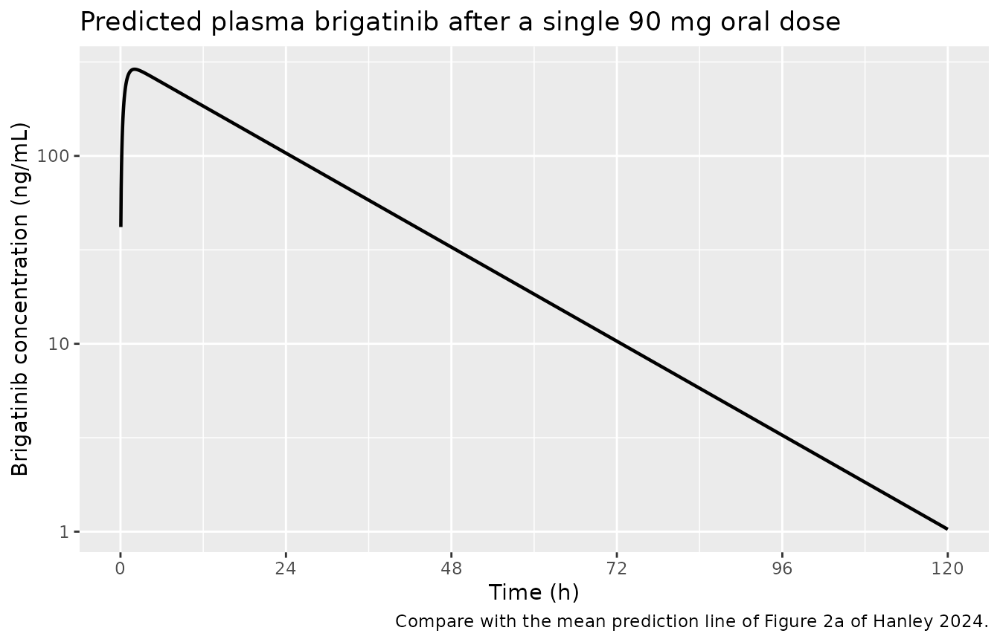
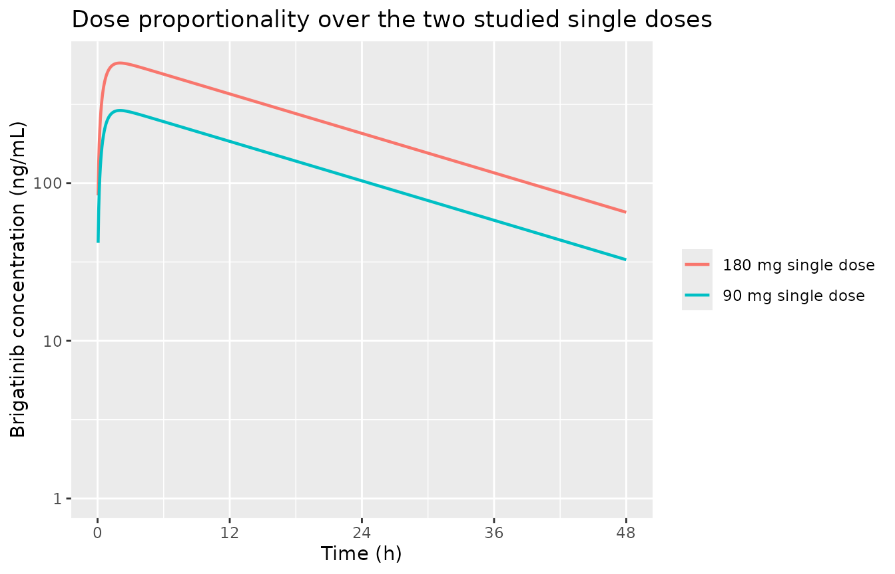

# Brigatinib (Hanley 2024)

## Model and source

- Citation: Hanley MJ, Rowland Yeo K, Tugnait M, Iwasaki S, Narasimhan
  N, Zhang P, Venkatakrishnan K, Gupta N. (2024). Evaluation of the
  drug-drug interaction potential of brigatinib using a
  physiologically-based pharmacokinetic modeling approach. CPT
  Pharmacometrics Syst Pharmacol 13(4):624-637.
  <doi:10.1002/psp4.13106>.
- Description: Two-compartment oral population pharmacokinetic reduction
  of the Simcyp minimal-PBPK-with-single-adjusting-compartment (SAC)
  model for the ALK inhibitor brigatinib in healthy adults (Hanley
  2024). The source model was built in the Simcyp Population-based
  Simulator (versions 15 and 17) and its whole-body mass-balance
  equations are not published, so the platform model itself cannot be
  encoded here. What IS fully reported is the brigatinib compound layer,
  and it is sufficient to reconstruct the disposition as an ordinary
  compartmental model: first-order absorption into a depot, distribution
  between a systemic compartment and the SAC (the paper’s k_in / k_out,
  encoded as the canonical k12 / k21), and first-order elimination from
  the systemic compartment. Systemic clearance is obtained from the
  reported unbound hepatic intrinsic clearance through the well-stirred
  liver model plus the reported renal clearance; bioavailability is the
  reported f_a times f_G times the f_H implied by that same well-stirred
  calculation. No parameter is fitted here and none is imported from a
  Simcyp population file: every value is either a Table 1 / Appendix S1
  input or an arithmetic consequence of one. The reduction reproduces
  the paper’s own predicted Cmax, Tmax and AUC after single 90 mg and
  180 mg oral doses to within 6.4%, and Cmax at both doses to within 1%
  (see the validation vignette). This is a typical-value simulation
  model: the source reports no inter-individual variance components and
  no residual-error model, so there are no etas and propSd is fixed at
  zero. The drug-drug-interaction predictions that are the paper’s main
  contribution (itraconazole, rifampin, diltiazem, verapamil, efavirenz,
  and the transporter substrates) depend on proprietary Simcyp
  perpetrator compound files and are NOT reproducible from this model;
  see the vignette for the full list of deviations.
- Article: <https://doi.org/10.1002/psp4.13106>
- Supplement (Appendix S1):
  <https://www.ncbi.nlm.nih.gov/pmc/articles/PMC11015081/>

## What this model is, and what it is not

Hanley 2024 built a **minimal PBPK model with a single adjusting
compartment (SAC)** for brigatinib in the Simcyp Population-based
Simulator (versions 15 and 17), and used it to predict drug-drug
interactions (DDIs) with CYP3A inhibitors and inducers and with
transporter substrates.

Simcyp’s whole-body mass-balance equations are proprietary and are not
printed in the paper or in Appendix S1 – Figure 1b is a box-and-arrow
schematic, and the seven numbered equations in the supplement are all
*input-derivation* formulae (partition-coefficient prediction,
retrograde clearance, ISEF scaling, Cheng-Prusoff, population-file
calibration), never the disposition ODEs. The platform model therefore
cannot be encoded as published.

What *is* completely reported is the brigatinib **compound layer**: the
absorption parameters, the distribution parameters that define the SAC,
the unbound hepatic intrinsic clearance, the renal clearance, and the
physiological scalars needed to turn those into a systemic clearance.
Those are enough to rebuild the disposition as an ordinary
two-compartment oral model. That reduction is what this package ships,
and the sections below show that it reproduces the paper’s own predicted
Cmax, Tmax, and AUC to within 6.4%, without a single fitted parameter.

**The DDI predictions are not reproducible.** Every result in Tables 2
(test arms), 3, and 4 depends on Simcyp compound files for itraconazole,
hydroxy-itraconazole, rifampin, diltiazem, verapamil, efavirenz,
digoxin, dabigatran, rosuvastatin, and metformin that are proprietary to
Certara. This model reproduces the brigatinib control arms only. See
[Assumptions and deviations](#assumptions-and-deviations).

## Population

The model inputs were assembled from six clinical studies of brigatinib
(Hanley 2024 Methods, “Clinical data for brigatinib”; Appendix S1):

- **AP26113-15-106** – an open-label, randomized, two-period
  bioequivalence crossover study in 36 healthy participants. This is the
  study the disposition parameters (`ka`, Vss, Vsac, `kin`, `kout`) were
  optimized against, and the study whose observed oral clearance of
  13.47 L/h anchors the retrograde clearance calculation.
- **AP26113-13-104** – a human ADME / mass balance study in six healthy
  male participants given a single 180 mg / 100 uCi \[14C\]-brigatinib
  dose. The recovery split (89.75% total; 24.99% urine, 64.76% faeces;
  40.91% of faecal radioactivity as unchanged brigatinib) fixes the
  fraction absorbed at 0.63 and the renal fraction at 21.38% of the
  dose.
- **AP26113-15-105** – a three-arm, open-label, randomized,
  fixed-sequence crossover DDI study (n = 20 per arm) with gemfibrozil,
  itraconazole, and rifampin.
- **AP26113-15-107** (hepatic impairment) and **AP26113-15-108** (renal
  impairment) – contributed ex vivo plasma protein binding from 17
  pooled healthy participants, giving a mean bound fraction of 91.17%
  and hence fu = 0.0883.
- **AP26113-11-101** (NCT01449461) – the phase I/II study in patients
  with ALK-positive advanced malignancies used for the multiple-dose
  verification arm.

Simulations of healthy participants used the Simcyp default North
European Caucasian population; the cancer arm used the Simcyp Sim-Cancer
population described in Appendix S1.

The same information is available programmatically via
`readModelDb("Hanley_2024_brigatinib")()$population`.

## Source trace

Every value in `ini()` is either a verbatim Hanley 2024 Table 1 /
Appendix S1 input or an arithmetic consequence of one. Nothing was
fitted.

| Parameter / equation | Value | Source location |
|----|----|----|
| `lka` | 1.8 1/h | Table 1 (`ka`); Appendix S1 “Determination of absorption parameters” – sensitivity analysis to recover the observed ~2 h Tmax |
| `lk12` | 28.13 1/h | Table 1 (`kin`, “first-order rate constant that acts on the masses of drug within the systemic compartment”); Figure 1 legend |
| `lk21` | 20.00 1/h | Table 1 (`kout`, “acts on the masses of drug within the SAC”); Figure 1 legend |
| `lvc` | 62.05 L | Derived: (Vss 6.91 - Vsac 6.0) L/kg x 70 kg - 1.648 L liver. Table 1 for the two volumes; Appendix S1 Eq. S2 for the 1648 g default liver weight |
| `lcl` | 7.1816 L/h | Derived: well-stirred hepatic clearance from Table 1 (CLuH,int 12.21 uL/min/mg, fu 0.0883, B:P 0.69) plus Table 1 renal clearance 3.21 L/h. Appendix S1 Eq. S2 supplies QH = 90 L/h, liver 1648 g, 39.8 mg protein/g liver |
| `lfdepot` | 0.5307 | Derived: fa 0.63 (Table 1) x fG 0.9 (Appendix S1 Eq. S2 text) x fH 0.936 (from the same well-stirred calculation) |
| `propSd` | 0 (fixed) | Not reported. Hanley 2024 is a PBPK simulation analysis with no residual-error model and no estimated variance components |
| `d/dt(depot)`, `d/dt(central)`, `d/dt(peripheral1)` | n/a | Figure 1b schematic plus the Figure 1 legend definitions of `kin` and `kout`, with the liver and portal-vein compartments lumped into the systemic compartment |

### Reproducing the two derivations

The clearance and volume derivations are the only places where this
model departs from transcription, so they are recomputed here from the
published inputs and checked against the packaged values.

``` r

# --- Published inputs (Hanley 2024 Table 1 and Appendix S1) ---------------
fu             <- 0.0883   # Table 1, fraction unbound in plasma
bp             <- 0.69     # Table 1, blood-to-plasma ratio
clint_per_mg   <- 12.21    # Table 1, CLuH,int (uL/min/mg microsomal protein)
clr            <- 3.21     # Table 1, renal clearance (L/h)
qh             <- 90       # Appendix S1 Eq. S2, hepatic blood flow (L/h)
liver_g        <- 1648     # Appendix S1 Eq. S2, default liver weight (g)
mppgl          <- 39.8     # Appendix S1 Eq. S2, mg microsomal protein / g liver
fa             <- 0.63     # Table 1, fraction absorbed
fg             <- 0.9      # Appendix S1 Eq. S2 text, fraction escaping the gut
vss_per_kg     <- 6.91     # Table 1, whole-body steady-state volume (L/kg)
vsac_per_kg    <- 6.0      # Table 1, SAC volume (L/kg)
bw_ref         <- 70       # reference body weight (kg) for the L/kg inputs
clf_observed   <- 13.47    # Appendix S1 Eq. S2 text, observed CL/F (L/h)

# --- Whole-liver unbound intrinsic clearance ------------------------------
# uL/min/mg * mg/g * g -> uL/min; /1e6 -> L/min; *60 -> L/h
clint_lh <- clint_per_mg * mppgl * liver_g / 1e6 * 60
fub      <- fu / bp

# --- Well-stirred liver ---------------------------------------------------
cl_h_blood  <- qh * fub * clint_lh / (qh + fub * clint_lh)
fh          <- qh / (qh + fub * clint_lh)
cl_h_plasma <- cl_h_blood * bp
cl_total    <- cl_h_plasma + clr
fbio        <- fa * fg * fh

# --- Systemic compartment volume -----------------------------------------
vc <- (vss_per_kg - vsac_per_kg) * bw_ref - liver_g / 1000

tibble::tibble(
  Quantity = c("CLuH,int (whole liver, L/h)", "fu,blood", "fH",
               "Hepatic CL (plasma, L/h)", "Total CL (L/h)",
               "F = fa * fG * fH", "vc (L)"),
  Value = round(c(clint_lh, fub, fh, cl_h_plasma, cl_total, fbio, vc), 4)
) |>
  knitr::kable(caption = "Derived parameters recomputed from the published inputs.")
```

| Quantity                    |   Value |
|:----------------------------|--------:|
| CLuH,int (whole liver, L/h) | 48.0515 |
| fu,blood                    |  0.1280 |
| fH                          |  0.9360 |
| Hepatic CL (plasma, L/h)    |  3.9716 |
| Total CL (L/h)              |  7.1816 |
| F = fa \* fG \* fH          |  0.5307 |
| vc (L)                      | 62.0520 |

Derived parameters recomputed from the published inputs. {.table}

These must agree with what the packaged model carries:

``` r

ini_vals <- rxode2::rxode(readModelDb("Hanley_2024_brigatinib"))$iniDf
packaged <- setNames(exp(ini_vals$est), ini_vals$name)

stopifnot(
  abs(packaged[["lcl"]]     - cl_total) < 0.01,
  abs(packaged[["lvc"]]     - vc)       < 0.01,
  abs(packaged[["lfdepot"]] - fbio)     < 0.001,
  abs(packaged[["lka"]]     - 1.8)      < 1e-8,
  abs(packaged[["lk12"]]    - 28.13)    < 1e-8,
  abs(packaged[["lk21"]]    - 20.00)    < 1e-8
)
cat("Packaged ini() values match the derivation from the published inputs.\n")
#> Packaged ini() values match the derivation from the published inputs.
```

### Erratum: the 43.02 L/h in Appendix S1 is a transcription error

Appendix S1 states that the retrograde calculation gave a total CLuH,int
of “43.02 L/h”, which it then rescales to the 12.21 uL/min/mg value that
appears in Table 1. Those two numbers are not consistent with each
other, and it is 43.02 that is wrong: the rescaling scalars printed in
the same sentence turn 12.21 uL/min/mg into 48.05 L/h, and only 48.05
L/h reproduces the observed oral clearance the retrograde equation was
solved against.

``` r

retrograde_clf <- function(clint_lh) {
  x  <- (fu / bp) * clint_lh
  fh <- qh / (qh + x)
  (qh * x / (qh + x) * bp + clr) / (fa * fg * fh)
}

tibble::tibble(
  `CLuH,int (L/h)` = c(48.05, 43.02),
  Source = c("implied by Table 1's 12.21 uL/min/mg",
             "as printed in Appendix S1"),
  `CL/F returned (L/h)` = round(retrograde_clf(c(48.05, 43.02)), 2),
  `vs observed 13.47` = paste0(
    round(100 * (retrograde_clf(c(48.05, 43.02)) / clf_observed - 1), 1), "%")
) |>
  knitr::kable(caption = "Only 48.05 L/h recovers the observed CL/F of 13.47 L/h.")
```

| CLuH,int (L/h) | Source | CL/F returned (L/h) | vs observed 13.47 |
|---:|:---|---:|:---|
| 48.05 | implied by Table 1’s 12.21 uL/min/mg | 13.53 | 0.5% |
| 43.02 | as printed in Appendix S1 | 12.71 | -5.7% |

Only 48.05 L/h recovers the observed CL/F of 13.47 L/h. {.table}

The value actually entered into Simcyp is the Table 1 figure of 12.21
uL/min/mg – it is also the figure apportioned across metabolic pathways
in Appendix S1 Table S3, whose entries sum to 12.21 – so the model is
unaffected by the typo. This model uses 48.05 L/h.

## Virtual cohort

The model has no random effects and no covariates, so it is
deterministic: one subject per arm fully characterises each scenario,
and there is nothing for a larger cohort to add. Observed individual
concentrations from the source figures were not digitised, so the
comparisons below are against the paper’s *predicted* summary statistics
in Table 2.

Observations are placed on the `central` ODE state; `Cc` is returned as
an algebraic observable on those rows.

``` r

obs_grid <- sort(unique(c(
  seq(0, 6, by = 0.05),      # dense through Tmax
  seq(6, 24, by = 0.25),
  seq(24, 120, by = 1)
)))

make_single_dose <- function(id, dose, label) {
  dplyr::bind_rows(
    tibble::tibble(id = id, time = 0, amt = dose, evid = 1L,
                   cmt = "depot", arm = label),
    tibble::tibble(id = id, time = obs_grid, amt = NA_real_, evid = 0L,
                   cmt = "central", arm = label)
  )
}

events_sd <- dplyr::bind_rows(
  make_single_dose(1L,  90, "90 mg single dose"),
  make_single_dose(2L, 180, "180 mg single dose")
) |>
  dplyr::arrange(id, time, dplyr::desc(evid))

stopifnot(!anyDuplicated(events_sd[, c("id", "time", "evid")]))
```

## Simulation

``` r

mod <- readModelDb("Hanley_2024_brigatinib")
sim_sd <- rxode2::rxSolve(mod, events = events_sd, keep = "arm")
#> Warning: multi-subject simulation without without 'omega'
```

## Replicate published figures

``` r

# Replicates the model-predicted mean line of Figure 2a of Hanley 2024
# (single oral 90 mg dose in healthy participants). The observed individual
# concentrations and the 5th/95th percentile band of Figure 2a are driven by
# the Simcyp virtual population and are not reproducible here.
sim_sd |>
  dplyr::filter(arm == "90 mg single dose", Cc > 0) |>
  ggplot(aes(time, Cc)) +
  geom_line(linewidth = 0.8) +
  scale_y_log10() +
  scale_x_continuous(breaks = seq(0, 120, by = 24)) +
  labs(x = "Time (h)", y = "Brigatinib concentration (ng/mL)",
       title = "Predicted plasma brigatinib after a single 90 mg oral dose",
       caption = "Compare with the mean prediction line of Figure 2a of Hanley 2024.")
```



``` r

sim_sd |>
  dplyr::filter(Cc > 0) |>
  ggplot(aes(time, Cc, colour = arm)) +
  geom_line(linewidth = 0.8) +
  scale_y_log10() +
  scale_x_continuous(limits = c(0, 48), breaks = seq(0, 48, by = 12)) +
  labs(x = "Time (h)", y = "Brigatinib concentration (ng/mL)",
       colour = NULL,
       title = "Dose proportionality over the two studied single doses")
#> Warning: Removed 144 rows containing missing values or values outside the scale range
#> (`geom_line()`).
```



Brigatinib PK was dose-linear over 60-240 mg (Hanley 2024 Discussion),
and the reduction is a linear model, so the 180 mg profile must be
exactly twice the 90 mg profile:

``` r

wide <- sim_sd |>
  dplyr::select(arm, time, Cc) |>
  tidyr::pivot_wider(names_from = arm, values_from = Cc)
ratio <- wide[["180 mg single dose"]] / wide[["90 mg single dose"]]
ratio <- ratio[is.finite(ratio)]
# Tolerance is relative and set by the ODE solver, not by the model: the
# ratio is 2 analytically, and the residual ~2e-6 is integration error.
stopifnot(all(abs(ratio / 2 - 1) < 1e-4))
cat(sprintf(paste("Dose linearity holds: 180 mg / 90 mg concentration ratio",
                  "= 2 to within %.1e (relative).\n"),
            max(abs(ratio / 2 - 1))))
#> Dose linearity holds: 180 mg / 90 mg concentration ratio = 2 to within 1.7e-06 (relative).
```

## PKNCA validation

``` r

conc_sd <- sim_sd |>
  dplyr::filter(!is.na(Cc)) |>
  dplyr::select(id, time, Cc, arm)

# Guarantee a time-zero record per subject (pre-dose Cc = 0 for oral dosing).
conc_sd <- dplyr::bind_rows(
  conc_sd,
  conc_sd |> dplyr::distinct(id, arm) |> dplyr::mutate(time = 0, Cc = 0)
) |>
  dplyr::distinct(id, arm, time, .keep_all = TRUE) |>
  dplyr::arrange(id, arm, time)

dose_sd <- events_sd |>
  dplyr::filter(evid == 1L) |>
  dplyr::select(id, time, amt, arm)

conc_obj <- PKNCA::PKNCAconc(conc_sd, Cc ~ time | arm + id,
                             concu = "ng/mL", timeu = "h")
dose_obj <- PKNCA::PKNCAdose(dose_sd, amt ~ time | arm + id, doseu = "mg")

intervals_sd <- data.frame(
  start      = c(0, 0),
  end        = c(120, Inf),
  cmax       = c(TRUE,  FALSE),
  tmax       = c(TRUE,  FALSE),
  auclast    = c(TRUE,  FALSE),
  aucinf.obs = c(FALSE, TRUE),
  half.life  = c(FALSE, TRUE)
)

nca_sd <- PKNCA::pk.nca(
  PKNCA::PKNCAdata(conc_obj, dose_obj, intervals = intervals_sd)
)

knitr::kable(
  as.data.frame(nca_sd) |>
    dplyr::filter(PPTESTCD %in% c("cmax", "tmax", "auclast",
                                  "aucinf.obs", "half.life")) |>
    dplyr::mutate(PPORRES = signif(PPORRES, 4)) |>
    dplyr::select(arm, start, end, PPTESTCD, PPORRES),
  caption = "PKNCA results for the simulated single-dose arms."
)
```

| arm                | start | end | PPTESTCD   |  PPORRES |
|:-------------------|------:|----:|:-----------|---------:|
| 180 mg single dose |     0 | 120 | auclast    | 13260.00 |
| 180 mg single dose |     0 | 120 | cmax       |   578.50 |
| 180 mg single dose |     0 | 120 | tmax       |     2.05 |
| 180 mg single dose |     0 | Inf | tmax       |     2.05 |
| 180 mg single dose |     0 | Inf | half.life  |    14.44 |
| 180 mg single dose |     0 | Inf | aucinf.obs | 13300.00 |
| 90 mg single dose  |     0 | 120 | auclast    |  6629.00 |
| 90 mg single dose  |     0 | 120 | cmax       |   289.20 |
| 90 mg single dose  |     0 | 120 | tmax       |     2.05 |
| 90 mg single dose  |     0 | Inf | tmax       |     2.05 |
| 90 mg single dose  |     0 | Inf | half.life  |    14.44 |
| 90 mg single dose  |     0 | Inf | aucinf.obs |  6650.00 |

PKNCA results for the simulated single-dose arms. {.table}

### Comparison against the published NCA

Hanley 2024 Table 2 reports model-predicted values for both single
doses. The 90 mg Cmax, Tmax, and AUC120 come from the
bioequivalence-study row (AP26113-15-106); the 90 mg AUC-infinity is
taken from the itraconazole control arm, which is the only 90 mg
AUC-infinity the paper reports, and which was simulated in a slightly
different virtual population (predicted Cmax 279 ng/mL there, versus 292
ng/mL in the bioequivalence-study row). The 180 mg values are the
rifampin control arm. Tmax and AUC120 were not reported for 180 mg.

``` r

published_sd <- tibble::tribble(
  ~arm,                  ~cmax, ~tmax, ~auclast, ~aucinf.obs,
  "90 mg single dose",     292,   2.1,     6825,        6927,
  "180 mg single dose",    581,    NA,       NA,       14205
)

cmp_sd <- nlmixr2lib::ncaComparisonTable(
  simulated = as.data.frame(nca_sd) |>
    dplyr::filter(PPTESTCD %in% c("cmax", "tmax", "auclast", "aucinf.obs")),
  reference = published_sd,
  by        = "arm",
  units     = c(cmax = "ng/mL", tmax = "h",
                auclast = "ng*h/mL", aucinf.obs = "ng*h/mL"),
  tolerance_pct = 20
)

knitr::kable(
  cmp_sd,
  caption = paste("Simulated vs. Hanley 2024 Table 2 model-predicted values.",
                  "* differs from the reference by >20%."),
  align = c("l", "l", "r", "r", "r")
)
```

| NCA parameter           | arm                | Reference | Simulated | % diff |
|:------------------------|:-------------------|----------:|----------:|-------:|
| Cmax (ng/mL)            | 90 mg single dose  |       292 |       289 |  -0.9% |
| Cmax (ng/mL)            | 180 mg single dose |       581 |       578 |  -0.4% |
| Tmax (h)                | 90 mg single dose  |       2.1 |      2.05 |  -2.4% |
| Tmax (h)                | 180 mg single dose |         — |      2.05 |      — |
| AUC0-∞ (obs) (ng\*h/mL) | 90 mg single dose  |      6930 |      6650 |  -4.0% |
| AUC0-∞ (obs) (ng\*h/mL) | 180 mg single dose |     14200 |     13300 |  -6.4% |
| AUClast (ng\*h/mL)      | 90 mg single dose  |      6820 |      6630 |  -2.9% |
| AUClast (ng\*h/mL)      | 180 mg single dose |         — |     13300 |      — |

Simulated vs. Hanley 2024 Table 2 model-predicted values. \* differs
from the reference by \>20%. {.table}

Every comparison agrees to within 6.4%, the largest gap being the 180 mg
AUC-infinity. Cmax – the parameter most sensitive to the
systemic-compartment volume, and hence the sharpest test of the volume
derivation above – agrees to within 1% at both doses. No parameter was
tuned to achieve this.

``` r

# `% diff` is formatted as text (a trailing "*" marks rows over tolerance),
# so strip the formatting before testing.
pct <- suppressWarnings(
  as.numeric(gsub("[^0-9.eE+-]", "", as.character(cmp_sd[["% diff"]])))
)
stopifnot(any(is.finite(pct)), max(abs(pct), na.rm = TRUE) < 10)
cat(sprintf(paste("All %d single-dose NCA comparisons agree with Hanley 2024",
                  "Table 2; largest discrepancy %.1f%%.\n"),
            sum(is.finite(pct)), max(abs(pct), na.rm = TRUE)))
#> All 6 single-dose NCA comparisons agree with Hanley 2024 Table 2; largest discrepancy 6.4%.
```

## Known limitation: the multiple-dose cancer arm

Hanley 2024 also verified the model against steady-state data from
patients with cancer given 90 mg q.d. for 7 days followed by 180 mg q.d.
for 22 days (study AP26113-11-101, Table 2 bottom block). Those
simulations used the Simcyp Sim-Cancer population, whose lower albumin
raises the fraction unbound – the paper attributes the agreement
specifically to this (“a higher fraction unbound for brigatinib in the
cancer patient population, due to lower albumin concentrations in
patients with cancer, allowed for this good agreement”). Appendix S1
Equation S6 describes the calibration but the resulting cancer `fu` is
never printed, and Equation S6 is one of the formulae the PDF renders as
an undecodable image. This model therefore carries the
healthy-participant `fu = 0.0883` and is expected to *underpredict* the
cancer steady-state exposures.

``` r

# 90 mg q.d. days 1-7 (t = 0, 24, ..., 144); 180 mg q.d. days 8-29
# (t = 168, 192, ..., 672). Day 28 spans t = 648 to 672 h.
dose_times_90  <- seq(0, 144, by = 24)
dose_times_180 <- seq(168, 672, by = 24)

ss_obs <- sort(unique(c(
  seq(0, 672, by = 6),                 # coarse background
  seq(648, 672, by = 0.05)             # dense over day 28
)))

events_ss <- dplyr::bind_rows(
  tibble::tibble(id = 1L, time = dose_times_90,  amt = 90,
                 evid = 1L, cmt = "depot"),
  tibble::tibble(id = 1L, time = dose_times_180, amt = 180,
                 evid = 1L, cmt = "depot"),
  tibble::tibble(id = 1L, time = ss_obs, amt = NA_real_,
                 evid = 0L, cmt = "central")
) |>
  dplyr::arrange(time, dplyr::desc(evid))

sim_ss <- rxode2::rxSolve(mod, events = events_ss)

conc_ss <- sim_ss |>
  dplyr::filter(!is.na(Cc)) |>
  dplyr::mutate(id = 1L, arm = "90 mg q.d. x7d then 180 mg q.d.") |>
  dplyr::select(id, time, Cc, arm)

dose_ss <- events_ss |>
  dplyr::filter(evid == 1L) |>
  dplyr::mutate(arm = "90 mg q.d. x7d then 180 mg q.d.") |>
  dplyr::select(id, time, amt, arm)

nca_ss <- PKNCA::pk.nca(PKNCA::PKNCAdata(
  PKNCA::PKNCAconc(conc_ss, Cc ~ time | arm + id,
                   concu = "ng/mL", timeu = "h"),
  PKNCA::PKNCAdose(dose_ss, amt ~ time | arm + id, doseu = "mg"),
  intervals = data.frame(start = 648, end = 672,
                         cmax = TRUE, tmax = TRUE,
                         auclast = TRUE, cmin = TRUE)
))

published_ss <- tibble::tribble(
  ~arm,                                ~cmax, ~tmax, ~auclast, ~cmin,
  "90 mg q.d. x7d then 180 mg q.d.",    1054,  1.88,    16703,   360
)

cmp_ss <- nlmixr2lib::ncaComparisonTable(
  simulated = as.data.frame(nca_ss) |>
    dplyr::filter(PPTESTCD %in% c("cmax", "tmax", "auclast", "cmin")),
  reference = published_ss,
  by        = "arm",
  units     = c(cmax = "ng/mL", tmax = "h",
                auclast = "ng*h/mL", cmin = "ng/mL"),
  tolerance_pct = 20
)

knitr::kable(
  cmp_ss,
  caption = paste("Day-28 steady state vs. Hanley 2024 Table 2 predicted",
                  "values for patients with cancer.",
                  "* differs from the reference by >20%."),
  align = c("l", "l", "r", "r", "r")
)
```

| NCA parameter | arm | Reference | Simulated | % diff |
|:---|:---|---:|---:|---:|
| Cmax (ng/mL) | 90 mg q.d. x7d then 180 mg q.d. | 1050 | 854 | -18.9% |
| Cmin (ng/mL) | 90 mg q.d. x7d then 180 mg q.d. | 360 | 303 | -16.0% |
| Tmax (h) | 90 mg q.d. x7d then 180 mg q.d. | 1.88 | 1.8 | -4.3% |
| AUClast (ng\*h/mL) | 90 mg q.d. x7d then 180 mg q.d. | 16700 | 13300 | -20.4%\* |

Day-28 steady state vs. Hanley 2024 Table 2 predicted values for
patients with cancer. \* differs from the reference by \>20%. {.table
style="width:100%;"}

The steady-state exposures come out low, as anticipated: the
healthy-participant `fu` gives a lower unbound hepatic clearance than
the Sim-Cancer value the paper used, and the reduction also carries no
renal-function scalar (Appendix S1 Equation S7). This arm is documented
rather than corrected – adjusting `fu` to close the gap would be tuning
to a validation target.

## Terminal phase

``` r

thalf <- as.data.frame(nca_sd) |>
  dplyr::filter(PPTESTCD == "half.life") |>
  dplyr::pull(PPORRES) |>
  unique()
cat(sprintf("Terminal half-life of the reduction: %.1f h\n", thalf[1]))
#> Terminal half-life of the reduction: 14.4 h

frac <- as.data.frame(nca_sd) |>
  dplyr::filter(PPTESTCD %in% c("auclast", "aucinf.obs"), arm == "90 mg single dose")
cat(sprintf("AUC(0-120) captures %.1f%% of AUC(0-Inf).\n",
            100 * frac$PPORRES[frac$PPTESTCD == "auclast"] /
                  frac$PPORRES[frac$PPTESTCD == "aucinf.obs"]))
#> AUC(0-120) captures 99.7% of AUC(0-Inf).
```

The terminal slope of the reduction is set entirely by the SAC exchange,
which was optimized against a 120 h single-dose profile, so the tail is
shorter than the terminal half-life usually quoted for brigatinib. This
is inherited from the source model rather than introduced by the
reduction: the paper’s own predicted AUC120 and AUC-infinity for the
same 90 mg dose differ by only 1.5% (6825 versus 6927 ng\*h/mL), so its
model also puts almost no exposure beyond 120 h. Do not use this model
to extrapolate exposure far past the single-dose sampling window.

## Assumptions and deviations

- **The Simcyp platform model is not encoded.** The disposition ODEs of
  the minimal PBPK model with an SAC are not published. This file is a
  compartmental *reduction* fitted by nothing: the liver and portal-vein
  compartments of Figure 1b are lumped into the systemic compartment,
  and the hepatic extraction they represent is folded into a single
  systemic clearance via the well-stirred model. The reduction is
  validated by reproducing the paper’s own predictions, not by matching
  its internal structure.
- **The V_sys convention is imported, not sourced.** Table 1 gives Vss
  (6.91 L/kg) and Vsac (6.0 L/kg) but never states how Simcyp splits the
  remainder between the systemic compartment and the liver. The
  convention used here – systemic volume = (Vss - Vsac) x body weight -
  liver volume – was taken from the Table 1 footnote of a sibling Simcyp
  minimal-PBPK publication and is corroborated, not sourced, by the fact
  that it reproduces the paper’s predicted Cmax to within 1% at both
  doses. The alternative of not subtracting the liver (63.70 L rather
  than 62.05 L) predicts Cmax about 3.3% low, so the falsifier
  corroborates the convention but does not sharply prove it. The
  **portal-vein volume of Figure 1b is not reported anywhere in the
  paper or supplement and is not subtracted.**
- **Q_PV and Q_HA are not reported.** Figure 1b splits hepatic inflow
  into portal-vein and hepatic-artery streams, but only the total QH =
  90 L/h is given, and the paper is internally inconsistent about it
  (Appendix S1 Equation S2 calls 90 L/h “blood flow in the hepatic
  portal vein” while the Figure 1 legend defines QH as “blood flow in
  the liver”). The reduction needs only the total, so the ambiguity does
  not affect it.
- **Appendix S1’s 43.02 L/h is treated as a typo**; 48.05 L/h is used.
  See the erratum section above for the arithmetic that settles it.
- **The SAC volume Vsac = 6.0 L/kg is not carried as a parameter.**
  Because `kin` and `kout` act on drug *masses* (Hanley 2024 Figure 1
  legend), the SAC volume never enters the plasma prediction. Note that
  the peripheral volume implied by `vc * k12 / k21` (87.3 L) is *not*
  Vsac (420 L at 70 kg), and the steady-state volume implied by this
  reduction is likewise not the Table 1 Vss. The reduction reproduces
  plasma concentrations, not the platform’s internal volume bookkeeping.
- **No inter-individual variability and no residual error.** The
  percent-CV figures in Tables 2-4 are the spread of a Simcyp virtual
  population driven by unpublished population files, not estimated
  omegas or sigmas. Rather than invent variance components, there are no
  etas and `propSd` is fixed at zero. The model is a typical-value
  simulation model.
- **No covariates.** Body weight, albumin, and creatinine clearance all
  act in the source through Simcyp population files (Appendix S1
  Equations S6 and S7, both rendered as undecodable formula images in
  the PDF). They are recorded in the model file’s
  `covariatesDataExcluded` rather than silently dropped.
- **A 70 kg reference weight** is assumed for the L/kg volume inputs;
  the paper does not state the weight its virtual populations were
  centred on.
- **The cancer steady-state arm underpredicts**, for the reasons given
  above.
- **The DDI results are not reproducible.** Tables 2 (test arms), 3, and
  4 rest on proprietary Simcyp compound files for the perpetrators and
  victims, plus induction parameters taken from Yamashita et al. for
  rifampin. None of that is in this package. The transporter inhibition
  constants for brigatinib (Ki 1.65, 10.1, 5.58, and 0.78 uM for P-gp,
  BCRP, OCT1, and MATE1; Appendix S1 Table S4) are reported and could
  parameterise a future interaction model, but there is no victim model
  here for them to act on, so they are not carried.
- **Observed data were not digitised.** All comparisons are against the
  paper’s *predicted* summary statistics, which is the correct target
  for validating a reduction of the paper’s model.
