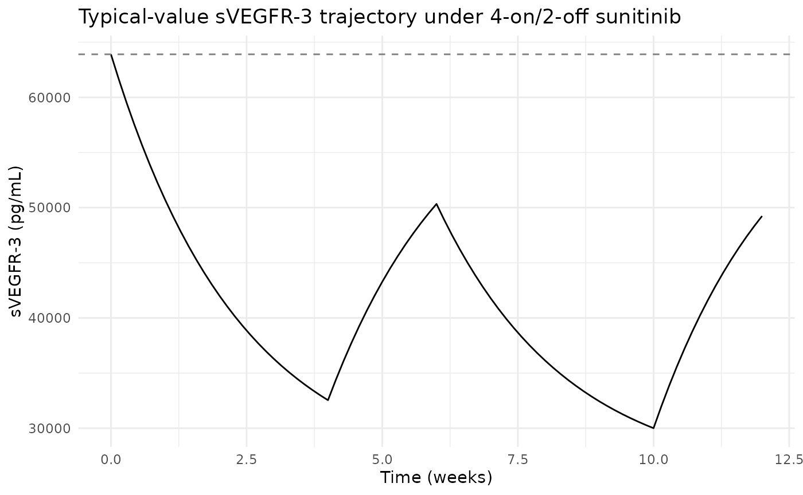
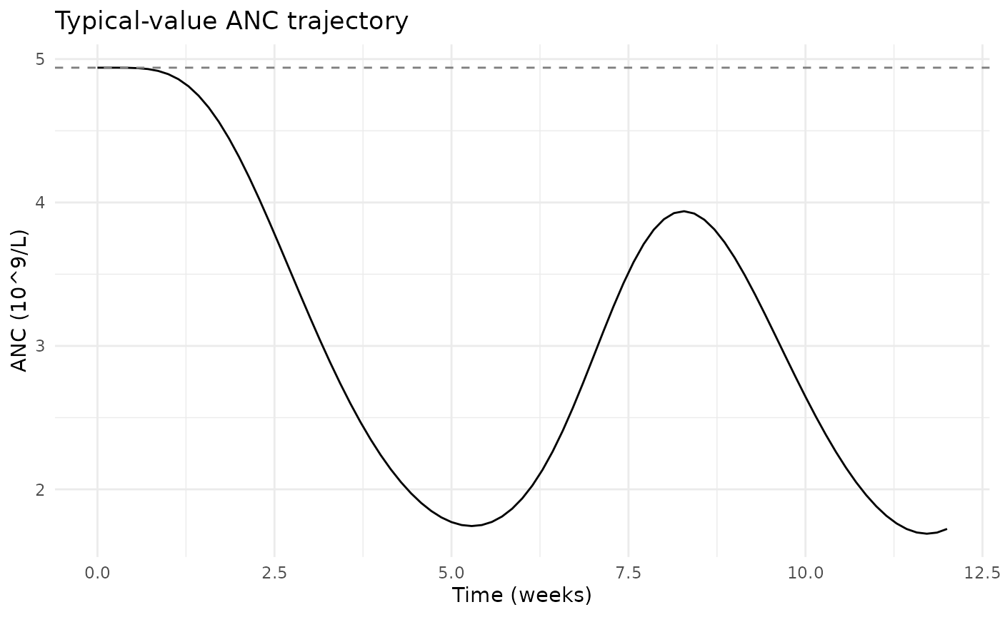

# Sunitinib myelosuppression (Hansson 2013)

## Model and source

- Citation: Hansson EK, Ma G, Amantea MA, French J, Milligan PA, Friberg
  LE, Karlsson MO. PKPD modeling of predictors for adverse effects and
  overall survival in sunitinib-treated patients with GIST. *CPT
  Pharmacometrics Syst Pharmacol* 2013;2(11):e85.
- Article:
  [doi:10.1038/psp.2013.62](https://doi.org/10.1038/psp.2013.62)
- Upstream sVEGFR-3 biomarker dynamics: `Hansson_2013a_sunitinib`
  (DDMODEL00000197, <doi:10.1038/psp.2013.61>).
- Friberg myelosuppression backbone: Friberg LE et al. *J Clin Oncol*
  2002;20(24):4713-4721,
  [doi:10.1200/JCO.2002.02.140](https://doi.org/10.1200/JCO.2002.02.140).

This vignette extracts the **myelosuppression** sub-model from the
Hansson 2013 e85 framework – one of five linked sub-models in the paper
alongside diastolic blood pressure (`Hansson_2013_sunitinib_dbp`),
fatigue (`Hansson_2013c_sunitinib`; from the DDMORE bundle), hand-foot
syndrome (`Hansson_2013_sunitinib_hfs`), and overall survival
(`Hansson_2013_sunitinib_os`).

## Population

The Hansson 2013 e85 analysis pooled data from four sunitinib trials in
303 adults with imatinib-resistant gastrointestinal stromal tumours
(GIST): Demetri 2006 (study 1004; phase III; 202 active + 47 placebo),
George 2009 (study 1047; phase II continuous dosing; n = 13 in this
subset), Shirao 2010 (study 1045; Japanese phase I/II; n = 36), Maki
2005 (study 013; phase I/II; n = 52). Sunitinib doses ranged from 25 to
75 mg PO QD on 4/2, 2/2, 2/1 weeks-on/off, or continuous schedules
(Table 1). The Japanese cohort (Study 1045) had a lower observed ANC
baseline, so the model carries a separate `ANC0` for `RACE_JAPANESE = 1`
(3.69 vs 4.94 in 10^9/L; Table 2 row ‘ANC0: Study 45’).

`readModelDb("Hansson_2013_sunitinib_myelosuppression")$population`
returns the same information programmatically.

## Source trace

All parameter values come from Hansson 2013 e85 Table 2
‘Myelosuppression model’ block. The model encodes the paper’s
drug-effect descriptor (sVEGFR-3 REL, the relative reduction in sVEGFR-3
from baseline) by simulating the upstream sVEGFR-3 dynamics in-model
from the Hansson 2013a / DDMODEL00000197 indirect-response covariates
(BAS_SVEGFR3, MRT_SVEGFR3, EC50_SVEGFR3), then computing
`svegfr3_rel = (BAS_SVEGFR3 - svegfr3) / BAS_SVEGFR3`.

| Equation / parameter | Source location |
|----|----|
| Friberg-Karlsson 5-compartment chain (prol + 3 transit + circ) | Hansson 2013 e85 Methods ‘Myelosuppression model’ |
| `ktr <- 4 / mtt` (Friberg n=3 + prol form) | Methods ‘three transit compartments reflecting cell maturation’ |
| `edrug <- Emax * svegfr3_rel / (EC50 + svegfr3_rel)` | Methods ‘An Emax function most appropriately characterized the biomarker-ANC relationship’ |
| `feed <- (anc0 / circ)^gamma` | Methods ‘a feedback function mimicking the effect of endogenous growth factors’ |
| `auc <- DOSE / CLI` and `svegfr3` indirect-response turnover | Methods ‘Total oral plasma clearance … obtained from a population PK model’ + Hansson_2013a structural form |
| `svegfr3_rel = (BAS_SVEGFR3 - svegfr3) / BAS_SVEGFR3` | Methods ‘sVEGFR-3 REL … a more pronounced reduction’ |
| `lanc0 = log(4.94)` (10^9/L; non-Japanese) | Hansson 2013 Table 2 row ‘ANC0’ = 4.94 (RSE 2.8%) |
| `e_japanese_anc0 = log(3.69 / 4.94) = -0.292` | Hansson 2013 Table 2 row ‘ANC0: Study 45’ = 3.69 (RSE 6.9%) |
| `lmtt = log(248)` (h) | Hansson 2013 Table 2 row ‘MTT’ = 248 h (RSE 3.6%) |
| `lanc_emax = log(0.520)` | Hansson 2013 Table 2 row ‘ANC Emax’ = 0.520 (RSE 9.1%) |
| `lanc_ec50 = log(0.552)` | Hansson 2013 Table 2 row ‘ANC EC50’ = 0.552 (RSE 17%) |
| `gamma = 0.362` | Hansson 2013 Table 2 row ‘gamma’ = 0.362 (RSE 7.4%) |
| `etalanc0 + etalanc_emax ~ c(0.1633, 0.04707, 0.01678)` | Hansson 2013 Table 2 IIV CV% (ANC0 = 42%, ANC Emax = 13%), Results section: ‘a correlation between ANC0 and Emax of 90%’ |
| `etalmtt ~ 0.02852` | Hansson 2013 Table 2 IIV CV% MTT = 17% |
| `etalanc_ec50 ~ 0.1929` | Hansson 2013 Table 2 IIV CV% ANC EC50 = 46% |
| `addSd_anc = 0.406` | Hansson 2013 Table 2 ‘Residual error’ = 0.406 on the Box-Cox-transformed scale |

## Drug-exposure inputs and required covariates

The model has no PK ODE: sunitinib exposure is summarised per-cycle as
`auc = DOSE / CLI` (mg\*h/L) and fed into a simple-Imax inhibition of
sVEGFR-3 Kin. The required data columns are:

- `DOSE` (mg) – time-varying daily sunitinib dose. Held at 50 mg during
  on-cycles of a 4-weeks-on / 2-weeks-off schedule, 0 mg during
  off-cycles or placebo.
- `CLI` (L/h) – per-subject sunitinib clearance from the upstream popPK
  model. Use 32.819 L/h for typical-cohort simulations (matches
  Hansson_2013a / Hansson_2013c convention).
- `BAS_SVEGFR3` (pg/mL) – baseline sVEGFR-3 from the upstream Hansson
  2013a biomarker model; typical 63 900 pg/mL.
- `MRT_SVEGFR3` (h) – mean residence time of sVEGFR-3; typical 401 h.
- `EC50_SVEGFR3` (mg*h/L) – EC50 of the sVEGFR-3 drug effect; typical
  1.0 mg*h/L.
- `RACE_JAPANESE` (0/1) – 1 for Study 1045 subjects (lower ANC0); 0
  otherwise.

## Virtual cohort

``` r

mod  <- readModelDb("Hansson_2013_sunitinib_myelosuppression")
modT <- rxode2::zeroRe(mod)
#> ℹ parameter labels from comments will be replaced by 'label()'

# DOSE follows the 4-weeks-on / 2-weeks-off sunitinib schedule.
on_off_dose <- function(time_h, daily_mg = 50) {
  week_idx  <- floor(time_h / (7 * 24))
  cycle_idx <- week_idx %% 6
  ifelse(cycle_idx < 4, daily_mg, 0)
}

# 12-week typical-cohort simulation with daily observations.
obs_times <- seq(0, 12 * 7 * 24, by = 24)

events <- data.frame(
  id            = 1L,
  time          = obs_times,
  evid          = 0L,
  amt           = 0,
  cmt           = "circ",
  DOSE          = on_off_dose(obs_times, daily_mg = 50),
  CLI           = 32.819,
  BAS_SVEGFR3   = 63900,
  MRT_SVEGFR3   = 401,
  EC50_SVEGFR3  = 1.0,
  RACE_JAPANESE = 0
)

head(events, 6)
#>   id time evid amt  cmt DOSE    CLI BAS_SVEGFR3 MRT_SVEGFR3 EC50_SVEGFR3
#> 1  1    0    0   0 circ   50 32.819       63900         401            1
#> 2  1   24    0   0 circ   50 32.819       63900         401            1
#> 3  1   48    0   0 circ   50 32.819       63900         401            1
#> 4  1   72    0   0 circ   50 32.819       63900         401            1
#> 5  1   96    0   0 circ   50 32.819       63900         401            1
#> 6  1  120    0   0 circ   50 32.819       63900         401            1
#>   RACE_JAPANESE
#> 1             0
#> 2             0
#> 3             0
#> 4             0
#> 5             0
#> 6             0
```

## Mechanistic-sanity simulation (F.3)

The output is ordinal-grade ANC (10^9/L); no published NCA table
applies, so the verification-checklist’s F.3 recipe is the right check.
Typical-value (no IIV) simulation should reproduce the qualitative
dynamics implied by the source parameters: sVEGFR-3 depletes under drug,
`svegfr3_rel` rises, `edrug` engages on the proliferation rate, and
circulating ANC drops to a nadir within the on-cycle then recovers.

``` r

sim <- rxode2::rxSolve(modT, events = events) |> as.data.frame()
#> ℹ omega/sigma items treated as zero: 'etalanc0', 'etalanc_emax', 'etalmtt', 'etalanc_ec50'

ggplot(sim, aes(time / (7 * 24), svegfr3)) +
  geom_line() +
  geom_hline(yintercept = 63900, linetype = "dashed", colour = "grey50") +
  labs(x = "Time (weeks)", y = "sVEGFR-3 (pg/mL)",
       title = "Typical-value sVEGFR-3 trajectory under 4-on/2-off sunitinib") +
  theme_minimal()
```



``` r


ggplot(sim, aes(time / (7 * 24), circ)) +
  geom_line() +
  geom_hline(yintercept = 4.94, linetype = "dashed", colour = "grey50") +
  labs(x = "Time (weeks)", y = "ANC (10^9/L)",
       title = "Typical-value ANC trajectory") +
  theme_minimal()
```



The paper Results: ‘For a typical patient receiving a daily 50-mg
sunitinib dose (4/2 schedule) and an ANC0 of 4.94, the model predicted a
62% decrease in ANC corresponding to a nadir of 1.9’. The typical-value
simulation here should reproduce this nadir within a factor consistent
with the within-cycle integration depth.

``` r

nadir_first_cycle <- sim |>
  dplyr::filter(time <= 6 * 7 * 24) |>
  dplyr::summarise(nadir = min(circ), time_of_nadir = time[which.min(circ)])
nadir_first_cycle
#>      nadir time_of_nadir
#> 1 1.744029           888
```

``` r

anc_bl    <- sim$circ[sim$time == 0]
anc_nadir <- min(sim$circ)
stopifnot(anc_nadir < anc_bl)         # drug depresses ANC
stopifnot(anc_nadir > 0)              # ANC stays positive
svegfr3_bl    <- sim$svegfr3[sim$time == 0]
svegfr3_nadir <- min(sim$svegfr3)
stopifnot(svegfr3_nadir < svegfr3_bl) # drug depletes sVEGFR-3
```

## Assumptions and deviations

- **Residual error encoded as linear-scale additive, not Box-Cox.** The
  source Methods state ‘Residual variability was described by an
  additive (on Box-Cox scale) error model’ with `lambda = 0.2`. nlmixr2
  / rxode2 do not yet ship a one-line Box-Cox-residual directive; this
  model file uses a simple linear-scale additive residual SD with the
  same numeric value (0.406) the paper reports on the
  Box-Cox-transformed scale. For forward-simulation purposes this is a
  conservative approximation (the linear-scale variance is larger than
  the Box-Cox variance at typical ANC values); for re-fitting the user
  should re-implement the Box-Cox transformation directly.

- **`pg.hour/l` unit label on ANC EC50.** Hansson 2013 Table 2 row ‘ANC
  EC50’ carries the unit annotation ‘(pg.hour/l)’ (AUC units), but the
  Methods text identifies the driver of the Emax function as the
  unitless `sVEGFR-3 REL` (relative change in sVEGFR-3 from baseline).
  The 0.552 value is interpreted here as the unitless sVEGFR-3 REL value
  at which the drug effect is half-maximal – i.e., when sVEGFR-3 has
  been depressed by 55.2% below baseline. The `(pg.hour/l)` annotation
  in Table 2 appears to be an editing artefact carried over from
  competing AUC-driven model rows; the in-model EC50 is unitless.

- **Uniform `ktr` for the chain, including circ.** The standard Friberg
  2002 form uses a single rate constant for the proliferation, transit,
  and circulating pools, with `ktr = (n_trans + 1) / MTT` and
  `n_trans = 3`. Hansson 2013 e85 Methods state that the half-life of
  circulating neutrophils was fixed to 7 h to enhance physiological
  interpretation; in this nlmixr2 forward-simulation port the
  circulating pool shares `ktr` with the rest of the chain (matching the
  standard Friberg form), so the effective circulating-pool half-life is
  `ln(2) * MTT / 4` = about 43 h with `MTT = 248 h`. The published MTT
  and nadir-depth parameters are preserved verbatim; the deviation
  affects the recovery-shape of the circulating pool but not the
  on-cycle nadir.

- **Observation name `anc` (not `Cc`).** The model output is an absolute
  neutrophil count in 10^9/L, not a drug concentration.
  [`checkModelConventions()`](https://nlmixr2.github.io/nlmixr2lib/reference/checkModelConventions.md)
  flags this as an `observation` warning; the deviation is the canonical
  “non-PK PD output” exemption.

- **Upstream PK and biomarker dependencies.** The Houk 2009 sunitinib
  popPK model (the source of per-subject CLI) is not packaged in
  nlmixr2lib at extraction time. The upstream Hansson 2013a biomarker
  model (BAS_SVEGFR3, MRT_SVEGFR3, EC50_SVEGFR3) **is** packaged but
  must be simulated separately to get per-subject covariates for
  realistic IIV simulations. For typical-cohort simulations set every
  subject to the Hansson_2013a typical values (CLI = 32.819 L/h,
  BAS_SVEGFR3 = 63 900 pg/mL, MRT_SVEGFR3 = 401 h, EC50_SVEGFR3 = 1.0).

- **Detailed per-cohort demographics absent.** Hansson 2013 e85 Table 1
  reports the per-study sample size, dosing schedule, and observed-AE
  distributions, but the trimmed PDF section that includes Methods +
  Results + Tables does not carry a baseline-demographics breakdown by
  cohort (age, weight, sex, race); the model’s `population` metadata
  records that gap.
