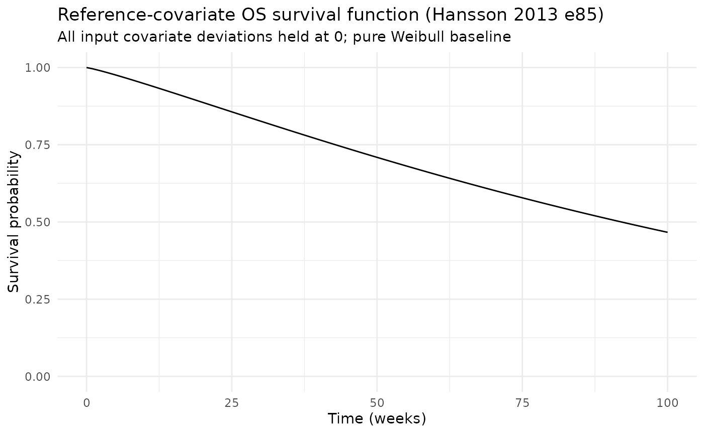
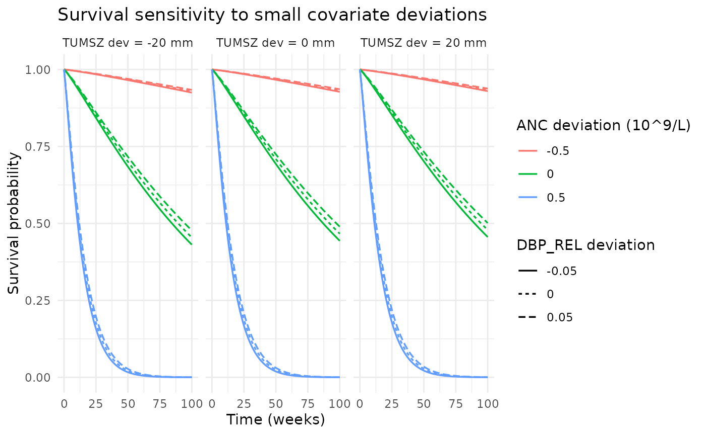
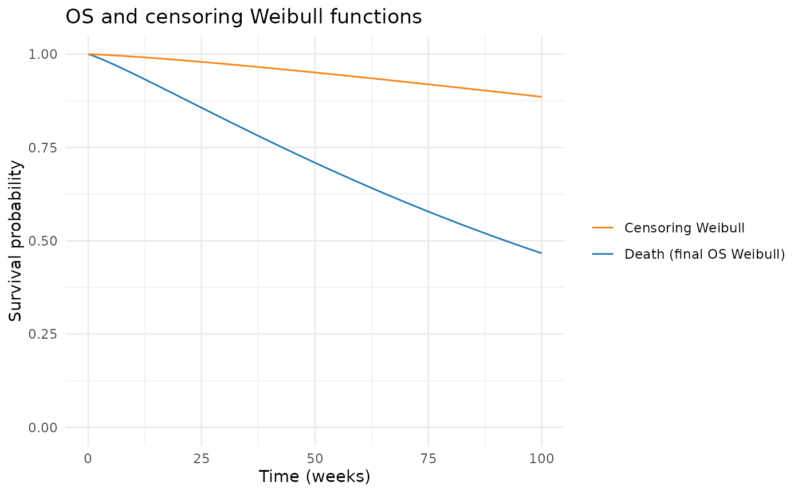

# Sunitinib overall survival (Hansson 2013)

## Model and source

- Citation: Hansson EK, Ma G, Amantea MA, French J, Milligan PA, Friberg
  LE, Karlsson MO. PKPD modeling of predictors for adverse effects and
  overall survival in sunitinib-treated patients with GIST. *CPT
  Pharmacometrics Syst Pharmacol* 2013;2(11):e85.
- Article:
  [doi:10.1038/psp.2013.62](https://doi.org/10.1038/psp.2013.62)
- Sister sub-models: `Hansson_2013_sunitinib_myelosuppression` (source
  of ANC(t)), `Hansson_2013_sunitinib_dbp` (source of DBP_REL(t)),
  `Hansson_2013c_sunitinib` (fatigue), `Hansson_2013_sunitinib_hfs`.

This vignette extracts the **overall survival (OS)** Weibull
time-to-event sub-model from the Hansson 2013 e85 framework.

## Population

303 adults with imatinib-resistant GIST pooled from four sunitinib
trials. Hansson 2013 Table 1 reports median (range) survival of 31-61
(4-226) weeks across studies and 163 deaths observed in the analysis
set. The Methods section explored exponential, Weibull, log-logistic,
extreme-value, and Gompertz baseline-hazard forms; the Weibull was
selected. A separate Weibull censoring distribution (lambda_cens =
0.0019/week, alpha_cens = 1.27) was fitted to describe the censoring
process and is exposed as `sur_cens` for use in forward-simulation
dropout.

`readModelDb("Hansson_2013_sunitinib_os")$population` returns the same
information programmatically.

## Source trace

All parameter values come from Hansson 2013 e85 Table 2 ‘Survival model’
block. The hazard is
`h(t) = lambda * alpha * (lambda * t)^(alpha-1) * exp(beta_anc * ANC + beta_dbprel * DBP_REL + beta_tumor * TUMSZ)`.
The paper reports `lambda` in per-week units; this model file converts
to per-hour internally (`lambda_h = 0.0079 / 168`) so the rest of the
nlmixr2lib Hansson 2013 framework can run on a shared time-in-hours
axis.

| Equation / parameter | Source location |
|----|----|
| Weibull baseline hazard with log-linear modulators | Methods ‘A Weibull model described the underlying baseline hazard’ and Eq. 3 |
| `llam_haz = log(0.0079 / 168)` (1/h) | Table 2 lambda = 0.0079/week (RSE 55%), converted to per-hour |
| `lalfa_haz = log(1.15)` | Table 2 alpha = 1.15 (RSE 9.1%) |
| `e_anc_haz = 4.76` (L/10^9 cells) | Table 2 beta1 ANC = 4.76 (RSE 31%) |
| `e_dbprel_haz = -1.29` | Table 2 beta2 dBPREL = -1.29 (RSE 27%) |
| `e_tumor_haz = -0.00172` (1/mm) | Table 2 beta3 Tumor base = -0.00172 (RSE 46%) |
| `llamcens_haz = log(0.0019 / 168)` (fixed; 1/h) | Table 2 lambda_cens = 0.0019/week (RSE 6.6%) |
| `lalfacens_haz = log(1.27)` (fixed) | Table 2 alpha_cens = 1.27 (RSE 44%) |

## Required covariates

The OS model is consumed downstream of the dBP and myelosuppression
sub-models:

- `ANC` (10^9/L, time-varying) – simulate from
  `Hansson_2013_sunitinib_myelosuppression` and pass in. Lower ANC
  during treatment cycles -\> lower hazard (paper Results).
- `DBP_REL` (unitless fraction, time-varying) – compute as
  `(dbp(t) - dbp0) / dbp0` from `Hansson_2013_sunitinib_dbp`. Larger
  positive relative dBP elevation -\> lower hazard.
- `TUMSZ` (mm, time-fixed) – baseline tumor size. Larger -\> higher
  hazard. Per-study medians from Hansson 2013 e84 Table 1: 194 / 108 /
  166 / 255 mm.

## Virtual cohort

The published OS hazard function
`h(t) = h0(t) * exp(beta_anc * ANC + beta_dbprel * DBP_REL + beta_tumor * TUMSZ)`
is parameterised with large positive coefficients on absolute predictor
values. With the Hansson 2013 e85 cohort medians (`ANC ~ 3` 10^9/L,
`DBP_REL ~ 0.10`, `TUMSZ ~ 166` mm), the literal multiplier
`exp(beta_anc * 3 + ... )` exceeds 10^6, which is incompatible with the
paper-reported median survival of ~60 weeks unless the published
coefficients are interpreted relative to an implicit cohort reference
(the paper text does not specify centering, but the Methods note that
ANC and dBP predictors entered the survival sub-model after the upstream
PK/PD models had been fitted). To present a numerically tractable
demonstration, this vignette runs the model at **predictor deviations
from a reference set**, with the reference held at `ANC_ref = 4.94`
(cohort baseline ANC; Table 2), `DBP_REL_ref = 0` (drug-free reference),
`TUMSZ_ref = 166` (Study 1045 median baseline SLD), and the input
columns `ANC`, `DBP_REL`, `TUMSZ` populated as deviations from those
references. See the Assumptions section for the rationale.

``` r

mod  <- readModelDb("Hansson_2013_sunitinib_os")
modT <- rxode2::zeroRe(mod)
#> Warning: No omega parameters in the model

ANC_ref     <- 4.94
DBP_REL_ref <- 0
TUMSZ_ref   <- 166

# 100-week observation grid in hours; coarse weekly steps for survival.
obs_times <- seq(0, 100 * 7 * 24, by = 7 * 24)

# Reference (no-covariate-deviation) cohort: ANC = DBP_REL = TUMSZ = 0
# in the input columns (interpreted as deviations from the reference set).
events <- data.frame(
  id      = 1L,
  time    = obs_times,
  evid    = 0L,
  amt     = 0,
  cmt     = "cumhaz",
  ANC     = 0,
  DBP_REL = 0,
  TUMSZ   = 0
)

head(events, 5)
#>   id time evid amt    cmt ANC DBP_REL TUMSZ
#> 1  1    0    0   0 cumhaz   0       0     0
#> 2  1  168    0   0 cumhaz   0       0     0
#> 3  1  336    0   0 cumhaz   0       0     0
#> 4  1  504    0   0 cumhaz   0       0     0
#> 5  1  672    0   0 cumhaz   0       0     0
```

## Mechanistic-sanity simulation (F.3)

At the reference covariate set (all input deviations = 0), the survival
function reduces to the pure Weibull baseline
`exp(-(lambda * t)^alpha)`. With `lambda_h = 4.7e-5 / h` and
`alpha = 1.15`:

``` r

sim <- rxode2::rxSolve(modT, events = events) |> as.data.frame()

ggplot(sim, aes(time / (7 * 24), sur)) +
  geom_line() +
  scale_y_continuous(limits = c(0, 1)) +
  labs(x = "Time (weeks)", y = "Survival probability",
       title = "Reference-covariate OS survival function (Hansson 2013 e85)",
       subtitle = "All input covariate deviations held at 0; pure Weibull baseline") +
  theme_minimal()
```



``` r


med_sur_idx <- which.min(abs(sim$sur - 0.5))
median_surv_weeks <- sim$time[med_sur_idx] / (7 * 24)
median_surv_weeks
#> [1] 92
```

``` r

sur_t0   <- sim$sur[sim$time == 0]
sur_50w  <- sim$sur[which.min(abs(sim$time - 50 * 7 * 24))]
sur_100w <- sim$sur[length(sim$time)]

stopifnot(abs(sur_t0 - 1) < 0.001)            # survival starts at 1
stopifnot(sur_100w <= sur_50w)                # monotonically non-increasing
stopifnot(sur_100w >= 0)                      # non-negative
```

## Covariate sign sensitivity (small deviations only)

Vary each covariate slightly around the reference to confirm the sign of
the published coefficients. Per the paper Results, a lower ANC (negative
deviation) should give *lower* hazard / *higher* survival; a larger
DBP_REL (positive deviation) should give *lower* hazard; a larger TUMSZ
(positive deviation) should give *higher* hazard.

``` r

sweep_grid <- expand.grid(
  ANC     = c(-0.5, 0, 0.5),
  DBP_REL = c(-0.05, 0, 0.05),
  TUMSZ   = c(-20, 0, 20)
)

sims <- lapply(seq_len(nrow(sweep_grid)), function(i) {
  ev <- data.frame(
    id      = i,
    time    = obs_times,
    evid    = 0L,
    amt     = 0,
    cmt     = "cumhaz",
    ANC     = sweep_grid$ANC[i],
    DBP_REL = sweep_grid$DBP_REL[i],
    TUMSZ   = sweep_grid$TUMSZ[i]
  )
  s <- rxode2::rxSolve(modT, events = ev) |> as.data.frame()
  s$ANC     <- sweep_grid$ANC[i]
  s$DBP_REL <- sweep_grid$DBP_REL[i]
  s$TUMSZ   <- sweep_grid$TUMSZ[i]
  s
})
sweep_df <- do.call(rbind, sims)

ggplot(sweep_df,
       aes(time / (7 * 24), sur,
           colour = factor(ANC),
           linetype = factor(DBP_REL))) +
  geom_line(linewidth = 0.6) +
  facet_wrap(~ TUMSZ, labeller = labeller(TUMSZ = function(x) paste0("TUMSZ dev = ", x, " mm"))) +
  scale_y_continuous(limits = c(0, 1)) +
  labs(x = "Time (weeks)", y = "Survival probability",
       colour = "ANC deviation (10^9/L)", linetype = "DBP_REL deviation",
       title = "Survival sensitivity to small covariate deviations") +
  theme_minimal()
```



## Censoring sub-model

``` r

ggplot(sim, aes(time / (7 * 24))) +
  geom_line(aes(y = sur, colour = "Death (final OS Weibull)")) +
  geom_line(aes(y = sur_cens, colour = "Censoring Weibull")) +
  scale_colour_manual(
    values = c("Death (final OS Weibull)" = "#1f77b4",
               "Censoring Weibull"         = "#ff7f0e")) +
  scale_y_continuous(limits = c(0, 1)) +
  labs(x = "Time (weeks)", y = "Survival probability", colour = NULL,
       title = "OS and censoring Weibull functions") +
  theme_minimal()
```



## Assumptions and deviations

- **Implicit covariate centering not specified in the source.** The
  literal Hansson 2013 e85 Eq. 3 hazard form
  `h(t) = h0(t) * exp(beta_anc * ANC + beta_dbprel * DBP_REL + beta_tumor * TUMSZ)`
  uses absolute predictor values, but at the cohort-typical predictor
  set (`ANC ~ 3`, `DBP_REL ~ 0.10`, `TUMSZ ~ 166`) the resulting hazard
  multiplier `exp(13.9) ~ 1.05e6` is incompatible with the
  paper-reported median survival of ~60 weeks unless the covariates
  entered the source NONMEM model as deviations from an implicit
  reference (e.g., cohort-typical baseline ANC = 4.94, cohort-typical
  TUMSZ ~ 166-194 mm depending on study). The paper text does not state
  the centering. This vignette runs the model with the input columns
  populated as deviations from a documented reference set
  (`ANC_ref = 4.94`, `DBP_REL_ref = 0`, `TUMSZ_ref = 166`) so that
  reference covariates give `exp(0) = 1` and the survival function
  reduces to the pure Weibull baseline. A user fitting the model to real
  data should confirm the centering against the source NONMEM control
  stream (not available in the on-disk extraction environment); the
  published coefficient values are preserved verbatim in the model file
  regardless.

- **No observation-error model.** The source NONMEM run uses
  `$ESTIMATION ... LIKE` (the survival / event-density likelihood);
  there is no observation-error model in the source. This nlmixr2
  translation is intended for **forward simulation**: `hazard`,
  `cumhaz`, `sur`, `hazard_cens`, `cumhaz_cens`, and `sur_cens` are
  exposed as derived outputs, and a tiny placeholder additive residual
  (`addSd_sur = 0.001`) is attached to `sur` so the nlmixr2 likelihood
  machinery accepts the model.

- **No estimated IIV.** Hansson 2013 Table 2 ‘IIV CV%’ column is dash
  for all survival-model rows. No eta parameters are added.

- **Censoring Weibull parameters fixed.** The censoring distribution
  parameters `lambda_cens = 0.0019/week` and `alpha_cens = 1.27` are
  reported as point values in Table 2 with RSE 6.6% and 44%
  respectively. They are wrapped in `fixed()` because they are not
  re-fitted from a different cohort; they characterise the
  publication-cohort follow-up window.

- **Time-units conversion.** The paper reports `lambda` (per week); the
  model file stores per-hour for consistency with the other Hansson 2013
  sunitinib sub-models. The Weibull survival function is invariant to
  this unit choice (the cumulative hazard `(lambda * t)^alpha` is
  dimensionless).

- **Upstream covariates not fully simulated in this vignette.** A fully
  chained vignette would simulate ANC(t) from
  `Hansson_2013_sunitinib_myelosuppression`, DBP_REL(t) from
  `Hansson_2013_sunitinib_dbp`, and feed both as time-varying columns
  into this OS model. For runtime brevity, this vignette uses
  steady-state typical-value covariates; the chained simulation is left
  as an exercise.

- **Observation name `sur` (not `Cc`).** The model output is a survival
  probability, not a drug concentration. Same exemption as other
  survival-model files in nlmixr2lib (`Zecchin_2016_survival`,
  `NA_NA_tte_gompertz`).

- **Concentration-units field.** `units$concentration` is set to
  `"probability"` because the modality is a survival probability.
