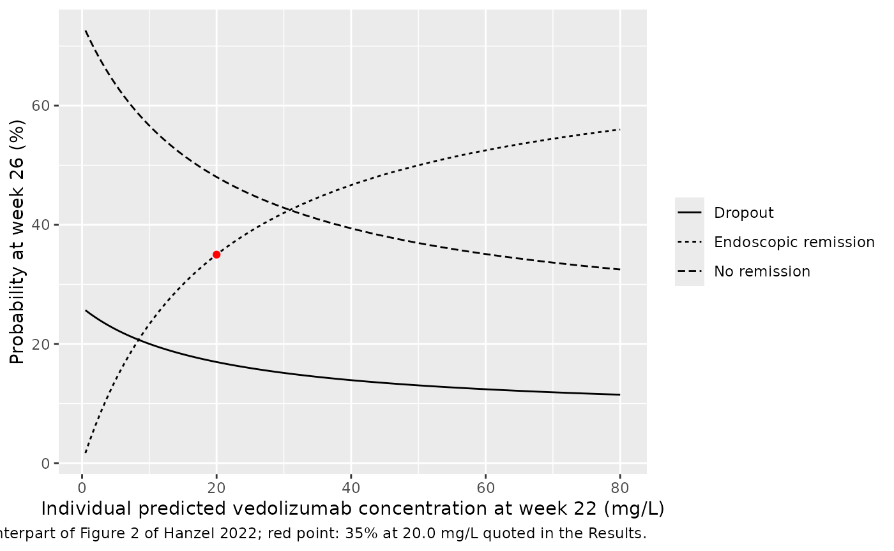
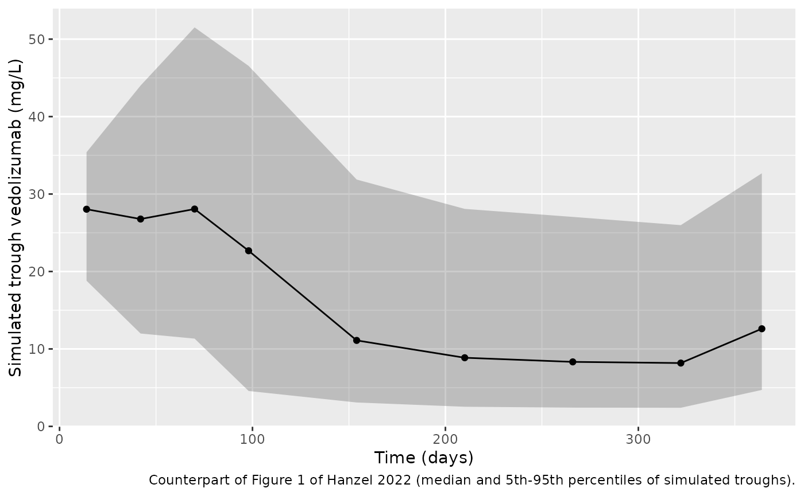

# Vedolizumab (Hanzel 2022)

## Model and source

- Citation: Hanzel J, Dreesen E, Vermeire S, Lowenberg M, Hoentjen F,
  Bossuyt P, Clasquin E, Baert FJ, D’Haens GR, Mathot R.
  Pharmacokinetic-Pharmacodynamic Model of Vedolizumab for Targeting
  Endoscopic Remission in Patients With Crohn Disease: Posthoc Analysis
  of the LOVE-CD Study. Inflamm Bowel Dis. 2022;28:689-699.
  <doi:10.1093/ibd/izab143> (PMC9071095). A corrigendum
  (<doi:10.1093/ibd/izab270>; PMC9071094) corrects reference 36 only and
  does not change any parameter value.
- Description: Two-compartment population PK model for vedolizumab
  (humanised anti-alpha4-beta7 integrin IgG1 monoclonal antibody) with
  parallel linear and Michaelis-Menten elimination in adults with active
  Crohn’s disease (LOVE-CD trial), with interindividual and
  inter-occasion variability (induction / maintenance) on linear
  clearance and time-varying effects of serum albumin, antibodies to
  vedolizumab and anti-TNF-naive status on linear clearance, plus the
  sequential first-order discrete-time Markov model for endoscopic
  remission (SES-CD \< 4) and dropout at weeks 26 and 52 driven by the
  individual predicted week-22 trough concentration (Hanzel 2022). Q,
  Vp, Km and Vmax were held at the Rosario 2015 values.
- Article: <https://doi.org/10.1093/ibd/izab143> (open access,
  PMC9071095)
- Corrigendum: <https://doi.org/10.1093/ibd/izab270> (PMC9071094;
  corrects reference 36 only, no parameter values affected)

Hanzel et al. analysed the first 110 patients of LOVE-CD, a phase 4
open-label trial of intravenous vedolizumab in active Crohn’s disease.
The paper has two sequentially fitted parts, both packaged in the single
model file:

1.  A **population PK model**: two compartments with parallel linear and
    Michaelis-Menten elimination. The peripheral volume,
    intercompartmental clearance, Km and Vmax were held at the Rosario
    2015 values (see `modellib("Rosario_2015_vedolizumab")`). Linear
    clearance carries interindividual and inter-occasion variability and
    time-varying covariate effects of serum albumin, antibodies to
    vedolizumab and anti-TNF-naive status.
2.  A **first-order discrete-time Markov model** for endoscopic
    remission (SES-CD \< 4) at weeks 26 and 52. States are no remission
    (0), remission (1) and dropout (2). The exposure driver is the
    individual predicted vedolizumab concentration at week 22
    (`IPRED22`), the trough before the week-22 infusion.

## Population

The PK analysis included 108 of 110 LOVE-CD patients with at least one
quantifiable vedolizumab sample (Hanzel 2022 Table 1). In total, 737
serum samples were drawn, all before an infusion. Of the 108 patients,
69% were women. Median age was 36 years (IQR 28-46), median weight 71 kg
(IQR 61-82) and median baseline albumin 41 g/L (IQR 38-43). Baseline
CDAI was 261 (IQR 238-312) and baseline SES-CD 12 (IQR 7-17). Previous
exposure to anti-TNF agents was very common (89%). Antibodies to
vedolizumab were detected in 4 patients (3.7%), on 10 samples.

Vedolizumab 300 mg was infused at weeks 0, 2 and 6 and every 8 weeks
thereafter through week 52. An extra week-10 infusion was given to the
68 patients (63%) whose CDAI had not fallen by at least 70 points.
Endoscopic remission was seen in 36 patients (33%) at week 26 and 40
(37%) at week 52. The trial ran at sites in the Netherlands and Belgium.

The same information is available programmatically:

``` r

str(readModelDb("Hanzel_2022_vedolizumab")()$population)
#> Warning: some etas defaulted to non-mu referenced, possible parsing error: etaiov_cl_1, etaiov_cl_2
#> as a work-around try putting the mu-referenced expression on a simple line
#> List of 13
#>  $ species         : chr "human"
#>  $ n_subjects      : int 108
#>  $ n_studies       : int 1
#>  $ age_median      : chr "36 years (IQR 28-46)"
#>  $ weight_median   : chr "71 kg (IQR 61-82)"
#>  $ sex_female_pct  : num 69
#>  $ disease_state   : chr "Active Crohn's disease (CDAI > 220 with mucosal ulceration at baseline ileocolonoscopy); baseline CDAI median 2"| __truncated__
#>  $ dose_range      : chr "Vedolizumab 300 mg IV at weeks 0, 2 and 6 and every 8 weeks thereafter through week 52; 68 patients (63%) recei"| __truncated__
#>  $ regions         : chr "Netherlands, Belgium"
#>  $ prior_tnf_pct   : num 89
#>  $ albumin_median  : chr "41 g/L (IQR 38-43)"
#>  $ ada_positive_pct: num 3.7
#>  $ notes           : chr "LOVE-CD (NCT02646683), a phase 4 prospective open-label multicentre trial. 108 of 110 enrolled patients had at "| __truncated__
```

## Source trace

Every `ini()` value carries an in-file comment pointing at its source.
The table below collects them in one place.

| Equation / parameter | Value | Source location |
|----|----|----|
| `lcl` (CL_L) | log(0.215) L/day | Table 2, final model |
| `lvc` (V1) | log(4.92) L | Table 2, final model |
| `lvp` (V2) | log(1.65) L, held constant | Table 2 (‘FIX’, from Rosario 2015) |
| `lq` (Q) | log(0.12) L/day, held constant | Table 2 (‘FIX’, from Rosario 2015) |
| `lkm` (Km) | log(0.964) mg/L, held constant | Table 2 (‘FIX’, from Rosario 2015) |
| `lvmax` (Vm) | log(0.265) mg/day, held constant | Table 2 (‘FIX’, from Rosario 2015) |
| `e_alb_cl` | -0.020 per g/L | Table 2; Equation 1; Appendix `THETA(9)` |
| `e_ada_cl` | 1.89 | Table 2; Appendix `THETA(11)` |
| `e_tnfnaive_cl` | 0.755 | Table 2; Appendix `THETA(10)` |
| `etalcl` | 0.262^2 = 0.068644 | Table 2 IIV CL_L 26.2 CV% (footnote: CV = sqrt(variance)) |
| `etalvc` | 0, held constant | Appendix `ETA(2)` on V1; variance not reported (see Assumptions) |
| `etaiov_cl_1`, `etaiov_cl_2` | 0.152^2 = 0.023104 | Table 2 IOV CL_L 15.2 CV%; Appendix `$OMEGA BLOCK(1) SAME` |
| `addSd` | 0.469 mg/L | Table 2 additive error |
| `propSd` | 0.189 | Table 2 proportional error; Appendix `$ERROR` `W` |
| `emax_01` | 0.7, held constant | Table 2 (70% FIX); Appendix `THETA(1)` |
| `lec50_01` | log(20.0) mg/L | Table 2, final model |
| `emax_02` | 1, held constant | Table 2; Appendix `THETA(3)` |
| `let50_02` | log(515) days | Table 2, final model |
| `emax_10`, `lec50_10` | 1 (held constant), log(1.78) mg/L | Table 2, final model |
| `emax_12`, `lec50_12` | 1 (held constant), log(0.47) mg/L | Table 2, final model |
| CL_L covariate model | `CL = TVCL * (1 + (ALB - 41) * th9) * th10^TNFNAIVE * th11^ADA * exp(eta1 + IOV)` | Equation 1; Appendix `$PK` |
| ODEs | linear + Michaelis-Menten elimination from central | Appendix `$DES`; Supplementary Figure 1 |
| `p01`, `p02` | `EMAX01 * C22 / (EC50 + C22)`, `EMAX02 * DAYS / (ET50 + DAYS)` | Appendix `$PRED`; Supplementary Figure 1 |
| `DAYS` | `VISIT * 7 + 0.01` | Appendix `$PRED` |
| Transition fractions | `P(0->2) = P02 (1 - P01)`, `P(1->2) = P12 (1 - P10)` | Appendix `$PRED` |
| `p10`, `p12` | `EC50 / (EC50 + C22)` (inhibitory, Emax = 1) | Table 2 final; form inferred (see Assumptions) |

## Closed-form checks of the reported effects

The paper quotes four effect sizes that follow directly from the
parameters.

``` r

mod <- readModelDb("Hanzel_2022_vedolizumab")
ini_df <- rxode2::rxode(mod)$iniDf
#> ℹ parameter labels from comments will be replaced by 'label()'
#> Warning: some etas defaulted to non-mu referenced, possible parsing error: etaiov_cl_1, etaiov_cl_2
#> as a work-around try putting the mu-referenced expression on a simple line
th <- setNames(ini_df$est, ini_df$name)

checks <- tibble::tribble(
  ~quantity, ~paper, ~model,
  "CL_L increase, albumin 41 -> 28 g/L (%)", 26,
  100 * ((1 + (28 - 41) * th[["e_alb_cl"]]) - 1),
  "CL_L increase with antibodies to vedolizumab (%)", 89,
  100 * (th[["e_ada_cl"]] - 1),
  "P(remission at week 26) at C22 = 20.0 mg/L (%)", 35,
  100 * th[["emax_01"]] * 20 / (exp(th[["lec50_01"]]) + 20)
)
knitr::kable(checks, digits = 2,
             caption = "Effect sizes quoted in the Hanzel 2022 Results.")
```

| quantity                                         | paper | model |
|:-------------------------------------------------|------:|------:|
| CL_L increase, albumin 41 -\> 28 g/L (%)         |    26 |    26 |
| CL_L increase with antibodies to vedolizumab (%) |    89 |    89 |
| P(remission at week 26) at C22 = 20.0 mg/L (%)   |    35 |    35 |

Effect sizes quoted in the Hanzel 2022 Results. {.table}

``` r

stopifnot(all(abs(checks$model - checks$paper) < 0.5))
```

The Results text also says CL_L is “+ 25% compared to no prior exposure”
in patients previously exposed to biologics. The model carries the
estimated multiplier 0.755 for anti-TNF-naive patients, i.e. a 24.5%
*lower* CL_L than in exposed patients. Equivalently, exposed patients
have 1 / 0.755 = 1.32-fold the CL_L of naive patients. The rounded “25%”
in the text is the first of these.

## Virtual cohort

The original data are not public. The simulations below use virtual
patients whose covariates approximate Table 1. Albumin is drawn from a
normal distribution with the cohort median of 41 g/L and an SD of 3.7
g/L, which matches the reported IQR of 38-43 g/L, truncated to 25-52
g/L. Antibodies to vedolizumab are set absent, since they were found on
only 1.4% of samples. The occasion column follows the paper: `OCC = 1`
(induction) before the week-14 infusion and `OCC = 2` (maintenance) from
day 98 onward.

Each infusion is 300 mg over 30 minutes into `central`.

``` r

inf_rate <- 300 / (30 / 1440) # 300 mg over 30 min, in mg/day

make_cohort <- function(n, dose_weeks, obs_days, prior_tnf, regimen,
                        id_offset = 0L) {
  ids <- id_offset + seq_len(n)
  alb <- pmin(pmax(stats::rnorm(n, 41, 3.7), 25), 52)
  doses <- expand.grid(id = ids, time = dose_weeks * 7) |>
    mutate(evid = 1L, amt = 300, rate = inf_rate)
  obs <- expand.grid(id = ids, time = obs_days) |>
    mutate(evid = 0L, amt = NA_real_, rate = NA_real_)
  bind_rows(doses, obs) |>
    mutate(
      cmt = "central",
      ALB = alb[id - id_offset],
      ADA_POS = 0L,
      PRIOR_TNF = prior_tnf,
      OCC = ifelse(time < 98, 1L, 2L),
      regimen = regimen,
      tnf = ifelse(prior_tnf == 1, "Anti-TNF-experienced", "Anti-TNF-naive")
    ) |>
    arrange(id, time, desc(evid))
}
```

## Endoscopic remission at week 26 by dosing regimen (Table 3)

Table 3 of the paper simulates three regimens in anti-TNF-naive and
anti-TNF-experienced patients. The week-26 remission probability depends
only on the week-22 trough. The cohorts below are therefore solved to
day 154, using only the doses given *before* the week-22 infusion; the
week-22 dose itself cannot change the pre-dose trough. Each of the six
arms has 200 patients.

``` r

rxode2::rxSetSeed(2022)
set.seed(2022)
regimens <- list(
  "300 mg at weeks 0, 2, 6, 14, 22" = c(0, 2, 6, 14),
  "300 mg at weeks 0, 2, 6, 10, 14, 22" = c(0, 2, 6, 10, 14),
  "300 mg at weeks 0, 2, 6, 10, 14, 18, 22" = c(0, 2, 6, 10, 14, 18)
)
n_arm <- 200L
arms <- expand.grid(regimen = names(regimens), prior_tnf = c(0L, 1L),
                    stringsAsFactors = FALSE)
events_t3 <- bind_rows(lapply(seq_len(nrow(arms)), function(i) {
  make_cohort(
    n = n_arm,
    dose_weeks = regimens[[arms$regimen[i]]],
    obs_days = seq(0, 154, by = 7),
    prior_tnf = arms$prior_tnf[i],
    regimen = arms$regimen[i],
    id_offset = (i - 1L) * n_arm
  )
}))
stopifnot(!anyDuplicated(unique(events_t3[, c("id", "time", "evid")])))

sim_t3 <- rxode2::rxSolve(mod, events = events_t3,
                          keep = c("regimen", "tnf"),
                          returnType = "data.frame")
#> ℹ parameter labels from comments will be replaced by 'label()'
#> Warning: some etas defaulted to non-mu referenced, possible parsing error: etaiov_cl_1, etaiov_cl_2
#> as a work-around try putting the mu-referenced expression on a simple line
#> ℹ omega/sigma items treated as zero: 'etalvc'
```

``` r

published_t3 <- tibble::tribble(
  ~regimen, ~tnf, ~paper,
  "300 mg at weeks 0, 2, 6, 14, 22", "Anti-TNF-naive", 29.1,
  "300 mg at weeks 0, 2, 6, 10, 14, 22", "Anti-TNF-naive", 33.9,
  "300 mg at weeks 0, 2, 6, 10, 14, 18, 22", "Anti-TNF-naive", 46.5,
  "300 mg at weeks 0, 2, 6, 14, 22", "Anti-TNF-experienced", 20.2,
  "300 mg at weeks 0, 2, 6, 10, 14, 22", "Anti-TNF-experienced", 24.2,
  "300 mg at weeks 0, 2, 6, 10, 14, 18, 22", "Anti-TNF-experienced", 40.0
)

t3 <- sim_t3 |>
  filter(time == 154) |>
  group_by(regimen, tnf) |>
  summarise(
    c22 = median(Cc),
    simulated = 100 * median(prob_endorem_wk26),
    .groups = "drop"
  ) |>
  inner_join(published_t3, by = c("regimen", "tnf")) |>
  mutate(diff = simulated - paper) |>
  arrange(tnf, simulated)

t3 |>
  rename(
    "Regimen" = regimen,
    "Group" = tnf,
    "Median C22 (mg/L)" = c22,
    "Simulated median P(remission), %" = simulated,
    "Hanzel 2022 Table 3, %" = paper,
    "Difference (points)" = diff
  ) |>
  knitr::kable(digits = 1, caption = paste(
    "Replicates Table 3 of Hanzel 2022: median predicted probability of",
    "endoscopic remission at week 26."
  ))
```

| Regimen | Group | Median C22 (mg/L) | Simulated median P(remission), % | Hanzel 2022 Table 3, % | Difference (points) |
|:---|:---|---:|---:|---:|---:|
| 300 mg at weeks 0, 2, 6, 14, 22 | Anti-TNF-experienced | 8.4 | 20.6 | 20.2 | 0.4 |
| 300 mg at weeks 0, 2, 6, 10, 14, 22 | Anti-TNF-experienced | 10.8 | 24.6 | 24.2 | 0.4 |
| 300 mg at weeks 0, 2, 6, 10, 14, 18, 22 | Anti-TNF-experienced | 27.6 | 40.6 | 40.0 | 0.6 |
| 300 mg at weeks 0, 2, 6, 14, 22 | Anti-TNF-naive | 12.3 | 26.7 | 29.1 | -2.4 |
| 300 mg at weeks 0, 2, 6, 10, 14, 22 | Anti-TNF-naive | 20.6 | 35.5 | 33.9 | 1.6 |
| 300 mg at weeks 0, 2, 6, 10, 14, 18, 22 | Anti-TNF-naive | 41.9 | 47.4 | 46.5 | 0.9 |

Replicates Table 3 of Hanzel 2022: median predicted probability of
endoscopic remission at week 26. {.table style="width:100%;"}

The simulated medians reproduce Table 3 to within a few percentage
points in all six cells, including the gain from shortening the interval
to every 4 weeks. The checks are on the cohort median, which is stable
across rxode2 builds, and on the direction of the regimen and anti-TNF
effects. Those contrasts are many times larger than the Monte-Carlo
error of a 200-patient median.

``` r

stopifnot(
  # Structural: a mis-transcribed EC50, CL or covariate effect moves these
  # medians by far more than 6 points.
  all(abs(t3$diff) < 6),
  # Every-4-weeks dosing beats per-label dosing in both groups.
  all(t3 |> group_by(tnf) |>
        summarise(gain = max(simulated) - min(simulated)) |>
        pull(gain) > 10)
)
```

### Exposure-response curve (Figure 2)

Figure 2 of the paper overlays observed and predicted week-26 outcomes
on quantiles of the week-22 concentration. Below are the model-predicted
curves from the typical parameters: remission, dropout without
remission, and persistent non-remission.

``` r

c22_grid <- c(seq(0.5, 80, by = 0.5))
p01 <- th[["emax_01"]] * c22_grid / (exp(th[["lec50_01"]]) + c22_grid)
days26 <- 26 * 7 + 0.01
p02 <- th[["emax_02"]] * days26 / (exp(th[["let50_02"]]) + days26)
er_curve <- tibble(
  C22 = c22_grid,
  `Endoscopic remission` = p01,
  `Dropout` = p02 * (1 - p01),
  `No remission` = 1 - p01 - p02 * (1 - p01)
) |>
  pivot_longer(-C22, names_to = "state", values_to = "prob")

ggplot(er_curve, aes(C22, 100 * prob, linetype = state)) +
  geom_line() +
  geom_point(data = tibble(C22 = 20, prob = 0.35), aes(C22, 100 * prob),
             inherit.aes = FALSE, colour = "red") +
  labs(x = "Individual predicted vedolizumab concentration at week 22 (mg/L)",
       y = "Probability at week 26 (%)", linetype = NULL,
       caption = paste("Model counterpart of Figure 2 of Hanzel 2022; red point:",
                       "35% at 20.0 mg/L quoted in the Results."))
```



## Week-52 Markov outcomes

The model also returns the marginal state probabilities at week 52.
These come from chaining the baseline -\> week 26 and week 26 -\> week
52 transitions, all driven by the same week-22 concentration. The paper
does not report simulated week-52 probabilities, so they cannot be
checked against a published number. Two properties can be checked: the
three state probabilities sum to 1 at each visit, and remission rises
with exposure.

``` r

wk <- sim_t3 |>
  filter(time == 154) |>
  group_by(regimen, tnf) |>
  summarise(across(c(prob_endorem_wk26, prob_dropout_wk26,
                     prob_endorem_wk52, prob_dropout_wk52),
                   ~ 100 * median(.x)),
            .groups = "drop")
wk |>
  rename(
    "Regimen" = regimen, "Group" = tnf,
    "Remission wk 26, %" = prob_endorem_wk26,
    "Dropout wk 26, %" = prob_dropout_wk26,
    "Remission wk 52, %" = prob_endorem_wk52,
    "Dropout wk 52, %" = prob_dropout_wk52
  ) |>
  knitr::kable(digits = 1, caption = "Median simulated state probabilities.")
```

| Regimen | Group | Remission wk 26, % | Dropout wk 26, % | Remission wk 52, % | Dropout wk 52, % |
|:---|:---|---:|---:|---:|---:|
| 300 mg at weeks 0, 2, 6, 10, 14, 18, 22 | Anti-TNF-experienced | 40.6 | 15.5 | 55.3 | 27.0 |
| 300 mg at weeks 0, 2, 6, 10, 14, 18, 22 | Anti-TNF-naive | 47.4 | 13.7 | 63.3 | 22.7 |
| 300 mg at weeks 0, 2, 6, 10, 14, 22 | Anti-TNF-experienced | 24.6 | 19.7 | 33.9 | 38.0 |
| 300 mg at weeks 0, 2, 6, 10, 14, 22 | Anti-TNF-naive | 35.5 | 16.8 | 48.9 | 30.3 |
| 300 mg at weeks 0, 2, 6, 14, 22 | Anti-TNF-experienced | 20.6 | 20.7 | 28.2 | 40.9 |
| 300 mg at weeks 0, 2, 6, 14, 22 | Anti-TNF-naive | 26.7 | 19.1 | 37.0 | 36.4 |

Median simulated state probabilities. {.table}

``` r


at154 <- sim_t3 |> filter(time == 154)
stopifnot(
  max(abs(at154$prob_endorem_wk26 + at154$prob_dropout_wk26 +
            at154$prob_noendorem_wk26 - 1)) < 1e-10,
  max(abs(at154$prob_endorem_wk52 + at154$prob_dropout_wk52 +
            at154$prob_noendorem_wk52 - 1)) < 1e-10,
  cor(at154$Cc, at154$prob_endorem_wk52, method = "spearman") > 0.9
)
```

## Trough concentrations over the LOVE-CD schedule (Figure 1)

Figure 1 of the paper is a prediction-corrected VPC of the trough
samples. This section simulates the LOVE-CD schedule through week 52
with 200 patients. Infusions are at weeks 0, 2, 6, 14, 22, 30, 38 and
46, and 63% of patients get the extra week-10 infusion. Anti-TNF
exposure is assigned at the trial rate of 89%. Troughs are read before
each infusion and at week 52.

``` r

rxode2::rxSetSeed(1)
set.seed(1)
n_vpc <- 200L
trough_weeks <- c(2, 6, 10, 14, 22, 30, 38, 46, 52)
extra_wk10 <- stats::runif(n_vpc) < 0.63
prior <- as.integer(stats::runif(n_vpc) < 0.89)
events_vpc <- bind_rows(lapply(seq_len(n_vpc), function(i) {
  make_cohort(
    n = 1L,
    dose_weeks = c(0, 2, 6, if (extra_wk10[i]) 10, 14, 22, 30, 38, 46),
    obs_days = trough_weeks * 7 - 1e-4,
    prior_tnf = prior[i],
    regimen = "LOVE-CD",
    id_offset = i - 1L
  )
}))
sim_vpc <- rxode2::rxSolve(mod, events = events_vpc, returnType = "data.frame")
#> ℹ omega/sigma items treated as zero: 'etalvc'

vpc <- sim_vpc |>
  mutate(week = round(time / 7)) |>
  group_by(week) |>
  summarise(
    Q05 = quantile(Cc, 0.05), Q50 = median(Cc), Q95 = quantile(Cc, 0.95),
    .groups = "drop"
  )

ggplot(vpc, aes(week * 7, Q50)) +
  geom_ribbon(aes(ymin = Q05, ymax = Q95), alpha = 0.25) +
  geom_line() +
  geom_point() +
  labs(x = "Time (days)", y = "Simulated trough vedolizumab (mg/L)",
       caption = paste("Counterpart of Figure 1 of Hanzel 2022 (median and",
                       "5th-95th percentiles of simulated troughs)."))
```



``` r

knitr::kable(vpc, digits = 1, caption = "Simulated trough percentiles by week.")
```

| week |  Q05 |  Q50 |  Q95 |
|-----:|-----:|-----:|-----:|
|    2 | 18.8 | 28.0 | 35.4 |
|    6 | 12.0 | 26.8 | 44.0 |
|   10 | 11.3 | 28.1 | 51.5 |
|   14 |  4.6 | 22.7 | 46.5 |
|   22 |  3.1 | 11.1 | 31.9 |
|   30 |  2.5 |  8.9 | 28.1 |
|   38 |  2.4 |  8.3 | 27.0 |
|   46 |  2.4 |  8.2 | 26.0 |
|   52 |  4.7 | 12.6 | 32.7 |

Simulated trough percentiles by week. {.table}

In Figure 1 of the paper, the observed median trough is roughly 25 mg/L
during induction (days 14-98) and roughly 10-12 mg/L during maintenance.
These values were read approximately from the plot. The simulated
medians fall in the same ranges. Figure 1 is prediction-corrected, so
only this broad agreement is checked.

``` r

induction <- vpc |> filter(week %in% c(2, 6, 10)) |> pull(Q50)
maintenance <- vpc |> filter(week %in% c(22, 30, 38, 46)) |> pull(Q50)
stopifnot(
  all(induction > 15 & induction < 40),
  all(maintenance > 5 & maintenance < 20)
)
```

## PKNCA validation

The paper reports no NCA. For completeness, PKNCA is run over the first
dosing interval (days 0-14) in typical-albumin patients, split by
anti-TNF exposure. The anti-TNF-naive group should show the larger AUC,
because its linear clearance is 0.755-fold that of the experienced
group.

``` r

rxode2::rxSetSeed(7)
set.seed(7)
nca_obs <- sort(unique(c(0, 30 / 1440, 0.25, 0.5, 1, 2, 3, 5, 7, 10, 14)))
events_nca <- bind_rows(
  make_cohort(100L, 0, nca_obs, 1L, "first dose", id_offset = 0L),
  make_cohort(100L, 0, nca_obs, 0L, "first dose", id_offset = 100L)
)
sim_nca <- rxode2::rxSolve(mod, events = events_nca, keep = "tnf",
                           returnType = "data.frame") |>
  filter(!is.na(Cc)) |>
  select(id, time, Cc, tnf)
#> ℹ omega/sigma items treated as zero: 'etalvc'

conc_obj <- PKNCA::PKNCAconc(sim_nca, Cc ~ time | tnf + id)
dose_obj <- PKNCA::PKNCAdose(
  events_nca |> filter(evid == 1) |> select(id, time, amt, tnf),
  amt ~ time | tnf + id
)
intervals <- data.frame(start = 0, end = 14, cmax = TRUE, tmax = TRUE,
                        auclast = TRUE)
nca_res <- PKNCA::pk.nca(PKNCA::PKNCAdata(conc_obj, dose_obj,
                                          intervals = intervals))
nca_sum <- as.data.frame(nca_res$result) |>
  group_by(tnf, PPTESTCD) |>
  summarise(median = median(PPORRES), .groups = "drop") |>
  pivot_wider(names_from = PPTESTCD, values_from = median)
nca_sum |>
  rename("Group" = tnf, "Cmax (mg/L)" = cmax, "Tmax (day)" = tmax,
         "AUC0-14 (mg*day/L)" = auclast) |>
  knitr::kable(digits = 2, caption = "First-dose NCA (medians, PKNCA).")
```

| Group                | AUC0-14 (mg\*day/L) | Cmax (mg/L) | Tmax (day) |
|:---------------------|--------------------:|------------:|-----------:|
| Anti-TNF-experienced |              574.21 |       60.93 |       0.02 |
| Anti-TNF-naive       |              614.30 |       60.94 |       0.02 |

First-dose NCA (medians, PKNCA). {.table}

``` r

stopifnot(
  nca_sum$auclast[nca_sum$tnf == "Anti-TNF-naive"] >
    nca_sum$auclast[nca_sum$tnf == "Anti-TNF-experienced"]
)
```

## Assumptions and deviations

- **Final-model form of the 1 -\> 0 and 1 -\> 2 transitions.** The
  Appendix `$PRED` code models the transitions out of remission (`P10`,
  `P12`) as constant probabilities, `THETA(5)` and `THETA(6)`, bounded
  to (0, 1). Table 2’s final-model column instead lists
  `Emax10 = 1 FIX`, `EC50,10 = 1.78 mg/L`, `Emax12 = 1 FIX` and
  `EC50,12 = 0.47 mg/L`, with RSEs and bootstrap medians. The
  maintainers implemented the Table 2 parameterisation, for three
  reasons:
  1.  1.78 lies outside the (0, 1) bound, so it cannot be a final value
      of the printed constant.
  2.  With no random effects, the likelihood of the transitions out of
      state 1 separates from the state-0 transitions. Had `P10` and
      `P12` stayed constant, their final estimates would equal the
      base-model 10.0% and 2.8%. The paper reports different numbers
      with separate bootstrap results.
  3.  Only an *inhibitory* form, `P = EC50 / (EC50 + C22)`, is
      consistent with the estimates. At a typical week-22 trough of
      about 20 mg/L it gives about 8% (1 -\> 0) and 2% (1 -\> 2), close
      to the base-model constants. A stimulatory form
      `C22 / (EC50 + C22)` with Emax = 1 would give about 90%, which the
      data could not support.

  The driver is taken to be the same week-22 concentration (`IPRED22`)
  that drives the 0 -\> 1 transition. It is the only concentration
  metric of the selected model that the Appendix data set carries. Only
  the week-52 outputs depend on this choice. The week-26 outputs, Table
  3 and Figure 2 do not.
- **Table 2 bootstrap interval for EC50,12.** The printed bootstrap
  interval for `EC50,12` (0.36-3.62) is identical to the one for
  `EC50,10`. It is probably a copy error, and it does not affect the
  point estimate used here.
- **Interindividual variability on V1.** The Appendix control stream
  carries `ETA(2)` on V1, with an initial variance of 0.03. Table 2 and
  the Results text report IIV only on CL_L. The slot is kept as
  `etalvc ~ fixed(0)`, so simulations match the reported final model.
- **Anti-TNF covariate encoding.** The source column `TNFNAIVE` (1 =
  naive) is mapped to the canonical `PRIOR_TNF` (1 = previously exposed)
  as `TNFNAIVE = 1 - PRIOR_TNF`. The paper’s multiplier and its
  reference patient (previously exposed) are unchanged.
- **Exposure driver in the model output.** The probabilities `p01`,
  `p10`, `p12` and the `prob_*` outputs are computed from the *current*
  `Cc`. They reproduce the paper only when read at day 154 (week 22),
  before any week-22 infusion. The 0 -\> 2 dropout terms use the paper’s
  assessment days (`VISIT * 7 + 0.01` with VISIT = 26 and 52) and do not
  depend on `t`.
- **Infusion duration.** The paper does not state it; the labelled
  30-minute infusion is used. It has no practical effect on trough
  concentrations.
- **Virtual covariates.** Table 3 sampled covariates from the original
  data set, which is not public. Here albumin is drawn from a normal
  distribution that matches the reported median and IQR. Antibodies to
  vedolizumab are set absent: they were found on 1.4% of samples and
  barely move the medians.
- **Residual error.** The Appendix `$ERROR` block
  `W = SQRT(THETA(1)**2 + IPRED**2 * THETA(2)**2)`, with `$SIGMA` held
  at 1, is the nlmixr2 `combined2` additive + proportional error. Table
  2 labels the proportional term “%” but prints it as a fraction
  (0.189).
