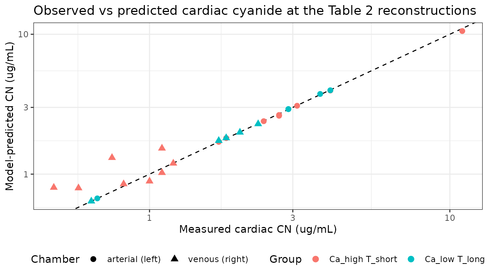
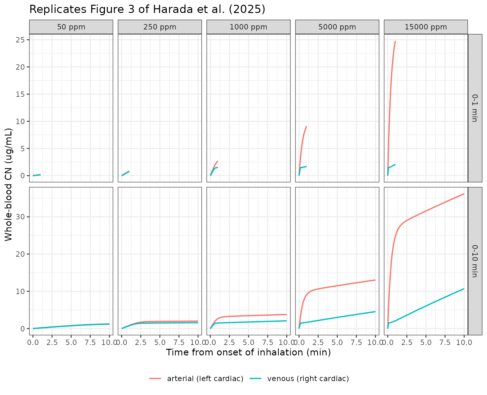

# Cyanide inhalation PBPK in fire-related deaths (Harada 2025)

``` r

library(nlmixr2lib)
library(rxode2)
library(dplyr)
library(tidyr)
library(ggplot2)
```

## Model and source

``` r

mod <- rxode2::rxode(readModelDb("Harada_2025_cyanide_pbpk"))
```

- Citation: Harada K, Tokugawa Y, Henmi K, Miyashita Y, Sakahashi Y,
  Nishihori T, Sakamoto Y, Yang C, Isobe Y, Sugimoto K, Nakama K, Katada
  R, Matsumoto H. Analysis of cyanide exposure status in fire-related
  deaths using a physiologically based pharmacokinetic model. Forensic
  Toxicol. 2025;43(2):303-312. <doi:10.1007/s11419-025-00713-8>. Model
  structure and parameters inherited from Stamyr K, Mork AK, Johanson G.
  Physiologically based pharmacokinetic modeling of hydrogen cyanide
  levels in human breath. Arch Toxicol. 2015;89:1287-1296.
  <doi:10.1007/s00204-014-1310-y> (not open access; all values used here
  are taken from the Harada 2025 Supplemental Material 1 Python script,
  which lists them explicitly).
- Article: <https://doi.org/10.1007/s11419-025-00713-8>
- Supplemental Material 1-4 (Springer electronic supplementary material,
  `11419_2025_713_MOESM1_ESM.docx`): the Python simulation script, the
  estimation script, and the sensitivity-analysis table. Supplemental
  Material 1 is the **authoritative on-disk source for every parameter
  value in this model**, because the upstream Stamyr et al. 2015 paper
  that the structure and parameters come from is not open access.

Harada et al. (2025) measured cyanide (CN) and thiocyanate (SCN) in the
left and right cardiac blood of 29 fire-related deaths autopsied at
Osaka University, then used the hydrogen-cyanide inhalation PBPK model
of Stamyr et al. (2015) to work *backwards* from those paired
measurements to the inhaled HCN air concentration and exposure duration
each decedent experienced at the fire scene.

The forensic point of the paper turns on a structural feature of the
model: after the onset of inhalation, arterial CN rises faster than
mixed-venous CN, and the arterial-venous gap keeps widening. Left
cardiac blood (arterial) and right cardiac blood (venous) therefore
carry *different* information, and a decedent who inhaled a very high
HCN concentration for a very short time can present with a right-cardiac
CN concentration **below** the 1 ug/mL toxic threshold while the
left-cardiac concentration is several-fold above it. Diagnosing cyanide
poisoning from venous blood alone will miss those cases.

### What is and is not from this paper

This is an important provenance boundary for anyone using the model:

| Element | Source |
|----|----|
| ODE structure (6 states) | Stamyr 2015, transcribed verbatim in Harada 2025 Supplemental Material 1 |
| Every parameter value | Stamyr 2015, listed explicitly with units in Harada 2025 Supplemental Material 1 |
| Unit conversion factors (24 ppm per umol/L; 27 ug/L per umol/L) | Harada 2025 Supplemental Material 1 header comment |
| Initial conditions | Harada 2025 Supplemental Material 1 (`init = [0, 0, 0, 1, 0, 0]`) |
| The 29 autopsy cases, paired L/R cardiac CN, COHb%, SCN | Harada 2025 Table 1 |
| The 13 reconstructed exposures (ppm, min) | Harada 2025 Table 2 |
| Sensitivity of the reconstruction to +/- 15% assay error | Harada 2025 Supplemental Material 4 |

**No parameter in this model was fitted by Harada et al.** The 29 cases
are the application dataset, not an estimation dataset. Harada et
al. estimated only two per-case quantities – inhaled air concentration
and exposure duration – by grid search. Consequently the model carries
no between-subject variability and no residual error, and it is a
deterministic typical-value model.

## Population

``` r

pop <- mod$meta$population
tibble::tibble(Field = names(pop), Value = vapply(pop, function(x) paste(as.character(x), collapse = "; "), character(1))) |>
  knitr::kable()
```

| Field | Value |
|:---|:---|
| species | human |
| n_subjects | 29 |
| n_studies | 1 |
| age_range | 31-89 years |
| age_median | 70 years |
| sex_female_pct | 37.9 |
| disease_state | Fire-related deaths examined at forensic autopsy. No resuscitation was attempted before death was confirmed. Carboxyhaemoglobin exceeded the 2.0% non-smoker reference in every case (range 5.4-100%); cyanide was above the 0.2 ug/mL detection limit in the left or right cardiac blood of 23 of 29 cases (79.3%), and thiocyanate was detectable in all 29 (0.92-8.5 ug/mL). |
| dose_range | Estimated inhaled HCN air concentrations 84-16,632 ppm with estimated exposure durations 0.05-13.65 min across the 13 cases that had usable paired left/right cardiac cyanide measurements (Table 2). |
| regions | Osaka, Japan (Department of Legal Medicine, Osaka University; autopsies April 2014 - March 2020) |
| notes | Baseline demographics, paired left/right cardiac cyanide and thiocyanate concentrations, and carboxyhaemoglobin percentages are in Harada 2025 Table 1; the per-case exposure reconstructions are in Table 2. IMPORTANT: the 29 autopsy cases are the APPLICATION dataset, not the estimation dataset. No parameter in this model was fitted to them - every structural and physiological value is inherited unchanged from Stamyr et al. 2015, whose PBPK model was built for healthy adult humans in a controlled HCN-in-breath study. Harada 2025 estimated only two per-case quantities (inhaled air concentration and exposure duration) by grid search against the paired cardiac measurements. The paper’s own Discussion flags that the Stamyr physiological parameters may need adjustment for individual decedents (body weight, body-fat percentage, lung capacity) and that post-mortem redistribution of cyanide from lung into left cardiac blood is only implicitly accommodated by treating the arterial compartment as lung + arterial blood combined. |

The 29 decedents (Harada 2025 Table 1) were 11 female and 18 male, aged
31-89 years (median 70). Carboxyhaemoglobin exceeded the 2.0% non-smoker
reference in every case. Cyanide was detectable (\> 0.2 ug/mL) in the
left or right cardiac blood of 23 of 29 cases (79.3%) and, **in every
case where it was detected, the left cardiac concentration exceeded the
right** – the observation that motivates treating the two chambers as
arterial and venous samples.

Note the mismatch that the paper’s own Discussion raises: the
physiological parameters describe healthy adults in a controlled breath
study, not decedents, and body weight, body-fat percentage and lung
capacity are all expected to shift cyanide distribution. Treat the
reconstructions as order-of-magnitude forensic inference, not as
measurement.

## Source trace

Every value below is from the Harada 2025 Supplemental Material 1 Python
script parameter block, which names each variable and gives its value
and units in a trailing comment. That script is the only on-disk source
that states these numbers, since Stamyr et al. 2015 is paywalled.

| Model element | Symbol in source | Value | Source location |
|----|----|----|----|
| Plasma:air partition coefficient | `Ppa` | 281 | Suppl. Material 1 parameter block |
| Liver:plasma partition coefficient | `Php` | 5.1 | Suppl. Material 1 parameter block |
| Muscle:plasma partition coefficient | `Pmp` | 2.8 | Suppl. Material 1 parameter block |
| Other-tissue:plasma partition coefficient | `Pop` | 5.4 | Suppl. Material 1 parameter block |
| Alveolar ventilation | `Qalv` | 16.5 L/min | Suppl. Material 1 parameter block |
| Cardiac output | `Qtot` | 10.7 L/min | Suppl. Material 1 parameter block |
| Liver blood flow | `Qh` | 1.6 L/min | Suppl. Material 1 parameter block |
| Muscle blood flow | `Qm` | 4.9 L/min | Suppl. Material 1 parameter block |
| Other-tissue blood flow | `Qo` | 4.2 L/min | Suppl. Material 1 parameter block |
| Plasma fraction of whole blood | `Fp` | 0.6 | Suppl. Material 1 parameter block |
| Plasma-erythrocyte exchange clearance | `Cle` | 65.9 L/min | Suppl. Material 1 parameter block |
| Plasma volume | `Vp` | 2.9 L | Suppl. Material 1 parameter block |
| Erythrocyte volume | `Ve` | 1.9 L | Suppl. Material 1 parameter block |
| Liver volume | `Vh` | 1.6 L | Suppl. Material 1 parameter block |
| Muscle volume | `Vm` | 35 L | Suppl. Material 1 parameter block |
| Other-tissue volume | `Vo` | 18 L | Suppl. Material 1 parameter block |
| Whole-blood volume | `Vb` | 4.8 L | Suppl. Material 1 parameter block |
| Max erythrocyte binding | `Emax` | 140 | Suppl. Material 1 parameter block |
| Erythrocyte affinity constant | `Kaff` | 1 | Suppl. Material 1 parameter block |
| Thiocyanate formation rate constant | `Kscn` | 0.01 | Suppl. Material 1 parameter block |
| Sulfur-donor formation rate | `Kfs` | 2.2 | Suppl. Material 1 parameter block |
| Sulfur-donor elimination rate constant | `Kes` | 0.0027 | Suppl. Material 1 parameter block |
| Plasma ODE | `dCp` | – | Suppl. Material 1 `func` body, line 1 |
| Erythrocyte ODE | `dCe` | – | Suppl. Material 1 `func` body, line 2 |
| Liver ODE | `dCh` | – | Suppl. Material 1 `func` body, line 3 |
| Sulfur-donor ODE | `dS` | – | Suppl. Material 1 `func` body, line 4 |
| Muscle ODE | `dCm` | – | Suppl. Material 1 `func` body, line 5 |
| Other-tissue ODE | `dCo` | – | Suppl. Material 1 `func` body, line 6 |
| Arterial whole-blood observable | `Cb` | – | Suppl. Material 1, post-solve block |
| Venous plasma / whole-blood observables | `Cv`, `Cvb` | – | Suppl. Material 1, post-solve block |
| Initial conditions | `init` | `[0,0,0,1,0,0]` | Suppl. Material 1 |
| ppm to umol/L | – | 24 ppm per umol/L | Suppl. Material 1 header comment |
| umol/L to ug/mL | – | 0.027 | Suppl. Material 1 header comment |
| Exposure grid searched | – | 0-18,000 ppm / 12 ppm; 0-30 min / 0.05 min | Methods, “Simulation of blood cyanide concentration” |

``` r

mod$theta |> round(6)
#>              lppa         lkp_liver        lkp_muscle         lkp_other 
#>          5.638355          1.629241          1.029619          1.686399 
#>            lq_alv            lq_tot          lq_liver         lq_muscle 
#>          2.803360          2.370244          0.470004          1.589235 
#>          lq_other         lv_plasma   lv_erythrocytes          lv_liver 
#>          1.435085          1.064711          0.641854          0.470004 
#>         lv_muscle          lv_other          lv_blood          fp_blood 
#>          3.555348          2.890372          1.568616          0.600000 
#>  lcl_erythrocytes emax_erythrocytes kaff_erythrocytes             lkscn 
#>          4.188138        140.000000          1.000000         -4.605170 
#>              lkfs              lkes            mw_hcn      ppm_per_umol 
#>          0.788457         -5.914504         27.000000         24.000000
```

## Simulation helper

The model has no dosing events. Exposure is supplied entirely through
the `CONC_HCN_PPM` covariate column, so a “cohort” is just a set of air
concentrations. All simulations below use the paper’s own 0.05 min
output grid.

``` r

simulate_exposure <- function(ppm, tmax = 30, dt = 0.05) {
  tgrid <- seq(0, tmax, by = dt)
  ev <- data.frame(
    id   = rep(seq_along(ppm), each = length(tgrid)),
    time = rep(tgrid, times = length(ppm))
  )
  ev$CONC_HCN_PPM <- ppm[ev$id]
  s <- rxode2::rxSolve(mod, ev, atol = 1e-8, rtol = 1e-8, returnType = "data.frame")
  # rxode2 omits the `id` column for a single-subject solve, so restore it
  # before using it as an index.
  if (!"id" %in% names(s)) s$id <- 1L
  s$id  <- as.integer(s$id)
  s$ppm <- ppm[s$id]
  s
}
```

## Validation

Harada et al. report no NCA-style analysis of any model output – there
is no dose, no administered amount, and no reported Cmax / AUC /
half-life – so PKNCA is not the right validation instrument here and is
deliberately not used (see `references/endogenous-validation.md`). What
the paper *does* provide is far stronger: **13 published answer keys**.
For each reconstructed case, Table 2 gives an air concentration and an
exposure time that the model must map back onto the measured left and
right cardiac cyanide concentrations. Those are checked below, followed
by the reverse direction – re-running the paper’s grid search to see
whether it returns the published estimates.

### 1. Zero-exposure and sign checks

The first thing to test is the degenerate case: clean air must not
create cyanide. This is where the shipped (published) equations reveal a
defect, so the check is reported rather than asserted.

``` r

s0 <- simulate_exposure(0)
zero_summary <- tibble::tibble(
  State = c("plasma", "erythrocytes", "liver", "muscle", "other", "sulfur_donor"),
  `t = 0`  = vapply(c("plasma","erythrocytes","liver","muscle","other","sulfur_donor"),
                    function(v) s0[[v]][1], numeric(1)),
  `t = 30 min` = vapply(c("plasma","erythrocytes","liver","muscle","other","sulfur_donor"),
                        function(v) s0[[v]][nrow(s0)], numeric(1))
)
knitr::kable(zero_summary, digits = 4)
```

| State        | t = 0 | t = 30 min |
|:-------------|------:|-----------:|
| plasma       |     0 |    -0.1294 |
| erythrocytes |     0 |   -18.0118 |
| liver        |     0 |    -9.3208 |
| muscle       |     0 |    -0.1299 |
| other        |     0 |    -0.2244 |
| sulfur_donor |     1 |   335.8714 |

Under zero exposure the sulfur-donor pool grows – which is correct and
intended, since its ODE has a zero-order supply term `Kfs` – but **every
cyanide state drifts negative**. This is a genuine property of the
published equations, diagnosed and quantified in the Errata section
below. It bounds the model’s validity domain and does not affect any
published result, because every exposure Harada et al. report is far
above the range where the drift matters.

For a real exposure, cyanide accumulates monotonically and arterial
always leads venous, matching the paper’s description of Fig. 3:

``` r

s_mono <- simulate_exposure(1000)
gap_max_t <- s_mono$time[which.max(s_mono$avGap)]
tibble::tibble(
  Check = c(
    "Arterial CN is non-decreasing over 0-30 min",
    "Venous CN is non-decreasing over 0-30 min",
    "Arterial CN >= venous CN at every time point",
    "Arterial-venous gap is non-decreasing over Figure 3's 0-10 min window",
    "Time at which the arterial-venous gap peaks (min)",
    "Gap decline from its peak to 30 min (ug/mL)"
  ),
  Result = c(
    as.character(all(diff(s_mono$Carterial) >= -1e-9)),
    as.character(all(diff(s_mono$Cvenous) >= -1e-9)),
    as.character(all(s_mono$Carterial >= s_mono$Cvenous - 1e-9)),
    as.character(all(diff(s_mono$avGap[s_mono$time <= 10]) >= -1e-3)),
    sprintf("%.2f", gap_max_t),
    sprintf("%.4f (%.2f%% of the peak)",
            max(s_mono$avGap) - s_mono$avGap[nrow(s_mono)],
            100 * (max(s_mono$avGap) - s_mono$avGap[nrow(s_mono)]) / max(s_mono$avGap))
  )
) |> knitr::kable()
```

| Check | Result |
|:---|:---|
| Arterial CN is non-decreasing over 0-30 min | TRUE |
| Venous CN is non-decreasing over 0-30 min | TRUE |
| Arterial CN \>= venous CN at every time point | TRUE |
| Arterial-venous gap is non-decreasing over Figure 3’s 0-10 min window | TRUE |
| Time at which the arterial-venous gap peaks (min) | 5.30 |
| Gap decline from its peak to 30 min (ug/mL) | 0.0081 (0.48% of the peak) |

Both blood curves rise monotonically and arterial leads venous
throughout, as the paper describes. The arterial-venous *gap* is not
monotone over the full 30 min, however: it peaks at about 5.3 min and
then declines by roughly half a percent out to 30 min. Within the 0-10
min window that Figure 3 actually plots the decline is smaller than the
line width, so the paper’s description of a gap that “continued to
expand slightly” is accurate for what it shows; it simply does not
extend to 30 min. This is reported rather than asserted because a strict
monotonicity assertion over 0-30 min would fail here while the model is
behaving correctly.

### 2. Reproducing the 13 published exposure reconstructions (Table 2)

Table 2 lists, per case, the measured right (venous) and left (arterial)
cardiac CN concentrations alongside the inhaled HCN concentration and
exposure time that Harada et al.’s grid search selected. Feeding the
published `(ppm, time)` pair into the packaged model must return the
measured concentrations.

``` r

table2 <- tibble::tribble(
  ~case, ~group,          ~R_obs, ~L_obs, ~ppm,  ~t_min,
  5L,   "Ca_high T_short", 0.58,  2.7,   14100, 0.05,
  7L,   "Ca_high T_short", 1.2,   1.7,    1260, 0.40,
  9L,   "Ca_high T_short", 1.1,  11.0,   16212, 0.20,
  13L,  "Ca_high T_short", 0.75,  4.0,   11040, 0.10,
  17L,  "Ca_high T_short", 0.48,  2.7,   14280, 0.05,
  18L,  "Ca_high T_short", 1.0,   3.1,   16632, 0.05,
  19L,  "Ca_high T_short", 1.1,   2.4,    6624, 0.10,
  23L,  "Ca_high T_short", 0.82,  1.8,    5004, 0.10,
  1L,   "Ca_low T_long",   2.0,   3.7,    1032, 8.35,
  2L,   "Ca_low T_long",   1.7,   2.9,     696, 6.60,
  4L,   "Ca_low T_long",   0.64,  0.67,     84, 2.40,
  10L,  "Ca_low T_long",   2.3,   4.0,     996, 13.65,
  25L,  "Ca_low T_long",   1.8,   2.9,     648, 9.10
)
```

``` r

sim_at <- function(ppm, t_min) {
  s <- simulate_exposure(ppm, tmax = max(t_min, 1))
  j <- which.min(abs(s$time - t_min))
  c(L_sim = s$Carterial[j], R_sim = s$Cvenous[j])
}
fit <- t(mapply(sim_at, table2$ppm, table2$t_min))
table2_chk <- table2 |>
  mutate(L_sim = fit[, "L_sim"], R_sim = fit[, "R_sim"],
         L_pct = 100 * (L_sim - L_obs) / L_obs,
         R_pct = 100 * (R_sim - R_obs) / R_obs)

table2_chk |>
  select(case, group, ppm, t_min, L_obs, L_sim, L_pct, R_obs, R_sim, R_pct) |>
  rename("Case" = case, "Group" = group, "HCN (ppm)" = ppm, "Time (min)" = t_min,
         "Left obs" = L_obs, "Left sim" = L_sim, "Left %diff" = L_pct,
         "Right obs" = R_obs, "Right sim" = R_sim, "Right %diff" = R_pct) |>
  knitr::kable(digits = c(0, 0, 0, 2, 2, 2, 1, 2, 2, 1))
```

| Case | Group | HCN (ppm) | Time (min) | Left obs | Left sim | Left %diff | Right obs | Right sim | Right %diff |
|---:|:---|---:|---:|---:|---:|---:|---:|---:|---:|
| 5 | Ca_high T_short | 14100 | 0.05 | 2.70 | 2.61 | -3.2 | 0.58 | 0.80 | 37.2 |
| 7 | Ca_high T_short | 1260 | 0.40 | 1.70 | 1.70 | 0.1 | 1.20 | 1.19 | -0.4 |
| 9 | Ca_high T_short | 16212 | 0.20 | 11.00 | 10.55 | -4.1 | 1.10 | 1.53 | 39.1 |
| 13 | Ca_high T_short | 11040 | 0.10 | 4.00 | 3.96 | -1.0 | 0.75 | 1.31 | 74.8 |
| 17 | Ca_high T_short | 14280 | 0.05 | 2.70 | 2.65 | -1.9 | 0.48 | 0.80 | 67.2 |
| 18 | Ca_high T_short | 16632 | 0.05 | 3.10 | 3.08 | -0.6 | 1.00 | 0.89 | -11.0 |
| 19 | Ca_high T_short | 6624 | 0.10 | 2.40 | 2.39 | -0.4 | 1.10 | 1.02 | -6.9 |
| 23 | Ca_high T_short | 5004 | 0.10 | 1.80 | 1.81 | 0.6 | 0.82 | 0.85 | 3.7 |
| 1 | Ca_low T_long | 1032 | 8.35 | 3.70 | 3.74 | 1.2 | 2.00 | 1.99 | -0.5 |
| 2 | Ca_low T_long | 696 | 6.60 | 2.90 | 2.92 | 0.6 | 1.70 | 1.74 | 2.1 |
| 4 | Ca_low T_long | 84 | 2.40 | 0.67 | 0.67 | 0.1 | 0.64 | 0.64 | 0.1 |
| 10 | Ca_low T_long | 996 | 13.65 | 4.00 | 3.98 | -0.6 | 2.30 | 2.29 | -0.6 |
| 25 | Ca_low T_long | 648 | 9.10 | 2.90 | 2.92 | 0.6 | 1.80 | 1.82 | 0.9 |

The arterial (left cardiac) reproduction is excellent throughout – the
median absolute difference is well under the paper’s own +/- 15% assay
uncertainty:

``` r

tibble::tibble(
  Metric = c("Median |%diff|, arterial (left)",
             "Max |%diff|, arterial (left)",
             "Median |%diff|, venous (right)",
             "Cases with arterial |%diff| < 15%",
             "Total sum of squares over all 26 paired values"),
  Value = c(
    sprintf("%.2f%%", median(abs(table2_chk$L_pct))),
    sprintf("%.2f%%", max(abs(table2_chk$L_pct))),
    sprintf("%.2f%%", median(abs(table2_chk$R_pct))),
    sprintf("%d of %d", sum(abs(table2_chk$L_pct) < 15), nrow(table2_chk)),
    sprintf("%.4f", sum((table2_chk$L_sim - table2_chk$L_obs)^2 +
                        (table2_chk$R_sim - table2_chk$R_obs)^2))
  )
) |> knitr::kable()
```

| Metric                                         | Value    |
|:-----------------------------------------------|:---------|
| Median \|%diff\|, arterial (left)              | 0.59%    |
| Max \|%diff\|, arterial (left)                 | 4.12%    |
| Median \|%diff\|, venous (right)               | 3.75%    |
| Cases with arterial \|%diff\| \< 15%           | 13 of 13 |
| Total sum of squares over all 26 paired values | 0.8919   |

The venous residuals are larger for four of the `Ca_high T_short` cases
(9, 13, 5, 17), and this is **not** a translation error – it is the
paper’s central finding. Harada et al.’s objective minimises the *joint*
squared error in both chambers, and for a brief exposure to a very high
concentration the model simply cannot put a low enough concentration in
venous blood while matching a high arterial concentration. The
unavoidable residual is the quantitative expression of the claim that
venous blood under-reports these exposures.

``` r

table2_chk |>
  mutate(Chamber = "arterial (left)") |>
  select(case, group, obs = L_obs, sim = L_sim, Chamber) |>
  bind_rows(table2_chk |> mutate(Chamber = "venous (right)") |>
              select(case, group, obs = R_obs, sim = R_sim, Chamber)) |>
  ggplot(aes(obs, sim, colour = group, shape = Chamber)) +
  geom_abline(slope = 1, intercept = 0, linetype = "dashed") +
  geom_point(size = 2.5) +
  scale_x_log10() + scale_y_log10() +
  labs(x = "Measured cardiac CN (ug/mL)", y = "Model-predicted CN (ug/mL)",
       colour = "Group", shape = "Chamber",
       title = "Observed vs predicted cardiac cyanide at the Table 2 reconstructions") +
  theme_bw() + theme(legend.position = "bottom")
```



### 3. Re-running the paper’s grid search

The stronger test runs the estimation in the same direction the paper
did: given only the measured left and right cardiac CN, search the
published grid (0-18,000 ppm in 12 ppm steps; 0-30 min in 0.05 min
steps) for the `(ppm, time)` pair that minimises the joint squared
error, and compare against Table 2.

``` r

ppm_grid <- seq(0, 18000, by = 12)
grid_sim <- simulate_exposure(ppm_grid, tmax = 30 - 0.05)

estimate_case <- function(R_obs, L_obs) {
  d <- (R_obs - grid_sim$Cvenous)^2 + (L_obs - grid_sim$Carterial)^2
  j <- which.min(d)
  c(ppm_est = grid_sim$ppm[j], t_est = grid_sim$time[j], ssq = d[j])
}
est <- t(mapply(estimate_case, table2$R_obs, table2$L_obs))
grid_chk <- table2 |>
  mutate(ppm_est = est[, "ppm_est"], t_est = est[, "t_est"],
         ppm_steps = abs(ppm_est - ppm) / 12,
         t_steps   = abs(t_est - t_min) / 0.05)

grid_chk |>
  select(case, group, ppm, ppm_est, ppm_steps, t_min, t_est, t_steps) |>
  rename("Case" = case, "Group" = group,
         "ppm published" = ppm, "ppm re-estimated" = ppm_est, "ppm grid steps apart" = ppm_steps,
         "Time published (min)" = t_min, "Time re-estimated (min)" = t_est,
         "Time grid steps apart" = t_steps) |>
  knitr::kable(digits = c(0, 0, 0, 0, 1, 2, 2, 1))
```

| Case | Group | ppm published | ppm re-estimated | ppm grid steps apart | Time published (min) | Time re-estimated (min) | Time grid steps apart |
|---:|:---|---:|---:|---:|---:|---:|---:|
| 5 | Ca_high T_short | 14100 | 14304 | 17 | 0.05 | 0.05 | 0 |
| 7 | Ca_high T_short | 1260 | 1260 | 0 | 0.40 | 0.40 | 0 |
| 9 | Ca_high T_short | 16212 | 16932 | 60 | 0.20 | 0.20 | 0 |
| 13 | Ca_high T_short | 11040 | 10956 | 7 | 0.10 | 0.10 | 0 |
| 17 | Ca_high T_short | 14280 | 14196 | 7 | 0.05 | 0.05 | 0 |
| 18 | Ca_high T_short | 16632 | 16824 | 16 | 0.05 | 0.05 | 0 |
| 19 | Ca_high T_short | 6624 | 4500 | 177 | 0.10 | 0.15 | 1 |
| 23 | Ca_high T_short | 5004 | 4956 | 4 | 0.10 | 0.10 | 0 |
| 1 | Ca_low T_long | 1032 | 996 | 3 | 8.35 | 8.90 | 11 |
| 2 | Ca_low T_long | 696 | 708 | 1 | 6.60 | 5.65 | 19 |
| 4 | Ca_low T_long | 84 | 84 | 0 | 2.40 | 2.40 | 0 |
| 10 | Ca_low T_long | 996 | 996 | 0 | 13.65 | 13.95 | 6 |
| 25 | Ca_low T_long | 648 | 648 | 0 | 9.10 | 8.70 | 8 |

Before scoring the group assignment, note which of the paper’s two
stated group criteria its own Table 2 actually follows. The Results
define `Ca_high T_short` as “\>= 5000 ppm **and** \< 1 min”, but Table 2
files case 7 (1260 ppm, 0.40 min) under `Ca_high T_short`, so the
published grouping cannot be reproduced from the concentration
criterion. It is reproduced exactly by the duration criterion.

``` r

grp <- table2 |>
  mutate(paper_high = group == "Ca_high T_short",
         by_ppm     = ppm >= 5000,
         by_time    = t_min < 1)
tibble::tibble(
  `Criterion applied to the published Table 2 values` = c(
    "Concentration only (>= 5000 ppm)",
    "Duration only (< 1 min)",
    "Both together (>= 5000 ppm AND < 1 min)"),
  `Cases matching the paper's own grouping` = c(
    sprintf("%d of %d (case %s disagrees)", sum(grp$by_ppm == grp$paper_high), nrow(grp),
            paste(grp$case[grp$by_ppm != grp$paper_high], collapse = ", ")),
    sprintf("%d of %d", sum(grp$by_time == grp$paper_high), nrow(grp)),
    sprintf("%d of %d", sum((grp$by_ppm & grp$by_time) == grp$paper_high), nrow(grp)))
) |> knitr::kable()
```

| Criterion applied to the published Table 2 values | Cases matching the paper’s own grouping |
|:---|:---|
| Concentration only (\>= 5000 ppm) | 12 of 13 (case 7 disagrees) |
| Duration only (\< 1 min) | 13 of 13 |
| Both together (\>= 5000 ppm AND \< 1 min) | 12 of 13 |

``` r

tibble::tibble(
  Metric = c("Exposure time reproduced exactly",
             "Air concentration reproduced exactly",
             "Air concentration within 5% of published",
             "Exposure time within 10% of published",
             "Same group as the paper, by its operative < 1 min criterion"),
  Value = c(
    sprintf("%d of %d", sum(grid_chk$t_steps == 0), nrow(grid_chk)),
    sprintf("%d of %d", sum(grid_chk$ppm_steps == 0), nrow(grid_chk)),
    sprintf("%d of %d", sum(abs(grid_chk$ppm_est - grid_chk$ppm) <= 0.05 * grid_chk$ppm), nrow(grid_chk)),
    sprintf("%d of %d", sum(abs(grid_chk$t_est - grid_chk$t_min) <= 0.10 * grid_chk$t_min), nrow(grid_chk)),
    sprintf("%d of %d",
            sum((grid_chk$t_est < 1) == (grid_chk$group == "Ca_high T_short")),
            nrow(grid_chk))
  )
) |> knitr::kable()
```

| Metric                                                       | Value    |
|:-------------------------------------------------------------|:---------|
| Exposure time reproduced exactly                             | 7 of 13  |
| Air concentration reproduced exactly                         | 4 of 13  |
| Air concentration within 5% of published                     | 12 of 13 |
| Exposure time within 10% of published                        | 11 of 13 |
| Same group as the paper, by its operative \< 1 min criterion | 13 of 13 |

The reconstruction is reproduced, but not always to the exact grid cell,
and the reason is worth stating because it limits how much weight a
forensic conclusion can carry. At short exposures the objective surface
is a **flat ridge**: what the paired measurements identify is close to
the *product* of concentration and time (a Haber’s-rule cumulative
dose), not the two factors separately. Case 19 is the clearest example.

``` r

ridge <- tibble::tribble(
  ~label,                 ~ppm,  ~t_min,
  "Published (Table 2)",   6624, 0.10,
  "Re-estimated here",     4500, 0.15
) |>
  rowwise() |>
  mutate(v = list(sim_at(ppm, t_min))) |>
  mutate(L_sim = v[["L_sim"]], R_sim = v[["R_sim"]]) |>
  ungroup() |>
  mutate(`ppm x min` = ppm * t_min,
         ssq = (2.4 - L_sim)^2 + (1.1 - R_sim)^2) |>
  select(-v)

ridge |>
  rename("Reading" = label, "HCN (ppm)" = ppm, "Time (min)" = t_min,
         "Left sim" = L_sim, "Right sim" = R_sim,
         "Cumulative (ppm x min)" = `ppm x min`, "Objective SSq" = ssq) |>
  knitr::kable(digits = c(0, 0, 2, 3, 3, 0, 5))
```

| Reading | HCN (ppm) | Time (min) | Left sim | Right sim | Cumulative (ppm x min) | Objective SSq |
|:---|---:|---:|---:|---:|---:|---:|
| Published (Table 2) | 6624 | 0.10 | 2.391 | 1.024 | 662 | 0.00589 |
| Re-estimated here | 4500 | 0.15 | 2.386 | 1.166 | 675 | 0.00450 |

Both readings of case 19 (measured left 2.4, right 1.1 ug/mL) fit
essentially equally well and agree closely on cumulative exposure while
differing 1.5-fold in concentration. The forensically load-bearing
conclusion – the binary `Ca_high T_short` / `Ca_low T_long` split, which
the metrics table above shows is reproduced for every case on the
duration criterion the paper’s Table 2 actually uses – is robust to
this. The individual ppm and minute values are not, and should not be
read as precise. Note that under the *concentration* criterion the split
would not be robust: case 19’s re-estimate of 4500 ppm falls below the
5000 ppm line that its published 6624 ppm clears, purely by moving along
the ridge.

### 4. Replicating Figure 3

Figure 3 shows arterial and venous whole-blood CN for inhaled
concentrations of 50, 250, 1000, 5000 and 15,000 ppm, over 0-10 min (top
row) and 0-1 min (bottom row).

``` r

fig3_ppm <- c(50, 250, 1000, 5000, 15000)
fig3 <- simulate_exposure(fig3_ppm, tmax = 10) |>
  select(time, ppm, Carterial, Cvenous) |>
  pivot_longer(c(Carterial, Cvenous), names_to = "chamber", values_to = "conc") |>
  mutate(chamber = recode(chamber,
                          Carterial = "arterial (left cardiac)",
                          Cvenous   = "venous (right cardiac)"),
         panel = factor(paste0(ppm, " ppm"), levels = paste0(fig3_ppm, " ppm")))

bind_rows(
  fig3 |> mutate(window = "0-10 min"),
  fig3 |> filter(time <= 1) |> mutate(window = "0-1 min")
) |>
  ggplot(aes(time, conc, colour = chamber)) +
  geom_line(linewidth = 0.7) +
  facet_grid(window ~ panel, scales = "free") +
  labs(x = "Time from onset of inhalation (min)",
       y = "Whole-blood CN (ug/mL)", colour = NULL,
       title = "Replicates Figure 3 of Harada et al. (2025)") +
  theme_bw() + theme(legend.position = "bottom")
```



The qualitative features the paper describes in the Results are present:
both curves rise rapidly then decelerate; the deceleration happens
**earlier in venous blood**, opening an arterial-venous gap; and over
the plotted window that gap keeps widening after both curves have
flattened. (As quantified in section 1, the gap actually turns over at
about 5.3 min and then declines by ~0.5% out to 30 min – invisible at
Figure 3’s scale, but worth knowing before extrapolating.)

``` r

f <- simulate_exposure(1000, tmax = 10)
tibble::tibble(
  Feature = c(
    "Venous curve decelerates before arterial (time of peak 2nd derivative)",
    "Arterial-venous gap at 1 min (ug/mL)",
    "Arterial-venous gap at 10 min (ug/mL)",
    "Gap still widening between 1 and 10 min"
  ),
  Value = c(
    sprintf("venous %.2f min vs arterial %.2f min",
            f$time[which.min(diff(diff(f$Cvenous)))],
            f$time[which.min(diff(diff(f$Carterial)))]),
    sprintf("%.3f", f$avGap[which.min(abs(f$time - 1))]),
    sprintf("%.3f", f$avGap[which.min(abs(f$time - 10))]),
    as.character(f$avGap[which.min(abs(f$time - 10))] > f$avGap[which.min(abs(f$time - 1))])
  )
) |> knitr::kable()
```

| Feature | Value |
|:---|:---|
| Venous curve decelerates before arterial (time of peak 2nd derivative) | venous 0.50 min vs arterial 0.65 min |
| Arterial-venous gap at 1 min (ug/mL) | 1.185 |
| Arterial-venous gap at 10 min (ug/mL) | 1.699 |
| Gap still widening between 1 and 10 min | TRUE |

### 5. Reproducing the +/- 15% sensitivity analysis (Supplemental Material 4)

The paper re-ran the reconstruction for cases 7, 10 and 17 with the
measured cyanide concentrations perturbed by +/- 15% (the assay
uncertainty), and reports the resulting ranges in the text: case 17
stays at 11,988-16,632 ppm and 0.05 min (“a consistent estimate”); case
10 varies widely, 588-1560 ppm and 5.10-29.90 min, but stays in the
`Ca_low T_long` group; case 7 mostly separates from `Ca_high T_short`
but flips at one corner.

``` r

sens_cases <- tibble::tribble(
  ~case, ~R_obs, ~L_obs,
  17L,   0.48,   2.7,
  10L,   2.3,    4.0,
  7L,    1.2,    1.7
)
sens <- sens_cases |>
  rowwise() |>
  reframe(case = case,
          R = R_obs * c(0.85, 1, 1.15),
          L = rep(L_obs, 3)) |>
  tidyr::expand_grid(Lmult = c(0.85, 1, 1.15)) |>
  mutate(L = L * Lmult) |>
  rowwise() |>
  mutate(e = list(estimate_case(R, L))) |>
  mutate(ppm_est = e[["ppm_est"]], t_est = e[["t_est"]]) |>
  ungroup()

sens_summary <- sens |>
  group_by(case) |>
  summarise(`ppm range (re-estimated)` = sprintf("%s - %s", format(min(ppm_est), big.mark = ","),
                                                 format(max(ppm_est), big.mark = ",")),
            `time range, min (re-estimated)` = sprintf("%.2f - %.2f", min(t_est), max(t_est)),
            `High group by < 1 min` = sprintf("%d of %d", sum(t_est < 1), n()),
            `High group by >= 5000 ppm` = sprintf("%d of %d", sum(ppm_est >= 5000), n()),
            .groups = "drop")

sens_summary |>
  mutate(`ppm range (paper)` = c("11,988 - 16,632", "588 - 1,560", "48 - 3,660")[match(case, c(17L, 10L, 7L))],
         `time range, min (paper)` = c("0.05 - 0.05", "5.10 - 29.90", "0.15 - 26.80")[match(case, c(17L, 10L, 7L))]) |>
  select(case, `ppm range (paper)`, `ppm range (re-estimated)`,
         `time range, min (paper)`, `time range, min (re-estimated)`,
         `High group by < 1 min`, `High group by >= 5000 ppm`) |>
  rename("Case" = case) |>
  knitr::kable()
```

| Case | ppm range (paper) | ppm range (re-estimated) | time range, min (paper) | time range, min (re-estimated) | High group by \< 1 min | High group by \>= 5000 ppm |
|---:|:---|:---|:---|:---|:---|:---|
| 7 | 48 - 3,660 | 48 - 3,660 | 0.15 - 26.80 | 0.15 - 26.75 | 7 of 9 | 0 of 9 |
| 10 | 588 - 1,560 | 588 - 1,560 | 5.10 - 29.90 | 5.15 - 29.95 | 0 of 9 | 0 of 9 |
| 17 | 11,988 - 16,632 | 11,988 - 16,404 | 0.05 - 0.05 | 0.05 - 0.05 | 9 of 9 | 9 of 9 |

The published ranges are reproduced closely, and for two of the three
cases exactly: case 10 returns 588-1,560 ppm against the paper’s
588-1,560, and case 7 returns 48-3,660 ppm against the paper’s 48-3,660.
The exposure-time ranges differ by at most a single 0.05 min grid step,
which is the resolution of the search.

The qualitative pattern the paper reports is reproduced too. Case 17 is
stable – the exposure time is pinned at the shortest grid step across
all nine perturbations, and every corner stays in the high group under
either criterion. Case 10 is very wide in both concentration and time
yet never leaves the low group. Case 7 is the ambiguous one, and the
last two columns show exactly *how* it is ambiguous: seven of its nine
perturbations place it in the high group by exposure duration, while
none of the nine do by air concentration. Both kinds of disagreement are
present at once – between the two criteria, and within the duration
criterion across the assay-error corners. That is what sits behind the
paper’s own hedged sentence that case 7 “could mostly be distinguished
from the Ca_high T_short group” and behind Table 2 filing it as
`Ca_high T_short` at only 1260 ppm. The two corners that fall out of the
high group by duration are the ones where the right concentration rises
to 1.380 ug/mL and the reconstruction jumps to 1.70 and 26.80 min.
Notably the corner the paper itself singles out – right 1.380 and left
1.955 ug/mL, which it reports “was interpreted as part of the Ca_low
T_long group” – reconstructs here to 876 ppm at 0.70 min, i.e. *low* by
the concentration criterion but *high* by the duration criterion. The
paper’s remark therefore applies the concentration criterion, while its
Table 2 grouping applies the duration criterion. That is the same
inconsistency recorded in the Errata, surfacing a second time.

### 6. Dimensional and mass-balance checks

The flow table closes exactly, which is the arithmetic check that the
tissue lumping is self-consistent:

``` r

p <- setNames(exp(mod$theta[c("lq_liver", "lq_muscle", "lq_other", "lq_tot")]),
              c("q_liver", "q_muscle", "q_other", "q_tot"))
tibble::tibble(
  Check = c("q_liver + q_muscle + q_other (L/min)",
            "q_tot (L/min)",
            "Flows close to cardiac output",
            "v_plasma + v_erythrocytes (L)",
            "v_blood (L)"),
  Value = c(sprintf("%.4f", sum(p[1:3])),
            sprintf("%.4f", p[["q_tot"]]),
            as.character(isTRUE(all.equal(sum(p[1:3]), p[["q_tot"]], tolerance = 1e-8))),
            sprintf("%.4f", sum(exp(mod$theta[c("lv_plasma", "lv_erythrocytes")]))),
            sprintf("%.4f", exp(mod$theta[["lv_blood"]])))
) |> knitr::kable()
```

| Check                                | Value   |
|:-------------------------------------|:--------|
| q_liver + q_muscle + q_other (L/min) | 10.7000 |
| q_tot (L/min)                        | 10.7000 |
| Flows close to cardiac output        | TRUE    |
| v_plasma + v_erythrocytes (L)        | 4.8000  |
| v_blood (L)                          | 4.8000  |

Dimensional analysis of each ODE, with states in umol/L and time in min:

| ODE | Term | Dimensions |
|----|----|----|
| `plasma` | `q_alv * (ca - plasma/ppa) / v_plasma` | (L/min \* umol/L) / L = umol/L/min |
| `plasma` | `cl_erythrocytes * (...) / v_plasma` | (L/min \* umol/L) / L = umol/L/min |
| `plasma` | `fp * q_tot * (cvPlasma - plasma) / v_plasma` | (L/min \* umol/L) / L = umol/L/min |
| `erythrocytes` | `cl_erythrocytes * (...) / v_erythrocytes` | (L/min \* umol/L) / L = umol/L/min |
| `liver` | `fp * q_liver * (...) / v_liver` | (L/min \* umol/L) / L = umol/L/min |
| `liver` | `kscn * liver * sulfur_donor / v_liver` | (L/(umol*min)* umol/L \* umol/L) / L |
| `sulfur_donor` | `kfs` | umol/L/min |
| `sulfur_donor` | `kscn * liver * sulfur_donor` | L/(umol*min)* umol/L \* umol/L = umol/L/min |
| `sulfur_donor` | `kes * sulfur_donor` | 1/min \* umol/L = umol/L/min |

Two dimensional irregularities in the source are worth flagging, and
both are inherited unchanged:

1.  The `kscn * liver * sulfur_donor` term in the **liver** equation is
    divided by `v_liver` while the identical term in the
    **sulfur_donor** equation is not, so the two are not dimensionally
    parallel. Because the terms cancel in the liver equation (see
    Errata), this has no numerical consequence for the liver state.
2.  The erythrocyte binding denominator `emax / (plasma + kaff)` is an
    effective partition coefficient with dimensions of (umol/L)/(umol/L)
    only if `emax` and `kaff` are both concentrations, which is how they
    are labelled here.

## Assumptions and deviations / Errata

### Structural: the liver equation’s thiocyanate terms cancel

This is the most important thing to know about the packaged model.
Supplemental Material 1 writes the liver ODE as

    dCh = (Fp*Qh*(Cp-(Ch/Php)) - Kscn*Ch*S - (Kfs - Kscn*Ch*S - Kes*S))/Vh

The bracketed group is exactly `dS`, i.e. the sulfur-donor derivative,
subtracted from the liver equation. Expanding it, the two `Kscn*Ch*S`
terms **cancel**:

    dCh = (Fp*Qh*(Cp - Ch/Php) - Kfs + Kes*S) / Vh

Three consequences follow, and each is a deviation between what the
model *says* and what it *does*:

1.  **The shipped liver equation contains no cyanide-metabolism sink**,
    despite `kscn` being present in the source and despite the paper’s
    Discussion stating that “the PBPK model used in this study included
    CN metabolism”. This is a text-versus-equation conflict; per the
    extraction convention the equation governs, so the equation is
    encoded verbatim.
2.  **It contains an unconditional constant drain** of `-Kfs = -2.2`
    umol/L/min on the liver that does not depend on how much cyanide is
    present. That is what drives the negative concentrations seen in the
    zero-exposure check above.
3.  `kscn` still has a real effect on the model, because it remains in
    the `sulfur_donor` equation and therefore governs pool depletion,
    and the pool feeds back into the liver through the `+Kes*S` term. It
    is not inert.

The model is encoded **verbatim** because Supplemental Material 1 is the
code that produced Figure 3 and Table 2 of the published paper, and
reproducing published results is this vignette’s job. The alternative
reading – dropping the bracket so that the liver equation carries the
rhodanese sink and nothing else – was simulated for comparison. Over the
entire published exposure range the two are numerically
indistinguishable in the blood observables (maximum difference 9e-3
ug/mL at the lowest published exposure of 84 ppm, falling to 2e-4 ug/mL
at 15,000 ppm; total Table 2 sum of squares 0.89192 verbatim vs 0.89211
simplified), and the grid-search reconstructions are unchanged. The two
readings diverge only below about 250 ppm, and only at zero exposure
does the difference become qualitative.

**Validity domain.** Use the model at exposures at or above roughly 250
ppm, which covers every exposure Harada et al. reconstruct except case 4
(84 ppm, where the liver excursion reaches -1.27 umol/L against a liver
peak two orders of magnitude larger, and the arterial observable is
unaffected to within 0.009 ug/mL). Do **not** use it to model clean-air
washout, post-exposure decay, or an intermittent exposure profile that
returns to zero: with no cyanide present the liver state runs negative
at 2.2/1.6 umol/L/min and the blood observables follow it below zero. A
user who needs that behaviour should replace the liver ODE with the
simplified reading above, and should re-validate, because that form is
not the one the paper published.

### Parameters and provenance

- **`Clr` is not encoded.** The Supplemental Material 1 parameter block
  defines `Clr = 0.0041` (“first-order metabolic clearance of CN via
  remaining pathways”), but no ODE in the published script references
  it. It therefore has no effect on any published result. It is
  documented in a comment in the model file rather than carried in
  [`ini()`](https://nlmixr2.github.io/rxode2/reference/ini.html), which
  would leave a parameter that the model never uses.
- **Stamyr et al. 2015 is not on disk.** It is not open access. Every
  parameter value used here comes from the Harada 2025 Supplemental
  Material 1 script, which lists each one explicitly with a name, a
  value and a unit comment, so no value was inferred, substituted from a
  class-typical default, or taken from any other paper. What cannot be
  independently verified is whether Harada et al. transcribed Stamyr’s
  values correctly; the excellent reproduction of Table 2 and Figure 3
  confirms internal consistency but not fidelity to Stamyr.
- **Every parameter is `fixed()`.** Nothing in this paper is estimated.
  There is no IIV and no residual error, because the paper reports none;
  none has been invented.
- **Unit conversions use HCN, not CN-.** The authors’ factor of 0.027
  ug/mL per umol/L corresponds to the molar mass of HCN (27.03 g/mol),
  not of the cyanide anion actually measured in blood (CN-, 26.02 g/mol)
  – roughly a 4% difference. The authors’ factor is retained because
  changing it would stop the model reproducing their published
  concentrations. It is surfaced as the `mw_hcn` parameter so a user can
  substitute 26.02 deliberately.
- **The air-phase conversion is 24 ppm per umol/L**, from the
  supplement’s header comment. This corresponds to ideal-gas behaviour
  at about 25 C and 1 atm; the paper does not state a reference
  temperature, and fire-scene air is obviously much hotter, which is an
  unquantified bias in every reconstructed ppm value.

### The published group criteria are not self-consistent

The Results define the two exposure groups as `Ca_high T_short` = “\>=
5000 ppm and \< 1 min” and `Ca_low T_long` = “\< 5000 ppm and \>= 1
min”. Table 2 files case 7 under `Ca_high T_short` at 1260 ppm and 0.40
min, which satisfies the duration half of the definition but not the
concentration half. Applying the stated concentration criterion to the
paper’s own Table 2 values therefore reproduces 12 of 13 group
assignments, while applying the duration criterion reproduces all 13
(section 3 shows this explicitly). The duration criterion is taken as
the operative one when scoring group agreement in this vignette. Nothing
in the model is affected – this is a reporting inconsistency in the
source, noted so that a reader who re-derives the grouping is not
surprised.

### Exposure model

- **Exposure is constant from t = 0.** The published analysis holds the
  inhaled concentration fixed for the whole simulation and reads the
  reconstructed “inhalation time” off the curve as the time of death,
  rather than modelling cessation of breathing. The model reproduces
  that design. `CONC_HCN_PPM` is a covariate column, so a time-varying
  profile can be supplied, but note the validity-domain warning above
  before letting it fall to zero.
- **The paper’s Discussion names this as a limitation**: real fire-scene
  HCN concentrations fluctuate dramatically over short periods, and the
  constant- exposure assumption is unlikely to hold.
- **The grid searched here is 0-18,000 ppm**, from the Methods text. The
  Supplemental Material 3 estimation script as published loops over
  `range(0, 751)` in 0.5 umol/L steps, i.e. only 0-9,000 ppm, which
  cannot have produced the published estimates up to 16,632 ppm. The
  Methods text is therefore taken as authoritative over the supplement’s
  loop bound.

### Physiology and forensic interpretation

- **Left cardiac blood is treated as arterial and right as venous.**
  This is the paper’s central modelling assumption and it is an
  approximation. The Discussion argues that post-mortem diffusion of
  cyanide from lung tissue – where cyanide is known to concentrate –
  into the left atrium may be implicitly absorbed by treating the
  model’s arterial compartment as lung plus arterial blood combined.
  That reconciliation is asserted, not demonstrated, and post-mortem
  redistribution is not modelled.
- **Methaemoglobin is not modelled.** Combustion gases contain nitrogen
  oxides that generate methaemoglobin, which binds cyanide and
  detoxifies it. The paper states plainly that its model does not
  account for this.
- **Physiology is that of healthy adults, not decedents.** `Qalv` = 16.5
  L/min and `Qtot` = 10.7 L/min are both well above adult resting values
  (roughly 6 and 5-6 L/min), consistent with Stamyr’s original study
  design rather than with a person at rest, let alone one dying. Body
  weight is not a covariate: all volumes and flows are fixed absolute
  values, so the model cannot be scaled to an individual decedent’s
  size. The paper’s Discussion identifies exactly this as needing
  refinement.
- **The reconstruction is not identified in both factors at short
  exposures.** Section 3 above quantifies this: paired cardiac
  measurements pin down cumulative exposure much better than they pin
  down concentration and duration separately.
