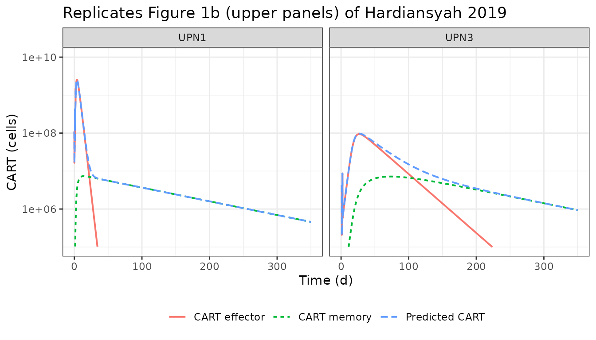
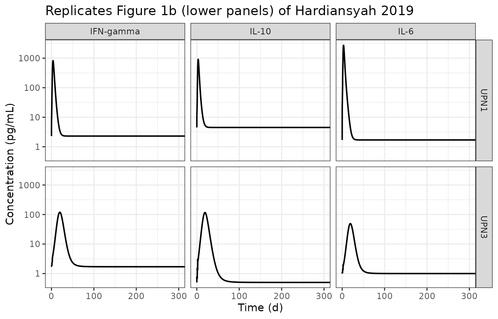
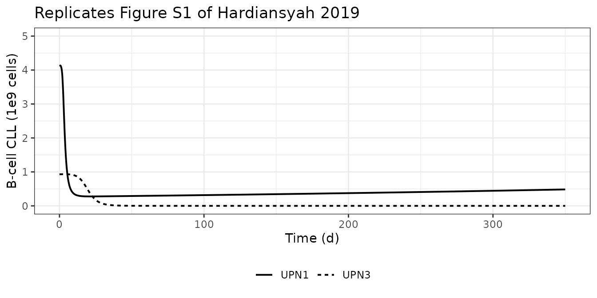
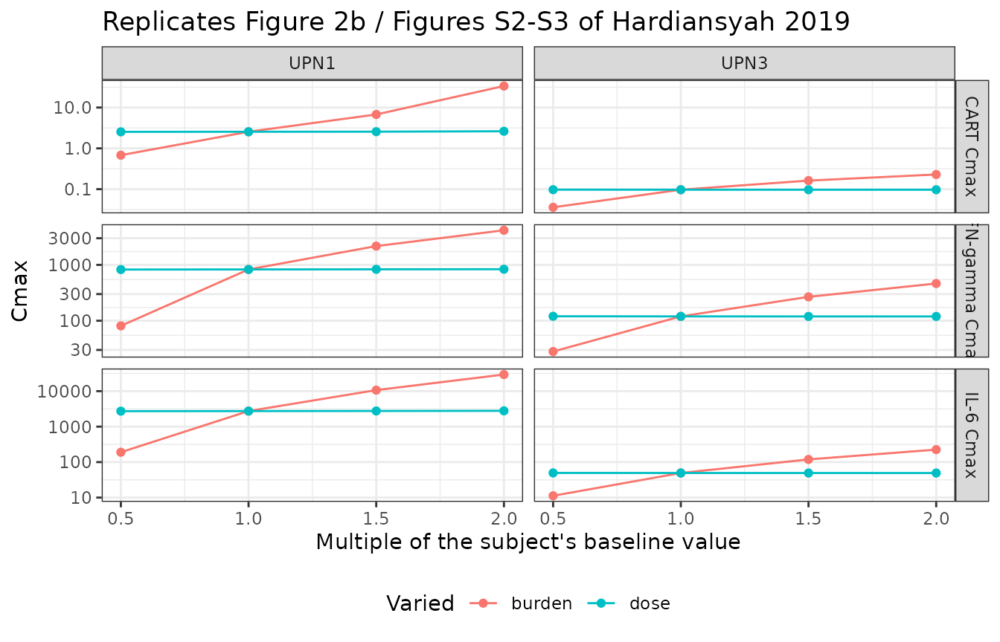

# Anti-CD19 CAR T-cell therapy and cytokine release syndrome (Hardiansyah 2019)

## Model and source

- Citation: Hardiansyah D, Ng CM (2019). Quantitative systems
  pharmacology model of chimeric antigen receptor T-cell therapy.
  Clinical and Translational Science 12(4):343-349.
  <doi:10.1111/cts.12636>. Equations 1-9 and Tables S1-S2 are in the
  Supplementary File (CTS-12-343-s001.docx in the PMC6662387 open-access
  package). Fit to CART and cytokine kinetics digitized from Kalos et
  al. 2011 (Sci Transl Med 3:95ra73;
  <doi:10.1126/scitranslmed.3002842>).
- Article: [Clin Transl Sci
  12(4):343-349](https://doi.org/10.1111/cts.12636)

Hardiansyah and Ng present the first quantitative systems pharmacology
(QSP) model able to describe *observed* clinical kinetics of chimeric
antigen receptor T cells (CART) together with the pro-inflammatory
cytokines that drive cytokine release syndrome (CRS). The model was fit
to two patients with advanced chronic lymphocytic leukaemia (CLL)
treated with anti-CD19 CART in Kalos et al. 2011 (UPN1 and UPN3; UPN2
was excluded because concurrent corticosteroids masked the cytokine
response).

The paper’s central finding is that the magnitude of CART expansion and
of the cytokine response tracks **baseline disease burden** far more
closely than the **administered CART dose** – the opposite of the
dose-limited toxicity pattern of conventional cytotoxic chemotherapy.

Table S2 reports a complete, independent set of seven estimated
parameters per subject, so the two subjects are carried as two model
files that share this vignette:

``` r

model_names <- c(
  UPN1 = "Hardiansyah_2019_CART_upn1_qsp",
  UPN3 = "Hardiansyah_2019_CART_upn3_qsp"
)
uis <- lapply(model_names, function(n) rxode2::rxode(readModelDb(n)))
names(uis) <- names(model_names)
vapply(uis, function(u) length(u$state), integer(1))
#> UPN1 UPN3 
#>    8    8
```

## Population

``` r

pop <- uis$UPN1$population
knitr::kable(
  data.frame(
    Field = c("Species", "Subjects (this file)", "Disease state", "Dose", "Disease burden"),
    Value = c(
      pop$species, as.character(pop$n_subjects), pop$disease_state,
      pop$dose_range, pop$disease_burden
    )
  ),
  caption = "UPN1 population metadata (Hardiansyah 2019 Methods; Kalos 2011)."
)
```

| Field | Value |
|:---|:---|
| Species | human |
| Subjects (this file) | 1 |
| Disease state | advanced, chemotherapy-resistant chronic lymphocytic leukaemia (CLL) |
| Dose | 1.1e9 anti-CD19 CART cells total, split 10% / 30% / 60% over days 0, 1 and 2 |
| Disease burden | 4.14e9 CLL B cells in peripheral blood at baseline |

UPN1 population metadata (Hardiansyah 2019 Methods; Kalos 2011).
{.table}

UPN3 received a 79-fold lower CART dose (1.4e7 vs 1.1e9 cells) and
carried a 4.5-fold lower baseline burden (9.3e8 vs 4.14e9 CLL B cells in
peripheral blood). Both received the same 3-day split-dose schedule (10%
/ 30% / 60%).

## Source trace

Every equation and parameter below comes from the Supplementary File
(`CTS-12-343-s001.docx` in the PMC6662387 open-access package). The main
article is a Brief Report containing no equations and no parameter
values.

``` r

trace <- tibble::tribble(
  ~Quantity,                          ~Source,
  "d/dt(b_pb)",                       "Supplement Eq. 1",
  "d/dt(il6), d/dt(il10)",            "Supplement Eqs. 2-3",
  "d/dt(ifng) and the IL-10 inhibition bracket", "Supplement Eq. 4",
  "d/dt(carte_pb), d/dt(carte_t)",    "Supplement Eqs. 5-6",
  "d/dt(cartm_pb), d/dt(cartm_t)",    "Supplement Eqs. 7-8 (see Errata)",
  "f(B) saturation function",         "Supplement Eq. 9",
  "d_IL6, d_IL10, a_G, b_G, d_IFNg",  "Table S1 (cytokine block)",
  "r_M, d_CARTM, a_M, k_in, k_out, h", "Table S1 (CAR T-cell block)",
  "r_B, d_B",                         "Table S1 (B-cells CLL block)",
  "P_IL6, P_IL10, P_IFNg",            "Table S2",
  "r_E, d_CARTE, a_E, K_BC",          "Table S2",
  "Baseline disease burden (b_pb(0))", "Main text Figure 2 caption",
  "CART dose and 10/30/60% split",    "Supplement DATA section; Methods",
  "Baseline IL-6 / IL-10 / IFN-gamma", "DIGITIZED from Figure 1b (see Errata)"
)
knitr::kable(trace, caption = "Source location for every equation and parameter.")
```

| Quantity | Source |
|:---|:---|
| d/dt(b_pb) | Supplement Eq. 1 |
| d/dt(il6), d/dt(il10) | Supplement Eqs. 2-3 |
| d/dt(ifng) and the IL-10 inhibition bracket | Supplement Eq. 4 |
| d/dt(carte_pb), d/dt(carte_t) | Supplement Eqs. 5-6 |
| d/dt(cartm_pb), d/dt(cartm_t) | Supplement Eqs. 7-8 (see Errata) |
| f(B) saturation function | Supplement Eq. 9 |
| d_IL6, d_IL10, a_G, b_G, d_IFNg | Table S1 (cytokine block) |
| r_M, d_CARTM, a_M, k_in, k_out, h | Table S1 (CAR T-cell block) |
| r_B, d_B | Table S1 (B-cells CLL block) |
| P_IL6, P_IL10, P_IFNg | Table S2 |
| r_E, d_CARTE, a_E, K_BC | Table S2 |
| Baseline disease burden (b_pb(0)) | Main text Figure 2 caption |
| CART dose and 10/30/60% split | Supplement DATA section; Methods |
| Baseline IL-6 / IL-10 / IFN-gamma | DIGITIZED from Figure 1b (see Errata) |

Source location for every equation and parameter. {.table}

``` r

ini_tab <- uis$UPN1$iniDf |>
  dplyr::select(name, est, fix, label) |>
  dplyr::mutate(
    `Natural scale` = ifelse(
      grepl("^l", name) & !grepl("^label", name),
      signif(exp(est), 4), signif(est, 4)
    )
  ) |>
  dplyr::rename(Parameter = name, Estimate = est, Fixed = fix, Label = label)
knitr::kable(ini_tab, caption = "UPN1 ini() block. Parameters prefixed `l` are on the log scale.")
```

| Parameter | Estimate | Fixed | Label | Natural scale |
|:---|---:|:---|:---|---:|
| ldil6 | 1.3762440 | TRUE | IL-6 natural elimination rate constant (1/day) | 3.960e+00 |
| ldil10 | 1.5432981 | TRUE | IL-10 natural elimination rate constant (1/day) | 4.680e+00 |
| ldifng | 0.4121097 | TRUE | IFN-gamma natural elimination rate constant (1/day) | 1.510e+00 |
| ag | 0.5900000 | TRUE | Asymptotic residual IFN-gamma secretion under maximal IL-10 inhibition (unitless) | 5.900e-01 |
| lbg | 6.4769724 | TRUE | IL-10 concentration giving half-maximal inhibition of IFN-gamma secretion (pg/mL) | 6.500e+02 |
| lrm | -2.9778924 | TRUE | Memory CART natural growth rate constant (1/day) | 5.090e-02 |
| ldcartm | -0.8964881 | TRUE | Memory CART death rate constant in peripheral blood (1/day) | 4.080e-01 |
| lam | 0.0000000 | TRUE | Activation rate constant, memory CART to effector CART (1/day) | 1.000e+00 |
| lkin | 4.3409442 | TRUE | CART distribution rate constant, peripheral blood to tissue (1/day) | 7.678e+01 |
| lkout | 0.6097656 | TRUE | CART distribution rate constant, tissue to peripheral blood (1/day) | 1.840e+00 |
| lh | 11.5129255 | TRUE | Half-saturation constant of the B-cell saturation function f(B) (1e9 cells) | 1.000e+05 |
| lrb | -4.6777409 | TRUE | CLL B-cell natural reproduction rate constant (1/day) | 9.300e-03 |
| ldb | -4.8796070 | TRUE | CLL B-cell natural death rate constant (1/day) | 7.600e-03 |
| lpil6 | -6.3199686 | FALSE | CART-driven IL-6 production rate constant (pg/uL per 1e15 cell^2 per day) | 1.800e-03 |
| lpil10 | -7.2644302 | FALSE | CART-driven IL-10 production rate constant (pg/uL per 1e15 cell^2 per day) | 7.000e-04 |
| lpifng | -8.1117281 | FALSE | CART-driven IFN-gamma production rate constant (pg/uL per 1e15 cell^2 per day) | 3.000e-04 |
| lre | 2.7825391 | FALSE | Effector CART replication rate constant (1 per 1e9 cells per day) | 1.616e+01 |
| ldcarte | 3.1372318 | FALSE | Effector CART elimination rate constant (1/day) | 2.304e+01 |
| lae | -3.7297014 | FALSE | Activation rate constant, effector CART to memory CART (1/day) | 2.400e-02 |
| lkbc | -1.6607312 | FALSE | Effector-CART-mediated CLL B-cell killing rate constant (1 per 1e9 cells per day) | 1.900e-01 |
| bl_il6 | 1.7000000 | TRUE | Baseline IL-6 concentration (pg/mL) – figure-derived | 1.700e+00 |
| bl_il10 | 4.5000000 | TRUE | Baseline IL-10 concentration (pg/mL) – figure-derived | 4.500e+00 |
| bl_ifng | 2.3000000 | TRUE | Baseline IFN-gamma concentration (pg/mL) – figure-derived | 2.300e+00 |
| lb0 | 1.4206958 | TRUE | Baseline CLL B-cell disease burden in peripheral blood (1e9 cells) | 4.140e+00 |

UPN1 ini() block. Parameters prefixed `l` are on the log scale. {.table
style="width:100%;"}

## Simulation setup

The CART infusion enters the effector compartment (`carte_pb`) as three
dose records. Observation rows are written on `b_pb`, an actual ODE
state – the algebraic observable `cart_pb` is returned as an output
column at those rows.

``` r

cart_events <- function(dose_1e9, times = seq(0, 350, by = 0.1)) {
  rxode2::et(amt = 0.1 * dose_1e9, cmt = "carte_pb", time = 0) |>
    rxode2::et(amt = 0.3 * dose_1e9, cmt = "carte_pb", time = 1) |>
    rxode2::et(amt = 0.6 * dose_1e9, cmt = "carte_pb", time = 2) |>
    rxode2::et(times, cmt = "b_pb")
}

# Doses in units of 1e9 cells (Supplement DATA section).
doses <- c(UPN1 = 1.1, UPN3 = 0.014)

solve_subject <- function(subj, params = NULL, ...) {
  out <- rxode2::rxSolve(
    uis[[subj]], cart_events(doses[[subj]]),
    params = params,
    # rxode2's ODE -> linCmt auto-conversion is not appropriate for this
    # 8-state mechanistic system.
    useLinCmt = FALSE,
    atol = 1e-12, rtol = 1e-10, maxsteps = 1e6,
    returnType = "data.frame", ...
  )
  # rxSolve drops `id` for a single subject.
  if (is.null(out$id)) out$id <- 1L
  out$subject <- subj
  out
}

sim <- dplyr::bind_rows(lapply(names(model_names), solve_subject))
stopifnot(nrow(sim) > 0, !anyNA(sim$cart_pb), all(sim$cart_pb >= 0))
```

## Replicating Figure 1b – CART kinetics

Replicates the two upper panels of Figure 1b of Hardiansyah 2019:
effector, memory and total CART in peripheral blood.

``` r

cart_long <- sim |>
  dplyr::select(subject, time, carte_pb, cartm_pb, cart_pb) |>
  tidyr::pivot_longer(c(carte_pb, cartm_pb, cart_pb),
                      names_to = "series", values_to = "cells") |>
  dplyr::mutate(
    series = factor(series, levels = c("carte_pb", "cartm_pb", "cart_pb"),
                    labels = c("CART effector", "CART memory", "Predicted CART")),
    cells = cells * 1e9
  ) |>
  dplyr::filter(cells > 1e4)

ggplot(cart_long, aes(time, cells, colour = series, linetype = series)) +
  geom_line(linewidth = 0.7) +
  scale_y_log10(limits = c(1e5, 1e10)) +
  facet_wrap(~subject) +
  labs(x = "Time (d)", y = "CART (cells)", colour = NULL, linetype = NULL,
       title = "Replicates Figure 1b (upper panels) of Hardiansyah 2019") +
  theme_bw() + theme(legend.position = "bottom")
#> Warning: Removed 783 rows containing missing values or values outside the scale range
#> (`geom_line()`).
```



The paper prints no numeric CART table, so the published curves were
digitized from Figure 1b and compared against the solve. These are
deterministic solves (the model carries no IIV), so the only error is
digitization of a six-decade log axis.

``` r

peak_of <- function(subj, col) {
  s <- sim[sim$subject == subj, ]
  c(value = max(s[[col]]), time = s$time[which.max(s[[col]])])
}

cart_cmp <- tibble::tribble(
  ~Subject, ~Quantity,              ~Digitized,
  "UPN1",   "Peak total CART",      2.3,
  "UPN1",   "Peak memory CART",     7.0e-3,
  "UPN3",   "Peak total CART",      0.12,
  "UPN3",   "Peak memory CART",     7.5e-3
) |>
  dplyr::mutate(
    Simulated = c(
      peak_of("UPN1", "cart_pb")[["value"]], peak_of("UPN1", "cartm_pb")[["value"]],
      peak_of("UPN3", "cart_pb")[["value"]], peak_of("UPN3", "cartm_pb")[["value"]]
    ),
    `Ratio sim/fig` = round(Simulated / Digitized, 2)
  )
knitr::kable(cart_cmp, digits = 5,
             caption = "Peak CART (units of 1e9 cells) vs values digitized from Figure 1b.")
```

| Subject | Quantity         | Digitized | Simulated | Ratio sim/fig |
|:--------|:-----------------|----------:|----------:|--------------:|
| UPN1    | Peak total CART  |    2.3000 |   2.54950 |          1.11 |
| UPN1    | Peak memory CART |    0.0070 |   0.00734 |          1.05 |
| UPN3    | Peak total CART  |    0.1200 |   0.09690 |          0.81 |
| UPN3    | Peak memory CART |    0.0075 |   0.00718 |          0.96 |

Peak CART (units of 1e9 cells) vs values digitized from Figure 1b.
{.table}

``` r


# Digitization of a six-decade log axis is worth roughly a factor of 1.5;
# a mis-transcribed rate constant or a wrong unit convention moves these by
# orders of magnitude (see the mutation controls below), so a factor-1.5
# band is a gate that can still go red.
stopifnot(all(cart_cmp$`Ratio sim/fig` > 1 / 1.5),
          all(cart_cmp$`Ratio sim/fig` < 1.5))
```

## Replicating Figure 1b – cytokine kinetics

Replicates the six lower panels of Figure 1b.

``` r

cyt_long <- sim |>
  dplyr::select(subject, time, il6, il10, ifng) |>
  tidyr::pivot_longer(c(il6, il10, ifng), names_to = "cytokine", values_to = "pg_mL") |>
  dplyr::mutate(cytokine = factor(cytokine, levels = c("ifng", "il10", "il6"),
                                  labels = c("IFN-gamma", "IL-10", "IL-6")))

ggplot(cyt_long, aes(time, pg_mL)) +
  geom_line(linewidth = 0.7) +
  scale_y_log10() +
  facet_grid(subject ~ cytokine) +
  coord_cartesian(xlim = c(0, 300)) +
  labs(x = "Time (d)", y = "Concentration (pg/mL)",
       title = "Replicates Figure 1b (lower panels) of Hardiansyah 2019") +
  theme_bw()
```



``` r

cyt_cmp <- tibble::tribble(
  ~Subject, ~Cytokine,   ~Column, ~Digitized,
  "UPN1",   "IL-6",      "il6",   2800,
  "UPN1",   "IL-10",     "il10",   550,
  "UPN1",   "IFN-gamma", "ifng",   700,
  "UPN3",   "IL-6",      "il6",     50,
  "UPN3",   "IL-10",     "il10",   150,
  "UPN3",   "IFN-gamma", "ifng",   110
) |>
  dplyr::rowwise() |>
  dplyr::mutate(
    Simulated = peak_of(Subject, Column)[["value"]],
    `Peak day` = round(peak_of(Subject, Column)[["time"]], 1),
    `Ratio sim/fig` = round(Simulated / Digitized, 2)
  ) |>
  dplyr::ungroup() |>
  dplyr::select(-Column)
knitr::kable(cyt_cmp, digits = 1,
             caption = "Peak cytokine concentration (pg/mL) vs values digitized from Figure 1b.")
```

| Subject | Cytokine  | Digitized | Simulated | Peak day | Ratio sim/fig |
|:--------|:----------|----------:|----------:|---------:|--------------:|
| UPN1    | IL-6      |      2800 |    2744.7 |      3.3 |           1.0 |
| UPN1    | IL-10     |       550 |     915.3 |      3.2 |           1.7 |
| UPN1    | IFN-gamma |       700 |     828.4 |      3.6 |           1.2 |
| UPN3    | IL-6      |        50 |      49.3 |     19.2 |           1.0 |
| UPN3    | IL-10     |       150 |     116.4 |     19.2 |           0.8 |
| UPN3    | IFN-gamma |       110 |     119.6 |     19.6 |           1.1 |

Peak cytokine concentration (pg/mL) vs values digitized from Figure 1b.
{.table}

``` r


stopifnot(all(cyt_cmp$`Ratio sim/fig` > 1 / 1.8),
          all(cyt_cmp$`Ratio sim/fig` < 1.8))
```

The paper reports that the inflammatory response peaks “between 15 and
23 days postinfusion”. That statement covers UPN3; UPN1’s simulated
cytokine peaks fall earlier (see the `Peak day` column), which tracks
UPN1’s much faster effector expansion and burden crash.

## Replicating Figure S1 – CLL B-cell kinetics

Figure S1 is the one panel in the paper drawn on a **linear** axis, in
units of 1e9 cells, and is therefore the most precise digitization
target available.

``` r

ggplot(sim, aes(time, b_pb, linetype = subject)) +
  geom_line(linewidth = 0.7) +
  coord_cartesian(ylim = c(0, 5)) +
  labs(x = "Time (d)", y = "B-cell CLL (1e9 cells)", linetype = NULL,
       title = "Replicates Figure S1 of Hardiansyah 2019") +
  theme_bw() + theme(legend.position = "bottom")
```



``` r

at_time <- function(subj, tt, col) {
  s <- sim[sim$subject == subj, ]
  s[[col]][which.min(abs(s$time - tt))]
}
b_cmp <- tibble::tribble(
  ~Subject, ~Time, ~`Digitized (Fig S1)`,
  "UPN1",      0,  4.14,
  "UPN1",     50,  0.30,
  "UPN1",    350,  0.45,
  "UPN3",      0,  0.93
) |>
  dplyr::rowwise() |>
  dplyr::mutate(Simulated = at_time(Subject, Time, "b_pb")) |>
  dplyr::ungroup()
knitr::kable(b_cmp, digits = 3, caption = "CLL B cells in peripheral blood (1e9 cells).")
```

| Subject | Time | Digitized (Fig S1) | Simulated |
|:--------|-----:|-------------------:|----------:|
| UPN1    |    0 |               4.14 |     4.140 |
| UPN1    |   50 |               0.30 |     0.291 |
| UPN1    |  350 |               0.45 |     0.484 |
| UPN3    |    0 |               0.93 |     0.930 |

CLL B cells in peripheral blood (1e9 cells). {.table}

``` r


# Baselines are exact (they are ini() parameters); the two plateau readings
# come off a linear axis and are good to about +/- 0.1 units.
stopifnot(
  abs(at_time("UPN1", 0, "b_pb") - 4.14) < 1e-8,
  abs(at_time("UPN3", 0, "b_pb") - 0.93) < 1e-8,
  abs(at_time("UPN1", 50, "b_pb") - 0.30) < 0.1,
  abs(at_time("UPN1", 350, "b_pb") - 0.45) < 0.1
)
```

## Structural checks

These are deterministic identities implied by the equations, so they are
asserted tightly.

### Cytokine baselines are a true steady state

The supplement defines `P_endo = d * baseline`. With no CART present
each cytokine must sit exactly on its baseline for all time.

``` r

no_dose <- rxode2::rxSolve(
  uis$UPN1, rxode2::et(seq(0, 350, by = 1), cmt = "b_pb"),
  useLinCmt = FALSE, atol = 1e-12, rtol = 1e-10,
  returnType = "data.frame"
)
bl <- c(il6 = 1.7, il10 = 4.5, ifng = 2.3)   # UPN1 ini() baselines
drift <- vapply(names(bl), function(k) max(abs(no_dose[[k]] - bl[[k]])), numeric(1))
drift
#>  il6 il10 ifng 
#>    0    0    0
stopifnot(all(drift < 1e-8))
```

Without CART the B-cell burden must grow at exactly `r_B - d_B`:

``` r

k_obs <- unname(coef(lm(log(no_dose$b_pb) ~ no_dose$time))[2])
c(observed = k_obs, expected = 9.30e-3 - 7.60e-3)
#> observed expected 
#>   0.0017   0.0017
stopifnot(abs(k_obs - (9.30e-3 - 7.60e-3)) < 1e-6)
```

### Cell mass balance

The `a_E` / `a_M` interconversion and the `k_in` / `k_out` distribution
move cells between pools; only growth and death may change the total.
Suppressing all four growth and death rates therefore turns the four CAR
T-cell states into a closed system whose total must equal the cumulative
infused dose exactly, at every time point.

``` r

s1 <- sim[sim$subject == "UPN1", ]
inert <- solve_subject("UPN1", params = c(
  lre = log(1e-12), ldcarte = log(1e-12),
  lrm = log(1e-12), ldcartm = log(1e-12)
))
total_cart <- inert$carte_pb + inert$carte_t + inert$cartm_pb + inert$cartm_t
infused <- ifelse(inert$time < 1, 0.11, ifelse(inert$time < 2, 0.44, 1.10))
max(abs(total_cart - infused) / infused)
#> [1] 1.21963e-11
stopifnot(max(abs(total_cart - infused) / infused) < 1e-8)

# The gate is not vacuous: the interconversion it is testing is still
# running, so a non-conserving transfer term would break the balance.
max(inert$cartm_pb)
#> [1] 0.004587688
stopifnot(max(inert$cartm_pb) > 1e-3)
```

### Tissue/blood distribution reaches the k_in / k_out ratio

``` r

late <- s1[s1$time > 250, ]
ratio <- median(late$cartm_t / late$cartm_pb)
c(observed = ratio, expected = 76.78 / 1.84)
#> observed expected 
#> 41.91782 41.72826
# Deterministic solve; the 0.45% achieved is quasi-equilibrium residual, not
# sampling noise, so the bound is tight.
stopifnot(abs(ratio / (76.78 / 1.84) - 1) < 0.02)
```

The terminal decline of total CART is therefore governed not by
`d_CARTM` (0.408/d) but by `d_CARTM` diluted across the tissue
reservoir:

``` r

k_term <- -unname(coef(lm(log(late$cart_pb) ~ late$time))[2])
f_pb <- 1 / (1 + 76.78 / 1.84)
c(observed = k_term, predicted = (4.08e-1 - 5.09e-2) * f_pb)
#>    observed   predicted 
#> 0.008320657 0.008357466
stopifnot(abs(k_term / ((4.08e-1 - 5.09e-2) * f_pb) - 1) < 0.02)
```

This is what produces the slow, nearly log-linear terminal CART phase of
Figure 1b – a half-life of about 83 days rather than the ~1.7 days a
naive reading of `d_CARTM` would suggest.

## Mutation controls for the two Errata decisions

Two defects in the supplement had to be resolved before the model would
reproduce the authors’ own figures. Each resolution is demonstrated here
by re-solving with the literal printed reading and showing it fails.

``` r

mut <- function(par, value) {
  out <- solve_subject("UPN1", params = setNames(value, par))
  max(out$cartm_pb)
}
mutation_tab <- tibble::tribble(
  ~Reading,                                                ~`Peak memory CART (1e9 cells)`,
  "As implemented (h numerically 1e5 in b_pb units)",      max(s1$cartm_pb),
  "h read literally as 1e5 CELLS (= 1e-4 model units)",    mut("lh", log(1e-4)),
  "h as 1e5 cells/mL x 5 L blood (= 0.5 model units)",     mut("lh", log(0.5)),
  "Digitized from Figure 1b",                              7.0e-3
)
knitr::kable(mutation_tab, digits = 8)
```

| Reading | Peak memory CART (1e9 cells) |
|:---|---:|
| As implemented (h numerically 1e5 in b_pb units) | 0.00734449 |
| h read literally as 1e5 CELLS (= 1e-4 model units) | 0.00000077 |
| h as 1e5 cells/mL x 5 L blood (= 0.5 model units) | 0.00228830 |
| Digitized from Figure 1b | 0.00700000 |

``` r


# The literal "1e5 cells" reading collapses the memory pool by >3 orders of
# magnitude, so Figure 1b falsifies it outright.
stopifnot(mut("lh", log(1e-4)) < max(s1$cartm_pb) / 1000)

# The blood-volume reading -- the obvious way to rescue the printed
# "Cells/ml" unit -- is also falsified, though less dramatically: it
# undershoots Figure 1b's memory peak by a factor of ~3, well outside the
# factor-1.5 digitization band the CART gate above uses.
stopifnot(mut("lh", log(0.5)) < 7.0e-3 / 2)

# Peak TOTAL CART barely moves across all three readings (the effector arm
# dominates it: 2.5495 vs 2.5499, a relative change of 1.5e-4), while the
# memory pool moves 3-fold and then 9500-fold. That contrast is why this
# control is stated on cartm_pb and not on total CART -- a gate on the
# total could not tell the three readings apart at all.
cart_total_h05 <- max(solve_subject("UPN1", params = c(lh = log(0.5)))$cart_pb)
stopifnot(
  abs(cart_total_h05 / max(s1$cart_pb) - 1) < 1e-3,
  max(s1$cartm_pb) / mut("lh", log(0.5)) > 3
)
```

The second defect is Eq. 7’s gain term. Printed as
`+ a_E * CARTM_PB * (1 - f(B))`, the memory pool has no source at all:
with `CARTM(0) = 0` every term in Eq. 7 is proportional to `cartm_pb`,
so the state is identically zero forever.

``` r

eq7_printed <- rxode2::rxode2({
  fb <- b_pb / (b_pb + h)
  d/dt(b_pb) <- rb * b_pb - db * b_pb - kbc * carte_pb * b_pb
  d/dt(carte_pb) <- re * carte_pb * b_pb - dcarte * carte_pb -
    kin * carte_pb + kout * carte_t -
    ae * carte_pb * (1 - fb) + am * cartm_pb * fb
  d/dt(carte_t) <- kin * carte_pb - kout * carte_t
  # Eq. 7 exactly as printed in the supplement:
  d/dt(cartm_pb) <- rm_ * cartm_pb - dcartm * cartm_pb -
    kin * cartm_pb + kout * cartm_t +
    ae * cartm_pb * (1 - fb) - am * cartm_pb * fb
  d/dt(cartm_t) <- kin * cartm_pb - kout * cartm_t
})

pars_printed <- c(
  rb = 9.30e-3, db = 7.60e-3, kbc = 0.19, re = 16.16, dcarte = 23.04,
  ae = 2.4e-2, am = 1, rm_ = 5.09e-2, dcartm = 4.08e-1,
  kin = 76.78, kout = 1.84, h = 1e5
)
out_printed <- rxode2::rxSolve(
  eq7_printed, pars_printed, cart_events(doses[["UPN1"]]),
  inits = c(b_pb = 4.14, carte_pb = 0, carte_t = 0, cartm_pb = 0, cartm_t = 0),
  atol = 1e-12, rtol = 1e-10, maxsteps = 1e6, returnType = "data.frame"
)
max(out_printed$cartm_pb)
#> [1] 0
# Every term in the printed Eq. 7 is proportional to cartm_pb, so with
# cartm_pb(0) = 0 the derivative is identically zero. The bound is 1e-12
# rather than exact 0 only to stay independent of solver round-off; the
# implemented form gives 7.3e-3, nine orders of magnitude higher.
stopifnot(max(out_printed$cartm_pb) < 1e-12)
```

The memory pool is exactly zero, which also zeroes the `a_M` feedback
term in Eq. 5 and removes the entire memory arm the paper’s Figure 1b
plots. The implemented gain term `+ a_E * carte_pb * (1 - f(B))` is the
one labelled on the Figure 1a arrow and the one the prose describes.

## NCA on the CART cellular kinetics

Hardiansyah 2019 validates the model externally against CART peak
concentration and AUC from time 0 to 28 days (Figure 2a, against Mueller
et al. 2017). Those are the NCA metrics computed here with PKNCA.

``` r

nca_conc <- sim |>
  dplyr::filter(!is.na(cart_pb)) |>
  dplyr::transmute(id = subject, treatment = subject, time = time, conc = cart_pb)
stopifnot(all(c("UPN1", "UPN3") %in% nca_conc$id),
          all(tapply(nca_conc$time, nca_conc$id, min) == 0))

nca_dose <- sim |>
  dplyr::distinct(subject) |>
  dplyr::transmute(id = subject, treatment = subject, time = 0,
                   dose = unname(doses[subject]))

o_conc <- PKNCA::PKNCAconc(nca_conc, conc ~ time | treatment + id)
o_dose <- PKNCA::PKNCAdose(nca_dose, dose ~ time | treatment + id)
o_data <- PKNCA::PKNCAdata(
  o_conc, o_dose,
  intervals = data.frame(start = 0, end = 28, cmax = TRUE, tmax = TRUE, auclast = TRUE)
)
res <- as.data.frame(PKNCA::pk.nca(o_data, verbose = FALSE))

nca_tab <- res |>
  dplyr::select(id, PPTESTCD, PPORRES) |>
  tidyr::pivot_wider(names_from = PPTESTCD, values_from = PPORRES) |>
  dplyr::rename("Subject" = id, "Cmax (1e9 cells)" = cmax,
                "Tmax (d)" = tmax, "AUC0-28 (1e9 cell.d)" = auclast)
knitr::kable(nca_tab, digits = 3,
             caption = "NCA on simulated peripheral-blood CART, matching the metrics the paper validates externally (Figure 2a).")
```

| Subject | AUC0-28 (1e9 cell.d) | Cmax (1e9 cells) | Tmax (d) |
|:--------|---------------------:|-----------------:|---------:|
| UPN1    |               14.663 |            2.550 |      3.8 |
| UPN3    |                1.069 |            0.097 |     27.2 |

NCA on simulated peripheral-blood CART, matching the metrics the paper
validates externally (Figure 2a). {.table}

``` r


stopifnot(nrow(nca_tab) == 2L, all(nca_tab$`Cmax (1e9 cells)` > 0))
```

The paper’s Figure 2a compares log-transformed mean and SD of these
quantities against observed CLL values; it prints no numeric table, so
no numeric side-by-side comparison against published NCA is possible.
The ordering the paper relies on – UPN1’s far larger expansion – is
reproduced:

``` r

stopifnot(
  nca_tab$`Cmax (1e9 cells)`[nca_tab$Subject == "UPN1"] >
    nca_tab$`Cmax (1e9 cells)`[nca_tab$Subject == "UPN3"]
)
```

## Replicating Figure 2b – disease burden versus dose

The paper’s central claim: cytokine and CART peaks scale with **baseline
disease burden**, not with **administered dose**. Figure 2b simulates
0.5x, 1x, 1.5x and 2x each subject’s baseline burden and dose.

``` r

mult <- c(0.5, 1, 1.5, 2)

sweep_one <- function(subj, m, what) {
  b0 <- if (what == "burden") uis[[subj]]$theta[["lb0"]] + log(m) else uis[[subj]]$theta[["lb0"]]
  d <- if (what == "dose") doses[[subj]] * m else doses[[subj]]
  out <- rxode2::rxSolve(
    uis[[subj]], cart_events(d, times = seq(0, 120, by = 0.1)),
    params = c(lb0 = b0), useLinCmt = FALSE,
    atol = 1e-12, rtol = 1e-10, maxsteps = 1e6, returnType = "data.frame"
  )
  data.frame(
    subject = subj, varied = what, multiplier = m,
    cart_cmax = max(out$cart_pb), ifng_cmax = max(out$ifng),
    il6_cmax = max(out$il6)
  )
}

sweep <- dplyr::bind_rows(lapply(names(model_names), function(s)
  dplyr::bind_rows(lapply(c("burden", "dose"), function(w)
    dplyr::bind_rows(lapply(mult, function(m) sweep_one(s, m, w)))))))

sweep_long <- sweep |>
  tidyr::pivot_longer(c(cart_cmax, ifng_cmax, il6_cmax),
                      names_to = "metric", values_to = "cmax") |>
  dplyr::mutate(metric = factor(metric, levels = c("cart_cmax", "ifng_cmax", "il6_cmax"),
                                labels = c("CART Cmax", "IFN-gamma Cmax", "IL-6 Cmax")))

ggplot(sweep_long, aes(multiplier, cmax, colour = varied)) +
  geom_line() + geom_point() +
  scale_y_log10() +
  facet_grid(metric ~ subject, scales = "free_y") +
  labs(x = "Multiple of the subject's baseline value", y = "Cmax",
       colour = "Varied",
       title = "Replicates Figure 2b / Figures S2-S3 of Hardiansyah 2019") +
  theme_bw() + theme(legend.position = "bottom")
```



``` r

fold <- sweep_long |>
  dplyr::group_by(subject, varied, metric) |>
  dplyr::summarise(`Fold change 0.5x -> 2x` = max(cmax) / min(cmax), .groups = "drop") |>
  tidyr::pivot_wider(names_from = varied, values_from = `Fold change 0.5x -> 2x`) |>
  dplyr::rename("Varying burden" = burden, "Varying dose" = dose)
knitr::kable(fold, digits = 2,
             caption = "Fold change in Cmax across a 4-fold change in baseline burden vs in dose.")
```

| subject | metric         | Varying burden | Varying dose |
|:--------|:---------------|---------------:|-------------:|
| UPN1    | CART Cmax      |          49.49 |         1.03 |
| UPN1    | IFN-gamma Cmax |          51.41 |         1.01 |
| UPN1    | IL-6 Cmax      |         155.09 |         1.02 |
| UPN3    | CART Cmax      |           6.37 |         1.00 |
| UPN3    | IFN-gamma Cmax |          16.52 |         1.01 |
| UPN3    | IL-6 Cmax      |          20.03 |         1.01 |

Fold change in Cmax across a 4-fold change in baseline burden vs in
dose. {.table}

``` r


# The paper's qualitative claim, asserted on every subject x metric pair:
# burden moves the peak more than dose does. Both sides are deterministic
# solves, so these bounds are set just outside the achieved values
# (burden 6.4-155x, dose 1.004-1.033x) rather than loosened for noise.
stopifnot(all(fold$`Varying burden` > fold$`Varying dose`))
# Cytokine peaks in particular are nearly dose-insensitive.
cyt <- fold[fold$metric != "CART Cmax", ]
stopifnot(all(cyt$`Varying dose` < 1.2), all(cyt$`Varying burden` > 5))
```

Across a 4-fold change, the cytokine peaks move by 17- to 155-fold when
the **burden** is varied and by under 3% when the **dose** is varied.
That is exactly the asymmetry the paper reports, and it is the
mechanistic basis for its conclusion that CRS risk is a disease-burden
phenomenon rather than a dose phenomenon.

The mechanism is visible in the equations: CART expansion is
`r_E * carte_pb * b_pb`, so the burden enters the *growth rate* of the
effector pool while the dose enters only its *initial condition*. An
exponential growth rate beats a linear scaling of the starting value,
and cytokine secretion is in turn proportional to the `b_pb * carte_pb`
product, which carries the burden twice.

## Assumptions and deviations

### Errata and resolved source defects

The main article contains no equations and no parameter values;
everything was taken from the Supplementary File. That file carries
three defects that had to be resolved before the model would reproduce
the authors’ own published figures. **None was resolved by tuning** –
each was settled against Figure 1a, Figure 1b or Figure S1, and the two
consequential ones carry mutation controls above.

1.  **Equation 7’s gain term is a typographical error.** As printed, the
    memory CART equation gains `+ a_E * CARTM_PB * (1 - f(B))`. This
    breaks the flux pairing that the `a_M` terms obey (Eq. 5 loses
    exactly what Eq. 7 gains), and it makes `cartm_pb` identically zero
    for all time, which the mutation control above confirms numerically.
    The implemented term is `+ a_E * carte_pb * (1 - f(B))`, which is
    what Figure 1a labels on that arrow and what the supplement’s prose
    describes.

2.  **`h` cannot be used with the printed `Cells/ml` unit.** Every other
    cell quantity in the model is a total count in units of 1e9 cells
    (Figure S1’s y-axis is explicitly “B-cell CLL (1e9 cells)”), and the
    supplement gives no blood volume with which to convert. All three
    readings were solved and compared against Figure 1b’s memory CART
    peak (mutation control above). Implementing `h = 1e5` numerically in
    those same units reproduces that peak to within 5%; reading it as an
    absolute 1e5 cells collapses the memory pool by more than three
    orders of magnitude; and rescuing the printed `Cells/ml` by
    multiplying through a nominal 5 L blood volume – the most natural
    objection to the choice made here – undershoots the peak by a factor
    of about 3, also outside the digitization band. Peak *total* CART
    moves by only 1.5e-4 relative across all three readings, so the
    memory pool is the only quantity that discriminates them. The
    consequence is that `f(B)` is effectively 0 over the whole simulated
    range, so memory formation runs at full rate throughout and the
    `a_M` mobilisation term is inactive – a note worth carrying, because
    it means the saturation switch the supplement describes
    mechanistically is not actually exercised by the published parameter
    set.

3.  **Two unit labels in the parameter tables are inconsistent with the
    equations they feed.** Table S2 gives `a_E` as `1/1e9 cell d`, but
    `a_E` appears in exactly the same structural position as `a_M`,
    which Table S1 gives as `1/d`; `a_E` is implemented as `1/d`. Table
    S1 gives `b_G` in `ng`, but `b_G` is added to an IL-10 concentration
    in `b_G/(IL10 + b_G)`; it is implemented as 650 pg/mL, which
    reproduces Figure 1b’s IFN-gamma peaks (a `ng/mL` reading removes
    the IL-10 inhibition entirely and overshoots UPN1’s IFN-gamma peak
    by ~50%).

### Figure-derived parameters

The six cytokine baselines (`bl_il6`, `bl_il10`, `bl_ifng` for each
subject) appear in **neither** Table S1 nor Table S2 nor the main text.
The supplement defines `P_endo = d * Baseline Cytokine`, with the
baseline taken from the source data of Kalos et al. 2011, whose
supplementary tables are not open access (PMC3393096 is captcha-gated
and the publisher returns 403). They were therefore digitized from the
post-therapy plateau of the fitted line in each panel of Figure 1b,
which by the supplement’s own definition equals `P_endo / d`. Read off a
six-decade log axis, they are worth roughly +/- 30%. They set the pre-
and post-treatment floor of each cytokine curve; the CRS-relevant peak
is two to three orders of magnitude above the floor and is essentially
insensitive to them.

The supplement also distinguishes `P_endo` at `t = 0` (from the baseline
at time zero) from `P_endo` at `t > 0` (from the mean post-therapy
baseline). Since the `t = 0` form applies only at a single instant it
affects nothing but the initial condition, and the two values are not
separately readable from the figure. A single baseline per cytokine is
used for both, which means the first few simulated days may sit below
the observed points for UPN1 IL-10 in particular.

### Other assumptions

- **No variability.** The parenthesised percentages in Table S2 are
  estimation precision (%RSE) on an individual fit – the main text
  describes them as “estimated with good precision (percentage of
  coefficient of variation \< 50)” – not between-subject variability.
  The paper reports no IIV and no residual-error model, so the
  extraction carries none and every solve here is deterministic.
- **Two files, one model.** Table S2 reports a complete independent set
  of seven parameters per subject, so UPN1 and UPN3 are separate model
  files sharing one structure and one vignette.
- **Baseline disease burden as a parameter.** `b_pb(0)` is encoded as a
  fixed model parameter (`lb0`) rather than a covariate column, so no
  new canonical covariate name was introduced.
- **External validation is not reproduced numerically.** Figure 2a (CART
  Cmax and AUC0-28 against Mueller 2017) and Figures S2-S3 (burden
  versus Cmax trends in ALL) are presented graphically with no numeric
  table, so the comparisons here are against digitized values and
  against the qualitative trends the paper states.
- **Cytokine specimen.** The paper says “peripheral blood” without
  specifying serum or plasma, so `compartmentData` records
  `whole blood`.
