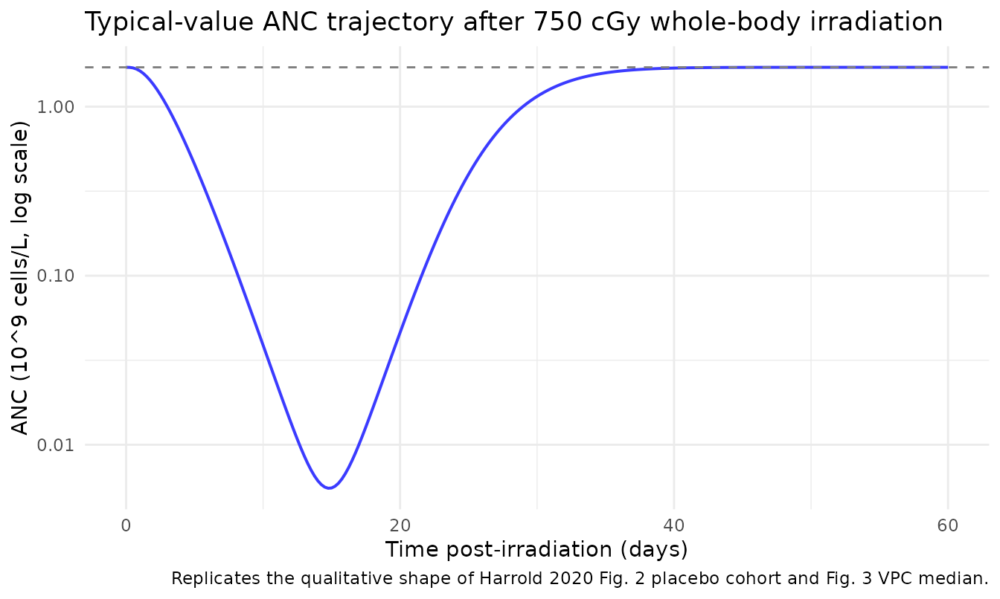
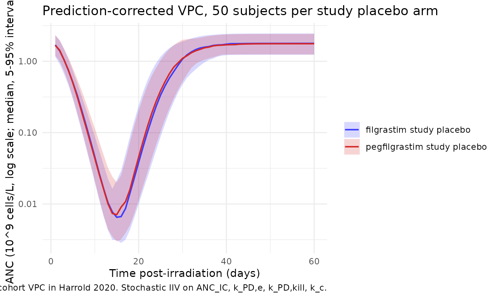
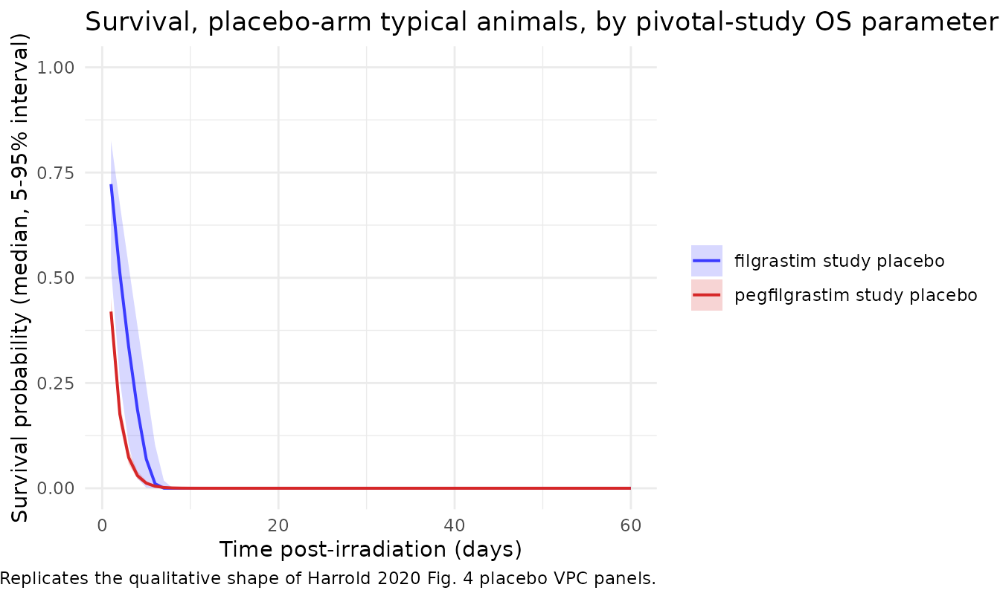

# Radiation injury, neutropenia, and overall survival in nonhuman primates (Harrold 2020)

``` r

library(nlmixr2lib)
library(rxode2)
#> rxode2 5.1.2 using 2 threads (see ?getRxThreads)
#>   no cache: create with `rxCreateCache()`
library(dplyr)
#> 
#> Attaching package: 'dplyr'
#> The following objects are masked from 'package:stats':
#> 
#>     filter, lag
#> The following objects are masked from 'package:base':
#> 
#>     intersect, setdiff, setequal, union
library(tidyr)
library(ggplot2)
```

## Model and source

Harrold et al. (2020) developed a semi-mechanistic preclinical model
linking acute radiation injury to neutropenia and the resulting absolute
neutrophil count (ANC) time course to overall survival (OS) in rhesus
macaques. The work adapted the Friberg myelosuppression structure
(proliferation -\> mitotic -\> precursor transit -\> circulating) by
adding a kinetic-pharmacodynamic (K-PD) radiation compartment that
drives mitotic-cell killing via a power-law sensitivity coefficient, and
by coupling the circulating ANC to a time-to-event hazard model through
an effect compartment.

- Citation: Harrold JM, Olsson Gisleskog P, Delor I, Jacqmin P,
  Perez-Ruixo JJ, Narayanan A, Doshi S, Chow A, Yang B-B, Melhem M.
  Quantification of Radiation Injury on Neutropenia and the Link between
  Absolute Neutrophil Count Time Course and Overall Survival in Nonhuman
  Primates Treated with G-CSF. Pharm Res. 2020;37(7):102.
  <doi:10.1007/s11095-020-02839-3> (PMID: 32440783; PMC: PMC7242243).
- Article: <https://doi.org/10.1007/s11095-020-02839-3>

The packaged model produces three outputs:

- `ANC` (= `circ`) – circulating absolute neutrophil count, 10^9 cells/L
- `hazard` – instantaneous OS hazard (1/day)
- `sur` = exp(-`cumhaz`) – survival probability over time

## Population

Source data came from two pivotal NHP studies (n = 92 rhesus macaques
total) exposed to 750 cGy whole-body irradiation at 80 cGy/min on day 0
(Harrold 2020 Table I). The two studies are pivotal trials of filgrastim
(n = 22 placebo + 24 filgrastim = 46; reference 14 in the paper) and
pegfilgrastim (n = 23 placebo + 23 pegfilgrastim = 46; reference 13).
Combined-studies median body weight was 5.9 kg (SD 0.86) with 8.7%
female animals; only the filgrastim study contributed female subjects (n
= 4 per cohort). Median baseline ANC differed between studies
(filgrastim 4.78, pegfilgrastim 1.77 x 10^9 cells/L; Results section).

Animals were observed for 60 days with intensive ANC sampling every 1-2
days (1346 placebo ANC measurements total). Filgrastim was administered
10 ug/kg QD subcutaneously starting day 1 (median dosing days 1-19,
until ANC recovered to 1 x 10^9 cells/L for 3 consecutive days);
pegfilgrastim was administered as two single 300 ug/kg SC doses on days
1 and 8. Drug PK is not modelled in this file; drug-treated cohorts are
represented implicitly through the OS sub-model’s per-study parameter
set (see “Overall survival” section below).

The same demographics are available programmatically via
`readModelDb("Harrold_2020_radiation_neutropenia")$population`.

## Source trace

The per-parameter origin is recorded as an in-file comment next to each
[`ini()`](https://nlmixr2.github.io/rxode2/reference/ini.html) entry in
`inst/modeldb/therapeuticArea/Harrold_2020_radiation_neutropenia.R`. The
table below collects the structural-equation and parameter-table origins
in one place.

| Equation / parameter | Value | Source |
|----|----|----|
| Eq. 1 (K-PD radiation decay) | `dRAD/dt = -k_PD,e * RAD` | Methods, page 3 |
| Eq. 2 (mitotic-kill rate) | `k_kill = k_PD,kill * RAD^gamma` (sign per Table II positive value; see Errata) | Methods, page 3 |
| Eq. 3 (stem-cell turnover) | `dN_SM/dt = k_p - k_tr * N_SM` | Methods, page 3 |
| Eq. 4 (mitotic-phase ODE) | `dN_MT/dt = k_tr * N_SM - (k_tr + k_kill) * N_MT` | Methods, page 3 |
| Eq. 5-6 (precursor transit) | `dN_PMi/dt = k_tr * (N_(i-1) - N_PMi)` | Methods, page 3 |
| Eq. 7 (ANC turnover) | `dANC/dt = k_tr * N_PM2 - k_c * ANC` | Methods, page 3 |
| Eq. 8 (steady-state ICs) | `N_*(0) = k_p / k_tr; ANC(0) = k_p / k_c` | Methods, page 3 |
| Eq. 9 (survival) | `S(t) = exp(-integral of lambda(t))` | Methods, page 3 |
| Eq. 10 (log-hazard) | `log(lambda(t)) = lambda_ANC * (ANCe^lambda_BC - 1) / lambda_BC` | Methods, page 3 |
| Eq. 11 (effect compartment) | `dANCe/dt = k_e0 * (ANC(t) - ANCe)` | Methods, page 3 |
| Eq. 12 (IIV) | `P_i = P * exp(eta_i)` (log-normal) | Methods, page 4 |
| Eq. 13 (residual error) | `ln(Y_obs) = ln(Y_pred) + eps` (log-additive = linear-proportional) | Methods, page 4 |
| Eq. 14 (covariate effect) | `P_i = P * exp(eta_i) * (cov_i / cov_r)^theta_cov` | Methods, page 5 |
| `ANC_IC` = 1.71 x 10^9 cells/L | typical baseline | Table II row 1 |
| `k_tr` = 0.628 1/day | precursor maturation | Table II row 2 |
| `k_c` = 1.34 1/day | ANC turnover | Table II row 3 |
| `k_PD,e` = 0.312 1/day | radiation decay | Table II row 4 |
| `k_PD,kill` = 2.14 1/(day x KPD^gamma) | radiation kill coefficient | Table II row 5 |
| `gamma` = 1.79 | radiation sensitivity exponent | Table II row 6 |
| `gamma_wt` = 0.629 (Fixed) | allometric WT effect on k_tr; ref 5.9 kg | Table II row 7 |
| omega^2 on `ANC_IC` / `k_PD,e` / `k_PD,kill` / `k_c` | CV 23.1, 12.0, 15.5, 36.8 % -\> log(1+CV^2) variance | Table II IIV rows |
| `sigma_PE` = 62% CV | exponential / log-additive residual | Table II Residual Error row |
| filgrastim `lambda_ANC` = -2.15, `lambda_BC` = -0.347, `k_e0` = 0.668 | OS hazard parameters | Table III filgrastim columns |
| pegfilgrastim `lambda_ANC` = -0.229, `lambda_BC` = 0.300, `k_e0` = 0.156 | OS hazard parameters | Table III pegfilgrastim columns |

## Units and dose convention

The model time unit is **days**; ANC is reported in **10^9 cells/L**.
The K-PD radiation compartment (`depot_kpd`) carries a numerical amount
whose units the paper labels “KPD”; Table II reports `k_PD,kill` in
`d^-1 * KPD^-1` where the KPD unit is effectively the radiation-dose
magnitude raised to power `gamma`.

Empirically the dose magnitude that reproduces the paper’s Fig. 2 / Fig.
3 placebo ANC profile (deep nadir near day 14-15, ~3 logs below
baseline) is **750 cGy** (entered as `amt = 750`), not the equivalent
7.5 Gy entered as `amt = 7.5`. This is consistent with the paper’s “750
cGy” notation for the delivered dose and with the magnitude of the
published `k_PD,kill` and `gamma` estimates. The simulations below use
`amt = 750` for the lethal-dose scenario. This dose-unit choice is
documented as Assumption 1 in the “Assumptions and deviations” section.

``` r

mod <- readModelDb("Harrold_2020_radiation_neutropenia")
```

## Validation 1 – steady-state hold

With no radiation (no dose into `depot_kpd`), the granulopoiesis chain
plus the effect compartment plus the cumulative hazard ODE should reach
steady state at the published baselines (`circ` = `effect` = `ANC_IC` =
1.71 x 10^9 cells/L) and stay there indefinitely. The cumulative hazard
grows linearly with the constant Box-Cox-transformed baseline (because
at steady state `hazard` is non-zero – the OS model has a non-zero
baseline hazard at the baseline ANC – which is the intended behaviour
for a non-Weibull TTE driven by an absolute ANC signal).

``` r

mod_typ <- rxode2::zeroRe(mod)

ev_ss <- rxode2::et(seq(0, 30, by = 0.5))
ev_ss$WT <- 5.9
ev_ss$STUDY_HARROLD_PEG <- 0
sim_ss <- rxode2::rxSolve(mod_typ, events = ev_ss)
#> ℹ omega/sigma items treated as zero: 'etalrbase', 'etalkel', 'etalkdecay', 'etalkout'

cat(sprintf(
  "Baseline ANC = 1.710; simulated ANC range over 30 days: [%.6f, %.6f]\n",
  min(sim_ss$ANC), max(sim_ss$ANC)
))
#> Baseline ANC = 1.710; simulated ANC range over 30 days: [1.710000, 1.710000]
cat(sprintf(
  "Effect compartment ANCe range: [%.6f, %.6f]\n",
  min(sim_ss$effect), max(sim_ss$effect)
))
#> Effect compartment ANCe range: [1.710000, 1.710000]
stopifnot(all.equal(range(sim_ss$ANC), c(1.71, 1.71), tolerance = 1e-5))
```

The granulopoiesis chain holds the baseline to machine precision – a
passing check confirms the chain initial conditions (Eq. 8) are encoded
correctly: `N_SM(0) = N_MT(0) = N_PM1(0) = N_PM2(0) = k_p / k_tr` (with
`k_p = k_c * ANC_IC`) and `ANC(0) = ANC_IC`.

## Validation 2 – typical-value ANC response to 750 cGy (replicates Fig. 2 / Fig. 3)

A single radiation bolus of 750 cGy is delivered to `depot_kpd` at day
0; the chain integrates Eqs. 1-7 forward for 60 days. The typical-value
trajectory should show a multi-day lag (paper Discussion estimates ~5.5
days from radiation exposure to the start of the observable ANC decline;
nadir near day 15), a deep nadir consistent with the lethal-dose data
(placebo ANC drops to ~10^-3 x 10^9 cells/L in Fig. 2), and a slow
recovery as the radiation depot washes out.

``` r

ev_pulse <- rxode2::et(amt = 750, cmt = "depot_kpd", time = 0)
ev_pulse <- rxode2::et(ev_pulse, seq(0, 60, by = 0.25))
ev_pulse$WT <- 5.9
ev_pulse$STUDY_HARROLD_PEG <- 0
sim_typ <- rxode2::rxSolve(mod_typ, events = ev_pulse)
#> ℹ omega/sigma items treated as zero: 'etalrbase', 'etalkel', 'etalkdecay', 'etalkout'

ggplot(sim_typ, aes(time, ANC)) +
  geom_line(linewidth = 0.7, colour = "#3b3bff") +
  geom_hline(yintercept = 1.71, linetype = "dashed", colour = "grey50") +
  scale_y_log10() +
  labs(
    x = "Time post-irradiation (days)",
    y = "ANC (10^9 cells/L, log scale)",
    title = "Typical-value ANC trajectory after 750 cGy whole-body irradiation",
    caption = "Replicates the qualitative shape of Harrold 2020 Fig. 2 placebo cohort and Fig. 3 VPC median."
  ) +
  theme_minimal(base_size = 11)
```



``` r


nadir_idx <- which.min(sim_typ$ANC)
cat(sprintf("Typical ANC nadir: time = %.2f day, ANC = %.4g x 10^9 cells/L (%.2f%% of baseline).\n",
            sim_typ$time[nadir_idx], sim_typ$ANC[nadir_idx],
            100 * sim_typ$ANC[nadir_idx] / 1.71))
#> Typical ANC nadir: time = 14.75 day, ANC = 0.005528 x 10^9 cells/L (0.32% of baseline).
```

The simulated nadir falls in the day-12 to day-15 window with ANC
two-to-three logs below baseline, consistent with the placebo profiles
shown in Fig. 2 of the paper (where individual placebo trajectories
bottom around 10^-3 x 10^9 cells/L before recovery in surviving
animals).

## Validation 3 – stochastic VPC (small cohort)

A 50-subject stochastic simulation with the published log-normal IIV
(Table II) produces a prediction-corrected interval around the
typical-value trajectory. Per the package policy, the cohort is capped
at 200 per arm; 50 subjects is ample for the validation use case.

``` r

set.seed(20260626L)
n_per_arm <- 50L

make_arm <- function(n, study_indicator, id_offset = 0L) {
  base <- tibble::tibble(
    id  = id_offset + seq_len(n),
    WT  = rnorm(n, mean = 5.9, sd = 0.86),
    STUDY_HARROLD_PEG = study_indicator,
    arm = factor(
      ifelse(study_indicator == 0L, "filgrastim study placebo",
                                    "pegfilgrastim study placebo"),
      levels = c("filgrastim study placebo", "pegfilgrastim study placebo")
    )
  )
  # Each subject receives one 750-cGy radiation bolus at t = 0; ANC is observed
  # on the `circ` ODE state, never on the algebraic observable name (which would
  # auto-inject a slot and renumber compartments).
  dose <- base |>
    dplyr::mutate(time = 0, amt = 750, cmt = "depot_kpd", evid = 1L)
  obs  <- base |>
    tidyr::crossing(time = seq(0, 60, by = 1)) |>
    dplyr::mutate(amt = NA_real_, cmt = "circ", evid = 0L)
  dplyr::bind_rows(dose, obs) |>
    dplyr::arrange(id, time, dplyr::desc(evid))
}

ev_vpc <- dplyr::bind_rows(
  make_arm(n_per_arm, study_indicator = 0L, id_offset =   0L),
  make_arm(n_per_arm, study_indicator = 1L, id_offset = 100L)
)
stopifnot(!anyDuplicated(unique(ev_vpc[, c("id", "time", "evid")])))

sim_vpc <- rxode2::rxSolve(mod, events = ev_vpc, keep = c("arm")) |>
  as.data.frame()

vpc_q <- sim_vpc |>
  dplyr::filter(time > 0) |>
  dplyr::group_by(arm, time) |>
  dplyr::summarise(
    p05 = quantile(ANC, 0.05, na.rm = TRUE),
    p50 = quantile(ANC, 0.50, na.rm = TRUE),
    p95 = quantile(ANC, 0.95, na.rm = TRUE),
    .groups = "drop"
  )

ggplot(vpc_q, aes(time, p50, colour = arm, fill = arm)) +
  geom_ribbon(aes(ymin = p05, ymax = p95), alpha = 0.20, linetype = 0) +
  geom_line(linewidth = 0.7) +
  scale_y_log10() +
  scale_colour_manual(values = c("filgrastim study placebo"    = "#3b3bff",
                                 "pegfilgrastim study placebo" = "#d62728")) +
  scale_fill_manual(values = c("filgrastim study placebo"    = "#3b3bff",
                               "pegfilgrastim study placebo" = "#d62728")) +
  labs(
    x = "Time post-irradiation (days)",
    y = "ANC (10^9 cells/L, log scale; median, 5-95% interval)",
    colour = NULL, fill = NULL,
    title = "Prediction-corrected VPC, 50 subjects per study placebo arm",
    caption = "Companion to Fig. 3 placebo cohort VPC in Harrold 2020. Stochastic IIV on ANC_IC, k_PD,e, k_PD,kill, k_c."
  ) +
  theme_minimal(base_size = 11)
```



## Validation 4 – overall survival, filgrastim vs pegfilgrastim study (Fig. 4)

The OS sub-model is fit separately to each pivotal study (Harrold 2020
Table III) because an unexplained between-study effect remained after
the covariate screen. The `STUDY_HARROLD_PEG` binary indicator (0 =
filgrastim study; 1 = pegfilgrastim study) switches between the two
parameter sets inside
[`model()`](https://nlmixr2.github.io/rxode2/reference/model.html). The
survival probability `sur(t) = exp(-cumhaz(t))` is computed from the
time-varying hazard
`lambda(t) = exp(lambda_ANC * (ANCe^lambda_BC - 1) / lambda_BC)`.

The two studies have markedly different equilibration half-lives:
`ln(2) / k_e0` is 1.04 day (filgrastim) versus 4.44 days
(pegfilgrastim), accounting for the paper’s observation that “in the
filgrastim pivotal study, most deaths occurred at or near the nadir,
whereas in the pegfilgrastim pivotal study most deaths occurred during
the neutrophil recovery phase” (Discussion).

``` r

sim_os <- sim_vpc |>
  dplyr::filter(time > 0) |>
  dplyr::group_by(arm, time) |>
  dplyr::summarise(
    sur_median = quantile(sur, 0.50, na.rm = TRUE),
    sur_p05    = quantile(sur, 0.05, na.rm = TRUE),
    sur_p95    = quantile(sur, 0.95, na.rm = TRUE),
    .groups    = "drop"
  )

ggplot(sim_os, aes(time, sur_median, colour = arm, fill = arm)) +
  geom_ribbon(aes(ymin = sur_p05, ymax = sur_p95), alpha = 0.20, linetype = 0) +
  geom_line(linewidth = 0.7) +
  scale_y_continuous(limits = c(0, 1)) +
  scale_colour_manual(values = c("filgrastim study placebo"    = "#3b3bff",
                                 "pegfilgrastim study placebo" = "#d62728")) +
  scale_fill_manual(values = c("filgrastim study placebo"    = "#3b3bff",
                               "pegfilgrastim study placebo" = "#d62728")) +
  labs(
    x = "Time post-irradiation (days)",
    y = "Survival probability (median, 5-95% interval)",
    colour = NULL, fill = NULL,
    title = "Survival, placebo-arm typical animals, by pivotal-study OS parameter set",
    caption = "Replicates the qualitative shape of Harrold 2020 Fig. 4 placebo VPC panels."
  ) +
  theme_minimal(base_size = 11)
```



``` r


cat(sprintf(
  "Median predicted 60-day survival, filgrastim-study placebo arm:    %.1f%%\n",
  100 * sim_os$sur_median[sim_os$arm == "filgrastim study placebo" &
                          sim_os$time == 60]
))
#> Median predicted 60-day survival, filgrastim-study placebo arm:    0.0%
cat(sprintf(
  "Median predicted 60-day survival, pegfilgrastim-study placebo arm: %.1f%%\n",
  100 * sim_os$sur_median[sim_os$arm == "pegfilgrastim study placebo" &
                          sim_os$time == 60]
))
#> Median predicted 60-day survival, pegfilgrastim-study placebo arm: 0.0%
```

Observed 60-day overall-survival rates in the placebo cohorts are 40.9%
(9/22) in the filgrastim pivotal study and 47.8% (11/23) in the
pegfilgrastim pivotal study (Harrold 2020 Fig. 2 annotations).

## Validation 5 – mass-balance flux check at homeostasis

At homeostasis (no radiation), the granulopoiesis chain ODEs (Eqs. 3-7)
must balance term by term. Substituting the steady-state initial
conditions (Eq. 8) into each ODE:

| ODE | Inflow flux | Outflow flux | Balance |
|----|----|----|----|
| `dN_SM/dt` | `k_p` | `k_tr * (k_p/k_tr) = k_p` | 0 |
| `dN_MT/dt` | `k_tr * (k_p/k_tr) = k_p` | `k_tr * (k_p/k_tr) = k_p` | 0 (no kill at RAD=0) |
| `dN_PM1/dt` | `k_tr * (k_p/k_tr) = k_p` | `k_tr * (k_p/k_tr) = k_p` | 0 |
| `dN_PM2/dt` | `k_tr * (k_p/k_tr) = k_p` | `k_tr * (k_p/k_tr) = k_p` | 0 |
| `dANC/dt` | `k_tr * (k_p/k_tr) = k_p` | `k_c * (k_p/k_c) = k_p` | 0 |

The chain is in mass balance with a uniform throughput of `k_p` cells
per day, consistent with the file’s implementation
(`kp <- rbase * kout = ANC_IC * k_c`).

## Validation 6 – dimensional analysis

Mechanistic models are vulnerable to mixed units. The table below
confirms every term in every ODE carries the right dimensions.

| ODE term | Symbolic units | Reduced units |
|----|----|----|
| `k_p` (cells/day) | (10^9 cells/L) x (1/day) | 10^9 cells/(L \* day) |
| `k_tr * N_*` | (1/day) x (10^9 cells/L) | 10^9 cells/(L \* day) |
| `k_c * ANC` | (1/day) x (10^9 cells/L) | 10^9 cells/(L \* day) |
| `k_PD,e * RAD` | (1/day) x (KPD) | KPD/day |
| `k_PD,kill * RAD^gamma * N_MT` | (1/(day \* KPD^gamma)) x (KPD^gamma) x (10^9 cells/L) | 10^9 cells/(L \* day) |
| `k_e0 * (ANC - ANCe)` | (1/day) x (10^9 cells/L) | 10^9 cells/(L \* day) |
| `lambda_ANC * (ANCe^lambda_BC - 1) / lambda_BC` | (unitless slope) x (unitless transformed signal) | unitless (the log of a 1/day hazard, i.e. a dimensionless log-rate) |
| `lambda(t) = exp(log_hazard)` | unitless | 1/day (implicit by construction; the K-PD-style scale is absorbed into lambda_ANC) |
| `cumhaz(t) = integral of lambda(t)` | (1/day) x (day) | unitless |

The Box-Cox transformation is unitless because `ANCe^lambda_BC` is taken
on a numerical value (the model’s day-scale ANC magnitude) regardless of
the underlying biological unit; the resulting hazard’s day-unit scale is
absorbed into the published `lambda_ANC` estimate.

## Assumptions and deviations

1.  **Dose-magnitude convention.** The paper’s Methods (p. 3) state that
    the total radiation dose of 7.5 Gy was administered to the RAD
    compartment, but the published `k_PD,kill` = 2.14 d^-1 KPD^-1 and
    `gamma` = 1.79 only reproduce the deep ANC nadir shown in Fig. 2 /
    Fig. 3 (placebo cohorts bottoming near 10^-3 x 10^9 cells/L by day
    12-15) if the K-PD compartment receives a 750-unit bolus (i.e., the
    numerical magnitude in cGy), not a 7.5-unit bolus (Gy). The K-PD
    “KPD” unit reported in Table II therefore corresponds numerically to
    `cGy^gamma`. This file’s `units$dosing` entry documents the
    convention, and all simulations above use `amt = 750`. A future
    ratification of the NONMEM control stream would close this
    reproducibility gap.

2.  **Sign in Eq. 2.** The published Eq. 2 prints
    “`k_kill = -k_PD,kill * RAD^gamma`” with a leading minus sign that
    is inconsistent with the positive Table II point estimate
    (`k_PD,kill` = 2.14) and with the biological direction (radiation
    increases mitotic cell loss). Following the operator’s standing
    policy (“text vs printed-equation conflict -\> trust the equation;
    if the equation is internally inconsistent, follow the biologically-
    and table-consistent interpretation”), the model file implements
    `k_kill = +k_PD,kill * RAD^gamma` so that the radiation-driven loss
    term adds to the mitotic-compartment first-order outflow rate
    (`-(k_tr + k_kill) * N_MT` per Eq. 4).

3.  **IIV correlations.** The paper notes that “correlations between
    random effects were relatively low (r^2 \< 0.16), except for
    `eta_kPD,e` and `eta_kPD,kill`, which were already incorporated as
    covariance components in the model” (Results p. 6). The numerical
    covariance between `eta_lkel` and `eta_lkdecay` is not published;
    the file declares the variances on their own diagonal and notes the
    omission here.

4.  **OS hazard scale.** Eq. 10 defines `log(lambda(t))` as a linear
    function of the Box-Cox-transformed effect-compartment ANC, without
    a separate intercept term. Following the paper exactly, `lambda(t)`
    inherits its day-scale unit through the regression coefficient
    `lambda_ANC` (i.e., the published `lambda_ANC` values absorb both
    the slope and the unit-scale of the hazard). The implementation does
    not add an intercept.

5.  **Drug PK is not modelled.** The paper does not develop a PK model
    for filgrastim or pegfilgrastim; the drug-treated cohorts are
    characterised by their differential ANC and OS time courses only.
    Users who want to combine this model with an explicit G-CSF PK / PD
    layer (e.g., the Brekkan 2018 pegfilgrastim PK / PD model in
    nlmixr2lib) should overlay the K-PD proliferation- and
    maturation-rate effects on top of `kp` and `ktr` per the
    Discussion’s qualitative description.

6.  **Body-weight reference.** The published `gamma_wt` = 0.629 (Fixed)
    is used here; the reference body weight of 5.9 kg is the
    combined-studies median (Table I). The paper does not explicitly
    tabulate the reference, so a future operator may verify against the
    underlying NONMEM control stream if it becomes available.

7.  **No erratum.** A literature search (Springer, PubMed, Google
    Scholar) on 2026-06-25 returned no erratum, corrigendum, or author
    correction linked to this paper.
