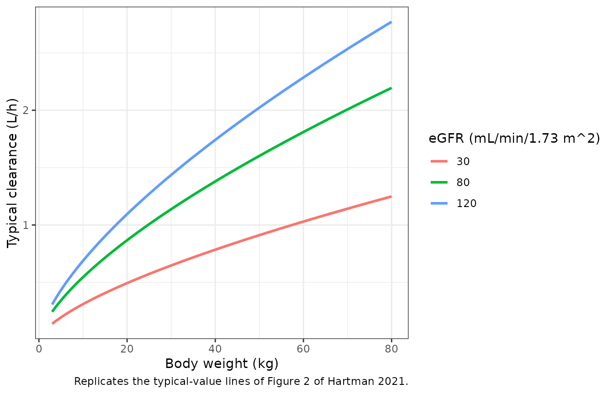
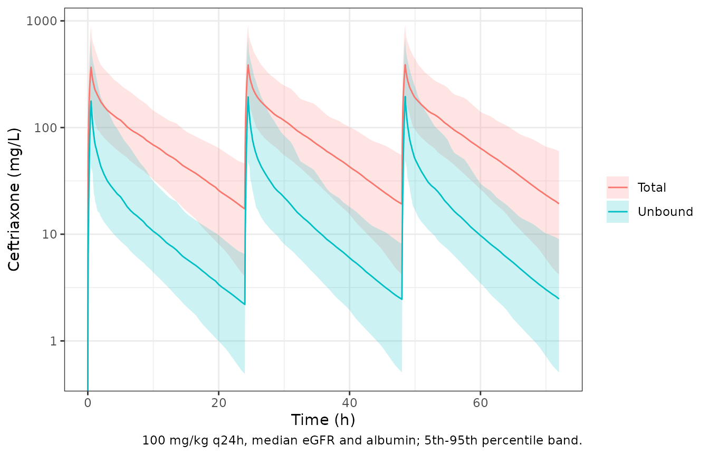
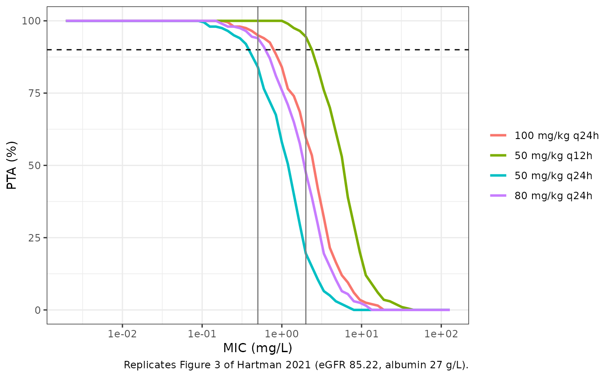

# Ceftriaxone (Hartman 2021)

## Model and source

- Citation: Hartman SJF, Upadhyay PJ, Hagedoorn NN, Mathot RAA, Moll HA,
  van der Flier M, Schreuder MF, Bruggemann RJ, Knibbe CAJ, de Wildt SN.
  Current Ceftriaxone Dose Recommendations are Adequate for Most
  Critically Ill Children: Results of a Population Pharmacokinetic
  Modeling and Simulation Study. Clin Pharmacokinet.
  2021;60(10):1361-1372. <doi:10.1007/s40262-021-01035-9>.
  PMID 34036552. Model structure and fixed constants from the Electronic
  Supplementary Material ‘Supplementary Model Code’ (NONMEM control
  stream, pages 16-19).
- Description: Two-compartment population PK model for intravenous
  ceftriaxone in critically ill children (0-18 years) in two Dutch
  paediatric intensive care units. Linear first-order elimination of
  TOTAL ceftriaxone, with clearance scaled by body weight and by the
  patient’s study-period median creatinine-based eGFR (bedside Schwartz)
  through estimated power exponents, and central volume scaled by body
  weight. The unbound concentration is derived from the total central
  concentration by saturable (single-site) protein binding, Cu = fu \*
  Cc with fu from the De Cock quadratic, whose maximum binding capacity
  scales linearly with serum albumin. Hartman 2021, n = 45 subjects, 205
  total and 43 time-matched unbound plasma samples.
- Article: <https://doi.org/10.1007/s40262-021-01035-9> (open access, CC
  BY-NC 4.0)
- Electronic Supplementary Material (methods, supplementary figures and
  the NONMEM control stream of the final model):
  <https://static-content.springer.com/esm/art%3A10.1007%2Fs40262-021-01035-9/MediaObjects/40262_2021_1035_MOESM1_ESM.pdf>

Hartman et al. pooled 45 critically ill children from two Dutch
paediatric intensive care units and fitted total and unbound ceftriaxone
concentrations jointly. Total ceftriaxone follows linear two-compartment
kinetics. The unbound concentration is derived from the total central
concentration with a saturable single-site binding function adopted from
De Cock et al. (2014), whose maximum binding capacity scales with serum
albumin. The paper then uses the model to compute the probability of
target attainment (PTA) of four dosing regimens.

## Population

Forty-five children aged 0.08-16.67 years (median 2.53) and weighing
3.8-75 kg (median 14 kg) were enrolled between 2017 and 2019: 26 from
the richly sampled POPSICLE study (Radboudumc, Nijmegen) and 19 from the
sparsely sampled PERFORM PK sub-study (Erasmus MC-Sophia, Rotterdam).
46.7% were female. The main reasons for admission were infection
(28.9%), respiratory failure (26.7%) and surgery (22.2%). Kidney
function varied widely: the study-period median creatinine-based eGFR
was below 30 mL/min/1.73 m^2 in 11.1% of patients and above 120 in
13.3%, and 35.6% had acute kidney injury. Baseline albumin was low
(median 27 g/L, range 14-45). Ceftriaxone was given as 100 mg/kg once
daily over 30 minutes. 205 total and 43 time-matched unbound
concentrations were analysed; the observed unbound fraction had a median
of 13.6% (range 7.6-70.3%). Source: Hartman 2021 Table 1 and Results.

The same information is available programmatically via
`readModelDb("Hartman_2021_ceftriaxone")()$population`.

## Source trace

The final-model control stream is printed in the Electronic
Supplementary Material (ESM, “Supplementary Model Code”, pages 16-19).
Every value below appears both in Table 2 and in the stream’s `$THETA` /
`$OMEGA` / `$SIGMA`, except `BMAXpop` (see *Assumptions and
deviations*).

| Equation / parameter | Value | Source location |
|----|----|----|
| `lcl` (CLpop) | log(0.708 L/h) | Table 2; stream `THETA(1)` |
| `lvc` (V1pop) | log(2.8 L) | Table 2; stream `THETA(2)` |
| `lq` (Qpop) | log(1.77 L/h) | Table 2; stream `THETA(3)` |
| `lvp` (V2pop) | log(2.9 L) | Table 2; stream `THETA(4)` |
| `e_wt_cl` | 0.67 | Table 2 Theta1; stream `THETA(5)` |
| `e_crcl_cl` | 0.575 | Table 2 Theta2; stream `THETA(7)` |
| `e_wt_vc` | 1.28 | Table 2 Theta3; stream `THETA(6)` |
| `lbmax_pb` (BMAXpop) | log(223 mg/L) | Table 2 (stream `THETA(9)` prints 228) |
| `lkd_pb` (Kd) | log(30.3 mg/L) | Table 2; stream `THETA(10)` |
| `e_alb_bmax_pb` | 1 (fixed) | Table 2 BMAX equation; stream `(1) FIX` |
| `etalcl`, `etalvc` block | 0.135, 0.178, 0.427 | Table 2 IIV rows; stream `$OMEGA BLOCK(2)` |
| `propSd`, `propSd_Cu` | sqrt(0.0596) = 0.2441 | Table 2 proportional error; stream `$SIGMA` |
| CL = CLpop (WT/14)^Theta1 (eGFR/85.22)^Theta2 | n/a | Table 2 equation; stream `$PK` (`EGFR_KREAT_popmedian = 85.21937`) |
| V1 = V1pop (WT/14)^Theta3 | n/a | Table 2 equation; stream `$PK` |
| BMAX = BMAXpop (ALB/27)^1 | n/a | Table 2 equation; stream `$PK` |
| fu = \[(C1 - BMAX - Kd) + sqrt((C1 - BMAX - Kd)^2 + 4 Kd C1)\] / (2 C1) | n/a | ESM Equation 1; stream `$DES` |
| `d/dt(central)`, `d/dt(peripheral1)` | n/a | stream `$DES` `DADT(1)`, `DADT(2)` |
| `d/dt(auc_free)` = Cu | n/a | stream `$DES` `DADT(3) = A(1)*FU/S1` |
| Cc, Cu = fu Cc, proportional error | n/a | stream `$ERROR` |

## Deterministic checks of the typical patient

The paper’s reference patient weighs 14 kg and has an eGFR of 85.22
mL/min/1.73 m^2 and albumin of 27 g/L, so every covariate term is 1 and
the typical clearance must equal CLpop. The Discussion also normalises
the typical values to body weight: total volume 0.407 L/kg and clearance
0.051 L/kg/h.

``` r

mod <- readModelDb("Hartman_2021_ceftriaxone")
mod_typ <- rxode2::zeroRe(mod)
#> ℹ parameter labels from comments will be replaced by 'label()'

# One 100 mg/kg dose (30-min infusion) to the reference patient, observed to 72 h.
make_events <- function(subjects, dose_mgkg, ii, n_doses, obs_times) {
  doses <- tidyr::expand_grid(subjects, time = (seq_len(n_doses) - 1) * ii) |>
    dplyr::mutate(
      evid = 1L, cmt = "central", amt = dose_mgkg * WT,
      rate = amt / 0.5, dvid = NA_integer_
    )
  obs <- tidyr::expand_grid(subjects, time = obs_times) |>
    dplyr::mutate(evid = 0L, cmt = "central", amt = 0, rate = 0, dvid = 1L)
  dplyr::bind_rows(doses, obs) |>
    dplyr::arrange(id, time, dplyr::desc(evid)) |>
    dplyr::relocate(id, time, evid, cmt, amt, rate, dvid)
}

ref_pt <- data.frame(id = 1L, WT = 14, CRCL = 85.22, ALB = 27)
ev_typ <- make_events(ref_pt, 100, 24, 1, c(0, 0.25, 0.5, 1, 2, 4, 8, 12, 24))
sim_typ <- as.data.frame(rxode2::rxSolve(mod_typ, ev_typ,
  rtol = 1e-10, atol = 1e-12
))
#> ℹ omega/sigma items treated as zero: 'etalcl', 'etalvc'

typ <- sim_typ[1, c("cl", "vc", "vp")]
knitr::kable(
  data.frame(
    Quantity = c("CL (L/h)", "V1 + V2 (L)", "CL per kg (L/kg/h)", "Vss per kg (L/kg)"),
    Model = signif(c(typ$cl, typ$vc + typ$vp, typ$cl / 14, (typ$vc + typ$vp) / 14), 4),
    Paper = c(0.708, 2.8 + 2.9, 0.051, 0.407)
  ),
  caption = "Typical-patient values against Table 2 and the Discussion."
)
```

| Quantity           |   Model | Paper |
|:-------------------|--------:|------:|
| CL (L/h)           | 0.70800 | 0.708 |
| V1 + V2 (L)        | 5.70000 | 5.700 |
| CL per kg (L/kg/h) | 0.05057 | 0.051 |
| Vss per kg (L/kg)  | 0.40710 | 0.407 |

Typical-patient values against Table 2 and the Discussion. {.table}

``` r


stopifnot(
  abs(typ$cl / 0.708 - 1) < 1e-8,
  abs(typ$cl / 14 - 0.051) < 0.0005, # Discussion rounds to 3 decimals
  abs((typ$vc + typ$vp) / 14 - 0.407) < 0.0005
)
```

The binding function is the positive root of the single-site mass
balance, so the model’s unbound concentration must satisfy Cc = Cu +
BMAX Cu / (Kd + Cu) at every time point. Both sides use the same
parameters, so the check is exact up to floating-point error.

``` r

bmax_typ <- 223
kd_typ <- 30.3
chk <- sim_typ[sim_typ$Cc > 0, ]
rebuilt <- chk$Cu + bmax_typ * chk$Cu / (kd_typ + chk$Cu)
stopifnot(max(abs(rebuilt / chk$Cc - 1)) < 1e-8)
```

At the 24-h trough of the reference patient the model’s unbound fraction
is 12.6%, close to the median observed unbound fraction of 13.6% in
samples that were deliberately taken near the end of the dosing interval
(Results, first paragraph). At the end of the infusion, with total
concentrations near 400 mg/L, binding is saturated and the unbound
fraction rises to 52.3%.

``` r

fu_trough <- sim_typ$fu[sim_typ$time == 24]
stopifnot(fu_trough > 0.10, fu_trough < 0.17)
```

## Figure 2: clearance against weight and eGFR

``` r

fig2 <- tidyr::expand_grid(WT = seq(3, 80, by = 0.5), CRCL = c(30, 80, 120)) |>
  dplyr::mutate(cl = 0.708 * (WT / 14)^0.67 * (CRCL / 85.22)^0.575)

ggplot(fig2, aes(WT, cl, colour = factor(CRCL))) +
  geom_line(linewidth = 1) +
  labs(
    x = "Body weight (kg)", y = "Typical clearance (L/h)",
    colour = "eGFR (mL/min/1.73 m^2)",
    caption = "Replicates the typical-value lines of Figure 2 of Hartman 2021."
  ) +
  theme_bw()
```



The paper reports individual clearances between 0.15 and 2.72 L/h. The
typical clearance for the lightest (3.8 kg) and heaviest (75 kg)
patients at the observed eGFR extremes (13.8 and 269.4 mL/min/1.73 m^2)
spans 0.1 to 4.2 L/h, which brackets that range, as it must: the
observed patients combine the two covariates less extremely.

## Virtual cohort

The paper’s simulations resample the original 45 patients, which are not
public. The virtual cohort below draws 200 children whose weight is
log-normal with the observed median (14 kg) and interquartile range
(8.3-32.2 kg), redrawn until it lies inside the observed range 3.8-75
kg. As in the paper’s Figure 3, eGFR and albumin are fixed at their
medians (85.22 mL/min/1.73 m^2 and 27 g/L).

The random effects are drawn with base R from the model’s own OMEGA
block and passed to the solver as data columns with `zeroRe()`. The
simulation therefore uses no rxode2 random numbers and gives the same
cohort on every machine. The paper computed PTA from
*individual-predicted* troughs (Methods 2.8), so no residual error is
added.

``` r

set.seed(20210526)
n_sub <- 200
omega <- rxode2::rxode2(mod)$omega
#> ℹ parameter labels from comments will be replaced by 'label()'
eta <- matrix(rnorm(2 * n_sub), n_sub, 2) %*% chol(omega)
colnames(eta) <- colnames(omega)

wt_sdlog <- (log(32.2) - log(8.3)) / (2 * qnorm(0.75))
wt <- numeric(0)
while (length(wt) < n_sub) {
  w <- exp(rnorm(n_sub, log(14), wt_sdlog))
  wt <- c(wt, w[w >= 3.8 & w <= 75])
}

cohort <- data.frame(
  id = seq_len(n_sub), WT = wt[seq_len(n_sub)], CRCL = 85.22, ALB = 27,
  etalcl = eta[, "etalcl"], etalvc = eta[, "etalvc"]
)
stopifnot(
  abs(median(cohort$WT) / 14 - 1) < 0.15,
  abs(cor(cohort$etalcl, cohort$etalvc) - 0.178 / sqrt(0.135 * 0.427)) < 0.1
)
summary(cohort$WT)
#>    Min. 1st Qu.  Median    Mean 3rd Qu.    Max. 
#>   3.927   9.340  15.280  20.937  29.004  70.483
```

## Concentration-time profiles

``` r

regimens <- data.frame(
  regimen = c("100 mg/kg q24h", "50 mg/kg q24h", "80 mg/kg q24h", "50 mg/kg q12h"),
  dose = c(100, 50, 80, 50),
  ii = c(24, 24, 24, 12)
)

solve_regimen <- function(i, subjects, obs_times) {
  r <- regimens[i, ]
  ev <- make_events(subjects, r$dose, r$ii, 72 / r$ii, obs_times)
  ev$id <- ev$id + (i - 1L) * 1000L
  ev$regimen <- r$regimen
  withCallingHandlers(
    as.data.frame(rxode2::rxSolve(mod_typ, ev, keep = c("regimen", "WT"))),
    warning = function(w) {
      if (grepl("omega", conditionMessage(w))) invokeRestart("muffleWarning")
    }
  )
}

# 0.5-h grid, refined to 0.05 h for 2 h after each dose: the unbound peak is
# sharp because binding saturates, and PKNCA's trapezoids need the detail.
prof_times <- sort(unique(c(
  seq(0, 72, by = 0.5),
  as.vector(outer(seq(0, 2, by = 0.05), c(0, 24, 48), "+"))
)))
sim_prof <- solve_regimen(1, cohort, prof_times)
#> ℹ omega/sigma items treated as zero: 'etalcl', 'etalvc'

sim_prof |>
  dplyr::select(time, Cc, Cu) |>
  tidyr::pivot_longer(c(Cc, Cu), names_to = "analyte", values_to = "conc") |>
  dplyr::group_by(time, analyte) |>
  dplyr::summarise(
    Q05 = quantile(conc, 0.05), Q50 = median(conc), Q95 = quantile(conc, 0.95),
    .groups = "drop"
  ) |>
  dplyr::mutate(analyte = ifelse(analyte == "Cc", "Total", "Unbound")) |>
  ggplot(aes(time, Q50, colour = analyte, fill = analyte)) +
  geom_ribbon(aes(ymin = Q05, ymax = Q95), alpha = 0.2, colour = NA) +
  geom_line() +
  scale_y_log10() +
  labs(
    x = "Time (h)", y = "Ceftriaxone (mg/L)", colour = NULL, fill = NULL,
    caption = "100 mg/kg q24h, median eGFR and albumin; 5th-95th percentile band."
  ) +
  theme_bw()
#> Warning in scale_y_log10(): log-10 transformation introduced infinite values.
#> log-10 transformation introduced infinite values.
#> log-10 transformation introduced infinite values.
#> log-10 transformation introduced infinite values.
```



## Figure 3: probability of target attainment

PTA is the percentage of children whose unbound trough concentration at
72 h exceeds the MIC (100% fT \> MIC). Figure 3 reports it at the
primary target of 0.5 mg/L and at 4 x MIC (2.0 mg/L) for four regimens.

``` r

troughs <- dplyr::bind_rows(lapply(seq_len(nrow(regimens)), function(i) {
  solve_regimen(i, cohort, 72)
}))
#> ℹ omega/sigma items treated as zero: 'etalcl', 'etalvc'
#> ℹ omega/sigma items treated as zero: 'etalcl', 'etalvc'
#> ℹ omega/sigma items treated as zero: 'etalcl', 'etalvc'
#> ℹ omega/sigma items treated as zero: 'etalcl', 'etalvc'
stopifnot(nrow(troughs) == 4 * n_sub, !anyNA(troughs$Cu))

mic_grid <- 2^seq(-9, 7, by = 0.25)
pta_curve <- tidyr::expand_grid(regimen = regimens$regimen, mic = mic_grid) |>
  dplyr::rowwise() |>
  dplyr::mutate(pta = 100 * mean(troughs$Cu[troughs$regimen == regimen] > mic)) |>
  dplyr::ungroup()

ggplot(pta_curve, aes(mic, pta, colour = regimen)) +
  geom_line(linewidth = 1) +
  geom_hline(yintercept = 90, linetype = "dashed") +
  geom_vline(xintercept = c(0.5, 2), colour = "grey50") +
  scale_x_log10() +
  labs(
    x = "MIC (mg/L)", y = "PTA (%)", colour = NULL,
    caption = "Replicates Figure 3 of Hartman 2021 (eGFR 85.22, albumin 27 g/L)."
  ) +
  theme_bw()
```



``` r

published_pta <- data.frame(
  regimen = rep(regimens$regimen, each = 2),
  mic = rep(c(0.5, 2), 4),
  paper = c(96.8, 60.8, 86.5, 29.9, 94.6, 51.3, 99.9, 93.4)
)
pta_cmp <- published_pta |>
  dplyr::rowwise() |>
  dplyr::mutate(model = 100 * mean(troughs$Cu[troughs$regimen == regimen] > mic)) |>
  dplyr::ungroup() |>
  dplyr::mutate(diff = model - paper)

pta_cmp |>
  dplyr::rename(
    "Regimen" = regimen, "MIC (mg/L)" = mic, "Paper PTA (%)" = paper,
    "Model PTA (%)" = model, "Difference (points)" = diff
  ) |>
  knitr::kable(digits = 1, caption = "PTA against the values quoted in the Results and Figure 3.")
```

| Regimen        | MIC (mg/L) | Paper PTA (%) | Model PTA (%) | Difference (points) |
|:---------------|-----------:|--------------:|--------------:|--------------------:|
| 100 mg/kg q24h |        0.5 |          96.8 |          95.0 |                -1.8 |
| 100 mg/kg q24h |        2.0 |          60.8 |          59.5 |                -1.3 |
| 50 mg/kg q24h  |        0.5 |          86.5 |          84.0 |                -2.5 |
| 50 mg/kg q24h  |        2.0 |          29.9 |          19.5 |               -10.4 |
| 80 mg/kg q24h  |        0.5 |          94.6 |          94.0 |                -0.6 |
| 80 mg/kg q24h  |        2.0 |          51.3 |          47.5 |                -3.8 |
| 50 mg/kg q12h  |        0.5 |          99.9 |         100.0 |                 0.1 |
| 50 mg/kg q12h  |        2.0 |          93.4 |          94.5 |                 1.1 |

PTA against the values quoted in the Results and Figure 3. {.table}

``` r


# The cohort is deterministic (base-R draws, no rxode2 RNG), so these bounds
# do not move between machines. Measured: median |diff| 1.6 points, max 10.4
# (50 mg/kg q24h at 2 mg/L, which sits on the steepest part of its PTA
# curve). A 20% error in CL moves every 2 mg/L row by 10-20 points, so the
# median bound still catches a structural error.
stopifnot(
  median(abs(pta_cmp$diff)) < 4,
  max(abs(pta_cmp$diff)) < 12
)
```

The model reproduces the paper’s ranking and magnitudes: once-daily 100
mg/kg reaches more than 90% PTA only at the 0.5 mg/L target, and 50
mg/kg twice daily is the only regimen above 90% at 2 mg/L. The largest
gap, about 10 points for 50 mg/kg once daily at 2 mg/L, sits on the
steep part of that regimen’s PTA curve, where the weight distribution of
the resampled trial patients (not available) matters most.

## ESM Figure 7: PTA by eGFR and weight group

The Results state that 100 mg/kg once daily and 50 mg/kg twice daily
both reach PTA above 90% for the 0.5 mg/L target in every weight group
when eGFR is 80 mL/min/1.73 m^2 or lower, and that children under 10 kg
with eGFR above 80 have the lowest PTA. The first claim is checked at
0.5 mg/L. The second is checked at 2 mg/L, because at 0.5 mg/L and eGFR
120 the three weight groups of a 200-child cohort differ by less than
their sampling noise. The chunk below repeats the simulation with eGFR
fixed at 30, 80 and 120 and the cohort split at the paper’s weight
cut-offs.

``` r

strata <- dplyr::bind_rows(lapply(c(30, 80, 120), function(egfr) {
  coh <- cohort
  coh$CRCL <- egfr
  dplyr::bind_rows(lapply(c(1, 4), function(i) solve_regimen(i, coh, 72))) |>
    dplyr::mutate(CRCL = egfr)
})) |>
  dplyr::mutate(wt_group = cut(WT, c(0, 10, 25, Inf), labels = c("< 10 kg", "10-25 kg", "> 25 kg")))
#> ℹ omega/sigma items treated as zero: 'etalcl', 'etalvc'
#> ℹ omega/sigma items treated as zero: 'etalcl', 'etalvc'
#> ℹ omega/sigma items treated as zero: 'etalcl', 'etalvc'
#> ℹ omega/sigma items treated as zero: 'etalcl', 'etalvc'
#> ℹ omega/sigma items treated as zero: 'etalcl', 'etalvc'
#> ℹ omega/sigma items treated as zero: 'etalcl', 'etalvc'

pta_strata <- strata |>
  dplyr::group_by(regimen, CRCL, wt_group) |>
  dplyr::summarise(n = dplyr::n(), pta_05 = 100 * mean(Cu > 0.5), pta_2 = 100 * mean(Cu > 2), .groups = "drop")

pta_strata |>
  dplyr::rename(
    "Regimen" = regimen, "eGFR" = CRCL, "Weight group" = wt_group,
    "PTA 0.5 mg/L (%)" = pta_05, "PTA 2 mg/L (%)" = pta_2
  ) |>
  knitr::kable(digits = 1)
```

| Regimen        | eGFR | Weight group |   n | PTA 0.5 mg/L (%) | PTA 2 mg/L (%) |
|:---------------|-----:|:-------------|----:|-----------------:|---------------:|
| 100 mg/kg q24h |   30 | \< 10 kg     |  57 |            100.0 |           94.7 |
| 100 mg/kg q24h |   30 | 10-25 kg     |  86 |            100.0 |           98.8 |
| 100 mg/kg q24h |   30 | \> 25 kg     |  57 |            100.0 |           98.2 |
| 100 mg/kg q24h |   80 | \< 10 kg     |  57 |             93.0 |           52.6 |
| 100 mg/kg q24h |   80 | 10-25 kg     |  86 |             97.7 |           61.6 |
| 100 mg/kg q24h |   80 | \> 25 kg     |  57 |             98.2 |           80.7 |
| 100 mg/kg q24h |  120 | \< 10 kg     |  57 |             84.2 |           15.8 |
| 100 mg/kg q24h |  120 | 10-25 kg     |  86 |             82.6 |           30.2 |
| 100 mg/kg q24h |  120 | \> 25 kg     |  57 |             89.5 |           49.1 |
| 50 mg/kg q12h  |   30 | \< 10 kg     |  57 |            100.0 |          100.0 |
| 50 mg/kg q12h  |   30 | 10-25 kg     |  86 |            100.0 |          100.0 |
| 50 mg/kg q12h  |   30 | \> 25 kg     |  57 |            100.0 |          100.0 |
| 50 mg/kg q12h  |   80 | \< 10 kg     |  57 |            100.0 |           91.2 |
| 50 mg/kg q12h  |   80 | 10-25 kg     |  86 |            100.0 |           97.7 |
| 50 mg/kg q12h  |   80 | \> 25 kg     |  57 |            100.0 |           98.2 |
| 50 mg/kg q12h  |  120 | \< 10 kg     |  57 |            100.0 |           63.2 |
| 50 mg/kg q12h  |  120 | 10-25 kg     |  86 |            100.0 |           80.2 |
| 50 mg/kg q12h  |  120 | \> 25 kg     |  57 |            100.0 |           94.7 |

``` r


# Measured: lowest 0.5 mg/L PTA at eGFR <= 80 is 93.0% (100 mg/kg q24h,
# < 10 kg). At eGFR 120 the three weight groups are within noise of each
# other at 0.5 mg/L (84-89%), so the "lowest PTA below 10 kg" claim is
# checked at 2 mg/L, where it is clear: 15.8 vs 30.2 vs 49.1% for
# 100 mg/kg q24h and 63.2 vs 80.2 vs 94.7% for 50 mg/kg q12h.
low_egfr <- pta_strata |> dplyr::filter(CRCL <= 80)
lowest_cell <- pta_strata |>
  dplyr::group_by(regimen) |>
  dplyr::slice_min(pta_2, n = 1, with_ties = FALSE) |>
  dplyr::ungroup()
stopifnot(
  all(low_egfr$pta_05 > 90),
  all(lowest_cell$wt_group == "< 10 kg"),
  all(lowest_cell$CRCL == 120)
)
```

## PKNCA validation

Hartman 2021 reports no NCA parameters, so the non-compartmental check
here is internal. Total-drug disposition is linear, so at steady state
the AUC over one dosing interval must equal dose / CL for every child.
The unbound AUC is also carried as the `auc_free` state (the control
stream’s `COMP(FREE)`), which must agree with PKNCA’s trapezoidal AUC of
`Cu`.

``` r

sim_nca <- sim_prof |>
  dplyr::filter(!is.na(Cc)) |>
  dplyr::select(id, time, Cc, Cu, regimen, cl, auc_free)

# Numerical path: tiny negative undershoots are integrator noise.
stopifnot(all(sim_nca$Cc >= -1e-6 * max(sim_nca$Cc)))

dose_df <- make_events(cohort, 100, 24, 3, numeric(0)) |>
  dplyr::filter(evid == 1) |>
  dplyr::mutate(regimen = "100 mg/kg q24h") |>
  dplyr::select(id, time, amt, regimen)

intervals <- data.frame(
  start = c(0, 48), end = c(24, 72),
  cmax = TRUE, tmax = TRUE, auclast = TRUE, cmin = TRUE
)

conc_tot <- PKNCA::PKNCAconc(sim_nca, Cc ~ time | regimen + id)
conc_unb <- PKNCA::PKNCAconc(sim_nca, Cu ~ time | regimen + id)
dose_obj <- PKNCA::PKNCAdose(dose_df, amt ~ time | regimen + id)

nca_tot <- as.data.frame(PKNCA::pk.nca(PKNCA::PKNCAdata(conc_tot, dose_obj, intervals = intervals)))
nca_unb <- as.data.frame(PKNCA::pk.nca(PKNCA::PKNCAdata(conc_unb, dose_obj, intervals = intervals)))

summarise_nca <- function(res, label) {
  res |>
    dplyr::filter(PPTESTCD %in% c("cmax", "auclast", "cmin")) |>
    dplyr::mutate(interval = ifelse(start == 0, "Day 1 (0-24 h)", "Day 3 (48-72 h)")) |>
    dplyr::group_by(interval, PPTESTCD) |>
    dplyr::summarise(median = median(PPORRES), p05 = quantile(PPORRES, 0.05), p95 = quantile(PPORRES, 0.95), .groups = "drop") |>
    dplyr::mutate(analyte = label)
}
dplyr::bind_rows(summarise_nca(nca_tot, "Total"), summarise_nca(nca_unb, "Unbound")) |>
  dplyr::rename("Analyte" = analyte, "Interval" = interval, "Parameter" = PPTESTCD, "Median" = median, "P5" = p05, "P95" = p95) |>
  dplyr::relocate(Analyte) |>
  knitr::kable(digits = 2, caption = "Simulated NCA, 100 mg/kg q24h (mg/L; AUC in mg*h/L).")
```

| Analyte | Interval        | Parameter |  Median |      P5 |     P95 |
|:--------|:----------------|:----------|--------:|--------:|--------:|
| Total   | Day 1 (0-24 h)  | auclast   | 1889.49 |  946.42 | 3879.44 |
| Total   | Day 1 (0-24 h)  | cmax      |  367.47 |  172.04 |  885.87 |
| Total   | Day 1 (0-24 h)  | cmin      |    0.00 |    0.00 |    0.00 |
| Total   | Day 3 (48-72 h) | auclast   | 2139.25 | 1026.93 | 4441.24 |
| Total   | Day 3 (48-72 h) | cmax      |  388.35 |  186.02 |  912.16 |
| Total   | Day 3 (48-72 h) | cmin      |   19.18 |    4.17 |   55.33 |
| Unbound | Day 1 (0-24 h)  | auclast   |  419.99 |  168.20 | 1530.89 |
| Unbound | Day 1 (0-24 h)  | cmax      |  177.06 |   42.22 |  672.48 |
| Unbound | Day 1 (0-24 h)  | cmin      |    0.00 |    0.00 |    0.00 |
| Unbound | Day 3 (48-72 h) | auclast   |  495.77 |  175.21 | 1616.31 |
| Unbound | Day 3 (48-72 h) | cmax      |  195.30 |   48.63 |  698.43 |
| Unbound | Day 3 (48-72 h) | cmin      |    2.46 |    0.51 |    8.13 |

Simulated NCA, 100 mg/kg q24h (mg/L; AUC in mg\*h/L). {.table}

``` r


# Steady-state AUC over one interval against dose / CL (individual CL).
ss_chk <- nca_tot |>
  dplyr::filter(PPTESTCD == "auclast", start == 48) |>
  dplyr::left_join(sim_nca |> dplyr::distinct(id, cl), by = "id") |>
  dplyr::left_join(cohort |> dplyr::select(id, WT), by = "id") |>
  dplyr::mutate(pct = 100 * (PPORRES * cl / (100 * WT) - 1))

# Unbound AUC from PKNCA against the auc_free state over 48-72 h.
auc_state <- sim_nca |>
  dplyr::filter(time %in% c(48, 72)) |>
  dplyr::group_by(id) |>
  dplyr::summarise(auc_state = diff(auc_free), .groups = "drop")
unb_chk <- nca_unb |>
  dplyr::filter(PPTESTCD == "auclast", start == 48) |>
  dplyr::left_join(auc_state, by = "id") |>
  dplyr::mutate(pct = 100 * (PPORRES / auc_state - 1))

# Measured: total median -0.06%, 90th percentile |pct| 0.58%, worst -5.3%
# (the slowest-clearing children are not yet at steady state by 48 h, so
# their 48-72 h AUC is still below dose / CL); unbound median 0.06%,
# 90th percentile 0.10% (trapezoid error only). A clearance or dose
# transcription error of 10% moves the total median by 10 points.
stopifnot(
  abs(median(ss_chk$pct)) < 0.5,
  quantile(abs(ss_chk$pct), 0.9) < 3,
  abs(median(unb_chk$pct)) < 0.5,
  quantile(abs(unb_chk$pct), 0.9) < 1
)
```

## Sensitivity to BMAXpop

The control stream prints BMAXpop = 228 mg/L where Table 2 reports 223
mg/L (see *Assumptions and deviations*). The Figure 3 PTA is repeated
with 228.

``` r

mod_typ_228 <- mod_typ |> rxode2::ini(lbmax_pb = log(228))
#> ℹ change initial estimate of `lbmax_pb` to `5.42934562895444`
troughs_228 <- dplyr::bind_rows(lapply(seq_len(nrow(regimens)), function(i) {
  r <- regimens[i, ]
  ev <- make_events(cohort, r$dose, r$ii, 72 / r$ii, 72)
  ev$id <- ev$id + (i - 1L) * 1000L
  ev$regimen <- r$regimen
  suppressWarnings(as.data.frame(rxode2::rxSolve(mod_typ_228, ev, keep = "regimen")))
}))
#> ℹ omega/sigma items treated as zero: 'etalcl', 'etalvc'
#> ℹ omega/sigma items treated as zero: 'etalcl', 'etalvc'
#> ℹ omega/sigma items treated as zero: 'etalcl', 'etalvc'
#> ℹ omega/sigma items treated as zero: 'etalcl', 'etalvc'
pta_228 <- published_pta |>
  dplyr::rowwise() |>
  dplyr::mutate(pta_228 = 100 * mean(troughs_228$Cu[troughs_228$regimen == regimen] > mic)) |>
  dplyr::ungroup()
max_shift <- max(abs(pta_228$pta_228 - pta_cmp$model))
max_shift
#> [1] 2.5
stopifnot(max_shift < 3)
```

## Assumptions and deviations

- **BMAXpop.** Table 2 reports the final estimate of the maximum binding
  capacity as 223 mg/L; the `$THETA` block of the control stream printed
  in the ESM carries 228 mg/L. Every other stream value matches Table 2
  exactly, and the table is the reported final estimate, so the model
  uses 223 mg/L. The choice barely matters: with 228 mg/L the Figure 3
  PTA values shift by at most 2.5 percentage points (section
  *Sensitivity to BMAXpop* above).
- **Weight exponent on V1.** The Results text rounds it to 1.29; Table 2
  and the control stream both give 1.28, which is used.
- **Shared residual error.** The source applies one proportional epsilon
  (`ERR(1)`, variance 0.0596) to both total and unbound observations.
  rxode2 does not allow one parameter to serve two endpoints, so it is
  written twice (`propSd` for `Cc`, `propSd_Cu` for `Cu`) with the same
  value. Simulation is unaffected, because epsilon is drawn per
  observation in both programs; a re-estimation would treat the two as
  separate parameters.
- **Omitted zero variances.** The stream declares IIV on V2, Q and Kd
  fixed to
  0.  They contribute nothing and are not carried. The ESM text says IIV
      on BMAX was removed at backward elimination; the stream’s
      remaining eta sits on Kd and is fixed to 0 either way.
- **eGFR covariate.** Clearance uses each patient’s *median*
  creatinine-based eGFR over the study period (stream column
  `EGFR_KREAT_patmedian`), not the time-varying value, so `CRCL` should
  be supplied as one value per child. The stream’s eGFR is Schwartz
  2012, 42.3 x (height / SCr in mg/dL)^0.79. The authors advise caution
  above 120 mL/min/1.73 m^2 in children over 25 kg.
- **Missing albumin.** The source coded a missing albumin as 0 and reset
  its effect to 1 (`IF (ALBUMIN.EQ.0) COV_ALB_FU = 1`). That data-coding
  branch is not reproduced; supply 27 g/L for a child without an albumin
  value to get the same behaviour.
- **Unbound AUC state.** The stream’s third compartment accumulates the
  unbound concentration. It is kept as `auc_free` and feeds nothing
  else.
- **Virtual cohort.** The paper resampled its own 45 patients; this
  vignette uses a log-normal weight distribution matched to the reported
  median and IQR. No maximum-dose cap (2 g prophylactic, 4 g therapeutic
  per day) is applied, because the Methods do not say one was applied in
  the simulations.
- No erratum or correction notice for Hartman 2021 was found in PubMed
  or Crossref as of 2026-09-29.
