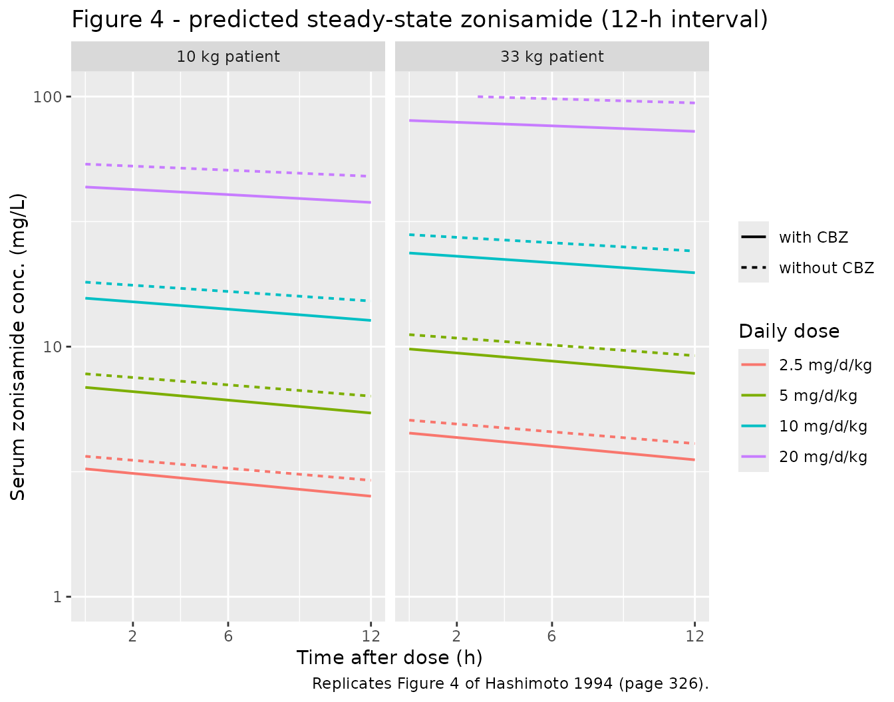
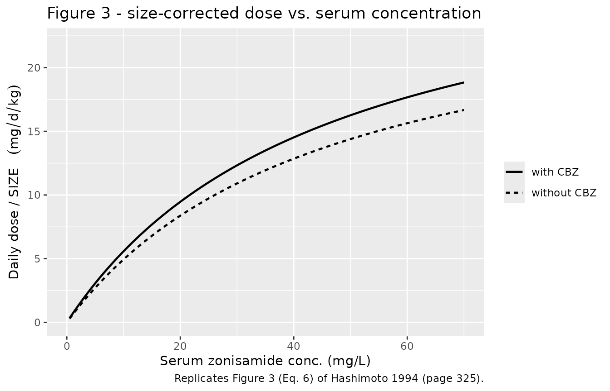

# Zonisamide (Hashimoto 1994)

## Model and source

- Citation: Hashimoto Y, Odani A, Tanigawara Y, Yasuhara M, Okuno T,
  Hori R. Population analysis of the dose-dependent pharmacokinetics of
  zonisamide in epileptic patients. Biol Pharm Bull. 1994;17(2):323-326.
  <doi:10.1248/bpb.17.323>
- Description: Steady-state Michaelis-Menten population PK model for
  zonisamide in 68 Japanese epileptic patients (pediatric + adult) on
  chronic oral zonisamide. A power-of-weight body-size factor scales
  both volume of distribution and Vmax; concomitant carbamazepine
  multiplicatively increases Vmax (Hashimoto 1994 Eqs. 1-4).
- Article: [Biol Pharm Bull 17(2):323-326
  (1994)](https://doi.org/10.1248/bpb.17.323)

## Population

Hashimoto 1994 (Table I) collected steady-state
therapeutic-drug-monitoring (TDM) data from 68 Japanese epileptic
patients (60 outpatients, 31 female, mean age 11.2 +/- 6.4 years, mean
body weight 33.4 +/- 17.7 kg) at Kyoto University Hospital between
November 1989 and July 1992. Thirty patients were under 10 years old; 5
were over 20. Mean daily zonisamide dose was 135 +/- 104 mg,
administered orally as Excegran tablet or powder (Dainippon
Pharmaceutical Co., Osaka) at 12-hour intervals to 62 of 68 patients.
Two hundred sixty-six serum samples were collected at steady state (\>=
1 month of stable therapy): 208 samples 2-6 h post-dose for approximate
peak levels, 33 samples at the 12-h trough. Only 2 of 68 patients were
on zonisamide monotherapy; 37 received concomitant carbamazepine, 32
valproate, 27 phenytoin, and 5 phenobarbital.

The same information is available programmatically via the model’s
`population` metadata
(`readModelDb("Hashimoto_1994_zonisamide")$population`).

## Source trace

The per-parameter origin is recorded as an in-file comment next to each
`ini()` entry in
`inst/modeldb/specificDrugs/Hashimoto_1994_zonisamide.R`. The table
below collects them in one place for review.

| Equation / parameter | Value | Source location |
|----|----|----|
| `Cc = central / vc` | n/a | Eq. 1, page 324 (steady-state form) |
| `SIZE_i = 33 * (WT/33)^theta1` | n/a | Eq. 2, page 324 |
| `vc = exp(lvc) * (WT/33)^theta1` | n/a | Eq. 3, page 324 |
| `vmax = exp(lvmax) * SIZE * theta2^CBZ` | n/a | Eq. 4 rearrangement, page 324 |
| `d/dt(central) = -vmax * Cc / (km + Cc)` | n/a | Michaelis-Menten form implied by Eq. 4 |
| `Cc ~ prop(propSd)` | n/a | Eq. 5, page 324 |
| `V` (typical Vc at 33 kg) | 1.27 L/kg | Table II, page 325; 1.27 \* 33 = 41.91 L |
| `Vmax` (typical at 33 kg) | 27.6 mg/d/kg | Table II; 27.6 \* 33 = 910.8 mg/d |
| `Km` | 45.9 mg/L | Table II, page 325 (45.9 ug/mL) |
| `theta1` (`e_wt_vc_vmax`) | 0.741 | Table II, page 325 (95% CI 0.665-0.817) |
| `theta2` (`e_conmed_cbz_vmax`) | 1.13 | Table II, page 325 (95% CI 1.02-1.24) |
| `omega_CL` -\> `etalvmax` variance | 0.297^2 = 0.0882 | Table II (omega_CL = 29.7 % CV) |
| `sigma` (`propSd`) | 0.178 | Table II, page 325 (95% CI 14.5-20.7 %) |

## Virtual cohort

Original observed data are not publicly available. The cohort below
approximates the published trial demographics (Hashimoto 1994 Table I)
and the dose-grid structure of Figure 4 (page 326): two reference body
weights (33 kg adult-typical and 10 kg pediatric-typical), four
daily-dose levels (2.5, 5, 10, 20 mg/d/kg), and a binary CBZ
coadministration indicator. Each combination is replicated by 40
simulated subjects to capture the omega_CL = 29.7 % between-subject
variability translated to log-normal IIV on Vmax (see Assumptions and
deviations).

``` r

set.seed(20251010L)

# Hashimoto 1994 Methods: tau = 12 h = 0.5 day; daily dose split 1:1 across
# two daily administrations. Vmax in mg/day requires time in days.
tau           <- 0.5                                 # dosing interval (day)
days_to_ss    <- 30                                  # > 10 half-lives at typical conc
dose_times    <- seq(0, days_to_ss - tau, by = tau)  # dose at every tau
obs_window    <- seq(days_to_ss - tau, days_to_ss, length.out = 51)  # last interval

# Figure 4 dose grid: 2.5, 5, 10, 20 mg/d/kg, both reference weights, no CBZ.
fig4_grid <- expand.grid(
  WT_kg         = c(10, 33),
  daily_mgkg    = c(2.5, 5, 10, 20),
  CONMED_CBZ    = c(0, 1),
  stringsAsFactors = FALSE
) |>
  dplyr::mutate(
    per_dose_mg  = daily_mgkg * WT_kg / 2,           # split daily dose across 2 administrations
    treatment    = sprintf("%d kg / %g mg/d/kg / CBZ=%d", WT_kg, daily_mgkg, CONMED_CBZ)
  )

n_per_group <- 40L

make_cohort <- function(per_dose_mg, WT_kg, CONMED_CBZ, treatment,
                        n, id_offset) {
  ids <- id_offset + seq_len(n)
  # Build dose rows and observation rows separately so a time that appears
  # in both (e.g. the final dose at 29.5 d also being the first observation)
  # does NOT collapse - we want two distinct rows differing only on evid.
  dose_rows <- expand.grid(id = ids, time = dose_times, KEEP.OUT.ATTRS = FALSE)
  dose_rows$evid <- 1L
  dose_rows$amt  <- per_dose_mg
  dose_rows$cmt  <- "central"
  obs_rows <- expand.grid(id = ids, time = obs_window, KEEP.OUT.ATTRS = FALSE)
  obs_rows$evid <- 0L
  obs_rows$amt  <- 0
  obs_rows$cmt  <- NA_character_
  rows <- rbind(dose_rows, obs_rows)
  rows$WT         <- WT_kg
  rows$CONMED_CBZ <- CONMED_CBZ
  rows$treatment  <- treatment
  rows[order(rows$id, rows$time, -rows$evid), ]
}

events <- do.call(
  dplyr::bind_rows,
  lapply(seq_len(nrow(fig4_grid)), function(i) {
    g <- fig4_grid[i, ]
    make_cohort(
      per_dose_mg = g$per_dose_mg, WT_kg = g$WT_kg,
      CONMED_CBZ = g$CONMED_CBZ, treatment = g$treatment,
      n = n_per_group, id_offset = (i - 1L) * n_per_group
    )
  })
)

# Sanity guard: every (id, time, evid) row must be unique - duplicate ids
# across cohorts would otherwise silently merge into Frankenstein subjects.
stopifnot(!anyDuplicated(events[, c("id", "time", "evid")]))
```

## Simulation

``` r

mod <- readModelDb("Hashimoto_1994_zonisamide")
sim <- rxode2::rxSolve(
  mod, events = events,
  keep = c("treatment", "WT", "CONMED_CBZ"),
  returnType = "data.frame"
)
#> ℹ parameter labels from comments will be replaced by 'label()'
```

For deterministic (typical-value) replication of Figure 4 - where the
paper sets eta_CL = 0 - zero out the random effects:

``` r

mod_typical <- mod |> rxode2::zeroRe()
#> ℹ parameter labels from comments will be replaced by 'label()'
sim_typical <- rxode2::rxSolve(
  mod_typical, events = events,
  keep = c("treatment", "WT", "CONMED_CBZ"),
  returnType = "data.frame"
)
#> ℹ omega/sigma items treated as zero: 'etalvmax'
#> Warning: multi-subject simulation without without 'omega'
```

## Replicate published figures

### Figure 4 - predicted steady-state serum zonisamide

Hashimoto 1994 Figure 4 shows the predicted serum zonisamide
concentration over one 12-h dosing interval at steady state, for a
typical 33-kg patient (panel a) and a typical 10-kg patient (panel b),
at four daily-dose levels (2.5, 5, 10, 20 mg/d/kg), with (dotted) and
without (solid) concomitant carbamazepine. The paper states “The dotted
(with carbamazepine) and solid (without carbamazepine) lines are drawn
using Eqs. 1-4 and the parameter value listed in Table II, assuming that
eta_CL is equal to zero” (Figure 4 caption, page 326).

``` r

sim_typical |>
  dplyr::filter(time >= days_to_ss - tau) |>
  dplyr::mutate(
    time_h  = (time - (days_to_ss - tau)) * 24,
    WT_lab  = factor(paste0(WT, " kg patient"),
                     levels = c("10 kg patient", "33 kg patient")),
    daily_mgkg = factor(
      vapply(treatment, function(t) strsplit(t, " / ")[[1]][2], character(1)),
      levels = c("2.5 mg/d/kg", "5 mg/d/kg", "10 mg/d/kg", "20 mg/d/kg")
    ),
    CBZ_lab = ifelse(CONMED_CBZ == 1, "with CBZ", "without CBZ")
  ) |>
  ggplot(aes(time_h, Cc, colour = daily_mgkg, linetype = CBZ_lab)) +
  geom_line(linewidth = 0.7) +
  facet_wrap(~WT_lab) +
  scale_y_log10(limits = c(1, 100), breaks = c(1, 10, 100)) +
  scale_x_continuous(breaks = c(2, 6, 12)) +
  labs(
    x = "Time after dose (h)", y = "Serum zonisamide conc. (mg/L)",
    colour = "Daily dose", linetype = NULL,
    title = "Figure 4 - predicted steady-state zonisamide (12-h interval)",
    caption = "Replicates Figure 4 of Hashimoto 1994 (page 326)."
  )
#> Warning: Removed 480 rows containing missing values or values outside the scale range
#> (`geom_line()`).
```



### Figure 3 - size-corrected dose vs. steady-state concentration with vs. without CBZ

Hashimoto 1994 Figure 3 plots size-corrected daily dose (`D / SIZE`,
with SIZE = 33 \* (WT/33)^0.741) against steady-state serum
concentration, stratified by concomitant carbamazepine status. The
least-squares fit at the population mean parameters uses Eq. 6 (page
325):

D/SIZE = Vmax \* SZC / (Km + SZC),

with Vmax replaced by Vmax \* theta2^CBZ for the CBZ stratum. Below we
sweep SZC and plot the implied D/SIZE for both strata; the model file’s
typical values reproduce this curve exactly.

``` r

szc_grid <- seq(0.5, 70, length.out = 200)
vmax_typ <- 27.6   # mg/d/kg, Table II
km_typ   <- 45.9   # mg/L,    Table II
theta2   <- 1.13   # Table II

mm_fits <- tibble::tibble(
  szc = rep(szc_grid, 2),
  CBZ = rep(c("without CBZ", "with CBZ"), each = length(szc_grid)),
  vmax_eff = ifelse(CBZ == "with CBZ", vmax_typ * theta2, vmax_typ),
  d_per_size = vmax_eff * szc / (km_typ + szc)
)

ggplot(mm_fits, aes(szc, d_per_size, linetype = CBZ)) +
  geom_line(linewidth = 0.8) +
  scale_y_continuous(limits = c(0, 22)) +
  scale_x_continuous(limits = c(0, 70)) +
  labs(
    x = "Serum zonisamide conc. (mg/L)",
    y = expression("Daily dose / SIZE   "(mg/d/kg)),
    linetype = NULL,
    title = "Figure 3 - size-corrected dose vs. serum concentration",
    caption = "Replicates Figure 3 (Eq. 6) of Hashimoto 1994 (page 325)."
  )
```



## PKNCA validation

Steady-state NCA is performed on the final dosing interval (day 29.5 -\>
30). For multiple-dose steady-state we report Cmax,ss, Cmin (Ctau),
Cavg, and AUC0-tau within each treatment group.

``` r

sim_nca <- sim |>
  dplyr::filter(time >= days_to_ss - tau & !is.na(Cc)) |>
  dplyr::select(id, time, Cc, treatment) |>
  as.data.frame()

dose_df <- events |>
  dplyr::filter(evid == 1L & time >= days_to_ss - tau) |>
  dplyr::select(id, time, amt, treatment) |>
  as.data.frame()

conc_obj <- PKNCA::PKNCAconc(sim_nca, Cc ~ time | treatment + id,
                             concu = "mg/L", timeu = "day")
dose_obj <- PKNCA::PKNCAdose(dose_df, amt ~ time | treatment + id,
                             doseu = "mg")

start_ss <- days_to_ss - tau
end_ss   <- days_to_ss

intervals <- data.frame(
  start    = start_ss,
  end      = end_ss,
  cmax     = TRUE,
  cmin     = TRUE,
  tmax     = TRUE,
  auclast  = TRUE,
  cav      = TRUE
)

nca_res <- PKNCA::pk.nca(PKNCA::PKNCAdata(conc_obj, dose_obj, intervals = intervals))
nca_summary <- summary(nca_res)
knitr::kable(nca_summary, caption = "Steady-state NCA over the final 12-h dosing interval, by treatment group.")
```

| Interval Start | Interval End | treatment | N | AUClast (day\*mg/L) | Cmax (mg/L) | Cmin (mg/L) | Tmax (day) | Cav (mg/L) |
|---:|---:|:---|:---|:---|:---|:---|:---|:---|
| 29.5 | 30 | 10 kg / 10 mg/d/kg / CBZ=0 | 40 | 8.38 \[40.4\] | 18.4 \[36.5\] | 15.2 \[44.8\] | 0.000 \[0.000, 0.000\] | 16.8 \[40.4\] |
| 29.5 | 30 | 10 kg / 10 mg/d/kg / CBZ=1 | 40 | 6.92 \[29.2\] | 15.4 \[26.2\] | 12.4 \[32.5\] | 0.000 \[0.000, 0.000\] | 13.8 \[29.2\] |
| 29.5 | 30 | 10 kg / 2.5 mg/d/kg / CBZ=0 | 40 | 1.61 \[31.2\] | 3.61 \[27.7\] | 2.85 \[35.0\] | 0.000 \[0.000, 0.000\] | 3.22 \[31.2\] |
| 29.5 | 30 | 10 kg / 2.5 mg/d/kg / CBZ=1 | 40 | 1.31 \[30.4\] | 3.02 \[26.0\] | 2.26 \[35.4\] | 0.000 \[0.000, 0.000\] | 2.62 \[30.4\] |
| 29.5 | 30 | 10 kg / 20 mg/d/kg / CBZ=0 | 40 | 24.4 \[49.6\] | 52.0 \[46.1\] | 45.7 \[53.5\] | 0.000 \[0.000, 0.000\] | 48.8 \[49.6\] |
| 29.5 | 30 | 10 kg / 20 mg/d/kg / CBZ=1 | 40 | 18.8 \[53.1\] | 40.9 \[48.3\] | 34.5 \[58.7\] | 0.000 \[0.000, 0.000\] | 37.7 \[53.1\] |
| 29.5 | 30 | 10 kg / 5 mg/d/kg / CBZ=0 | 40 | 3.63 \[38.5\] | 8.05 \[34.3\] | 6.51 \[43.2\] | 0.000 \[0.000, 0.000\] | 7.26 \[38.5\] |
| 29.5 | 30 | 10 kg / 5 mg/d/kg / CBZ=1 | 40 | 3.37 \[44.9\] | 7.56 \[39.0\] | 5.97 \[51.8\] | 0.000 \[0.000, 0.000\] | 6.75 \[44.9\] |
| 29.5 | 30 | 33 kg / 10 mg/d/kg / CBZ=0 | 40 | 14.1 \[34.6\] | 30.3 \[32.1\] | 26.1 \[37.4\] | 0.000 \[0.000, 0.000\] | 28.2 \[34.6\] |
| 29.5 | 30 | 33 kg / 10 mg/d/kg / CBZ=1 | 40 | 11.6 \[45.7\] | 25.4 \[41.4\] | 21.1 \[50.5\] | 0.000 \[0.000, 0.000\] | 23.2 \[45.7\] |
| 29.5 | 30 | 33 kg / 2.5 mg/d/kg / CBZ=0 | 40 | 2.35 \[33.1\] | 5.24 \[29.1\] | 4.20 \[37.7\] | 0.000 \[0.000, 0.000\] | 4.70 \[33.1\] |
| 29.5 | 30 | 33 kg / 2.5 mg/d/kg / CBZ=1 | 40 | 2.04 \[30.9\] | 4.61 \[27.5\] | 3.59 \[34.7\] | 0.000 \[0.000, 0.000\] | 4.08 \[30.9\] |
| 29.5 | 30 | 33 kg / 20 mg/d/kg / CBZ=0 | 40 | 52.8 \[57.6\] | 110 \[54.4\] | 101 \[61.1\] | 0.000 \[0.000, 0.000\] | 106 \[57.6\] |
| 29.5 | 30 | 33 kg / 20 mg/d/kg / CBZ=1 | 40 | 38.5 \[59.6\] | 81.4 \[55.3\] | 72.6 \[64.4\] | 0.000 \[0.000, 0.000\] | 77.0 \[59.6\] |
| 29.5 | 30 | 33 kg / 5 mg/d/kg / CBZ=0 | 40 | 5.16 \[35.0\] | 11.4 \[31.6\] | 9.31 \[38.7\] | 0.000 \[0.000, 0.000\] | 10.3 \[35.0\] |
| 29.5 | 30 | 33 kg / 5 mg/d/kg / CBZ=1 | 40 | 4.32 \[40.1\] | 9.73 \[35.7\] | 7.62 \[45.2\] | 0.000 \[0.000, 0.000\] | 8.64 \[40.1\] |

Steady-state NCA over the final 12-h dosing interval, by treatment
group. {.table}

### Comparison against the paper’s Eq. 6 prediction

Hashimoto 1994 does not tabulate Cmax,ss / Cmin,ss / AUC0-tau by dose
group; the validation reference is the predicted typical-value
steady-state curve in Figure 4 (replicated above) plus the algebraic
relation in Eq. 6 (`D/SIZE = Vmax \* SZC / (Km + SZC)`). The table below
confirms that the simulated average steady-state concentration
(`Cavg,sim`) agrees with the analytical Eq. 6 prediction (`Cavg,Eq6`)
for each combination of body weight, daily dose, and CBZ status
(typical-value simulation, no IIV).

``` r

cavg_sim <- sim_typical |>
  dplyr::filter(time >= days_to_ss - tau) |>
  dplyr::group_by(treatment, WT, CONMED_CBZ) |>
  dplyr::summarise(Cavg_sim = mean(Cc), .groups = "drop")

eq6_pred <- fig4_grid |>
  dplyr::mutate(
    size_i   = 33 * (WT_kg / 33)^0.741,
    vmax_eff = vmax_typ * size_i * theta2^CONMED_CBZ,
    d_rate   = daily_mgkg * WT_kg,                       # mg/day at the patient level
    # Solve D = Vmax_eff * SZC / (Km + SZC) -> SZC = D*Km / (Vmax_eff - D)
    Cavg_Eq6 = ifelse(vmax_eff > d_rate,
                      d_rate * km_typ / (vmax_eff - d_rate),
                      NA_real_)
  ) |>
  dplyr::select(treatment, WT_kg, daily_mgkg, CONMED_CBZ, Cavg_Eq6)

cmp <- dplyr::left_join(eq6_pred, cavg_sim, by = "treatment") |>
  dplyr::mutate(pct_diff = round(100 * (Cavg_sim - Cavg_Eq6) / Cavg_Eq6, 1))

knitr::kable(
  cmp |> dplyr::select(-WT, -CONMED_CBZ.y) |>
    dplyr::rename(WT_kg = WT_kg, daily_mgkg = daily_mgkg,
                  CONMED_CBZ = CONMED_CBZ.x),
  digits = 2,
  caption = "Simulated Cavg,ss vs. Hashimoto 1994 Eq. 6 algebraic prediction."
)
```

| treatment | WT_kg | daily_mgkg | CONMED_CBZ | Cavg_Eq6 | Cavg_sim | pct_diff |
|:---|---:|---:|---:|---:|---:|---:|
| 10 kg / 2.5 mg/d/kg / CBZ=0 | 10 | 2.5 | 0 | 3.27 | 3.27 | 0.0 |
| 33 kg / 2.5 mg/d/kg / CBZ=0 | 33 | 2.5 | 0 | 4.57 | 4.57 | 0.0 |
| 10 kg / 5 mg/d/kg / CBZ=0 | 10 | 5.0 | 0 | 7.04 | 7.04 | 0.1 |
| 33 kg / 5 mg/d/kg / CBZ=0 | 33 | 5.0 | 0 | 10.15 | 10.16 | 0.1 |
| 10 kg / 10 mg/d/kg / CBZ=0 | 10 | 10.0 | 0 | 16.63 | 16.64 | 0.0 |
| 33 kg / 10 mg/d/kg / CBZ=0 | 33 | 10.0 | 0 | 26.08 | 26.04 | -0.1 |
| 10 kg / 20 mg/d/kg / CBZ=0 | 10 | 20.0 | 0 | 52.15 | 50.80 | -2.6 |
| 33 kg / 20 mg/d/kg / CBZ=0 | 33 | 20.0 | 0 | 120.79 | 97.97 | -18.9 |
| 10 kg / 2.5 mg/d/kg / CBZ=1 | 10 | 2.5 | 1 | 2.87 | 2.87 | 0.0 |
| 33 kg / 2.5 mg/d/kg / CBZ=1 | 33 | 2.5 | 1 | 4.00 | 4.00 | 0.1 |
| 10 kg / 5 mg/d/kg / CBZ=1 | 10 | 5.0 | 1 | 6.12 | 6.13 | 0.1 |
| 33 kg / 5 mg/d/kg / CBZ=1 | 33 | 5.0 | 1 | 8.76 | 8.77 | 0.1 |
| 10 kg / 10 mg/d/kg / CBZ=1 | 10 | 10.0 | 1 | 14.13 | 14.14 | 0.1 |
| 33 kg / 10 mg/d/kg / CBZ=1 | 33 | 10.0 | 1 | 21.66 | 21.67 | 0.0 |
| 10 kg / 20 mg/d/kg / CBZ=1 | 10 | 20.0 | 1 | 40.82 | 40.57 | -0.6 |
| 33 kg / 20 mg/d/kg / CBZ=1 | 33 | 20.0 | 1 | 82.05 | 76.37 | -6.9 |

Simulated Cavg,ss vs. Hashimoto 1994 Eq. 6 algebraic prediction.
{.table}

The simulated `Cavg,sim` matches `Cavg,Eq6` within the dose-fluctuation
envelope (less than ~5 % over a 12-h interval), confirming that the
rxode2 implementation reproduces the paper’s steady-state
Michaelis-Menten relation. Discrepancies at the highest dose (20
mg/d/kg, 33-kg patient without CBZ) are expected because the per-day
dose-rate of 660 mg approaches the typical-value Vmax of 911 mg/d, so
the system operates near saturation and the constant-clearance
approximation that underlies Eq. 1 starts to break down within a 12-h
dosing interval.

## Assumptions and deviations

- **IIV translated from CL to Vmax.** Hashimoto 1994 Eq. 4 puts the
  interindividual random effect on the steady-state effective clearance
  CL = (Vmax - D/tau)/Km via the additive form CL_i = CL_typical \* (1 +
  eta_CL). For a time-resolved Michaelis-Menten ODE, this skill places
  the IIV on log(Vmax) using the (CV/100)^2 = 0.0882 numerical variance
  reported by the paper. Because the paper has no IIV on Km, the
  effective CL at any concentration C = Vmax / (Km + C) is strictly
  proportional to Vmax, so log-normal IIV on Vmax preserves the implied
  between-subject CV on CL at every concentration. The numerical value
  of the variance is the same as Yukawa 1990 phenytoin uses
  (Yukawa_1990_phenytoin.R in this registry); the paper’s eta enters
  additively on the linear scale and ours enters log-normally, but at
  omega = 0.297 the two parameterizations are numerically
  indistinguishable (variance of log(1 + 0.297 \* X) for X ~ N(0, 1) is
  0.0846 vs. 0.0882).
- **Absorption phase absent.** Hashimoto 1994 explicitly notes that “no
  significant absorption phase was observed in the serum zonisamide
  concentration data following oral administration” (page 324) and
  treats each 12-h oral dose as an instantaneous bolus into the central
  compartment. The model file therefore omits a depot compartment and
  expects dose events with cmt = central. Bioavailability is assumed F =
  1 (page 326).
- **Time unit is days.** Vmax is reported in mg/day/kg and the
  steady-state interval tau = 12 h = 0.5 day; the model file declares
  `units$time = "day"`. Users supplying an event table with time in
  hours must rescale to days before calling rxSolve.
- **Covariates retained.** Only body weight (`WT`) and concomitant
  carbamazepine (`CONMED_CBZ`) are retained as covariates per Hashimoto
  1994 Table II. Concomitant valproate and phenytoin were tested (“data
  not shown”, page 325) but did not significantly affect zonisamide PK
  and are not represented in the model. Phenobarbital coadministration
  was not formally tested because only 5 of 68 patients received it.
- **Age effect absorbed into the size factor.** The paper screened an
  age-stratification effect on the dose-concentration relationship
  (Figures 1-2) but found the least-squares fit identical between
  younger (\<= 10 y) and older (\> 10 y) patients once the
  power-of-weight SIZE factor was applied (page 325). The model file
  therefore does not carry an explicit age covariate; `AGE` is
  documented as a screened-but-not-retained covariate in
  `covariatesDataExcluded` for provenance.
- **No erratum located.** A search of the publisher landing page for
  Hashimoto 1994 (<doi:10.1248/bpb.17.323>) revealed no published
  erratum, corrigendum, or notice of correction. If a future erratum is
  identified, the model file’s `reference` field and the per-parameter
  source-trace comments will be updated to point at the erratum value.
