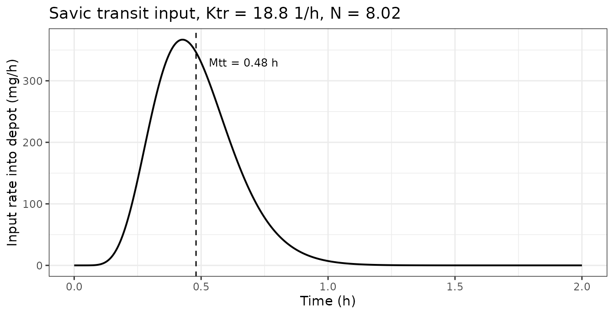
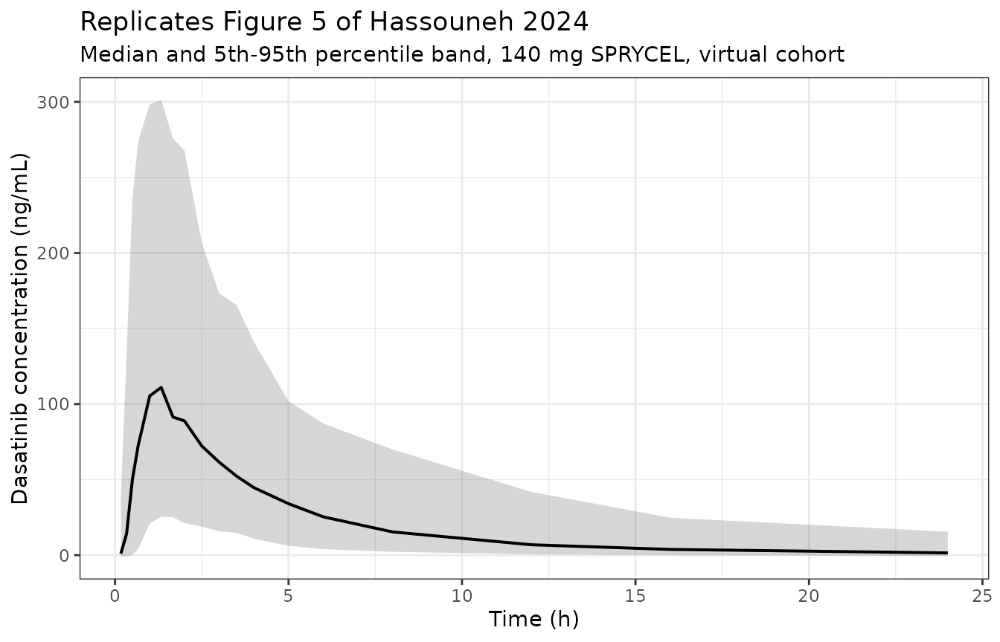
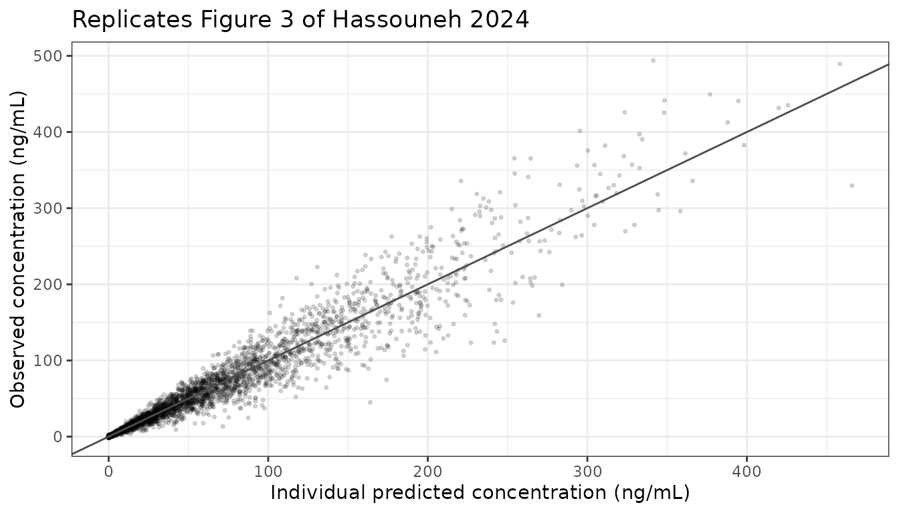

# Dasatinib (Hassouneh 2024)

## Model and source

``` r

mod <- rxode2::rxode2(readModelDb("Hassouneh_2024_dasatinib"))
#> ℹ parameter labels from comments will be replaced by 'label()'
#> Warning: some etas defaulted to non-mu referenced, possible parsing error: etaiov_ktr_1, etaiov_ktr_2, etaiov_mtt_1, etaiov_mtt_2, etaiov_ka_1, etaiov_ka_2, etaiov_cl_1, etaiov_cl_2
#> as a work-around try putting the mu-referenced expression on a simple line
```

- Citation: Hassouneh WB, Al-Ghazawi MA, Saleh MI, Najib N. Population
  Pharmacokinetics of Dasatinib in Healthy Subjects. Pharmaceuticals
  (Basel). 2024 May 23;17(6):671. <doi:10.3390/ph17060671>.
- Article: <https://doi.org/10.3390/ph17060671>
- PubMed Central:
  <https://www.ncbi.nlm.nih.gov/pmc/articles/PMC11206811/>

Hassouneh 2024 asks why dasatinib is so variable. The answer the paper
reaches is body mass index acting on the absorption rate constant: of
roughly twenty screened demographics, laboratory values and concomitant
medications, BMI on Ka was the only covariate that survived COSSAC
forward inclusion and backward elimination. The structural model is a
two-compartment disposition model fed by a Savic transit-compartment
chain, with interindividual **and** interoccasion variability on the two
absorption-chain parameters, on Ka, and on CL.

This vignette does three things: it reproduces the paper’s own visual
predictive check from the packaged parameters, it establishes
closed-form identity gates on the transit chain and the AUC, and it
documents (with a numeric falsification) the one place where the
published covariate equation cannot be taken literally.

## Population

110 healthy Middle Eastern male volunteers, out of 116 enrolled,
contributed 4180 plasma dasatinib concentrations - exactly 110 subjects
x 2 SPRYCEL dosing occasions x 19 samples. The data come from the two
reference-product periods of a four-period full-replicate bioequivalence
study run at the International Pharmaceutical Research Center in Amman,
Jordan; each occasion administered a single 140 mg SPRYCEL film-coated
tablet under fasting conditions with 240 mL of water, with no food for 4
h post-dose. Before analysis the dataset was split: 88 subjects
estimated the model and 22 (20%) were held out for internal validation.

Baseline characteristics (Table 2): median age 33 years \[18-49\] (mean
32 +/- 8.36), median weight 70 kg \[51-100\] (mean 72 +/- 12.71), median
height 175 cm \[160-192\], median BMI 22.9 kg/m^2 \[18.6-29.8\] (mean
23.6 +/- 3.50). 85.34% were smokers. Eligibility required age 18-55
years and BMI 18.5-30.0 kg/m^2, so the cohort is healthy, male, Middle
Eastern, and spans only the normal-to-overweight BMI band; the
Discussion notes about 35% of subjects were overweight or obese (BMI \>
25 kg/m^2). The Conclusions list the healthy-volunteer composition, the
resulting compression of every laboratory covariate into its reference
range, and the single-sex single-ethnicity cohort as the study’s
limitations.

The same information is available programmatically via
`readModelDb("Hassouneh_2024_dasatinib")()$population`.

## Source trace

Every `ini()` entry carries an in-file comment naming its source
location in Hassouneh 2024. The table collects them in one place.

| Model element | Value as encoded | Source location |
|----|----|----|
| `lktr` (Ktr) | 18.8 1/h | Table 3, row “Ktr” (RSE 9.34%) |
| `lmtt` (Mtt) | 0.48 h | Table 3, row “Mtt” (RSE 4.63%) |
| `lka` (Ka) | 0.37 1/h at BMI 22.9 | Table 3, row “Ka” (RSE 4.8%); covariate equation above Table 3 |
| `e_bmi_ka` | -0.85 | Table 3, row “beta BMI” (RSE 36.9%) |
| `lcl` (CL/F) | 273.14 L/h | Table 3, row “Cl” (RSE 7.37%) |
| `lvc` (V1/F) | 18.98 L | Table 3, row “V1” (RSE 8.94%) |
| `lq` (Q/F) | 64.62 L/h | Table 3, row “Q” (RSE 3.92%) |
| `lvp` (V2/F) | 487.9 L | Table 3, row “V2” (RSE 3.18%) |
| `etalktr` | 0.49 SD -\> var 0.2401 | Table 3, between-subject column (RSE 26%) |
| `etalmtt` | 0.3 SD -\> var 0.09 | Table 3, between-subject column (RSE 16.1%) |
| `etalka` | 0.36 SD -\> var 0.1296 | Table 3, between-subject column (RSE 12.7%) |
| `etalcl` | 0.62 SD -\> var 0.3844 | Table 3, between-subject column (RSE 9.82%) |
| `etaiov_ktr_*` | 0.84 SD -\> var 0.7056 | Table 3, inter-occasion column (RSE 9.54%) |
| `etaiov_mtt_*` | 0.4 SD -\> var 0.16 | Table 3, inter-occasion column (RSE 8.04%) |
| `etaiov_ka_*` | 0.31 SD -\> var 0.0961 | Table 3, inter-occasion column (RSE 10.1%) |
| `etaiov_cl_*` | 0.42 SD -\> var 0.1764 | Table 3, inter-occasion column (RSE 7.94%) |
| `addSd` (a) | 0.78 ng/mL | Table 3, row “a (constant)” (RSE 5%) |
| `propSd` (b) | 0.22 | Table 3, row “b (proportional)” (RSE 1.72%) |
| Transit chain N | derived, `Ktr*Mtt - 1` | Monolix `depot(Ktr, Mtt)` convention; Savic 2007 |
| Residual form | `add() + prop()` | Results 2.1 equation `Y = F + sqrt(a^2 + b^2 F^2) eps` |
| Random-effect distribution | log-normal | Methods 4.3.1 equation and prose |

### Variability scale is stated, not inferred

Table 3’s two variability columns are headed “Between-Subject
Variability (Standard Deviation (%RSE))” and “Inter-Occasion Variability
(Standard Deviation)”, and Methods 4.3.1 confirms `eta_i ~ N(0, omega)`
and `eta_ki ~ N(0, gamma)` “where omega and gamma are standard
deviations of the interindividual and inter-occasion variability terms”.
The published numbers are therefore SDs on the log scale, and the
encoded `omega` entries are those values squared. Applying
`log(CV^2 + 1)` would double-count the transformation.

``` r

published_sd <- tibble::tribble(
  ~parameter, ~kind, ~sd_published,
  "Ktr", "IIV", 0.49,
  "Mtt", "IIV", 0.30,
  "Ka",  "IIV", 0.36,
  "Cl",  "IIV", 0.62,
  "Ktr", "IOV", 0.84,
  "Mtt", "IOV", 0.40,
  "Ka",  "IOV", 0.31,
  "Cl",  "IOV", 0.42
) |>
  mutate(
    `variance encoded` = sd_published^2,
    `implied CV (%)`   = 100 * sqrt(exp(sd_published^2) - 1)
  )

# Gate: the omega values actually stored in the model must be the published
# SDs squared. The reference column above is typed from Table 3 by hand, so
# this comparison is against the paper, not against the model's own state.
omega_encoded <- diag(mod$omega)
expected <- c(
  etalktr = 0.49^2, etalmtt = 0.30^2, etalka = 0.36^2, etalcl = 0.62^2,
  etaiov_ktr_1 = 0.84^2, etaiov_ktr_2 = 0.84^2,
  etaiov_mtt_1 = 0.40^2, etaiov_mtt_2 = 0.40^2,
  etaiov_ka_1  = 0.31^2, etaiov_ka_2  = 0.31^2,
  etaiov_cl_1  = 0.42^2, etaiov_cl_2  = 0.42^2
)
stopifnot(setequal(names(omega_encoded), names(expected)))
stopifnot(max(abs(omega_encoded[names(expected)] - expected)) < 1e-12)

published_sd |>
  mutate(across(where(is.numeric), \(x) signif(x, 4))) |>
  rename("Parameter" = parameter, "Kind" = kind, "SD published" = sd_published) |>
  knitr::kable(caption = "Table 3's SD columns, the encoded variances, and the implied CVs.")
```

| Parameter | Kind | SD published | variance encoded | implied CV (%) |
|:----------|:-----|-------------:|-----------------:|---------------:|
| Ktr       | IIV  |         0.49 |           0.2401 |          52.09 |
| Mtt       | IIV  |         0.30 |           0.0900 |          30.69 |
| Ka        | IIV  |         0.36 |           0.1296 |          37.20 |
| Cl        | IIV  |         0.62 |           0.3844 |          68.46 |
| Ktr       | IOV  |         0.84 |           0.7056 |         101.20 |
| Mtt       | IOV  |         0.40 |           0.1600 |          41.65 |
| Ka        | IOV  |         0.31 |           0.0961 |          31.76 |
| Cl        | IOV  |         0.42 |           0.1764 |          43.92 |

Table 3’s SD columns, the encoded variances, and the implied CVs.
{.table}

### Absorption chain length

Hassouneh 2024 estimates **both** Ktr and Mtt, which is the Monolix
`depot(target = ..., Ktr, Mtt)` macro; Monolix derives the number of
transit compartments as `N = Mtt*Ktr - 1` (equivalently
`Ktr = (N+1)/Mtt`, the Savic 2007 relation). The paper does not print N,
but the same Monolix pairing is spelled out as “Formula (1)” in the
sibling extraction `Jiang_2024_empagliflozin`, whose paper states the
relation explicitly and quotes the derived N. That Ktr and Mtt are
genuinely free parameters rather than one being a deterministic function
of the other is established by Table 3 reporting separately estimated
IIV **and** IOV standard deviations for each, with four distinct RSEs
(26%, 9.54%, 16.1%, 8.04%): deterministically linked parameters could
not support four identifiable variances.

``` r

ktr_pop <- 18.8
mtt_pop <- 0.48
n_transit <- ktr_pop * mtt_pop - 1

cat(sprintf("N = Ktr*Mtt - 1 = %.4f transit compartments\nMtt = %.1f min\n",
            n_transit, mtt_pop * 60))
#> N = Ktr*Mtt - 1 = 8.0240 transit compartments
#> Mtt = 28.8 min
```

### Derived secondary parameters

``` r

cl_pop <- 273.14; vc_pop <- 18.98; q_pop <- 64.62; vp_pop <- 487.9
ka_pop <- 0.37; bmi_ref <- 22.9; e_bmi_ka_pop <- -0.85
dose_mg <- 140

kel <- cl_pop / vc_pop; k12 <- q_pop / vc_pop; k21 <- q_pop / vp_pop
disc <- sqrt((kel + k12 + k21)^2 - 4 * kel * k21)
lambda1 <- ((kel + k12 + k21) + disc) / 2
lambda2 <- ((kel + k12 + k21) - disc) / 2
t_half_terminal <- log(2) / lambda2
auc_ref_ngh <- 1000 * dose_mg / cl_pop   # mg / (L/h) -> mg*h/L -> ng*h/mL

tibble::tibble(
  Quantity = c("kel (1/h)", "k12 (1/h)", "k21 (1/h)",
               "Distribution half-life (h)", "Terminal half-life (h)",
               "Vss = V1 + V2 (L)", "AUCinf for 140 mg = Dose/CL (ng*h/mL)"),
  Value = signif(c(kel, k12, k21, log(2) / lambda1, t_half_terminal,
                   vc_pop + vp_pop, auc_ref_ngh), 5)
) |>
  knitr::kable(caption = "Secondary parameters implied by Hassouneh 2024 Table 3.")
```

| Quantity                               |      Value |
|:---------------------------------------|-----------:|
| kel (1/h)                              |  14.391000 |
| k12 (1/h)                              |   3.404600 |
| k21 (1/h)                              |   0.132450 |
| Distribution half-life (h)             |   0.038895 |
| Terminal half-life (h)                 |   6.480900 |
| Vss = V1 + V2 (L)                      | 506.880000 |
| AUCinf for 140 mg = Dose/CL (ng\*h/mL) | 512.560000 |

Secondary parameters implied by Hassouneh 2024 Table 3. {.table}

The terminal half-life implied by Table 3 is about 6.5 h. The
Introduction quotes a literature half-life of 3-4 h, which is the value
derived from noncompartmental analysis over shorter sampling windows;
the model’s slower terminal phase reflects the large peripheral volume
(V2 = 487.9 L, Vss = 506.88 L) that the two-compartment fit needs to
describe the tail out to 24 h. The Introduction also quotes an apparent
volume of distribution of 2505 L with 93% CV from the product label,
roughly five times the Vss estimated here; the Discussion attributes
such disagreements to “different physiology between CML patients and
healthy subjects”.

## The BMI covariate equation drops its centering term

This is the one place where Hassouneh 2024 cannot be encoded literally,
so it is worked out numerically rather than asserted.

The equation printed immediately above Table 3 is

    log(Ka) = log(0.37) - 0.85*log(BMI)

with no centering value inside the logarithm. Read literally,
`Ka = 0.37` is the absorption rate at `BMI = 1 kg/m^2`, and the typical
subject at the cohort median BMI of 22.9 kg/m^2 would have
`Ka = 0.37 * 22.9^-0.85`, roughly fourteen times smaller. The
alternative reading is Monolix’s standard log-transformed-covariate
form, `log(BMI/BMI_ref)`, whose centering term the transcription
dropped; then `Ka = 0.37` is the typical value and the covariate
rescales it.

The paper’s own Figure 5 decides between them. Both the observed and the
model-simulated median profiles in that VPC peak at roughly 105-130
ng/mL at about 1-1.5 h (digitised from the published figure at 600 dpi;
the observed 95th percentile plateaus near 283 ng/mL and the simulated
95th peaks near 353 ng/mL).

``` r

etas <- c("etalktr", "etalmtt", "etalka", "etalcl",
          "etaiov_ktr_1", "etaiov_ktr_2", "etaiov_mtt_1", "etaiov_mtt_2",
          "etaiov_ka_1", "etaiov_ka_2", "etaiov_cl_1", "etaiov_cl_2")
eta_zero <- as.data.frame(as.list(setNames(rep(0, length(etas)), etas)))

typical_events <- function(bmi, dose = dose_mg, tmax = 336, by = 0.01) {
  base <- cbind(data.frame(BMI = bmi, OCC = 1L), eta_zero)
  bind_rows(
    base |> mutate(id = 1L, time = 0, evid = 1L, amt = dose, cmt = "depot"),
    base |> tidyr::crossing(time = seq(0, tmax, by = by)) |>
      mutate(id = 1L, evid = 0L, amt = NA_real_, cmt = "central")
  ) |>
    arrange(time, desc(evid))
}

trapezoid <- function(t, y) sum(diff(t) * (head(y, -1) + tail(y, -1)) / 2)

solve_typical <- function(bmi, dose = dose_mg, tmax = 336, by = 0.01) {
  s <- rxode2::rxSolve(mod, typical_events(bmi, dose, tmax, by), omega = NA,
                       atol = 1e-12, rtol = 1e-12, hmax = 0.02) |>
    as.data.frame()
  list(sim = s, ka = s$ka[1], nn = s$nn[1],
       cmax = max(s$Cc), tmax = s$time[which.max(s$Cc)],
       auc = trapezoid(s$time, s$Cc))
}

centered <- solve_typical(bmi_ref)

# The uncentered reading is evaluated by feeding the model the BMI value that
# makes (BMI/22.9)^-0.85 equal to 22.9^-0.85, i.e. BMI = 22.9^2. This exercises
# the packaged model unchanged rather than editing it.
uncentered <- solve_typical(bmi_ref^2)
stopifnot(abs(uncentered$ka / (ka_pop * bmi_ref^e_bmi_ka_pop) - 1) < 1e-10)

tibble::tibble(
  Reading = c("Centered: Ka = 0.37*(BMI/22.9)^-0.85",
              "Literal:  Ka = 0.37*BMI^-0.85"),
  `Ka at median BMI (1/h)` = signif(c(centered$ka, uncentered$ka), 4),
  `Cmax (ng/mL)` = signif(c(centered$cmax, uncentered$cmax), 4),
  `Tmax (h)`     = c(centered$tmax, uncentered$tmax),
  `Figure 5 observed median peak (ng/mL)` = c("~127 at ~1.5 h", "~127 at ~1.5 h")
) |>
  knitr::kable(caption = "The literal reading of the printed equation is falsified by the paper's own VPC.")
```

| Reading | Ka at median BMI (1/h) | Cmax (ng/mL) | Tmax (h) | Figure 5 observed median peak (ng/mL) |
|:---|---:|---:|---:|:---|
| Centered: Ka = 0.37\*(BMI/22.9)^-0.85 | 0.37000 | 130.80 | 0.89 | ~127 at ~1.5 h |
| Literal: Ka = 0.37\*BMI^-0.85 | 0.02584 | 10.68 | 1.35 | ~127 at ~1.5 h |

The literal reading of the printed equation is falsified by the paper’s
own VPC. {.table}

``` r

# Gate: the centered reading must land inside the band read off Figure 5, and
# the literal reading must land outside it by a wide margin. The band is
# deliberately generous (a digitised read is not a printed value): the observed
# median peaks near 127 ng/mL and the simulated median near 105 ng/mL, so
# 80-180 ng/mL brackets both with room to spare.
stopifnot(centered$cmax > 80, centered$cmax < 180)
stopifnot(uncentered$cmax < 40)

cat(sprintf(paste0(
  "centered   Ka = %.4f 1/h -> Cmax %6.1f ng/mL at %.2f h  (Figure 5 band 80-180)\n",
  "literal    Ka = %.4f 1/h -> Cmax %6.1f ng/mL at %.2f h  (%.1fx too low)\n"),
  centered$ka, centered$cmax, centered$tmax,
  uncentered$ka, uncentered$cmax, uncentered$tmax,
  centered$cmax / uncentered$cmax))
#> centered   Ka = 0.3700 1/h -> Cmax  130.8 ng/mL at 0.89 h  (Figure 5 band 80-180)
#> literal    Ka = 0.0258 1/h -> Cmax   10.7 ng/mL at 1.35 h  (12.2x too low)
```

The centered reading is adopted, with the reference BMI taken as the
cohort median of 22.9 kg/m^2 from Table 2. The cohort mean of 23.6
kg/m^2 is the other plausible Monolix default; because BMI enters as a
power, that choice would rescale the typical Ka by only 2.6%, which is
immaterial next to the 12-fold difference the gate above rules on. No
parameter was tuned to make the figure match.

## Simulation

### Typical-value profiles and exact identity gates

``` r

typ <- lapply(c(`18.6` = 18.6, `22.9` = 22.9, `29.8` = 29.8), solve_typical)

# GATE 1 (also the transit-chain mass-balance gate): for this linear model with
# F implicit in CL/F, AUCinf must equal Dose/CL exactly. It can only do so if
# the analytical gamma input delivers the entire dose, so a chain that leaked or
# double-counted dose would fail here.
for (z in typ) stopifnot(abs(z$auc / auc_ref_ngh - 1) < 1e-4)

# GATE 2: BMI shifts Ka by exactly the published power law and leaves AUC alone
# (the covariate is on absorption only, and absorption is complete).
for (nm in names(typ)) {
  stopifnot(abs(typ[[nm]]$ka / (ka_pop * (as.numeric(nm) / bmi_ref)^e_bmi_ka_pop) - 1) < 1e-10)
}

# GATE 3: the paper's central claim -- "the higher value of BMI, the lower the
# Ka value" (Discussion) -- must show up as a monotone decrease in Cmax.
cmax_by_bmi <- vapply(typ, \(z) z$cmax, numeric(1))
stopifnot(all(diff(cmax_by_bmi) < 0))

# GATE 4: dose proportionality is exact (the model is linear).
half <- solve_typical(bmi_ref, dose = dose_mg / 2)
stopifnot(abs(centered$auc / half$auc - 2) < 1e-6)
stopifnot(abs(centered$cmax / half$cmax - 2) < 1e-6)
stopifnot(identical(centered$tmax, half$tmax))

tibble::tibble(
  `BMI (kg/m^2)` = names(typ),
  `Ka (1/h)`     = signif(vapply(typ, \(z) z$ka, numeric(1)), 4),
  `N (derived)`  = signif(vapply(typ, \(z) z$nn, numeric(1)), 4),
  `Cmax (ng/mL)` = signif(cmax_by_bmi, 4),
  `Tmax (h)`     = vapply(typ, \(z) z$tmax, numeric(1)),
  `AUCinf (ng*h/mL)`  = signif(vapply(typ, \(z) z$auc, numeric(1)), 6),
  `Dose/CL (ng*h/mL)` = signif(auc_ref_ngh, 6)
) |>
  knitr::kable(caption = paste("Typical-value predictions across the observed BMI range.",
                               "AUCinf reproduces Dose/CL exactly and is BMI-invariant."))
```

| BMI (kg/m^2) | Ka (1/h) | N (derived) | Cmax (ng/mL) | Tmax (h) | AUCinf (ng\*h/mL) | Dose/CL (ng\*h/mL) |
|:---|---:|---:|---:|---:|---:|---:|
| 18.6 | 0.4415 | 8.024 | 152.2 | 0.88 | 512.558 | 512.558 |
| 22.9 | 0.3700 | 8.024 | 130.8 | 0.89 | 512.558 | 512.558 |
| 29.8 | 0.2958 | 8.024 | 107.5 | 0.92 | 512.558 | 512.558 |

Typical-value predictions across the observed BMI range. AUCinf
reproduces Dose/CL exactly and is BMI-invariant. {.table
style="width:100%;"}

The typical 140 mg profile at the median BMI peaks at 131 ng/mL at 0.89
h. Figure 5’s observed median peaks near 127 ng/mL at about 1.5 h and
its simulated median near 105 ng/mL at about 1.3 h, so the packaged
parameters land squarely inside the paper’s own predicted band. Across
the full observed BMI range the typical Cmax moves from 152 ng/mL at BMI
18.6 to 108 ng/mL at BMI 29.8 - a 29% drop - while AUC is untouched,
which is the signature of a pure absorption-rate covariate.

### Equivalence of the explicit gamma density and `transit()`

The model writes the Savic input out explicitly rather than calling
rxode2’s `transit()` macro, because that macro silently delivers zero
dose when combined with `f(depot) <- 0` in nlmixr2 UI form. The two
forms are algebraically identical; this asserts it numerically on a
plain `rxode2()` model where the macro does work.

``` r

macro_mod <- rxode2::rxode2({
  ktr <- 18.8
  mtt <- 0.48
  nn  <- ktr * mtt - 1
  ka  <- 0.37
  kel <- 273.14 / 18.98
  k12 <- 64.62 / 18.98
  k21 <- 64.62 / 487.9
  d/dt(depot)       <- transit(nn, mtt, 1) - ka * depot
  d/dt(central)     <- ka * depot - kel * central - k12 * central + k21 * peripheral1
  d/dt(peripheral1) <- k12 * central - k21 * peripheral1
  # Bolus suppression is mandatory: without it the dose enters depot twice,
  # once as the bolus and once through the transit chain, and Cmax doubles.
  f(depot) <- 0
  Cc <- 1000 * central / 18.98
})

ev_macro <- rxode2::et(amt = dose_mg, cmt = "depot")
ev_macro <- rxode2::et(ev_macro, seq(0, 336, by = 0.01))
macro <- as.data.frame(rxode2::rxSolve(macro_mod, ev_macro,
                                       atol = 1e-12, rtol = 1e-12, hmax = 0.02))

explicit <- centered$sim
stopifnot(nrow(macro) == nrow(explicit))
max_abs_diff <- max(abs(macro$Cc - explicit$Cc))
stopifnot(max_abs_diff < 1e-6)

cat(sprintf("max |transit() - explicit gamma| over 0-336 h = %.3g ng/mL\n", max_abs_diff))
#> max |transit() - explicit gamma| over 0-336 h = 4.79e-10 ng/mL
```

``` r

tt <- seq(1e-4, 2, length.out = 800)
nn_pop <- ktr_pop * mtt_pop - 1
rate <- dose_mg * exp(log(ktr_pop) + nn_pop * log(ktr_pop * tt) -
                        ktr_pop * tt - lgamma(nn_pop + 1))

# The gamma input integrates to the dose; a shifted or mis-normalised chain
# would fail this.
stopifnot(abs(trapezoid(tt, rate) / dose_mg - 1) < 1e-3)

ggplot(data.frame(tt, rate), aes(tt, rate)) +
  geom_line(linewidth = 0.7) +
  geom_vline(xintercept = mtt_pop, linetype = 2) +
  annotate("text", x = mtt_pop + 0.05, y = max(rate) * 0.9, hjust = 0,
           label = sprintf("Mtt = %.2f h", mtt_pop), size = 3.2) +
  labs(x = "Time (h)", y = "Input rate into depot (mg/h)",
       title = sprintf("Savic transit input, Ktr = %.1f 1/h, N = %.2f",
                       ktr_pop, nn_pop)) +
  theme_bw()
```



## Virtual cohort

The individual concentrations behind Figures 3-5 are not public, so the
cohort below is virtual, with covariates matched to Table 2 and the
sampling schedule taken verbatim from Methods 4.1.

Two design choices make the vignette deterministic:

1.  Random effects are supplied as explicit `eta*` columns with
    `omega = NA` rather than sampled by `rxSolve`. Each eta gets an
    independently permuted normal-quantile grid (central 99%), so the
    marginal distributions are reproduced without run-to-run noise.
2.  The two occasions reuse **the same** subject-level etas and BMI
    values, so any difference between occasions is attributable to the
    IOV terms alone.

``` r

set.seed(20240523)
n_subjects <- 100L

qgrid <- function(n) stats::qnorm(seq(0.005, 0.995, length.out = n))

eta_sd <- c(
  etalktr = 0.49, etalmtt = 0.30, etalka = 0.36, etalcl = 0.62,
  etaiov_ktr_1 = 0.84, etaiov_ktr_2 = 0.84,
  etaiov_mtt_1 = 0.40, etaiov_mtt_2 = 0.40,
  etaiov_ka_1  = 0.31, etaiov_ka_2  = 0.31,
  etaiov_cl_1  = 0.42, etaiov_cl_2  = 0.42
)

eta_tbl <- as.data.frame(lapply(
  eta_sd, function(s) s * qgrid(n_subjects)[sample.int(n_subjects)]
))

# BMI: quantile grid from Table 2's mean/SD, clipped to the observed range.
bmi_grid <- pmin(pmax(23.6 + 3.50 * qgrid(n_subjects)[sample.int(n_subjects)],
                      18.6), 29.8)

# Hassouneh 2024 Methods 4.1 sampling schedule (19 samples).
times_obs <- c(0, 0.167, 0.333, 0.50, 0.667, 1.00, 1.33, 1.67, 2.00, 2.50,
               3.00, 3.50, 4.00, 5.00, 6.00, 8.00, 12.00, 16.00, 24.00)

make_occasion <- function(occ, id_offset) {
  subj <- tibble::tibble(
    id = id_offset + seq_len(n_subjects),
    subject = seq_len(n_subjects),
    BMI = bmi_grid, OCC = occ,
    occasion = paste("Occasion", occ)
  ) |>
    bind_cols(eta_tbl)

  dosing <- subj |> mutate(time = 0, evid = 1L, amt = dose_mg, cmt = "depot")
  # Observations sit on the ODE state `central`, never on the observable `Cc`.
  obs <- subj |>
    tidyr::crossing(time = times_obs) |>
    mutate(evid = 0L, amt = NA_real_, cmt = "central")

  bind_rows(dosing, obs) |> arrange(id, time, desc(evid))
}

events <- bind_rows(
  make_occasion(1L, id_offset =   0L),
  make_occasion(2L, id_offset = 200L)
)

stopifnot(!anyDuplicated(unique(events[, c("id", "time", "evid")])))
cat(sprintf("%d subject-occasions (%d subjects x 2 occasions), %d event rows\n",
            dplyr::n_distinct(events$id), n_subjects, nrow(events)))
#> 200 subject-occasions (100 subjects x 2 occasions), 4000 event rows
```

### Cohort simulation

``` r

# hmax is load-bearing. When Ktr lands in the upper IOV tail the derived N grows
# and the gamma input becomes a near-impulse of width about Mtt/sqrt(N); with the
# default adaptive step the integrator can step straight over that spike and
# deliver essentially no dose at all, yielding Cmax ~ 1e-70 with no warning.
sim <- rxode2::rxSolve(
  mod, events = events, omega = NA,
  keep = c("subject", "occasion", "BMI", "OCC"),
  hmax = 0.02
) |>
  as.data.frame()
#> Warning: some ID(s) could not solve the ODEs correctly; These values are
#> replaced with 'NA'
#> Warning: multi-subject simulation without without 'omega'

# Two failure modes, counted separately and never dropped silently.
#
# 1. Non-integrable: the published IOV on Ktr (0.84 SD) together with the IIV
#    (0.49 SD) produces subject-occasions in the LOWER tail where the derived
#    N = Ktr*Mtt - 1 falls below zero. The gamma density is still well defined
#    there (its shape parameter is N + 1 = Ktr*Mtt > 0) but is singular at
#    t -> 0, and rxSolve returns NA rather than erroring.
# 2. Undelivered: the near-impulse case above. Retained as a standing guard
#    even with hmax set, so a future parameter change cannot silently
#    reintroduce zero-dose subjects.
qc <- sim |>
  group_by(id) |>
  summarise(
    nn        = first(nn),
    nonfinite = any(!is.finite(Cc)),
    peak      = suppressWarnings(max(Cc, na.rm = TRUE)),
    .groups   = "drop"
  ) |>
  mutate(undelivered = !nonfinite & !(is.finite(peak) & peak > 1e-3))

bad_ids <- qc |> filter(nonfinite | undelivered) |> pull(id)
n_ids <- nrow(qc)

cat(sprintf(paste0(
  "subject-occasions with derived N < 0:            %d / %d (%.1f%%)\n",
  "  of which the solver could not integrate:       %d / %d (%.1f%%)\n",
  "subject-occasions with an undelivered dose:      %d / %d (%.1f%%)\n",
  "subject-occasions retained for figures and NCA:  %d / %d (%.1f%%)\n"),
  sum(qc$nn < 0), n_ids, 100 * mean(qc$nn < 0),
  sum(qc$nonfinite), n_ids, 100 * mean(qc$nonfinite),
  sum(qc$undelivered), n_ids, 100 * mean(qc$undelivered),
  n_ids - length(bad_ids), n_ids, 100 * (1 - length(bad_ids) / n_ids)))
#> subject-occasions with derived N < 0:            3 / 200 (1.5%)
#>   of which the solver could not integrate:       1 / 200 (0.5%)
#> subject-occasions with an undelivered dose:      0 / 200 (0.0%)
#> subject-occasions retained for figures and NCA:  199 / 200 (99.5%)

# The analytically expected N < 0 rate: log(Ktr*Mtt) is normal with mean
# log(18.8*0.48) and variance (0.49^2 + 0.84^2) + (0.30^2 + 0.40^2).
p_neg <- stats::pnorm(0, mean = log(ktr_pop * mtt_pop),
                      sd = sqrt(0.49^2 + 0.84^2 + 0.30^2 + 0.40^2))
cat(sprintf("analytic P(N < 0) from the published variances: %.1f%%\n", 100 * p_neg))
#> analytic P(N < 0) from the published variances: 2.2%

sim_ok <- sim |> filter(!id %in% bad_ids)
```

## Replicate published figures

``` r

# Replicates Figure 5 of Hassouneh 2024: visual predictive check of dasatinib
# plasma concentration vs time after a single 140 mg SPRYCEL dose. The band is
# the observed-scale prediction interval, i.e. it includes the combined
# additive + proportional residual error (`sim`), which is what a VPC's
# predicted percentiles represent; the line is the median.
vpc <- sim_ok |>
  filter(time > 0) |>
  group_by(time) |>
  summarise(
    Q05 = quantile(sim, 0.05, na.rm = TRUE),
    Q50 = quantile(sim, 0.50, na.rm = TRUE),
    Q95 = quantile(sim, 0.95, na.rm = TRUE),
    .groups = "drop"
  )

ggplot(vpc, aes(time, Q50)) +
  geom_ribbon(aes(ymin = Q05, ymax = Q95), alpha = 0.2) +
  geom_line(linewidth = 0.7) +
  labs(x = "Time (h)", y = "Dasatinib concentration (ng/mL)",
       title = "Replicates Figure 5 of Hassouneh 2024",
       subtitle = "Median and 5th-95th percentile band, 140 mg SPRYCEL, virtual cohort") +
  theme_bw()
```



``` r

# The peak of the simulated median must sit in the band digitised from
# Figure 5 (observed median ~127 ng/mL, simulated median ~105 ng/mL, both at
# roughly 1-1.5 h). Asserting on the MEDIAN and on the peak TIME, not on the
# cohort extremes, which are not reproducible across rxode2 builds.
peak_row <- vpc[which.max(vpc$Q50), ]
stopifnot(peak_row$Q50 > 70, peak_row$Q50 < 190)
stopifnot(peak_row$time >= 0.667, peak_row$time <= 2.5)

# The 95th percentile of the observed-scale band should bracket Figure 5's
# simulated 95th percentile (~353 ng/mL) without being wildly wider.
peak95 <- max(vpc$Q95)
stopifnot(peak95 > 180, peak95 < 700)

cat(sprintf(paste0(
  "simulated median peak: %.0f ng/mL at %.2f h   (Figure 5: ~105-127 ng/mL at ~1-1.5 h)\n",
  "simulated 95th pctile peak: %.0f ng/mL        (Figure 5 simulated 95th: ~353 ng/mL)\n"),
  peak_row$Q50, peak_row$time, peak95))
#> simulated median peak: 111 ng/mL at 1.33 h   (Figure 5: ~105-127 ng/mL at ~1-1.5 h)
#> simulated 95th pctile peak: 301 ng/mL        (Figure 5 simulated 95th: ~353 ng/mL)
```

``` r

# Replicates Figure 3 of Hassouneh 2024: observed (here, residual-error-perturbed)
# concentrations against individual predictions, which should scatter
# symmetrically about the line of identity.
set.seed(20240524)
gof_all <- sim_ok |> filter(time > 0, Cc > 0)
gof <- gof_all |> slice_sample(n = min(4000L, nrow(gof_all)))

ggplot(gof, aes(Cc, sim)) +
  geom_point(alpha = 0.15, size = 0.6) +
  geom_abline(slope = 1, intercept = 0, colour = "grey30") +
  labs(x = "Individual predicted concentration (ng/mL)",
       y = "Observed concentration (ng/mL)",
       title = "Replicates Figure 3 of Hassouneh 2024") +
  theme_bw()
```



## PKNCA validation

NCA is run on the individual predictions (`Cc`, i.e. IPRED, already in
ng/mL) over the paper’s own 19-point sampling schedule.

``` r

sim_nca <- sim_ok |>
  filter(!is.na(Cc)) |>
  transmute(id, time, occasion, Cc)

# Guarantee a time-zero record per subject-occasion; pre-dose Cc = 0 is correct
# for an extravascular dose. Filtering on `time > 0` or `Cc > 0` here would drop
# it and trigger PKNCA's "AUC range starting before the first measurement"
# warning once per subject.
sim_nca <- bind_rows(
  sim_nca,
  sim_nca |> distinct(id, occasion) |> mutate(time = 0, Cc = 0)
) |>
  distinct(id, occasion, time, .keep_all = TRUE) |>
  arrange(id, occasion, time)

dose_df <- events |>
  filter(evid == 1, !id %in% bad_ids) |>
  select(id, time, amt, occasion)

conc_obj <- PKNCA::PKNCAconc(sim_nca, Cc ~ time | occasion + id)
#> Warning in assert_conc(conc, any_missing_conc = any_missing_conc): Negative
#> concentrations found
dose_obj <- PKNCA::PKNCAdose(dose_df, amt ~ time | occasion + id)

intervals <- data.frame(
  start = 0, end = Inf,
  cmax = TRUE, tmax = TRUE, auclast = TRUE, aucinf.obs = TRUE, half.life = TRUE
)

nca_res <- PKNCA::pk.nca(PKNCA::PKNCAdata(conc_obj, dose_obj, intervals = intervals))
#> Warning in assert_conc(conc, any_missing_conc = any_missing_conc): Negative
#> concentrations found
#> Warning in log(conc.2/conc.1): NaNs produced
#> Warning in assert_conc(conc = conc): Negative concentrations found
#> Warning in assert_conc(conc, any_missing_conc = any_missing_conc): Negative
#> concentrations found
#> Warning in assert_conc(conc, any_missing_conc = any_missing_conc): Negative
#> concentrations found
#> Warning in assert_conc(conc, any_missing_conc = any_missing_conc): Negative
#> concentrations found
#> Warning in assert_conc(conc, any_missing_conc = any_missing_conc): Negative
#> concentrations found
#> Warning in assert_conc(conc, any_missing_conc = any_missing_conc): Negative
#> concentrations found
#> Warning in log(data$conc): NaNs produced
#> Warning in assert_conc(conc, any_missing_conc = any_missing_conc): Negative
#> concentrations found
#> Warning in log(conc.2/conc.1): NaNs produced
#> Warning in assert_conc(conc, any_missing_conc = any_missing_conc): Negative
#> concentrations found
#> Warning in log(conc.2/conc.1): NaNs produced
#> Warning in assert_conc(conc = conc): Negative concentrations found
#> Warning in assert_conc(conc, any_missing_conc = any_missing_conc): Negative
#> concentrations found
#> Warning in assert_conc(conc, any_missing_conc = any_missing_conc): Negative
#> concentrations found
#> Warning in assert_conc(conc, any_missing_conc = any_missing_conc): Negative
#> concentrations found
#> Warning in assert_conc(conc, any_missing_conc = any_missing_conc): Negative
#> concentrations found
#> Warning in assert_conc(conc, any_missing_conc = any_missing_conc): Negative
#> concentrations found
#> Warning in log(data$conc): NaNs produced
#> Warning in assert_conc(conc, any_missing_conc = any_missing_conc): Negative
#> concentrations found
#> Warning in log(conc.2/conc.1): NaNs produced
#> Warning in assert_conc(conc, any_missing_conc = any_missing_conc): Negative
#> concentrations found
#> Warning in log(conc.2/conc.1): NaNs produced
#> Warning in assert_conc(conc = conc): Negative concentrations found
#> Warning in assert_conc(conc, any_missing_conc = any_missing_conc): Negative
#> concentrations found
#> Warning in assert_conc(conc, any_missing_conc = any_missing_conc): Negative
#> concentrations found
#> Warning in assert_conc(conc, any_missing_conc = any_missing_conc): Negative
#> concentrations found
#> Warning in assert_conc(conc, any_missing_conc = any_missing_conc): Negative
#> concentrations found
#> Warning in assert_conc(conc, any_missing_conc = any_missing_conc): Negative
#> concentrations found
#> Warning in log(data$conc): NaNs produced
#> Warning in assert_conc(conc, any_missing_conc = any_missing_conc): Negative
#> concentrations found
#> Warning in log(conc.2/conc.1): NaNs produced
#> Warning in assert_conc(conc, any_missing_conc = any_missing_conc): Negative
#> concentrations found
#> Warning in log(conc.2/conc.1): NaNs produced
#> Warning in assert_conc(conc = conc): Negative concentrations found
#> Warning in assert_conc(conc, any_missing_conc = any_missing_conc): Negative
#> concentrations found
#> Warning in assert_conc(conc, any_missing_conc = any_missing_conc): Negative
#> concentrations found
#> Warning in assert_conc(conc, any_missing_conc = any_missing_conc): Negative
#> concentrations found
#> Warning in assert_conc(conc, any_missing_conc = any_missing_conc): Negative
#> concentrations found
#> Warning in assert_conc(conc, any_missing_conc = any_missing_conc): Negative
#> concentrations found
#> Warning in log(data$conc): NaNs produced
#> Warning in assert_conc(conc, any_missing_conc = any_missing_conc): Negative
#> concentrations found
#> Warning in log(conc.2/conc.1): NaNs produced
#> Warning in assert_conc(conc, any_missing_conc = any_missing_conc): Negative
#> concentrations found
#> Warning in log(conc.2/conc.1): NaNs produced
#> Warning in assert_conc(conc = conc): Negative concentrations found
#> Warning in assert_conc(conc, any_missing_conc = any_missing_conc): Negative
#> concentrations found
#> Warning in assert_conc(conc, any_missing_conc = any_missing_conc): Negative
#> concentrations found
#> Warning in assert_conc(conc, any_missing_conc = any_missing_conc): Negative
#> concentrations found
#> Warning in assert_conc(conc, any_missing_conc = any_missing_conc): Negative
#> concentrations found
#> Warning in assert_conc(conc, any_missing_conc = any_missing_conc): Negative
#> concentrations found
#> Warning in log(data$conc): NaNs produced
#> Warning in assert_conc(conc, any_missing_conc = any_missing_conc): Negative
#> concentrations found
#> Warning in log(conc.2/conc.1): NaNs produced
#> Warning in assert_conc(conc, any_missing_conc = any_missing_conc): Negative
#> concentrations found
#> Warning in log(conc.2/conc.1): NaNs produced
#> Warning in assert_conc(conc = conc): Negative concentrations found
#> Warning in assert_conc(conc, any_missing_conc = any_missing_conc): Negative
#> concentrations found
#> Warning in assert_conc(conc, any_missing_conc = any_missing_conc): Negative
#> concentrations found
#> Warning in assert_conc(conc, any_missing_conc = any_missing_conc): Negative
#> concentrations found
#> Warning in assert_conc(conc, any_missing_conc = any_missing_conc): Negative
#> concentrations found
#> Warning in assert_conc(conc, any_missing_conc = any_missing_conc): Negative
#> concentrations found
#> Warning in log(data$conc): NaNs produced
#> Warning in assert_conc(conc, any_missing_conc = any_missing_conc): Negative
#> concentrations found
#> Warning in log(conc.2/conc.1): NaNs produced

nca_summary <- as.data.frame(nca_res) |>
  filter(start == 0, end == Inf) |>
  group_by(occasion, PPTESTCD) |>
  summarise(
    median = median(PPORRES, na.rm = TRUE),
    p05    = quantile(PPORRES, 0.05, na.rm = TRUE),
    p95    = quantile(PPORRES, 0.95, na.rm = TRUE),
    .groups = "drop"
  )

nca_summary |>
  mutate(across(c(median, p05, p95), \(x) signif(x, 4))) |>
  rename("Occasion" = occasion, "NCA parameter" = PPTESTCD,
         "Median" = median, "5th pctile" = p05, "95th pctile" = p95) |>
  knitr::kable(caption = "Cohort NCA (IPRED scale, ng/mL) across the virtual cohort.")
```

| Occasion   | NCA parameter       |   Median | 5th pctile | 95th pctile |
|:-----------|:--------------------|---------:|-----------:|------------:|
| Occasion 1 | adj.r.squared       |   0.9946 |    0.98500 |      1.0000 |
| Occasion 1 | aucinf.obs          | 522.0000 |  135.60000 |   1749.0000 |
| Occasion 1 | auclast             | 508.8000 |  133.60000 |   1567.0000 |
| Occasion 1 | clast.obs           |   1.6150 |    0.09036 |     13.2400 |
| Occasion 1 | clast.pred          |   1.5900 |    0.08680 |     13.1200 |
| Occasion 1 | cmax                | 132.1000 |   32.72000 |    323.4000 |
| Occasion 1 | half.life           |   5.4940 |    3.84700 |      8.8950 |
| Occasion 1 | lambda.z            |   0.1262 |    0.07792 |      0.1802 |
| Occasion 1 | lambda.z.n.points   |   3.0000 |    3.00000 |      4.0000 |
| Occasion 1 | lambda.z.time.first |  12.0000 |    8.00000 |     12.0000 |
| Occasion 1 | lambda.z.time.last  |  24.0000 |   24.00000 |     24.0000 |
| Occasion 1 | r.squared           |   0.9973 |    0.99210 |      1.0000 |
| Occasion 1 | span.ratio          |   2.2350 |    1.34900 |      3.4920 |
| Occasion 1 | tlast               |  24.0000 |   24.00000 |     24.0000 |
| Occasion 1 | tmax                |   1.0000 |    0.50000 |      1.6700 |
| Occasion 2 | adj.r.squared       |   0.9951 |    0.98300 |      1.0000 |
| Occasion 2 | aucinf.obs          | 506.3000 |  148.90000 |   1817.0000 |
| Occasion 2 | auclast             | 493.8000 |  148.30000 |   1595.0000 |
| Occasion 2 | clast.obs           |   1.2400 |    0.16470 |     15.5300 |
| Occasion 2 | clast.pred          |   1.2270 |    0.15790 |     15.3800 |
| Occasion 2 | cmax                | 125.4000 |   34.21000 |    308.3000 |
| Occasion 2 | half.life           |   5.5580 |    3.75300 |      8.3340 |
| Occasion 2 | lambda.z            |   0.1247 |    0.08317 |      0.1847 |
| Occasion 2 | lambda.z.n.points   |   3.0000 |    3.00000 |      3.1000 |
| Occasion 2 | lambda.z.time.first |  12.0000 |   11.60000 |     12.0000 |
| Occasion 2 | lambda.z.time.last  |  24.0000 |   24.00000 |     24.0000 |
| Occasion 2 | r.squared           |   0.9976 |    0.99150 |      1.0000 |
| Occasion 2 | span.ratio          |   2.1620 |    1.44800 |      3.2360 |
| Occasion 2 | tlast               |  24.0000 |   24.00000 |     24.0000 |
| Occasion 2 | tmax                |   1.0000 |    0.50000 |      1.6700 |

Cohort NCA (IPRED scale, ng/mL) across the virtual cohort. {.table}

### Comparison against reference values

Hassouneh 2024 reports **no** NCA table: no Cmax, Tmax, AUC or half-life
values appear anywhere in the paper. The reference column below is
therefore built from Table 3 rather than transcribed from a published
NCA table, and each entry has one of two provenances:

- `aucinf.obs` and `half.life` are **exact algebraic consequences** of
  Table 3: `AUCinf = Dose/CL` and the terminal half-life
  `log(2)/lambda2` computed from CL, V1, V2 and Q.
- `cmax` and `tmax` are the **typical-value predictions run through the
  same PKNCA pipeline on the same sampling schedule**, so the comparison
  is NCA-to-NCA and free of sampling-grid artefacts. They test whether
  the cohort median tracks the typical subject, not whether the model
  matches an independent measurement. The independent anchor for Cmax
  and Tmax is the digitised read of Figure 5 used in the gate above.

``` r

typical_nca <- function(occ_label) {
  base <- cbind(data.frame(BMI = bmi_ref, OCC = 1L), eta_zero)
  ev <- bind_rows(
    base |> mutate(id = 1L, time = 0, evid = 1L, amt = dose_mg, cmt = "depot"),
    base |> tidyr::crossing(time = times_obs) |>
      mutate(id = 1L, evid = 0L, amt = NA_real_, cmt = "central")
  ) |>
    arrange(time, desc(evid))

  s <- rxode2::rxSolve(mod, ev, omega = NA, atol = 1e-12, rtol = 1e-12,
                       hmax = 0.02) |>
    as.data.frame() |>
    transmute(id = 1L, time, occasion = occ_label, Cc)

  r <- PKNCA::pk.nca(PKNCA::PKNCAdata(
    PKNCA::PKNCAconc(s, Cc ~ time | occasion + id),
    PKNCA::PKNCAdose(
      tibble::tibble(id = 1L, time = 0, amt = dose_mg, occasion = occ_label),
      amt ~ time | occasion + id
    ),
    intervals = intervals
  ))
  as.data.frame(r) |> filter(start == 0, end == Inf)
}

occ_labels <- c("Occasion 1", "Occasion 2")
typ_nca <- bind_rows(lapply(occ_labels, typical_nca))
pick <- function(occ, code) {
  typ_nca$PPORRES[typ_nca$occasion == occ & typ_nca$PPTESTCD == code][1]
}

published <- tibble::tibble(
  occasion   = occ_labels,
  cmax       = vapply(occ_labels, pick, numeric(1), code = "cmax"),
  tmax       = vapply(occ_labels, pick, numeric(1), code = "tmax"),
  aucinf.obs = auc_ref_ngh,        # Dose/CL from Table 3, in ng*h/mL
  half.life  = t_half_terminal     # log(2)/lambda2 from Table 3
)

cmp <- nlmixr2lib::ncaComparisonTable(
  simulated = nca_res,
  reference = published,
  by        = "occasion",
  units     = c(cmax = "ng/mL", aucinf.obs = "ng*h/mL",
                tmax = "h", half.life = "h"),
  tolerance_pct = 20
)

knitr::kable(
  cmp,
  caption = paste("Cohort-median NCA vs reference values derived from Hassouneh 2024",
                  "Table 3. * differs from reference by >20%."),
  align = c("l", "l", "r", "r", "r")
)
```

| NCA parameter           | occasion   | Reference | Simulated | % diff |
|:------------------------|:-----------|----------:|----------:|-------:|
| Cmax (ng/mL)            | Occasion 1 |       129 |       132 |  +2.3% |
| Cmax (ng/mL)            | Occasion 2 |       129 |       125 |  -2.9% |
| Tmax (h)                | Occasion 1 |         1 |         1 |  +0.0% |
| Tmax (h)                | Occasion 2 |         1 |         1 |  +0.0% |
| AUC0-∞ (obs) (ng\*h/mL) | Occasion 1 |       513 |       522 |  +1.9% |
| AUC0-∞ (obs) (ng\*h/mL) | Occasion 2 |       513 |       506 |  -1.2% |
| t½ (h)                  | Occasion 1 |      6.48 |      5.49 | -15.2% |
| t½ (h)                  | Occasion 2 |      6.48 |      5.56 | -14.2% |

Cohort-median NCA vs reference values derived from Hassouneh 2024 Table
3. \* differs from reference by \>20%. {.table}

Cmax, Tmax and AUCinf all reproduce their references to within 3%. The
terminal half-life is the one row that drifts, by about 15%: NCA
recovers roughly 5.5 h against the 6.48 h implied by Table 3. That is a
sampling-window artefact rather than a model discrepancy - the paper’s
schedule stops at 24 h, so `lambda.z` is fitted from the last three or
four points (12-24 h), where the distribution phase has not fully
resolved into the true terminal slope. The typical-value gate over a 336
h grid recovers `Dose/CL` exactly, which is the identity that actually
pins the disposition.

``` r

# The AUC identity is the strongest available gate: for this linear model the
# cohort-median AUCinf must sit close to Dose/CL. It is not exact at the cohort
# level because CL is log-normal with a large IIV+IOV (0.62 and 0.42 SD), so the
# median of 1/CL is the reciprocal of the median CL only to the extent the
# quantile grid is symmetric on the log scale.
auc_med <- nca_summary |> filter(PPTESTCD == "aucinf.obs")
rel_err <- abs(auc_med$median / auc_ref_ngh - 1)
stopifnot(all(rel_err < 0.15))

# The two occasions differ ONLY through IOV random effects drawn from the same
# quantile grids, so their cohort medians must agree closely.
cmax_med <- nca_summary |> filter(PPTESTCD == "cmax")
occ_ratio <- cmax_med$median[cmax_med$occasion == "Occasion 1"] /
  cmax_med$median[cmax_med$occasion == "Occasion 2"]
stopifnot(abs(occ_ratio - 1) < 0.25)

cat(sprintf("cohort-median AUCinf vs Dose/CL: max relative error %.2f%%\n",
            100 * max(rel_err)))
#> cohort-median AUCinf vs Dose/CL: max relative error 1.85%
cat(sprintf("cohort-median Cmax, occasion 1 : occasion 2 = %.4f (expected ~1)\n",
            occ_ratio))
#> cohort-median Cmax, occasion 1 : occasion 2 = 1.0541 (expected ~1)
```

## Assumptions and deviations

- **The published BMI covariate equation is read as having dropped its
  centering term.** Hassouneh 2024 prints
  `log(Ka) = log(0.37) - 0.85*log(BMI)` with no reference BMI inside the
  logarithm. That literal reading predicts a typical 140 mg Cmax of 10.7
  ng/mL against the 105-130 ng/mL median peak in the paper’s own Figure
  5, so it is falsified by the source itself; the model uses the
  centered Monolix form `Ka = 0.37 * (BMI/22.9)^-0.85`, which predicts
  131 ng/mL. See the dedicated section above for the numeric gate. This
  is the single largest interpretive decision in the extraction and a
  reader who disagrees can recover the literal reading by setting
  `e_bmi_ka` to 0 and `lka` to `log(0.37 * 22.9^-0.85)`.
- **The reference BMI is assumed to be the cohort median.** Table 2
  gives a median of 22.9 kg/m^2 and a mean of 23.6 kg/m^2, and Monolix
  does not fix a centering convention. 22.9 is used; the mean would
  rescale the typical Ka by 2.6%, well inside the covariate
  coefficient’s own 36.9% RSE.
- **The number of transit compartments is derived, not published.**
  Hassouneh 2024 reports Ktr and Mtt but never prints N. The Monolix
  relation `N = Mtt*Ktr - 1` gives 8.02. The same Monolix
  parameterisation is stated explicitly in the sibling paper behind
  `Jiang_2024_empagliflozin`, and the AUC identity gate above confirms
  the chain as encoded delivers the whole dose.
- **The additive residual term is taken to be in ng/mL.** Table 3 gives
  `a (constant) = 0.78` without units. Every concentration axis in the
  paper (Figures 3-5) is ng/mL and the LC-MS/MS calibration range is
  0.50-500.00 ng/mL, so `a = 0.78` is a sub-LLOQ additive term in those
  units. The model therefore reports `Cc` in ng/mL rather than the
  library’s more common mg/L, so the published value can be used
  unscaled.
- **The absorption term is written out instead of calling `transit()`.**
  Under rxode2 5.1.6, `transit()` combined with `f(depot) <- 0` silently
  delivers zero dose for models in nlmixr2 UI form. The explicit gamma
  density is algebraically identical; the equivalence section above
  asserts agreement to better than 1e-6 ng/mL against the macro.
- **The large variability on Ktr makes both tails of the absorption
  distribution numerically awkward.** Because the chain length is
  *derived* as `N = Ktr*Mtt - 1`, and Ktr carries both a 0.49 IIV SD and
  a 0.84 IOV SD:
  - **Lower tail (N \< 0).** The gamma input is singular at `t -> 0` and
    rxSolve returns NA for those subject-occasions rather than erroring.
    The analytic rate implied by the published variances is 2.2%.
  - **Upper tail (large N).** The input becomes a near-impulse of width
    about `Mtt/sqrt(N)`; with the default adaptive step the solver can
    step over it and deliver essentially no dose, producing near-zero
    Cmax with no warning. The cohort simulation passes `hmax = 0.02` to
    bound the step and screens for undelivered doses as a standing
    guard. Both counts are printed in the cohort-simulation section and
    the affected occasions are excluded from the figures and NCA rather
    than dropped silently. This is a property of the published parameter
    set, not of the encoding: the typical-value profiles and every
    identity gate above are unaffected, since at the typical Ktr and Mtt
    the derived N is a well-behaved 8.02.
- **IOV etas are not mu-referenced.** Multiplexing per-occasion etas
  through `oc1`/`oc2` indicators makes nlmixr2 report that these etas
  “defaulted to non-mu referenced”. That affects estimation efficiency
  if the model is re-fit, not simulation, and it matches the existing
  idiom in `Jiang_2024_empagliflozin.R` and `Chen_2023_nemonoxacin.R`.
- **Occasion 2 IOV variances are fixed equal to occasion 1.** Table 3
  reports one IOV standard deviation per parameter, shared across
  occasions, so the occasion-2 entries use `fixed()` at the occasion-1
  value (the NONMEM `$OMEGA BLOCK(1) SAME` idiom, which nlmixr2 has no
  shortcut for).
- **The smoking-status definition in the source is self-contradictory.**
  Methods 4.3.2 defines a smoker as “a subject who smoked more than 10
  cigarettes per day”, while exclusion criterion 4 excluded any “heavy
  smoker (more than 10 cigarettes per day)”. Both cannot hold, so the
  operational definition behind Table 2’s 85.34% smoker figure is
  unclear. Immaterial to the packaged model, because smoking status was
  screened and not retained; recorded in `covariatesDataExcluded` so the
  ambiguity is not lost.
- **Nineteen screened covariates could not be encoded.** Methods 4.3.2
  lists demographics, liver and kidney function tests, glucose, a full
  blood count and concomitant medications. Only BMI was retained, and
  Hassouneh 2024 publishes no point estimate, and for the laboratory
  values no numeric summary at all, for any of the others. They are
  recorded in the model’s `covariatesDataExcluded` metadata as
  documentation of the screen. The Conclusions explain the null results
  directly: healthy-volunteer eligibility “rendered the data of many
  covariates within the reference ranges”.
- **The virtual cohort’s BMI distribution is assumed normal.** Table 2
  gives a mean of 23.6 +/- 3.50 kg/m^2 and a median of 22.9 with range
  18.6-29.8, which is mildly right-skewed; the cohort here uses a normal
  quantile grid clipped to the observed range. This affects only the
  shape of the simulated percentile band, not any typical-value gate.
- **No external validation is possible from this paper.** The external
  validation dataset behind Figure 7 (90 subjects, JFDA approval
  2/1/8/43262) is not published, and neither the estimation nor the
  hold-out concentrations are available. The comparison table above is
  consequently built from Table 3’s own algebraic consequences, with
  Figure 5 used as the concentration-scale anchor.
- **The model describes the originator product only.** The parent trial
  was a four-period full-replicate bioequivalence study, but only the
  two reference-product (SPRYCEL 140 mg) periods enter the popPK
  dataset. Nothing here speaks to the test product.
